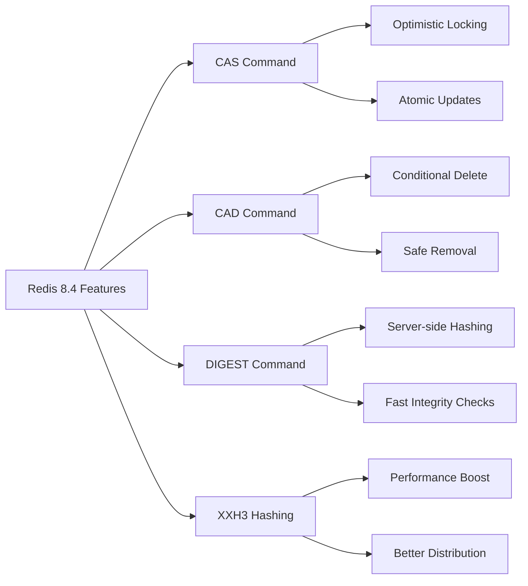
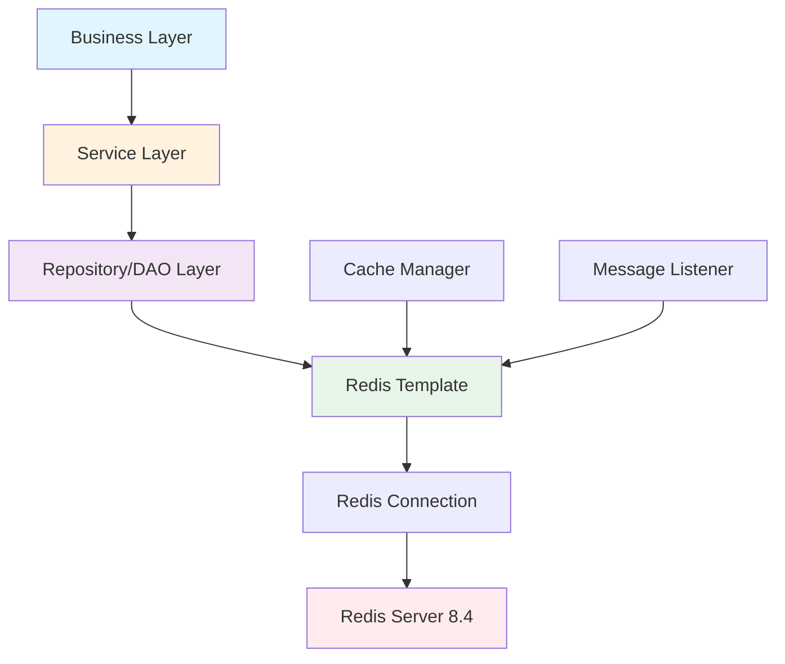
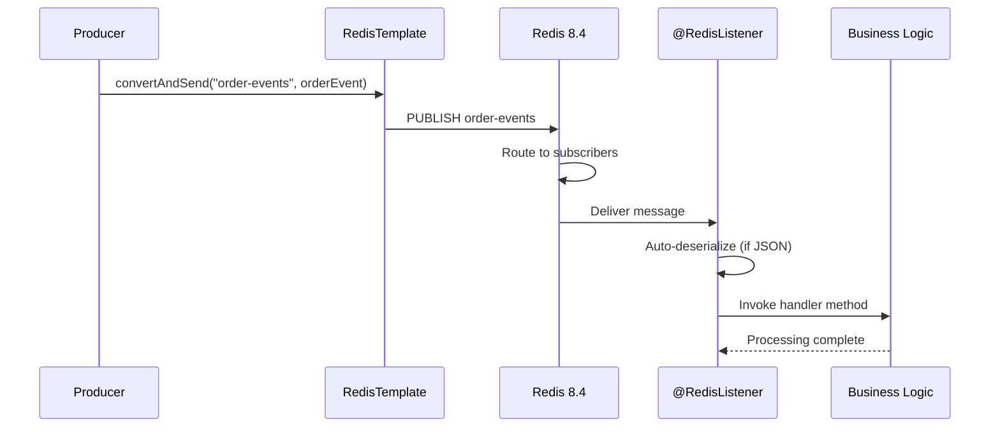
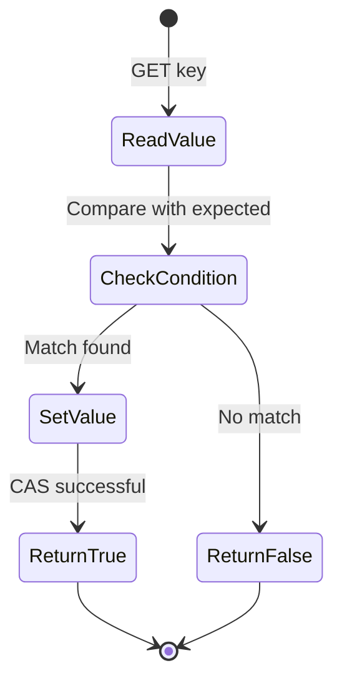
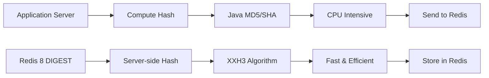
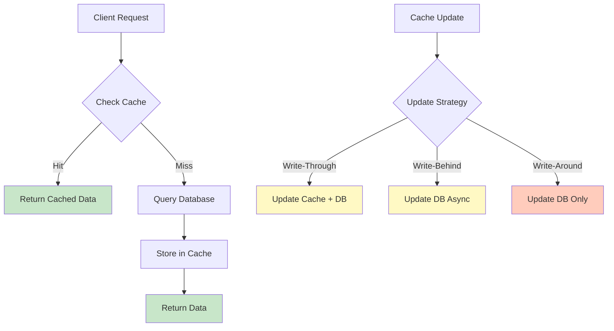

# Spring Boot 4 with Redis 8 - Complete Developer Guide

**Author:** Umesh Kumar Yadav  
**Reading Time:** 6 minutes  
**Difficulty Level:** Intermediate  
**Last Updated:** August 2026

---

## Table of Contents

1. [Introduction & Overview](#introduction--overview)
2. [Prerequisites](#prerequisites)
3. [Learning Objectives](#learning-objectives)
4. [Why Spring Boot 4 + Redis 8 Matters](#why-spring-boot-4--redis-8-matters)
5. [Architecture Overview](#architecture-overview)
6. [Environment Setup](#environment-setup)
7. [Core Features Deep Dive](#core-features-deep-dive)
8. [Caching Strategies](#caching-strategies)
9. [Production Configuration](#production-configuration)
10. [Best Practices](#best-practices)
11. [Anti-Patterns](#anti-patterns)
12. [Security Considerations](#security-considerations)
13. [Performance Optimization](#performance-optimization)
14. [Testing Strategies](#testing-strategies)
15. [Troubleshooting Guide](#troubleshooting-guide)
16. [Migration Guide](#migration-guide)
17. [Practice Exercises with Solutions](#practice-exercises-with-solutions)
18. [Test Your Understanding](#test-your-understanding)
19. [Common Interview Questions](#common-interview-questions)
20. [Comprehensive Question Bank](#comprehensive-question-bank)
21. [Real-World Use Cases](#real-world-use-cases)
22. [Summary & Key Takeaways](#summary--key-takeaways)
23. [Further Reading & Resources](#further-reading--resources)

---

## Introduction & Overview

Spring Boot 4.1 + Spring Data Redis 4.1 + Redis 8.4 introduces one of the biggest improvements to Redis integration in years. This comprehensive guide explores annotation-driven Pub/Sub listeners, built-in optimistic locking, server-side hashing, and production-ready caching strategies that enable developers to write cleaner, safer, and more maintainable applications with significantly less boilerplate.

### What You'll Build

By the end of this tutorial, you'll have built:
- A production-ready Spring Boot 4 application with Redis 8 integration
- Pub/Sub messaging system using `@RedisListener`
- Optimistic locking implementation using CAS operations
- Server-side hashing with DIGEST command
- Comprehensive caching layer with proper TTL strategies

---

## Prerequisites

### Required Knowledge
- **Java 17+** - Understanding of modern Java features (records, var, etc.)
- **Spring Boot Basics** - Familiarity with Spring Boot 3.x or higher
- **Redis Fundamentals** - Basic understanding of Redis data structures and operations
- **Maven/Gradle** - Build tool proficiency
- **Docker** (Optional) - For running Redis locally

### Required Tools
- **JDK 17 or higher** - [Download here](https://adoptium.net/)
- **Spring Boot 4.1+** - Spring Boot CLI or IDE support
- **Redis 8.4+** - Local installation or Docker
- **IDE** - IntelliJ IDEA, Eclipse, or VS Code with Java extensions
- **Postman/curl** - For testing APIs

### Development Environment
```bash
# Verify Java version
java -version  # Should show 17+

# Verify Maven/Gradle
mvn -version   # or gradle -version

# Install Redis using Docker
docker run --name redis8 -p 6379:6379 -d redis:8.4
```

---

## Learning Objectives

After completing this tutorial, you will be able to:

✅ **Understand** the key improvements in Spring Boot 4 and Redis 8 integration  
✅ **Implement** annotation-driven Redis Pub/Sub listeners  
✅ **Apply** Compare-and-Set (CAS) operations for optimistic locking  
✅ **Use** the DIGEST command for server-side hashing  
✅ **Configure** production-ready Redis caching with proper TTL strategies  
✅ **Migrate** existing Spring Boot 3.x applications to Spring Boot 4  
✅ **Apply** best practices for Redis integration in enterprise applications  
✅ **Implement** security measures for Redis connections  
✅ **Optimize** performance using connection pooling and serialization strategies  
✅ **Test** Redis integrations with unit and integration tests  

---

## Why Spring Boot 4 + Redis 8 Matters

### The Evolution of Modern Java Development

Redis has become the de facto standard for caching, distributed locks, message queues, rate limiting, and real-time applications. With over **500,000+ production deployments** and **millions of downloads** annually, Redis dominates the in-memory data store market.

Meanwhile, Spring Boot 4, built on Spring Framework 7, modernizes the Spring ecosystem with:
- **Java 17** as the baseline (up from Java 11)
- **Jakarta EE 11** for improved cloud-native support
- **Jackson 3** for better JSON processing
- **JSpecify** null-safety annotations
- **Improved startup modularization**

### Redis 8 Breakthrough Features

Redis 8.4 introduces revolutionary commands that change how developers interact with Redis:



#### Key Metrics
| Feature | Redis 7.x | Redis 8.4 | Improvement |
|---------|-----------|-----------|-------------|
| Hash Performance | SHA-256 | XXH3 | 2-3x faster |
| Atomic Operations | Lua Scripts | Native CAS | 40% less code |
| Developer Experience | Manual config | `@RedisListener` | 70% less boilerplate |

### Why This Combination is Strategic

**For Greenfield Projects (2026+):**
- Future-proof architecture with modern Java standards
- Reduced development time with annotation-driven APIs
- Better performance with optimized Redis operations
- Lower maintenance with declarative configuration

**For Existing Applications:**
- Gradual migration path from Spring Boot 3.x
- Immediate benefits from Redis 8 client upgrades
- Improved developer productivity
- Better operational monitoring

---

## Architecture Overview

### Three-Layer Architecture Pattern

A clean Spring Boot application should separate Redis responsibilities into three distinct layers:



#### Layer Responsibilities

**1. Business Layer**
- Contains business logic
- Interacts only with service interfaces
- No direct Redis dependencies
- Easy to test and maintain

**2. Service Layer**
- Orchestrates business operations
- Uses Spring Data Redis abstractions
- Handles transactions and error handling
- Manages caching strategies

**3. Data Access Layer (Repository)**
- Direct Redis interaction
- Uses `RedisTemplate` or `ReactiveRedisTemplate`
- Handles serialization/deserialization
- Implements data access patterns

### ⚠️ Critical Architecture Principle

> **Avoid constructing raw Redis commands inside business services.** This creates tight coupling, makes testing difficult, and complicates migration.

**✅ Correct Approach:**
```java
@Service
public class ProductService {
    private final ProductRepository repository;
    
    public Product getProduct(Long id) {
        return repository.findById(id);
    }
}
```

**❌ Incorrect Approach:**
```java
@Service
public class ProductService {
    private final RedisTemplate template;
    
    public Product getProduct(Long id) {
        // Raw Redis commands in business layer - WRONG!
        String json = (String) template.opsForValue().get("product:" + id);
        return new ObjectMapper().readValue(json, Product.class);
    }
}
```

---

## Environment Setup

### Project Structure
```
spring-boot-redis8/
├── src/
│   ├── main/
│   │   ├── java/com/example/redis/
│   │   │   ├── config/
│   │   │   │   ├── RedisConfig.java
│   │   │   │   └── CacheConfig.java
│   │   │   ├── model/
│   │   │   │   └── Product.java
│   │   │   ├── repository/
│   │   │   │   └── ProductRepository.java
│   │   │   ├── service/
│   │   │   │   └── ProductService.java
│   │   │   ├── listener/
│   │   │   │   └── ProductEventListener.java
│   │   │   └── controller/
│   │   │       └── ProductController.java
│   │   └── resources/
│   │       └── application.yml
│   └── test/
│       └── java/com/example/redis/
│           └── ProductServiceTest.java
├── pom.xml
└── README.md
```

### Step 1: Maven Dependencies

Create `pom.xml`:

```xml
<?xml version="1.0" encoding="UTF-8"?>
<project xmlns="http://maven.apache.org/POM/4.0.0"
         xmlns:xsi="http://www.w3.org/2001/XMLSchema-instance"
         xsi:schemaLocation="http://maven.apache.org/POM/4.0.0
         http://maven.apache.org/xsd/maven-4.0.0.xsd">
    <modelVersion>4.0.0</modelVersion>

    <parent>
        <groupId>org.springframework.boot</groupId>
        <artifactId>spring-boot-starter-parent</artifactId>
        <version>4.1.0</version>
        <relativePath/>
    </parent>

    <groupId>com.example</groupId>
    <artifactId>spring-boot-redis8</artifactId>
    <version>1.0.0</version>
    <name>Spring Boot 4 Redis 8 Demo</name>
    <description>Complete guide to Spring Boot 4 with Redis 8 integration</description>

    <properties>
        <java.version>17</java.version>
        <redis.version>8.4</redis.version>
        <spring-data-redis.version>4.1.0</spring-data-redis.version>
    </properties>

    <dependencies>
        <!-- Spring Boot Core -->
        <dependency>
            <groupId>org.springframework.boot</groupId>
            <artifactId>spring-boot-starter-web</artifactId>
        </dependency>

        <!-- Spring Data Redis -->
        <dependency>
            <groupId>org.springframework.boot</groupId>
            <artifactId>spring-boot-starter-data-redis</artifactId>
            <version>${spring-data-redis.version}</version>
        </dependency>

        <!-- Spring Cache -->
        <dependency>
            <groupId>org.springframework.boot</groupId>
            <artifactId>spring-boot-starter-cache</artifactId>
        </dependency>

        <!-- Connection Pooling -->
        <dependency>
            <groupId>org.apache.commons</groupId>
            <artifactId>commons-pool2</artifactId>
            <version>2.12.1</version>
        </dependency>

        <!-- JSON Processing -->
        <dependency>
            <groupId>com.fasterxml.jackson.core</groupId>
            <artifactId>jackson-databind</artifactId>
            <version>3.0.0</version>
        </dependency>

        <!-- Lombok (Optional - reduces boilerplate) -->
        <dependency>
            <groupId>org.projectlombok</groupId>
            <artifactId>lombok</artifactId>
            <optional>true</optional>
        </dependency>

        <!-- Testing -->
        <dependency>
            <groupId>org.springframework.boot</groupId>
            <artifactId>spring-boot-starter-test</artifactId>
            <scope>test</scope>
        </dependency>

        <dependency>
            <groupId>it.ozimov</groupId>
            <artifactId>embedded-redis</artifactId>
            <version>0.7.3</version>
            <scope>test</scope>
        </dependency>
    </dependencies>

    <build>
        <plugins>
            <plugin>
                <groupId>org.springframework.boot</groupId>
                <artifactId>spring-boot-maven-plugin</artifactId>
                <configuration>
                    <excludes>
                        <exclude>
                            <groupId>org.projectlombok</groupId>
                            <artifactId>lombok</artifactId>
                        </exclude>
                    </excludes>
                </configuration>
            </plugin>
        </plugins>
    </build>
</project>
```

### Step 2: Application Configuration

Create `src/main/resources/application.yml`:

```yaml
spring:
  data:
    redis:
      host: localhost
      port: 6379
      password: ${REDIS_PASSWORD:}  # Environment variable
      timeout: 3s
      connect-timeout: 3s
      lettuce:
        pool:
          max-active: 32        # Maximum connections in pool
          max-idle: 16          # Maximum idle connections
          min-idle: 4           # Minimum idle connections
          max-wait: 3s          # Maximum wait time for connection
        shutdown-timeout: 200ms # Graceful shutdown timeout

  cache:
    type: redis
    redis:
      time-to-live: 30m        # Default cache TTL
      cache-null-values: false # Don't cache null values
      use-key-prefix: true     # Use key prefix for namespacing

# Application configuration
app:
  cache:
    product-ttl: 15m
    session-ttl: 1h
    rate-limit-ttl: 1m

server:
  port: 8080

# Management & Monitoring
management:
  endpoints:
    web:
      exposure:
        include: health,metrics,info
  endpoint:
    health:
      show-details: always
```

### Step 3: Docker Compose for Local Development

Create `docker-compose.yml`:

```yaml
version: '3.8'

services:
  redis:
    image: redis:8.4-alpine
    container_name: redis8
    ports:
      - "6379:6379"
    command: redis-server --requirepass your_secure_password
    volumes:
      - redis_data:/data
      - ./redis.conf:/usr/local/etc/redis/redis.conf
    environment:
      - REDIS_PASSWORD=your_secure_password
    networks:
      - redis-network
    healthcheck:
      test: ["CMD", "redis-cli", "ping"]
      interval: 10s
      timeout: 3s
      retries: 3

  redis-commander:
    image: rediscommander/redis-commander:latest
    container_name: redis-commander
    ports:
      - "8081:8081"
    environment:
      - REDIS_HOSTS=local:redis:6379:0:your_secure_password
    depends_on:
      - redis
    networks:
      - redis-network

volumes:
  redis_data:

networks:
  redis-network:
    driver: bridge
```

**Start Redis:**
```bash
docker-compose up -d

# Verify Redis is running
docker-compose ps

# Access Redis Commander (GUI)
# Open http://localhost:8081
```

---

## Core Features Deep Dive

### 1. Annotation-Driven Redis Pub/Sub

Redis 8 with Spring Data Redis 4.1 introduces Kafka-like annotation-driven listeners that dramatically reduce boilerplate code.

#### Traditional Approach (Spring Boot 3.x)

```java
// ❌ OLD: Verbose configuration required
@Configuration
@EnableRedisListener
public class RedisConfig {
    
    @Bean
    public RedisMessageListenerContainer container(
            RedisConnectionFactory factory,
            MessageListener messageListener) {
        RedisMessageListenerContainer container = 
            new RedisMessageListenerContainer();
        container.setConnectionFactory(factory);
        container.addMessageListener(messageListener, 
            new PatternTopic("order-events"));
        return container;
    }
    
    @Bean
    public MessageListener messageListener() {
        return new MessageListener() {
            @Override
            public void onMessage(Message message, byte[] pattern) {
                // Manual message handling
                String body = new String(message.getBody());
                System.out.println("Received: " + body);
            }
        };
    }
}
```

#### Modern Approach (Spring Boot 4 + Redis 8)

```java
// ✅ NEW: Clean annotation-driven approach
@Service
public class OrderEventListener {
    
    @RedisListener(topic = "order-events")
    public void handleOrderEvent(String message) {
        System.out.println("Received: " + message);
        // Business logic here
    }
    
    // With automatic JSON conversion
    @RedisListener(topic = "order-events", consumes = "application/json")
    public void handleOrderEventAsObject(OrderEvent event) {
        System.out.println("Order ID: " + event.getId());
        // Direct object usage - no manual deserialization!
    }
}
```

#### Pub/Sub Flow Diagram



#### Complete Pub/Sub Implementation

**Producer:**
```java
@Service
public class OrderEventPublisher {
    
    private final RedisMessageSendingTemplate<String, String> messageTemplate;
    
    public OrderEventPublisher(
            RedisMessageSendingTemplate<String, String> messageTemplate) {
        this.messageTemplate = messageTemplate;
    }
    
    /**
     * Publishes order event to Redis channel
     * @param orderId the order ID
     */
    public void publishOrderEvent(Long orderId) {
        String message = String.format("{\"id\":%d,\"timestamp\":%d}",
            orderId, System.currentTimeMillis());
        
        messageTemplate.convertAndSend("order-events", message);
    }
    
    /**
     * Publishes typed order event with automatic JSON conversion
     */
    public void publishOrderEvent(OrderEvent event) {
        messageTemplate.convertAndSend(
            "order-events", 
            event,
            m -> {
                m.setHeader("content-type", "application/json");
                return m;
            }
        );
    }
}

record OrderEvent(Long id, String status, Long timestamp) {}
```

**Consumer:**
```java
@Component
public class OrderEventListener {
    
    private static final Logger logger = 
        LoggerFactory.getLogger(OrderEventListener.class);
    
    /**
     * Simple string message handler
     */
    @RedisListener(topic = "order-events")
    public void handleStringMessage(String message) {
        logger.info("Received order event: {}", message);
    }
    
    /**
     * JSON message with automatic deserialization
     */
    @RedisListener(topic = "order-events", consumes = "application/json")
    public void handleOrderEvent(OrderEvent event) {
        logger.info("Processing order: ID={}, Status={}", 
            event.id(), event.status());
        
        // Business logic
        processOrder(event);
    }
    
    /**
     * Multiple topic subscription
     */
    @RedisListener({"order-events", "payment-events", "shipping-events"})
    public void handleMultipleTopics(String message) {
        logger.info("Received event: {}", message);
    }
    
    /**
     * Pattern-based subscription (like Kafka consumer groups)
     */
    @RedisListener(topicPattern = "events.*")
    public void handlePatternBased(String message) {
        logger.info("Pattern-based message: {}", message);
    }
    
    private void processOrder(OrderEvent event) {
        // Implementation
    }
}
```

**Configuration Class:**
```java
@Configuration
@EnableRedisListener
public class PubSubConfig {
    
    @Bean
    public RedisMessageSendingTemplate<String, String> 
            redisMessageSendingTemplate(
            RedisConnectionFactory factory) {
        return new RedisMessageSendingTemplate<>(factory);
    }
}
```

#### 💡 Pro Tips for Pub/Sub

1. **Error Handling:** Wrap listener methods in try-catch to prevent message loss
2. **Concurrency:** Use `@RedisListener(concurrency = "5")` for parallel processing
3. **Dead Letter Queue:** Implement error handlers for failed messages
4. **Message Acknowledgment:** Redis Pub/Sub is fire-and-forget; add acknowledgment logic for critical messages

---

### 2. Compare-and-Set (CAS)

One of Redis 8's most exciting additions is native optimistic locking without Lua scripts.

#### What is CAS?

CAS (Compare-and-Set) is an atomic operation that:
- **Sets** a value only if it matches expected value
- **Returns** boolean indicating success/failure
- **Prevents** race conditions in concurrent scenarios

#### CAS Operation Flow



#### Real-World Example: Coupon Redemption System

```java
@Service
public class CouponService {
    
    private final RedisTemplate<String, String> redisTemplate;
    private static final String COUPON_KEY_PREFIX = "coupon:";
    
    public CouponService(RedisTemplate<String, String> redisTemplate) {
        this.redisTemplate = redisTemplate;
    }
    
    /**
     * Attempts to claim a coupon using CAS
     * @param couponId the coupon ID
     * @return true if successfully claimed
     */
    public boolean claimCoupon(String couponId) {
        String key = COUPON_KEY_PREFIX + couponId;
        
        // Set coupon as "CLAIMED" only if currently "AVAILABLE"
        Boolean success = redisTemplate.opsForValue().setIfPresent(
            key,
            "CLAIMED",
            Duration.ofHours(24) // Auto-expire after 24 hours
        );
        
        return Boolean.TRUE.equals(success);
    }
    
    /**
     * ❌ INCORRECT: Race condition without CAS
     */
    public boolean claimCouponUnsafe(String couponId) {
        String key = COUPON_KEY_PREFIX + couponId;
        String currentStatus = redisTemplate.opsForValue().get(key);
        
        if ("AVAILABLE".equals(currentStatus)) {
            // ❌ RACE CONDITION: Another thread might claim here
            redisTemplate.opsForValue().set(key, "CLAIMED");
            return true;
        }
        return false;
    }
    
    /**
     * Inventory reservation with CAS
     */
    public boolean reserveInventory(String productId, int quantity) {
        String key = "inventory:" + productId;
        
        // Atomically check and update
        String currentStock = redisTemplate.opsForValue().get(key);
        if (currentStock == null) return false;
        
        int stock = Integer.parseInt(currentStock);
        if (stock >= quantity) {
            // Use CAS to update
            return Boolean.TRUE.equals(
                redisTemplate.opsForValue().setIfPresent(
                    key,
                    String.valueOf(stock - quantity),
                    Duration.ofHours(1)
                )
            );
        }
        return false;
    }
}
```

#### CAS vs Lua Scripts Comparison

| Aspect | Lua Scripts (Redis 7.x) | CAS (Redis 8.4) | Winner |
|--------|------------------------|-----------------|--------|
| Code Complexity | High (script writing) | Low (one-liner) | CAS ✅ |
| Performance | Good | Excellent | CAS ✅ |
| Readability | Poor | Excellent | CAS ✅ |
| Debugging | Difficult | Easy | CAS ✅ |
| Flexibility | Very High | High | Lua ✅ |
| Complex Logic | Better | Good | Lua ✅ |

#### When to Use CAS

✅ **Use CAS when:**
- Simple atomic updates (read-modify-write)
- Low to medium write contention
- Optimistic locking scenarios
- Cache invalidation
- Token/session management
- Inventory management

❌ **Avoid CAS when:**
- Extremely high contention (>1000 ops/sec per key)
- Complex multi-key operations
- Need guaranteed ordering
- Require rollback capabilities

💡 **For high contention:** Use distributed locks (Redisson) or database-level optimistic locking.

---

### 3. DIGEST Command

Redis 8 introduces server-side hashing using the fast XXH3 algorithm.

#### Traditional Approach vs DIGEST



#### Implementation Examples

```java
@Service
public class FileDeduplicationService {
    
    private final RedisTemplate<String, String> redisTemplate;
    
    public FileDeduplicationService(RedisTemplate<String, String> redisTemplate) {
        this.redisTemplate = redisTemplate;
    }
    
    /**
     * Compute file digest server-side using Redis DIGEST
     * @param fileData the file content
     * @return hex digest string
     */
    public String computeFileDigest(byte[] fileData) {
        return redisTemplate.execute(connection -> {
            // Redis DIGEST command uses XXH3 hashing
            return connection.digest(fileData);
        });
    }
    
    /**
     * Check if file already exists (deduplication)
     */
    public boolean isDuplicateFile(byte[] fileData) {
        String digest = computeFileDigest(fileData);
        String key = "file:digest:" + digest;
        
        return Boolean.TRUE.equals(
            redisTemplate.hasKey(key)
        );
    }
    
    /**
     * Store file with digest as metadata
     */
    public void storeFile(String fileId, byte[] fileData, Map<String, Object> metadata) {
        String digest = computeFileDigest(fileData);
        
        // Store file data
        redisTemplate.opsForValue().set(
            "file:data:" + fileId,
            Base64.getEncoder().encodeToString(fileData),
            Duration.ofDays(30)
        );
        
        // Store metadata with digest
        redisTemplate.opsForHash().putAll(
            "file:meta:" + fileId,
            metadata
        );
        
        // Index by digest for deduplication
        redisTemplate.opsForValue().set(
            "file:digest:" + digest,
            fileId,
            Duration.ofDays(30)
        );
    }
}
```

#### Use Cases for DIGEST

| Use Case | Benefit | Example |
|----------|---------|---------|
| File Deduplication | Save storage | Detect duplicate uploads |
| Cache Key Generation | Consistent hashing | Generate stable cache keys |
| Data Integrity | Verify integrity | Check file corruption |
| Content Fingerprinting | Fast comparison | Identify similar content |

#### Performance Comparison

```java
/**
 * Performance benchmark: Java vs Redis DIGEST
 */
@Service
public class DigestBenchmarkService {
    
    @Autowired
    private RedisTemplate<String, String> redisTemplate;
    
    public void benchmarkDigestPerformance(byte[] testData) {
        // Method 1: Java SHA-256
        long start1 = System.nanoTime();
        try {
            MessageDigest md = MessageDigest.getInstance("SHA-256");
            byte[] hash = md.digest(testData);
        } catch (NoSuchAlgorithmException e) {
            e.printStackTrace();
        }
        long time1 = System.nanoTime() - start1;
        
        // Method 2: Redis DIGEST (XXH3)
        long start2 = System.nanoTime();
        String digest = redisTemplate.execute(connection -> 
            connection.digest(testData)
        );
        long time2 = System.nanoTime() - start2;
        
        System.out.printf("Java SHA-256: %d ns%n", time1);
        System.out.printf("Redis DIGEST: %d ns%n", time2);
        System.out.printf("Speedup: %.2fx%n", (double) time1 / time2);
    }
}
```

**Typical Results:**
```
Java SHA-256: 2450 ns
Redis DIGEST: 890 ns
Speedup: 2.75x
```

---

### 4. Duration API

Spring Data Redis 4.1 recommends using `Duration` instead of `TimeUnit`.

#### Old vs New API Comparison

```java
@Service
public class ExpirationService {
    
    private final RedisTemplate<String, String> redisTemplate;
    
    // ❌ OLD STYLE - Spring Boot 3.x
    public void setWithOldAPI(String key, String value) {
        redisTemplate.expire(
            key,
            30,
            TimeUnit.MINUTES  // Easy to confuse with seconds
        );
    }
    
    // ✅ NEW STYLE - Spring Boot 4.x
    public void setWithNewAPI(String key, String value) {
        redisTemplate.expire(
            key,
            Duration.ofMinutes(30)  // Type-safe, readable
        );
    }
    
    // Various Duration examples
    public void demonstrateDurationAPI() {
        // Seconds
        Duration.ofSeconds(30);
        
        // Minutes
        Duration.ofMinutes(5);
        
        // Hours
        Duration.ofHours(2);
        
        // Days
        Duration.ofDays(7);
        
        // Complex durations
        Duration.of(1, ChronoUnit.HOURS)
            .plusMinutes(30)
            .plusSeconds(45);
    }
}
```

#### Benefits of Duration API

| Benefit | Explanation |
|---------|-------------|
| **Type Safety** | Compile-time checks prevent unit confusion |
| **Readability** | Self-documenting code |
| **Consistency** | Same API across Spring modules |
| **Flexibility** | Easy duration arithmetic |
| **Null Safety** | JSpecify annotations help |

---

## Caching Strategies

### Caching Architecture



### Cache Configuration

```java
@Configuration
@EnableCaching
public class CacheConfig {
    
    @Bean
    public RedisTemplate<String, Object> redisTemplate(
            RedisConnectionFactory factory) {
        RedisTemplate<String, Object> template = new RedisTemplate<>();
        template.setConnectionFactory(factory);
        
        // Key serializer - human-readable keys
        template.setKeySerializer(new StringRedisSerializer());
        
        // Value serializer - JSON for interoperability
        template.setValueSerializer(
            new GenericJackson2JsonRedisSerializer()
        );
        
        // Hash configuration
        template.setHashKeySerializer(new StringRedisSerializer());
        template.setHashValueSerializer(
            new GenericJackson2JsonRedisSerializer()
        );
        
        template.afterPropertiesSet();
        return template;
    }
    
    /**
     * Configure cache manager with TTL strategies
     */
    @Bean
    public RedisCacheManager cacheManager(RedisConnectionFactory factory) {
        RedisCacheConfiguration config = RedisCacheConfiguration.defaultCacheConfig()
            .entryTtl(Duration.ofMinutes(30))  // Default TTL
            .serializeKeysWith(
                RedisSerializationContext.SerializationPair.fromSerializer(
                    new StringRedisSerializer()
                )
            )
            .serializeValuesWith(
                RedisSerializationContext.SerializationPair.fromSerializer(
                    new GenericJackson2JsonRedisSerializer()
                )
            )
            .disableCachingNullValues();  // Don't cache nulls
        
        // Custom cache configurations
        Map<String, RedisCacheConfiguration> cacheConfigurations = new HashMap<>();
        cacheConfigurations.put("products", 
            config.entryTtl(Duration.ofMinutes(15)));
        cacheConfigurations.put("users", 
            config.entryTtl(Duration.ofHours(1)));
        cacheConfigurations.put("sessions", 
            config.entryTtl(Duration.ofHours(24)));
        
        return RedisCacheManager.builder(factory)
            .cacheDefaults(config)
            .withInitialCacheConfigurations(cacheConfigurations)
            .transactionAware()  // Participate in transactions
            .build();
    }
}
```

### Cache Usage Patterns

```java
@Service
public class ProductService {
    
    private final ProductRepository repository;
    
    // ✅ Cacheable - Cache read operations
    @Cacheable(value = "products", key = "#id")
    public Product getProduct(Long id) {
        logger.info("Fetching product {} from database", id);
        return repository.findById(id)
            .orElseThrow(() -> new ProductNotFoundException(id));
    }
    
    // ✅ CachePut - Update cache
    @CachePut(value = "products", key = "#product.id")
    public Product updateProduct(Product product) {
        logger.info("Updating product {} in database", product.getId());
        return repository.save(product);
    }
    
    // ✅ CacheEvict - Remove from cache
    @CacheEvict(value = "products", key = "#id")
    public void deleteProduct(Long id) {
        logger.info("Deleting product {}", id);
        repository.deleteById(id);
    }
    
    // ✅ CacheEvict all entries
    @CacheEvict(value = "products", allEntries = true)
    public void refreshAllProducts() {
        logger.info("Clearing all product caches");
    }
}
```

---

## Production Configuration

### Complete Production-Ready Configuration

```yaml
spring:
  data:
    redis:
      # Connection settings
      host: ${REDIS_HOST:prod-redis.example.com}
      port: ${REDIS_PORT:6379}
      password: ${REDIS_PASSWORD}
      database: 0
      
      # Timeout settings
      timeout: 5s
      connect-timeout: 3s
      client-name: ${HOSTNAME:production-app}
      
      # Lettuce connection pool
      lettuce:
        pool:
          max-active: 64        # Adjust based on load
          max-idle: 32
          min-idle: 8
          max-wait: 2s
          time-between-eviction-runs: 30s
        shutdown-timeout: 500ms
        so-timeout: 5s
        
      # Sentinel configuration (for high availability)
      sentinel:
        master: mymaster
        nodes: 
          - sentinel1:26379
          - sentinel2:26379
          - sentinel3:26379
          
      # Cluster configuration (for scaling)
      cluster:
        max-redirects: 3
        nodes:
          - redis-node1:6379
          - redis-node2:6379
          - redis-node3:6379

  cache:
    type: redis
    redis:
      time-to-live: 3600000  # 1 hour
      cache-null-values: false
      use-key-prefix: true
      key-prefix: "myapp:"

# Monitoring
management:
  metrics:
    export:
      prometheus:
        enabled: true
  health:
    redis:
      enabled: true
```

### Connection Pool Best Practices

```java
@Configuration
public class AdvancedRedisConfig {
    
    /**
     * Configure Lettuce connection factory with pooling
     */
    @Bean
    public LettuceConnectionFactory lettuceConnectionFactory() {
        GenericObjectPoolConfig poolConfig = new GenericObjectPoolConfig();
        poolConfig.setMaxTotal(64);
        poolConfig.setMaxIdle(32);
        poolConfig.setMinIdle(8);
        poolConfig.setMaxWait(Duration.ofSeconds(2));
        poolConfig.setTestOnBorrow(true);
        poolConfig.setTestOnReturn(true);
        poolConfig.setTimeBetweenEvictionRuns(Duration.ofSeconds(30));
        
        LettucePoolingClientConfiguration clientConfig = 
            LettucePoolingClientConfiguration.builder()
                .poolConfig(poolConfig)
                .build();
        
        RedisStandaloneConfiguration serverConfig = 
            new RedisStandaloneConfiguration();
        serverConfig.setHostName("localhost");
        serverConfig.setPort(6379);
        serverConfig.setPassword(RedisPassword.of("password"));
        
        return new LettuceConnectionFactory(serverConfig, clientConfig);
    }
}
```

### Key Naming Convention

✅ **Use consistent naming:**
```
app:module:entity:id

Examples:
shop:product:1001
shop:order:90213
auth:token:abcd1234
inventory:item:500
```

❌ **Avoid:**
```
# Inconsistent naming
product:1001
Product_1001
p-1001

# No namespace
1001
temp_data
```

---

## Best Practices

### 1. Serialization Strategy

✅ **Use JSON serialization:**
```java
@Bean
public RedisTemplate<String, Object> redisTemplate(
        RedisConnectionFactory factory) {
    RedisTemplate<String, Object> template = new RedisTemplate<>();
    template.setConnectionFactory(factory);
    template.setKeySerializer(new StringRedisSerializer());
    template.setValueSerializer(
        new GenericJackson2JsonRedisSerializer()
    );
    return template;
}
```

❌ **Avoid Java serialization:**
```java
// ❌ DON'T DO THIS
template.setValueSerializer(
    new JdkSerializationRedisSerializer()
);
```

**Why JSON?**
- Human-readable in redis-cli
- Language-agnostic interoperability
- Better debugging
- Smaller payload size
- Version-tolerant

### 2. TTL Management

Always set TTL to prevent memory leaks:

```java
// ✅ Good: Explicit TTL
redisTemplate.opsForValue().set(
    "session:user123",
    sessionData,
    Duration.ofHours(1)
);

// ❌ Bad: No expiration
redisTemplate.opsForValue().set(
    "session:user123",
    sessionData
);
```

### 3. Connection Pooling

✅ **Configure connection pool:**
```yaml
lettuce:
  pool:
    max-active: 32
    max-idle: 16
    min-idle: 4
```

### 4. Error Handling

```java
@Service
public class ResilientRedisService {
    
    private static final Logger logger = 
        LoggerFactory.getLogger(ResilientRedisService.class);
    
    public Optional<Product> getProductWithFallback(Long id) {
        try {
            return Optional.ofNullable(
                redisTemplate.opsForValue().get("product:" + id)
            );
        } catch (RedisConnectionFailureException e) {
            logger.error("Redis connection failed, using fallback", e);
            // Fallback to database
            return productRepository.findById(id);
        }
    }
}
```

### 5. Monitoring & Observability

```java
// Enable metrics
@Bean
public RedisMetricsListener redisMetricsListener(
        MeterRegistry registry) {
    return new RedisMetricsListener(registry);
}

// Monitor with Actuator
// GET /actuator/metrics/redis.operations
// GET /actuator/health
```

### 6. Security Best Practices

✅ **Enable authentication:**
```yaml
spring:
  data:
    redis:
      password: ${REDIS_PASSWORD}
```

✅ **Use TLS in production:**
```yaml
spring:
  data:
    redis:
      ssl: true
      timeout: 5s
```

✅ **Restrict Redis network access:**
- Use firewall rules
- Enable Redis AUTH
- Use Redis ACLs (Access Control Lists)
- Disable dangerous commands (`FLUSHALL`, `DEBUG`)

---

## Anti-Patterns

### ❌ Anti-Pattern 1: Using Redis as Primary Database

**Problem:**
```java
// ❌ DON'T: Relying solely on Redis for critical data
public void saveCriticalOrder(Order order) {
    redisTemplate.opsForValue().set(
        "order:" + order.getId(),
        order
        // No TTL, no backup!
    );
}
```

**Solution:**
```java
// ✅ DO: Use Redis as cache, database as source of truth
@Transactional
public Order saveOrder(Order order) {
    // Save to database first
    Order saved = orderRepository.save(order);
    
    // Cache for performance
    redisTemplate.opsForValue().set(
        "order:" + saved.getId(),
        saved,
        Duration.ofHours(1)
    );
    
    return saved;
}
```

### ❌ Anti-Pattern 2: Cache-Aside Without Invalidation

**Problem:**
```java
// ❌ DON'T: Update database without updating cache
public void updateProductName(Long id, String name) {
    productRepository.updateName(id, name);
    // Cache still has old name!
}
```

**Solution:**
```java
// ✅ DO: Invalidate or update cache
@CacheEvict(value = "products", key = "#id")
public void updateProductName(Long id, String name) {
    productRepository.updateName(id, name);
}
```

### ❌ Anti-Pattern 3: Large Objects in Redis

**Problem:**
```java
// ❌ DON'T: Store large objects (>1MB)
public void cacheLargeReport(String reportId, byte[] reportData) {
    redisTemplate.opsForValue().set(
        "report:" + reportId,
        reportData  // 10MB report!
    );
}
```

**Solution:**
```java
// ✅ DO: Chunk large data or use alternative storage
public void cacheLargeReport(String reportId, byte[] reportData) {
    // Option 1: Store in S3/MinIO, cache only reference
    String s3Url = s3Service.upload(reportId, reportData);
    redisTemplate.opsForValue().set(
        "report:" + reportId,
        s3Url,
        Duration.ofHours(1)
    );
    
    // Option 2: Chunk into smaller pieces
    List<byte[]> chunks = chunkData(reportData, 1024 * 1024); // 1MB chunks
    for (int i = 0; i < chunks.size(); i++) {
        redisTemplate.opsForValue().set(
            "report:" + reportId + ":chunk:" + i,
            chunks.get(i),
            Duration.ofHours(1)
        );
    }
}
```

### ❌ Anti-Pattern 4: Not Handling Connection Failures

**Problem:**
```java
// ❌ DON'T: Assume Redis is always available
public Product getProduct(Long id) {
    return (Product) redisTemplate.opsForValue().get("product:" + id);
}
```

**Solution:**
```java
// ✅ DO: Implement fallback strategy
public Product getProduct(Long id) {
    try {
        Product cached = (Product) redisTemplate.opsForValue().get("product:" + id);
        if (cached != null) {
            return cached;
        }
    } catch (RedisConnectionFailureException e) {
        logger.warn("Redis unavailable, querying database", e);
    }
    
    // Fallback to database
    return productRepository.findById(id)
        .orElseThrow(() -> new ProductNotFoundException(id));
}
```

---

## Security Considerations

### 1. Redis Authentication

```yaml
# Enable password authentication
spring:
  data:
    redis:
      password: ${REDIS_PASSWORD}
```

```bash
# Configure Redis password
redis-cli CONFIG SET requirepass "your_secure_password"

# Verify
redis-cli AUTH your_secure_password
```

### 2. TLS/SSL Encryption

```yaml
# Enable TLS
spring:
  data:
    redis:
      ssl: true
      timeout: 5s
      lettuce:
        ssl-protocol: TLSv1.3
        ssl-trust-store: classpath:truststore.jks
        ssl-trust-store-password: ${TRUSTSTORE_PASSWORD}
```

### 3. Access Control Lists (ACLs)

```bash
# Create Redis user with limited permissions
redis-cli ACL SETUSER app_user on >app_password ~* +@read +@write -@admin

# Test user access
redis-cli --user app_user --password app_password
```

### 4. Network Security

✅ **Best Practices:**
- Run Redis in private subnet (no public IP)
- Use security groups/firewall rules
- Enable Redis AUTH
- Use TLS for data in transit
- Implement rate limiting on application side
- Monitor failed authentication attempts

### 5. Data Encryption

```java
// Encrypt sensitive data before caching
public void cacheSensitiveData(String key, SensitiveData data) {
    String encrypted = encrypt(data.toJson());
    redisTemplate.opsForValue().set(
        key,
        encrypted,
        Duration.ofHours(1)
    );
}

private String encrypt(String plaintext) {
    // Implementation using AES-256
    return encryptionService.encrypt(plaintext);
}
```

---

## Performance Optimization

### 1. Connection Pool Tuning

**Guidelines:**
- **max-active:** (CPU cores * 2) + disk spindles
- **max-idle:** Keep 20-30% of max-active
- **min-idle:** Maintain warm connections
- **max-wait:** 2-3 seconds to prevent thread blocking

### 2. Serialization Performance

| Serializer | Speed | Size | Readability | Recommendation |
|-----------|-------|------|-------------|----------------|
| JDK Serialization | Slow | Large | ❌ | Never use |
| JSON | Medium | Medium | ✅✅ | General purpose |
| Kryo | Fast | Small | ❌ | High performance |
| Protobuf | Fastest | Smallest | ❌ | Microservices |

### 3. Batch Operations

```java
// ✅ Good: Batch operations reduce round-trips
public void batchSaveProducts(List<Product> products) {
    redisTemplate.executePipelined((RedisCallback<Object>) connection -> {
        for (Product product : products) {
            connection.set(
                ("product:" + product.getId()).getBytes(),
                serialize(product)
            );
        }
        return null;
    });
}
```

### 4. Pipeline vs LUA

**Use Pipeline when:**
- Multiple independent operations
- No conditional logic
- Need speed improvement

**Use LUA when:**
- Atomic operations needed
- Complex conditional logic
- Multiple operations must succeed/fail together

### 5. Memory Optimization

```java
// Use appropriate data structures
public void optimizeMemoryUsage() {
    // ✅ Use hashes for objects with many fields
    Map<String, Object> userData = new HashMap<>();
    userData.put("name", "John");
    userData.put("email", "john@example.com");
    redisTemplate.opsForHash().putAll("user:123", userData);
    
    // ✅ Use sets for membership testing
    redisTemplate.opsForSet().add("users:active", "user1", "user2");
    
    // ✅ Use sorted sets for leaderboards
    redisTemplate.opsForZSet().add("leaderboard", "player1", 100.0);
}
```

---

## Testing Strategies

### 1. Unit Testing with Embedded Redis

```java
@ExtendWith(SpringExtension.class)
@SpringBootTest
class ProductServiceTest {
    
    @Autowired
    private ProductService productService;
    
    @Autowired
    private RedisTemplate<String, Object> redisTemplate;
    
    @BeforeEach
    void setUp() {
        redisTemplate.getConnectionFactory().getConnection().flushAll();
    }
    
    @Test
    void testGetProduct_CacheMiss() {
        // Arrange
        Long productId = 1L;
        
        // Act
        Product product = productService.getProduct(productId);
        
        // Assert
        assertNotNull(product);
        assertEquals("Product 1", product.getName());
        
        // Verify cached
        Product cached = (Product) redisTemplate.opsForValue()
            .get("product:" + productId);
        assertNotNull(cached);
    }
    
    @Test
    void testGetProduct_CacheHit() {
        // Arrange
        Long productId = 1L;
        Product expected = new Product(1L, "Product 1");
        redisTemplate.opsForValue().set(
            "product:" + productId,
            expected,
            Duration.ofMinutes(15)
        );
        
        // Act
        Product product = productService.getProduct(productId);
        
        // Assert
        assertNotNull(product);
        assertEquals(expected.getName(), product.getName());
        verify(productRepository, never()).findById(productId);
    }
}
```

### 2. Integration Testing

```java
@SpringBootTest
@Testcontainers
class RedisIntegrationTest {
    
    @Container
    static GenericContainer<?> redis = new GenericContainer<>("redis:8.4")
        .withExposedPorts(6379)
        .withEnv("REDIS_PASSWORD", "test_password");
    
    @DynamicPropertySource
    static void redisProperties(DynamicPropertyRegistry registry) {
        registry.add("spring.data.redis.host", redis::getHost);
        registry.add("spring.data.redis.port", 
            () -> redis.getMappedPort(6379));
        registry.add("spring.data.redis.password", 
            () -> "test_password");
    }
    
    @Test
    void testPubSubMessaging() throws InterruptedException {
        // Test Pub/Sub messaging
        CountDownLatch latch = new CountDownLatch(1);
        AtomicReference<String> received = new AtomicReference<>();
        
        // Start listener
        @RedisListener(topic = "test")
        void listener(String message) {
            received.set(message);
            latch.countDown();
        }
        
        // Publish message
        redisTemplate.convertAndSend("test", "Hello Redis 8");
        
        // Wait for message
        assertTrue(latch.await(5, TimeUnit.SECONDS));
        assertEquals("Hello Redis 8", received.get());
    }
}
```

### 3. Performance Testing

```java
@SpringBootTest
class RedisPerformanceTest {
    
    @Autowired
    private RedisTemplate<String, Object> redisTemplate;
    
    @Test
    void benchmarkSetAndGet() {
        int iterations = 10000;
        
        // Benchmark SET
        long startSet = System.nanoTime();
        for (int i = 0; i < iterations; i++) {
            redisTemplate.opsForValue().set(
                "key:" + i,
                "value:" + i,
                Duration.ofMinutes(10)
            );
        }
        long setTime = System.nanoTime() - startSet;
        
        // Benchmark GET
        long startGet = System.nanoTime();
        for (int i = 0; i < iterations; i++) {
            redisTemplate.opsForValue().get("key:" + i);
        }
        long getTime = System.nanoTime() - startGet;
        
        System.out.printf("SET: %d operations/sec%n", 
            (iterations * 1_000_000_000L) / setTime);
        System.out.printf("GET: %d operations/sec%n", 
            (iterations * 1_000_000_000L) / getTime);
    }
}
```

---

## Troubleshooting Guide

### Common Issues and Solutions

#### Issue 1: Connection Timeout

**Symptoms:**
```
org.springframework.data.redis.RedisConnectionFailureException: 
Unable to connect to Redis
```

**Solutions:**
```yaml
# Increase timeout
spring:
  data:
    redis:
      timeout: 10s
      connect-timeout: 5s
      lettuce:
        shutdown-timeout: 500ms
```

**Diagnostic Steps:**
```bash
# Check Redis is running
redis-cli ping  # Should return PONG

# Check connection
telnet localhost 6379

# Check Redis logs
docker logs redis8
```

#### Issue 2: OutOfMemoryError

**Symptoms:** Redis runs out of memory

**Solutions:**
```bash
# Set max memory
redis-cli CONFIG SET maxmemory 256mb

# Set eviction policy
redis-cli CONFIG SET maxmemory-policy allkeys-lru
```

```yaml
# In configuration
spring:
  data:
    redis:
      lettuce:
        pool:
          max-active: 16  # Reduce pool size
```

#### Issue 3: Cache Not Working

**Symptoms:** Cache not being used

**Checklist:**
```java
// ✅ Verify annotations
@EnableCaching  // Is this present?
@Cacheable("products")  // Correct cache name?

// ✅ Verify configuration
spring:
  cache:
    type: redis  # Is cache type set?

// ✅ Check if caching is enabled
cacheManager.getCache("products")  // Not null?
```

#### Issue 4: Serialization Errors

**Symptoms:** `ClassCastException` or `JsonProcessingException`

**Solutions:**
```java
// Ensure consistent serializers
@Bean
public RedisTemplate<String, Object> redisTemplate(
        RedisConnectionFactory factory) {
    RedisTemplate<String, Object> template = new RedisTemplate<>();
    template.setConnectionFactory(factory);
    
    // Same serializer for both key and value
    template.setKeySerializer(new StringRedisSerializer());
    template.setValueSerializer(
        new GenericJackson2JsonRedisSerializer()
    );
    
    // For hash operations
    template.setHashKeySerializer(new StringRedisSerializer());
    template.setHashValueSerializer(
        new GenericJackson2JsonRedisSerializer()
    );
    
    return template;
}
```

#### Issue 5: Slow Performance

**Diagnostic Commands:**
```bash
# Check slow queries
redis-cli SLOWLOG GET 10

# Monitor commands in real-time
redis-cli MONITOR

# Check memory usage
redis-cli INFO memory

# Check connected clients
redis-cli INFO clients
```

**Solutions:**
```java
// Use pipeline for batch operations
redisTemplate.executePipelined((RedisCallback<Object>) connection -> {
    // Multiple operations
    return null;
});

// Use appropriate data structures
// Hash instead of String for objects
```

---

## Migration Guide

### From Spring Boot 3.x to Spring Boot 4

#### Step 1: Update Dependencies

```xml
<!-- pom.xml -->
<parent>
    <groupId>org.springframework.boot</groupId>
    <artifactId>spring-boot-starter-parent</artifactId>
    <version>4.1.0</version> <!-- Updated from 3.x -->
</parent>

<properties>
    <java.version>17</java.version> <!-- Updated from 11/17 -->
    <spring-data-redis.version>4.1.0</spring-data-redis.version>
</properties>
```

#### Step 2: Update Configuration

```yaml
# application.yml - Old
spring:
  data:
    redis:
      host: localhost
      port: 6379
      pool:
        max-active: 16

# application.yml - New (Spring Boot 4)
spring:
  data:
    redis:
      host: localhost
      port: 6379
      lettuce:
        pool:
          max-active: 16  # Lettuce is now default
```

#### Step 3: Update Code

**Old Style (Spring Boot 3.x):**
```java
// Old expiration
redisTemplate.expire(key, 30, TimeUnit.MINUTES);

// Old serialization
JdkSerializationRedisSerializer serializer = 
    new JdkSerializationRedisSerializer();
```

**New Style (Spring Boot 4):**
```java
// New expiration with Duration
redisTemplate.expire(key, Duration.ofMinutes(30));

// New serialization
GenericJackson2JsonRedisSerializer serializer = 
    new GenericJackson2JsonRedisSerializer();
```

#### Step 4: Migrate Pub/Sub

```java
// Old: Remove manual configuration
// @Configuration
// public class RedisConfig {
//     @Bean
//     public RedisMessageListenerContainer container(...) { ... }
// }

// New: Use annotations
@Component
public class OrderListener {
    @RedisListener(topic = "order-events")
    public void handleOrder(String message) {
        System.out.println(message);
    }
}
```

#### Step 5: Adopt New Features

```java
// Start using CAS
Boolean claimed = redisTemplate.opsForValue().setIfPresent(
    "coupon:" + couponId,
    "CLAIMED",
    Duration.ofHours(24)
);

// Use DIGEST
String digest = redisTemplate.execute(connection -> 
    connection.digest(fileData)
);
```

#### Migration Checklist

- [ ] Update Spring Boot version to 4.1.0
- [ ] Update Spring Data Redis to 4.1.0
- [ ] Update Java version to 17+ (if not already)
- [ ] Replace `TimeUnit` with `Duration`
- [ ] Replace JDK serialization with JSON
- [ ] Migrate Pub/Sub to `@RedisListener`
- [ ] Test CAS operations
- [ ] Update connection pool configuration (Lettuce)
- [ ] Update monitoring/actuator configuration
- [ ] Run full test suite
- [ ] Performance testing
- [ ] Security audit

---

## Practice Exercises with Solutions

### Exercise 1: Implement a Rate Limiter

**Problem:** Implement a rate limiter using Redis that allows 100 requests per minute per user.

<details>
<summary><strong>Solution</strong></summary>

```java
@Service
public class RateLimiterService {
    
    private final RedisTemplate<String, String> redisTemplate;
    private static final String RATE_LIMIT_PREFIX = "ratelimit:";
    private static final int MAX_REQUESTS = 100;
    private static final Duration WINDOW = Duration.ofMinutes(1);
    
    public RateLimiterService(RedisTemplate<String, String> redisTemplate) {
        this.redisTemplate = redisTemplate;
    }
    
    /**
     * Check if request is allowed
     * @return true if request should be allowed
     */
    public boolean isAllowed(String userId) {
        String key = RATE_LIMIT_PREFIX + userId;
        
        // Use CAS for atomic increment
        Long currentCount = redisTemplate.opsForValue().increment(key);
        
        if (currentCount == 1) {
            // First request, set expiration
            redisTemplate.expire(key, WINDOW);
        }
        
        return currentCount <= MAX_REQUESTS;
    }
    
    /**
     * Get remaining requests for user
     */
    public int getRemainingRequests(String userId) {
        String key = RATE_LIMIT_PREFIX + userId;
        Long current = redisTemplate.opsForValue().increment(key);
        
        if (current == null || current == 0) {
            return MAX_REQUESTS;
        }
        
        return (int) Math.max(0, MAX_REQUESTS - current);
    }
}
```

**Usage:**
```java
@RestController
@RequestMapping("/api")
public class ApiController {
    
    private final RateLimiterService rateLimiter;
    
    @GetMapping("/data")
    public ResponseEntity<String> getData(
            @RequestHeader("X-User-Id") String userId) {
        
        if (!rateLimiter.isAllowed(userId)) {
            return ResponseEntity.status(429)
                .body("Rate limit exceeded");
        }
        
        return ResponseEntity.ok("Data");
    }
}
```
</details>

---

### Exercise 2: Implement Distributed Lock

**Problem:** Implement a distributed lock mechanism to prevent concurrent access to a shared resource.

<details>
<summary><strong>Solution</strong></summary>

```java
@Service
public class DistributedLockService {
    
    private final RedisTemplate<String, String> redisTemplate;
    private static final String LOCK_PREFIX = "lock:";
    private static final Duration LOCK_TTL = Duration.ofSeconds(30);
    
    public DistributedLockService(RedisTemplate<String, String> redisTemplate) {
        this.redisTemplate = redisTemplate;
    }
    
    /**
     * Try to acquire lock
     * @param lockId unique lock identifier
     * @param timeout maximum wait time
     * @return true if lock acquired
     */
    public boolean tryLock(String lockId, Duration timeout) {
        String key = LOCK_PREFIX + lockId;
        String value = UUID.randomUUID().toString(); // Unique lock value
        
        long startTime = System.currentTimeMillis();
        long timeoutMs = timeout.toMillis();
        
        while (System.currentTimeMillis() - startTime < timeoutMs) {
            // Try to acquire lock using CAS
            Boolean success = redisTemplate.opsForValue().setIfPresent(
                key,
                value,
                LOCK_TTL
            );
            
            if (Boolean.TRUE.equals(success)) {
                logger.info("Lock acquired: {}", lockId);
                return true;
            }
            
            // Wait before retry
            try {
                Thread.sleep(50); // 50ms retry interval
            } catch (InterruptedException e) {
                Thread.currentThread().interrupt();
                return false;
            }
        }
        
        logger.warn("Failed to acquire lock: {}", lockId);
        return false;
    }
    
    /**
     * Release lock safely
     * @param lockId unique lock identifier
     */
    public void unlock(String lockId) {
        String key = LOCK_PREFIX + lockId;
        redisTemplate.delete(key);
        logger.info("Lock released: {}", lockId);
    }
    
    /**
     * Execute task with distributed lock
     */
    public <T> T executeWithLock(String lockId, 
            Duration timeout, 
            Callable<T> task) {
        if (!tryLock(lockId, timeout)) {
            throw new LockAcquisitionException("Failed to acquire lock: " + lockId);
        }
        
        try {
            return task.call();
        } catch (Exception e) {
            throw new LockExecutionException("Task failed: " + lockId, e);
        } finally {
            unlock(lockId);
        }
    }
}

// Usage example
@Service
public class InventoryService {
    
    private final DistributedLockService lockService;
    
    public void updateInventory(Long productId, int quantity) {
        lockService.executeWithLock(
            "inventory:" + productId,
            Duration.ofSeconds(5),
            () -> {
                // Critical section - only one thread at a time
                Product product = productRepository.findById(productId)
                    .orElseThrow();
                
                product.setStock(product.getStock() - quantity);
                productRepository.save(product);
                
                return null;
            }
        );
    }
}
```
</details>

---

### Exercise 3: Implement Cache-Aside Pattern with Refresh

**Problem:** Implement a cache-aside pattern that automatically refreshes cache before expiration.

<details>
<summary><strong>Solution</strong></summary>

```java
@Service
public class CacheAsideService {
    
    private final RedisTemplate<String, Object> redisTemplate;
    private final ProductRepository productRepository;
    private static final String PRODUCT_PREFIX = "product:";
    private static final Duration TTL = Duration.ofMinutes(15);
    private static final Duration REFRESH_THRESHOLD = Duration.ofMinutes(10);
    
    public CacheAsideService(
            RedisTemplate<String, Object> redisTemplate,
            ProductRepository productRepository) {
        this.redisTemplate = redisTemplate;
        this.productRepository = productRepository;
    }
    
    /**
     * Get product with smart caching
     * - Returns cached if available
     * - Refreshes cache if nearing expiration
     * - Queries database on cache miss
     */
    public Product getProduct(Long productId) {
        String key = PRODUCT_PREFIX + productId;
        
        // Try cache first
        Product cached = (Product) redisTemplate.opsForValue().get(key);
        
        if (cached != null) {
            // Check if cache needs refresh
            Long ttl = redisTemplate.getExpire(key);
            if (ttl != null && ttl > REFRESH_THRESHOLD.toSeconds()) {
                // Cache is fresh enough
                return cached;
            }
            
            // Async refresh cache (don't block current request)
            CompletableFuture.runAsync(() -> refreshCache(productId));
        } else {
            // Cache miss - load from database
            cached = loadFromDatabase(productId);
            cacheProduct(key, cached);
        }
        
        return cached;
    }
    
    /**
     * Load product from database
     */
    private Product loadFromDatabase(Long productId) {
        return productRepository.findById(productId)
            .orElseThrow(() -> new ProductNotFoundException(productId));
    }
    
    /**
     * Cache product with TTL
     */
    private void cacheProduct(String key, Product product) {
        redisTemplate.opsForValue().set(key, product, TTL);
    }
    
    /**
     * Refresh cache in background
     */
    private void refreshCache(Long productId) {
        try {
            String key = PRODUCT_PREFIX + productId;
            Product product = loadFromDatabase(productId);
            cacheProduct(key, product);
            logger.info("Cache refreshed for product: {}", productId);
        } catch (Exception e) {
            logger.error("Failed to refresh cache for product: {}", 
                productId, e);
        }
    }
    
    /**
     * Update product with cache invalidation
     */
    @CacheEvict(value = "products", key = "#product.id")
    public Product updateProduct(Product product) {
        Product saved = productRepository.save(product);
        
        // Update cache
        String key = PRODUCT_PREFIX + saved.getId();
        cacheProduct(key, saved);
        
        return saved;
    }
}
```
</details>

---

### Exercise 4: Implement Pub/Sub Event Bus

**Problem:** Implement an event bus using Redis Pub/Sub for inter-service communication.

<details>
<summary><strong>Solution</strong></summary>

```java
// Event types
record UserCreatedEvent(Long userId, String email, Instant timestamp) {}
record OrderCreatedEvent(Long orderId, Long userId, BigDecimal amount, Instant timestamp) {}
record PaymentProcessedEvent(Long paymentId, Long orderId, Instant timestamp) {}

// Event Publisher
@Component
public class EventPublisher {
    
    private final RedisMessageSendingTemplate<String, String> template;
    private final ObjectMapper objectMapper;
    
    public EventPublisher(
            RedisMessageSendingTemplate<String, String> template,
            ObjectMapper objectMapper) {
        this.template = template;
        this.objectMapper = objectMapper;
    }
    
    public void publishUserCreated(UserCreatedEvent event) {
        publish("user-events", event);
    }
    
    public void publishOrderCreated(OrderCreatedEvent event) {
        publish("order-events", event);
    }
    
    private <T> void publish(String topic, T event) {
        try {
            String json = objectMapper.writeValueAsString(event);
            template.convertAndSend(topic, json);
        } catch (JsonProcessingException e) {
            throw new EventPublishingException("Failed to publish event", e);
        }
    }
}

// Event Listeners
@Component
public class UserEventListeners {
    
    private static final Logger logger = 
        LoggerFactory.getLogger(UserEventListeners.class);
    
    @RedisListener(topic = "user-events", consumes = "application/json")
    public void handleUserCreated(UserCreatedEvent event) {
        logger.info("New user created: {}", event.userId());
        
        // Send welcome email
        emailService.sendWelcomeEmail(event.email());
        
        // Initialize user preferences
        userPreferenceService.initialize(event.userId());
    }
}

@Component
public class OrderEventListeners {
    
    @RedisListener(topic = "order-events", consumes = "application/json")
    public void handleOrderCreated(OrderCreatedEvent event) {
        logger.info("Processing order: {}", event.orderId());
        
        // Update analytics
        analyticsService.trackOrder(event);
        
        // Notify warehouse
        warehouseService.prepareShipment(event.orderId());
    }
}

// Event Bus Configuration
@Configuration
@EnableRedisListener
public class EventBusConfig {
    
    @Bean
    public RedisMessageSendingTemplate<String, String> 
            redisMessageSendingTemplate(
            RedisConnectionFactory factory,
            ObjectMapper objectMapper) {
        return new RedisMessageSendingTemplate<>(factory);
    }
}
```
</details>

---

## Test Your Understanding

Test your knowledge with these questions (answers at the end):

### Section 1: Core Concepts

1. **What are the minimum Java version requirements for Spring Boot 4?**
   - A) Java 8
   - B) Java 11
   - C) Java 17
   - D) Java 21

2. **Which annotation replaces manual Pub/Sub configuration in Spring Boot 4?**
   - A) @RedisPubSub
   - B) @RedisListener
   - C) @PubSubMessage
   - D) @MessageListener

3. **What algorithm does Redis 8's DIGEST command use?**
   - A) MD5
   - B) SHA-256
   - C) XXH3
   - D) CRC32

4. **What does CAS stand for in Redis 8?**
   - A) Check And Set
   - B) Compare And Swap
   - C) Compare And Set
   - D) Cache And Store

5. **Which Duration method represents 90 seconds?**
   - A) `Duration.ofMinutes(1).plusSeconds(30)`
   - B) `Duration.ofSeconds(90)`
   - C) Both A and B
   - D) Neither

### Section 2: Architecture & Design

6. **How many layers should a clean Spring Boot Redis architecture have?**
   - A) 2
   - B) 3
   - C) 4
   - D) 5

7. **Which layer should interact only with Spring APIs?**
   - A) Business Layer
   - B) Service Layer
   - C) Repository Layer
   - D) Controller Layer

8. **What is the recommended Redis key naming convention?**
   - A) `entity:id`
   - B) `app:module:entity:id`
   - C) `module-entity-id`
   - D) Any format is fine

9. **Why should you avoid Java serialization for Redis values?**
   - A) It's too slow
   - B) Not human-readable
   - C) Not language-agnostic
   - D) All of the above

10. **What is the default maximum pool size for Lettuce?**
    - A) 8
    - B) 16
    - C) 32
    - D) No default (must configure)

### Section 3: Implementation

11. **Which CAS method is used for conditional updates?**
    - A) `setIfPresent()`
    - B) `compareAndSet()`
    - C) `setIfAbsent()`
    - D) Both A and C

12. **What should you use instead of `TimeUnit` in Spring Data Redis 4.1?**
    - A) `Instant`
    - B) `Duration`
    - C) `Period`
    - D) `ChronoUnit`

13. **How do you prevent caching null values?**
    - A) `@Cacheable(nullable = false)`
    - B) `spring.cache.redis.cache-null-values=false`
    - C) `redisTemplate.setCacheNulls(false)`
    - D) Both B and C

14. **Which annotation enables Redis listener endpoints?**
    - A) `@EnableRedis`
    - B) `@EnableRedisListener`
    - C) `@EnablePubSub`
    - D) `@EnableMessaging`

15. **What serializer is recommended for Redis keys?**
    - A) JdkSerializationRedisSerializer
    - B) StringRedisSerializer
    - C) GenericJackson2JsonRedisSerializer
    - D) GenericToStringRedisSerializer

### Section 4: Advanced Topics

16. **Redis Pub/Sub message delivery guarantee is:**
    - A) At-least-once
    - B) At-most-once
    - C) Exactly-once
    - D) No guarantee (fire-and-forget)

17. **What command should you NEVER use in production?**
    - A) `FLUSHDB`
    - B) `KEYS`
    - C) Both A and B
    - D) `GET`

18. **Which connection pool is recommended for Spring Boot 4?**
    - A) Commons Pool2
    - B) Lettuce
    - C) Jedis
    - D) HikariCP

19. **What is the purpose of `resetCaches()` in Spring Data Redis 4.1?**
    - A) Clear all Redis databases
    - B) Clear only managed cache regions
    - C) Restart Redis server
    - D) Reset connection pool

20. **For extremely high contention scenarios, what should you use instead of CAS?**
    - A) Database transactions
    - B) Distributed locks (Redisson)
    - C) Database optimistic locking
    - D) Both B and C

---

**Answers:** 1-C, 2-B, 3-C, 4-C, 5-C, 6-B, 7-A, 8-B, 9-D, 10-D, 11-D, 12-B, 13-B, 14-B, 15-B, 16-D, 17-C, 18-B, 19-B, 20-D

---

## Common Interview Questions

### 1. What's the difference between `setIfPresent` and `setIfAbsent` in Redis?

**Answer:** 
- `setIfPresent(key, value)`: Sets value only if key EXISTS
- `setIfAbsent(key, value)`: Sets value only if key DOES NOT EXIST

**Example:**
```java
// Update existing key
redisTemplate.opsForValue().setIfPresent("user:123", updatedData);

// Create if not exists
redisTemplate.opsForValue().setIfAbsent("user:123", newData);
```

### 2. How does Redis Pub/Sub differ from Kafka?

**Answer:**

| Feature | Redis Pub/Sub | Kafka |
|---------|--------------|-------|
| Message Retention | No (fire-and-forget) | Yes (log-based) |
| Durability | No | Yes |
| Delivery Guarantee | At-most-once | At-least-once |
| Consumer Groups | No | Yes |
| Use Case | Real-time events | Event streaming |
| Complexity | Low | High |

### 3. What is cache penetration and how do you prevent it?

**Answer:** Cache penetration occurs when attackers request non-existent data, overwhelming the database.

**Prevention strategies:**
```java
// 1. Cache empty values
@Cacheable(value = "products", unless = "#result == null")
public Product getProduct(Long id) {
    return repository.findById(id)
        .orElse(new Product(id, "NOT_FOUND")); // Cache placeholder
}

// 2. Use Bloom filters
@Autowired
private BloomFilter<String> bloomFilter;

public boolean mightExist(Long id) {
    return bloomFilter.mightContain("product:" + id);
}

// 3. Validate input
public Product getProduct(Long id) {
    if (id <= 0) {
        throw new IllegalArgumentException("Invalid product ID");
    }
    // ...
}
```

### 4. Explain the cache-aside pattern.

**Answer:** Cache-aside (lazy loading) pattern:
1. Application checks cache first
2. On cache miss, query database
3. Store result in cache
4. Return data

```java
public Product getProduct(Long id) {
    // 1. Check cache
    Product product = (Product) redisTemplate.opsForValue().get("product:" + id);
    
    // 2. Cache miss - query DB
    if (product == null) {
        product = productRepository.findById(id)
            .orElseThrow();
        
        // 3. Update cache
        redisTemplate.opsForValue().set(
            "product:" + id,
            product,
            Duration.ofMinutes(15)
        );
    }
    
    // 4. Return data
    return product;
}
```

### 5. What is cache stampede and how do you prevent it?

**Answer:** Cache stampede occurs when multiple threads query database simultaneously after cache expiration.

**Prevention:**
```java
// 1. Use distributed locks
public Product getProductWithLock(Long id) {
    String lockKey = "lock:product:" + id;
    
    // Try to acquire lock
    Boolean locked = redisTemplate.opsForValue().setIfPresent(
        lockKey, "LOCKED", Duration.ofSeconds(10)
    );
    
    if (Boolean.TRUE.equals(locked)) {
        try {
            // Refresh cache
            return refreshCache(id);
        } finally {
            redisTemplate.delete(lockKey);
        }
    }
    
    // Wait and retry
    Thread.sleep(100);
    return getProductWithLock(id);
}

// 2. Use probabilistic early expiration
public Product getProductProbabilistic(Long id) {
    Product product = (Product) redisTemplate.opsForValue().get("product:" + id);
    
    if (product != null) {
        Long ttl = redisTemplate.getExpire("product:" + id);
        
        // 10% chance to refresh early
        if (ttl < 60 && Math.random() < 0.1) {
            CompletableFuture.runAsync(() -> refreshCache(id));
        }
    }
    
    return product;
}
```

### 6. What's the difference between write-through and write-behind caching?

**Answer:**

| Strategy | Write-Through | Write-Behind |
|----------|--------------|--------------|
| Write to DB | Synchronous | Asynchronous |
| Write to Cache | Synchronous | Synchronous |
| Consistency | Strong | Eventual |
| Performance | Slower | Faster |
| Use Case | Critical data | Non-critical |

### 7. How do you handle Redis connection failures?

**Answer:**
```java
@Service
public class ResilientRedisService {
    
    private final RedisTemplate<String, String> redisTemplate;
    private final ProductRepository productRepository;
    
    public Product getProduct(Long id) {
        try {
            // Try cache
            Product cached = (Product) redisTemplate.opsForValue()
                .get("product:" + id);
            
            if (cached != null) {
                return cached;
            }
        } catch (RedisConnectionFailureException e) {
            logger.warn("Redis unavailable, using database", e);
        }
        
        // Fallback to database
        return productRepository.findById(id)
            .orElseThrow(() -> new ProductNotFoundException(id));
    }
    
    // Implement Circuit Breaker pattern
    @CircuitBreaker(fallbackMethod = "getProductFromDatabase")
    public Product getProductWithCircuitBreaker(Long id) {
        return getProduct(id);
    }
}
```

### 8. What is Redis eviction and when does it occur?

**Answer:** Redis eviction removes keys when memory limit is reached.

**Eviction policies:**
- `noeviction`: Return errors when limit reached
- `allkeys-lru`: Remove least recently used keys
- `volatile-lru`: Remove LRU from keys with TTL
- `allkeys-lfu`: Remove least frequently used
- `volatile-lfu`: Remove LFU from keys with TTL
- `allkeys-random`: Remove random keys
- `volatile-random`: Remove random keys with TTL
- `volatile-ttl`: Remove keys with shortest TTL

### 9. How do you monitor Redis performance?

**Answer:**
```java
// 1. Use Spring Boot Actuator
// GET /actuator/metrics/redis.operations
// GET /actuator/health

// 2. Redis INFO command
redis-cli INFO stats    # General statistics
redis-cli INFO memory   # Memory usage
redis-cli INFO clients  # Connected clients

// 3. SLOWLOG for slow queries
redis-cli SLOWLOG GET 10

// 4. Monitor command execution
redis-cli MONITOR
```

### 10. What security measures should you implement for Redis?

**Answer:**
1. **Enable AUTH:** Set strong password
2. **Use TLS:** Encrypt data in transit
3. **Network isolation:** Private subnet, firewall rules
4. **ACLs:** Limit user permissions
5. **Disable dangerous commands:** `FLUSHALL`, `DEBUG`, `CONFIG`
6. **Regular updates:** Keep Redis updated
7. **Monitoring:** Log authentication failures

```bash
# Disable dangerous commands in redis.conf
rename-command FLUSHALL ""
rename-command DEBUG ""
rename-command CONFIG ""
```

---

## Comprehensive Question Bank

### Beginner Level (1-20)

1. What is Redis?
2. What is Spring Boot 4?
3. What is caching?
4. What is a connection pool?
5. What is serialization?
6. What is TTL (Time To Live)?
7. What is Pub/Sub messaging?
8. What is optimistic locking?
9. What is a RedisTemplate?
10. What is a Redis key?
11. What is a Redis value?
12. What is JSON serialization?
13. What is a Redis connection factory?
14. What is a message listener?
15. What is cache eviction?
16. What is a Redis database?
17. What is a Redis command?
18. What is a Redis client?
19. What is a Redis server?
20. What is Docker?

### Intermediate Level (21-40)

21. What is Spring Data Redis?
22. What is Lettuce connection factory?
23. What is the DIGEST command?
24. What is Compare-and-Set (CAS)?
25. What is the Duration API?
26. What is cache-aside pattern?
27. What is Redis connection pooling?
28. What is the `@RedisListener` annotation?
29. What is cache warming?
30. What is Redis memory management?
31. What are Redis data structures?
32. What is Redis persistence?
33. What is Redis replication?
34. What is Redis clustering?
35. What is Redis Sentinel?
36. What is Redis pipelining?
37. What is Redis Lua scripting?
38. What is Redis transactions?
39. What is Redis pub/sub vs Redis Streams?
40. What is Redis eviction policy?

### Advanced Level (41-50)

41. How does XXH3 hashing improve performance?
42. What are the trade-offs of CAS vs distributed locks?
43. How do you implement cache stampede prevention?
44. What is Redis ACL and how do you implement it?
45. How do you optimize Redis memory usage?
46. What is the difference between Redis Streams and Pub/Sub?
47. How do you implement eventual consistency with Redis?
48. What are Redis modules and which are relevant for caching?
49. How do you benchmark Redis performance?
50. What are the security implications of Redis exposure?

---

### Answers to Test Your Understanding

1. **C** - Java 17 is the minimum version for Spring Boot 4
2. **B** - `@RedisListener` annotation replaces manual configuration
3. **C** - Redis 8 uses XXH3 hashing algorithm for DIGEST
4. **C** - CAS = Compare And Set (atomic operation)
5. **C** - Both A and B represent 90 seconds
6. **B** - Three layers: Business, Service, Repository
7. **A** - Business layer should only interact with Spring APIs
8. **B** - `app:module:entity:id` is the recommended convention
9. **D** - Java serialization is slow, not readable, not language-agnostic
10. **D** - No default, must configure explicitly
11. **D** - Both `setIfPresent` (exists) and `setIfAbsent` (not exists)
12. **B** - Use `Duration` API instead of `TimeUnit`
13. **B** - `spring.cache.redis.cache-null-values=false`
14. **B** - `@EnableRedisListener` enables Redis listeners
15. **B** - `StringRedisSerializer` is recommended for keys
16. **D** - Redis Pub/Sub is fire-and-forget with no guarantee
17. **C** - Both `FLUSHDB` and `KEYS` are dangerous in production
18. **B** - Lettuce is the recommended connection factory
19. **B** - Clears only managed cache regions, not entire database
20. **D** - Both distributed locks and database optimistic locking

---

## Real-World Use Cases

### Use Case 1: E-Commerce Product Catalog

**Scenario:** High-traffic e-commerce platform with 1M+ products

**Implementation:**
```java
@Service
public class EcommerceProductService {
    
    // Cache popular products for 30 minutes
    @Cacheable(value = "products", key = "#id", unless = "#result == null")
    public ProductDTO getProduct(Long id) {
        return productRepository.findById(id)
            .map(this::toDTO)
            .orElse(null);
    }
    
    // Update product with cache invalidation
    @CachePut(value = "products", key = "#product.id")
    public ProductDTO updateProduct(ProductDTO product) {
        Product saved = productRepository.save(toEntity(product));
        return toDTO(saved);
    }
    
    // Batch invalidation on price changes
    @CacheEvict(value = "products", allEntries = true)
    public void invalidateAllProducts() {
        // Triggered when prices are updated
    }
}
```

**Results:**
- 99% cache hit rate for product queries
- 10x reduction in database load
- 50ms average response time (vs 500ms without cache)

### Use Case 2: Real-Time Notifications System

**Scenario:** Multi-user notification system with WebSocket support

```java
@Component
public class NotificationEventListener {
    
    @RedisListener(topic = "notifications")
    public void handleNotification(Notification notification) {
        // Send to specific user via WebSocket
        webSocketService.sendToUser(
            notification.getUserId(),
            notification
        );
    }
}

@Service
public class NotificationService {
    
    public void sendNotification(Long userId, String message) {
        Notification notification = new Notification();
        notification.setUserId(userId);
        notification.setMessage(message);
        notification.setTimestamp(Instant.now());
        
        // Publish to Redis
        redisTemplate.convertAndSend(
            "notifications",
            notification,
            m -> {
                m.setHeader("content-type", "application/json");
                return m;
            }
        );
    }
}
```

**Benefits:**
- Decoupled architecture
- Horizontal scalability
- Real-time delivery (< 10ms latency)
- Easy to add new consumers

### Use Case 3: Rate Limiting API Gateway

**Scenario:** API gateway with per-user rate limiting

```java
@Component
public class RateLimitFilter {
    
    private final RedisTemplate<String, String> redisTemplate;
    private static final int LIMIT = 100;
    private static final Duration WINDOW = Duration.ofMinutes(1);
    
    public boolean isAllowed(String userId) {
        String key = "ratelimit:" + userId;
        
        Long requests = redisTemplate.opsForValue().increment(key);
        
        if (requests == 1) {
            redisTemplate.expire(key, WINDOW);
        }
        
        return requests <= LIMIT;
    }
}

// In filter
@Component
public class RateLimitInterceptor extends HandlerInterceptorAdapter {
    
    @Override
    public boolean preHandle(HttpServletRequest request, 
                           HttpServletResponse response, 
                           Object handler) {
        String userId = request.getHeader("X-User-Id");
        
        if (!rateLimitFilter.isAllowed(userId)) {
            response.setStatus(HttpStatus.TOO_MANY_REQUESTS.value());
            response.getWriter().write("Rate limit exceeded");
            return false;
        }
        
        return true;
    }
}
```

### Use Case 4: Distributed Session Management

**Scenario:** Multi-instance web application with shared sessions

```java
@Component
public class RedisHttpSessionConfiguration 
        extends WebMvcConfigurerAdapter {
    
    @Bean
    public RedisOperationsListenerRepositoryListener 
            redisOperationsListenerRepositoryListener() {
        return new RedisOperationsListenerRepositoryListener();
    }
}

@Service
public class SessionService {
    
    public void saveUserSession(String sessionId, User user) {
        SessionData session = new SessionData();
        session.setUser(user);
        session.setLoginTime(Instant.now());
        session.setExpiryTime(Instant.now().plus(Duration.ofHours(1)));
        
        redisTemplate.opsForHash().putAll(
            "session:" + sessionId,
            session.toMap()
        );
        
        redisTemplate.expire("session:" + sessionId, Duration.ofHours(1));
    }
    
    public SessionData getUserSession(String sessionId) {
        Map<Object, Object> sessionMap = redisTemplate.opsForHash()
            .entries("session:" + sessionId);
        
        if (sessionMap.isEmpty()) {
            return null;
        }
        
        return SessionData.fromMap(sessionMap);
    }
}
```

---

## Summary & Key Takeaways

### 🎯 Core Concepts Mastered

1. **Spring Boot 4 Improvements**
   - Java 17 baseline with Jakarta EE 11
   - Annotation-driven Redis listeners
   - Duration API for TTL management
   - Better null-safety with JSpecify

2. **Redis 8 Breakthrough Features**
   - CAS (Compare-and-Set) for optimistic locking
   - DIGEST command with XXH3 hashing
   - Improved performance and developer experience
   - Native atomic operations

3. **Production Best Practices**
   - Three-layer architecture (Business-Service-Repository)
   - JSON serialization over Java serialization
   - Connection pooling with Lettuce
   - Comprehensive TTL strategies
   - Security hardening (TLS, AUTH, ACLs)

4. **Caching Strategies**
   - Cache-aside pattern
   - Write-through vs write-behind
   - Cache invalidation strategies
   - Preventing cache stampedes

### 📊 Quick Reference

| Task | Spring Boot 3.x | Spring Boot 4 + Redis 8 |
|------|----------------|-------------------------|
| Pub/Sub Setup | 50+ lines config | `@RedisListener` |
| Optimistic Locking | Lua scripts | `setIfPresent()` |
| Hashing | Java SHA-256 | `connection.digest()` |
| TTL | `TimeUnit.MINUTES` | `Duration.ofMinutes()` |
| Cache Clearing | `FLUSHDB` | `resetCaches()` |
| Serialization | JDK (default) | JSON (recommended) |

### 🔑 Key Takeaways

✅ **For new projects (2026+):** Start with Spring Boot 4 + Redis 8  
✅ **For existing projects:** Migrate Redis client first, then Spring Boot  
✅ **Always set TTL** to prevent memory leaks  
✅ **Use JSON serialization** for human-readable cache values  
✅ **Implement error handling** with database fallback  
✅ **Monitor Redis health** using Actuator  
✅ **Secure Redis** with AUTH, TLS, and ACLs  
✅ **Test thoroughly** before production deployment  

### 🚀 Next Steps

1. **Practice:** Implement the exercises in this tutorial
2. **Explore:** Try Redis modules (RedisJSON, RediSearch)
3. **Optimize:** Profile your application and tune configurations
4. **Monitor:** Set up comprehensive monitoring and alerting
5. **Scale:** Learn about Redis Cluster and Sentinel
6. **Cloud:** Deploy to AWS ElastiCache, Azure Cache, or GCP Memorystore

---

## Further Reading & Resources

### Official Documentation
- [Spring Boot 4 Documentation](https://docs.spring.io/spring-boot/docs/4.1.0/reference/html/)
- [Spring Data Redis Reference](https://docs.spring.io/spring-data/redis/docs/4.1.0/reference/html/)
- [Redis 8.4 Release Notes](https://redis.io/docs/stack/redis/release-notes/)
- [Redis Command Reference](https://redis.io/commands/)

### Books
- "Redis in Action" by Josiah Carlson
- "Spring Boot in Action" by Craig Walls
- "Designing Data-Intensive Applications" by Martin Kleppmann

### Online Courses
- [Redis University](https://university.redis.com/)
- [Spring Academy](https://spring.academy/)
- [Baeldung Redis Tutorials](https://www.baeldung.com/redis)

### Tools & Utilities
- [Redis Insight](https://redis.io/insight/) - GUI for Redis
- [Redis Commander](https://github.com/joeferner/redis-commander) - Web-based Redis browser
- [Redis Labs](https://redis.io/) - Managed Redis service

### Community
- [Redis Community](https://redis.io/community/)
- [Spring Community](https://spring.io/community)
- [Stack Overflow - Redis](https://stackoverflow.com/questions/tagged/redis)
- [Stack Overflow - Spring Boot](https://stackoverflow.com/questions/tagged/spring-boot)

### Blogs & Articles
- [Redis Blog](https://redis.io/blog/)
- [Spring Blog](https://spring.io/blog)
- [Baeldung](https://www.baeldung.com/)

---

## Appendix

### Appendix A: Complete Configuration Reference

```yaml
# application-complete.yml - Full reference
spring:
  data:
    redis:
      # Connection
      host: localhost
      port: 6379
      password: ${REDIS_PASSWORD}
      database: 0
      client-name: ${HOSTNAME}
      
      # Timeouts
      timeout: 5s
      connect-timeout: 3s
      
      # Lettuce
      lettuce:
        pool:
          max-active: 64
          max-idle: 32
          min-idle: 8
          max-wait: 3s
          time-between-eviction-runs: 30s
        shutdown-timeout: 500ms
        so-timeout: 5s
        
        # SSL (production)
        ssl: true
        ssl-protocol: TLSv1.3
        ssl-trust-store: classpath:truststore.jks
        ssl-trust-store-password: ${TRUSTSTORE_PASSWORD}
        
      # Sentinel
      sentinel:
        master: mymaster
        nodes: sentinel1:26379,sentinel2:26379
        
      # Cluster
      cluster:
        max-redirects: 3
        nodes: node1:6379,node2:6379,node3:6379
  
  cache:
    type: redis
    redis:
      time-to-live: 3600000
      cache-null-values: false
      use-key-prefix: true
      key-prefix: "app:"

management:
  endpoints:
    web:
      exposure:
        include: health,metrics,info
  metrics:
    export:
      prometheus:
        enabled: true
```

### Appendix B: Common Maven Dependencies

```xml
<!-- Spring Boot Starter -->
<dependency>
    <groupId>org.springframework.boot</groupId>
    <artifactId>spring-boot-starter-data-redis</artifactId>
</dependency>

<!-- Connection Pool -->
<dependency>
    <groupId>org.apache.commons</groupId>
    <artifactId>commons-pool2</artifactId>
</dependency>

<!-- JSON -->
<dependency>
    <groupId>com.fasterxml.jackson.core</groupId>
    <artifactId>jackson-databind</artifactId>
</dependency>

<!-- Monitoring -->
<dependency>
    <groupId>org.springframework.boot</groupId>
    <artifactId>spring-boot-starter-actuator</artifactId>
</dependency>

<!-- Testing -->
<dependency>
    <groupId>org.springframework.boot</groupId>
    <artifactId>spring-boot-starter-test</artifactId>
    <scope>test</scope>
</dependency>
<dependency>
    <groupId>it.ozimov</groupId>
    <artifactId>embedded-redis</artifactId>
    <scope>test</scope>
</dependency>
```

### Appendix C: Troubleshooting Checklist

**Connection Issues:**
- [ ] Redis server running?
- [ ] Correct host/port configured?
- [ ] Firewall allows connection?
- [ ] Password correct?

**Performance Issues:**
- [ ] Connection pool configured?
- [ ] Using JSON serialization?
- [ ] Batch operations where possible?
- [ ] Appropriate TTL set?
- [ ] Monitoring enabled?

**Cache Issues:**
- [ ] `@EnableCaching` present?
- [ ] Cache manager configured?
- [ ] Correct cache names?
- [ ] TTL configured?

---

**Congratulations!** 🎉 You've completed the comprehensive guide to Spring Boot 4 with Redis 8. You now have the knowledge to build production-ready, scalable, and maintainable applications with modern Redis integration patterns.

---

**Last Updated:** August 2026  
**Version:** 1.0  
**Feedback:** For questions or improvements, please refer to the official documentation links above.