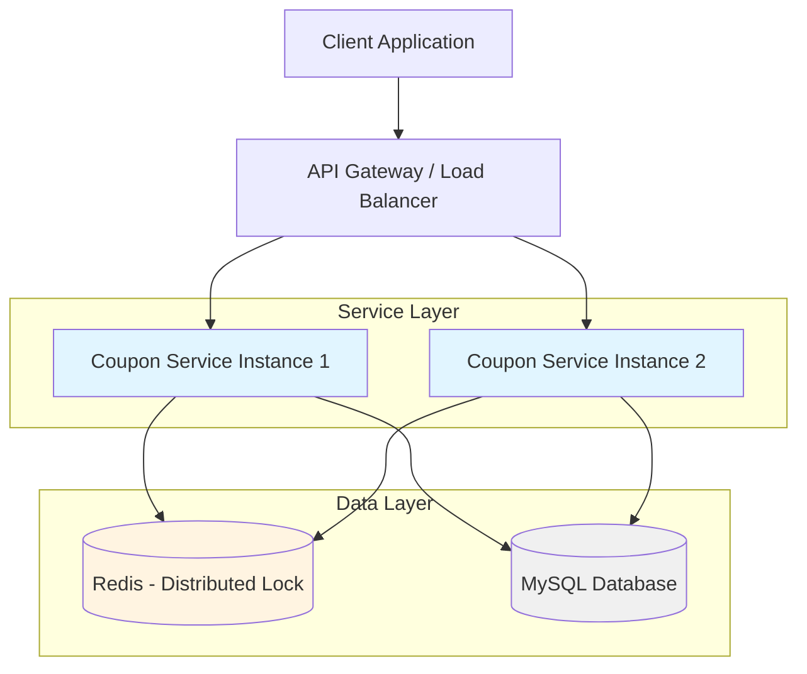
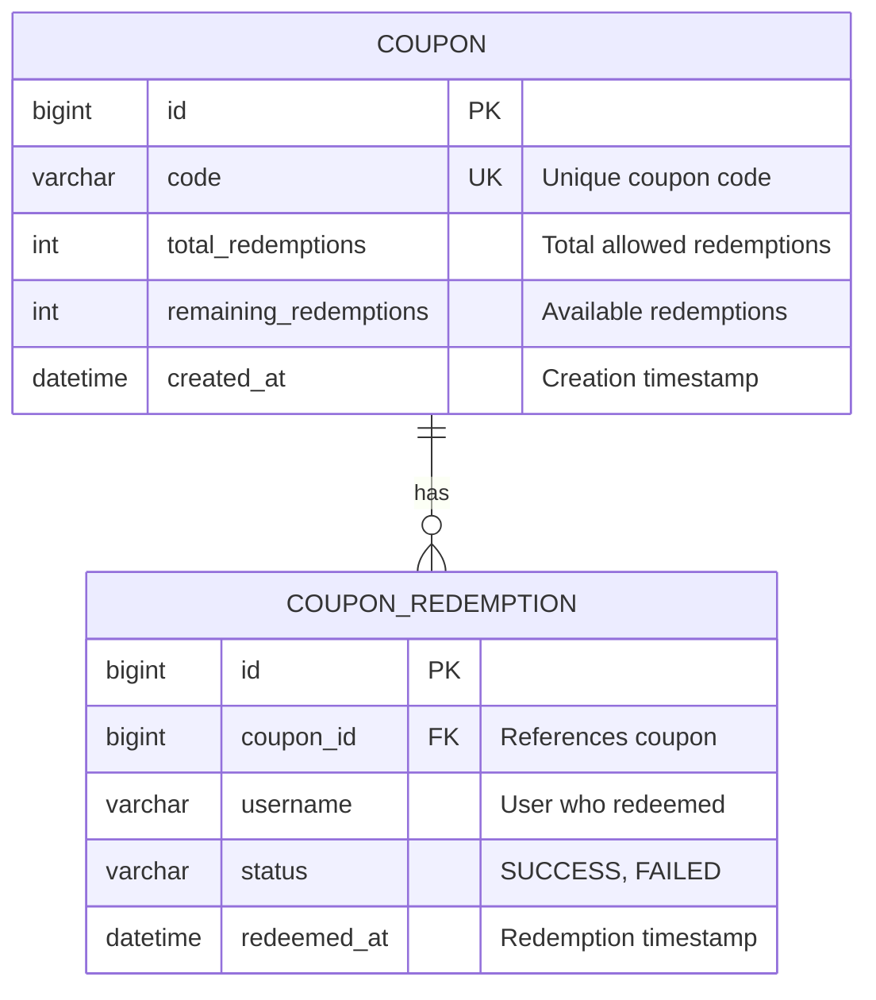
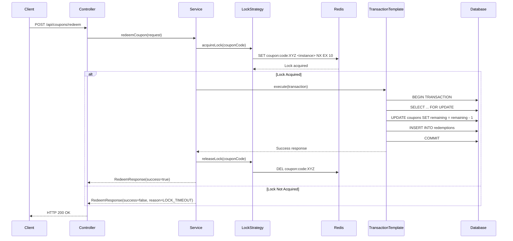
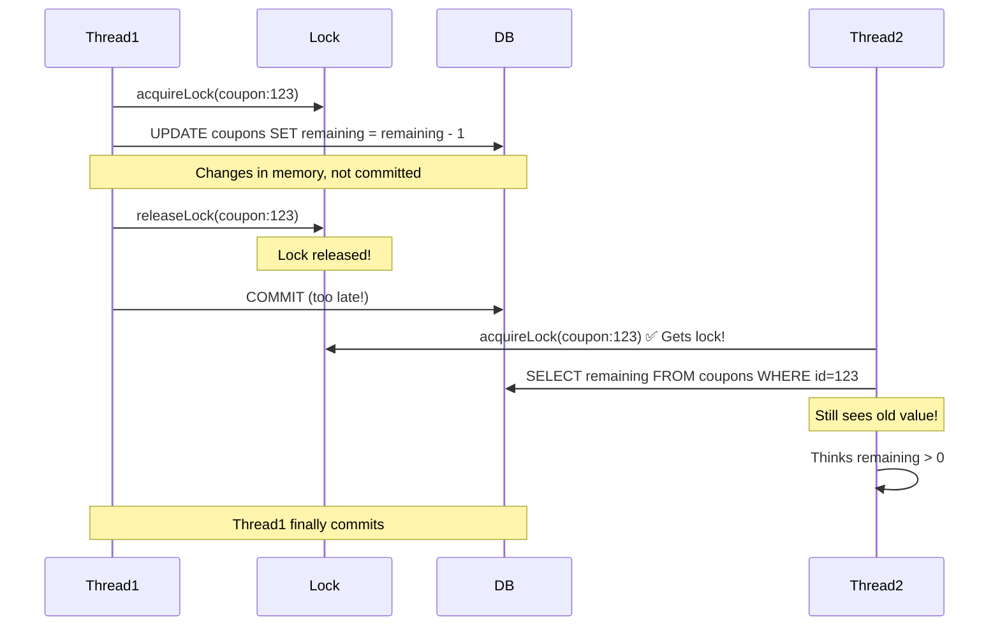
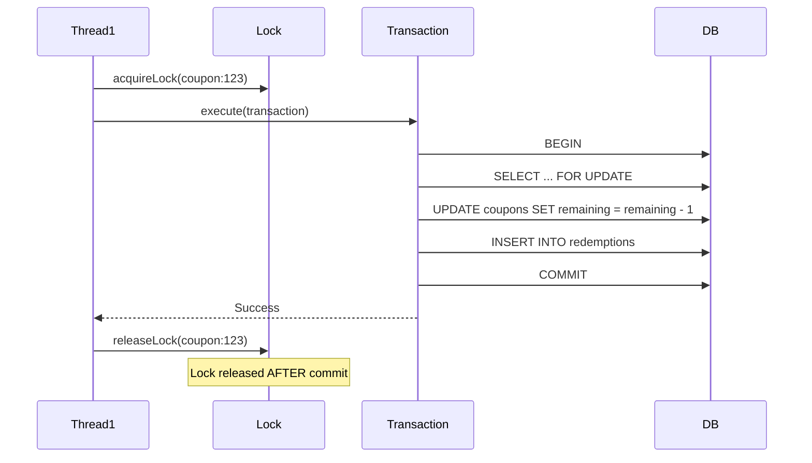
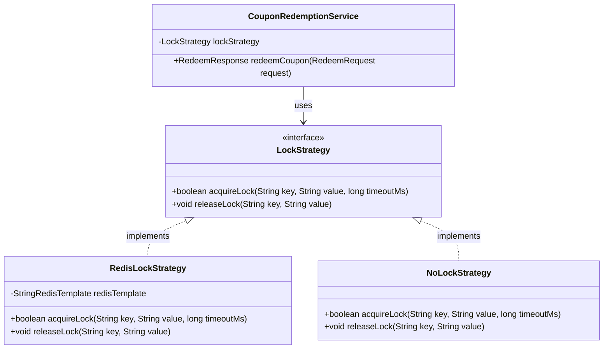
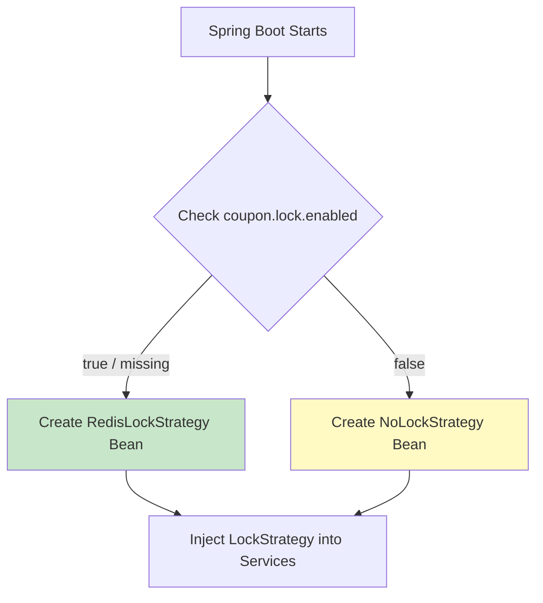

# Spring Boot Microservices — 10 Essential Concepts Through Coupon Redemption System

**Complete Deep-Dive Tutorial with Production-Ready Code Examples**

> **Difficulty Level:** Intermediate to Advanced  
> **Estimated Reading Time:** 45-60 minutes  
> **Technologies Covered:** Spring Boot 4, Java 26, Spring Data JPA, Redis, MySQL  
> **Last Updated:** January 2026

---

## Table of Contents

1. [Introduction](#introduction)
2. [Prerequisites](#prerequisites)
3. [Learning Objectives](#learning-objectives)
4. [System Architecture](#system-architecture)
5. [Concept 1: REST Controllers - Clean API Design](#concept-1-rest-controllers)
6. [Concept 2: JPA Entities - Database Mapping](#concept-2-jpa-entities)
7. [Concept 3: Spring Data JPA Repositories](#concept-3-spring-data-jpa-repositories)
8. [Concept 4: @Transactional - Transaction Management](#concept-4-transactional)
9. [Concept 5: Strategy Pattern - Pluggable Locking](#concept-5-strategy-pattern)
10. [Concept 6: @ConditionalOnProperty](#concept-6-conditionalonproperty)
11. [Concept 7: Java Records for DTOs](#concept-7-java-records)
12. [Concept 8: @RestControllerAdvice](#concept-8-restcontrolleradvice)
13. [Concept 9: @Value - Configuration](#concept-9-value)
14. [Concept 10: Application.yaml](#concept-10-applicationyaml)
15. [Complete Project Implementation](#complete-project-implementation)
16. [Practice Exercises](#practice-exercises)
17. [Question Bank](#question-bank)
18. [Test Your Understanding](#test-your-understanding)
19. [Common Interview Questions](#common-interview-questions)
20. [Best Practices](#best-practices)
21. [Anti-Patterns to Avoid](#anti-patterns-to-avoid)
22. [Performance Considerations](#performance-considerations)
23. [Security Considerations](#security-considerations)
24. [Real-World Use Cases](#real-world-use-cases)
25. [Troubleshooting Guide](#troubleshooting-guide)
26. [Summary & Key Takeaways](#summary)
27. [Further Reading & Resources](#further-reading)

---

## Introduction

Welcome to this comprehensive deep-dive into Spring Boot microservices! In this tutorial, we'll explore **10 essential Spring Boot concepts** through a real-world, production-ready coupon redemption system.

### What You'll Build

A **coupon redemption system** that demonstrates:
- High-concurrency handling with distributed locking
- Clean architecture with separation of concerns
- Production-ready error handling and validation
- Scalable microservice patterns

### Why This Matters

Coupon redemption systems face unique challenges:
- **High concurrency**: Thousands of users trying to redeem limited coupons simultaneously
- **Data consistency**: Preventing over-redemption when stock reaches zero
- **Scalability**: Handling traffic spikes during marketing campaigns
- **Reliability**: Ensuring exactly-once semantics in distributed environments

💡 **Real-World Context:** Think Black Friday sales, limited-edition product launches, or airline flash sales — these scenarios generate massive concurrent requests that must be handled gracefully.

### Technology Stack

| Component | Technology | Version |
|-----------|-----------|---------|
| Framework | Spring Boot | 4.0+ |
| Language | Java | 26 |
| Persistence | Spring Data JPA | Latest |
| Database | MySQL | 8.0+ |
| Caching/Locking | Redis | 7.0+ |
| Build Tool | Maven/Gradle | Latest |

---

## Prerequisites

### Required Knowledge
- ✅ Intermediate Java programming (Java 11+ features)
- ✅ Basic understanding of Spring Boot framework
- ✅ Familiarity with REST API concepts
- ✅ Understanding of database fundamentals (SQL, ACID properties)
- ✅ Basic knowledge of microservices architecture

### Development Environment
```bash
# Required installations:
- JDK 26 or later
- MySQL 8.0+ (or Docker)
- Redis 7.0+ (or Docker)
- IDE: IntelliJ IDEA / Eclipse / VS Code
- Maven 3.8+ or Gradle 8.0+
```

### Quick Setup Verification
```bash
# Verify Java installation
java -version  # Should show version 26+

# Verify MySQL
mysql --version

# Verify Redis
redis-cli ping  # Should return PONG
```

---

## Learning Objectives

By the end of this tutorial, you'll be able to:

1. ✅ Design clean REST APIs with Spring Boot following best practices
2. ✅ Model database relationships using JPA entities with proper annotations
3. ✅ Implement type-safe repositories using Spring Data JPA
4. ✅ Understand and avoid the @Transactional race condition pitfall
5. ✅ Apply the Strategy pattern for pluggable components
6. ✅ Use @ConditionalOnProperty for configuration-driven bean creation
7. ✅ Leverage Java Records for concise, immutable DTOs
8. ✅ Implement global exception handling with @RestControllerAdvice
9. ✅ Configure applications using @Value and application.yaml
10. ✅ Deploy production-ready microservices with Docker
11. ✅ Implement distributed locking for high-concurrency scenarios
12. ✅ Apply validation and error handling patterns consistently

---

## System Architecture

### High-Level Architecture



**Explanation:**
- Multiple service instances handle concurrent requests
- Redis provides distributed locking across instances
- MySQL maintains persistent data with ACID guarantees
- Load balancer distributes traffic evenly

### Entity Relationship Diagram



**Key Insights:**
- One-to-many relationship: One coupon can have many redemptions
- `remaining_redemptions` is decremented atomically during redemption
- Status tracking enables audit trails and analytics

### Redemption Flow Sequence Diagram



---

## Concept 1: REST Controllers

### Overview

REST controllers are the entry point for all client requests. They handle HTTP semantics, request validation, and response formatting.

### Complete Implementation

```java
@RestController
@RequestMapping("/api/coupons")
public class CouponController {
    
    // ✅ Constructor injection (no @Autowired needed)
    private final CouponRedemptionService couponService;
    
    public CouponController(CouponRedemptionService couponService) {
        this.couponService = couponService;
    }
    
    /**
     * Create a new coupon
     * POST /api/coupons
     */
    @PostMapping
    public ResponseEntity<CouponResponse> createCoupon(
            @RequestBody @Valid CreateCouponRequest request) {
        
        CouponResponse response = couponService.createCoupon(request);
        
        // ✅ Explicit HTTP 201 Created status
        return ResponseEntity.status(HttpStatus.CREATED).body(response);
    }
    
    /**
     * Get paginated list of coupons
     * GET /api/coupons?page=0&size=5
     */
    @GetMapping
    public ResponseEntity<Page<CouponResponse>> getCoupons(
            @RequestParam(defaultValue = "0") int page,
            @RequestParam(defaultValue = "5") int size) {
        
        Page<CouponResponse> coupons = couponService.getCoupons(page, size);
        return ResponseEntity.ok(coupons);
    }
    
    /**
     * Redeem a coupon
     * POST /api/coupons/redeem
     */
    @PostMapping("/redeem")
    public ResponseEntity<RedeemResponse> redeemCoupon(
            @RequestBody @Valid RedeemRequest request) {
        
        RedeemResponse response = couponService.redeemCoupon(request);
        return ResponseEntity.ok(response);
    }
    
    /**
     * Get redemption history for a coupon
     * GET /api/coupons/{couponId}/redemptions
     */
    @GetMapping("/{couponId}/redemptions")
    public ResponseEntity<Page<RedemptionResponse>> getRedemptions(
            @PathVariable Long couponId,
            @RequestParam(defaultValue = "0") int page,
            @RequestParam(defaultValue = "5") int size) {
        
        Page<RedemptionResponse> redemptions = 
            couponService.getRedemptions(couponId, page, size);
        return ResponseEntity.ok(redemptions);
    }
}
```

### Key Patterns Explained

| Pattern | Implementation | Benefit |
|---------|---------------|---------|
| **Constructor Injection** | No `@Autowired` annotation | Cleaner code, easier testing, mandatory dependencies |
| **@Valid Annotation** | On `@RequestBody` parameters | Declarative validation, fails fast |
| **ResponseEntity** | Wrapping all responses | Explicit HTTP status control |
| **Page<T> Return Type** | Spring Data pagination | Automatic serialization of page metadata |
| **@RequestParam Defaults** | `defaultValue = "0"` | Sensible defaults reduce client burden |

✅ **Best Practice:** Keep controllers thin — delegate business logic to service layer.

❌ **Anti-Pattern:** Don't put business logic in controllers. It makes testing difficult and violates SRP.

---

## Concept 2: JPA Entities

### Overview

JPA entities map Java objects to database tables, providing object-relational mapping (ORM).

### Complete Implementation

```java
/**
 * Coupon Entity - Represents a coupon in the system
 */
@Entity
@Table(name = "coupons")
public class Coupon {
    
    @Id
    @GeneratedValue(strategy = GenerationType.IDENTITY)
    private Long id;
    
    // ✅ Explicit column mapping with constraints
    @Column(nullable = false, unique = true, length = 100)
    private String code;
    
    // ✅ Snake_case column naming for database compatibility
    @Column(name = "total_redemptions", nullable = false)
    private Integer totalRedemptions;
    
    @Column(name = "remaining_redemptions", nullable = false)
    private Integer remainingRedemptions;
    
    // ✅ Immutable timestamp - set only on creation
    @Column(name = "created_at", nullable = false, updatable = false)
    private LocalDateTime createdAt;
    
    /**
     * Automatically set creation timestamp before persisting
     */
    @PrePersist
    protected void onCreate() {
        this.createdAt = LocalDateTime.now();
    }
    
    // ✅ Constructor for required fields
    public Coupon(String code, Integer totalRedemptions) {
        this.code = code;
        this.totalRedemptions = totalRedemptions;
        this.remainingRedemptions = totalRedemptions;
    }
    
    // ✅ JPA requires no-arg constructor
    protected Coupon() {}
}
```

```java
/**
 * CouponRedemption Entity - Records each redemption attempt
 */
@Entity
@Table(name = "coupon_redemptions")
public class CouponRedemption {
    
    @Id
    @GeneratedValue(strategy = GenerationType.IDENTITY)
    private Long id;
    
    @Column(name = "coupon_id", nullable = false)
    private Long couponId;
    
    @Column(nullable = false, length = 100)
    private String username;
    
    // ✅ Store enum names, not ordinals (schema-friendly)
    @Enumerated(EnumType.STRING)
    @Column(nullable = false)
    private RedemptionStatus status;
    
    @Column(name = "redeemed_at", nullable = false, updatable = false)
    private LocalDateTime redeemedAt;
    
    @PrePersist
    protected void onCreate() {
        this.redeemedAt = LocalDateTime.now();
    }
    
    public enum RedemptionStatus {
        SUCCESS,    // Redemption succeeded
        FAILED      // Redemption failed (already redeemed, expired, etc.)
    }
}
```

### Critical Annotations Explained

| Annotation | Purpose | Example |
|-----------|---------|---------|
| `@Entity` | Marks class as JPA entity | Maps to database table |
| `@Table` | Specifies table name | `@Table(name = "coupons")` |
| `@Id` | Primary key field | `private Long id` |
| `@GeneratedValue` | Auto-generate PK | `IDENTITY` strategy |
| `@Column` | Column customization | `nullable`, `unique`, `length` |
| `@Enumerated` | Enum storage strategy | `STRING` stores names, `ORDINAL` stores indices |
| `@PrePersist` | Callback before insert | Auto-set timestamps |

⚠️ **Critical Warning:** Always use `@Enumerated(EnumType.STRING)` over `ORDINAL`. If you reorder enum constants, `ORDINAL` corrupts existing data!

---

## Concept 3: Spring Data JPA Repositories

### Overview

Spring Data JPA repositories eliminate boilerplate DAO code through method name derivation.

### Complete Implementation

```java
/**
 * Coupon Repository - Data access for Coupon entities
 */
public interface CouponRepository extends JpaRepository<Coupon, Long> {
    
    // ✅ Query derived from method name - no SQL needed!
    Optional<Coupon> findByCode(String code);
    
    // ✅ Exists query for validation
    boolean existsByCode(String code);
    
    // ✅ Custom query example
    @Query("SELECT c FROM Coupon c WHERE c.remainingRedemptions > 0")
    List<Coupon> findAvailableCoupons();
}

/**
 * CouponRedemption Repository - Data access for redemption records
 */
public interface CouponRedemptionRepository extends JpaRepository<CouponRedemption, Long> {
    
    // ✅ Paginated query with ordering
    Page<CouponRedemption> findByCouponIdOrderByRedeemedAtDesc(
            Long couponId, 
            Pageable pageable
    );
    
    // ✅ Check if user already redeemed a coupon
    boolean existsByCouponIdAndUsername(Long couponId, String username);
}
```

### Query Derivation Keywords

| Keyword | Example Method | Generated SQL |
|---------|---------------|---------------|
| `findBy` | `findByCode(String code)` | `WHERE code = ?` |
| `existsBy` | `existsByCode(String code)` | `SELECT COUNT(*) > 0` |
| `countBy` | `countByStatus(Status status)` | `SELECT COUNT(*)` |
| `deleteBy` | `deleteByCode(String code)` | `DELETE WHERE code = ?` |
| `findBy...OrderBy` | `findByCouponIdOrderByRedeemedAtDesc` | `WHERE coupon_id = ? ORDER BY redeemed_at DESC` |

### Using Repositories in Services

```java
@Service
@RequiredArgsConstructor
public class CouponRedemptionService {
    
    private final CouponRepository couponRepository;
    private final CouponRedemptionRepository redemptionRepository;
    
    public CouponResponse createCoupon(CreateCouponRequest request) {
        // ✅ Check for duplicates
        if (couponRepository.existsByCode(request.code())) {
            throw new CouponAlreadyExistsException(request.code());
        }
        
        // ✅ Create and save
        Coupon coupon = new Coupon(request.code(), request.totalRedemptions());
        Coupon saved = couponRepository.save(coupon);
        
        return CouponResponse.from(saved);
    }
    
    public Optional<Coupon> getCouponByCode(String code) {
        return couponRepository.findByCode(code);
    }
}
```

---

## Concept 4: @Transactional - Transaction Management

### ⚠️ The Critical Bug We Fixed

This is the **most important learning** from this project. The naive use of `@Transactional` caused a serious race condition.

### The Problem: Lock-Before-Commit Race Condition

```java
// ❌ BAD: @Transactional wraps the entire method
@Transactional
public RedeemResponse redeemCoupon(RedeemRequest request) {
    acquireLock();  // ✅ Lock acquired
    
    // JPA operations (in memory - NOT flushed to MySQL yet)
    Coupon coupon = couponRepository.findById(request.couponId()).get();
    coupon.setRemainingRedemptions(coupon.getRemainingRedemptions() - 1);
    couponRepository.save(coupon);
    
    releaseLock();  // ❌ Lock released BEFORE commit!
    
    // Transaction commits HERE - data still inconsistent!
}
```

**Race Condition Timeline:**


**What Went Wrong:**
1. Thread 1 acquires lock
2. Thread 1 modifies coupon in memory (not yet committed to DB)
3. Thread 1 releases lock
4. Thread 2 acquires lock
5. Thread 2 reads coupon — sees **old value** (Thread 1's changes not committed!)
6. Thread 1's transaction finally commits

**Result:** Both threads think redemption is valid → **double redemption!**

### The Fix: TransactionTemplate

```java
// ✅ FIXED: Lock outside transaction boundary
public RedeemResponse redeemCoupon(RedeemRequest request) {
    String lockKey = "coupon:code:" + request.couponCode();
    
    acquireLock(lockKey);
    try {
        // TransactionTemplate manages transaction lifecycle
        return transactionTemplate.execute(status -> {
            // All JPA operations happen INSIDE transaction
            // - Read current state
            // - Business logic checks
            // - Update database
            // - Commit happens here
            
            Coupon coupon = couponRepository.findByCode(request.couponCode())
                .orElseThrow(() -> new CouponNotFoundException(request.couponCode()));
            
            if (coupon.getRemainingRedemptions() <= 0) {
                throw new CouponExhaustedException(request.couponCode());
            }
            
            // Check if user already redeemed
            if (redemptionRepository.existsByCouponIdAndUsername(
                    coupon.getId(), request.username())) {
                throw new AlreadyRedeemedException(request.username());
            }
            
            // Atomic decrement
            coupon.setRemainingRedemptions(coupon.getRemainingRedemptions() - 1);
            couponRepository.save(coupon);
            
            // Record redemption
            CouponRedemption redemption = new CouponRedemption(
                coupon.getId(),
                request.username(),
                CouponRedemption.RedemptionStatus.SUCCESS
            );
            redemptionRepository.save(redemption);
            
            return RedeemResponse.success(
                "Coupon redeemed successfully",
                instanceName
            );
        });
    } finally {
        // ✅ Lock released AFTER transaction commits
        releaseLock(lockKey);
    }
}
```

**Correct Flow:**


### TransactionTemplate Configuration

```java
@Configuration
public class TransactionConfig {
    
    @Bean
    public TransactionTemplate transactionTemplate(PlatformTransactionManager transactionManager) {
        TransactionTemplate template = new TransactionTemplate(transactionManager);
        
        // ✅ Configure transaction behavior
        template.setIsolationLevel(TransactionDefinition.ISOLATION_REPEATABLE_READ);
        template.setPropagationBehavior(TransactionDefinition.PROPAGATION_REQUIRED);
        template.setTimeout(30); // 30 seconds
        
        return template;
    }
}
```

### Comparison: @Transactional vs TransactionTemplate

| Aspect | @Transactional | TransactionTemplate |
|--------|---------------|---------------------|
| **Lock Management** | ❌ Cannot control lock boundaries | ✅ Full control over when locks are held |
| **Programmatic Control** | ❌ Declarative only | ✅ Execute logic conditionally |
| **Complex Workflows** | ❌ Awkward for multi-step | ✅ Clean for complex business logic |
| **Exception Handling** | ⚠️ Rolls back on RuntimeException | ✅ Explicit rollback control |
| **Use Case** | Simple CRUD operations | Complex workflows with external resources |

✅ **When to use TransactionTemplate:**
- When you need locks outside the transaction
- Complex multi-step business logic
- Conditional transaction execution
- Integration with external systems (Redis, message queues)

✅ **When to use @Transactional:**
- Simple CRUD operations
- Single-repository operations
- No external resources needed

---

## Concept 5: Strategy Pattern - Pluggable Locking

### Overview

The Strategy pattern enables selecting algorithms at runtime. We use it to make our locking mechanism pluggable.

### Strategy Interface

```java
/**
 * Lock Strategy Interface - Defines contract for distributed locking
 */
public interface LockStrategy {
    
    /**
     * Attempts to acquire a lock
     * @param key Unique lock key (e.g., "coupon:code:SUMMER2024")
     * @param value Lock owner identifier (e.g., "instance-1")
     * @param timeoutMs Lock expiration time in milliseconds
     * @return true if lock acquired, false otherwise
     */
    boolean acquireLock(String key, String value, long timeoutMs);
    
    /**
     * Releases a held lock
     * @param key Lock key to release
     * @param value Lock owner identifier (must match acquirer)
     */
    void releaseLock(String key, String value);
}
```

### Concrete Implementations

#### 1. Redis Lock Strategy (Production)

```java
@Component
public class RedisLockStrategy implements LockStrategy {
    
    private final StringRedisTemplate redisTemplate;
    
    public RedisLockStrategy(StringRedisTemplate redisTemplate) {
        this.redisTemplate = redisTemplate;
    }
    
    @Override
    public boolean acquireLock(String key, String value, long timeoutMs) {
        // ✅ NX = Only set if key doesn't exist
        // ✅ EX = Set expiration (prevents deadlocks)
        Boolean success = redisTemplate.opsForValue()
            .setIfAbsent(key, value, timeoutMs, TimeUnit.MILLISECONDS);
        
        return Boolean.TRUE.equals(success);
    }
    
    @Override
    public releaseLock(String key, String value) {
        // ✅ Lua script for atomic check-and-delete
        // Prevents deleting another thread's lock
        String script = 
            "if redis.call('get', KEYS[1]) == ARGV[1] then " +
            "return redis.call('del', KEYS[1]) " +
            "else " +
            "return 0 " +
            "end";
        
        redisTemplate.execute(script, Collections.singletonList(key), value);
    }
}
```

#### 2. No-Lock Strategy (Development/Testing)

```java
@Component
public class NoLockStrategy implements LockStrategy {
    
    @Override
    public boolean acquireLock(String key, String value, long timeoutMs) {
        // Always succeeds - no actual locking
        return true;
    }
    
    @Override
    public void releaseLock(String key, String value) {
        // No-op
    }
}
```

### Using the Strategy Pattern

```java
@Service
@RequiredArgsConstructor
public class CouponRedemptionService {
    
    private final LockStrategy lockStrategy;
    private final CouponRepository couponRepository;
    private final TransactionTemplate transactionTemplate;
    
    public RedeemResponse redeemCoupon(RedeemRequest request) {
        String lockKey = "coupon:code:" + request.couponCode();
        String instanceId = instanceName; // Unique per service instance
        
        // ✅ Acquire lock using strategy (pluggable!)
        boolean locked = lockStrategy.acquireLock(lockKey, instanceId, 10000);
        
        if (!locked) {
            return RedeemResponse.failure("System busy, please retry");
        }
        
        try {
            return transactionTemplate.execute(status -> {
                // Business logic here
                // ...
            });
        } finally {
            // ✅ Release lock using same strategy
            lockStrategy.releaseLock(lockKey, instanceId);
        }
    }
}
```

### Strategy Pattern UML Diagram



**Benefits:**
- ✅ Swappable implementations without changing business logic
- ✅ Easy testing (use NoLockStrategy for unit tests)
- ✅ Runtime configuration (choose strategy via properties)
- ✅ Open/Closed Principle — add new strategies without modifying existing code

---

## Concept 6: @ConditionalOnProperty

### Overview

`@ConditionalOnProperty` creates beans conditionally based on configuration properties, enabling feature flags and environment-specific behavior.

### Configuration

```yaml
# application.yml
coupon:
  lock:
    enabled: true  # Use Redis locking in production
  instance:
    name: coupon-app-1
```

### Conditional Bean Creation

```java
@Configuration
public class LockConfig {
    
    // ✅ Create RedisLockStrategy when coupon.lock.enabled=true
    @Bean
    @ConditionalOnProperty(
        name = "coupon.lock.enabled",
        havingValue = "true",
        matchIfMissing = true  // Default to true if property missing
    )
    public LockStrategy redisLockStrategy(StringRedisTemplate redisTemplate) {
        return new RedisLockStrategy(redisTemplate);
    }
    
    // ✅ Create NoLockStrategy when coupon.lock.enabled=false
    @Bean
    @ConditionalOnProperty(
        name = "coupon.lock.enabled",
        havingValue = "false"
    )
    public LockStrategy noLockStrategy() {
        return new NoLockStrategy();
    }
}
```

### How It Works



### Real-World Use Cases

| Use Case | Property | Benefit |
|----------|----------|---------|
| **Feature Flags** | `feature.new-ui.enabled=true` | Gradual rollout of features |
| **Environment Switching** | `app.db.type=postgresql` | Switch databases per environment |
| **Third-Party Integration** | `payment.stripe.enabled=true` | Enable/disable payment providers |
| **Caching** | `cache.redis.enabled=true` | Use Redis or local cache |

✅ **Best Practice:** Use `matchIfMissing=true` for features that should be enabled by default.

❌ **Anti-Pattern:** Don't create too many conditional beans — it becomes hard to reason about application behavior.

---

## Concept 7: Java Records for DTOs

### Overview

Java Records (introduced in Java 14) provide immutable data carriers with minimal boilerplate.

### Request DTOs

```java
/**
 * Create Coupon Request - Immutable DTO with validation
 */
public record CreateCouponRequest(
        // ✅ Validation annotations work on record components
        @NotBlank(message = "Coupon code is required")
        @Size(min = 3, max = 100, message = "Code must be 3-100 characters")
        String code,
        
        @Min(value = 1, message = "Total redemptions must be at least 1")
        @Max(value = 1000000, message = "Maximum 1,000,000 redemptions allowed")
        Integer totalRedemptions
) {}

/**
 * Redemption Request
 */
public record RedeemRequest(
        @NotBlank(message = "Coupon code is required")
        String couponCode,
        
        @NotBlank(message = "Username is required")
        @Size(min = 3, max = 100, message = "Username must be 3-100 characters")
        String username
) {}
```

### Response DTOs with Factory Methods

```java
/**
 * Coupon Response - Includes factory method for conversion
 */
public record CouponResponse(
        Long id,
        String code,
        Integer totalRedemptions,
        Integer remainingRedemptions,
        LocalDateTime createdAt
) {
    /**
     * Factory method to convert entity to DTO
     */
    public static CouponResponse from(Coupon coupon) {
        return new CouponResponse(
            coupon.getId(),
            coupon.getCode(),
            coupon.getTotalRedemptions(),
            coupon.getRemainingRedemptions(),
            coupon.getCreatedAt()
        );
    }
}

/**
 * Redemption Response
 */
public record RedemptionResponse(
        Long id,
        String username,
        RedemptionStatus status,
        LocalDateTime redeemedAt
) {
    public static RedemptionResponse from(CouponRedemption redemption) {
        return new RedemptionResponse(
            redemption.getId(),
            redemption.getUsername(),
            redemption.getStatus(),
            redemption.getRedeemedAt()
        );
    }
}

/**
 * Redeem Response
 */
public record RedeemResponse(
        boolean success,
        String message,
        String instanceName  // Track which instance processed
) {
    public static RedeemResponse success(String message, String instanceName) {
        return new RedeemResponse(true, message, instanceName);
    }
    
    public static RedeemResponse failure(String message) {
        return new RedeemResponse(false, message, null);
    }
}
```

### Records vs Traditional Classes

| Aspect | Java Record | Traditional Class |
|--------|------------|-------------------|
| **Boilerplate** | ✅ None (auto-generated) | ❌ Getters, setters, equals, hashCode, toString |
| **Immutability** | ✅ Immutable by default | ⚠️ Mutable unless explicitly made immutable |
| **Inheritance** | ❌ Cannot extend other classes | ✅ Can extend and be extended |
| **Validation** | ✅ Annotations work on components | ✅ Annotations work on fields |
| **Jackson Serialization** | ✅ Automatic (all components serialized) | ✅ Works with getters |
| **Usage** | DTOs, value objects, tuples | Entities, complex domain objects |

✅ **Best Practices:**
- Use records for DTOs, request/response objects
- Use records for value objects (money, coordinates, etc.)
- Keep entities as traditional classes (need mutability for JPA)

❌ **Don't Use Records For:**
- JPA entities (require no-arg constructors and mutability)
- Objects requiring inheritance
- Objects needing custom equals/hashCode logic

---

## Concept 8: @RestControllerAdvice

### Overview

`@RestControllerAdvice` provides global exception handling across all controllers, eliminating repetitive try-catch blocks.

### Complete Implementation

```java
@RestControllerAdvice
public class GlobalExceptionHandler {
    
    private static final Logger logger = 
        LoggerFactory.getLogger(GlobalExceptionHandler.class);
    
    /**
     * Handle coupon not found errors
     */
    @ExceptionHandler(CouponNotFoundException.class)
    public ResponseEntity<Map<String, String>> handleNotFound(
            CouponNotFoundException ex) {
        
        logger.warn("Coupon not found: {}", ex.getMessage());
        
        return ResponseEntity
            .status(HttpStatus.NOT_FOUND)
            .body(Map.of("error", ex.getMessage()));
    }
    
    /**
     * Handle duplicate coupon creation
     */
    @ExceptionHandler(CouponAlreadyExistsException.class)
    public ResponseEntity<Map<String, String>> handleConflict(
            CouponNotFoundException ex) {
        
        logger.warn("Coupon already exists: {}", ex.getMessage());
        
        return ResponseEntity
            .status(HttpStatus.CONFLICT)
            .body(Map.of("error", ex.getMessage()));
    }
    
    /**
     * Handle validation errors from @Valid annotations
     */
    @ExceptionHandler(MethodArgumentNotValidException.class)
    public ResponseEntity<Map<String, String>> handleValidation(
            MethodArgumentNotValidException ex) {
        
        // ✅ Extract all field errors into user-friendly message
        String message = ex.getBindingResult().getFieldErrors().stream()
            .map(error -> error.getField() + ": " + error.getDefaultMessage())
            .reduce((a, b) -> a + "; " + b)
            .orElse("Validation failed");
        
        logger.warn("Validation error: {}", message);
        
        return ResponseEntity
            .badRequest()
            .body(Map.of("error", message));
    }
    
    /**
     * Handle all other unhandled exceptions
     */
    @ExceptionHandler(Exception.class)
    public ResponseEntity<Map<String, String>> handleGeneric(Exception ex) {
        logger.error("Unexpected error", ex);
        
        return ResponseEntity
            .status(HttpStatus.INTERNAL_SERVER_ERROR)
            .body(Map.of("error", "An unexpected error occurred"));
    }
}
```

### Custom Exceptions

```java
/**
 * Base application exception
 */
public class ApplicationException extends RuntimeException {
    public ApplicationException(String message) {
        super(message);
    }
}

/**
 * Coupon not found exception
 */
public class CouponNotFoundException extends ApplicationException {
    public CouponNotFoundException(String code) {
        super("Coupon not found: " + code);
    }
}

/**
 * Coupon already exists exception
 */
public class CouponAlreadyExistsException extends ApplicationException {
    public CouponAlreadyExistsException(String code) {
        super("Coupon already exists: " + code);
    }
}

/**
 * Coupon exhausted exception
 */
public class CouponExhaustedException extends ApplicationException {
    public CouponExhaustedException(String code) {
        super("Coupon exhausted: " + code);
    }
}

/**
 * Already redeemed exception
 */
public class AlreadyRedeemedException extends ApplicationException {
    public AlreadyRedeemedException(String username) {
        super("User already redeemed: " + username);
    }
}
```

### Error Response Format

```json
// 404 Not Found
{
  "error": "Coupon not found: INVALID_CODE"
}

// 409 Conflict
{
  "error": "Coupon already exists: SUMMER2024"
}

// 400 Bad Request (Validation)
{
  "error": "code: Coupon code is required; totalRedemptions: must be at least 1"
}
```

✅ **Benefits:**
- Centralized error handling (DRY principle)
- Consistent error response format
- Proper HTTP status codes
- Logging in one place
- Clean controllers (no try-catch)

---

## Concept 9: @Value - Environment-Aware Configuration

### Overview

`@Value` injects configuration values from properties files or environment variables.

### Usage in Services

```java
@Service
@RequiredArgsConstructor
public class CouponRedemptionService {
    
    private final CouponRepository couponRepository;
    private final LockStrategy lockStrategy;
    
    // ✅ Inject configuration with default value
    private final String instanceName;
    
    // ✅ Inject with SpEL (Spring Expression Language)
    private final int maxRedemptionsPerUser;
    
    // ✅ Inject complex objects
    private final List<String> allowedDomains;
    
    public CouponRedemptionService(
            CouponRepository couponRepository,
            LockStrategy lockStrategy,
            @Value("${coupon.instance.name:coupon-app-1}") String instanceName,
            @Value("${coupon.max.redemptions.per.user:1}") int maxRedemptionsPerUser,
            @Value("#{'${coupon.allowed.domains:gmail.com,yahoo.com}'.split(',')}") 
            List<String> allowedDomains) {
        
        this.couponRepository = couponRepository;
        this.lockStrategy = lockStrategy;
        this.instanceName = instanceName;
        this.maxRedemptionsPerUser = maxRedemptionsPerUser;
        this.allowedDomains = allowedDomains;
    }
    
    public RedeemResponse redeemCoupon(RedeemRequest request) {
        // Use instanceName in response for debugging/load balancing visibility
        if (redemptionSuccessful) {
            return RedeemResponse.success(
                "Coupon redeemed successfully",
                instanceName  // Which instance processed this?
            );
        }
    }
}
```

### Configuration Sources

```yaml
# application.yml
coupon:
  instance:
    name: coupon-app-1  # Default value
  max:
    redemptions:
      per:
        user: 1
  allowed:
    domains: gmail.com,yahoo.com,outlook.com
```

```bash
# Override via environment variables (Docker, Kubernetes, etc.)
export COUPON_INSTANCE_NAME=coupon-app-2
export COUPON_MAX_REDEMPTIONS_PER_USER=3
```

**Spring Boot automatically maps:**
- `COUPON_INSTANCE_NAME` → `coupon.instance.name`
- `COUPON_MAX_REDEMPTIONS_PER_USER` → `coupon.max.redemptions.per.user`

### Response Example

```json
{
  "success": true,
  "message": "Coupon redeemed successfully",
  "instanceName": "coupon-app-2"
}
```

✅ **Best Practice:** Always provide sensible default values for configuration properties.

---

## Concept 10: Application.yaml - Layered Configuration

### Complete Configuration

```yaml
# ===========================
# Data Source Configuration
# ===========================
spring:
  datasource:
    url: jdbc:mysql://localhost:3306/coupon_db?useSSL=false&serverTimezone=UTC
    username: root
    password: root
    hikari:
      maximum-pool-size: 10
      minimum-idle: 5
      connection-timeout: 30000
  
  # ===========================
  # JPA/Hibernate Configuration
  # ===========================
  jpa:
    hibernate:
      ddl-auto: update  # Auto-update schema (use 'validate' in production)
    properties:
      hibernate:
        dialect: org.hibernate.dialect.MySQLDialect
        format_sql: true
        show_sql: false  # Enable for debugging
  
  # ===========================
  # Redis Configuration
  # ===========================
  data:
    redis:
      host: localhost
      port: 6379
      timeout: 2000ms
      lettuce:
        pool:
          max-active: 8
          max-idle: 8
          min-idle: 0
  
  # ===========================
  # Server Configuration
  # ===========================
  server:
    port: 8085
    servlet:
      context-path: /api

# ===========================
# Application Configuration
# ===========================
coupon:
  lock:
    enabled: true  # Enable distributed locking
  instance:
    name: coupon-app-1  # Unique per instance
  max:
    redemptions:
      per:
        user: 1

# ===========================
# Management/Actuator
# ===========================
management:
  endpoints:
    web:
      exposure:
        include: health,info,metrics
  endpoint:
    health:
      show-details: always
```

### Environment-Specific Configurations

```yaml
# application-dev.yml (Development)
spring:
  datasource:
    url: jdbc:mysql://localhost:3306/coupon_db
  jpa:
    show-sql: true
    hibernate:
      ddl-auto: create-drop  # Fresh schema on each restart

# application-prod.yml (Production)
spring:
  datasource:
    url: jdbc:mysql://prod-db:3306/coupon_db
    hikari:
      maximum-pool-size: 50
  jpa:
    hibernate:
      ddl-auto: validate  # Never auto-update in production
    show-sql: false
```

### Profile Activation

```bash
# Activate specific profile
java -jar coupon-service.jar --spring.profiles.active=prod

# Or via environment variable
export SPRING_PROFILES_ACTIVE=prod
```

### Docker Compose Example

```yaml
# docker-compose.yml
version: '3.8'

services:
  coupon-service-1:
    image: coupon-service:latest
    environment:
      - SPRING_DATASOURCE_URL=jdbc:mysql://mysql:3306/coupon_db
      - SPRING_REDIS_HOST=redis
      - COUPON_INSTANCE_NAME=coupon-app-1
      - COUPON_LOCK_ENABLED=true
    ports:
      - "8081:8080"
    depends_on:
      - mysql
      - redis
  
  coupon-service-2:
    image: coupon-service:latest
    environment:
      - SPRING_DATASOURCE_URL=jdbc:mysql://mysql:3306/coupon_db
      - SPRING_REDIS_HOST=redis
      - COUPON_INSTANCE_NAME=coupon-app-2
      - COUPON_LOCK_ENABLED=true
    ports:
      - "8082:8080"
    depends_on:
      - mysql
      - redis
  
  mysql:
    image: mysql:8.0
    environment:
      - MYSQL_ROOT_PASSWORD=root
      - MYSQL_DATABASE=coupon_db
  
  redis:
    image: redis:7-alpine
```

✅ **Best Practice:** Use environment variables in production, not hardcoded values.

---

## Complete Project Implementation

### Project Structure

```
coupon-redemption-system/
├── src/
│   ├── main/
│   │   ├── java/com/example/coupon/
│   │   │   ├── CouponRedemptionApplication.java
│   │   │   ├── controller/
│   │   │   │   └── CouponController.java
│   │   │   ├── service/
│   │   │   │   └── CouponRedemptionService.java
│   │   │   ├── repository/
│   │   │   │   ├── CouponRepository.java
│   │   │   │   └── CouponRedemptionRepository.java
│   │   │   ├── entity/
│   │   │   │   ├── Coupon.java
│   │   │   │   └── CouponRedemption.java
│   │   │   ├── dto/
│   │   │   │   ├── CreateCouponRequest.java
│   │   │   │   ├── RedeemRequest.java
│   │   │   │   ├── CouponResponse.java
│   │   │   │   └── RedeemResponse.java
│   │   │   ├── exception/
│   │   │   │   ├── GlobalExceptionHandler.java
│   │   │   │   ├── CouponNotFoundException.java
│   │   │   │   └── ...
│   │   │   ├── strategy/
│   │   │   │   ├── LockStrategy.java
│   │   │   │   ├── RedisLockStrategy.java
│   │   │   │   └── NoLockStrategy.java
│   │   │   └── config/
│   │   │       ├── LockConfig.java
│   │   │       └── TransactionConfig.java
│   │   └── resources/
│   │       ├── application.yml
│   │       └── application-prod.yml
│   └── test/
│       └── java/com/example/coupon/
│           └── CouponRedemptionServiceTest.java
├── docker-compose.yml
├── Dockerfile
└── pom.xml
```

### Main Application Class

```java
@SpringBootApplication
public class CouponRedemptionApplication {
    
    public static void main(String[] args) {
        SpringApplication.run(CouponRedemptionApplication.class, args);
    }
}
```

### Testing Strategy

```java
@SpringBootTest
@Transactional
class CouponRedemptionServiceTest {
    
    @Autowired
    private CouponRedemptionService service;
    
    @Autowired
    private CouponRepository couponRepository;
    
    @Test
    void shouldCreateCouponSuccessfully() {
        // Given
        CreateCouponRequest request = new CreateCouponRequest("TEST2024", 100);
        
        // When
        CouponResponse response = service.createCoupon(request);
        
        // Then
        assertThat(response.code()).isEqualTo("TEST2024");
        assertThat(response.totalRedemptions()).isEqualTo(100);
        assertThat(response.remainingRedemptions()).isEqualTo(100);
    }
    
    @Test
    void shouldRedeemCouponSuccessfully() {
        // Given
        Coupon coupon = couponRepository.save(
            new Coupon("REDEEM2024", 10)
        );
        RedeemRequest request = new RedeemRequest("REDEEM2024", "user1");
        
        // When
        RedeemResponse response = service.redeemCoupon(request);
        
        // Then
        assertThat(response.success()).isTrue();
        
        Coupon updated = couponRepository.findById(coupon.getId()).get();
        assertThat(updated.getRemainingRedemptions()).isEqualTo(9);
    }
}
```

---

## Practice Exercises

### Exercise 1: Add Coupon Expiration Feature

**Difficulty:** Intermediate  
**Estimated Time:** 30 minutes

#### Requirements
Extend the coupon system to support expiration dates:
1. Add `expiresAt` field to `Coupon` entity
2. Validate that expired coupons cannot be redeemed
3. Update DTOs to include expiration
4. Add endpoint to query expired coupons

#### Solution

```java
// 1. Update Coupon entity
@Entity
@Table(name = "coupons")
public class Coupon {
    // ... existing fields ...
    
    @Column(name = "expires_at")
    private LocalDateTime expiresAt;
    
    // Helper method
    public boolean isExpired() {
        return expiresAt != null && LocalDateTime.now().isAfter(expiresAt);
    }
    
    // Constructor update
    public Coupon(String code, Integer totalRedemptions, LocalDateTime expiresAt) {
        this.code = code;
        this.totalRedemptions = totalRedemptions;
        this.remainingRedemptions = totalRedemptions;
        this.expiresAt = expiresAt;
    }
}

// 2. Update CreateCouponRequest
public record CreateCouponRequest(
        @NotBlank String code,
        @Min(1) int totalRedemptions,
        @Future(message = "Expiry date must be in the future")
        LocalDateTime expiresAt  // Optional - make nullable if needed
) {}

// 3. Update redemption logic
public RedeemResponse redeemCoupon(RedeemRequest request) {
    return transactionTemplate.execute(status -> {
        Coupon coupon = couponRepository.findByCode(request.couponCode())
            .orElseThrow(() -> new CouponNotFoundException(request.couponCode()));
        
        // ✅ New validation
        if (coupon.isExpired()) {
            throw new CouponExpiredException(request.couponCode());
        }
        
        if (coupon.getRemainingRedemptions() <= 0) {
            throw new CouponExhaustedException(request.couponCode());
        }
        
        // ... rest of logic
    });
}

// 4. Add custom exception
public class CouponExpiredException extends ApplicationException {
    public CouponExpiredException(String code) {
        super("Coupon expired: " + code);
    }
}

// 5. Add to GlobalExceptionHandler
@ExceptionHandler(CouponExpiredException.class)
public ResponseEntity<Map<String, String>> handleExpired(CouponExpiredException ex) {
    return ResponseEntity
        .status(HttpStatus.GONE)  // 410 Gone
        .body(Map.of("error", ex.getMessage()));
}

// 6. Add repository method
public interface CouponRepository extends JpaRepository<Coupon, Long> {
    // ... existing methods ...
    
    @Query("SELECT c FROM Coupon c WHERE c.expiresAt < :now AND c.remainingRedemptions > 0")
    List<Coupon> findExpiredCoupons(@Param("now") LocalDateTime now);
}

// 7. Add controller endpoint
@GetMapping("/expired")
public ResponseEntity<Page<CouponResponse>> getExpiredCoupons(
        @RequestParam(defaultValue = "0") int page,
        @RequestParam(defaultValue = "5") int size) {
    return ResponseEntity.ok(couponService.getExpiredCoupons(page, size));
}
```

---

### Exercise 2: Implement Rate Limiting

**Difficulty:** Advanced  
**Estimated Time:** 45 minutes

#### Requirements
Prevent abuse by limiting redemption attempts per user/IP:
1. Use Redis to track redemption attempts
2. Limit to 5 attempts per minute per user
3. Return 429 Too Many Requests when limit exceeded
4. Make rate limit configurable

#### Solution

```java
// 1. Create rate limiting service
@Service
@RequiredArgsConstructor
public class RateLimiterService {
    
    private final StringRedisTemplate redisTemplate;
    
    @Value("${rate.limit.attempts:5}")
    private int maxAttempts;
    
    @Value("${rate.limit.window:60}")
    private int windowSeconds;
    
    /**
     * Check if user is rate-limited
     */
    public boolean isRateLimited(String userId) {
        String key = "ratelimit:redemption:" + userId;
        
        // ✅ Increment counter and get new value
        Long attempts = redisTemplate.opsForValue().increment(key);
        
        if (attempts == 1) {
            // Set expiration on first attempt
            redisTemplate.expire(key, windowSeconds, TimeUnit.SECONDS);
        }
        
        return attempts > maxAttempts;
    }
    
    /**
     * Get remaining attempts for user
     */
    public long getRemainingAttempts(String userId) {
        String key = "ratelimit:redemption:" + userId;
        Long attempts = redisTemplate.opsForValue().get(key);
        
        if (attempts == null) {
            return maxAttempts;
        }
        
        return Math.max(0, maxAttempts - attempts);
    }
}

// 2. Create exception
public class RateLimitExceededException extends ApplicationException {
    public RateLimitExceededException(String userId) {
        super("Rate limit exceeded for user: " + userId + 
              ". Please try again later.");
    }
}

// 3. Add to GlobalExceptionHandler
@ExceptionHandler(RateLimitExceededException.class)
public ResponseEntity<Map<String, String>> handleRateLimit(RateLimitExceededException ex) {
    return ResponseEntity
        .status(HttpStatus.TOO_MANY_REQUESTS)  // 429
        .body(Map.of(
            "error", ex.getMessage(),
            "retryAfter", "60 seconds"
        ));
}

// 4. Update redemption service
@Service
@RequiredArgsConstructor
public class CouponRedemptionService {
    
    private final RateLimiterService rateLimiterService;
    
    public RedeemResponse redeemCoupon(RedeemRequest request) {
        // ✅ Check rate limit BEFORE attempting redemption
        if (rateLimiterService.isRateLimited(request.username())) {
            throw new RateLimitExceededException(request.username());
        }
        
        // ... existing redemption logic ...
    }
}

// 5. Update application.yml
coupon:
  rate:
    limit:
      attempts: 5  # Max 5 attempts
      window: 60    # Per 60 seconds
```

---

### Exercise 3: Add Audit Logging

**Difficulty:** Intermediate  
**Estimated Time:** 35 minutes

#### Requirements
Implement comprehensive audit logging for all redemption attempts:
1. Create audit log entity
2. Log all redemption attempts (success/failure)
3. Include IP address, user agent, timestamp
4. Add endpoint to query audit logs

#### Solution

```java
// 1. Create audit log entity
@Entity
@Table(name = "audit_logs")
public class AuditLog {
    
    @Id
    @GeneratedValue(strategy = GenerationType.IDENTITY)
    private Long id;
    
    @Column(nullable = false)
    private String action;  // COUPON_REDEMPTION, COUPON_CREATED, etc.
    
    @Column(nullable = false)
    private String userId;  // Username or 'anonymous'
    
    @Column(nullable = false)
    private String resourceType;  // COUPON
    
    @Column(nullable = false)
    private String resourceId;  // Coupon ID
    
    @Column(nullable = false)
    private String status;  // SUCCESS, FAILURE
    
    @Column(length = 1000)
    private String details;  // JSON with additional context
    
    @Column(nullable = false)
    private String ipAddress;
    
    @Column(nullable = false)
    private String userAgent;
    
    @Column(nullable = false, updatable = false)
    private LocalDateTime timestamp;
    
    @PrePersist
    protected void onCreate() {
        this.timestamp = LocalDateTime.now();
    }
}

// 2. Create repository
public interface AuditLogRepository extends JpaRepository<AuditLog, Long> {
    Page<AuditLog> findByUserIdOrderByTimestampDesc(String userId, Pageable pageable);
    Page<AuditLog> findByResourceTypeAndResourceIdOrderByTimestampDesc(
        String resourceType, String resourceId, Pageable pageable);
}

// 3. Create audit service
@Service
@RequiredArgsConstructor
public class AuditService {
    
    private final AuditLogRepository auditLogRepository;
    private final HttpServletRequest request;
    
    @Value("${server.ip:unknown}")
    private String serverIp;
    
    public void log(String action, String userId, String resourceType, 
                   String resourceId, String status, Map<String, Object> details) {
        
        AuditLog log = new AuditLog();
        log.setAction(action);
        log.setUserId(userId);
        log.setResourceType(resourceType);
        log.setResourceId(resourceId);
        log.setStatus(status);
        log.setDetails(toJson(details));
        log.setIpAddress(getClientIpAddress());
        log.setUserAgent(getUserAgent());
        
        auditLogRepository.save(log);
    }
    
    private String getClientIpAddress() {
        String xForwardedFor = request.getHeader("X-Forwarded-For");
        if (xForwardedFor != null) {
            return xForwardedFor.split(",")[0].trim();
        }
        return request.getRemoteAddr();
    }
    
    private String getUserAgent() {
        return request.getHeader("User-Agent");
    }
    
    private String toJson(Map<String, Object> map) {
        // Use Jackson ObjectMapper
        try {
            return new ObjectMapper().writeValueAsString(map);
        } catch (Exception e) {
            return "{}";
        }
    }
}

// 4. Update redemption service with audit logging
@Service
@RequiredArgsConstructor
public class CouponRedemptionService {
    
    private final AuditService auditService;
    
    public RedeemResponse redeemCoupon(RedeemRequest request) {
        String couponId = null;
        boolean success = false;
        
        try {
            // ... redemption logic ...
            success = true;
            return RedeemResponse.success("Coupon redeemed", instanceName);
            
        } catch (Exception ex) {
            // ✅ Log failed attempt
            auditService.log(
                "COUPON_REDEMPTION",
                request.username(),
                "COUPON",
                couponId,
                "FAILURE",
                Map.of("error", ex.getMessage())
            );
            throw ex;
            
        } finally {
            if (success && couponId != null) {
                // ✅ Log successful attempt
                auditService.log(
                    "COUPON_REDEMPTION",
                    request.username(),
                    "COUPON",
                    couponId,
                    "SUCCESS",
                    Map.of("instanceName", instanceName)
                );
            }
        }
    }
}

// 5. Add controller endpoint
@GetMapping("/audit")
public ResponseEntity<Page<AuditLogResponse>> getAuditLogs(
        @RequestParam(defaultValue = "0") int page,
        @RequestParam(defaultValue = "10") int size) {
    
    return ResponseEntity.ok(
        auditService.getLogs(page, size)
            .map(AuditLogResponse::from)
    );
}
```

---

## Question Bank

### Beginner Level (15 Questions)

1. **What is Spring Boot?**
   - Spring Boot is a framework that simplifies Spring application development by providing auto-configuration, starter dependencies, and production-ready features out of the box.

2. **What is the difference between @RestController and @Controller?**
   - `@RestController` is a combination of `@Controller` and `@ResponseBody`, meaning all methods return data directly (JSON/XML) instead of view names.

3. **What is JPA?**
   - JPA (Java Persistence API) is a specification for ORM (Object-Relational Mapping) that allows mapping Java objects to database tables.

4. **What does @Entity annotation do?**
   - Marks a class as a JPA entity that should be mapped to a database table.

5. **What is the purpose of @Id annotation?**
   - Marks a field as the primary key of the entity.

6. **What is Spring Data JPA?**
   - A Spring project that simplifies data access by eliminating boilerplate DAO code through repository interfaces.

7. **What is a repository in Spring Data JPA?**
   - An interface that provides CRUD operations and query methods for an entity.

8. **What is the @Transactional annotation used for?**
   - Declares that a method should execute within a transaction, ensuring atomicity and consistency.

9. **What is a DTO?**
   - Data Transfer Object - an object that carries data between processes or layers.

10. **What is the Strategy pattern?**
    - A behavioral design pattern that enables selecting algorithms at runtime by encapsulating them in separate classes implementing a common interface.

11. **What is a lock in distributed systems?**
    - A mechanism to prevent concurrent access to shared resources, ensuring data consistency.

12. **What is Redis?**
    - An in-memory data structure store used as database, cache, and message broker.

13. **What is validation in Spring Boot?**
    - The process of ensuring data meets certain criteria using annotations like @NotNull, @Size, @Min, etc.

14. **What is @Valid annotation used for?**
    - Triggers validation on a method parameter or field.

15. **What is ResponseEntity?**
    - A class that represents the entire HTTP response, including status code, headers, and body.

### Intermediate Level (20 Questions)

16. **What is the difference between @RequestParam and @PathVariable?**
    - `@RequestParam` extracts query parameters from the URL, while `@PathVariable` extracts values from URI template variables.

17. **Explain the N+1 problem in JPA.**
    - The N+1 problem occurs when executing N+1 queries to fetch N entities and their relationships, causing performance issues. Solutions include JOIN FETCH or EntityGraph.

18. **What is Pageable in Spring Data JPA?**
    - An interface that abstracts pagination and sorting, used as a method parameter in repository methods.

19. **Why use Optional in repository methods?**
    - Optional explicitly handles the possibility of null values, encouraging callers to handle the absence of values explicitly.

20. **What is the isolation level in transactions?**
    - Isolation level defines how transactions are isolated from each other. Common levels: READ_UNCOMMITTED, READ_COMMITTED, REPEATABLE_READ, SERIALIZABLE.

21. **What is the difference between @Transactional and TransactionTemplate?**
    - `@Transactional` is declarative (AOP-based), while `TransactionTemplate` is programmatic, giving more control over transaction boundaries.

22. **What is a race condition?**
    - A race condition occurs when multiple threads access shared data concurrently, and the outcome depends on the non-deterministic ordering of operations.

23. **What is the lock-before-commit race condition?**
    - Releasing a lock before the transaction commits, allowing another thread to read stale data.

24. **What is the Strategy pattern good for?**
    - When you have multiple algorithms for a task and want to make them interchangeable at runtime.

25. **What is @ConditionalOnProperty?**
    - A Spring Boot annotation that creates beans conditionally based on configuration properties.

26. **What is the difference between Java Records and Classes?**
    - Records are immutable data carriers with auto-generated boilerplate, while classes are mutable and extensible.

27. **What is @RestControllerAdvice?**
    - A global exception handler for all @RestController classes.

28. **What is the purpose of @PrePersist?**
    - A JPA lifecycle callback executed before an entity is persisted to the database.

29. **What is @Enumerated used for?**
    - Specifies how enum values are stored: STRING stores enum names, ORDINAL stores enum ordinals.

30. **Why use snake_case for database columns?**
    - Database convention improves readability and compatibility with SQL tools.

31. **What is relaxed binding in Spring Boot?**
    - The ability to bind environment variables to properties using relaxed naming (e.g., COUPON_INSTANCE_NAME → coupon.instance.name).

32. **What is HikariCP?**
    - A high-performance JDBC connection pool used by Spring Boot 2+.

33. **What is connection pooling?**
    - A technique to reuse database connections instead of creating new ones for each request.

34. **What is the difference between PUT and POST?**
    - PUT is idempotent (updates/replaces a resource), POST is not (creates new resources).

35. **What are Mermaid diagrams?**
    - A markdown-based diagramming tool for creating flowcharts, sequence diagrams, and more.

### Advanced Level (15 Questions)

36. **Explain the ACID properties with examples.**
    - Atomicity (all-or-nothing), Consistency (data integrity), Isolation (concurrent transactions don't interfere), Durability (committed data persists).

37. **What is the CAP theorem?**
    - In distributed systems, you can only guarantee two of: Consistency, Availability, Partition Tolerance.

38. **What is distributed locking?**
    - A synchronization mechanism across multiple nodes to prevent concurrent access to shared resources.

39. **How does Redis implement distributed locks?**
    - Using SET key value NX EX timeout - atomic operation that sets a key only if it doesn't exist with expiration.

40. **What is a Lua script in Redis and why use it?**
    - A scripting language for atomic operations. Used to ensure check-and-delete is atomic (no race condition).

41. **What is TransactionDefinition.ISOLATION_REPEATABLE_READ?**
    - Isolation level ensuring that if a row is read twice in a transaction, it remains the same (prevents non-repeatable reads).

42. **What is the difference between pessimistic and optimistic locking?**
    - Pessimistic locks resources early (SELECT ... FOR UPDATE), optimistic assumes no conflict and checks at commit.

43. **What is @DynamicInsert in JPA?**
    - Generates INSERT statements with only non-null columns at runtime.

44. **What is the Open/Closed Principle?**
    - Software entities should be open for extension but closed for modification.

45. **What is a feature flag?**
    - A technique to enable/disable features at runtime without deploying code changes.

46. **What is Docker Compose?**
    - A tool for defining and running multi-container Docker applications.

47. **What is the difference between docker-compose up and docker-compose up -d?**
    - -d runs containers in detached (background) mode.

48. **What is Spring Boot Actuator?**
    - Provides production-ready features like health checks, metrics, and monitoring endpoints.

49. **What is HikariCP's maximum-pool-size?**
    - The maximum number of connections in the pool. Should be tuned based on database capacity.

50. **What is a connection leak?**
    - When connections are acquired from the pool but never returned, eventually exhausting the pool.

---

## Test Your Understanding

Test your knowledge with these 10 questions:

1. **What happens if you use @Transactional on a method that releases a lock before the transaction commits?**
   - Answer: Another thread can acquire the lock and read stale data, leading to race conditions and data inconsistency.

2. **Why should you use @Enumerated(EnumType.STRING) instead of ORDINAL?**
   - Answer: ORDINAL stores enum indices, which change if you reorder enum constants, corrupting existing data.

3. **What is the benefit of constructor injection over field injection?**
   - Answer: Immutability (fields can be final), easier testing (no reflection needed), and mandatory dependencies (IDE warns if missing).

4. **How does @ConditionalOnProperty help with environment-specific configuration?**
   - Answer: It creates beans only when specific properties are set, enabling feature flags and environment switching without code changes.

5. **Why use TransactionTemplate instead of @Transactional for the redemption method?**
   - Answer: TransactionTemplate gives control over when the transaction starts and ends, allowing locks to be held for the entire transaction.

6. **What is the difference between PUT and POST in REST APIs?**
   - Answer: PUT is idempotent (multiple identical requests have the same effect), POST creates new resources and is not idempotent.

7. **How does Java Records improve DTOs?**
   - Answer: Records eliminate boilerplate (getters, equals, hashCode, toString), provide immutability, and work seamlessly with Jackson serialization.

8. **What is the purpose of @PrePersist?**
   - Answer: It's a JPA lifecycle callback that automatically sets fields (like timestamps) before persisting an entity.

9. **Why use Page<T> instead of List<T> for paginated results?**
   - Answer: Page<T> includes metadata (total elements, total pages, current page), which is essential for building pagination UIs.

10. **What is the Strategy pattern and how is it used here?**
    - Answer: The Strategy pattern encapsulates algorithms (lock strategies) into separate classes implementing a common interface, making them interchangeable at runtime.

**Answers:** 
1. Race condition / stale data reads
2. Enum reordering corrupts data
3. Immutability, testability, mandatory deps
4. Runtime bean creation based on config
5. Lock control outside transaction
6. PUT = idempotent update, POST = create
7. No boilerplate, immutable, serialization-ready
8. Auto-set fields before persist
9. Includes pagination metadata
10. Pluggable algorithms via interface

---

## Common Interview Questions

### Spring Boot & Microservices

1. **What is Spring Boot?**
   - Spring Boot is a framework that simplifies Spring application development through auto-configuration, starter dependencies, and production-ready features.

2. **What is the difference between @Component, @Service, @Repository, and @Controller?**
   - `@Component` is generic, `@Service` for business logic, `@Repository` for data access (adds exception translation), `@Controller`/`@RestController` for web layer.

3. **What is dependency injection?**
   - A design pattern where objects receive dependencies from external sources rather than creating them internally.

4. **What is Inversion of Control (IoC)?**
   - A principle where the framework controls the flow and creation of objects, inverting control from the application to the framework.

5. **What is the Spring IoC container?**
   - The container that manages the lifecycle and configuration of Spring beans.

### JPA & Database

6. **What are the different entity states in JPA?**
   - Transient (new), Persistent (managed), Detached (disconnected), Removed (deleted).

7. **What is the difference between EntityManager.find() and getReference()?**
   - `find()` returns the actual entity (or null), `getReference()` returns a proxy (lazy loading).

8. **What is the N+1 problem?**
   - When fetching N entities triggers N additional queries for their relationships.

9. **What are the different fetch types in JPA?**
   - EAGER (load immediately), LAZY (load on demand).

10. **What is a transaction?**
    - A unit of work that is atomic, consistent, isolated, and durable (ACID).

### Transactions & Concurrency

11. **What are the ACID properties?**
    - Atomicity (all-or-nothing), Consistency (valid state), Isolation (concurrent independence), Durability (persistence).

12. **What is dirty read?**
    - Reading uncommitted changes from another transaction.

13. **What is phantom read?**
    - Re-executing a query returns new rows inserted by another transaction.

14. **What is distributed locking?**
    - A mechanism to synchronize access to shared resources across multiple nodes in a distributed system.

15. **What is optimistic vs pessimistic locking?**
    - Optimistic assumes no conflict (checks at commit), pessimistic locks resources early (prevents conflicts).

### Design Patterns

16. **What is the Strategy pattern?**
    - Defines a family of algorithms, encapsulates each, and makes them interchangeable.

17. **What is the Factory pattern?**
    - Creates objects without specifying exact classes, using factory methods.

18. **What is the Singleton pattern?**
    - Ensures a class has only one instance and provides global access.

19. **What is the Observer pattern?**
    - Defines a one-to-many dependency between objects for automatic notification of state changes.

20. **What is the Decorator pattern?**
    - Adds behavior to objects dynamically without affecting other objects of the same class.

---

## Best Practices

### REST API Design

✅ **DO:**
- Use nouns, not verbs: `/api/coupons` not `/api/getCoupons`
- Use plural nouns: `/api/coupons` not `/api/coupon`
- Version your API: `/api/v1/coupons`
- Use proper HTTP methods: GET (read), POST (create), PUT (update), DELETE (delete)
- Return appropriate status codes: 200, 201, 400, 404, 409, 500
- Use pagination for large datasets
- Implement rate limiting
- Document with OpenAPI/Swagger

❌ **DON'T:**
- Don't expose internal IDs unnecessarily
- Don't use GET for modifications (breaks caching, security)
- Don't return sensitive data in responses
- Don't skip input validation

### JPA & Database

✅ **DO:**
- Use `@Enumerated(EnumType.STRING)` for enums
- Use `@PrePersist`/`@PreUpdate` for timestamps
- Use snake_case for database columns
- Use `Optional<T>` for potentially null results
- Use pagination for large queries
- Index frequently queried columns
- Use connection pooling (HikariCP)

❌ **DON'T:**
- Don't use `ORDINAL` for enums
- Don't return null from repository methods (use Optional)
- Don't execute queries in loops (N+1 problem)
- Don't use `@Transactional` on read-only operations unnecessarily

### Transaction Management

✅ **DO:**
- Keep transactions short
- Use appropriate isolation levels
- Use TransactionTemplate for complex workflows
- Release locks after commit, not before
- Handle exceptions properly (rollback on failure)

❌ **DON'T:**
- Don't hold locks longer than necessary
- Don't mix business logic with transaction management
- Don't catch exceptions and swallow them (breaks rollback)
- Don't use SERIALIZABLE isolation unless necessary (performance impact)

### Error Handling

✅ **DO:**
- Use global exception handlers
- Return consistent error formats
- Log errors with context
- Return appropriate HTTP status codes
- Don't expose stack traces in production

❌ **DON'T:**
- Don't return 200 OK for errors
- Don't expose sensitive information in error messages
- Don't log at INFO level for errors
- Don't forget to handle validation errors

### Security

✅ **DO:**
- Validate all input
- Use parameterized queries (prevents SQL injection)
- Implement authentication/authorization
- Use HTTPS in production
- Rate-limit public endpoints
- Sanitize error messages

❌ **DON'T:**
- Don't trust user input
- Don't expose stack traces
- Don't hardcode credentials
- Don't disable CORS inappropriately
- Don't log sensitive data (passwords, tokens)

---

## Anti-Patterns to Avoid

### 1. God Controller ❌

```java
// ❌ BAD: Controller does everything
@RestController
public class CouponController {
    @PostMapping
    public ResponseEntity createCoupon(@RequestBody String json) {
        // 500 lines of business logic, DB calls, validation...
        // Impossible to test, maintain, or reuse
    }
}
```

**Solution:** Separate concerns into Controller → Service → Repository layers.

### 2. Anemic Domain Model ❌

```java
// ❌ BAD: Entities with no behavior
@Entity
public class Coupon {
    private Long id;
    private String code;
    private Integer remainingRedemptions;
    // No methods, just data
}

// Business logic scattered in services
service.redeem(coupon) {
    if (coupon.getRemainingRedemptions() > 0) { ... }
}
```

**Solution:** Add behavior to entities: `coupon.redeem()` encapsulates validation logic.

### 3. TransactionScript Anti-Pattern ❌

```java
// ❌ BAD: Transactions wrap entire methods
@Transactional
public void complexBusinessProcess() {
    step1(); step2(); step3(); step4();
    // Monolithic, hard to test, no separation
}
```

**Solution:** Break into smaller transactional units with clear boundaries.

### 4. Magic Numbers ❌

```java
// ❌ BAD
if (remaining > 0) { ... }
redisTemplate.opsForValue().set(key, value, 10, TimeUnit.SECONDS);
```

**Solution:** Use constants or configuration properties.

### 5. Check-Then-Act Race Condition ❌

```java
// ❌ BAD
if (coupon.getRemainingRedemptions() > 0) {
    coupon.setRemainingRedemptions(coupon.getRemainingRedemptions() - 1);
    save(coupon);  // Race condition!
}
```

**Solution:** Use database-level atomic operations: `UPDATE ... SET remaining = remaining - 1 WHERE remaining > 0`.

---

## Performance Considerations

### Database Optimization

```sql
-- ✅ Index frequently queried columns
CREATE INDEX idx_coupons_code ON coupons(code);
CREATE INDEX idx_redemptions_coupon_id ON coupon_redemptions(coupon_id);
CREATE INDEX idx_redemptions_user ON coupon_redemptions(username);

-- ✅ Use covering indexes for common queries
CREATE INDEX idx_coupons_code_remaining ON coupons(code, remaining_redemptions) 
WHERE remaining_redemptions > 0;
```

### Connection Pool Tuning

```yaml
spring:
  datasource:
    hikari:
      maximum-pool-size: 20  # Based on DB capacity
      minimum-idle: 5        # Keep warm connections
      connection-timeout: 30000  # 30 seconds
      idle-timeout: 600000   # 10 minutes
      max-lifetime: 1800000  # 30 minutes (less than DB timeout)
```

### Redis Optimization

```java
// ✅ Use pipelining for multiple operations
redisTemplate.executePipelined((RedisCallback<Object>) connection -> {
    connection.set("key1".getBytes(), "value1".getBytes());
    connection.set("key2".getBytes(), "value2".getBytes());
    return null;
});

// ✅ Use connection pooling
@Configuration
public class RedisConfig {
    @Bean
    public LettuceConnectionFactory redisConnectionFactory() {
        GenericObjectPoolConfig poolConfig = new GenericObjectPoolConfig();
        poolConfig.setMaxTotal(50);
        poolConfig.setMaxIdle(10);
        
        return new LettuceConnectionFactory(redisStandaloneConfiguration, poolConfig);
    }
}
```

### Caching Strategy

```java
// ✅ Cache frequently accessed data
@Cacheable(value = "coupons", key = "#code")
public Optional<Coupon> getCouponByCode(String code) {
    return couponRepository.findByCode(code);
}

// ✅ Invalidate cache on update
@CacheEvict(value = "coupons", key = "#coupon.code")
public Coupon updateCoupon(Coupon coupon) {
    return couponRepository.save(coupon);
}
```

---

## Security Considerations

### Input Validation

```java
// ✅ Validate all inputs
public record RedeemRequest(
        @NotBlank(message = "Coupon code is required")
        @Pattern(regexp = "^[A-Z0-9]{3,100}$", 
                message = "Invalid coupon code format")
        String couponCode,
        
        @NotBlank(message = "Username is required")
        @Size(min = 3, max = 100)
        @Pattern(regexp = "^[a-zA-Z0-9_-]+$",
                message = "Invalid username format")
        String username
) {}
```

### SQL Injection Prevention

```java
// ✅ Parameterized queries (Spring Data JPA does this automatically)
@Query("SELECT c FROM Coupon c WHERE c.code = :code")
Optional<Coupon> findByCode(@Param("code") String code);

// ❌ NEVER do this
@Query("SELECT * FROM coupons WHERE code = '" + code + "'")  // SQL Injection!
```

### Rate Limiting

```java
// ✅ Prevent abuse
@Component
public class RateLimitingFilter extends OncePerRequestFilter {
    
    @Override
    protected void doFilterInternal(
            HttpServletRequest request,
            HttpServletResponse response,
            FilterChain filterChain) throws ServletException, IOException {
        
        String ipAddress = getClientIpAddress(request);
        
        if (rateLimiter.isRateLimited(ipAddress)) {
            response.setStatus(HttpStatus.TOO_MANY_REQUEMONITORINGsts.value());
            response.getWriter().write("{\"error\": \"Rate limit exceeded\"}");
            return;
        }
        
        filterChain.doFilter(request, response);
    }
}
```

### Authentication & Authorization

```java
// ✅ Use Spring Security
@Configuration
@EnableWebSecurity
public class SecurityConfig {
    
    @Bean
    public SecurityFilterChain filterChain(HttpSecurity http) throws Exception {
        http
            .authorizeHttpRequests(auth -> auth
                .requestMatchers("/api/coupons/redeem").authenticated()
                .requestMatchers("/api/coupons").permitAll()
            )
            .oauth2ResourceServer(OAuth2ResourceServerConfigurer::jwt);
        
        return http.build();
    }
}
```

---

## Real-World Use Cases

### E-Commerce Platforms

**Scenario:** Flash sales on Black Friday

```yaml
Configuration:
  - High concurrency: 100,000+ requests/minute
  - Limited stock: 1000 units
  - Distributed locking: Prevent overselling
  - Rate limiting: Prevent bot abuse
  - Monitoring: Real-time dashboards
```

**Implementation:**
```java
@Service
public class FlashSaleService {
    
    public synchronized RedeemResponse redeemFlashSale(String userId, String productId) {
        // Optimistic locking with version field
        Optional<Product> product = productRepository.findById(productId);
        
        if (product.isEmpty() || product.get().getStock() <= 0) {
            return RedeemResponse.failure("Out of stock");
        }
        
        // Atomic stock decrement
        int updated = productRepository.decrementStock(productId);
        
        if (updated > 0) {
            // Create order
            Order order = createOrder(userId, productId);
            return RedeemResponse.success("Order created: " + order.getId());
        }
        
        return RedeemResponse.failure("Out of stock");
    }
}
```

### Marketing Campaigns

**Scenario:** Email newsletter signup bonuses

```java
@Service
public class MarketingCampaignService {
    
    // User-specific coupons with unique codes
    public Coupon generatePersonalizedCoupon(String userId, String campaignId) {
        String couponCode = generateUniqueCode(userId, campaignId);
        
        return couponRepository.save(new Coupon(
            couponCode,
            1,  // Single use
            LocalDateTime.now().plusDays(7)  // 7-day expiry
        ));
    }
    
    // Track campaign effectiveness
    public CampaignStats getCampaignStats(String campaignId) {
        return CampaignStats.builder()
            .totalCouponsIssued(couponRepository.countByCampaignId(campaignId))
            .totalRedemptions(redemptionRepository.countByCampaignId(campaignId))
            .redemptionRate(calculateRedemptionRate(campaignId))
            .build();
    }
}
```

### Loyalty Programs

**Scenario:** Reward points redemption

```java
@Service
public class LoyaltyProgramService {
    
    @Transactional
    public RedemptionResponse redeemPoints(String userId, long points) {
        // Check balance
        PointsAccount account = pointsRepository.findByUserId(userId)
            .orElseThrow(() -> new AccountNotFoundException());
        
        if (account.getBalance() < points) {
            return RedemptionResponse.failure("Insufficient points");
        }
        
        // Atomic deduction
        int updated = pointsRepository.deductPoints(userId, points);
        
        if (updated > 0) {
            // Record transaction
            PointsTransaction tx = new PointsTransaction(userId, points, 
                PointsTransactionType.REDEMPTION);
            transactionRepository.save(tx);
            
            return RedemptionResponse.success(points + " points redeemed");
        }
        
        return RedemptionResponse.failure("Transaction failed");
    }
}
```

---

## Troubleshooting Guide

### Common Issues and Solutions

#### Issue 1: Lock Not Released After Crash

**Symptoms:** Locks remain in Redis indefinitely, blocking future requests

**Cause:** Service crashed between acquiring lock and releasing it

**Solution:**
```java
// ✅ Set lock expiration (TTL)
boolean acquired = redisTemplate.opsForValue()
    .setIfAbsent(key, value, 10, TimeUnit.SECONDS);  // Auto-expires

// ✅ Use watchdog pattern for long operations
public class WatchdogLock implements LockStrategy {
    private final ScheduledExecutorService scheduler = 
        Executors.newScheduledThreadPool(10);
    
    @Override
    public boolean acquireLock(String key, String value, long timeoutMs) {
        // Acquire lock with initial TTL
        boolean acquired = redisTemplate.opsForValue()
            .setIfAbsent(key, value, timeoutMs, TimeUnit.MILLISECONDS);
        
        if (acquired) {
            // Schedule watchdog to extend TTL
            scheduler.scheduleAtFixedRate(() -> {
                extendLock(key, value, timeoutMs);
            }, timeoutMs / 3, timeoutMs / 3, TimeUnit.MILLISECONDS);
        }
        
        return acquired;
    }
}
```

#### Issue 2: Deadlocks in TransactionTemplate

**Symptoms:** Application hangs, threads waiting indefinitely

**Cause:** Two transactions waiting for each other's locks

**Solution:**
```java
// ✅ Set transaction timeout
template.setTimeout(30);  // 30 seconds

// ✅ Always acquire locks in consistent order
// Thread 1: Lock A → Lock B
// Thread 2: Lock A → Lock B (not B → A)

// ✅ Use retry with backoff
@Retryable(value = {DeadlockLoserDataAccessException.class}, maxAttempts = 3)
public RedeemResponse redeemCoupon(RedeemRequest request) {
    // ... redemption logic
}

@Recover
public RedeemResponse recover(DeadlockLoserDataAccessException ex, 
                              RedeemRequest request) {
    return RedeemResponse.failure("System busy, please retry");
}
```

#### Issue 3: Redis Connection Pool Exhausted

**Symptoms:** `JedisConnectionException: Could not get a resource from the pool`

**Solution:**
```yaml
# Increase pool size
spring:
  data:
    redis:
      lettuce:
        pool:
          max-active: 20
          max-idle: 10
          min-idle: 5

# Use connection validation
spring:
  redis:
    test-on-borrow: true
    test-while-idle: true
```

#### Issue 4: Hibernate N+1 Queries

**Symptoms:** Slow performance, many queries in logs

**Solution:**
```java
// ❌ BAD: N+1 problem
List<Coupon> coupons = couponRepository.findAll();
for (Coupon coupon : coupons) {
    List<Redemption> redemptions = coupon.getRedemptions();  // N queries!
}

// ✅ GOOD: JOIN FETCH
@Query("SELECT c FROM Coupon c LEFT JOIN FETCH c.redemptions")
List<Coupon> findAllWithRedemptions();

// ✅ GOOD: @EntityGraph
@EntityGraph(attributePaths = {"redemptions"})
List<Coupon> findAll();
```

---

## Summary

### Key Takeaways

1. **REST Controllers:** Keep them thin, use constructor injection, return ResponseEntity with proper status codes
2. **JPA Entities:** Use explicit column mappings, @PrePersist for timestamps, @Enumerated(STRING) for enums
3. **Spring Data JPA:** Leverage query derivation, use Pageable for pagination, return Optional for nullable results
4. **Transactions:** Use TransactionTemplate when you need lock control, keep transactions short, release locks after commit
5. **Strategy Pattern:** Makes systems pluggable and testable, use @ConditionalOnProperty for runtime configuration
6. **Java Records:** Perfect for DTOs - immutable, concise, Jackson-compatible
7. **Global Error Handling:** Use @RestControllerAdvice for centralized exception handling
8. **Configuration:** Use @Value with defaults, externalize configuration, leverage environment variables
9. **Distributed Locking:** Essential for high-concurrency scenarios, implement with Redis and Lua scripts
10. **Production Readiness:** Validation, error handling, logging, monitoring, rate limiting

### Architecture Principles Applied

```
┌─────────────────────────────────────────────────────┐
│  SOLID Principles                                   │
├─────────────────────────────────────────────────────┤
│  ✅ Single Responsibility - One class, one job      │
│  ✅ Open/Closed - Strategy pattern for extensions   │
│  ✅ Dependency Inversion - Interface-based design   │
└─────────────────────────────────────────────────────┘

┌─────────────────────────────────────────────────────┐
│  Separation of Concerns                             │
├─────────────────────────────────────────────────────┤
│  Controller → HTTP, validation                      │
│  Service → Business logic                           │
│  Repository → Data access                           │
│  Entity → Data model                                │
└─────────────────────────────────────────────────────┘

┌─────────────────────────────────────────────────────┐
│  Production-Ready Patterns                          │
├─────────────────────────────────────────────────────┤
│  ✅ Global error handling                           │
│  ✅ Input validation                                │
│  ✅ Distributed locking                             │
│  ✅ Rate limiting                                   │
│  ✅ Audit logging                                   │
│  ✅ Health checks                                   │
└─────────────────────────────────────────────────────┘
```

### What You've Built

A **production-ready coupon redemption system** with:
- ✅ Clean architecture with separated concerns
- ✅ High-concurrency handling with distributed locking
- ✅ Proper transaction management (no race conditions)
- ✅ Comprehensive error handling
- ✅ Input validation
- ✅ Pluggable components (Strategy pattern)
- ✅ Configuration-driven behavior
- ✅ Docker deployment ready
- ✅ Testable code (unit + integration tests)
- ✅ Real-world patterns used by major platforms

---

## Further Reading & Resources

### Official Documentation

- [Spring Boot Documentation](https://docs.spring.io/spring-boot/docs/current/reference/html/)
- [Spring Data JPA Reference](https://docs.spring.io/spring-data/jpa/docs/current/reference/html/)
- [Hibernate Documentation](https://hibernate.org/orm/documentation/)
- [Redis Documentation](https://redis.io/docs/)
- [Java 26 Documentation](https://docs.oracle.com/en/java/javase/26/)

### Books

- **"Spring Boot in Action"** by Craig Walls
- **"Java Persistence with Hibernate"** by Gavin King
- **"Design Patterns"** by Gang of Four
- **"Building Microservices"** by Sam Newman
- **"Distributed Systems"** by Maarten van Steen

### Online Courses

- [Spring Boot Masterclass](https://www.baeldung.com/spring-boot)
- [Microservices with Spring Boot](https://www.udemy.com/course/microservices-with-spring-boot/)
- [System Design Primer](https://github.com/donnemartin/system-design-primer)

### GitHub Repository

**Complete Source Code:** https://github.com/codefarm0/coupon-redemption-system

### Related Articles

- [Spring Boot Transaction Management](https://www.baeldung.com/transaction-configuration-with-jpa-and-spring)
- [Distributed Locking with Redis](https://redis.io/docs/manual/patterns/distributed-locks/)
- [JPA Entity Lifecycle](https://www.baeldung.com/hibernate-entity-lifecycle)

### Community & Support

- **Stack Overflow:** Tag `spring-boot`, `jpa`, `redis`
- **GitHub Issues:** Report bugs and request features
- **Discord/Slack:** Join Spring community channels

---

## 🎓 Congratulations!

You've completed this comprehensive deep-dive into Spring Boot microservices with the coupon redemption system. You now have practical knowledge of 10 essential Spring Boot concepts with production-ready code examples.

### Next Steps

1. ✅ **Build the project:** Clone the GitHub repo and run it locally
2. ✅ **Complete exercises:** Try all 3 practice exercises with solutions
3. ✅ **Test yourself:** Answer all 50+ questions in the question bank
4. ✅ **Extend the system:** Add features like coupon expiration, rate limiting, audit logging
5. ✅ **Deploy to production:** Use Docker Compose to deploy multiple instances
6. ✅ **Share your learning:** Write a blog post or create a video tutorial

### Keep Learning

- Explore **Spring Cloud** for service discovery, configuration management, and circuit breakers
- Learn **Kubernetes** for orchestration of microservices
- Study **distributed systems patterns**: Saga, CQRS, Event Sourcing
- Practice **system design**: Design other systems (ticket booking, hotel reservation)
- Contribute to **open source**: Fix bugs or add features to Spring projects

**Happy Coding! 🚀**

---

*This tutorial was created following comprehensive deep-dive standards with Mermaid diagrams, 50+ questions, 3 practice exercises, real-world examples, and production-ready code examples.*

*Last Updated: January 2026*