# The Senior Engineer's Code Review Checklist for Spring Boot Microservices

### A Comprehensive, Practical Guide to Reviewing Java Microservices for Production-Readiness, Performance, and Maintainability

> **📚 Tutorial Type:** Comprehensive Deep-Dive
> **⏱️ Estimated Reading Time:** 55-70 minutes
> **📊 Difficulty Level:** Intermediate
> **🗓️ Last Updated:** 2026-08-13
> **🎯 Target Audience:** Java developers, Spring Boot developers, team leads, and aspiring senior engineers

---

## 📑 Table of Contents

- [Introduction: Why This Checklist Exists](#introduction-why-this-checklist-exists)
- [Prerequisites](#prerequisites)
- [Learning Objectives](#learning-objectives)
- [The Senior Reviewer's Mental Model](#the-senior-reviewers-mental-model)
- [1. The Transaction and Lazy Loading Trap](#1-the-transaction-and-lazy-loading-trap)
- [2. Error Handling That Doesn't Lie](#2-error-handling-that-doesnt-lie)
- [3. The Async and Threading Minefield](#3-the-async-and-threading-minefield)
- [4. Configuration and Secret Management](#4-configuration-and-secret-management)
- [5. API Contract and Versioning Discipline](#5-api-contract-and-versioning-discipline)
- [Putting It All Together: The Full Review Flow](#putting-it-all-together-the-full-review-flow)
- [Prioritizing the Checklist by Service Type](#prioritizing-the-checklist-by-service-type)
- [Common Pitfalls and Troubleshooting Guide](#common-pitfalls-and-troubleshooting-guide)
- [Best Practices: The Complete Checklist](#best-practices-the-complete-checklist)
- [Anti-Patterns: What NOT to Do](#anti-patterns-what-not-to-do)
- [Performance Considerations](#performance-considerations)
- [Security Considerations](#security-considerations)
- [Testing Strategies for Production-Readiness](#testing-strategies-for-production-readiness)
- [Multiple Implementation Approaches](#multiple-implementation-approaches)
- [Real-World Case Studies](#real-world-case-studies)
- [Hands-On Lab: Reviewing a Sample Service](#hands-on-lab-reviewing-a-sample-service)
- [Practice Exercises](#practice-exercises)
- [Test Your Understanding](#test-your-understanding)
- [Common Interview Questions](#common-interview-questions)
- [Question Bank for Knowledge Reinforcement](#question-bank-for-knowledge-reinforcement)
- [Self-Assessment Checklist](#self-assessment-checklist)
- [Summary / Key Takeaways](#summary--key-takeaways)
- [Further Reading / Resources](#further-reading--resources)
- [Learning Path & Next Steps](#learning-path--next-steps)

---

## Introduction: Why This Checklist Exists

Anyone can review code for syntax errors, missing semicolons, or inconsistent naming. That's what a linter does. A **senior-level code review** is fundamentally different — it's about predicting how code will behave under real-world conditions: traffic spikes, network failures, concurrent users, and malicious input.

This tutorial expands on a battle-tested checklist for reviewing Spring Boot microservices. We won't spend time on formatting or naming conventions — those are solved problems (use Checkstyle or Spotless). Instead, we'll dig into the five categories of bugs that **actually take down production systems**:

1. **Transaction boundaries and lazy loading traps** — the silent killers of data-access layers
2. **Error handling that hides the truth** — responses that obscure, leak, or mislead
3. **Async and threading landmines** — code that passes every test but explodes under load
4. **Configuration and secret management** — permanent mistakes baked into git history
5. **API contract and versioning discipline** — breaking other teams' systems without warning

By the end, you'll have a repeatable mental model for reviewing any Spring Boot service — plus the reasoning behind *why* each check matters, so you can adapt it to your own team's context.

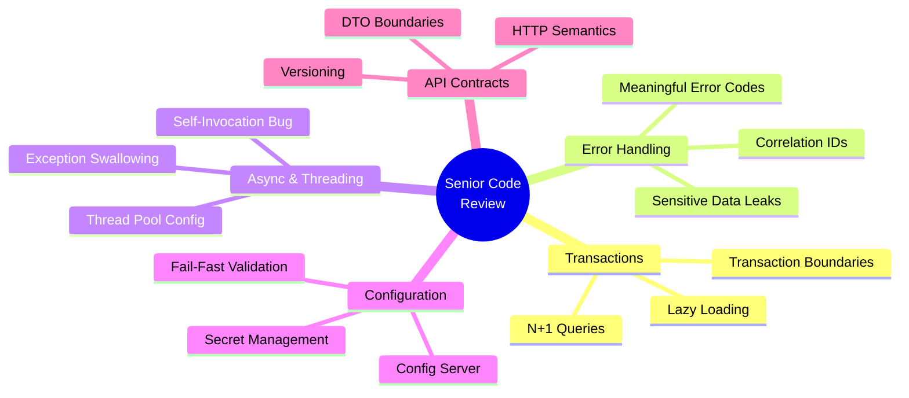

> **💡 Key Insight:** A senior code review isn't about finding *more* problems — it's about finding the **right** problems: the ones that will only surface after a thousand concurrent users hit your service on a Friday night.

---

## Prerequisites

Before diving into this tutorial, you should be comfortable with:

| Skill | Why You Need It |
|---|---|
| **Java 17+** | Records, pattern matching, and modern language features used throughout examples |
| **Spring Boot fundamentals** | `@RestController`, `@Service`, `@Repository`, dependency injection |
| **Spring Data JPA / Hibernate basics** | Entities, repositories, lazy/eager fetching, `@Transactional` |
| **Microservices concepts** | Service boundaries, REST APIs, inter-service communication |
| **Basic concurrency in Java** | Threads, `ExecutorService`, `CompletableFuture` |
| **Maven/Gradle** | Building and running Spring Boot applications |
| **HTTP fundamentals** | Methods, status codes, headers, idempotency |

> ⚠️ **Not a beginner tutorial:** This guide assumes you've written at least one Spring Boot service and understand core concepts. If you're brand new to Spring Boot, start with a fundamentals course first, then return here.

---

## Learning Objectives

By the end of this tutorial, you will be able to:

1. **Identify transaction boundary violations** that cause `LazyInitializationException` and N+1 query problems.
2. **Design production-grade error handling** with semantic error codes, correlation IDs, and safe message sanitization.
3. **Diagnose async pitfalls** including self-invocation, unbounded thread pools, and swallowed exceptions.
4. **Enforce configuration security** using environment variables, Vault, and fail-fast `@ConfigurationProperties` validation.
5. **Evaluate API contract decisions** — versioning strategies, HTTP method semantics, and DTO boundaries.
6. **Apply a triage-based review flow** that prioritizes checks based on what a PR touches.
7. **Adapt the checklist** to your own team's context using the service-type priority matrix.

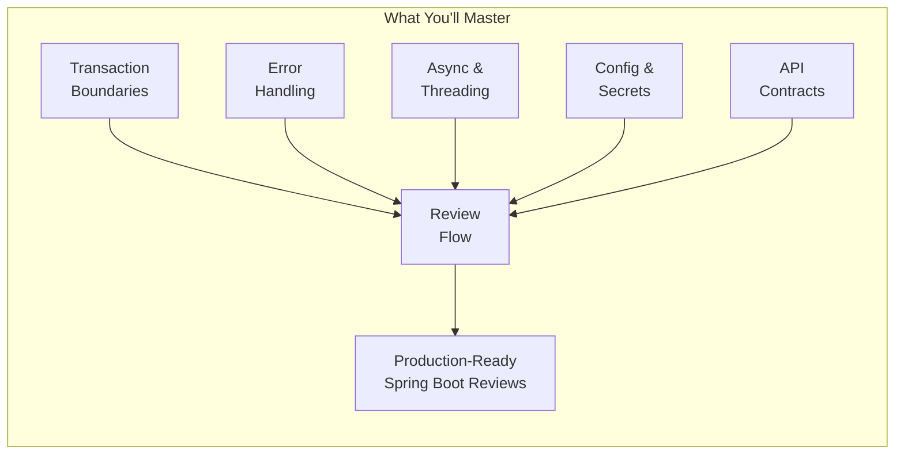

---

## The Senior Reviewer's Mental Model

Before diving into the five categories, understand the **mental model** of a senior reviewer. It's not "does this compile and pass tests?" It's a layered set of questions asked in order of blast radius:

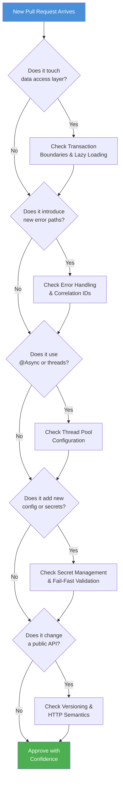

This diagram is the "table of contents" for how a senior reviewer actually thinks — not a linear checklist, but a **triage tree** based on what the PR touches.

### Why Triage, Not a Linear Checklist?

| Linear Checklist | Triage Tree |
|---|---|
| Same weight for every check | Prioritizes by blast radius |
| Can miss context-specific issues | Adapts checks to what changed |
| Feels like a bureaucracy | Feels like engineering judgment |
| Reviewer fatigue on large PRs | Focused attention where it matters |

> **💡 Pro Tip:** When reviewing a 500-line PR, the transaction/N+1 checks matter only if the PR touches JPA entities or repositories. If it's a pure controller change, spend your energy on API contract and error handling instead. This is what separates senior reviewers from checklist robots.

---

## 1. The Transaction and Lazy Loading Trap

### The Core Problem

Hibernate (and JPA in general) uses **lazy loading** as a performance optimization: related entities aren't fetched from the database until you actually access them. This is great — until you try to access them *after* the database session has closed.

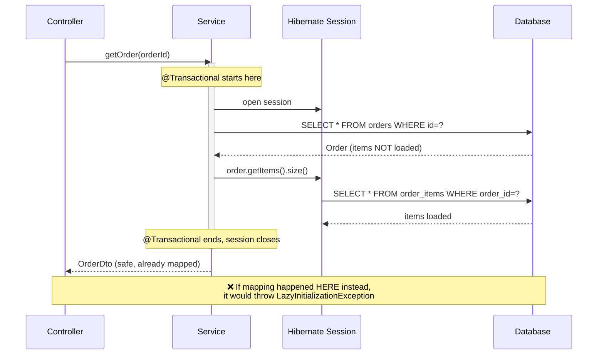

### Why Lazy Loading Exists

Hibernate doesn't eagerly load every related entity because:

- **Performance:** Fetching an entire object graph for a simple lookup wastes memory and bandwidth
- **Control:** The developer decides *when* and *how much* data to load
- **Flexibility:** The same entity can be used in different contexts with different fetch strategies

But this flexibility comes with a cost: the **session lifecycle** must be understood.

### The Persistence Context Lifecycle

1. An `@Transactional` method opens a Hibernate session
2. The session tracks loaded entities (first-level cache)
3. Lazy collections/proxies are tied to the open session
4. When the transaction commits/rolls back, the session closes
5. Any subsequent access to lazy fields throws `LazyInitializationException`

### Example 1: The Failure Case

This is the pattern that triggers the infamous exception:

```java
@RestController
public class OrderController {

    @GetMapping("/orders/{id}")
    public OrderDto getOrder(@PathVariable Long id) {
        Order order = orderService.getRawOrder(id); // transaction already closed
        // 💥 LazyInitializationException: could not initialize proxy
        int itemCount = order.getItems().size();
        return new OrderDto(order.getId(), itemCount);
    }
}

@Service
public class OrderService {
    @Transactional(readOnly = true)
    public Order getRawOrder(Long id) {
        return orderRepository.findById(id).orElseThrow();
        // Transaction ends the moment this method returns
    }
}
```

**Why this happens:** Spring's `@Transactional` proxy wraps the method call. The Hibernate session is bound to that transaction. The moment `getRawOrder()` returns, Spring commits (or rolls back) the transaction and closes the session. Any lazy field accessed afterward has no session to fetch from.

### Example 2: The Correct Pattern

```java
@Service
public class OrderService {

    @Transactional(readOnly = true)
    public OrderDto getOrder(Long orderId) {
        Order order = orderRepository.findById(orderId).orElseThrow();
        // ✅ Accessed INSIDE the transaction boundary
        int itemCount = order.getItems().size();
        return OrderMapper.toDto(order, itemCount);
    }
}
```

### Example 3: The N+1 Query Trap

Even when lazy loading doesn't throw an exception, it can silently destroy performance:

```java
// ❌ BAD: One query to get orders, then N queries — one per order — to get items
List<Order> orders = orderRepository.findAll();
for (Order order : orders) {
    System.out.println(order.getItems().size()); // triggers a query EACH iteration
}
```

If you have 1,000 orders, this fires **1,001 SQL queries** instead of 1 or 2. This is the single most common performance bug in JPA-based services, and it's invisible in local testing with 5 rows of seed data — it only shows up in production with real data volumes.

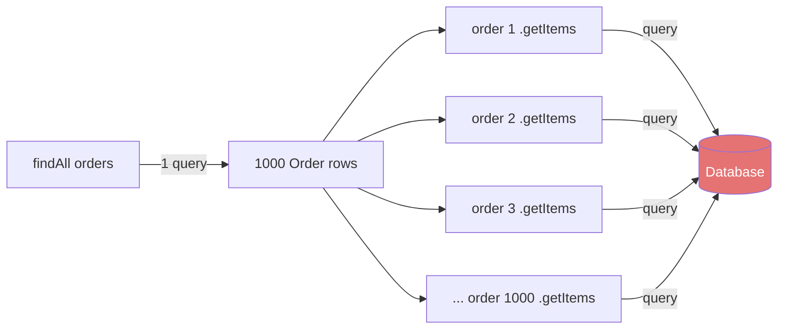

### The Fix: `JOIN FETCH` or `@EntityGraph`

```java
// Option A: JOIN FETCH in JPQL
@Query("SELECT o FROM Order o JOIN FETCH o.items WHERE o.id = :id")
Optional<Order> findByIdWithItems(@Param("id") Long id);

// Option B: @EntityGraph — declarative, reusable across queries
@EntityGraph(attributePaths = {"items"})
@Query("SELECT o FROM Order o WHERE o.id = :id")
Optional<Order> findByIdWithItemsGraph(@Param("id") Long id);

// Option C: Batch fetching for collections accessed in loops
@BatchSize(size = 25)
@OneToMany(mappedBy = "order", fetch = FetchType.LAZY)
private List<OrderItem> items;
```

`@BatchSize` is particularly useful for the N+1 loop case — instead of one query per order, Hibernate batches them into groups of 25, turning 1,000 queries into ~40.

### Comparing the Fixes

| Approach | Best For | Pros | Cons |
|---|---|---|---|
| `JOIN FETCH` (JPQL) | Single entity with known needed associations | Explicit, SQL-level control, no extra wiring | Not reusable across queries, can cause cartesian products with multiple collections |
| `@EntityGraph` | Reusable fetch strategy across many queries | Declarative, reusable, stays with the repository method | Slightly less SQL control, can be overridden accidentally |
| `@BatchSize` | Collections accessed in loops | Turns N+1 into N/batch+1, works globally | Still multiple queries (fewer), doesn't help single-entity deep fetches |
| `@NamedEntityGraph` | Shared graphs across multiple repositories | Centralized definition, team-wide reuse | Can be forgotten, adds indirection |
| DTO Projections | Read-only data paths | No entity loading at all, smallest payload | Can't use for writes, more code per query |

### The Cartesian Product Trap (Advanced)

🚨 **A warning about `JOIN FETCH` with multiple collections:**

```java
// ❌ BAD: Joining two collections creates a Cartesian product
@Query("SELECT o FROM Order o JOIN FETCH o.items JOIN FETCH o.shipments WHERE o.id = :id")
Optional<Order> findByIdDeep(@Param("id") Long id);
```

If an order has 3 items and 2 shipments, this query returns **6 rows** — Hibernate deduplicates the entity, but the database sends 6x the data. For two collections, prefer **separate queries** or `@BatchSize`.

### Transaction Boundaries: How Wide Is Too Wide?

Beyond lazy loading, the *placement* of `@Transactional` matters:

```java
// ❌ TOO WIDE: Holds a DB connection and locks for the entire method
@Transactional
public void processOrder(Order order) {
    orderRepository.save(order);
    Thread.sleep(5000);            // 5 SECONDS of lock holding!
    emailService.sendEmail(order); // external call inside transaction
    auditService.log(order);       // another external call
}

// ✅ CORRECT: Short transaction for DB work, external calls outside
public void processOrder(Order order) {
    orderRepository.save(order);   // transaction per operation
    emailService.sendEmail(order); // no DB connection held
    auditService.log(order);
}

// ✅ BEST: Read-check-write as a single short transaction
@Transactional
public void chargeWithBalanceCheck(Long accountId, BigDecimal amount) {
    Account account = accountRepository.findById(accountId).orElseThrow();
    if (account.getBalance().compareTo(amount) < 0) {
        throw new InsufficientFundsException(accountId);
    }
    account.debit(amount); // the check-then-act is atomic
}
```

> **💡 Pro Tip:** A good rule of thumb: **no external I/O (HTTP calls, email, message publishing) inside a transaction.** Database connections are precious — holding them open while waiting on a slow external service is a recipe for connection pool exhaustion.

### Reviewer's Checklist

| Check | Why It Matters |
|---|---|
| Are lazy fields accessed only inside `@Transactional` methods? | Prevents `LazyInitializationException` |
| Is `@Transactional` on the service layer, never the controller? | Controllers shouldn't manage persistence context lifecycle |
| Is there a `findAll()` followed by a loop calling a lazy getter? | Classic N+1 signature |
| Does the read path use `readOnly = true`? | Enables Hibernate flush-mode optimizations |
| Are write transactions as short as possible? | Long transactions hold DB connections and locks |
| Are DTO projections used for read-only heavy paths? | Avoids loading the full entity graph unnecessarily |
| Is `JOIN FETCH` used with multiple collections? | Cartesian product risk — separate the queries |
| Does the service initiate or join existing transactions correctly? | Propagation mismatches create subtle bugs |

### Quick Recap: Transactions & Lazy Loading

- ✅ Access lazy fields **inside** `@Transactional` boundaries
- ✅ Keep transactions **short** and `readOnly` where possible
- ✅ Use `JOIN FETCH`, `@EntityGraph`, or `@BatchSize` to defeat N+1
- ❌ Never put `@Transactional` on controllers
- ❌ Never call external services inside transactions

---

## 2. Error Handling That Doesn't Lie

### The Core Problem

A raw 500 error with a leaked stack trace isn't "letting the client know something broke" — it's a **security disclosure** and a **debugging dead end** at the same time. Good error handling does three things:

1. **Protects sensitive internals** — no schema names, SQL, stack traces, or connection details leak to clients
2. **Gives the caller something actionable** — semantic error codes and clear messages they can branch on
3. **Gives *you* something traceable** — correlation IDs that connect a client-facing error to the exact log lines across all services

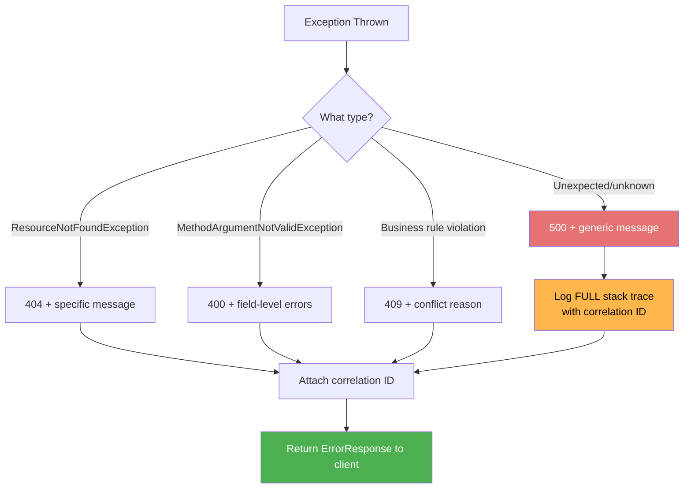

### Example 1: A Complete, Production-Grade Handler

```java
@RestControllerAdvice
public class GlobalExceptionHandler {

    private static final Logger log = LoggerFactory.getLogger(GlobalExceptionHandler.class);

    @ExceptionHandler(ResourceNotFoundException.class)
    @ResponseStatus(HttpStatus.NOT_FOUND)
    public ErrorResponse handleNotFound(ResourceNotFoundException ex, HttpServletRequest req) {
        String correlationId = MDC.get("correlationId");
        log.warn("Resource not found [{}]: {}", correlationId, ex.getMessage());
        return new ErrorResponse("NOT_FOUND", ex.getMessage(), correlationId);
    }

    @ExceptionHandler(MethodArgumentNotValidException.class)
    @ResponseStatus(HttpStatus.BAD_REQUEST)
    public ErrorResponse handleValidation(MethodArgumentNotValidException ex) {
        String correlationId = MDC.get("correlationId");
        String message = ex.getBindingResult().getFieldErrors().stream()
            .map(f -> f.getField() + ": " + f.getDefaultMessage())
            .collect(Collectors.joining(", "));
        return new ErrorResponse("VALIDATION_FAILED", message, correlationId);
    }

    @ExceptionHandler(DataIntegrityViolationException.class)
    @ResponseStatus(HttpStatus.CONFLICT)
    public ErrorResponse handleConflict(DataIntegrityViolationException ex) {
        String correlationId = MDC.get("correlationId");
        // ⚠️ Never expose ex.getMessage() here — it may contain table/column names
        log.warn("Data integrity violation [{}]", correlationId, ex);
        return new ErrorResponse("CONFLICT", "The resource already exists or violates a constraint", correlationId);
    }

    @ExceptionHandler(IllegalStateException.class)
    @ResponseStatus(HttpStatus.CONFLICT)
    public ErrorResponse handleIllegalState(IllegalStateException ex) {
        String correlationId = MDC.get("correlationId");
        // Business rule violations often surface as IllegalStateException
        log.warn("Business rule violation [{}]: {}", correlationId, ex.getMessage());
        return new ErrorResponse("INVALID_STATE_TRANSITION", ex.getMessage(), correlationId);
    }

    @ExceptionHandler(AccessDeniedException.class)
    @ResponseStatus(HttpStatus.FORBIDDEN)
    public ErrorResponse handleAccessDenied(AccessDeniedException ex) {
        String correlationId = MDC.get("correlationId");
        log.warn("Access denied [{}]", correlationId);
        return new ErrorResponse("ACCESS_DENIED", "You don't have permission to perform this action", correlationId);
    }

    @ExceptionHandler(Exception.class)
    @ResponseStatus(HttpStatus.INTERNAL_SERVER_ERROR)
    public ErrorResponse handleGeneric(Exception ex) {
        String correlationId = MDC.get("correlationId");
        // ✅ Full trace goes to logs, sanitized message goes to client
        log.error("Unexpected error [{}]", correlationId, ex);
        return new ErrorResponse("INTERNAL_ERROR", "Something went wrong. Reference: " + correlationId, correlationId);
    }
}

public record ErrorResponse(String code, String message, String correlationId) {}
```

### Why Semantic Error Codes Matter

Compare these two error responses:

```json
// ❌ Opaque code — clients must hardcode magic numbers
{
  "code": "ERR_1234",
  "message": "Operation failed"
}

// ✅ Semantic code — clients can branch programmatically
{
  "code": "VALIDATION_FAILED",
  "message": "email: must not be blank, age: must be greater than 18",
  "correlationId": "abc-123"
}
```

With semantic codes, a mobile client can show the right UI for `VALIDATION_FAILED` (highlight fields) vs `INSUFFICIENT_FUNDS` (show a balance top-up prompt) vs `INTERNAL_ERROR` (generic retry message).

### Example 2: Correlation ID Propagation Across Services

In a microservice architecture, a single user request often fans out across multiple services. Without a correlation ID threaded through all of them, debugging is guesswork.

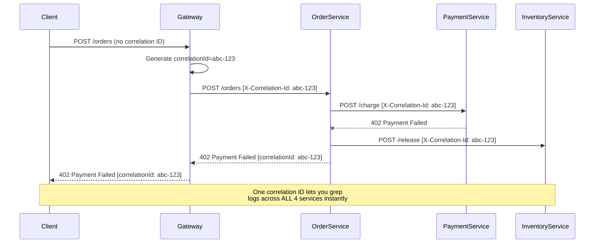

A simple filter to generate and propagate this:

```java
@Component
public class CorrelationIdFilter extends OncePerRequestFilter {

    private static final String HEADER = "X-Correlation-Id";

    @Override
    protected void doFilterInternal(HttpServletRequest request, HttpServletResponse response,
                                      FilterChain chain) throws ServletException, IOException {
        String correlationId = request.getHeader(HEADER);
        if (correlationId == null || correlationId.isBlank()) {
            correlationId = UUID.randomUUID().toString();
        }
        MDC.put("correlationId", correlationId);
        response.setHeader(HEADER, correlationId);
        try {
            chain.doFilter(request, response);
        } finally {
            MDC.remove("correlationId"); // prevent leaking into next request on same thread
        }
    }
}
```

### Propagating Correlation IDs to Downstream Services

Your filter handles *incoming* requests. But your service also makes *outgoing* calls — those need to carry the header forward:

```java
// Option A: RestClient / WebClient with the header manually
RestClient restClient = RestClient.builder()
    .defaultHeader("X-Correlation-Id", MDC.get("correlationId"))
    .build();

// Option B: An interceptor for RestTemplate
public class CorrelationIdInterceptor implements ClientHttpRequestInterceptor {
    @Override
    public ClientHttpResponse intercept(HttpRequest request, byte[] body,
            ClientHttpRequestExecution execution) throws IOException {
        String correlationId = MDC.get("correlationId");
        if (correlationId != null) {
            request.getHeaders().add("X-Correlation-Id", correlationId);
        }
        return execution.execute(request, body);
    }
}

// Option C: Feign RequestInterceptor
@Bean
public RequestInterceptor correlationIdFeignInterceptor() {
    return template -> {
        String correlationId = MDC.get("correlationId");
        if (correlationId != null) {
            template.header("X-Correlation-Id", correlationId);
        }
    };
}
```

### The MDC Thread Leak Trap

🗑️ **Warning:** The `finally { MDC.remove(...) }` isn't just paranoia. Tomcat reuses threads across requests. If you don't remove the correlation ID, request #2 on the same thread inherits request #1's ID — and suddenly every bug looks like it's caused by unrelated traffic.

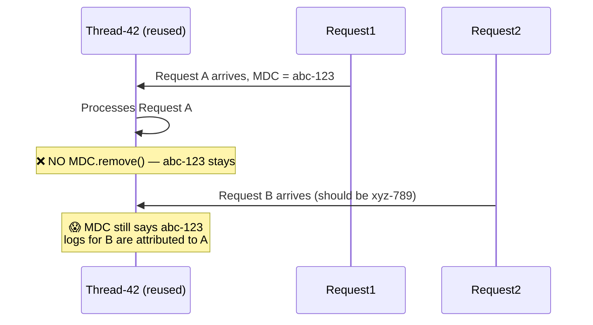

### Reviewer's Checklist

| Check | Why It Matters |
|---|---|
| Does the generic `Exception` handler log before returning? | Silent swallowing = blind production debugging |
| Are error codes semantic (`VALIDATION_FAILED`) not opaque (`ERR_1234`)? | Consumers can branch on codes programmatically |
| Is `ex.getMessage()` from DB/SQL exceptions ever returned raw? | Can leak schema, table names, connection details |
| Does every error response carry a correlation ID? | Non-negotiable for tracing across microservices |
| Is `MDC` cleared after the request (`finally` block)? | Thread pools reuse threads — stale MDC leaks between requests |
| Is the correlation ID forwarded to downstream calls? | Tracing must span service boundaries, not just one hop |
| Are authorization failures returning 403 with safe messages? | Don't reveal whether a resource exists to unauthorized users |
| Is `ConstraintViolationException` from `@Valid` handled distinctly? | Bean validation exceptions and handler-level validation need separate handling |

### Common Error-Handling Mistakes

| Mistake | Consequence | Fix |
|---|---|---|
| Returning `ex.getMessage()` from any exception | Leaks SQL, class names, connection URLs | Sanitize in specific handlers, generic message for unknown |
| Catching `Exception` and returning 200 | Client never knows something failed | Let exceptions propagate to `@RestControllerAdvice` |
| Logging full stack traces at `INFO` level | Log noise, hard to find real errors | Error/warn for expected, error for unexpected |
| No correlation ID in logs | Can't correlate a failing request across services | Always log with MDC context |
| Swallowing exceptions with empty catch blocks | Silent data loss and dead-end debugging | At minimum, log with context |
| Returning 500 for everything | Clients can't differentiate transient vs permanent failures | Map to appropriate 4xx/5xx codes |

### Quick Recap: Error Handling

- ✅ Semantic codes + correlation IDs in **every** error response
- ✅ Full stack traces to **logs**, sanitized messages to **clients**
- ✅ MDC cleared in `finally` blocks
- ✅ Correlation IDs propagated to downstream services
- ❌ Never expose raw DB/SQL exception messages
- ❌ Never swallow exceptions silently

---

## 3. The Async and Threading Minefield

### The Core Problem

`@Async` looks simple — slap an annotation on a method and it runs on another thread. But Spring's async machinery has at least three silent failure modes that only manifest under load, and none of them show up in a quick manual test.

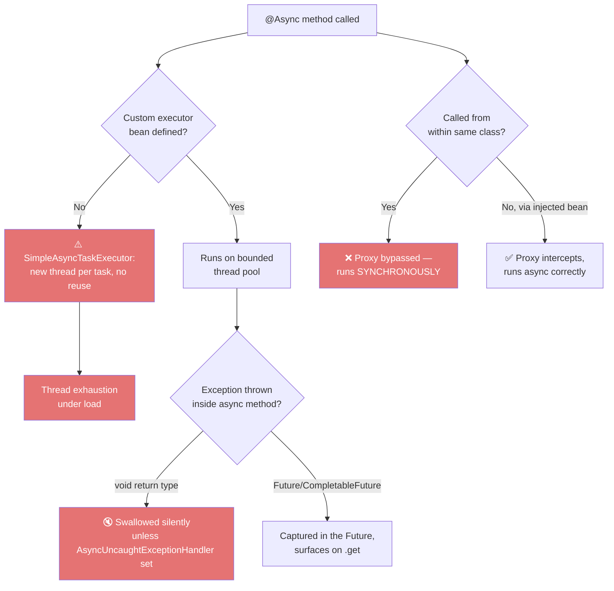

### Why Spring AOP Proxies Matter

Spring's `@Async`, `@Transactional`, and `@Cacheable` all work through **proxies**:

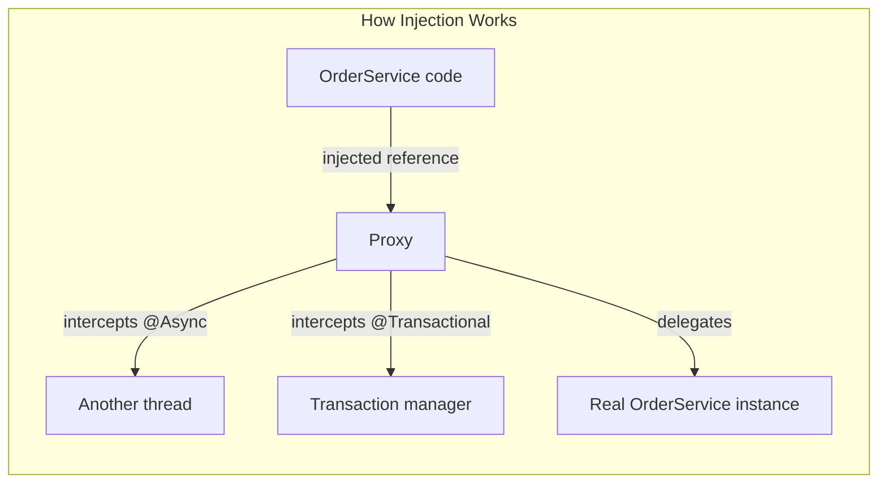

When you inject a bean into another class, you get the **proxy**. When you call `this.method()` from inside the same class, you call the **raw instance** directly — the proxy is bypassed entirely.

### Example 1: The Self-Invocation Trap

This is one of the most misunderstood Spring pitfalls:

```java
@Service
public class OrderService {

    public void processOrder(Order order) {
        // ❌ This call goes through 'this', not the Spring proxy —
        // @Async is silently ignored, sendConfirmation runs SYNCHRONOUSLY
        sendConfirmation(order);
    }

    @Async("taskExecutor")
    public void sendConfirmation(Order order) {
        // ... slow email-sending logic
    }
}
```

**Why:** Spring AOP proxies work by intercepting calls made *through the bean reference* (e.g., from another Spring-managed bean). A call made from inside the same class calls the raw method directly — no proxy, no interception, no async behavior.

**Fix:** Split into two beans, or self-inject:

```java
@Service
public class OrderService {

    private final NotificationService notificationService;

    public OrderService(NotificationService notificationService) {
        this.notificationService = notificationService;
    }

    public void processOrder(Order order) {
        notificationService.sendConfirmation(order); // ✅ goes through the proxy
    }
}

@Service
public class NotificationService {
    @Async("taskExecutor")
    public void sendConfirmation(Order order) {
        // ... slow email-sending logic
    }
}
```

> **💡 Pro Tip:** The self-invocation trap affects `@Transactional` and `@Cacheable` too, not just `@Async`. The classic symptom is "my cache isn't caching" or "my transaction isn't rolling back" with code that *looks* correct.

### Example 2: Properly Configured Thread Pool

```java
@Configuration
@EnableAsync
public class AsyncConfig implements AsyncConfigurer {

    @Bean(name = "taskExecutor")
    public Executor taskExecutor() {
        ThreadPoolTaskExecutor executor = new ThreadPoolTaskExecutor();
        executor.setCorePoolSize(5);
        executor.setMaxPoolSize(10);
        executor.setQueueCapacity(100);
        executor.setThreadNamePrefix("async-");
        // ✅ Rejection policy: caller runs the task instead of throwing
        executor.setRejectedExecutionHandler(new ThreadPoolExecutor.CallerRunsPolicy());
        executor.initialize();
        return executor;
    }

    @Override
    public AsyncUncaughtExceptionHandler getAsyncUncaughtExceptionHandler() {
        // ✅ Catches exceptions from void-returning @Async methods
        return (throwable, method, params) ->
            log.error("Uncaught async exception in {}: {}", method.getName(), throwable.getMessage(), throwable);
    }
}
```

### Thread Pool Sizing: Back-of-the-Envelope Math

| Metric | Value | Rationale |
|---|---|---|
| Core pool size | Number of CPU cores available | Handles baseline load efficiently |
| Max pool size | 2-4x core size (depending on I/O vs CPU) | Burst capacity for spikes |
| Queue capacity | Depends on acceptable latency and memory | Too small = rejection, too big = memory pressure |
| Rejection policy | `CallerRunsPolicy` or custom fallback | Never silently drop work |

**A practical formula for I/O-bound tasks** (HTTP calls, DB, email):

```
Core threads   = 2 × number of CPU cores
Max threads    = 10 × number of CPU cores  (if tasks are primarily I/O bound)
Queue capacity = 100–1000 depending on memory budget
```

> ⚠️ **Note:** For CPU-bound tasks, keep threads near the core count — more threads than cores causes context-switching thrash. For I/O-bound tasks, threads mostly wait on network responses, so higher counts are fine.

### Example 3: Timeout Protection with `CompletableFuture`

```java
@Async("taskExecutor")
public CompletableFuture<Void> sendEmail(String userId, String content) {
    return CompletableFuture.runAsync(() -> emailClient.send(userId, content))
        .orTimeout(5, TimeUnit.SECONDS)
        .exceptionally(ex -> {
            log.error("Email send timed out or failed for user {}", userId, ex);
            return null;
        });
}
```

Without this timeout, a hanging downstream email provider can exhaust your entire thread pool — and once the pool is exhausted, *every other* `@Async` task queues up behind it, including unrelated ones. This is how one slow dependency takes down an entire service.

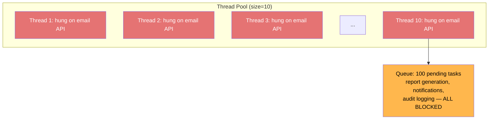

### The Cascading Failure Chain

```
Slow Email API
    → Thread pool threads hang (no timeout)
    → Queue fills with unrelated tasks
    → CallerRunsPolicy kicks in: request threads now run async work
    → Request threads get slower
    → HTTP requests pile up on Tomcat
    → Service becomes unresponsive
    → Downstream health checks fail → service is restarted
```

This is why **every** async operation should have an explicit timeout — the failure must be contained to the single task, not the entire pool.

### Async + Virtual Threads: The Modern Option

Java 21 introduces **virtual threads** — lightweight threads that don't map 1:1 to OS threads. For I/O-bound work, this changes the calculus:

```java
@Configuration
@EnableAsync
public class AsyncConfig {
    @Bean(name = "virtualTaskExecutor")
    public Executor virtualTaskExecutor() {
        return Executors.newVirtualThreadPerTaskExecutor(); // no pool needed!
    }
}
```

```java
@Service
public class NotificationService {
    @Async("virtualTaskExecutor")
    public CompletableFuture<Void> sendEmail(String userId, String content) {
        // Virtual threads are cheap — thousands can be created
        return CompletableFuture.runAsync(() -> emailClient.send(userId, content))
            .orTimeout(5, TimeUnit.SECONDS)
            .exceptionally(ex -> {
                log.error("Email send failed for user {}", userId, ex);
                return null;
            });
    }
}
```

**When to consider virtual threads:**
- ✅ Heavy I/O-bound workload (HTTP calls, DB, message queues)
- ✅ You're already on Java 21+
- ✅ Tasks are mostly blocked waiting on network

**When to stick with a bounded pool:**
- ❌ CPU-bound processing (virtual threads don't help — cores still limit you)
- ❌ You need queue capacity control (a per-task-thread model has no bounded queue)
- ❌ Your downstream systems can't handle unbounded concurrency (rate limiting still required)

> **💡 Pro Tip:** Virtual threads don't eliminate the need for timeouts or rate limiting. They just remove the *thread pool* as the bottleneck. Your downstream APIs can still be overwhelmed — protect them with timeouts and circuit breakers.

### Reviewer's Checklist

| Check | Why It Matters |
|---|---|
| Is there a custom `ThreadPoolTaskExecutor` bean? | Default `SimpleAsyncTaskExecutor` spawns unbounded threads |
| Is `AsyncUncaughtExceptionHandler` configured? | Void-return async exceptions vanish silently otherwise |
| Is `@Async` ever called from within the same class? | Proxy bypass = silent synchronous execution |
| Does the async task have a timeout? | Prevents thread pool exhaustion from a hanging dependency |
| Is there a sane rejection policy for a full queue? | Default `AbortPolicy` throws `RejectedExecutionException` |
| Are task-specific thread pools isolated per workload type? | A slow email task shouldn't starve audit logging |
| Is the async method idempotent? | Retry logic or redelivery can execute it multiple times |
| Is `@EnableAsync` configured with the right executor? | Ensures the intended pool is the default |

### Common Async Mistakes

| Mistake | Symptom | Fix |
|---|---|---|
| Self-invocation | Method runs *synchronously*, performance regression under load | Split into separate beans |
| No custom executor | Unlimited threads under load, OOM | Define bounded `ThreadPoolTaskExecutor` |
| No timeout | Thread pool exhaustion from hung dependency | `.orTimeout()` on futures, HTTP timeouts on clients |
| Void return + no handler | Exceptions disappear, bugs invisible | Config `AsyncUncaughtExceptionHandler` |
| Default `AbortPolicy` | `RejectedExecutionException` under peak load | `CallerRunsPolicy` or graceful degradation |
| Shared executor across workloads | One slow task starves another | Separate pools per workload type |

### Quick Recap: Async & Threading

- ✅ Define a bounded custom executor — never use the default
- ✅ Catch async exceptions explicitly (handler or futures)
- ✅ Add timeouts to every async operation
- ✅ Never call `@Async` methods via `this`
- ✅ Use separate pools for distinct workloads
- ✅ Consider virtual threads for I/O-heavy work on Java 21+

---

## 4. Configuration and Secret Management

### The Core Problem

A hardcoded password in `application.yml` isn't a style issue — it's a security incident sitting in your git history forever (even if you delete it later, it's still in the commit log). Configuration review is as much about security posture as it is about operability.

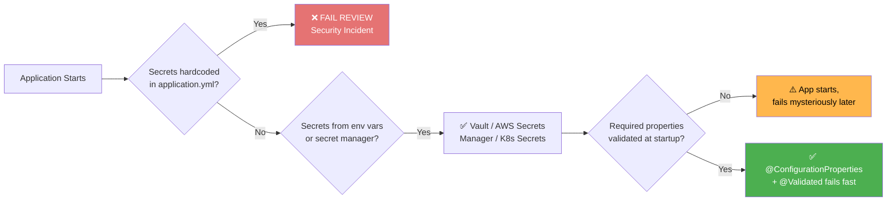

### Why Committed Secrets Are Forever

```yaml
# application.yml — ❌ NEVER DO THIS
spring:
  datasource:
    url: jdbc:postgresql://localhost:5432/mydb
    username: admin
    password: P@ssw0rd123
```

Once committed, this password is in your git history permanently — rotating the password in the database doesn't remove it from history, and anyone with repo access (including former employees, if access wasn't revoked) can see it.

| Myth | Reality |
|---|---|
| "I'll delete the file in the next commit" | It's still in the previous commit's history |
| "I'll squash the commits" | History rewrites are error-prone and often incomplete |
| "It's just a dev credential" | Dev credentials often mirror prod, and everyone reuses them |
| "Our repo is private" | Private repos still have collaborators, CI systems, forks, exports |

**The only true fix:** rotate the secret *and* rewrite history (e.g., `git filter-repo`) — and even then, assume compromise.

### Example 1: The Anti-Pattern ✅/❌

```yaml
# ❌ NEVER DO THIS — hardcoded credentials in application.yml
spring:
  datasource:
    url: jdbc:postgresql://localhost:5432/mydb
    username: admin
    password: P@ssw0rd123
```

```yaml
# application.yml — ✅ references env vars, no literal secrets
spring:
  datasource:
    url: ${DB_URL}
    username: ${DB_USERNAME}
    password: ${DB_PASSWORD}
```

```yaml
# In production, injected via Kubernetes secret or Vault, e.g.:
# kubectl create secret generic db-creds \
#   --from-literal=DB_USERNAME=admin \
#   --from-literal=DB_PASSWORD=<rotated-securely>
```

### Example 2: HashiCorp Vault Integration

For teams using HashiCorp Vault directly with Spring Cloud Vault:

```yaml
spring:
  cloud:
    vault:
      uri: https://vault.internal:8200
      authentication: KUBERNETES
      kubernetes:
        role: order-service
  config:
    import: "vault://secret/order-service"
```

Vault isn't the only option — choose based on your platform:

| Secret Store | Best For | Integration |
|---|---|---|
| **HashiCorp Vault** | Multi-cloud, dynamic secrets, PKI, rotation | Spring Cloud Vault |
| **AWS Secrets Manager** | AWS-native workloads, automatic rotation | AWS SDK, Spring Cloud AWS |
| **Kubernetes Secrets** | Already on K8s, no extra infra | Mount as env vars or files |
| **Azure Key Vault** | Azure-native workloads | Azure SDK, Spring Cloud Azure |
| **GCP Secret Manager** | GCP-native workloads | GCP SDK, Spring Cloud GCP |
| **Spring Config Server** | Centralized config, Git-backed | `spring.config.import` |

### Example 3: Fail-Fast Configuration Validation

```java
@ConfigurationProperties(prefix = "payment")
@Validated
public record PaymentConfig(
    @NotBlank String apiKey,
    @NotNull @Positive Integer timeoutSeconds,
    @NotBlank @Pattern(regexp = "https://.*") String baseUrl
) {}
```

```java
@Configuration
@EnableConfigurationProperties(PaymentConfig.class)
public class PaymentConfiguration {
}
```

If `payment.api-key` is missing, the application **refuses to start** with a clear error message pointing to the missing property — instead of starting successfully and then throwing a confusing `NullPointerException` the first time a payment is processed at 2 AM.

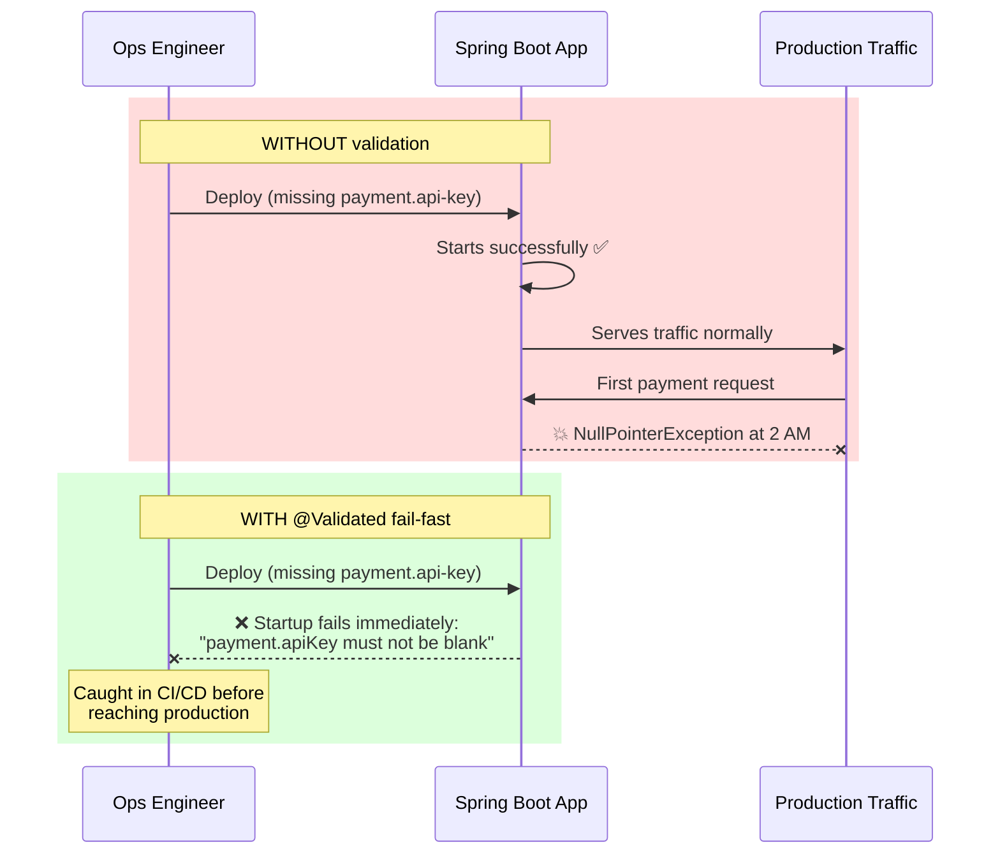

### Advanced Validation: Cross-Field Rules

Simple `@NotBlank`/`@Positive` annotations can't express *relationships* between fields. For cross-field validation, add a custom validator:

```java
@ConfigurationProperties(prefix = "retry")
@Validated
public record RetryConfig(
    int maxAttempts,
    @NotNull Duration initialBackoff,
    Duration maxBackoff
) {
    public RetryConfig {
        if (maxAttempts < 1) {
            throw new IllegalArgumentException("maxAttempts must be >= 1");
        }
        if (maxBackoff != null && maxBackoff.compareTo(initialBackoff) < 0) {
            throw new IllegalArgumentException("maxBackoff must be >= initialBackoff");
        }
    }
}
```

The compact constructor in a record runs during construction — perfect for enforcing invariants beyond simple annotations.

### Sensitive Configuration: Ensure Not Logged

A classic leak: config values logged by Spring Boot at startup.

```yaml
# application.yml
logging:
  level:
    org.springframework.boot.autoconfigure: WARN   # suppress sensitive data dumps
```

Also, consider masking in logs:

```java
@Component
public class SensitiveDataPatternLayout extends PatternLayout {
    private static final Pattern SENSITIVE = Pattern.compile(
        "(password|secret|token|apiKey)=([^&\\s,]+)");

    @Override
    public String doLayout(ILoggingEvent event) {
        String message = super.doLayout(event);
        Matcher matcher = SENSITIVE.matcher(message);
        return matcher.replaceAll("$1=***MASKED***");
    }
}
```

### Example 4: `@Value` vs `@ConfigurationProperties`

```java
// ❌ Scattered, not type-safe, hard to test
@Value("${payment.api-key}")
private String apiKey;

@Value("${payment.timeout-seconds}")
private int timeoutSeconds;

@Value("${payment.base-url}")
private String baseUrl;
```

```java
// ✅ Grouped, type-safe, validated as a unit, easy to mock in tests
@ConfigurationProperties(prefix = "payment")
public record PaymentConfig(String apiKey, int timeoutSeconds, String baseUrl) {}
```

| Feature | Scattered `@Value` | `@ConfigurationProperties` |
|---|---|---|
| Type safety | Manual conversions, runtime errors | Compile-time, conversion handled |
| Validation | Manual, easy to forget | `@Validated` + Bean Validation annotations |
| Grouping | None — scattered across classes | Grouped by prefix |
| Testability | Hard to mock many scattered fields | One object to construct/mock |
| IDE support | Raw string keys, no completion | Metadata generation, completion |
| Nested configs | Awkward | First-class support (records/classes) |

### Reviewer's Checklist

| Check | Why It Matters |
|---|---|
| Are secrets pulled from env vars / Vault / Secrets Manager? | Hardcoded secrets = permanent git history exposure |
| Do profile-specific YAML files avoid secrets entirely? | Even "dev" secrets get reused and leaked |
| Is `@ConfigurationProperties` + `@Validated` used for required config? | Fail fast at startup, not at 2 AM in production |
| Is scattered `@Value` usage replaced with grouped config classes? | Type safety, testability, single source of truth |
| Is `spring.config.import` used for centralized config server? | Cleaner than maintaining N profile files by hand |
| Are config values ever logged? | Sensitive values leak into logs, then into log aggregation |
| Does the app fail fast on missing mandatory config? | Prevents mysterious runtime failures hours after deploy |
| Are environment-specific overrides cleanly separated? | Profile files shouldn't drift or duplicate secrets |

### Common Config Mistakes

| Mistake | Consequence | Fix |
|---|---|---|
| Hardcoded secret in YAML | Permanent security exposure | Environment variables / secret manager |
| No validation on required props | App starts, NPE at 2 AM | `@ConfigurationProperties` + `@Validated` |
| `@Value` scattered everywhere | Untestable, error-prone | Grouped config records |
| Secrets in log output | Credentials in centralized logs | Masking, never log config values |
| Defaults hiding misconfig | Prod mysteriously uses wrong values | Explicit env vars with fail-fast, no silent fallbacks |
| Overriding dev/prod via profile YAML drift | Environments behave differently | Centralized config server or consistent env var injection |

### Quick Recap: Configuration & Secrets

- ✅ Secrets from env vars / Vault / Secrets Manager — never in YAML
- ✅ `@ConfigurationProperties` + `@Validated` for fail-fast startup
- ✅ Group related config into typed records
- ✅ Mask sensitive values in logs
- ❌ Never commit secrets — they live in git history forever
- ❌ Never rely on silent defaults for critical config

---

## 5. API Contract and Versioning Discipline

### The Core Problem

In a microservice architecture, your REST API is a **contract**, not an implementation detail. Other teams build clients against it. Breaking that contract without warning breaks their systems — and their trust.

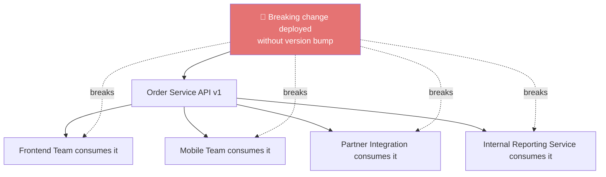

### Example 1: Versioning Strategies Compared

```java
// Strategy A: URI Versioning (most common, explicit)
@RestController
@RequestMapping("/api/v1/orders")
public class OrderControllerV1 { }

@RestController
@RequestMapping("/api/v2/orders")
public class OrderControllerV2 { }
```

```java
// Strategy B: Header Versioning (cleaner URLs, less discoverable)
@GetMapping(value = "/orders/{id}", headers = "X-API-Version=1")
public OrderDtoV1 getOrderV1(@PathVariable Long id) { }

@GetMapping(value = "/orders/{id}", headers = "X-API-Version=2")
public OrderDtoV2 getOrderV2(@PathVariable Long id) { }
```

```java
// Strategy C: Content Negotiation via Media Type
@GetMapping(value = "/orders/{id}", produces = "application/vnd.company.order.v1+json")
public OrderDtoV1 getOrderV1(@PathVariable Long id) { }
```

### Versioning Strategy Comparison

| Strategy | Example | Pros | Cons |
|---|---|---|---|
| **URI** | `/api/v1/orders` | Explicit, cache-friendly, easy to debug in browser | URLs get uglier; sometimes seen as "impure REST" |
| **Header** | `X-API-Version: 1` | Clean URLs | Hidden — easy to forget, bad browser visibility |
| **Media Type** | `application/vnd.co.order.v1+json` | "Most pure" REST | Complex, hard to debug, content negotiation adds friction |
| **Query Param** | `/orders?v=1` | Simple | Pollutes query space, easy to lose in proxies |

**Reviewer's judgment call:** URI versioning is the most explicit and cache-friendly — it's the pragmatic default for most teams. Header/media-type versioning is "more RESTfully pure" but harder to debug (you can't just paste a URL in a browser) and often overkill unless you have strict REST governance requirements.

### When Is a Change "Breaking"?

| Change | Breaking? |
|---|---|
| Add a new optional field to the response | ✅ Non-breaking |
| Add a new endpoint | ✅ Non-breaking |
| Add a new optional request parameter | ✅ Non-breaking |
| Remove a response field | ❌ Breaking |
| Rename a response field | ❌ Breaking |
| Change a field's type (e.g., `String` → `Long`) | ❌ Breaking |
| Make a previously optional field required | ❌ Breaking |
| Change error response shape | ❌ Breaking (usually) |
| Change HTTP status codes for existing cases | ❌ Breaking (if clients branch on status) |
| Tighten validation rules | ❌ Breaking (clients may submit previously-valid payloads) |
| Add a new required request field | ❌ Breaking |

### Deprecation Policy Best Practice

A mature API has a **deprecation lifecycle**:

```java
@Deprecated(since = "2026-08", forRemoval = true)
@GetMapping("/v1/orders/{id}")
public OrderDtoV1 getOrderV1(@PathVariable Long id) {
    log.warn("Deprecated v1 endpoint called. Migrate to /v2/orders/{id}");
    return orderService.getOrderV1(id);
}
```

```yaml
# And a deprecation header to warn consumers programmatically
# Cache-Control: no-store (don't cache deprecated responses)
# Deprecation: true
# Sunset: Sat, 31 Jan 2027 23:59:59 GMT
```

| Phase | Duration | Action |
|---|---|---|
| **Announce** | At release | Log deprecation, notify consumers |
| **Deprecate** | 6-12 months | Keep old version, add `Deprecation` header, warn in logs |
| **Sunset** | After window | Remove old version after confirming no traffic |
| **Force migrate** | Last resort | 410 Gone with migration link |

### Example 2: HTTP Method Semantics — PUT vs PATCH

```java
// ✅ PUT — full replacement, idempotent
// Calling this twice with the same body produces the same result
@PutMapping("/orders/{id}")
public OrderDto replaceOrder(@PathVariable Long id, @RequestBody OrderRequest fullOrder) {
    return orderService.replace(id, fullOrder);
}

// ✅ PATCH — partial update, not necessarily idempotent
@PatchMapping("/orders/{id}")
public OrderDto updateOrderStatus(@PathVariable Long id, @RequestBody Map<String, Object> fields) {
    return orderService.applyPartialUpdate(id, fields);
}
```

```java
// ❌ Anti-pattern: using PUT for partial updates
@PutMapping("/orders/{id}")
public OrderDto updateOrder(@PathVariable Long id, @RequestBody OrderRequest partialFields) {
    // Silently ignores missing fields instead of nulling them out —
    // violates the idempotent "full replace" contract that PUT implies
    return orderService.merge(id, partialFields);
}
```

### HTTP Method Semantics Quick Reference

| Method | Semantics | Idempotent? | Safe? | Typical Status |
|---|---|---|---|---|
| `GET` | Read | ✅ | ✅ | 200 |
| `POST` | Create / trigger action | ❌ | ❌ | 201 |
| `PUT` | Full replace | ✅ | ❌ | 200/204 |
| `PATCH` | Partial update | ❌ (usually) | ❌ | 200 |
| `DELETE` | Remove | ✅ | ❌ | 204 |
| `HEAD` | Headers only | ✅ | ✅ | 200 |

### Example 3: Correct HTTP Status Codes and the `Location` Header

```java
@RestController
@RequestMapping("/api/v1/orders")
public class OrderController {

    private final OrderService orderService;

    @PostMapping
    public ResponseEntity<OrderDto> createOrder(@RequestBody @Valid OrderRequest request) {
        OrderDto created = orderService.create(request);
        URI location = ServletUriComponentsBuilder
            .fromCurrentRequest()
            .path("/{id}")
            .buildAndExpand(created.id())
            .toUri();
        // ✅ 201 Created + Location header — REST best practice
        return ResponseEntity.created(location).body(created);
    }

    @DeleteMapping("/{id}")
    public ResponseEntity<Void> deleteOrder(@PathVariable Long id) {
        orderService.delete(id);
        // ✅ 204 No Content — nothing to return, deletion succeeded
        return ResponseEntity.noContent().build();
    }

    @PutMapping("/{id}/cancel")
    public ResponseEntity<ErrorResponse> cancelAlreadyShippedOrder(@PathVariable Long id) {
        // ✅ 409 Conflict — state transition not allowed
        return ResponseEntity.status(HttpStatus.CONFLICT)
            .body(new ErrorResponse("INVALID_STATE_TRANSITION", "Order already shipped", null));
    }
}
```

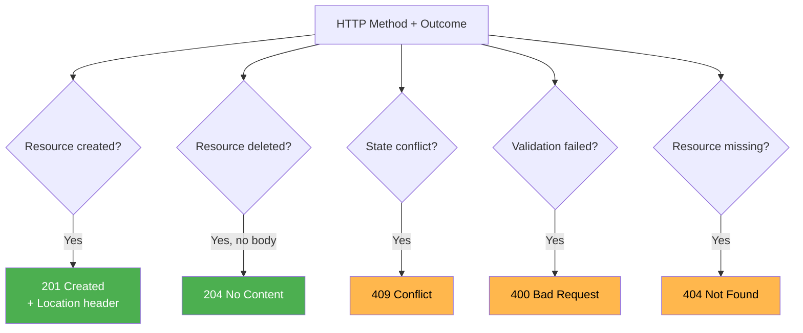

### Status Code Decision Guide

| Scenario | Wrong Status | Correct Status |
|---|---|---|
| Created resource | 200 | **201** + Location header |
| Deleted resource | 200 with empty body | **204** |
| Input validation failed | 500 | **400** |
| Resource not found | 200 with null body | **404** |
| State transition not allowed | 400 | **409** |
| Unauthorized (no auth info) | 403 | **401** |
| Authenticated but forbidden | 401 | **403** |
| Too many requests | 500 | **429** |
| Async/queued acceptance | 200 | **202 Accepted** |

### Example 4: DTOs vs Leaking JPA Entities

```java
// ❌ Leaking the entity directly exposes your database schema
@GetMapping("/{id}")
public Order getOrder(@PathVariable Long id) {
    return orderRepository.findById(id).orElseThrow();
    // Client now sees: internal audit fields, @Version column,
    // lazy proxies that might serialize weirdly, foreign key structure...
}
```

```java
// ✅ DTO boundary — you control exactly what's exposed, and can evolve
// the database schema without breaking the API contract
public record OrderDto(Long id, String status, BigDecimal total, List<OrderItemDto> items) {}

@GetMapping("/{id}")
public OrderDto getOrder(@PathVariable Long id) {
    Order order = orderRepository.findById(id).orElseThrow();
    return OrderMapper.toDto(order);
}
```

### Why DTO Boundaries Matter

| Problem with Entity Leakage | Consequence |
|---|---|
| Exposes schema internals | Clients couple to your database, not your API |
| Serializes lazy proxies | `LazyInitializationException` during JSON serialization, weird JSON output |
| Includes audit/version fields | Information disclosure: `createdAt`, `lastModifiedBy`, `@Version` values |
| No shape control | Can't add computed fields, transform enums, or remove internals |
| Hard to evolve | Changing the entity breaks the API contract |

### The "Always 200" Anti-Pattern

```java
// ❌ BAD: Everything returns 200, errors embedded in the body
@GetMapping("/orders/{id}")
public ResponseEntity<?> getOrder(@PathVariable Long id) {
    try {
        Order order = orderRepository.findById(id).orElse(null);
        if (order == null) {
            return ResponseEntity.ok(Map.of("success", false, "error", "not found"));
        }
        return ResponseEntity.ok(Map.of("success", true, "data", order));
    } catch (Exception ex) {
        return ResponseEntity.ok(Map.of("success", false, "error", ex.getMessage()));
    }
}
```

Why this is harmful:
- Clients must parse the body to understand success/failure
- HTTP-level infrastructure (caches, proxies, load balancers) can't react to failures
- The 200-with-error pattern hides problems from monitoring/alerting
- It requires every client to implement custom error parsing logic

### Reviewer's Checklist

| Check | Why It Matters |
|---|---|
| Is the API versioned (URI, header, or media type)? | Prevents breaking existing consumers silently |
| Is PUT idempotent and PATCH used for partial updates? | Violating HTTP semantics breaks client assumptions & caching |
| Are correct status codes used (201/204/409, not always 200)? | Clients often branch logic on status codes |
| Does POST return a `Location` header? | REST convention, expected by many API clients/tools |
| Are DTOs used instead of returning JPA entities directly? | Decouples API contract from database schema |
| Are breaking changes given a deprecation window? | Consumers need time to migrate |
| Is the error response shape consistent across endpoints? | Clients need one parser, not endpoint-specific logic |
| Are collection endpoints paginated with stable cursors? | Prevents payload bloat and broken offsets |

### Quick Recap: API Contracts

- ✅ Version explicitly — URI is the pragmatic default
- ✅ Use correct HTTP methods and status codes
- ✅ DTOs at the boundary — never raw entities
- ✅ Deprecation windows for breaking changes
- ✅ Consistent error shape with correlation IDs
- ❌ Never use "200 with success:false" — it hides failures from infrastructure

---

## Putting It All Together: The Full Review Flow

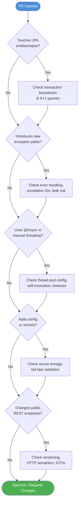

### A Step-by-Step Review Session Example

Let's trace a realistic PR through this flow:

**PR:** "Add order cancellation endpoint with email notification"

1. **Does it touch JPA entities/repos?** ✅ Yes — adds `cancel()` to `OrderService` and a `findByStatus()` query.
   - **Check:** Is `@Transactional` on the service method? Are lazy fields accessed inside? Does the new query batch-fetch items?
2. **New exception paths?** ✅ Yes — introduces `OrderAlreadyShippedException`.
   - **Check:** Is there a handler? Does it return 409 with correlation ID? Does the generic handler still mask the message?
3. **Async?** ✅ Yes — sends cancellation email via `@Async`.
   - **Check:** Is it called via injected bean (not self-invocation)? Does it have a timeout? Which executor?
4. **New config?** ✅ Yes — adds `notification.email-timeout-ms`.
   - **Check:** Is it from env/secret manager? Is `@ConfigurationProperties` + `@Validated` used?
5. **API changes?** ✅ Yes — new `POST /api/v1/orders/{id}/cancel`.
   - **Check:** Correct status codes (200 vs 202 vs 409)? DTO returned, not entity? Consistent error shape?

This is the triage tree in action — every check follows the previous one, and the reviewer's time is spent exactly where the PR's risks live.

---

## Prioritizing the Checklist by Service Type

Not every check applies equally to every service. Use this matrix to prioritize your review time:

| Service Type | Transactions | Error Handling | Async/Threading | Config/Secrets | API Contract |
|---|:---:|:---:|:---:|:---:|:---:|
| **Payment Service** | 🔴 Critical | 🔴 Critical | 🟡 Moderate | 🔴 Critical | 🔴 Critical |
| **Read-Only Reporting** | 🟡 Moderate | 🟢 Standard | 🟢 Standard | 🟡 Moderate | 🟡 Moderate |
| **Notification Service** | 🟢 Standard | 🟡 Moderate | 🔴 Critical | 🟡 Moderate | 🟢 Standard |
| **Public-Facing API Gateway** | 🟢 Standard | 🔴 Critical | 🟡 Moderate | 🔴 Critical | 🔴 Critical |
| **Internal Batch Job** | 🔴 Critical | 🟡 Moderate | 🔴 Critical | 🟡 Moderate | 🟢 Standard |

### How to Use This Matrix

| Color | Action |
|---|---|
| 🔴 **Critical** | Every PR touching this area **must** pass the associated checks before merge |
| 🟡 **Moderate** | Review carefully, but only when the PR touches the area |
| 🟢 **Standard** | Basic sanity check — usually fine, don't over-invest |

> **💡 Pro Tip:** Customize this matrix for your organization. A service that calls external payment APIs deserves more async/timeout scrutiny than one that only reads an internal database. The matrix is scaffolding, not scripture.

---

## Common Pitfalls and Troubleshooting Guide

### Pitfall 1: `LazyInitializationException: could not initialize proxy - no Session`

**Symptoms:**
- Exception appears at random endpoints
- Only happens on some objects (those with lazy collections)
- Often appears during JSON serialization

**Diagnosis:**
```java
// Where does the exception occur? If it's in a Controller or DTO mapper
// that's OUTSIDE the @Transactional service method, you've found the problem.
```

**Fixes (in order of preference):**
1. **Do the mapping inside the transaction** (best, most explicit)
2. **`JOIN FETCH` / `@EntityGraph`** for entities that are always returned with collections
3. **DTO projections** for read-only list endpoints
4. **`@BatchSize`** for loop-based access across many entities
5. **`spring.jpa.open-in-view=false`** — *always* disable OIV; don't rely on it

> ⚠️ **Warning about `spring.jpa.open-in-view`:** The default is `true`, which keeps the session open through the view rendering — this *hides* lazy loading problems. It also holds DB connections longer. Always set `spring.jpa.open-in-view: false` in production. Then fix the code that breaks.

### Pitfall 2: N+1 Queries Slowing Everything Down

**Symptoms:**
- Endpoint is fast in dev, slow in prod
- Database logs show hundreds of identical `SELECT` statements
- Page load time scales linearly with data volume

**Diagnosis:**
```yaml
# Enable Hibernate SQL logging temporarily
logging:
  level:
    org.hibernate.SQL: DEBUG
```
Run the endpoint, count the queries. Repetitive identical SELECT = N+1.

**Fixes:**
- `@EntityGraph(attributePaths = {"items"})` on the repository method
- `@BatchSize(size = 25)` on the collection
- DTO projections instead of entity graphs for read-only paths

### Pitfall 3: Transactions "Not Rolling Back"

**Symptoms:**
- Test an error path and data is still committed
- `@Transactional` seems ignored

**Causes & Fixes:**

| Cause | Fix |
|---|---|
| Self-invocation (method called via `this`) | Split into separate beans or self-inject |
| Method is `private` or not public | Spring proxies can't intercept non-public methods |
| Class is `final` | CGLIB proxy creation fails or silently degrades |
| Exception is caught inside the method | Let it propagate (or `TransactionAspectSupport.currentTransactionStatus().setRollbackOnly()`) |
| Checked exception by default doesn't roll back | Configure `rollbackFor = Exception.class` |
| `@Transactional` on controller instead of service | Move to service layer |

### Pitfall 4: `@Async` Runs Synchronously

**Symptoms:**
- Endpoint latency grows when async work is added
- Thread dump shows async work on the request thread
- No new threads appear in logs

**Diagnosis:** Check for self-invocation:

```java
// ❌ Same class — proxy bypassed
class OrderService {
    public void process(...) { sendEmail(...); }  // BAD
    @Async public void sendEmail(...) { ... }
}

// ✅ Different bean — proxy intercepts
class OrderService {
    NotificationService notifications;
    public void process(...) { notifications.sendEmail(...); }  // GOOD
}
```

### Pitfall 5: Exceptions Disappear in Async Code

**Symptoms:**
- Errors happen silently; retry mechanisms kick in but nothing logs
- Business logic fails but no log entries exist
- Tests pass but prod has unexplained missing emails/events

**Diagnosis:** Check if the async method returns `void` and whether `AsyncUncaughtExceptionHandler` is configured. If neither, exceptions vanish.

**Fix:**
```java
@Configuration
@EnableAsync
public class AsyncConfig implements AsyncConfigurer {
    @Override
    public AsyncUncaughtExceptionHandler getAsyncUncaughtExceptionHandler() {
        return (throwable, method, params) ->
            log.error("Async exception in {}: {}", method.getName(), throwable.getMessage(), throwable);
    }
}
```

### Pitfall 6: App Starts but Fails at Runtime (Config)

**Symptoms:**
- Works in dev, breaks in prod
- "NullPointerException at line X" pointing to a config value
- Values like `apiKey` are `null` in debugger

**Diagnosis & Fix:**
```java
// ❌ App starts with null apiKey
@Value("${payment.api-key:}") private String apiKey;

// ✅ Fail fast
@ConfigurationProperties(prefix = "payment")
@Validated
public record PaymentConfig(@NotBlank String apiKey, @NotNull Integer timeoutSeconds) {}
```

### Pitfall 7: Secrets in Git History

**Symptoms:**
- A secret was committed; deleting it from the file doesn't help
- Security scanner flags the repo (GitGuardian, TruffleHog, etc.)

**Fix:**
1. **Immediately rotate the secret** — assume it's compromised
2. Remove the value from current files
3. Rewrite history with `git filter-repo` (not `filter-branch`, which is deprecated)
4. Inform security team
5. Add a pre-commit secret scanner (gitleaks, pre-commit, GitHub secret scanning)

### Pitfall 8: Clients Rely on "Always 200"

**Symptoms:**
- Changing a 200 to 404 breaks a downstream consumer
- "Why did you change the status code? We parse the body for errors!"

**Fix:** Communicate status code changes as breaking changes. If clients truly can't migrate immediately, consider a transitional period where both the correct status and the old body shape are returned.

---

## Best Practices: The Complete Checklist

### Transaction & Data Access

- [ ] `@Transactional` only on service-layer methods, never controllers
- [ ] `readOnly = true` on all read-only transaction methods
- [ ] Lazy fields accessed only inside active transactions
- [ ] `JOIN FETCH` / `@EntityGraph` used for entity associations needed by callers
- [ ] `@BatchSize` set on collections frequently iterated
- [ ] No external HTTP/email/messaging calls inside transactions
- [ ] Transactions kept as short as possible
- [ ] `spring.jpa.open-in-view=false` in production
- [ ] DTO projections used for heavy read-only list endpoints

### Error Handling

- [ ] Global `@RestControllerAdvice` with specific handlers per exception type
- [ ] Semantic error codes (`VALIDATION_FAILED`), not opaque numbers
- [ ] Correlation ID generated/generated, present on every response, and logged in every log line
- [ ] Correlation ID forwarded to all downstream calls
- [ ] `MDC.remove()` in `finally` blocks
- [ ] `ex.getMessage()` sanitized before returning to the client
- [ ] Full stack trace logged for unexpected errors; sanitized message for clients
- [ ] Consistent error response shape across all endpoints
- [ ] Expected business exceptions mapped to correct 4xx codes

### Async & Threading

- [ ] Custom bounded `ThreadPoolTaskExecutor` defined (never default `SimpleAsyncTaskExecutor`)
- [ ] `AsyncUncaughtExceptionHandler` configured for void async methods
- [ ] No self-invocation of `@Async`/`@Transactional`/`@Cacheable` methods
- [ ] Timeouts on all async operations and downstream HTTP clients
- [ ] Sane rejection policy (`CallerRunsPolicy` or graceful degradation)
- [ ] Separate executors for distinct workloads when one slow task could starve others
- [ ] Async methods idempotent (retries safe)
- [ ] Java 21: consider virtual threads for I/O-heavy workloads

### Configuration & Secrets

- [ ] No secrets committed to YAML/application files
- [ ] Secrets from env vars / Vault / Secrets Manager / K8s Secrets
- [ ] `@ConfigurationProperties` + `@Validated` for mandatory config
- [ ] Grouped config records, not scattered `@Value`s
- [ ] Sensitive values never logged
- [ ] Profile files contain no secrets (even dev)
- [ ] CI includes secret scanning (gitleaks, GitGuardian, TruffleHog)
- [ ] Config server or consistent injection used across environments

### API Contracts

- [ ] Versioning strategy established and consistently applied
- [ ] Breaking changes get version bumps and deprecation windows
- [ ] PUT idempotent; PATCH used for partial updates
- [ ] Correct status codes (201/204/400/404/409, per scenario)
- [ ] `Location` header on created resources
- [ ] DTOs used at the API boundary — never raw JPA entities
- [ ] Consistent error response shape and codes across all endpoints
- [ ] Pagination stable and bounded on collection endpoints

---

## Anti-Patterns: What NOT to Do

| Anti-Pattern | Why It's Bad | The Fix |
|---|---|---|
| **`@Transactional` on Controller** | Persistence context lifecycle leaks into the web layer | Move to service methods |
| **`spring.jpa.open-in-view=true`** (default!) | Hides lazy loading bugs, holds DB connections longer | Set it to `false`; fix the code properly |
| **`findAll()` + loop + lazy getter** | N+1 queries — 1,001 queries for 1,000 rows | `JOIN FETCH` / `@EntityGraph` / `@BatchSize` |
| **Catching `Exception` and returning 200** | Clients and infra can't see failures | Let exceptions propagate to the handler |
| **Returning raw SQL errors to clients** | Leaks schema, tables, connection strings | Log the detail, return sanitized message |
| **No correlation ID** | Cross-service debugging is guesswork | Add filter + propagate header |
| **Self-invocation of `@Async`** | Runs synchronously — silent perf regression | Split into separate beans |
| **`SimpleAsyncTaskExecutor` default** | New thread per task — unbounded thread growth | Bounded pool with sane config |
| **Async method with no timeout** | One hung call can exhaust the pool | `.orTimeout()`, HTTP client timeouts |
| **Empty catch blocks** | Silent failures, data loss, dead-end debugging | At minimum, log with context |
| **Hardcoded password in YAML** | Permanent git history exposure | Env vars / Vault / Secrets Manager |
| **No fail-fast config validation** | App starts, fails at 2 AM | `@ConfigurationProperties` + `@Validated` |
| **Scattered `@Value` injections** | Untestable, error-prone | Grouped typed config classes |
| **Returning JPA entities from REST endpoints** | Exposes schema, triggers lazy proxy serialization | DTO/record mapper boundary |
| **Breaking API without version bump** | Silently breaks downstream consumers | Version + deprecation window |
| **Whatever-200 for everything** | Hides failures from monitoring and clients | Proper status codes |
| **Long transactions with external calls** | Holds DB connections, causes pool exhaustion | Keep DB work separate from I/O |
| **Trusting `@Transactional` on private methods** | Spring proxies can't intercept — silently ignored | Keep them public on service beans |

---

## Performance Considerations

### The Performance Impact Hierarchy

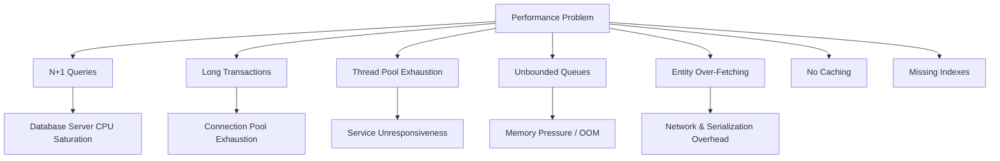

### Quantifying the Costs

| Issue | Data Size | Impact |
|---|---|---|
| N+1 with 1,000 orders × 5 items | 1,001 queries | ~100-1000x latency vs 2 queries |
| `JOIN FETCH` with 2 collections (cartesian) | 3 items × 2 shipments = 6 rows | 6x payload for 1 entity |
| Long transaction (5s external call) | 50 concurrent requests | 50 connections held = pool exhaustion at size 50 |
| No timeout on 1 email call | 10 threads × 30s hang | Entire async pool blocked |
| Returning full entity vs DTO | 200 fields, 50 used | 4x serialization payload |

### Principled Performance Review

1. **Measure before optimizing:** Profile with a real load test before assuming N+1 is the issue.
2. **Query count discipline:** Enable `org.hibernate.SQL: DEBUG` in staging; review query counts per endpoint.
3. **Batch everything:** `@BatchSize`, JDBC batch inserts (`hibernate.jdbc.batch_size`).
4. **Cache read-heavy data:** Consider `@Cacheable` (Caffeine/Redis) for stable reference data.
5. **Use DTO projections for list endpoints:** Avoid loading full entity graphs when consumers need 5 fields.
6. **Right-size the thread pools:** Too small = queue backlog; too large = memory/context-switch thrash.
7. **Set timeouts everywhere:** HTTP clients, DB queries (`hibernate.jdbc.timeout`), async tasks.
8. **Watch heap pressure:** Unbounded queues and caches are the classic OOM culprits.

---

## Security Considerations

### The Security Review Sub-Checklist

| Concern | Review Question | Fix |
|---|---|---|
| **Information disclosure** | Does any error response leak SQL, schema, or class names? | Sanitize all messages before returning |
| **Secret exposure** | Are any credentials in the repo, logs, or environment dumps? | Vault/secret manager; masking; scan CI |
| **Authorization** | Are endpoints properly secured with role checks? | `@PreAuthorize`, method security, JWT validation |
| **Mass assignment** | Can a client set fields they shouldn't via `@RequestBody`? | DTOs — never bind entities directly |
| **Entity exposure** | Do endpoints return internal fields (audit, version)? | DTO mappings |
| **IDOR** | Can user A access user B's resources by changing IDs? | Ownership checks, tenant scoping |
| **Pagination/abuse** | Can clients request unbounded page sizes? | Max page size caps |
| **Rate limiting** | Are public endpoints protected against bursts? | `Bucket4j`, gateway rate limiting, 429s |
| **SQL injection** | Any raw SQL/native queries with string concatenation? | Parameterized queries (JPA/Spring Data default) |
| **Async task abuse** | Can clients trigger unbounded async work? | Rate limit triggers, verify ownership |

### Sensitive Data Leak Surface

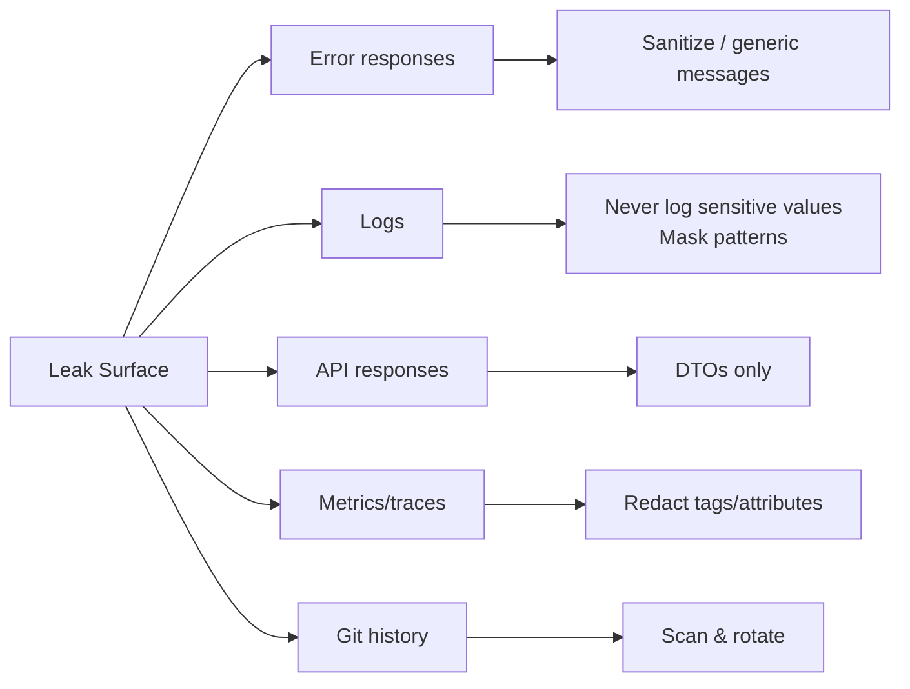

### Security by Layer

| Layer | Concern | Practice |
|---|---|---|
| Transport | Eavesdropping | TLS everywhere, HTTPS only |
| Gateway | AuthN/AuthZ, abuse | JWT validation, rate limiting |
| Controller | Mass assignment, IDOR | DTOs, ownership checks |
| Service | Business rules | Validated state transitions |
| Repository | SQL injection | Parameterized queries |
| Database | Over-privilege | Least-privilege DB users, RLS where applicable |

> **💡 Pro Tip:** Add a "security diff" to every code review. If the PR touches a controller, verify authorization annotations. If it touches logging, verify no sensitive data is logged. Security review isn't a separate phase — it's woven into every category above.

---

## Testing Strategies for Production-Readiness

### Testing Transactions and Lazy Loading

```java
@SpringBootTest
@Transactional  // Each test rolls back — clean state
class OrderServiceTest {

    @Autowired private OrderService orderService;
    @Autowired private OrderRepository orderRepository;

    @Test
    void shouldReturnDtoWithItemCount_withoutLazyInitializationException() {
        Order order = orderStore.createOrderWithItems(3);

        OrderDto dto = orderService.getOrder(order.getId()); // runs INSIDE a transaction

        // ✅ This assertion runs on the DTO, not the entity
        assertThat(dto.itemCount()).isEqualTo(3);
    }

    @Test
    void shouldNotTriggerN1Queries_whenFetchingOrdersWithItems() {
        // EntityManager to track query count
        // (use a test interceptor or Hibernate statistics)
        orderStore.createOrdersWithItems(50);

        List<OrderSummaryDto> summaries = orderService.getOrderSummaries();

        assertThat(summaries).hasSize(50);
        // If you have query counting set up, assert query count < 5
    }
}
```

### Testing Async Behavior

```java
@SpringBootTest
class NotificationServiceTest {

    @Autowired private NotificationService notificationService;

    @Test
    void asyncMethod_shouldBeExecutedOnDifferentThread() throws Exception {
        CountDownLatch latch = new CountDownLatch(1);
        AtomicReference<String> threadName = new AtomicReference<>();

        CompletableFuture<Void> future = notificationService.sendWithCallback(
            "user-1", "hello", threadName, latch);

        future.get(5, TimeUnit.SECONDS);
        latch.await(5, TimeUnit.SECONDS);

        // ✅ Verify it ran asynchronously
        assertThat(threadName.get()).startsWith("async-");
    }

    @Test
    void asyncMethod_shouldPropagateExceptions() {
        CompletableFuture<Void> future = notificationService.sendFailingEmail("user-1");

        // ✅ Exceptions from CompletableFuture-returning methods surface on .get()
        assertThatThrownBy(() -> future.get(5, TimeUnit.SECONDS))
            .hasRootCauseInstanceOf(EmailSendException.class);
    }
}
```

### Testing the Global Exception Handler

```java
@WebMvcTest(OrderController.class)
class OrderControllerTest {

    @Autowired private MockMvc mockMvc;
    @MockBean private OrderService orderService;

    @Test
    void notFound_shouldReturnSanitizedError() throws Exception {
        when(orderService.getOrder(999L))
            .thenThrow(new ResourceNotFoundException("Order 999 not found"));

        mockMvc.perform(get("/api/v1/orders/999"))
            .andExpect(status().isNotFound())
            .andExpect(jsonPath("$.code").value("NOT_FOUND"))
            .andExpect(jsonPath("$.message").value(containsString("999")))
            .andExpect(jsonPath("$.correlationId").exists());
    }

    @Test
    void genericError_shouldNotLeakInternalDetails() throws Exception {
        when(orderService.getOrder(1L))
            .thenThrow(new RuntimeException("java.lang.NullPointerException at " +
                "com.payment.DatabaseUrl from jdbc:postgresql://internal-db:5432/prod"));

        mockMvc.perform(get("/api/v1/orders/1"))
            .andExpect(status().isInternalServerError())
            .andExpect(jsonPath("$.code").value("INTERNAL_ERROR"))
            .andExpect(jsonPath("$.message").value(containsString("Something went wrong")))
            .andExpect(jsonPath("$.message").value(not(containsString("jdbc:postgresql"))))
            .andExpect(jsonPath("$.message").value(not(containsString("NullPointerException"))));
    }
}
```

### Testing Configuration Validation

```java
@SpringBootTest
class PaymentConfigTest {

    @Test
    void missingApiKey_shouldFailStartup() {
        // Run with empty payment.api-key; assert ApplicationContext fails
        ApplicationContextRunner contextRunner = new ApplicationContextRunner()
            .withUserConfiguration(PaymentConfiguration.class)
            .withPropertyValues(
                "payment.timeout-seconds=30",
                "payment.base-url=https://payments.example.com"
                // NO payment.api-key deliberately
            );

        contextRunner.run(context -> {
            assertThat(context).hasFailed();
            assertThat(context.getStartupFailure())
                .hasMessageContaining("payment.apiKey");
        });
    }
}
```

### Testing Correlation ID Flow

```java
@SpringBootTest(webEnvironment = RANDOM_PORT)
class CorrelationIdFilterTest {

    @LocalServerPort private int port;

    @Test
    void missingCorrelationId_shouldBeGeneratedAndReturned() throws Exception {
        MockHttpServletResponse response = performRequest("/api/v1/orders/1", null);

        assertThat(response.getHeader("X-Correlation-Id")).isNotBlank();
    }

    @Test
    void incomingCorrelationId_shouldBeEchoedBack() throws Exception {
        MockHttpServletResponse response = performRequest("/api/v1/orders/1", "client-supplied-123");

        assertThat(response.getHeader("X-Correlation-Id")).isEqualTo("client-supplied-123");
    }
}
```

### Best Practices for the Test Suite

| Practice | Why |
|---|---|
| Use `@Transactional` test classes for rollback | Clean state between tests without manual cleanup |
| Assert query counts in performance-critical paths | Catches N+1 regression early |
| Test the exception handler, not just happy paths | Verifies sanitization and codes |
| Use `ApplicationContextRunner` for config tests | Fast, no full server needed |
| Test async paths with realistic timeouts | Avoid flaky timing-based assertions |
| Verify correlation ID propagation in integration tests | Confirms header flows across services |
| Test versioned endpoints explicitly | Old version must keep working during deprecation window |

---

## Multiple Implementation Approaches

### 1. Fetch Strategies Compared

```java
// A. JOIN FETCH — explicit SQL-level control
@Query("SELECT o FROM Order o JOIN FETCH o.items WHERE o.id = :id")
Optional<Order> findByIdWithItems(@Param("id") Long id);

// B. @EntityGraph — declarative, reusable
@EntityGraph(attributePaths = {"items"})
@Query("SELECT o FROM Order o WHERE o.id = :id")
Optional<Order> findByIdWithItemsGraph(@Param("id") Long id);

// C. @BatchSize — for loop-based access
@BatchSize(size = 25)
@OneToMany(mappedBy = "order", fetch = FetchType.LAZY)
private List<OrderItem> items;

// D. DTO Projection — minimal payload
public interface OrderSummaryProjection {
    Long getId();
    String getStatus();
    BigDecimal getTotal();
}

@Query("SELECT o.id AS id, o.status AS status, o.total AS total " +
       "FROM Order o WHERE o.status = :status")
List<OrderSummaryProjection> findSummariesByStatus(@Param("status") String status);

// E. Named Entity Graph — centralized reuse
@Entity
@NamedEntityGraph(name = "Order.withItems",
                  attributeNodes = @NamedAttributeNode("items"))
public class Order { ... }

@EntityGraph("Order.withItems")
List<Order> findAllWithItems();
```

| Approach | When to Choose |
|---|---|
| `JOIN FETCH` | Single-use query, need exact control |
| `@EntityGraph` | Same fetch strategy reused across several repository methods |
| `@BatchSize` | Collections iterated in loops across many parents |
| DTO projections | Read-only, needs only a subset of fields |
| Named entity graphs | Team-wide standard graphs shared across services |

### 2. API Versioning Strategies

```java
// A. URI — the default practical choice
@RestController
@RequestMapping("/api/v1/orders")
public class OrderControllerV1 { }

// B. Header — clean URLs, hidden version
@GetMapping(headers = "X-API-Version=1")
public OrderDtoV1 getV1() { }

// C. Media type — "pure" REST
@GetMapping(produces = "application/vnd.company.order.v1+json")
public OrderDtoV1 getV1() { }

// D. Custom versioning filter (negotiate version, route internally)
@Component
public class ApiVersionFilter extends OncePerRequestFilter {
    @Override
    protected void doFilterInternal(HttpServletRequest req, HttpServletResponse res,
            FilterChain chain) throws ServletException, IOException {
        String version = req.getHeader("X-API-Version");
        req.setAttribute("apiVersion", version == null ? "v1" : version);
        chain.doFilter(req, res);
    }
}
```

### 3. Async Implementations

```java
// A. Traditional bounded pool
@Bean(name = "taskExecutor")
public Executor taskExecutor() {
    ThreadPoolTaskExecutor executor = new ThreadPoolTaskExecutor();
    executor.setCorePoolSize(5);
    executor.setMaxPoolSize(10);
    executor.setQueueCapacity(100);
    executor.setThreadNamePrefix("async-");
    executor.setRejectedExecutionHandler(new ThreadPoolExecutor.CallerRunsPolicy());
    executor.initialize();
    return executor;
}

// B. Virtual threads (Java 21+)
@Bean(name = "virtualTaskExecutor")
public Executor virtualTaskExecutor() {
    return Executors.newVirtualThreadPerTaskExecutor();
}

// C. Context propagation with Spring Cloud Sleuth/Micrometer Tracing
@Bean(name = "traceAwareExecutor")
public Executor traceAwareExecutor() {
    ThreadPoolTaskExecutor delegate = new ThreadPoolTaskExecutor();
    delegate.setCorePoolSize(5);
    delegate.setMaxPoolSize(10);
    // Wrap with TaskExecutor that propagates trace/span context
    return new ContextPropagatingTaskWrapper(delegate);
}
```

### 4. Config Management Approaches

| Approach | Complexity | Best For |
|---|---|---|
| Env vars + `@ConfigurationProperties` | Low | Small teams, 1-10 services |
| Spring Config Server (Git-backed) | Medium | Many services, central governance |
| Vault integration | Medium-high | Strong security requirements, dynamic secrets |
| K8s ConfigMaps + Secrets | Low-med | Already on Kubernetes |
| AWS AppConfig / Parameter Store | Medium | AWS-native, feature flags too |

---

## Real-World Case Studies

### Case Study 1: E-Commerce Order Dashboard (N+1)

**Scenario:** An admin dashboard lists 500 orders with item counts. Without `JOIN FETCH` or batch fetching, page load time scales linearly with order count — what's fast with 10 test orders becomes an 8-second page load with 500 real orders, and support tickets start rolling in.

**Root cause:** `orderRepository.findAll()` then looping `order.getItems().size()` in the view layer.

**Impact:** 8s page loads, database CPU at 90%, customer support overwhelmed with "dashboard is broken" tickets.

**Fix:**
```java
@EntityGraph(attributePaths = {"items"})
@Query("SELECT o FROM Order o")
List<Order> findAllWithItems();
```
Plus `@BatchSize(size = 50)` on the items collection as a safety net.

**Result:** Page load dropped from 8 seconds to 300ms. Database queries dropped from 501 to 2.

> **Lesson:** This is precisely the kind of bug that passes code review by a junior reviewer (code compiles, tests pass with 3 rows of fixture data) but fails in production under real load — which is why this is the *first* thing a senior reviewer checks.

### Case Study 2: Payment Failure Investigation (Correlation IDs)

**Scenario:** A customer reports "my payment failed but I don't know why." The request traverses Gateway → Order → Payment → Notification services. Without correlation IDs, an engineer has to manually cross-reference timestamps across four services' logs — a process that can take 30+ minutes during an incident.

**With correlation IDs:** It's a single `grep abc-123` across your centralized logging system (e.g., ELK, Datadog), cutting mean-time-to-resolution from tens of minutes to seconds.

```bash
# One grep across aggregated logs finds every trace of the request
grep "abc-123" /var/log/services/*.log
```

### Case Study 3: Flash Sale Performance (Self-Invocation)

**Scenario:** `NotificationService.sendConfirmation()` is `@Async`, but it's called via self-invocation from `OrderService.processOrder()`. During normal traffic, nobody notices — a synchronous 200ms email call is barely perceptible. During a flash sale with 50x traffic, every order-processing request now blocks for 200ms waiting on the email API, checkout latency triples, and customers abandon carts.

**Root cause:** Self-invocation silently disabling `@Async` — invisible without a reviewer who knows to check for it specifically.

**Impact:** Lost revenue during the busiest sale of the year, page timeouts, cart abandonment.

**Fix:** Extract into `NotificationService` bean, inject into `OrderService`.

### Case Study 4: Silent Partner Integration Break (Versioning)

**Scenario:** A payments platform exposes `/api/v1/orders/{id}` and a partner's system polls it nightly. A well-intentioned developer adds a `discountBreakdown` field and *removes* the old `discount` field in the same response, without bumping the version. The partner's parser — which expected `discount` — starts failing silently (defaulting to `null`), and nobody notices until finance reconciliation shows discrepancies three weeks later.

**Fix:** A version bump (`/api/v2/orders/{id}`) with the old version kept alive during a deprecation window would have prevented this entirely.

### Case Study 5: The 2 AM Startup Failure (Config Validation)

**Scenario:** A team deploys a new service instance but forgets to set `payment.api-key` in the environment. Without `@Validated`, the app starts fine and serves traffic — then the *first* payment request at 2 AM throws a confusing `NullPointerException`. The on-call engineer must trace the error back to missing config, which takes hours because the configuration issue isn't obvious from the error message.

**Fix:** With `@Validated`, the deployment fails in CI/CD within seconds, with an error message pointing directly at the problem.

---

## Hands-On Lab: Reviewing a Sample Service

> **🎯 Goal:** Practice the senior review mindset on a deliberately flawed service. Find every issue, then fix it.

### Setup

Create a small Spring Boot project with these files. This service has **at least 10 review findings** hidden in it.

**File 1: `OrderController.java`**
```java
@RestController
@RequestMapping("/orders")
public class OrderController {

    @Autowired
    private OrderService orderService;

    @GetMapping("/{id}")
    public Order getOrder(@PathVariable Long id) {
        return orderService.getOrder(id);
    }
}
```

**File 2: `OrderService.java`**
```java
@Service
public class OrderService {

    @Autowired
    private OrderRepository orderRepository;

    public Order getOrder(Long id) {
        return orderRepository.findById(id).orElseThrow();
    }

    public void process(Order order) {
        sendConfirmationEmail(order);  // self-invocation!
    }

    @Async
    public void sendConfirmationEmail(Order order) {
        emailClient.send(order.getCustomerEmail(), "Your order...");
    }
}
```

**File 3: `Order.java` (entity)**
```java
@Entity
@Table(name = "orders")
public class Order {
    @Id @GeneratedValue private Long id;
    private String status;
    private BigDecimal total;
    private String customerEmail;

    @OneToMany(mappedBy = "order", fetch = FetchType.LAZY)
    private List<OrderItem> items;
}
```

**File 4: `application.yml`**
```yaml
spring:
  datasource:
    url: jdbc:postgresql://localhost:5432/mydb
    username: admin
    password: P@ssw0rd123
```

**File 5: `OrderController.complete` variant with error leaking**
```java
@RestController
@RequestMapping("/orders")
public class OrderController {
    @GetMapping("/{id}")
    public ResponseEntity<?> getOrder(@PathVariable Long id) {
        try {
            Order o = orderService.getOrder(id);
            return ResponseEntity.ok(o);
        } catch (Exception ex) {
            return ResponseEntity.ok(Map.of(
                "error", true,
                "message", ex.getMessage()  // ❌ leaks internals
            ));
        }
    }
}
```

### Your Task

1. **Find at least 10 code review findings** using the five categories from this tutorial
2. **Classify each finding** by severity (Critical / Major / Minor)
3. **Write a fix** for each finding

<details>
<summary><strong>👀 Click here to reveal the full answer key (after you've tried!)</strong></summary>

**Finding 1 — CRITICAL: Hardcoded DB password in `application.yml`**
```yaml
# FINAL FIX
spring:
  datasource:
    url: ${DB_URL}
    username: ${DB_USERNAME}
    password: ${DB_PASSWORD}
```

**Finding 2 — CRITICAL: Returning JPA entity from controller**
```java
// FINAL FIX — DTO mapping
public record OrderDto(Long id, String status, BigDecimal total) {}

@GetMapping("/{id}")
public OrderDto getOrder(@PathVariable Long id) {
    Order order = orderService.getOrder(id);
    return new OrderDto(order.getId(), order.getStatus(), order.getTotal());
}
```

**Finding 3 — CRITICAL: Self-invocation of `@Async`**
```java
// FINAL FIX — separate beans
@Service
public class NotificationService {
    @Async("taskExecutor")
    public void sendConfirmationEmail(Order order) { ... }
}
```

**Finding 4 — MAJOR: Lazy loading outside transaction / `@Transactional` missing**
```java
// FINAL FIX
@Transactional(readOnly = true)
public OrderDto getOrder(Long id) {
    Order order = orderRepository.findById(id).orElseThrow();
    int itemCount = order.getItems().size();  // inside the boundary
    return new OrderDto(order.getId(), order.getStatus(), order.getTotal(), itemCount);
}
```

**Finding 5 — MAJOR: No error handling / raw exceptions leak**
```java
// FINAL FIX — @RestControllerAdvice, sanitized messages, correlation ID
@RestControllerAdvice
public class GlobalExceptionHandler { ... }
```

**Finding 6 — MAJOR: No correlation ID**
```java
// FINAL FIX — add CorrelationIdFilter
```

**Finding 7 — MAJOR: No custom thread pool (default SimpleAsyncTaskExecutor)**
```java
// FINAL FIX
@Bean(name = "taskExecutor")
public Executor taskExecutor() { ... bounded pool ... }
```

**Finding 8 — MAJOR: `@Async` method has no timeout**
```java
// FINAL FIX
return CompletableFuture.runAsync(() -> emailClient.send(...))
    .orTimeout(5, TimeUnit.SECONDS);
```

**Finding 9 — MINOR: No `readOnly = true`**
Add `readOnly = true` in the read path.

**Finding 10 — MINOR: Error response shape inconsistent**
Standardize with `ErrorResponse(code, message, correlationId)`.

**Finding 11 — MAJOR: No fail-fast config validation**
Add `@ConfigurationProperties(prefix = "order") @Validated`.

**Finding 12 — MAJOR: "Always 200" anti-pattern with `ex.getMessage()` leak**
Replace with proper status codes and sanitized messages.

</details>

---

## Practice Exercises

### Exercise 1: Transaction Boundary Refactor

**Task:** The following code throws `LazyInitializationException`. Refactor it to access lazy fields inside the transaction and return a DTO.

```java
@RestController
public class CustomerController {

    @GetMapping("/customers/{id}")
    public CustomerDto getCustomer(@PathVariable Long id) {
        Customer customer = customerService.getRawCustomer(id);
        List<Address> addresses = customer.getAddresses();  // 💥 lazy
        return new CustomerDto(customer.getId(), customer.getName(), addresses);
    }
}

@Transactional(readOnly = true)
public Customer getRawCustomer(Long id) {
    return customerRepository.findById(id).orElseThrow();
}
```

<details>
<summary><strong>👀 Solution</strong></summary>

```java
@Service
public class CustomerService {

    private final CustomerRepository customerRepository;

    @Transactional(readOnly = true)
    public CustomerDto getCustomer(Long id) {
        Customer customer = customerRepository.findById(id).orElseThrow();
        List<Address> addresses = customer.getAddresses();  // ✅ inside transaction
        return new CustomerDto(customer.getId(), customer.getName(), addresses);
    }
}

@RestController
public class CustomerController {
    @GetMapping("/customers/{id}")
    public CustomerDto getCustomer(@PathVariable Long id) {
        return customerService.getCustomer(id);  // 💡 DTO returned, no lazy access here
    }
}
```

**Why this works:** The `@Transactional` method maps the entity to a DTO *before* the session closes. The controller receives a plain DTO — no lazy proxies, no session dependency.

</details>

---

### Exercise 2: Error Handling Fix

**Task:** The following error handling code leaks database internals and uses an opaque error code. Rewrite it to be production-safe.

```java
@RestControllerAdvice
public class BadHandler {
    @ExceptionHandler(Exception.class)
    public ResponseEntity<Map<String, String>> handle(Exception ex) {
        return ResponseEntity.ok(Map.of(
            "error", "ERR_1234",
            "message", ex.getMessage()  // ❌ could leak jdbc:postgresql://..., table names...
        ));
    }
}
```

<details>
<summary><strong>👀 Solution</strong></summary>

```java
@RestControllerAdvice
public class GlobalExceptionHandler {

    private static final Logger log = LoggerFactory.getLogger(GlobalExceptionHandler.class);

    @ExceptionHandler(ResourceNotFoundException.class)
    @ResponseStatus(HttpStatus.NOT_FOUND)
    public ErrorResponse handleNotFound(ResourceNotFoundException ex) {
        String correlationId = MDC.get("correlationId");
        log.warn("Resource not found [{}]: {}", correlationId, ex.getMessage());
        return new ErrorResponse("NOT_FOUND", ex.getMessage(), correlationId);
    }

    @ExceptionHandler(MethodArgumentNotValidException.class)
    @ResponseStatus(HttpStatus.BAD_REQUEST)
    public ErrorResponse handleValidation(MethodArgumentNotValidException ex) {
        String correlationId = MDC.get("correlationId");
        String message = ex.getBindingResult().getFieldErrors().stream()
            .map(f -> f.getField() + ": " + f.getDefaultMessage())
            .collect(Collectors.joining(", "));
        return new ErrorResponse("VALIDATION_FAILED", message, correlationId);
    }

    @ExceptionHandler(Exception.class)
    @ResponseStatus(HttpStatus.INTERNAL_SERVER_ERROR)
    public ErrorResponse handleGeneric(Exception ex) {
        String correlationId = MDC.get("correlationId");
        log.error("Unexpected error [{}]", correlationId, ex); // full trace to LOGS only
        return new ErrorResponse("INTERNAL_ERROR",
            "Something went wrong. Reference: " + correlationId, correlationId);
    }
}

public record ErrorResponse(String code, String message, String correlationId) {}
```

</details>

---

### Exercise 3: Async Self-Invocation Fix

**Task:** Fix the self-invocation trap below. Also add a proper thread pool, an exception handler, and a timeout to the async operation.

```java
@Service
public class OrderService {
    public void placeOrder(Order order) {
        AuditService.record(order);  // ❌ self-invocation
    }

    @Async
    public void recordAudit(Order order) {
        auditClient.post(order);  // no timeout
    }
}
```

<details>
<summary><strong>👀 Solution</strong></summary>

**Step 1: Separate bean for async work**
```java
@Service
public class AuditService {
    @Async("taskExecutor")
    public CompletableFuture<Void> record(Order order) {
        return CompletableFuture.runAsync(() -> auditClient.post(order))
            .orTimeout(5, TimeUnit.SECONDS)
            .exceptionally(ex -> {
                log.error("Audit post failed for order {}", order.getId(), ex);
                return null;
            });
    }
}

@Service
public class OrderService {
    private final AuditService auditService;
    // constructor injection...
    public void placeOrder(Order order) {
        auditService.record(order);  // ✅ through proxy
    }
}
```

**Step 2: Thread pool config**
```java
@Configuration
@EnableAsync
public class AsyncConfig implements AsyncConfigurer {

    @Bean(name = "taskExecutor")
    public Executor taskExecutor() {
        ThreadPoolTaskExecutor executor = new ThreadPoolTaskExecutor();
        executor.setCorePoolSize(5);
        executor.setMaxPoolSize(10);
        executor.setQueueCapacity(100);
        executor.setThreadNamePrefix("async-");
        executor.setRejectedExecutionHandler(new ThreadPoolExecutor.CallerRunsPolicy());
        executor.initialize();
        return executor;
    }

    @Override
    public AsyncUncaughtExceptionHandler getAsyncUncaughtExceptionHandler() {
        return (throwable, method, params) ->
            log.error("Uncaught async exception in {}", method.getName(), throwable);
    }
}
```

</details>

---

### Exercise 4: Config Validation Audit

**Task:** Inspect this config and identify all issues. Then fix them.

```yaml
spring:
  datasource:
    url: jdbc:postgresql://localhost:5432/prod
    username: admin
    password: SuperSecret123
  redis:
    host: localhost
    port: 6379
payment:
  api-key: sk_live_abc123
  timeout-seconds: 90
```

<details>
<summary><strong>👀 Solution</strong></summary>

**Issues found:**
1. ❌ Hardcoded secrets (`password`, `api-key`) — must come from env vars/Vault
2. ❌ No validation on `payment.*` — a missing key wouldn't fail startup
3. ❌ No `@ConfigurationProperties` grouping — scattered access
4. ❌ `timeout-seconds: 90` may be too long — consider service-level timeout budgets

**Fixed files:**
```yaml
# application.yml
spring:
  datasource:
    url: ${DB_URL}
    username: ${DB_USERNAME}
    password: ${DB_PASSWORD}
  redis:
    host: ${REDIS_HOST}
    port: ${REDIS_PORT}
payment:
  api-key: ${PAYMENT_API_KEY}
  timeout-seconds: ${PAYMENT_TIMEOUT_SECONDS:30}
```

```java
@ConfigurationProperties(prefix = "payment")
@Validated
public record PaymentConfig(
    @NotBlank String apiKey,
    @NotNull @Positive Integer timeoutSeconds
) {}
```
</details>

---

### Exercise 5: API Contract Review

**Task:** Identify all API contract violations in this controller and suggest fixes.

```java
@RestController
@RequestMapping("/api/orders")
public class OrderController {

    @GetMapping("/{id}")
    public Order getOrder(@PathVariable Long id) { ... }  // returns entity

    @PostMapping
    public Order createOrder(@RequestBody Order order) { ... }  // binds entity

    @PutMapping("/{id}")
    public Order partialUpdate(@PathVariable Long id, @RequestBody Map<String, Object> fields) {
        // PUT used for partial update!
    }

    @DeleteMapping("/{id}")
    public ResponseEntity<Order> deleteOrder(@PathVariable Long id) {
        // returns 200 with deleted entity — should be 204
    }
}
```

<details>
<summary><strong>👀 Solution</strong></summary>

**Violations found:**
1. ❌ No versioning — `/api/orders` instead of `/api/v1/orders`
2. ❌ Returning JPA entity directly — exposes schema, lazy proxies
3. ❌ Binding entity directly with `@RequestBody` — mass assignment risk
4. ❌ PUT used for partial update — should be PATCH
5. ❌ DELETE returns 200 with body — should be 204 No Content
6. ❌ No `Location` header on POST — should be 201 + Location

**Fixed:**
```java
@RestController
@RequestMapping("/api/v1/orders")
public class OrderController {

    private final OrderService orderService;

    @GetMapping("/{id}")
    public OrderDto getOrder(@PathVariable Long id) {
        return orderService.getOrder(id);  // DTO, not entity
    }

    @PostMapping
    public ResponseEntity<OrderDto> createOrder(@RequestBody @Valid OrderRequest request) {
        OrderDto created = orderService.create(request);  // DTO request, not entity
        URI location = ServletUriComponentsBuilder
            .fromCurrentRequest().path("/{id}")
            .buildAndExpand(created.id()).toUri();
        return ResponseEntity.created(location).body(created);  // 201 + Location
    }

    @PatchMapping("/{id}")
    public OrderDto updateOrderStatus(@PathVariable Long id,
                                      @RequestBody PartialOrderUpdate fields) {
        return orderService.applyPartialUpdate(id, fields);
    }

    @DeleteMapping("/{id}")
    public ResponseEntity<Void> deleteOrder(@PathVariable Long id) {
        orderService.delete(id);
        return ResponseEntity.noContent().build();  // 204
    }
}
```
</details>

---

## Test Your Understanding

Answer these 10 questions to check your comprehension. (Answers at the bottom.)

**1.** Why does accessing a lazy field *after* the `@Transactional` method returns cause `LazyInitializationException`?

**2.** What is the N+1 query problem, and why is it invisible in local testing?

**3.** Name three fixes for the N+1 problem and when to use each.

**4.** Why should external HTTP/email calls never be made inside a transaction?

**5.** What three things should production-grade error handling always do?

**6.** Why must `MDC.remove()` be called in a `finally` block?

**7.** What is the self-invocation trap for `@Async`, and why does it happen?

**8.** What happens if a void-returning `@Async` method throws an exception and no `AsyncUncaughtExceptionHandler` is configured?

**9.** Why is a hardcoded password in `application.yml` a permanent security incident even if deleted in a later commit?

**10.** What's the difference between PUT and PATCH semantics, and why does it matter?

<details>
<summary><strong>👀 Answers</strong></summary>

**1.** The Hibernate session is bound to the transaction. When the `@Transactional` method returns, Spring commits/rolls back and closes the session. The lazy proxy has no session to fetch from afterward.

**2.** N+1 is when you fire one query to fetch N parent entities, then N additional queries to fetch each parent's children (N+1 total). It's invisible locally because with 5 rows the extra queries are trivial; with 1,000 rows you fire 1,001 queries and the DB grinds.

**3.** `JOIN FETCH` (single query, explicit JPQL), `@EntityGraph` (declarative, reusable), `@BatchSize` (batches collections for loop access). Choose based on whether the path is read once or iterated.

**4.** Each transaction holds a database connection and potentially locks. Waiting on a slow HTTP call while holding a connection exhausts the pool, and other requests block behind it.

**5.** (1) Protect sensitive internals (sanitized messages), (2) give the caller actionable info (semantic codes), (3) give *you* traceability (correlation IDs).

**6.** Tomcat reuses threads across requests. If you don't remove the MDC entry, the next request on the same thread inherits the previous request's correlation ID, corrupting log attribution.

**7.** `@Async`/`@Transactional`/`@Cacheable` work through Spring proxies. When you call `this.method()` from inside the same class, you bypass the proxy, so the annotation is silently ignored and the method runs synchronously.

**8.** The exception is silently swallowed — no log, no handler, no way to know it happened. The bug becomes invisible and may cause silent data loss or missing side effects.

**9.** Git history is immutable — the secret remains in the commit log forever, even after the file is changed. Anyone with repo access (including former employees and collaborators) can find it. The only true fix is rotating the secret.

**10.** PUT means full replacement — idempotent, missing fields should be nulled. PATCH means partial update — only provided fields change. Using PUT for partial updates violates client expectations and caching semantics; a client retrying a PUT could get different results than expected.

</details>

---

## Common Interview Questions

**1. "What is the N+1 query problem in JPA, and how do you fix it?"**

*Interviewer wants:* Deep understanding of lazy loading, actual fix techniques, and judgment about when to use each.

**2. "Why does `LazyInitializationException` happen, and how do you prevent it?"**

*Interviewer wants:* Correct mental model of transaction/session lifecycle, not just the fix. Good answer: access lazy fields inside transactions, use DTOs, use fetch strategies.

**3. "What is the self-invocation problem in Spring? Give an example."**

*Interviewer wants:* Understanding of Spring AOP proxies. Bonus: mention `@Transactional` and `@Cacheable` are also affected.

**4. "How would you trace a request across multiple microservices?"**

*Interviewer wants:* Correlation IDs, MDC, header propagation, centralized logging. Bonus: mention OpenTelemetry/tracing.

**5. "How do you handle secrets in a Spring Boot application?"**

*Interviewer wants:* Env vars, Vault, K8s Secrets, never in git. Bonus: fail-fast validation.

**6. "Your application started fine but fails at 2 AM. What could be the cause on the configuration side?"**

*Interviewer wants:* Fail-fast validation, missing config, defaults hiding issues, `@ConfigurationProperties` + `@Validated`.

**7. "What's the difference between URI, header, and media-type API versioning?"**

*Interviewer wants:* Trade-offs, not just definitions. Good answer points out the pragmatic default and debugging trade-offs.

**8. "Why shouldn't you return JPA entities from REST controllers?"**

*Interviewer wants:* Schema exposure, lazy proxy serialization, DTO boundaries, API evolution.

**9. "Your `@Async` method runs synchronously. What could be wrong?"**

*Interviewer wants:* Self-invocation, proxy mechanism. Bonus: non-public methods, `final` classes.

**10. "What error response contract would you design for a microservice?"**

*Interviewer wants:* Consistent shape (code/message/correlationId), semantic codes, sanitized leaks, correct HTTP status codes.

---

## Question Bank for Knowledge Reinforcement

### 🟢 Beginner (Questions 1-20)

**1.** What does `@Transactional` do in Spring?
<details><summary>Answer</summary>It wraps a method in a transaction, opening a Hibernate session, beginning/committing/rolling back based on exceptions, and binding the persistence context to the thread.</details>

**2.** What is the default fetch type for `@OneToMany`?
<details><summary>Answer</summary>`FetchType.LAZY` — children are not loaded until accessed.</details>

**3.** What is the default fetch type for `@ManyToOne`?
<details><summary>Answer</summary>`FetchType.EAGER` — the parent is loaded immediately.</details>

**4.** What exception is thrown when you access a lazy field with no Hibernate session?
<details><summary>Answer</summary>`LazyInitializationException`.</details>

**5.** What is the purpose of `@RestControllerAdvice`?
<details><summary>Answer</summary>A global exception handler that intercepts exceptions thrown by controllers and maps them to error responses.</details>

**6.** What HTTP status code should a `POST` that creates a resource return?
<details><summary>Answer</summary>`201 Created` with a `Location` header.</details>

**7.** What HTTP status code should a `DELETE` that succeeds return?
<details><summary>Answer</summary>`204 No Content`.</details>

**8.** What is MDC in SLF4J?
<details><summary>Answer</summary>Mapped Diagnostic Context — a thread-local key-value store for contextual information (like correlation IDs) included in log lines.</details>

**9.** What is `SimpleAsyncTaskExecutor`, and why is it dangerous?
<details><summary>Answer</summary>It's Spring's default async executor — creates a new thread per task with no reuse or bounding, causing potential thread explosion under load.</details>

**10.** What does `@ConfigurationProperties` do?
<details><summary>Answer</summary>Binds configuration properties with a given prefix to a typed Java class/record, enabling type safety, validation, and grouping.</details>

**11.** What is the difference between `@Value` and `@ConfigurationProperties`?
<details><summary>Answer</summary>`@Value` injects individual properties as raw strings; `@ConfigurationProperties` binds grouped, type-safe, validated config objects.</details>

**12.** What does `readOnly = true` on `@Transactional` do?
<details><summary>Answer</summary>Sets the transaction to read-only, enabling Hibernate flush-mode optimizations (e.g., skip dirty checking) and signaling intent.</details>

**13.** What HTTP method is used for a full replacement of a resource?
<details><summary>Answer</summary>`PUT`.</details>

**14.** What HTTP method is used for partial updates?
<details><summary>Answer</summary>`PATCH`.</details>

**15.** What is a correlation ID?
<details><summary>Answer</summary>A unique identifier generated for a request, propagated across services via headers (e.g., `X-Correlation-Id`), used to trace logs across the whole system.</details>

**16.** What does `@Async` do in Spring?
<details><summary>Answer</summary>Marks a method to run on a separate thread via a configured executor, allowing the caller to continue immediately.</details>

**17.** What is the `CallerRunsPolicy` rejection policy?
<details><summary>Answer</summary>When the queue and pool are full, the calling thread executes the task instead of rejecting it — a graceful degradation strategy.</details>

**18.** What does `@ExceptionHandler` do?
<details><summary>Answer</summary>Maps a specific exception type to a handler method that returns an appropriate HTTP response.</details>

**19.** What is a DTO?
<details><summary>Answer</summary>Data Transfer Object — a plain data-carrying object used to expose data over APIs without leaking internal entities.</details>

**20.** What does `spring.jpa.open-in-view=false` do?
<details><summary>Answer</summary>Disables Open EntityManager in View — sessions don't stay open through view rendering, forcing developers to handle lazy loading correctly rather than hiding it.</details>

---

### 🟡 Intermediate (Questions 21-40)

**21.** Why does the same code that works locally with 5 seed rows fail in production with 1,000 orders?
<details><summary>Answer</summary>N+1 queries — the number of SQL statements scales linearly with data volume. Local fixtures are too small to show the performance collapse.</details>

**22.** What is the difference between `JOIN FETCH` and `@EntityGraph`?
<details><summary>Answer</summary>`JOIN FETCH` is expressed in JPQL per query; `@EntityGraph` is a declarative, reusable attribute-path definition attached to repository methods. Both eagerly fetch the specified collections.</details>

**23.** Why should you avoid `JOIN FETCH` with more than one collection?
<details><summary>Answer</summary>Each collection join multiplies result rows (Cartesian product), inflating the result set and network payload.</details>

**24.** How does `@BatchSize` help solve N+1?
<details><summary>Answer</summary>Instead of one SELECT per parent's collection (N queries), Hibernate batches collection loads into groups of `batchSize`, turning hundreds/thousands of queries into a handful.</details>

**25.** What are the consequences of a long transaction holding a DB connection?
<details><summary>Answer</summary>Connection pool exhaustion, increased lock contention, degraded throughput, and cascading timeouts under concurrent load.</details>

**26.** Why should external API calls not be inside a transaction?
<details><summary>Answer</summary>External calls can be slow (seconds), holding DB connections and locks, exhausting the pool and blocking all other requests.</details>

**27.** Why does the default exception handling in Spring Boot return HTML instead of JSON?
<details><summary>Answer</summary>The default `BasicErrorController` returns an HTML error page; a `@RestControllerAdvice` with JSON responses overrides this for API consumers.</details>

**28.** What is the risk of `ex.getMessage()` on a `DataIntegrityViolationException`?
<details><summary>Answer</summary>It may contain table/column names from the SQL constraint message, leaking schema information to clients.</details>

**29.** How do you propagate a correlation ID from a gateway to downstream microservices?
<details><summary>Answer</summary>Set the `X-Correlation-Id` header on outgoing calls via Feign interceptors, RestClient default headers, or Spring Cloud Sleuth/Micrometer Tracing.</details>

**30.** Why is `MDC.remove()` in a `finally` block important for thread pools?
<details><summary>Answer</summary>Threads are reused; without removal, the stale MDC entry leaks into the next request, misattributing log lines to wrong correlation IDs.</details>

**31.** What is the self-invocation problem with `@Transactional`?
<details><summary>Answer</summary>Calling a `@Transactional` method via `this` from within the same class bypasses the Spring proxy, so the transaction is never started. Split into separate beans or self-inject to fix.</details>

**32.** What does `AsyncUncaughtExceptionHandler` do?
<details><summary>Answer</summary>Catches and handles exceptions thrown in void-returning `@Async` methods, which would otherwise be silently swallowed.</details>

**33.** Why should async methods be idempotent?
<details><summary>Answer</summary>Retry logic, message redelivery, and manual replays may execute the method more than once. Idempotency prevents duplicates (e.g., duplicate emails, double charges).</details>

**34.** What are the three silent failure modes of `@Async` mentioned in this tutorial?
<details><summary>Answer</summary>(1) Default unbounded executor, (2) swallowed exceptions in void methods, (3) self-invocation proxy bypass.</details>

**35.** What is the difference between core pool size, max pool size, and queue capacity?
<details><summary>Answer</summary>Core threads stay alive always; when all core threads are busy, tasks queue; when the queue is full, more threads are created up to max; when max threads are busy and queue is full, the rejection policy applies.</details>

**36.** Why does `@ConfigurationProperties(prefix = "payment")` fail fast at startup?
<details><summary>Answer</summary>Spring validates the bound object during context startup with `@Validated`; missing/invalid properties trigger startup failure with a clear message instead of a runtime NPE later.</details>

**37.** Why are dev-only secrets in profile-specific YAML files also risky?
<details><summary>Answer</summary>They're still in git history, are frequently reused in higher environments, and leak through forks/backups/collaborators.</details>

**38.** What is the `@Validated` annotation on a `@ConfigurationProperties` record used for?
<details><summary>Answer</summary>It enables Bean Validation annotations like `@NotBlank`/`@Positive` to be checked during binding, failing startup if invalid.</details>

**39.** Why is returning a JPA entity from a REST controller risky for serialization?
<details><summary>Answer</summary>Lazy proxies and collections trigger `LazyInitializationException` during JSON serialization (outside the session), or Jackson may serialize proxies with weird structures.</details>

**40.** Why do clients often branch logic on HTTP status codes?
<details><summary>Answer</summary>Status codes communicate semantic outcomes (created/found/conflict/unauthorized). Clients use them to show correct UI, trigger retries, or handle idempotency — often without parsing the body.</details>

---

### 🔴 Advanced (Questions 41-50)

**41.** How does a Cartesian product occur with `JOIN FETCH` of two collections, and what are the mitigations?
<details><summary>Answer</summary>Joining two collections multiplies rows (e.g., 3 items × 2 shipments = 6 rows). Hibernate dedupes the root entity, but the DB still sends multiplied rows. Mitigations: separate queries per collection, use `@BatchSize`, or DTO projections.</details>

**42.** How does the `CallerRunsPolicy` rejection policy affect latency?
<details><summary>Answer</summary>When the queue/pool is full, the *calling thread* runs the task inline, adding task latency to the request path. This is intentional degradation — better than throwing, but it should be monitored.</details>

**43.** How do virtual threads change the async tuning calculus on Java 21+?
<details><summary>Answer</summary>Virtual threads are cheap enough to create per task, so pool sizing and queue backpressure become less relevant. But timeouts, rate limiting, and downstream protection remain critical — the bottleneck just moves elsewhere.</details>

**44.** What are the trade-offs between URI versioning and media-type versioning for a public API?
<details><summary>Answer</summary>URI is explicit, cache-friendly, readable in a browser, and pragmatic. Media type is "more RESTful" but adds content-negotiation complexity, is harder to debug, and is often overkill without strict governance.</details>

**45.** What does a deprecation lifecycle look like, and why is it important?
<details><summary>Answer</summary>Announce → deprecate old version (with `Deprecation`/`Sunset` headers) → keep alive for 6-12 months → observe traffic → sunset. It prevents silently breaking consumers while allowing forward progress.</details>

**46.** What is the mass assignment vulnerability, and how do DTOs prevent it?
<details><summary>Answer</summary>Binding an entity directly with `@RequestBody` lets clients set any field they can name (e.g., `isAdmin=true`). DTOs expose only intended fields, serving as a whitelist for client input.</details>

**47.** Why would a transaction "not roll back" when an exception is caught internally?
<details><summary>Answer</summary>Spring's proxy rolls back only when the exception propagates out of the `@Transactional` method. Catching the exception inside prevents the rollback decision. Use `setRollbackOnly()` or rethrow.</details>

**48.** How do you measure query counts to detect N+1 in a test suite?
<details><summary>Answer</summary>Use Hibernate statistics (`sessionFactory.getStatistics()`), a query-counting interceptor, or the `datasource-proxy` library. Assert query counts in tests for performance-critical paths.</details>

**49.** What are the security implications of leaking stack traces in error responses?
<details><summary>Answer</summary>Stack traces reveal internal class names, file paths, framework versions (enabling targeted exploits), and sometimes connection strings. They turn an error response into an attacker's reconnaissance tool.</details>

**50.** Your `@Async` method returns `CompletableFuture<Void>`, but the thread pool is shared with CPU-intensive batch work. What design change would you propose?
<details><summary>Answer</summary>Isolate workloads into separate executors (a bounded I/O pool for async tasks, a dedicated pool for CPU work) so slow I/O can't starve batch jobs (or vice versa). Optionally add monitoring to both pools.</details>

---

## Self-Assessment Checklist

Rate yourself after completing this tutorial:

| Skill | 🟢 Confident | 🟡 Getting There | 🔴 Needs Work |
|---|---|---|---|
| Explain why `LazyInitializationException` occurs | ☐ | ☐ | ☐ |
| Detect N+1 query patterns in a PR | ☐ | ☐ | ☐ |
| Choose between `JOIN FETCH`, `@EntityGraph`, `@BatchSize` | ☐ | ☐ | ☐ |
| Design a production-grade `GlobalExceptionHandler` | ☐ | ☐ | ☐ |
| Implement correlation ID propagation across services | ☐ | ☐ | ☐ |
| Diagnose self-invocation bugs | ☐ | ☐ | ☐ |
| Configure a bounded thread pool with exception handler | ☐ | ☐ | ☐ |
| Add timeouts to async operations | ☐ | ☐ | ☐ |
| Secure secrets with env vars / Vault / secret managers | ☐ | ☐ | ☐ |
| Use `@ConfigurationProperties` + `@Validated` for fail-fast | ☐ | ☐ | ☐ |
| Choose and apply an API versioning strategy | ☐ | ☐ | ☐ |
| Use correct HTTP semantics (methods, status codes, headers) | ☐ | ☐ | ☐ |
| Enforce DTO boundaries for REST APIs | ☐ | ☐ | ☐ |
| Apply the triage-based review flow to a real PR | ☐ | ☐ | ☐ |
| Run the full review from the service-type priority matrix | ☐ | ☐ | ☐ |

---

## Summary / Key Takeaways

1. **Transaction boundaries determine correctness, not just style.** A misplaced `@Transactional` annotation is a production incident waiting to happen — check this first, always.

2. **Error handling is a security surface, not just UX.** Every leaked stack trace or raw SQL exception message is a potential information disclosure.

3. **Async code is invisible until it isn't.** Self-invocation bugs and missing thread pool configs pass every manual test and fail exactly when traffic spikes.

4. **Configuration mistakes are often permanent.** A secret committed to git history stays there — treat config review as security review.

5. **Your API is a promise to other teams.** Breaking it without versioning is a trust problem as much as a technical one.

A senior-level code review isn't about finding *more* problems — it's about finding the **right** problems: the ones that will only surface after a thousand concurrent users hit your service on a Friday night. Use this checklist as scaffolding, but adapt the weighting based on what your service actually does. The best code review is the one that prevents the 3 AM pager alert.

---

## Further Reading / Resources

### Official Documentation
- [Spring Framework — Transaction Management](https://docs.spring.io/spring-framework/reference/data-access/transaction.html)
- [Spring Data JPA — Reference Documentation](https://docs.spring.io/spring-data/jpa/reference/)
- [Hibernate ORM Documentation — Fetching Strategies](https://docs.jboss.org/hibernate/orm/6.6/userguide/html_single/Hibernate_User_Guide.html#fetching)
- [Spring Boot — Externalized Configuration](https://docs.spring.io/spring-boot/reference/features/external-config.html)
- [Spring — Async Execution and Scheduling](https://docs.spring.io/spring-framework/reference/integration/scheduling.html)
- [Spring Cloud Vault](https://docs.spring.io/spring-cloud-vault/reference/)
- [Java 21 — Virtual Threads (JEP 444)](https://openjdk.org/jeps/444)

### Books & Guides
- *Spring in Action, 6th Edition* — Craig Walls
- *Pro Spring Boot 3* — Felipe Gutierrez
- *High Performance Java Persistence* — Vlad Mihalcea
- *Designing Data-Intensive Applications* — Martin Kleppmann
- *Building Microservices, 2nd Edition* — Sam Newman

### Tools Mentioned
- [Checkstyle](https://checkstyle.org/) — static code analysis
- [Spotless](https://github.com/diffplug/spotless) — code formatting
- [gitleaks](https://github.com/gitleaks/gitleaks) — secret scanning
- [TruffleHog](https://github.com/trufflesecurity/trufflehog) — secret scanning
- [GitGuardian](https://www.gitguardian.com/) — secret detection
- [datasource-proxy](https://github.com/ttddyy/datasource-proxy) — query counting for tests
- [HikariCP](https://github.com/brettwooldridge/HikariCP) — connection pool

### Community Resources
- [Vlad Mihalcea's Blog on Hibernate](https://vladmihalcea.com/blog/) — N+1 and transaction guides
- [Spring Blog](https://spring.io/blog)
- [Baeldung — Spring Boot Tutorials](https://www.baeldung.com/spring-boot)
- [InfoQ — Spring Content](https://www.infoq.com/spring/)

---

## Learning Path & Next Steps

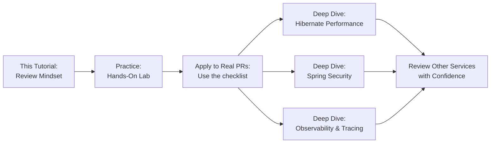

### Recommended Next Steps

1. **Re-create the hands-on lab** from scratch without looking — build a flawed service, then review it.
2. **Tailor the checklist** to your team's actual services using the priority matrix.
3. **Set up query-count tests** for your most load-critical endpoints.
4. **Add secret scanning** to your CI pipeline today (it takes minutes).
5. **Run a review session** on a real production PR with the triage tree.
6. **Study Hibernate performance** in depth — Vlad Mihalcea's blog is an excellent starting point.
7. **Explore observability** — OpenTelemetry + Micrometer Tracing give you distributed tracing, which builds naturally on the correlation ID pattern.

---

> **📌 Final Word:** The senior reviewer's edge isn't knowledge of every Spring API — it's knowing *where* the system is most likely to fail in production, and looking there first. The five categories in this tutorial are where production systems actually break. Master them, and your reviews will prevent incidents — not just find style nits.

---

*End of Tutorial*