# The Hidden Bottlenecks That Break Microservices in Production

> *Most microservice systems don't fail because of bad architecture. They fail because the interactions between services were never designed to behave correctly under real load. Everything looks fine until it doesn't — and by then, the damage is already cascading.*

---

## The Deceptive Calm Before the Storm

Here is the pattern that plays out in production systems with alarming regularity:

The architecture looks clean. Services are well-separated. CI/CD pipelines are green. Monitoring dashboards show healthy metrics. The team feels good about what they've built.

Then traffic grows. A flash sale hits. A marketing campaign drives unexpected load. And within minutes, latency climbs, error rates spike, and the system that looked perfectly healthy begins to collapse — not because of any single failure, but because of how services interact when they're stressed.

The most dangerous property of microservice failure modes is that they're emergent. No individual service is broken. No individual call looks problematic in isolation. The pathology lives in the interactions — in the dependency chains, the retry storms, the thread pool exhaustion, the shared resources, and the missing backpressure that turns a slow downstream into a cascading system-wide outage.

This guide covers the specific failure modes that production microservice systems actually encounter, the mental models required to reason about distributed system behavior under load, and the concrete implementation patterns that make the difference between graceful degradation and collapse.

---

## The Anatomy of a Typical Request Chain

Before examining failure modes, establish a clear picture of what a typical microservice request chain looks like — and how many things can go wrong between the client and the database.

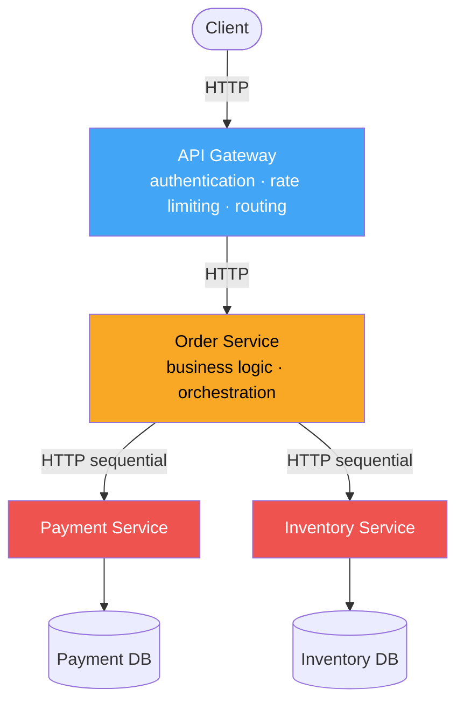

Each arrow is a network call. Each network call adds latency, can fail, can queue under load, and can amplify problems in downstream services upstream.

The critical insight: **your total response time is the sum of every downstream call in your critical path.** You cannot be faster than your slowest dependency. And under load, your slowest dependency gets slower.

---

## Problem 1: The Dependency Chain Latency Bomb

### How Median Metrics Lie to You

Development and testing environments are too predictable. Services start quickly, calls succeed, and resources are available. But production traffic is not median load — it has a distribution, and the tail of that distribution is where systems break.

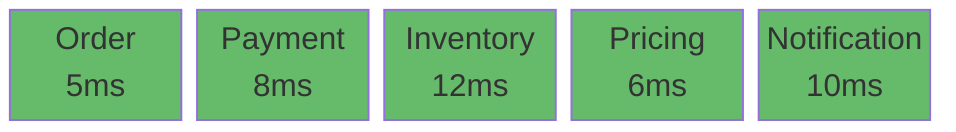

**Median load — Total: 41ms ✓**

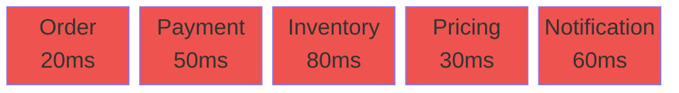

**p99 load — Total: 240ms ✗**

The code didn't change. The deployment didn't change. The latency increased sixfold because under load, every service in the chain is experiencing resource contention simultaneously.

Now add retries, and the compounding becomes catastrophic:

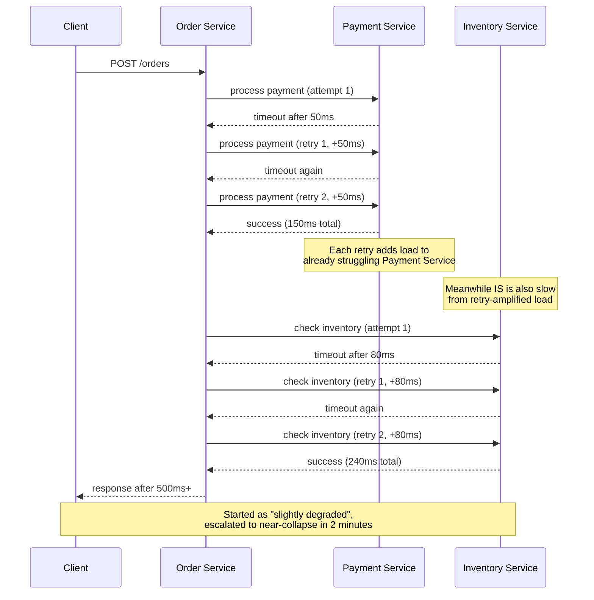

This is how a system goes from "slightly elevated latency" to "completely down" in under two minutes. The retries amplify load on an already struggling service, increasing its latency, causing more timeouts, causing more retries — a positive feedback loop with a catastrophic equilibrium.

### The Fix: Controlled Retries With Exponential Backoff and Jitter

```java
// Spring Boot with Resilience4j — proper retry configuration
@Configuration
public class RetryConfiguration {

   @Bean
   public RetryRegistry retryRegistry() {
       RetryConfig config = RetryConfig.custom()
           .maxAttempts(3)
           // Exponential backoff: 100ms, 200ms, 400ms
           // With ±20% jitter: prevents thundering herd
           .intervalFunction(IntervalFunction.ofExponentialRandomBackoff(
               Duration.ofMillis(100), 2.0, 0.2
           ))
           // Only retry on retriable exceptions
           .retryOnException(e ->
               e instanceof ConnectTimeoutException ||
               e instanceof SocketTimeoutException ||
               (e instanceof HttpStatusCodeException hsce &&
                hsce.getStatusCode() == HttpStatus.SERVICE_UNAVAILABLE)
           )
           // Never retry on business logic errors
           .ignoreExceptions(
               BusinessValidationException.class,
               InsufficientFundsException.class,
               NotFoundException.class
           )
           .build();

       return RetryRegistry.of(config);
   }
}
```

**Why jitter matters — without it, retry storms recreate the spike:**

```mermaid
gantt
   title Retry Timing: Fixed vs Jitter
   dateFormat SSS
   axisFormat %Lms

   section Fixed (Bad)
   All clients timeout    :crit, t1, 000, 10ms
   All retry at t=100ms   :crit, t2, 100, 10ms
   All retry at t=200ms   :crit, t3, 200, 10ms

   section Jitter (Good)
   Client A retry         :active, j1, 085, 10ms
   Client B retry         :active, j2, 095, 10ms
   Client C retry         :active, j3, 108, 10ms
   Client D retry         :active, j4, 115, 10ms
   Client E retry         :active, j5, 122, 10ms
```

Without jitter: all 500 clients retry at the same millisecond — recreating the spike. With jitter: retries spread across a time window, converting a spike back into manageable load.

---

## Problem 2: Service Boundaries That Don't Reflect Reality

### The Four-Hop Pricing Chain


Four network hops to calculate what something costs. Each hop adds latency, adds a failure point, and adds operational complexity. These services are chatty — they cannot function independently, they're always called together in the same sequence, and changing pricing logic requires coordinating deployments across four services.

### The Right Decomposition: Domain Cohesion

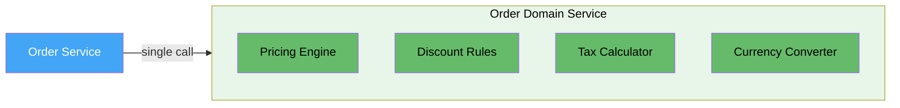

Single call. All calculations happen in-process. No network overhead, no retry complexity, no distributed failure modes for what is fundamentally one business operation.

```java
@Service
public class OrderPricingService {

   private final PricingEngine pricingEngine;
   private final DiscountRulesEngine discountEngine;
   private final TaxCalculator taxCalculator;
   private final CurrencyConverter currencyConverter;

   // All dependencies are in-process — no network calls
   public PricedOrder calculateOrderTotal(Order order, CustomerContext customer) {
       Money basePrice = pricingEngine.calculateBasePrice(order.getItems());

       DiscountResult discounts = discountEngine.applyDiscounts(
           basePrice, customer.getMembership(), order.getPromoCode()
       );

       Money tax = taxCalculator.calculate(
           discounts.getFinalPrice(), customer.getTaxJurisdiction()
       );

       Money finalPrice = currencyConverter.convert(
           discounts.getFinalPrice().add(tax),
           customer.getPreferredCurrency()
       );

       return PricedOrder.builder()
           .basePrice(basePrice)
           .discounts(discounts.getAppliedDiscounts())
           .tax(tax)
           .totalInCustomerCurrency(finalPrice)
           .build();
   }
}
```

**Rule:** services should be separated along lines of independent deployability and independent scalability — not along every possible logical boundary. If two things always change together, always deploy together, and always need each other to function, they belong in the same service.

---

## Problem 3: Stateful Services That Destroy Horizontal Scalability

### The Hidden State Problem

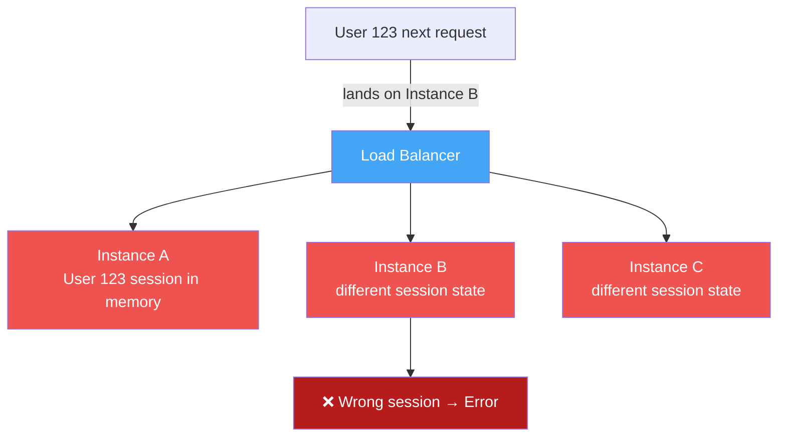

**Stateful (broken scaling):** sticky sessions required → Instance A becomes a bottleneck and single point of failure.

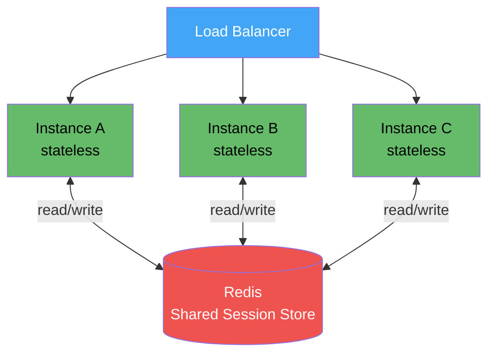

**Stateless (correct scaling):** any instance handles any request — true horizontal scaling.

```java
// Spring Boot: externalize session state to Redis
@Configuration
@EnableRedisHttpSession(maxInactiveIntervalInSeconds = 1800)
public class SessionConfiguration {

   @Bean
   public LettuceConnectionFactory redisConnectionFactory(RedisProperties properties) {
       RedisClusterConfiguration clusterConfig = new RedisClusterConfiguration(
           properties.getCluster().getNodes()
       );

       LettuceClientConfiguration clientConfig = LettuceClientConfiguration.builder()
           .commandTimeout(Duration.ofMillis(500))
           .readFrom(ReadFrom.REPLICA_PREFERRED)
           .build();

       return new LettuceConnectionFactory(clusterConfig, clientConfig);
   }
}

@Service
public class OrderProcessingService {

   private final RedisTemplate<String, OrderDraft> redisTemplate;
   private static final Duration DRAFT_TTL = Duration.ofMinutes(30);

   public void saveOrderDraft(String sessionId, OrderDraft draft) {
       redisTemplate.opsForValue().set("order:draft:" + sessionId, draft, DRAFT_TTL);
       // Any instance can read this draft — true statelessness
   }

   public Optional<OrderDraft> getOrderDraft(String sessionId) {
       return Optional.ofNullable(
           redisTemplate.opsForValue().get("order:draft:" + sessionId)
       );
   }
}
```

### The Cache-as-API-Contract Trap

The most insidious form of hidden coupling: one service writes to a cache key that another reads — outside any declared API contract.

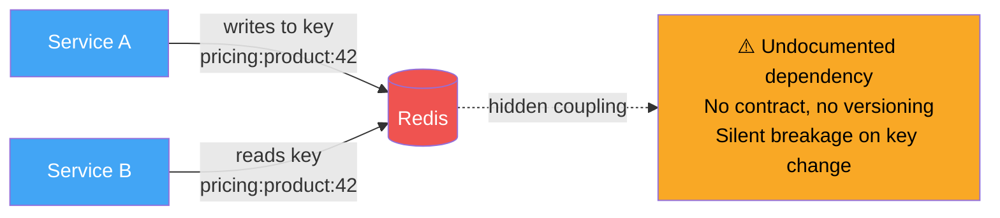

**Fix:** cache is internal to the owning service. Other services call the API.

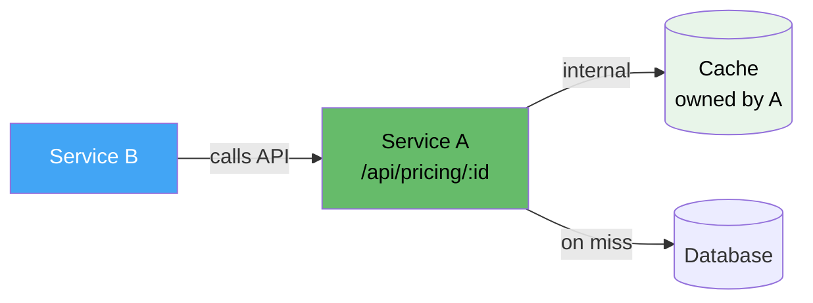

---

## Problem 4: The Shared Database Anti-Pattern

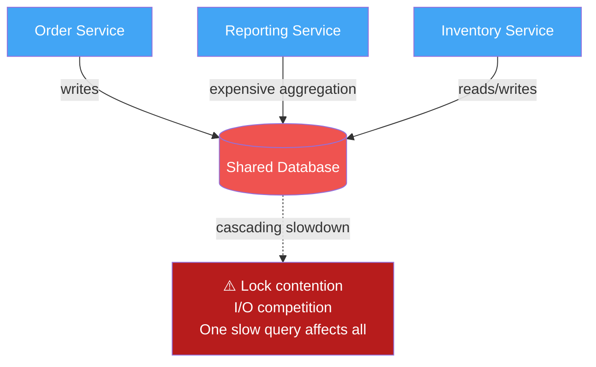

A reporting query running `SELECT * FROM orders` without a proper index doesn't just affect the reporting service — it competes for locks, I/O bandwidth, and buffer pool space with every other service.

### Database-Per-Service With Event-Driven Data Sharing

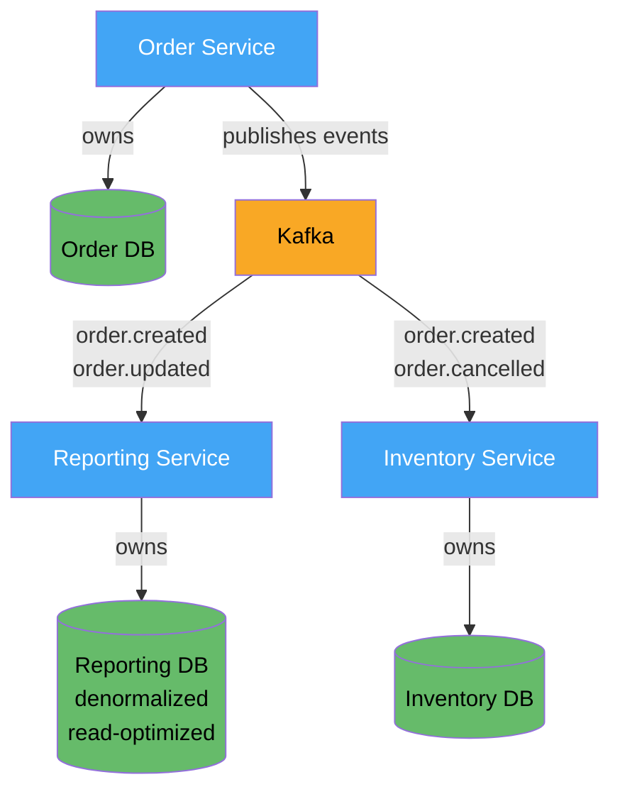

```java
// Order Service: owns its data, publishes events
@Service
public class OrderService {

   private final OrderRepository orderRepository;
   private final KafkaTemplate<String, OrderEvent> kafkaTemplate;

   @Transactional
   public Order createOrder(CreateOrderRequest request) {
       Order order = orderRepository.save(Order.from(request));
       kafkaTemplate.send("orders.created",
           order.getId().toString(),
           OrderCreatedEvent.from(order));
       return order;
   }
}

// Reporting Service: maintains its own read-optimized view
@Component
public class OrderReportingProjection {

   private final ReportingRepository reportingRepository;

   @KafkaListener(topics = "orders.created", groupId = "reporting-service")
   public void onOrderCreated(OrderCreatedEvent event) {
       reportingRepository.upsertOrderSummary(OrderSummary.from(event));
   }
}
```

The reporting database can be structured entirely differently — denormalized, pre-aggregated, optimized for specific queries. An expensive reporting query affects only the reporting database. The order service is completely isolated.

---

## Problem 5: Missing Backpressure and Circuit Breakers

### The Silent Queue That Kills Everything

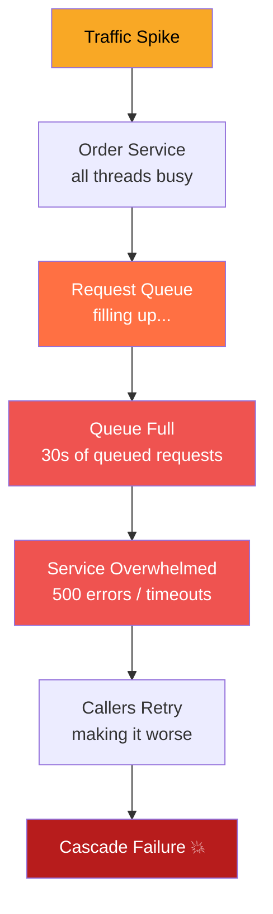

**Without backpressure:** the queue fills silently, then the system collapses.

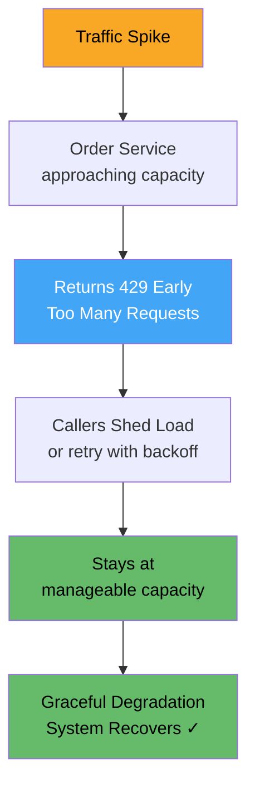

**With backpressure:** controlled degradation, system stays healthy.

### Circuit Breaker State Machine

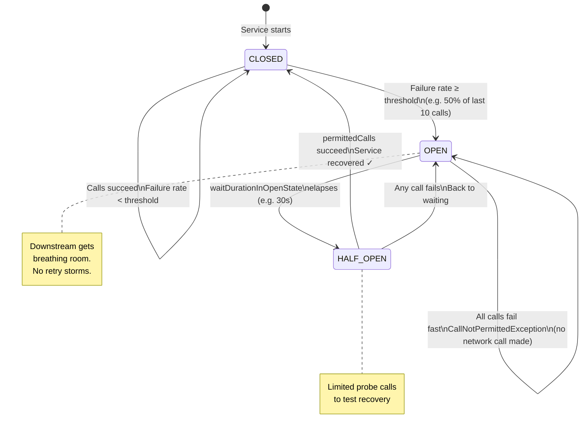

```java
@Configuration
public class ResilienceConfiguration {

   @Bean
   public CircuitBreakerRegistry circuitBreakerRegistry() {
       CircuitBreakerConfig config = CircuitBreakerConfig.custom()
           .failureRateThreshold(50)
           .slidingWindowType(SlidingWindowType.COUNT_BASED)
           .slidingWindowSize(10)
           .waitDurationInOpenState(Duration.ofSeconds(30))
           .permittedNumberOfCallsInHalfOpenState(3)
           .recordExceptions(
               IOException.class,
               TimeoutException.class,
               ServiceUnavailableException.class
           )
           .build();

       return CircuitBreakerRegistry.of(config);
   }

   @Bean
   public RateLimiterRegistry rateLimiterRegistry() {
       RateLimiterConfig config = RateLimiterConfig.custom()
           .limitRefreshPeriod(Duration.ofSeconds(1))
           .limitForPeriod(1000)
           .timeoutDuration(Duration.ofMillis(0)) // Fail immediately if over limit
           .build();
       return RateLimiterRegistry.of(config);
   }
}

// Composing resilience patterns — order matters
@Service
public class InventoryServiceClient {

   public InventoryCheckResult checkInventory(List<Long> productIds) {
       Supplier<InventoryCheckResult> supplier =
           Bulkhead.decorateSupplier(bulkhead,
               CircuitBreaker.decorateSupplier(circuitBreaker,
                   RateLimiter.decorateSupplier(rateLimiter,
                       Retry.decorateSupplier(retry,
                           () -> executeInventoryCheck(productIds)
                       )
                   )
               )
           );

       return Try.ofSupplier(supplier)
           .recover(BulkheadFullException.class,
               e -> InventoryCheckResult.serviceUnavailable("Too many concurrent requests"))
           .recover(CallNotPermittedException.class,
               e -> InventoryCheckResult.circuitOpen("Circuit open"))
           .recover(RequestNotPermitted.class,
               e -> InventoryCheckResult.rateLimited("Rate limit exceeded"))
           .get();
   }
}
```

---

## Problem 6: Sequential Calls That Should Be Parallel

```mermaid
gantt
   title Sequential vs Parallel Service Calls (p99 under load)
   dateFormat  x
   axisFormat  %Lms

   section Sequential (Bad)
   Payment Service     :crit, seq1, 0, 50
   Inventory Service   :crit, seq2, 50, 130
   Total = 130ms       :milestone, seq3, 130, 0

   section Parallel (Good)
   Payment Service     :active, par1, 0, 50
   Inventory Service   :active, par2, 0, 80
   Total = 80ms        :milestone, par3, 80, 0
```

38% latency reduction simply by running independent calls concurrently.

```java
@Service
public class OrderService {

   public CompletableFuture<OrderResult> createOrder(CreateOrderRequest request) {

       // Fire both calls simultaneously — they have no dependency on each other
       CompletableFuture<PaymentResult> paymentFuture =
           CompletableFuture.supplyAsync(
               () -> paymentClient.process(request.getPaymentDetails()),
               orderExecutor
           );

       CompletableFuture<InventoryResult> inventoryFuture =
           CompletableFuture.supplyAsync(
               () -> inventoryClient.check(request.getItems()),
               orderExecutor
           );

       // Total time = max(paymentTime, inventoryTime) not their sum
       return paymentFuture.thenCombine(inventoryFuture, (payment, inventory) -> {
           if (!payment.isSuccess()) {
               return OrderResult.failed("Payment declined: " + payment.getDeclineReason());
           }
           if (!inventory.isAvailable()) {
               return OrderResult.failed("Items not in stock: " + inventory.getUnavailableItems());
           }
           return OrderResult.success(persistOrder(request, payment, inventory));
       });
   }
}
```

---

## Problem 7: Async Offloading for Non-Critical Work

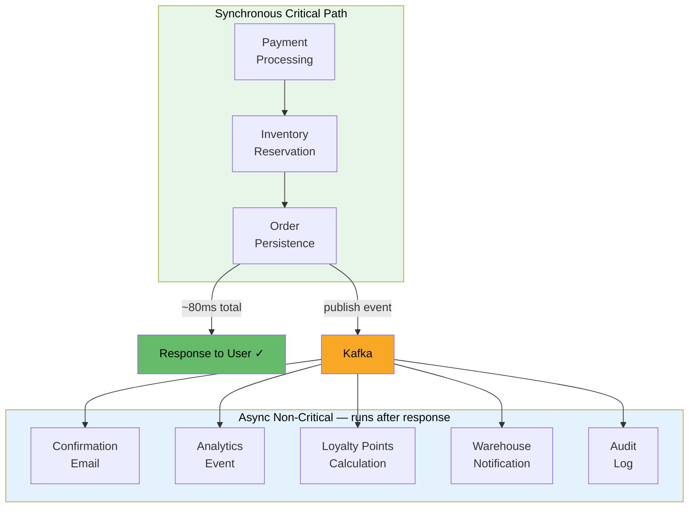

```
BEFORE (everything synchronous):
Payment:          80ms
Email sending:   200ms
Analytics:        50ms
Loyalty points:   30ms
Audit log:        20ms
─────────────────────
User waits:      380ms

AFTER (async offloading):
Payment:          80ms
─────────────────────
User waits:       80ms  ← everything else happens in background
```

```java
@Service
@Transactional
public class OrderService {

   public OrderConfirmation createOrder(CreateOrderRequest request) {
       // Critical path — synchronous
       PaymentResult payment = processPayment(request);
       InventoryReservation reservation = reserveInventory(request);
       Order order = orderRepository.save(Order.from(request, payment, reservation));

       // Non-critical — publish and forget
       kafkaTemplate.send("orders.created", OrderCreatedEvent.from(order));

       // Response returns in ~80ms — email/analytics happen asynchronously
       return OrderConfirmation.from(order);
   }
}
```

---

## Problem 8: Correlation IDs and Distributed Tracing

### The Value of a Shared Request ID

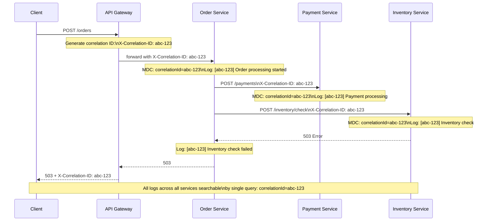

```java
@Component
public class CorrelationIdFilter implements Filter {

   public static final String CORRELATION_ID_HEADER = "X-Correlation-ID";
   public static final String CORRELATION_ID_MDC_KEY = "correlationId";

   @Override
   public void doFilter(ServletRequest req, ServletResponse res, FilterChain chain)
           throws IOException, ServletException {
       HttpServletRequest request = (HttpServletRequest) req;
       HttpServletResponse response = (HttpServletResponse) res;

       String correlationId = Optional
           .ofNullable(request.getHeader(CORRELATION_ID_HEADER))
           .filter(s -> !s.isBlank())
           .orElse(UUID.randomUUID().toString());

       MDC.put(CORRELATION_ID_MDC_KEY, correlationId);
       response.setHeader(CORRELATION_ID_HEADER, correlationId);

       try {
           chain.doFilter(req, res);
       } finally {
           MDC.remove(CORRELATION_ID_MDC_KEY); // Always clean up
       }
   }
}
```

### Distributed Tracing: Visualizing Where Time Goes

```mermaid
gantt
   title Order Request Trace — 241ms Total
   dateFormat  x
   axisFormat  %Lms

   section Request
   Auth middleware         :active,  auth,  0,   12
   Order handler total     :crit,    ord,   12,  241

   section Order Handler
   Pricing service         :active,  price, 12,  20
   Payment service (total) :crit,    pay,   12,  192
   Fraud check             :active,  fraud, 12,  52
   Payment gateway         :crit,    gate,  52,  192
   Inventory service       :active,  inv,   12,  34
   Order persistence       :active,  db,    192, 200
   Serialization           :active,  ser,   200, 209
```

Without tracing: "The order request takes 241ms — let's optimize the order service."

With tracing: "140ms is spent in the external payment gateway. Nothing to optimize in our code. Evaluate the payment provider's SLA or implement a timeout fallback."

---

## Problem 9: Timeout Budget Alignment

```mermaid
flowchart TD
   U[User tolerance: 5 seconds]
   GW[API Gateway: 4.5s timeout]
   OS[Order Service: 4s total budget]
   PS[Payment Service: 2s timeout]
   IS[Inventory Service: 1.5s timeout]
   PROC[Processing overhead: ~0.5s reserved]

   U --> GW
   GW --> OS
   OS --> PS
   OS --> IS
   OS --> PROC

   PS_NOTE["⚠️ If Payment hangs:\nPS times out after 2s\nOS still has 2s to handle gracefully\nGW still has 0.5s buffer"]
   PS -.-> PS_NOTE

   style GW fill:#42a5f5,color:#fff
   style OS fill:#f9a825,color:#000
   style PS fill:#66bb6a,color:#000
   style IS fill:#66bb6a,color:#000
   style PROC fill:#66bb6a,color:#000
   style PS_NOTE fill:#e8f5e9,color:#000
```

**The misaligned timeout anti-pattern:**

```mermaid
flowchart LR
   GW[API Gateway\n30s timeout]
   OS[Order Service\n30s timeout]
   PS[Payment Service\n30s timeout]
   FS[Fraud Service\nHANGS]

   GW --> OS --> PS --> FS

   RESULT["Result: 30s of held threads\nacross ALL services\nfor a request the client\nabandoned at 10s"]

   FS -.->|cascade| RESULT

   style GW fill:#ef5350,color:#fff
   style OS fill:#ef5350,color:#fff
   style PS fill:#ef5350,color:#fff
   style FS fill:#b71c1c,color:#fff
   style RESULT fill:#b71c1c,color:#fff
```

```java
@Configuration
public class TimeoutConfiguration {

   // Inner services timeout first — outer services can handle gracefully
   @Bean
   public WebClient paymentWebClient() {
       return WebClient.builder()
           .baseUrl("http://payment-service")
           .clientConnector(new ReactorClientHttpConnector(
               HttpClient.create()
                   .option(ChannelOption.CONNECT_TIMEOUT_MILLIS, 500)
                   .responseTimeout(Duration.ofMillis(2000)) // Payment: 2s
           ))
           .build();
   }

   @Bean
   public WebClient inventoryWebClient() {
       return WebClient.builder()
           .baseUrl("http://inventory-service")
           .clientConnector(new ReactorClientHttpConnector(
               HttpClient.create()
                   .option(ChannelOption.CONNECT_TIMEOUT_MILLIS, 500)
                   .responseTimeout(Duration.ofMillis(1500)) // Inventory: 1.5s
           ))
           .build();
   }
}
```

---

## Problem 10: Meaningful Health Checks

```mermaid
flowchart TD
   LB[Load Balancer]
   A[Instance A\nDB unreachable]
   B[Instance B\nhealthy]
   C[Instance C\nhealthy]

   subgraph BAD [❌ Useless Health Check]
       LB_BAD[Load Balancer]
       A_BAD[Instance A\nDB unreachable\nreturns 200 OK]
       LB_BAD --> A_BAD
       LB_BAD --> B_BAD[Instance B]
       LB_BAD --> C_BAD[Instance C]
       A_BAD -->|every request fails| ERR[User errors 💥]
   end

   subgraph GOOD [✓ Meaningful Health Check]
       LB_GOOD[Load Balancer]
       A_GOOD[Instance A\nDB unreachable\nreturns 503]
       LB_GOOD -->|removed from rotation| A_GOOD
       LB_GOOD --> B_GOOD[Instance B\nhealthy]
       LB_GOOD --> C_GOOD[Instance C\nhealthy]
       B_GOOD --> OK[Users served ✓]
       C_GOOD --> OK
   end

   style A_BAD fill:#ef5350,color:#fff
   style ERR fill:#b71c1c,color:#fff
   style A_GOOD fill:#ef5350,color:#fff
   style B_GOOD fill:#66bb6a,color:#000
   style C_GOOD fill:#66bb6a,color:#000
   style OK fill:#66bb6a,color:#000
```

```java
@GetMapping("/health")
public ResponseEntity<HealthStatus> health() {
   Map<String, ComponentHealth> checks = new LinkedHashMap<>();

   checks.put("database", checkDatabase());        // Actually query the DB
   checks.put("cache", checkCache());              // Read/write verify Redis
   checks.put("payment_service", checkPaymentService()); // Ping dependency

   boolean allHealthy = checks.values().stream()
       .allMatch(c -> c.getStatus() == Status.UP);

   return ResponseEntity
       .status(allHealthy ? HttpStatus.OK : HttpStatus.SERVICE_UNAVAILABLE)
       .body(new HealthStatus(allHealthy ? Status.UP : Status.DEGRADED, checks));
}
```

---

## Problem 11: Chaos Testing

```mermaid
flowchart TD
   subgraph INJECT [Fault Injection]
       L[Latency Injection\n300ms delay to 25% of calls]
       E[Error Injection\n503 for 10% of calls]
       RE[Resource Exhaustion\nCPU stress / packet loss]
   end

   subgraph OBSERVE [Observe System Response]
       CB[Do circuit breakers open?]
       GD[Does system degrade gracefully?]
       REC[Does it recover automatically?]
       TP[Do thread pools exhaust?]
   end

   subgraph DISCOVER [What Chaos Typically Reveals]
       TP2[Thread pools undersized\nunder retry pressure]
       TO[30s timeouts causing\nlong queues after user gave up]
       CC[Circuit breakers misconfigured\nnever actually opened]
       ML[Memory leaks under\nsustained load]
   end

   INJECT --> OBSERVE
   OBSERVE --> DISCOVER

   style INJECT fill:#ef5350,color:#fff
   style OBSERVE fill:#42a5f5,color:#fff
   style DISCOVER fill:#f9a825,color:#000
```

```yaml
# Istio: inject 300ms delay into 25% of payment service calls
apiVersion: networking.istio.io/v1alpha3
kind: VirtualService
metadata:
 name: payment-service
spec:
 http:
   - fault:
       delay:
         percentage:
           value: 25.0
         fixedDelay: 300ms
     route:
       - destination:
           host: payment-service
---
# Error injection: 503 for 10% of inventory calls
apiVersion: networking.istio.io/v1alpha3
kind: VirtualService
metadata:
 name: inventory-service
spec:
 http:
   - fault:
       abort:
         percentage:
           value: 10.0
         httpStatus: 503
     route:
       - destination:
           host: inventory-service
```

---

## The Production Readiness Checklist

```mermaid
mindmap
 root((Production\nReadiness))
   Resilience
     Circuit breaker per downstream
     Exponential backoff with jitter
     Timeouts on all outbound calls
     Timeout budget aligned across chain
     Rate limiting and backpressure
   Observability
     Correlation ID propagated everywhere
     Structured logging with correlation ID
     Distributed tracing OpenTelemetry
     Latency histograms p50 p95 p99
     Health checks verify dependencies
   Scalability
     Stateless services
     External session and state storage
     Database per service
     Independent calls run in parallel
     Non-critical work async
   Domain Boundaries
     Cohesive domain services
     No chatty call chains
     Events published with trace context
   Failure Testing
     Latency injection tested
     Error injection tested
     Load tested at 2x peak traffic
     Recovery tested after fault removal
```

---

## Summary: The Mental Model for Distributed Systems Under Load

```mermaid
flowchart LR
   subgraph ASSUME [Design Assumptions]
       NC[Every network call\nwill sometimes fail]
       NS[Every service\nwill sometimes be at capacity]
       ND[Every dependency\nwill sometimes be unreachable]
       NL[Every load spike\nwill sometimes exceed estimates]
   end

   subgraph RESPOND [System Should]
       FF[Fail fast\nnot queue indefinitely]
       DG[Degrade gracefully\nnot cascade]
       MV[Make failures visible\nnot hide them]
       RA[Recover automatically\nnot require intervention]
   end

   ASSUME --> RESPOND

   style ASSUME fill:#ef5350,color:#fff
   style RESPOND fill:#66bb6a,color:#000
```

The systems that hold up under production load share one characteristic: they were built with the assumption that everything will eventually fail, and were designed to degrade gracefully rather than collapse catastrophically.

Scaling doesn't fix architectural problems. Adding more instances of a service that holds threads for 30 seconds just creates more threads held for 30 seconds. The fix is the design: controlled retries, circuit breakers, backpressure, async offloading, correct service boundaries, statelessness, and end-to-end observability.

Follow requests across boundaries. Understand where time is spent. Make failure observable. Test failure deliberately. The rest becomes engineering rather than firefighting.
~~~markdown~~~