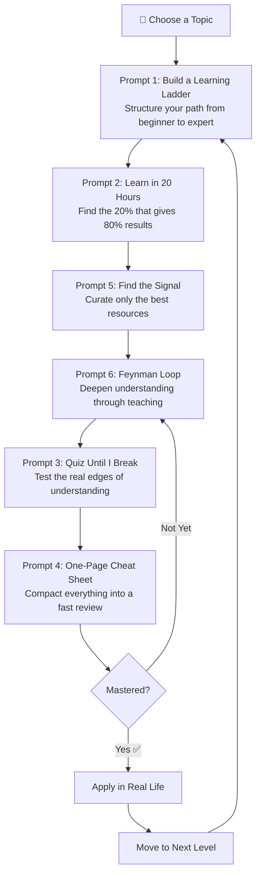
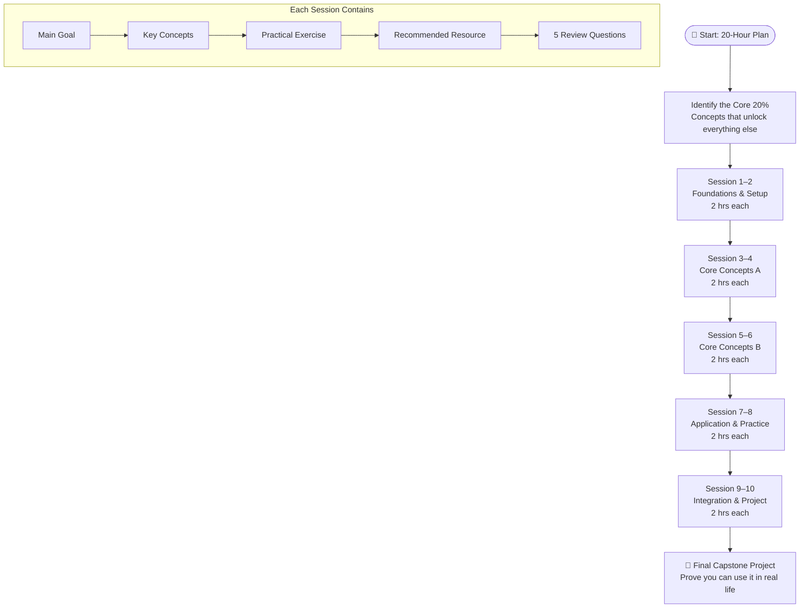
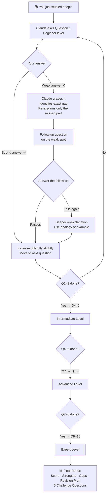
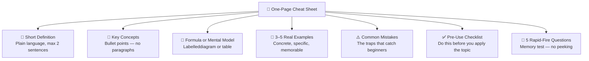
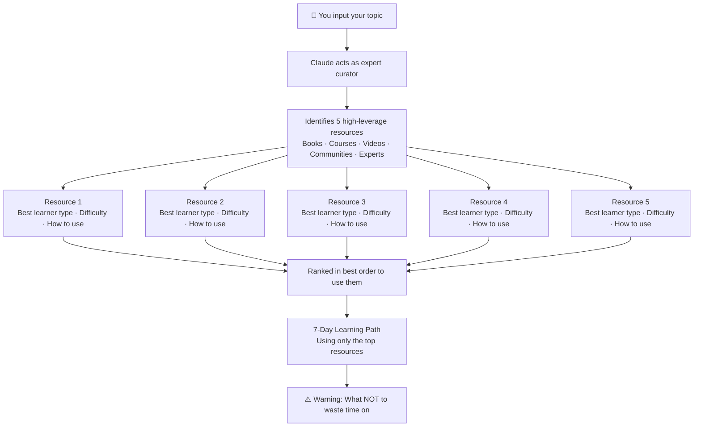
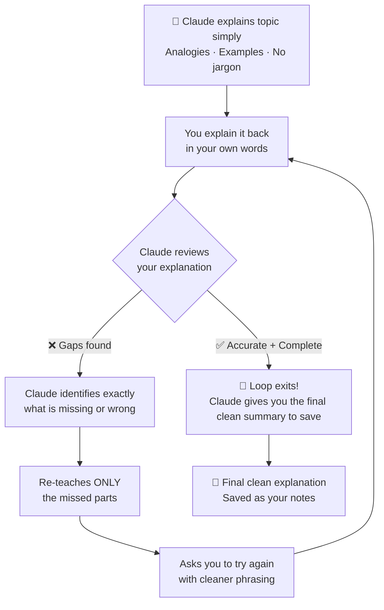
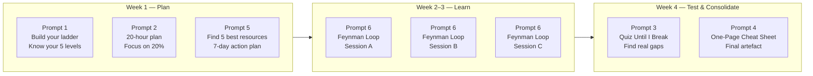

# 🎓 6 Master Prompts to Learn Anything Using Claude AI
### A Complete Tutorial — From Passive Reading to Deep Mastery

---

## 📖 Introduction

Most people use AI for quick answers. They ask a question, get a response, feel smart for ten minutes, and forget everything by Tuesday.

That is not learning — that is browsing.

Real learning requires **structure**, **active recall**, **feedback loops**, and **deliberate practice**. The six master prompts in this tutorial transform Claude from a search engine into a personal teacher, examiner, coach, and curriculum designer — all at once.

This tutorial walks you through each prompt with:
- What it does and why it works
- How to fill it in for any topic
- Real worked examples
- Use cases across different domains
- Diagrams for clear mental models

---

## 🗺️ The Big Picture — How the 6 Prompts Fit Together

Before diving in, understand the system. These prompts are not random — they form a complete learning cycle:



> **Pro Tip:** Use Prompt 1 first — always. It is the foundation. Prompts 2 and 5 handle the *what* and *where* to study. Prompts 6 and 3 handle *depth* and *testing*. Prompt 4 is your exit artefact.

---

## 📚 Prompt 1 — Build a Learning Ladder

### 🔍 What It Does

Most learners fail because they treat learning as a flat list of topics to cover. A learning ladder transforms that flat list into **five structured levels** — each with its own goal, milestone, exercise, and self-check question.

This prompt answers the two most common learner frustrations:
- *"I don't know where to start."*
- *"I don't know if I'm ready to move on."*

### 📋 The Prompt

```
I want to learn [topic] step by step, without skipping important foundations.

Act like an expert teacher and skill coach. Break [topic] into 5 clear difficulty levels,
from complete beginner to confident practitioner.

For each level, include:
1. Level name
2. What I should understand at this stage
3. What mastery looks like at this level
4. The most important concepts or skills to focus on
5. One milestone that proves I am ready to move forward
6. One hands-on exercise or mini-project
7. Common mistakes learners make at this level
8. A simple self-check question before moving to the next level

Structure the levels like this:
* Level 1: Complete Beginner
* Level 2: Basic Understanding
* Level 3: Practical User
* Level 4: Problem Solver
* Level 5: Confident Practitioner

Keep the explanation practical, beginner-friendly, and focused on real progress.
Do not overload me with too much theory. Help me climb the topic one level at a time.
```

### 🏗️ The Level Architecture

```mermaid
flowchart LR
    subgraph L1["Level 1 — Complete Beginner"]
        A1[Core vocabulary]
        A2[Foundational concepts]
        A3[First hands-on task]
    end

    subgraph L2["Level 2 — Basic Understanding"]
        B1[Connect the concepts]
        B2[Recognize patterns]
        B3[Complete guided exercises]
    end

    subgraph L3["Level 3 — Practical User"]
        C1[Apply independently]
        C2[Solve basic problems]
        C3[Build a small project]
    end

    subgraph L4["Level 4 — Problem Solver"]
        D1[Debug edge cases]
        D2[Combine techniques]
        D3[Teach basics to others]
    end

    subgraph L5["Level 5 — Confident Practitioner"]
        E1[Create original work]
        E2[Handle complex scenarios]
        E3[Mentor others]
    end

    L1 -->|Self-check passed| L2
    L2 -->|Self-check passed| L3
    L3 -->|Self-check passed| L4
    L4 -->|Self-check passed| L5
```



### 💡 Worked Examples

#### Example 1 — Learning Python

| Level | Understanding | Milestone | Exercise |
|-------|--------------|-----------|---------|
| L1: Beginner | Variables, loops, functions | Write a script that prints numbers 1–10 | Build a simple calculator |
| L2: Basic | Lists, dicts, file I/O | Parse a CSV and display its contents | Student grade tracker |
| L3: Practical | APIs, error handling, OOP | Call a public API and process the data | Weather app using OpenWeather API |
| L4: Problem Solver | Decorators, generators, async | Refactor a messy codebase cleanly | Build a CLI tool with argparse |
| L5: Practitioner | Architecture, testing, packaging | Publish a pip-installable package | Open-source library contribution |

#### Example 2 — Learning Public Speaking

| Level | Focus | Milestone | Exercise |
|-------|-------|-----------|---------|
| L1: Beginner | Posture, eye contact, pacing | 2-min talk to a mirror recorded | Describe your weekend — 90 seconds |
| L2: Basic | Structure (opening/body/close) | 5-min structured talk to 2 friends | "Three things I learned this year" |
| L3: Practical | Storytelling, hooks, transitions | Talk at a local Toastmasters session | Deliver a talk with a clear narrative arc |
| L4: Problem Solver | Q&A handling, improvisation | Lead a 15-min workshop without notes | Improv game: 1-min speech on random topic |
| L5: Practitioner | Stage presence, influence, charisma | Invited back to speak again | Full 30-min keynote with slides |

### 🌍 Real-World Use Cases

- **Career switchers:** Map out all five levels of a new skill before quitting your job.
- **Students:** Use the ladder before an exam to identify which level you're actually at.
- **Managers:** Assess where your team members sit on any skill ladder.
- **Parents:** Build a learning ladder for your child's new hobby (chess, coding, music).

---

## ⏱️ Prompt 2 — Learn Anything in 20 Hours

### 🔍 What It Does

This prompt weaponises the **Pareto Principle** (80/20 rule) for learning. Instead of trying to master *everything*, you identify the 20% of concepts that unlock 80% of real-world usefulness — then build a focused 20-hour plan around those.

### 📋 The Prompt

```
I want to learn [topic] in 20 focused hours.

Act like an expert teacher and learning strategist. Your job is to help me learn
the most useful parts first, not everything.

Please do the following:
1. Identify the 20% of concepts, skills, or principles that will give me 80% of
   the real-world results.
2. Explain why these core areas matter and how they connect to practical use.
3. Create a 10-session learning plan, with each session lasting 2 hours.
4. For every session, include:
   - Main learning goal
   - Key concepts to study
   - One practical exercise or mini-project
   - One recommended resource (preferably free or beginner-friendly)
   - Expected outcome after completing the session
5. At the end of each session, give me 5 review questions to test my understanding.
6. After the full plan, suggest one final project that proves I understand the topic
   well enough to use it in real life.

Keep the plan beginner-friendly, practical, and focused on fast progress.
```

### 📅 The 10-Session Structure



### 💡 Worked Example — Learning SQL in 20 Hours

**The Core 20% of SQL:**

1. `SELECT`, `FROM`, `WHERE` — the foundation of every query
2. `JOIN` (INNER, LEFT, RIGHT) — combine tables
3. `GROUP BY` + aggregate functions (`COUNT`, `SUM`, `AVG`) — analyse data
4. `ORDER BY`, `LIMIT` — sort and paginate results
5. Subqueries — nest logic

**Sample 10-Session Plan:**

| Session | Goal | Exercise | Resource |
|---------|------|----------|----------|
| 1 | Set up SQLite, write first SELECT | Query a mock customers table | SQLiteOnline.com |
| 2 | Filter with WHERE, AND, OR, LIKE | Find all customers from London aged >30 | Mode SQL Tutorial |
| 3 | INNER JOIN two tables | Join orders to customers | W3Schools SQL |
| 4 | LEFT JOIN + NULL handling | Find customers with no orders | PostgreSQL docs |
| 5 | COUNT, SUM, AVG | Total sales per product category | SQLZoo.net |
| 6 | GROUP BY + HAVING | Top 5 customers by spend | Khan Academy SQL |
| 7 | ORDER BY, LIMIT, OFFSET | Build a leaderboard | SELECT Star SQL |
| 8 | Subqueries | Find customers who spent above average | Codewars SQL kata |
| 9 | Real dataset practice | Query a public dataset (e.g., NYC taxis) | Kaggle datasets |
| 10 | Final integration | Dashboard-ready query set | Personal project |

**Final Project:** *"Build a business insights report for a mock e-commerce database: top products, best customers, monthly revenue trends — all from raw SQL queries."*

### 🌍 Real-World Use Cases

- **Professionals upskilling:** 20 hours is a weekend sprint — doable without quitting your job.
- **Founders:** Learn just enough about a new domain (SEO, ads, finance) to hire and evaluate experts.
- **Students:** Complete a new technical skill before an internship starts.
- **Hobbyists:** Get practical results fast (photography, woodworking, drawing) without years of theory.

---

## 🧪 Prompt 3 — Quiz Me Until I Break

### 🔍 What It Does

Passive reading is a lie. You feel like you understand — until someone asks you a question and your mind goes blank. This prompt forces **active recall** by turning Claude into a strict but kind examiner that progressively escalates difficulty until it finds your real knowledge ceiling.

The key insight: **the gaps it finds are where the real learning happens.**

### 📋 The Prompt

```
I just studied [topic], and I want to test how well I really understand it.

Act like a strict but helpful examiner. Your job is to find the edge of my
understanding through active recall.

Start by asking me 10 questions, one at a time.

Rules:
1. Make the questions progressively harder:
   * Questions 1–3: beginner level
   * Questions 4–6: intermediate level
   * Questions 7–8: advanced level
   * Questions 9–10: expert level

2. Ask only one question at a time and wait for my answer.

3. After each answer, do four things:
   * Grade my answer out of 10
   * Tell me what I got right
   * Identify the exact gap, mistake, or weak point
   * Re-explain only the part I missed in simple language

4. If my answer is weak, ask one follow-up question before moving on.
5. If I answer well, increase the difficulty slightly.

6. At the end, give me:
   * My final score
   * My strongest areas
   * My weakest areas
   * A short revision plan
   * 5 final challenge questions to master the topic

Do not give me all answers at once. Make this feel like a real learning interview.
```

### 🔄 The Quiz Loop



### 💡 Sample Question Progression — Topic: "Machine Learning Basics"

| Q# | Level | Sample Question |
|----|-------|----------------|
| 1 | Beginner | What is the difference between supervised and unsupervised learning? |
| 2 | Beginner | What does a training set vs a test set do? |
| 3 | Beginner | Explain what overfitting means in plain English. |
| 4 | Intermediate | Why does adding more features sometimes hurt a model's performance? |
| 5 | Intermediate | What is the bias-variance tradeoff? |
| 6 | Intermediate | Explain why gradient descent might get stuck. |
| 7 | Advanced | What is the difference between L1 and L2 regularisation — and when would you choose each? |
| 8 | Advanced | Why can increasing a neural network's depth sometimes make training harder? |
| 9 | Expert | Explain why batch normalisation helps training deep networks. |
| 10 | Expert | What are the limitations of back-propagation, and what alternatives exist? |

### 🌍 Real-World Use Cases

- **Job interview prep:** Simulate a technical interview before the real thing.
- **Exam revision:** Replace passive re-reading with high-stakes active recall.
- **Teaching others:** After the quiz, you'll know exactly what you need to reinforce.
- **Onboarding at a new job:** Rapidly validate your understanding of a new domain.

---

## 📄 Prompt 4 — Create a One-Page Cheat Sheet

### 🔍 What It Does

Your brain remembers **structure** far better than prose. A well-designed cheat sheet acts like a cognitive map — when you scan it, you reactivate everything you studied in seconds. This prompt generates a complete, scan-friendly, exam-ready reference sheet for any topic.

### 📋 The Prompt

```
I want a one-page cheat sheet for [topic].

Act like an expert teacher who can simplify complex ideas into a fast review sheet.

Create a cheat sheet that I can review in 5 minutes before I need to use the topic.

Please include:
1. A short definition of the topic in simple language.
2. The most important concepts, rules, formulas, or steps.
3. Clear bullet points instead of long paragraphs.
4. A simple labeled diagram, flowchart, table, or mental model if it helps explain the topic.
5. 3–5 concrete examples that show how the topic works in real life.
6. Common mistakes or confusing parts I should avoid.
7. A quick "Before You Use This" checklist.
8. 5 rapid-fire questions to test my memory.
```

### 🗂️ Cheat Sheet Anatomy



### 💡 Example Output — Cheat Sheet for "Git Version Control"

**What it is:** Git is a system that tracks every change to your code over time, letting you undo mistakes and collaborate safely.

**Key Commands:**

| Command | What it does |
|---------|-------------|
| `git init` | Start tracking a new folder |
| `git add .` | Stage all changed files |
| `git commit -m "msg"` | Save a snapshot with a message |
| `git push` | Send commits to the remote repo |
| `git pull` | Get the latest changes from the remote |
| `git branch` | List branches / create a new one |
| `git merge` | Combine one branch into another |
| `git log --oneline` | See compact commit history |

**Common Mistakes:**
- ❌ Committing directly to `main` — always branch first
- ❌ Writing vague messages like `"fix"` — be specific: `"Fix login bug when token expires"`
- ❌ Pushing secrets (API keys) — use `.gitignore`

**Before You Push Checklist:**
- [ ] Ran `git status` to see what changed?
- [ ] Reviewed the diff with `git diff`?
- [ ] Written a clear commit message?
- [ ] Tested the code locally?

**5 Rapid-Fire Questions:**
1. What does `git stash` do?
2. What's the difference between `git merge` and `git rebase`?
3. How do you undo the last commit without losing changes?
4. What is a detached HEAD state?
5. How do you resolve a merge conflict?

### 🌍 Real-World Use Cases

- **Before an exam:** 5-minute scan replaces 2 hours of re-reading notes.
- **Before a job interview:** Refresh your knowledge of SQL, Python, or system design.
- **Before a client meeting:** Refresh domain knowledge (UX, finance, legal) quickly.
- **Teaching a colleague:** Hand them the cheat sheet as a structured starting point.

---

## 🔍 Prompt 5 — Find the Signal in the Noise

### 🔍 What It Does

For every topic imaginable, there are thousands of books, courses, videos, blogs, and communities. Most are mediocre. A few are transformative. This prompt acts as a **learning curator** — finding the 5 highest-leverage resources and giving you a 7-day action plan.

### 📋 The Prompt

```
I want to learn [topic] fast, but I do not want to waste time on low-quality resources.

Act like an expert learning curator. Find the 5 highest-leverage resources for
learning [topic].

The resources can include books, videos, courses, websites, newsletters,
communities, or experts to follow.

For each resource, include:
1. Resource name
2. Type of resource
3. Why it is worth my time
4. What specific part of [topic] it helps me learn
5. Best learner type for this resource
6. Difficulty level: beginner, intermediate, or advanced
7. How I should use it effectively
8. One warning about what not to waste time on

After the list, rank the resources in the best order to use them.
Then give me a simple 7-day learning path using only these resources.
Focus on quality, clarity, and practical usefulness.
```

### 🗺️ The Curation Process



### 💡 Worked Example — "I want to learn Data Visualisation"

| # | Resource | Type | Best For | Difficulty |
|---|----------|------|----------|-----------|
| 1 | *Storytelling with Data* — Cole Nussbaumer Knaflic | Book | Beginners who want principles first | Beginner |
| 2 | Tableau Public + tutorials | Software + free videos | Hands-on learners who want to build fast | Beginner–Intermediate |
| 3 | D3.js Observablenotebooks | Interactive code | Developers wanting custom/web visualisations | Intermediate–Advanced |
| 4 | *The Functional Art* — Alberto Cairo | Book | Anyone who wants to think like a designer | Intermediate |
| 5 | Flowing Data (flowingdata.com) | Newsletter + tutorials | Self-directed learners wanting real examples | All levels |

**7-Day Path:**
- Days 1–2: Read chapters 1–5 of *Storytelling with Data*. Critique 3 charts from news sites.
- Days 3–4: Build 3 visualisations in Tableau Public using a Kaggle dataset.
- Day 5: Watch one D3.js tutorial and replicate a simple bar chart.
- Day 6: Read Alberto Cairo chapters on chart choice and visual hierarchy.
- Day 7: Build one complete "before vs after" visualisation: fix a bad chart you found online.

**⚠️ What NOT to waste time on:** Collecting dashboards on Pinterest. Installing every charting library. Watching tutorials without building anything.

### 🌍 Real-World Use Cases

- **Self-starters:** Eliminate analysis paralysis — stop shopping for resources and start using them.
- **Time-constrained professionals:** Find the 5 resources worth your evenings, not the 500 that waste them.
- **Online course buyers:** Avoid expensive courses when free alternatives are often better.
- **Teams:** Use the curated list as a shared reading list for team upskilling.

---

## 🔁 Prompt 6 — The Feynman Loop

### 🔍 What It Does

Richard Feynman, the Nobel Prize-winning physicist, had a simple test for understanding: *"If you cannot explain it simply, you do not understand it yet."*

This prompt implements Feynman's technique as an **active feedback loop**. You get an explanation, then you teach it back, then Claude corrects your explanation, then you try again — until your explanation becomes clean, simple, and complete.

### 📋 The Prompt

```
I want to understand [topic] deeply using the Feynman learning method.

Act like a patient teacher. First, explain [topic] to me in simple language,
as if I am 12 years old.

Use:
* simple words
* real-life examples
* analogies
* no unnecessary jargon
* short explanations

After explaining, ask me to explain the topic back in my own words.

Then review my explanation and do the following:
1. Identify what I explained correctly.
2. Find every gap, mistake, confusion, or missing idea.
3. Re-teach only the parts I got wrong or missed.
4. Ask me to explain it again in a cleaner way.
5. Repeat this loop until my explanation is simple, accurate, and complete.

Rules:
* Do not move forward until my explanation is clear.
* Do not overload me with extra theory.
* Correct me gently but clearly.
* Use examples whenever I am confused.
* At the end, give me a final clean explanation I can save as notes.
```

### 🔄 The Feynman Loop Diagram



### 💡 Worked Example — Explaining "Compound Interest"

**Round 1 — Claude's explanation:**
> "Imagine you put $100 in a piggy bank that magically adds 10% every year. After year 1, you have $110. But here's the trick — in year 2, you get 10% of $110, not $100. So you earn $11, not $10. The longer you wait, the bigger the snowball gets — because you're earning interest on your interest."

**Round 1 — You try to explain it:**
> "Compound interest means you earn money on your savings, and the more you save, the more you earn."

**Claude's feedback:**
> ✅ Right: You understood it involves earning on savings.
> ❌ Missing: You didn't mention the key mechanic — you earn interest *on the interest already earned*, not just on the original amount. That's what makes it compound. Also missing: the time dimension. Compound interest gets dramatically more powerful over many years, not just slightly better.

**Round 2 — You try again:**
> "Compound interest means you earn interest not just on your original money, but also on all the interest you've already earned. So the total keeps growing faster and faster over time — like a snowball getting bigger as it rolls."

**Claude's feedback:**
> ✅ Excellent. The snowball metaphor nails it. That is a complete, accurate, simple explanation.

**Final clean summary for your notes:**
> *Compound interest means your money earns returns not only on the original amount, but also on all returns previously earned. This creates exponential rather than linear growth — a snowball effect where time is your most powerful variable.*

### 💡 More Example Applications

| Topic | The Key Gap Most Learners Have |
|-------|-------------------------------|
| Recursion | They know functions call themselves but cannot explain the base case |
| Inflation | They say "prices go up" but miss the purchasing power / supply dynamic |
| Photosynthesis | They know it produces oxygen but miss that glucose is the actual product |
| Risk diversification | They say "don't put eggs in one basket" but can't explain *why* mathematically |
| HTTP vs HTTPS | They know HTTPS is "secure" but can't explain what the encryption actually protects |

### 🌍 Real-World Use Cases

- **University students:** Feynman-test yourself before every exam — it will reveal gaps in 60 seconds.
- **Engineers:** Use before presenting a technical concept to a non-technical audience.
- **Teachers and trainers:** Reverse-engineer your own curriculum by testing whether you can explain each unit simply.
- **Writers:** Use before writing an explainer article — if you can't say it simply, you cannot write it clearly.

---

## 🔗 Combining All 6 Prompts — A Full Learning Sprint

Here is a realistic 4-week sprint using all six prompts for learning any skill:



**How to use them together, step by step:**

1. **Day 1** → Run Prompt 1 on your topic. Read through the 5 levels. Locate yourself honestly.
2. **Day 2** → Run Prompt 2. Get your 10-session plan. Block time in your calendar.
3. **Day 3** → Run Prompt 5. Get your 5 best resources. Discard everything else.
4. **Days 4–20** → Work through your 10 sessions. After each session, run Prompt 6 on the hardest concept.
5. **Day 21** → Run Prompt 3. Take the full 10-question quiz. Note your weakest areas.
6. **Day 22** → Run Prompt 6 again on the weak areas revealed by the quiz.
7. **Day 23** → Run Prompt 4. Generate your cheat sheet. Review it for 5 minutes every morning for one week.

---

## 🧠 Pro Tips for Using These Prompts

1. **Always fill in the `[topic]` specifically** — "Python" is vague. "Python for data analysis using pandas and matplotlib" is precise. The more specific your topic, the better Claude's response.

2. **Use multiple prompts on the same topic** — they compound. A cheat sheet + a quiz session + a Feynman loop on the same topic triples retention.

3. **Save your outputs** — Claude generates a new response each time. Copy and save your learning ladder, cheat sheet, and session plans to Notion, Obsidian, or a simple doc.

4. **Return to Prompt 3 often** — the quiz is not a one-time event. Run it again after a week of rest and you will find new gaps.

5. **Use the `[topic]` slot for subtopics** — after getting the big-picture ladder for "Machine Learning," run Prompt 1 again specifically for "Gradient Descent" to go deep on one rung.

6. **Combine with spaced repetition** — after Prompt 3 reveals your weakest questions, add them to a flashcard app (Anki, RemNote) for long-term retention.

---

## ✅ Summary — The 6 Prompts at a Glance

| # | Prompt Name | Best Used For | Output |
|---|-------------|--------------|--------|
| 1 | Build a Learning Ladder | Starting any new topic | 5-level structured roadmap |
| 2 | Learn in 20 Hours | Focused rapid skill building | 10-session calendar plan |
| 3 | Quiz Until I Break | Testing real understanding | Score + gap analysis + revision plan |
| 4 | One-Page Cheat Sheet | Fast review before use | Compact visual reference card |
| 5 | Find the Signal | Choosing what to study from | 5 curated resources + 7-day plan |
| 6 | The Feynman Loop | Deepening conceptual understanding | Clean, saveable explanation |

> **The bottom line:** These prompts do not replace the work of learning. They make the work dramatically more efficient by eliminating confusion about what to study, how to study it, and whether you actually understand it. Use them consistently, and any topic becomes learnable.

---

*Transform Claude from an answer machine into a personal learning system — one structured prompt at a time.*