# 🏗️ 10 Years of Infrastructure Evolution: Console → CLI → IaC → GitOps → AI
### A Comprehensive Tutorial for Modern DevOps Engineers

> **Based on:** *"The Right Way to Manage AWS Infrastructure"* by TechWorld with Nana  
> **Level:** Beginner → Advanced | **Est. Reading Time:** 45–60 mins

---

## 📌 Table of Contents

1. [The Big Picture: Why Infrastructure Management Evolved](#the-big-picture)
2. [Stage 1: The AWS Console](#stage-1-aws-console)
3. [Stage 2: CLI & Scripting](#stage-2-cli--scripting)
4. [Stage 3: Infrastructure as Code (IaC)](#stage-3-infrastructure-as-code)
5. [Stage 4: GitOps](#stage-4-gitops)
6. [Stage 5: AI-Assisted Infrastructure](#stage-5-ai-assisted-infrastructure)
7. [Why You Can't Skip the Stages](#why-you-cant-skip)
8. [Real-World Use Cases](#real-world-use-cases)
9. [Choosing Your Stage](#choosing-your-stage)

---

## 🌍 The Big Picture: Why Infrastructure Management Evolved {#the-big-picture}

Every engineer who has ever had to **recreate a production environment from scratch after an outage** understands the core problem: infrastructure is complex, stateful, and incredibly easy to get wrong when done manually.

The 10-year evolution of infrastructure management is not a story of tools replacing each other — it's a story of **each stage solving the fundamental failures of the previous one**, while introducing new challenges that demanded the next stage.

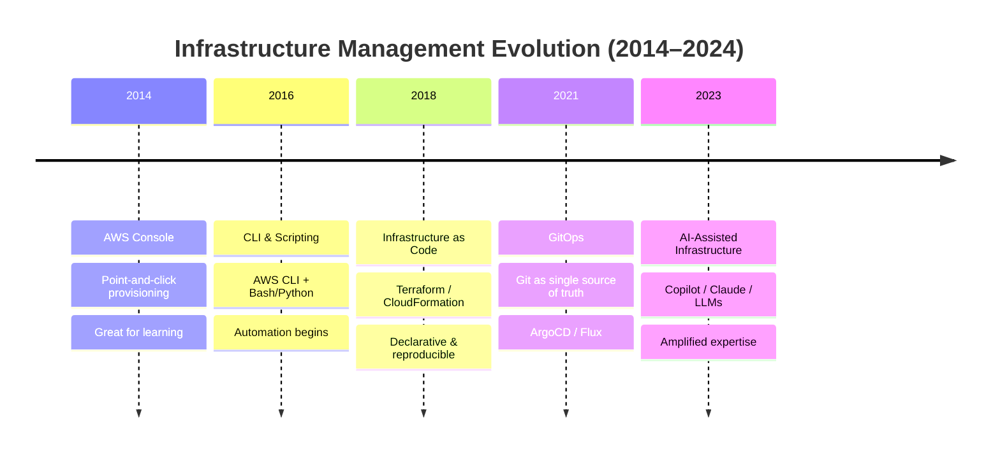
```mermaid
timeline
    title Infrastructure Management Evolution (2014–2024)
    2014 : AWS Console
         : Point-and-click provisioning
         : Great for learning
    2016 : CLI & Scripting
         : AWS CLI + Bash/Python
         : Automation begins
    2018 : Infrastructure as Code
         : Terraform / CloudFormation
         : Declarative & reproducible
    2021 : GitOps
         : Git as single source of truth
         : ArgoCD / Flux
    2023 : AI-Assisted Infrastructure
         : Copilot / Claude / LLMs
         : Amplified expertise
```

### The Core Problem: Recreating Infrastructure Manually

Imagine this scenario:

> Your company's entire staging environment goes down on a Friday night. Your senior engineer is on vacation. You need to **recreate 15 EC2 instances, 3 RDS databases, 6 security groups, 4 load balancers, and a VPC from memory** to restore service.

Without the right tools, this is either:
- **Impossible** (you don't remember every setting)
- **Dangerous** (you'll get something wrong)
- **Extremely slow** (taking hours or days)

This is the problem that drove 10 years of innovation.

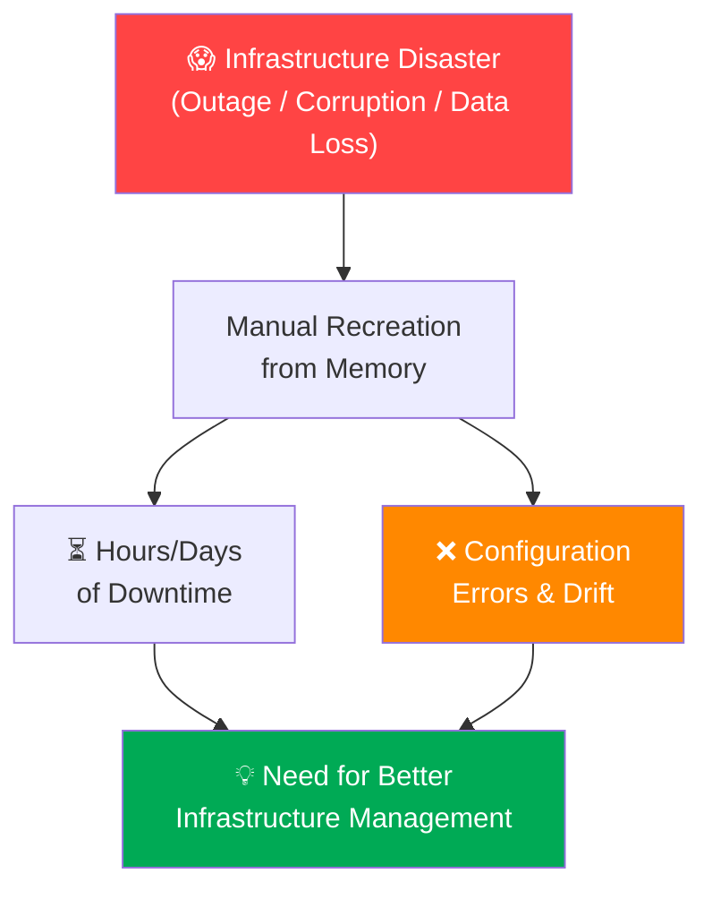
```mermaid
flowchart TD
    PROBLEM["😱 Infrastructure Disaster\n(Outage / Corruption / Data Loss)"]
    MANUAL["Manual Recreation\nfrom Memory"]
    SLOW["⏳ Hours/Days\nof Downtime"]
    WRONG["❌ Configuration\nErrors & Drift"]
    EVOLUTION["💡 Need for Better\nInfrastructure Management"]

    PROBLEM --> MANUAL
    MANUAL --> SLOW
    MANUAL --> WRONG
    SLOW --> EVOLUTION
    WRONG --> EVOLUTION

    style PROBLEM fill:#ff4444,color:#fff
    style EVOLUTION fill:#00aa55,color:#fff
    style WRONG fill:#ff8800,color:#fff
```

---

## 🖥️ Stage 1: The AWS Console {#stage-1-aws-console}

### What It Is

The AWS Management Console is a **web-based graphical interface** where you point, click, and configure cloud resources visually. You log in at `console.aws.amazon.com` and interact with services through a browser UI.

### Why It's Still Valuable

Despite being the "lowest" stage, the Console remains genuinely useful for:

| Use Case | Why Console Works |
|----------|-------------------|
| **Learning** | Visual feedback helps build mental models |
| **Exploration** | Browse new services without committing |
| **Debugging** | Quickly inspect resource state |
| **One-off tasks** | Small, non-repeatable actions |
| **Monitoring** | Dashboards, CloudWatch graphs |

### Example: Creating an EC2 Instance via Console

```
1. Navigate to EC2 → Launch Instance
2. Choose AMI: Amazon Linux 2023
3. Instance type: t3.micro
4. Key pair: my-keypair
5. Security group: Allow SSH (port 22), HTTP (port 80)
6. Storage: 20 GB gp3
7. Click "Launch Instance"
→ Instance running in ~60 seconds
```

### The Problems Console Creates

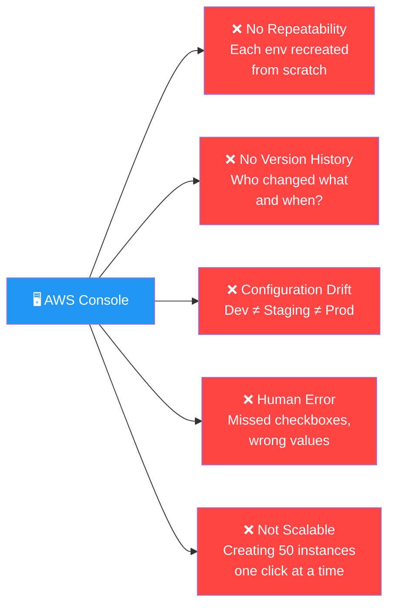
```mermaid
flowchart LR
    CONSOLE["🖥️ AWS Console"]
    
    CONSOLE --> P1["❌ No Repeatability\nEach env recreated\nfrom scratch"]
    CONSOLE --> P2["❌ No Version History\nWho changed what\nand when?"]
    CONSOLE --> P3["❌ Configuration Drift\nDev ≠ Staging ≠ Prod"]
    CONSOLE --> P4["❌ Human Error\nMissed checkboxes,\nwrong values"]
    CONSOLE --> P5["❌ Not Scalable\nCreating 50 instances\none click at a time"]

    style CONSOLE fill:#2196F3,color:#fff
    style P1 fill:#ff4444,color:#fff
    style P2 fill:#ff4444,color:#fff
    style P3 fill:#ff4444,color:#fff
    style P4 fill:#ff4444,color:#fff
    style P5 fill:#ff4444,color:#fff
```

### Real-World Scenario

> A startup uses the Console to set up their first product launch. Three months later, they want to create an identical staging environment. Nobody can remember the exact security group rules, the specific AMI version, or the RDS parameter groups that were configured. **The staging environment becomes subtly different from production** — causing bugs that only appear in prod.

---

## ⌨️ Stage 2: CLI & Scripting {#stage-2-cli--scripting}

### What It Is

Instead of clicking through a UI, you use the **AWS CLI** (Command Line Interface) combined with **shell scripts (Bash)** or **Python (Boto3)** to automate resource creation.

### How It Works

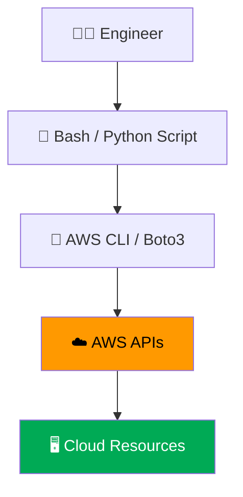
```mermaid
flowchart TD
    ENGINEER["👩‍💻 Engineer"]
    SCRIPT["📄 Bash / Python Script"]
    AWSCLI["🔧 AWS CLI / Boto3"]
    AWS["☁️ AWS APIs"]
    RESOURCES["🖥️ Cloud Resources"]

    ENGINEER --> SCRIPT
    SCRIPT --> AWSCLI
    AWSCLI --> AWS
    AWS --> RESOURCES

    style AWS fill:#FF9900,color:#000
    style RESOURCES fill:#00aa55,color:#fff
```

### Example: Bash Script to Create EC2

```bash
#!/bin/bash
# create-ec2.sh — Repeatable EC2 provisioning

INSTANCE_TYPE="t3.micro"
AMI_ID="ami-0c55b159cbfafe1f0"
KEY_NAME="my-keypair"
SECURITY_GROUP="sg-0abc123def456789"
SUBNET_ID="subnet-12345678"

echo "🚀 Launching EC2 instance..."

INSTANCE_ID=$(aws ec2 run-instances \
  --image-id $AMI_ID \
  --instance-type $INSTANCE_TYPE \
  --key-name $KEY_NAME \
  --security-group-ids $SECURITY_GROUP \
  --subnet-id $SUBNET_ID \
  --count 1 \
  --query 'Instances[0].InstanceId' \
  --output text)

echo "✅ Instance launched: $INSTANCE_ID"

# Wait for it to be running
aws ec2 wait instance-running --instance-ids $INSTANCE_ID
echo "✅ Instance is now running!"

# Tag it
aws ec2 create-tags \
  --resources $INSTANCE_ID \
  --tags Key=Name,Value=web-server-01 Key=Environment,Value=production
```

### Example: Python with Boto3

```python
import boto3

def create_s3_bucket(bucket_name: str, region: str = "us-east-1"):
    """Creates an S3 bucket with versioning enabled."""
    s3 = boto3.client("s3", region_name=region)
    
    # Create the bucket
    s3.create_bucket(Bucket=bucket_name)
    
    # Enable versioning
    s3.put_bucket_versioning(
        Bucket=bucket_name,
        VersioningConfiguration={"Status": "Enabled"}
    )
    
    # Block all public access
    s3.put_public_access_block(
        Bucket=bucket_name,
        PublicAccessBlockConfiguration={
            "BlockPublicAcls": True,
            "IgnorePublicAcls": True,
            "BlockPublicPolicy": True,
            "RestrictPublicBuckets": True
        }
    )
    
    print(f"✅ Bucket '{bucket_name}' created with versioning & private access.")

create_s3_bucket("my-app-backups-2024")
```

### What Scripting Solves vs. Creates

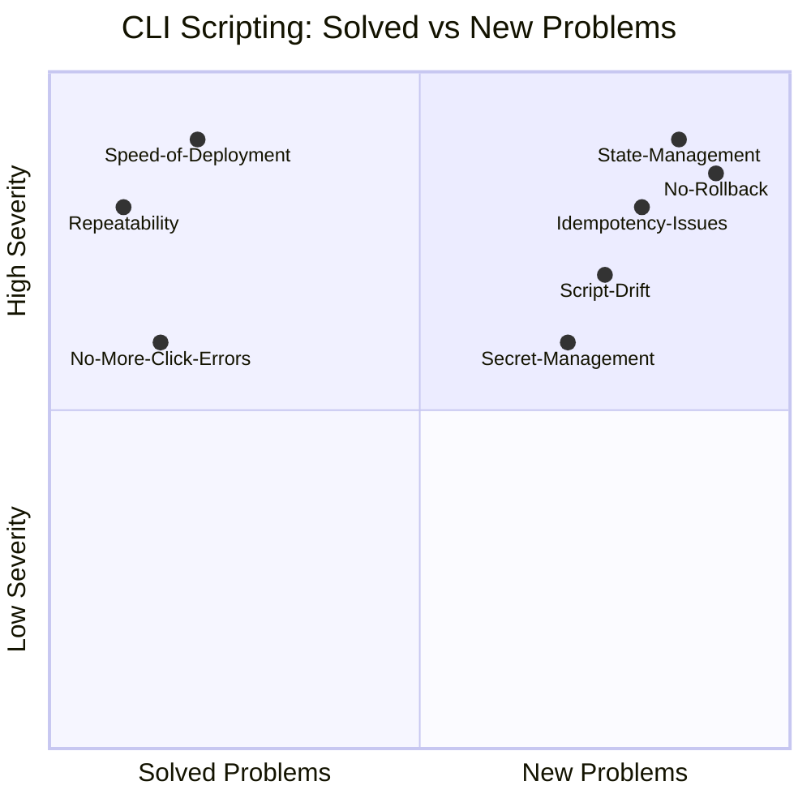
```mermaid
quadrantChart
    title CLI Scripting: Solved vs New Problems
    x-axis Solved Problems --> New Problems
    y-axis Low Severity --> High Severity
    
    Repeatability: [0.1, 0.8]
    No-More-Click-Errors: [0.15, 0.6]
    Speed-of-Deployment: [0.2, 0.9]
    State-Management: [0.85, 0.9]
    Idempotency-Issues: [0.8, 0.8]
    Script-Drift: [0.75, 0.7]
    No-Rollback: [0.9, 0.85]
    Secret-Management: [0.7, 0.6]
```

### The Idempotency Problem (Critical Concept)

**Idempotency** means: running a script 10 times produces the same result as running it once.

```bash
# ❌ NON-IDEMPOTENT — Creates a new bucket every time
aws s3api create-bucket --bucket my-app-bucket

# If bucket already exists → ERROR!
# An error occurred (BucketAlreadyExists)

# ✅ IDEMPOTENT — Checks before creating
BUCKET_EXISTS=$(aws s3api head-bucket --bucket my-app-bucket 2>&1)
if [ -z "$BUCKET_EXISTS" ]; then
    echo "Bucket exists, skipping..."
else
    aws s3api create-bucket --bucket my-app-bucket
    echo "Bucket created."
fi
```

Writing idempotent scripts manually is **tedious and error-prone**. This is the main reason IaC was invented.

---

## 🏗️ Stage 3: Infrastructure as Code (IaC) {#stage-3-infrastructure-as-code}

### What It Is

IaC means describing your infrastructure in **declarative configuration files** that you version-control like application code. The most popular tool is **Terraform** (by HashiCorp). AWS has its own called **CloudFormation**.

Instead of saying *"run these steps"* (imperative), you say *"this is the desired state"* (declarative) and the tool figures out how to get there.

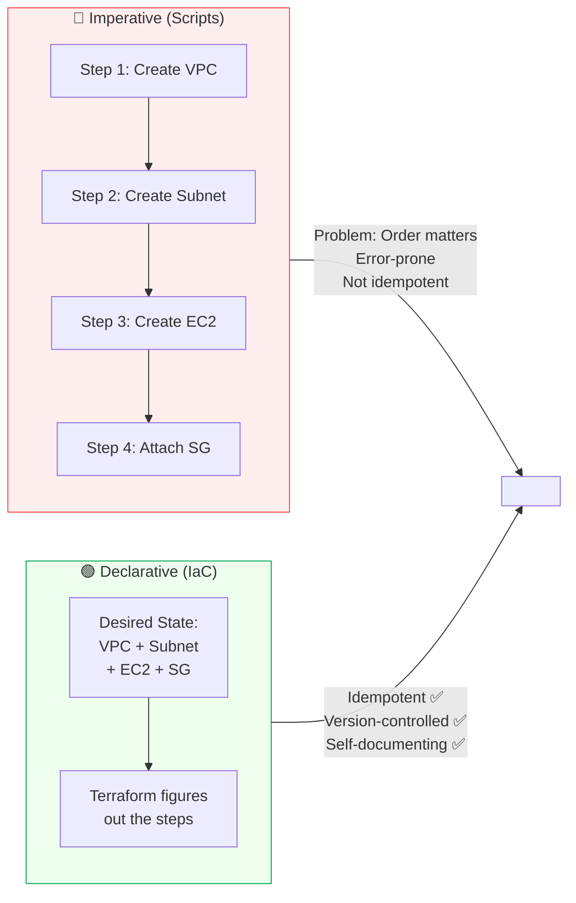
```mermaid
flowchart LR
    subgraph IMPERATIVE["🔴 Imperative (Scripts)"]
        direction TB
        I1["Step 1: Create VPC"]
        I2["Step 2: Create Subnet"]
        I3["Step 3: Create EC2"]
        I4["Step 4: Attach SG"]
        I1 --> I2 --> I3 --> I4
    end

    subgraph DECLARATIVE["🟢 Declarative (IaC)"]
        direction TB
        D1["Desired State:\nVPC + Subnet\n+ EC2 + SG"]
        D2["Terraform figures\nout the steps"]
        D1 --> D2
    end

    IMPERATIVE -->|"Problem: Order matters\nError-prone\nNot idempotent"| GAP[" "]
    DECLARATIVE -->|"Idempotent ✅\nVersion-controlled ✅\nSelf-documenting ✅"| GAP

    style IMPERATIVE fill:#ffeeee,stroke:#ff4444
    style DECLARATIVE fill:#eeffee,stroke:#00aa55
```

### Terraform Core Concepts

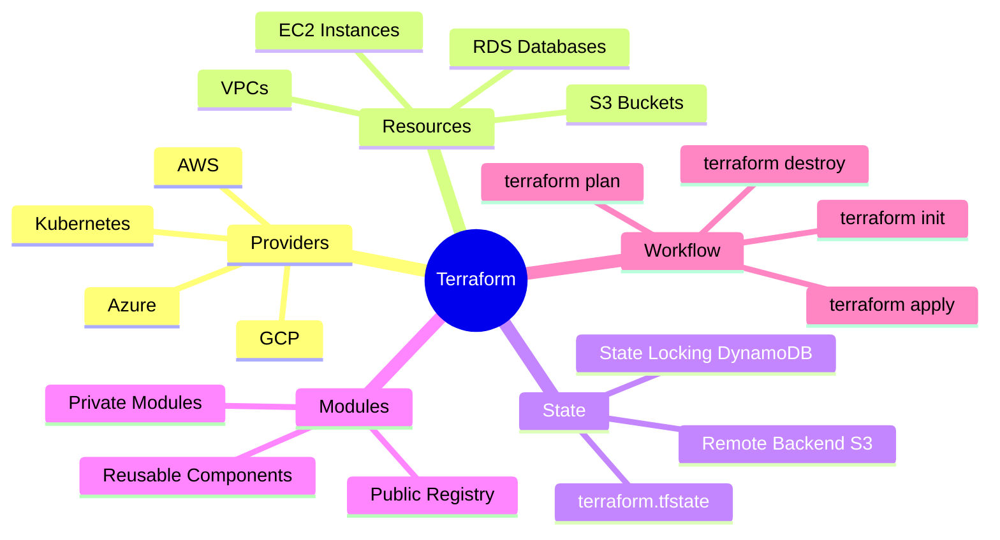
```mermaid
mindmap
  root((Terraform))
    Providers
      AWS
      Azure
      GCP
      Kubernetes
    Resources
      EC2 Instances
      S3 Buckets
      RDS Databases
      VPCs
    State
      terraform.tfstate
      Remote Backend S3
      State Locking DynamoDB
    Modules
      Reusable Components
      Public Registry
      Private Modules
    Workflow
      terraform init
      terraform plan
      terraform apply
      terraform destroy
```

### Example: Complete AWS VPC + EC2 with Terraform

```hcl
# main.tf — Production-ready infrastructure

terraform {
  required_providers {
    aws = {
      source  = "hashicorp/aws"
      version = "~> 5.0"
    }
  }
  
  # Store state remotely — critical for teams!
  backend "s3" {
    bucket         = "my-terraform-state"
    key            = "prod/terraform.tfstate"
    region         = "us-east-1"
    dynamodb_table = "terraform-state-lock"
    encrypt        = true
  }
}

provider "aws" {
  region = var.aws_region
}

# ----- VPC -----
resource "aws_vpc" "main" {
  cidr_block           = "10.0.0.0/16"
  enable_dns_hostnames = true
  enable_dns_support   = true

  tags = {
    Name        = "${var.project_name}-vpc"
    Environment = var.environment
  }
}

# ----- Public Subnet -----
resource "aws_subnet" "public" {
  vpc_id                  = aws_vpc.main.id
  cidr_block              = "10.0.1.0/24"
  availability_zone       = "${var.aws_region}a"
  map_public_ip_on_launch = true

  tags = {
    Name = "${var.project_name}-public-subnet"
  }
}

# ----- Security Group -----
resource "aws_security_group" "web" {
  name        = "${var.project_name}-web-sg"
  description = "Allow HTTP and SSH traffic"
  vpc_id      = aws_vpc.main.id

  ingress {
    from_port   = 80
    to_port     = 80
    protocol    = "tcp"
    cidr_blocks = ["0.0.0.0/0"]
  }

  ingress {
    from_port   = 22
    to_port     = 22
    protocol    = "tcp"
    cidr_blocks = [var.admin_ip_cidr]  # Restrict SSH to known IPs!
  }

  egress {
    from_port   = 0
    to_port     = 0
    protocol    = "-1"
    cidr_blocks = ["0.0.0.0/0"]
  }
}

# ----- EC2 Instance -----
resource "aws_instance" "web" {
  ami                    = data.aws_ami.amazon_linux.id
  instance_type          = var.instance_type
  subnet_id              = aws_subnet.public.id
  vpc_security_group_ids = [aws_security_group.web.id]
  key_name               = var.key_pair_name

  user_data = <<-EOF
    #!/bin/bash
    yum update -y
    yum install -y httpd
    systemctl start httpd
    systemctl enable httpd
    echo "<h1>Hello from Terraform!</h1>" > /var/www/html/index.html
  EOF

  tags = {
    Name        = "${var.project_name}-web-server"
    Environment = var.environment
  }
}

# ----- Data Source: Latest Amazon Linux AMI -----
data "aws_ami" "amazon_linux" {
  most_recent = true
  owners      = ["amazon"]

  filter {
    name   = "name"
    values = ["al2023-ami-*-x86_64"]
  }
}

# ----- Variables -----
variable "aws_region"    { default = "us-east-1" }
variable "project_name"  { default = "myapp" }
variable "environment"   { default = "production" }
variable "instance_type" { default = "t3.micro" }
variable "key_pair_name" {}
variable "admin_ip_cidr" { default = "10.0.0.0/8" }

# ----- Outputs -----
output "web_public_ip" {
  value       = aws_instance.web.public_ip
  description = "Public IP of web server"
}
```

### The Terraform Workflow

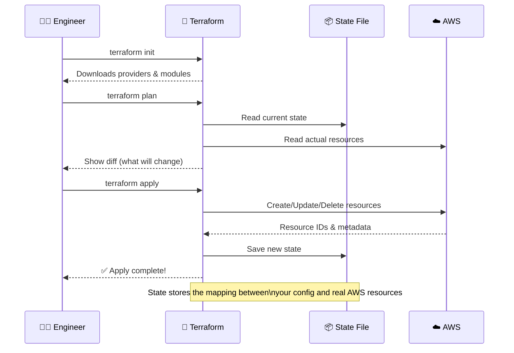
```mermaid
sequenceDiagram
    participant E as 👩‍💻 Engineer
    participant TF as 🔧 Terraform
    participant S as 📦 State File
    participant AWS as ☁️ AWS

    E->>TF: terraform init
    TF-->>E: Downloads providers & modules

    E->>TF: terraform plan
    TF->>S: Read current state
    TF->>AWS: Read actual resources
    TF-->>E: Show diff (what will change)

    E->>TF: terraform apply
    TF->>AWS: Create/Update/Delete resources
    AWS-->>TF: Resource IDs & metadata
    TF->>S: Save new state
    TF-->>E: ✅ Apply complete!

    Note over TF,S: State stores the mapping between\nyour config and real AWS resources
```

### IaC Modules: Reusability at Scale

```hcl
# Calling a reusable module — DRY principle in action

module "staging_db" {
  source = "./modules/rds-postgres"
  
  environment     = "staging"
  instance_class  = "db.t3.medium"
  storage_gb      = 20
  multi_az        = false  # Save money in staging
}

module "production_db" {
  source = "./modules/rds-postgres"
  
  environment     = "production"
  instance_class  = "db.r6g.xlarge"
  storage_gb      = 500
  multi_az        = true   # High availability in prod
}
```

---

## 🔄 Stage 4: GitOps {#stage-4-gitops}

### What It Is

**GitOps** takes IaC to its logical conclusion: **Git becomes the single source of truth** for all infrastructure and application state. Every change to infrastructure goes through a pull request. An automated agent continuously reconciles the actual state with the desired state in Git.

### The GitOps Principles

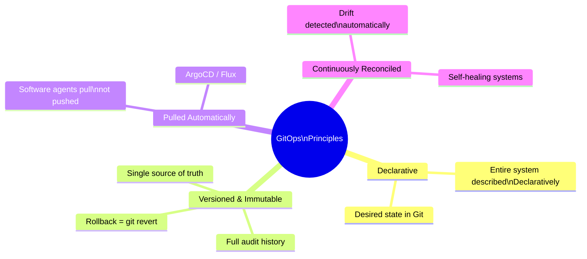
```mermaid
mindmap
  root((GitOps\nPrinciples))
    Declarative
      Entire system described\nDeclaratively
      Desired state in Git
    Versioned & Immutable
      Single source of truth
      Full audit history
      Rollback = git revert
    Pulled Automatically
      Software agents pull\nnot pushed
      ArgoCD / Flux
    Continuously Reconciled
      Drift detected\nautomatically
      Self-healing systems
```

### GitOps vs Traditional CI/CD

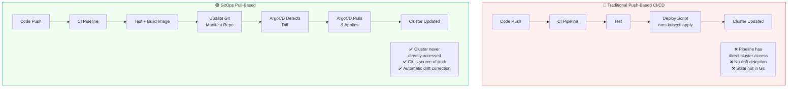
```mermaid
flowchart TD
    subgraph TRADITIONAL["🔴 Traditional Push-Based CI/CD"]
        direction LR
        TC1["Code Push"] --> TC2["CI Pipeline"] --> TC3["Test"] --> TC4["Deploy Script\nruns kubectl apply"] --> TC5["Cluster Updated"]
        note1["❌ Pipeline has\ndirect cluster access\n❌ No drift detection\n❌ State not in Git"]
    end
    
    subgraph GITOPS["🟢 GitOps Pull-Based"]
        direction LR
        GC1["Code Push"] --> GC2["CI Pipeline"] --> GC3["Test + Build Image"] --> GC4["Update Git\nManifest Repo"] --> GC5["ArgoCD Detects\nDiff"] --> GC6["ArgoCD Pulls\n& Applies"] --> GC7["Cluster Updated"]
        note2["✅ Cluster never\ndirectly accessed\n✅ Git is source of truth\n✅ Automatic drift correction"]
    end

    style TRADITIONAL fill:#fff0f0,stroke:#ff4444
    style GITOPS fill:#f0fff0,stroke:#00aa55
```

### ArgoCD: The GitOps Engine

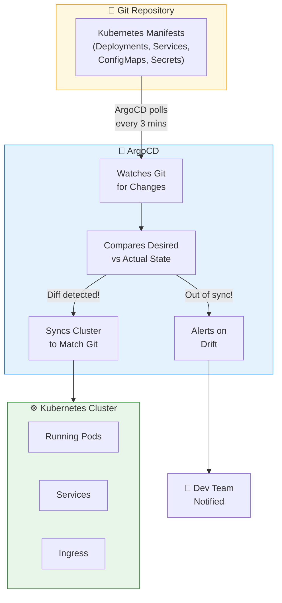
```mermaid
graph TD
    subgraph GIT["📁 Git Repository"]
        MANIFESTS["Kubernetes Manifests\n(Deployments, Services,\nConfigMaps, Secrets)"]
    end

    subgraph ARGO["🔄 ArgoCD"]
        WATCH["Watches Git\nfor Changes"]
        COMPARE["Compares Desired\nvs Actual State"]
        SYNC["Syncs Cluster\nto Match Git"]
        ALERT["Alerts on\nDrift"]
    end

    subgraph K8S["☸️ Kubernetes Cluster"]
        PODS["Running Pods"]
        SVCS["Services"]
        INGRESS["Ingress"]
    end

    MANIFESTS -->|"ArgoCD polls\nevery 3 mins"| WATCH
    WATCH --> COMPARE
    COMPARE -->|"Diff detected!"| SYNC
    COMPARE -->|"Out of sync!"| ALERT
    SYNC --> K8S
    ALERT --> DEVTEAM["📧 Dev Team\nNotified"]

    style GIT fill:#fff8e1,stroke:#FFA000
    style ARGO fill:#e3f2fd,stroke:#1976D2
    style K8S fill:#e8f5e9,stroke:#388E3C
```

### Example: ArgoCD Application Manifest

```yaml
# argocd-application.yaml
apiVersion: argoproj.io/v1alpha1
kind: Application
metadata:
  name: my-web-app
  namespace: argocd
spec:
  project: default
  
  # Where to find the desired state
  source:
    repoURL: https://github.com/myorg/k8s-manifests.git
    targetRevision: main
    path: apps/my-web-app/overlays/production
  
  # Where to deploy it
  destination:
    server: https://kubernetes.default.svc
    namespace: production
  
  syncPolicy:
    automated:
      prune: true      # Delete resources removed from Git
      selfHeal: true   # Auto-fix manual changes (drift correction!)
    syncOptions:
      - CreateNamespace=true
```

### GitOps Workflow: A Pull Request Changes Production

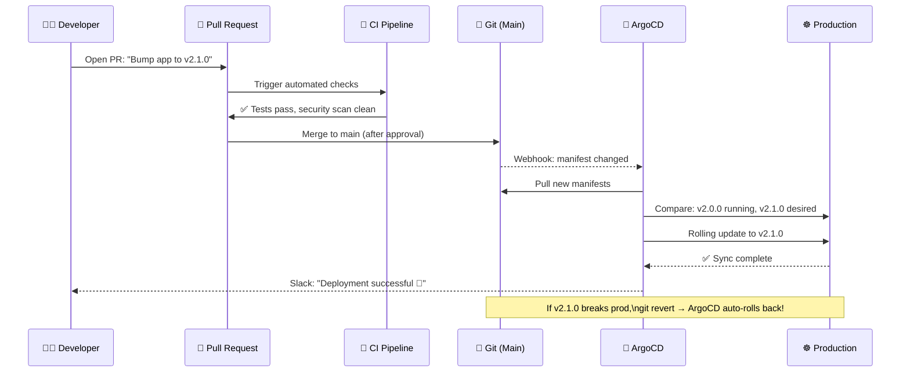
```mermaid
sequenceDiagram
    participant Dev as 👩‍💻 Developer
    participant PR as 📝 Pull Request
    participant CI as 🔄 CI Pipeline
    participant Git as 📁 Git (Main)
    participant Argo as 🔄 ArgoCD
    participant Prod as ☸️ Production

    Dev->>PR: Open PR: "Bump app to v2.1.0"
    PR->>CI: Trigger automated checks
    CI->>PR: ✅ Tests pass, security scan clean
    PR->>Git: Merge to main (after approval)
    Git-->>Argo: Webhook: manifest changed
    Argo->>Git: Pull new manifests
    Argo->>Prod: Compare: v2.0.0 running, v2.1.0 desired
    Argo->>Prod: Rolling update to v2.1.0
    Prod-->>Argo: ✅ Sync complete
    Argo-->>Dev: Slack: "Deployment successful 🎉"

    Note over Git,Prod: If v2.1.0 breaks prod,\ngit revert → ArgoCD auto-rolls back!
```

### Configuration Drift: The Problem GitOps Eliminates


```mermaid
flowchart TD
    subgraph WITHOUT["🔴 Without GitOps: Drift Accumulates"]
        W1["Git says: replicas=3"]
        W2["Engineer manually scales:\nkubectl scale --replicas=5"]
        W3["Incident: memory issue\nAnother engineer: replicas=2"]
        W4["Git still says: replicas=3\nActual: replicas=2\n😱 Nobody knows the truth"]
        W1 --> W2 --> W3 --> W4
    end

    subgraph WITH["🟢 With GitOps: Drift Impossible"]
        G1["Git says: replicas=3"]
        G2["Engineer tries:\nkubectl scale --replicas=5"]
        G3["ArgoCD detects drift\nwithin 3 minutes"]
        G4["Auto-corrects back\nto replicas=3"]
        G5["✅ Git is always truth"]
        G1 --> G2 --> G3 --> G4 --> G5
    end

    style WITHOUT fill:#fff0f0,stroke:#ff4444
    style WITH fill:#f0fff0,stroke:#00aa55
```

---

## 🤖 Stage 5: AI-Assisted Infrastructure {#stage-5-ai-assisted-infrastructure}

### What It Is

AI assistance doesn't replace any of the previous stages — it **amplifies the engineer's expertise across all of them**. AI helps you write IaC faster, debug errors better, generate Kubernetes manifests, explain security misconfigurations, and design architectures.

> 🔑 **Key Insight:** AI amplifies expertise. An engineer who understands Terraform deeply will get 10× more value from AI than one who skips to AI without learning the foundations.

### How AI Fits Into Each Stage

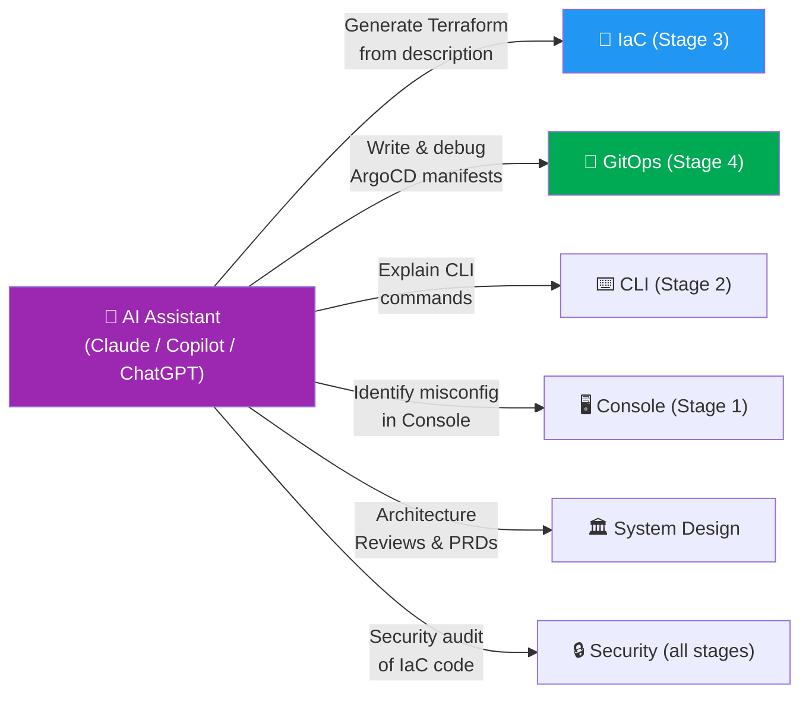
```mermaid
graph LR
    AI["🤖 AI Assistant\n(Claude / Copilot / ChatGPT)"]

    AI -->|"Generate Terraform\nfrom description"| IaC["📄 IaC (Stage 3)"]
    AI -->|"Write & debug\nArgoCD manifests"| GitOps["🔄 GitOps (Stage 4)"]
    AI -->|"Explain CLI\ncommands"| CLI["⌨️ CLI (Stage 2)"]
    AI -->|"Identify misconfig\nin Console"| Console["🖥️ Console (Stage 1)"]
    AI -->|"Architecture\nReviews & PRDs"| Design["🏛️ System Design"]
    AI -->|"Security audit\nof IaC code"| Security["🔒 Security (all stages)"]

    style AI fill:#9C27B0,color:#fff
    style IaC fill:#2196F3,color:#fff
    style GitOps fill:#00aa55,color:#fff
```

### Example: Prompting AI for Infrastructure

```
❓ Prompt:
"Write Terraform code for a highly available web application on AWS.
It needs:
- 2 EC2 instances across 2 AZs behind an ALB
- Auto Scaling Group with min=2, max=10
- RDS PostgreSQL with Multi-AZ
- S3 bucket for static assets
- CloudFront distribution
- All resources tagged with Environment=production"

✅ AI Output: Complete, working Terraform module with all resources,
              dependencies wired correctly, security best practices,
              and outputs defined.
```

### Example: AI-Assisted Debugging

```bash
# Error you paste to AI:
Error: Error creating DB Instance: DBInstanceAlreadyExists: 
DB instance already exists
  with aws_db_instance.main, on main.tf line 45, in resource "aws_db_instance" "main"

# AI explains:
# "This means the RDS instance 'myapp-db' already exists in AWS 
# but isn't tracked in your state file. This usually happens after:
# - A failed apply that partially created resources
# - Someone manually created the resource
# 
# Fix: Import the existing resource into state:
# terraform import aws_db_instance.main myapp-db"
```

### AI Limitations: Why You Can't Skip to Stage 5

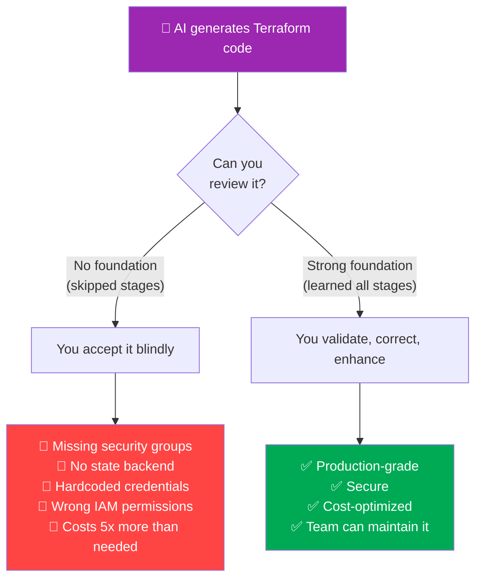
```mermaid
flowchart TD
    AI_INPUT["🤖 AI generates Terraform code"]
    
    AI_INPUT --> REVIEW{"Can you\nreview it?"}
    
    REVIEW -->|"No foundation\n(skipped stages)"| BAD_PATH["You accept it blindly"]
    BAD_PATH --> ISSUES["🔴 Missing security groups\n🔴 No state backend\n🔴 Hardcoded credentials\n🔴 Wrong IAM permissions\n🔴 Costs 5x more than needed"]
    
    REVIEW -->|"Strong foundation\n(learned all stages)"| GOOD_PATH["You validate, correct, enhance"]
    GOOD_PATH --> RESULT["✅ Production-grade\n✅ Secure\n✅ Cost-optimized\n✅ Team can maintain it"]

    style AI_INPUT fill:#9C27B0,color:#fff
    style ISSUES fill:#ff4444,color:#fff
    style RESULT fill:#00aa55,color:#fff
```

---

## ⚠️ Why You Can't Skip the Stages {#why-you-cant-skip}

This is the most important lesson from 10 years of infrastructure evolution. Engineers who skip stages hit invisible walls.

### The Foundation Dependency Map

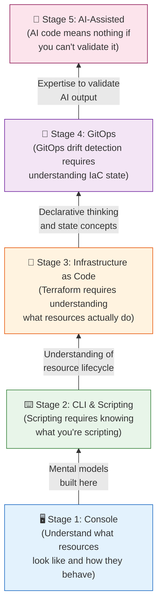
```mermaid
graph BT
    AI["🤖 Stage 5: AI-Assisted\n(AI code means nothing if\nyou can't validate it)"]
    GITOPS["🔄 Stage 4: GitOps\n(GitOps drift detection requires\nunderstanding IaC state)"]
    IaC["📄 Stage 3: Infrastructure as Code\n(Terraform requires understanding\nwhat resources actually do)"]
    CLI["⌨️ Stage 2: CLI & Scripting\n(Scripting requires knowing\nwhat you're scripting)"]
    CONSOLE["🖥️ Stage 1: Console\n(Understand what resources\nlook like and how they behave)"]

    CONSOLE -->|"Mental models\nbuilt here"| CLI
    CLI -->|"Understanding of\nresource lifecycle"| IaC
    IaC -->|"Declarative thinking\nand state concepts"| GITOPS
    GITOPS -->|"Expertise to validate\nAI output"| AI

    style CONSOLE fill:#E3F2FD,stroke:#1565C0
    style CLI fill:#E8F5E9,stroke:#2E7D32
    style IaC fill:#FFF3E0,stroke:#E65100
    style GITOPS fill:#F3E5F5,stroke:#6A1B9A
    style AI fill:#FCE4EC,stroke:#880E4F
```

### Skills You Lose by Skipping

| Skipped Stage | What You Miss | The Wall You Hit |
|--------------|---------------|-----------------|
| Skip Console | No visual mental model | Can't debug Terraform errors pointing to real resources |
| Skip CLI | No API understanding | Can't write dynamic IaC or read state |
| Skip IaC | No declarative thinking | GitOps pipelines break and you can't fix them |
| Skip GitOps | No drift/reconciliation concepts | AI-generated infra drifts silently in production |
| All foundations | No expertise to validate | AI confidently generates insecure, costly, broken infra |

---

## 🌐 Real-World Use Cases {#real-world-use-cases}

### Use Case 1: SaaS Startup — Multi-Environment Setup

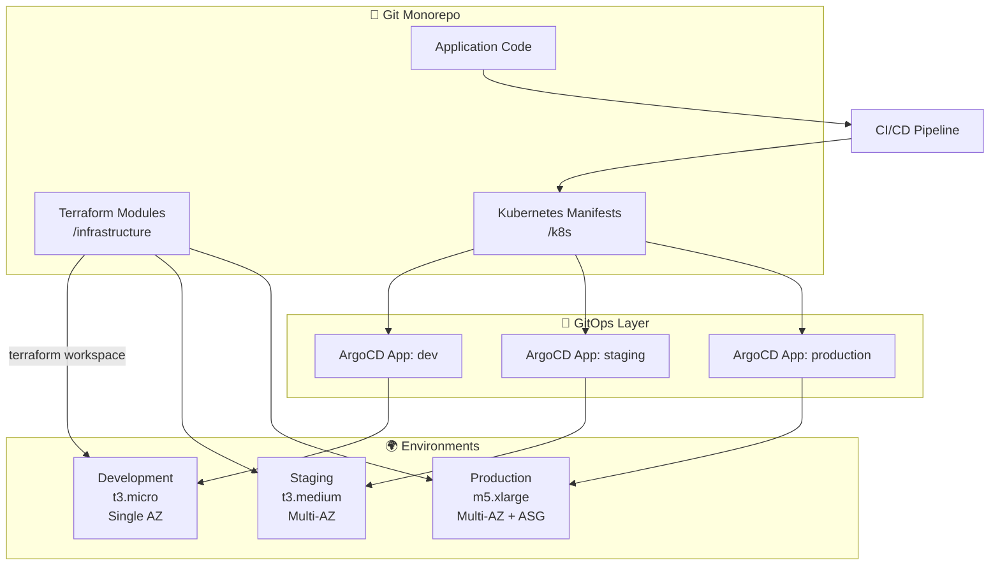
```mermaid
flowchart TD
    subgraph GIT_REPO["📁 Git Monorepo"]
        APP["Application Code"]
        IaC_CODE["Terraform Modules\n/infrastructure"]
        K8S["Kubernetes Manifests\n/k8s"]
    end

    subgraph ENVS["🌍 Environments"]
        DEV["Development\nt3.micro\nSingle AZ"]
        STAGING["Staging\nt3.medium\nMulti-AZ"]
        PROD["Production\nm5.xlarge\nMulti-AZ + ASG"]
    end

    subgraph GITOPS_LAYER["🔄 GitOps Layer"]
        ARGOCD_DEV["ArgoCD App: dev"]
        ARGOCD_STAGE["ArgoCD App: staging"]
        ARGOCD_PROD["ArgoCD App: production"]
    end

    APP --> CI_CD["CI/CD Pipeline"]
    CI_CD --> K8S
    K8S --> ARGOCD_DEV --> DEV
    K8S --> ARGOCD_STAGE --> STAGING
    K8S --> ARGOCD_PROD --> PROD

    IaC_CODE -->|"terraform workspace"| DEV
    IaC_CODE --> STAGING
    IaC_CODE --> PROD
```

### Use Case 2: Enterprise — Disaster Recovery in Minutes

```
Scenario: Production database region fails (us-east-1)

Without IaC/GitOps:
  - Recreate VPC, subnets, security groups manually: 2 hours
  - Launch RDS with correct parameter groups: 1 hour  
  - Restore from snapshot, update connection strings: 1 hour
  - Total: 4+ hours downtime

With Terraform + GitOps:
  - Change AWS region variable: 5 minutes
  - terraform apply: 12 minutes
  - ArgoCD syncs app manifests: 2 minutes
  - Total: ~20 minutes downtime
```

### Use Case 3: Security & Compliance

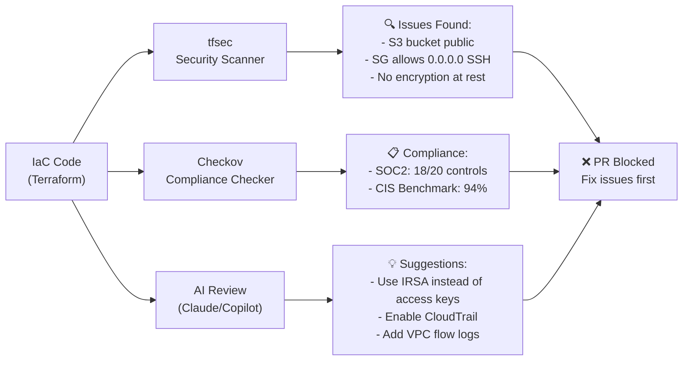
```mermaid
flowchart LR
    CODE["IaC Code\n(Terraform)"]
    
    CODE --> TFSEC["tfsec\nSecurity Scanner"]
    CODE --> CHECKOV["Checkov\nCompliance Checker"]
    CODE --> AI_REVIEW["AI Review\n(Claude/Copilot)"]
    
    TFSEC --> ISSUES["🔍 Issues Found:\n- S3 bucket public\n- SG allows 0.0.0.0 SSH\n- No encryption at rest"]
    CHECKOV --> COMPLIANCE["📋 Compliance:\n- SOC2: 18/20 controls\n- CIS Benchmark: 94%"]
    AI_REVIEW --> SUGGESTIONS["💡 Suggestions:\n- Use IRSA instead of access keys\n- Enable CloudTrail\n- Add VPC flow logs"]
    
    ISSUES --> PR["❌ PR Blocked\nFix issues first"]
    COMPLIANCE --> PR
    SUGGESTIONS --> PR
```

---

## 🧭 Choosing Your Stage {#choosing-your-stage}

### Where Are You Now?

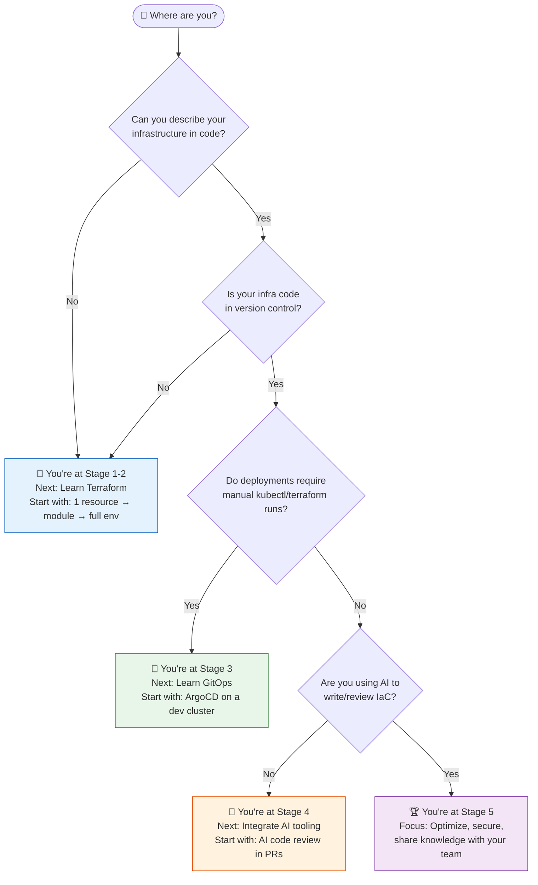
```mermaid
flowchart TD
    START(["🚀 Where are you?"])
    
    Q1{"Can you describe your\ninfrastructure in code?"}
    Q2{"Is your infra code\nin version control?"}
    Q3{"Do deployments require\nmanual kubectl/terraform runs?"}
    Q4{"Are you using AI to\nwrite/review IaC?"}
    
    S1["📍 You're at Stage 1-2\nNext: Learn Terraform\nStart with: 1 resource → module → full env"]
    S2["📍 You're at Stage 3\nNext: Learn GitOps\nStart with: ArgoCD on a dev cluster"]
    S3["📍 You're at Stage 4\nNext: Integrate AI tooling\nStart with: AI code review in PRs"]
    S4["🏆 You're at Stage 5\nFocus: Optimize, secure,\nshare knowledge with your team"]
    
    START --> Q1
    Q1 -->|No| S1
    Q1 -->|Yes| Q2
    Q2 -->|No| S1
    Q2 -->|Yes| Q3
    Q3 -->|Yes| S2
    Q3 -->|No| Q4
    Q4 -->|No| S3
    Q4 -->|Yes| S4

    style S1 fill:#E3F2FD,stroke:#1565C0
    style S2 fill:#E8F5E9,stroke:#2E7D32
    style S3 fill:#FFF3E0,stroke:#E65100
    style S4 fill:#F3E5F5,stroke:#6A1B9A
```

### The Learning Roadmap

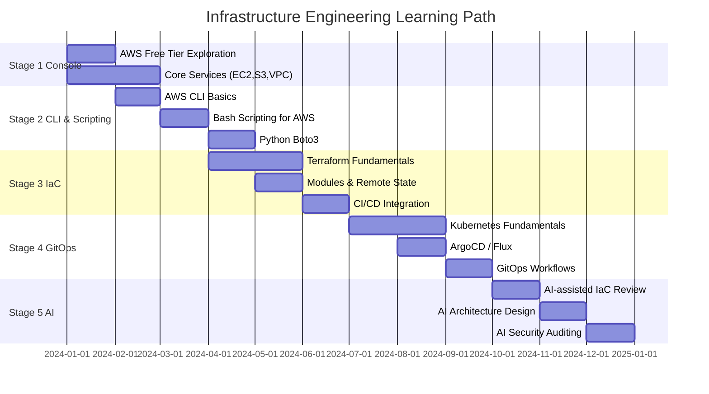
```mermaid
gantt
    title Infrastructure Engineering Learning Path
    dateFormat  YYYY-MM
    section Stage 1 Console
    AWS Free Tier Exploration     :2024-01, 1M
    Core Services (EC2,S3,VPC)    :2024-01, 2M
    
    section Stage 2 CLI & Scripting
    AWS CLI Basics                :2024-02, 1M
    Bash Scripting for AWS        :2024-03, 1M
    Python Boto3                  :2024-04, 1M
    
    section Stage 3 IaC
    Terraform Fundamentals        :2024-04, 2M
    Modules & Remote State        :2024-05, 1M
    CI/CD Integration             :2024-06, 1M
    
    section Stage 4 GitOps
    Kubernetes Fundamentals       :2024-07, 2M
    ArgoCD / Flux                 :2024-08, 1M
    GitOps Workflows              :2024-09, 1M
    
    section Stage 5 AI
    AI-assisted IaC Review        :2024-10, 1M
    AI Architecture Design        :2024-11, 1M
    AI Security Auditing          :2024-12, 1M
```

---

## 🎯 Key Takeaways

```mermaid
mindmap
  root((10 Years of\nInfra Evolution))
    Stage 1 Console
      Best for learning
      Not scalable
      No reproducibility
    Stage 2 Scripts
      Automatable
      Idempotency hard
      State management missing
    Stage 3 IaC
      Declarative wins
      State tracking
      Terraform is industry standard
    Stage 4 GitOps
      Git as truth
      Drift prevention
      Audit trail built in
    Stage 5 AI
      Amplifies expertise
      Not a shortcut
      Requires strong foundation
    Core Principle
      Each stage solves previous problems
      Cannot safely skip stages
      Build expertise progressively
```

---

## 📚 Recommended Next Steps

| Stage to Reach | Resources |
|---------------|-----------|
| **Stage 2** | AWS CLI Documentation, Boto3 Docs, "Shell Scripting: Expert Recipes for Linux, Bash" |
| **Stage 3** | HashiCorp Terraform tutorials, "Terraform: Up & Running" by Yevgeniy Brikman |
| **Stage 4** | ArgoCD documentation, "GitOps and Kubernetes" by Billy Yuen et al. |
| **Stage 5** | GitHub Copilot, Anthropic Claude, Gruntwork AI tooling |

---

> 💡 **Final Word:** The engineers who thrive in the AI era are not those who skipped to Stage 5 — they're the ones who built such deep expertise in Stages 1–4 that AI makes them **10× faster** rather than giving them a false sense of competence.

