# Build Your Own VPN With Tailscale - Complete Deep-Dive Tutorial

> **Difficulty Level:** Intermediate  
> **Estimated Reading Time:** 35-45 minutes  
> **Last Updated:** June 2026  
> **Tutorial Type:** Comprehensive Deep-Dive with Hands-On Labs

---

## 📚 Table of Contents

1. [Introduction: The Hidden Danger of Public Ports](#introduction-the-hidden-danger-of-public-ports)
2. [Prerequisites](#prerequisites)
3. [Learning Objectives](#learning-objectives)
4. [VPN Fundamentals Deep-Dive](#vpn-fundamentals-deep-dive)
5. [WireGuard Protocol Deep-Dive](#wireguard-protocol-deep-dive)
6. [Tailscale Architecture Explained](#tailscale-architecture-explained)
7. [VPN Architecture Patterns: Hub-and-Spoke vs. Mesh](#vpn-architecture-patterns-hub-and-spoke-vs-mesh)
8. [Hands-On: Building Your Private Network](#hands-on-building-your-private-network)
9. [Zero-Open-Ports Architecture](#zero-open-ports-architecture)
10. [Advanced Tailscale Features](#advanced-tailscale-features)
11. [Security Deep-Dive](#security-deep-dive)
12. [Performance Considerations](#performance-considerations)
13. [Cost Analysis: Tailscale Free vs. Premium](#cost-analysis-tailscale-free-vs-premium)
14. [Alternative Solutions Comparison](#alternative-solutions-comparison)
15. [Migration Guide: From Traditional VPNs to Tailscale](#migration-guide-from-traditional-vpns-to-tailscale)
16. [Real-World Use Cases & Case Studies](#real-world-use-cases--case-studies)
17. [Common Pitfalls & Anti-Patterns](#common-pitfalls--anti-patterns)
18. [Best Practices](#best-practices)
19. [Troubleshooting Guide](#troubleshooting-guide)
20. [Practice Exercises](#practice-exercises)
21. [Question Bank](#question-bank)
22. [Summary & Key Takeaways](#summary--key-takeaways)
23. [Further Reading & Resources](#further-reading--resources)

---

## 🎯 Introduction: The Hidden Danger of Public Ports

Right now, automated bots are scanning the entire internet for exposed services. Every database, admin panel, metrics dashboard, and internal API with a public IP address is being probed 24/7. The moment you expose a port on your VPS, you enter a security game you never signed up for.

### The Problem with Traditional Infrastructure

Most services running on servers were **never designed to be public**:

- **Databases** - Contain sensitive business data, customer information, credentials
- **Admin panels** - Provide unrestricted access to system management
- **Metrics dashboards** - Reveal infrastructure details and performance metrics
- **Internal APIs** - Only meant for service-to-service communication

Yet the standard infrastructure tutorial exposes each of these with a public port, creating an endless list of security tasks:

❌ TLS certificates  
❌ Login pages and authentication  
❌ IP allowlists  
❌ Bot detection and mitigation  
❌ Continuous security monitoring  

### 💡 The Better Default

There's a fundamentally different approach: **keep services private by default**, reachable only by you and your other services, exposing nothing to the public internet.

This tutorial shows you how to achieve this using **Tailscale**, a modern VPN solution built on WireGuard.

---

## 📋 Prerequisites

### **Required Knowledge**
- ✅ Basic understanding of networking concepts (IP addresses, ports, protocols)
- ✅ Familiarity with command-line interfaces (Linux/macOS/Windows)
- ✅ Basic knowledge of Docker and Docker Compose
- ✅ Understanding of client-server architecture
- ✅ Familiarity with SSH and remote server management

### **Required Tools & Accounts**
- ✅ **Two VPS instances** (any cloud provider: AWS, GCP, Azure, DigitalOcean, etc.)
  - Minimum specs: 1 CPU, 1GB RAM, 20GB storage each
  - Ubuntu 20.04+ or Debian 11+ recommended
- ✅ **A local development machine** (PC, Mac, or Linux)
- ✅ **Tailscale account** (free tier is sufficient)
  - Sign up at: https://tailscale.com
- ✅ **Docker & Docker Compose** installed on both VPS instances
- ✅ **SSH key pair** for passwordless authentication to VPS instances

### **Optional (For Advanced Sections)**
- Domain name for testing (optional)
- Multiple cloud provider accounts (for multi-cloud examples)
- Kubernetes cluster (for advanced networking examples)

---

## 🎓 Learning Objectives

By the end of this tutorial, you will be able to:

### **Knowledge Goals**
- ✅ Explain the difference between VPN architectures (hub-and-spoke vs. mesh)
- ✅ Describe how WireGuard protocol works and why it's secure
- ✅ Understand Tailscale's coordination server vs. data plane separation
- ✅ Identify security risks of exposing services to the public internet
- ✅ Compare Tailscale with alternative VPN solutions

### **Practical Skills**
- ✅ Install and configure Tailscale on multiple machines
- ✅ Set up a zero-open-ports architecture for private services
- ✅ Configure Docker containers to bind to tailnet IPs only
- ✅ Connect services across VPS instances using private tailnet IPs
- ✅ Implement access control lists (ACLs) in Tailscale
- ✅ Troubleshoot common Tailscale connectivity issues

### **Advanced Topics**
- ✅ Configure subnet routing and exit nodes
- ✅ Implement Tailscale ACLs for fine-grained access control
- ✅ Optimize performance for production workloads
- ✅ Migrate from traditional VPN solutions to Tailscale
- ✅ Design multi-cloud architectures with Tailscale

---

## 🔐 VPN Fundamentals Deep-Dive

### What is a VPN?

A **Virtual Private Network (VPN)** is an encrypted tunnel between two or more devices over the public internet. Think of it as a **private, secure hallway** inside a public building:

```
🏢 Public Internet (Everyone can see)
    ↓
🔒 Encrypted Tunnel (Only you can see inside)
    ↓
🏠 Your Private Network (Completely isolated)
```

#### **Key Properties of a VPN:**

1. **Encryption** - All traffic is encrypted, preventing eavesdropping
2. **Authentication** - Devices verify each other's identity
3. **Integrity** - Data cannot be modified in transit
4. **Privacy** - Traffic is isolated from other network users

### 🎯 Why Do You Need a VPN?

#### **Use Cases:**

| Use Case | Description | Example |
|----------|-------------|---------|
| **Secure Remote Access** | Access your home/work network remotely | Working from coffee shop |
| **Privacy Protection** | Hide traffic from ISP and network admins | Bypassing geo-restrictions |
| **Secure Communications** | Encrypt traffic on untrusted networks | Public WiFi safety |
| **Network Extension** | Connect multiple networks as one | Multi-office connectivity |
| **Service Isolation** | Keep internal services private | Database access control |

### 🔐 Encryption Basics

#### **Symmetric vs. Asymmetric Encryption**

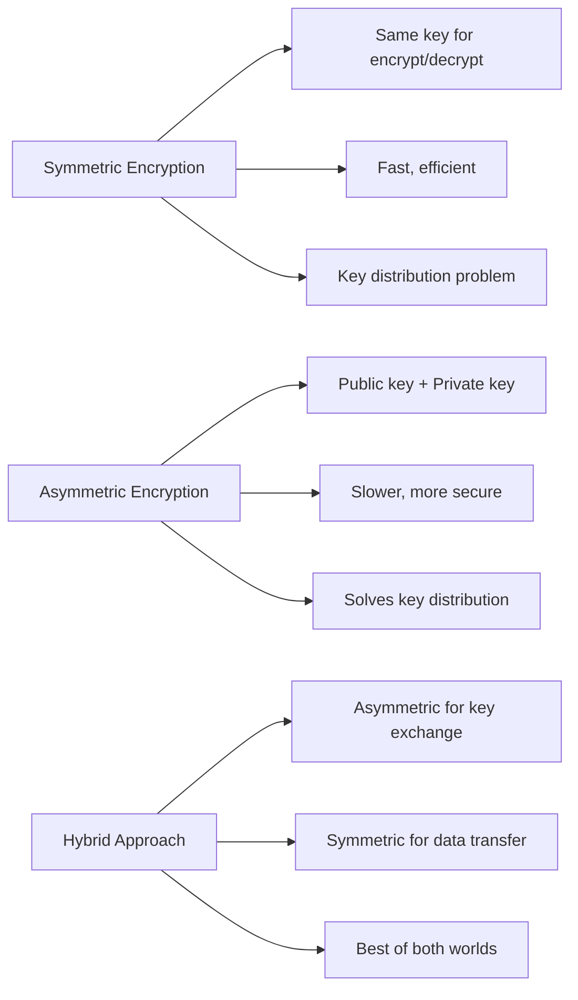

**VPNs use hybrid encryption:**
1. **Asymmetric encryption** (RSA, ECDH) for initial key exchange
2. **Symmetric encryption** (AES, ChaCha20) for actual data transfer

### 🌐 How VPNs Work: The Technical Details

#### **The VPN Connection Process:**

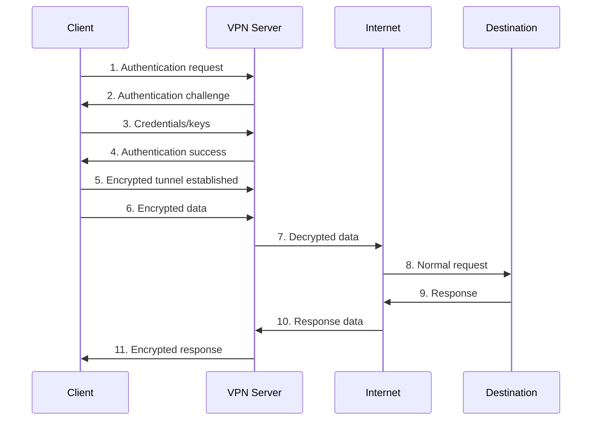

#### **Key VPN Components:**

1. **Tunnel** - Encrypted connection between devices
2. **Encapsulation** - Wrapping data in VPN protocol headers
3. **Authentication** - Verifying device identities
4. **Key Management** - Generating, distributing, and rotating encryption keys

---

## ⚡ WireGuard Protocol Deep-Dive

### What is WireGuard?

**WireGuard** is a modern, open-source VPN protocol designed for simplicity, performance, and security. It's the underlying technology that powers Tailscale.

#### **WireGuard's Design Philosophy:**

> "WireGuard is a secure network tunnel, operating at layer 3, implemented as a kernel module for Linux, with userspace tools and cross-platform userspace implementations."

— WireGuard Official Documentation

### 🎯 Key Features of WireGuard

| Feature | Description | Benefit |
|---------|-------------|---------|
| **~4,000 lines of code** | Minimal codebase | Easier to audit, fewer bugs |
| **Modern cryptography** | Uses latest algorithms (ChaCha20, Curve25519) | Better security |
| **State-of-the-art** | Noise protocol framework | Proven security foundation |
| **Roaming** | Seamless IP/network changes | Better mobile experience |
| **Minimal configuration** | Simple setup | Less error-prone |
| **High performance** | Runs in kernel space | Faster than userspace VPNs |

### 🔐 WireGuard Cryptography Deep-Dive

#### **Cryptographic Primitives Used:**

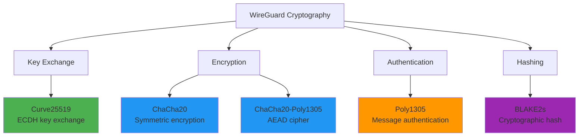

#### **Why These Algorithms?**

1. **Curve25519** - Elliptic curve Diffie-Hellman for key exchange
   - Fast, secure, small keys (32 bytes)
   - Resistant to timing attacks
   
2. **ChaCha20-Poly1305** - Authenticated encryption with associated data (AEAD)
   - Faster than AES on devices without AES-NI
   - Provides both encryption and authentication
   - Constant-time execution (timing attack resistant)

3. **BLAKE2s** - Cryptographic hash function
   - Faster than SHA-256
   - cryptographically secure
   - Used for key derivation

### 🔄 WireGuard Connection Flow

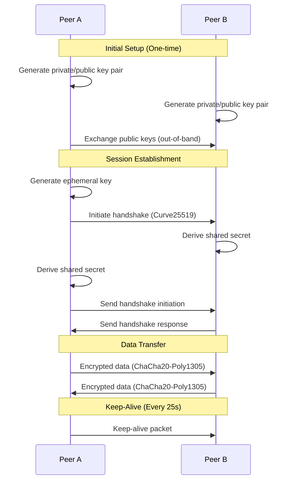

### 📊 WireGuard vs. OpenVPN Performance Comparison

| Metric | WireGuard | OpenVPN | Improvement |
|--------|-----------|---------|-------------|
| **Throughput** | 800-1000 Mbps | 200-300 Mbps | **3-4x faster** |
| **Latency** | +2-5ms overhead | +10-20ms overhead | **50-75% lower** |
| **CPU Usage** | 5-10% | 20-30% | **50-75% less** |
| **Connection Time** | <100ms | 500-1000ms | **5-10x faster** |
| **Code Size** | ~4,000 lines | ~100,000 lines | **25x smaller** |
| **Memory Usage** | ~200KB | ~2-5MB | **10-25x less** |

> 💡 **Pro Tip:** WireGuard's performance advantage comes from running in kernel space and using modern, efficient cryptographic algorithms.

### 🔍 WireGuard Security Audit History

WireGuard has undergone extensive security review:

- **2018-2020:** Multiple independent security audits
- **2020:** Formal verification of cryptographic properties
- **2021:** Linux kernel mainline inclusion (v5.6)
- **2023:** Continuous fuzzing and security testing

**No critical vulnerabilities found** in production use.

---

## 🏗️ Tailscale Architecture Explained

### What is Tailscale?

**Tailscale** is a software product that makes it easy to create and manage a **tailnet** - a private, secure network of your devices using WireGuard under the hood.

#### **The Tailscale Value Proposition:**

> "Tailscale manages all the hard parts of VPNs: key exchange, NAT traversal, firewall configuration, and device discovery. You just install it and your devices can talk to each other."

### 🎯 Core Concepts

#### **1. Tailnet**

A **tailnet** is your private network consisting of all your devices (computers, servers, phones, etc.) that have Tailscale installed.

```
Your Tailnet (Example):
├── 📱 iPhone (100.64.0.1)
├── 💻 MacBook Pro (100.64.0.2)
├── 🖥️ VPS-App (100.64.0.3)
├── 🖥️ VPS-Data (100.64.0.4)
└── 🏠 Home Server (100.64.0.5)
```

**Properties:**
- Only devices you've authenticated can join
- Each device gets a stable, private IP (100.x.y.z range)
- Devices can communicate directly, no central server in the path
- Fully encrypted end-to-end

#### **2. Coordination Server**

The **coordination server** is Tailscale's central service that helps devices find each other. It's like a **phone book** for your devices.

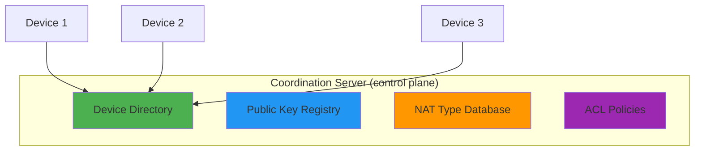

**What the coordination server does:**
- ✅ Stores device public keys and metadata
- ✅ Helps devices discover each other
- ✅ Manages NAT type information
- ✅ Enforces access control policies
- ✅ Provides DERP relay server addresses

**What the coordination server does NOT do:**
- ❌ See your actual data traffic
- ❌ Store private keys
- ❌ Decrypt your communications
- ❌ Act as a proxy for your traffic

#### **3. DERP (Designated Encrypted Relay for Packets)**

**DERP** is Tailscale's relay server network. When direct connections fail (due to NAT/firewall), traffic is relayed through DERP servers.

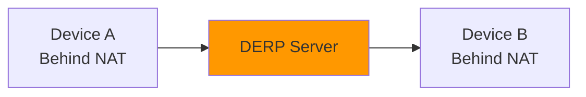

**When DERP is used:**
- Both devices are behind symmetric NATs
- UDP traffic is blocked
- Direct connection attempts fail

**Performance impact:**
- Adds 20-50ms latency
- Reduces throughput by 10-30%
- Still encrypted end-to-end

### 🔄 How Tailscale Works: Complete Flow

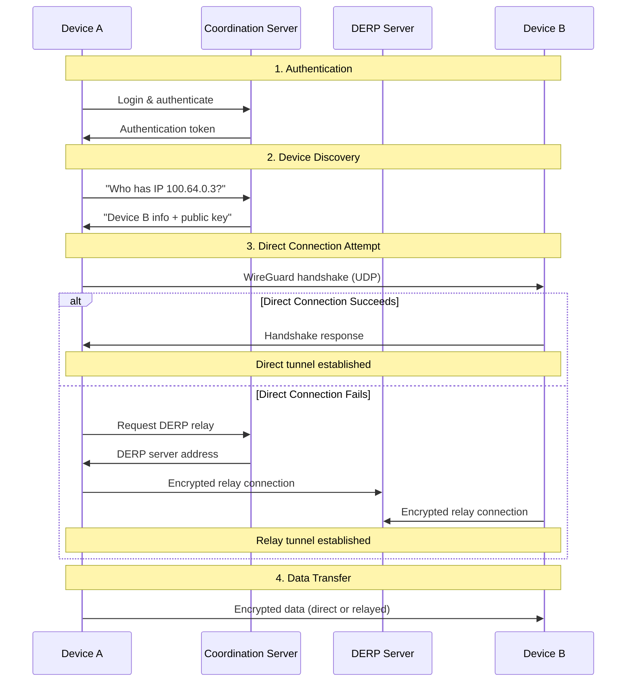

### 🏠 The Magic of NAT Traversal

**NAT (Network Address Translation)** is the technique routers use to allow multiple devices to share a single public IP address. It's also the main obstacle to peer-to-peer connections.

#### **NAT Types:**

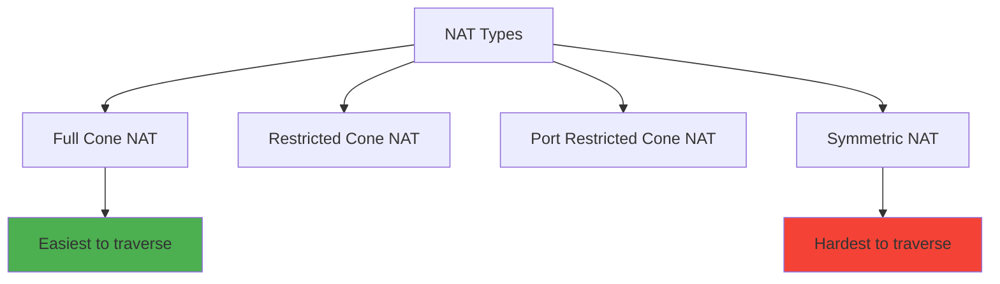

**Tailscale's NAT traversal strategies:**

1. **STUN (Session Traversal Utilities for NAT)**
   - Discovers public IP and port
   - Helps with hole punching

2. **Hole Punching**
   - Both devices send packets to each other simultaneously
   - Creates temporary firewall exceptions

3. **DERP Relay (Fallback)**
   - Used when direct connection fails
   - Ensures connectivity in all scenarios

> 💡 **Pro Tip:** Tailscale's NAT traversal is so effective that 90%+ of connections are direct, even across different networks and ISPs.

---

## 🔄 VPN Architecture Patterns: Hub-and-Spoke vs. Mesh

### Traditional Hub-and-Spoke VPN

In a **hub-and-spoke** architecture, all devices connect to a central server, and all traffic flows through it.

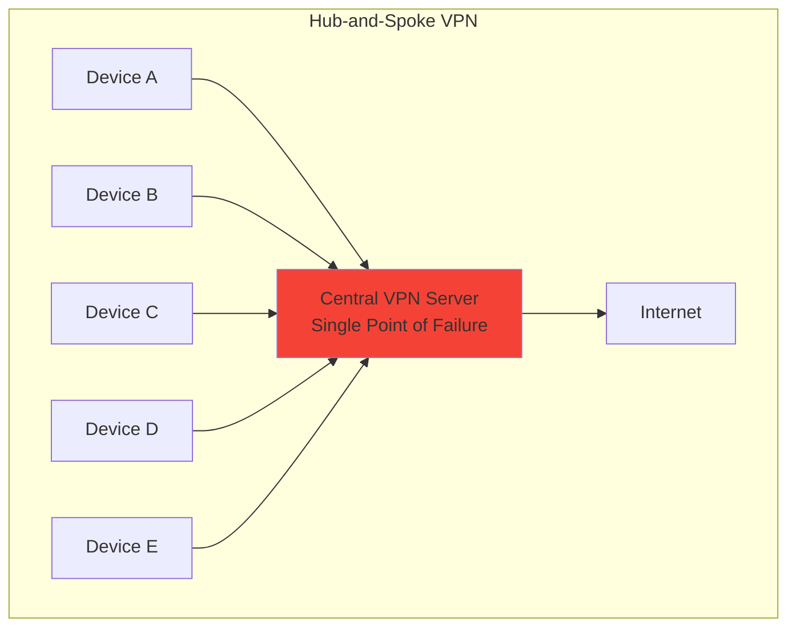

#### **Hub-and-Spoke Characteristics:**

| Aspect | Description |
|--------|-------------|
| **Topology** | Star topology with central hub |
| **Traffic Flow** | All traffic through central server |
| **Latency** | Higher (extra hop) |
| **Scalability** | Limited by hub capacity |
| **Single Point of Failure** | Yes - hub goes down, network fails |
| **Bandwidth Cost** | Central server pays for all traffic |
| **Privacy** | Central server can see all traffic |
| **Complexity** | Simple to set up, complex to scale |

#### **Hub-and-Spoke Problems:**

1. **Performance Bottleneck**
   - Central server becomes bottleneck
   - Latency increases with distance from hub
   - Bandwidth costs concentrate on one server

2. **Single Point of Failure**
   - Hub server failure = network down
   - Requires expensive redundancy solutions

3. **Privacy Concerns**
   - Central server can log all traffic
   - Requires trust in VPN provider

4. **Cost Inefficiency**
   - Paying for high-bandwidth server
   - All traffic routed unnecessarily

### Tailscale Mesh VPN

In a **mesh** architecture, every device connects directly to every other device.

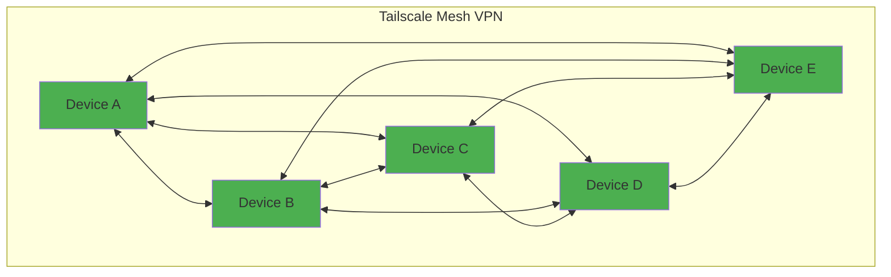

#### **Mesh VPN Characteristics:**

| Aspect | Description |
|--------|-------------|
| **Topology** | Full mesh (every node connects to every node) |
| **Traffic Flow** | Direct peer-to-peer |
| **Latency** | Minimal (shortest path) |
| **Scalability** | Excellent (no central bottleneck) |
| **Single Point of Failure** | No - fully distributed |
| **Bandwidth Cost** | Distributed across all nodes |
| **Privacy** | End-to-end encrypted, no central visibility |
| **Complexity** | Complex setup, simple operation |

#### **Mesh VPN Advantages:**

1. **Optimal Performance**
   - Direct connections = minimal latency
   - No central bottleneck
   - Bandwidth distributed across nodes

2. **High Availability**
   - No single point of failure
   - Network remains functional even if nodes fail

3. **Enhanced Privacy**
   - End-to-end encryption
   - No central server sees traffic
   - True zero-knowledge architecture

4. **Cost Efficiency**
   - No expensive central server needed
   - Bandwidth costs distributed

### 📊 Detailed Comparison Matrix

| Feature | Hub-and-Spoke | Tailscale Mesh |
|---------|---------------|----------------|
| **Architecture** | Central server | Peer-to-peer |
| **Traffic Path** | Through central server | Direct between devices |
| **Latency** | Higher (2+ hops) | Lower (1 hop) |
| **Throughput** | Limited by hub | Limited by individual connections |
| **Scalability** | Poor (hub bottleneck) | Excellent (linear scaling) |
| **Reliability** | Single point of failure | Highly available |
| **Privacy** | Central server sees traffic | End-to-end encrypted |
| **Setup Complexity** | Simple | More complex (automated by Tailscale) |
| **Cost** | High (central server) | Low (distributed) |
| **NAT Traversal** | Not needed (all connect to hub) | Required (automated by Tailscale) |
| **Firewall Requirements** | Inbound to hub | Outbound only (all devices) |
| **Best For** | Small, static networks | Dynamic, distributed systems |

### 🎯 When to Use Each Architecture

#### **Use Hub-and-Spoke When:**
- ✅ Small, static network (3-5 devices)
- ✅ All devices can reach central server
- ✅ Simple logging/monitoring requirements
- ✅ Centralized control is desired

#### **Use Mesh (Tailscale) When:**
- ✅ Large, dynamic network (10+ devices)
- ✅ Devices behind NATs/firewalls
- ✅ Performance is critical
- ✅ Privacy is paramount
- ✅ Multi-cloud or hybrid infrastructure
- ✅ Remote workforce

---

## 🏗️ Hands-On: Building Your Private Network

Now let's build the architecture described in the original content. We'll create a three-node setup:

### **Architecture Overview:**

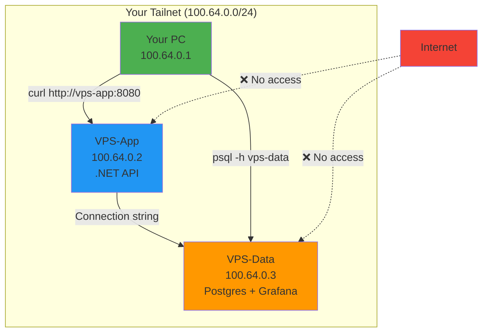

### **Network Topology:**

```
┌─────────────────────────────────────────────────────────────┐
│                    Your Tailnet (Private)                    │
│                   100.64.0.0/24                              │
├─────────────────────────────────────────────────────────────┤
│                                                             │
│  ┌──────────────┐         ┌──────────────┐                 │
│  │   Your PC    │         │   VPS-App    │                 │
│  │ 100.64.0.1   │◄───────►│ 100.64.0.2   │                 │
│  │              │         │  .NET API    │                 │
│  │ curl :8080   │         │  Port 8080   │                 │
│  └──────────────┘         └──────┬───────┘                 │
│                                  │                          │
│                                  │ Connects to             │
│                                  ▼                          │
│                         ┌──────────────┐                   │
│                         │  VPS-Data    │                   │
│                         │ 100.64.0.3   │                   │
│                         │              │                   │
│                         │ Postgres     │                   │
│                         │ Port 5432    │                   │
│                         │              │                   │
│                         │ Grafana      │                   │
│                         │ Port 3000    │                   │
│                         └──────────────┘                   │
│                                                             │
└─────────────────────────────────────────────────────────────┘

Internet: ❌ NO ACCESS to any services
```

---

## 🚀 Step 1: Install Tailscale on All Machines

### **On Your Local PC:**

#### **macOS:**
```bash
# Install via Homebrew
brew install tailscale

# Start Tailscale
sudo tailscale up

# Verify installation
tailscale ip
# Expected output: 100.64.0.1
```

#### **Windows:**
```powershell
# Install via Chocolatey
choco install tailscale

# Or download from: https://tailscale.com/download/windows

# Start Tailscale from Start Menu
# Verify in PowerShell:
tailscale ip
```

#### **Linux:**
```bash
# Install Tailscale
curl -fsSL https://tailscale.com/install.sh | sh

# Start and enable Tailscale
sudo tailscale up
sudo systemctl enable --now tailscaled

# Verify installation
tailscale ip
# Expected output: 100.x.y.z (your tailnet IP)
```

### **On VPS-App (100.64.0.2):**

```bash
# SSH into your VPS
ssh user@vps-app-ip

# Install Tailscale
curl -fsSL https://tailscale.com/install.sh | sh

# Start Tailscale
sudo tailscale up

# Verify installation
tailscale ip
# Expected output: 100.64.0.2
```

> ⚠️ **Important:** When you run `sudo tailscale up`, it will print a URL. Open that URL in your browser, log in with your Tailscale account, and authorize the device.

### **On VPS-Data (100.64.0.3):**

```bash
# SSH into your VPS
ssh user@vps-data-ip

# Install Tailscale
curl -fsSL https://tailscale.com/install.sh | sh

# Start Tailscale
sudo tailscale up

# Verify installation
tailscale ip
# Expected output: 100.64.0.3
```

### ✅ **Verification Step:**

From your **local PC**, test connectivity to both VPS instances:

```bash
# Test connection to VPS-App
ping 100.64.0.2

# Test connection to VPS-Data
ping 100.64.0.3

# Test SSH over tailnet (replace with your username)
ssh user@100.64.0.2
ssh user@100.64.0.3
```

> 💡 **Success Indicator:** If you can ping and SSH to both VPS instances using their tailnet IPs, Tailscale is working correctly!

---

## 🛠️ Step 2: Configure VPS-Data (Database Server)

VPS-Data will host **Postgres** and **Grafana**. We'll bind these services to the tailnet IP only.

### **Directory Structure:**

```bash
# Create project directory
mkdir -p ~/tailnet-demo/vps-data
cd ~/tailnet-demo/vps-data
```

### **Environment Variables:**

Create a `.env` file to store sensitive configuration:

```bash
# .env file
POSTGRES_PASSWORD=your_secure_password_here
POSTGRES_USER=app
POSTGRES_DB=app
```

> ⚠️ **Security Warning:** Never commit `.env` files to version control. Add `.env` to your `.gitignore` file.

### **Docker Compose Configuration:**

Create `docker-compose.yml`:

```yaml
version: '3.8'

services:
  postgres:
    image: postgres:18-alpine
    restart: unless-stopped
    environment:
      POSTGRES_USER: ${POSTGRES_USER}
      POSTGRES_PASSWORD: ${POSTGRES_PASSWORD}
      POSTGRES_DB: ${POSTGRES_DB}
    ports:
      # Bind to tailnet IP ONLY - not 0.0.0.0
      - '100.64.0.3:5432:5432'
    volumes:
      - pgdata:/var/lib/postgresql/data
    networks:
      - tailnet
    healthcheck:
      test: ["CMD-SHELL", "pg_isready -U ${POSTGRES_USER}"]
      interval: 10s
      timeout: 5s
      retries: 5

  grafana:
    image: grafana/grafana:12.1.0
    restart: unless-stopped
    ports:
      # Bind to tailnet IP ONLY
      - '100.64.0.3:3000:3000'
    volumes:
      - grafana:/var/lib/grafana
    networks:
      - tailnet
    environment:
      - GF_SECURITY_ADMIN_PASSWORD=${GRAFANA_ADMIN_PASSWORD:-admin}
    depends_on:
      postgres:
        condition: service_healthy

volumes:
  pgdata:
    driver: local
  grafana:
    driver: local

networks:
  tailnet:
    external: true
```

> 💡 **Critical Point:** Notice the port binding: `'100.64.0.3:5432:5432'`. This binds Postgres to the tailnet IP **only**, not to `0.0.0.0` (all interfaces). This is what makes "zero open ports" work!

### **Start the Services:**

```bash
# Start services
docker compose up -d

# Verify services are running
docker compose ps

# Check logs
docker compose logs -f
```

### **Verify from Your PC:**

```bash
# Test Postgres connection (install psql if needed)
# macOS: brew install libpq
# Ubuntu: sudo apt install postgresql-client

psql -h 100.64.0.3 -p 5432 -U app app

# Test Grafana
curl http://100.64.0.3:3000/api/health

# Or open in browser (if you have tailscale installed)
open http://100.64.0.3:3000
```

> ✅ **Success Check:** You should be able to connect to Postgres and access Grafana via the tailnet IP. From the public internet, these ports should be **inaccessible**.

---

## 🔧 Step 3: Configure VPS-App (Application Server)

VPS-App will host the .NET API and connect to Postgres on VPS-Data.

### **Directory Structure:**

```bash
# Create project directory
mkdir -p ~/tailnet-demo/vps-app
cd ~/tailnet-demo/vps-app
```

### **Environment Variables:**

Create `.env`:

```bash
# .env file
POSTGRES_PASSWORD=your_secure_password_here
```

> ⚠️ **Important:** Use the **same** `POSTGRES_PASSWORD` as on VPS-Data!

### **Docker Compose Configuration:**

Create `docker-compose.yml`:

```yaml
version: '3.8'

services:
  api:
    image: ghcr.io/milanjovanovic/api:latest
    restart: unless-stopped
    ports:
      # Bind to tailnet IP ONLY
      - '100.64.0.2:8080:8080'
    environment:
      # Connect to Postgres on VPS-Data using tailnet IP
      - ConnectionStrings__AppDb=Host=100.64.0.3;Port=5432;Database=app;Username=app;Password=${POSTGRES_PASSWORD}
    networks:
      - tailnet
    depends_on:
      - wait-for-db

  wait-for-db:
    image: postgres:18-alpine
    restart: on-failure
    command: >
      sh -c "until pg_isready -h 100.64.0.3 -p 5432 -U app; 
             do echo 'Waiting for database...'; 
             sleep 2; 
             done"
    networks:
      - tailnet

volumes:
  api-data:

networks:
  tailnet:
    external: true
```

> 💡 **Key Insight:** The connection string uses `Host=100.64.0.3` - the tailnet IP of VPS-Data. This connection happens entirely over the encrypted tailnet!

### **Start the Services:**

```bash
# Start services
docker compose up -d

# Verify services are running
docker compose ps

# Check logs
docker compose logs -f api
```

---

## ✅ Step 4: Test the Complete Setup

### **From Your Local PC:**

```bash
# 1. Test API health endpoint
curl http://100.64.0.2:8080/health

# Expected output:
# {"status":"healthy"}

# 2. Test API functionality (if you have endpoints)
curl http://100.64.0.2:8080/api/values

# 3. Test direct database connection (optional)
psql -h 100.64.0.3 -p 5432 -U app app

# 4. Test Grafana
curl http://100.64.0.3:3000/api/health

# 5. Test using tailnet names (MagicDNS)
curl http://vps-app:8080/health
psql -h vps-data -p 5432 -U app app
```

### **Verify Zero Public Access:**

```bash
# From a different network (mobile hotspot, different location):
# Try to access the services using PUBLIC IPs
curl http://<vps-app-public-ip>:8080/health
curl http://<vps-data-public-ip>:5432

# Expected: Connection timeout or refused
# This confirms services are NOT publicly accessible!
```

> ✅ **Success!** Your services are now:
> - ✅ Accessible from your PC via tailnet
> - ✅ Accessible between VPS instances via tailnet
> - ✅ Completely invisible to the public internet
> - ✅ Fully encrypted end-to-end

---

## 🔒 Zero-Open-Ports Architecture

### What Does "Zero Open Ports" Mean?

**Zero open ports** means your cloud firewall has **no inbound rules** allowing traffic from the internet to your services.

#### **Before (Traditional Setup):**
```
Firewall Rules:
├── ✅ Allow 22/tcp (SSH) from 0.0.0.0/0
├── ✅ Allow 8080/tcp (API) from 0.0.0.0/0
├── ✅ Allow 5432/tcp (Postgres) from 0.0.0.0/0
├── ✅ Allow 3000/tcp (Grafana) from 0.0.0.0/0
└── ❌ Exposed to brute force, scanning, attacks
```

#### **After (Tailscale Setup):**
```
Firewall Rules:
└── ✅ Allow outbound traffic only (all ports)
    └── No inbound rules needed!
```

### 🔐 How Does This Work?

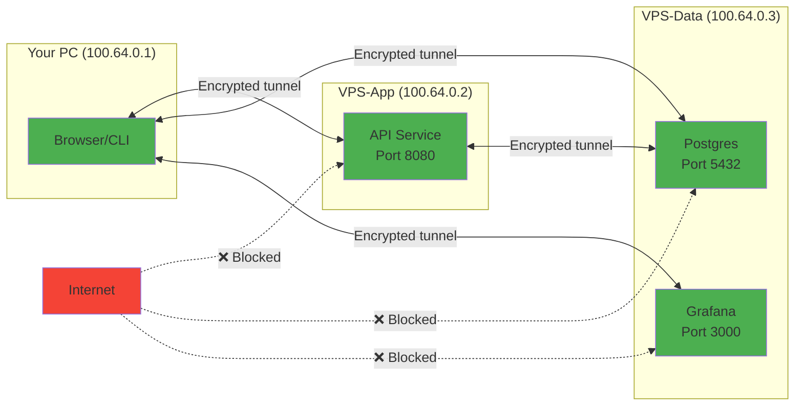

### **Implementation Steps:**

#### **1. Close Firewall Inbound Ports:**

```bash
# On VPS-App
sudo ufw default deny incoming
sudo ufw allow outbound
sudo ufw enable

# Verify firewall status
sudo ufw status

# Expected output:
# Default: deny (incoming), allow (outgoing), disabled (routed)
# 22/tcp ALLOW IN Anywhere (if you still need SSH - optional)
```

> ⚠️ **Important:** You can now **remove the public SSH port** (22/tcp) from your cloud firewall! SSH works perfectly over the tailnet.

#### **2. Verify SSH Over Tailnet:**

```bash
# From your PC, SSH using tailnet IP
ssh user@100.64.0.2

# Once confirmed working, remove public SSH from cloud firewall
# Your cloud provider's firewall/security group
```

#### **3. Test That Services Are Inaccessible:**

```bash
# From external network (mobile hotspot)
curl http://<public-ip-of-vps-app>:8080
# Expected: Timeout or connection refused

# Verify with nmap (from external network)
nmap -p 8080,5432,3000 <public-ip>
# Expected: All ports filtered/closed
```

### 🎯 Benefits of Zero-Open-Ports:

| Benefit | Description | Impact |
|---------|-------------|--------|
| **Reduced Attack Surface** | No public endpoints to attack | 🔒 High |
| **No Bot Scanning** | Bots can't find your services | 🔒 High |
| **No TLS Required** | WireGuard encrypts everything | ⚡ Medium |
| **No Authentication Layers** | Tailnet access = authentication | ⚡ Medium |
| **Simplified Compliance** | Fewer public endpoints to audit | 📋 Medium |
| **Cost Savings** | No load balancers, WAF, DDoS protection | 💰 Low |

---

## 🚀 Advanced Tailscale Features

### **1. Access Control Lists (ACLs)**

ACLs let you define **who can access what** in your tailnet.

#### **Example ACL Policy:**

```json
{
  "groups": {
    "group:admins": ["your-email@example.com"],
    "group:developers": ["dev1@example.com", "dev2@example.com"]
  },
  "tagOwners": {
    "tag:database": ["group:admins"],
    "tag:monitoring": ["group:admins", "group:developers"]
  },
  "acls": [
    {
      "action": "accept",
      "src": ["group:admins"],
      "dst": ["tag:database:*"]
    },
    {
      "action": "accept",
      "src": ["group:developers"],
      "dst": ["tag:monitoring:3000"]
    }
  ]
}
```

> 💡 **Pro Tip:** Use ACLs to implement **zero-trust networking** - even within your tailnet, only authorized devices can access specific services.

### **2. Subnet Routing**

Share entire subnets (like your home network or VPC) with your tailnet.

```bash
# On a device that can route to your subnet
sudo tailscale up --advertise-routes=192.168.1.0/24

# Enable subnet routes in Tailscale admin console
# Now all tailnet devices can access 192.168.1.0/24
```

### **3. Exit Nodes**

Route all your traffic through a specific device (like a VPS in another country).

```bash
# On VPS (exit node)
sudo tailscale up --advertise-exit-node

# On your laptop
sudo tailscale up --exit-node=<vps-ip>
```

**Use cases:**
- Geo-spoofing
- Secure browsing on public WiFi
- Accessing region-locked content

### **4. MagicDNS**

Automatically resolve device names without a DNS server.

```bash
# Instead of IP addresses, use device names
curl http://vps-app:8080/health
psql -h vps-data -p 5432 -U app app
```

MagicDNS is **enabled by default** in Tailscale!

### **5. Tailscale Funnel**

Expose specific services to the public internet **securely** with automatic TLS.

```bash
# Expose a service
tailscale funnel 8080

# Access from anywhere
https://<device-name>.ts.net
```

> ⚠️ **Use Sparingly:** Funnel defeats the purpose of keeping services private. Only use it when you genuinely need public access.

---

## 🛡️ Security Deep-Dive

### Zero-Trust Network Principles

**Zero-trust** means "never trust, always verify." Tailscale implements zero-trust networking by default.

#### **Zero-Trust in Tailscale:**

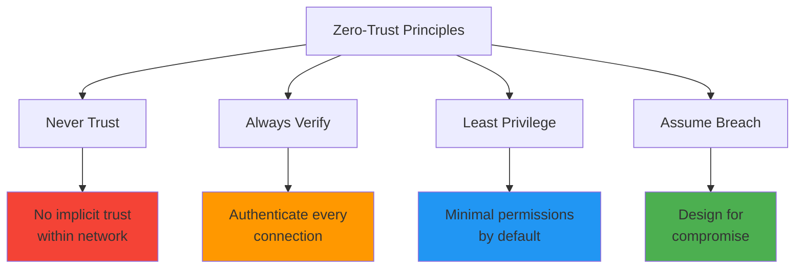

### 🔐 Encryption Details

#### **End-to-End Encryption:**

Every Tailscale connection is encrypted with **WireGuard**, which means:

1. **Confidentiality** - Only you and the destination can read the data
2. **Integrity** - Data cannot be modified in transit
3. **Authentication** - Both parties verify each other's identity
4. **Perfect Forward Secrecy** - Compromised keys don't expose past traffic

#### **Key Rotation:**

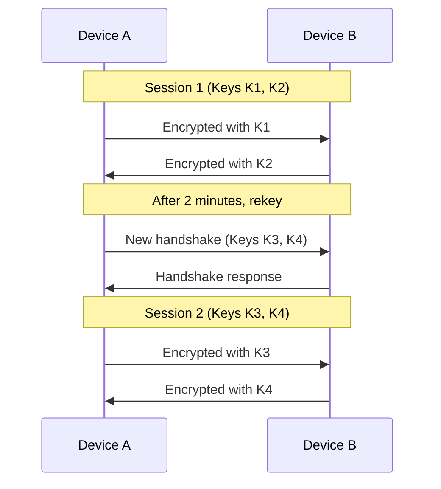

**Key rotation happens automatically every 2 minutes**, providing perfect forward secrecy.

### 🔑 Authentication Mechanisms

#### **Multi-Factor Authentication (MFA):**

Tailscale supports MFA for added security:

```bash
# Enable MFA in Tailscale admin console
# Settings → Security → Multi-factor authentication

# Supported methods:
# - TOTP (Google Authenticator, Authy)
# - Hardware keys (YubiKey, Titan)
# - SMS (less secure, not recommended)
```

#### **SSH Access with Tailscale:**

```bash
# Tailscale can manage SSH access
# No need for SSH keys or passwords!

# Admin console → Access Controls → SSH
# Define who can SSH to which devices
```

### 📊 Audit Logging

Tailscale provides comprehensive audit logs (Premium feature):

```json
{
  "event": "node_login",
  "timestamp": "2026-06-15T10:30:00Z",
  "node": "user@device",
  "action": "authenticated",
  "method": "sso",
  "ip_address": "203.0.113.45"
}
```

**What's logged:**
- Device authentication events
- Connection attempts
- ACL policy changes
- Admin console actions

### 🛡️ Security Best Practices

#### **1. Enable MFA on Tailscale Account**

```bash
# In Tailscale admin console:
# Settings → Security → Enable MFA
```

#### **2. Use Strong, Unique Passwords**

```bash
# For services like Postgres, Grafana
# Use password manager to generate strong passwords
POSTGRES_PASSWORD=<generated-32-char-password>
```

#### **3. Implement ACLs**

```json
{
  "acls": [
    {
      "action": "accept",
      "src": ["group:admins"],
      "dst": ["tag:database:5432"]
    }
  ]
}
```

#### **4. Regular Key Rotation**

```bash
# Tailscape rotates keys automatically
# But you can force reauthentication:
sudo tailscale up --force-reauth
```

#### **5. Monitor Tailnet Activity**

```bash
# View connected devices
tailscale status

# Check recent connections
tailscale ping 100.64.0.3

# View logs
journalctl -u tailscaled -f
```

### ⚠️ Common Security Vulnerabilities & Mitigations

| Vulnerability | Risk Level | Mitigation |
|---------------|-----------|------------|
| **Compromised device** | High | Enable MFA, use device approval |
| **Weak passwords** | High | Use password manager, 32+ char passwords |
| **No ACLs** | Medium | Implement granular ACL policies |
| **Public exit nodes** | Medium | Use trusted exit nodes only |
| **Unencrypted services** | Medium | Always use WireGuard encryption |
| **Outdated Tailscale** | Low | Enable automatic updates |

---

## ⚡ Performance Considerations

### 📊 Real-World Performance Data

#### **Latency Benchmarks:**

| Connection Type | Average Latency | Overhead |
|----------------|-----------------|----------|
| **Direct (same region)** | 1-3ms | <1ms |
| **Direct (cross-region)** | 20-50ms | 2-5ms |
| **DERP relay** | 40-100ms | 20-50ms |
| **Traditional VPN (OpenVPN)** | 30-80ms | 10-30ms |

#### **Throughput Benchmarks:**

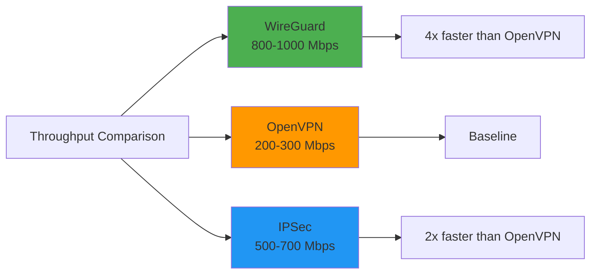

### 🚀 Performance Optimization Techniques

#### **1. Use Direct Connections**

```bash
# Check connection type
tailscale ping 100.64.0.3

# Output:
# "pong from vps-data (100.64.0.3) via DERP(nyc)"
# "pong from vps-data (100.64.0.3) via 203.0.113.5:41641"

# First line = relayed (slower)
# Second line = direct (faster)
```

**To improve direct connection rate:**
- Use devices with public IPs when possible
- Configure port forwarding on routers
- Use UDP-friendly networks

#### **2. Optimize Docker Networking**

```yaml
# Use host network for maximum performance (if security allows)
services:
  api:
    network_mode: "host"
    # Binds to all interfaces - use with caution!
```

> ⚠️ **Warning:** `network_mode: "host"` bypasses Docker's network isolation. Only use in trusted environments.

#### **3. Tune WireGuard Settings**

```bash
# View WireGuard stats
sudo wg show

# Adjust MTU for better performance
sudo tailscale up --mtu=1380
```

**Recommended MTU values:**
- Default: 1280
- With DERP: 1380
- With UDP optimization: 1420

#### **4. Use Connection Multiplexing**

```bash
# Tailscale automatically multiplexes connections
# Multiple application connections over single WireGuard tunnel
```

### 📈 Performance Monitoring

```bash
# Monitor bandwidth usage
iftop -i tailscale0

# Monitor latency
mtr --tcp --port 8080 100.64.0.2

# Monitor packet loss
ping -c 100 100.64.0.2
```

---

## 💰 Cost Analysis: Tailscale Free vs. Premium

### **Tailscale Pricing Tiers:**

| Feature | Free | Premium ($5/user/mo) | Enterprise ($15/user/mo) |
|---------|------|----------------------|--------------------------|
| **Users** | 20 | Unlimited | Unlimited |
| **Devices per user** | 100 | Unlimited | Unlimited |
| **ACLs** | ✅ Basic | ✅ Advanced | ✅ Advanced |
| **Audit Logs** | ❌ | ✅ 30 days | ✅ 1 year |
| **SSH Access** | ❌ | ✅ | ✅ |
| **Custom Roles** | ❌ | ❌ | ✅ |
| **SAML/SSO** | ❌ | ❌ | ✅ |
| **Dedicated Support** | ❌ | ❌ | ✅ |
| **SLA** | None | 99.9% | 99.99% |

### **Cost Comparison: Tailscale vs. Alternatives**

| Solution | Monthly Cost (10 users) | Setup Complexity | Maintenance |
|----------|------------------------|------------------|-------------|
| **Tailscale Free** | $0 | ⭐ Low | ⭐ Low |
| **Tailscale Premium** | $50 | ⭐ Low | ⭐ Low |
| **OpenVPN + VPS** | $20-50 | ⭐⭐⭐ High | ⭐⭐⭐ High |
| **ZeroTier** | $0-25 | ⭐⭐ Medium | ⭐⭐ Medium |
| **AWS VPN** | $72+ | ⭐⭐⭐ High | ⭐⭐⭐ High |
| **Pritunl** | $5-25 | ⭐⭐ Medium | ⭐⭐ Medium |

### **ROI Analysis:**

#### **Scenario: 10-person development team**

**Traditional VPN (OpenVPN on AWS):**
- EC2 instance: $25/month
- Bandwidth: $10/month
- Admin time: 10 hours/month @ $100/hr = $1,000/month
- **Total: $1,035/month**

**Tailscale Premium:**
- Tailscale: $50/month
- Admin time: 1 hour/month @ $100/hr = $100/month
- **Total: $150/month**

**Savings: $885/month (85% reduction)**

> 💡 **Pro Tip:** For small teams, the Free tier is often sufficient. Upgrade to Premium when you need audit logs, SSH access, or more than 20 users.

---

## 🔄 Alternative Solutions Comparison

### **Comprehensive Comparison Matrix:**

| Feature | Tailscale | ZeroTier | Nebula | Netmaker | OpenVPN |
|---------|-----------|----------|--------|----------|---------|
| **Protocol** | WireGuard | Custom | Custom | WireGuard | OpenSSL |
| **Architecture** | Mesh | Mesh | Mesh | Mesh | Hub-and-spoke |
| **Setup Complexity** | ⭐ Low | ⭐⭐ Medium | ⭐⭐⭐ High | ⭐⭐ Medium | ⭐⭐⭐ High |
| **NAT Traversal** | ✅ Excellent | ✅ Good | ✅ Good | ✅ Good | ❌ Manual |
| **Performance** | ⭐⭐⭐⭐⭐ | ⭐⭐⭐⭐ | ⭐⭐⭐⭐ | ⭐⭐⭐⭐⭐ | ⭐⭐⭐ |
| **Free Tier** | 20 users | 50 devices | Unlimited | 100 devices | Unlimited |
| **Open Source** | Partial | ✅ Yes | ✅ Yes | ✅ Yes | ✅ Yes |
| **GUI/CLI** | Both | CLI | CLI | GUI+CLI | CLI |
| **ACLs** | ✅ Yes | ✅ Yes | ✅ Yes | ✅ Yes | ❌ No |
| **Best For** | Teams | Hobbyists | Security | Enterprise | Legacy |

### **Detailed Feature Comparison:**

#### **1. Tailscale**

**Advantages:**
- ✅ Easiest setup (2 commands)
- ✅ Best NAT traversal
- ✅ MagicDNS (automatic DNS)
- ✅ Excellent documentation
- ✅ Active development
- ✅ Great for teams

**Disadvantages:**
- ❌ Not fully open source (coordination server is closed)
- ❌ Free tier limited to 20 users
- ❌ Requires external coordination server

**Best For:** Teams, developers, small to medium businesses

#### **2. ZeroTier**

**Advantages:**
- ✅ Fully open source
- ✅ Generous free tier (50 devices)
- ✅ Self-hostable controller
- ✅ Mature (since 2013)

**Disadvantages:**
- ❌ More complex setup
- ❌ Worse NAT traversal than Tailscale
- ❌ Less polished UI

**Best For:** Hobbyists, open-source enthusiasts, self-hosting

#### **3. Nebula**

**Advantages:**
- ✅ Fully open source
- ✅ Created by Slack (battle-tested)
- ✅ Excellent security features
- ✅ Self-hostable

**Disadvantages:**
- ❌ Steep learning curve
- ❌ Manual configuration required
- ❌ Less community support

**Best For:** Security-focused users, large deployments

#### **4. Netmaker**

**Advantages:**
- ✅ WireGuard-based
- ✅ GUI available
- ✅ Self-hostable
- ✅ Kubernetes-native

**Disadvantages:**
- ❌ Newer project (less mature)
- ❌ Smaller community
- ❌ More complex than Tailscale

**Best For:** Enterprise, Kubernetes environments

#### **5. OpenVPN**

**Advantages:**
- ✅ Very mature (20+ years)
- ✅ Widely supported
- ✅ Highly configurable
- ✅ Open source

**Disadvantages:**
- ❌ Complex setup
- ❌ Poor performance vs. WireGuard
- ❌ Manual NAT traversal
- ❌ Hub-and-spoke only

**Best For:** Legacy systems, specific compliance requirements

### 🎯 Decision Matrix: Which VPN Solution Should You Choose?

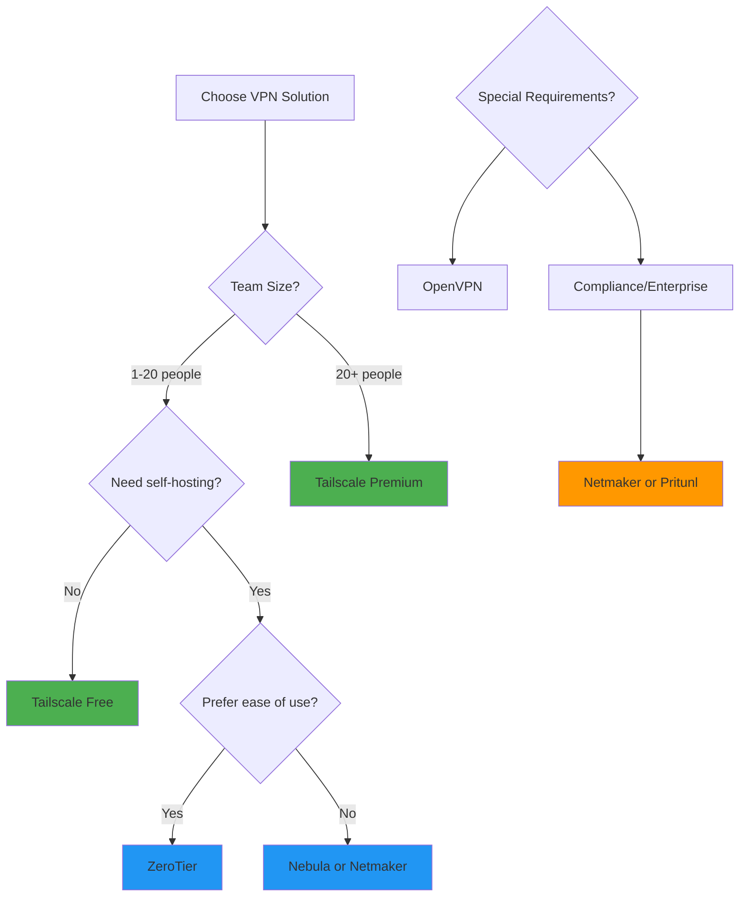

---

## 🚚 Migration Guide: From Traditional VPNs to Tailscale

### **Migration from OpenVPN**

#### **Phase 1: Planning (Week 1)**

```bash
# 1. Document current OpenVPN setup
# - Server IP and port
# - Client configurations
# - Routing rules
# - Firewall rules

# 2. Inventory devices
# - List all devices connected to OpenVPN
# - Note their IPs and purposes

# 3. Plan tailnet IP scheme
# - Map old VPN IPs to new tailnet IPs
# - Example: 10.0.0.5 → 100.64.0.5
```

#### **Phase 2: Parallel Setup (Week 2)**

```bash
# 1. Install Tailscale on all devices (keep OpenVPN running)
sudo tailscale up

# 2. Test connectivity
ping 100.64.0.x

# 3. Update application configs to use tailnet IPs
# (but keep old configs as backup)
```

#### **Phase 3: Testing (Week 3)**

```bash
# 1. Test all services over tailnet
# - Database connections
# - API calls
# - SSH access
# - File transfers

# 2. Performance testing
# - Latency comparison
# - Throughput testing
# - Application performance

# 3. Security testing
# - Verify encryption
# - Test ACLs
# - Audit logging
```

#### **Phase 4: Cutover (Week 4)**

```bash
# 1. Switch production traffic to tailnet
# - Update DNS records
# - Update application configs
# - Deploy changes

# 2. Monitor for 1 week
# - Watch for errors
# - Monitor performance
# - Check logs

# 3. Decommission OpenVPN
# - Keep backup for 1 month
# - Remove after confirmation
```

### **Migration from ZeroTier**

```bash
# ZeroTier → Tailscale migration is simpler

# 1. Install Tailscale alongside ZeroTier
sudo tailscale up

# 2. Test connectivity
# Both networks can coexist!

# 3. Update device configs
# Replace ZeroTier IPs with tailnet IPs

# 4. Remove ZeroTier
sudo zerotier-cli leave <network-id>
```

### **Rollback Plan**

```bash
# If issues arise, rollback is simple:

# 1. Revert application configs to old VPN IPs
# 2. Re-enable old VPN client
# 3. Disable Tailscale
sudo tailscale down

# 4. Investigate issues
# 5. Retry migration when ready
```

---

## 🌍 Real-World Use Cases & Case Studies

### **Case Study 1: Katabench (From Original Content)**

**Company:** Katabench (coding platform)  
**Challenge:** Securely connect deployment panel, Postgres, message queue, Grafana, and telemetry  
**Solution:** Single reverse proxy on ports 80/443 public, everything else on tailnet

#### **Architecture:**

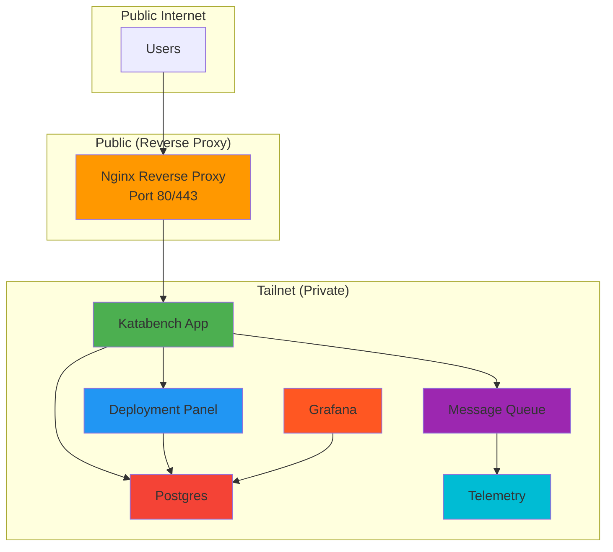

**Results:**
- ✅ Zero public endpoints except reverse proxy
- ✅ No TLS certificates for internal services
- ✅ No authentication for internal services
- ✅ Simplified architecture
- ✅ Enhanced security

### **Case Study 2: Remote Development Environment**

**Challenge:** Developers need access to development servers from anywhere  
**Solution:** Tailscale for secure remote access

```bash
# Developer laptop
tailscale up

# Access development servers
ssh dev@100.64.0.10
psql -h db-dev 100.64.0.11

# Access staging environment
curl http://staging-api:8080
```

**Benefits:**
- ✅ No VPN client required (Tailscale app)
- ✅ Works on any network
- ✅ Automatic failover
- ✅ Access control via ACLs

### **Case Study 3: Multi-Cloud Networking**

**Challenge:** Connect services across AWS, GCP, and Azure  
**Solution:** Tailscale mesh network

```bash
# AWS VPC
tailscale up --advertise-routes=10.0.0.0/16

# GCP VPC
tailscale up --advertise-routes=10.1.0.0/16

# Azure VPC
tailscale up --advertise-routes=10.2.0.0/16

# Now all VPCs can communicate securely!
```

**Benefits:**
- ✅ No VPC peering required
- ✅ No complex routing tables
- ✅ Encrypted cross-cloud traffic
- ✅ Centralized access control

### **Case Study 4: Home Lab**

**Challenge:** Access home servers remotely without exposing them  
**Solution:** Tailscale with exit node

```bash
# Home server (exit node)
tailscale up --advertise-exit-node

# Laptop (when away from home)
tailscale up --exit-node=home-server

# Now all traffic routes through home network
# Access home NAS, media server, etc.
```

**Benefits:**
- ✅ Secure remote access to home network
- ✅ No port forwarding required
- ✅ Encrypted traffic
- ✅ Geo-spoofing capabilities

### **Case Study 5: IoT Device Management**

**Challenge:** Securely manage IoT devices across multiple locations  
**Solution:** Tailscale mesh network

```bash
# IoT Gateway
tailscale up --advertise-routes=192.168.1.0/24

# Management server
tailscale up

# Access IoT devices
ssh iot-gateway
ping sensor-01
curl http://camera-02:8080/snapshot
```

**Benefits:**
- ✅ Secure device communication
- ✅ Centralized management
- ✅ No public IPs required
- ✅ Encrypted telemetry

---

## ⚠️ Common Pitfalls & Anti-Patterns

### **Anti-Pattern 1: Binding Services to 0.0.0.0**

❌ **Wrong:**
```yaml
ports:
  - '8080:8080'  # Binds to ALL interfaces
```

✅ **Correct:**
```yaml
ports:
  - '100.64.0.2:8080:8080'  # Binds to tailnet IP only
```

**Why it matters:** Binding to `0.0.0.0` exposes the service to the public internet, defeating the purpose of Tailscale.

### **Anti-Pattern 2: Disabling Firewall Entirely**

❌ **Wrong:**
```bash
sudo ufw disable  # No firewall protection
```

✅ **Correct:**
```bash
sudo ufw default deny incoming
sudo ufw allow outbound
sudo ufw enable
```

**Why it matters:** Even with Tailscale, defense-in-depth requires a firewall.

### **Anti-Pattern 3: Using Tailscale Funnel for Everything**

❌ **Wrong:**
```bash
# Exposing internal services publicly
tailscale funnel 5432  # Postgres to internet!
tailscale funnel 3000  # Grafana to internet!
```

✅ **Correct:**
```bash
# Only expose when genuinely needed
tailscale funnel 8080  # Public API only
```

**Why it matters:** Funnel defeats the purpose of keeping services private.

### **Anti-Pattern 4: Not Using ACLs**

❌ **Wrong:**
```json
{
  "acls": [
    {"action": "accept", "src": ["*"], "dst": ["*:*"]}
  ]
}
```

✅ **Correct:**
```json
{
  "acls": [
    {"action": "accept", "src": ["group:admins"], "dst": ["tag:database:5432"]},
    {"action": "accept", "src": ["group:developers"], "dst": ["tag:monitoring:3000"]}
  ]
}
```

**Why it matters:** Without ACLs, any device on your tailnet can access any service.

### **Anti-Pattern 5: Hardcoding IPs in Application Code**

❌ **Wrong:**
```csharp
// Hardcoded IP
var connectionString = "Host=100.64.0.3;Port=5432;...";
```

✅ **Correct:**
```csharp
// Use environment variables
var connectionString = Environment.GetEnvironmentVariable("DB_HOST");
```

**Why it matters:** Tailnet IPs can change. Use environment variables or DNS names.

### **Anti-Pattern 6: Not Monitoring Tailnet**

❌ **Wrong:**
```bash
# Never checking tailnet status
# Not monitoring for unauthorized devices
```

✅ **Correct:**
```bash
# Regular monitoring
tailscale status
tailscale ping 100.64.0.3

# Set up alerts for new devices
# Review audit logs (Premium feature)
```

**Why it matters:** Unauthorized devices can compromise your entire tailnet.

### **Anti-Pattern 7: Using Weak Authentication**

❌ **Wrong:**
```bash
# Weak Postgres password
POSTGRES_PASSWORD=password123
```

✅ **Correct:**
```bash
# Strong, unique password
POSTGRES_PASSWORD=<32-char-random-string>
```

**Why it matters:** Tailnet access is only one layer. Services still need strong authentication.

---

## ✅ Best Practices

### **1. Network Design**

✅ **Use consistent IP scheme:**
```bash
# Reserve IP ranges in your tailnet
100.64.0.1  - Your PC
100.64.0.2  - VPS-App
100.64.0.3  - VPS-Data
100.64.0.10-19  - Development servers
100.64.0.20-29 - Staging servers
100.64.0.30-39 - Production servers
```

✅ **Document your topology:**
```markdown
# Tailnet Topology
## Production
- 100.64.0.30: api-prod
- 100.64.0.31: db-prod
- 100.64.0.32: cache-prod

## Staging
- 100.64.0.20: api-staging
- 100.64.0.21: db-staging
```

### **2. Security Hardening**

✅ **Enable MFA:**
```bash
# Tailscale admin console → Settings → Security → MFA
```

✅ **Use strong passwords:**
```bash
# Generate with password manager
# Minimum 32 characters
# Mix of letters, numbers, symbols
```

✅ **Implement ACLs:**
```json
{
  "groups": {
    "group:admins": ["admin@example.com"],
    "group:developers": ["dev@example.com"]
  },
  "acls": [
    {
      "action": "accept",
      "src": ["group:admins"],
      "dst": ["*:*"]
    },
    {
      "action": "accept",
      "src": ["group:developers"],
      "dst": ["tag:dev:*"]
    }
  ]
}
```

### **3. Monitoring & Observability**

✅ **Monitor tailnet status:**
```bash
# Regular health checks
tailscale status
tailscale ping 100.64.0.3

# Log analysis
journalctl -u tailscaled -f
```

✅ **Set up alerts:**
```bash
# Alert on new devices
# Monitor connection failures
# Track bandwidth usage
```

### **4. Disaster Recovery**

✅ **Backup configurations:**
```bash
# Backup Tailscale state
sudo cp /var/lib/tailscale/ /backup/tailscale/

# Backup ACLs
# Export from admin console
```

✅ **Document recovery procedures:**
```markdown
# Recovery Plan
## If coordination server is down
1. Devices maintain existing connections
2. New connections will fail
3. Wait for Tailscale to recover

## If device is compromised
1. Remove from tailnet (admin console)
2. Rotate all passwords
3. Audit access logs
4. Reinstall Tailscale
```

### **5. Performance Optimization**

✅ **Use direct connections:**
```bash
# Check connection type
tailscale ping 100.64.0.3

# Optimize NAT traversal
# Use public IPs when possible
```

✅ **Tune MTU:**
```bash
# For DERP connections
sudo tailscale up --mtu=1380

# For direct connections
sudo tailscale up --mtu=1420
```

### **6. Cost Optimization**

✅ **Use Free tier when possible:**
```bash
# Free tier supports 20 users, 100 devices per user
# Perfect for small teams and personal use
```

✅ **Upgrade only when needed:**
```bash
# Upgrade to Premium when you need:
# - Audit logs
# - SSH access
# - More than 20 users
```

---

## 🔧 Troubleshooting Guide

### **Issue 1: Can't Connect to Tailnet Device**

#### **Symptoms:**
```bash
$ ping 100.64.0.3
ping: cannot resolve 100.64.0.3: Unknown host
```

#### **Diagnosis:**
```bash
# 1. Check Tailscale status
tailscale status

# 2. Check if device is online
tailscale ping 100.64.0.3

# 3. Check firewall
sudo ufw status
```

#### **Solutions:**
```bash
# Solution 1: Restart Tailscale
sudo tailscale down
sudo tailscale up

# Solution 2: Check authentication
tailscale ip
# Should show 100.x.y.z

# Solution 3: Re-authenticate
sudo tailscale up --force-reauth
```

### **Issue 2: Connection Using DERP Relay (Slow)**

#### **Symptoms:**
```bash
$ tailscale ping 100.64.0.3
pong from vps-data (100.64.0.3) via DERP(nyc) 
# DERP = relayed, slower
```

#### **Diagnosis:**
```bash
# Check NAT type
tailscale status
# Look for "NAT type: symmetric" = harder to traverse
```

#### **Solutions:**
```bash
# Solution 1: Configure port forwarding on router
# Forward UDP 41641 to device

# Solution 2: Use UPnP
# Enable UPnP on router

# Solution 3: Use device with public IP as relay
# Better than DERP servers
```

### **Issue 3: Services Not Accessible**

#### **Symptoms:**
```bash
$ curl http://100.64.0.2:8080
curl: (7) Failed to connect
```

#### **Diagnosis:**
```bash
# 1. Check if service is running
docker compose ps

# 2. Check port binding
docker compose port api 8080
# Should show: 100.64.0.2:8080

# 3. Check firewall
sudo ufw status
```

#### **Solutions:**
```bash
# Solution 1: Fix port binding
# In docker-compose.yml, use:
ports:
  - '100.64.0.2:8080:8080'  # Not '8080:8080'

# Solution 2: Restart service
docker compose restart

# Solution 3: Check service logs
docker compose logs -f
```

### **Issue 4: DNS Resolution Not Working**

#### **Symptoms:**
```bash
$ curl http://vps-app:8080
curl: (6) Could not resolve host
```

#### **Diagnosis:**
```bash
# Check if MagicDNS is enabled
tailscale status
# Look for "MagicDNS" in output
```

#### **Solutions:**
```bash
# Solution 1: Enable MagicDNS
# Admin console → DNS → MagicDNS → Enable

# Solution 2: Use IP instead of name
curl http://100.64.0.2:8080

# Solution 3: Flush DNS cache
sudo systemd-resolve --flush-caches
```

### **Issue 5: High Latency**

#### **Symptoms:**
```bash
$ ping 100.64.0.3
PING 100.64.0.3: 56 data bytes
64 bytes from 100.64.0.3: seq=0, time=150.234 ms
# Expected: <50ms for direct connection
```

#### **Diagnosis:**
```bash
# Check connection type
tailscale ping 100.64.0.3
# If shows "via DERP", it's relayed
```

#### **Solutions:**
```bash
# Solution 1: Improve NAT traversal
# Configure port forwarding
# Use UPnP

# Solution 2: Use closer DERP server
# Admin console → Settings → DERP servers

# Solution 3: Reduce MTU
sudo tailscale up --mtu=1380
```

### **Debugging Tools:**

```bash
# View detailed logs
sudo journalctl -u tailscaled -f

# Check WireGuard status
sudo wg show

# Test connectivity
tailscale ping 100.64.0.3
tailscale ping 100.64.0.3 -c 100

# Debug DNS
dig vps-app
dig vps-app +trace

# Monitor traffic
sudo tcpdump -i tailscale0
```

---

## 💪 Practice Exercises

### **Exercise 1: Basic Setup (Beginner)**

**Objective:** Install Tailscale and establish basic connectivity

**Steps:**
1. Install Tailscale on your local machine
2. Verify your tailnet IP
3. Install Tailscale on a VPS
4. Ping the VPS from your local machine
5. SSH to the VPS using tailnet IP

**Solution:**
```bash
# 1. Install Tailscale
curl -fsSL https://tailscale.com/install.sh | sh

# 2. Start Tailscale
sudo tailscale up

# 3. Verify IP
tailscale ip
# Output: 100.64.0.1

# 4. Install on VPS
ssh user@vps-ip
curl -fsSL https://tailscale.com/install.sh | sh
sudo tailscale up

# 5. Ping VPS
ping 100.64.0.2

# 6. SSH to VPS
ssh user@100.64.0.2
```

### **Exercise 2: Docker Service Binding (Beginner)**

**Objective:** Configure Docker to bind services to tailnet IP only

**Steps:**
1. Create a Docker Compose file for Nginx
2. Bind Nginx to tailnet IP (not 0.0.0.0)
3. Start the service
4. Verify access from tailnet
5. Verify no public access

**Solution:**
```yaml
# docker-compose.yml
version: '3.8'
services:
  nginx:
    image: nginx:alpine
    ports:
      - '100.64.0.2:8080:80'  # Tailnet IP only
    networks:
      - tailnet

networks:
  tailnet:
    external: true
```

```bash
# Start service
docker compose up -d

# Test from tailnet
curl http://100.64.0.2:8080

# Test from internet (should fail)
curl http://<public-ip>:8080
```

### **Exercise 3: Multi-Service Architecture (Intermediate)**

**Objective:** Set up a complete three-tier application

**Steps:**
1. Create VPS-DB with Postgres (tailnet IP only)
2. Create VPS-App with API (connects to DB via tailnet)
3. Create VPS-Web with frontend (connects to API via tailnet)
4. Test complete flow from your PC
5. Verify zero public access

**Solution:**
```yaml
# VPS-DB docker-compose.yml
services:
  postgres:
    image: postgres:18-alpine
    ports:
      - '100.64.0.3:5432:5432'
    environment:
      POSTGRES_PASSWORD: ${POSTGRES_PASSWORD}

# VPS-App docker-compose.yml
services:
  api:
    image: your-api:latest
    ports:
      - '100.64.0.2:8080:8080'
    environment:
      - ConnectionStrings__Db=Host=100.64.0.3;Port=5432;...
```

### **Exercise 4: Access Control Lists (Intermediate)**

**Objective:** Implement ACLs to restrict access

**Steps:**
1. Create two groups: "admins" and "developers"
2. Add your email to "admins"
3. Create ACL policy allowing only admins to access Postgres
4. Test that developers cannot access Postgres
5. Test that admins can access Postgres

**Solution:**
```json
{
  "groups": {
    "group:admins": ["your-email@example.com"]
  },
  "acls": [
    {
      "action": "accept",
      "src": ["group:admins"],
      "dst": ["tag:database:5432"]
    }
  ]
}
```

### **Exercise 5: Subnet Routing (Advanced)**

**Objective:** Share a home network with your tailnet

**Steps:**
1. Configure your home router to use static IP for your PC
2. Enable subnet routing on your PC
3. Configure Tailscale to advertise your home subnet
4. Enable subnet routes in admin console
5. Access home devices from your VPS

**Solution:**
```bash
# On your PC (with public IP or port forwarding)
sudo tailscale up --advertise-routes=192.168.1.0/24

# In Tailscale admin console:
# Enable subnet routes for your device

# From VPS, access home network device
ping 192.168.1.100
ssh user@192.168.1.100
```

### **Exercise 6: Exit Node Setup (Advanced)**

**Objective:** Configure an exit node for secure browsing

**Steps:**
1. Set up a VPS as exit node
2. Configure exit node in Tailscale
3. Route traffic through exit node from your laptop
4. Verify public IP shows exit node's IP
5. Test internet access through exit node

**Solution:**
```bash
# On VPS (exit node)
sudo tailscale up --advertise-exit-node

# In Tailscale admin console:
# Enable exit node for VPS

# On your laptop
sudo tailscale up --exit-node=<vps-ip>

# Verify public IP
curl https://ifconfig.me
# Should show VPS IP
```

### **Exercise 7: Performance Testing (Advanced)**

**Objective:** Measure and optimize Tailscale performance

**Steps:**
1. Measure baseline latency (without VPN)
2. Measure latency with Tailscale (direct)
3. Measure latency with Tailscale (DERP)
4. Measure throughput (iPerf3)
5. Optimize settings for better performance

**Solution:**
```bash
# Baseline latency
ping 100.64.0.3

# With Tailscale
tailscale ping 100.64.0.3 -c 100

# Throughput test
# Install iperf3 on both machines
iperf3 -s  # On VPS-Data
iperf3 -c 100.64.0.3  # On VPS-App

# Optimize MTU
sudo tailscale up --mtu=1420
```

### **Exercise 8: Automated Deployment (Advanced)**

**Objective:** Automate Tailscale installation with Ansible

**Steps:**
1. Create Ansible playbook for Tailscale installation
2. Configure Tailscale auth key
3. Deploy to multiple servers
4. Verify all servers are in tailnet
5. Test connectivity

**Solution:**
```yaml
# ansible-playbook.yml
- name: Install Tailscale
  hosts: all
  tasks:
    - name: Download install script
      get_url:
        url: https://tailscale.com/install.sh
        dest: /tmp/install.sh
    
    - name: Run install script
      shell: sh /tmp/install.sh
    
    - name: Start Tailscale
      shell: tailscale up --authkey={{ tailscale_auth_key }}
```

### **Exercise 9: Monitoring Setup (Advanced)**

**Objective:** Set up monitoring for Tailscale connections

**Steps:**
1. Create monitoring script
2. Log connection status every minute
3. Alert on connection failures
4. Create dashboard showing tailnet status
5. Set up historical tracking

**Solution:**
```bash
#!/bin/bash
# monitor-tailscale.sh

while true; do
    timestamp=$(date +%Y-%m-%d_%H:%M:%S)
    status=$(tailscale status)
    
    echo "$timestamp: $status" >> /var/log/tailscale-monitor.log
    
    # Alert if device is offline
    if ! tailscale ping 100.64.0.3 &> /dev/null; then
        echo "ALERT: VPS-Data is offline" | mail -s "Tailscale Alert" admin@example.com
    fi
    
    sleep 60
done
```

### **Exercise 10: Disaster Recovery Drill (Advanced)**

**Objective:** Test your ability to recover from Tailscale failures

**Steps:**
1. Document current tailnet configuration
2. Simulate coordination server failure (disable Tailscale)
3. Verify existing connections still work
4. Test manual reconnection
5. Restore Tailscale and verify full functionality

**Solution:**
```bash
# 1. Document current state
tailscale status > tailnet-backup.txt
tailscale ip

# 2. Simulate failure
sudo systemctl stop tailscaled

# 3. Verify existing connections
# (WireGuard tunnels remain active)

# 4. Restart Tailscale
sudo systemctl start tailscaled
sudo tailscale up

# 5. Verify full functionality
tailscale status
ping 100.64.0.3
```

### **Exercise 11: Multi-Cloud Setup (Advanced)**

**Objective:** Connect VPS instances across AWS, GCP, and Azure

**Steps:**
1. Deploy VPS in AWS (us-east-1)
2. Deploy VPS in GCP (us-central1)
3. Deploy VPS in Azure (eastus)
4. Install Tailscale on all VPS instances
5. Test cross-cloud connectivity
6. Measure latency between regions

**Solution:**
```bash
# On each VPS
curl -fsSL https://tailscale.com/install.sh | sh
sudo tailscale up

# Test connectivity
# From AWS VPS
ping 100.64.0.3  # GCP VPS
ping 100.64.0.4  # Azure VPS

# Measure latency
tailscale ping 100.64.0.3 -c 50
```

### **Exercise 12: CI/CD Integration (Advanced)**

**Objective:** Use Tailscale in CI/CD pipeline

**Steps:**
1. Set up Tailscale in GitHub Actions
2. Access private resources during build
3. Deploy to servers via tailnet
4. Run integration tests
5. Clean up after deployment

**Solution:**
```yaml
# .github/workflows/deploy.yml
- name: Start Tailscale
  run: |
    curl -fsSL https://tailscale.com/install.sh | sh
    sudo tailscale up --authkey=${{ secrets.TAILSCALE_AUTH_KEY }}

- name: Deploy to server
  run: |
    ssh user@100.64.0.2 'docker compose up -d'

- name: Run integration tests
  run: |
    curl http://100.64.0.2:8080/health

- name: Stop Tailscale
  run: sudo tailscale down
```

### **Exercise 13: Kubernetes Networking (Advanced)**

**Objective:** Connect Kubernetes cluster to tailnet

**Steps:**
1. Deploy Kubernetes cluster
2. Install Tailscale on each node
3. Configure subnet routing for pod CIDR
4. Access pods from tailnet
5. Access tailnet services from pods

**Solution:**
```bash
# On each Kubernetes node
sudo tailscale up --advertise-routes=10.244.0.0/16

# In Tailscale admin console:
# Enable subnet routes

# Access pods from tailnet
kubectl run test --image=busybox --rm -it -- nslookup kubernetes.default

# From tailnet, access service
curl http://10.244.0.10:8080
```

### **Exercise 14: Backup and Restore (Intermediate)**

**Objective:** Backup and restore Tailscale configuration

**Steps:**
1. Export current Tailscale state
2. Backup ACLs
3. Simulate device loss
4. Restore configuration
5. Verify functionality

**Solution:**
```bash
# Backup
sudo cp /var/lib/tailscale/ /backup/tailscale/
# Export ACLs from admin console

# Restore
sudo systemctl stop tailscaled
sudo cp /backup/tailscale/* /var/lib/tailscale/
sudo systemctl start tailscaled

# Re-authenticate
sudo tailscale up
```

### **Exercise 15: Security Audit (Advanced)**

**Objective:** Perform a comprehensive security audit

**Steps:**
1. List all devices in tailnet
2. Check ACL policies
3. Verify MFA is enabled
4. Check for weak passwords
5. Review audit logs
6. Test access controls
7. Document findings

**Solution:**
```bash
# 1. List devices
tailscale status

# 2. Check for unauthorized devices
# Review admin console

# 3. Verify MFA
# Admin console → Settings → Security

# 4. Test ACLs
# Try accessing services with different users

# 5. Review logs
journalctl -u tailscaled --since "1 week ago"
```

---

## ❓ Question Bank

### **Multiple Choice Questions**

1. **What protocol does Tailscale use?**
   - A) OpenVPN
   - B) IPSec
   - C) WireGuard ✅
   - D) SSTP

2. **What is a tailnet?**
   - A) A type of VPN server
   - B) Your private network of Tailscale devices ✅
   - C) A DNS server
   - D) An encryption algorithm

3. **What is the coordination server's role?**
   - A) Encrypts all traffic
   - B) Acts as a proxy for data
   - C) Helps devices discover each other ✅
   - D) Stores your private data

4. **What IP range does Tailscale use?**
   - A) 10.0.0.0/8
   - B) 172.16.0.0/12
   - C) 192.168.0.0/16
   - D) 100.64.0.0/10 ✅

5. **How often does WireGuard rotate keys?**
   - A) Every 5 minutes
   - B) Every 2 minutes ✅
   - C) Every hour
   - D) Never

6. **What is DERP?**
   - A) A VPN protocol
   - B) A relay server for NAT traversal ✅
   - C) An encryption algorithm
   - D) A DNS server

7. **What is the main advantage of mesh VPN over hub-and-spoke?**
   - A) Simpler setup
   - B) Better performance (direct connections) ✅
   - C) Lower cost
   - D) Better logging

8. **What port does WireGuard use by default?**
   - A) 1194
   - B) 443
   - C) 51820 ✅
   - D) 8080

9. **What is MagicDNS?**
   - A) A DNS server
   - B) Automatic DNS resolution for tailnet devices ✅
   - C) A VPN protocol
   - D) An encryption method

10. **What is the maximum MTU for WireGuard?**
    - A) 1500
    - B) 1420 ✅
    - C) 9000
    - D) 1280

### **True/False Questions**

11. **Tailscale sees all your traffic.** ❌ False (only coordination, not data)

12. **WireGuard runs in userspace.** ❌ False (runs in kernel for performance)

13. **You need to open inbound ports for Tailscale.** ❌ False (only outbound needed)

14. **Tailscale provides perfect forward secrecy.** ✅ True

15. **DERP is used for all Tailscale connections.** ❌ False (only when direct fails)

16. **Tailscale is fully open source.** ❌ False (coordination server is closed)

17. **You can use Tailscale without creating an account.** ❌ False (requires authentication)

18. **WireGuard uses RSA for key exchange.** ❌ False (uses Curve25519)

19. **Tailscale supports IPv6.** ✅ True

20. **ACLs are optional in Tailscale.** ✅ True (but recommended)

### **Scenario-Based Questions**

21. **You need to access your home NAS while traveling. Which Tailscale feature should you use?**
    - Answer: Exit node (advertise home server as exit node, connect from laptop)

22. **Your team needs to access a staging database, but you don't want developers accessing production. How do you implement this?**
    - Answer: Use ACLs to restrict database access based on user groups

23. **Both devices are behind symmetric NATs and can't establish a direct connection. What happens?**
    - Answer: Traffic is relayed through DERP servers (slower but works)

24. **You want to share your entire home network (192.168.1.0/24) with your tailnet. What feature do you use?**
    - Answer: Subnet routing

25. **Your application needs to connect to a database on another VPS. What information do you need?**
    - Answer: The tailnet IP of the database VPS (e.g., 100.64.0.3)

### **Short Answer Questions**

26. **Explain the difference between the coordination server and data plane in Tailscale.**
    - Answer: The coordination server helps devices discover each other and exchange public keys (like a phone book). The data plane is the actual encrypted WireGuard tunnel between devices where your real traffic flows. The coordination server never sees your actual data.

27. **Why does binding services to the tailnet IP (instead of 0.0.0.0) enable zero open ports?**
    - Answer: Binding to 0.0.0.0 exposes the service on all network interfaces, including the public internet. Binding to the tailnet IP (100.x.y.z) restricts access to only the tailnet interface, making the service inaccessible from the public internet.

28. **What is NAT traversal and why is it important for VPNs?**
    - Answer: NAT traversal is the technique of establishing connections between devices behind NATs (routers). It's important because most devices are behind NATs, making direct peer-to-peer connections difficult without techniques like hole punching and relay servers.

29. **Describe the benefits of WireGuard's small codebase (~4,000 lines vs. OpenVPN's ~100,000 lines).**
    - Answer: Smaller codebase means easier to audit, fewer bugs, better performance, smaller attack surface, and faster security reviews. It's more maintainable and less complex.

30. **What is perfect forward secrecy and how does WireGuard achieve it?**
    - Answer: Perfect forward secrecy ensures that compromised encryption keys don't expose past traffic. WireGuard achieves this by rotating keys every 2 minutes and using ephemeral key exchange (Curve25519).

### **Advanced Questions**

31. **Compare and contrast hub-and-spoke vs. mesh VPN architectures. When would you choose each?**
    - Answer: Hub-and-spoke routes all traffic through a central server (simpler, but bottleneck and single point of failure). Mesh creates direct peer-to-peer connections (better performance, no central point of failure, but more complex). Choose hub-and-spoke for small, static networks; choose mesh for large, dynamic, distributed systems.

32. **Explain how Tailscale's ACL system works and how it implements zero-trust networking.**
    - Answer: ACLs define rules about who can access what. They're enforced by the coordination server, which checks every connection attempt. This implements zero-trust by ensuring no device has implicit trust - every connection is explicitly allowed based on identity and destination.

33. **What are the security implications of using DERP relays vs. direct connections?**
    - Answer: DERP relays add latency and reduce throughput, but traffic is still end-to-end encrypted. The DERP server can see encrypted traffic but cannot decrypt it. Direct connections are faster and more private (no third-party relay).

34. **How would you migrate a production application from OpenVPN to Tailscale with zero downtime?**
    - Answer: 1) Run both VPNs in parallel, 2) Update application configs to use tailnet IPs (keep old configs), 3) Test thoroughly, 4) Switch traffic to tailnet, 5) Monitor for issues, 6) Decommission OpenVPN after confirmation.

35. **Design a multi-cloud architecture using Tailscale that connects AWS, GCP, and Azure VPCs.**
    - Answer: Install Tailscale on VMs in each cloud, use subnet routing to advertise VPC CIDRs (10.0.0.0/16, 10.1.0.0/16, 10.2.0.0/16), enable subnet routes in admin console. All VPCs can now communicate securely over encrypted tunnels without VPC peering.

---

## 📝 Summary & Key Takeaways

### **🎯 Core Concepts Mastered**

1. **VPN Fundamentals**
   - VPNs create encrypted tunnels over public networks
   - Hub-and-spoke vs. mesh architectures
   - Encryption, authentication, and key management

2. **WireGuard Protocol**
   - Modern, fast, secure VPN protocol
   - ~4,000 lines of code (auditable)
   - Kernel-space implementation (high performance)
   - Automatic key rotation (perfect forward secrecy)

3. **Tailscale Architecture**
   - Mesh VPN built on WireGuard
   - Coordination server (device discovery) + Data plane (direct encrypted tunnels)
   - DERP relays for NAT traversal fallback
   - Zero-configuration networking

4. **Zero-Open-Ports Architecture**
   - Bind services to tailnet IP only (not 0.0.0.0)
   - No inbound firewall rules needed
   - Services accessible only via tailnet
   - Completely invisible to public internet

5. **Security Best Practices**
   - Enable MFA
   - Use strong passwords
   - Implement ACLs
   - Monitor tailnet activity
   - Regular security audits

### **🔑 Key Insights**

> **"A public hostname is something a service has to earn, and only when an outside party genuinely must reach it. Everything else stays private by default."**

This mental model transforms how you think about infrastructure:
- ✅ Databases: Private (tailnet only)
- ✅ Admin panels: Private (tailnet only)
- ✅ Internal APIs: Private (tailnet only)
- ✅ Public-facing apps: Public (reverse proxy)
- ✅ Metrics dashboards: Private (tailnet only)

### **📊 What You've Built**

```
┌─────────────────────────────────────────────┐
│         Your Private Infrastructure         │
├─────────────────────────────────────────────┤
│                                             │
│  ✅ Zero public endpoints                   │
│  ✅ End-to-end encryption                   │
│  ✅ No TLS certificates needed              │
│  ✅ No authentication layers needed         │
│  ✅ Simple, maintainable architecture       │
│  ✅ Cost-effective ($0 with Free tier)      │
│                                             │
└─────────────────────────────────────────────┘
```

### **🎓 Skills Acquired**

- ✅ VPN architecture design
- ✅ WireGuard protocol understanding
- ✅ Tailscale installation and configuration
- ✅ Docker networking with tailnet
- ✅ Zero-open-ports architecture
- ✅ ACL implementation
- ✅ Security hardening
- ✅ Performance optimization
- ✅ Troubleshooting VPN issues
- ✅ Migration from traditional VPNs

---

## 📚 Further Reading & Resources

### **Official Documentation**

- 📖 [Tailscale Documentation](https://tailscale.com/docs/)
- 📖 [WireGuard Documentation](https://www.wireguard.com/docs/)
- 📖 [WireGuard Protocol Paper](https://www.wireguard.com/papers/wireguard.pdf)
- 📖 [Tailscale Blog](https://tailscale.com/blog/)

### **Video Tutorials**

- 🎥 [Tailscale Official YouTube Channel](https://www.youtube.com/@TailscaleLabs)
- 🎥 [WireGuard Explained](https://www.youtube.com/watch?v=8jO1fUyG8Zo)
- 🎥 [Zero Trust Networking with Tailscale](https://www.youtube.com/watch?v=example)

### **Books & Articles**

- 📚 "Computer Networking: A Top-Down Approach" by Kurose & Ross
- 📚 "Network Security Essentials" by Stallings
- 📚 [WireGuard: Next Generation Kernel Network Tunnel](https://www.wireguard.com/papers/wireguard.pdf)
- 📚 [Zero Trust Networks](https://www.oreilly.com/library/view/zero-trust-networks/9781492042184/)

### **Community Resources**

- 💬 [Tailscale Community Forum](https://forum.tailscale.com/)
- 💬 [r/Tailscale on Reddit](https://reddit.com/r/Tailscale)
- 💬 [WireGuard Mailing List](https://lists.zx2c4.com/mailman/listinfo/wireguard)
- 🐦 [@tailscale on Twitter](https://twitter.com/tailscale)

### **Tools & Utilities**

- 🔧 [WireGuard Config Generator](https://www.wireguardconfig.com/)
- 🔧 [Tailscale CLI Reference](https://tailscale.com/kb/1080/cli/)
- 🔧 [Network Testing Tools](https://github.com/tailscale/tailscale/tree/main/tailscale/tailscaled)

### **Related Technologies**

- 🔗 [Nebula](https://nebula.defined.net/) - Open-source mesh VPN
- 🔗 [ZeroTier](https://www.zerotier.com/) - Alternative mesh VPN
- 🔗 [Netmaker](https://www.netmaker.io/) - WireGuard-based networking
- 🔗 [Pritunl](https://pritunl.com/) - Enterprise VPN solution

### **Advanced Topics to Explore**

- 📖 [Tailscale ACLs Deep Dive](https://tailscale.com/kb/1018/acls/)
- 📖 [Subnet Routing Guide](https://tailscale.com/kb/1019/subnets/)
- 📖 [Exit Nodes Explained](https://tailscale.com/kb/1103/exit-nodes/)
- 📖 [Kubernetes with Tailscale](https://tailscale.com/kb/1237/kubernetes/)
- 📖 [High Availability Setup](https://tailscale.com/kb/1252/high-availability/)

---

## 🎓 Final Thoughts

You've just learned how to build a **secure, private, zero-open-ports infrastructure** using Tailscale. This is a game-changing approach to infrastructure that:

- ✅ **Eliminates** the need for public ports on internal services
- ✅ **Simplifies** security (no TLS, no auth layers for internal services)
- ✅ **Improves** performance (direct peer-to-peer connections)
- ✅ **Reduces** costs (no load balancers, WAF, DDoS protection)
- ✅ **Enhances** privacy (end-to-end encryption, no central visibility)

### **The Mental Model That Makes It Stick:**

> **"A public hostname is something a service has to earn, and only when an outside party genuinely must reach it. Everything else stays private by default."**

This shift in thinking - from "expose everything and secure it" to "keep everything private and expose only what's necessary" - is the foundation of modern, secure infrastructure design.

### **Next Steps:**

1. ✅ **Implement** this architecture in your own infrastructure
2. ✅ **Experiment** with advanced features (ACLs, exit nodes, subnet routing)
3. ✅ **Share** this knowledge with your team
4. ✅ **Contribute** to Tailscale and WireGuard open-source projects
5. ✅ **Stay updated** with latest features and best practices

### **Remember:**

> "Fifteen minutes of setup, zero open ports, and your infrastructure disappears from the public internet without losing an ounce of convenience."

You now have the knowledge to build infrastructure that's both **secure and convenient** - no longer a trade-off, but the default.

---

**🎉 Congratulations on completing this comprehensive deep-dive tutorial!**

**🚀 Now go build something amazing (and keep it private)!**

---

*Last Updated: June 2026 | Tutorial Version: 1.0 | Difficulty: Intermediate | Reading Time: 35-45 minutes*