# Building Effective Blameless Postmortems for Cloud-Native Systems - Complete Guide


---

## 📚 Table of Contents

1. [Introduction & Overview](#introduction--overview)
2. [Prerequisites](#prerequisites)
3. [Learning Objectives](#learning-objectives)
4. [Part 1: Foundation & Context](#part-1-foundation--context)
5. [Part 2: Deep Dive into Core Concepts](#part-2-deep-dive-into-core-concepts)
6. [Part 3: The Complete Postmortem Framework](#part-3-the-complete-postmortem-framework)
7. [Part 4: Implementation & Tools](#part-4-implementation--tools)
8. [Part 5: Organizational Transformation](#part-5-organizational-transformation)
9. [Part 6: Hands-On Practice](#part-6-hands-on-practice)
10. [Part 7: Knowledge Reinforcement](#part-7-knowledge-reinforcement)
11. [Part 8: Resources & Next Steps](#part-8-resources--next-steps)
12. [Summary & Key Takeaways](#summary--key-takeaways)

---

## Introduction & Overview

> **💡 Key Insight:** Production incidents are inevitable. The real differentiator between high-performing engineering organizations and everyone else is not whether incidents occur — it is how effectively organizations learn from them.

### What You'll Learn

This comprehensive deep dive explores the art and science of conducting **blameless postmortems** in cloud-native environments. You'll move beyond traditional root cause analysis (RCA) and learn to transform incidents into opportunities for organizational learning and continuous improvement.

### Why This Matters

According to industry research:
- **60-90%** of outages in cloud-native systems are caused by configuration changes, deployments, or human error during incidents
- Organizations conducting effective postmortems experience **40-50% reduction** in repeat incidents
- Teams with blameless cultures resolve incidents **2-3x faster** due to better information sharing
- The average cost of a major outage is **$300,000-$500,000 per hour** for enterprise systems

### The Problem with Traditional Approaches

Traditional root cause analysis often fails because it:
- ❌ Searches for a single "root cause" in complex systems
- ❌ Focuses on individual blame rather than systemic issues
- ❌ Creates fear and reduces information sharing
- ❌ Produces reports that satisfy compliance but don't improve reliability
- ❌ Ignores the interconnected nature of modern distributed systems

### The Blameless Alternative

Blameless postmortems:
- ✅ Embrace the complexity of modern systems
- ✅ Focus on learning and systemic improvement
- ✅ Build psychological safety and trust
- ✅ Generate actionable insights that prevent recurrence
- ✅ Transform incident management into a strategic capability

---

## Prerequisites

### Knowledge Requirements
- ✅ Basic understanding of distributed systems and microservices
- ✅ Familiarity with cloud-native architectures (Kubernetes, service meshes, etc.)
- ✅ Experience with incident response or on-call rotations (preferred but not required)
- ✅ Understanding of CI/CD pipelines and deployment processes

### Tools & Resources
- 📝 Note-taking app or document editor
- 📊 Access to incident data from your organization (for exercises)
- 🧠 Willingness to challenge conventional incident investigation approaches

### Recommended Background Reading
- *Site Reliability Engineering* by Google (Chapters 13-16)
- *The Phoenix Project* by Gene Kim
- DZone's [Root Cause Analysis Guide](https://dzone.com/articles/root-cause-analysis-in-software-development-teams)

---

## Learning Objectives

By the end of this deep dive, you will be able to:

### Knowledge Objectives
- [ ] Explain why traditional RCA fails in cloud-native environments
- [ ] Distinguish between blame-oriented and blameless postmortems
- [ ] Identify the key components of an effective postmortem
- [ ] Understand the psychology of decision-making during incidents
- [ ] Recognize contributing factors across technical, process, and organizational dimensions

### Skill Objectives
- [ ] Conduct a complete postmortem investigation
- [ ] Build detailed incident timelines
- [ ] Perform contributing factors analysis
- [ ] Create actionable improvement items
- [ ] Measure postmortem effectiveness
- [ ] Facilitate blameless postmortem meetings

### Application Objectives
- [ ] Implement postmortem practices in your organization
- [ ] Design postmortem templates and processes
- [ ] Coach teams on blameless investigation techniques
- [ ] Build a culture of continuous learning from incidents

---

## Part 1: Foundation & Context

### The Evolution of Incident Management

#### Historical Perspective

Incident management has evolved significantly over the past three decades:

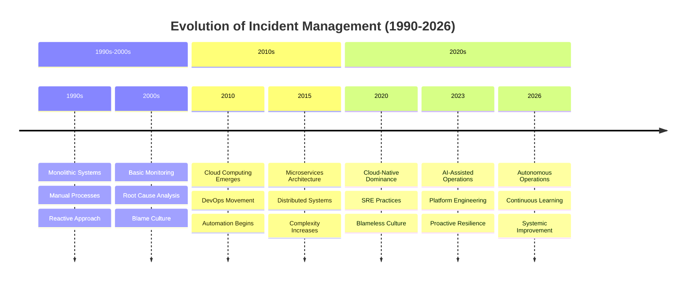

#### The Shift from Blame to Learning

**Traditional Approach (Pre-2010s):**
```
Incident → Investigation → Find Root Cause → Identify Who → Disciplinary Action → Report Filed
```

**Modern Approach (2020s):**
```
Incident → Investigation → Identify Contributing Factors → Systemic Improvements → Learning Shared → Resilience Increases
```

> **⚠️ Warning:** Many organizations claim to be "blameless" but still practice blame in subtle ways. True blameless culture requires fundamental shifts in mindset, processes, and incentives.

### The Real Cost of Poor Incident Learning

#### Financial Impact

Consider these real-world examples:

| Incident | Duration | Cost | Root Cause | Learning Outcome |
|----------|----------|------|------------|------------------|
| AWS US-East-1 Outage (2017) | 4+ hours | $100M+ | Human error during debugging | Improved change management processes |
| Facebook/Meta Outage (2021) | 6+ hours | $100M+ | Configuration error | Enhanced deployment safeguards |
| Fastly CDN Outage (2021) | 1 hour | $100M+ | Software bug | Better dependency management |
| Slack Outage (2020) | 4+ hours | $50M+ | Database migration issue | Improved testing procedures |

#### Organizational Impact

Beyond direct financial costs:
- **Customer Trust:** Repeated incidents erode customer confidence
- **Team Morale:** Blame culture increases stress and burnout
- **Innovation Velocity:** Fear of failure slows experimentation
- **Talent Retention:** Top engineers leave toxic blame cultures
- **Competitive Disadvantage:** Slower recovery times impact market position

### Why Traditional RCA Fails in Cloud-Native Systems

#### The Single Root Cause Fallacy

Traditional RCA seeks a single root cause. In cloud-native systems, this is fundamentally flawed because:

**Example: Configuration Deployment Outage**

```
Traditional RCA Conclusion:
"An engineer deployed an invalid configuration file."

What This Explanation Misses:
❌ Why was the invalid configuration allowed into production?
❌ Why did automated validation fail to detect the issue?
❌ Why did monitoring not identify the problem immediately?
❌ Why was the blast radius so large?
❌ Why was rollback difficult?
❌ Why did recovery take longer than expected?
```

#### The Complexity Multiplier

Modern cloud environments contain thousands of interacting components:

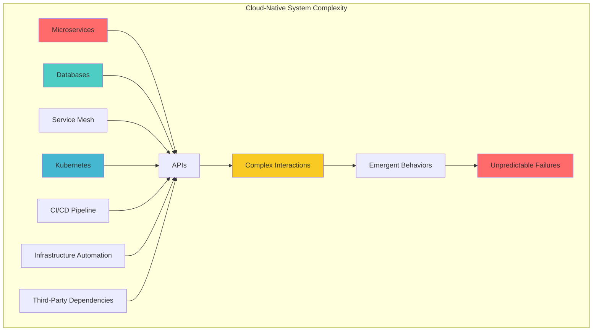

**Key Insight:** In systems with 1000+ components, failures emerge from complex interactions, not single points of failure.

---

## Part 2: Deep Dive into Core Concepts

### The Traditional RCA Trap

#### Anatomy of Traditional Root Cause Analysis

Traditional RCA typically follows this pattern:

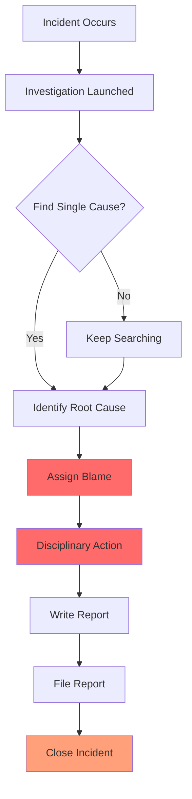

**Problems with This Approach:**
1. **Confirmation Bias:** Teams search for evidence that supports a preconceived notion
2. **Hindsight Bias:** "It was obvious after the fact" - but not during the incident
3. **Fundamental Attribution Error:** Overemphasizing individual characteristics vs. situational factors
4. **Linear Thinking:** Ignores complex, non-linear system behaviors

#### Common RCA Conclusions (And Why They're Insufficient)

| Conclusion | Why It's Insufficient | What's Missing |
|------------|----------------------|----------------|
| "Engineer deployed wrong config" | Ignores why validation failed | Process gaps, tooling issues |
| "Database migration had errors" | Doesn't explain why testing missed it | Testing gaps, review processes |
| "Operator ran wrong command" | Overlookes why safeguards didn't prevent it | Access controls, guardrails |
| "Alert was ignored" | Doesn't address why alert wasn't actionable | Alert quality, runbook availability |
| "Service exceeded capacity" | Ignores why capacity planning failed | Monitoring gaps, scaling automation |

#### Case Study: The "Simple" Configuration Error

**Scenario:** A configuration change causes a critical service outage affecting 15% of customers for 42 minutes.

**Traditional RCA Report:**
> "The outage occurred because an engineer deployed an invalid configuration file."

**Blameless Postmortem Reveals:**

**Timeline:**
```
09:00 - Deployment initiated
09:05 - Error rate increased to 15%
09:08 - Customer complaints received
09:12 - Incident declared
09:18 - Rollback initiated
09:25 - Error rate returned to normal
09:42 - Incident resolved
```

**Contributing Factors Analysis:**

**Technical Factors:**
- ⚠️ Configuration validation only checked syntax, not semantic correctness
- ⚠️ No canary deployment or gradual rollout mechanism
- ⚠️ Monitoring alerts had 5-minute delay
- ⚠️ Circuit breakers were not configured for this failure mode

**Process Factors:**
- ⚠️ Deployment review focused on code changes, not configuration
- ⚠️ No mandatory peer review for production configs
- ⚠️ Runbooks were outdated and didn't cover this scenario
- ⚠️ Escalation path was unclear during initial detection

**Organizational Factors:**
- ⚠️ Team was understaffed (2 engineers on call vs. recommended 4)
- ⚠️ Knowledge silo: Only 1 person understood the configuration system
- ⚠️ Time pressure from leadership to meet release deadlines
- ⚠️ Recent reorg left unclear ownership boundaries

**Action Items Generated:**
1. Implement semantic configuration validation (Technical)
2. Add canary deployment support (Technical)
3. Reduce alert latency to 30 seconds (Technical)
4. Create configuration review checklist (Process)
5. Update incident response runbooks (Process)
6. Increase on-call team size to 4 engineers (Organizational)
7. Conduct knowledge sharing sessions on configuration system (Organizational)

> **💡 Pro Tip:** The blameless postmortem generated 7 actionable improvements vs. 0 improvements from the traditional RCA approach.

### Modern Incidents Rarely Have a Single Root Cause

#### The Swiss Cheese Model of System Failures

James Reason's Swiss Cheese Model, originally developed for aviation safety, applies perfectly to cloud-native incidents:

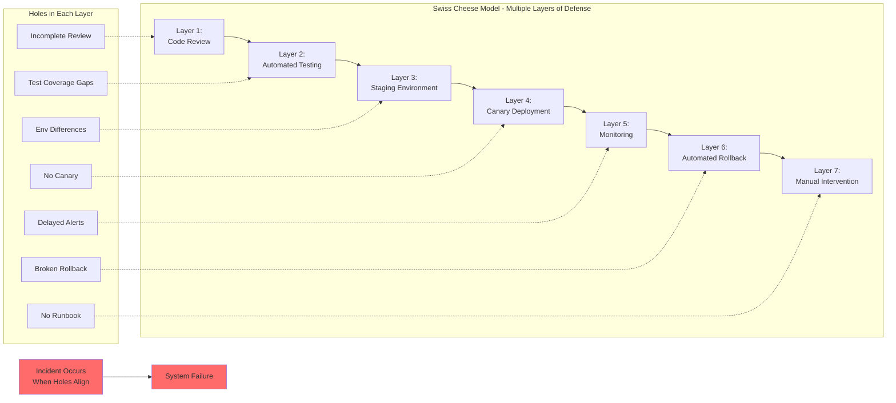

**Key Principle:** Incidents occur when multiple layers of defense fail simultaneously. Fixing one layer doesn't prevent future incidents if other layers remain weak.

#### Contributing Factors Taxonomy

A comprehensive taxonomy helps ensure no contributing factor is missed:

**Technical Contributing Factors:**
- Configuration errors or gaps
- Capacity limitations
- Monitoring deficiencies
- Dependency failures
- Architectural constraints
- Data integrity issues
- Security vulnerabilities
- Performance bottlenecks

**Process Contributing Factors:**
- Incomplete deployment reviews
- Missing or outdated runbooks
- Escalation delays
- Lack of disaster recovery testing
- Insufficient change management
- Poor communication protocols
- Inadequate incident response procedures
- Missing post-incident reviews

**Organizational Contributing Factors:**
- Knowledge silos
- Staffing limitations
- Unclear ownership boundaries
- Training gaps
- Time pressure and deadline culture
- Incentive misalignment
- Geographic distribution challenges
- Tooling and budget constraints

#### Real-World Example: Multi-Factor Incident

**Incident:** E-commerce platform experiences 30-minute outage during Black Friday peak

**Contributing Factors:**

| Category | Factor | Impact |
|----------|--------|--------|
| **Technical** | Database connection pool exhaustion | Primary trigger |
| **Technical** | Missing connection pool monitoring | Delayed detection |
| **Technical** | No automatic connection pool scaling | Extended duration |
| **Process** | Load testing didn't simulate peak traffic | Missed capacity issue |
| **Process** | Deployment 2 hours before peak | Increased risk exposure |
| **Organizational** | Only 2 DBAs on call during peak | Slow response |
| **Organizational** | Recent team reorg (30 days prior) | Unclear escalation path |

**Traditional RCA:** "Database connection pool was too small"

**Blameless Postmortem:** Identified 7 contributing factors across 3 categories, generated 12 action items, prevented recurrence for 3 subsequent peak events.

### What Does "Blameless" Actually Mean?

#### The Blameless Misconception

One of the most misunderstood concepts in incident management:

> **❌ Common Misconception:** "Blameless means avoiding accountability"
> 
> **✅ Correct Understanding:** "Blameless means recognizing that engineers make decisions based on the information available to them at a given moment"

#### Decision-Making Under Pressure

During an active incident, responders operate under severe constraints:

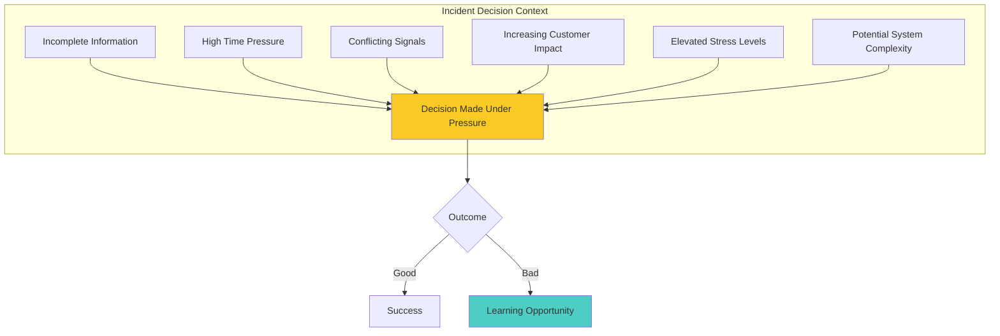

**Key Insight:** The quality of a decision should be judged based on the information available at the time, not the outcome with hindsight.

#### Cognitive Biases in Incident Investigation

Understanding cognitive biases helps postmortem facilitators avoid common pitfalls:

| Bias | Description | Impact on Postmortem | Mitigation |
|------|-------------|---------------------|------------|
| **Hindsight Bias** | "I knew it all along" effect | Overlooking genuine uncertainty | Document decisions in real-time |
| **Confirmation Bias** | Seeking evidence that confirms beliefs | Ignoring contradictory evidence | Actively seek disconfirming evidence |
| **Fundamental Attribution Error** | Blaming individuals vs. systems | Focusing on person, not process | Use "we" not "they" language |
| **Availability Heuristic** | Overweighting recent/salient events | Missing systemic patterns | Analyze multiple incidents |
| **Sunk Cost Fallacy** | Continuing failing approaches | Delaying effective responses | Regular reassessment checkpoints |
| **Normalization of Deviance** | Accepting increasingly risky behavior | Missing gradual degradation | Track leading indicators |

#### Blameless vs. Just Culture

**Blameless Culture:**
- Focus: Learning and improvement
- Question: "What conditions allowed this to happen?"
- Outcome: Systemic changes
- Risk: Can be perceived as lacking accountability

**Just Culture:**
- Focus: Balance between accountability and learning
- Question: "Was the behavior reckless or reasonable given the context?"
- Outcome: Distinguish between human error, at-risk behavior, and reckless behavior
- Risk: Can still create fear if implemented poorly

**Best Practice:** Combine both approaches:
1. Start from a blameless foundation
2. Apply just culture principles to distinguish between:
   - **Human Error:** Unintentional mistakes (learn from these)
   - **At-Risk Behavior:** Choices made due to competing goals (coach on these)
   - **Reckless Behavior:** Conscious disregard of substantial risk (address these)

#### Practical Implementation: The Postmortem Facilitation Guide

**Before the Postmortem:**
- ✅ Set ground rules: "We're here to learn, not to blame"
- ✅ Ensure leadership participation (leaders must model blameless behavior)
- ✅ Prepare incident data and timeline
- ✅ Invite all relevant participants
- ✅ Create psychological safety: "All perspectives are valuable"

**During the Postmortem:**
- ✅ Use neutral language: "The system allowed..." not "Someone did..."
- ✅ Ask "why" questions, not "who" questions
- ✅ Document decisions and context
- ✅ Focus on systems, not individuals
- ✅ Celebrate transparency and honesty

**Red Flags - Stop and Correct:**
- ❌ "If only they had..."
- ❌ "They should have known..."
- ❌ "Why didn't they..."
- ❌ "A competent engineer would have..."
- ❌ Finger-pointing or side conversations

> **💡 Pro Tip:** Have a "stop" word or signal that anyone can use if the conversation becomes blame-oriented. Reset the tone and refocus on systems.

---

## Part 3: The Complete Postmortem Framework

### Anatomy of an Effective Postmortem

#### The Postmortem Process Flow

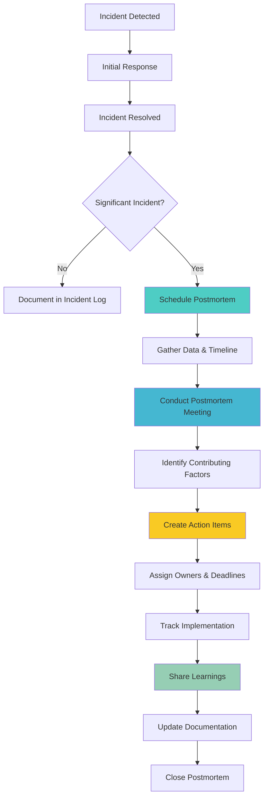

#### Postmortem Document Structure

A comprehensive postmortem document includes:

**1. Executive Summary**
- What happened
- When and how long
- Business impact
- Key findings (3-5 bullet points)
- Top action items

**2. Incident Overview**
- Severity level
- Customer impact
- Systems affected
- Timeline of detection to resolution

**3. Detailed Timeline**
- Chronological event sequence
- Decision points
- Communication milestones
- Recovery actions

**4. Contributing Factors Analysis**
- Technical factors
- Process factors
- Organizational factors
- Root causes (if applicable)

**5. Response Assessment**
- Detection effectiveness
- Communication quality
- Recovery actions
- Tooling effectiveness

**6. Action Items**
- Specific improvements
- Owners and deadlines
- Priority levels
- Success metrics

**7. Lessons Learned**
- What went well
- What could be improved
- Knowledge to share

**8. Appendices**
- Supporting data
- Communication logs
- Metrics and graphs
- Related incidents

### Incident Summary: Best Practices

#### Writing an Effective Summary

**Template:**
```
On [DATE], [SERVICE/PRODUCT] experienced [INCIDENT_TYPE] affecting 
[IMPACT_SCOPE]. The incident began at [TIME], was detected [DETECTION_METHOD], 
and was resolved at [RESOLUTION_TIME] after [DURATION]. Approximately 
[AFFECTED_USERS/REQUESTS] were impacted, resulting in [BUSINESS_IMPACT]. 
The primary cause was [PRIMARY_CONTRIBUTING_FACTOR], with additional 
contributions from [SECONDARY_FACTORS]. Key action items include 
[TOP_2-3_ACTIONS].
```

**Example:**
```
On March 12, 2026, the Payment Processing Service experienced elevated 
latency and error rates following a configuration deployment. The incident 
began at 09:05 UTC, was detected by automated monitoring at 09:05 UTC, 
and was fully resolved at 09:42 UTC after 37 minutes. Approximately 15% 
of customer payment requests failed, resulting in an estimated $50,000 
in failed transactions and 200+ customer support tickets. The primary 
cause was incomplete configuration validation, with additional 
contributions from insufficient canary deployment and delayed alerting. 
Key action items include implementing semantic configuration validation, 
adding canary deployment support, and reducing alert latency to 30 seconds.
```

#### Severity Level Classification

| Severity | Definition | Response Time | Postmortem Required |
|----------|------------|---------------|---------------------|
| **SEV1** | Critical impact to all users, data loss, security breach | 15 minutes | Yes, within 48 hours |
| **SEV2** | Major impact to many users, significant functionality degraded | 30 minutes | Yes, within 1 week |
| **SEV3** | Minor impact to some users, workaround available | 2 hours | Yes, within 2 weeks |
| **SEV4** | Minimal impact, no customer-facing effects | Next business day | Optional |

### Timeline Reconstruction

#### Building a Detailed Timeline

The timeline is the most critical component of a postmortem. It provides the factual foundation for all analysis.

**Timeline Template:**

```markdown
## Detailed Timeline

| Time (UTC) | Event | Source | Impact |
|------------|-------|--------|--------|
| 09:00 | Deployment initiated | CI/CD logs | None |
| 09:02 | Configuration validation passed | CI/CD logs | None |
| 09:03 | Deployment to production completed | CI/CD logs | None |
| 09:05 | Error rate increased from 0.1% to 15% | Monitoring | Customer impact begins |
| 09:06 | First automated alert fired | AlertManager | Detection |
| 09:08 | Customer support tickets received | Support system | Customer impact confirmed |
| 09:10 | On-call engineer paged | PagerDuty | Response begins |
| 09:12 | Incident declared SEV2 | Incident commander | Formal response |
| 09:15 | Initial investigation: suspected config issue | Slack | Diagnosis begins |
| 09:18 | Rollback initiated | On-call engineer | Recovery begins |
| 09:22 | Configuration error identified | Investigation | Root cause found |
| 09:25 | Error rate returned to baseline | Monitoring | Recovery confirmed |
| 09:30 | Customer communication sent | Support | Stakeholder informed |
| 09:42 | Incident resolved, monitoring continued | On-call engineer | Closure |
```

#### Timeline Best Practices

**✅ Do:**
- Use precise timestamps (include timezone)
- Document every significant event
- Include communication milestones
- Note decision points and who made them
- Capture monitoring data points
- Include customer impact observations

**❌ Don't:**
- Approximate times ("around 9am")
- Skip "minor" events (they may be significant)
- Forget to include detection delays
- Omit recovery attempts (even failed ones)
- Use vague descriptions ("something broke")

#### Timeline Analysis Techniques

**1. Gap Analysis:**
Identify time gaps where no activity is recorded. These often reveal:
- Detection delays
- Communication breakdowns
- Escalation issues

**2. Decision Point Analysis:**
For each decision point, document:
- What decision was made
- Who made it
- What information was available
- What alternatives were considered
- Outcome of the decision

**3. Parallel Activity Mapping:**
Track multiple concurrent activities:
- Investigation efforts
- Communication threads
- Recovery attempts
- Customer interactions

### Contributing Factors Analysis

#### Beyond Root Cause: The Contributing Factors Framework

Instead of searching for a single root cause, identify all meaningful contributors:

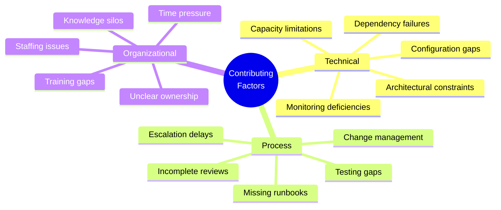

#### Contributing Factors Analysis Process

**Step 1: Brainstorm All Factors**
- Gather the postmortem team
- Use the taxonomy (technical, process, organizational)
- Encourage wild ideas (no judgment)
- Document everything

**Step 2: Categorize and Prioritize**
- Group related factors
- Assess impact (high/medium/low)
- Assess likelihood of recurrence
- Identify quick wins vs. long-term improvements

**Step 3: Validate with Evidence**
- Link each factor to timeline evidence
- Identify data sources that support the factor
- Note any assumptions or gaps

**Step 4: Generate Action Items**
- For each significant factor, create an action item
- Ensure action items are specific and measurable
- Assign owners and deadlines

#### Contributing Factors Analysis Template

```markdown
## Contributing Factors Analysis

### Technical Factors

| Factor | Evidence | Impact | Action Item | Owner | Priority |
|--------|----------|--------|-------------|-------|----------|
| Configuration validation only checked syntax | CI/CD logs show invalid config passed validation | High | Implement semantic validation | Jane Doe | P0 |
| No canary deployment mechanism | Deployment docs, architecture review | High | Add canary deployment support | John Smith | P1 |
| Monitoring alerts had 5-minute delay | Alert configuration, incident timeline | Medium | Reduce alert latency to 30s | Jane Doe | P1 |

### Process Factors

| Factor | Evidence | Impact | Action Item | Owner | Priority |
|--------|----------|--------|-------------|-------|----------|
| No peer review for production configs | Git history, process docs | High | Mandate config peer review | Team Lead | P0 |
| Runbooks outdated (last updated 6 months ago) | Runbook version history | Medium | Update incident runbooks | On-call team | P1 |

### Organizational Factors

| Factor | Evidence | Impact | Action Item | Owner | Priority |
|--------|----------|--------|-------------|-------|----------|
| Only 1 person understood config system | Team skills matrix | High | Knowledge sharing sessions | Engineering Manager | P1 |
| Time pressure from leadership | Slack messages, meeting notes | Medium | Adjust release schedule | Product Manager | P2 |
```

### Recovery Assessment

#### Evaluating Incident Response Effectiveness

The response to an incident often causes more customer impact than the incident itself. Assess:

**1. Detection Effectiveness**

| Metric | Target | Actual | Gap | Action |
|--------|--------|--------|-----|--------|
| Time to detect (TTD) | < 1 minute | 5 minutes | 4 min | Improve alerting |
| Alert accuracy (true positive rate) | > 90% | 75% | 15% | Tune alert thresholds |
| Alert actionability | 100% | 60% | 40% | Add runbook links |

**2. Response Effectiveness**

| Metric | Target | Actual | Gap | Action |
|--------|--------|--------|-----|--------|
| Time to acknowledge | < 2 minutes | 3 minutes | 1 min | Reduce page latency |
| Time to escalate | < 5 minutes | 8 minutes | 3 min | Clarify escalation path |
| Time to identify cause | < 10 minutes | 13 minutes | 3 min | Improve debugging tools |

**3. Recovery Effectiveness**

| Metric | Target | Actual | Gap | Action |
|--------|--------|--------|-----|--------|
| Time to recover (MTTR) | < 15 minutes | 37 minutes | 22 min | Automate rollback |
| Recovery method | Automated | Manual | - | Implement auto-rollback |
| Customer communication | < 5 minutes | 12 minutes | 7 min | Automate notifications |

**4. Communication Effectiveness**

| Stakeholder | Notification Time | Information Quality | Gap | Action |
|-------------|------------------|-------------------|-----|--------|
| On-call team | Immediate | Good | None | - |
| Engineering leadership | 7 minutes | Fair | 5 min delay | Automate escalation |
| Customer support | 8 minutes | Good | 3 min delay | Integrate systems |
| Customers | 25 minutes | Good | 20 min delay | Improve comms |

#### Recovery Assessment Questions

Use these questions to guide your analysis:

**Detection:**
- [ ] Was the incident detected automatically or by customer reports?
- [ ] How long did it take to detect? (MTTD)
- [ ] Were alerts actionable and clear?
- [ ] Did monitoring cover all affected components?

**Response:**
- [ ] Was the right person notified?
- [ ] How long to acknowledge and start investigation?
- [ ] Were responders able to access necessary tools?
- [ ] Was ownership clear from the start?

**Investigation:**
- [ ] How long to identify the cause?
- [ ] Were debugging tools effective?
- [ ] Was relevant information easily accessible?
- [ ] Were there knowledge gaps that slowed investigation?

**Recovery:**
- [ ] How long to recover? (MTTR)
- [ ] Was recovery automated or manual?
- [ ] Could recovery have been faster?
- [ ] Were there any failed recovery attempts?

**Communication:**
- [ ] Were stakeholders informed appropriately?
- [ ] Was customer communication timely?
- [ ] Was internal communication effective?
- [ ] Were there communication breakdowns?

---

## Part 4: Implementation & Tools

### The Five Whys: Useful But Limited

#### Understanding the Five Whys Technique

The Five Whys is a simple but powerful investigative technique:

**Process:**
1. Start with the problem statement
2. Ask "Why?" repeatedly (typically 5 times)
3. Drill down from symptoms to systemic causes

**Example:**

```
Problem: Configuration error caused production outage

1. Why did the outage occur?
   → Because an invalid configuration was deployed

2. Why was an invalid configuration deployed?
   → Because validation checks were incomplete

3. Why were validation checks incomplete?
   → Because a new deployment framework was introduced

4. Why was the framework deployed without complete validation?
   → Because release deadlines prioritized delivery speed

5. Why were deadlines prioritized over completeness?
   → Because organizational risk was underestimated
```

**Systemic Finding:** The root issue is organizational risk management, not the configuration error.

#### When to Use Five Whys

**✅ Good For:**
- Simple, linear problems
- Identifying systemic issues
- Team training and education
- Quick investigations

**❌ Not Suitable For:**
- Complex, multi-causal incidents
- Incidents with parallel contributing factors
- Situations requiring detailed technical analysis
- When multiple teams are involved

#### Limitations in Cloud-Native Environments

**Problem 1: Non-Linear Causality**
```
Traditional Five Whys assumes linear causality:
A → B → C → D → E

Cloud-native incidents often have parallel factors:
    A → D
    B → D
    C → D
    
Multiple independent factors contribute to the same outcome
```

**Problem 2: Multiple Root Causes**
```
Incident: Service outage

Contributing factors:
- Configuration error (technical)
- Missing canary deployment (process)
- Insufficient testing (process)
- Time pressure (organizational)

Five Whys might focus on one path and miss others
```

**Problem 3: Circular Dependencies**
```
A causes B
B causes C
C reinforces A

Five Whys struggles with feedback loops
```

#### Enhanced Analysis Techniques

**1. Fault Tree Analysis (FTA)**

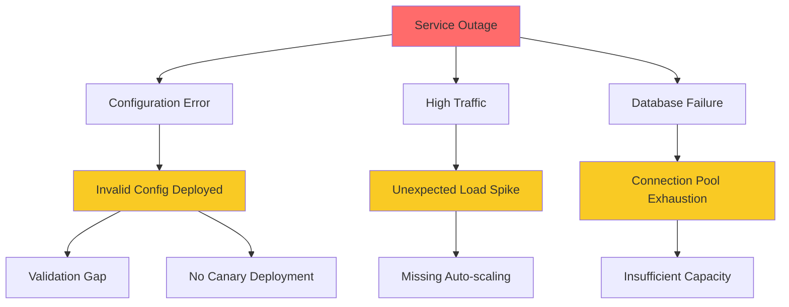

**2. Timeline-Based Analysis**

Focus on the sequence of events and decision points rather than causality chains.

**3. Contributing Factors Matrix**

Systematically evaluate all potential factors across technical, process, and organizational dimensions.

**Best Practice:** Use Five Whys as one tool in your toolkit, not the only tool. Combine it with other techniques for comprehensive analysis.

### AI-Assisted Incident Learning

#### The Future of Postmortems

Modern incident management platforms are leveraging AI to transform postmortem creation:

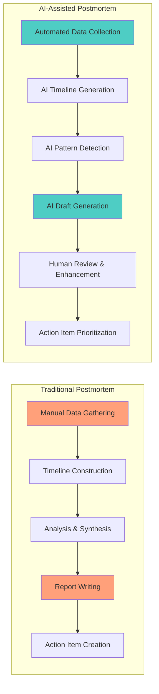

#### AI Capabilities in Incident Management

**What AI Can Do:**
- ✅ Automatically build incident timelines from multiple data sources
- ✅ Correlate alerts and identify root signals
- ✅ Summarize communication channels (Slack, Zoom, etc.)
- ✅ Extract remediation actions from conversations
- ✅ Identify recurring failure patterns across incidents
- ✅ Generate draft postmortem reports
- ✅ Suggest action items based on similar past incidents

**What AI Cannot Do (Yet):**
- ❌ Understand organizational context and politics
- ❌ Make judgment calls about systemic vs. individual factors
- ❌ Navigate sensitive cultural or interpersonal dynamics
- ❌ Understand architectural trade-offs and business constraints
- ❌ Build consensus around action items

#### AI Tool Comparison

| Tool | Capabilities | Best For | Limitations |
|------|--------------|----------|-------------|
| **PagerDuty AI** | Automated timeline, alert correlation | PagerDuty users | Limited to PagerDuty ecosystem |
| **FireHydrant** | AI-powered postmortem drafts | SRE teams | Requires FireHydrant platform |
| **Squadcast** | Incident analysis, RCA automation | Mid-size teams | Newer platform, smaller community |
| **Custom Solutions** | Full control, integration flexibility | Large enterprises | Requires significant development |

#### Human + AI Collaboration Model

**Phase 1: Data Collection (AI)**
- AI gathers data from monitoring, logs, chat, etc.
- AI builds initial timeline
- AI identifies key events and anomalies

**Phase 2: Analysis (Human + AI)**
- Human reviews AI-generated timeline
- Human adds context and nuance
- Human identifies contributing factors
- AI suggests patterns from historical data

**Phase 3: Synthesis (Human)**
- Human writes narrative sections
- Human makes judgment calls on systemic issues
- Human ensures blameless tone
- Human validates findings with stakeholders

**Phase 4: Action Items (Human + AI)**
- Human defines action items
- AI suggests similar past actions and their outcomes
- Human prioritizes based on business context
- AI tracks implementation progress

> **💡 Pro Tip:** Use AI to handle 60-70% of data gathering and initial analysis, but always have a human review and validate findings. AI should augment human investigation, not replace it.

### Turning Findings Into Action

#### The Action Item Framework

A postmortem without action items is merely documentation. Every significant finding should produce measurable improvement.

**Action Item Template:**

```markdown
### Action Item #1: [Title]

**Finding:** [What was discovered during postmortem]

**Proposed Action:** [Specific improvement to implement]

**Success Metric:** [How we'll measure success]

**Owner:** [Name and team]

**Priority:** P0/P1/P2/P3

**Deadline:** [Date]

**Dependencies:** [What's needed to complete]

**Status:** [Not Started/In Progress/Completed]

**Notes:** [Any additional context]
```

**Example:**

```markdown
### Action Item #1: Implement Semantic Configuration Validation

**Finding:** Configuration validation only checked YAML syntax, not semantic correctness. 
Invalid configurations passed validation and caused production outages.

**Proposed Action:** Implement semantic validation that checks:
- Required fields are present
- Values are within acceptable ranges
- Dependencies are compatible
- Security policies are enforced

**Success Metric:** 
- Zero configuration-related incidents in 6 months
- 100% of invalid configs caught before production

**Owner:** Jane Doe (Platform Team)

**Priority:** P0

**Deadline:** 2026-04-15

**Dependencies:** 
- Access to configuration schema documentation
- QA environment for testing

**Status:** In Progress

**Notes:** Leverage existing validation framework. Add integration tests.
```

#### Action Item Prioritization

Use this framework to prioritize action items:

| Priority | Criteria | Timeline | Example |
|----------|----------|----------|---------|
| **P0** | Prevents recurrence of similar incidents, high impact | 1-2 weeks | Add automated validation |
| **P1** | Significantly improves reliability, medium impact | 1 month | Implement canary deployments |
| **P2** | Nice to have, low impact | 3 months | Update documentation |
| **P3** | Long-term improvement, research needed | 6+ months | Refactor architecture |

**Prioritization Questions:**
1. Does this prevent the same incident from recurring?
2. Does this improve detection or recovery time?
3. Does this reduce blast radius?
4. What's the effort vs. impact ratio?
5. Are there dependencies on other teams?

#### Tracking and Accountability

**Action Item Tracking System:**

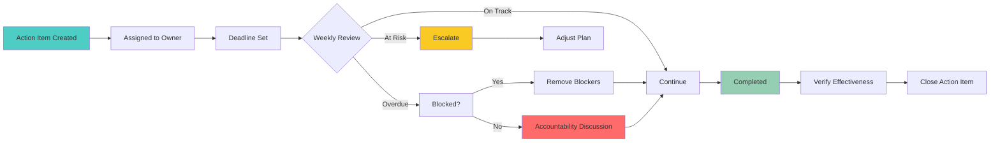

**Best Practices:**
- ✅ Review action items weekly in team standups
- ✅ Escalate overdue items within 1 week
- ✅ Celebrate completed action items
- ✅ Measure and report completion rates
- ✅ Link action items to business outcomes

### Measuring Postmortem Effectiveness

#### Key Performance Indicators (KPIs)

Track these metrics to measure postmortem effectiveness:

**1. Operational Improvement Metrics**

| Metric | Definition | Target | Measurement |
|--------|------------|--------|-------------|
| **MTTD** | Mean Time To Detect | < 5 minutes | Average time from incident start to detection |
| **MTTR** | Mean Time To Recover | < 15 minutes | Average time from detection to resolution |
| **Repeat Incident Rate** | Incidents with same root cause | < 5% | Incidents per quarter / total incidents |
| **Automated Recovery Rate** | % of incidents recovered automatically | > 50% | Auto-recovered / total incidents |
| **Manual Intervention Reduction** | Reduction in manual steps | -20% per quarter | Manual steps before vs. after |

**2. Postmortem Process Metrics**

| Metric | Definition | Target | Measurement |
|--------|------------|--------|-------------|
| **Postmortem Completion Rate** | % of incidents with postmortems | 100% for SEV1/SEV2 | Completed / required postmortems |
| **Action Item Completion Rate** | % of action items completed | > 80% | Completed / total action items |
| **Action Item On-Time Rate** | % completed by deadline | > 90% | On-time / total action items |
| **Time to Postmortem** | Days from incident to postmortem | < 7 days for SEV2 | Calendar days |
| **Participation Rate** | % of required attendees present | > 80% | Actual / expected attendees |

**3. Learning and Culture Metrics**

| Metric | Definition | Target | Measurement |
|--------|------------|--------|-------------|
| **Information Sharing Score** | Team survey on openness | > 4/5 | Quarterly survey |
| **Repeat Incident Prevention** | Incidents prevented by actions | Track count | Count of prevented incidents |
| **Knowledge Base Growth** | New runbooks/docs created | +10% per quarter | Count of new documents |
| **Training Completion** | Team members trained | 100% | Trained / total team members |

#### Metrics Dashboard Example

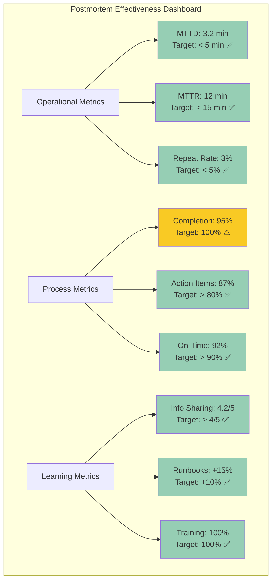

#### Continuous Improvement Loop

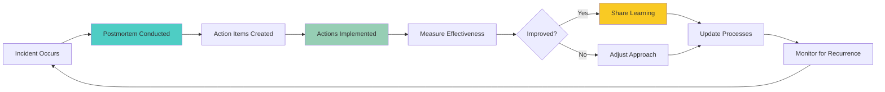

---

## Part 5: Organizational Transformation

### Building a Blameless Culture

#### Culture Transformation Journey

Moving to a blameless culture requires deliberate effort across multiple dimensions:

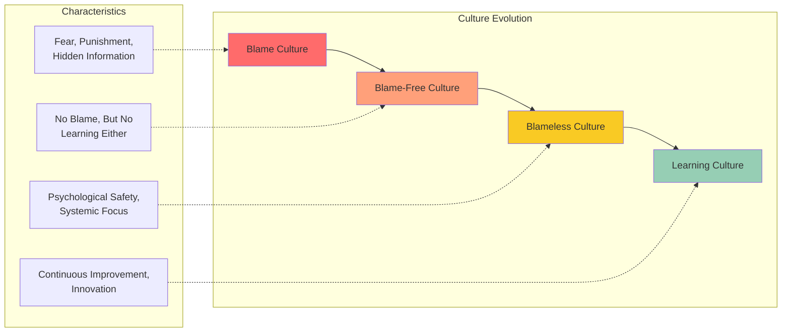

#### Leadership Commitment

**Essential Leadership Behaviors:**

1. **Model Blameless Behavior**
   - Publicly share your own mistakes
   - Ask "what system allowed this?" not "who did this?"
   - Reward transparency and learning

2. **Create Psychological Safety**
   - "No retribution for honest mistakes"
   - "We learn together"
   - "Questions are encouraged"

3. **Align Incentives**
   - Reward learning and improvement
   - Don't punish honest mistakes
   - Celebrate postmortems and action items

4. **Invest in Training**
   - Train all engineers on blameless principles
   - Train managers on facilitation
   - Provide ongoing coaching

#### Common Culture Pitfalls

| Pitfall | Symptoms | Solution |
|---------|----------|----------|
| **Lip Service** | Leadership says "blameless" but punishes mistakes | Leadership must model behavior consistently |
| **Inconsistent Application** | Blameless for some teams, blame for others | Apply uniformly across organization |
| **Performance Review Impact** | Incidents affect performance ratings | Separate incident learning from performance reviews |
| **Fear of Documentation** | Teams avoid documenting incidents | Celebrate transparency, protect writers |
| **Token Postmortems** | Rushed, superficial reviews | Allocate dedicated time, enforce quality |

### Training and Onboarding

#### Blameless Postmortem Training Curriculum

**Module 1: Foundations (2 hours)**
- What is a blameless postmortem?
- Why traditional RCA fails
- The psychology of blameless culture
- Legal and HR considerations

**Module 2: Facilitation Skills (3 hours)**
- Setting ground rules
- Managing difficult conversations
- Neutral language techniques
- Handling blame-oriented comments

**Module 3: Technical Analysis (4 hours)**
- Timeline reconstruction
- Contributing factors analysis
- Evidence gathering
- Documentation best practices

**Module 4: Action Items and Follow-Through (2 hours)**
- Creating effective action items
- Prioritization frameworks
- Tracking and accountability
- Measuring effectiveness

**Module 5: Practice and Feedback (3 hours)**
- Mock postmortem exercises
- Peer feedback
- Real incident analysis
- Continuous improvement

**Total Training Time:** 14 hours (spread over 2 weeks)

#### Onboarding Checklist for New Engineers

- [ ] Complete blameless postmortem training
- [ ] Shadow 2-3 postmortem meetings
- [ ] Review past postmortems (last 6 months)
- [ ] Learn incident management tools
- [ ] Understand escalation paths
- [ ] Meet incident response team
- [ ] Review runbooks and documentation
- [ ] Practice timeline reconstruction
- [ ] Facilitate a mock postmortem
- [ ] Get feedback on facilitation skills

### Common Pitfalls and How to Avoid Them

#### Pitfall 1: The "No One Is Accountable" Trap

**Problem:** Teams interpret "blameless" as "no accountability"

**Symptoms:**
- Action items not completed
- No follow-through on improvements
- Repeat incidents
- Frustration from leadership

**Solution:**
- Blameless ≠ no accountability
- Hold people accountable for action items, not for incidents
- Clear ownership and deadlines for all action items
- Regular progress reviews
- Escalate overdue items

#### Pitfall 2: The "Perfect Postmortem" Syndrome

**Problem:** Teams spend excessive time creating the "perfect" postmortem document

**Symptoms:**
- Postmortems take weeks to complete
- Analysis paralysis
- Delayed action items
- Decreased participation

**Solution:**
- Time-box postmortem creation (3-5 days)
- Focus on actionable insights, not perfect documentation
- "Good enough" is better than "perfect but late"
- Iterate and improve over time

#### Pitfall 3: The "Compliance Checkbox" Approach

**Problem:** Postmortems become a compliance requirement rather than a learning tool

**Symptoms:**
- Rushed, superficial analysis
- Generic action items
- No real improvements
- Teams resent postmortems

**Solution:**
- Focus on learning, not compliance
- Quality over quantity
- Celebrate good postmortems
- Measure improvement, not completion

#### Pitfall 4: The "Information Hoarding" Problem

**Problem:** Teams with information don't share it openly

**Symptoms:**
- Incomplete timelines
- Missing context
- Repeat incidents
- Knowledge silos

**Solution:**
- Create safe spaces for sharing
- Reward transparency
- Document everything
- Make information accessible

#### Pitfall 5: The "Analysis Paralysis" Trap

**Problem:** Teams over-analyze and never take action

**Symptoms:**
- Endless meetings
- No action items
- No improvements
- Frustration

**Solution:**
- Time-box analysis
- "Good enough" analysis is sufficient
- Action items are more important than perfect understanding
- Learn by doing

### Scaling Postmortem Practices

#### Scaling Challenges

As organizations grow, maintaining postmortem quality becomes challenging:

| Challenge | Small Team (< 20) | Medium Team (20-100) | Large Enterprise (100+) |
|-----------|-------------------|----------------------|-------------------------|
| **Consistency** | Easy | Moderate | Difficult |
| **Quality** | High | Variable | Variable |
| **Knowledge Sharing** | Informal | Formal processes needed | Centralized team required |
| **Tooling** | Basic | Integrated platforms | Custom solutions |
| **Training** | On-the-job | Structured program | Dedicated team |

#### Scaling Strategies

**1. Standardize Templates and Processes**
- Create organization-wide postmortem templates
- Document facilitation guides
- Establish quality standards
- Create checklists

**2. Build a Community of Practice**
- Regular postmortem review sessions
- Share best practices
- Mentor new facilitators
- Build community

**3. Invest in Tooling**
- Incident management platforms
- Automated timeline generation
- Action item tracking
- Analytics and reporting

**4. Create Dedicated Roles**
- Postmortem facilitators
- Incident managers
- SREs focused on reliability
- Learning and development specialists

**5. Measure and Improve**
- Track postmortem metrics
- Survey participant satisfaction
- Regular process reviews
- Continuous improvement

---

## Part 6: Hands-On Practice

### Practice Exercise 1: Analyze a Real Incident Scenario

#### Scenario: The E-Commerce Checkout Outage

**Background:**
You're the on-call engineer for an e-commerce platform. At 2:00 PM on Cyber Monday, the checkout service starts experiencing errors. The incident lasts 45 minutes and affects approximately 20% of checkout attempts.

**Timeline:**
```
13:45 - Deployment of new recommendation engine feature
13:52 - Error rate increases from 0.1% to 18%
13:53 - First automated alert fires
13:55 - Customer complaints start arriving
13:58 - On-call engineer (you) paged
14:00 - Incident declared SEV2
14:05 - Initial investigation begins
14:12 - Database connection pool exhaustion identified
14:18 - Recommendation service rolled back
14:20 - Error rate drops to 2%
14:30 - Error rate returns to baseline (0.1%)
14:45 - Incident resolved
```

**Customer Impact:**
- 20% of checkout attempts failed
- Estimated $150,000 in lost revenue
- 500+ customer support tickets
- Social media complaints
- Negative app store reviews

**Initial Findings:**
- The new recommendation engine made excessive database queries
- Connection pool was sized for 100 connections, but needed 500
- Monitoring showed connection pool at 100% but alert was delayed 7 minutes
- No circuit breaker on recommendation service
- Rollback took 18 minutes due to manual process

#### Your Task

**Part A: Contributing Factors Analysis (30 minutes)**

Identify at least 10 contributing factors across technical, process, and organizational categories.

**Part B: Action Items (20 minutes)**

Create 5-7 specific, measurable action items with owners and deadlines.

**Part C: Timeline Analysis (15 minutes)**

Identify gaps in detection, response, and recovery. Calculate:
- Time to detect (TTD)
- Time to acknowledge
- Time to identify cause
- Time to recover (MTTR)

#### Solution and Rubric

**Part A: Contributing Factors Analysis**

**Technical Factors:**
1. ✅ Recommendation engine made N+1 database queries instead of batch queries
2. ✅ Database connection pool undersized (100 vs. 500 needed)
3. ✅ No circuit breaker on recommendation service
4. ✅ Monitoring alert delayed 7 minutes
5. ✅ No automatic scaling for connection pools

**Process Factors:**
6. ✅ Load testing didn't simulate Cyber Monday traffic patterns
7. ✅ Deployment scheduled 2 hours before peak traffic
8. ✅ No mandatory performance testing for database-heavy features
9. ✅ Rollback process was manual (took 18 minutes)

**Organizational Factors:**
10. ✅ Only 2 engineers on call during peak shopping day
11. ✅ Recent team reorg (2 weeks prior) left unclear ownership of recommendation service
12. ✅ Time pressure to ship feature before holiday season

**Scoring:**
- 10+ factors identified: Excellent
- 7-9 factors: Good
- 4-6 factors: Fair
- < 4 factors: Needs improvement

**Part B: Action Items**

**Example Action Items:**

1. **Implement Circuit Breakers**
   - Finding: No circuit breaker allowed cascading failure
   - Action: Add circuit breakers to all external service calls
   - Owner: Platform Team
   - Deadline: 2 weeks
   - Success Metric: Zero cascading failures in next 3 months

2. **Automated Connection Pool Scaling**
   - Finding: Manual connection pool sizing caused outage
   - Action: Implement automatic connection pool scaling based on load
   - Owner: Database Team
   - Deadline: 1 month
   - Success Metric: Connection pool never exceeds 80% utilization

3. **Reduce Alert Latency**
   - Finding: 7-minute alert delay slowed response
   - Action: Reduce alert evaluation interval from 5 minutes to 30 seconds
   - Owner: Observability Team
   - Deadline: 1 week
   - Success Metric: Alert latency < 1 minute

4. **Automate Rollback Process**
   - Finding: Manual rollback took 18 minutes
   - Action: Implement one-click automated rollback
   - Owner: CI/CD Team
   - Deadline: 2 weeks
   - Success Metric: Rollback completes in < 2 minutes

5. **Mandatory Performance Testing**
   - Finding: Feature not tested under production load
   - Action: Require performance testing for all database-heavy features
   - Owner: QA Team
   - Deadline: 2 weeks
   - Success Metric: 100% of DB-heavy features have performance tests

6. **Improve On-Call Coverage**
   - Finding: Only 2 engineers on call during peak
   - Action: Increase on-call team to 6 engineers for high-traffic events
   - Owner: Engineering Manager
   - Deadline: 1 week
   - Success Metric: Minimum 4 engineers on call during peak events

7. **Deployment Blackout Periods**
   - Finding: Deployment 2 hours before peak increased risk
   - Action: Implement deployment blackout during peak hours (12 PM - 4 PM)
   - Owner: Product Manager
   - Deadline: 1 week
   - Success Metric: Zero deployments during blackout period

**Scoring:**
- Action items are specific and measurable: 2 points each
- Cover technical, process, and organizational: 3 points
- Include owners and deadlines: 2 points
- Total: 20 points

**Part C: Timeline Analysis**

**Metrics:**
- **Time to Detect (TTD):** 7 minutes (13:45 deployment to 13:52 error increase, detected at 13:53)
- **Time to Acknowledge:** 5 minutes (13:58 paged, 14:00 declared)
- **Time to Identify Cause:** 12 minutes (14:00 declared to 14:12 identified)
- **Time to Recover (MTTR):** 32 minutes (14:00 declared to 14:32 recovered)

**Gaps Identified:**
1. **Detection Gap:** 7-minute delay in alerting
2. **Response Gap:** 5 minutes to acknowledge (could be faster)
3. **Investigation Gap:** 12 minutes to identify cause (reasonable given complexity)
4. **Recovery Gap:** 18 minutes for manual rollback (should be automated)

**Improvement Opportunities:**
- Reduce alert latency: 7 min → < 1 min
- Automate rollback: 18 min → < 2 min
- Improve runbooks: Reduce investigation time

### Practice Exercise 2: Create a Postmortem Template

#### Task

Design a comprehensive postmortem template that includes:

1. **Header Section:**
   - Incident metadata (date, severity, duration, systems affected)
   - Postmortem team and attendees
   - Document version and date

2. **Executive Summary:**
   - One-paragraph overview
   - Key findings (3-5 bullets)
   - Top action items

3. **Incident Overview:**
   - Detailed timeline (table format)
   - Customer impact
   - Systems affected
   - Detection method

4. **Contributing Factors Analysis:**
   - Technical factors table
   - Process factors table
   - Organizational factors table

5. **Response Assessment:**
   - Detection effectiveness
   - Response effectiveness
   - Recovery effectiveness
   - Communication effectiveness

6. **Action Items:**
   - Action item table with owner, deadline, priority, status

7. **Lessons Learned:**
   - What went well
   - What could be improved
   - Knowledge to share

8. **Appendices:**
   - Supporting data
   - Communication logs
   - Metrics and graphs

#### Solution Template

See the comprehensive template in the [Postmortem Template Repository](#postmortem-template-repository) section below.

### Practice Exercise 3: Conduct a Mock Postmortem

#### Scenario: The Database Migration Disaster

**Background:**
Your team performed a database migration to add a new column to the `users` table. The table has 50 million rows. The migration was scheduled for low-traffic hours (2:00 AM).

**Timeline:**
```
01:45 - Migration started
01:52 - Migration completed successfully
01:55 - Application deployed with new code
02:03 - Error rate spikes to 25%
02:05 - Alerts fire
02:08 - On-call engineer paged
02:12 - Incident declared SEV1
02:15 - Investigation begins
02:22 - Database lock identified as cause
02:30 - Database rolled back to snapshot
02:35 - Error rate returns to normal
03:00 - Incident resolved
```

**Details:**
- Migration took 7 minutes (expected: 5 minutes)
- Application started querying the new column immediately
- The migration created a table lock that blocked reads
- 25% of user requests failed for 30 minutes
- Rollback took 18 minutes (database snapshot restore)
- Total impact: 500,000 failed requests, $75,000 lost revenue

**Contributing Factors (Hidden):**
- Migration was not tested on production-sized data
- No blue-green deployment for database changes
- Application code deployed before migration completed
- No database query timeout configured
- Monitoring didn't detect table locks
- Rollback procedure was not tested

#### Your Task

**Facilitate a 30-minute mock postmortem with your team (or record yourself):**

1. **Opening (5 minutes):**
   - Set ground rules (blameless, learning-focused)
   - Review timeline
   - State objectives

2. **Timeline Review (5 minutes):**
   - Walk through timeline
   - Identify gaps
   - Clarify any unclear events

3. **Contributing Factors Analysis (15 minutes):**
   - Brainstorm factors (technical, process, organizational)
   - Categorize and prioritize
   - Validate with evidence

4. **Action Items (5 minutes):**
   - Identify 5-7 action items
   - Assign owners
   - Set deadlines

#### Facilitation Tips

**Do:**
- ✅ Use neutral language
- ✅ Ask "why" questions
- ✅ Encourage participation
- ✅ Stay focused on systems
- ✅ Time-box discussions

**Don't:**
- ❌ Allow blame-oriented comments
- ❌ Get stuck on one factor
- ❌ Let one person dominate
- ❌ Skip action items
- ❌ End without clear next steps

### Practice Exercise 4: Design an Action Item Tracking System

#### Task

Design a system to track postmortem action items from creation to completion. Your system should include:

1. **Data Model:**
   - Action item fields
   - Status tracking
   - Priority levels
   - Dependencies

2. **Workflow:**
   - Creation process
   - Assignment process
   - Review cadence
   - Escalation process
   - Completion verification

3. **Reporting:**
   - Dashboard design
   - Metrics to track
   - Reporting frequency
   - Stakeholder communication

4. **Integration:**
   - Tools to integrate with
   - Automation opportunities
   - Notification system

#### Solution Architecture

**Data Model:**

```yaml
ActionItem:
  id: string (UUID)
  postmortem_id: string (reference)
  title: string
  description: text
  finding: text
  proposed_action: text
  success_metric: text
  owner: string (user ID)
  team: string
  priority: enum [P0, P1, P2, P3]
  status: enum [Not Started, In Progress, Blocked, Completed, Cancelled]
  deadline: date
  created_at: datetime
  updated_at: datetime
  completed_at: datetime
  dependencies: list[ActionItem ID]
  notes: text
  verification_method: text
  verified: boolean
  verified_at: datetime
```

**Workflow:**

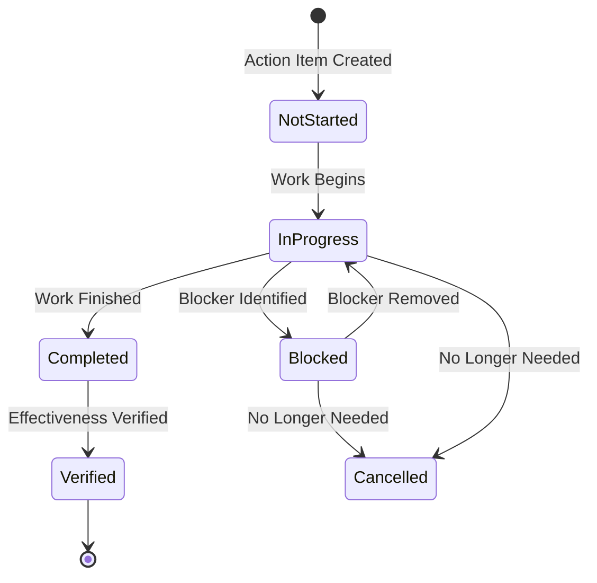

**Dashboard Design:**

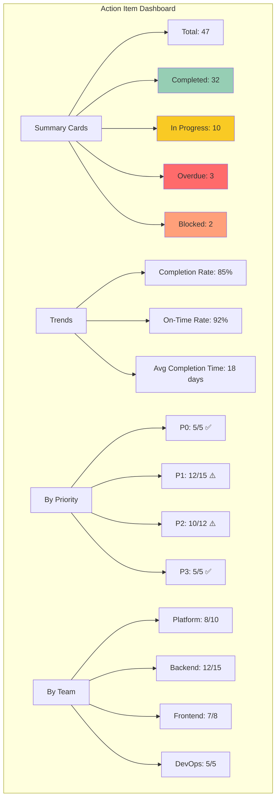

**Integration Points:**
- Incident management platform (PagerDuty, OpsGenie)
- Project management (Jira, Linear, Asana)
- Communication (Slack, MS Teams)
- Documentation (Confluence, Notion)
- CI/CD (GitHub Actions, GitLab CI)

---

## Part 7: Knowledge Reinforcement

### Question Bank

#### Multiple Choice Questions

**1. What is the primary goal of a blameless postmortem?**
- A) To identify who caused the incident
- B) To satisfy compliance requirements
- C) To understand systemic factors and learn
- D) To assign disciplinary action
- E) To document what happened

**Answer: C** - The primary goal is to understand systemic factors and learn, not to assign blame.

**2. Which of the following is NOT a characteristic of traditional RCA?**
- A) Focuses on single root cause
- B) Emphasizes systemic improvements
- C) Often leads to blame assignment
- D) Satisfies compliance requirements
- E) Rarely produces meaningful reliability improvements

**Answer: B** - Traditional RCA does NOT emphasize systemic improvements; that's a characteristic of blameless postmortems.

**3. What is the "Swiss Cheese Model" in incident management?**
- A) A method for documenting incidents
- B) A theory that incidents occur when multiple layers of defense fail
- C) A tool for timeline analysis
- D) A blame avoidance technique
- E) A compliance framework

**Answer: B** - The Swiss Cheese Model explains that incidents occur when multiple layers of defense have gaps that align.

**4. During an incident, decision-making is affected by:**
- A) Complete information and unlimited time
- B) Incomplete information, high time pressure, and elevated stress
- C) Perfect monitoring and clear signals
- D) No customer impact
- E) Team consensus on every decision

**Answer: B** - During incidents, decisions are made with incomplete information, high time pressure, and elevated stress.

**5. What is the recommended target for Time to Detect (TTD)?**
- A) 1 hour
- B) 30 minutes
- C) 15 minutes
- D) 5 minutes
- E) 1 minute

**Answer: D** - The recommended target for TTD is less than 5 minutes.

**6. Which cognitive bias involves searching for evidence that confirms pre-existing beliefs?**
- A) Hindsight bias
- B) Confirmation bias
- C) Fundamental attribution error
- D) Availability heuristic
- E) Sunk cost fallacy

**Answer: B** - Confirmation bias is the tendency to search for evidence that confirms pre-existing beliefs.

**7. What is a key limitation of the Five Whys technique in cloud-native environments?**
- A) It's too simple
- B) It assumes linear causality, but incidents often have multiple parallel factors
- C) It takes too long
- D) It requires special training
- E) It's not widely accepted

**Answer: B** - Five Whys assumes linear causality, but cloud-native incidents often have multiple parallel contributing factors.

**8. What percentage of postmortems should result in action items?**
- A) 50%
- B) 75%
- C) 90%
- D) 100%
- E) Only for SEV1 incidents

**Answer: D** - 100% of significant postmortems should result in action items. A postmortem without action items is merely documentation.

**9. What is the recommended target for action item completion rate?**
- A) 50%
- B) 60%
- C) 70%
- D) 80%
- E) 100%

**Answer: D** - The recommended target is >80% action item completion rate.

**10. AI-assisted postmortems should:**
- A) Replace human investigators entirely
- B) Augment human investigation, not replace it
- C) Only be used for SEV1 incidents
- D) Be used only for timeline generation
- E) Be avoided due to inaccuracy

**Answer: B** - AI should augment human investigation, not replace it. Humans are still needed for context, judgment, and nuance.

#### Scenario-Based Questions

**11. Scenario:** During a postmortem, an engineer says, "If only the on-call had read the runbook, this wouldn't have happened." How should the facilitator respond?

**A)** Agree and note that the on-call should have read the runbook
**B)** Gently redirect: "Let's explore why the runbook wasn't helpful or accessible"
**C)** Ask the on-call why they didn't read the runbook
**D)** Move on to the next topic
**E)** Document that the on-call made an error

**Answer: B** - The facilitator should redirect to systemic factors: "Let's explore why the runbook wasn't helpful or accessible" rather than blaming the individual.

**12. Scenario:** Your team has completed 20 postmortems in the past quarter, but the repeat incident rate is 15% (target: <5%). What's the most likely issue?

**A)** Postmortems are too detailed
**B)** Action items are not being completed or tracked effectively
**C)** Too many incidents are occurring
**D)** The team needs more training
**E)** The incidents are too complex

**Answer: B** - A high repeat incident rate despite many postmortems suggests action items are not being completed or tracked effectively.

**13. Scenario:** A postmortem reveals that an engineer made a decision during the incident that, in hindsight, was suboptimal. What's the blameless approach?

**A)** Document the poor decision in their performance review
**B)** Discuss what information was available at the time and why the decision seemed reasonable
**C)** Ignore the decision to avoid blame
**D)** Require the engineer to write a corrective action plan
**E)** Reassign the engineer to a different team

**Answer: B** - The blameless approach is to discuss what information was available at the time and why the decision seemed reasonable, focusing on learning.

**14. Scenario:** Leadership asks you to cut postmortem time from 2 hours to 30 minutes to "be more efficient." What do you do?

**A)** Agree and rush through postmortems
**B)** Explain that quality postmortems require adequate time and propose alternatives
**C)** Skip postmortems for minor incidents
**D)** Conduct postmortems asynchronously only
**E)** Outsource postmortems to a third party

**Answer: B** - Explain that quality postmortems require adequate time and propose alternatives like better preparation, focused agendas, or async pre-work.

**15. Scenario:** You notice that 60% of your action items are overdue. What's the first step?

**A)** Cancel all overdue action items
**B)** Escalate all overdue items to senior leadership
**C)** Investigate why action items are overdue and adjust processes
**D)** Double the deadlines for future action items
**E)** Stop creating action items

**Answer: C** - Investigate why action items are overdue (unrealistic deadlines, lack of ownership, insufficient resources) and adjust processes accordingly.

#### Essay/Analysis Questions

**16. Explain the difference between "blameless" and "accountability." Why is this distinction important?**

**Sample Answer:**
Blameless means recognizing that engineers make decisions based on the information available to them at the time, focusing on systemic factors rather than individual blame. Accountability means being responsible for completing assigned action items and following processes. The distinction is important because:
- Blameless culture encourages open information sharing and learning
- Accountability ensures improvements are actually implemented
- Without blameless culture, people hide mistakes and information
- Without accountability, postmortems become talk shops with no action
- Both are necessary: blameless for investigation, accountable for follow-through

**17. Why do modern cloud-native incidents rarely have a single root cause? Provide examples.**

**Sample Answer:**
Modern cloud-native incidents rarely have a single root cause because:
1. **Complexity:** Systems have thousands of interacting components (microservices, databases, service meshes, etc.)
2. **Multiple Layers:** Incidents occur when multiple layers of defense fail simultaneously (Swiss Cheese Model)
3. **Parallel Factors:** Technical, process, and organizational factors often contribute together
4. **Emergent Behavior:** Complex systems exhibit behaviors not predictable from individual components

Example: A checkout outage might involve:
- Technical: Database connection pool exhaustion, missing circuit breaker
- Process: No performance testing, manual rollback process
- Organizational: Understaffed on-call, time pressure to ship

**18. Describe how you would facilitate a postmortem meeting where participants are defensive and blame-oriented.**

**Sample Answer:**
To facilitate a postmortem with defensive participants:
1. **Set ground rules upfront:** "We're here to learn, not to blame. Focus on systems, not individuals."
2. **Model the behavior:** Use neutral language yourself ("the system allowed" not "someone did")
3. **Redirect blame comments:** Gently reframe "If only they had..." to "What conditions allowed this to happen?"
4. **Use data, not opinions:** Focus on timeline evidence and facts
5. **Start with positives:** "What went well?" to build psychological safety
6. **Private conversations:** Speak with defensive participants privately to understand concerns
7. **Leadership presence:** Have leaders model blameless behavior
8. **Follow-up:** Address concerns after the meeting, reinforce blameless principles

**19. How would you measure the success of your organization's postmortem practice?**

**Sample Answer:**
I would measure success using multiple dimensions:

**Operational Metrics:**
- MTTD reduction (target: <5 minutes)
- MTTR reduction (target: <15 minutes)
- Repeat incident rate (target: <5%)
- Automated recovery rate (target: >50%)

**Process Metrics:**
- Postmortem completion rate (target: 100% for SEV1/SEV2)
- Action item completion rate (target: >80%)
- Action item on-time rate (target: >90%)
- Time to postmortem (target: <7 days)

**Culture Metrics:**
- Information sharing score (survey, target: >4/5)
- Team satisfaction with postmortems
- Willingness to report incidents
- Knowledge base growth

**Business Metrics:**
- Customer impact reduction
- Revenue protection
- Engineering velocity improvement
- Team retention

**Leading Indicators:**
- Quality of action items (specific, measurable)
- Participation in postmortems
- Cross-team learning sharing

#### Interview-Style Questions

**20. "Tell me about a time you learned the most from an incident."**

**What to look for:**
- Specific incident example
- What they learned (technical, process, or organizational)
- How they applied the learning
- Impact of the learning
- Blameless language ("we" not "they")

**21. "How do you handle a situation where a team member is resistant to blameless postmortems?"**

**What to look for:**
- Understanding of resistance (fear, past experience, misunderstanding)
- Coaching and education approach
- Leadership involvement
- Incremental change strategy
- Measuring progress

**22. "What's the difference between a good postmortem and a great postmortem?"**

**What to look for:**
- Good: Accurate timeline, contributing factors, action items
- Great: Systemic insights, cultural impact, measurable improvements, knowledge sharing, prevention of multiple future incidents

**23. "How do you ensure action items from postmortems are actually completed?"**

**What to look for:**
- Clear ownership and deadlines
- Regular review cadence
- Integration with team workflows
- Leadership accountability
- Tracking and reporting
- Celebrating completion

**24. "Describe how you would introduce blameless postmortems to a team with a strong blame culture."**

**What to look for:**
- Start with leadership buy-in
- Education and training
- Start small (pilot projects)
- Lead by example
- Celebrate early wins
- Address concerns openly
- Gradual culture change
- Measure and communicate progress

### Self-Assessment Checklist

Use this checklist to assess your understanding of blameless postmortems:

#### Knowledge Assessment

- [ ] I can explain why traditional RCA fails in cloud-native environments
- [ ] I understand the difference between blameless and blame-oriented cultures
- [ ] I can identify contributing factors across technical, process, and organizational dimensions
- [ ] I know how to construct a detailed incident timeline
- [ ] I understand the limitations of the Five Whys technique
- [ ] I can explain the Swiss Cheese Model of system failures
- [ ] I know how to measure postmortem effectiveness
- [ ] I understand cognitive biases that affect incident investigation
- [ ] I can distinguish between blameless and just culture
- [ ] I know how to facilitate a blameless postmortem meeting

#### Skill Assessment

- [ ] I can facilitate a postmortem meeting without blame-oriented language
- [ ] I can build a detailed timeline from incident data
- [ ] I can identify at least 10 contributing factors for a complex incident
- [ ] I can create specific, measurable action items
- [ ] I can track action items to completion
- [ ] I can measure postmortem effectiveness using KPIs
- [ ] I can coach others on blameless principles
- [ ] I can handle defensive or blame-oriented participants
- [ ] I can write a comprehensive postmortem document
- [ ] I can present postmortem findings to leadership

#### Application Assessment

- [ ] I have conducted at least 3 postmortems
- [ ] I have created a postmortem template
- [ ] I have trained others on blameless postmortems
- [ ] I have implemented improvements based on postmortem findings
- [ ] I have measured the impact of postmortem action items
- [ ] I have shared postmortem learnings across teams
- [ ] I have improved postmortem processes based on feedback
- [ ] I have successfully scaled postmortem practices
- [ ] I have built a culture of learning in my team
- [ ] I have prevented repeat incidents through postmortem action items

**Scoring:**
- 35-40 checked: Expert level
- 25-34 checked: Proficient
- 15-24 checked: Competent
- 5-14 checked: Developing
- < 5 checked: Beginner

### Quick Recap

#### Key Takeaways from Each Section

**Part 1: Foundation & Context**
- Production incidents are inevitable; learning from them is optional
- Traditional RCA fails because it seeks single root causes in complex systems
- The cost of poor incident learning is measured in millions and team morale
- Blameless postmortems focus on systemic improvement, not individual blame

**Part 2: Core Concepts**
- Modern incidents have multiple contributing factors (technical, process, organizational)
- The Swiss Cheese Model explains how incidents occur when multiple defenses fail
- Blameless means recognizing decisions were reasonable given the information at the time
- Cognitive biases (hindsight, confirmation, fundamental attribution) hinder effective investigation
- Just culture balances accountability with learning

**Part 3: Postmortem Framework**
- A complete postmortem includes: summary, timeline, contributing factors, response assessment, action items
- The timeline is the most critical component - document everything with precise timestamps
- Contributing factors analysis should cover technical, process, and organizational dimensions
- Recovery assessment often reveals more improvement opportunities than the incident itself
- Action items must be specific, measurable, assigned, and tracked

**Part 4: Implementation & Tools**
- Five Whys is useful but limited - use it as one tool among many
- AI can augment but not replace human investigation
- Action items without tracking are forgotten - implement robust tracking systems
- Measure effectiveness using operational, process, and learning metrics
- Continuous improvement requires closing the learning loop

**Part 5: Organizational Transformation**
- Blameless culture requires leadership commitment and modeling
- Training and onboarding are essential for scaling
- Common pitfalls include lip service, perfectionism, and compliance checkbox approaches
- Scaling requires standardization, community, tooling, and dedicated roles

### Pro Tips for Advanced Practitioners

#### Pro Tip 1: The Pre-Mortem Technique

Before incidents occur, conduct "pre-mortems" to identify potential failure modes:

**Process:**
1. Imagine it's 6 months in the future and your project failed
2. Write the postmortem for that future failure
3. Identify contributing factors
4. Create action items to prevent those failures

**Benefit:** Proactively identify and mitigate risks before they cause incidents.

#### Pro Tip 2: The Blameless Postmortem Retrospective

After conducting a postmortem, conduct a "post-postmortem" to improve your process:

**Questions:**
- Did we achieve our learning objectives?
- Were participants comfortable and open?
- Did we identify all contributing factors?
- Were action items specific and actionable?
- What would we do differently next time?

#### Pro Tip 3: Cross-Team Learning

Don't keep postmortems siloed:

- Share postmortems across teams (with sensitive info redacted)
- Look for patterns across incidents
- Create organization-wide learning from individual incidents
- Build a shared knowledge base

#### Pro Tip 4: The 24-Hour Rule

Document initial findings within 24 hours while information is fresh:

- Initial timeline
- Initial contributing factors
- Preliminary action items
- Then refine over the next few days

#### Pro Tip 5: Measure What Matters

Don't just measure postmortem completion - measure improvement:

- Track if action items prevent repeat incidents
- Measure MTTR improvement over time
- Survey team satisfaction with postmortems
- Track knowledge sharing and collaboration

---

## Part 8: Resources & Next Steps

### Curated Reading List

#### Books
1. **Site Reliability Engineering** (Google) - Chapters 13-16
   - The definitive guide to SRE practices
   - Comprehensive postmortem case studies

2. **The Phoenix Project** (Gene Kim)
   - Novel format explaining DevOps principles
   - Great for building organizational understanding

3. **Accelerate** (Nicole Forsgren, Jez Humble, Gene Kim)
   - Research-backed practices for high-performing teams
   - Includes incident management metrics

4. **The Field Guide to Understanding Human Error** (Sidney Dekker)
   - Deep dive into the psychology of errors
   - Essential for understanding blameless culture

5. **Just Culture** (Sidney Dekker)
   - Balancing accountability and learning
   - Legal and ethical considerations

#### Articles and Papers
1. [Blameless Postmortems and a Just Culture](https://codeascraft.com/2012/05/22/blameless-postmortems/) - Etsy
2. [The Infinite Hows](https://www.adaptivecapacitylabs.com/2017/01/18/the-infinite-hows/) - On the limitations of Five Whys
3. [Postmortem Culture: How You Can Learn from Failure](https://www.infoq.com/articles/postmortem-culture/) - InfoQ
4. [Google's Postmortem Culture](https://rework.withgoogle.com/print/guides/572138265554113024123158795068791401001/) - Google re:Work

#### Online Resources
1. [Google SRE Book](https://sre.google/sre-book/managing-incidents/)
2. [PagerDuty Incident Management](https://postmortems.pagerduty.com/)
3. [FireHydrant Postmortem Guide](https://firehydrant.com/blog)
4. [Incident Management at Netflix](https://netflixtechblog.com/tagged/incident-management)

### Industry Frameworks and Standards

#### ITIL (Information Technology Infrastructure Library)
- Incident Management process
- Problem Management process
- Change Management process

#### NIST (National Institute of Standards and Technology)
- NIST SP 800-61: Computer Security Incident Handling Guide
- Risk management frameworks

#### ISO Standards
- ISO 22301: Business continuity management
- ISO 31000: Risk management
- ISO 9001: Quality management

### Tools and Platforms

#### Incident Management Platforms
| Tool | Best For | Key Features | Pricing |
|------|----------|--------------|--------|
| **PagerDuty** | Enterprise | On-call, incident response, analytics | $21+/user/month |
| **OpsGenie** | Mid to Enterprise | On-call, alerting, postmortems | $9+/user/month |
| **FireHydrant** | SRE teams | Incident management, postmortems, status pages | Custom |
| **Squadcast** | Mid-size teams | Incident response, on-call, automation | $16+/user/month |
| **Statuspage** | Customer communication | Status pages, incident updates | $29+/month |

#### Postmortem-Specific Tools
| Tool | Purpose | Key Features |
|------|---------|--------------|
| **Notion** | Documentation | Templates, collaboration, databases |
| **Confluence** | Documentation | Enterprise wiki, templates |
| **Jira** | Action item tracking | Project management, workflows |
| **Linear** | Action item tracking | Modern, fast, developer-friendly |
| **Slack** | Communication | Incident channels, integrations |

#### Monitoring and Observability
| Tool | Purpose | Key Features |
|------|---------|--------------|
| **Datadog** | Monitoring | Metrics, logs, traces, alerts |
| **New Relic** | Observability | APM, infrastructure, logs |
| **Grafana** | Visualization | Dashboards, metrics, alerting |
| **Prometheus** | Metrics | Time-series data, alerting |
| **ELK Stack** | Logging | Elasticsearch, Logstash, Kibana |

### Community Resources

#### Communities
- [SRE Weekly](https://sreweekly.com/) - Weekly SRE newsletter
- [r/SRE](https://reddit.com/r/sre) - Reddit SRE community
- [SREcon](https://www.usenix.org/srecon) - SRE conferences
- [DevOps Enterprise Summit](https://events.itrevolution.com/) - Enterprise DevOps

#### Forums and Discussion
- [Hacker News](https://news.ycombinator.com/) - Tech discussions
- [Stack Overflow](https://stackoverflow.com/) - Q&A
- [LinkedIn Groups](https://www.linkedin.com/groups/) - Professional networks

#### Open Source
- [PagerDuty Community](https://community.pagerduty.com/)
- [Open Source SRE Tools](https://github.com/topics/sre)
- [Incident Management Templates](https://github.com/search?q=postmortem+template)

### Learning Path Recommendations

#### Beginner Path (0-6 months)
1. Complete this tutorial
2. Shadow 5-10 postmortem meetings
3. Read "The Phoenix Project"
4. Complete basic incident management training
5. Participate in 2-3 postmortems as a note-taker

#### Intermediate Path (6-18 months)
1. Facilitate 10+ postmortems
2. Read "Site Reliability Engineering" (Google)
3. Complete advanced facilitation training
4. Create postmortem templates for your team
5. Implement action item tracking system
6. Measure and improve postmortem effectiveness

#### Advanced Path (18+ months)
1. Lead organizational postmortem transformation
2. Train others on blameless postmortems
3. Speak at conferences or meetups
4. Publish postmortem case studies
5. Develop custom postmortem tooling
6. Build a community of practice

### Next Steps

#### Immediate Actions (This Week)
- [ ] Review your organization's current postmortem process
- [ ] Identify one incident to re-analyze using blameless principles
- [ ] Share this tutorial with your team
- [ ] Schedule a postmortem training session

#### Short-Term Actions (This Month)
- [ ] Create or update postmortem templates
- [ ] Implement action item tracking system
- [ ] Conduct a blameless postmortem pilot
- [ ] Measure current postmortem effectiveness
- [ ] Identify quick wins from past incidents

#### Long-Term Actions (This Quarter)
- [ ] Roll out blameless postmortem training
- [ ] Establish postmortem quality standards
- [ ] Build a community of practice
- [ ] Implement AI-assisted postmortem tooling
- [ ] Measure and report improvement metrics
- [ ] Scale practices across teams

---

## Summary & Key Takeaways

### The Mindset Shift

**From:** "Who caused this incident?"
**To:** "What can we learn from this incident, and how can we make the system stronger?"

### Core Principles

1. **Incidents are inevitable, learning is optional**
   - Focus on what you can control: how you respond and what you learn

2. **Modern incidents have multiple contributing factors**
   - Don't search for a single root cause
   - Analyze technical, process, and organizational factors

3. **Blameless ≠ no accountability**
   - Blameless for investigation (focus on systems)
   - Accountable for action items (follow-through)

4. **The timeline is sacred**
   - Document everything with precise timestamps
   - It's the foundation for all analysis

5. **Action items without tracking are forgotten**
   - Specific, measurable, assigned, tracked
   - Measure completion rates and impact

6. **Measure improvement, not activity**
   - MTTD, MTTR, repeat incident rate
   - Not just postmortem completion count

7. **Culture eats strategy for breakfast**
   - Leadership must model blameless behavior
   - Psychological safety is essential
   - Incentives must align with learning

8. **AI augments, not replaces**
   - Use AI for data gathering and pattern detection
   - Humans provide context, judgment, and nuance

### The Ultimate Goal

The most valuable outcome of an incident is not service restoration. **It is learning.**

Organizations that focus solely on identifying who made a mistake often repeat the same failures. Organizations that focus on understanding how their systems allowed failures to occur continuously improve their resilience.

Blameless postmortems transform incident management from a reactive operational function into a **strategic capability** that improves reliability, resilience, and engineering excellence over time.

### Final Thought

> "The question is not whether incidents will occur, but whether your organization has the culture, processes, and tools to learn from them and build stronger systems."

---

## Postmortem Template Repository

### Complete Postmortem Template

```markdown
# Postmortem: [Incident Title]

**Document Information**
- **Incident ID:** [INC-XXXX]
- **Date:** [YYYY-MM-DD]
- **Severity:** [SEV1/SEV2/SEV3/SEV4]
- **Duration:** [X hours Y minutes]
- **Postmortem Author:** [Name]
- **Postmortem Date:** [YYYY-MM-DD]
- **Status:** [Draft/In Review/Complete]

---

## Executive Summary

[One-paragraph overview of the incident, impact, and key findings]

**Key Findings:**
- [Finding 1]
- [Finding 2]
- [Finding 3]

**Top Action Items:**
1. [Action item 1] - Owner: [Name] - Deadline: [Date]
2. [Action item 2] - Owner: [Name] - Deadline: [Date]
3. [Action item 3] - Owner: [Name] - Deadline: [Date]

---

## Incident Overview

**Systems Affected:**
- [System 1]
- [System 2]

**Customer Impact:**
- [Number] users affected
- [Description of impact]
- Estimated revenue impact: $[amount]

**Detection Method:**
- [Automated alert/Customer report/Internal discovery]

**Severity Justification:**
[Why this severity level was assigned]

---

## Detailed Timeline

| Time (UTC) | Event | Source | Impact |
|------------|-------|--------|--------|
| [HH:MM] | [Event description] | [Source] | [Impact] |
| [HH:MM] | [Event description] | [Source] | [Impact] |
| [HH:MM] | [Event description] | [Source] | [Impact] |

---

## Contributing Factors Analysis

### Technical Factors

| Factor | Evidence | Impact | Action Item | Owner | Priority |
|--------|----------|--------|-------------|-------|----------|
| [Factor] | [Evidence] | [High/Med/Low] | [Action] | [Name] | [P0-P3] |

### Process Factors

| Factor | Evidence | Impact | Action Item | Owner | Priority |
|--------|----------|--------|-------------|-------|----------|
| [Factor] | [Evidence] | [High/Med/Low] | [Action] | [Name] | [P0-P3] |

### Organizational Factors

| Factor | Evidence | Impact | Action Item | Owner | Priority |
|--------|----------|--------|-------------|-------|----------|
| [Factor] | [Evidence] | [High/Med/Low] | [Action] | [Name] | [P0-P3] |

---

## Response Assessment

### Detection Effectiveness
- **Time to Detect:** [X minutes]
- **Alert Quality:** [Good/Fair/Poor]
- **Coverage:** [Complete/Partial/Missing]

### Response Effectiveness
- **Time to Acknowledge:** [X minutes]
- **Time to Identify Cause:** [X minutes]
- **Tooling Effectiveness:** [Good/Fair/Poor]

### Recovery Effectiveness
- **Time to Recover:** [X minutes]
- **Recovery Method:** [Automated/Manual]
- **Could Have Been Faster:** [Yes/No - explanation]

### Communication Effectiveness
- **Internal Communication:** [Good/Fair/Poor]
- **Customer Communication:** [Good/Fair/Poor]
- **Stakeholder Communication:** [Good/Fair/Poor]

---

## Action Items

| # | Action Item | Owner | Team | Priority | Deadline | Status | Success Metric |
|---|-------------|-------|------|----------|----------|--------|----------------|
| 1 | [Action] | [Name] | [Team] | [P0-P3] | [Date] | [Status] | [Metric] |
| 2 | [Action] | [Name] | [Team] | [P0-P3] | [Date] | [Status] | [Metric] |

---

## Lessons Learned

### What Went Well
- [Success 1]
- [Success 2]

### What Could Be Improved
- [Improvement 1]
- [Improvement 2]

### Knowledge to Share
- [Learning 1]
- [Learning 2]

---

## Appendices

### Appendix A: Supporting Data
[Charts, graphs, metrics]

### Appendix B: Communication Logs
[Slack conversations, email threads]

### Appendix C: Related Incidents
[Links to related postmortems]

### Appendix D: References
[Links to documentation, runbooks, etc.]

---

**Postmortem Attendees:**
- [Name 1]
- [Name 2]
- [Name 3]

**Reviewers:**
- [Name 1] - [Date]
- [Name 2] - [Date]

**Approval:**
- [Name] - [Date]
```

---

## 📊 Metrics Summary

| Category | Metric | Target | Your Current |
|----------|--------|--------|--------------|
| **Operational** | MTTD | < 5 min | ___ |
| | MTTR | < 15 min | ___ |
| | Repeat Rate | < 5% | ___ |
| **Process** | Completion Rate | 100% | ___ |
| | Action Item Rate | > 80% | ___ |
| | On-Time Rate | > 90% | ___ |
| **Learning** | Info Sharing | > 4/5 | ___ |
| | Runbook Growth | +10%/qtr | ___ |
| | Training | 100% | ___ |

---

## 🎯 Your Action Plan

Based on this tutorial, identify 3 actions you'll take in the next 30 days:

1. **Action 1:** [Your action here]
   - **Deadline:** [Date]
   - **Success Metric:** [How you'll measure success]

2. **Action 2:** [Your action here]
   - **Deadline:** [Date]
   - **Success Metric:** [How you'll measure success]

3. **Action 3:** [Your action here]
   - **Deadline:** [Date]
   - **Success Metric:** [How you'll measure success]

---

## 📝 Final Self-Assessment

Rate your confidence (1-5) in each area:

| Area | Before Tutorial | After Tutorial | Gap |
|------|----------------|----------------|-----|
| Understanding blameless principles | ___ | ___ | ___ |
| Conducting postmortems | ___ | ___ | ___ |
| Identifying contributing factors | ___ | ___ | ___ |
| Creating action items | ___ | ___ | ___ |
| Measuring effectiveness | ___ | ___ | ___ |
| Building blameless culture | ___ | ___ | ___ |

**Next Steps:** Focus on areas with the largest gaps. Start with hands-on practice exercises.

---

**Congratulations!** You've completed this comprehensive deep dive into building effective blameless postmortems for cloud-native systems. You now have the knowledge, tools, and frameworks to transform incident management in your organization.

**Remember:** The goal is not perfect postmortems. The goal is continuous learning and improvement. Start where you are, use what you have, and improve every day.

**Happy learning! 🚀**

---

*Last Updated: July 3, 2026*
*Version: 1.0*
*Author: Enhanced from DZone article with comprehensive deep dive additions*