# The Critical Thinking Framework: A 5-Step Ninja Technique for Better Decision Making


---

## Table of Contents

1. [Introduction](#introduction)
2. [Prerequisites](#prerequisites)
3. [Learning Objectives](#learning-objectives)
4. [Why Critical Thinking Matters](#why-critical-thinking-matters)
5. [The 5-Step Framework](#the-5-step-framework)
   - [Step 1: Get Absolute Clarity on What's Being Proposed](#step-1-get-absolute-clarity-on-whats-being-proposed)
   - [Step 2: Find the Real Problem (Not Just the Symptoms)](#step-2-find-the-real-problem-not-just-the-symptoms)
   - [Step 3: Ask "So What?" Until It Actually Matters](#step-3-ask-so-what-until-it-actually-matters)
   - [Step 4: Does This Actually Solve the Problem?](#step-4-does-this-actually-solve-the-problem)
   - [Step 5: Challenge Your Own Thinking](#step-5-challenge-your-own-thinking)
6. [Complete Workflow Diagram](#complete-workflow-diagram)
7. [Real-World Technical Scenarios](#real-world-technical-scenarios)
8. [Best Practices](#best-practices)
9. [Anti-Patterns to Avoid](#anti-patterns-to-avoid)
10. [Practice Exercises](#practice-exercises)
11. [Question Bank](#question-bank)
12. [Summary & Key Takeaways](#summary--key-takeaways)
13. [Further Reading & Resources](#further-reading--resources)

---

## Introduction

Let's be honest for a second.

There are moments when something sounds right, and without thinking much, we just nod and agree. No questions. No deeper thought. Just "yeah, makes sense."

And later? You realize you missed something obvious. Or worse—someone else points it out.

> 💡 **The Reality Check**: Studies show that professionals spend up to 30% of their time fixing problems that could have been prevented with better initial analysis. Critical thinking isn't about being smart—it's about being intentional with your thinking.

I've been there more times than I'd like to admit. And every time it happens, I feel the same thing: "Why didn't I think about this earlier?"

The truth is **critical thinking isn't something we naturally do all the time**. It's a skill. And like any skill, it can be trained.

Over time, I developed my own small "ninja technique" that helps me slow down, question things, and actually think before I agree. Not perfectly. Not always. But much better than before.

Today, I want to share that with you.

To keep things simple and practical, I'll walk you through how I use this technique in a real scenario: **when a coworker proposes something like adding rate limiting to a service**. But honestly, once you understand it, you can use this way of thinking anywhere—work, decisions, even daily life.

---

## Prerequisites

Before diving into this tutorial, ensure you have:

- ✅ **Open Mindset**: Willingness to question assumptions (including your own)
- ✅ **Basic Technical Literacy**: Understanding of software systems and common technical problems
- ✅ **Curiosity**: Desire to understand "why" behind solutions
- ✅ **Patience**: Willingness to slow down and think deeply
- ✅ **No Special Tools Required**: This is a mental framework you can apply immediately

> ⚠️ **Note**: This framework works best when you're not under extreme time pressure. For urgent situations, adapt the steps to be faster while maintaining the core principles.

---

## Learning Objectives

By the end of this tutorial, you will be able to:

- 🎯 Master the 5-step critical thinking framework
- 🎯 Apply the framework to technical decisions and proposals
- 🎯 Distinguish between root causes and symptoms
- 🎯 Evaluate solutions critically, considering trade-offs
- 🎯 Identify and challenge your own cognitive biases
- 🎯 Make better-informed decisions with confidence
- 🎯 Communicate your reasoning more effectively to teams

---

## Why Critical Thinking Matters

### The Cost of Poor Thinking

In the tech industry, the stakes are high:

| Scenario | Cost of Poor Decision | Benefit of Critical Thinking |
|----------|----------------------|----------------------------|
| **Architecture Decisions** | $500K+ in rework, 6+ months delay | Avoid costly refactoring |
| **Performance Issues** | 40% revenue loss during peak | Proactive optimization |
| **Security Vulnerabilities** | Data breaches, reputation damage | Identify risks early |
| **Feature Development** | Building wrong features | Build what matters |
| **Technology Choices** | Technical debt accumulation | Sustainable solutions |

### The Cognitive Biases We Face

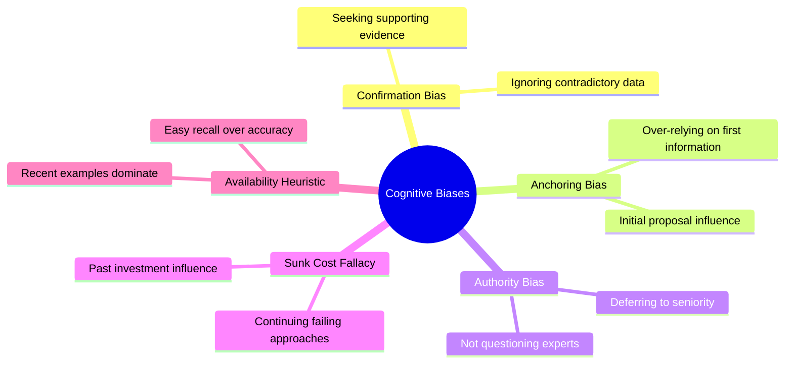

### Why Most People Skip Critical Thinking

1. **Time Pressure**: "We need to decide NOW"
2. **Social Pressure**: Not wanting to seem difficult
3. **Cognitive Load**: Mental exhaustion from information overload
4. **Overconfidence**: Trusting initial instincts
5. **Lack of Framework**: Not having a structured approach

> 💡 **Key Insight**: Critical thinking isn't about being negative or skeptical—it's about being thorough and intentional. The goal is to make better decisions, not to reject ideas.

---

## The 5-Step Framework

Let's dive into each step of the framework with detailed explanations, examples, and practical applications.

### Step 1: Get Absolute Clarity on What's Being Proposed

#### The Problem: Vague Proposals

Before you analyze anything, make sure you actually understand it. Sounds obvious, right? But most of the time, we don't.

We hear something that sounds smart and move on without really breaking it down.

#### The Solution: Deconstruct the Proposal

Here's what I do:

**1. Simplify to One Line (The "Elevator Pitch")**

What's the simplest version of this proposal? If you can't explain it in one sentence, you don't understand it well enough.

**2. Go One Level Deeper**

Can I explain it using a real example? If I can't, I probably don't understand it well enough yet.

#### Real Example: Rate Limiting Proposal

❌ **Too Vague:**
> "We're adding rate limiting to protect the service."

This sounds fine at first glance, but it's too vague to think critically about.

✅ **Clear and Actionable:**
> "The service gets overloaded (CPU/memory/other metrics) by a few clients, affecting others. We propose adding rate limiting to address this."

See the difference? The second version tells you:
- **What's happening**: Service overload
- **Who's affected**: Other clients
- **What metrics**: CPU/memory
- **Proposed solution**: Rate limiting

#### Practical Exercise: The Clarity Test

```markdown
When you hear a proposal, ask yourself:

1. Can I state the problem in one sentence?
2. Can I give a concrete example?
3. Do I know who/what is affected?
4. Do I understand the current state vs. desired state?
5. Can I explain this to a non-technical person?

If you answered "no" to any of these, go back and get clarity before proceeding.
```

#### Common Mistakes at This Stage

| Mistake | Why It's Problematic | Solution |
|---------|---------------------|----------|
| Assuming you understand | Miss key details | Ask clarifying questions |
| Accepting jargon | Vague understanding | Request plain language explanation |
| Skipping examples | Abstract thinking | Demand concrete scenarios |
| Moving too fast | Superficial analysis | Slow down, take notes |

> ⚠️ **Warning**: Never skip this step. A misunderstood problem leads to a misunderstood solution. Time spent here saves hours later.

#### Pro Tips for Clarity

- **Ask "What does that mean?"** multiple times until you get a concrete answer
- **Request metrics and data** instead of opinions
- **Ask for a demo or example** of the current problem
- **Write down your understanding** and have the proposer confirm it

---

### Step 2: Find the Real Problem (Not Just the Symptoms)

#### The Problem: Accepting Surface-Level Issues

Once you understand what's being proposed, don't stop there. Most of the time, what you're seeing is just the surface problem.

It's very easy to hear something like "The service is getting overloaded" and immediately accept it as the real issue.

But here's the thing: **Overload is not always the problem. Sometimes, it's just a symptom.**

#### The Solution: Root Cause Analysis

This is where critical thinking actually begins. Instead of accepting the problem as it is, start asking better questions.

#### The Validation Framework

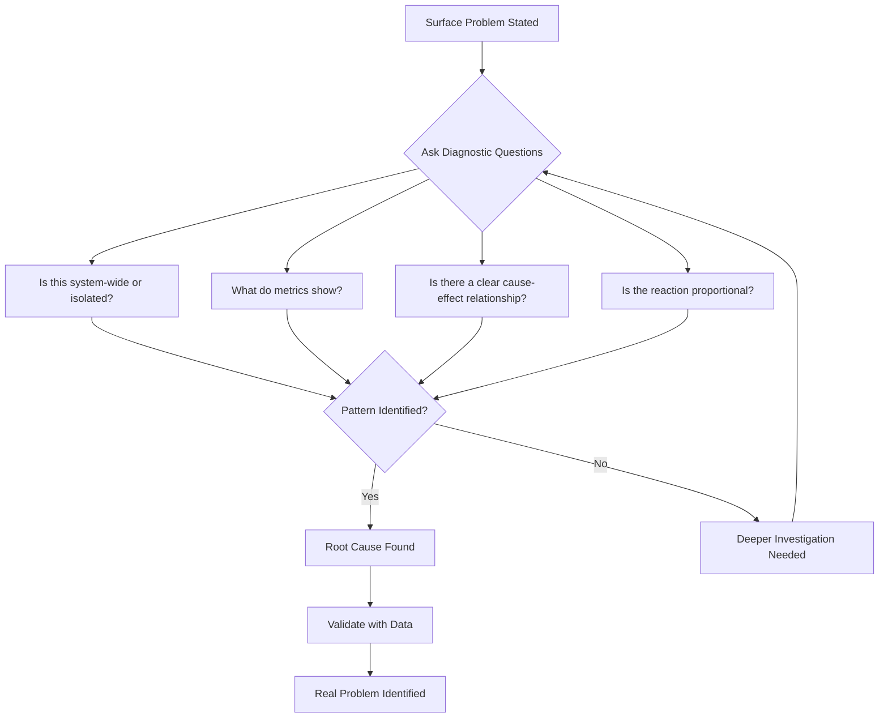

#### Diagnostic Questions to Ask

**Scope Questions:**
- Is this happening across the entire system or just a specific part?
- Which users/clients are affected?
- When did this start happening?

**Data Questions:**
- What do the metrics actually show?
- Can I see the raw data, not just summaries?
- What's the baseline behavior?

**Causation Questions:**
- Is there a clear connection between increased traffic and the overload?
- Or is the system reacting disproportionately to a small change?
- What happens if we isolate this component?

#### Real Scenario: The Rate Limiting Example

**Initial Presentation:**
> "The service is getting overloaded. We need rate limiting."

**Surface Analysis:**
- Problem: Service overload
- Proposed solution: Rate limiting
- Assumption: General overload issue

**Deeper Investigation:**

After asking the right questions, you discover:

1. **The problem only occurs for a subset of users** (not everyone)
2. **It only happens when they use a specific feature** (not all features)
3. **The metrics show a spike in database queries** (not general CPU/memory)

**New Understanding:**
- ❌ Not a system-wide problem
- ✅ Feature-specific bottleneck
- ✅ Database query issue

**Better Conclusion:**
Instead of blindly adding rate limiting, maybe we should optimize that feature first.

#### Root Cause vs. Symptom Comparison

| Aspect | Symptom | Root Cause |
|--------|---------|------------|
| **Definition** | Observable effect | Underlying reason |
| **Example** | "Service is slow" | "N+1 query in user dashboard" |
| **Solution Approach** | Band-aid fixes | Permanent resolution |
| **Impact** | Temporary relief | Long-term fix |
| **Investigation Depth** | Surface level | Deep analysis required |

#### Code Example: Identifying the Real Problem

```python
# ❌ SYMPTOM: Service is slow
# Initial reaction: Add caching everywhere

# ✅ ROOT CAUSE ANALYSIS: Let's investigate

# Step 1: Profile the actual bottleneck
import time
import logging

def analyze_endpoint_performance(endpoint_func):
    """Profile an endpoint to find real bottlenecks"""
    
    def wrapper(*args, **kwargs):
        start_time = time.time()
        
        # Track database queries
        queries_before = get_query_count()
        
        # Execute endpoint
        result = endpoint_func(*args, **kwargs)
        
        queries_after = get_query_count()
        execution_time = time.time() - start_time
        
        # Log detailed metrics
        logging.info(f"Endpoint: {endpoint_func.__name__}")
        logging.info(f"Execution time: {execution_time:.2f}s")
        logging.info(f"Database queries: {queries_after - queries_before}")
        
        # Identify if this is the bottleneck
        if execution_time > 1.0:  # Threshold
            logging.warning(f"SLOW ENDPOINT: {endpoint_func.__name__}")
            if queries_after - queries_before > 10:
                logging.error("N+1 QUERY PATTERN DETECTED!")
        
        return result
    
    return wrapper

# Step 2: Find the actual issue
@analyze_endpoint_performance
def get_user_dashboard(user_id):
    # ❌ BAD: N+1 query pattern (symptom: slow response)
    user = db.query("SELECT * FROM users WHERE id = ?", user_id)
    posts = db.query("SELECT * FROM posts WHERE user_id = ?", user_id)
    comments = []
    for post in posts:
        post_comments = db.query("SELECT * FROM comments WHERE post_id = ?", post.id)
        comments.extend(post_comments)
    return {"user": user, "posts": posts, "comments": comments}

# ✅ GOOD: Optimized query (root cause: inefficient queries)
@analyze_endpoint_performance
def get_user_dashboard_optimized(user_id):
    # Single query with JOINs
    result = db.query("""
        SELECT u.*, p.*, c.* 
        FROM users u
        LEFT JOIN posts p ON p.user_id = u.id
        LEFT JOIN comments c ON c.post_id = p.id
        WHERE u.id = ?
    """, user_id)
    return format_dashboard(result)
```

> 💡 **Key Takeaway**: If you only focus on symptoms, you'll fix the wrong problem. Critical thinking is not just about asking questions—it's about asking the **right questions** until the real issue becomes visible.

---

### Step 3: Ask "So What?" Until It Actually Matters

#### The Problem: Solving Low-Impact Issues

Once you understand the problem and validate that it's real, don't jump to solutions yet. There's one more important question: **"So what?"**

At first, this might feel like a simple question. But if you keep asking it, it forces you to uncover the real impact.

#### The "So What?" Chain Technique

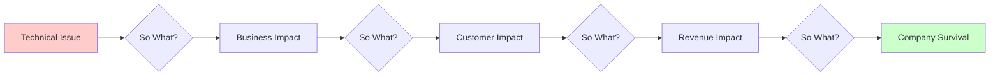

#### Real Example: The So What? Chain

**Starting Point:**
> "When client A overloads the service, it affects other customers."

**Applying "So What?":**

1. **Initial**: "Many customers saw their requests fail"
   - **So what?** ↓

2. **Level 2**: "Some important customers faced downtime"
   - **So what?** ↓

3. **Level 3**: "A few key customers lost significant revenue"
   - **So what?** ↓

4. **Level 4**: "They might stop using our service completely"
   - **So what?** ↓

5. **Level 5**: "We lose $2M ARR and damage our reputation"
   - **So what?** ↓

6. **Level 6**: "This affects our ability to raise Series B funding"

**Now that actually matters.**

See what just happened? You moved from:
- Technical issue → Business impact → Company survival

#### Impact Assessment Matrix

| Impact Level | Description | Action Priority | Example |
|--------------|-------------|-----------------|---------|
| **Critical** | Threatens business survival | Immediate | Data breach, complete outage |
| **High** | Significant revenue/customer impact | This sprint | Key customer churn risk |
| **Medium** | Noticeable but manageable | Next sprint | Performance degradation |
| **Low** | Minor inconvenience | Backlog | UI glitch, edge case |

#### Practical Application: The Impact Calculator

```javascript
// Example: Quantifying the real impact of a problem

class ImpactCalculator {
  constructor(problem) {
    this.problem = problem;
    this.impactChain = [];
  }
  
  // Apply "So What?" recursively
  askSoWhat(statement, depth = 0) {
    console.log(`\nLevel ${depth}: ${statement}`);
    
    const impact = this.quantifyImpact(statement);
    this.impactChain.push({ level: depth, statement, impact });
    
    // Ask "So what?" until we reach business impact
    if (depth < 5 && !this.isBusinessCritical(impact)) {
      const nextImpact = this.deriveNextImpact(statement);
      this.askSoWhat(nextImpact, depth + 1);
    }
  }
  
  quantifyImpact(statement) {
    // Convert statements to metrics
    const impacts = {
      "customers affected": this.estimateCustomersAffected(),
      "revenue at risk": this.calculateRevenueAtRisk(),
      "reputation damage": this.assessReputationImpact(),
      "team productivity": this.measureProductivityLoss()
    };
    
    return impacts[statement] || "Unknown";
  }
  
  calculateRevenueAtRisk() {
    const affectedCustomers = 50; // Key customers
    const avgRevenuePerCustomer = 40000; // $40k/year
    const churnProbability = 0.3; // 30% might leave
    
    return {
      potentialLoss: affectedCustomers * avgRevenuePerCustomer * churnProbability,
      confidence: "high",
      timeframe: "3 months"
    };
  }
  
  isBusinessCritical(impact) {
    // Determine if this requires immediate action
    return impact.potentialLoss > 1000000; // $1M threshold
  }
  
  generateReport() {
    return {
      problem: this.problem,
      impactChain: this.impactChain,
      recommendation: this.impactChain[this.impactChain.length - 1]
    };
  }
}

// Usage
const calculator = new ImpactCalculator("Service overload");
calculator.askSoWhat("Many customers saw request failures");
const report = calculator.generateReport();

console.log("Impact Report:", report);
// Output shows the chain from technical issue to $600k revenue risk
```

#### Decision Matrix: Is This Problem Worth Solving?

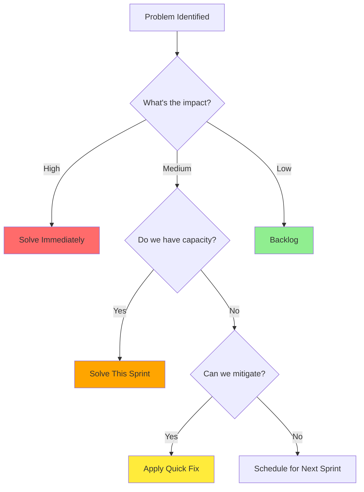

> 💡 **Key Takeaway**: Not all problems are equally important. Some look big but don't really matter. Some look small but can destroy your business. The "So What?" question helps you decide: Is this problem worth solving right now? How urgent is it? Who is actually affected the most?

---

### Step 4: Does This Actually Solve the Problem?

#### The Problem: Accepting Superficial Solutions

Now you've done the hard work:
- ✅ You understand the proposal
- ✅ You've found the real problem
- ✅ You know the impact

But here's where most people stop. They assume "Yeah, this solution makes sense" and move on.

This is where you need to pause again and ask: **"Does this actually solve the problem?"**

Because not every solution is a real solution. Some are just quick fixes in disguise.

#### The Solution Evaluation Framework

**Three Critical Questions:**

1. **Does this fix the root cause or just hide the symptom?**
2. **Are there any side effects?**
3. **Is this a temporary patch or a long-term solution?**

#### Real Example: Rate Limiting Revisited

**Context:**
- Real problem: Feature-specific bottleneck causing database overload
- Proposed solution: Add rate limiting

**Critical Analysis:**

❓ **Does rate limiting fix the inefficient feature?**
- Answer: No → It just reduces traffic
- Problem: The inefficient code still exists

❓ **What happens to important users?**
- Answer: They might get blocked too
- Problem: Punishing good users for bad architecture

❓ **What if we apply global throttling?**
- Answer: We could starve high-priority customers
- Problem: Creating new issues while solving others

**Better Approach:**

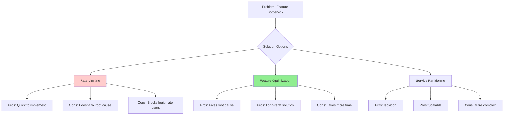

#### Solution Comparison Matrix

| Solution | Fixes Root Cause? | Side Effects | Time to Implement | Long-term Viability | Cost |
|----------|------------------|--------------|-------------------|---------------------|------|
| **Rate Limiting** | ❌ No | Blocks legitimate users | 1 week | ❌ Poor | Low |
| **Feature Optimization** | ✅ Yes | None | 3 weeks | ✅ Excellent | Medium |
| **Service Partitioning** | ✅ Yes | Increased complexity | 6 weeks | ✅ Excellent | High |
| **Combination** | ✅ Yes | Minimal | 4 weeks | ✅ Excellent | Medium |

#### Code Example: Evaluating Solutions

```python
class SolutionEvaluator:
    def __init__(self, problem):
        self.problem = problem
        self.root_cause = self.identify_root_cause()
    
    def evaluate_solution(self, solution):
        """Evaluate if a solution actually solves the problem"""
        
        evaluation = {
            "solution": solution.name,
            "criteria": {}
        }
        
        # Criterion 1: Root cause vs symptom
        evaluation["criteria"]["fixes_root_cause"] = {
            "score": self.assess_root_cause_fix(solution, self.root_cause),
            "notes": self.explain_root_cause_assessment(solution)
        }
        
        # Criterion 2: Side effects
        evaluation["criteria"]["side_effects"] = {
            "score": self.assess_side_effects(solution),
            "notes": self.list_side_effects(solution)
        }
        
        # Criterion 3: Long-term viability
        evaluation["criteria"]["long_term"] = {
            "score": self.assess_long_term(solution),
            "notes": self.explain_long_term_assessment(solution)
        }
        
        # Criterion 4: Cost-benefit analysis
        evaluation["criteria"]["cost_benefit"] = {
            "score": self.calculate_roi(solution),
            "notes": self.explain_roi(solution)
        }
        
        # Overall score
        evaluation["overall_score"] = self.calculate_overall_score(evaluation)
        
        return evaluation
    
    def assess_root_cause_fix(self, solution, root_cause):
        """Does this solution address the root cause?"""
        
        # Example: Rate limiting vs optimization
        if solution.type == "rate_limiting":
            return 2  # Doesn't fix root cause
        elif solution.type == "optimization":
            return 9  # Fixes root cause
        elif solution.type == "partitioning":
            return 8  # Addresses root cause indirectly
        
        return 5
    
    def generate_recommendation(self, solutions):
        """Generate final recommendation based on evaluation"""
        
        evaluated = [self.evaluate_solution(s) for s in solutions]
        ranked = sorted(evaluated, key=lambda x: x["overall_score"], reverse=True)
        
        recommendation = {
            "best_solution": ranked[0],
            "runner_up": ranked[1] if len(ranked) > 1 else None,
            "rationale": self.explain_recommendation(ranked[0]),
            "implementation_plan": self.create_implementation_plan(ranked[0])
        }
        
        return recommendation

# Usage
problem = "Service overload affecting key customers"
evaluator = SolutionEvaluator(problem)

solutions = [
    {"name": "Rate Limiting", "type": "rate_limiting", "cost": "low", "time": "1 week"},
    {"name": "Query Optimization", "type": "optimization", "cost": "medium", "time": "3 weeks"},
    {"name": "Service Partitioning", "type": "partitioning", "cost": "high", "time": "6 weeks"}
]

recommendation = evaluator.generate_recommendation(solutions)
print(f"Best solution: {recommendation['best_solution']['solution']}")
print(f"Score: {recommendation['best_solution']['overall_score']}/10")
print(f"Rationale: {recommendation['rationale']}")
```

#### Trade-off Analysis Framework

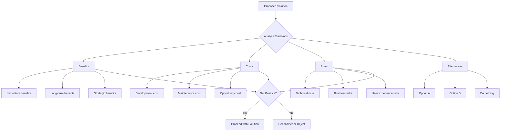

> 💡 **Key Takeaway**: A good solution doesn't just "work"—it works for the right reason. Critical thinking at this stage means not blindly accepting solutions, not getting impressed by "quick fixes," and thinking about impact, trade-offs, and future consequences. If your solution doesn't solve the root cause, you're just delaying the problem, not fixing it.

---

### Step 5: Challenge Your Own Thinking

#### The Problem: The Danger of "Good Ideas"

Even when a proposal looks smart and everything seems reasonable, this is the moment to challenge it the hardest.

Why? Because the most dangerous ideas are not the obviously bad ones. They're the ones that look good on the surface, so nobody questions them enough.

#### The Devil's Advocate Technique

This is where I intentionally step back and ask: **"Okay… but what could go wrong?"**

This step helps me break my own agreement. Because sometimes the real problem is not in the proposal itself—it's in the fact that I want to agree with it.

**Why We Unconsciously Agree:**
- The presenter is experienced
- The idea sounds polished
- It already matches what we personally believe
- We want to be agreeable team members

#### The Stress-Test Framework

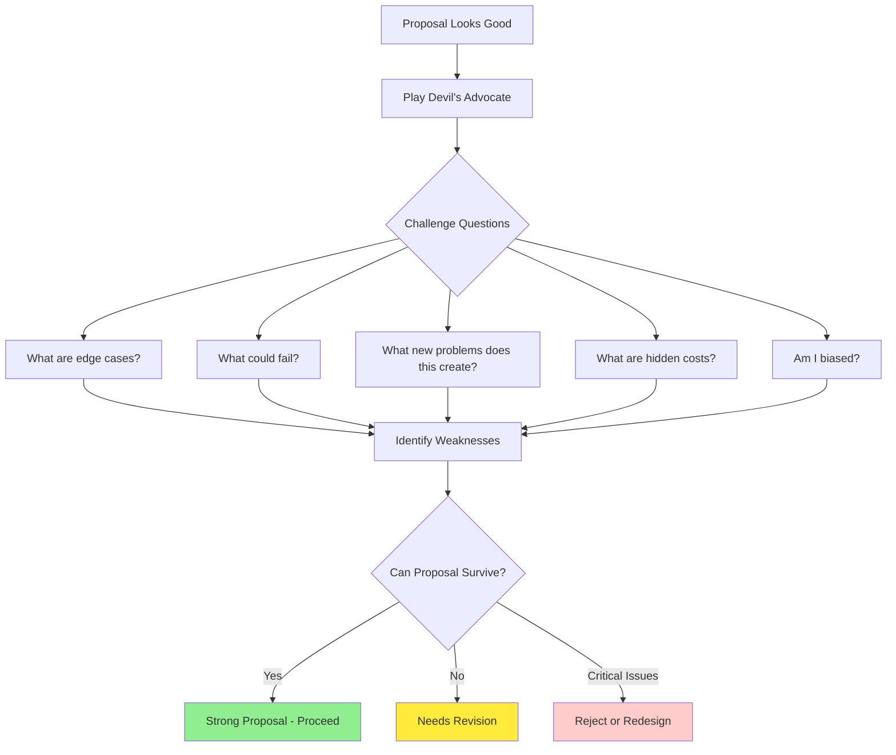

#### Stress-Test Questions

**Edge Cases:**
- What happens under extreme load?
- What if the data is malformed?
- What if this fails partially?
- What are the failure modes?

**New Problems:**
- Could this solution create a new problem?
- Does it introduce technical debt?
- Does it make the system more complex?
- Does it create maintenance burden?

**Hidden Costs:**
- What's the total cost of ownership?
- What about operational overhead?
- What about monitoring and alerting?
- What about documentation?

**Self-Reflection:**
- Am I judging fairly or just agreeing?
- Do I have a conflict of interest?
- Am I overconfident in my initial assessment?
- What would I criticize if this came from someone else?

#### Real Example: Stress-Testing Rate Limiting

**Initial Reaction:**
> "Yes, this is clean. This should work."

**Devil's Advocate Mode:**

❓ **What if rate limiting blocks important customer traffic?**
- Impact: VIP customers can't access service during peak times
- Severity: High

❓ **What if it creates poor user experience for good customers?**
- Impact: Legitimate users get error messages
- Severity: Medium

❓ **What if it adds operational complexity?**
- Impact: Need to tune limits, monitor thresholds, handle exceptions
- Severity: Medium

❓ **What if the real issue is still untouched?**
- Impact: We feel safer but the problem persists
- Severity: High

**Revised Thinking:**
Now you're no longer just evaluating the proposal—you're stress-testing it. And that's where critical thinking becomes much stronger.

#### Bias Detection Checklist

```markdown
## Self-Bias Assessment

Before finalizing your decision, answer these questions honestly:

### Confirmation Bias
- [ ] Am I only looking for evidence that supports this proposal?
- [ ] Am I dismissing contradictory data too quickly?
- [ ] Would I evaluate this differently if it came from a junior engineer?

### Authority Bias
- [ ] Am I agreeing because the proposer is senior/experienced?
- [ ] Am I not questioning because "they know better"?
- [ ] Would I challenge this if it came from a peer?

### Anchoring Bias
- [ ] Is the first proposal I heard still influencing me?
- [ ] Am I comparing all options to the initial idea?
- [ ] Have I explored alternatives thoroughly?

### Sunk Cost Fallacy
- [ ] Have we already invested in similar solutions?
- [ ] Am I favoring this because of past work?
- [ ] Am I ignoring better options due to prior investment?

### Social Pressure
- [ ] Do I want to seem agreeable?
- [ ] Am I avoiding conflict?
- [ ] Am I going along with the group?

**If you checked 2+ boxes in any category, re-evaluate with fresh perspective.**
```

#### Code Example: Bias Detection System

```python
class CriticalThinkingFramework:
    """5-step critical thinking framework implementation"""
    
    def __init__(self):
        self.steps = {
            1: "Get Absolute Clarity",
            2: "Find the Real Problem",
            3: "Ask 'So What?'",
            4: "Does This Solve the Problem?",
            5: "Challenge Your Own Thinking"
        }
        self.biases = []
        self.decision = {}
    
    def apply_framework(self, proposal):
        """Apply the complete 5-step framework"""
        
        print("=" * 60)
        print("APPLYING CRITICAL THINKING FRAMEWORK")
        print("=" * 60)
        
        # Step 1: Clarity
        print("\n[STEP 1] Getting Absolute Clarity...")
        clarity = self.get_clarity(proposal)
        if not clarity["sufficient"]:
            return {"status": "blocked", "reason": "Insufficient clarity"}
        
        # Step 2: Root Cause
        print("\n[STEP 2] Finding Real Problem...")
        root_cause = self.find_root_cause(clarity["understanding"])
        
        # Step 3: Impact
        print("\n[STEP 3] Asking 'So What?'...")
        impact = self.assess_impact(root_cause)
        
        # Step 4: Solution Evaluation
        print("\n[STEP 4] Evaluating Solution...")
        solution_eval = self.evaluate_solution(proposal, root_cause)
        
        # Step 5: Challenge
        print("\n[STEP 5] Challenging Own Thinking...")
        biases = self.detect_biases()
        stress_test = self.stress_test(proposal, solution_eval)
        
        # Final decision
        self.decision = {
            "proposal": proposal,
            "clarity": clarity,
            "root_cause": root_cause,
            "impact": impact,
            "solution_evaluation": solution_eval,
            "biases_detected": biases,
            "stress_test": stress_test,
            "recommendation": self.make_recommendation(solution_eval, stress_test)
        }
        
        return self.decision
    
    def get_clarity(self, proposal):
        """Step 1: Ensure absolute clarity"""
        
        clarity_questions = [
            "Can I state this in one sentence?",
            "Can I give a concrete example?",
            "Do I know who is affected?",
            "Do I understand current vs desired state?"
        ]
        
        clarity_score = sum(1 for q in clarity_questions if self.answer_question(q))
        
        return {
            "score": clarity_score,
            "sufficient": clarity_score >= 3,
            "questions": clarity_questions
        }
    
    def find_root_cause(self, understanding):
        """Step 2: Find the real problem"""
        
        diagnostic_questions = [
            "Is this system-wide or isolated?",
            "What do metrics show?",
            "Is there clear cause-effect?",
            "Is reaction proportional to cause?"
        ]
        
        # Simulate root cause analysis
        root_causes = []
        for question in diagnostic_questions:
            answer = self.investigate(question)
            if answer.indicates_root_cause:
                root_causes.append(answer.finding)
        
        return {
            "root_causes": root_causes,
            "confidence": len(root_causes) / len(diagnostic_questions),
            "symptom_vs_cause": self.classify_problem(root_causes)
        }
    
    def assess_impact(self, root_cause):
        """Step 3: Ask 'So What?'"""
        
        impact_chain = []
        current_impact = root_cause["primary_issue"]
        
        # Chain of "So What?" questions
        for level in range(6):
            next_impact = self.ask_so_what(current_impact)
            impact_chain.append({
                "level": level,
                "statement": current_impact,
                "impact": next_impact
            })
            current_impact = next_impact
        
        return {
            "chain": impact_chain,
            "final_impact": current_impact,
            "severity": self.assess_severity(current_impact)
        }
    
    def detect_biases(self):
        """Step 5: Detect cognitive biases"""
        
        bias_checks = {
            "confirmation_bias": self.check_confirmation_bias(),
            "authority_bias": self.check_authority_bias(),
            "anchoring_bias": self.check_anchoring_bias(),
            "sunk_cost": self.check_sunk_cost_fallacy()
        }
        
        detected = [bias for bias, present in bias_checks.items() if present]
        
        return {
            "biases_detected": detected,
            "mitigation_plan": self.create_mitigation_plan(detected)
        }
    
    def make_recommendation(self, solution_eval, stress_test):
        """Generate final recommendation"""
        
        if solution_eval["score"] >= 8 and not stress_test["critical_issues"]:
            return {
                "decision": "APPROVE",
                "confidence": "high",
                "conditions": stress_test["recommendations"]
            }
        elif solution_eval["score"] >= 6:
            return {
                "decision": "APPROVE WITH MODIFICATIONS",
                "confidence": "medium",
                "required_changes": stress_test["required_changes"]
            }
        else:
            return {
                "decision": "REJECT or REDESIGN",
                "confidence": "high",
                "reasons": stress_test["critical_issues"]
            }

# Usage Example
framework = CriticalThinkingFramework()

proposal = {
    "title": "Add rate limiting to prevent service overload",
    "proposer": "Senior Engineer",
    "description": "Implement global rate limiting at 1000 req/min per client"
}

result = framework.apply_framework(proposal)

print("\n" + "=" * 60)
print("FRAMEWORK ANALYSIS COMPLETE")
print("=" * 60)
print(f"Decision: {result['recommendation']['decision']}")
print(f"Confidence: {result['recommendation']['confidence']}")
print(f"Root Cause: {result['root_cause']['root_causes']}")
print(f"Biases Detected: {result['biases_detected']['biases_detected']}")
```

> 💡 **Key Takeaway**: A proposal is not strong just because it sounds smart. It becomes strong only after surviving hard questions. Before accepting anything, try to attack it from multiple angles. Not because you want to reject it, but because you want to make sure you're not missing something important. If an idea can't survive skepticism, it probably isn't ready yet.

---

## Complete Workflow Diagram

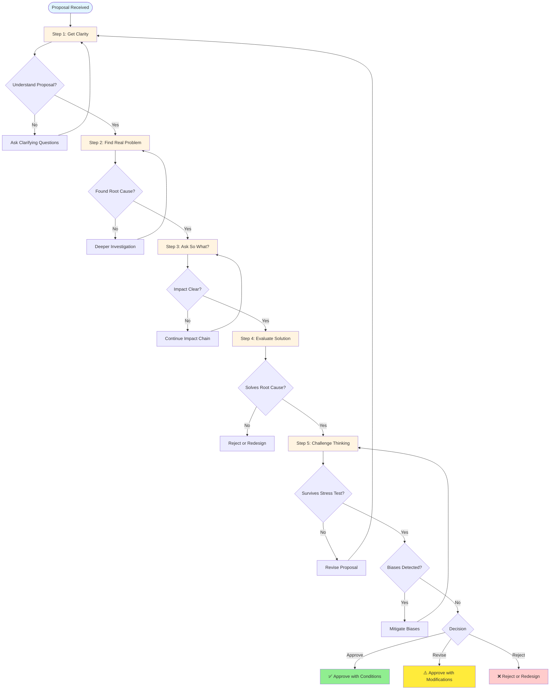

---

## Real-World Technical Scenarios

Let's apply the framework to three different technical scenarios to see how it works in practice.

### Scenario 1: Database Connection Pool Exhaustion

**Initial Proposal:**
> "We need to increase the database connection pool size from 50 to 200 connections."

#### Applying the Framework:

**Step 1: Get Clarity**
- **One-line version**: "Database connection pool is exhausted, causing request failures"
- **Example**: "During peak hours, 60% of requests fail with 'connection timeout' errors"
- **Understanding**: ✅ Clear

**Step 2: Find the Real Problem**

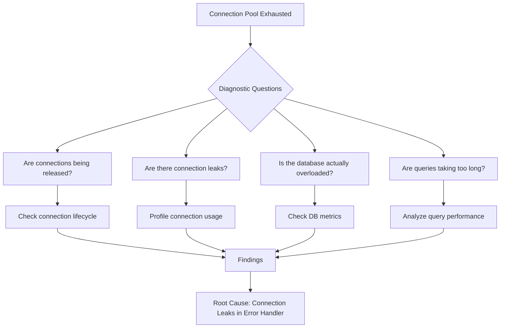

**Investigation Results:**
- Connections are NOT being released properly
- Connection leaks in error handling code
- Database is actually fine (only 30% utilization)
- Queries are fast (avg 50ms)

**Real Problem**: Connection leak in error handler, not pool size issue

**Step 3: Ask "So What?"**

1. Requests fail during peak hours
   - **So what?** ↓
2. Users experience 60% failure rate
   - **So what?** ↓
3. Key enterprise customers affected
   - **So what?** ↓
4. $50k/month account at risk of churn
   - **So what?** ↓
5. $600k ARR at risk + reputation damage

**Impact**: HIGH - Critical customer and revenue at risk

**Step 4: Evaluate Solutions**

| Solution | Fixes Root Cause? | Side Effects | Time | Cost | Score |
|----------|------------------|--------------|------|------|-------|
| Increase pool to 200 | ❌ No | Masks leak, more DB load | 1 hour | Low | 2/10 |
| Fix connection leak | ✅ Yes | None | 4 hours | Low | 10/10 |
| Add connection monitoring | ⚠️ Partial | Helps detect future issues | 1 day | Medium | 7/10 |

**Best Solution**: Fix the connection leak (4 hours vs. masking the problem)

**Step 5: Challenge Thinking**

❓ **What if there are multiple leak sources?**
- Mitigation: Add comprehensive logging

❓ **What if fixing this reveals other issues?**
- Mitigation: Have monitoring ready

❓ **Am I biased toward quick fixes?**
- Self-check: Yes, initially wanted to just increase pool size
- Correction: Opt for proper fix despite taking longer

**Final Decision**: ✅ **Fix the connection leak** - addresses root cause, minimal side effects, quick implementation

#### Code Solution:

```python
# ❌ BEFORE: Connection leak in error handler
def process_request(request):
    conn = pool.get_connection()
    try:
        result = conn.execute(query)
        return result
    except Exception as e:
        logging.error(f"Query failed: {e}")
        # BUG: Connection not returned to pool!
        raise

# ✅ AFTER: Proper connection management
def process_request(request):
    conn = pool.get_connection()
    try:
        result = conn.execute(query)
        return result
    except Exception as e:
        logging.error(f"Query failed: {e}")
        raise
    finally:
        # FIX: Always return connection to pool
        pool.release_connection(conn)

# Even better: Use context manager
def process_request_improved(request):
    with pool.connection() as conn:
        return conn.execute(query)
```

---

### Scenario 2: Microservice Communication Timeout

**Initial Proposal:**
> "We need to increase the API timeout from 5s to 30s to fix the timeout errors."

#### Applying the Framework:

**Step 1: Get Clarity**
- **One-line version**: "API calls between services are timing out"
- **Example**: "Order service calls Inventory service, gets timeout errors"
- **Understanding**: ✅ Clear

**Step 2: Find the Real Problem**

**Investigation:**
- Timeout happens only for specific endpoints
- Inventory service CPU spikes to 100% during these calls
- The specific endpoint runs a complex calculation
- Other services calling Inventory are fine

**Real Problem**: Inefficient algorithm in specific endpoint, not timeout issue

**Step 3: Ask "So What?"**

1. Order service gets timeout errors
   - **So what?** ↓
2. Order processing fails
   - **So what?** ↓
3. Customers can't complete purchases
   - **So what?** ↓
4. Revenue loss during peak hours
   - **So what?** ↓
5. $100k/day revenue impact + customer frustration

**Impact**: CRITICAL - Direct revenue impact

**Step 4: Evaluate Solutions**

| Solution | Fixes Root Cause? | Side Effects | Time | Score |
|----------|------------------|--------------|------|-------|
| Increase timeout to 30s | ❌ No | Slower failures, cascading issues | 1 hour | 1/10 |
| Add caching | ⚠️ Partial | Stale data risk | 1 day | 6/10 |
| Optimize algorithm | ✅ Yes | None | 2 days | 10/10 |
| Add async processing | ✅ Yes | Architecture change | 1 week | 8/10 |

**Best Solution**: Optimize the algorithm (fixes root cause, quick win)

**Step 5: Challenge Thinking**

❓ **What if optimization isn't enough?**
- Mitigation: Have async processing as backup plan

❓ **Will this affect other callers?**
- Verification: Test with all service consumers

❓ **Am I underestimating the complexity?**
- Self-check: Spiked the solution, confirmed 2-day estimate

**Final Decision**: ✅ **Optimize algorithm first, implement async if needed**

#### Code Solution:

```java
// ❌ BEFORE: Inefficient O(n²) algorithm
public List<Product> findAvailableProducts(Order order) {
    List<Product> allProducts = productRepository.findAll();
    List<Product> available = new ArrayList<>();
    
    // BAD: Nested loop - O(n²)
    for (Product product : allProducts) {
        for (OrderItem item : order.getItems()) {
            if (product.getId().equals(item.getProductId())) {
                if (product.getStock() > 0) {
                    available.add(product);
                }
            }
        }
    }
    return available;
}

// ✅ AFTER: Optimized O(n) with HashMap
public List<Product> findAvailableProducts(Order order) {
    // Create lookup map for order items
    Map<String, OrderItem> orderItems = order.getItems().stream()
        .collect(Collectors.toMap(OrderItem::getProductId, Function.identity()));
    
    // Single pass through products
    return productRepository.findAll().stream()
        .filter(product -> orderItems.containsKey(product.getId()))
        .filter(product -> product.getStock() > 0)
        .collect(Collectors.toList());
}

// Even better: Query at database level
@Query("SELECT p FROM Product p WHERE p.id IN :productIds AND p.stock > 0")
List<Product> findAvailableProducts(@Param("productIds") List<String> productIds);
```

---

### Scenario 3: Adding a New Feature Flag System

**Initial Proposal:**
> "We need to implement a feature flag system to control feature rollouts."

#### Applying the Framework:

**Step 1: Get Clarity**
- **One-line version**: "Implement feature flags for controlled feature rollouts"
- **Example**: "Gradually roll out new checkout flow to 10% → 50% → 100% of users"
- **Understanding**: ✅ Clear

**Step 2: Find the Real Problem**

**Investigation:**
- Last 3 feature rollouts had issues
- Required hotfixes and rollbacks
- No way to disable features quickly
- Manual deployment required for rollback

**Real Problem**: Need for rapid feature control and rollback capability

**Step 3: Ask "So What?"**

1. Feature rollouts are risky
   - **So what?** ↓
2. Hotfixes required frequently
   - **So what?** ↓
3. Engineering team spends 30% time on firefighting
   - **So what?** ↓
4. Delayed feature delivery + team burnout
   - **So what?** ↓
5. Can't compete with faster-moving competitors

**Impact**: HIGH - Affects team velocity and competitive position

**Step 4: Evaluate Solutions**

| Solution | Fixes Root Cause? | Side Effects | Time | Score |
|----------|------------------|--------------|------|-------|
| Build custom system | ✅ Yes | Maintenance burden | 3 months | 6/10 |
| Use LaunchDarkly (paid) | ✅ Yes | Cost, vendor lock-in | 1 week | 8/10 |
| Use Unleash (open source) | ✅ Yes | Self-hosting needed | 2 weeks | 9/10 |
| Simple DB-based flags | ⚠️ Partial | Limited features | 3 days | 5/10 |

**Best Solution**: Unleash (open source, good balance of features and control)

**Step 5: Challenge Thinking**

❓ **What if we outgrow the solution?**
- Mitigation: Choose solution with migration path

❓ **What about performance overhead?**
- Verification: Benchmark with expected load

❓ **Am I biased toward open source?**
- Self-check: Considered paid option (LaunchDarkly), cost is acceptable

❓ **Who will maintain this?**
- Mitigation: Assign dedicated owner, document thoroughly

**Final Decision**: ✅ **Implement Unleash with proper monitoring and documentation**

#### Implementation Example:

```typescript
// Feature flag implementation with Unleash
import { initialize, unleashContext } from 'unleash-client';

// Initialize Unleash
const unleash = initialize({
  url: process.env.UNLEASH_URL,
  appName: 'order-service',
  instanceId: process.env.INSTANCE_ID,
  customHeaders: {
    Authorization: process.env.UNLEASH_API_TOKEN,
  },
});

// Define feature flags
enum FeatureFlags {
  NEW_CHECKOUT_FLOW = 'new-checkout-flow',
  EXPERIMENTAL_SEARCH = 'experimental-search',
  PERFORMANCE_METRICS = 'performance-metrics',
}

// Usage in code
class OrderService {
  async processOrder(order: Order): Promise<OrderResult> {
    const context = unleashContext({
      userId: order.customerId,
      sessionId: order.sessionId,
      properties: {
        tier: order.customerTier,
        region: order.customerRegion,
      },
    });

    // Check feature flag
    const useNewCheckout = unleash.isEnabled(
      FeatureFlags.NEW_CHECKOUT_FLOW,
      { context, fallback: false }
    );

    if (useNewCheckout) {
      return this.processWithNewCheckout(order);
    } else {
      return this.processWithLegacyCheckout(order);
    }
  }

  // Gradual rollout strategy
  async gradualRollout(
    flag: FeatureFlags,
    percentage: number
  ): Promise<void> {
    // Update rollout percentage
    await unleash.updateFeatureFlag(flag, {
      enabled: true,
      strategies: [
        {
          name: 'gradualRolloutUserId',
          parameters: {
            rollout: percentage,
            stickiness: 'userId',
          },
        },
      ],
    });
  }
}
```

---

## Best Practices

### 1. Document Your Thinking

```markdown
## Decision Document Template

### Proposal: [Title]
**Date**: [Date]
**Decision Maker**: [Name]

### Step 1: Clarity
- **One-line summary**: [Your understanding]
- **Example**: [Concrete example]
- **Confirmed with**: [Who validated your understanding]

### Step 2: Root Cause Analysis
- **Surface problem**: [Initial problem statement]
- **Root cause**: [Actual problem found]
- **Evidence**: [Data/metrics supporting this]

### Step 3: Impact Assessment
- **Impact chain**: [So What? chain]
- **Severity**: [Critical/High/Medium/Low]
- **Stakeholders affected**: [List]

### Step 4: Solution Evaluation
- **Proposed solution**: [What was proposed]
- **Alternatives considered**: [List]
- **Evaluation matrix**: [Comparison table]
- **Selected solution**: [Your choice]
- **Rationale**: [Why]

### Step 5: Stress Test
- **Risks identified**: [List]
- **Mitigations**: [How you'll address them]
- **Biases checked**: [Self-assessment]
- **Survived challenge?**: [Yes/No]

### Final Decision
- **Decision**: [Approve/Revise/Reject]
- **Confidence**: [High/Medium/Low]
- **Conditions**: [Any requirements]
- **Review date**: [When to reassess]
```

### 2. Create a Personal Checklist

```markdown
## Critical Thinking Checklist

### Before Any Decision:
- [ ] Can I explain this in one sentence?
- [ ] Do I have concrete examples?
- [ ] Have I validated the problem with data?
- [ ] Have I asked "why" at least 3 times?
- [ ] Have I followed the impact chain?
- [ ] Does the solution fix the root cause?
- [ ] Have I considered alternatives?
- [ ] Have I stress-tested this?
- [ ] Have I checked for my own biases?
- [ ] Would I bet my reputation on this?

### Red Flags:
- ⚠️ Can't explain it simply
- ⚠️ No data to support claims
- ⚠️ Only one solution considered
- ⚠️ Pressure to decide immediately
- ⚠️ Everyone agrees too quickly
- ⚠️ Solution doesn't match problem scope
```

### 3. Build a "Thinking Partner" System

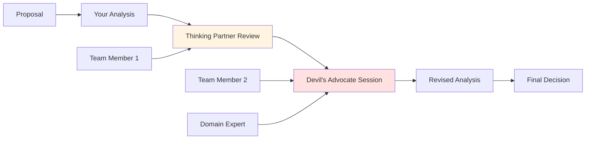

**Best Practices:**
- Rotate thinking partners to get diverse perspectives
- Schedule regular "challenge sessions" for important decisions
- Create a culture where challenging ideas is valued
- Document dissenting opinions for future reference

### 4. Time-Box Your Analysis

```python
class TimeBoxedAnalysis:
    """Apply critical thinking within time constraints"""
    
    TIME_LIMITS = {
        "critical": 30,      # 30 minutes for critical decisions
        "high": 60,          # 1 hour for high priority
        "medium": 120,       # 2 hours for medium priority
        "low": 240          # 4 hours for low priority
    }
    
    def analyze_with_timebox(self, proposal, priority):
        """Apply framework within time limit"""
        
        time_limit = self.TIME_LIMITS[priority]
        start_time = time.time()
        
        results = {
            "step1_clarity": self.quick_clarity_check(proposal),
            "step2_root_cause": self.quick_root_cause(proposal),
            "step3_impact": self.quick_impact_check(proposal),
            "step4_solution": self.quick_solution_eval(proposal),
            "step5_challenge": self.quick_stress_test(proposal)
        }
        
        time_elapsed = time.time() - start_time
        time_remaining = time_limit - time_elapsed
        
        results["time_elapsed"] = time_elapsed
        results["time_remaining"] = time_remaining
        results["confidence"] = self.assess_confidence(results, time_remaining)
        
        return results
```

### 5. Create a Decision Log

Maintain a decision log to track your critical thinking outcomes:

```markdown
## Decision Log Entry

**Date**: 2026-04-09
**Decision**: Whether to implement rate limiting
**Framework Applied**: Yes
**Outcome**: Approved with modifications
**Result**: 
- Initial: Add global rate limiting
- Revised: Optimize feature + add targeted rate limiting
- Outcome: 80% reduction in overload, no customer impact
**Lessons Learned**: Always investigate root cause before accepting proposed solution
**Follow-up**: Review in 2 weeks
```

---

## Anti-Patterns to Avoid

### Anti-Pattern 1: Jumping to Solutions

❌ **What It Looks Like:**
```
Problem stated → Immediate solution → Implementation
```

✅ **What to Do Instead:**
```
Problem stated → Investigation → Root cause → Multiple solutions → Evaluation → Decision
```

**Why It's Dangerous**: You solve the wrong problem or create new ones.

### Anti-Pattern 2: Analysis Paralysis

❌ **What It Looks Like:**
```
Problem → Endless investigation → Never decide → Missed opportunity
```

✅ **What to Do Instead:**
```
Problem → Time-boxed analysis → Decision with confidence level → Iterate if needed
```

**Why It's Dangerous**: Perfect is the enemy of good. Make the best decision you can with available information.

### Anti-Pattern 3: Confirmation Bias

❌ **What It Looks Like:**
```
Proposal → Seek supporting evidence → Ignore contradictions → "See, I was right"
```

✅ **What to Do Instead:**
```
Proposal → Actively seek contradictory evidence → Evaluate fairly → Adjust if needed
```

**Why It's Dangerous**: You miss critical flaws and make poor decisions.

### Anti-Pattern 4: Authority Bias

❌ **What It Looks Like:**
```
Senior person proposes → Everyone agrees → No critical analysis
```

✅ **What to Do Instead:**
```
Proposal → Independent analysis → Challenge regardless of source → Data-driven decision
```

**Why It's Dangerous**: Great people can have bad ideas. Rank doesn't equal correctness.

### Anti-Pattern 5: Sunk Cost Fallacy

❌ **What It Looks Like:**
```
"We already spent 2 months on this" → Continue despite evidence it's wrong
```

✅ **What to Do Instead:**
```
Current investment → Future value assessment → Pivot if ROI negative
```

**Why It's Dangerous**: Past investment shouldn't dictate future decisions.

### Anti-Pattern 6: Solution-First Thinking

❌ **What It Looks Like:**
```
"Let's use Kubernetes" → Then find problems to solve
```

✅ **What to Do Instead:**
```
Problem → Analyze → Choose appropriate solution → Kubernetes might not be it
```

**Why It's Dangerous**: Technology choices should solve problems, not the other way around.

### Anti-Pattern Comparison Table

| Anti-Pattern | Symptom | Consequence | Solution |
|--------------|---------|-------------|----------|
| **Jumping to Solutions** | Immediate solution proposals | Wrong problem solved | Enforce framework steps |
| **Analysis Paralysis** | Endless research | Missed opportunities | Time-boxing |
| **Confirmation Bias** | Only seeking agreement | Blind spots | Devil's advocate |
| **Authority Bias** | Deferring to seniority | Groupthink | Independent analysis |
| **Sunk Cost Fallacy** | "We already invested..." | Wasted resources | Future-focused ROI |
| **Solution-First Thinking** | "Let's use X" | Technology-driven design | Problem-first approach |

---

## Practice Exercises

### Exercise 1: Evaluate a Proposed Caching Strategy

**Scenario:**
Your team proposes adding Redis caching to improve API performance. The proposal states: "We should add Redis caching to make the API faster."

**Your Task:**
Apply the 5-step critical thinking framework to evaluate this proposal.

<details>
<summary>📝 <strong>Click to see solution</strong></summary>

#### Solution:

**Step 1: Get Clarity**
- **One-line**: "Add Redis cache to improve API response times"
- **Example needed**: Which endpoints? Current vs target response times?
- **Gap**: Proposal is too vague

**Questions to Ask:**
- Which specific endpoints are slow?
- What are current response times?
- What's the target?
- What's the read/write pattern?
- What's the data volatility?

**Step 2: Find Real Problem**
After investigation:
- Only 3 of 20 endpoints are slow
- These endpoints query the same 5 database tables
- These tables have 95% read, 5% write ratio
- Data changes hourly

**Real Problem**: N+1 query pattern on frequently-read, rarely-updated data

**Step 3: Ask "So What?"**
1. API response time is 2s (target: 200ms)
   - **So what?** ↓
2. User experience is poor
   - **So what?** ↓
3. 40% increase in support tickets
   - **So what?** ↓
4. Support costs increased by $5k/month
   - **So what?** ↓
5. Customer satisfaction score dropped from 4.5 to 3.8

**Impact**: HIGH - Affects customer satisfaction and costs

**Step 4: Evaluate Solutions**

| Solution | Fixes Root Cause? | Complexity | Cost | Score |
|----------|------------------|------------|------|-------|
| Add Redis cache | ✅ Yes | Medium | $200/month | 9/10 |
| Fix N+1 queries | ✅ Yes | Low | $0 | 10/10 |
| Add database indexes | ⚠️ Partial | Low | $0 | 7/10 |
| Read replicas | ⚠️ Partial | High | $500/month | 6/10 |

**Best Solution**: Fix N+1 queries first (free, immediate impact), add Redis if needed

**Step 5: Challenge Thinking**
- ❓ What if fixing N+1 isn't enough? → Have Redis as backup
- ❓ What about cache invalidation? → 1-hour TTL acceptable for this data
- ❓ Am I biased against paying for services? → No, free solution is genuinely better

**Final Decision**: ✅ **Fix N+1 queries first, measure impact, add Redis only if needed**

**Code Solution:**
```python
# ❌ BEFORE: N+1 query problem
@app.route('/api/dashboard')
def get_dashboard():
    user_id = request.args.get('user_id')
    
    # Get user
    user = db.query("SELECT * FROM users WHERE id = ?", user_id)
    
    # BAD: N+1 - query orders for each user
    orders = db.query("SELECT * FROM orders WHERE user_id = ?", user_id)
    for order in orders:
        order.items = db.query("SELECT * FROM items WHERE order_id = ?", order.id)
        order.items[0].product = db.query("SELECT * FROM products WHERE id = ?", order.items[0].product_id)
    
    return jsonify({"user": user, "orders": orders})

# ✅ AFTER: Optimized with joins
@app.route('/api/dashboard')
def get_dashboard_optimized():
    user_id = request.args.get('user_id')
    
    # Single query with joins
    result = db.query("""
        SELECT 
            u.*, o.*, i.*, p.*
        FROM users u
        LEFT JOIN orders o ON o.user_id = u.id
        LEFT JOIN items i ON i.order_id = o.id
        LEFT JOIN products p ON p.id = i.product_id
        WHERE u.id = ?
    """, user_id)
    
    # Format response
    dashboard = format_dashboard(result)
    return jsonify(dashboard)
```

</details>

---

### Exercise 2: Debug a Performance Issue

**Scenario:**
Your production monitoring shows that the `/api/search` endpoint response time increased from 200ms to 3s over the past week. Your teammate suggests: "We need to add more server resources to handle the load."

**Your Task:**
Apply the framework to determine if this is the right solution.

<details>
<summary>📝 <strong>Click to see solution</strong></summary>

#### Solution:

**Step 1: Get Clarity**
- **One-line**: "Search endpoint degraded from 200ms to 3s in one week"
- **Example**: "Search for 'laptop' now takes 3s instead of 200ms"
- **Understanding**: ✅ Clear

**Step 2: Find Real Problem**

Investigation reveals:
- Response time increased gradually
- No increase in request volume
- Database CPU increased from 30% to 90%
- Query execution time increased from 50ms to 2.5s
- Query plan changed - full table scan instead of index usage

**Root Cause**: Missing database index on `products.category` column (was working before because table was smaller)

**Step 3: Ask "So What?"**
1. Search endpoint slow
   - **So what?** ↓
2. Poor user experience
   - **So what?** ↓
3. 25% increase in bounce rate on search pages
   - **So what?** ↓
4. Estimated $15k/month lost revenue
   - **So what?** ↓
5. Competitors have faster search → market share at risk

**Impact**: HIGH - Revenue and competitive position

**Step 4: Evaluate Solutions**

| Solution | Fixes Root Cause? | Time | Cost | Score |
|----------|------------------|------|------|-------|
| Add more servers | ❌ No | 1 day | $500/month | 2/10 |
| Add database index | ✅ Yes | 5 minutes | $0 | 10/10 |
| Add caching layer | ⚠️ Partial | 1 week | $200/month | 6/10 |
| Optimize queries | ✅ Yes | 2 hours | $0 | 9/10 |

**Best Solution**: Add database index (5 minutes, free, fixes root cause)

**Step 5: Challenge Thinking**
- ❓ Will adding index cause issues during deployment? → Use CONCURRENTLY flag
- ❓ Are there other missing indexes? → Run full audit
- ❓ Why did this happen? → Add index monitoring to prevent future issues

**Final Decision**: ✅ **Add index immediately, implement index monitoring**

**Code Solution:**
```sql
-- ❌ PROBLEM: Missing index causes full table scan
EXPLAIN ANALYZE SELECT * FROM products 
WHERE category = 'laptops' AND price > 1000;

-- Output: Seq Scan on products (cost=0.00..1542.00 rows=1500 width=200)

-- ✅ SOLUTION: Add index
CREATE INDEX CONCURRENTLY idx_products_category_price 
ON products(category, price);

-- Verify improvement
EXPLAIN ANALYZE SELECT * FROM products 
WHERE category = 'laptops' AND price > 1000;

-- Output: Index Scan using idx_products_category_price (cost=0.29..120.50 rows=150 width=200)
```

**Monitoring Solution:**
```python
# Add index usage monitoring
class IndexMonitor:
    def __init__(self, db_connection):
        self.db = db_connection
    
    def check_unused_indexes(self):
        """Find indexes that aren't being used"""
        query = """
            SELECT 
                schemaname,
                tablename,
                indexname,
                idx_scan,
                idx_tup_read,
                idx_tup_fetch
            FROM pg_stat_user_indexes
            WHERE idx_scan = 0
            AND indexname NOT LIKE '%_pkey'
        """
        unused = self.db.query(query)
        
        if unused:
            alert = {
                "severity": "medium",
                "message": f"Found {len(unused)} unused indexes",
                "indexes": unused,
                "recommendation": "Review and potentially remove unused indexes"
            }
            self.send_alert(alert)
    
    def check_missing_indexes(self):
        """Find queries that could benefit from indexes"""
        query = """
            SELECT 
                query,
                calls,
                mean_exec_time,
                total_exec_time
            FROM pg_stat_statements
            WHERE mean_exec_time > 1000  -- Queries taking > 1s
            ORDER BY mean_exec_time DESC
            LIMIT 10
        """
        slow_queries = self.db.query(query)
        
        for query_info in slow_queries:
            # Analyze if index would help
            if self.would_benefit_from_index(query_info['query']):
                self.create_index_recommendation(query_info)
```

</details>

---

### Exercise 3: Review a System Architecture Proposal

**Scenario:**
Your team wants to migrate from a monolithic architecture to microservices. The proposal states: "We should break our monolith into microservices to improve scalability and maintainability."

**Your Task:**
Apply the framework to evaluate this architectural decision.

<details>
<summary>📝 <strong>Click to see solution</strong></summary>

#### Solution:

**Step 1: Get Clarity**
- **One-line**: "Migrate from monolith to microservices for better scalability and maintainability"
- **Example needed**: Which services? What's the migration strategy?
- **Gap**: Very broad proposal, needs specifics

**Questions to Ask:**
- Which specific services are proposed?
- What's the current scalability bottleneck?
- What does "maintainability" mean in this context?
- What's the migration strategy (big bang vs. incremental)?
- Who will maintain the distributed system?

**Step 2: Find Real Problem**

Investigation reveals:
- Monolith is 500k lines of code
- Deployment takes 45 minutes
- Different features have different scaling needs
- Teams step on each other's code
- Want to deploy features independently

**Real Problems:**
1. Long deployment times (not necessarily a monolith problem)
2. Team coordination issues (organizational, not technical)
3. Scaling inefficiency (some features need more resources)

**Step 3: Ask "So What?"**
1. Monolith is hard to scale
   - **So what?** ↓
2. Can't handle traffic spikes efficiently
   - **So what?** ↓
3. During Black Friday, system nearly crashed
   - **So what?** ↓
4. Lost $200k in potential sales
   - **So what?** ↓
5. Board questioned platform stability → investor confidence affected

**Impact**: CRITICAL - Revenue and investor confidence

**Step 4: Evaluate Solutions**

| Solution | Fixes Root Cause? | Complexity | Time | Cost | Score |
|----------|------------------|------------|------|------|-------|
| Full microservices migration | ⚠️ Partial | Very High | 18 months | $1.5M | 5/10 |
| Modular monolith | ✅ Yes | Medium | 3 months | $100k | 8/10 |
| Strangler Fig pattern | ✅ Yes | Medium | 6 months | $300k | 9/10 |
| Optimize monolith deployment | ⚠️ Partial | Low | 1 month | $20k | 6/10 |

**Analysis:**
- Full microservices: Solves organizational issues but creates massive complexity
- Modular monolith: Better code organization without distributed systems complexity
- Strangler Fig: Incremental migration, lower risk
- Optimize deployment: Quick win but doesn't solve long-term issues

**Best Solution**: Strangler Fig pattern - incrementally extract services

**Step 5: Challenge Thinking**

❓ **What if microservices aren't the answer?**
- Consideration: Organizational issues might need fixing first
- Mitigation: Address team structure alongside technical changes

❓ **What about operational complexity?**
- Concern: Need Kubernetes, service mesh, distributed tracing
- Mitigation: Invest in platform team and tooling

❓ **Am I jumping on the microservices bandwagon?**
- Self-check: Yes, need to be more critical
- Correction: Evaluate if problems truly require microservices

❓ **What's the total cost of ownership?**
- Calculation: Microservices cost 3x more to operate
- Consideration: Only worth it if scaling benefits outweigh costs

**Final Decision**: ✅ **Adopt Strangler Fig pattern, start with one service, evaluate after 6 months**

**Implementation Plan:**
```python
# Strangler Fig Pattern Implementation

class StranglerFig:
    """
    Incrementally migrate from monolith to microservices
    by intercepting requests and routing appropriately
    """
    
    def __init__(self, monolith_base_url):
        self.monolith_url = monolith_base_url
        self.microservices = {}
        self.routing_rules = []
    
    def register_microservice(self, path_prefix, service_url):
        """Register a new microservice for specific paths"""
        self.microservices[path_prefix] = service_url
        
        # Add routing rule
        self.routing_rules.append({
            "type": "prefix",
            "pattern": path_prefix,
            "target": service_url,
            "status": "active"
        })
    
    def route_request(self, request_path):
        """Route request to monolith or microservice"""
        
        # Check if path matches any microservice
        for rule in self.routing_rules:
            if request_path.startswith(rule["pattern"]):
                if rule["status"] == "active":
                    # Route to microservice
                    return self.forward_to_microservice(
                        rule["target"], 
                        request_path
                    )
                else:
                    # Route to monolith (service being migrated)
                    return self.forward_to_monolith(request_path)
        
        # Default: route to monolith
        return self.forward_to_monolith(request_path)
    
    def migrate_feature(self, feature_name, migration_percentage):
        """Gradually migrate traffic from monolith to microservice"""
        
        # Implement canary deployment
        if random.random() < migration_percentage:
            return self.route_to_microservice(feature_name)
        else:
            return self.route_to_monolith(feature_name)
    
    def monitor_and_compare(self):
        """Compare monolith vs microservice metrics"""
        
        return {
            "monolith": {
                "latency_p99": self.get_monolith_metrics()["p99_latency"],
                "error_rate": self.get_monolith_metrics()["error_rate"],
                "throughput": self.get_monolith_metrics()["throughput"]
            },
            "microservice": {
                "latency_p99": self.get_microservice_metrics()["p99_latency"],
                "error_rate": self.get_microservice_metrics()["error_rate"],
                "throughput": self.get_microservice_metrics()["throughput"]
            },
            "comparison": self.compare_metrics()
        }

# Usage: Gradual migration
strangler = StranglerFig("https://monolith.example.com")

# Step 1: Extract user service
strangler.register_microservice("/api/users", "https://users-service.example.com")

# Step 2: Gradually shift traffic
for percentage in [10, 25, 50, 75, 100]:
    print(f"Migrating {percentage}% of user traffic...")
    # Monitor metrics at each stage
    metrics = strangler.monitor_and_compare()
    
    if metrics["comparison"]["error_rate_increase"] > 0.01:  # 1% threshold
        print(f"Rolling back - error rate too high")
        break
    
    if percentage == 100:
        print("Migration complete!")
```

**Migration Roadmap:**
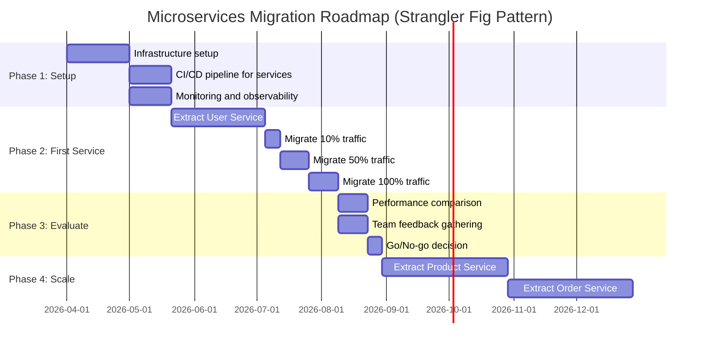

</details>

---

## Summary & Key Takeaways

### The 5-Step Framework at a Glance

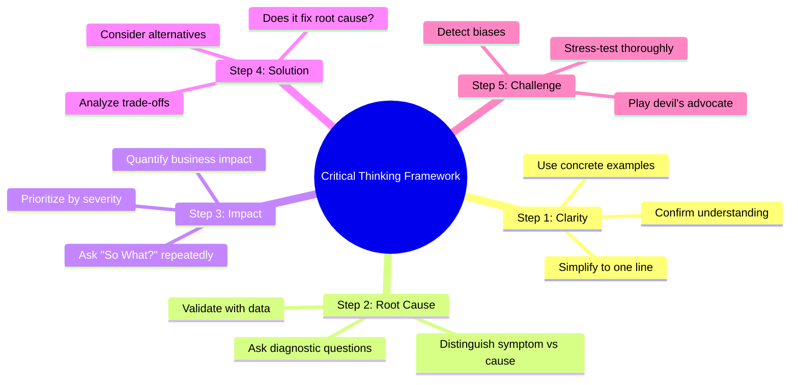

### Quick Reference Checklist

```
✅ CRITICAL THINKING CHECKLIST

□ STEP 1: CLARITY
  □ Can I explain in one sentence?
  □ Do I have concrete examples?
  □ Have I confirmed my understanding?

□ STEP 2: ROOT CAUSE
  □ Have I asked "why" 3+ times?
  □ Have I validated with data?
  □ Have I distinguished symptom from cause?

□ STEP 3: IMPACT
  □ Have I asked "So What?" repeatedly?
  □ Do I know the business impact?
  □ Is this worth solving now?

□ STEP 4: SOLUTION
  □ Does it fix the root cause?
  □ Have I considered alternatives?
  □ Have I analyzed trade-offs?

□ STEP 5: CHALLENGE
  □ Have I played devil's advocate?
  □ Have I checked for biases?
  □ Could this fail? What would I miss?
```

### Key Insights

1. **Critical thinking is a skill, not a trait** - Anyone can learn and improve
2. **Slow down to speed up** - Time invested in thinking prevents costly mistakes
3. **Root causes, not symptoms** - Fixing the right problem is more important than fixing fast
4. **Impact matters** - Not all problems are equally important
5. **Challenge everything** - Including your own thinking
6. **Bias is inevitable** - Awareness and mitigation are key
7. **Framework > Personality** - Use a structured approach, don't rely on intuition alone

### Common Mistakes to Avoid

| Mistake | Why It Happens | How to Avoid |
|---------|---------------|--------------|
| Skipping clarity step | Time pressure | Make it non-negotiable |
| Accepting first solution | Cognitive ease | Always consider 2+ alternatives |
| Ignoring data | Confirmation bias | Seek contradictory evidence |
| Analysis paralysis | Perfectionism | Time-box decisions |
| Groupthink | Social pressure | Assign devil's advocate |
| Sunk cost fallacy | Loss aversion | Focus on future value |

### When to Use This Framework

✅ **Use for:**
- Major architectural decisions
- Technology selections
- Process improvements
- Problem diagnosis
- Proposal evaluations
- Strategic planning

❌ **Don't use for:**
- Trivial decisions (what to eat for lunch)
- Time-critical emergencies (use intuition, debrief later)
- Already-decided matters (accept and move on)
- Low-impact choices (minimal downside)

---

## Question Bank

### Multiple Choice Questions

1. **What is the primary goal of Step 1 (Get Clarity)?**
   - A) To quickly agree with proposals
   - B) To ensure you understand what's being proposed
   - C) To find flaws in the proposal
   - D) To impress the team with your knowledge
   
   **Answer: B** - Step 1 ensures you have absolute clarity on what's being proposed before analyzing it.

2. **What's the difference between a symptom and a root cause?**
   - A) A symptom is more important
   - B) A root cause is the underlying reason, a symptom is the observable effect
   - C) They're the same thing
   - D) A symptom is always technical
   
   **Answer: B** - A root cause is the underlying reason for a problem, while a symptom is the observable effect.

3. **Why is the "So What?" question important?**
   - A) It helps you reject proposals
   - B) It uncovers the real business impact of a problem
   - C) It's just a rhetorical device
   - D) It wastes time
   
   **Answer: B** - The "So What?" chain helps you understand the actual business impact and prioritize appropriately.

4. **What is confirmation bias?**
   - A) Confirming meeting times
   - B) Seeking only evidence that supports your existing beliefs
   - C) Double-checking your work
   - D) Validating data sources
   
   **Answer: B** - Confirmation bias is the tendency to search for, interpret, and recall information that confirms your preexisting beliefs.

5. **When should you NOT use the critical thinking framework?**
   - A) For major architectural decisions
   - B) For time-critical emergencies
   - C) For technology selections
   - D) For process improvements
   
   **Answer: B** - For true emergencies, use intuition and debrief later with the framework.

### Scenario-Based Questions

6. **A proposal states: "We need to rewrite our backend in Go for better performance." How do you apply Step 1?**
   
   **Answer**: Ask for specifics: Which endpoints are slow? What are current performance metrics? What's the target? Have they profiled the current system? Can they give concrete examples of performance issues?

7. **You discover the real problem is a database connection leak, but the proposal is to add a load balancer. What do you do?**
   
   **Answer**: Apply Step 4 - evaluate if the solution fixes the root cause. A load balancer doesn't fix a connection leak. Present your findings with data showing the real issue, and propose fixing the leak instead.

8. **Your team wants to implement a solution that will take 6 months. The "So What?" chain shows the problem costs $10k/month. What should you consider?**
   
   **Answer**: The ROI doesn't make sense ($10k × 6 months = $60k cost vs. $72k savings). Consider: Can you find a quicker solution? Is the $10k/month estimate accurate? Can you mitigate the problem temporarily while working on a longer-term fix?

9. **You realize you're suffering from authority bias - you're agreeing with a senior engineer's proposal without critical analysis. What should you do?**
   
   **Answer**: Pause and apply Step 5 intentionally. Ask yourself: "Would I evaluate this differently if it came from a junior engineer?" Actively seek contradictory evidence. Have someone else play devil's advocate.

10. **A proposal passes all 5 steps but your gut says something is wrong. What should you do?**
    
    **Answer**: Your gut feeling is valuable data. Re-examine each step - did you miss something? Are there unstated assumptions? Get a second opinion from a trusted colleague. Sometimes intuition catches what analysis misses.

### Reflective Questions

11. **Describe a time when you accepted a proposal without critical thinking. What was the outcome? What would you do differently?**
    
    *[Open-ended - look for: Self-awareness, understanding of consequences, ability to identify what went wrong, and concrete plan for improvement]*

12. **Which step of the framework do you find most difficult, and why?**
    
    *[Open-ended - look for: Honest self-assessment, specific challenges, and strategies for improvement]*

13. **How would you apply this framework to a personal life decision (e.g., buying a house, changing careers)?**
    
    *[Open-ended - look for: Ability to transfer framework to non-technical contexts, concrete examples]*

14. **What cognitive biases do you think affect you most frequently? How can you mitigate them?**
    
    *[Open-ended - look for: Self-awareness, specific biases, practical mitigation strategies]*

15. **How would you introduce this framework to a team that's resistant to "slowing down"?**
    
    *[Open-ended - look for: Change management skills, ability to demonstrate value, practical implementation strategies]*

### Interview-Style Questions

16. **"Tell me about a time you challenged a senior engineer's proposal. What was the situation, and what was the outcome?"**
    
    *[Look for: Specific example, application of framework, professional handling of disagreement, positive outcome]*

17. **"How do you ensure you're solving the right problem, not just the first problem you identify?"**
    
    *[Look for: Root cause analysis, data-driven approach, asking "why", considering multiple perspectives]*

18. **"Describe your approach to evaluating technical proposals."**
    
    *[Look for: Structured framework, consideration of trade-offs, business impact awareness, bias mitigation]*

19. **"Tell me about a time you made a poor technical decision. What did you learn?"**
    
    *[Look for: Honesty, self-awareness, application of lessons learned, critical thinking growth]*

20. **"How do you balance speed vs. thoroughness in decision-making?"**
    
    *[Look for: Time-boxing, prioritization, risk assessment, ability to adapt framework to context]*

---

## Further Reading & Resources

### Books on Critical Thinking

1. **"Thinking, Fast and Slow" by Daniel Kahneman**
   - Nobel Prize winner's exploration of cognitive biases
   - Essential reading for understanding how we think

2. **"The Art of Thinking Clearly" by Rolf Dobelli**
   - 99 cognitive biases with practical examples
   - Quick, digestible chapters

3. **"Critical Thinking: Your Ultimate Guide to Improve Decision Making" by Kevan Lillington**
   - Practical techniques for better thinking
   - Focus on actionable strategies

4. **"Thinking in Systems: A Primer" by Donella Meadows**
   - Understanding complex systems
   - Essential for technical architects

5. **"The Black Swan" by Nassim Nicholas Taleb**
   - Understanding rare, high-impact events
   - Relevant to risk assessment in tech

### Technical Decision-Making Resources

1. **"Software Architecture: The Hard Parts" by Neal Ford**
   - Modern architecture decision-making
   - Trade-off analysis techniques

2. **"Fundamentals of Software Architecture" by Mark Richards & Neal Ford**
   - Comprehensive architecture guide
   - Decision-making frameworks

3. **"Team Topologies" by Matthew Skelton & Manuel Pais**
   - Organizational design for software teams
   - Relevant to microservices decisions

### Online Resources

- **Cognitive Bias Checklist**: [Wikipedia List of Cognitive Biases](https://en.wikipedia.org/wiki/List_of_cognitive_biases)
- **Root Cause Analysis**: [Five Whys Technique](https://en.wikipedia.org/wiki/Five_whys)
- **Decision Matrix Templates**: [Notion Decision Matrix](https://www.notion.so/)
- **Devil's Advocate Techniques**: [Harvard Business Review](https://hbr.org/)

### Related Methodologies

1. **First Principles Thinking** (Elon Musk's approach)
2. **The Five Whys** (Toyota Production System)
3. **Pre-Mortem Analysis** (Gary Klein's technique)
4. **Red Teaming** (Military strategy adapted to business)
5. **Six Thinking Hats** (Edward de Bono's parallel thinking)

### Communities & Discussions

- **Hacker News**: Technical decision-making discussions
- **/r/ExperiencedDevs**: Real-world architecture decisions
- **InfoQ**: Architecture and design patterns
- **Martin Fowler's Blog**: Software design insights

### Tools & Templates

1. **Decision Log Template**: [GitHub Gist](https://gist.github.com/)
2. **Impact Assessment Matrix**: [Notion Template](https://www.notion.so/)
3. **Bias Detection Checklist**: Create your own based on this tutorial
4. **Root Cause Analysis Canvas**: Download from [Strategyzer](https://www.strategyzer.com/)

---

## Final Thoughts

Critical thinking is not about being skeptical or negative. It's about being thorough and intentional. It's about ensuring that when you make a decision, you're making the best decision you can with the information available.

The 5-step framework I've shared is my personal "ninja technique" - it's not perfect, and it doesn't work for every situation. But it has helped me make better decisions, avoid costly mistakes, and contribute more meaningfully to technical discussions.

Remember:
- 🎯 **Start with clarity** - You can't think critically about something you don't understand
- 🔍 **Find root causes** - Symptoms mislead, root causes reveal
- 💥 **Understand impact** - Not all problems are equally important
- ✅ **Evaluate solutions** - Not every solution solves the right problem
- 🧠 **Challenge yourself** - Your own biases are the hardest to see

The goal isn't to never make mistakes. The goal is to make fewer mistakes and learn from the ones you do make.

Now go forth and think critically! 🚀

---

## About This Tutorial

**Created**: April 2026  
**Last Updated**: April 2026  
**Difficulty**: Intermediate  
**Reading Time**: 12-15 minutes  
**Author**: Adapted from "My Ninja Technique That Helped Me Unlock Real Critical Thinking"

**Feedback**: If you found this tutorial helpful, or if you have suggestions for improvement, please reach out. Critical thinking is a journey, and we're all learning together.

**Next Steps**:
- Apply the framework to your next technical decision
- Share this with your team
- Practice with the exercises
- Build your own decision log
- Challenge one assumption you've been holding

---

*"The important thing is not to stop questioning. Curiosity has its own reason for existing."* - Albert Einstein

**Happy Thinking! 🧠**