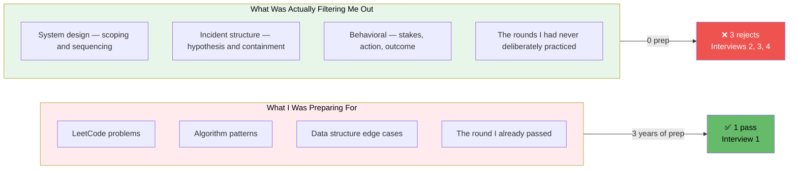
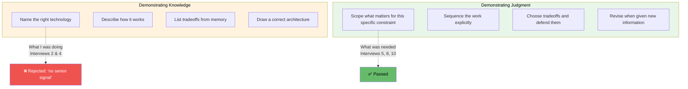

# I Did 11 Technical Interviews in 60 Days After a Layoff. Here Is What the Data Actually Shows.

> *This is not a motivation post. It is a debugging log. Eleven interviews, tracked like production incidents, with outcomes, root causes, and the one pattern that didn't appear until interview five — because I refused to see it until four rejections made it undeniable.*

---

## The Setup

Laid off in May. Three years of backend experience. Java, Spring Boot, financial services. The kind of role that used to be the easiest hire in the industry — mid-to-senior backend — and is now the most crowded position in the market, because everyone pushed out in the last eighteen months is standing in the same line.

Eleven interviews in sixty days is not impressive by social media standards. It is what actually happens when there are 200+ applicants per role and automated screening eliminates your resume for reasons no human will explain. Every one of these eleven was hard-won. The real base rate is not forty interviews a month. It is this. Anyone claiming otherwise is either extremely well-networked or performing for an audience.

I tracked every round because I debug production systems for a living, and after interview four I realized I was failing for a reason that had nothing to do with my ability to write code. This is the log.

---

## The Interview Record

### Interview 1 — Mid-Level Backend, Coding Round
**Outcome: Passed**

A two-hour live coding session. Implement a rate limiter, then extend it. I did it cleanly. I walked out feeling good about my prospects.

I passed this round and was rejected after the next one. At the time I decided the second round had been unfair. That was wrong. The coding round was the fluke — the only round in eleven interviews that tested what I had spent three years building. Everything after it tested something I had never deliberately practiced.

**Lesson:** The coding round is the round you are best at and the round that matters least at this level. An AI can pass it. The process has moved past it. I had prepared almost entirely for the filter that no longer determines the outcome.

---

### Interview 2 — Senior Backend, System Design
**Outcome: Rejected**

"Design a notification system."

I drew boxes for forty minutes. Load balancer, queue, workers, database, retry logic, dead letter queues. I knew all of it. I named the right technologies in the right places. The feedback came back: *strong technical knowledge, concern about senior-level scoping.*

I was angry for two days. I had answered everything correctly.

**Lesson:** A broad design prompt is not a quiz about whether you know what a message queue is. They assume you know that. It is a test of whether you can scope an ambiguous problem into a tractable one and sequence the work out loud. I demonstrated knowledge. They were measuring judgment. I gave them no signal of the thing they actually needed to see.

---

### Interview 3 — Mid-Level Backend, Production Incident Question
**Outcome: Rejected**

I had a genuinely strong incident to tell. A RabbitMQ consumer silently acknowledging messages and dropping the work — no error logs, no visible queue backlog, customer data lost in real time. A real production failure with real consequences and a non-obvious root cause.

I told it as a narrative. "So this happened, then we noticed, then we found it, then we fixed it." The interviewer's follow-up questions got shorter with each exchange. Rejected.

**Lesson:** The interviewer does not want the story. They want the structure of your reasoning inside the story. What was your hypothesis. What did you rule out and why. What did you do to stop the bleeding before you found root cause. What did you change structurally so it could not recur. I had a senior-level incident and I narrated it like someone who had witnessed it rather than someone who drove it.

---

### Interview 4 — Senior Backend, System Design
**Outcome: Rejected**

"Design a URL shortener."

I picked up the marker and started drawing boxes. Again. I had received the feedback from interview two. I had told myself that feedback was wrong because believing it would mean the rejection was my fault.

So I walked into interview four and made the identical mistake and received the identical feedback.

**This is the entry I am most embarrassed by, and therefore the most important one.**

I had the data after interview two. I refused to act on it. It took a second rejection, with nearly identical wording, before I stopped defending my approach and started examining it.

**Lesson:** The most expensive failure mode is not making a mistake. It is receiving accurate feedback, deciding the feedback is wrong, and making the same mistake again. I had wasted two system design rounds protecting an approach the evidence had already invalidated. The rejection was not the problem. My response to the first rejection was the problem.

---

## The Turn — What Changed Before Interview Five

Between interviews four and five I did something I should have done after interview two.

I treated my own interview record like a production incident.

I wrote down every round, every outcome, every piece of feedback. I looked for the pattern instead of the excuse. The pattern was obvious the moment I stopped flinching from it.

**Pass:** Round testing code.
**Fail:** Every round testing judgment, communication, and structured thinking under ambiguity.

The common factor was not the technology stack or the difficulty of the questions. It was that I kept demonstrating what I knew and never demonstrating how I think.

So I changed exactly one thing: I stopped trying to show I was smart and started trying to show I was someone you would want in the room when something breaks in production. In practice this meant:

- Scope before you solve
- State your sequence before you start drawing
- Frame every choice as a conscious tradeoff, not a correct answer
- Invite correction rather than defending your first move

I stopped grinding coding problems. I started rehearsing the first ninety seconds of a system design answer and the four-beat structure of an incident story — out loud, on a timer — until both were automatic.

---

### Interview 5 — Senior Backend, System Design
**Outcome: Passed to next round**

"Design a feed system."

I did not pick up the marker. I spent ninety seconds asking about scale, clarifying what mattered most, explicitly stating what I would defer, and announcing my sequence before touching the whiteboard. The interviewer leaned forward. The follow-up questions got longer instead of shorter.

**Lesson:** The fix was not more knowledge. It was the same knowledge, preceded by ninety seconds of scoping. The technical content was nearly identical to interview four, which I failed. The frame was the entire difference.

---

### Interview 6 — Senior Backend, Production Incident
**Outcome: Passed**

Same RabbitMQ incident as interview three. Different structure: hypothesis, what I ruled out, how I contained the damage before finding root cause, what I changed in the system so it could not recur. Four beats. The interviewer took notes this time. They had not done that in interview three.

**Lesson:** I did not get a better incident. I had the same incident the whole time. I got a structure. The structure was what was being evaluated, not the drama of the story.

---

### Interview 7 — Mid-Level, Take-Home Assignment
**Outcome: No response**

Twelve hours of work. A complete Spring Boot service with tests, documentation, and a brief writeup of design decisions. Submitted. No rejection. No acknowledgment. Silence.

**Lesson:** A meaningful fraction of technical interviews in this market are companies building a pipeline they have already mentally closed, or extracting free work from candidates as a side effect of a process that never had real intent. You cannot identify these from the outside. You can only cap your unpaid time investment and refuse to take the silence personally. I now timebox take-homes and decline the ones that appear to be spec work. That lesson cost twelve hours.

---

### Interview 8 — Senior Backend, System Design
**Outcome: Passed**

I needed to know whether interview five was a fluke. It was not. Same opening, same ninety-second scope, same explicit sequencing, same invitation to redirect. Same result. Passed.

**Lesson:** Senior signal is not a personality trait. It is a learnable sequence. I had been treating it as something some people are born with. It is something you rehearse until it is boring.

---

### Interview 9 — Senior Backend, Behavioral
**Outcome: Rejected**

"Tell me about a time you disagreed with a technical decision and what you did."

I rambled. I had drilled system design structure and incident structure. I had not drilled this axis at all. I gave a wandering answer with no clear stakes, no identifiable action, and no stated outcome. Rejected.

**Lesson:** I had fixed the two failure modes that cost me interviews two through four, and then walked blind into a third I had never rehearsed. The lesson from the earlier rejections was generalizable — every distinct round type is its own filter — and I had not generalized it. Passing two formats does not mean you have prepared the third.

---

### Interview 10 — Senior Backend, Full Loop
**Outcome: Offer**

By this point I had a structure for every round type, including behavioral. Coding was already strong. System design had the ninety-second open. Incident had four beats. Behavioral had stakes, action, outcome — a structure I drilled specifically after interview nine.

No weak link. Offer four days later.

**Lesson:** I did not become a meaningfully better engineer between May and July. I became someone with no undefended round. The offer came not from a new capability but from removing the failure mode that had been quietly losing me the rounds that coding strength could not compensate for.

---

### Interview 11 — Second Offer Round, Taken for Calibration
**Outcome: Passed, declined**

Took one more after the offer, partly for negotiating leverage, partly to verify interview ten was not an outlier. Ran the same structures. Passed comfortably. Declined in favor of the first offer.

**Lesson:** By the eleventh interview the structures were automatic. The thing that had cost four rejections in May was, by July, the thing I did without thinking. That is the whole arc. The skill was never the bottleneck. The structure was. And the structure is learnable in eleven reps, or, for anyone who acts on the feedback sooner than I did, in considerably fewer.

---

## The Full Record

| # | Role Level | Round Type | Outcome | Root Cause |
|---|---|---|---|---|
| 1 | Mid | Coding | ✅ Pass | — |
| 2 | Senior | System Design | ❌ Reject | No scoping, pure knowledge dump |
| 3 | Mid | Incident | ❌ Reject | Narrative, no structure |
| 4 | Senior | System Design | ❌ Reject | Same mistake as #2, ignored feedback |
| 5 | Senior | System Design | ✅ Pass | Scoping first, explicit sequencing |
| 6 | Senior | Incident | ✅ Pass | Four-beat structure applied |
| 7 | Mid | Take-home | ⬜ Silence | Company issue, not performance |
| 8 | Senior | System Design | ✅ Pass | Pattern confirmed, not a fluke |
| 9 | Senior | Behavioral | ❌ Reject | Third round type, never rehearsed |
| 10 | Senior | Full loop | ✅ Offer | No weak round |
| 11 | Senior | Full loop | ✅ Pass | Structures automatic |

---

## What the Pattern Actually Is

Read the outcomes in order. Pass, reject, reject, reject, then pass, pass, silence, pass, reject, offer, pass.

The first four are not random. They are one mistake, made four times, because I refused for two interviews to believe the feedback was accurate. The turn is not a new skill. It is the moment I treated my own rejections like production incidents — looking for the pattern, not the excuse — and then acted on what I found.



The pattern nobody tells you: at the mid-to-senior backend level in 2026, the coding round is the round you are best at and the round that matters least, because it is the only part of the process a candidate can game with two weeks of LeetCode, and the industry knows this. The rounds that actually filter for level test judgment under ambiguity, structured communication, and the ability to reason about tradeoffs out loud while being interrupted and redirected. Almost nobody deliberately practices those, because they feel like personality traits rather than learnable structures.

They are learnable structures.

---

## The Three Structures That Changed the Results

### System Design: The Ninety-Second Open

Before touching the whiteboard, run this sequence out loud:

```
1. Clarify scale — "Are we designing for thousands of users or millions?"
2. Identify the hard axis — "What is the core tradeoff: consistency vs. latency? 
  Read vs. write performance?"
3. Explicitly scope what you are deferring — "I will start with the core 
  write path and handle fan-out after we agree on the data model."
4. State your sequence — "Here is how I plan to walk through this."
```

This takes ninety seconds. It communicates exactly the judgment they are measuring. None of it requires technical knowledge you don't already have. It requires discipline to do it before you start drawing, which is harder than it sounds when the pressure is on.

### Production Incidents: The Four-Beat Structure

Every incident story has the same four components. Deliver them in this order:

```
1. Hypothesis — "My first assumption was X. I formed it because of Y signal."
2. Elimination — "I ruled out A because, B because, C because. That left X."
3. Containment — "Before I confirmed root cause, I did Z to stop the bleeding."
4. Structural change — "After the fix, I changed W so this class of problem 
  could not recur silently."
```

The story is the vehicle. The structure is what is being evaluated. The same incident told without this structure reads as a witness account. Told with it, it reads as evidence of how you think.

### Behavioral: Stakes, Action, Outcome

Every behavioral answer needs three identifiable components:

```
Stakes: What was actually at risk? Why did it matter?
Action: What specifically did YOU do? Not "we." You.
Outcome: What actually happened? What would you do differently?
```

The common failure mode is answering with context and no action, or action and no stakes, or outcome and no explanation of how you got there. The interviewer is not listening for the story. They are listening for evidence of independent judgment under real conditions.

---

## The Generalized Lesson

The failure pattern across interviews two, three, four, and nine was identical at the root: I was demonstrating knowledge in rounds that were measuring judgment. I was narrating events in rounds that were measuring reasoning structure. I was performing technical fluency in rounds that were measuring whether I could be useful in the room when things go wrong.

These are different things. They require different preparation.



You do not fix this with more LeetCode. You fix it by rehearsing the first ninety seconds of a design answer, the four-beat incident structure, and the stakes-action-outcome behavioral shape until they are automatic — until you run them under pressure without thinking about them, the way a good incident responder runs their own checklist without reading it.

---

## The Mistake I Made That Cost the Most

It was not the knowledge gap. It was interview four.

I had the data after interview two. The feedback was clear. The pattern was visible if I had been willing to look at it. I was not willing to look at it because looking at it meant accepting that the rejection was a signal about my performance rather than a signal about the interviewer's competence.

So I went into interview four with the same approach and failed in the same way.

The most expensive error in a job search — or in any debugging process — is not the first mistake. It is receiving accurate diagnostic information, deciding it is wrong because accepting it is uncomfortable, and walking into the same failure a second time with the same confident preparation.

Track your interviews. Read the feedback as data. Find the pattern after the second rejection, not the fourth. I did it the slow way. This log is the receipt.

---

## What the Market Actually Looks Like in 2026

One note that is worth saying plainly, separate from the interview mechanics:

The mid-to-senior backend market in 2026 is not what it was in 2021 or 2022. The positions exist. They are being filled. But the applicant-to-offer ratio has shifted substantially, the screening layers have multiplied, and the parts of the process that used to signal seniority — system design, incident handling, architectural judgment — are now being evaluated with more rigor and less charity than they were when engineering hiring was desperate.

This is not a reason for pessimism. It is a reason for precision. The engineers getting offers in this market are not dramatically more talented than the ones who are not. In many cases they are simply the ones who have prepared for the rounds that are actually filtering, rather than the rounds they feel most comfortable in.

Eleven interviews. Sixty days. One pattern. The coding round was never the problem. It was never going to be the problem. It took four rejections to make that undeniable, and one structural adjustment to make it irrelevant.

One round at a time.
