# 🐧 Linux Shell Habits That Matter — Complete Mastery Tutorial

> **Estimated Reading Time:** 45 minutes | **Difficulty Level:** Intermediate | **Last Updated:** 2026-08-14
>
> **Original Article:** "The Small Linux Habits That Made the Biggest Difference" by Fateyaly
>
> **Tutorial Type:** Comprehensive Deep-Dive with Hands-On Exercises, Question Bank, and Real-World Incident Walkthroughs

---

## Table of Contents

- [1. Introduction / Overview](#1-introduction--overview)
  - [The Core Philosophy](#the-core-philosophy)
  - [Why Habits Beat Commands](#why-habits-beat-commands)
  - [The 10 Habits at a Glance](#the-10-habits-at-a-glance)
- [2. Prerequisites](#2-prerequisites)
- [3. Learning Objectives](#3-learning-objectives)
- [4. The Big Picture: How Small Habits Compound](#4-the-big-picture-how-small-habits-compound)
- [5. Habit 1 — Read the System Before You Change It](#5-habit-1--read-the-system-before-you-change-it)
- [6. Habit 2 — Treat Every Command Like It Can Affect Production](#6-habit-2--treat-every-command-like-it-can-affect-production)
- [7. Habit 3 — Trust Logs More Than Assumptions](#7-habit-3--trust-logs-more-than-assumptions)
- [8. Habit 4 — Always Check the Exit Status](#8-habit-4--always-check-the-exit-status)
- [9. Habit 5 — Learn What Changed Before Hunting the Symptoms](#9-habit-5--learn-what-changed-before-hunting-the-symptoms)
- [10. Habit 6 — Watch Trends, Not Just Snapshots](#10-habit-6--watch-trends-not-just-snapshots)
- [11. Habit 7 — Use Absolute Paths in Automation](#11-habit-7--use-absolute-paths-in-automation)
- [12. Habit 8 — Automate the Work You Repeat](#12-habit-8--automate-the-work-you-repeat)
- [13. Habit 9 — Keep a Personal Incident Log](#13-habit-9--keep-a-personal-incident-log)
- [14. Habit 10 — Restart Services Last, Not First](#14-habit-10--restart-services-last-not-first)
- [15. Real-World Use Cases and Incident Walkthroughs](#15-real-world-use-cases-and-incident-walkthroughs)
- [16. Best Practices](#16-best-practices)
- [17. Anti-Patterns](#17-anti-patterns)
- [18. Performance Considerations](#18-performance-considerations)
- [19. Security Considerations](#19-security-considerations)
- [20. Troubleshooting Guide](#20-troubleshooting-guide)
- [21. Testing Strategies](#21-testing-strategies)
- [22. Practice Exercises with Solutions](#22-practice-exercises-with-solutions)
- [23. Question Bank (55 Questions)](#23-question-bank-55-questions)
- [24. Test Your Understanding (12 Questions)](#24-test-your-understanding-12-questions)
- [25. Common Interview Questions (12 Questions)](#25-common-interview-questions-12-questions)
- [26. Hands-On Lab: Build a Personal Incident Response Toolkit](#26-hands-on-lab-build-a-personal-incident-response-toolkit)
- [27. Self-Assessment Checklist](#27-self-assessment-checklist)
- [28. Pro Tips for Advanced Users](#28-pro-tips-for-advanced-users)
- [29. Summary / Key Takeaways](#29-summary--key-takeaways)
- [30. Further Reading / Resources](#30-further-reading--resources)
- [31. Learning Path Recommendations](#31-learning-path-recommendations)

---

## 1. Introduction / Overview

When people ask experienced Linux engineers how they became efficient, they usually expect answers like:

- *"Learn Bash."*
- *"Master systemd."*
- *"Use Vim."*
- *"Understand networking."*

Those are all valuable skills — but they **aren't** what transformed the way great engineers work.

The biggest improvements come from habits so small they barely feel significant at first. None of them require learning a new programming language. None involve installing sophisticated monitoring platforms or expensive observability tools. They are simply **small changes in how you interact with Linux every day**.

Individually, each habit saves a few seconds or prevents a minor mistake. Over months and years, those tiny improvements compound into:

- ⚡ Faster troubleshooting
- 🛡️ More reliable automation
- 📉 Significantly fewer production incidents

> 💡 **The One Lesson**
>
> **Great Linux users don't necessarily know more commands — they build better habits.**

### The Core Philosophy

The terminal is a powerful but unforgiving environment. It executes exactly what you type — not what you meant. The difference between a junior and senior Linux engineer is rarely raw command knowledge; it's the **discipline and process** around every command:

| Junior Approach | Senior Approach |
|----------------|-----------------|
| Restart first, ask questions later | Observe first, intervene second |
| Assume the cause from past experience | Trust logs and evidence |
| Run commands fast, verify later | Pause, verify paths, then execute |
| Snapshots only | Track trends over time |
| Rely on memory | Document everything |

### Why Habits Beat Commands

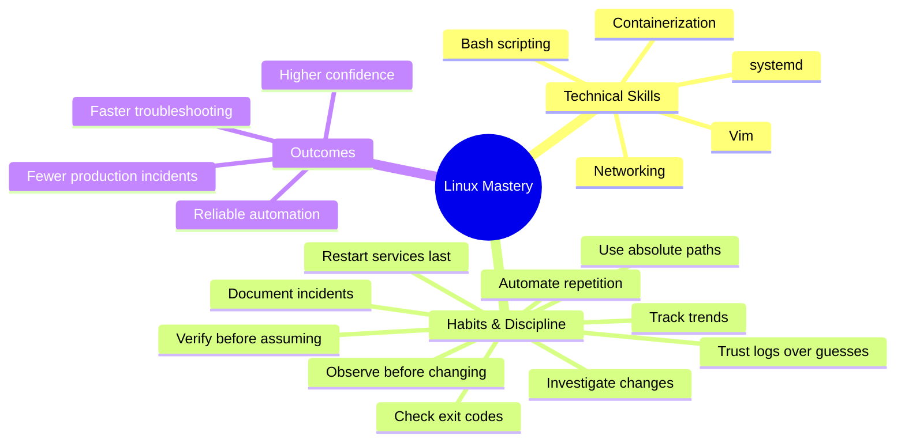

### The 10 Habits at a Glance

| # | Habit | Core Idea | Key Command(s) |
|---|-------|-----------|----------------|
| 1 | Read the system before changing it | Observe first | `systemctl status`, `journalctl`, `ss`, `df` |
| 2 | Treat every command like it can affect production | Verify before executing | `ls`, `stat`, targeted `rm`/`chmod` |
| 3 | Trust logs more than assumptions | Evidence over guessing | `journalctl -xe`, `/var/log/` files |
| 4 | Always check the exit status | Verify success/failure | `echo $?`, `set -e`, `if [ $? -ne 0 ]` |
| 5 | Learn what changed before hunting symptoms | Changes cause incidents | `git diff`, `rpm -qa`, `dpkg -l` |
| 6 | Watch trends, not just snapshots | Patterns reveal root causes | `vmstat 1`, `iostat`, `sar` |
| 7 | Use absolute paths in automation | Remove environment ambiguity | `/usr/bin/python3 /opt/scripts/backup.py` |
| 8 | Automate the work you repeat | Reduce human error | Health-check scripts, aliases |
| 9 | Keep a personal incident log | Documentation beats memory | Markdown/yaml incident templates |
| 10 | Restart services last, not first | Restart confirms, not replaces, diagnosis | `systemctl status` → `journalctl` → restart |

---

## 2. Prerequisites

Before diving into this tutorial, you should have:

- ✅ **Basic Linux command-line experience** — comfortable navigating with `cd`, `ls`, `cat`, `man`
- ✅ **A Linux environment to practice in** — any of:
  - A local Linux machine (Ubuntu, Debian, Fedora, CentOS, etc.)
  - A VM (VirtualBox, VMware, KVM)
  - A cloud instance (AWS EC2, DigitalOcean, GCP)
  - WSL2 on Windows
  - A Docker container: `docker run -it ubuntu:latest bash`
- ✅ **A basic understanding of shell scripting** — variables, `if` statements, functions
- ✅ **Root or sudo access** to practice service management (`systemctl` commands)

> ⚠️ **Note:** Some commands like `journalctl` require systemd-based distributions (Ubuntu 15.04+, Debian 8+, Fedora, RHEL/CentOS 7+). On older SysVinit systems, check `/var/log/syslog` or `/var/log/messages` instead.

### Recommended Lab Setup

```bash
# Create a safe practice environment with Docker (if you have it)
docker run -it --name linux-habits-lab ubuntu:24.04 bash

# Inside the container, install basic tools
apt update && apt install -y systemd rsyslog procps net-tools curl git vim
```

---

## 3. Learning Objectives

By the end of this tutorial, you will be able to:

1. 🎯 **Diagnose system issues systematically** using an observe-first workflow instead of guess-and-restart
2. 🛡️ **Execute dangerous commands safely** with verification checkpoints before `rm`, `chmod`, and other irreversible operations
3. 🔍 **Leverage logs as primary evidence** — using `journalctl`, `/var/log/` files, and log analysis patterns
4. ✅ **Write robust shell scripts** that check exit statuses, use `set -e`, and handle failures gracefully
5. 🔄 **Investigate recent changes** using package history, git diffs, and deployment records to find root causes
6. 📈 **Analyze system trends** with `vmstat`, `iostat`, and `sar` rather than relying on single snapshots
7. 🚀 **Create production-safe automation** using absolute paths and portable script design
8. 🤖 **Eliminate repetitive manual work** through well-designed scripts and aliases
9. 📓 **Maintain effective incident documentation** that prevents future crises
10. 🏥 **Apply restart-last decision making** to preserve diagnostic evidence during outages

---

## 4. The Big Picture: How Small Habits Compound

Before we dive into each habit, let's understand **why** small habits matter so much in Linux.

### The Compounding Feedback Loop

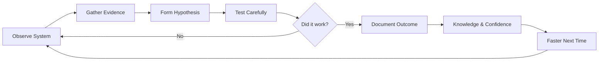

Each habit reinforces the others. When you observe first, you gather better evidence. Better evidence leads to better hypotheses. Better hypotheses lead to fewer failed interventions. Fewer failures mean fewer incidents — and each documented incident makes you faster next time.

### The 1% Rule Applied to Sysadmin Work

The "1% rule" — improving by just 1% each day — applies perfectly to Linux:

| If you save just... | Over a year (250 working days) | That's... |
|---------------------|-------------------------------|-----------|
| 30 seconds per command | 2 hours per month | 24 hours saved per year |
| 1 production incident per quarter | 4 incidents avoided per year | 4 × 4-hour postmortems saved |
| 5 minutes of re-diagnosis per issue | ~20 hours per year | Nearly 3 full workdays |

> 💡 **Key Insight:** You don't need dramatic changes. Ten small habits, each saving a handful of seconds, compound into a dramatically more efficient and reliable workflow.

### Quick Recap

- Habits > raw command knowledge for long-term effectiveness
- Small improvements compound over time
- The 10 habits form an interconnected feedback loop
- Each habit independently saves time; together they prevent incidents

---

## 5. Habit 1 — Read the System Before You Change It

> **"Observation should always come before intervention."**

### The Problem

Early in most Linux journeys, the first instinct when a service fails is:

```bash
systemctl restart nginx
```

Sometimes it works. More often, it **erases valuable evidence** that could have explained the failure. When you restart a service, you:

- ❌ Lose the in-memory state that showed the failure
- ❌ Reset counters, uptime, and runtime data
- ❌ Destroy core dumps or crash artifacts
- ❌ Reset file descriptors, sockets, and connection state
- ❌ Make diagnosis significantly harder

### The Habit in Action

Before changing anything, observe the current state. Your first commands should be:

```bash
# 1. What's the service status?
systemctl status nginx

# 2. What do the logs say?
journalctl -u nginx

# 3. What ports and listeners are active?
ss -tulpn

# 4. How full is the disk?
df -h
```

Within seconds, you have a picture of what's happening instead of guessing.

### Step-by-Step Observe-First Workflow

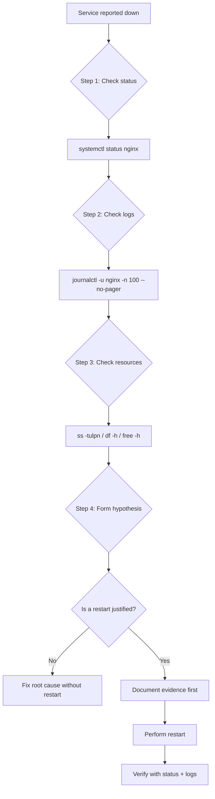

### Real-World Example

**Scenario:** A web server went down at 2:00 AM. The on-call engineer's old instinct was `systemctl restart nginx`. But following the observe-first habit:

```bash
# Step 1: Status
systemctl status nginx
# Output: Active: failed (Result: exit-code)
# Process: 2345 ExecStart=/usr/sbin/nginx (code=exited, status=1/FAILURE)

# Step 2: Logs
journalctl -u nginx -n 50
# Output: "bind() to 0.0.0.0:80 failed (98: Address already in use)"
# Output: "nginx: [emerg] bind() to 0.0.0.0:80 failed"

# Step 3: Who's on port 80?
ss -tulpn | grep :80
# Output: LISTEN 0 511 0.0.0.0:80 users:(("apache2",pid=9876))
```

**Root cause found:** A leftover Apache process was holding port 80. Restarting nginx would have failed again. The fix was to stop Apache first — a diagnosis that took 10 seconds because observation came before intervention.

### Common Mistakes

| Mistake | Consequence | Better Approach |
|---------|-------------|-----------------|
| `systemctl restart` immediately | Destroys evidence | Check `status` + `journalctl` first |
| Checking only one metric | Misses related issues | Cross-check status, logs, ports, disk |
| Ignoring `journalctl -xe` context | Skips the actual error | Use `-xe` for the full error context |
| Guessing from past incidents | Wrong diagnosis | Trust current evidence over memory |

---

## 6. Habit 2 — Treat Every Command Like It Can Affect Production

> **"The terminal executes exactly what you type — not what you meant."**

### The Danger

Linux gives you enormous power. With a single command, you can:

- ⚡ Terminate processes (`kill`, `pkill`, `killall`)
- 💾 Overwrite filesystems (`dd`, `mkfs`)
- 🗑️ Remove directories (`rm -rf`)
- 🔐 Change permissions across thousands of files (`chmod -R`)

A misplaced wildcard, a wrong variable, or a typo can cause catastrophic, irreversible damage.

### The Habit in Action

Experienced engineers develop the habit of **slowing down before pressing Enter**.

**Instead of running:**

```bash
rm -rf /var/log/*
```

**they first verify:**

```bash
ls /var/log
```

**Instead of recursively changing permissions:**

```bash
chmod -R 777 app/
```

**they inspect existing permissions first:**

```bash
ls -la app/
stat app/
```

### The Safe Command Workflow

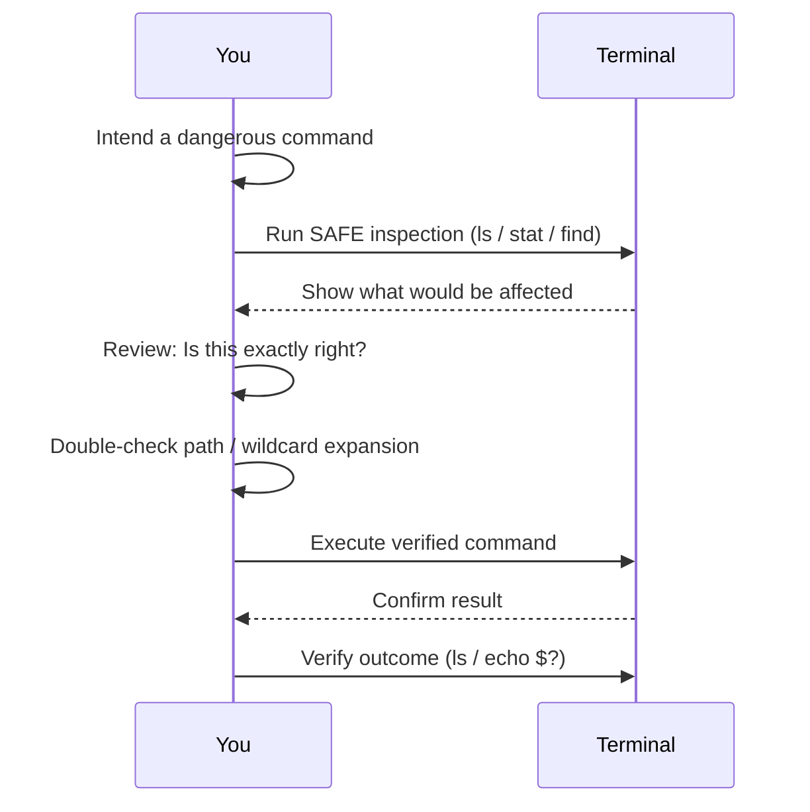

### Dangerous Commands and Their Safe Versions

| Dangerous Command | Risk | Safe Verification Steps |
|-------------------|------|--------------------------|
| `rm -rf /var/log/*` | Deletes ALL logs if path wrong | `ls /var/log`, `echo /var/log/*` to preview expansion |
| `chmod -R 777 app/` | Insecure perms everywhere | `ls -laR app/ \| head`, `find app/ -type f -exec stat {} \;` |
| `dd if=/dev/sda of=/dev/sdb` | Overwrites wrong drive | `lsblk`, `fdisk -l` to confirm device letters |
| `kill -9 $(pgrep -f java)` | Kills unrelated Java processes | `pgrep -af java` to preview PIDs first |
| `mv file.txt /var/www/` | Moves to wrong path | `ls -la /var/www/`, `pwd` to confirm location |

### Real-World Horror Story (Avoid This)

A junior admin ran the following to clean log files:

```bash
# Intent: Remove logs older than 7 days from /var/log/app/
rm -rf /var/log/*.log
```

But the intent was wrong in two ways:

1. The command was **run from the root of the filesystem** while a production database was writing to `/var/log/`
2. The wildcard `*.log` matched **application logs still in active use**

Result: Production database logs were deleted mid-write, causing a crash and hours of downtime.

**The safe version:**

```bash
# Step 1: Preview
find /var/log/app -name "*.log" -mtime +7 -print

# Step 2: Verify count BEFORE deleting
find /var/log/app -name "*.log" -mtime +7 | wc -l

# Step 3: Delete with find (which is safer than rm -rf)
find /var/log/app -name "*.log" -mtime +7 -delete
```

> 💡 **Pro Tip:** Use `find -delete` instead of `rm -rf` for batch deletions. `find` lets you preview matches first and is less prone to recursive-path mistakes.

### The 5-Second Pause Rule

Before pressing Enter on any command that:
- Deletes data
- Changes permissions/ownership
- Kills processes
- Writes to raw devices
- Affects many files at once

**Pause for 5 seconds and ask:**

1. ❓ Is this the exact path I intend?
2. ❓ Will this wildcard expand the way I expect?
3. ❓ Am I in the right directory? (`pwd`)
4. ❓ What does `--help` or `man` say about this flags? (e.g., `rm -r` vs `rm -R` vs `rm -rf`)
5. ❓ Can I test this on a sample first?

---

## 7. Habit 3 — Trust Logs More Than Assumptions

> **"Every minute spent reading logs saves several minutes of speculation."**

### Why Logs Matter

Applications fail. Services crash. Deployments go wrong. When something behaves unexpectedly, it's tempting to jump straight to conclusions based on past experience or intuition.

But the system has already **told you what happened** — in the logs. Learning to read them effectively transforms your troubleshooting.

### The Log Hierarchy

```mermaid
flowchart TD
    A[Unexpected Behavior] --> B{What kind of service?}
    B -->|systemd service| C[journalctl -xe]
    B -->|Docker container| D[docker logs container_name]
    B -->|Traditional app| E[Check /var/log/ files]
    C --> F{Check app-specific logs}
    D --> F
    E --> F
    F --> G[/var/log/nginx/access.log]
    F --> H[/var/log/nginx/error.log]
    F --> I[/var/log/mysql/error.log]
    F --> J[/var/log/syslog or messages]
    F --> K[/var/log/auth.log]
    F --> L[Application logs in /opt/app/logs]
```

### Log Sources on a Typical System

| Log Source | Location | Typical Issues Revealed |
|------------|----------|------------------------|
| systemd journal | `journalctl` | Service crashes, OOM kills, failed starts |
| Syslog | `/var/log/syslog` (Debian), `/var/log/messages` (RHEL) | Kernel messages, daemon errors |
| Authentication | `/var/log/auth.log` | Failed logins, sudo usage, SSH issues |
| Web server | `/var/log/nginx/error.log`, `/var/log/apache2/error.log` | 5xx errors, TLS failures, connection issues |
| Database | `/var/log/mysql/error.log`, PostgreSQL logs | Connection failures, corruption, slow queries |
| Kernel | `dmesg` / `journalctl -k` | Hardware failures, OOM killer, driver issues |
| Cron | `/var/log/cron` or journal | Failed jobs, permission errors |

### Reading Logs Effectively

```bash
# Full error context with journalctl
journalctl -xe

# Last 100 lines for a specific service
journalctl -u docker -n 100 --no-pager

# Logs from the last hour
journalctl --since "1 hour ago"

# Follow logs live during reproduction
journalctl -u nginx -f

# Find errors and warnings only
journalctl -p err -b

# Traditional logs
tail -f /var/log/nginx/error.log
grep -i "error\|failed\|denied" /var/log/syslog | tail -50
```

### Common Issues Found in Logs

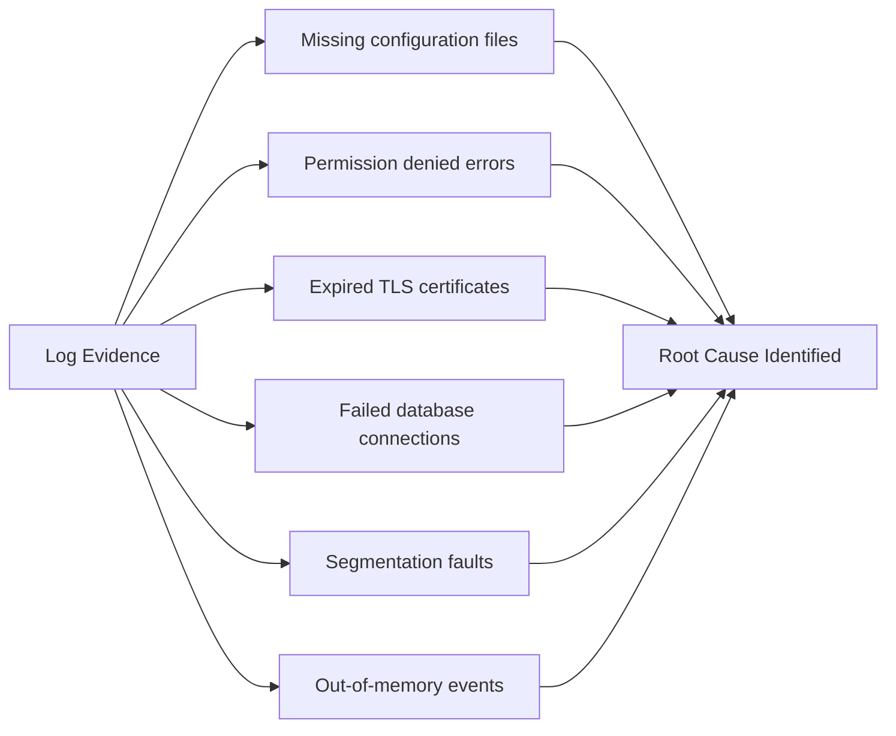

### Real-World Example

**Symptom:** Users report that the application is intermittently slow.

**Assumption trap:** "The database must be overloaded — let's scale up."

**Evidence-first approach:**

```bash
# Look at the application's own logs
journalctl -u myapp --since "1 hour ago" | grep -i "error\|timeout\|failed"

# Check the database logs
tail -100 /var/log/mysql/error.log

# Check system-level errors
journalctl -p err -b --since "1 hour ago"
```

**What the logs revealed:** The app was throwing `Connection pool exhausted` errors with a warning: `max pool size 5 reached` — because a code deployment quadrupled traffic but the connection pool configuration wasn't updated. No amount of database scaling would have helped. The fix was a config change in the app.

> 💡 **Pro Tip:** Setup log rotation policies (`logrotate`) so logs never fill the disk, and use structured logging (JSON) when possible for easier automated analysis.

---

## 8. Habit 4 — Always Check the Exit Status

> **"Linux communicates success and failure through exit codes."**

### Understanding Exit Codes

Every Linux command returns an exit status — an integer between 0 and 255:

| Exit Code | Meaning |
|-----------|---------|
| `0` | Success |
| `1` | General error |
| `2` | Misuse of shell builtins / command syntax error |
| `126` | Command found but not executable |
| `127` | Command not found |
| `128 + N` | Killed by signal N (e.g., 137 = killed by SIGKILL) |
| `130` | Terminated by Ctrl+C (SIGINT) |
| Other | Application-defined errors |

### Checking Exit Status

```bash
# Run a command
rsync backup/ /backup/latest/

# Check the exit status
echo $?

# If it printed 0, the command succeeded
# Anything else indicates an error
```

### Scripting with Exit Status

**Naive approach — assuming success:**

```bash
#!/bin/bash

rsync backup/ /backup/latest/
echo "Backup completed successfully."
```

**Problem:** This prints success even if `rsync` failed silently.

**Robust approach — verify:**

```bash
#!/bin/bash

rsync backup/ /backup/latest/

if [ $? -ne 0 ]; then
    echo "Backup failed."
    exit 1
fi

echo "Backup completed successfully."
```

**Even better — modern approach with `set -e`:**

```bash
#!/bin/bash
set -e          # Stop the script on first error
set -u          # Error on undefined variables
set -o pipefail # Pipeline returns the last non-zero exit code

rsync backup/ /backup/latest/
echo "Backup completed successfully."
```

### The Exit Status Decision Flow

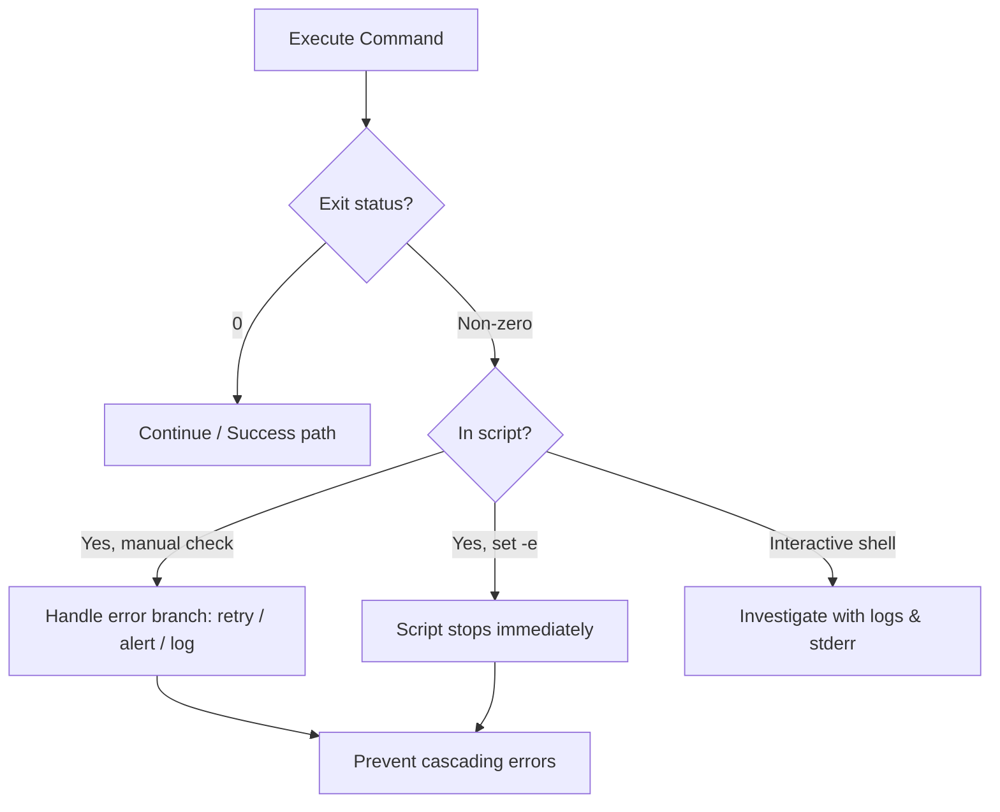

### Understanding `set -e`, `set -u`, and `set -o pipefail`

```bash
#!/bin/bash
set -euo pipefail
```

| Option | Effect | Why It Matters |
|--------|--------|----------------|
| `set -e` | Exit immediately if any command fails | Prevents cascading errors from broken assumptions |
| `set -u` | Error on undefined variable usage | Catches typos: `$PATH` vs `$PAHT` |
| `set -o pipefail` | Pipeline returns first non-zero status | `cmd1 \| cmd2` fails if `cmd1` fails, not just `cmd2` |

**Demonstration of `pipefail`:**

```bash
# Without pipefail — false negative
false | grep "pattern"
echo $?  # 1 (grep's status — actually this returns 1 anyway in this example)
# Better example:
true | false
echo $?  # 1, but in a real pipeline the last command's status masks earlier failures

# With pipefail — proper behavior
set -o pipefail
true | false
echo $?  # 1 (correct: catches the failure)
```

### Real-World Example: Silent Cron Failure

**Scenario:** A nightly backup script schedules via cron. The script "appears" to run, but the backup silently fails.

```bash
# Faulty script
#!/bin/bash

tar -czf /backup/app_$(date +%Y%m%d).tar.gz /opt/myapp
echo "Backup complete."
```

**Why it fails silently:** If `tar` encounters permission errors or I/O problems, it may exit non-zero but the script still prints "Backup complete" and cron sees a successful exit.

**Fixed version:**

```bash
#!/bin/bash
set -euo pipefail

BACKUP_DIR="/backup"
TARBALL="${BACKUP_DIR}/app_$(date +%Y%m%d).tar.gz"

# Create backup
if ! tar -czf "$TARBALL" /opt/myapp 2>>/var/log/backup_errors.log; then
    echo "ERROR: Backup failed on $(date)" >> /var/log/backup_status.log
    exit 1
fi

# Verify backup integrity
if ! tar -tzf "$TARBALL" >/dev/null 2>&1; then
    echo "ERROR: Backup integrity check failed on $(date)" >> /var/log/backup_status.log
    exit 1
fi

echo "Backup successful at $(date)" >> /var/log/backup_status.log
```

Now cron (or a monitoring tool) will see a **non-zero exit** and alert the team — or at minimum, the status log will reveal the failure pattern.

---

## 9. Habit 5 — Learn What Changed Before Hunting the Symptoms

> **"Many incidents don't begin with a mysterious bug. They begin with a change."**

### The Principle

Most production incidents follow this pattern:

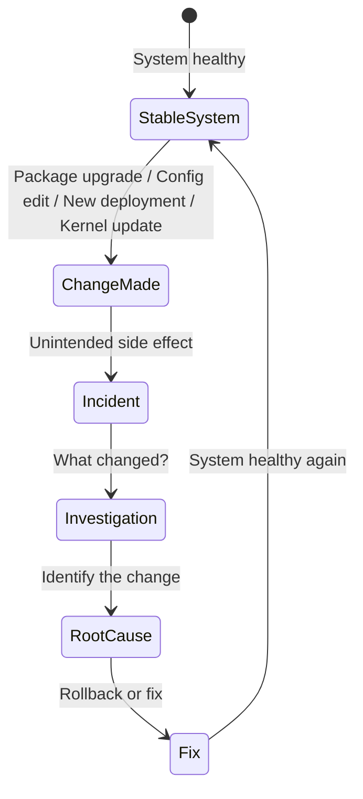

### The Investigation Workflow

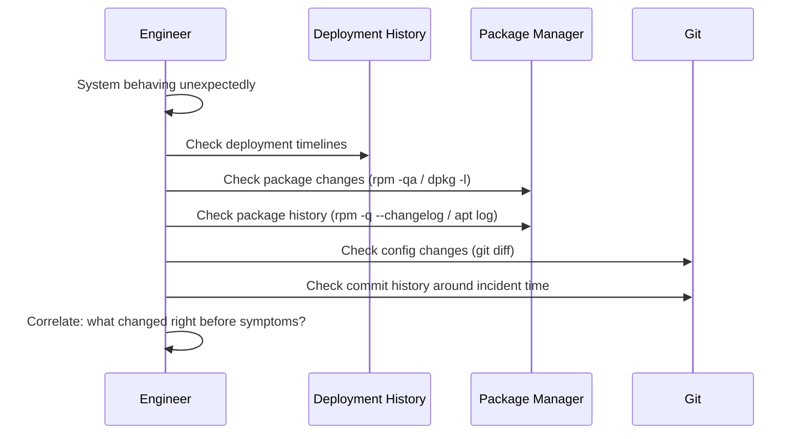

### Key Commands

```bash
# Git changes in configs/code
git diff
git log --oneline -10

# Installed packages (RPM-based: Fedora, RHEL, CentOS)
rpm -qa
rpm -qa --last | head -20      # Recently installed
rpm -q --changelog nginx       # Changelog for a package

# Installed packages (Debian-based: Ubuntu, Debian)
dpkg -l
grep " install " /var/log/dpkg.log  # Installation history
ls /var/log/apt/history.log        # Apt history

# Kernel updates
uname -r                    # Current kernel
ls /boot/vmlinuz-*          # Installed kernels

# Recent file modifications (find what changed on disk)
find /etc -type f -mtime -1 -print      # Configs changed in last day
find /opt -type f -mtime -1 -print      # App files changed recently

# Systemd unit changes
systemctl cat nginx         # Current unit definition
systemctl list-timers       # Check scheduled changes
```

### Real-World Example

**Symptom:** Database queries suddenly taking 10× longer.

**Wrong approach:** Spend hours tuning indexes, analyzing query plans, and blaming traffic.

**Change-first approach:**

```bash
# 1. When did the database config change?
stat /etc/mysql/mysql.conf.d/mysqld.cnf
# Output: Modify: 2026-08-12 14:30:22

# 2. What packages changed recently?
grep " install " /var/log/dpkg.log | tail -20
# Output: 2026-08-12 14:25:01 install mysql-server-8.0:amd64

# 3. What changed in the config?
# (Restore from backup or check git history)
git diff HEAD~1 -- mysqld.cnf
# Output: -innodb_buffer_pool_size = 8G
# Output: +innodb_buffer_pool_size = 512M
```

**Root cause found:** A package upgrade reset the config, shrinking the buffer pool from 8GB to 512MB. The fix was restoring the correct config — no query tuning needed.

> 💡 **Pro Tip:** Keep configs in version control (GitOps). Even `/etc/` can be managed with tools like `etckeeper`.

---

## 10. Habit 6 — Watch Trends, Not Just Snapshots

> **"A single snapshot answers 'What?' A trend often answers 'Why?'"**

### The Problem with Snapshots

Running `top` tells you what is happening right now. Sometimes that's enough. Often it isn't.

Performance problems usually develop over time:

- 📈 Memory gradually increases (leak)
- ⏰ CPU usage spikes every hour (scheduled job)
- 💾 Disk I/O grows during backups
- 🌐 Network latency appears only under heavy load

### Snapshot vs. Trend Tools

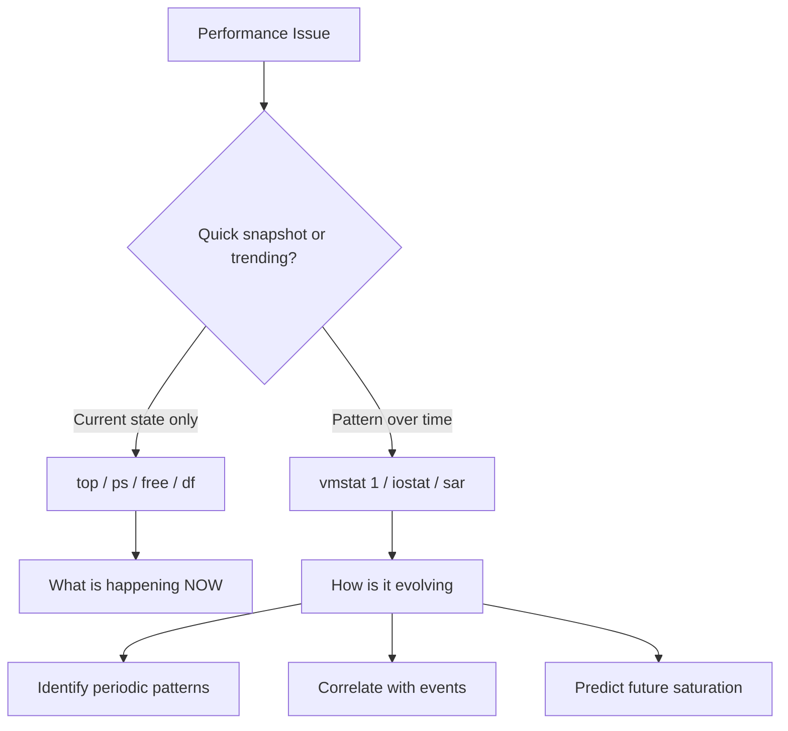

### Key Trend Tools

```bash
# vmstat — virtual memory statistics every second
vmstat 1

# Output:
# procs -----------memory---------- ---swap-- -----io---- -system-- ------cpu-----
#  r  b   swpd   free   buff  cache   si   so    bi    bo   in   cs us sy id wa st
#  1  0      0 1245672  89234 2045678    0    0    12    45  500  800  5  2 92  1  0
#  2  0      0 1240321  89234 2045678    0    0    34    67  512  822  7  3 89  1  0

# iostat — I/O statistics
iostat -x 2

# sar — system activity reporter (from sysstat package)
sar -u 5        # CPU trends every 5 seconds
sar -r 5        # Memory trends
sar -d 5        # Disk I/O trends
sar -n DEV 5    # Network trends
sar -q 5        # Load average trends

# View historical data sar has collected over time
sar -u -f /var/log/sysstat/sa15   # Data from the 15th
```

### Interpreting `vmstat` Trends

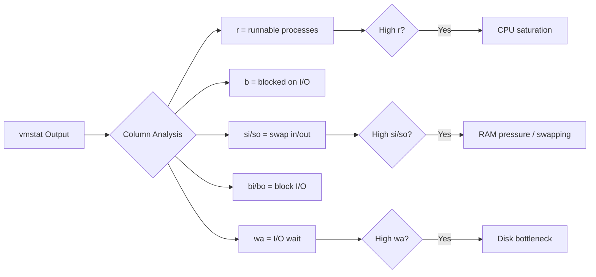

### Real-World Example: The Hourly Spike

**Symptom:** Users report the app slows down around 3:00 PM every day.

**Snapshot approach:** Check `top` at 3:00 PM — see high CPU, conclude "server is slow."

**Trend approach:**

```bash
# Capture CPU trend for 10 minutes
sar -u 30 20
```

**Output analysis revealed:** CPU spikes in a regular pattern every hour, but the *memory* trend showed a slow leak. By 3 PM, RAM is exhausted and the system starts swapping — consuming massive CPU.

**Root cause:** A scheduled job (`getstats.py`) that runs hourly leaks memory. By late afternoon, the accumulated leak forces heavy swapping.

**Bonus:** `vmstat 1` would show rising `si`/`so` columns (swap in/out) confirming the memory-pressure diagnosis.

### The Diagnostic Decision Tree

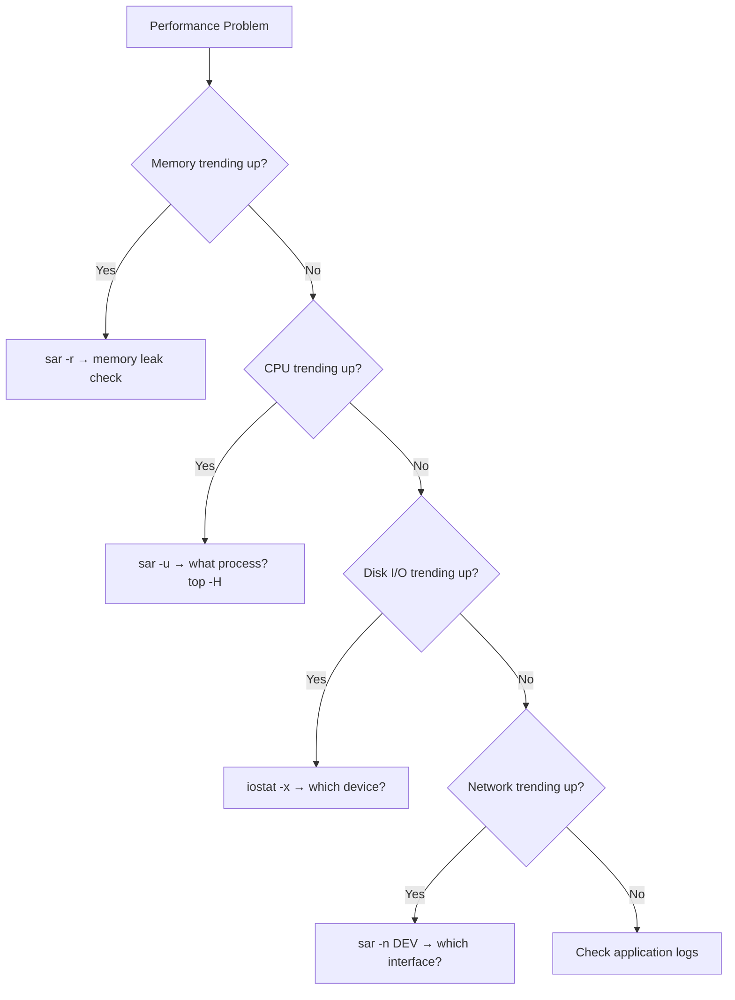

---

## 11. Habit 7 — Use Absolute Paths in Automation

> **"Automation often runs with a completely different environment."**

### The Problem: Silent Environment Differences

A script runs perfectly from your terminal. Cron executes it. Everything fails. Why?

Because **automation runs with a different environment**:

| Environment Variable | Interactive Shell | Cron | systemd Service |
|---------------------|-------------------|------|-----------------|
| `PATH` | `/usr/local/sbin:/usr/local/bin:/usr/sbin:/usr/bin:/sbin:/bin` | `/usr/bin:/bin` (minimal) | Minimal or empty |
| `HOME` | `/home/user` | Root's or undefined | Usually `/root` or `/` |
| Working directory | Your `pwd` | `$HOME` or `/` | `/` |

### The Classic Cron PATH Disaster

```bash
# A script that "works fine when I run it"
#!/bin/bash

python backup.py
tar -czf backup.tar.gz /data
```

From the terminal, `python` and `tar` resolve correctly. But under cron:

```bash
# Cron runs with minimal PATH
# "python: command not found"
# "tar: command not found"
```

Everything fails — but the script's `echo "Done"` still runs and cron logs success.

### The Fix: Absolute Paths

```bash
#!/bin/bash

# Instead of:
python backup.py

# Prefer:
/usr/bin/python3 /opt/scripts/backup.py

# Instead of:
tar

# Prefer:
/usr/bin/tar
```

### Finding the Right Absolute Path

```bash
# Find where a command lives
which python3
# /usr/bin/python3

which tar
# /usr/bin/tar

command -v rsync
# /usr/bin/rsync

# Fully qualified aliases
type -a ls
# ls is aliased to `ls --color=auto'
# /usr/bin/ls
```

### Production-Grade Automation Headers

```bash
#!/bin/bash
set -euo pipefail

# Define absolute paths at the top of every script
PYTHON="/usr/bin/python3"
TAR="/usr/bin/tar"
SCRIPT_DIR="/opt/scripts"
LOG_DIR="/var/log/myapp"
CONFIG_DIR="/etc/myapp"

# Always cd to an explicit working directory
cd "$SCRIPT_DIR"

# Use full paths for files
$PYTHON "$SCRIPT_DIR/backup.py"

# Use full paths for output
$TAR -czf "$LOG_DIR/backup_$(date +%F).tar.gz" "$CONFIG_DIR"
```

### Comparing Approaches

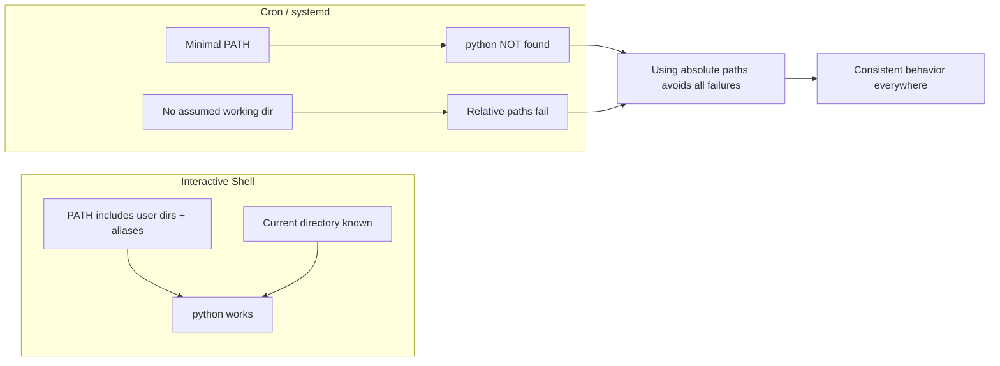

### Additional Environment Hardening

```bash
#!/bin/bash
set -euo pipefail

# 1. Force a clean environment
env -i \
    PATH="/usr/local/sbin:/usr/local/bin:/usr/sbin:/usr/bin:/sbin:/bin" \
    HOME="/root" \
    /usr/bin/python3 /opt/scripts/backup.py

# 2. Or explicitly export PATH at the top (simpler)
export PATH="/usr/local/sbin:/usr/local/bin:/usr/sbin:/usr/bin:/sbin:/bin"

# 3. For cron, add PATH to the crontab itself
# crontab -e
# PATH=/usr/local/sbin:/usr/local/bin:/usr/sbin:/usr/bin:/sbin:/bin
# 0 2 * * * /opt/scripts/backup.sh
```

> 💡 **Pro Tip:** Use `#!/usr/bin/env bash` only in interactive-ish scripts. For system automation (cron, systemd), use explicit `/bin/bash` and full paths.

---

## 12. Habit 8 — Automate the Work You Repeat

> **"Why am I still doing this manually?"**

### The Principle

Whenever you catch yourself typing the same sequence of commands repeatedly, stop and ask: **"Why am I still doing this manually?"**

Automation isn't just about saving time — it **reduces the chance of forgetting an important diagnostic step**.

### From Manual to Automated

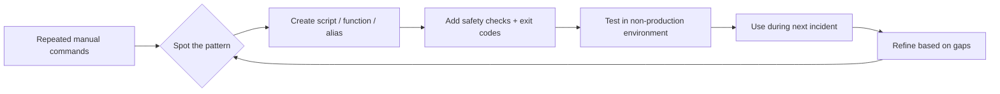

### Example: The Health-Check Script

**Manual approach — run each command during every incident:**

```bash
hostname
uptime
free -h
df -h
ss -tulpn
systemctl --failed
journalctl -p err -b
```

**Automated approach — one script provides a complete snapshot:**

```bash
#!/bin/bash
# /opt/scripts/health-check.sh
# Purpose: Collect a standard system health snapshot for incident response
set -euo pipefail

echo "=========================================="
echo " System Health Snapshot — $(date)"
echo "=========================================="

echo -e "\n[1] Hostname"
hostname

echo -e "\n[2] Uptime / Load"
uptime

echo -e "\n[3] Memory"
free -h

echo -e "\n[4] Disk Usage"
df -h

echo -e "\n[5] Listening Ports"
ss -tulpn

echo -e "\n[6] Failed Services"
systemctl --failed

echo -e "\n[7] Errors This Boot"
journalctl -p err -b --no-pager | tail -30

echo -e "\n[8] Top Processes by CPU"
ps aux --sort=-%cpu | head -10

echo -e "\n[9] Top Processes by Memory"
ps aux --sort=-%mem | head -10

echo -e "\n=========================================="
echo " Snapshot complete: $(date)"
echo "=========================================="
```

**Make it executable and add to PATH convenience:**

```bash
chmod +x /opt/scripts/health-check.sh
# Optionally create an alias
alias hc="/opt/scripts/health-check.sh"
echo 'alias hc="/opt/scripts/health-check.sh"' >> ~/.bashrc
```

### Levels of Automation

| Level | Example | When to Use |
|-------|---------|-------------|
| Alias | `alias ll='ls -lah'` | Tiny, frequent commands |
| Shell function | `function ports() { ss -tulpn \| grep :$1; }` | Parameterized quick checks |
| Standalone script | `/opt/scripts/health-check.sh` | Multi-step diagnostics |
| Cron job | `0 2 * * * /opt/scripts/backup.sh` | Scheduled recurring tasks |
| systemd timer | `systemctl enable --now backup.timer` | More reliable than cron with logging |
| CI/CD pipeline | Jenkins, GitLab CI | Deployments and tests |

### Automation Checklist

Before automating anything, verify:

- ✅ Script includes `set -euo pipefail`
- ✅ Uses absolute paths
- ✅ Has proper exit codes
- ✅ Handles errors gracefully (retry, alert, log)
- ✅ Is idempotent (safe to run multiple times)
- ✅ Works from cron/systemd (not just interactive shell)
- ✅ Logs output for troubleshooting
- ✅ Was tested in a safe environment first

---

## 13. Habit 9 — Keep a Personal Incident Log

> **"Experienced engineers aren't simply knowledgeable. They build systems that help them remember."**

### Why Documentation Wins

Every production issue teaches something valuable. But relying on memory is fragile — especially under pressure, months later, when a similar incident appears.

An incident log turns **one painful debugging session into reusable knowledge for life**.

### What to Record

| Field | Description | Example |
|-------|-------------|---------|
| Date/Time | When it happened | 2026-08-12 14:30 UTC |
| Symptoms | What users observed | API calls timing out, 5xx errors |
| Root cause | What actually caused it | Connection pool exhausted |
| Commands used | The diagnostic commands that helped | `journalctl -u api -n 500` |
| Logs examined | Which logs revealed the issue | `/var/log/api/error.log` |
| Fix applied | What resolved it | Increased pool size to 50 |
| Lessons learned | What to remember for next time | Monitor pool usage before scaling DB |

### Incident Log Template

```markdown
# Incident Log — [INCIDENT_ID]

## Date
YYYY-MM-DD HH:MM (Timezone)

## Severity
[SEV-1 | SEV-2 | SEV-3 | SEV-4]

## Symptoms
- What did users/customers observe?
- Any error messages?

## Timeline
- HH:MM — First report
- HH:MM — Investigation started
- HH:MM — Root cause identified
- HH:MM — Fix deployed
- HH:MM — Confirmed resolved

## Root Cause
(One paragraph explanation)

## Diagnostic Commands Used
```bash
# Commands that revealed the root cause
```

## Logs Examined
- Path/command, what they showed

## Fix Applied
(What was done to resolve)

## Verification
(How you confirmed the fix worked)

## Lessons Learned
- What would have found this faster?
- What monitoring could have caught it earlier?
- What documentation should exist?

## Related Incidents
- [INC-001], [INC-003]
```

### The Incident Log Feedback Loop

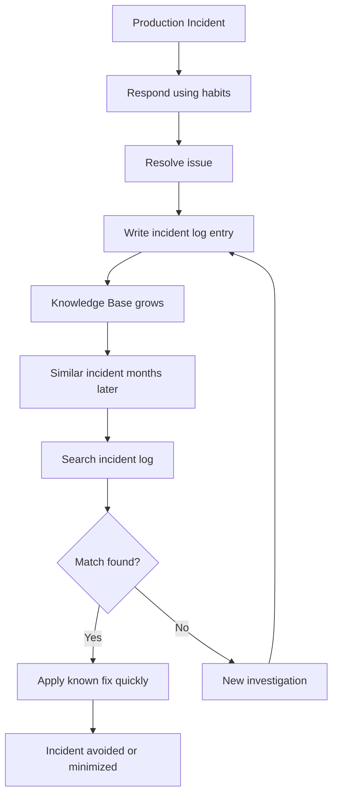

### Real-World Example of Documentation Payoff

**Incident (Month 1):** A server ran out of disk space because logrotate wasn't configured for a new application. Recovery took 3 hours (deleting logs, configuring rotation, testing).

**Incident log entry recorded:** symptoms (disk full), root cause (no logrotation), commands used (`df -h`, `du -sh /*`, `logrotate -d`), fix (logrotate config).

**Similar incident (Month 7):** A different app starts filling disk. The engineer searches the incident log, finds the entry within minutes, knows exactly what to check first (`du -sh /var/log/* | sort -h`), and resolves it in **20 minutes** instead of 3 hours.

That's the compounding power of documentation.

### Tools for Incident Logs

| Tool | Pros | Cons |
|------|------|------|
| Plain markdown files | Simple, searchable with `grep`/`rg`, versionable in git | No built-in search UI |
| Jira/Linear | Team collaboration, integration | Heavy for personal use |
| Notion/Confluence | Nice search and formatting | Not terminal-friendly |
| Obsidian | Local-first, graph view, backlinks | Extra setup |
| CLI notes (`nb`) | Terminal-based, searchable | Less mature |

> 💡 **Pro Tip:** Keep a `~/incidents/` directory versioned in git. `git log` on the incidents directory itself becomes your incident history timeline.

---

## 14. Habit 10 — Restart Services Last, Not First

> **"A restart should confirm your diagnosis, not replace it."**

### Why Engineers Restart Too Early

Restarting a service is easy. Understanding why it failed is harder. That's precisely why many engineers restart too early:

- 😰 Pressure to restore service fast
- 🧠 Pattern recognition from past incidents
- 🏃 No time to investigate deeply
- 📱 Monitoring insists on immediate action

But restarting too early:

1. ❌ Destroys the evidence (in-memory state, crash dumps, counters)
2. ❌ Hides symptoms while the root cause quietly remains
3. ❌ Creates a "restart dependency" where the same incident recurs
4. ❌ Misses preventative fixes

### The Restart-Last Decision Framework

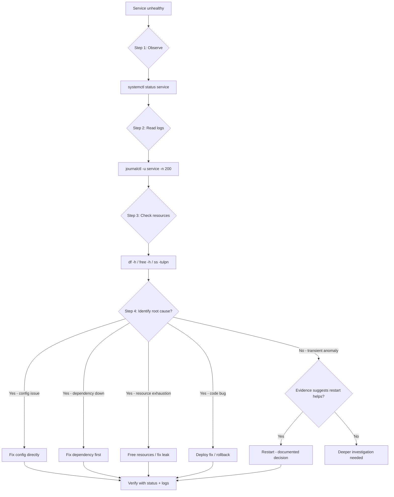

### Evidence Collection Template (Before Any Restart)

```bash
# Step 1: Service status and why it stopped
systemctl status nginx

# Step 2: The last 200 log lines — even after the failure
journalctl -u nginx -n 200 --no-pager

# Step 3: Resource snapshot
df -h
free -h
uptime

# Step 4: Network listeners
ss -tulpn

# Step 5: Save the evidence BEFORE restarting
journalctl -u nginx --since "2 hours ago" > /tmp/nginx_evidence_$(date +%F_%H%M).log
cp /var/log/nginx/error.log /tmp/nginx_error_evidence.log

# Now, and only now, consider a restart
systemctl restart nginx

# Verify
systemctl status nginx
journalctl -u nginx -n 20
```

### When a Restart IS Legitimate

| Situation | Why Restart Helps | Example |
|-----------|-------------------|---------|
| Deadlocked process | Releases locks | App stuck waiting on a mutex |
| Memory leak (temporary fix) | Clears leaked memory | Leak scheduled to be fixed in next deploy |
| Corrupted in-memory state | Rebuilds state | App holds stale cached config |
| Post-update activation | Loads new code | After binary/config upgrade |
| Known transient infrastructure event | Recovers from external blip | DB restarted, app lost connection |

### Real-World Example: Restart-Induced Recurrence

**Symptom:** The payment service crashes every 3 days.

**Wrong approach (restart-first):**

```bash
# Day 1: Restart works
systemctl restart payments
# Service comes back up. Incident closed.

# Day 4: Same crash
systemctl restart payments
# Back up again. "Flaky service."

# Day 7: Same crash... pattern continues
# The team is now in a restart treadmill
```

**Right approach (restart-last):**

```bash
# Day 4: Capture evidence first
systemctl status payments
journalctl -u payments -n 200 --no-pager > /tmp/payments_crash.log

# Read the evidence
cat /tmp/payments_crash.log
# Output: "java.lang.OutOfMemoryError: Java heap space"
# Output: "Exception in thread 'scheduler-pool-4'"

# Root cause: A thread-safety bug in the scheduler causing memory leak
# Fix: Deploy patched version (not a restart)
```

One documented investigation breaks the restart loop for good.

---

## 15. Real-World Use Cases and Incident Walkthroughs

### Use Case 1: The Disk-Full Nightmare

**Scenario:** A production database server's disk is 100% full. The database is read-only. Customers cannot complete purchases.

**Step 1 — Observe:**

```bash
df -h
# Filesystem      Size  Used Avail Use% Mounted on
# /dev/sda1        50G   50G     0 100% /

# What's taking up space?
du -xh --max-depth=1 / | sort -h | tail -20
# 30G  /var
# 10G  /opt
#  5G  /home
```

**Step 2 — Drill into `/var`:**

```bash
du -xh --max-depth=2 /var | sort -h | tail -20
# 28G /var/log
# 1G  /var/lib
```

**Step 3 — Find the largest log files:**

```bash
find /var/log -type f -size +100M -exec ls -lh {} \;
# 18G /var/log/mysql/error.log
# -rw-r----- 1 mysql adm 18G Aug 14 02:00 error.log
```

**Step 4 — Root cause:**

```bash
grep -c "ERROR" /var/log/mysql/error.log
# 200000+ errors — the log grew because of recurring DB errors
# This is a SYMPTOM. The errors need fixing, not just the log truncation.
```

**Step 5 — Applied fix (careful, with evidence):**

```bash
# 1. Save evidence of the errors
head -200 /var/log/mysql/error.log > /tmp/mysql_error_head.txt

# 2. Truncate the log (NOT rm — the process has it open)
ls -la /var/log/mysql/error.log   # Verify before touching
truncate -s 0 /var/log/mysql/error.log

# 3. Fix the underlying error (e.g., connection limit, disk blocks)
# 4. Configure logrotate to prevent recurrence
cat > /etc/logrotate.d/mysql << 'EOF'
/var/log/mysql/error.log {
    daily
    rotate 7
    compress
    missingok
    notifempty
    create 640 mysql adm
}
EOF
```

**Key habits used:** 1 (observe-first), 2 (careful with dangerous commands), 3 (trust logs), 5 (what changed — the error log growth pattern), 9 (document the incident).

### Use Case 2: The Silent Cron Failure

**Scenario:** The nightly reports team keeps complaining "reports didn't generate," but the backup script "looks successful" in cron logs.

**Step 1 — Check cron logs:**

```bash
grep backup /var/log/cron
# Aug 14 02:00:01 server CRON[12345]: (root) CMD (/opt/scripts/generate-reports.sh)
# Aug 14 02:00:02 server CRON[12346]: (root) CMD (/usr/bin/bash /opt/scripts/generate-reports.sh)
```

**Step 2 — Run the script manually to see the error:**

```bash
/usr/bin/bash /opt/scripts/generate-reports.sh
# ./generate-reports.sh: line 5: python: command not found
```

**Step 3 — Root cause:** The script uses `python` (not an absolute path), and cron's minimal `PATH` doesn't include `/usr/bin`.

**Step 4 — Fix:**

```bash
# In the script:
sed -i 's|python |/usr/bin/python3 |' /opt/scripts/generate-reports.sh

# Or in crontab:
crontab -e
# Add: PATH=/usr/local/sbin:/usr/local/bin:/usr/sbin:/usr/bin:/sbin:/bin
```

**Step 5 — Add error detection:**

```bash
#!/bin/bash
set -euo pipefail
/usr/bin/python3 /opt/scripts/generate-reports.py
```

**Key habits used:** 4 (exit status), 7 (absolute paths), 8 (automate properly).

### Use Case 3: The Intermittent Memory Leak

**Scenario:** An API server slows down progressively during the day and becomes unresponsive by 6 PM. Restarting helps — but it recurs daily.

**Wrong approach:** Daily restart cron job as a "band-aid" (a terrible idea that masks the problem).

**Right approach — trends:**

```bash
# During the day, capture memory trend
vmstat 1 60
# Watch: si (swap-in) and so (swap-out) increase over time
# Memory being paged to disk → RAM pressure increasing

# Check memory trend
sar -r
# kbmemfree decreases steadily over observation window
# kbmemused grows ~50 MB per hour

# Identify the process
top -o %MEM
# PID 12345  java  12.4%  (3.2GB RES, growing)

# Confirm leak rate
for i in $(seq 1 10); do
    ps -o rss= -p 12345
    sleep 60
done
# RSS grows by ~5 MB every minute → 300 MB/hour leak
```

**Fix:** The Java app has a cache that never evicts. Code fix or proper cache size config.

**Key habits used:** 3 (logs/evidence), 6 (trends, not snapshots).

### Use Case 4: The "We Didn't Change Anything" Crash

**Scenario:** After a routine `yum update` on Friday, the application starts behaving oddly Monday morning. The team insists "we didn't change anything over the weekend."

**Step 1 — Check what changed:**

```bash
# RPM-based (or use dpkg logs on Debian):
rpm -qa --last | head -20
# libssl.so.1.1    Fri Aug 9 02:00
# nginx            Fri Aug 9 02:00
# mysql-libs       Fri Aug 9 02:00
```

**Step 2 — Check kernel changes:**

```bash
uname -r
# Previous kernel: 5.15.0-91
# Current kernel:  5.15.0-93 (upgraded Friday!)
```

**Step 3 — Check app config vs. package-managed config:**

```bash
rpm -V nginx   # Verify package files — did the update alter your config?
# S.5....T. /etc/nginx/nginx.conf
```

**Root cause:** The update replaced part of the nginx config (or a library API changed). The incident log records this, and future Friday updates get a post-update verification checklist.

**Key habits used:** 5 (what changed), 9 (incident log).

---

## 16. Best Practices

### Consolidated Habit Checklist

| # | Best Practice | Action |
|---|---------------|--------|
| 1 | **Observe first** | Always run `systemctl status` + `journalctl` before restarting |
| 2 | **Verify dangerous commands** | Preview with `ls`/`find`/`echo` before `rm`/`chmod`/`dd` |
| 3 | **Trust logs** | Establish a log-checking routine before forming conclusions |
| 4 | **Check exit codes** | Use `echo $?` interactively; `set -euo pipefail` in scripts |
| 5 | **Investigate changes** | Check package history, git logs, and file modification times |
| 6 | **Track trends** | Use `vmstat`/`sar`/`iostat` for patterns, not just `top` |
| 7 | **Use absolute paths** | Full paths in scripts, cron, and systemd units |
| 8 | **Automate repetition** | Turn recurring command sequences into tested scripts |
| 9 | **Document incidents** | Keep a versioned incident log with symptoms/root cause/fix |
| 10 | **Restart last** | Collect evidence before any restart |

### Advanced Best Practices

1. **Create a personal "first-response" cheat sheet** with your top diagnostic commands
2. **Set up shell aliases for safety** — e.g., `alias rm='rm -i'`, `alias mv='mv -i'`, `alias cp='cp -i'`
3. **Use `shellcheck`** to lint all shell scripts before deploying
4. **Add post-update verification scripts** for critical systems
5. **Time-stamp evidence files** when collecting diagnostics: `/tmp/crash_$(date +%F_%H%M).log`
6. **Keep a "golden image" of your standard configs** in git for fast comparison
7. **Practice incident response in a staging environment** — don't learn on production
8. **Use `logrotate` proactively** for every application that writes logs
9. **Make monitoring alert on trends**, not just thresholds (e.g., memory growth rate)
10. **Document every runbook step** with the "why" so future engineers understand intent

---

## 17. Anti-Patterns

### Anti-Pattern 1: The Restart Treadmill 🔄

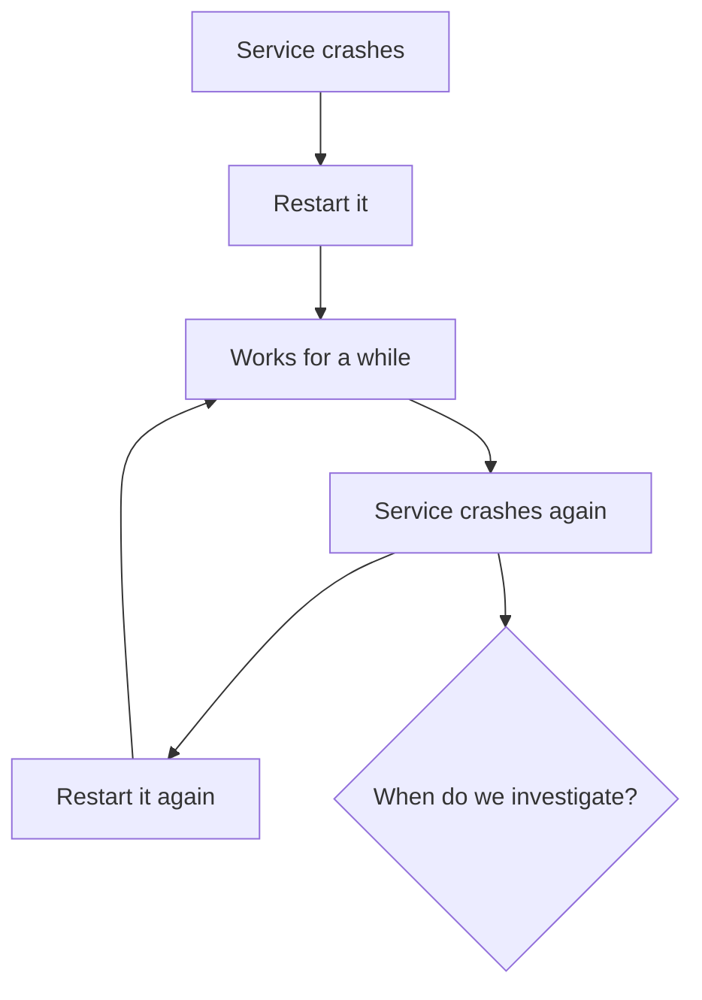

**Problem:** Restarting repeatedly without investigation turns operations into whack-a-mole. The root cause persists, incidents recur, and trust erodes.

**Fix:** Apply habit 10 (restart last). Always capture evidence before restarting.

### Anti-Pattern 2: Assumption-Driven Debugging 🎯

**Problem:** Assuming the cause ("must be the database!") based on past incidents without checking current evidence.

**Example:** Experienced a MySQL deadlock last month → assume all slowness is MySQL → miss the real cause (a runaway batch job) → waste hours.

**Fix:** Habit 3 (trust logs more than assumptions). Check evidence before concluding.

### Anti-Pattern 3: The `rm -rf` Gamble 💣

**Problem:** Running destructive commands without previewing the scope of the match.

```bash
# In /opt — but you meant /opt/backup
rm -rf *.tar.gz
# Deletes everything matching in the WRONG directory!
```

**Fix:** Habit 2 (treat every command like production). Preview with `ls`/`find` first.

### Anti-Pattern 4: Fragile Scripts with No Error Handling 💥

```bash
#!/bin/bash

cp /data/file.txt /backup/
rm /data/file.txt
echo "Done!"
```

**Problem:** No `set -e`. If `cp` fails, the script continues and **deletes the source file** anyway. Catastrophic data loss.

**Fix:** `set -euo pipefail` + explicit error checks.

### Anti-Pattern 5: The "It Worked in My Shell" Trap 🐚

**Problem:** Writing scripts that only work in an interactive shell — relative paths, user-specific aliases, missing `PATH` assumptions.

**Fix:** Habit 7 (absolute paths) + test scripts from cron, from a different directory, and as a different user.

### Anti-Pattern 6: The Undocumented Knowledge Vault 🔒

**Problem:** Every incident is solved but never written down. The same firefighting repeats months later because the knowledge lives only in someone's memory (or worse, they've left the company).

**Fix:** Habit 9 (incident log). Make documentation part of the definition of "done" for any incident.

### Anti-Pattern 7: The "Refresh Until It Works" Strategy 🔄

**Problem:** Rebooting servers, clearing caches, and restarting services until symptoms disappear — without understanding the root cause. This ignores trends and makes systems unpredictable.

**Fix:** Habits 1, 3, 5, 6 — observe, log, correlate changes, and track trends before intervening.

### Anti-Pattern Comparison Table

| Anti-Pattern | Symptoms | Real Cost | Replacement Habit |
|--------------|----------|-----------|-------------------|
| Restart treadmill | Same service crashes weekly | Recurring incidents, no fixes | #10 Restart last |
| Assumption-driven | Wrong root cause analyzed | Wasted hours, delayed fix | #3 Trust logs |
| `rm -rf` gamble | Deleting wrong files/dirs | Permanent data loss | #2 Verify commands |
| Fragile scripts | Data loss, silent failures | Production incidents | #4 Check exit codes |
| Shell-only scripts | Cron failures, user-specific bugs | Unreliable automation | #7 Absolute paths |
| Undocumented knowledge | Repeat firefighting | Team burns out | #9 Incident logs |
| Refresh-until-works | Unpredictable systems | Root causes never fixed | #5, #6 Changes & trends |

---

## 18. Performance Considerations

### Log Management Performance

| Consideration | Recommendation | Why |
|---------------|----------------|-----|
| Log volume | Configure `logrotate` daily/weekly | Prevents disk-full incidents |
| Log format | Use structured JSON logs where possible | Faster automated analysis with jq |
| journald storage | Set `SystemMaxUse=` in `journald.conf` | Prevents unbounded journal growth |
| Log analysis | Use `journalctl --since`/`--until` filters | Reduces output size and load |
| Log-level discipline | Use error/warn levels judiciously | Debug logs at scale can be enormous |

```bash
# Limit journal size to 1GB
# /etc/systemd/journald.conf
SystemMaxUse=1G
# Then restart journald
systemctl restart systemd-journald
```

### Monitoring Tool Overhead

| Tool | Typical Overhead | Best Practice |
|------|------------------|---------------|
| `sar` (sysstat) | ~0.1% CPU (sampling every 10 min) | Enable by default — cheap and invaluable |
| `vmstat 1` | Minimal (<1%) | Use interactively for short diagnosis windows |
| `iostat -x` | Minimal | Use during I/O investigations |
| `top -H` | Low (~1%) | Stops after exit; fine for snapshots |
| Heavy APM agents | 2–10% depending on config | Be judicious; profile the overhead |

### Script Performance

```bash
# Slow pattern: piping through multiple greps in a loop
while read line; do echo "$line" | grep error; done < /var/log/big.log

# Fast pattern: single pass with awk
awk '/error/' /var/log/big.log
```

| Scripting Decision | Slow | Fast |
|--------------------|------|------|
| File parsing | `while read` + `grep` per line | `awk` / `grep` single pass |
| Counting | `wc -l` on each filter | Single pipeline with counters |
| Loops over files | `for f in $(find ...)` | `find ... -exec` / `find -delete` |
| Large log scans | Multiple invocations | Load once, filter in memory |
| Compression | Straight `tar` | `tar -I pigz` (parallel gzip) |

### Trend Collection as a Performance Strategy

Collecting trends isn't just diagnostic — it's **preventative**. `sar` data collected continuously lets you detect:

- Gradual memory growth before OOM kills
- Disk saturation trends before performance complaints
- CPU utilization growth before capacity planning emergencies

```bash
# Enable sysstat collection (Debian/Ubuntu)
systemctl enable --now sysstat
```

---

## 19. Security Considerations

### Safe Handling of Dangerous Commands

| Command | Security Risk | Mitigation |
|---------|---------------|------------|
| `chmod -R 777` | Opens files to every user | Use specific modes: `750`, `700`; avoid recursive broad perms |
| `rm -rf` | Destroys data irrecoverably | Preview, use `trash-cli`, or `find -delete` with explicit paths |
| `dd` | Overwrites the wrong device | Double-check device names, use `lsblk`, add a wrapper script |
| Shell wildcards | Unintended expansion | Use `set -f` (disable globbing) if needed, always preview |
| `kill -9` | Unclean termination, data loss | Try SIGTERM first, use exact PIDs |
| Root usage | Full system access | Use `sudo` with least privilege; avoid root shells |

### Log and Evidence Security

- 🔐 **Protect log files:** `/var/log/` may contain sensitive data (user info, tokens, IPs)
- 🗝️ **Limit log access:** Use `adm` group permissions (default on many distros)
- 🧹 **Sanitize incident evidence:** Remove secrets/passwords before sharing logs
- 🧯 **Consider log integrity:** Ship logs to a remote, append-only location (SIEM) so attackers can't erase evidence
- ⏱️ **Mind retention policies:** GDPR/similar may require log deletion schedules

### Production Access Discipline

```bash
# Least privilege principle
# Instead of root shells:
sudo systemctl status nginx
sudo -u www-data tail -100 /var/log/nginx/error.log

# No plaintext passwords in scripts
# Use: environment variables, vault, ansible-vault, systemd credentials
```

### Script Security Checklist

```bash
#!/bin/bash
# Secure script patterns:
set -euo pipefail          # Fail fast, no undefined variables
umask 077                  # Secure file creation defaults
export TMPDIR="${HOME}/tmp"  # Avoid unsafe /tmp race conditions
mktemp -d                  # Use temp dirs for scratch work
# Never embed credentials; read from env/secret store:
# DB_PASS="${DB_PASS:?DB_PASS env variable required}"
```

### SSH and Remote Access Hygiene

| Practice | Why |
|----------|-----|
| Disable root password login | Reduces brute-force attack surface |
| Use SSH keys only | Keys aren't easily phished |
| Use `ssh-agent` with short-lived keys | Limits key exposure |
| Add `-o` safety flags in scripts | `BatchMode=yes` prevents interactive hangs |
| Log all sudo actions | Audit trail for incident response |

---

## 20. Troubleshooting Guide

### Troubleshooting: Service Won't Start

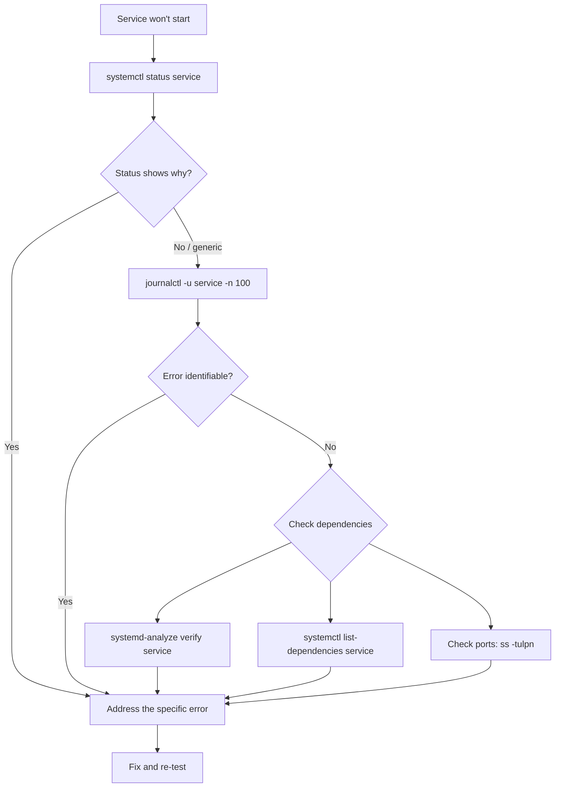

### Common Failures and Fixes

| Symptom | Likely Cause | Diagnostic Command | Fix |
|---------|--------------|-------------------|-----|
| `bind() failed (98: Address already in use)` | Port already occupied | `ss -tulpn \| grep :80` | Stop the other process |
| `Permission denied` (startup) | Wrong ownership/perms on config or data dir | `ls -la /etc/app /var/lib/app` | Fix ownership: `chown -R app:app` |
| `Out of memory: Kill process` | OOM killer triggered | `dmesg \| grep -i oom` | Increase RAM, fix leak |
| `No space left on device` | Disk full | `df -h`, `du -xh --max-depth=1 /` | Free space, fix log rotation |
| `command not found` in cron | Minimal PATH in cron | `which python3`, check crontab `PATH=` | Use absolute paths |
| `Connection refused` | Service not listening | `ss -tulpn`, `systemctl status` | Start/configure service, check firewalld |
| `TLS handshake failed` | Expired certificate | `openssl s_client -connect host:443`, `check-cert` | Renew cert |
| `Segmentation fault` | Bug in app/compiled dep | `coredumpctl`, `dmesg` | Update/patch app |
| `Database connection failed` | DB down or max connections | `journalctl -u mysql`, `mysqladmin ping` | Fix DB, raise max_connections |

### Troubleshooting: Command Returns Unexpected Exit Status

```bash
# Capture and analyze exit status
false
echo "Exit: $?"
# Exit: 1

# For pipelines, understand which component failed
ls /nonexistent | grep pattern
echo "Pipeline exit: ${PIPESTATUS[@]}"
# Pipeline exit: 2 1   (ls failed with 2, grep failed with 1)

# Use set -x to trace script execution
bash -x /opt/scripts/backup.sh
```

### Troubleshooting: Journal Contains Massive Output

```bash
# Narrow by time window
journalctl -u app --since "2026-08-14 09:00" --until "2026-08-14 10:00"

# Narrow by severity
journalctl -u app -p err

# Search for a string
journalctl -u app | grep -i "outofmemory\|failed\|timeout"

# Watch for a specific PID
journalctl _PID=12345
```

### Troubleshooting: Scripts Behave Differently in Different Shells

```bash
# Check what shell shebang is used
head -1 /opt/scripts/backup.sh
# Check default shell for cron user
echo $SHELL
# Run script with explicit interpreter for consistency
/usr/bin/bash /opt/scripts/backup.sh
```

---

## 21. Testing Strategies

### Test Your Scripts Safely

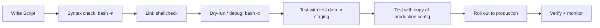

### Level 1: Syntax and Linting

```bash
# Check syntax without running
bash -n /opt/scripts/backup.sh

# Lint with shellcheck
shellcheck /opt/scripts/backup.sh
# SC2086: Double quote to prevent globbing and word splitting
# SC2164: Use 'cd ... || exit' or 'cd ... || return'

# Install shellcheck
apt install shellcheck   # Debian/Ubuntu
yum install shellcheck   # RHEL/Fedora
```

### Level 2: Dry-Run and Debug Modes

```bash
# Trace every command as it executes
bash -x /opt/scripts/backup.sh

# Enable tracing within a script
#!/bin/bash
set -x   # Trace commands
set -v   # Verbose — echo input lines
# Use selectively for debugging
```

```bash
# Create a safe test mode for destructive scripts
#!/bin/bash
DRY_RUN="${DRY_RUN:-false}"

delete_logs() {
    local file="$1"
    if [[ "$DRY_RUN" == "true" ]]; then
        echo "DRY-RUN: Would delete $file"
    else
        rm "$file"
    fi
}

# Test safely:
DRY_RUN=true /opt/scripts/cleanup.sh
```

### Level 3: Test Harness for Critical Automation

```bash
#!/bin/bash
# /opt/scripts/tests/test_backup.sh
set -euo pipefail

TEST_DIR=$(mktemp -d)
trap 'rm -rf "$TEST_DIR"' EXIT   # Cleanup even on failure

# Create test data
mkdir -p "$TEST_DIR/data"
echo "test content" > "$TEST_DIR/data/file1.txt"

# Point the script at test data
BACKUP_SOURCE="$TEST_DIR/data" /opt/scripts/backup.sh

# Verify the backup exists and is valid
BACKUP_FILE=$(ls /tmp/test_backup_*.tar.gz | tail -1) 
test -f "$BACKUP_FILE"
/tar -tzf "$BACKUP_FILE" | grep "file1.txt"
echo "BACKUP TEST PASSED"
```

### Test Matrix for Shell Scripts

| Test | What It Verifies |
|------|------------------|
| `bash -n script.sh` | Syntax validity |
| `shellcheck script.sh` | Best-practice violations |
| Run from different cwd | Relative-path independence |
| Run without environment | No hidden assumptions (test with `env -i`) |
| Run as different user | Permission correctness |
| Run twice (idempotency) | No side effects on re-run |
| Run with missing dependencies | Proper error handling |
| Run in staging | Realistic behavior |
| Simulate failures (`false` commands) | `set -e` behavior |

### Testing Exit-Status Handling

```bash
# Test that your script FAILS when it should
# Create a scenario where the source is missing
if /opt/scripts/backup.sh /nonexistent/path; then
    echo "ERROR: Script should have failed!"
    exit 1
else
    echo "PASS: Script correctly failed on missing input"
fi
```

---

## 22. Practice Exercises with Solutions

### Exercise 1: Build a System Snapshot Script

**Difficulty:** Beginner-Intermediate

**Task:** Create a script `/opt/scripts/snapshot.sh` that captures a timestamped system snapshot to `/var/log/snapshots/`. It must include: hostname, uptime, memory, disk usage, top 5 processes by CPU, listening ports, and failed services. The script must:

- Use absolute paths
- Create the snapshot directory if missing
- Use a timestamped filename like `snapshot_2026-08-14_1530.log`
- Use `set -euo pipefail`

<details>
<summary><b>View Solution</b></summary>

```bash
#!/bin/bash
# /opt/scripts/snapshot.sh
set -euo pipefail

SNAPSHOT_DIR="/var/log/snapshots"
TIMESTAMP=$(/usr/bin/date +%Y%m%d_%H%M)
OUTPUT="${SNAPSHOT_DIR}/snapshot_${TIMESTAMP}.log"

# Ensure directory exists
/usr/bin/mkdir -p "$SNAPSHOT_DIR"

{
    echo "============================================="
    echo " System Snapshot: $(/usr/bin/date)"
    echo "============================================="
    echo ""
    echo "--- Hostname ---"
    /usr/bin/hostname
    echo ""
    echo "--- Uptime ---"
    /usr/bin/uptime
    echo ""
    echo "--- Memory ---"
    /usr/bin/free -h
    echo ""
    echo "--- Disk ---"
    /usr/bin/df -h
    echo ""
    echo "--- Top 5 Processes by CPU ---"
    /usr/bin/ps aux --sort=-%cpu | /usr/bin/head -6
    echo ""
    echo "--- Listening Ports ---"
    /usr/bin/ss -tulpn
    echo ""
    echo "--- Failed Services ---"
    /usr/bin/systemctl --failed --no-legend || true
    echo ""
    echo "============================================="
} > "$OUTPUT"

echo "Snapshot saved to $OUTPUT"
```

**Test it:**

```bash
chmod +x /opt/scripts/snapshot.sh
/opt/scripts/snapshot.sh
cat /var/log/snapshots/snapshot_*.log | head -20
```

</details>

---

### Exercise 2: Write a Safe Delete Wrapper

**Difficulty:** Intermediate

**Task:** Create a function `safe_rm` that:
- Previews what would be deleted (`find` with `-print`)
- Shows how many items would be deleted
- Requires explicit confirmation (`y/N`) before deleting
- Refuses to run if the target is `/`, `$HOME`, or empty
- Uses `find -delete` instead of `rm -rf`

<details>
<summary><b>View Solution</b></summary>

```bash
#!/bin/bash
# Add to ~/.bashrc or ~/.bash_aliases
safe_rm() {
    local target="$1"
    local count

    # Safety checks
    if [[ -z "$target" ]]; then
        echo "ERROR: safe_rm requires a target path"
        return 1
    fi

    # Refuse dangerous roots
    case "$target" in
        /|/*/|"$HOME"|"$HOME"/*/|"$HOME"/*)
            # Allow files inside $HOME but protect $HOME itself and root
            if [[ "$target" == "/" || "$target" == "$HOME" ]]; then
                echo "ERROR: Refusing to delete $target"
                return 1
            fi
            ;;
        *)
            # Convert relative to absolute for safer comparison
            target=$(readlink -f "$target")
            ;;
    esac

    # Always use absolute path
    target=$(readlink -f "$target")

    # Preview
    count=$(find "$target" -mindepth 1 2>/dev/null | wc -l)
    echo "About to DELETE: $target ($count items)"
    find "$target" -maxdepth 2 -print | head -20

    # Confirmation
    read -r -p "Proceed with deletion? (y/N): " answer
    if [[ "$answer" != "y" && "$answer" != "Y" ]]; then
        echo "Cancelled."
        return 0
    fi

    # Delete
    find "$target" -mindepth 1 -delete
    rmdir "$target" 2>/dev/null || true
    echo "Deleted $target"
}

# Usage
safe_rm /var/log/app/old-logs
```

**Test it:**

```bash
mkdir -p ~/test-safe-rm/subdir
touch ~/test-safe-rm/file1.txt ~/test-safe-rm/subdir/file2.txt
safe_rm ~/test-safe-rm
# Should prompt for confirmation
```

</details>

---

### Exercise 3: Create an Exit-Status Validator for Cron Jobs

**Difficulty:** Intermediate

**Task:** Create a script `/opt/scripts/run_with_check.sh` that wraps another command, captures its exit status, logs success/failure to `/var/log/script_status.log`, and returns the original exit code (non-zero on failure) so cron can alert.

<details>
<summary><b>View Solution</b></summary>

```bash
#!/bin/bash
# /opt/scripts/run_with_check.sh
# Usage: /opt/scripts/run_with_check.sh "description" /path/to/command args...
set -u

STATUS_LOG="/var/log/script_status.log"
DESCRIPTION="$1"
shift  # Remove description, leaving the command + args

# Run the wrapped command
"$@"
EXIT_CODE=$?

# Log the result
if [ $EXIT_CODE -eq 0 ]; then
    /usr/bin/echo "$(/usr/bin/date '+%F %T') — $DESCRIPTION — SUCCESS" >> "$STATUS_LOG"
else
    /usr/bin/echo "$(/usr/bin/date '+%F %T') — $DESCRIPTION — FAILED (exit $EXIT_CODE)" >> "$STATUS_LOG"
fi

# Return the original exit code so cron sees failures
exit $EXIT_CODE
```

**Usage in crontab:**

```cron
# Crontab entry (remember PATH)
PATH=/usr/local/sbin:/usr/local/bin:/usr/sbin:/usr/bin:/sbin:/bin
0 2 * * * /opt/scripts/run_with_check.sh "Nightly backup" /usr/bin/rsync -av /data/ /backup/ && /opt/scripts/run_with_check.sh "Backup verify" /usr/bin/tar -tzf /backup/latest.tar.gz
```

**Test it:**

```bash
/opt/scripts/run_with_check.sh "Test success" /bin/true
cat /var/log/script_status.log  # Should show SUCCESS

/opt/scripts/run_with_check.sh "Test failure" /bin/false
echo $?  # Should be 1
cat /var/log/script_status.log  # Should show FAILED
```

</details>

---

### Exercise 4: Trend Analysis with `vmstat` and `sar`

**Difficulty:** Advanced

**Task:** A server has intermittent performance degradation. Capture a 10-minute trend, identify whether the bottleneck is CPU, memory, or I/O, and write a short root-cause summary.

<details>
<summary><b>View Solution</b></summary>

**Step 1: Capture the trend during the problem window**

```bash
# Capture vmstat every 5 seconds for 2 minutes (24 samples)
vmstat 5 24 > /tmp/vmstat_capture.txt

# Also capture with sar for later correlation
sar -u 5 24 > /tmp/sar_cpu.txt
sar -r 5 24 > /tmp/sar_mem.txt
sar -d 5 24 > /tmp/sar_io.txt
```

**Step 2: Analyze the output**

```bash
cat /tmp/vmstat_capture.txt
```

Example output analysis:

```
procs -----------memory---------- ---swap-- -----io---- -system-- ------cpu-----
 r  b   swpd   free   buff  cache   si   so    bi    bo   in   cs us sy id wa st
 1  0     0  800000   90000 1500000    0    0    10    20  500  800  5  3 92  0  0
 5  2     0  700000   90000 1500000    0    0   800  1000  900 1200 20 10 60 10  0
 8  4     0  500000   90000 1500000    0    0  5000  3000 1500 2000 40 20 30 10  0
```

**Interpretation:**
- `b` (blocked on I/O) rising: 0 → 2 → 4
- `bi` (blocks in) rising: 10 → 800 → 5000
- CPU `wa` (I/O wait) rising: 0 → 10 → 10
- `r` (runnable) rising: 1 → 5 → 8 — processes waiting

**Conclusion:** The bottleneck is **disk I/O**, not CPU or memory. `si`/`so` remain 0, so no swapping. CPU `us` is moderate. The rising `bi` and `wa` confirm disk saturation.

**Step 3: Identify the I/O source**

```bash
# Which process is doing the I/O?
iotop -bn2 | head -20
# Example: PID 54321 (mysqld) reading 800 MB/s

# Correlate with logging
journalctl -u mysql --since "10 minutes ago" | tail -50
```

**Step 4: Root-cause summary**

```markdown
## Root Cause Summary
- **Observation window:** 14:00–14:10 UTC
- **Symptom:** Increasing run queue (r: 1→8), rising I/O wait
- **Trend evidence:** bi rose 10→5000 blocks/s; wa rose 0→10%
- **Root cause:** mysqld (PID 54321) performing a large table scan
- **Trigger:** A reporting query running every 10 minutes scans a growing table
- **Fix options:** Add index on the WHERE column; schedule report at off-peak; optimize query
```

</details>

---

### Exercise 5: Build a Personal Incident Log System

**Difficulty:** Intermediate

**Task:** Create a simple CLI-based incident log system in `~/incidents/` with:
- A script `~/incidents/new-incident.sh` that creates a dated template file
- A template with all the required fields (symptoms, root cause, commands, logs, fix, lessons)
- A search script `~/incidents/search-incidents.sh` that greps for keywords

<details>
<summary><b>View Solution</b></summary>

```bash
#!/bin/bash
# ~/incidents/new-incident.sh — create a new incident entry
set -euo pipefail

INCIDENT_DIR="$HOME/incidents"
mkdir -p "$INCIDENT_DIR"

ID=$(date +%Y%m%d)
FILE="${INCIDENT_DIR}/incident_${ID}.md"

# Avoid overwriting if multiple incidents same day
if [[ -f "$FILE" ]]; then
    COUNTER=2
    while [[ -f "${INCIDENT_DIR}/incident_${ID}_${COUNTER}.md" ]]; do
        COUNTER=$((COUNTER + 1))
    done
    FILE="${INCIDENT_DIR}/incident_${ID}_${COUNTER}.md"
fi

cat > "$FILE" << 'TEMPLATE'
# Incident Log

## Date
YYYY-MM-DD HH:MM (Timezone)

## Severity
[SEV-1 | SEV-2 | SEV-3 | SEV-4]

## Symptoms
- 

## Timeline
- 

## Root Cause
- 

## Diagnostic Commands Used
```bash

```

## Logs Examined
- 

## Fix Applied
- 

## Verification
- 

## Lessons Learned
- What would have found this faster?
- What monitoring could have caught it earlier?
- What documentation should exist?
TEMPLATE

echo "Created: $FILE"
```

```bash
#!/bin/bash
# ~/incidents/search-incidents.sh — search incident logs
# Usage: ~/incidents/search-incidents.sh "error|timeout|disk"

INCIDENT_DIR="$HOME/incidents"
PATTERN="${1:?Usage: search-incidents.sh 'pattern'}"

grep -ril --exclude="*.sh" "$PATTERN" "$INCIDENT_DIR" | while read -r file; do
    echo "=== $file ==="
    grep -i -A2 -B2 -- "$PATTERN" "$file" | head -20
    echo ""
done
```

**Usage:**

```bash
~/incidents/new-incident.sh
# Creates incident_20260814.md template

~/incidents/search-incidents.sh "disk full"
# Finds all incidents mentioning "disk full"
```

</details>

---

## 23. Question Bank (55 Questions)

### Beginner Level (Q1–Q20)

<details>
<summary><b>Q1: What is the meaning of an exit status of 0 in Linux?</b></summary>

Exit status `0` means the command completed successfully.

</details>

<details>
<summary><b>Q2: What does `$?` contain in a shell?</b></summary>

`$?` contains the exit status of the last executed command.

</details>

<details>
<summary><b>Q3: Which command shows the current disk usage of mounted filesystems?</b></summary>

`df -h` (human-readable disk free).

</details>

<details>
<summary><b>Q4: Which command displays listening TCP/UDP ports and associated processes?</b></summary>

`ss -tulpn` (or the older `netstat -tulpn`).

</details>

<details>
<summary><b>Q5: What does `journalctl -xe` do?</b></summary>

It shows the journal entries with error context (`-x`) and the most recent messages (`-e`), providing context around errors.

</details>

<details>
<summary><b>Q6: What command lists recently installed packages on Debian/Ubuntu?</b></summary>

`grep " install " /var/log/dpkg.log` or `ls /var/log/apt/history.log`.

</details>

<details>
<summary><b>Q7: What command shows currently installed packages on RPM-based systems?</b></summary>

`rpm -qa`.

</details>

<details>
<summary><b>Q8: What does `set -e` do in a shell script?</b></summary>

It causes the script to exit immediately if any command returns a non-zero exit status.

</details>

<details>
<summary><b>Q9: Which command shows the full path of an executable like `python3`?</b></summary>

`which python3` or `command -v python3`.

</details>

<details>
<summary><b>Q10: What is the primary reason to check logs before restarting a service?</b></summary>

To preserve diagnostic evidence and understand the root cause before intervening. A restart can destroy in-memory state and crash artifacts needed for diagnosis.

</details>

<details>
<summary><b>Q11: What are the first two attributes to check when a service fails?</b></summary>

`systemctl status <service>` and `journalctl -u <service>` — the current status and the logs.

</details>

<details>
<summary><b>Q12: What is a key difference between `top` and `vmstat 1`?</b></summary>

`top` shows a current snapshot; `vmstat 1` shows a time series (trend) of system metrics, revealing patterns over time.

</details>

<details>
<summary><b>Q13: Why should automation use absolute paths?</b></summary>

Because automation (cron, systemd) runs with a different and often minimal `PATH` — relative commands may not resolve, causing failures.

</details>

<details>
<summary><b>Q14: What does `df -h` display?</b></summary>

Filesystem usage in human-readable units (GB, MB) — used to check for disk-full conditions.

</details>

<details>
<summary><b>Q15: What is the purpose of the `systemctl --failed` command?</b></summary>

It lists all systemd units currently in a failed state.

</details>

<details>
<summary><b>Q16: What does the `free -h` command show?</b></summary>

Memory usage in human-readable format — total, used, free, shared, buff/cache, and available.

</details>

<details>
<summary><b>Q17: Which command displays kernel-related messages?</b></summary>

`dmesg` (or `journalctl -k` on systemd systems).

</details>

<details>
<summary><b>Q18: What is a common location for application log files?</b></summary>

`/var/log/` — e.g., `/var/log/nginx/`, `/var/log/mysql/`, `/var/log/syslog`.

</details>

<details>
<summary><b>Q19: What does `pipestatus` or `${PIPESTATUS[@]}` show?</b></summary>

Exit statuses of each command in the last pipeline — important because the last command's exit status alone can mask an earlier failure.

</details>

<details>
<summary><b>Q20: What is the first step of the observe-first approach?</b></summary>

Run status/read-only commands (`systemctl status`, `journalctl`, `ss`, `df`) to gather evidence before any intervention.

</details>

---

### Intermediate Level (Q21–Q40)

<details>
<summary><b>Q21: Explain the difference between `rm -rf` and `find ... -delete` for batch deletion.</b></summary>

`find ... -delete` allows previewing matches with `-print` first and is less error-prone for recursive deletes because you control the starting path explicitly. `rm -rf` can accidentally match unintended paths, especially with broad wildcards.

</details>

<details>
<summary><b>Q22: Why is `set -o pipefail` important in scripts?</b></summary>

Without it, a pipeline's exit status is only that of the last command. `pipefail` makes the pipeline return the first (leftmost) non-zero exit status, catching failures in earlier commands.

</details>

<details>
<summary><b>Q23: How do you check what changed in a configuration file before an incident?</b></summary>

Use `stat <file>` to see modification time, check version control history (`git log -p <file>`), restore from backup, or check `etckeeper`. Also compare with the package's default config using `dpkg -V`/`rpm -V`.

</details>

<details>
<summary><b>Q24: What does a consistently rising `si`/`so` in `vmstat` indicate?</b></summary>

The system is actively swapping — a sign of memory pressure. Rising swap in/out indicates RAM is insufficient and pages are being moved to/from disk.

</details>

<details>
<summary><b>Q25: What is the difference between `journalctl -u nginx` and `journalctl -p err`?</b></summary>

`-u nginx` filters logs for the nginx systemd unit. `-p err` filters by priority — showing only error-level or higher messages across the journal.

</details>

<details>
<summary><b>Q26: Why might a script work interactively but fail under cron?</b></summary>

Different environment: cron uses a minimal `PATH`, different `HOME`, and no interactive aliases/functions. Relative paths and user-specific commands fail under cron.

</details>

<details>
<summary><b>Q27: What does `env -i` do, and why is it useful for testing scripts?</b></summary>

It runs a command with an entirely empty environment — useful for finding hidden dependencies in scripts by testing them without inherited environment variables.

</details>

<details>
<summary><b>Q28: When is it legitimate to restart a service?</b></summary>

When the root cause is identified as transient (deadlock, corrupted in-memory state, post-update activation) or when a restart is a documented temporary mitigation while a code fix is deployed. Restart should confirm the diagnosis, not replace it.

</details>

<details>
<summary><b>Q29: What pieces of information should be in an incident log entry?</b></summary>

Symptoms, timeline, root cause, diagnostic commands used, logs examined, fix applied, verification, and lessons learned.

</details>

<details>
<summary><b>Q30: How does `sar` differ from `top` in diagnosing performance issues?</b></summary>

`top` is a live snapshot. `sar` collects and reports historical system activity trends, allowing you to identify patterns (gradual memory growth, hourly spikes) and correlate with events.

</details>

<details>
<summary><b>Q31: What is the purpose of `logrotate`?</b></summary>

It automatically rotates, compresses, and prunes log files — preventing them from consuming all disk space. Typical rotation is daily/weekly with N rotations kept.

</details>

<details>
<summary><b>Q32: What does `chmod -R 777 app/` risk?</b></summary>

It grants read/write/execute permissions to every user on the system for all files under `app/` — a severe security risk exposing sensitive code, configs, or data (and potentially allowing tampering).

</details>

<details>
<summary><b>Q33: Why is it helpful to timestamp diagnostic output files?</b></summary>

Timestamped files (e.g., `crash_20260814_1530.log`) preserve chronological evidence, prevent overwrites, and allow correlation with incident timelines.

</details>

<details>
<summary><b>Q34: Give an example of a shell alias that improves command safety.</b></summary>

`alias rm='rm -i'` — prompts before deleting each file. Similarly `alias mv='mv -i'`, `alias cp='cp -i'`.

</details>

<details>
<summary><b>Q35: What does `dmesg | grep -i oom` reveal?</b></summary>

It shows out-of-memory killer events in the kernel ring buffer — identifying when processes were killed due to memory exhaustion.

</details>

<details>
<summary><b>Q36: Why not rely on `echo "Done"` to indicate success in scripts?</b></summary>

`echo "Done"` always succeeds even when prior commands failed. Success should be communicated via exit codes (and verified explicitly), not output text.

</details>

<details>
<summary><b>Q37: What does `systemctl cat nginx` show?</b></summary>

It displays the full unit file(s) for the nginx service — including any drop-in overrides — useful for understanding how the service is actually configured.

</details>

<details>
<summary><b>Q38: What is the benefit of using `mktemp -d` in scripts?</b></summary>

It creates a unique temporary directory securely, avoiding predictable names and preventing symlink attacks/race conditions common with fixed `/tmp` paths.

</details>

<details>
<summary><b>Q39: How can you monitor a service's restart history with systemd?</b></summary>

`systemctl show nginx -p NRestarts -p ExecMainStartTimestamp` or check `journalctl -u nginx | grep -i "start\|stop"` to see restart windows.

</details>

<details>
<summary><b>Q40: What is the difference between `kill` and `kill -9`?</b></summary>

`kill` (SIGTERM) requests graceful termination — allowing cleanup. `kill -9` (SIGKILL) forcibly terminates without cleanup — potentially losing state or corrupting data. Always try SIGTERM first.

</details>

---

### Advanced Level (Q41–Q55)

<details>
<summary><b>Q41: Explain how `PIPESTATUS` can prevent false negatives in pipelines.</b></summary>

Without `pipestatus`, `true | false` returns 1 (last command), but `false | true` returns 0 — masking the first command's failure. `${PIPESTATUS[@]}` exposes each component's status so you can detect failures in any stage of the pipeline.

</details>

<details>
<summary><b>Q42: How would you diagnose a process that slowly consumes memory over hours?</b></summary>

Track RSS over time (e.g., `watch -n 60 "ps -o rss= -p PID"`), capture `sar -r` trends, correlate with `vmstat si/so`, check application heap/GC logs, and look at thread dump / profiler output. Confirm whether RSS grows monotonically (leak) or plateaus (normal cache).

</details>

<details>
<summary><b>Q43: What is the difference between observing `wa` (I/O wait) and `b` (blocked) columns in `vmstat`?</summary>

`wa` is the percentage of CPU time waiting for I/O. `b` is the number of processes blocked (uninterruptible sleep) waiting for I/O. High `wa` plus rising `b` and `bi` strongly indicate a disk bottleneck.

</details>

<details>
<summary><b>Q44: How does `journalctl --since "1 hour ago"` help during incident response?</summary>

It narrows the log window to the incident timeframe — reducing noise and focusing on events from just before/at the incident start, which is essential for identifying the root cause.

</details>

<details>
<summary><b>Q45: What does `find /etc -type f -mtime -1 -print` detect, and when would you use it?</b></summary>

It finds files under `/etc` modified in the last 24 hours. Use it when investigating "what changed" — e.g., detecting config drift or a recent reconfiguration that triggered an incident.

</details>

<details>
<summary><b>Q46: Explain how you would verify that a backup is actually restorable — not just "successful".</b></summary>

Test extraction of a sample of files from the backup archive (`tar -tzf`, `restic check`), restore to a scratch directory and compare checksums, or run a scheduled restore drill in staging. A backup that can't be restored has no value.

</details>

<details>
<summary><b>Q47: What is the risk of `rm` in a loop with quoted variables vs. unquoted?</b></summary>

Unquoted variables can undergo word splitting and glob expansion — deleting unexpected files. Quoted variables preserve exact names. Example: `rm $file` with `file="*"` deletes everything in the directory; `rm "$file"` targets the literal asterisk.

</details>

<details>
<summary><b>Q48: How do systemd timers improve on cron for automation reliability?</b></summary>

Systemd timers provide: persistent timers (catch up after missed runs), unified logging via `journalctl`, dependency ordering, resource limits, and better integration with service units. They also inherit a more controlled environment.

</details>

<details>
<summary><b>Q49: Design a smoke-test for a shell script deployed to production.</b></summary>

Run the script with `set -x` tracing in a test directory containing sample data; assert exit code is 0 and inspect output; run it again to verify idempotency; test failure paths by pointing it at missing files; verify it behaves under `env -i` (minimal environment); finally, run a `DRY_RUN=true` mode or non-destructive flag if implemented.

</details>

<details>
<summary><b>Q50: Explain how you would identify whether a performance issue is caused by memory leakage vs. legitimate cache growth.</b></summary>

A leak shows monotonic RSS growth that never plateaus (or grows until crash). Legitimate cache growth plateaus at a configured/max size. Check: does RSS keep growing without bound? Does it drop after GC / cache eviction? Compare `ps -o rss` over time, use `sar -r` for system memory, and inspect the application's GC/heap logs. A steady growth-per-hour with no plateau indicates a leak.

</details>

<details>
<summary><b>Q51: Why might `chmod -R 777 app/` be considered both a security and an operations problem?</b></summary>

Security: any user can read/modify/execute files. Operations: it masks underlying permission misconfigurations — bugs that should surface as permission errors are hidden, making systems harder to reason about and audit.

</details>

<details>
<summary><b>Q52: What does `systemctl show nginx -p ActiveState -p SubState -p MainPID` tell you, and when is it useful?</b></summary>

It returns machine-readable, scriptable values for the service state, sub-state, and main PID — useful when you need to make decisions programmatically (e.g., in monitoring automation or shell scripts) rather than parsing human output.

</details>

<details>
<summary><b>Q53: How do you diagnose why a cron job didn't run at all (no log entry)?</b></summary>

Check: the crontab actually contains the line (`crontab -l`), cron service is running (`systemctl status cron`), the command path exists and is executable, timezone of cron (`/etc/crontab` vs crontab), and `grep cron /var/log/syslog` around the scheduled time. Also check for stray spaces, `%` escaping, and whether the system was down at the scheduled moment.

</details>

<details>
<summary><b>Q54: Explain the role of `coredumpctl` in diagnosing segfaults.</b></summary>

`coredumpctl list` and `coredumpctl info PID` provide core dump metadata and backtraces from crashes — crucial for identifying the exact function/module that caused a segmentation fault, especially for compiled applications.

</details>

<details>
<summary><b>Q55: You must diagnose an intermittent issue that happens once per green deployment. Design an observation plan.</b></summary>

1) Correlate with deployment: any changes in package/version/configs around that time (`rpm -qa --last`, `dpkg.log`, git history). 2) Collect full application logs before/after each deployment (log rotation on). 3) Use `sar`/`vmstat` trending during the window. 4) Capture system resource state. 5) Record symptoms precisely from the monitoring dashboard. 6) Save crash/core dump evidence. 7) If a restart is needed, capture journal evidence first. 8) Document in the incident log to correlate the pattern across deployments.

</details>

---

## 24. Test Your Understanding (12 Questions)

<details>
<summary><b>T1: What's the very first command you should run when nginx suddenly stops responding?</b></summary>

`systemctl status nginx` — observe before intervening. Then check logs with `journalctl -u nginx`.

</details>

<details>
<summary><b>T2: Name four "read-only" diagnostic commands you can run before making any change.</b></summary>

`systemctl status <service>`, `journalctl -u <service>`, `ss -tulpn`, `df -h` (also: `free -h`, `uptime`, `ps aux`).

</details>

<details>
<summary><b>T3: Why is `chmod -R 777` an anti-pattern?</b></summary>

It grants universal read/write/execute — a security risk — and masks real permission problems, making operations harder to reason about.

</details>

<details>
<summary><b>T4: What does `set -euo pipefail` do? Name all three parts.</b></summary>

`-e`: exit on first failing command; `-u`: error on undefined variables; `-o pipefail`: pipeline returns first non-zero exit code.

</details>

<details>
<summary><b>T5: What three questions should you ask when you discover a production symptom?</b></summary>

1) What changed recently? 2) What do the logs say? 3) Is this a snapshot issue or a trend? (Also: what does the system status show?)

</details>

<details>
<summary><b>T6: Which columns in `vmstat` indicate memory pressure, and why?</b></summary>

`si` (swap in) and `so` (swap out). Non-zero values mean pages are being moved between RAM and disk — indicating memory exhaustion.

</details>

<details>
<summary><b>T7: Why do scripts fail under cron but work in your shell?</b></summary>

Different environment: cron uses a minimal `PATH`, different `HOME`/cwd, and lacks interactive aliases/functions. Relative paths and bare command names fail under cron.

</details>

<details>
<summary><b>T8: List the fields of an incident log entry.</b></summary>

Date/time, severity, symptoms, timeline, root cause, diagnostic commands used, logs examined, fix applied, verification, lessons learned, related incidents.

</details>

<details>
<summary><b>T9: When is it legitimate to restart a service without full root-cause analysis?</b></summary>

In genuine emergencies (SEV-1 with data/compliance impact), restarts may be a documented temporary mitigation — but always capture evidence first (status + logs + resource snapshot) so diagnosis can continue.

</details>

<details>
<summary><b>T10: What do `rpm -qa --last` and `grep " install " /var/log/dpkg.log` help you discover?</b></summary>

Recently installed/upgraded packages — used in habit #5 (learn what changed) to correlate package changes with incident onset.

</details>

<details>
<summary><b>T11: What does `journalctl -p err -b` show, and why is it useful?</b></summary>

It shows error-level (or higher) messages from the current boot — a quick triage view of serious system issues since boot.

</details>

<details>
<summary><b>T12: How does `find ... -delete` differ from `rm -rf` in terms of safety?</b></summary>

`find` lets you preview matches with `-print` before deleting, is more precise (you control the starting path and match criteria), and avoids broad wildcard/recursion surprises. It's safer for batch deletions.

</details>

---

## 25. Common Interview Questions (12 Questions)

<details>
<summary><b>I1: "My script works interactively but fails in cron. What do you check first?"</b></summary>

The environment. Cron runs with a minimal `PATH`, different `HOME`, and no interactive shell features. Check whether the script uses absolute paths for all commands and files, and verify the crontab `PATH`/`SHELL`. I'd also check for interactive-only constructs (aliases, functions, `~` expansion).

</details>

<details>
<summary><b>I2: "Walk me through how you'd debug a service that crashes every few days."</b></summary>

1) Capture evidence before restarting: `systemctl status`, `journalctl -u <service> -n 200`, resource snapshot (`df`, `free`, `dmesg`), coredump info. 2) Correlate with changes: package history, git logs, config file modification times. 3) Look for trends (`sar`, `vmstat`) — e.g., memory leak growth pattern. 4) Identify root cause, apply a permanent fix rather than a restart, and document in the incident log.

</details>

<details>
<summary><b>I3: "A customer reports the site is slow. You have 5 minutes. What do you do?"</b></summary>

Observe first: `uptime` (load), `free -h` (memory), `df -h` (disk), `ss -tulpn` (conns), `ps aux --sort=-%cpu | head` (top consumers), and check the app logs for the last few minutes. These read-only commands give a fast, evidence-based picture before any intervention.

</details>

<details>
<summary><b>I4: "What's your process for safely running a destructive command?"</b></summary>

1) Verify the exact path (`pwd`, `ls -la`). 2) Preview the scope of the command (`find ... -print`, `echo $var` to see expansion). 3) Double-check wildcards and variables (quote them). 4) Use safe alternatives (`find -delete` over `rm -rf`). 5) Add a confirmation step if appropriate. 6) Have a backup/rollback plan. 7) Execute the smallest possible change and verify.

</details>

<details>
<summary><b>I5: "How do you distinguish memory leak from normal cache growth?"</b></summary>

Track RSS over time. A true leak grows monotonically without plateauing (often until crash). Cache hits a configured maximum and plateaus. Use `sar -r`/`vmstat` trends, watch whether memory is released after GC/eviction, and consult app heap or cache configuration. Growth rate per hour is the key metric.

</details>

<details>
<summary><b>I6: "Why do you prefer exit codes over output text to detect script success?"</b></summary>

Output text like "Done!" is not a reliable signal — it prints regardless of upstream failures. Exit codes are the system's contract for success/failure (`0` = success, non-zero = error). With `set -e`, they let scripts fail fast and cascade correctly. Monitoring and cron also use exit codes to trigger alerts.

</details>

<details>
<summary><b>I7: "A server ran out of disk because of logs. What now?"</b></summary>

1) Observe: `df -h`, `du -xh --max-depth=1 /` to find the culprit. 2) Identify which log is huge (`find /var/log -size +100M`). 3) Investigate WHY it grew — the log content reveals a recurring error that's the real issue. 4) Truncate carefully (file held open by process → `truncate -s 0`), not `rm`. 5) Configure `logrotate` for the app. 6) Fix the underlying recurring error. 7) Document in the incident log.

</details>

<details>
<summary><b>I8: "What is the difference between `top` and `sar` for performance analysis?"</b></summary>

`top` is a live snapshot of the current moment. `sar` (sysstat) records historical trends over time — letting you see patterns like gradual memory growth or hourly CPU spikes, and correlate with events. For root-cause analysis of recurring issues, trends (`sar`/`vmstat`) are far more valuable than snapshots.

</details>

<details>
<summary><b>I9: "How do you handle a recurring outage that restarts always seem to fix?"</b></summary>

The restart treadmill is the enemy. I'd break it by: 1) Capturing evidence before the next restart (logs, statuses, resource state, core dumps). 2) Analyzing the crash pattern — is it a memory leak, deadlock, or dependency? 3) Correlating with recent changes. 4) Implementing a permanent fix. 5) Creating monitoring that detects the pattern (e.g., memory growth rate) so it never reaches an outage.

</details>

<details>
<summary><b>I10: "Give an example where trusting logs over assumptions saved you from a wrong fix."</b></summary>

Example: An app appeared slow because of "database overload." Assumption said scale the DB. But the app logs showed `Connection pool exhausted` — the app's own pool was too small after a traffic increase. Scaling the DB wouldn't have helped; the fix was increasing the app's connection pool config. Logs pointed at the real root cause in minutes instead of hours of DB tuning.

</details>

<details>
<summary><b>I11: "How do you balance speed and safety in a SEV-1 incident?"</b></summary>

Speed comes from preparation, not recklessness: keep incident runbooks, capture evidence quickly with read-only commands (seconds, not minutes), keep a restart-last mindset with a documented "evidence saved" checkpoint, and make quick decisions on DOWNTIME vs. permanent fix. Even in a SEV-1, 10 seconds of log capture before a restart rarely costs you more than the restart itself — and prevents recurrence.

</details>

<details>
<summary><b>I12: "What tools would you use to observe trends on a Linux system, and why?"</b></summary>

`sar` (sysstat) — historical CPU/memory/disk/network trends with minimal overhead; `vmstat 1` — live memory/CPU/IO trend capture; `iostat`/`iotop` — disk I/O pattern analysis; `ps aux --sort=-%cpu/-%mem` — process resource trends. These reveal patterns (gradual leaks, periodic spikes) that single snapshots miss, letting you find the "why" rather than just the "what".

</details>

---

## 26. Hands-On Lab: Build a Personal Incident Response Toolkit

> This lab combines all 10 habits into one practical deliverable — a complete incident response toolkit you'd actually use in production.

### Lab Objectives

- ✅ Build an evidence-collection script (Habit 1, 2)
- ✅ Build a health-snapshot script with exit-code verification (Habit 4, 8)
- ✅ Build a "what changed" investigation helper (Habit 5)
- ✅ Set up a personal incident log structure (Habit 9)
- ✅ Create alias shortcuts for daily use (Habit 8)

### Step 1: Create the Toolkit Directory Structure

```bash
mkdir -p ~/incident-kit/{bin,incidents,evidence}
cd ~/incident-kit
```

### Step 2: Create the Evidence Collector

`~/incident-kit/bin/collect-evidence.sh`:

```bash
#!/bin/bash
# collect-evidence.sh SVC — collect full evidence before restarting a service
set -uo pipefail

SERVICE="${1:?Usage: collect-evidence.sh <service>}"
EVIDENCE_DIR="$HOME/incident-kit/evidence"
STAMP=$(date +%Y%m%d_%H%M%S)
OUT_DIR="${EVIDENCE_DIR}/${SERVICE}_${STAMP}"
mkdir -p "$OUT_DIR"

echo "Collecting evidence for service: $SERVICE"

# Service status
systemctl status "$SERVICE" > "$OUT_DIR/status.txt" 2>&1

# Journal logs — last 200 lines
journalctl -u "$SERVICE" -n 200 --no-pager > "$OUT_DIR/journal_200.txt" 2>&1

# Journal errors this boot
journalctl -u "$SERVICE" -p err -b --no-pager > "$OUT_DIR/journal_errors_boot.txt" 2>&1

# Resource snapshots
uptime > "$OUT_DIR/uptime.txt"
free -h > "$OUT_DIR/memory.txt"
df -h > "$OUT_DIR/disk.txt"
ss -tulpn > "$OUT_DIR/ports.txt" 2>&1

# Kernel / OOM evidence
dmesg | grep -i "oom\|kill" > "$OUT_DIR/oom_kernel.txt" 2>&1 || true

# Process info
pgrep -a "$SERVICE" > "$OUT_DIR/processes.txt" 2>&1 || true

# Summary
cat > "$OUT_DIR/SUMMARY.md" << EOF
# Evidence for $SERVICE

## Collected
$(date)

## Status (exit code: $?)
See status.txt

## First 30 log lines
\`\`\`
$(head -30 "$OUT_DIR/journal_200.txt")
\`\`\`
EOF

echo "Evidence saved to: $OUT_DIR"
echo "Now read the logs BEFORE restarting the service."
```

### Step 3: Create the "What Changed" Helper

`~/incident-kit/bin/what-changed.sh`:

```bash
#!/bin/bash
# what-changed.sh — investigate recent system changes
set -uo pipefail

echo "============================================="
echo " RECENT CHANGES INVESTIGATION"
echo "============================================="

echo ""
echo "[1] Recently installed/upgraded packages (RPM):"
rpm -qa --last 2>/dev/null | head -15 || echo "(not an RPM system)"

echo ""
echo "[2] Recently installed packages (Debian):"
ls -lt /var/log/apt/ 2>/dev/null | head -5
grep " install " /var/log/dpkg.log 2>/dev/null | tail -15 || echo "(no dpkg log)"

echo ""
echo "[3] Config files changed in the last 24h:"
find /etc -type f -mtime -1 2>/dev/null | head -20

echo ""
echo "[4] Files changed in /opt and /srv in the last 24h:"
find /opt /srv -type f -mtime -1 2>/dev/null | head -20

echo ""
echo "[5] Kernel version:"
uname -r
ls -lt /boot/vmlinuz-* 2>/dev/null | head -5

echo ""
echo "[6] Failed services:"
systemctl --failed --no-legend 2>/dev/null || true

echo ""
echo "[7] Recent git changes (if in a repo):"
git log --oneline -10 2>/dev/null || echo "(not in a git repo)"
```

### Step 4: Create the Incident Log Template

`~/incident-kit/incidents/new-incident.md` (template — copy it per incident):

```markdown
# Incident — [DATE]

## Symptoms
## Timeline
## Root Cause
## Evidence Collected
(Reference the evidence directory: ~/incident-kit/evidence/<svc>_<stamp>/)
## Commands Used
## Logs Examined
## Fix Applied
## Were we restarting too early? (Y/N, why)
## Lessons Learned
## Would our toolkit have caught this earlier?
```

### Step 5: Create Shell Aliases

Add to `~/.bashrc`:

```bash
# Incident toolkit aliases
alias collect-evidence='$HOME/incident-kit/bin/collect-evidence.sh'
alias what-changed='$HOME/incident-kit/bin/what-changed.sh'
alias new-incident='cp $HOME/incident-kit/incidents/new-incident.md $HOME/incident-kit/incidents/incident_$(date +%Y%m%d_%H%M).md && echo "Created: $(ls -t $HOME/incident-kit/incidents/*.md | head -1)"'
alias search-incidents='grep -ril --include="*.md"'
```

### Step 6: Test Your Toolkit

```bash
# Simulate a broken service to practice on
systemctl stop nginx   # or any service you can afford to stop

# 1. Observe
collect-evidence nginx
cat ~/incident-kit/evidence/nginx_*/SUMMARY.md

# 2. Investigate changes
what-changed

# 3. Document
new-incident   # creates a dated template
# Fill it in!

# 4. Now — and only now — consider restart
systemctl restart nginx
```

### Lab Deliverables Checklist

- [ ] `collect-evidence.sh` works and creates timestamped evidence directories
- [ ] `what-changed.sh` reports package/config/kernel changes
- [ ] Incident template file exists
- [ ] Aliases are configured and working
- [ ] A practice incident was fully documented using the toolkit
- [ ] Reflection: which habit made the biggest difference in your practice run?

---

## 27. Self-Assessment Checklist

Rate yourself on each habit before and after this tutorial:

| # | Habit | Before (1–5) | After (1–5) | Action Needed |
|---|-------|--------------|-------------|---------------|
| 1 | Observe before changing | ⚪⚪⚪⚪⚪ | ⚪⚪⚪⚪⚪ | ☐ |
| 2 | Verify dangerous commands | ⚪⚪⚪⚪⚪ | ⚪⚪⚪⚪⚪ | ☐ |
| 3 | Trust logs over assumptions | ⚪⚪⚪⚪⚪ | ⚪⚪⚪⚪⚪ | ☐ |
| 4 | Check exit statuses | ⚪⚪⚪⚪⚪ | ⚪⚪⚪⚪⚪ | ☐ |
| 5 | Investigate what changed | ⚪⚪⚪⚪⚪ | ⚪⚪⚪⚪⚪ | ☐ |
| 6 | Watch trends, not snapshots | ⚪⚪⚪⚪⚪ | ⚪⚪⚪⚪⚪ | ☐ |
| 7 | Use absolute paths | ⚪⚪⚪⚪⚪ | ⚪⚪⚪⚪⚪ | ☐ |
| 8 | Automate repetition | ⚪⚪⚪⚪⚪ | ⚪⚪⚪⚪⚪ | ☐ |
| 9 | Keep incident logs | ⚪⚪⚪⚪⚪ | ⚪⚪⚪⚪⚪ | ☐ |
| 10 | Restart services last | ⚪⚪⚪⚪⚪ | ⚪⚪⚪⚪⚪ | ☐ |

**Overall score:** ___ / 50

**Strengths to maintain:**
- 
- 

**Weaknesses to improve (pick 1-2 to focus on next week):**
- 
- 

---

## 28. Pro Tips for Advanced Users

### Pro Tip 1: Shellcheck in Your Editor

```bash
# VS Code: install the shellcheck extension
# Vim: install ALE or Syntastic with shellcheck
# Pre-commit hook for scripts
cat > .pre-commit-config.yaml << 'EOF'
repos:
  - repo: https://github.com/shellcheck-py/shellcheck-py
    rev: v0.9.0.5
    hooks:
      - id: shellcheck
EOF
```

### Pro Tip 2: `ctop`-style Observability in Your Terminal

```bash
# Quick trends with pure bash — no extra install
watch -n 2 "ps aux --sort=-%cpu | head -8"
watch -n 10 "free -h && echo && df -h | head"
watch -n 5 "ss -s"  # TCP connection summary trends
```

### Pro Tip 3: Structured Logging with jq

```bash
# If your app logs JSON, filter with jq
journalctl -u myapp | jq -r 'select(.level == "ERROR") | .message'
tail -f /var/log/app/app.log | jq -r '. | select(.level=="ERROR") | "\(.ts) \(.message)"'
```

### Pro Tip 4: `tmux` for Incident Response

```bash
# Set up panes for parallel observation during an incident
tmux new-session -d -s incident
tmux send-keys -t incident 'journalctl -f -u app' Enter
tmux split-window -h -t incident
tmux send-keys -t incident 'vmstat 1' Enter
tmux split-window -v -t incident
tmux send-keys -t incident 'sar -u 1' Enter
tmux attach -t incident
```

### Pro Tip 5: `etckeeper` for `/etc/` Version Control

```bash
# Every change to /etc is versioned automatically
apt install etckeeper
# Now you can: cd /etc && git log --oneline
# Roll back a bad config: cd /etc && git checkout <commit> -- nginx.conf
```

### Pro Tip 6: `mtr` for Network Trend Diagnosis

```bash
# Continuous traceroute — captures network path changes over time
mtr --report-wide example.com

# Trending output
mtr --curses example.com   # live updated view
```

### Pro Tip 7: `watch` + Exit Codes for Automation Visibility

```bash
# Watch a command and its exit status
watch -n 5 'rsync -av --dry-run /data/ /backup/; echo "exit: $?"'
```

### Pro Tip 8: Keep a "Graveyard" of Mistakes

Create `~/incidents/graveyard.md` with your top mistakes and what you learned:

```markdown
# My Mistake Graveyard

## 2026-04-21 — rm -rf with unquoted variable
- What happened: `rm -rf $DIR/` with empty DIR → deleted cwd contents
- New rule: Always quote variables AND add a guard: `[[ -n "$DIR" ]]`
```

This is the ultimate personal anti-pattern tracker.

### Pro Tip 9: Automate Evidence Capture with systemd

```bash
# Run evidence collection inside a systemd unit before restart
cat > /etc/systemd/system/collect-evidence@.service << 'EOF'
[Unit]
Description=Collect evidence for %i

[Service]
Type=oneshot
ExecStart=/home/user/incident-kit/bin/collect-evidence.sh %i
EOF

# Usage: systemctl start collect-evidence@nginx.service
```

### Pro Tip 10: Practice Incident Response in Staging

```bash
# Deliberately break a staging service and practice the full flow:
# 1. Observe (collect evidence)
# 2. Investigate (what-changed)
# 3. Diagnose from logs
# 4. Fix
# 5. Document
# Repeat with different failure types: disk full, config error, OOM, port conflict
```

---

## 29. Summary / Key Takeaways

### The 10 Habits — One Line Each

| # | Habit | One Line |
|---|-------|----------|
| 1 | **Read the System Before You Change It** | Run read-only diagnostics before touching anything. |
| 2 | **Treat Every Command Like It Can Affect Production** | Verify paths and preview scope before destructive commands. |
| 3 | **Trust Logs More Than Assumptions** | Let evidence, not intuition, drive your diagnosis. |
| 4 | **Always Check the Exit Status** | `0` = success; everything else is a signal you must handle. |
| 5 | **Learn What Changed Before Hunting Symptoms** | Most incidents start with a change — find it. |
| 6 | **Watch Trends, Not Just Snapshots** | `vmstat 1` / `sar` reveal patterns; `top` only shows a moment. |
| 7 | **Use Absolute Paths in Automation** | Automation runs in a different world — make paths explicit. |
| 8 | **Automate the Work You Repeat** | Turn repeated sequences into tested, exit-code-aware scripts. |
| 9 | **Keep a Personal Incident Log** | Document symptoms, root cause, commands, and lessons. |
| 10 | **Restart Services Last, Not First** | Collect evidence first; a restart should confirm, not replace, diagnosis. |

### The Core Message

> **Great Linux users don't necessarily know more commands — they build better habits.**

None of these habits are revolutionary. They're small and easy to overlook. Yet together they create a powerful feedback loop:

- 🔍 You make **fewer mistakes** because you inspect before changing
- ⚡ You troubleshoot **faster** because you trust evidence over assumptions
- ✅ Your scripts become **more reliable** because they verify failures
- 🔄 Your automation becomes **predictable** because it uses explicit paths
- 📓 Your incident response **improves** because every problem leaves behind documentation

The difference isn't measured in seconds. It's measured in **confidence**.

When an unexpected issue appears, you already have a disciplined process instead of improvising under pressure.

### The Ultimate Habit Checklist for Your Desk

```text
☐ systemctl status before restart
☐ journalctl before assumptions
☐ ls / find before rm / chmod
☐ $? after every critical command
☐ What changed? (packages, git, configs)
☐ vmstat/sar for trends
☐ Absolute paths in scripts
☐ Automate the repeated
☐ Document the incident
☐ Restart LAST — always
```

---

## 30. Further Reading / Resources

### Official Documentation

| Resource | Link/Description |
|----------|------------------|
| Bash Reference Manual | https://www.gnu.org/software/bash/manual/ |
| systemd.journal-fields | `man journalctl`, `man systemd.journal-fields` |
| sysstat (sar) | https://github.com/sysstat/sysstat |
| Linux man pages | `man`, `man man`, https://man7.org/linux/man-pages/ |
| shellcheck | https://www.shellcheck.net/ |
| logrotate man page | `man logrotate` |

### Books

- 📘 **The UNIX and Linux System Administration Handbook** — Nemeth, Snyder, Hein
- 📘 **UNIX and Linux System Administration Handbook (5th Edition)** — covers observability, service management
- 📘 **The Practice of System and Network Administration** — Limoncelli, Hogan, Chalup
- 📘 **Site Reliability Engineering (Google SRE Book)** — https://sre.google/books/ — postmortems, incident response
- 📘 **The DevOps Handbook** — Kim, Humble, Debois, Willis

### Recommended Reading on Related Topics

- 📄 **Bash Guide for Beginners** — https://tldp.org/LDP/Bash-Beginners-Guide/html/
- 📄 **Bash Pitfalls** — https://mywiki.wooledge.org/BashPitfalls
- 📄 **Advanced Bash-Scripting Guide** — https://tldp.org/LDP/abs/html/
- 📄 **systemd: The Good Parts** — case studies on unit hardening

### Communities

- 🐧 **r/linuxadmin** — real-world admin tips and incident stories
- 🐧 **ServerFault** — production troubleshooting Q&A
- 🐧 **Unix Stack Exchange** — shell scripting best practices

---

## 31. Learning Path Recommendations

### Where to Go Next

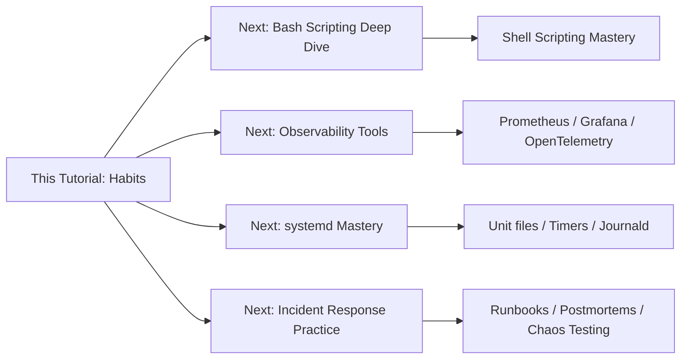

### Learning Path by Interest

| If you're interested in... | Next step |
|---------------------------|-----------|
| **Shell scripting** | Master `bash` scripting, arrays, `set -eo pipefail`, functions; build a full backup tool |
| **DevOps/Platform** | Learn GitOps, Terraform, Kubernetes day-2 operations |
| **SRE / Production** | Study Google SRE practices, postmortems, observability with Prometheus/Grafana |
| **Security** | Audit logs, hardening, CIS benchmarks, auditd, fail2ban |
| **Performance engineering** | Deep dive into `perf`, `bpftrace`, flame graphs, kernel tuning |

### 30-Day Habit Challenge

| Week | Focus | Daily Practice |
|------|-------|----------------|
| Week 1 | Observe first | For 5 days, before changing ANYTHING on a test system, run `systemctl status` / `journalctl` / `df` first |
| Week 2 | Verify + exit codes | Add `set -euo pipefail` to all new scripts; check `$?` after every critical interactive command |
| Week 3 | Trends + absolute paths | Enable sysstat; refactor all existing scripts to use absolute paths |
| Week 4 | Document + automate | Write your first 3 incident log entries; automate your 3 most repeated command sequences |

### After Completing This Tutorial

✅ You can diagnose common Linux issues systematically  
✅ You write production-safe, verified shell scripts  
✅ You use trends to find root causes  
✅ You document incidents for future prevention  
✅ You perform restarts with discipline and evidence

**Final thought:** Linux has no shortage of powerful commands. New tools appear every year. But the biggest improvements come from refining the habits behind every command you type. The engineers you admire most aren't impressive because they memorize obscure flags — they're impressive because their workflow is *deliberate*: they observe before acting, verify before assuming, automate what repeats, document what they learn, and treat every production system with the respect reliable infrastructure deserves.

Those habits may seem small. Over time, they become the difference between someone who *uses* Linux and someone who truly understands how to work with it.

---

*Tutorial created from the article "The Small Linux Habits That Made the Biggest Difference" by Fateyaly (Aug 2, 2026). All examples, exercises, and supplementary material were developed per the knowledge-base tutorial preferences. Photo credit for original article: Robert Clark on Unsplash.*