# Mastering the Copilot Workflow: Ask, Plan & Agent Modes in Concert

## Introduction

GitHub Copilot has **three modes**: **Ask**, **Plan**, and **Agent**. This tutorial folds Plan Mode into the original 5-phase workflow, turning it into a complete **6-phase loop**. We'll keep using the running example — **adding passcode-based 2FA to a Spring Boot + JWT application** — you'll see exactly where Plan Mode sits between "I understand the requirement" and "the Agent is building it," and why that extra step matters enormously once a feature touches more than one or two files.

By the end of this tutorial you'll know:

- What Plan Mode actually does under the hood, and how it differs from you manually writing a scoped prompt
- Exactly when Plan Mode is worth the extra step — and when it's overkill
- How to chain Ask → Plan → Agent → Ask → Agent into a single efficient loop
- Concrete, copy-pasteable prompt examples for every phase, across multiple real-world scenarios
- How to avoid common pitfalls that waste time and produce incorrect implementations
- When to skip phases and when to loop back for revisions

---

## Part 1 — Understanding the Three Modes

| Aspect | Ask Mode | Plan Mode | Agent Mode |
|---|---|---|---|
| **Purpose** | Explanation, research, conceptual clarity | Structured, reviewable implementation planning | Code generation, file edits, command execution |
| **Touches your code?** | No | No — produces a plan document, not code | Yes — directly edits files, runs commands |
| **Explores your codebase?** | Sometimes, for context | Yes — actively explores files and asks clarifying questions before producing a plan | Yes — explores while implementing |
| **Output** | Conversational text | A structured Markdown plan: scope, files to touch, step sequence, open questions | Actual file diffs, terminal output, iterative fixes |
| **Best for** | Learning concepts, scoping decisions, auditing results | Multi-file or ambiguous-scope features where you want a reviewable blueprint before any code is touched | Executing a plan or a clearly scoped single task |
| **Mental model** | A senior engineer explaining a concept on a whiteboard | A tech lead writing an implementation ticket with acceptance criteria | A capable engineer executing that ticket end-to-end |
| **Risk if misused** | Wastes time — you still write the code yourself | Skipped entirely on complex tasks → Agent guesses scope and architecture | Generates code that solves the wrong problem |
| **Time investment** | 2-5 minutes | 5-15 minutes (pays off in avoided rework) | 10-60 minutes depending on scope |
| **Reusability** | Low — context-specific to your question | High — can be shared, reviewed, attached to PRs | Low — implementation-specific |

### The Updated Mental Model

Think of the three modes as a small engineering team:

- **Ask Mode** is the **architect** — explains concepts, surfaces risk, answers "what if."
- **Plan Mode** is the **tech lead** — turns a fuzzy idea into a written, file-by-file implementation plan that a developer could execute without guessing.
- **Agent Mode** is the **engineer** — takes that plan (or a tightly scoped ticket) and builds it.

```mermaid
flowchart LR
    subgraph AskMode["🧠 Ask Mode"]
        A1[Explain Concepts]
        A2[Clarify Architecture Fit]
        A3[Surface Pitfalls]
        A4[Audit Generated Code]
    end

    subgraph PlanMode["📋 Plan Mode"]
        PL1[Explore Codebase]
        PL2[Ask Clarifying Questions]
        PL3[Generate Reviewable Plan]
        PL4[Hand Off to Agent]
    end

    subgraph AgentMode["🛠️ Agent Mode"]
        B1[Write Code]
        B2[Edit Files]
        B3[Run Commands]
        B4[Refactor Implementation]
    end

    AskMode -->|"Scoped requirement"| PlanMode
    PlanMode -->|"Approved plan"| AgentMode
    AgentMode -->|"Result needs review"| AskMode
    AskMode -.->|"Small, simple task — skip planning"| AgentMode
```

**Key Insight:** Notice the dotted line: **Plan Mode is not mandatory for every task.** A one-line bug fix doesn't need a tech-lead ticket. A new authentication subsystem touching six files absolutely does.

### When Each Mode Shines: Real Examples

**Ask Mode excels when:**
- You're learning a new technology ("Explain how Redis pub/sub works")
- You need to understand existing code ("What does this authentication filter do?")
- You're evaluating trade-offs ("Should I use JWT or session-based auth?")
- You're auditing generated code ("Does this implementation handle edge cases?")

**Plan Mode excels when:**
- Adding a feature that touches 3+ files across different layers
- Migrating or refactoring existing functionality
- You need buy-in from teammates before changing code
- The requirement has ambiguity that needs resolution before implementation

**Agent Mode excels when:**
- The task is fully scoped and ready to execute
- You're implementing a reviewed plan
- You're fixing a well-understood bug
- You're refactoring with clear guidelines

---

## Part 2 — What Plan Mode Actually Does (and Why It's Different From "Just Writing a Good Prompt")

Plan Mode isn't a fancier text box — it actively **explores your codebase, asks you clarifying questions during the planning conversation, and produces a structured, reviewable implementation plan** before any code changes happen. Once the plan exists, you get two concrete options: **Start Implementation** (which switches directly into an Agent session that executes the plan), or **Open in Editor** (which puts the plan as a Markdown document in your editor — shareable with teammates, attachable to a PR description, or editable by hand before you ever trigger Agent Mode).

This solves the exact weakness from the original 5-phase workflow: in Phase 2 ("Doubt Clearing"), *you* were responsible for translating Ask Mode's trade-off discussion into a well-scoped Agent prompt by hand. Plan Mode automates and formalizes that translation — and because it explores the actual codebase first, it catches structural details a human might miss (existing filter chains, naming conventions, an unused Redis bean already sitting there).

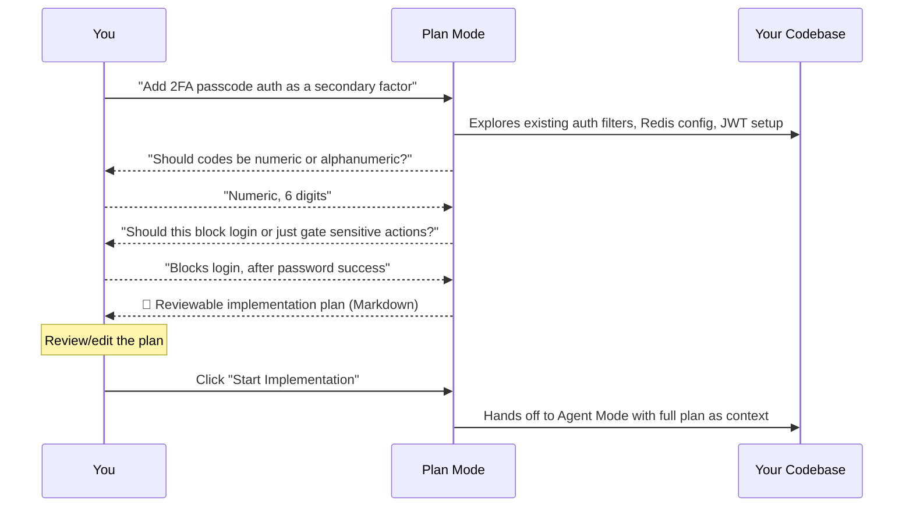

### The Plan Mode Advantage: Concrete Comparison

**Without Plan Mode (Manual Prompt Writing):**
```
You write: "Add 2FA to my Spring Boot app"
↓
Agent explores, makes assumptions, generates code
↓
You discover: Agent used sessions instead of JWT, missed your existing Redis setup
↓
Rework required: 30-60 minutes of fixing
```

**With Plan Mode:**
```
You: "Add 2FA passcode auth as secondary factor"
↓
Plan Mode explores, asks: "Should codes be numeric or alphanumeric?"
You: "Numeric, 6 digits"
Plan Mode asks: "Should this block login or gate sensitive actions?"
You: "Blocks login after password success"
↓
Plan produces reviewable document
↓
You catch: "Wait, we should use the existing NotificationService"
↓
You edit plan before implementation
↓
Agent executes corrected plan
↓
Result: Correct implementation first time
```

### Example of What a Plan Mode Output Looks Like

For our passcode-2FA example, a Plan Mode session might produce something like this:

```markdown
## Implementation Plan: Passcode-Based 2FA

### Scope
Add a secondary authentication factor (6-digit numeric passcode) that
triggers AFTER successful password authentication, before a JWT is issued.

### Files to Create
- `PasscodeService.java` — generates, hashes, stores, and validates codes
- `PasscodeController.java` — endpoint to request/verify a code
- `PasscodeRateLimiter.java` — limits requests per user

### Files to Modify
- `JwtAuthenticationFilter.java` — insert passcode check before token issuance
- `SecurityConfig.java` — register new passcode endpoints as permitAll pre-auth
- `application.yml` — add Redis TTL config for passcode expiry

### Step Sequence
1. Add PasscodeService with BCrypt-hashed code generation
2. Wire Redis storage with 5-minute TTL
3. Add rate limiter (3 requests / 10 minutes per user)
4. Modify JwtAuthenticationFilter to require passcode validation
5. Add unit tests for expiry, rate limiting, and hash verification

### Open Questions for You
- SMS or email delivery? (assumed: existing NotificationService, email channel)
- Should "remember this device" be in scope? (assumed: out of scope, v2)

### Risks & Mitigations
- Risk: Users locked out if email delivery fails
  Mitigation: Add fallback "resend code" endpoint with same rate limit
- Risk: Redis memory growth from expired codes
  Mitigation: Set TTL to 5 minutes, add cleanup job for orphaned entries

### Testing Strategy
- Unit: PasscodeService (generation, hashing, validation, expiry)
- Integration: Full login flow with passcode challenge
- Security: Rate limiting enforcement, BCrypt verification
```

This is dramatically more useful than a single Agent prompt — it's a **contract** you can review, edit, hand to a teammate, or attach to a Jira ticket before a single file changes.

### What Plan Mode Explores Under the Hood

When you trigger Plan Mode, it doesn't just read your prompt — it actively investigates:

1. **File Structure**: Scans the project to understand the architecture
2. **Existing Patterns**: Identifies naming conventions, error handling patterns, logging approaches
3. **Dependencies**: Maps out what's already available (e.g., "I see NotificationService exists")
4. **Integration Points**: Finds where new code needs to hook in (e.g., filter chains, config classes)
5. **Potential Conflicts**: Flags areas where new code might break existing functionality

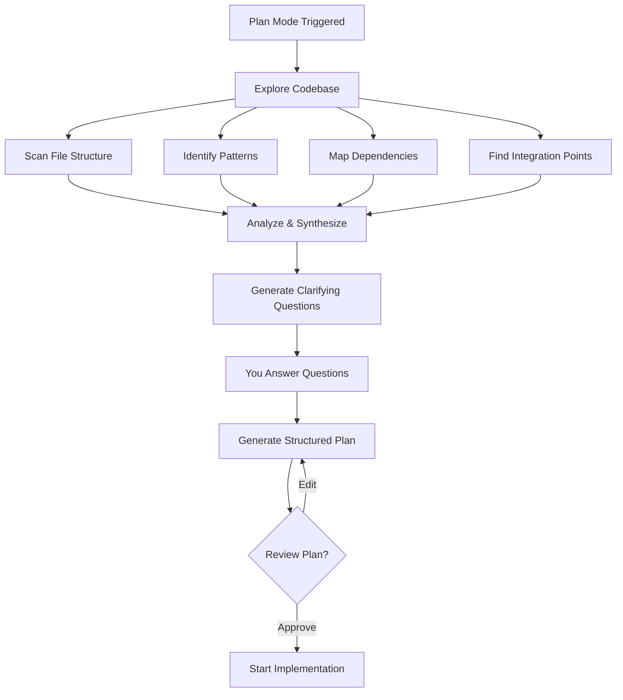

---

## Part 3 — The Complete 6-Phase Workflow

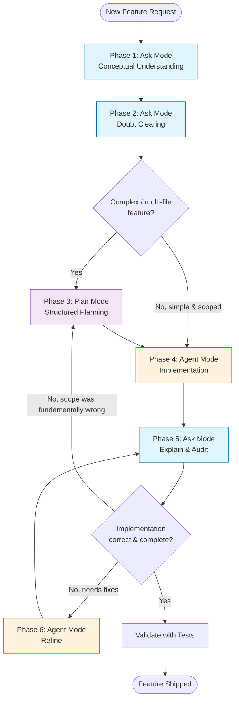

Color key: **blue = Ask Mode**, **purple = Plan Mode**, **orange = Agent Mode**. Notice the new `Gate` decision — Plan Mode is conditionally inserted, not blindly run every time.

### The Old vs. New Workflow: Side-by-Side

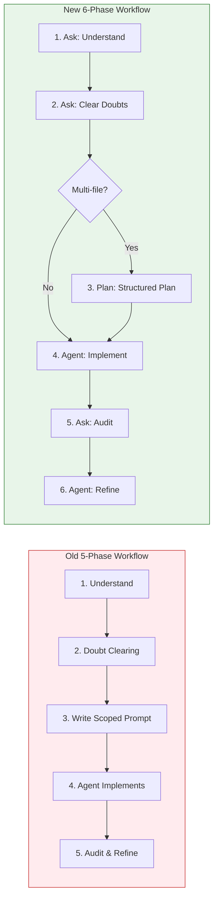

**Key Difference:** The old workflow had a manual translation step (Phase 2 → Phase 3) where *you* had to write a perfect prompt. The new workflow inserts Plan Mode to automate and formalize that translation, with codebase awareness.

### Time Investment vs. Risk Reduction

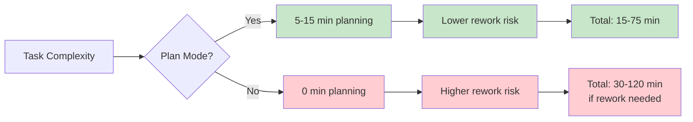

---

## Part 4 — Phase-by-Phase Deep Dive

### Phase 1: Ask Mode → Conceptual Understanding

*(Unchanged in spirit from before — this is where you build domain knowledge.)*

**Goal:** Build mental models and understand the "what" and "why" before worrying about the "how."

**Example Prompts:**

```
Explain what passcode-based authentication is, its typical flow,
and the security pitfalls to watch out for.

Given my application uses Spring Boot with JWT, how would passcode
authentication fit into this architecture? What's in scope vs. out of scope?

What challenges should I expect when integrating passcode auth
into an existing user login flow?
```

**Additional examples, other domains:**

```
Explain how a circuit breaker pattern prevents cascading failures
in a microservices architecture.

Explain the difference between eventual consistency and strong
consistency, and when each is acceptable for an inventory system.

What are the trade-offs between using gRPC vs REST for internal
service communication in a high-throughput system?
```

**What good looks like:** You can explain the concept to a colleague without looking at notes. You understand the security implications, performance considerations, and architectural fit.

**Common mistake:** Rushing to implementation before understanding the fundamentals. This leads to building the wrong thing the right way.

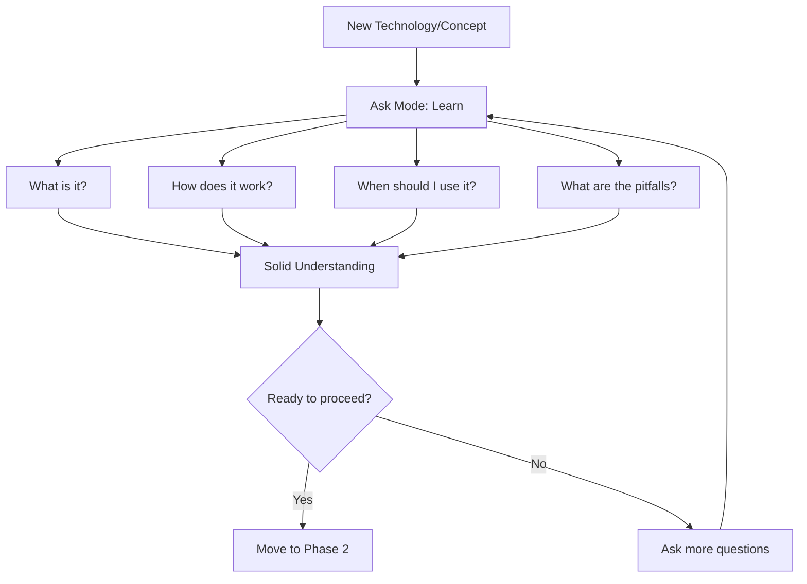

---

### Phase 2: Ask Mode → Doubt Clearing

*(Unchanged — but now its job is narrower: resolve high-level direction, not full scoping. Plan Mode will handle the detailed scoping next.)*

**Goal:** Resolve high-level architectural decisions and trade-offs before diving into implementation details.

**Example Prompts:**

```
In my app, users already authenticate with JWT. Would passcode auth
be a primary login method or a secondary factor? Explain trade-offs.

Is this feature simple enough for a single Agent prompt, or does it
touch enough files/architecture that I should use Plan Mode first?

Should I store passcodes in Redis or the database? What are the
implications of each approach for this use case?
```

**Trade-off table example (as before):**

| Approach | Pros | Cons | Best For |
|---|---|---|---|
| **Primary login (replaces password)** | Simpler UX, no password to remember/leak | Requires reliable SMS/email delivery; harder offline fallback | New apps without existing auth |
| **Secondary factor (2FA after password)** | Stronger security, incremental change | Adds friction; needs "remember this device" UX | Existing apps with established auth |

**Outcome:** A high-level direction ("secondary factor, email delivery, 5-minute expiry") — but not yet a file-by-file plan. That's Phase 3's job.

**Decision checkpoint:** At the end of Phase 2, ask yourself: "Do I know exactly which files need changing and what those changes will be?" If yes, you can skip Plan Mode. If no, proceed to Phase 3.

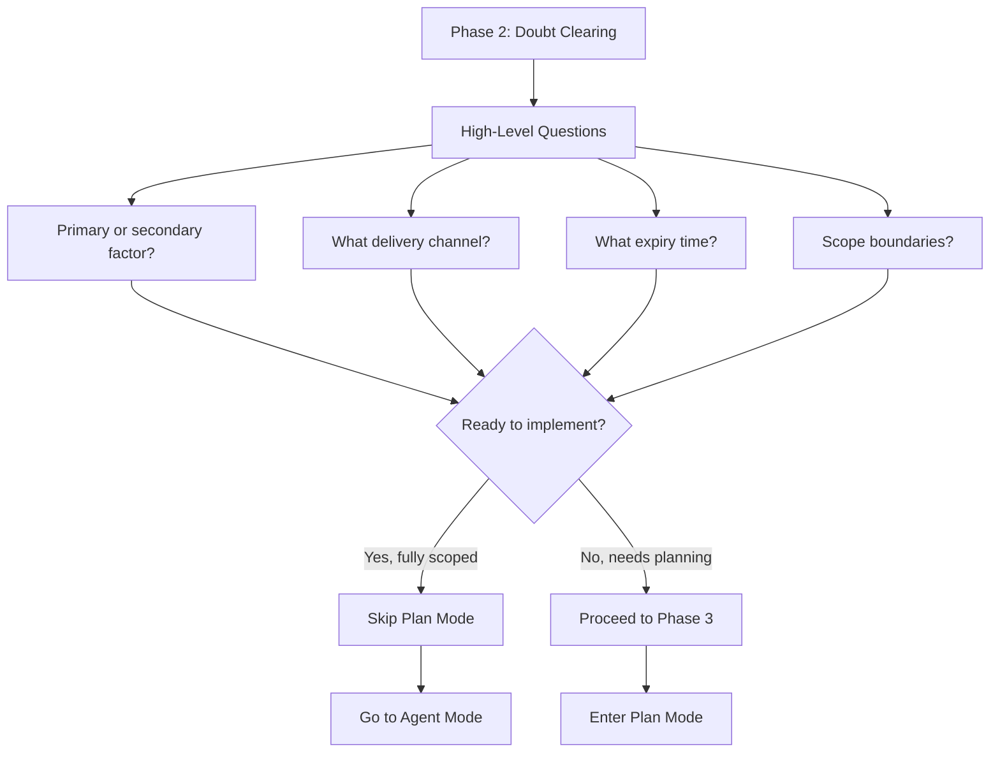

---

### Phase 3: Plan Mode → Structured Implementation Planning *(NEW)*

**Goal:** Convert your high-level direction into a reviewable, file-by-file implementation plan — *before* any code is touched.

**When to use it:**
- The feature touches 3+ files or multiple layers (controller, service, config, security filter)
- You're unfamiliar with parts of the codebase Copilot will need to touch
- You want a written artifact to share with a teammate or attach to a PR/ticket *before* implementation starts
- The requirement still has ambiguity that's easier to resolve via targeted clarifying questions than open-ended discussion
- The change involves migration or refactoring of existing functionality
- You're working on a critical system where mistakes are expensive

**When to skip it:**
- Single-file, well-understood change ("rename this method," "fix this null check")
- You already wrote a fully scoped requirement yourself in Phase 2 and trust it
- You're making a quick bug fix with clear root cause
- The change is purely cosmetic (formatting, comments)

**Example Prompt to start Plan Mode:**

```
Add passcode-based 2FA as a secondary authentication factor in this
Spring Boot project. Codes should be 6-digit numeric, expire after
5 minutes, and be rate-limited to 3 requests per 10 minutes. Explore
the existing JwtAuthenticationFilter and Redis configuration before
proposing a plan.
```

**What happens next:** Plan Mode explores `JwtAuthenticationFilter.java`, `SecurityConfig.java`, and your Redis setup, then — instead of jumping to code — asks clarifying questions:

```
Plan Mode: "I see NotificationService already supports email. Should
passcodes be delivered via email, or do you need SMS added too?"

Plan Mode: "Should passcode validation block ALL logins, or only
logins from new/unrecognized devices?"

Plan Mode: "I notice you have a RateLimiter bean for password attempts.
Should passcode attempts share the same limiter or have a separate one?"
```

You answer these, and Plan Mode produces the reviewable Markdown plan shown in Part 2 above.

**Two ways to proceed from here:**

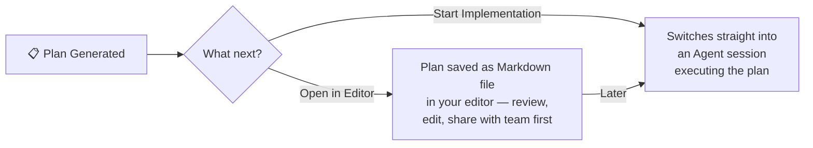

**More Plan Mode examples across domains:**

```
Plan a refactor of OrderController.java, which currently has 8
responsibilities. Explore the file and propose how to split it
into focused services before any code is changed.

Plan the migration of our /api/v1 endpoints to /api/v2 with
backward-compatible aliasing. Explore current route definitions
and propose a file-by-file plan, flagging any breaking changes.

Plan the addition of comprehensive logging to the payment processing
module. Explore the existing logging patterns and propose where
to add log statements, what levels to use, and what data to capture.
```

**Outcome:** A written, reviewable contract — the single most valuable artifact in this entire workflow, because it's the first point where a *human* (you, or a reviewer) signs off on scope before any code exists.

### Plan Mode Deep Dive: What You Get

A good Plan Mode output includes:

1. **Clear Scope Statement**: What's in, what's out
2. **File Inventory**: Exact files to create and modify
3. **Step Sequence**: Ordered implementation steps
4. **Dependencies**: What must exist before each step
5. **Open Questions**: Ambiguities that need human input
6. **Risks & Mitigations**: What could go wrong and how to prevent it
7. **Testing Strategy**: How to verify the implementation
8. **Rollback Plan**: How to undo if something breaks

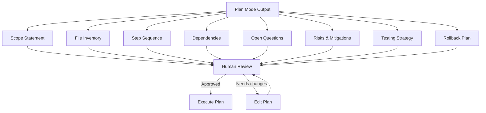

---

### Phase 4: Agent Mode → Implementation

**Goal:** Execute either the Plan Mode output or a tightly scoped Phase-2 requirement.

**If you came from Plan Mode**, implementation is nearly automatic:

```
[Click "Start Implementation" — Agent Mode receives the full plan as context]
```

You can also manually reference the saved plan document:

```
Implement the plan in docs/2fa-implementation-plan.md exactly as written.
Flag anything that doesn't match the existing codebase conventions.
```

**If you skipped Plan Mode** (simple task), you write the scoped prompt directly, as in the original workflow:

```
Implement passcode-based authentication as a SECONDARY factor (2FA)
in this Spring Boot project. Requirements:
- Add a PasscodeService that generates 6-digit numeric codes
- Codes must expire after 5 minutes
- Store codes hashed, not plaintext, in the existing Redis cache
- Integrate into the existing JwtAuthenticationFilter — issue JWT
  only after passcode validation succeeds
- Do not modify the existing password authentication logic
```

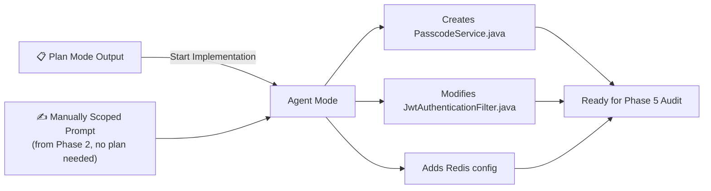

**Best practices for Agent Mode:**

1. **One logical change at a time**: Don't ask for "add 2FA, refactor the controller, and fix the bug" in one prompt
2. **Reference the plan explicitly**: "Implement step 3 of the plan" keeps Agent focused
3. **Set constraints**: "Do not modify existing password logic" prevents unintended changes
4. **Request flags**: "Flag any deviations from the plan" keeps you informed
5. **Iterate in small steps**: Implement → Audit → Refine → Repeat

**Common Agent Mode mistakes:**
- Over-scoping: Asking for too much in one prompt
- Under-specifying: Not providing enough context or constraints
- Skipping audit: Assuming the implementation is correct without verification
- Scope creep: Adding "while you're at it" tasks that weren't planned

---

### Phase 5: Ask Mode → Explain & Audit

*(Unchanged in mechanism — but now you also audit against the Plan Mode document, not just your memory of what you asked for.)*

**Goal:** Verify that the implementation matches the plan and meets requirements.

**Example Prompts:**

```
Explain only the changes made in response to my last Agent prompt.

Compare the implemented code against the implementation plan in
docs/2fa-implementation-plan.md — list any deviations.

Does the new PasscodeService correctly hash codes before storing
them in Redis, or did it store them in plaintext?

What edge cases does this implementation handle? What might it be missing?
```

**Outcome:** Either confirmation, or a gap list. If the gap is small (e.g., "missing rate limiting"), go to Phase 6. If the gap reveals the *plan itself* was wrong (e.g., "this should have blocked only new-device logins, not all logins"), loop back to **Phase 3** to revise the plan — don't patch around a wrong plan with ad-hoc Agent fixes.

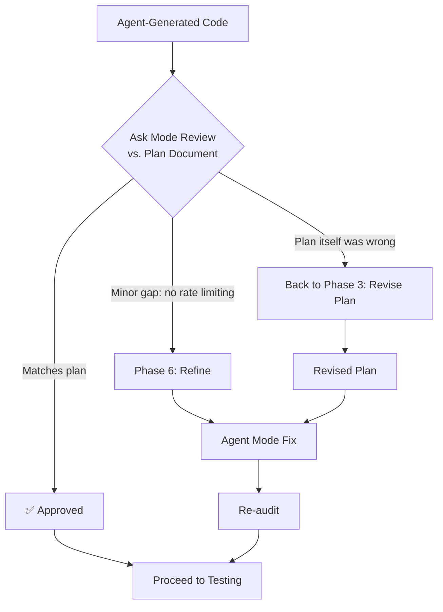

**Audit checklist:**
- [ ] Does the implementation match the plan document?
- [ ] Are all requirements from Phase 2 addressed?
- [ ] Are there any security vulnerabilities?
- [ ] Does it follow existing codebase patterns?
- [ ] Are error cases handled?
- [ ] Is the code readable and maintainable?

**The " rubber duck" technique:** Explain the implementation out loud (or to Ask Mode). If you can't explain it simply, it's probably too complex or wrong.

---

### Phase 6: Agent Mode → Refine

*(Unchanged — fixes specific, audited gaps.)*

**Goal:** Address specific gaps identified during the audit without changing the overall plan.

```
Update PasscodeService to hash codes with BCrypt before storing
them in Redis. Do not change the expiration logic.

Add rate limiting to the passcode generation endpoint: max 3
requests per user per 10 minutes, using the existing rate-limiter bean.
```

This loops back to Phase 5 for re-audit, then on to testing.

**Refinement principles:**
1. **One fix at a time**: Don't batch multiple refinements
2. **Stay scoped**: Only fix what the audit identified
3. **Re-audit after each fix**: Verify the fix worked
4. **Know when to stop**: If you're on refinement #5, the plan might be wrong

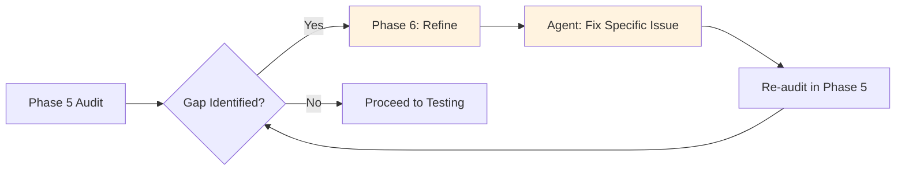

---

## Part 5 — Decision Framework: "Which Mode Do I Need Right Now?"

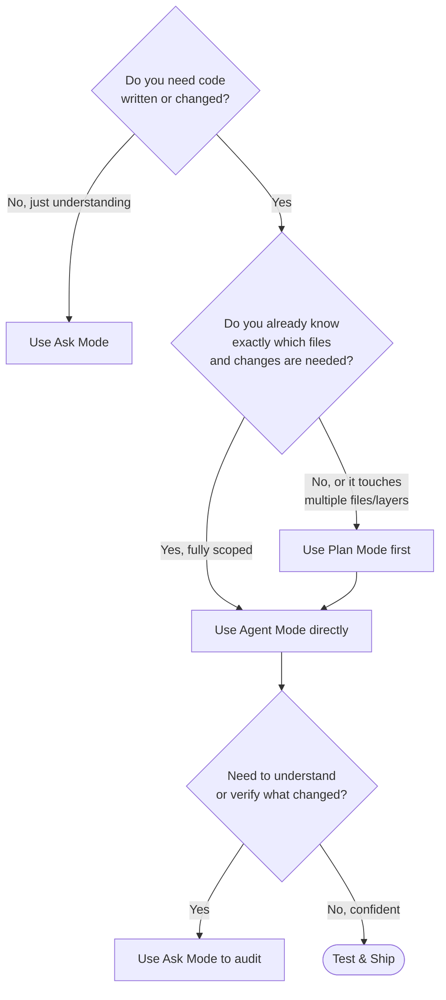

### Quick Decision Matrix

| Scenario | Mode | Phase |
|---|---|---|
| "What is OAuth2?" | Ask | 1 |
| "Should I use OAuth2 or JWT?" | Ask | 2 |
| "Add OAuth2 to my app" (3+ files) | Plan → Agent | 3 → 4 |
| "Fix this null pointer" (1 file, clear fix) | Agent | 4 |
| "Does this implementation match the plan?" | Ask | 5 |
| "Add error handling to the new code" | Agent | 6 |

### The 30-Second Test

Before starting any task, ask yourself:

1. **Is this a "what" or "why" question?** → Ask Mode
2. **Is this a simple, well-understood change?** → Agent Mode directly
3. **Does this touch 3+ files or involve unfamiliar code?** → Plan Mode first
4. **Do I need to verify or explain something?** → Ask Mode (audit)

If you're still unsure, start with Ask Mode. It's always safe to ask for clarification before taking action.

---

## Part 6 — The Complete Lifecycle (All Three Modes)

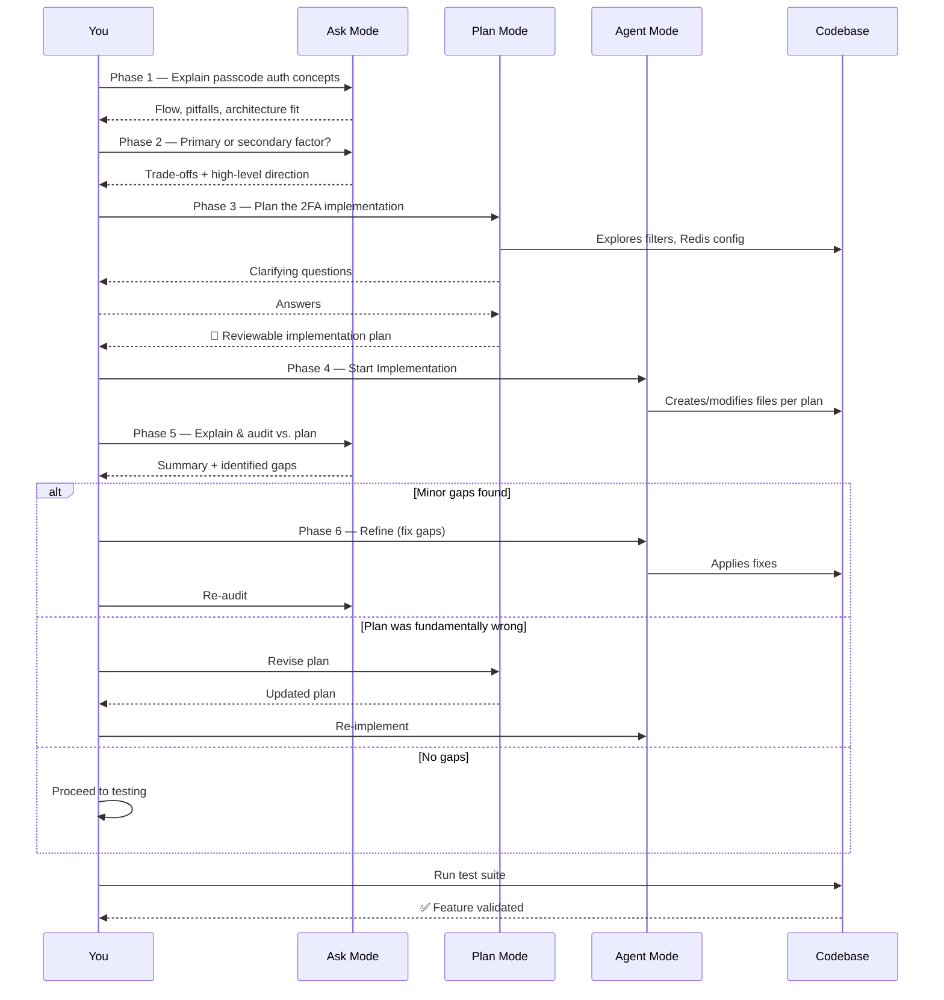

### Real-World Timing Example

Let's time a realistic 2FA implementation:

| Phase | Mode | Time | Output |
|---|---|---|---|
| 1 | Ask | 5 min | Understanding of 2FA concepts |
| 2 | Ask | 3 min | Decision: secondary factor, email delivery |
| 3 | Plan | 10 min | Reviewable implementation plan |
| 4 | Agent | 20 min | Working implementation |
| 5 | Ask | 5 min | Audit: found missing rate limiting |
| 6 | Agent | 5 min | Added rate limiting |
| 5 | Ask | 3 min | Re-audit: approved |
| Testing | Manual | 10 min | Validated with test suite |
| **Total** | | **61 min** | **Production-ready 2FA** |

**Without Plan Mode:** You might spend 20 min writing the perfect prompt, 25 min implementing, 15 min fixing scope issues, 10 min debugging = 70 min, with more rework likely.

---

## Part 7 — Real-World Use Cases (Updated for All Three Modes)

### Use Case 1: Two-Factor Authentication *(our running example)*

**Workflow:** Ask clarifies primary vs. secondary factor → Plan explores the existing filter chain and produces a file-by-file plan with clarifying Q&A → Agent executes via "Start Implementation" → Ask audits against the plan document.

**Why Plan Mode?** This touches 5+ files across security filters, controllers, services, and configuration. Getting the architecture wrong means reimplementing everything.

**Time saved:** Plan Mode caught that you already had a NotificationService, saving you from building email delivery from scratch.

### Use Case 2: Refactoring a Legacy Monolith Controller

A 3000-line controller needs splitting. Skipping Plan Mode here is the classic mistake — without it, the Agent might extract services along arbitrary boundaries. Instead: **Ask** explains current responsibilities → **Plan** explores the file and proposes explicit service boundaries (`UserService`, `OrderService`, `NotificationService`) with a migration order → **Agent** implements one extracted service at a time per the plan → **Ask** audits each extraction for leaked logic.


**Why Plan Mode?** A 3000-line controller has implicit dependencies and business logic scattered throughout. Plan Mode's exploration reveals these before you start extracting.

**Risk without Plan Mode:** Agent might split by technical layer (all DB calls in one service, all validation in another) instead of by business capability, creating a mess.

### Use Case 3: Adding Test Coverage to an Untested Payment Module

**Workflow:** **Ask**: "What are the critical edge cases for this payment calculation function?" → Since this is usually single-file, **Plan Mode is skipped** → **Agent** writes tests directly covering the discussed edge cases → **Ask** audits coverage against the original edge-case list.

**Why skip Plan Mode?** This is a single-file, well-understood change. The "plan" is just the list of edge cases from Phase 2.

**Example prompts:**

```
Ask: "What edge cases should I test for a payment calculation that
applies discounts, tax, and shipping?"

Ask: "Here's my test suite. Did I miss any edge cases from our
earlier discussion?"
```

### Use Case 4: Migrating an API from v1 to v2 with Backward Compatibility

This is a textbook Plan Mode case: many files, real risk of breaking changes. **Ask** clarifies the deprecation policy → **Plan** explores every `/api/v1` route and produces a plan with explicit flags for breaking changes and an aliasing strategy → team reviews the plan via "Open in Editor" *before* any Agent session starts → **Agent** implements → **Ask** audits each route against the plan.

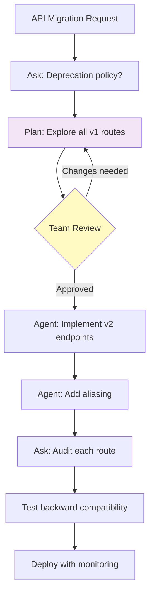

**Why Plan Mode?** Breaking changes affect external consumers. The plan becomes a contract with your API users.

**Plan Mode catches:**
- Routes that don't have v2 equivalents yet
- Breaking changes in request/response schemas
- Deprecated endpoints that need sunset timelines
- Authentication changes between versions

### Use Case 5: Onboarding to an Unfamiliar Codebase

New team members lean almost entirely on **Ask Mode** ("Explain how this event-sourcing pattern works here") and use **Plan Mode** the first time they attempt a real change, specifically *because* its codebase-exploration step teaches them the architecture as a side effect — then graduate to direct Agent Mode use as familiarity grows.

```mermaid
flowchart LR
    NewDev[New Team Member] --> Ask1[Ask: Explain architecture]
    Ask1 --> Learn[Learn codebase structure]
    Learn --> FirstTask[First real task]
    FirstTask --> Plan[Plan Mode: Explore + learn]
    Plan --> Implement[Implement with training wheels]
    Implement --> Audit[Audit learning]
    Audit --> Familiar[Gaining familiarity]
    Familiar --> Direct[Direct Agent Mode]
    Direct --> Expert[Codebase Expert]
    
    style Plan fill:#e3f2fd
    style Direct fill:#c8e6c9
    style Expert fill:#a5d6a7
```

**Why this works:** Plan Mode's exploration is like having a senior developer walk you through the codebase, pointing out important files, patterns, and gotchas.

### Use Case 6: Debugging a Production Issue

**Workflow:** **Ask** helps understand the error and trace it through the code → **Agent** implements the fix (skipping Plan Mode because it's a targeted fix) → **Ask** audits the fix to ensure it addresses the root cause and doesn't introduce new issues.

**Example:**

```
Ask: "I'm getting 'Connection pool exhausted' errors in production.
The stack trace shows it's coming from the user service. What could
be causing this?"

[You investigate together, discover connection leak]

Agent: "Fix the connection leak in UserRepository.java. The issue
is that connections aren't being closed in the error path."

Ask: "Explain the fix. Does it handle all error cases? Will this
affect performance?"
```

**Why skip Plan Mode?** You already know the exact file and issue. Plan Mode would be overkill.

### Use Case 7: Adding a New Database Table with Relationships

**Workflow:** **Ask** discusses the data model and relationships → **Plan** explores existing entity models, repository patterns, and migration strategies → **Agent** implements entities, repositories, and migrations → **Ask** audits for consistency with existing patterns.

**Example Plan Mode prompt:**

```
Plan the addition of a Subscription entity to track user subscription
status. It should relate to the existing User entity. Explore the
current entity models, repository patterns, and database migration
approach before proposing a plan.
```

**Why Plan Mode?** Database changes are hard to undo. The plan ensures you get the relationships, indexes, and migrations right the first time.

---

## Part 8 — Common Pitfalls (Expanded for Three Modes)

| Pitfall | Why It Happens | How to Avoid It | Real-World Example |
|---|---|---|---|
| **Asking Agent Mode for explanations** | Agent tends to "explain by changing code" | Switch to Ask Mode for any "why"/"what" question | ❌ "Agent, explain how auth works" → Agent modifies auth code<br>✅ "Ask, explain how auth works" → Pure explanation |
| **Asking Ask Mode for code** | Wastes a turn | Reserve Agent Mode strictly for execution | ❌ "Ask, write a login function" → You still write it<br>✅ "Agent, implement login per plan" → Agent writes it |
| **Skipping Plan Mode on multi-file features** | Feels like an "extra step" | If 3+ files or unfamiliar territory are involved, the plan pays for itself in avoided rework | ❌ "Agent, add 2FA" → Agent guesses, wrong architecture<br>✅ Plan first → Correct architecture from the start |
| **Running Plan Mode on trivial tasks** | Over-process for a one-line fix | Reserve Plan Mode for genuine scope/architecture ambiguity | ❌ Plan Mode to rename a method<br>✅ Just do it or use Agent directly |
| **Treating the Plan Mode output as final without reading it** | The plan looks polished, so it feels "done" | Always review the plan like a PR description — that's the whole point of "Open in Editor" | ❌ Click "Start Implementation" immediately<br>✅ Read plan, edit if needed, then implement |
| **Patching a wrong plan instead of revising it** | Feels faster to just tell the Agent to "also do X" | If the audit reveals the *scope* was wrong, go back to Plan Mode, not Agent Mode | ❌ "Agent, also block new devices" (patch)<br>✅ Back to Plan Mode to revise scope |
| **Skipping the audit (Phase 5)** | Bugs and scope creep ship unnoticed | Treat every Agent diff like a pull request from a junior engineer | ❌ Ship immediately after Agent finishes<br>✅ Always audit before merging |
| **Not validating with tests** | "Looks right" isn't the same as "is right" | Always run the test suite as the final gate | ❌ "The code looks good"<br>✅ Run tests, check coverage, verify behavior |
| **Over-prompting in Ask Mode** | Asking too many questions at once | Break complex questions into focused, sequential prompts | ❌ "Explain auth, 2FA, JWT, Redis, and rate limiting"<br>✅ One topic at a time |
| **Under-specifying in Agent Mode** | Vague prompts lead to wrong implementations | Provide context, constraints, and examples | ❌ "Add authentication"<br>✅ "Add JWT authentication using existing UserDetailsService" |
| **Ignoring Plan Mode's clarifying questions** | You want to move fast | Answer precisely; vague answers produce vague plans | ❌ "Use whatever you think is best"<br>✅ "Use email via existing NotificationService" |
| **Not using "Open in Editor" for team collaboration** | You work alone | Share plans via PRs, docs, or team chat for complex features | ❌ Keep plan to yourself<br>✅ Attach plan to Jira ticket for team review |

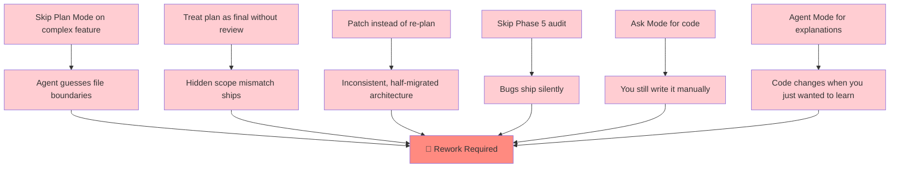

### Pitfall Deep Dive: The "Patch Instead of Re-Plan" Trap

This is the most insidious pitfall because it *feels* productive:

```
Scenario: You planned to block all logins with 2FA, but realize
mid-implementation that you only want to block new devices.

❌ WRONG APPROACH:
Agent: "I've implemented the 2FA blocking for all logins."
You: "Also, only block new devices."
Agent: [Adds complex device-tracking logic]
Result: Inconsistent architecture, half-baked feature

✅ RIGHT APPROACH:
You: "The plan is wrong. We should only block new devices."
[Back to Plan Mode]
Plan: "Revised plan with device-tracking scope..."
Agent: Implements the corrected plan
Result: Clean, consistent implementation
```

**Why the wrong approach feels right:** You're making progress and fixing the issue. But you're building on a flawed foundation, which creates technical debt.

---

## Part 9 — Prompt Engineering Cheat Sheet (All Three Modes)

### Ask Mode (Phases 1, 2, 5)

**Effective patterns:**
- Ask "why" and "what if" questions, not "do this"
- Request trade-off tables when deciding between approaches
- When auditing, say "explain only the last change, compared to the plan document" to keep the answer tightly scoped
- Ask for examples: "Show me a concrete example of..."
- Request edge cases: "What edge cases should I consider?"

**Example effective prompts:**

```
Phase 1: "Explain the OAuth2 authorization code flow. What security
considerations should I be aware of?"

Phase 2: "For my Spring Boot app, should I use session-based auth
or JWT? Compare them across: scalability, mobile support, logout
behavior, and security."

Phase 5: "Compare the implemented code against the plan. List any
deviations and explain if they're acceptable."
```

**Ineffective patterns:**
- "Write code for..." (that's Agent Mode)
- Multiple unrelated questions in one prompt
- Vague questions: "Is this good?" (good for what?)

### Plan Mode (Phase 3)

**Effective patterns:**
- Explicitly tell it which existing files/patterns to explore first — this produces a more grounded plan
- Answer its clarifying questions precisely; vague answers produce a vague plan, which produces vague code
- Use **"Open in Editor"** whenever the plan needs a second pair of eyes (teammate review, PR attachment) before implementation begins
- Use **"Start Implementation"** only once you've actually read the plan — don't treat it as a rubber stamp
- Request specific sections: "Include a risks section and testing strategy"

**Example effective prompts:**

```
"Plan the addition of rate limiting to our API endpoints. Explore
the existing RateLimiter configuration and propose how to integrate
it with the current filter chain. Include: files to modify, step
sequence, and testing strategy."

"Plan a migration from MongoDB to PostgreSQL for the user data.
Explore the current schema, identify data type mappings needed,
and propose a migration strategy with rollback plan."
```

**Ineffective patterns:**
- "Plan everything" (too vague)
- Not answering clarifying questions
- Skipping the review step
- Treating the plan as final without reading it

### Agent Mode (Phases 4, 6)

**Effective patterns:**
- When implementing from a plan, explicitly say "implement the plan exactly" and ask it to flag deviations rather than silently improvising
- When implementing without a plan, state constraints explicitly: "do not modify X," "use existing Y"
- Keep refine prompts scoped to *one* logical fix at a time — easier to audit, easier to roll back
- Reference specific files: "In UserService.java, add..."
- Request explanations: "Explain the changes you made"

**Example effective prompts:**

```
Phase 4 (from plan): "Implement the plan in docs/2fa-implementation-plan.md
exactly as written. Flag any deviations from the existing codebase
conventions."

Phase 4 (no plan): "Add a /api/auth/2fa/request endpoint that:
1. Requires authentication
2. Generates a 6-digit code
3. Stores it in Redis with 5-minute TTL
4. Sends it via email using NotificationService
5. Rate limits to 3 requests per 10 minutes
Do not modify any existing endpoints."

Phase 6 (refine): "Add input validation to the passcode verification
endpoint. Use the existing @Valid annotation pattern. Do not change
the business logic."
```

**Ineffective patterns:**
- "Make it better" (vague)
- Multiple unrelated changes in one prompt
- No constraints or context
- Assuming Agent knows your preferences

### Prompt Comparison: Same Task, Different Modes

**Task: Add 2FA to your app**

❌ **Wrong (Ask Mode):** "Add 2FA to my app"
✅ **Right (Ask Mode):** "Explain the trade-offs between TOTP and SMS-based 2FA for a Spring Boot application"

❌ **Wrong (Plan Mode):** "Plan 2FA"
✅ **Right (Plan Mode):** "Plan the addition of TOTP-based 2FA as a secondary factor. Explore the existing authentication filter and security config. I want to use Google Authenticator."

❌ **Wrong (Agent Mode):** "Add 2FA"
✅ **Right (Agent Mode):** "Implement the 2FA plan from docs/2fa-plan.md. Use the existing User entity and Redis configuration. Do not modify the login endpoint."

---

## Part 10 — Advanced Workflows

### Workflow 1: Iterative Feature Development

For complex features that require multiple rounds of implementation:

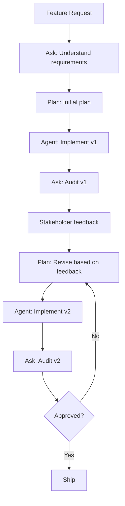

**Example:** Building a notification system
- v1: Email only
- v2: Add SMS (based on user feedback)
- v3: Add push notifications (based on usage data)

### Workflow 2: Parallel Exploration

When you have multiple approaches to evaluate:

```mermaid
flowchart LR
    Start[Decision needed] --> Ask[Ask: Explore options]
    Ask --> Opt1[Option A: Microservices]
    Ask --> Opt2[Option B: Modular monolith]
    Ask --> Opt3[Option C: Serverless]
    
    Opt1 --> Compare[Compare trade-offs]
    Opt2 --> Compare
    Opt3 --> Compare
    
    Compare --> Decision[Make decision]
    Decision --> Plan[Plan chosen approach]
    Plan --> Agent[Implement]
```

**Example:** Choosing between microservices and monolith
- Ask Mode explores both architectures
- You compare trade-offs (complexity, team size, deployment needs)
- Decide on modular monolith (for now)
- Plan Mode creates implementation plan
- Agent Mode implements

### Workflow 3: Team Collaboration

When working with a team:

```mermaid
flowchart TD
    Start[Feature idea] --> Ask[Ask: Discuss approach]
    Ask --> Plan[Plan: Create implementation plan]
    Plan --> Share["Share plan (Open in Editor)"]
    Share --> Review[Team reviews plan]
    Review --> Feedback{Feedback?}
    Feedback -->|Changes needed| Plan
    Feedback -->|Approved| Agent[Agent: Implement]
    Agent --> Audit[Ask: Team audits]
    Audit --> Merge[Merge to main]
```

**Benefits:**
- Plan becomes documentation
- Team alignment before coding
- Knowledge sharing
- Reduced rework

### Workflow 4: Learning a New Codebase

```mermaid
flowchart LR
    Start[New codebase] --> Ask1[Ask: High-level architecture]
    Ask1 --> Explore[Explore key files]
    Explore --> Ask2[Ask: How does X work?]
    Ask2 --> Task[First task]
    Task --> Plan[Plan: Learn while planning]
    Plan --> Implement[Implement with guidance]
    Implement --> Learn[Learn by doing]
    Learn --> Next[Next task]
    Next --> Direct[Direct Agent Mode]
    
    style Plan fill:#e3f2fd
    style Direct fill:#c8e6c9
```

**Progression:**
1. Week 1: 90% Ask Mode, 10% Plan Mode
2. Week 2: 50% Ask Mode, 30% Plan Mode, 20% Agent Mode
3. Week 3: 20% Ask Mode, 10% Plan Mode, 70% Agent Mode
4. Week 4+: 10% Ask Mode (for complex questions), 90% Agent Mode

---

## Part 11 — Measuring Success

### How to Know You're Using the Workflow Effectively

**Green flags:**
- You're spending more time in Ask/Plan and less time fixing Agent's mistakes
- Your Plan Mode documents are actually being reviewed (by you or teammates)
- You can explain what the code does without reading it
- Rework is decreasing over time
- You're shipping features faster with higher quality

**Red flags:**
- You're skipping Plan Mode on complex features and paying for it in rework
- You're using Agent Mode for explanations (and getting code changes you don't want)
- Your Plan Mode documents are never reviewed (just clicked through)
- You're in a constant cycle of implement → fix → implement → fix
- You can't remember why you made certain implementation choices

### Metrics to Track

| Metric | Good | Bad |
|---|---|---|
| **Rework rate** | < 20% of features need significant rework | > 40% need rework |
| **Plan review time** | 5-10 min per plan | < 2 min (not actually reading) |
| **Phase 5 audit findings** | 1-2 minor gaps | 5+ major gaps |
| **Time to first working version** | Plan + implement in 1 session | Multiple sessions of fix-and-retry |
| **Team alignment** | Plans shared and discussed | Plans never leave your machine |

### Continuous Improvement

After each feature, ask yourself:
1. Did I use the right mode for each phase?
2. Was Plan Mode worth the time investment?
3. Did the audit catch real issues?
4. What would I do differently next time?

```mermaid
flowchart LR
    Feature[Complete Feature] --> Retro[Retrospective]
    Retro --> Q1{Right modes?}
    Retro --> Q2{Plan worth it?}
    Retro --> Q3{Audit effective?}
    Retro --> Q4{What to improve?}
    
    Q1 --> Learn[Learnings]
    Q2 --> Learn
    Q3 --> Learn
    Q4 --> Learn
    
    Learn --> Next[Apply to next feature]
    Next --> Better[Better over time]
```

---

## Part 12 — Frequently Asked Questions

### Q: Can I use multiple modes in one session?

**A:** Absolutely! The workflow is designed to be fluid. You might start in Ask Mode, switch to Plan Mode, then to Agent Mode, then back to Ask Mode for audit — all in one session.

### Q: What if Plan Mode produces a bad plan?

**A:** That's why you review it! Edit the plan, answer clarifying questions more precisely, or start over with a different prompt. The plan is a starting point, not a contract you must accept.

### Q: How long should Plan Mode take?

**A:** Typically 5-15 minutes for a medium-complexity feature. If it's taking longer, the feature might be too large — consider breaking it into smaller pieces.

### Q: Can I use Plan Mode for research/exploration?

**A:** Not really — that's Ask Mode's job. Plan Mode is for *implementation planning*, not learning. Use Ask Mode to explore, then Plan Mode to plan the implementation.

### Q: What if I'm in Agent Mode and realize I need to plan?

**A:** Stop, go back to Plan Mode, create a plan, then return to Agent Mode with "Start Implementation." It's better to pause than to build on a shaky foundation.

### Q: How do I share Plan Mode output with my team?

**A:** Use "Open in Editor" to save the plan as a Markdown file, then:
- Attach it to a PR or ticket
- Share it in team chat
- Add it to your project documentation
- Use it as a starting point for team discussion

### Q: Can I modify the plan after Agent Mode starts?

**A:** Not directly — but you can pause Agent Mode, go back to Plan Mode, revise the plan, and restart. Or, use Phase 6 (Refine) for small adjustments.

### Q: What if my team doesn't use Copilot?

**A:** The Plan Mode output is just a Markdown document. You can use it as a traditional technical spec, even if your teammates don't use Copilot.

### Q: How is this different from traditional TDD or waterfall?

**A:** It's faster and more iterative. Traditional planning might take days; Plan Mode takes minutes. And unlike waterfall, you're not locked into the plan — you can revise it as you learn.

### Q: Can I automate any of these phases?

**A:** Not really — the human judgment in Ask Mode (understanding, decision-making) and Plan Mode (review, approval) is the whole point. Agent Mode is the only phase that could be partially automated (CI/CD, etc.).

---

## Part 13 — Integration with Development Practices

### With Git Workflow

```mermaid
flowchart LR
    Plan[Plan Mode Output] --> Branch[Create feature branch]
    Branch --> Agent[Agent: Implement]
    Agent --> Commit[Commit with plan reference]
    Commit --> PR[Open PR with plan attached]
    PR --> Review[Code review]
    Review --> Merge[Merge to main]
    
    style Plan fill:#f3e5f5
    style PR fill:#e3f2fd
```

**Best practice:** Attach the Plan Mode document to your PR description. It becomes living documentation of *why* the changes were made.

### With Code Review

```mermaid
flowchart TD
    PR[Pull Request] --> Plan[Attached Plan Document]
    Plan --> Reviewer[Reviewer reads plan first]
    Reviewer --> Code[Review code changes]
    Code --> Check{Matches plan?}
    Check -->|Yes| Approve[Approve]
    Check -->|No| Request[Request changes]
    Request --> Revise[Revise plan or code]
    Revise --> Code
```

**Benefits:**
- Reviewers understand the *intent* before reading the code
- Easier to spot deviations from the plan
- Faster reviews (context is already provided)
- Better documentation

### With Testing Strategy

```mermaid
flowchart LR
    Plan[Plan Mode] --> Tests[Testing strategy in plan]
    Tests --> TDD[TDD: Write tests first]
    Tests --> Integration[Integration tests]
    Tests --> E2E[E2E tests]
    
    TDD --> Agent[Agent implements]
    Integration --> Agent
    E2E --> Agent
    
    Agent --> Run[Run test suite]
    Run --> Pass{Tests pass?}
    Pass -->|Yes| Ship[Ship]
    Pass -->|No| Refine[Phase 6: Refine]
    Refine --> Run
```

**Plan Mode should specify:**
- What to test
- What testing framework to use
- What coverage target to hit
- What edge cases to cover

### With Documentation

```mermaid
flowchart TD
    Plan[Plan Mode Output] --> ADR[Architecture Decision Record]
    Plan --> Docs[Technical Documentation]
    Plan --> Runbook[Operational Runbook]
    
    ADR --> Why[Why we built it this way]
    Docs --> How[How it works]
    Runbook --> Maintain[How to maintain it]
    
    style Plan fill:#f3e5f5
    style ADR fill:#e3f2fd
    style Docs fill:#e3f2fd
    style Runbook fill:#e3f2fd
```

**Plan Mode documents become:**
- Architecture Decision Records (ADRs)
- Technical design docs
- Onboarding materials
- Operational runbooks

---

## Part 14 — Troubleshooting Common Issues

### Issue: Plan Mode asks too many clarifying questions

**Solution:** Be more specific in your initial prompt. Instead of "Add 2FA," say "Add email-based 2FA as a secondary factor using the existing NotificationService."

### Issue: Agent Mode generates code that doesn't match the plan

**Solution:** Be more explicit: "Implement the plan *exactly* as written. Do not improvise or add features not in the plan."

### Issue: I keep looping between Plan and Agent

**Solution:** The plan might be too vague. Go back to Phase 2 (Ask Mode) to clarify requirements before re-planning.

### Issue: Audit keeps finding major gaps

**Solution:** Either the plan was wrong (go back to Phase 3) or the Agent isn't following the plan (be more explicit in Phase 4).

### Issue: Plan Mode takes too long

**Solution:** The feature might be too large. Break it into smaller pieces and plan each one separately.

### Issue: I'm not sure if I should use Plan Mode

**Solution:** When in doubt, use it. The worst case is you spent 10 minutes planning a simple feature. The best case is you avoided hours of rework.

---

## Part 15 — The Future of Copilot Workflows

### What's Coming

As Copilot evolves, expect:
- **Better codebase understanding**: Plan Mode will catch more subtle patterns
- **Smarter clarifying questions**: More relevant, fewer generic ones
- **Plan templates**: Reusable plans for common patterns (auth, CRUD, etc.)
- **Team plans**: Shared plan libraries across organizations
- **Automated audits**: AI-powered plan vs. implementation comparison

### Staying Current

- Experiment with new features as they're released
- Share your workflows with the community
- Contribute feedback to GitHub
- Keep learning new modes and capabilities

---

## Quick Reference: The 6-Phase Loop

```mermaid
flowchart TD
    P1["1️⃣ Ask: Understand the Concept"] --> P2["2️⃣ Ask: Clear Your Doubts"]
    P2 --> Gate{Multi-file or<br>ambiguous scope?}
    Gate -->|Yes| P3["3️⃣ Plan: Build the Implementation Plan"]
    Gate -->|No| P4
    P3 --> P4["4️⃣ Agent: Implement"]
    P4 --> P5["5️⃣ Ask: Explain & Audit"]
    P5 -->|Minor gap| P6["6️⃣ Agent: Refine"]
    P6 --> P5
    P5 -->|Scope was wrong| P3
    P5 -->|Clean| V["✅ Validate with Tests"]
```

### One-Page Cheat Sheet

| Phase | Mode | Key Question | Output | Time |
|---|---|---|---|---|
| 1 | Ask | "What is this?" | Understanding | 2-5 min |
| 2 | Ask | "Which approach?" | Direction | 3-5 min |
| 3 | Plan | "How exactly?" | Plan document | 5-15 min |
| 4 | Agent | "Do it" | Code changes | 10-60 min |
| 5 | Ask | "Is it right?" | Audit report | 3-5 min |
| 6 | Agent | "Fix this" | Fixed code | 5-15 min |

### Mode Selection Cheat Sheet

```
START HERE
    ↓
Need to write/change code?
    ↓
Yes → Know exactly what/where?
    ↓
    Yes → Agent Mode (skip Plan)
    No  → Plan Mode first
    ↓
No  → Ask Mode
```

---

## Conclusion

Adding Plan Mode doesn't complicate the original workflow — it **completes** it. The old 5-phase loop had a quiet weak point: the translation from "I understand my requirement" (Phase 2) to "the Agent has a precise spec" (Phase 3) was entirely manual, resting on how well *you* phrased a single prompt. Plan Mode formalizes that translation into an explicit, codebase-aware, reviewable artifact — turning a step that used to live only in your head into a document your whole team can see before a single line of code changes.

### The Three Modes as a Team

```mermaid
flowchart LR
    subgraph Team["Your AI-Powered Team"]
        Architect[🧠 Ask Mode<br>Architect]
        TechLead[📋 Plan Mode<br>Tech Lead]
        Engineer[🛠️ Agent Mode<br>Engineer]
    end
    
    Architect -->|"Requirements"| TechLead
    TechLead -->|"Implementation Plan"| Engineer
    Engineer -->|"Questions"| Architect
    Engineer -->|"Progress"| TechLead
    TechLead -->|"Updated Plan"| Engineer
    Architect -->|"Audit Results"| Engineer
    
    style Architect fill:#e1f5fe,stroke:#0277bd
    style TechLead fill:#f3e5f5,stroke:#6a1b9a
    style Engineer fill:#fff3e0,stroke:#e65100
```

**Bottom line:**
- **Ask Mode = teacher/guide** → understand concepts, scope, and pitfalls.
- **Plan Mode = tech lead** → turn a scoped idea into a reviewable, file-by-file implementation plan — *for non-trivial features.*
- **Agent Mode = builder/partner** → execute the plan, or a tightly scoped task, with confidence.
- Together: *Ask for clarity → Ask for direction → Plan the implementation → Agent builds → Ask explains/audits → Agent refines (or re-Plan if scope was wrong) → Validate.*

### Final Wisdom

> "The best time to use Plan Mode is right before you think you don't need it."
> 
> "If you can't explain the plan to a rubber duck, it's not ready for Agent Mode."
> 
> "The audit is not optional — it's the quality gate that separates professionals from amateurs."

Master these three modes, use them in concert, and you'll ship better code faster with less rework. The 6-phase workflow isn't about adding process — it's about adding *clarity* at the points where ambiguity is most expensive.

---

## Appendix: Templates and Examples

### Template: Plan Mode Prompt

```
[Feature description in 1-2 sentences]

Requirements:
- [Requirement 1]
- [Requirement 2]
- [Requirement 3]

Constraints:
- [Constraint 1: e.g., "Do not modify existing auth logic"]
- [Constraint 2: e.g., "Use existing Redis configuration"]

Please explore:
- [File/component 1 to explore]
- [File/component 2 to explore]

Deliver a plan with:
- Files to create/modify
- Step-by-step implementation sequence
- Open questions for clarification
- Risks and mitigations
- Testing strategy
```

### Template: Audit Prompt

```
Compare the implementation against the plan in [plan-document.md].

Specifically check:
1. [Requirement 1]: Was it implemented correctly?
2. [Requirement 2]: Any deviations? Are they acceptable?
3. [Constraint 1]: Was it respected?

List:
- ✅ What matches the plan
- ⚠️ Minor deviations (if any)
- ❌ Major gaps or wrong implementations
```

### Template: Refine Prompt

```
[Specific issue identified in audit]

Fix:
- [Exact change needed]
- [What to preserve]

Do NOT:
- [What to avoid changing]

Context:
- [Relevant code or plan section]
```

### Example: Complete 2FA Workflow

**Phase 1 - Ask:**
```
Explain TOTP-based 2FA. How does it work? What are the security
considerations? How does it integrate with JWT authentication?
```

**Phase 2 - Ask:**
```
Should 2FA be primary or secondary? We have existing JWT auth.
What's the migration path if we start with secondary?
```

**Phase 3 - Plan:**
```
Add TOTP-based 2FA as secondary factor. Use Google Authenticator.
Explore existing auth filter and security config. Plan should include:
secret generation, QR code display, verification, and backup codes.
```

**Phase 4 - Agent:**
```
[Click "Start Implementation" from Plan Mode]
```

**Phase 5 - Ask:**
```
Audit the 2FA implementation against the plan. Check:
1. TOTP secret generation and storage
2. QR code generation
3. Verification logic
4. Backup code functionality
5. Integration with existing login flow
```

**Phase 6 - Agent (if needed):**
```
Add backup code generation: 10 one-time codes shown once during
2FA setup, hashed in database, validated during login.
```

---

## Resources and Further Reading

### Official Documentation
- [GitHub Copilot Documentation](https://docs.github.com/en/copilot)
- [Copilot Modes Explained](https://docs.github.com/en/copilot/how-tos/use-copilot-agents/using-plan-mode)

### Community Resources
- Copilot community forums
- GitHub discussions on workflow patterns
- Blog posts from teams using Copilot at scale

### Related Concepts
- Test-Driven Development (TDD)
- Behavior-Driven Development (BDD)
- Architecture Decision Records (ADRs)
- Code review best practices

---

**Happy coding with your AI-powered team!** 🚀

Remember: The goal isn't to use all three modes every time — it's to use the *right* mode at the *right* time. Master the workflow, adapt it to your needs, and ship better software.