# 🍃 Spring Framework: The Complete Interview Mastery Guide for 2026
### From Core Concepts to Production-Ready Architectures — Freshers to Senior Developers

---

## 📋 Table of Contents

1. [What is the Spring Framework?](#introduction)
2. [The Big Picture: Spring Ecosystem](#big-picture)
3. [Spring IoC Container & Dependency Injection](#ioc)
4. [Solving Bean Exceptions](#bean-exceptions)
5. [@Primary vs @Qualifier — Resolving Ambiguity](#primary-qualifier)
6. [CDI vs Spring Annotations](#cdi)
7. [Spring Version Evolution (1.x → 6.x)](#versions)
8. [Spring Modules Deep Dive](#modules)
9. [Spring Projects Ecosystem](#projects)
10. [Design Patterns in Spring](#design-patterns)
11. [ApplicationContext vs BeanFactory](#context-vs-factory)
12. [Dependency Version Management with BOM](#bom)
13. [Interview Quick-Reference & Tips](#interview-tips)

---

## 1. 🌱 What Is the Spring Framework?

Spring is the **most widely used Java enterprise framework**, built around three foundational ideas:

| Principle | Meaning |
|---|---|
| **IoC (Inversion of Control)** | Spring manages object creation and lifecycle — you don't `new` objects |
| **DI (Dependency Injection)** | Spring automatically wires dependencies between objects |
| **AOP (Aspect-Oriented Programming)** | Cross-cutting concerns (logging, security, transactions) are separated from business logic |

> 💡 **Why it matters in interviews:** When you explain Spring using these three pillars, it signals architectural maturity and production-level thinking to interviewers.

### Real-World Analogy

Think of Spring as a **professional hiring agency** for your Java objects:
- You define *what skills* (interfaces) you need
- The agency (Spring container) *finds the right person* (implementation) and *places them* in the right role
- You never manage the recruitment yourself — Spring handles it all

---

## 2. 🗺️ The Big Picture: Spring Ecosystem

Understanding the entire Spring ecosystem is one of the most common senior-level interview questions. Here is a complete map:

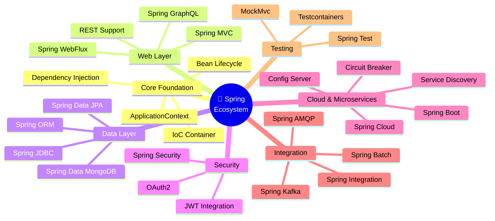

### The Layered Architecture of a Spring App

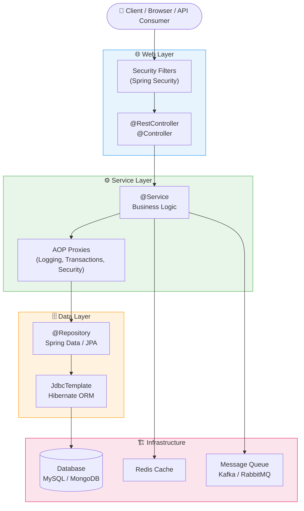

---

## 3. 🔄 Spring IoC Container & Dependency Injection

### What Is IoC (Inversion of Control)?

Traditionally, **you** create objects:
```java
// ❌ Traditional approach — tight coupling
public class OrderService {
    private PaymentService paymentService = new CreditCardPayment(); // hard-coded
}
```

With IoC, **Spring** creates and injects them:
```java
// ✅ IoC approach — loose coupling
@Service
public class OrderService {
    @Autowired
    private PaymentService paymentService; // Spring injects it
}
```

### The IoC Container Lifecycle

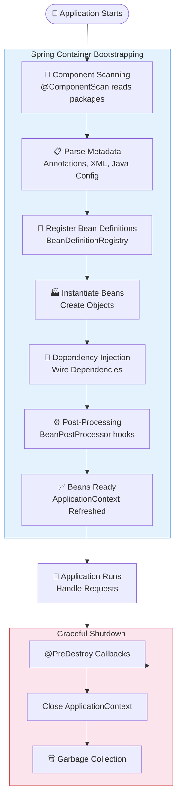

### Three Types of Dependency Injection

#### 1. Constructor Injection (✅ Recommended)
```java
@Service
public class OrderService {

    private final PaymentService paymentService;
    private final InventoryService inventoryService;

    // Spring automatically injects via constructor
    public OrderService(PaymentService paymentService,
                        InventoryService inventoryService) {
        this.paymentService = paymentService;
        this.inventoryService = inventoryService;
    }
}
```
**Why it's preferred:** Immutable fields, supports unit testing without Spring context, detects circular dependencies early.

#### 2. Setter Injection (⚠️ Optional dependencies)
```java
@Service
public class ReportService {

    private EmailService emailService;

    @Autowired(required = false)
    public void setEmailService(EmailService emailService) {
        this.emailService = emailService;
    }
}
```

#### 3. Field Injection (❌ Avoid in production)
```java
@Service
public class UserService {

    @Autowired // Works but hard to test and hides dependencies
    private UserRepository userRepository;
}
```

### Injection Type Comparison

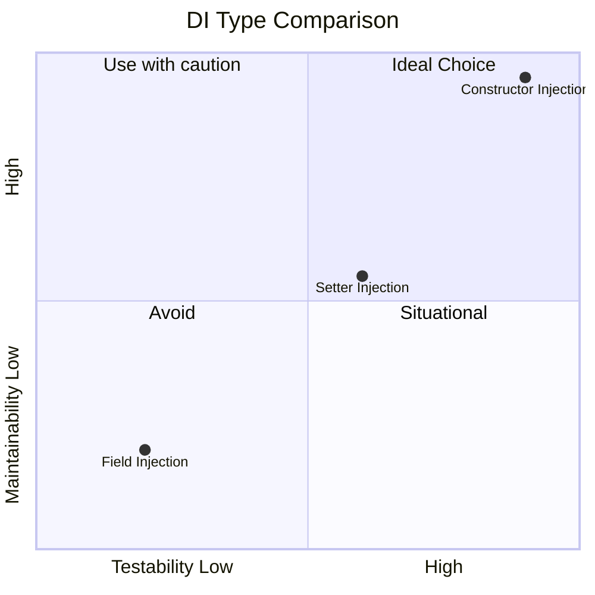

---

## 4. 🔴 Solving Bean Exceptions

### Q1: How Do You Solve `NoUniqueBeanDefinitionException`?

This exception occurs when Spring finds **multiple beans of the same type** but doesn't know which one to inject.

#### Root Cause Diagram

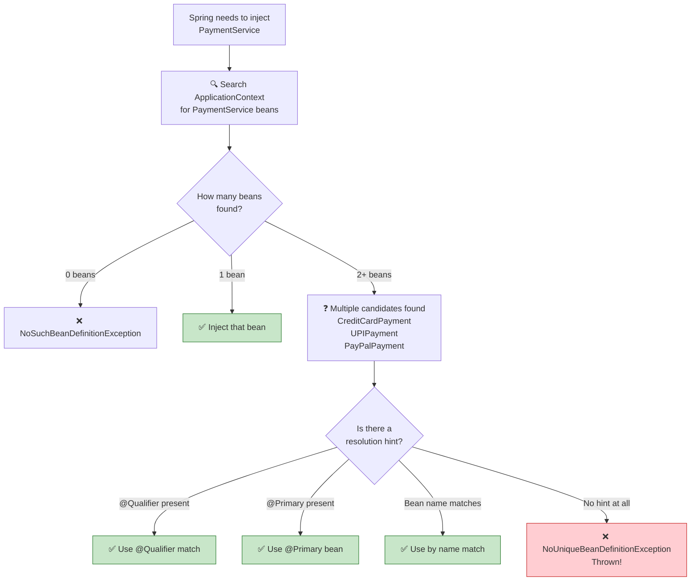

#### Solution 1: Using `@Qualifier`
```java
public interface PaymentService {
    void processPayment(double amount);
}

@Service("credit")
public class CreditCardPayment implements PaymentService {
    @Override
    public void processPayment(double amount) {
        System.out.println("Processing credit card: $" + amount);
    }
}

@Service("upi")
public class UPIPayment implements PaymentService {
    @Override
    public void processPayment(double amount) {
        System.out.println("Processing UPI: ₹" + amount);
    }
}

@Service("paypal")
public class PayPalPayment implements PaymentService {
    @Override
    public void processPayment(double amount) {
        System.out.println("Processing PayPal: $" + amount);
    }
}

// ✅ Now inject the specific one you need
@Service
public class OrderService {

    @Autowired
    @Qualifier("upi")          // Explicitly choose UPI
    private PaymentService paymentService;

    public void placeOrder(double amount) {
        paymentService.processPayment(amount);
    }
}
```

#### Solution 2: Using `@Primary`
```java
@Service
@Primary  // Spring uses this as default when no @Qualifier is given
public class CreditCardPayment implements PaymentService {}

@Service
public class UPIPayment implements PaymentService {}

@Service
public class OrderService {
    @Autowired  // Automatically picks CreditCardPayment (it's @Primary)
    private PaymentService paymentService;
}
```

#### Solution 3: Using Bean Name Match
```java
@Service
public class CreditCardPayment implements PaymentService {}

@Service
public class OrderService {
    @Autowired
    private PaymentService creditCardPayment; // field name = bean name → auto-resolved
}
```

> 💡 **Interview Tip:** Mention all three strategies and when you'd use each. @Primary for "default" behavior. @Qualifier for explicit control. Name-match as a quick fix.

---

### Q2: How Do You Solve `NoSuchBeanDefinitionException`?

This happens when Spring cannot find any bean matching the requested type/name.

#### Common Root Causes & Fixes

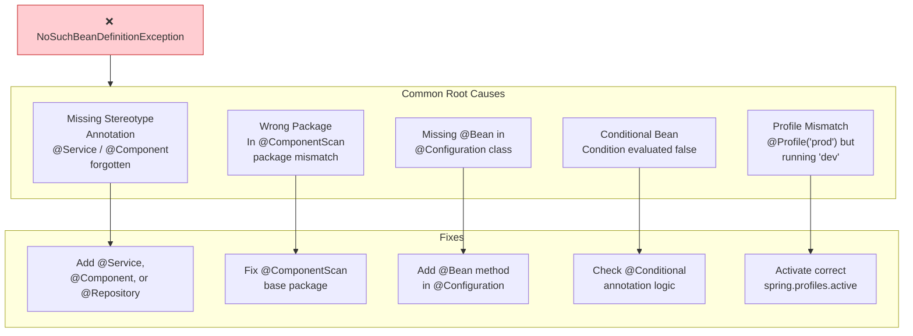

#### Example — Wrong Component Scan
```java
// ❌ Broken setup
@Configuration
@ComponentScan("com.app.web")  // only scans 'web' package!
public class AppConfig {}

// EmailService lives in com.app.services — NOT scanned!
@Service
public class EmailService {}

// Result: NoSuchBeanDefinitionException
```

```java
// ✅ Fixed setup
@Configuration
@ComponentScan(basePackages = {"com.app.web", "com.app.services"})
public class AppConfig {}

// Or use the parent package to scan everything:
@SpringBootApplication(scanBasePackages = "com.app")
public class MainApp {}
```

#### Example — Missing Annotation
```java
// ❌ Broken — no stereotype annotation
public class NotificationService {
    public void notify(String msg) { ... }
}

// ✅ Fixed
@Service
public class NotificationService {
    public void notify(String msg) { ... }
}
```

---

## 5. 🎯 @Primary vs @Qualifier

### Decision Flowchart

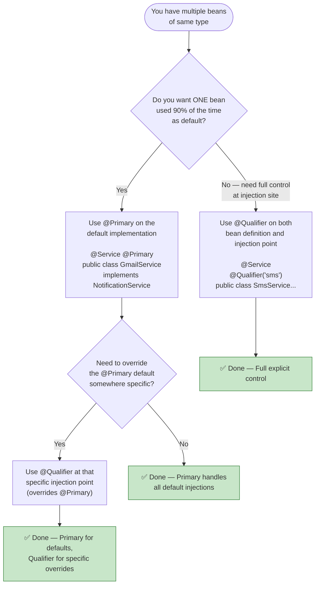

### Combined Usage Example (Real Notification System)

```java
public interface NotificationService {
    void send(String message, String recipient);
}

// ✅ Default notification channel — used in 90% of cases
@Service
@Primary
public class GmailNotification implements NotificationService {
    @Override
    public void send(String message, String recipient) {
        System.out.println("Sending email to " + recipient + ": " + message);
    }
}

@Service
@Qualifier("sms")
public class SmsNotification implements NotificationService {
    @Override
    public void send(String message, String recipient) {
        System.out.println("Sending SMS to " + recipient + ": " + message);
    }
}

@Service
@Qualifier("push")
public class PushNotification implements NotificationService {
    @Override
    public void send(String message, String recipient) {
        System.out.println("Sending push notification to " + recipient);
    }
}

// === Injection examples ===

@Service
public class UserRegistrationService {
    @Autowired
    private NotificationService notificationService; // Gets GmailNotification (@Primary)

    public void registerUser(String email) {
        notificationService.send("Welcome!", email);
    }
}

@Service
public class OtpService {
    @Autowired
    @Qualifier("sms") // Overrides @Primary — explicitly uses SMS
    private NotificationService notificationService;

    public void sendOtp(String phone) {
        notificationService.send("Your OTP is 123456", phone);
    }
}

@Service
public class PriceAlertService {
    @Autowired
    @Qualifier("push") // Uses push notification
    private NotificationService notificationService;

    public void alert(String userId) {
        notificationService.send("Price dropped!", userId);
    }
}
```

---

## 6. ☕ CDI vs Spring Annotations

### What Is CDI?

CDI (Contexts and Dependency Injection) is the **official Java/Jakarta EE standard** for dependency injection (JSR-299, JSR-346). Spring predates CDI but later added support for JSR-330 annotations.

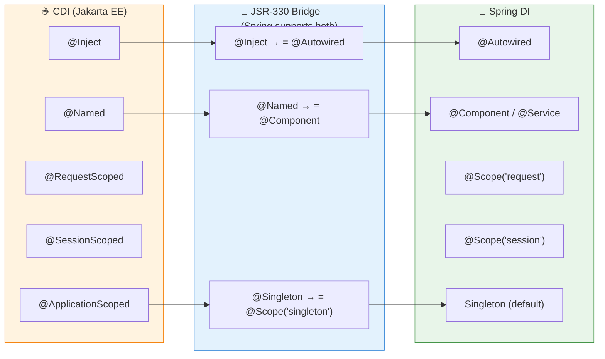

### CDI in Spring — Code Example

```java
// Using CDI-style annotations inside a Spring Boot app
import javax.inject.Inject;
import javax.inject.Named;
import javax.inject.Singleton;

@Named           // equivalent to @Component in Spring
@Singleton       // equivalent to @Scope("singleton")
public class ProductService {
    
    @Inject      // equivalent to @Autowired
    private ProductRepository productRepository;
    
    public List<Product> getAllProducts() {
        return productRepository.findAll();
    }
}
```

### When to Choose What?

| Scenario | Recommendation |
|---|---|
| Spring Boot microservice | ✅ Use Spring annotations (`@Service`, `@Autowired`) |
| Jakarta EE (WildFly, JBoss, GlassFish) app | ✅ Use CDI (`@Named`, `@Inject`) |
| Shared library that must work with both | ✅ Use JSR-330 (`@Inject`, `@Named`) |
| Greenfield Spring project | ✅ Always Spring annotations — richer ecosystem |

> 💡 **Interview Answer:** *"In Spring Boot projects I always recommend Spring's own annotations because they integrate natively with autoconfiguration, AOP proxies, and the full Spring lifecycle. CDI is appropriate only in pure Jakarta EE environments."*

---

## 7. 🚀 Spring Version Evolution

### Version Timeline

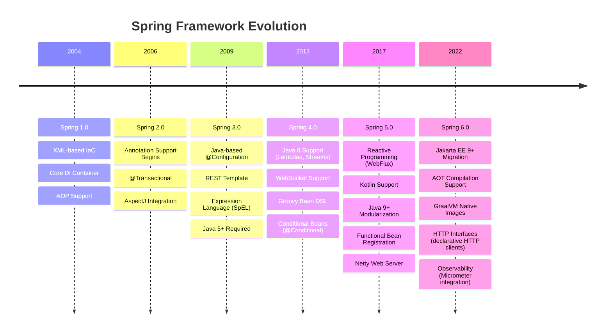

### Spring 4.x Key Feature — WebSocket

```java
// Real-time chat application with Spring 4 WebSockets
@Configuration
@EnableWebSocket
public class WebSocketConfig implements WebSocketConfigurer {

    @Override
    public void registerWebSocketHandlers(WebSocketHandlerRegistry registry) {
        registry.addHandler(new ChatHandler(), "/chat")
                .setAllowedOrigins("*");
    }
}

public class ChatHandler extends TextWebSocketHandler {

    private final List<WebSocketSession> sessions = new CopyOnWriteArrayList<>();

    @Override
    public void afterConnectionEstablished(WebSocketSession session) {
        sessions.add(session);
        System.out.println("New connection: " + session.getId());
    }

    @Override
    protected void handleTextMessage(WebSocketSession session,
                                     TextMessage message) throws Exception {
        // Broadcast to all connected clients
        for (WebSocketSession s : sessions) {
            if (s.isOpen()) {
                s.sendMessage(new TextMessage("Echo: " + message.getPayload()));
            }
        }
    }
}
```

### Spring 5.x Key Feature — Reactive WebFlux

```java
// Reactive REST API handling thousands of concurrent requests
@RestController
@RequestMapping("/api/v1/products")
public class ProductController {

    private final ProductService productService;

    public ProductController(ProductService productService) {
        this.productService = productService;
    }

    // Mono = single async value (like a Promise)
    @GetMapping("/{id}")
    public Mono<Product> getProduct(@PathVariable String id) {
        return productService.findById(id)
                .switchIfEmpty(Mono.error(new NotFoundException("Product not found")));
    }

    // Flux = stream of async values (like Observable)
    @GetMapping
    public Flux<Product> getAllProducts() {
        return productService.findAll()
                .delayElements(Duration.ofMillis(100)); // back-pressure control
    }

    // Server-Sent Events (SSE) — real-time data streaming
    @GetMapping(value = "/stream", produces = MediaType.TEXT_EVENT_STREAM_VALUE)
    public Flux<Product> streamProducts() {
        return productService.findAll()
                .delayElements(Duration.ofSeconds(1));
    }
}
```

### Spring 6.x Key Feature — Native GraalVM

```java
// Spring 6 + Spring Boot 3 — AOT-processed, native-compilable app
@SpringBootApplication
public class NativeApp {
    public static void main(String[] args) {
        SpringApplication.run(NativeApp.class, args);
    }
}

// Compile to native image with:
// ./mvnw -Pnative native:compile
// Result: ~50ms startup vs ~3s JVM startup!
```

---

## 8. 🧩 Spring Modules Deep Dive

### Module Architecture

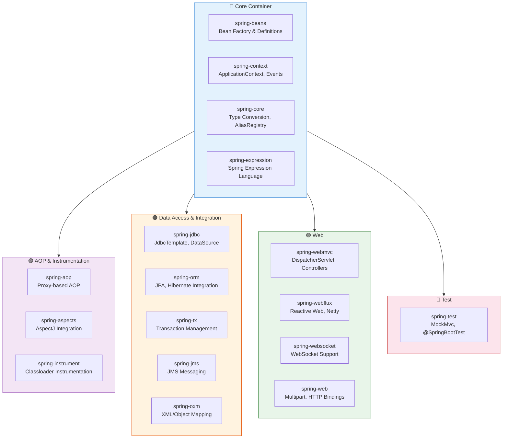

### Most Important Module: Spring AOP

AOP (Aspect-Oriented Programming) separates **cross-cutting concerns** from business logic.

```java
// Without AOP — logging pollutes every service method
@Service
public class OrderService {
    public void placeOrder(Order order) {
        logger.info("START placeOrder");
        long start = System.currentTimeMillis();
        
        // actual business logic
        processPayment(order);
        updateInventory(order);
        sendConfirmation(order);
        
        logger.info("END placeOrder - took {}ms",
                    System.currentTimeMillis() - start);
    }
}
```

```java
// ✅ With AOP — clean business logic + centralized cross-cutting concerns

@Service
public class OrderService {
    public void placeOrder(Order order) {
        // PURE business logic — no logging noise
        processPayment(order);
        updateInventory(order);
        sendConfirmation(order);
    }
}

// Logging Aspect — applied automatically to all service methods
@Aspect
@Component
public class LoggingAspect {

    private final Logger logger = LoggerFactory.getLogger(this.getClass());

    // Pointcut: all methods in all classes in the service package
    @Around("execution(* com.app.services.*.*(..))")
    public Object logExecutionTime(ProceedingJoinPoint joinPoint) throws Throwable {
        String methodName = joinPoint.getSignature().getName();
        logger.info("▶ START: {}", methodName);
        long start = System.currentTimeMillis();
        
        Object result = joinPoint.proceed(); // execute actual method
        
        logger.info("✅ END: {} — took {}ms",
                    methodName,
                    System.currentTimeMillis() - start);
        return result;
    }
}
```

---

## 9. 🌐 Spring Projects Ecosystem

### Major Projects Map

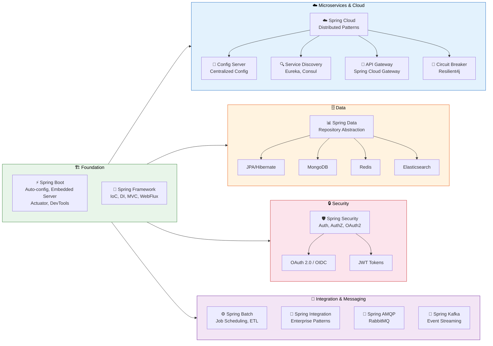

### Real Microservices Architecture Example

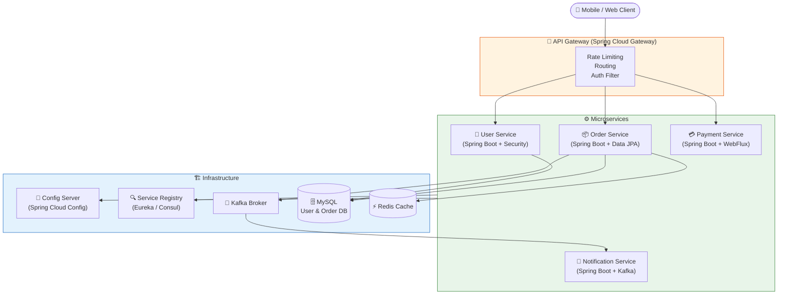

---

## 10. 🎨 Design Patterns in Spring

Spring is a masterclass in design pattern application. Here's how each pattern manifests:

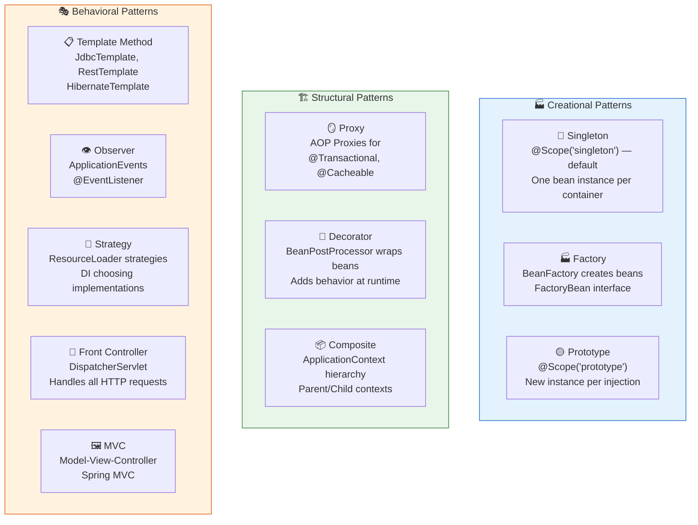

### Design Pattern in Action: Template Method

```java
// JdbcTemplate implements Template Method Pattern
// It handles the boilerplate, you provide only what changes

@Repository
public class ProductRepository {

    private final JdbcTemplate jdbcTemplate;

    public ProductRepository(JdbcTemplate jdbcTemplate) {
        this.jdbcTemplate = jdbcTemplate;
    }

    // Template handles: open connection, create statement, handle exceptions, close connection
    // You provide only: the SQL + row mapping
    public List<Product> findAll() {
        return jdbcTemplate.query(
            "SELECT * FROM products WHERE active = ?",
            new Object[]{true},
            (rs, rowNum) -> new Product(
                rs.getLong("id"),
                rs.getString("name"),
                rs.getBigDecimal("price")
            )
        );
    }

    public Optional<Product> findById(Long id) {
        try {
            return Optional.ofNullable(
                jdbcTemplate.queryForObject(
                    "SELECT * FROM products WHERE id = ?",
                    new Object[]{id},
                    (rs, rowNum) -> new Product(
                        rs.getLong("id"),
                        rs.getString("name"),
                        rs.getBigDecimal("price")
                    )
                )
            );
        } catch (EmptyResultDataAccessException e) {
            return Optional.empty();
        }
    }
}
```

### Design Pattern in Action: Observer (Spring Events)

```java
// Define custom event
public class OrderPlacedEvent extends ApplicationEvent {
    private final Order order;
    
    public OrderPlacedEvent(Object source, Order order) {
        super(source);
        this.order = order;
    }
    
    public Order getOrder() { return order; }
}

// Publisher — fires the event
@Service
public class OrderService {

    private final ApplicationEventPublisher publisher;

    public OrderService(ApplicationEventPublisher publisher) {
        this.publisher = publisher;
    }

    public Order placeOrder(Order order) {
        // process order...
        publisher.publishEvent(new OrderPlacedEvent(this, order));
        return order;
    }
}

// Listener 1 — sends confirmation email
@Component
public class EmailListener {
    @EventListener
    public void onOrderPlaced(OrderPlacedEvent event) {
        System.out.println("Email sent for order: " + event.getOrder().getId());
    }
}

// Listener 2 — updates analytics
@Component
public class AnalyticsListener {
    @EventListener
    @Async  // asynchronous listener
    public void onOrderPlaced(OrderPlacedEvent event) {
        System.out.println("Analytics updated for: " + event.getOrder().getId());
    }
}
```

---

## 11. ⚙️ ApplicationContext vs BeanFactory

### Feature Comparison

```mermaid
flowchart TD
    Root["Spring IoC Container"]

    Root --> BF["🔵 BeanFactory\n(Basic Container)"]
    Root --> AC["🟢 ApplicationContext\n(Advanced Container — USE THIS)"]

    BF --> BF1["✅ Lazy Bean Instantiation"]
    BF --> BF2["✅ Basic DI"]
    BF --> BF3["✅ BeanFactory methods"]
    BF --> BF4["❌ No MessageSource (i18n)"]
    BF --> BF5["❌ No Event Publishing"]
    BF --> BF6["❌ No BeanPostProcessor auto-detection"]
    BF --> BF7["❌ No @Value / Property resolution"]
    BF --> BF8["❌ No AOP auto-proxy"]

    AC --> AC1["✅ Everything in BeanFactory PLUS:"]
    AC --> AC2["✅ Eager Bean Instantiation (Singleton)"]
    AC --> AC3["✅ MessageSource — i18n"]
    AC --> AC4["✅ ApplicationEvent Publishing"]
    AC --> AC5["✅ Auto-detects BeanPostProcessor"]
    AC --> AC6["✅ @Value / Environment / Profiles"]
    AC --> AC7["✅ AOP Auto-proxy"]
    AC --> AC8["✅ @Scheduled, @Async support"]

    style BF fill:#ffecb3,stroke:#F57F17
    style AC fill:#c8e6c9,stroke:#1B5E20
```

### Code Comparison

```java
// ===== BeanFactory (Basic — rarely used directly) =====
public class BeanFactoryExample {
    public static void main(String[] args) {
        // Manual resource loading
        Resource resource = new ClassPathResource("beans.xml");
        BeanFactory factory = new XmlBeanFactory(resource);  // deprecated in Spring 5

        // Lazy: bean created only when getBean() is called
        UserService userService = factory.getBean(UserService.class);
        
        // ❌ Missing features:
        // - No event system
        // - No @Value resolution
        // - No i18n support
        // - No lifecycle callbacks auto-applied
    }
}
```

```java
// ===== ApplicationContext (Recommended) =====
public class ApplicationContextExample {
    public static void main(String[] args) {
        // Option 1: XML-based (legacy)
        ApplicationContext context =
            new ClassPathXmlApplicationContext("beans.xml");

        // Option 2: Annotation-based (modern)
        ApplicationContext context2 =
            new AnnotationConfigApplicationContext(AppConfig.class);

        // Option 3: Spring Boot (auto-configured)
        // SpringApplication.run(App.class, args) creates an ApplicationContext

        UserService userService = context.getBean(UserService.class);
        
        // ✅ Full features available:
        String welcomeMsg = context.getMessage("welcome.message",
                                               null,
                                               Locale.ENGLISH); // i18n
        context.publishEvent(new CustomEvent(context));         // events
    }
}
```

### ApplicationContext Implementations

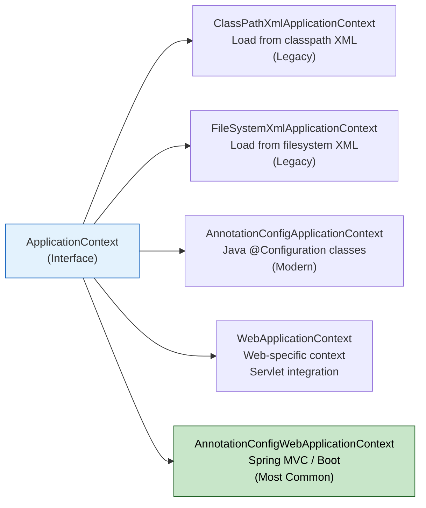

---

## 12. 📦 Dependency Version Management with BOM

### What Is BOM (Bill of Materials)?

Without BOM, every dependency needs a manual version — and incompatible versions are the #1 source of runtime errors.

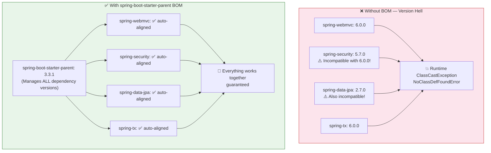

### pom.xml Setup

```xml
<!-- ===== Option 1: Using spring-boot-starter-parent (Recommended) ===== -->
<parent>
    <groupId>org.springframework.boot</groupId>
    <artifactId>spring-boot-starter-parent</artifactId>
    <version>3.3.1</version>
</parent>

<dependencies>
    <!-- NO versions needed — BOM manages them all -->
    <dependency>
        <groupId>org.springframework.boot</groupId>
        <artifactId>spring-boot-starter-web</artifactId>
    </dependency>
    <dependency>
        <groupId>org.springframework.boot</groupId>
        <artifactId>spring-boot-starter-security</artifactId>
    </dependency>
    <dependency>
        <groupId>org.springframework.boot</groupId>
        <artifactId>spring-boot-starter-data-jpa</artifactId>
    </dependency>
</dependencies>
```

```xml
<!-- ===== Option 2: Import BOM explicitly (if you can't use parent) ===== -->
<dependencyManagement>
    <dependencies>
        <dependency>
            <groupId>org.springframework.boot</groupId>
            <artifactId>spring-boot-dependencies</artifactId>
            <version>3.3.1</version>
            <type>pom</type>
            <scope>import</scope>
        </dependency>
    </dependencies>
</dependencyManagement>
```

---

## 13. 🎤 Interview Quick-Reference & Tips

### Complete Interview Answer Flow

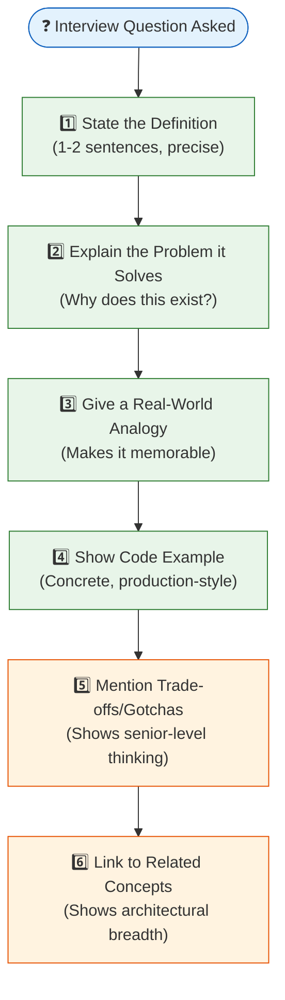

### Quick-Reference Cheat Sheet

| Concept | One-Line Definition | Key Annotation/Class |
|---|---|---|
| IoC | Spring creates and manages objects | `ApplicationContext` |
| DI | Spring injects dependencies automatically | `@Autowired`, `@Inject` |
| Bean | A Spring-managed object | `@Component`, `@Service`, `@Repository` |
| @Primary | Default bean when multiple exist | `@Primary` |
| @Qualifier | Explicit bean selection | `@Qualifier("name")` |
| NoUniqueBeanDefinitionException | Multiple beans, no disambiguation | Fix: `@Primary` or `@Qualifier` |
| NoSuchBeanDefinitionException | Bean not found in context | Fix: add annotation or fix scan path |
| BeanFactory | Basic IoC container | `XmlBeanFactory` (deprecated) |
| ApplicationContext | Full-featured IoC container | `AnnotationConfigApplicationContext` |
| AOP | Cross-cutting concerns separated | `@Aspect`, `@Around` |
| CDI | Java EE standard DI | `@Inject`, `@Named` |
| BOM | Aligned dependency versions | `spring-boot-starter-parent` |
| WebFlux | Reactive web framework | `Mono`, `Flux` |
| Spring Boot | Auto-configured Spring | `@SpringBootApplication` |

### Fresher vs Senior Answer Comparison

| Question | Fresher Answer | Senior Answer |
|---|---|---|
| What is DI? | "Spring injects dependencies" | "DI inverts control of object graph construction from classes to the container, enabling loose coupling, testability, and the Open/Closed principle" |
| @Primary vs @Qualifier? | "@Primary is default, @Qualifier is specific" | "@Primary provides default disambiguation with one annotation; @Qualifier at injection site overrides it. Prefer @Qualifier for explicit dependencies in production." |
| ApplicationContext vs BeanFactory? | "ApplicationContext has more features" | "BeanFactory is the foundational SPI; ApplicationContext adds annotation processing, event system, i18n, environment abstraction, and AOP. Use ApplicationContext always — the memory overhead is negligible." |

---

## 🏁 Conclusion

Spring Framework is not just a library — it's a **complete platform philosophy** built on proven engineering principles:

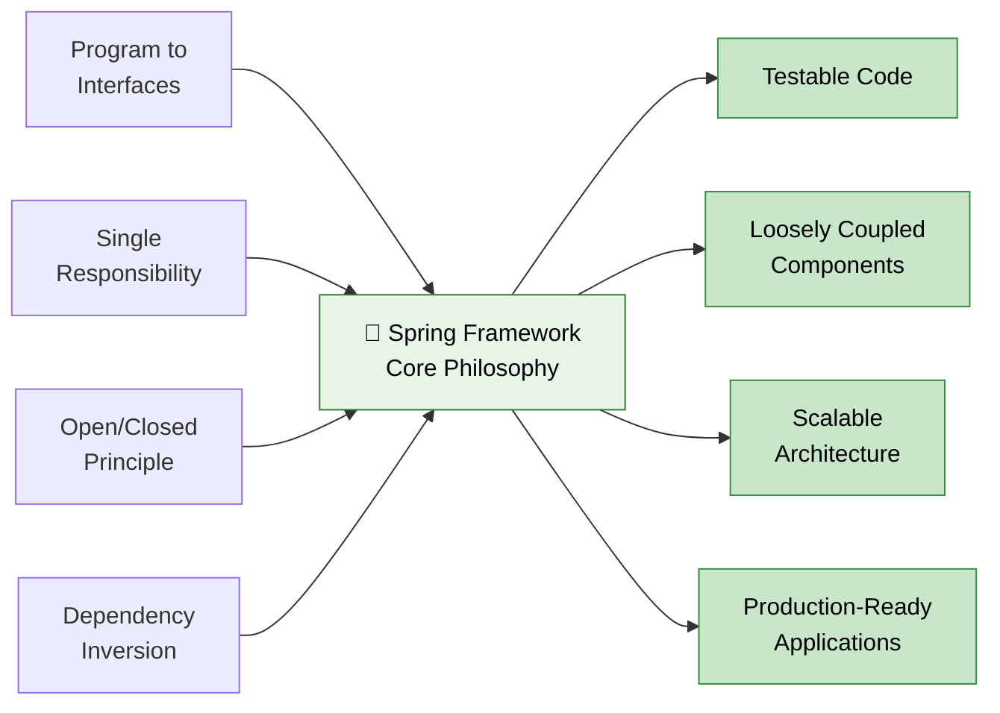

> **Key Takeaway for Interviews:** The best Spring answers combine *"what it is"* + *"why it exists"* + *"how it works"* + *"when to use it vs alternatives."* That four-layer structure demonstrates not just familiarity, but mastery.

---

*📌 Study these 18 topics deeply, understand their diagrams, and practice the code examples. In your next interview, you won't just answer questions — you'll tell stories about production-grade Spring architecture.*