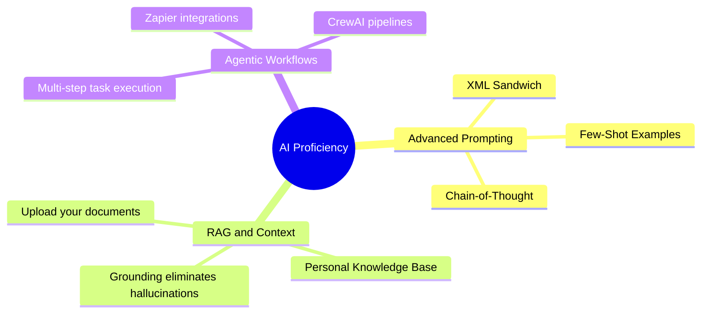
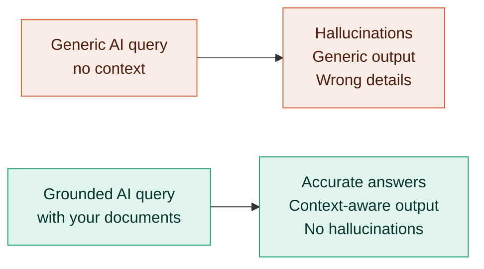
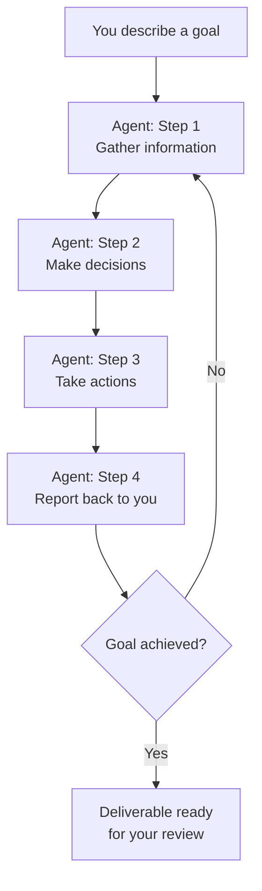
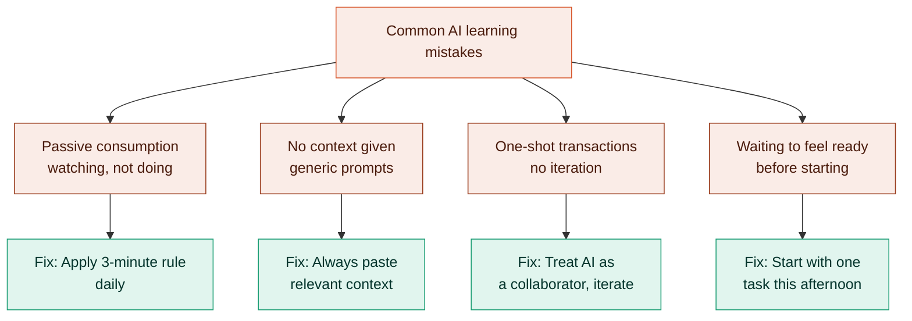
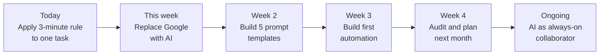

# A Comprehensive Tutorial: The 30-Day AI Roadmap for Busy Professionals

## Introduction

Most professionals spend months "meaning to learn AI properly" — watching videos, bookmarking courses, collecting certifications — without actually getting better at using it. This tutorial flips that model. It is built around one insight: **AI is a procedural skill, not a declarative one**. You learn it by doing, not by studying.

This guide transforms the original article into a full, actionable tutorial. By the end, you will understand not just *what* to do, but *why each step works*, *how to apply it immediately*, and *what mistakes to avoid*.

---

## The Core Philosophy: Directed Use Over Passive Learning

The fastest path to AI proficiency is a tight feedback loop:

1. Pick a real task you need done today.
2. Attempt to delegate it to an AI tool.
3. Get a mediocre result.
4. Diagnose why.
5. Look up one specific technique to fix it.
6. Try again.
7. Succeed (or refine further).

This single 15-minute cycle teaches more than five hours of structured video content because the learning is contextualised, immediate, and tied to something you actually care about.

> **Just-in-Time (JIT) Learning** is the name for this method. Instead of pre-loading theory, you seek knowledge only when you hit a specific wall. The feedback loop is tight, so the lessons stick.

---

## Why "Tutorial Hell" Kills AI Learners

**Tutorial Hell** is when you endlessly consume learning content (courses, playlists, blog posts) without ever applying the skill. It feels productive but produces almost no real progress.

Here's why it fails for AI specifically:

| Learning Method | What It Teaches | What's Missing |
|---|---|---|
| Watching prompt tutorials | That prompts exist | Judgment about *when* and *how* to use them |
| Reading about RAG | The concept | The feel of context drift in practice |
| Certification course | Broad vocabulary | Hands-on problem-solving instinct |
| **Directed use (this method)** | Judgment, pattern recognition | Nothing — this is the complete package |

**Example:** Reading about bicycle balance does not help you ride. The same is true for prompting. The judgment you need — when to add structure, when to feed context, when to chain steps — only comes from repetition on real problems.

---

## The 3-Minute Rule

The 3-Minute Rule is your filter for identifying AI candidates throughout your day.

> **If a task will take you longer than 3 minutes, it is at minimum an AI candidate.**

### How to Apply It

Walk through a typical workday and tag tasks:

| Task | Time Estimate | AI Candidate? |
|---|---|---|
| Drafting a follow-up email | 8 minutes | ✅ Yes |
| Summarising a 10-page report | 20 minutes | ✅ Yes |
| Rewriting a job description | 15 minutes | ✅ Yes |
| Generating 5 subject line options | 5 minutes | ✅ Yes |
| Choosing your lunch | 2 minutes | ❌ No |
| Checking a Slack notification | 30 seconds | ❌ No |

### Why This Rule Matters

Busy people never "find time" to explore tools abstractly. But they *do* have dozens of 3–10 minute tasks stacked through their day. The rule transforms every one of those into a practice opportunity. The habit forms not in a dedicated study session, but in the cracks of your actual workday.

---

## The Three Skills That Actually Matter in 2026



---

### Skill 1: Advanced Prompting — Stop Chatting, Start Structuring

Most people use AI like a slightly smarter search engine. They type a question, get an answer, and move on. This works for simple lookups. It fails spectacularly on complex, multi-part, or nuanced tasks.

In 2026, **prompting is structural engineering**, not casual conversation. Three techniques separate average users from power users.

---

#### Technique A: The XML Sandwich

Wrap your prompts in XML-style tags to give the model a clean, organised instruction set. Without structure, long prompts cause **model drift** — the AI blends context, instructions, and constraints and produces unfocused outputs.

**Poor prompt (no structure):**
```
Write a summary of the meeting where we discussed the Q3 budget shortfall and action items and also make it professional and about 200 words.
```

**Strong prompt (XML sandwich):**
```xml
<context>
We held a Q3 finance review on October 14th. The budget is 15% under target.
Key attendees: Sarah (CFO), Tom (Engineering), Maya (Marketing).
</context>

<task>
Summarise the meeting for a VP-level audience.
</task>

<constraints>
- Maximum 200 words
- Professional, neutral tone
- End with a bulleted list of 3 action items
</constraints>

<output_format>
Paragraph summary followed by an "Action Items" section.
</output_format>
```

The XML version gives the model a clear mental map. It knows what the context is, what it must do, what constraints apply, and exactly how to format the output. The result is reliably better and the template is reusable.

---

#### Technique B: Chain-of-Thought (CoT) Prompting

Instruct the AI to **reason through a problem before giving a final answer**. A single phrase — "Think step by step before responding" — dramatically improves output quality for complex tasks like strategic analysis, code debugging, or multi-variable decisions.

**Example — Without CoT:**
```
Prompt: Should we expand into the European market?
Response: Yes, the European market offers significant opportunities...
[Generic, surface-level answer]
```

**Example — With CoT:**
```
Prompt: Should we expand into the European market? Think through the key factors 
step by step before giving a recommendation.

Response:
Step 1 — Regulatory landscape: GDPR compliance would require...
Step 2 — Market size and competition: The EU SaaS market is...
Step 3 — Operational cost: Establishing a legal entity in...
Step 4 — Revenue potential vs. cost: Given our current ARR of...

Recommendation: Prioritise Germany and Netherlands first because...
```

The second response is auditable. You can check the reasoning, catch incorrect assumptions, and build on it. You're not just getting an answer — you're getting a **thought process**.

---

#### Technique C: Few-Shot Prompting

Show the AI 2–3 examples of the exact output style you want before asking for the real thing. Abstract style descriptions ("write like a senior consultant") are hard for AI to calibrate. Concrete examples are easy.

**Example:**
```
Here are two examples of the email style I want:

EXAMPLE 1:
"Hi Marcus — following up on last week's call. I've attached the revised scope 
document. Let me know if the timeline works on your end."

EXAMPLE 2:
"Hey Priya — quick note: the design files are in the shared drive under /Q4-rebrand. 
Flagging that the logo dimensions changed, so you may need to update the templates."

Now write a follow-up email to David about the delayed API documentation. We promised 
it by Friday and it will be ready Monday instead.
```

The model calibrates tone, length, and style from your examples far more reliably than from verbal descriptions.

---

### Skill 2: RAG and Context Management — AI Is Only as Smart as What You Feed It

**Retrieval-Augmented Generation (RAG)** is the practice of grounding an AI in your specific, current, relevant information before asking it to work.

#### Why This Matters

LLMs have a knowledge cutoff. They know nothing about your company, your clients, your documents, or your context unless you tell them. When you ask a generic AI to help with something specific — and give it no context — you get generic answers and hallucinations (confidently stated falsehoods).



#### The Practical Minimum

Before asking AI to help with anything context-specific:

1. **Paste your meeting notes** before asking for action items.
2. **Upload your product positioning doc** before asking it to write a landing page.
3. **Include your company's style guide** before asking it to write a blog post.
4. **Paste the actual job description** before asking it to write interview questions.

The rule: **don't assume the AI knows. It doesn't. Always bring the context to it.**

#### Real-World Examples

| Task | Without RAG | With RAG |
|---|---|---|
| Write training material | Generic, off-target onboarding guide | Precisely aligned with your actual process |
| Summarise a client meeting | Fabricates details, misses nuance | Accurate summary from pasted meeting notes |
| Draft a proposal | Generic value propositions | Uses your real pricing, capabilities, and case studies |
| Answer a customer question | May contradict your actual policy | Draws directly from your documentation |

#### Building a Personal Knowledge Management (PKM) System

Tools like **Notion AI** and **Mem** let you build a searchable, AI-indexed collection of your own notes, decisions, documents, and knowledge. Over time, you stop prompting a generic AI and start querying a system that knows your work.

This is the "second brain" concept — but it only works if you build the brain. Start small: paste relevant context into every prompt today. Build towards a PKM system over weeks.

---

### Skill 3: Agentic Workflows — From Chatting to Operating

An **autonomous agent** is an AI that doesn't respond to a single prompt but executes a sequence of tasks: gathering information, making decisions, taking actions, and reporting back. You describe a goal; the agent works through the steps.

This is where applied AI becomes genuinely transformative — and where most professionals have not yet gone, which means it is still a real competitive edge.



#### Example: The Prospecting Workflow

**Manual process (your time: ~3 hours):**
1. Find 10 relevant LinkedIn profiles.
2. Research each company manually.
3. Write a personalised email for each.
4. Save to drafts.

**Agentic process (your time: ~10 minutes to set up, then it runs):**
- Agent finds 10 profiles matching your criteria.
- Agent researches each company.
- Agent drafts a personalised email for each.
- Agent saves all drafts to your inbox.
- You review and send.

#### Tools to Get Started (No Coding Required)

| Tool | Best For | Complexity |
|---|---|---|
| **Zapier AI** | Connecting apps, automating triggers | Low |
| **Make (Integromat)** | Visual workflow builder | Low–Medium |
| **CrewAI** | Multi-agent systems for complex tasks | Medium |
| **n8n** | Self-hosted, powerful automation | Medium–High |

#### The Mindset Shift

The skill is not technical — it's architectural. You need to think in workflows:

- What is the first step?
- What does step two need from step one?
- What should the final output look like?
- Where does human review happen?

This is the same thinking a project manager uses. Apply it to AI, and you have automated a significant chunk of your week.

---

## The 30-Day Roadmap: 15 Minutes a Day

```mermaid
gantt
    title 30-Day AI Proficiency Roadmap
    dateFormat  DD
    axisFormat  Day %d

    section Week 1 — Tool Saturation
    Replace Google with AI for all queries     :active, w1, 01, 7d

    section Week 2 — Template Build
    Write 5 gold-standard prompt templates     :w2, 08, 7d

    section Week 3 — Automation
    Build first mini AI agent with Zapier      :w3, 15, 7d

    section Week 4 — The Audit
    Audit calendar and build next roadmap      :w4, 22, 8d
```



---

### Week 1 — Tool Saturation

**Goal:** Build the reflex. Replace your default Google habit with a conversational AI (Perplexity AI, ChatGPT, or Claude) for every query during this week.

**Not just work queries — everything.** What's a good substitute for buttermilk? What's the capital of Uzbekistan? Why is my Wi-Fi dropping?

**What you're learning:**
- What AI is genuinely good at (synthesis, rewriting, brainstorming, explanation).
- Where it needs supervision (specific recent facts, niche domains, anything requiring live data).
- How to phrase questions to get useful answers faster.

**Daily practice:** Pick one task that day, try it with AI first, and note what worked and what didn't. That's it. 15 minutes.

---

### Week 2 — The Template Build

**Goal:** Identify the 5 tasks you repeat most often and write a "gold standard" prompt for each one.

**How to find your 5 tasks:**
1. Look at your last week's output.
2. List every task you did more than once.
3. Rank by frequency and time cost.
4. Pick the top 5.

**Example prompt library entries:**

**Template 1: Meeting Summary**
```xml
<context>{{paste meeting notes here}}</context>
<task>Summarise this meeting for stakeholders who were not present.</task>
<output_format>
- 3-sentence executive summary
- Key decisions made
- Action items with owners and due dates
</output_format>
<tone>Professional, concise, neutral</tone>
```

**Template 2: Email Reply**
```xml
<context>{{paste the incoming email here}}</context>
<task>Draft a reply that {{specific goal: declines, accepts, asks for more info}}.</task>
<constraints>Under 100 words, warm but professional tone.</constraints>
```

By the end of Week 2, you will have a personal prompt library that saves you an hour or more per week — indefinitely.

---

### Week 3 — Automation

**Goal:** Connect two AI tools and build your first mini-agent.

**Keep it simple.** The goal is not to build something impressive — it is to cross the threshold from using AI reactively to deploying it proactively.

**Example automation to build:**
> "When I receive an email tagged 'follow-up', draft a response using my follow-up template and save it as a draft."

**Step-by-step with Zapier:**
1. Create a free Zapier account.
2. Set trigger: "New email with label 'follow-up' in Gmail."
3. Set action: "Send to ChatGPT with your follow-up template prompt."
4. Set final action: "Create draft in Gmail with the AI response."

This automation may save you 30–45 minutes per week from day one. More importantly, it teaches you the architectural thinking that scales to complex agents later.

---

### Week 4 — The Audit

**Goal:** Look back at the previous three weeks and build your next automation roadmap.

**How to do the audit:**
1. Open your calendar.
2. Highlight every task that took more than 10 minutes.
3. Filter for tasks that were primarily: information-handling, writing, or repetition.
4. That list is your next month's automation targets.

**What you'll discover:**

Most professionals are surprised to find that 30–50% of their "skilled" work is actually: summarising, reformatting, synthesising, drafting, or categorising information. All of it is delegable to AI with the right prompts and context.

This audit is typically the most motivating moment in the 30 days. Use the energy it generates to plan your next set of automations.

---

## The Habit Shift That Makes It All Work

The professionals who build durable AI skills share one habit: **they interview their AI before they search the internet.**

| Old habit | New habit |
|---|---|
| Google the question | Ask AI first, then verify specifics |
| Open a blank doc and start writing | Generate a draft, then revise |
| Stare at a problem | Describe it to AI and ask for 5 approaches |
| Search for a template | Ask AI to generate one from your specs |

**This is not about trusting AI blindly.** It is about using it as a first-pass thinking partner — fast, always available, tireless. You review, edit, and judge. The AI drafts, synthesises, and generates options.

The professionals pulling ahead treat AI the way they'd treat a sharp junior colleague: give it context, give it constraints, review its work, and iterate. The ones staying stuck treat every AI interaction as a one-shot transaction.

---

## Common Mistakes and How to Avoid Them



---

## Real-World Use Cases by Profession

### For Managers
- **Weekly status reports:** Paste raw notes, ask for an executive summary.
- **Performance reviews:** Describe behaviours, ask for structured feedback language.
- **Job descriptions:** Describe the role needs, generate 3 draft JDs, pick the best.

### For Marketers
- **Content calendar:** Give AI your audience, goals, and brand voice. Ask for 30 ideas.
- **Ad copy:** Few-shot prompt with your 3 best-performing ads. Ask for 10 variants.
- **Competitive analysis:** Paste competitor landing pages, ask for a SWOT summary.

### For Founders and Consultants
- **Client proposals:** Ground AI in the client brief, your case studies, and your pricing.
- **Investor decks:** Give AI your one-pager, ask for a story structure for a 10-slide deck.
- **Due diligence questions:** Upload the pitch deck, ask for a list of 20 diligence questions.

### For Developers
- **Code review:** Paste a function, ask for security, readability, and performance feedback.
- **Documentation:** Paste code, ask for docstrings and a README section.
- **Debugging:** Describe the bug and paste the error. Ask for 5 possible causes.

---

## Summary: Your Action Plan



| Phase | Action | Outcome |
|---|---|---|
| **Today** | Apply 3-minute rule to one task | Build the instinct |
| **Week 1** | Replace Google with AI for all queries | Build the reflex |
| **Week 2** | Write 5 prompt templates | Build the library |
| **Week 3** | Build first automation | Cross the threshold |
| **Week 4** | Audit calendar, plan next automations | Build the roadmap |
| **Ongoing** | Treat AI as an always-on collaborator | Compound advantage |

---

## Key Takeaways

- **Applied AI beats theoretical AI every time.** Start with tasks, not tutorials.
- **Advanced prompting is structural,** not conversational. Use XML tags, CoT, and few-shot examples.
- **Ground every context-specific query** in your actual documents to eliminate hallucinations.
- **Agentic workflows** — multi-step autonomous task execution — are the real 2026 differentiator.
- **The 3-Minute Rule** turns every workday into a practice session.
- **A focused 30 days at 15 minutes a day** is enough to reach working proficiency.
- The gap is a skill gap. Skill gaps close with deliberate practice. Start today.

---

*Tutorial adapted and expanded from "You're Learning AI the Slow Way. Here's the Fast Way." by Marcellinus Prevailer.*