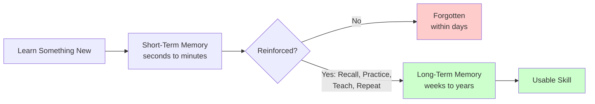
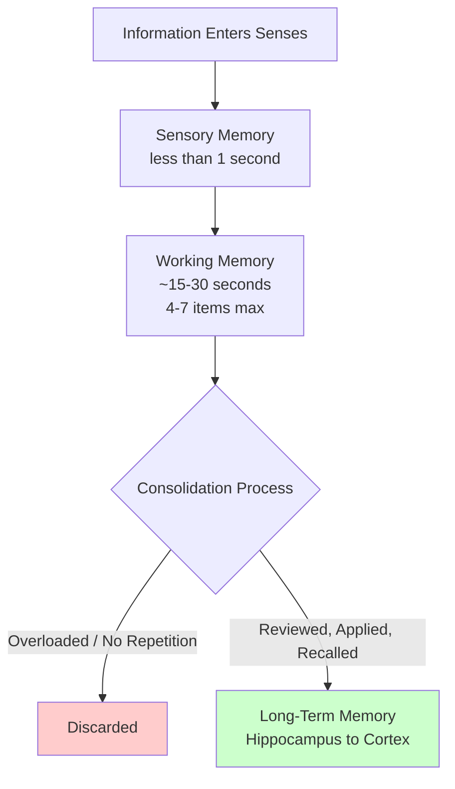
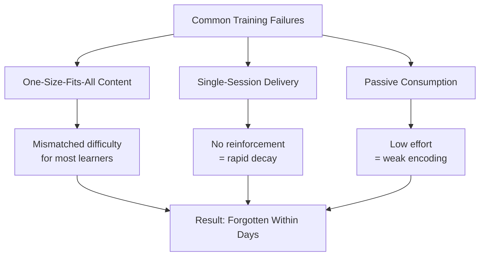
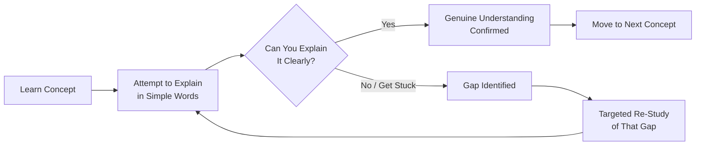
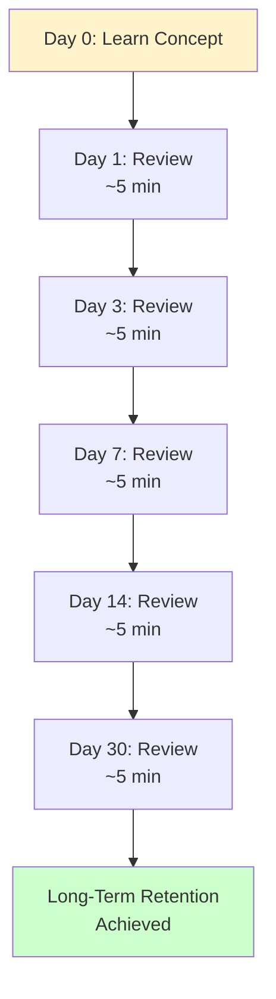
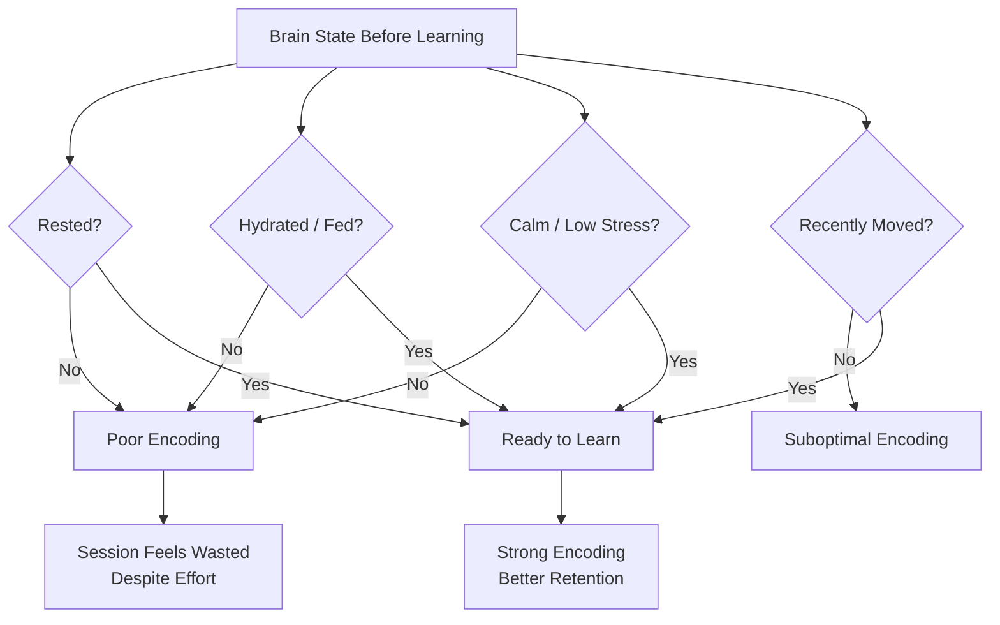
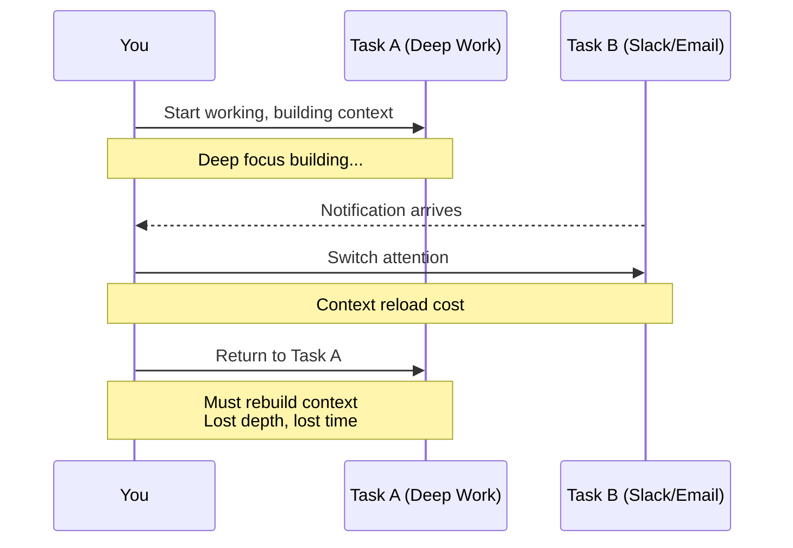
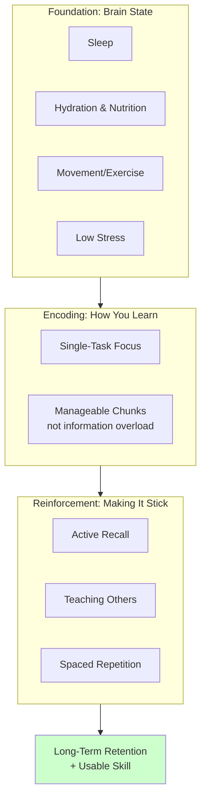
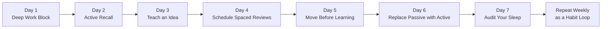
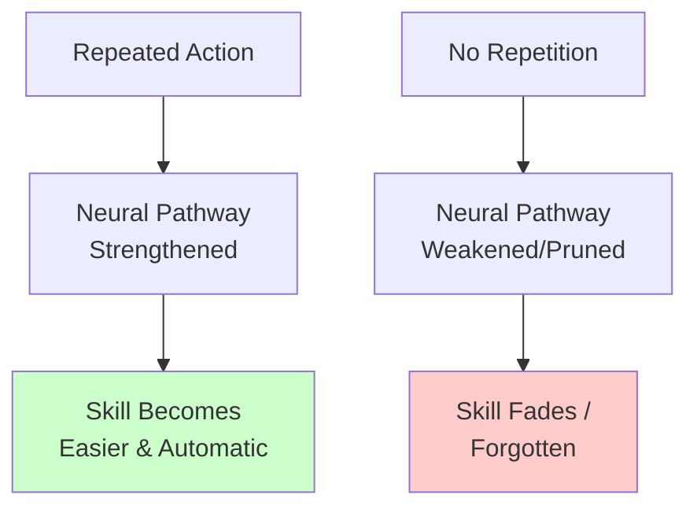

# The Complete Guide to Memory Science: Why You Forget 90% of What You Learn (And How to Fix It)

## Introduction: The Learning Paradox

You just finished an incredible course. You took notes, nodded along, maybe even felt a small rush of "I've got this." A week later, someone asks you to explain what you learned — and you draw a blank.

This isn't a personal failure. It's neuroscience. Research on the **forgetting curve** — first documented by psychologist Hermann Ebbinghaus in the 1880s — shows that without reinforcement, people lose the majority of newly learned material within days. The good news: this decay isn't random or unfixable. It follows predictable patterns, and once you understand those patterns, you can interrupt them.

This tutorial expands on the core ideas of memory science into a complete, practical system — covering *why* forgetting happens, *what* actually works to stop it, and *how* to build a repeatable weekly practice.

---

## Part 1: Why Your Brain Forgets So Fast

### 1.1 The Brain Is a Filter, Not a Hard Drive

We tend to imagine memory like file storage — you "save" information and it sits there until you need it. But your brain doesn't work this way. It's closer to a **filtering system** that constantly decides what's worth keeping.

Your brain keeps information that is:
- **Repeated** — encountered more than once
- **Emotional** — tied to a strong feeling
- **Connected to action** — used in a real task
- **Relevant to a goal** — linked to something you care about

Everything else gets tagged for deletion. This is efficient for the brain (it can't store everything) but frustrating for learners who assume one exposure should be enough.

**Example 1:** You watch a 40-minute tutorial on Excel formulas. You understood every step while watching. Three days later, you open Excel and can't remember the syntax for VLOOKUP. This isn't a comprehension problem — it's a filtering problem. Nothing told your brain "this needs to stay."

**Example 2:** Compare this to learning a coworker's name at a chaotic networking event versus learning the name of someone who later becomes your closest work friend. The first fades in hours. The second sticks because it's reinforced by repeated, meaningful contact.

### 1.2 The Capacity Problem: Sensory and Working Memory

Two systems process information before it can become long-term memory:

| Memory Type | Duration | Capacity | Analogy |
|---|---|---|---|
| Sensory memory | Under 1 second | Very high but fleeting | A camera flash — bright, then gone |
| Working memory | ~15–30 seconds | Roughly 4–7 items | A small desk — only so much fits before things fall off |
| Long-term memory | Years (if consolidated) | Effectively unlimited | A filing cabinet — but only for things you actually filed |

When a training session throws 40 slides, 12 concepts, and 6 examples at you in one hour, your working memory overflows long before any of it reaches long-term storage.

### 1.3 Three Reasons Training Programs Fail

**1. One-size-fits-all delivery**
Everyone in a room has different prior knowledge, different gaps, and different pace of understanding — but most training gives everyone the identical lecture, slides, and timeline.

*Use case:* A company onboarding program teaches "advanced" reporting tools to a room where half the new hires have never touched a spreadsheet and half are power users. Neither group learns optimally — one is lost, the other is bored.

**2. Single-session learning**
One workshop creates *awareness*, not *skill*. Real memory requires the same idea to be revisited across multiple sessions over time.

**3. Passive consumption**
Watching videos, re-reading notes, and highlighting text feel productive but require almost no effort from the brain — and effortless learning rarely sticks.

---

## Part 2: The Methods That Actually Make Knowledge Stick

### 2.1 Active Recall

**What it is:** Instead of re-reading or re-watching material, you close the source and force your brain to retrieve the information from memory.

**Why it works:** Retrieval itself is a memory-strengthening event. Every time you pull an idea out of memory, you reinforce the neural pathway that stores it — like wearing a groove into a path by walking it repeatedly.

**Step-by-step process:**
1. Consume the material once (read the article, attend the meeting, watch the video).
2. Close it completely — no notes, no tab open.
3. On a blank page, write everything you remember in your own words.
4. Compare your recall against the original source.
5. Pay special attention to what you *missed* — those are the weakest connections.

**Example 1 — Reading:** After finishing a chapter of a book, close it and write a five-sentence summary from memory before checking anything.

**Example 2 — Meetings:** After a client call, don't reopen your notes immediately. Write a one-paragraph recap of decisions and action items first, then verify against your notes.

**Example 3 — Studying for certification exams:** Instead of re-reading the textbook a fourth time, use flashcards (physical or apps like Anki) that force you to answer before revealing the answer.

### 2.2 The Teaching Effect (The Protégé Effect)

**What it is:** Explaining a concept to someone else — or even to an empty room — exposes gaps in your understanding that silent review hides.

**Why it works:** Teaching requires you to reorganize information into a clear, logical structure. If you can't do that, you don't fully understand the material yet — you just recognize it.

**Step-by-step process:**
1. Pick one concept you learned this week.
2. Explain it out loud, in plain language, as if to someone with no background.
3. Notice where you hesitate, oversimplify, or get stuck.
4. Go back and specifically re-learn those weak points.

**Use case:** A software developer learning a new framework writes a short internal blog post explaining it to teammates. The act of writing clearly reveals three places where their own understanding was fuzzy — prompting targeted re-study before the "gaps" become bugs in production code.

### 2.3 Spaced Repetition

**What it is:** Reviewing information at increasing intervals over time, instead of cramming it once.

**Why it works:** Each review signals to your brain "this matters, keep it," which slows the rate of forgetting. Over repeated cycles, the information requires less and less effort to recall — meaning it has genuinely moved into long-term memory.

**A practical spacing schedule:**

| Review | Timing |
|---|---|
| Initial learning | Day 0 |
| Review 1 | Day 1 |
| Review 2 | Day 3 |
| Review 3 | Day 7 |
| Review 4 | Day 14 |
| Review 5 | Day 30 |

**Example 1 — Language learning:** Apps like Duolingo and Anki are built almost entirely on spaced repetition algorithms — they resurface a word right before you're statistically likely to forget it.

**Example 2 — Professional certification:** A project manager studying for a PMP exam schedules short 10-minute reviews of each knowledge area every few days instead of one long cram session the night before.

**Example 3 — Onboarding a new hire:** Instead of a single 3-hour orientation, a company sends short 5-minute refreshers on key policies at 1 day, 1 week, and 1 month after hiring.

### 2.4 State Matters: Preparing Your Brain Before You Learn

Memory encoding isn't just about technique — it depends heavily on your physical and emotional state at the moment of learning.

**Four factors that directly affect encoding:**

1. **Sleep** — Memory consolidation largely happens during sleep, when the brain reorganizes and files the day's experiences. Cutting sleep directly cuts learning capacity.
2. **Exercise** — Movement increases blood flow and alertness, priming the brain to absorb new information.
3. **Hydration and nutrition** — A dehydrated or poorly fueled brain has measurably reduced focus and working memory capacity.
4. **Stress level** — Under acute stress, the brain prioritizes threat-response over memory formation, so information "in one ear, out the other."

**Use case:** Two employees attend the same compliance training. One arrives after a rushed commute, skipped breakfast, and back-to-back meetings. The other took a 10-minute walk beforehand and drank water. The second employee retains significantly more — not because they're smarter, but because their brain was physiologically ready to encode.

### 2.5 The Hidden Cost of Multitasking

Multitasking is, neurologically, **task-switching** — the brain handles one thing at a time and pays a "reload cost" every time it switches.

**What happens during a task switch:**
1. You stop Task A mid-thought.
2. Your brain must reload context: *What was I doing? Where did I stop?*
3. You spend several seconds (or longer) re-establishing depth.
4. Even after returning to Task A, you rarely regain full depth immediately.

**Example 1:** A writer drafting a report checks Slack every 5 minutes. Each check costs roughly 1–2 minutes of "reload time" to regain the same depth of thought — meaning a 60-minute writing block might only produce 20 minutes of actual deep-focus output.

**Example 2:** A student studying with their phone visible (even face-down, even on silent) performs measurably worse on recall tests than one who studies with the phone in another room — because part of their attention is unconsciously monitoring for notifications.

**Use case — Single-tasking as a competitive advantage:** In workplaces that reward "always available" behavior, the people who protect blocks of single-tasked, deep-focus time often produce disproportionately higher-quality work — because depth of thinking, not just hours logged, drives real results.

---

## Part 3: The Complete Learning System (Visual Overview)

---

## Part 4: The 7-Day Brain Training Plan

A complete system is only useful if it's simple enough to actually follow. Here's a day-by-day plan that puts every concept above into practice.

| Day | Action | Time Required | Core Principle |
|---|---|---|---|
| 1 | Protect one 45-min deep work block, phone away, one task only | 45 min | Single-tasking |
| 2 | After a meeting, write a summary from memory before checking notes | 5–10 min | Active recall |
| 3 | Explain one concept out loud to a colleague or yourself | 10 min | Teaching effect |
| 4 | Schedule 3 short review sessions over the next 10 days for one concept | 5 min to set up | Spaced repetition |
| 5 | Take a 15-minute walk before a learning session | 15 min | Brain state prep |
| 6 | Swap 1 hour of passive scrolling for active practice or building | 60 min | Active > passive |
| 7 | Honestly assess your sleep; go to bed 30 min earlier | Ongoing | Consolidation |

**Real-world application:** A marketing manager applies this plan while learning a new analytics platform. By Day 7, instead of vaguely remembering a webinar, they can independently build a report, explain the platform's core metrics to a teammate, and recall key formulas without notes — because each day reinforced the material through a different mechanism (focus, recall, teaching, spacing, physical readiness).

---

## Part 5: Neuroplasticity — Why This All Works

The reason any of these techniques matter is a concept called **neuroplasticity**: the brain's ability to physically reorganize itself — forming new neural connections and strengthening existing ones — based on repeated experience.

This means memory and skill aren't fixed traits. They're the *result* of what you repeatedly do. Every recall attempt, every explanation you give, every spaced review, every good night's sleep is a small signal that shapes which neural pathways get stronger and which fade.

---

## Summary: Key Takeaways

1. **Forgetting is normal and predictable** — it's not a personal failure, it's how the brain filters information.
2. **Passive learning (reading, watching, highlighting) is weak** — the brain needs *effort* to encode memory strongly.
3. **Active recall** — testing yourself without notes — is one of the most powerful tools available.
4. **Teaching** exposes gaps that silent review hides.
5. **Spaced repetition** turns "I saw this once" into "I actually know this."
6. **Brain state matters** — sleep, hydration, movement, and low stress directly affect how well you encode new information.
7. **Multitasking has a hidden cost** — single-tasking with full attention outperforms task-switching.
8. **Neuroplasticity means change is always possible** — your brain adapts to what you repeatedly do, starting today.

**Final action step:** Don't try to implement all seven techniques at once. Pick one — active recall is the easiest starting point — and apply it for the next three days. Small, consistent signals compound into real, lasting change.