# The Complete VS Code Setup: A JetBrains-Inspired Development Environment

**A comprehensive tutorial for .NET, Python, AI, and frontend developers transitioning from JetBrains IDEs**

---

## Table of Contents

1. [Introduction](#introduction)
2. [Core Settings Configuration](#core-settings-configuration)
3. [Underrated Built-in Features](#underrated-built-in-features)
4. [Essential Extensions](#essential-extensions)
5. [Complete Setup Checklist](#complete-setup-checklist)
6. [Pro Tips & Best Practices](#pro-tips--best-practices)

---

## Introduction

### Why Switch from JetBrains to VS Code?

If you're a developer who has spent years with JetBrains IDEs (IntelliJ IDEA, PyCharm, Rider, WebStorm), the thought of switching to VS Code might seem daunting. JetBrains offers powerful, all-in-one solutions with deep language integration, intelligent refactoring, and seamless developer experiences.

However, VS Code has evolved significantly and offers compelling advantages:

- **Lightweight & Fast**: Quick startup times and minimal resource footprint
- **Free & Open Source**: No licensing costs, extensive community support
- **Cross-Platform**: Consistent experience across Windows, macOS, and Linux
- **Extensible**: Massive ecosystem of extensions for virtually every use case
- **Unified Workspace**: One IDE for all your development needs (.NET, Python, JavaScript, AI/ML)

### The Challenge

VS Code doesn't have everything JetBrains offers out of the box. Going "cold turkey" can be rough. The goal of this guide is to bridge that gap through a carefully curated mix of settings and extensions.

### What You'll Learn

By the end of this tutorial, you'll have:

- A VS Code setup that feels familiar to JetBrains users
- Cross-device synchronization of your configuration
- Optimized profiles for different tech stacks
- Essential extensions that replicate JetBrains functionality
- A complete productivity-focused development environment

---

## Core Settings Configuration

Let's start with the foundational settings that will make VS Code feel like home.

### Cross-Device Settings Sync

JetBrains IDEs offer cross-IDE and cross-device settings sync. VS Code has an equivalent capability that's just as powerful.

#### What Gets Synced?

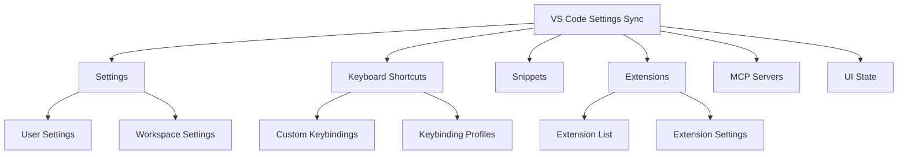

#### How to Enable Settings Sync

**Step-by-Step Setup:**

1. **Open Settings Sync**
   - Click the settings icon (gear icon) in the bottom-left corner
   - Select "Turn on Settings Sync"

2. **Choose Your Account**
   - Sign in with GitHub or Microsoft account
   - Both options work seamlessly

3. **Configure Sync Options**
   - Select what you want to sync:
     - ✓ Settings
     - ✓ Keyboard Shortcuts
     - ✓ Extensions
     - ✓ Snippets
     - ✓ User Tasks
     - ✓ MCP Servers

4. **Complete Setup**
   - Click "Sign in & Turn on"
   - Your configuration will upload to the cloud

#### Real-World Use Case: Multi-Device Development

**Scenario:** You work on a desktop at the office and a laptop at home.

**Before Settings Sync:**
- Manually configure VS Code on each device
- Forget which extensions you installed
- Inconsistent keyboard shortcuts
- Waste time setting up new environments

**After Settings Sync:**
- Install VS Code on new device
- Sign in with your account
- Everything is automatically configured
- Seamless transition between devices

**Pro Tip:** If you use multiple computers regularly, enable "Settings Sync: Auto Upload" to ensure your latest changes are always backed up.

---

### Auto Save Configuration

By default, VS Code has auto-save turned off. JetBrains users expect this to work automatically. Let's fix that.

#### Auto Save Options

VS Code offers three auto-save modes:

| Mode | Behavior | Best For |
|------|----------|----------|
| **afterDelay** | Saves after a specified delay (default: 1000ms) | Most users - balances performance and safety |
| **afterFocusChange** | Saves when you switch away from the editor | Aggressive auto-save, minimal data loss |
| **onWindowChange** | Saves only when you close the window or switch apps | Conservative approach |

#### Configuration Steps

**Method 1: Via Settings UI**

1. Click the gear icon → Settings
2. Search for "Auto Save"
3. Select "afterDelay" from the dropdown
4. (Optional) Adjust "Auto Save Delay" to your preference (default: 1000ms)

**Method 2: Via settings.json**

```json
{
  "files.autoSave": "afterDelay",
  "files.autoSaveDelay": 1000
}
```

#### Real-World Example: Preventing Data Loss

**Scenario:** You're debugging a complex issue and VS Code crashes.

**Without Auto Save:**
- Lose all unsaved changes
- Hours of work potentially lost
- Frustration and wasted time

**With Auto Save (afterDelay):**
- Changes saved every 1 second
- Minimal data loss (at most 1 second of work)
- Peace of mind during development

**Best Practice:** Set the delay to 500-1000ms for a good balance. If you're working on critical code, consider "afterFocusChange" for maximum safety.

---

### VS Code Profiles

VS Code Profiles are one of the most underrated features. They allow you to save separate configurations for different development environments.

#### What Are Profiles?

A Profile is a complete snapshot of your VS Code configuration including:

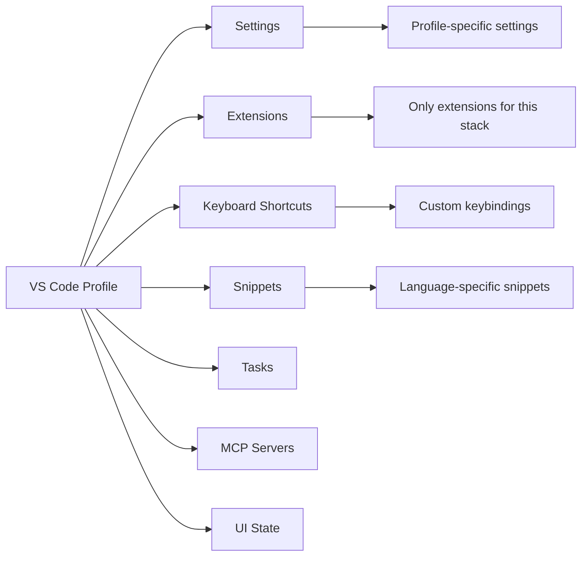

#### Why Use Profiles?

**Problem:** You work with multiple tech stacks (.NET, Python, Node.js, Frontend), each requiring different tools and extensions.

**Without Profiles:**
- Install all extensions for all stacks (bloated, slow startup)
- Conflicting keyboard shortcuts
- Unnecessary extensions cluttering your workspace
- Context switching overhead

**With Profiles:**
- Clean, focused environment for each stack
- Fast startup (only load relevant extensions)
- No conflicts between different workflows
- One-click switching between contexts

#### Creating Profiles for Different Tech Stacks

Let's create practical profiles for common development scenarios:

##### 1. .NET Development Profile

**Name:** `.NET Development`

**Settings:**
```json
{
  "omnisharp.enableEditorConfigSupport": true,
  "omnisharp.enableRoslynAnalyzers": true,
  "omnisharp.useModernNet": true,
  "dotnet.defaultSolution": "*.sln",
  "csharp.suppressHiddenDiagnostics": false
}
```

**Essential Extensions:**
- C# (Microsoft)
- C# Dev Kit
- .NET Test Explorer
- NuGet Package Manager
- GitLens

**Use Case:** Building ASP.NET Core APIs, Blazor applications, or desktop apps with WPF/WinForms.

##### 2. Python Development Profile

**Name:** `Python & AI/ML`

**Settings:**
```json
{
  "python.defaultInterpreterPath": "python",
  "python.linting.enabled": true,
  "python.linting.pylintEnabled": true,
  "python.formatting.provider": "black",
  "jupyter.enableNativeInteractiveWindow": true
}
```

**Essential Extensions:**
- Python (Microsoft)
- Pylance
- Jupyter
- Jupyter Cell Tags
- Python Environment Manager
- Black Formatter

**Use Case:** Data science, machine learning, scripting, and backend development with FastAPI/Django.

##### 3. Node.js & Frontend Profile

**Name:** `JavaScript/TypeScript`

**Settings:**
```json
{
  "typescript.tsdk": "node_modules/typescript/lib",
  "eslint.enable": true,
  "prettier.enable": true,
  "emmet.includeLanguages": {
    "javascript": "javascriptreact"
  }
}
```

**Essential Extensions:**
- ESLint
- Prettier
- npm Intellisense
- Path Intellisense
- Tailwind CSS IntelliSense
- React/Next.js snippets

**Use Case:** Building React, Vue, Angular, or Next.js applications.

##### 4. AI & LLM Development Profile

**Name:** `AI/LLM Development`

**Settings:**
```json
{
  "python.defaultInterpreterPath": "python",
  "jupyter.enableNativeInteractiveWindow": true,
  "markdown.preview.breaks": true
}
```

**Essential Extensions:**
- Python (for data processing)
- Jupyter (for experimentation)
- Markdown All in One
- Mermaid Markdown Syntax Highlighting
- Claude/Copilot extensions

**Use Case:** Working with LLMs, prompt engineering, building AI applications, data analysis.

#### Managing Profiles

**Creating a New Profile:**

1. Click the gear icon → Profiles → Create Profile
2. Choose "Create Profile" or "Copy from Current Profile"
3. Name your profile (e.g., ".NET Development")
4. Install extensions specific to this profile
5. Configure profile-specific settings

**Switching Between Profiles:**

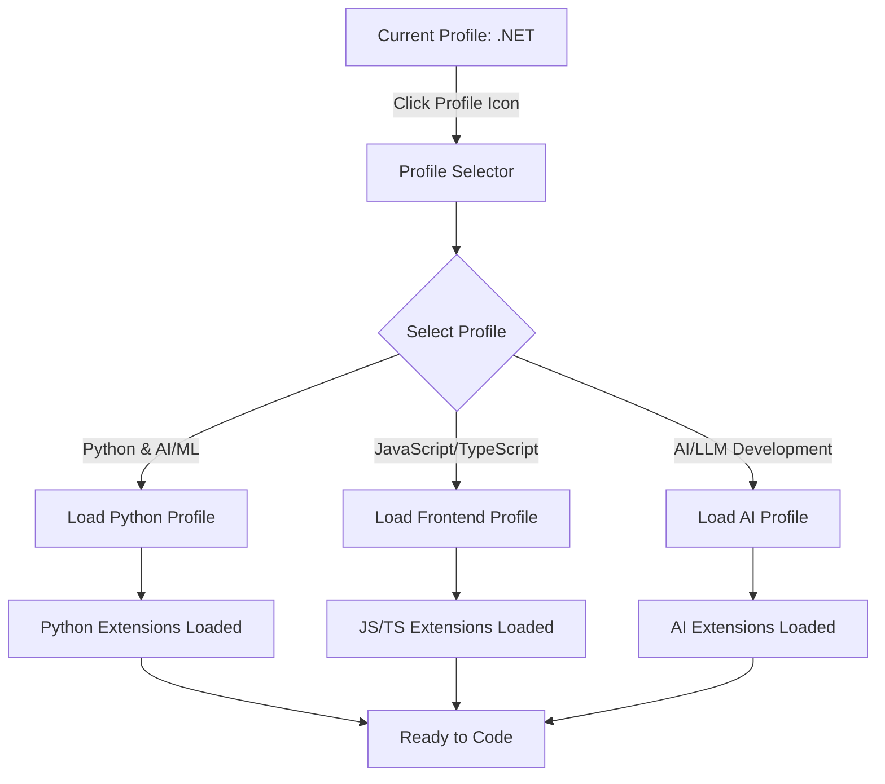

**Methods to Switch:**
- Click the profile icon in the activity bar
- Use Command Palette: "Profiles: Switch Profile"
- Keyboard shortcut (if configured)

**Exporting/Importing Profiles:**

```bash
# Export profile (via Command Palette)
# Profiles: Export Profile

# Import profile
# Profiles: Import Profile
```

#### Real-World Workflow Example

**Scenario:** You're a full-stack developer working on multiple projects.

**Monday Morning:**
1. Open VS Code → Automatically loads `.NET Development` profile
2. Work on ASP.NET Core API backend
3. Use C# Dev Kit, Test Explorer, NuGet Package Manager

**Afternoon:**
1. Need to fix a bug in the React frontend
2. Switch to `JavaScript/TypeScript` profile
3. ESLint, Prettier, and React extensions now active
4. Work on frontend with appropriate tooling

**Evening:**
1. Experiment with a machine learning model
2. Switch to `Python & AI/ML` profile
3. Jupyter notebooks, Python linter, and data science tools ready
4. No conflicting extensions from other profiles

**Result:** Clean, focused environments for each task with zero configuration overhead.

---

## Underrated Built-in Features

VS Code includes several powerful features that many users don't know about. Let's explore them.

### Port Forwarding

VS Code has a built-in port forwarding feature that eliminates the need for third-party tools like ngrok.

#### What Is Port Forwarding?

Port forwarding exposes your local development server to the internet, allowing external access. This is essential for:

- Testing webhooks (Stripe, GitHub, Twilio)
- Sharing local development with teammates
- Testing mobile apps against local backend
- Demonstrating work to clients

#### How It Works

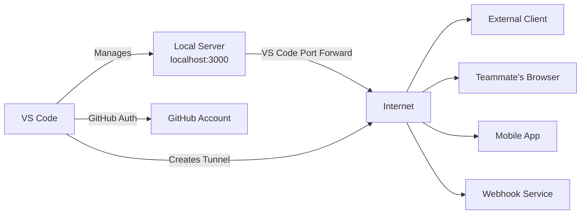

#### Step-by-Step Setup

**Prerequisites:**
- A service running on a local port (e.g., `http://localhost:3000`)
- GitHub account (for authentication)

**Steps:**

1. **Start Your Local Service**
   ```bash
   # Example: Start a Node.js server
   npm run dev
   # Server running on http://localhost:3000
   ```

2. **Open Ports View**
   - Go to Panel region (bottom section)
   - Click the "Ports" tab
   - If not visible: View → Appearance → Show Panel

3. **Forward a Port**
   - Click "Forward a Port" button
   - Enter port number: `3000`
   - Press Enter

4. **Authenticate**
   - Sign in with GitHub when prompted
   - Grant necessary permissions

5. **Access Your Local Server**
   - VS Code generates a public URL
   - Example: `https://3000-your-project.preview.app.github.dev`
   - Share this URL with anyone

#### Real-World Use Cases

**Use Case 1: Testing Stripe Webhooks**

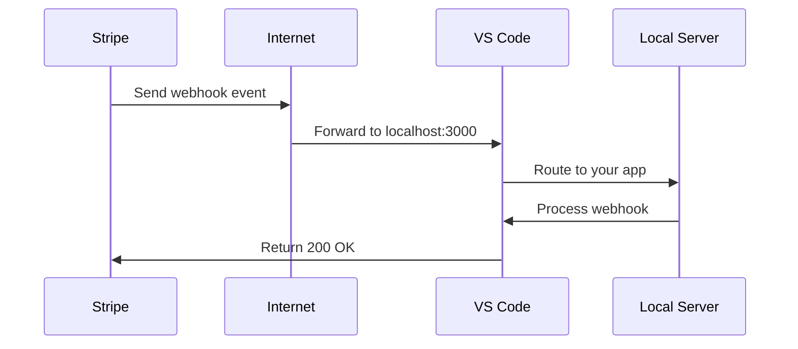

**Steps:**
1. Start your local server on port 3000
2. Forward port 3000 in VS Code
3. Copy the public URL
4. Configure Stripe webhook endpoint: `https://3000-your-project.preview.app.github.dev/webhooks/stripe`
5. Test webhooks locally without deploying

**Use Case 2: Mobile App Development**

**Scenario:** You're building a React Native app and need to test against your local API.

**Without Port Forwarding:**
- Deploy API to staging environment
- Configure mobile app to use staging URL
- Deal with CORS issues
- Slow iteration cycle

**With Port Forwarding:**
1. Run local API server on port 5000
2. Forward port 5000 in VS Code
3. Configure mobile app to use: `https://5000-your-project.preview.app.github.dev/api`
4. Test changes instantly without deployment
5. Fast iteration and debugging

**Use Case 3: Team Collaboration**

**Scenario:** You need to show a feature to a remote teammate.

**Steps:**
1. Start your local development server
2. Forward the port
3. Share the public URL in Slack/Teams
4. Teammate can view and interact with your local environment
5. No need to deploy to staging or production

#### Port Forwarding vs. ngrok

| Feature | VS Code Port Forwarding | ngrok |
|---------|------------------------|-------|
| **Cost** | Free (with GitHub account) | Free tier limited, paid plans available |
| **Setup** | Built into VS Code | Requires separate installation |
| **Authentication** | GitHub account | ngrok account |
| **Custom Domains** | Not available (free tier) | Available (paid) |
| **Multiple Ports** | Yes | Yes (paid) |
| **Inspection Tools** | Basic | Advanced (inspect traffic) |
| **Integration** | Seamless with VS Code | Standalone tool |

**When to Use VS Code Port Forwarding:**
- Quick testing and debugging
- Team collaboration
- Webhook development
- Mobile app testing

**When to Use ngrok:**
- Need custom domains
- Require traffic inspection
- Production-like tunneling
- Advanced routing rules

---

### Timeline View

VS Code includes a built-in Local History feature that tracks file changes over time, similar to Git but automatic and always available.

#### What Is Timeline View?

The Timeline View shows a chronological history of file changes, including:

- File saves
- Undo/redo operations
- Git commits (if repository exists)
- Manual snapshots

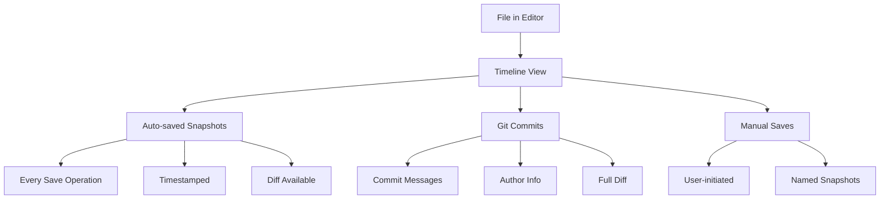

#### How to Use Timeline View

**Accessing Timeline:**

1. Open the Explorer tab (left sidebar)
2. Select any file in your project
3. Expand the "Timeline" section
4. View chronological list of changes

**Viewing a Snapshot:**

1. Click any entry in the Timeline
2. Opens a side-by-side diff view
3. Compare past version with current code
4. Restore previous version if needed

#### Real-World Scenarios

**Scenario 1: Accidental Code Deletion**

**Problem:** You accidentally deleted a critical function and can't undo (you've made other changes since).

**Solution:**
1. Open the file in question
2. Check Timeline View
3. Find the snapshot before deletion
4. Click to view diff
5. Copy the deleted code back

**Scenario 2: Understanding Code Evolution**

**Problem:** You're reviewing a teammate's code and want to understand recent changes.

**Solution:**
1. Open the modified file
2. Check Timeline View
3. Review recent snapshots
4. See what changed and why
5. Understand the thought process

**Scenario 3: Recovering from Bad Refactoring**

**Problem:** You attempted a complex refactoring that broke things.

**Solution:**
1. Open Timeline View
2. Find snapshot before refactoring
3. Compare with current version
4. Identify what went wrong
5. Restore or manually fix

#### Timeline vs. Git

| Feature | Timeline View | Git |
|---------|--------------|-----|
| **Automatic** | Yes (every save) | No (requires commits) |
| **Granularity** | Every save operation | Only committed changes |
| **Offline** | Yes | Yes (local repo) |
| **Collaboration** | No (local only) | Yes (shared history) |
| **Permanent** | No (limited history) | Yes (permanent) |
| **Diff View** | Yes | Yes |

**Best Practice:** Use Timeline View for quick recovery and understanding recent changes. Use Git for permanent history and collaboration.

---

### Built-in Web Browser

VS Code includes a built-in web browser, eliminating the need to switch between your IDE and browser for quick checks.

#### Accessing the Browser

**Method 1: Menu Bar**
1. Click "View" in the menu bar
2. Select "Browser"
3. Browser opens in a new editor tab

**Method 2: Command Palette**
1. Press `Ctrl+Shift+P` (Windows/Linux) or `Cmd+Shift+P` (Mac)
2. Type "View: Show Browser"
3. Press Enter

#### Use Cases

**Use Case 1: Testing Web Applications**

**Scenario:** You're building a web app and need to test it frequently.

**Workflow:**
1. Start your dev server (e.g., `npm run dev` on port 3000)
2. Open VS Code Browser
3. Navigate to `http://localhost:3000`
4. Test your application
5. Make code changes
6. Refresh browser (F5)
7. See changes instantly

**Benefit:** No context switching between VS Code and Chrome/Edge/Firefox.

**Use Case 2: Quick Documentation Lookup**

**Scenario:** You need to check documentation while coding.

**Workflow:**
1. Open VS Code Browser
2. Navigate to documentation (e.g., MDN, Stack Overflow)
3. Read and learn
4. Close browser tab when done
5. Continue coding

**Benefit:** Stay within VS Code, maintain focus.

**Use Case 3: Testing API Endpoints**

**Scenario:** You built a REST API and want to quickly test it.

**Workflow:**
1. Open VS Code Browser
2. Navigate to `http://localhost:5000/api/users`
3. View JSON response
4. Test different endpoints
5. Debug issues without leaving IDE

**Use Case 4: Previewing Markdown Files**

**Scenario:** You're writing documentation in Markdown.

**Workflow:**
1. Open Markdown file
2. Open built-in browser
3. Use browser to preview rendered Markdown
4. Compare with source

#### Limitations

- **No DevTools:** Can't inspect elements or debug JavaScript
- **Limited Extensions:** No browser extensions (ad blockers, etc.)
- **Basic Features:** Missing advanced browser features
- **Not for Production Testing:** Use real browser for final testing

**Best Practice:** Use the built-in browser for quick checks and development. Use a full-featured browser for final testing and debugging.

---

## Essential Extensions

Now let's explore the extensions that will make VS Code feel like a JetBrains IDE.

### Project Management Extensions

#### Project Manager

**What It Does:** Save and organize your favorite projects in one place for quick access.

**Why You Need It:**
- JetBrains IDEs have a "Recent Projects" list
- VS Code doesn't have this by default
- Quickly switch between projects without navigating file system

**Installation & Setup:**

1. **Install Extension**
   - Search "Project Manager" in Extensions marketplace
   - Install by Alessandro Fragnani

2. **Save Your First Project**
   - Click the folder icon in the left sidebar (Project Manager)
   - Click "Save Project"
   - Select your project folder
   - Add a name and optional tags

3. **Switch Between Projects**
   - Click project name in Project Manager sidebar
   - VS Code opens the project in a new window
   - All settings and extensions load automatically

**Real-World Example: Managing Multiple Client Projects**

**Scenario:** You work on 5 different client projects simultaneously.

**Without Project Manager:**
- Navigate through file system to find projects
- Remember where each project is located
- Waste time opening/closing projects
- No organization system

**With Project Manager:**
1. Save all 5 projects with tags:
   - `client-a` (tag: "active")
   - `client-b` (tag: "maintenance")
   - `client-c` (tag: "new")
   - `personal-project` (tag: "side-project")
   - `open-source` (tag: "contribution")

2. Filter by tags to find specific projects
3. One-click switching between projects
4. Organized, efficient workflow

**Advanced Features:**

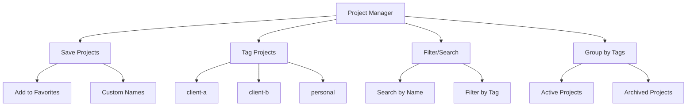

**Pro Tip:** Use tags to organize projects by status (active, maintenance, archived) or client name.

---

#### Scratchpads

**What It Does:** Create temporary files for notes and experimentation without cluttering your project folder.

**Why You Need It:**
- JetBrains has "Scratches and Consoles"
- VS Code doesn't have this by default
- Test quick scripts without creating permanent files
- Keep scratch files out of Git

**Installation & Setup:**

1. **Install Extension**
   - Search "Scratchpads" in Extensions marketplace

2. **Access Scratchpads**
   - Go to Explorer view
   - Find "Scratchpads" section
   - Click "New Scratchpad"

3. **Create Scratch Files**
   - Choose file type (JavaScript, Python, Markdown, etc.)
   - Write your code/notes
   - Files are automatically excluded from Git

**Real-World Example: Quick Experimentation**

**Scenario:** You want to test a JavaScript array method but don't want to create a test file.

**Without Scratchpads:**
1. Create `test.js` in your project
2. Write test code
3. Remember to delete it later
4. Risk committing test files to Git

**With Scratchpads:**
1. Open Scratchpads section
2. Create `scratch:test.js`
3. Write and test your code:
   ```javascript
   const arr = [1, 2, 3, 4, 5];
   const filtered = arr.filter(x => x > 2);
   console.log(filtered); // [3, 4, 5]
   ```
4. Run code in integrated terminal
5. Scratch file auto-excluded from Git
6. No cleanup needed

**Use Cases:**

| Use Case | Example | Benefit |
|----------|---------|---------|
| **Testing snippets** | Try a new regex pattern | No permanent files |
| **Taking notes** | Jot down API endpoints | Organized in one place |
| **Debugging** | Test a complex algorithm | Isolated environment |
| **Learning** | Practice a new language feature | No project clutter |

**Pro Tip:** Create scratch files for different languages:
- `scratch:python.py` for Python experiments
- `scratch:sql.sql` for database queries
- `scratch:md` for meeting notes

---

#### Bookmarks

**What It Does:** Flag important lines in your code for quick navigation, just like JetBrains Bookmarks.

**Why You Need It:**
- Large files are hard to navigate
- Remembering line numbers is unreliable
- Quick access to critical code sections

**Installation & Setup:**

1. **Install Extension**
   - Search "Bookmarks" in Extensions marketplace
   - Install by Alessandro Fragnani

2. **Toggle a Bookmark**
   - **Method 1:** Right-click → Bookmarks → Toggle
   - **Method 2:** Keyboard shortcut (default: `Ctrl+Alt+K`)
   - **Method 3:** Command Palette → "Bookmarks: Toggle"

3. **Navigate Bookmarks**
   - Click bookmark icon in gutter (ribbon icon)
   - Use Command Palette: "Bookmarks: List"
   - Jump to next/previous bookmark

**Real-World Example: Navigating Large Files**

**Scenario:** You're working on a 2000-line configuration file.

**Without Bookmarks:**
- Scroll up and down constantly
- Use search to find sections
- Lose context easily
- Time-consuming navigation

**With Bookmarks:**
1. Place bookmarks at key sections:
   - Line 45: Database configuration
   - Line 120: API endpoints
   - Line 350: Authentication settings
   - Line 890: Error handling

2. View all bookmarks in sidebar
3. One-click navigation to any section
4. Add annotations to bookmarks:
   ```
   Line 45: Database config - Change connection string here
   Line 120: API endpoints - Add new routes here
   ```

**Bookmark Features:**

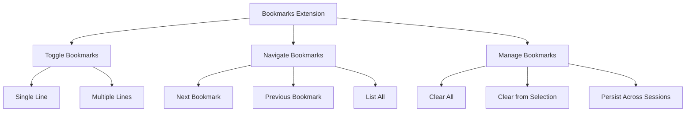

**Pro Tip:** Use bookmarks during code reviews to mark:
- Sections that need clarification
- Potential bugs
- Areas for refactoring
- Important business logic

---

### Development Tools

#### SQL Tools

**What It Does:** Complete database management interface directly inside VS Code.

**Why You Need It:**
- JetBrains IDEs have built-in database tools
- No need for separate tools like MySQL Workbench, pgAdmin, or DBeaver
- Query databases without leaving your IDE

**Installation & Setup:**

1. **Install Extension**
   - Search "SQLTools" in Extensions marketplace
   - Install by Matheus Teixeira

2. **Install Database Driver**
   - SQLTools requires a driver for your database
   - Popular drivers:
     - SQLTools MySQL/MariaDB
     - SQLTools PostgreSQL/Redshift
     - SQLTools SQL Server
     - SQLTools SQLite

3. **Create a Connection**
   - Click SQLTools icon in sidebar
   - Click "Add New Connection"
   - Select your database type
   - Enter connection details:
     ```json
     {
       "server": "localhost",
       "port": 5432,
       "database": "myapp_db",
       "username": "admin",
       "password": "your_password"
     }
     ```
   - Test connection
   - Save connection

**Real-World Example: Database-Driven Development**

**Scenario:** You're building a feature that requires database changes.

**Traditional Workflow:**
1. Open MySQL Workbench/pgAdmin
2. Connect to database
3. Write and test SQL queries
4. Switch back to VS Code
5. Implement code changes
6. Switch back to database tool
7. Repeat

**With SQLTools:**
1. Open SQLTools in VS Code sidebar
2. Connect to database
3. Write and test SQL queries in integrated editor
4. View query results in table format
5. Switch to code tab
6. Implement changes
7. Test queries again
8. All within VS Code

**Features:**

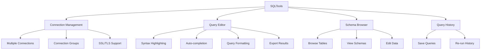

**Advanced Usage:**

**1. Running Queries:**
```sql
-- Write query in SQLTools editor
SELECT 
    u.id,
    u.name,
    COUNT(o.id) as order_count
FROM users u
LEFT JOIN orders o ON u.id = o.user_id
WHERE u.created_at > '2024-01-01'
GROUP BY u.id, u.name
ORDER BY order_count DESC
LIMIT 10;

-- Execute with Ctrl+Enter
-- View results in table format
```

**2. Exporting Results:**
- Run query
- Click "Export" button
- Choose format: CSV, JSON, Excel
- Save to file

**3. Schema Exploration:**
- Browse database structure
- View table relationships
- Check indexes and constraints
- Understand data model

**Pro Tip:** Create connection groups for different environments:
- Development
- Staging
- Production

Never connect to production directly from your IDE!

---

#### Postman

**What It Does:** Full API testing environment inside VS Code.

**Why You Need It:**
- JetBrains IDEs have HTTP clients built-in
- No need to switch between VS Code and Postman desktop app
- Test APIs alongside your code

**Installation & Setup:**

1. **Install Extension**
   - Search "Postman" in Extensions marketplace
   - Install by Postman

2. **Sign In**
   - Click Postman icon in sidebar
   - Sign in with your Postman account
   - Sync your collections and environments

3. **Create Your First Request**
   - Click "New" → "HTTP Request"
   - Enter request details:
     - Method: GET
     - URL: `https://api.example.com/users`
   - Click "Send"
   - View response

**Real-World Example: API Development Workflow**

**Scenario:** You're building a REST API and need to test endpoints.

**Traditional Workflow:**
1. Write API code in VS Code
2. Switch to Postman desktop app
3. Create and test requests
4. Find issues
5. Switch back to VS Code
6. Fix code
7. Repeat

**With Postman Extension:**
1. Write API code in VS Code
2. Open Postman in sidebar
3. Create request: `GET http://localhost:3000/api/users`
4. Send request
5. View response in VS Code
6. Fix code
7. Re-send request
8. All within VS Code

**Features:**

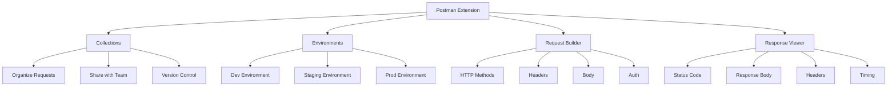

**Advanced Features:**

**1. Collections & Folders:**
```
📁 My API Collection
  📁 Authentication
    - POST Login
    - POST Register
    - POST Refresh Token
  📁 Users
    - GET All Users
    - GET User by ID
    - POST Create User
    - PUT Update User
    - DELETE User
  📁 Orders
    - GET All Orders
    - POST Create Order
```

**2. Environment Variables:**
```json
{
  "baseUrl": "http://localhost:3000",
  "apiKey": "your-api-key",
  "userId": "123"
}
```

Use in requests: `{{baseUrl}}/api/users/{{userId}}`

**3. Test Scripts:**
```javascript
pm.test("Status code is 200", function () {
    pm.response.to.have.status(200);
});

pm.test("Response time is less than 200ms", function () {
    pm.expect(pm.response.responseTime).to.be.below(200);
});

pm.test("Response has user id", function () {
    var jsonData = pm.response.json();
    pm.expect(jsonData.id).to.eql(123);
});
```

**Pro Tip:** Use the Postman extension for quick API testing during development. Use the full Postman app for complex testing scenarios, automated testing, and team collaboration.

---

#### vscode-pdf

**What It Does:** View PDF files directly in VS Code without leaving the IDE.

**Why You Need It:**
- JetBrains IDEs have built-in PDF viewers
- VS Code forces you to open PDFs externally
- Read documentation without context switching

**Installation & Setup:**

1. **Install Extension**
   - Search "vscode-pdf" in Extensions marketplace
   - Install by tomoki1207

2. **View PDF Files**
   - Click any `.pdf` file in Explorer
   - Opens in new editor tab
   - Navigate with scroll, zoom, and page controls

**Real-World Use Cases:**

**Use Case 1: Reading Documentation**

**Scenario:** You need to reference a library's documentation PDF.

**Workflow:**
1. Download PDF documentation
2. Open in VS Code with vscode-pdf
3. Read while coding
4. No need to switch to Adobe Reader or browser
5. Maintain focus

**Use Case 2: Reviewing Contracts/Agreements**

**Scenario:** You need to review a contract while working on a project.

**Workflow:**
1. Open contract PDF in VS Code
2. Reference specific clauses
3. Implement requirements in code
4. Side-by-side view (PDF on one monitor, code on another)

**Use Case 3: Studying Technical Papers**

**Scenario:** You're implementing a algorithm from a research paper.

**Workflow:**
1. Open research paper PDF
2. Study algorithms and diagrams
3. Implement in code
4. Refer back to paper as needed

**Features:**
- Page navigation (next/previous)
- Zoom in/out
- Fit to width/height
- Table of contents (if available)
- Search within PDF

**Pro Tip:** Use split view to see PDF and code side-by-side:
1. Open PDF
2. Right-click → "Split Right"
3. Open code file in new pane
4. Reference documentation while coding

---

### Code Quality Extensions

#### Auto Close Tag

**What It Does:** Automatically close HTML/XML tags, just like JetBrains IDEs.

**Why You Need It:**
- JetBrains auto-closes tags by default
- VS Code requires manual closing tag entry
- Save keystrokes and prevent errors

**Installation & Setup:**

1. **Install Extension**
   - Search "Auto Close Tag" in Extensions marketplace
   - Install by Jun Han

2. **Configuration (Optional)**
   ```json
   {
     "auto-close-tag.SublimeText3Mode": true,
     "auto-close-tag.closeSelfClosingTag": true,
     "auto-close-tag.activationOnLanguage": [
       "html",
       "xml",
       "jsx",
       "tsx",
       "vue",
       "php"
     ]
   }
   ```

**How It Works:**

**Without Auto Close Tag:**
```html
<div|  <!-- You type opening tag -->
<!-- You must manually type: -->
</div>  <!-- Closing tag -->
```

**With Auto Close Tag:**
```html
<div|  <!-- You type opening tag -->
</div>  <!-- Automatically inserted! -->
```

**Real-World Example: Rapid HTML Development**

**Scenario:** You're building a complex HTML structure.

**Without Auto Close Tag:**
```html
<div class="container">
  <div class="row">
    <div class="col">
      <div class="card">
        <div class="card-body">
          <!-- You type each closing tag manually -->
        </div>
      </div>
    </div>
  </div>
</div>
```
- 8 closing tags to type manually
- Easy to forget closing tags
- Typos in closing tags

**With Auto Close Tag:**
```html
<div class="container">
  <div class="row">
    <div class="col">
      <div class="card">
        <div class="card-body">
          <!-- Closing tags auto-inserted! -->
        </div>
      </div>
    </div>
  </div>
</div>
```
- Zero closing tags to type
- No typos
- Faster development

**Supported Languages:**
- HTML
- XML
- JSX/TSX (React)
- Vue
- PHP
- And more

**Pro Tip:** Combine with "Auto Rename Tag" (see below) for a complete JetBrains-like HTML editing experience.

---

#### Auto Rename Tag

**What It Does:** Automatically sync opening and closing HTML/XML tags.

**Why You Need It:**
- JetBrains renames both tags simultaneously
- VS Code requires manual updates
- Prevent mismatched tags

**Installation & Setup:**

1. **Install Extension**
   - Search "Auto Rename Tag" in Extensions marketplace
   - Install by Jun Han

2. **Configuration (Optional)**
   ```json
   {
     "auto-rename-tag.activationOnLanguage": [
       "html",
       "xml",
       "jsx",
       "tsx",
       "vue",
       "php"
     ]
   }
   ```

**How It Works:**

**Without Auto Rename Tag:**
```html
<div class="container">
  Content here
</div>  <!-- You must manually change this too -->
```
Change `<div>` to `<section>`:
```html
<section class="container">
  Content here
</div>  <!-- Oops! Forgot to update closing tag -->
```

**With Auto Rename Tag:**
```html
<div class="container">
  Content here
</div>
```
Change `<div>` to `<section>`:
```html
<section class="container">
  Content here
</section>  <!-- Automatically updated! -->
```

**Real-World Example: Refactoring HTML**

**Scenario:** You're refactoring a component from `<div>` to `<section>` for better semantics.

**Without Auto Rename Tag:**
```html
<!-- Before -->
<div class="header">
  <h1>Title</h1>
</div>

<!-- You change opening tag -->
<section class="header">
  <h1>Title</h1>
</div>  <!-- Forgot to update closing tag! -->
<!-- HTML is now invalid -->
```

**With Auto Rename Tag:**
```html
<!-- Before -->
<div class="header">
  <h1>Title</h1>
</div>

<!-- Change opening tag -->
<section class="header">
  <h1>Title</h1>
</section>  <!-- Automatically updated! -->
<!-- HTML is valid -->
```

**Combined Workflow: Auto Close Tag + Auto Rename Tag**

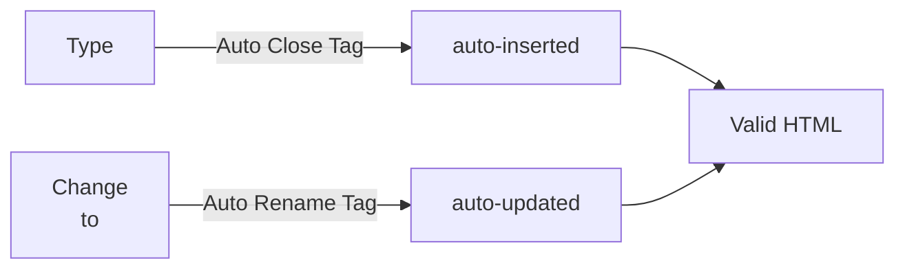

**Pro Tip:** Install both "Auto Close Tag" and "Auto Rename Tag" for the complete JetBrains HTML editing experience.

---

### Workspace Management

#### Peacock

**What It Does:** Color-code your VS Code workspace to distinguish between multiple open windows.

**Why You Need It:**
- JetBrains IDEs have project-specific color schemes
- When working with multiple VS Code windows, it's hard to tell them apart
- Peacock solves this with colored window borders

**Installation & Setup:**

1. **Install Extension**
   - Search "Peacock" in Extensions marketplace
   - Install by John Papa

2. **Apply a Color**
   - Open Command Palette: `Ctrl+Shift+P` (Windows/Linux) or `Cmd+Shift+P` (Mac)
   - Type "Peacock: Enter a Color"
   - Select a color from the list
   - Window border changes to that color

**Real-World Example: Multi-Project Development**

**Scenario:** You have 5 VS Code windows open simultaneously.

**Without Peacock:**
```
[VS Code Window] [VS Code Window] [VS Code Window]
      ↑                ↑                ↑
   Which one is    Which one is     Which one is
   client-a?       client-b?        client-c?
```
- All windows look identical
- Hard to identify projects
- Constant Alt+Tab confusion

**With Peacock:**
```
[Blue Window]    [Green Window]   [Purple Window]
   client-a         client-b          client-c
```
- Each project has a distinct color
- Instant visual identification
- No confusion

**Color Assignment Strategy:**

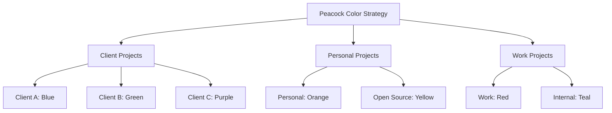

**Advanced Features:**

**1. Save Color per Workspace:**
```json
// .vscode/settings.json
{
  "peacock.remoteColor": "#007acc",
  "peacock.color": "#007acc"
}
```
- Color is saved in workspace settings
- Automatically applied when opening the project
- Team members can have different colors

**2. Adjust Color Intensity:**
- Command Palette: "Peacock: Adjust Color"
- Make colors lighter or darker
- Ensure text remains readable

**3. Favorite Colors:**
- Command Palette: "Peacock: Favorite Colors"
- Quick access to your most-used colors
- Consistent color scheme across projects

**Real-World Workflow:**

**Monday Morning:**
1. Open client-a project → Peacock applies blue
2. Open client-b project → Peacock applies green
3. Open personal project → Peacock applies orange

**Throughout the Day:**
- Switch between windows
- Instantly know which project you're in
- No mental overhead

**Pro Tip:** Create a color legend in your workspace notes:
```
Project Colors:
- Blue: Client A (E-commerce)
- Green: Client B (SaaS Platform)
- Purple: Client C (Mobile App)
- Orange: Personal Projects
- Red: Work Internal Tools
```

---

## Complete Setup Checklist

Use this checklist to implement the entire setup systematically.

### Phase 1: Core Settings (Day 1)

- [ ] **Enable Settings Sync**
  - [ ] Click gear icon → Turn on Settings Sync
  - [ ] Sign in with GitHub/Microsoft account
  - [ ] Select sync options (Settings, Extensions, Shortcuts, Snippets)
  - [ ] Verify sync is working (check another device)

- [ ] **Configure Auto Save**
  - [ ] Open Settings (`Ctrl+,`)
  - [ ] Search "Auto Save"
  - [ ] Select "afterDelay"
  - [ ] Set delay to 1000ms (1 second)
  - [ ] Test by editing a file and waiting

- [ ] **Create VS Code Profiles**
  - [ ] Create `.NET Development` profile
  - [ ] Create `Python & AI/ML` profile
  - [ ] Create `JavaScript/TypeScript` profile
  - [ ] Create `AI/LLM Development` profile
  - [ ] Test switching between profiles

### Phase 2: Essential Extensions (Day 2-3)

- [ ] **Project Management**
  - [ ] Install Project Manager
  - [ ] Save 3-5 frequently used projects
  - [ ] Add tags to projects
  - [ ] Test switching between projects

- [ ] **Install Scratchpads**
  - [ ] Install Scratchpads extension
  - [ ] Create test scratch file
  - [ ] Verify it's excluded from Git

- [ ] **Install Bookmarks**
  - [ ] Install Bookmarks extension
  - [ ] Add bookmarks to a large file
  - [ ] Test navigation between bookmarks

- [ ] **Install vscode-pdf**
  - [ ] Install vscode-pdf extension
  - [ ] Open a PDF file
  - [ ] Test navigation and zoom

- [ ] **Install Peacock**
  - [ ] Install Peacock extension
  - [ ] Apply a color to current workspace
  - [ ] Test with multiple windows

- [ ] **Install SQL Tools**
  - [ ] Install SQLTools extension
  - [ ] Install database driver (e.g., PostgreSQL)
  - [ ] Create test database connection
  - [ ] Run a test query

- [ ] **Install Postman**
  - [ ] Install Postman extension
  - [ ] Sign in with Postman account
  - [ ] Create a test request
  - [ ] Send request and view response

- [ ] **Install Auto Close Tag**
  - [ ] Install Auto Close Tag extension
  - [ ] Test with HTML file
  - [ ] Verify tags auto-close

- [ ] **Install Auto Rename Tag**
  - [ ] Install Auto Rename Tag extension
  - [ ] Test renaming tags
  - [ ] Verify paired tags update

### Phase 3: Profile-Specific Extensions (Day 4-5)

- [ ] **.NET Development Profile**
  - [ ] Switch to .NET profile
  - [ ] Install C# extension
  - [ ] Install C# Dev Kit
  - [ ] Install .NET Test Explorer
  - [ ] Install NuGet Package Manager
  - [ ] Configure settings

- [ ] **Python & AI/ML Profile**
  - [ ] Switch to Python profile
  - [ ] Install Python extension
  - [ ] Install Pylance
  - [ ] Install Jupyter
  - [ ] Install Black Formatter
  - [ ] Configure settings

- [ ] **JavaScript/TypeScript Profile**
  - [ ] Switch to JS/TS profile
  - [ ] Install ESLint
  - [ ] Install Prettier
  - [ ] Install npm Intellisense
  - [ ] Install Tailwind CSS IntelliSense
  - [ ] Configure settings

### Phase 4: Testing & Optimization (Day 6-7)

- [ ] **Test Complete Workflow**
  - [ ] Open a .NET project → .NET profile loads
  - [ ] Open a Python project → Python profile loads
  - [ ] Open a web project → JS/TS profile loads
  - [ ] Verify correct extensions load for each profile

- [ ] **Test Built-in Features**
  - [ ] Test Port Forwarding with local server
  - [ ] Test Timeline View with file edits
  - [ ] Test built-in Browser

- [ ] **Optimize Settings**
  - [ ] Review synced settings
  - [ ] Remove unnecessary extensions
  - [ ] Fine-tune keyboard shortcuts
  - [ ] Adjust auto-save delay if needed

- [ ] **Documentation**
  - [ ] Create personal cheat sheet
  - [ ] Document custom keyboard shortcuts
  - [ ] Note any issues or workarounds

---

## Pro Tips & Best Practices

### 1. Keyboard Shortcuts for Power Users

Master these shortcuts to boost productivity:

| Action | Windows/Linux | Mac | Description |
|--------|--------------|-----|-------------|
| **Toggle Bookmark** | `Ctrl+Alt+K` | `Cmd+Opt+K` | Add/remove bookmark |
| **Next Bookmark** | `Ctrl+Alt+L` | `Cmd+Opt+L` | Jump to next bookmark |
| **Previous Bookmark** | `Ctrl+Alt+J` | `Cmd+Opt+J` | Jump to previous bookmark |
| **Command Palette** | `Ctrl+Shift+P` | `Cmd+Shift+P` | Access all commands |
| **Toggle Terminal** | `` Ctrl+` `` | `` Cmd+` `` | Show/hide terminal |
| **Switch Profile** | `Ctrl+Shift+P` → "Profiles" | `Cmd+Shift+P` → "Profiles" | Change active profile |

### 2. Workspace Organization

**Best Practices:**

1. **Use Workspace Files (.code-workspace)**
   - Group related projects
   - Save specific settings per workspace
   - Example: `myproject.code-workspace`

2. **Leverage Multi-Root Workspaces**
   - Open multiple folders in one window
   - Useful for full-stack projects (frontend + backend)
   - Example: Open `/client` and `/api` together

3. **Consistent Folder Structure**
   ```
   projects/
   ├── client-a/
   │   ├── frontend/
   │   └── backend/
   ├── client-b/
   │   ├── src/
   │   └── tests/
   └── personal/
       └── my-app/
   ```

### 3. Extension Management

**Best Practices:**

1. **Profile-Specific Extensions**
   - Only install extensions relevant to each profile
   - Reduces clutter and improves performance
   - Faster VS Code startup

2. **Regular Cleanup**
   - Review extensions monthly
   - Uninstall unused extensions
   - Keep extension count manageable (20-30 max)

3. **Extension Recommendations**
   - Use workspace recommendations (`.vscode/extensions.json`)
   - Share with team members
   - Example:
     ```json
     {
       "recommendations": [
         "dbaeumer.vscode-eslint",
         "esbenp.prettier-vscode"
       ]
     }
     ```

### 4. Settings Organization

**Best Practices:**

1. **Use Settings Sync**
   - Keep settings consistent across devices
   - Backup configuration automatically
   - Easy migration to new machines

2. **Profile-Specific Settings**
   - Override global settings per profile
   - Example: Python profile uses Black formatter, .NET profile uses different formatter

3. **Workspace Settings**
   - Override user settings per project
   - Useful for team-specific configurations
   - Example: Enforce specific ESLint rules

### 5. Productivity Workflows

**Workflow 1: Feature Development**

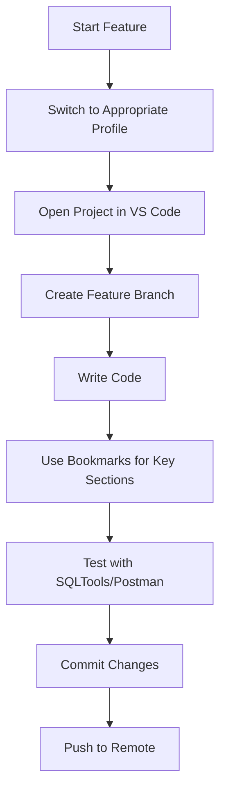

**Workflow 2: Bug Investigation**

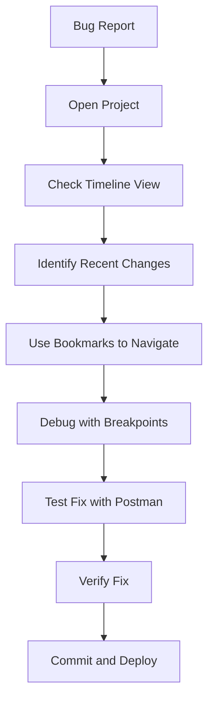

**Workflow 3: Learning New Technology**

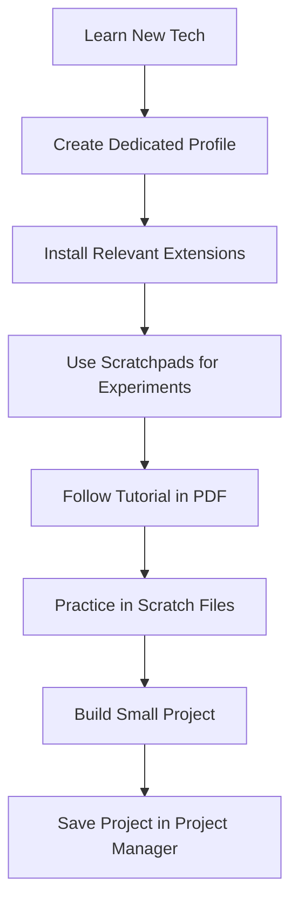

### 6. Common Pitfalls to Avoid

**Pitfall 1: Installing Too Many Extensions**
- **Problem:** Slow VS Code startup, performance issues
- **Solution:** Use profiles, install only necessary extensions

**Pitfall 2: Not Using Profiles**
- **Problem:** Cluttered workspace, conflicting extensions
- **Solution:** Create profiles for each tech stack

**Pitfall 3: Ignoring Settings Sync**
- **Problem:** Inconsistent setup across devices
- **Solution:** Enable Settings Sync immediately

**Pitfall 4: Not Organizing Projects**
- **Problem:** Wasting time finding projects
- **Solution:** Use Project Manager with tags

**Pitfall 5: Forgetting Auto Save**
- **Problem:** Data loss from crashes
- **Solution:** Enable Auto Save with afterDelay

### 7. Advanced Configuration

**Custom Keyboard Shortcuts**

Create custom shortcuts for frequently used actions:

```json
// keybindings.json
[
  {
    "key": "ctrl+alt+b",
    "command": "bookmarks.toggle"
  },
  {
    "key": "ctrl+alt+n",
    "command": "bookmarks.jumpToNext"
  },
  {
    "key": "ctrl+alt+p",
    "command": "bookmarks.jumpToPrevious"
  },
  {
    "key": "ctrl+shift+space",
    "command": "workbench.action.terminal.toggleTerminal"
  }
]
```

**Custom Snippets**

Create snippets for common code patterns:

```json
// snippets.json
{
  "React Component": {
    "prefix": "rfc",
    "body": [
      "import React from 'react';",
      "",
      "const ${1:ComponentName} = () => {",
      "  return (",
      "    <div className='${2:container}'>",
      "      $0",
      "    </div>",
      "  );",
      "};",
      "",
      "export default ${1:ComponentName};"
    ],
    "description": "React Functional Component"
  }
}
```

**Task Automation**

Create custom tasks for common operations:

```json
// tasks.json
{
  "version": "2.0.0",
  "tasks": [
    {
      "label": "Build .NET Project",
      "type": "shell",
      "command": "dotnet build",
      "group": {
        "kind": "build",
        "isDefault": true
      }
    },
    {
      "label": "Run Tests",
      "type": "shell",
      "command": "dotnet test",
      "group": {
        "kind": "test",
        "isDefault": true
      }
    }
  ]
}
```

---

## Conclusion

You've now built a comprehensive, JetBrains-like development environment in VS Code. Here's what you've accomplished:

✅ **Cross-device synchronization** - Your settings follow you everywhere  
✅ **Optimized profiles** - Clean environments for each tech stack  
✅ **Essential extensions** - All the JetBrains features you love  
✅ **Built-in features** - Port forwarding, timeline, browser  
✅ **Productivity tools** - Project Manager, Scratchpads, Bookmarks  
✅ **Development tools** - SQL Tools, Postman, PDF viewer  
✅ **Code quality** - Auto Close Tag, Auto Rename Tag  
✅ **Workspace management** - Peacock for visual organization  

### Next Steps

1. **Use the setup for 2-3 weeks** to build muscle memory
2. **Customize further** based on your specific needs
3. **Explore additional extensions** as needed
4. **Share your configuration** with team members
5. **Stay updated** - VS Code and extensions improve regularly

### Resources

- **VS Code Documentation:** https://code.visualstudio.com/docs
- **Extensions Marketplace:** https://marketplace.visualstudio.com/vscode
- **Settings Sync:** https://code.visualstudio.com/docs/editor/settings-sync
- **Profiles:** https://code.visualstudio.com/docs/editor/profiles

---

## Quick Reference Card

Print this or keep it handy for quick reference:

### Essential Extensions Summary

| Extension | Purpose | JetBrains Equivalent |
|-----------|---------|---------------------|
| Project Manager | Organize projects | Recent Projects |
| Scratchpads | Temporary files | Scratches & Consoles |
| Bookmarks | Navigate code | Bookmarks |
| vscode-pdf | View PDFs | Built-in PDF viewer |
| Peacock | Color-code windows | Project colors |
| SQL Tools | Database management | Database tools |
| Postman | API testing | HTTP Client |
| Auto Close Tag | Auto-close HTML tags | Built-in |
| Auto Rename Tag | Sync HTML tags | Built-in |

### Key Settings

```json
{
  "files.autoSave": "afterDelay",
  "files.autoSaveDelay": 1000,
  "settingsSync.enable": true,
  "workbench.colorCustomizations": {
    "activeBorder": "#007acc"
  }
}
```

### Common Commands

| Action | Command |
|--------|---------|
| Toggle Bookmark | `Ctrl+Alt+K` |
| Next Bookmark | `Ctrl+Alt+L` |
| Previous Bookmark | `Ctrl+Alt+J` |
| Command Palette | `Ctrl+Shift+P` |
| Switch Profile | `Ctrl+Shift+P` → "Profiles: Switch" |
| Forward Port | Ports view → "Forward a Port" |
| Open Browser | View → Browser |

---

**Happy Coding!** 🚀

You now have a powerful, JetBrains-like development environment in VS Code. Enjoy the best of both worlds - VS Code's speed and flexibility with JetBrains' productivity features.