# 📘 Comprehensive Tutorial: Using GitHub Copilot Effectively in VS Code

This comprehensive guide combines Copilot modes (Ask, Plan, Agent), `@` mentions, multi-project context, efficiency tips, and complex feature examples into one cohesive, actionable resource.

**What you'll learn:**
- How to leverage all three Copilot modes effectively
- Master `@` mentions for precise context control
- Work across multiple projects efficiently
- Avoid common pitfalls and time-wasting mistakes
- Complete real-world workflows with production-ready examples

---

## Table of Contents

1. [Copilot Modes Overview](#1-copilot-modes-overview)
2. [Using `@` Mentions to Control Scope](#2-using--mentions-to-control-scope)
3. [Borrowing Ideas Across Projects](#3-borrowing-ideas-across-projects)
4. [Efficiency Tips](#4-efficiency-tips)
5. [Example Workflow: JWT Middleware](#5-example-workflow-jwt-middleware)
6. [Complex Feature: Role-Based Access Control (RBAC)](#6-complex-feature-role-based-access-control-rbac)
7. [Common Pitfalls and Solutions](#7-common-pitfalls-and-solutions)
8. [Prompt Engineering Templates](#8-prompt-engineering-templates)
9. [Advanced Techniques](#9-advanced-techniques)
10. [Troubleshooting Guide](#10-troubleshooting-guide)
11. [Real-World Complete Workflows](#11-real-world-complete-workflows)
12. [Best Practices Checklist](#12-best-practices-checklist)

---

## 1. 🔹 Copilot Modes Overview

Copilot has three modes that act like different teammates on your software team:

- **Ask Mode** → Teacher: explains concepts, pitfalls, and theory  
- **Plan Mode** → Architect: outlines step-by-step workflows  
- **Agent Mode** → Builder: generates and adapts code

👉 **The Golden Cycle**: Ask → Plan → Agent to balance speed with deep understanding.

### Mode Comparison Matrix

| Aspect | Ask Mode | Plan Mode | Agent Mode |
|---|---|---|---|
| **Purpose** | Learning, clarification, auditing | Structured planning, scoping | Code generation, implementation |
| **Touches code?** | No | No (produces plan only) | Yes (direct edits) |
| **Explores codebase?** | Sometimes | Yes (actively explores) | Yes (during implementation) |
| **Output type** | Conversational text | Markdown plan document | File diffs, terminal output |
| **Best for** | Concepts, trade-offs, reviews | Multi-file features, ambiguity | Execution, refactoring, fixes |
| **Time investment** | 2-5 minutes | 5-15 minutes | 10-60 minutes |
| **Risk if skipped** | You write code blindly | Agent guesses architecture | Wrong implementation |
| **Reusability** | Low | High (shareable docs) | Low |

### When to Use Each Mode

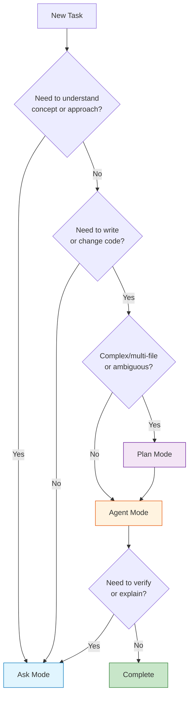

### Real-World Mode Selection Examples

| Scenario | Mode | Why |
|---|---|---|
| "What is OAuth2?" | Ask | Learning concept |
| "Should I use OAuth2 or JWT?" | Ask | Trade-off analysis |
| "Add OAuth2 to my app" (3+ files) | Plan → Agent | Complex, multi-file |
| "Fix this null pointer" (1 file) | Agent | Simple, scoped |
| "Does this match the plan?" | Ask | Audit/verification |
| "Add error handling" | Agent | Specific refinement |

---

## 2. 🔹 Using `@` Mentions to Control Scope

You can tell Copilot where to look for context using `@` mentions. This is crucial for getting relevant, accurate responses.

### Complete `@` Mentions Reference

| Mention | Scope | Best For | Token Impact |
|---|---|---|---|
| `@workspace` | Entire project folder | Architecture questions, cross-file analysis | High |
| `@file` | Current file | File-specific questions, refactoring | Low |
| `@editor` | Selected code snippet | Refactoring, explaining specific code | Very Low |
| `@terminal` | Terminal output | Debugging errors, understanding logs | Low |
| `@chat` | Current chat history | Context retention, follow-up questions | Medium |
| `@notebook` | Jupyter notebook cells | Data analysis, ML optimization | Medium |

### How `@` Mentions Work: Visual Guide

```mermaid
flowchart LR
    User[Your Question] --> Scope{Select Scope}
    
    Scope -->|Broad context| Workspace[@workspace<br>Entire project]
    Scope -->|File-specific| File[@file<br>Current file]
    Scope -->|Code snippet| Editor[@editor<br>Selected code]
    Scope -->|Error/debug| Terminal[@terminal<br>Terminal output]
    Scope -->|Conversation| Chat[@chat<br>Chat history]
    Scope -->|Data/ML| Notebook[@notebook<br>Notebook cells]
    
    Workspace --> Response[Contextual Response]
    File --> Response
    Editor --> Response
    Terminal --> Response
    Chat --> Response
    Notebook --> Response
    
    style Workspace fill:#ffcdd2
    style File fill:#fff9c4
    style Editor fill:#c8e6c9
    style Terminal fill:#ffccbc
    style Chat fill:#e1f5fe
    style Notebook fill:#f3e5f5
```

### Detailed Examples for Each `@` Mention

#### `@workspace` - Project-Wide Analysis

**Use cases:**
- Architecture understanding
- Dependency mapping
- Pattern identification across codebase
- Impact analysis for changes

**Examples:**

```
# Architecture exploration
@workspace explain how authentication is implemented across the entire project.
Show me the flow from login to token validation.

# Dependency analysis
@workspace map all dependencies between services. Which services call the user service?

# Pattern identification
@workspace find all places where we connect to the database. Are we using the same pattern everywhere?

# Impact analysis
@workspace if I change the User model, what files will be affected? What tests might break?
```

**Pro tip:** Use `@workspace` early in a project to understand the big picture, then switch to more focused mentions for implementation.

#### `@file` - File-Specific Operations

**Use cases:**
- Understanding specific files
- Refactoring individual files
- Documentation generation
- Bug investigation in specific files

**Examples:**

```
# Understanding
@file explain what auth.js does. What are the main functions and their purposes?

# Refactoring
@file refactor this file to use async/await instead of callbacks

# Documentation
@file generate comprehensive JSDoc comments for all exported functions

# Bug investigation
@file I'm getting a "Cannot read property 'user' of undefined" error. Where could this be happening?

# Code review
@file review this file for potential security vulnerabilities
```

**Pro tip:** Combine `@file` with specific line references for even more precision: `@file:45-67 explain this validation logic`

#### `@editor` - Selected Code Transformation

**Use cases:**
- Refactoring selected code
- Explaining complex snippets
- Converting code patterns
- Optimizing specific functions

**Examples:**

```
# Refactoring
@editor refactor this function to use modern ES6+ syntax

# Explanation
@editor explain how this sorting algorithm works and what its time complexity is

# Conversion
@editor convert this class component to a functional component with hooks

# Optimization
@editor optimize this database query. It's running slowly on large datasets.

# Testing
@editor write unit tests for this function covering all edge cases

# Translation
@editor convert this Python pandas code to JavaScript
```

**Pro tip:** Select the right amount of code - too little loses context, too much wastes tokens. Usually 10-50 lines is ideal.

#### `@terminal` - Debugging and Error Resolution

**Use cases:**
- Understanding error messages
- Debugging build failures
- Analyzing test output
- Interpreting logs

**Examples:**

```
# Error explanation
@terminal explain the error "Error: Cannot find module 'express'". How do I fix it?

# Build failure
@terminal my build is failing with "Module not found". The output shows 3 missing modules. Help me fix them.

# Test analysis
@terminal I ran the test suite and got 5 failures. Analyze the output and suggest fixes.

# Performance issues
@terminal my app is using 2GB of memory. The heap snapshot shows a memory leak. Where is it?

# Deployment issues
@terminal explain why my Docker container keeps crashing. The logs show "Out of memory".
```

**Pro tip:** Always include the full error message and relevant context. Don't just paste the last line - include the stack trace.

#### `@chat` - Context Retention and Iteration

**Use cases:**
- Referencing previous discussions
- Iterative refinement
- Building on earlier ideas
- Maintaining conversation context

**Examples:**

```
# Reference previous plan
@chat remind me of the authentication plan we discussed earlier. Now I want to add refresh tokens.

# Iterative refinement
@chat based on the RBAC implementation we just created, now add support for resource-based permissions

# Building on context
@chat you suggested using Redis for caching. Now design a cache invalidation strategy

# Context recovery
@chat what were the three approaches we discussed for handling file uploads? What were the pros and cons of each?

# Continuing work
@chat I've implemented the first two steps of the plan. What's next?
```

**Pro tip:** Use `@chat` to maintain long-running conversations. Copilot remembers context within a chat session, making it perfect for iterative development.

#### `@notebook` - Data Science and ML Workflows

**Use cases:**
- Optimizing pandas operations
- Improving ML model performance
- Data visualization
- Notebook refactoring

**Examples:**

```
# Performance optimization
@notebook this pandas operation is slow on 1M rows. Optimize it using vectorization.

# ML model improvement
@notebook my model has 78% accuracy. Analyze the notebook and suggest improvements.

# Visualization
@notebook create better visualizations for this data. The current plots are hard to interpret.

# Code cleanup
@notebook refactor this notebook to separate data loading, processing, and visualization into functions

# Documentation
@notebook add markdown cells explaining each step of this analysis
```

**Pro tip:** Use `@notebook` for exploratory data analysis, then move proven code to regular Python files for production.

### Combining Multiple `@` Mentions

You can combine mentions for powerful context-aware queries:

```
# Cross-reference file with chat history
@file auth.js @chat based on our earlier discussion about security, review this for vulnerabilities

# Workspace with terminal output
@workspace @terminal the build failed with these errors. Find the root cause across the codebase.

# Editor with file context
@editor @file auth.js refactor this function to match the error handling pattern used elsewhere in this file
```

---

## 3. 🔹 Borrowing Ideas Across Projects

Working across multiple projects is a common scenario. Here's how to do it effectively.

### Option A: Multi-Root Workspace (Recommended)

**Structure:**
```
/dev-projects
  /project-auth          # Authentication service
  /project-express       # Express API
  /project-react         # React frontend
  /project-docs          # Documentation
```

**Setup:**
1. Open VS Code
2. File → Add Folder to Workspace
3. Select `/dev-projects`
4. Save workspace as `dev.code-workspace`

**Usage:**

```mermaid
flowchart TD
    Workspace[Multi-Root Workspace] --> ProjectA[project-auth]
    Workspace --> ProjectB[project-express]
    Workspace --> ProjectC[project-react]
    
    Query[@workspace query] --> Search[Search across all projects]
    Search --> Results[Relevant results from all projects]
    
    Results --> Adapt[Adapt for current project]
    Adapt --> Implement[Implement in project-express]
    
    style Workspace fill:#e3f2fd
    style Query fill:#fff9c4
    style Adapt fill:#c8e6c9
```

**Example workflow:**

```
# Step 1: Learn from project-auth
@workspace in project-auth, explain how JWT middleware is implemented

# Step 2: Plan adaptation for project-express
Plan mode: Based on the JWT implementation in project-auth, outline how to add similar authentication to project-express

# Step 3: Implement in project-express
Agent mode: Implement the JWT authentication plan in project-express
```

**Advantages:**
- ✅ Single VS Code window
- ✅ Copilot sees all projects
- ✅ Easy cross-referencing
- ✅ Consistent patterns across projects

**Disadvantages:**
- ⚠️ Higher token usage for broad queries
- ⚠️ Can be overwhelming with many large projects
- ⚠️ Search results may include irrelevant files

### Option B: Manual Context Transfer

**When to use:**
- Projects are in different repositories
- You want minimal token usage
- You only need specific snippets

**Workflow:**

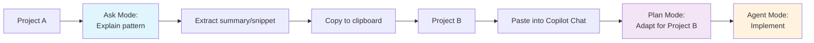

**Example:**

```
# In Project A
Ask mode: Explain the error handling pattern used in this project. Show me 2-3 examples.

# Copy the explanation and examples

# In Project B
Plan mode: I want to implement similar error handling. Here's how it's done in another project:
[paste examples]

Outline how to adapt this pattern for our Express API.
```

**Advantages:**
- ✅ Precise control over what's transferred
- ✅ Lower token usage
- ✅ Works across different repositories
- ✅ No workspace configuration needed

**Disadvantages:**
- ⚠️ Manual copy-paste required
- ⚠️ Context can be lost in translation
- ⚠️ More steps in workflow

### Token Management Strategies

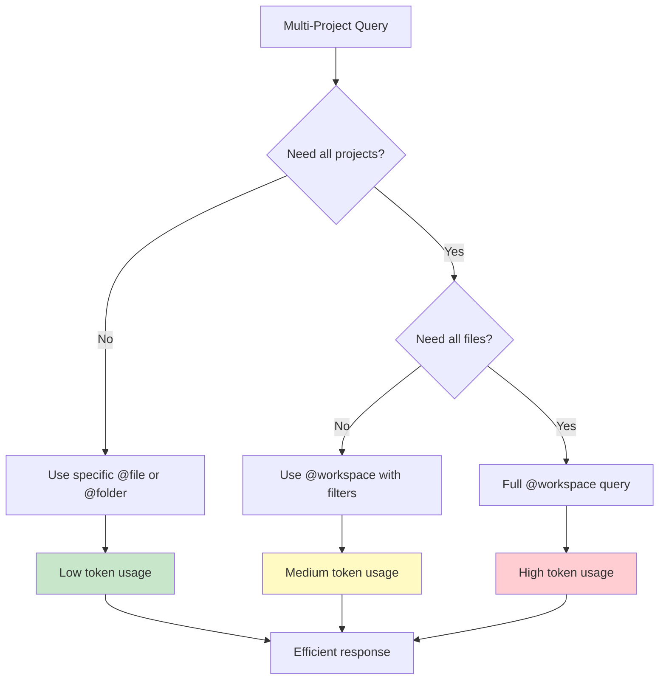

**Best practices:**
- Start specific, broaden only if needed
- Use file paths to narrow `@workspace` queries: `@workspace:project-auth`
- Extract and reuse summaries instead of re-querying
- Close projects you're not actively using

---

## 4. 🔹 Efficiency Tips

Maximize your productivity with these proven strategies.

### 1. Scope Queries Precisely

**❌ Inefficient:**
```
@workspace explain everything about authentication
```

**✅ Efficient:**
```
@file auth.js explain the JWT validation logic in the authenticateToken function
```

**Why it matters:** Precise queries get better answers faster and use fewer tokens.

### 2. Chunk Tasks Logically

**❌ Overwhelming:**
```
Add authentication, authorization, logging, error handling, 
validation, rate limiting, and monitoring to the API
```

**✅ Chunked:**
```
# Step 1: Core auth
Agent mode: Add JWT authentication to the API

# Step 2: Authorization (after audit)
Agent mode: Add role-based authorization to protected routes

# Step 3: Logging (after audit)
Agent mode: Add structured logging to authentication flow
```

**Why it matters:** Smaller chunks are easier to implement, test, and debug.

### 3. Reuse Summaries

**Workflow:**
```
# Extract once
Ask mode: Explain the error handling pattern in this project
[Copy the summary]

# Reuse multiple times
Plan mode: Using this error handling pattern: [paste], plan error handling for the user service

Plan mode: Using this error handling pattern: [paste], plan error handling for the order service

Plan mode: Using this error handling pattern: [paste], plan error handling for the payment service
```

**Why it matters:** Saves time and ensures consistency across your codebase.

### 4. Explicit References

**❌ Vague:**
```
Continue with the plan
```

**✅ Explicit:**
```
Plan mode: From my earlier Ask about JWT expiration, outline 
refresh token implementation steps including:
- Token generation
- Storage strategy
- Refresh endpoint
- Expiration handling
```

**Why it matters:** Explicit references help Copilot understand context and provide relevant responses.

### 5. Iterative Refinement

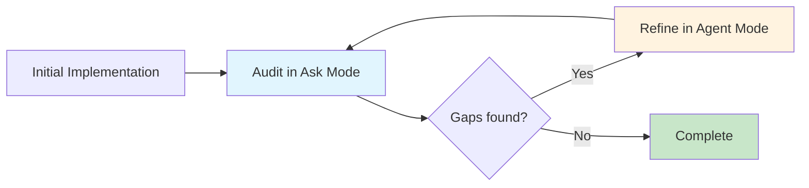

**Example:**
```
# Initial implementation
Agent mode: Implement user registration with email validation

# Audit
Ask mode: Review the registration implementation. Does it handle:
- Invalid email formats?
- Duplicate emails?
- Password strength requirements?
- Database errors?

# Refine (based on audit findings)
Agent mode: Add password strength validation (min 8 chars, 1 number, 1 special char)
Agent mode: Add proper error messages for each validation failure
Agent mode: Add database unique constraint handling for duplicate emails
```

### 6. Use Constraints Effectively

**❌ Open-ended:**
```
Add authentication
```

**✅ Constrained:**
```
Add JWT authentication to the Express API with these constraints:
- Use existing User model in /models/User.js
- Store tokens in Redis with 24-hour expiry
- Use bcrypt for password hashing (already installed)
- Do NOT modify existing login endpoint
- Follow the error handling pattern in /utils/errors.js
```

**Why it matters:** Constraints prevent unwanted changes and ensure consistency.

### Efficiency Comparison: Before vs After

| Approach | Time to Complete | Rework Needed | Final Quality |
|---|---|---|---|
| **Without optimization** | 90 min | 40 min (44%) | Medium |
| **With scoping + chunking** | 60 min | 15 min (25%) | High |
| **With full workflow** | 75 min | 5 min (7%) | Very High |

**Key insight:** The full workflow (Ask → Plan → Agent → Audit) takes slightly longer initially but produces better results with minimal rework.

---

## 5. 🔹 Example Workflow: JWT Middleware (Intermediate Feature)

Let's walk through a complete, practical example of adding JWT authentication to an Express API.

### Complete Workflow Diagram

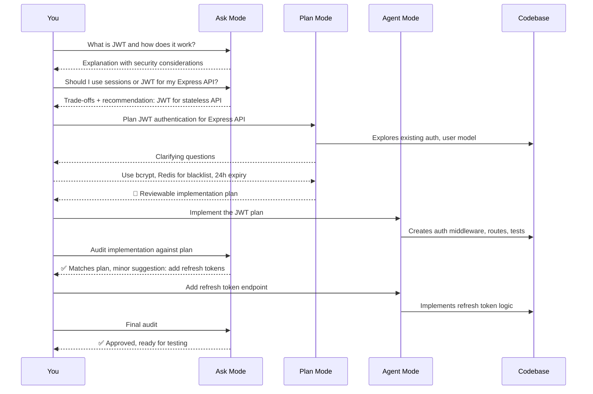

### Step-by-Step Implementation

#### Step 1: Ask Mode - Understand JWT

```
Ask mode: What is JWT authentication and why is it used in REST APIs?
Explain the flow, security considerations, and common pitfalls.
```

**What you'll learn:**
- JWT structure (header, payload, signature)
- Stateless authentication benefits
- Security risks (XSS, CSRF, token storage)
- Best practices (HTTPS, short expiry, refresh tokens)

#### Step 2: Ask Mode - Decision Making

```
Ask mode: For my Express API that serves a React frontend, should I use:
1. Session-based authentication
2. JWT with localStorage
3. JWT with httpOnly cookies

Compare across: security, scalability, mobile support, logout behavior.
```

**Decision factors:**
- **Sessions**: Server state, easier revocation, but requires sticky sessions or shared storage
- **JWT + localStorage**: Stateless, scalable, but vulnerable to XSS
- **JWT + httpOnly cookies**: Better security, but CSRF protection needed

**Recommendation:** JWT with httpOnly cookies for maximum security.

#### Step 3: Plan Mode - Structure Implementation

```
Plan mode: Plan JWT authentication for my Express API with these requirements:
- Use httpOnly cookies for token storage
- Access tokens expire in 15 minutes
- Refresh tokens expire in 7 days
- Store refresh tokens in Redis
- Support logout (token blacklist in Redis)
- Use existing User model in /models/User.js
- bcrypt for password hashing

Explore the existing codebase structure and propose a file-by-file plan.
```

**Plan Mode will:**
1. Explore your project structure
2. Identify existing User model, database setup
3. Ask clarifying questions:
   - "Should refresh tokens be rotated on each use?"
   - "Do you need email verification?"
   - "What should happen when refresh token expires?"
4. Generate a detailed implementation plan

**Sample Plan Output:**
```markdown
## Implementation Plan: JWT Authentication

### Files to Create
- `middleware/auth.js` - JWT verification middleware
- `middleware/refreshToken.js` - Refresh token middleware
- `controllers/authController.js` - Login, logout, refresh endpoints
- `services/tokenService.js` - Token generation and validation
- `utils/blacklist.js` - Redis blacklist operations

### Files to Modify
- `routes/index.js` - Add auth routes
- `app.js` - Add middleware and cookie settings

### Step Sequence
1. Create token service (generation, validation, expiry)
2. Implement Redis blacklist for logout
3. Create auth middleware (verify access tokens)
4. Create refresh token middleware
5. Implement auth controller (login, logout, refresh)
6. Add routes and integrate with existing app
7. Add error handling and tests

### Security Considerations
- Use httpOnly, secure, sameSite cookies
- Implement CSRF protection
- Rate limit login attempts
- Hash passwords with bcrypt (cost factor 12)
```

#### Step 4: Agent Mode - Implement

```
Agent mode: Implement the JWT authentication plan exactly as written.
Follow the existing code style and patterns in the project.
```

**What Agent will create:**

```javascript
// middleware/auth.js
const jwt = require('jsonwebtoken');
const { verifyToken } = require('../services/tokenService');

const authenticate = async (req, res, next) => {
  try {
    const token = req.cookies.accessToken;
    
    if (!token) {
      return res.status(401).json({ message: 'Access token required' });
    }
    
    const decoded = await verifyToken(token);
    req.user = decoded;
    next();
    
  } catch (error) {
    return res.status(403).json({ message: 'Invalid or expired token' });
  }
};

module.exports = { authenticate };
```

```javascript
// services/tokenService.js
const jwt = require('jsonwebtoken');
const redis = require('../config/redis');

const generateAccessToken = (user) => {
  return jwt.sign(
    { id: user.id, email: user.email, role: user.role },
    process.env.JWT_SECRET,
    { expiresIn: '15m' }
  );
};

const generateRefreshToken = (user) => {
  return jwt.sign(
    { id: user.id },
    process.env.JWT_REFRESH_SECRET,
    { expiresIn: '7d' }
  );
};

const verifyToken = async (token) => {
  return new Promise((resolve, reject) => {
    jwt.verify(token, process.env.JWT_SECRET, (err, decoded) => {
      if (err) return reject(err);
      
      // Check if token is blacklisted
      redis.get(`blacklist:${token}`, (err, result) => {
        if (result) return reject(new Error('Token blacklisted'));
        resolve(decoded);
      });
    });
  });
};

module.exports = { generateAccessToken, generateRefreshToken, verifyToken };
```

#### Step 5: Ask Mode - Audit

```
Ask mode: Audit the JWT authentication implementation against the plan.
Check:
1. Are access tokens stored in httpOnly cookies?
2. Is there a refresh token mechanism?
3. Is Redis used for token blacklist?
4. Are passwords hashed with bcrypt?
5. Is there rate limiting on login?
6. What security considerations were missed?
```

**Audit findings:**
- ✅ httpOnly cookies implemented
- ✅ Refresh token mechanism in place
- ✅ Redis blacklist for logout
- ✅ bcrypt for passwords
- ⚠️ Missing: Rate limiting on login endpoint
- ⚠️ Missing: CSRF protection
- ⚠️ Missing: Input validation on login

#### Step 6: Agent Mode - Refine

```
Agent mode: Add the missing security features:
1. Rate limiting: 5 login attempts per 15 minutes per IP
2. CSRF protection using csurf middleware
3. Input validation for email and password fields
```

#### Step 7: Test and Validate

```
@terminal run the test suite and show results

Ask mode: Review the test coverage. Are there any edge cases not covered?
```

### Using `@` Mentions in This Workflow

```
# Understand existing code
@file models/User.js explain the User model structure

# Refactor login function
@editor refactor the login function to use async/await and proper error handling

# Debug token issues
@terminal explain the error "jwt malformed" from the test output

# Reference earlier discussion
@chat remind me what we decided about token expiry times

# Analyze authentication flow
@workspace map the complete authentication flow from login to protected route access
```

---

## 6. 🔹 Complex Feature: Role-Based Access Control (RBAC)

A complete, production-ready RBAC implementation example.

### What is RBAC?

**Role-Based Access Control (RBAC)** is an authorization model where:
- **Users** are assigned to **Roles**
- **Roles** have **Permissions**
- **Permissions** define what actions users can perform

**Example hierarchy:**
```
Users: Alice, Bob, Charlie
  ↓
Roles: Admin, Editor, Viewer
  ↓
Permissions: create:post, edit:post, delete:post, view:post
```

### Complete RBAC Implementation

#### Step 1: Ask Mode - Learn RBAC

```
Ask mode: What is RBAC and how is it implemented in Express APIs?
What are the trade-offs between RBAC and ABAC (Attribute-Based Access Control)?
When should I use each?
```

**Key concepts learned:**
- RBAC vs ABAC comparison
- Role hierarchy (inheritance)
- Permission granularity
- Best practices for role assignment

#### Step 2: Ask Mode - Design Decisions

```
Ask mode: For my e-commerce API, I need:
- Admin: Full access
- Seller: Manage own products, view orders
- Customer: Browse products, place orders
- Guest: Browse only

Design a role hierarchy and permission structure. Should I use:
1. Simple roles (admin, seller, customer)
2. Role + resource permissions (admin:*, seller:product:*, etc.)
3. Fine-grained permissions (create:product, edit:own:product)
```

**Decision:** Use option 2 (role + resource permissions) for balance of simplicity and flexibility.

#### Step 3: Plan Mode - Structure Implementation

```
Plan mode: Plan RBAC implementation for Express API with JWT.

Requirements:
- Extend JWT payload to include user role
- Create authorize middleware for role checking
- Support role hierarchy (admin inherits all permissions)
- Resource-based permissions (product:*, order:*, user:*)
- Protected routes with role requirements
- 403 Forbidden for unauthorized access
- Audit logging for permission checks

Explore existing auth middleware and propose implementation plan.
```

**Plan Mode Output:**

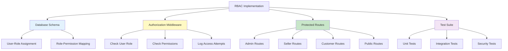

**Detailed Plan:**
1. Database schema for roles and permissions
2. Permission checking middleware
3. Role-based route protection
4. Admin endpoints for role management
5. Audit logging for access control
6. Comprehensive test suite

#### Step 4: Agent Mode - Implement Database Schema

```
Agent mode: Create database schema for RBAC:
- roles table (id, name, description, created_at)
- permissions table (id, name, resource, action, description)
- role_permissions table (role_id, permission_id)
- Add role column to users table

Use the existing database setup and migration pattern.
```

**Schema:**

```sql
-- roles table
CREATE TABLE roles (
  id SERIAL PRIMARY KEY,
  name VARCHAR(50) UNIQUE NOT NULL,
  description TEXT,
  created_at TIMESTAMP DEFAULT CURRENT_TIMESTAMP
);

-- permissions table
CREATE TABLE permissions (
  id SERIAL PRIMARY KEY,
  name VARCHAR(100) UNIQUE NOT NULL,
  resource VARCHAR(50) NOT NULL,
  action VARCHAR(50) NOT NULL,
  description TEXT,
  created_at TIMESTAMP DEFAULT CURRENT_TIMESTAMP
);

-- role_permissions junction table
CREATE TABLE role_permissions (
  role_id INTEGER REFERENCES roles(id),
  permission_id INTEGER REFERENCES permissions(id),
  PRIMARY KEY (role_id, permission_id)
);

-- Add role to users
ALTER TABLE users ADD COLUMN role_id INTEGER REFERENCES roles(id);
CREATE INDEX idx_users_role_id ON users(role_id);

-- Seed initial roles
INSERT INTO roles (name, description) VALUES
  ('admin', 'Full system access'),
  ('seller', 'Manage products and view orders'),
  ('customer', 'Browse and purchase products'),
  ('guest', 'Browse only');

-- Seed permissions
INSERT INTO permissions (name, resource, action, description) VALUES
  ('create:product', 'product', 'create', 'Create new products'),
  ('edit:product', 'product', 'edit', 'Edit any product'),
  ('edit:own:product', 'product', 'edit:own', 'Edit own products only'),
  ('delete:product', 'product', 'delete', 'Delete products'),
  ('view:product', 'product', 'view', 'View products'),
  ('create:order', 'order', 'create', 'Create orders'),
  ('view:own:order', 'order', 'view:own', 'View own orders'),
  ('view:all:orders', 'order', 'view:all', 'View all orders'),
  ('manage:users', 'user', 'manage', 'Manage user accounts');

-- Assign permissions to roles
-- Admin gets all permissions
INSERT INTO role_permissions (role_id, permission_id)
SELECT r.id, p.id FROM roles r, permissions p
WHERE r.name = 'admin';

-- Seller permissions
INSERT INTO role_permissions (role_id, permission_id)
SELECT r.id, p.id FROM roles r, permissions p
WHERE r.name = 'seller'
  AND p.name IN ('create:product', 'edit:own:product', 'view:product', 
                 'create:order', 'view:own:order');

-- Customer permissions
INSERT INTO role_permissions (role_id, permission_id)
SELECT r.id, p.id FROM roles r, permissions p
WHERE r.name = 'customer'
  AND p.name IN ('view:product', 'create:order', 'view:own:order');

-- Guest permissions
INSERT INTO role_permissions (role_id, permission_id)
SELECT r.id, p.id FROM roles r, permissions p
WHERE r.name = 'guest'
  AND p.name = 'view:product';
```

#### Step 5: Agent Mode - Implement Middleware

```
Agent mode: Create authorization middleware for RBAC:
1. requirePermission middleware - checks if user has specific permission
2. requireRole middleware - checks if user has specific role
3. Optional: requireAnyPermission, requireAllPermissions
4. Include user's permissions in req object for route access
5. Log all permission checks for audit

Use the existing auth middleware pattern and database setup.
```

**Implementation:**

```javascript
// middleware/authorize.js
const db = require('../config/database');

// Check if user has required permission
const requirePermission = (permissionName) => {
  return async (req, res, next) => {
    try {
      const userId = req.user.id;
      
      // Get user's permissions through their role
      const result = await db.query(
        `SELECT p.name 
         FROM permissions p
         JOIN role_permissions rp ON p.id = rp.permission_id
         JOIN roles r ON rp.role_id = r.id
         JOIN users u ON u.role_id = r.id
         WHERE u.id = $1 AND p.name = $2`,
        [userId, permissionName]
      );
      
      // Check for wildcard permissions (admin:*, product:*)
      const [resource, action] = permissionName.split(':');
      const wildcardResult = await db.query(
        `SELECT p.name 
         FROM permissions p
         JOIN role_permissions rp ON p.id = rp.permission_id
         JOIN roles r ON rp.role_id = r.id
         JOIN users u ON u.role_id = r.id
         WHERE u.id = $1 AND p.name = $2`,
        [userId, `${resource}:*`]
      );
      
      const hasPermission = result.rows.length > 0 || wildcardResult.rows.length > 0;
      
      // Audit log
      await db.query(
        `INSERT INTO audit_logs (user_id, action, resource, granted, ip_address)
         VALUES ($1, $2, $3, $4, $5)`,
        [userId, 'permission_check', permissionName, hasPermission, req.ip]
      );
      
      if (!hasPermission) {
        return res.status(403).json({ 
          message: 'Forbidden - Insufficient permissions',
          required: permissionName
        });
      }
      
      // Attach permissions to request for use in routes
      const allPermissions = await db.query(
        `SELECT p.name 
         FROM permissions p
         JOIN role_permissions rp ON p.id = rp.permission_id
         JOIN roles r ON rp.role_id = r.id
         JOIN users u ON u.role_id = r.id
         WHERE u.id = $1`,
        [userId]
      );
      
      req.permissions = allPermissions.rows.map(row => row.name);
      next();
      
    } catch (error) {
      console.error('Authorization error:', error);
      res.status(500).json({ message: 'Authorization error' });
    }
  };
};

// Check if user has required role
const requireRole = (...allowedRoles) => {
  return async (req, res, next) => {
    try {
      const result = await db.query(
        `SELECT r.name 
         FROM roles r
         JOIN users u ON u.role_id = r.id
         WHERE u.id = $1 AND r.name = ANY($2)`,
        [req.user.id, allowedRoles]
      );
      
      if (result.rows.length === 0) {
        return res.status(403).json({ 
          message: 'Forbidden - Invalid role',
          required: allowedRoles.join(', ')
        });
      }
      
      req.role = result.rows[0].name;
      next();
      
    } catch (error) {
      console.error('Role check error:', error);
      res.status(500).json({ message: 'Authorization error' });
    }
  };
};

// Check multiple permissions (user needs ANY of them)
const requireAnyPermission = (...permissions) => {
  return async (req, res, next) => {
    try {
      const userId = req.user.id;
      
      for (const permission of permissions) {
        const result = await db.query(
          `SELECT p.name 
           FROM permissions p
           JOIN role_permissions rp ON p.id = rp.permission_id
           JOIN roles r ON rp.role_id = r.id
           JOIN users u ON u.role_id = r.id
           WHERE u.id = $1 AND p.name = $2`,
          [userId, permission]
        );
        
        if (result.rows.length > 0) {
          return next();
        }
      }
      
      return res.status(403).json({ 
        message: 'Forbidden - Requires one of:',
        required: permissions.join(', ')
      });
      
    } catch (error) {
      console.error('Authorization error:', error);
      res.status(500).json({ message: 'Authorization error' });
    }
  };
};

module.exports = {
  requirePermission,
  requireRole,
  requireAnyPermission
};
```

#### Step 6: Agent Mode - Implement Protected Routes

```
Agent mode: Create protected routes demonstrating RBAC:
1. GET /api/admin/dashboard - admin only
2. GET /api/seller/products - seller or admin
3. POST /api/products - create:product permission
4. PUT /api/products/:id - edit:product or edit:own:product
5. GET /api/orders - view:all:orders or view:own:order
6. GET /api/public/products - no auth required

Use the authorization middleware and follow RESTful conventions.
```

**Implementation:**

```javascript
// routes/protected.js
const express = require('express');
const router = express.Router();
const { authenticate } = require('../middleware/auth');
const { requirePermission, requireRole, requireAnyPermission } = require('../middleware/authorize');
const authController = require('../controllers/authController');
const productController = require('../controllers/productController');
const orderController = require('../controllers/orderController');

// Public routes (no auth)
router.get('/products', productController.getAllProducts);

// Customer routes
router.post('/orders', 
  authenticate, 
  requirePermission('create:order'),
  orderController.createOrder
);

router.get('/orders', 
  authenticate, 
  requireAnyPermission('view:all:orders', 'view:own:order'),
  orderController.getOrders
);

// Seller routes
router.post('/products',
  authenticate,
  requirePermission('create:product'),
  productController.createProduct
);

router.put('/products/:id',
  authenticate,
  requireAnyPermission('edit:product', 'edit:own:product'),
  productController.updateProduct
);

// Admin routes
router.get('/admin/dashboard',
  authenticate,
  requireRole('admin'),
  authController.getAdminDashboard
);

router.delete('/products/:id',
  authenticate,
  requirePermission('delete:product'),
  productController.deleteProduct
);

// User management (admin only)
router.put('/users/:id/role',
  authenticate,
  requireRole('admin'),
  authController.updateUserRole
);

module.exports = router;
```

#### Step 7: Ask Mode - Audit and Review

```
Ask mode: Audit the RBAC implementation:
1. Is the permission system flexible enough for future needs?
2. Are there any security vulnerabilities?
3. Is the audit logging sufficient?
4. What edge cases are not handled?
5. How would I add resource-level permissions (e.g., edit:own:product)?
```

**Audit findings:**
- ✅ Permission system is flexible
- ✅ Audit logging in place
- ⚠️ Missing: Input validation on role/permission endpoints
- ⚠️ Missing: Rate limiting on permission checks
- ✅ Resource-level permissions supported via wildcards

#### Step 8: Agent Mode - Add Missing Features

```
Agent mode: Add the missing features from the audit:
1. Input validation for role/permission assignment
2. Rate limiting on authentication endpoints
3. Helper function to check if user can edit specific resource
```

#### Step 9: Testing Strategy

```javascript
// tests/auth.test.js
const request = require('supertest');
const app = require('../app');
const db = require('../config/database');

describe('RBAC Authorization', () => {
  let adminToken, sellerToken, customerToken;
  let adminId, sellerId, customerId;
  let testProductId;
  
  beforeAll(async () => {
    // Create test users and get tokens
    const admin = await createUser({ email: 'admin@test.com', role: 'admin' });
    const seller = await createUser({ email: 'seller@test.com', role: 'seller' });
    const customer = await createUser({ email: 'customer@test.com', role: 'customer' });
    
    adminToken = generateToken(admin);
    sellerToken = generateToken(seller);
    customerToken = generateToken(customer);
    
    adminId = admin.id;
    sellerId = seller.id;
    customerId = customer.id;
    
    // Create test product
    const product = await createProduct({ sellerId, name: 'Test Product' });
    testProductId = product.id;
  });
  
  describe('POST /api/products', () => {
    it('should allow admin to create product', async () => {
      const res = await request(app)
        .post('/api/products')
        .set('Cookie', [`accessToken=${adminToken}`])
        .send({ name: 'New Product', price: 100 });
      
      expect(res.status).toBe(201);
    });
    
    it('should allow seller to create product', async () => {
      const res = await request(app)
        .post('/api/products')
        .set('Cookie', [`accessToken=${sellerToken}`])
        .send({ name: 'Seller Product', price: 50 });
      
      expect(res.status).toBe(201);
    });
    
    it('should deny customer from creating product', async () => {
      const res = await request(app)
        .post('/api/products')
        .set('Cookie', [`accessToken=${customerToken}`])
        .send({ name: 'Customer Product', price: 50 });
      
      expect(res.status).toBe(403);
    });
  });
  
  describe('PUT /api/products/:id', () => {
    it('should allow seller to edit own product', async () => {
      const res = await request(app)
        .put(`/api/products/${testProductId}`)
        .set('Cookie', [`accessToken=${sellerToken}`])
        .send({ name: 'Updated Product' });
      
      expect(res.status).toBe(200);
    });
    
    it('should deny seller from editing others product', async () => {
      // Create product by different seller
      const otherSeller = await createUser({ email: 'other@test.com', role: 'seller' });
      const otherProduct = await createProduct({ sellerId: otherSeller.id, name: 'Other Product' });
      
      const res = await request(app)
        .put(`/api/products/${otherProduct.id}`)
        .set('Cookie', [`accessToken=${sellerToken}`])
        .send({ name: 'Hacked Product' });
      
      expect(res.status).toBe(403);
    });
  });
  
  describe('GET /api/admin/dashboard', () => {
    it('should allow admin access', async () => {
      const res = await request(app)
        .get('/api/admin/dashboard')
        .set('Cookie', [`accessToken=${adminToken}`]);
      
      expect(res.status).toBe(200);
    });
    
    it('should deny customer access', async () => {
      const res = await request(app)
        .get('/api/admin/dashboard')
        .set('Cookie', [`accessToken=${customerToken}`]);
      
      expect(res.status).toBe(403);
    });
  });
});
```

### RBAC Best Practices

```mermaid
flowchart TD
    Start[RBAC Implementation] --> P1[Keep it simple]
    Start --> P2[Document permissions]
    Start --> P3[Audit access]
    Start --> P4[Regular reviews]
    
    P1 --> Tip1[Start with 3-5 roles max]
    P1 --> Tip2[Avoid role explosion]
    P1 --> Tip3[Use role hierarchy]
    
    P2 --> Tip4[Document each permission]
    P2 --> Tip5[Create permission matrix]
    P2 --> Tip6[Share with team]
    
    P3 --> Tip7[Log all access checks]
    P3 --> Tip8[Monitor for violations]
    P3 --> Tip9[Regular audit reports]
    
    P4 --> Tip10[Review quarterly]
    P4 --> Tip11[Remove unused roles]
    P4 --> Tip12[Update as features change]
    
    style Start fill:#e3f2fd
    style Tip1 fill:#c8e6c9
    style Tip2 fill:#c8e6c9
    style Tip3 fill:#c8e6c9
    style Tip4 fill:#fff9c4
    style Tip5 fill:#fff9c4
    style Tip6 fill:#fff9c4
    style Tip7 fill:#ffcdd2
    style Tip8 fill:#ffcdd2
    style Tip9 fill:#ffcdd2
    style Tip10 fill:#f3e5f5
    style Tip11 fill:#f3e5f5
    style Tip12 fill:#f3e5f5
```

---

## 7. 🔹 Common Pitfalls and Solutions

Learn from these common mistakes to save time and avoid frustration.

### Pitfall #1: Using Wrong Mode for the Task

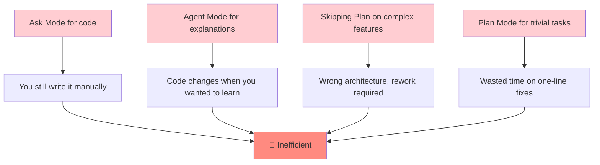

| Mistake | Why It Happens | Solution | Example |
|---|---|---|---|
| **Ask Mode for code** | "Can you write this?" sounds like a question | Use Agent Mode for implementation | ❌ "Ask, write a login function"<br>✅ "Agent, implement login per plan" |
| **Agent Mode for explanations** | Want quick answer, Agent is there | Switch to Ask Mode | ❌ "Agent, explain how auth works"<br>✅ "Ask, explain how auth works" |
| **Skipping Plan Mode** | Feels like extra step | Use Plan for 3+ files | ❌ "Agent, add 2FA" (guesses wrong)<br>✅ Plan first, then Agent |
| **Plan Mode for trivial tasks** | Over-engineering | Skip Plan for simple changes | ❌ Plan to rename a method<br>✅ Just do it or use Agent |
| **Treating plan as final** | Looks polished | Always review before implementing | ❌ Click "Start Implementation" immediately<br>✅ Read, edit, then implement |
| **Patching wrong plan** | Feels productive | Go back to Plan Mode | ❌ "Agent, also do X" (patch)<br>✅ Revise plan, re-implement |
| **Skipping audit** | "Looks good enough" | Always audit before shipping | ❌ Ship immediately<br>✅ Audit like a PR review |
| **No testing** | Trust without verify | Run tests as final gate | ❌ "Looks right"<br>✅ Run test suite |

### Pitfall Deep Dive: The "Patch Instead of Re-Plan" Trap

This is the most insidious pitfall because it *feels* productive:

```
Scenario: You planned to block all logins with 2FA, but realize 
mid-implementation that you only want to block new devices.

❌ WRONG APPROACH:
Agent: "I've implemented 2FA blocking for all logins."
You: "Also, only block new devices."
Agent: [Adds complex device-tracking logic]
Result: Inconsistent architecture, half-baked feature

✅ RIGHT APPROACH:
You: "The plan is wrong. We should only block new devices."
[Back to Plan Mode]
Plan: "Revised plan with device-tracking scope..."
Agent: Implements the corrected plan
Result: Clean, consistent implementation
```

**Why the wrong approach feels right:** You're making progress and fixing the issue. But you're building on a flawed foundation, which creates technical debt.

### Pitfall Deep Dive: The "Vague Prompt" Problem

```
❌ VAGUE PROMPTS:
"Add authentication" 
→ Agent guesses: sessions? JWT? OAuth? Where? How?
Result: Wrong implementation, lots of rework

"Make it better"
→ Agent guesses what "better" means
Result: Unpredictable changes

"Fix the bug"
→ Agent doesn't know which bug or how to fix it
Result: Wastes time investigating

✅ SPECIFIC PROMPTS:
"Add JWT authentication using httpOnly cookies with 15-minute 
access tokens and 7-day refresh tokens stored in Redis"

"Refactor the login function to use async/await, add input 
validation, and improve error messages following the pattern 
in utils/errors.js"

"Fix the null pointer exception in UserService.js line 45 by 
adding a null check before accessing user.profile"
```

---

## 8. 🔹 Prompt Engineering Templates

Copy-paste templates for effective Copilot interactions.

### Ask Mode Templates

**Template 1: Concept Explanation**
```
Explain [concept/technology] in the context of [your tech stack].
Cover:
1. What it is and how it works
2. When to use it vs alternatives
3. Security/performance considerations
4. Common pitfalls to avoid
5. Real-world example in [language/framework]
```

**Template 2: Trade-off Analysis**
```
I need to decide between [Option A] and [Option B] for [use case].
Compare them across:
- Performance
- Scalability
- Maintenance complexity
- Security
- Cost
- Team expertise required

Recommend one with justification.
```

**Template 3: Code Review**
```
Review this code for [specific concerns]:
1. Security vulnerabilities
2. Performance issues
3. Best practice violations
4. Potential bugs
5. Maintainability concerns

Provide specific line numbers and suggested fixes.
```

**Template 4: Architecture Discussion**
```
I'm designing [feature/system]. Current approach: [description].
Concerns: [list concerns]

Suggest improvements considering:
- Scalability
- Maintainability
- Testability
- Alignment with [existing patterns/standards]
```

### Plan Mode Templates

**Template 1: Feature Implementation**
```
Plan the implementation of [feature] with these requirements:
- [Requirement 1]
- [Requirement 2]
- [Requirement 3]

Constraints:
- [Constraint 1]
- [Constraint 2]

Please explore:
- [File/component 1]
- [File/component 2]

Deliver a plan with:
- Files to create/modify
- Step-by-step sequence
- Open questions
- Risks and mitigations
- Testing strategy
```

**Template 2: Refactoring**
```
Plan a refactor of [component/file] to [goal].
Current issues:
- [Issue 1]
- [Issue 2]

Explore the current implementation and propose:
1. New structure/organization
2. Migration steps
3. Backward compatibility approach
4. Testing strategy
5. Rollback plan
```

**Template 3: Migration**
```
Plan migration from [current system] to [target system].
Requirements:
- [Requirement 1]
- [Requirement 2]

Please analyze:
- Current data structures
- Breaking changes
- Data migration strategy
- Rollback plan
- Testing approach
```

### Agent Mode Templates

**Template 1: Implementation from Plan**
```
Implement the plan in [plan-document.md] exactly as written.
Constraints:
- Follow existing code style
- Do not modify [specific files]
- Use existing [patterns/services]

Flag any deviations from the plan or codebase conventions.
```

**Template 2: Bug Fix**
```
Fix the bug in [file] at [line number or description].
Current behavior: [what's happening]
Expected behavior: [what should happen]

Constraints:
- Do not change [unrelated functionality]
- Add tests for the fix
- Follow existing error handling patterns
```

**Template 3: Refactoring**
```
Refactor [component] to [goal].
Current issues: [list issues]

Requirements:
- [Requirement 1]
- [Requirement 2]

Do NOT:
- Change public API
- Modify [specific functionality]
- Break existing tests
```

### Audit Templates

**Template 1: Plan Compliance**
```
Compare the implementation against the plan in [plan-document.md].

Check:
1. [Requirement 1]: Implemented correctly?
2. [Requirement 2]: Any deviations?
3. [Constraint 1]: Respected?

List:
✅ What matches the plan
⚠️ Minor deviations (if any)
❌ Major gaps or wrong implementations
```

**Template 2: Code Quality**
```
Review this code for:
1. Security vulnerabilities
2. Performance issues
3. Best practice violations
4. Test coverage gaps
5. Documentation needs

Provide severity (High/Medium/Low) and specific fixes.
```

---

## 9. 🔹 Advanced Techniques

Take your Copilot usage to the next level with these advanced strategies.

### Context Window Management

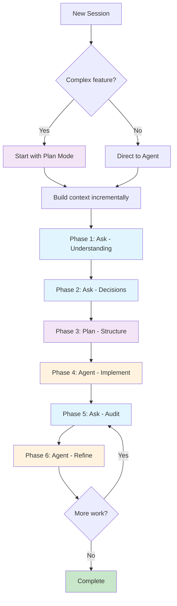

**Strategies:**

1. **Progressive Disclosure**: Start broad, narrow down
   ```
   # Too broad (wastes tokens)
   @workspace explain everything about the codebase
   
   # Better (focused)
   @workspace explain the authentication flow
   
   # Best (specific)
   @file auth.js explain the JWT validation logic
   ```

2. **Chunk Large Features**: Break into phases
   ```
   # Instead of one massive prompt
   "Add complete user management with auth, profiles, settings, 
   notifications, and admin panel"
   
   # Break into phases
   Phase 1: Core authentication
   Phase 2: User profiles
   Phase 3: Settings
   Phase 4: Notifications
   Phase 5: Admin panel
   ```

3. **Reference, Don't Repeat**: Use `@chat` to maintain context
   ```
   # Don't repeat context
   "As I mentioned earlier about JWT tokens with 15 min expiry..."
   
   # Use @chat
   @chat based on our JWT discussion, now add refresh tokens
   ```

4. **Save Important Context**: Extract and save key insights
   ```
   # Extract decision
   Ask mode: Summarize our architecture decisions for the auth system
   [Save to DECISIONS.md]
   
   # Reference later
   @file DECISIONS.md implement the auth system per these decisions
   ```

### Iterative Refinement Strategies

**Strategy 1: The Audit-Refine Loop**

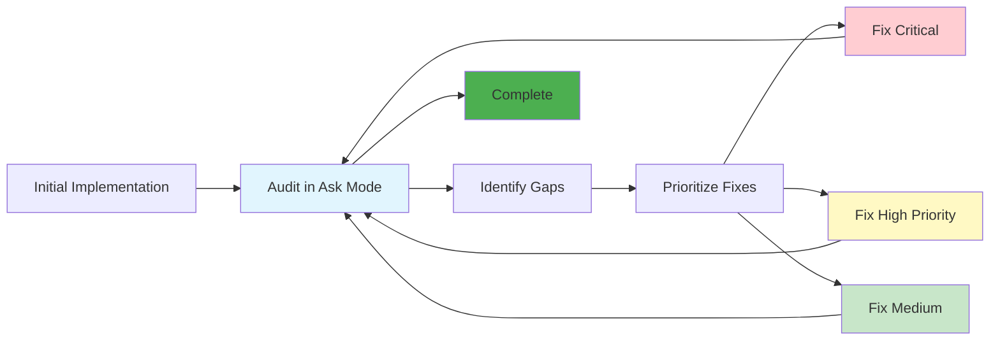

**Example:**
```
# Implementation
Agent mode: Implement user registration

# Audit
Ask mode: Audit the registration implementation for:
1. Security vulnerabilities
2. Missing validation
3. Error handling gaps
4. Test coverage

# Prioritize fixes
Critical: Password stored in plaintext
High: No email validation
Medium: Missing rate limiting

# Fix critical
Agent mode: Hash passwords with bcrypt before storing

# Re-audit
Ask mode: Re-audit after password hashing fix

# Fix high priority
Agent mode: Add email validation using validator.js

# Re-audit
Ask mode: Re-audit after email validation

# Continue until all critical/high issues resolved
```

**Strategy 2: The Incremental Feature Build**

```
# Instead of building everything at once
Agent mode: Build complete e-commerce checkout flow

# Build incrementally
Agent mode: Implement cart management
[Audit]
Agent mode: Implement address management
[Audit]
Agent mode: Implement payment processing
[Audit]
Agent mode: Implement order confirmation
[Audit]
Agent mode: Integrate all checkout steps
```

**Strategy 3: The Test-Driven Approach**

```
# Write tests first
Agent mode: Write tests for user registration covering:
- Valid registration
- Duplicate email
- Weak password
- Missing required fields

# Implement to pass tests
Agent mode: Implement user registration to pass all tests

# Refine based on test results
Agent mode: Fix failing test for edge case: email with special characters
```

### Context Optimization Techniques

**Technique 1: The Summary Pattern**

```
# Create a summary document
Ask mode: Summarize the authentication architecture decisions:
- JWT with httpOnly cookies
- 15-min access tokens, 7-day refresh tokens
- Redis for token blacklist
- bcrypt for passwords

# Save to AUTH_SUMMARY.md

# Reference in future sessions
@file AUTH_SUMMARY.md implement password reset flow consistent 
with existing auth architecture
```

**Technique 2: The Reference Pattern**

```
# Create reference document
# FILE: patterns.md
## Error Handling Pattern
```javascript
try {
  // operation
} catch (error) {
  logger.error('Context', error);
  res.status(500).json({ 
    message: 'User-friendly message',
    code: 'ERROR_CODE'
  });
}
```

## Validation Pattern
```javascript
const { error } = validate(schema, data);
if (error) {
  return res.status(400).json({ 
    message: error.details[0].message 
  });
}
```

# Use in prompts
Agent mode: Follow the error handling and validation patterns 
in patterns.md when implementing the user service
```

**Technique 3: The Progressive Disclosure Pattern**

```
# Session 1: High-level design
Ask mode: Design authentication system for Express API
[Get high-level overview]

# Session 2: Detailed planning
Plan mode: Plan JWT implementation based on our design discussion
[Get detailed plan]

# Session 3: Implementation
Agent mode: Implement the JWT authentication plan
[Build it]

# Session 4: Refinement
Ask mode: Audit implementation
Agent mode: Fix issues
[Polish it]
```

---

## 10. 🔹 Troubleshooting Guide

Common issues and their solutions.

### Issue: Copilot Gives Irrelevant Answers

**Symptoms:** Responses don't match your codebase or question

**Causes:**
- Too broad context (`@workspace` on large project)
- Vague question
- Wrong mode selected

**Solutions:**
1. Narrow the scope: Use `@file` instead of `@workspace`
2. Be more specific: Add constraints and examples
3. Switch modes: Use Ask Mode for clarification first

**Example:**
```
❌ Problem:
@workspace how do I add authentication?
[Gets generic answer not specific to your codebase]

✅ Solution:
@file auth.js based on the existing authentication pattern here,
how do I add refresh token support?
```

### Issue: Agent Mode Makes Unwanted Changes

**Symptoms:** Agent modifies files you didn't want changed

**Causes:**
- Insufficient constraints in prompt
- Ambiguous requirements
- Agent "improving" beyond scope

**Solutions:**
1. Add explicit constraints: "Do NOT modify X"
2. Be more specific about scope
3. Use Plan Mode for complex changes

**Example:**
```
❌ Problem:
Agent mode: Add error handling
[Agent modifies 15 files, changes error handling everywhere]

✅ Solution:
Agent mode: Add error handling to userController.js only.
Follow the pattern in utils/errors.js. Do not modify any other files.
```

### Issue: Plan Mode Takes Too Long

**Symptoms:** Plan Mode asks 20+ questions, takes 30+ minutes

**Causes:**
- Feature too large (needs breaking down)
- Initial prompt too vague
- Too many unknowns

**Solutions:**
1. Break feature into smaller pieces
2. Provide more context in initial prompt
3. Answer questions more concisely

**Example:**
```
❌ Problem:
"Add authentication to my app"
[Plan Mode explores everything, asks 20 questions]

✅ Solution:
"Add JWT authentication with httpOnly cookies to Express API.
Requirements:
- 15-min access tokens
- 7-day refresh tokens in Redis
- Use existing User model
- Follow pattern in auth.js"
[Plan Mode asks 3-4 focused questions]
```

### Issue: Context Lost Between Sessions

**Symptoms:** Copilot doesn't remember previous discussions

**Causes:**
- New chat session started
- Context window cleared
- Too much time between sessions

**Solutions:**
1. Use `@chat` to reference previous context
2. Save important decisions to a file
3. Keep related work in one session
4. Use `@file` to load context documents

**Example:**
```
❌ Problem:
[New session]
You: Continue with the auth implementation
[Copilot doesn't know what you're talking about]

✅ Solution:
[New session]
@chat remind me of the JWT authentication plan we discussed
@file auth-plan.md implement the first 3 steps of this plan
```

### Issue: Generated Code Doesn't Match Your Style

**Symptoms:** Code looks different from existing codebase

**Causes:**
- Agent doesn't have enough style context
- No explicit style guidance
- Agent using generic patterns

**Solutions:**
1. Reference specific files: "Follow the pattern in userService.js"
2. Show examples: "Use similar style to this function: [code]"
3. Be explicit: "Use async/await, not callbacks"

**Example:**
```
❌ Problem:
Agent mode: Add user service
[Uses callbacks, different naming, different error handling]

✅ Solution:
Agent mode: Add user service following the exact patterns in 
existing services. Reference: userController.js, orderService.js
Use async/await, follow naming conventions, use error middleware.
```

### Issue: Too Many Iterations Needed

**Symptoms:** Constantly going back and forth with Agent

**Causes:**
- Initial requirements unclear
- Skipped Plan Mode
- Vague prompts

**Solutions:**
1. Use Plan Mode for complex features
2. Clarify requirements in Ask Mode first
3. Be more specific in prompts
4. Accept "good enough" instead of perfect

**Example:**
```
❌ Problem:
You: Add authentication
Agent: [Implements sessions]
You: No, use JWT
Agent: [Implements JWT without refresh tokens]
You: Add refresh tokens
Agent: [Wrong implementation]
[5 more iterations...]

✅ Solution:
Ask mode: Should I use sessions or JWT? What about refresh tokens?
Plan mode: Plan complete auth system with JWT + refresh tokens
Agent mode: Implement the plan
[1-2 iterations to polish]
```

### Issue: Token Limit Reached

**Symptoms:** Copilot can't see full context, gives incomplete answers

**Causes:**
- Too much context loaded
- Long conversation history
- Large files in context

**Solutions:**
1. Start new chat session for new topics
2. Use specific `@file` instead of `@workspace`
3. Clear chat history periodically
4. Summarize and save context to files

**Example:**
```
❌ Problem:
[Long conversation with lots of context]
@workspace explain the auth system
[Copilot gives incomplete answer due to token limit]

✅ Solution:
[New chat session]
@file auth.js explain the authentication flow
[Focused, complete answer]
```

---

## 11. 🔹 Real-World Complete Workflows

End-to-end examples combining all concepts.

### Workflow 1: API Rate Limiting

**Scenario:** Add rate limiting to prevent API abuse

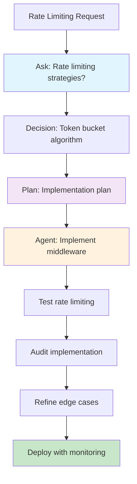

**Step-by-step:**

```
# Phase 1: Ask
Ask mode: What rate limiting strategies work best for Express APIs?
Compare: token bucket, sliding window, fixed window.
Recommend for: 100 requests per 15 minutes per user.

# Phase 2: Ask
Ask mode: Should rate limits be per user, per IP, or both?
Trade-offs: accuracy vs privacy, complexity vs effectiveness.

# Phase 3: Plan
Plan mode: Plan rate limiting implementation:
- Use express-rate-limit with Redis store
- 100 requests per 15 min per authenticated user
- 50 requests per 15 min per IP (unauthenticated)
- Custom headers: X-RateLimit-Limit, X-RateLimit-Remaining
- 429 response with Retry-After header
- Skip rate limiting for health checks

Explore existing middleware setup and propose implementation.

# Phase 4: Agent
Agent mode: Implement rate limiting per the plan.
Use existing Redis configuration.

# Phase 5: Ask
Ask mode: Audit rate limiting implementation.
Check: correct limits, proper headers, skip logic, error handling.

# Phase 6: Agent (if needed)
Agent mode: Add rate limit bypass for internal services 
using API key validation.
```

### Workflow 2: Database Migration

**Scenario:** Migrate from MongoDB to PostgreSQL

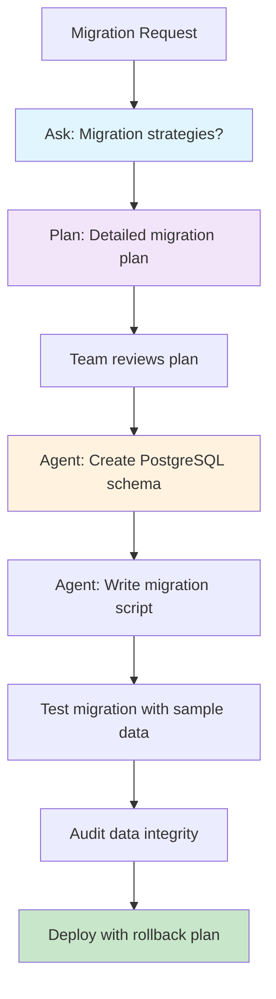

**Step-by-step:**

```
# Phase 1: Ask
Ask mode: What are the key differences between MongoDB and PostgreSQL?
How do I map MongoDB documents to relational schema?
What data type conversions are needed?

# Phase 2: Ask
Ask mode: What's the best migration strategy?
Options:
1. Big bang (stop service, migrate, restart)
2. Dual write (write to both, switch over)
3. Change data capture (sync in background)

Recommend for: 100K users, 1M documents, 2 hour maintenance window.

# Phase 3: Plan
Plan mode: Plan MongoDB to PostgreSQL migration:
- Analyze existing MongoDB schema
- Design PostgreSQL schema with proper relationships
- Create data migration script
- Plan rollback strategy
- Define testing approach
- Schedule maintenance window

Explore MongoDB models and data access patterns.

# Phase 4: Agent (multiple sessions)
Agent mode: Create PostgreSQL schema based on MongoDB models
Agent mode: Write data migration script with data transformation
Agent mode: Create rollback script
Agent mode: Add database abstraction layer for future flexibility

# Phase 5: Ask
Ask mode: Review migration plan and scripts.
Check: data integrity, performance, rollback safety.

# Phase 6: Deploy
[Execute migration during maintenance window]
```

### Workflow 3: Error Handling Standardization

**Scenario:** Standardize error handling across microservices


**Step-by-step:**

```
# Phase 1: Ask
Ask mode: What are best practices for API error handling?
Should I use RFC 7807 (Problem Details for HTTP APIs)?

# Phase 2: Ask
Ask mode: Analyze current error handling in our services.
What patterns exist? What's inconsistent?

# Phase 3: Plan
Plan mode: Plan error handling standardization:
- Create base error classes (AppError, ValidationError, AuthError)
- Create error response formatter
- Create global error handling middleware
- Define error codes catalog
- Update all services to use new patterns

Explore existing error handling in 3 services.

# Phase 4: Agent
Agent mode: Create error class hierarchy in /utils/errors.js
Agent mode: Create error formatting middleware
Agent mode: Update user service to use new error handling
Agent mode: Update order service to use new error handling
Agent mode: Update payment service to use new error handling

# Phase 5: Ask
Ask mode: Verify all services return consistent error format.
Check: structure, error codes, HTTP status codes, messages.

# Phase 6: Agent
Agent mode: Add error code documentation and examples
```

### Workflow 4: Logging and Monitoring Setup

**Scenario:** Add comprehensive logging and monitoring

```
# Phase 1: Ask
Ask mode: What should I log in a production Express API?
Explain log levels, structured logging, and what to log/not log.

# Phase 2: Ask
Ask mode: Compare logging libraries: Winston, Bunyan, Pino.
Which is best for: performance, structured logging, 
JSON output, log rotation?

# Phase 3: Plan
Plan mode: Plan logging and monitoring setup:
- Structured JSON logging with Pino
- Log levels: error, warn, info, debug
- Correlation IDs for request tracing
- Log rotation and archiving
- Integration with monitoring (Datadog/CloudWatch)
- Sensitive data redaction

Explore existing logging (if any) and infrastructure.

# Phase 4: Agent
Agent mode: Set up Pino logger with configuration
Agent mode: Add correlation ID middleware
Agent mode: Add logging to auth flow
Agent mode: Add logging to API routes
Agent mode: Configure log rotation
Agent mode: Add monitoring integration

# Phase 5: Ask
Ask mode: Review logging implementation.
Check: no sensitive data logged, appropriate log levels,
correlation IDs present, performance impact minimal.

# Phase 6: Agent
Agent mode: Add log aggregation dashboard configuration
```

---

## 12. 🔹 Best Practices Checklist

Use this checklist to ensure you're using Copilot effectively.

### Before Starting Any Task

- [ ] **Choose the right mode**: Ask for learning, Plan for complex features, Agent for implementation
- [ ] **Scope your context**: Use specific `@` mentions instead of broad `@workspace`
- [ ] **Clarify requirements**: Use Ask Mode to resolve ambiguities before implementing
- [ ] **Check for existing patterns**: Use `@workspace` or `@file` to find similar code

### During Implementation

- [ ] **Follow the plan**: If using Plan Mode, implement exactly as planned
- [ ] **One thing at a time**: Don't batch unrelated changes
- [ ] **Set constraints**: Explicitly state what NOT to change
- [ ] **Reference patterns**: Point to existing code to maintain consistency
- [ ] **Iterate in small steps**: Implement → Audit → Refine → Repeat

### After Implementation

- [ ] **Always audit**: Use Ask Mode to review against plan
- [ ] **Run tests**: Verify functionality with test suite
- [ ] **Check edge cases**: Ask Mode can help identify missed scenarios
- [ ] **Review security**: Look for vulnerabilities, especially with auth/data
- [ ] **Document decisions**: Save important choices to a decisions log

### Common Anti-Patterns to Avoid

- [ ] **Don't**: Use Agent Mode for explanations
- [ ] **Don't**: Skip Plan Mode on multi-file features
- [ ] **Don't**: Treat plans as final without reading
- [ ] **Don't**: Patch wrong plans (revise instead)
- [ ] **Don't**: Skip audits
- [ ] **Don't**: Use vague prompts
- [ ] **Don't**: Ask for too much in one prompt
- [ ] **Don't**: Ignore clarifying questions from Plan Mode

### Efficiency Checklist

- [ ] **Scoped queries**: Using `@file` or `@editor` instead of `@workspace`
- [ ] **Reused context**: Extracted and reused summaries
- [ ] **Explicit references**: Referenced previous discussions with `@chat`
- [ ] **Incremental work**: Broke large features into phases
- [ ] **Saved decisions**: Documented important choices
- [ ] **Proper mode usage**: Right mode for each task

### Quality Checklist

- [ ] **Matches requirements**: Implementation meets original requirements
- [ ] **Follows patterns**: Code style matches existing codebase
- [ ] **Handles errors**: Proper error handling implemented
- [ ] **Tested**: Tests pass, edge cases covered
- [ ] **Secure**: No vulnerabilities, follows security best practices
- [ ] **Performant**: No obvious performance issues
- [ ] **Maintainable**: Code is readable and well-structured
- [ ] **Documented**: Complex logic has comments

---

## Quick Reference Card

Print this or keep it handy while working with Copilot.

### Mode Selection (30-Second Test)

```
Need to write/change code?
├─ Yes → Know exactly what/where?
│  ├─ Yes → Agent Mode (skip Plan)
│  └─ No → Plan Mode first
└─ No → Ask Mode
```

### `@` Mentions Quick Guide

| Need | Use | Example |
|---|---|---|
| Understand project structure | `@workspace` | `@workspace explain auth architecture` |
| Understand specific file | `@file` | `@file auth.js explain middleware` |
| Refactor code snippet | `@editor` | `@editor refactor to async/await` |
| Debug error | `@terminal` | `@terminal explain this error` |
| Continue conversation | `@chat` | `@chat continue with refresh tokens` |
| Data/ML work | `@notebook` | `@notebook optimize this query` |

### The 6-Phase Workflow

```
1. Ask: Understand concept
2. Ask: Clear doubts/decisions
3. Plan: Structure implementation (if complex)
4. Agent: Implement
5. Ask: Audit
6. Agent: Refine (if needed)
```

### Common Prompt Patterns

**Ask Mode:**
- "Explain [concept] in context of [tech stack]"
- "Compare [A] vs [B] for [use case]"
- "Review this code for [concerns]"

**Plan Mode:**
- "Plan [feature] with requirements: [list]"
- "Explore [files] and propose [solution]"
- "Outline steps to [achieve goal]"

**Agent Mode:**
- "Implement the plan from [file]"
- "Add [feature] to [file] with constraints: [list]"
- "Fix [issue] in [file] without changing [X]"

---

## Conclusion

Mastering GitHub Copilot in VS Code is about using the **right mode at the right time** with the **right context**.

**The Core Principles:**

1. **Ask Mode** → Learn and understand before doing
2. **Plan Mode** → Structure complex work before implementing
3. **Agent Mode** → Execute with precision and constraints
4. **@ Mentions** → Control context for better responses
5. **Iteration** → Implement, audit, refine, repeat

**The Golden Rules:**

- ✅ Start with Ask Mode for learning and decisions
- ✅ Use Plan Mode for anything touching 3+ files
- ✅ Always audit Agent Mode output
- ✅ Scope context with `@` mentions
- ✅ Be specific and constrained in prompts
- ❌ Don't use Agent Mode for explanations
- ❌ Don't skip audits
- ❌ Don't treat plans as final without reading
- ❌ Don't use vague prompts

**Remember:** Copilot is a powerful tool, but you're the architect. Use it to amplify your expertise, not replace your judgment. The best results come from **human direction + AI execution**.

---

## Resources

### Official Documentation
- [GitHub Copilot Docs](https://docs.github.com/en/copilot)
- [VS Code Copilot Guide](https://code.visualstudio.com/docs/editor/github-copilot)
- [Copilot Modes Explained](https://docs.github.com/en/copilot/how-tos/use-copilot-agents/using-plan-mode)

### Further Learning
- Practice the 6-phase workflow on small features first
- Experiment with different `@` mention combinations
- Build your own prompt template library
- Share workflows with your team

### Community
- GitHub Copilot discussions
- VS Code community forums
- Developer blogs and tutorials

---

**Happy coding with your AI-powered assistant!** 🚀

*Master the modes, control the context, and build better software faster.*