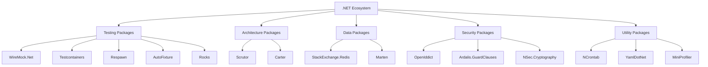
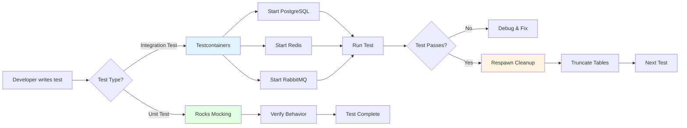
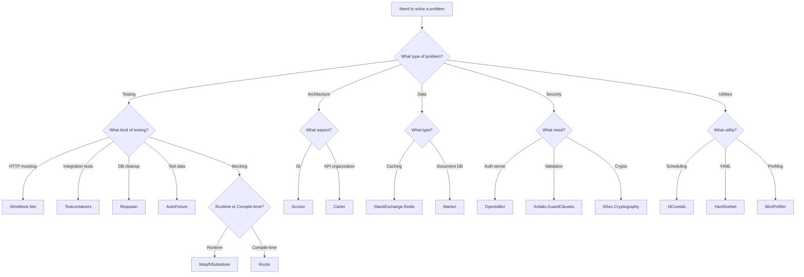

# 15 Underrated .NET Packages That Will Transform Your Development Workflow

**Author:** Gulam Ali H. (Content adapted and enhanced)  
**Last Updated:** January 2026  
**Reading Time:** 25-30 minutes  
**Difficulty Level:** Intermediate  
**Category:** .NET Development

---

## Table of Contents

1. [Introduction](#introduction)
2. [Prerequisites](#prerequisites)
3. [Learning Objectives](#learning-objectives)
4. [The .NET Package Ecosystem](#the-net-package-ecosystem)
5. [Testing & Mocking Packages](#testing--mocking-packages)
   - [WireMock.Net](#1-wiremocknet)
   - [Testcontainers](#2-testcontainers)
   - [Respawn](#3-respawn)
   - [AutoFixture](#8-autofixture)
   - [Rocks](#11-rocks)
6. [Architecture & Organization](#architecture--organization)
   - [Scrutor](#5-scrutor)
   - [Carter](#6-carter)
7. [Data & Storage](#data--storage)
   - [StackExchange.Redis](#4-stackexchangeredis)
   - [Marten](#9-marten)
8. [Security & Validation](#security--validation)
   - [OpenIddict](#10-openiddict)
   - [Ardalis.GuardClauses](#7-ardalisguardclauses)
   - [NSec.Cryptography](#14-nseccryptography)
9. [Utilities & Tools](#utilities--tools)
   - [NCrontab](#12-ncrontab)
   - [YamlDotNet](#13-yamldotnet)
   - [MiniProfiler](#15-miniprofiler)
10. [Real-World Implementation Example](#real-world-implementation-example)
11. [Package Selection Guide](#package-selection-guide)
12. [Best Practices](#best-practices)
13. [Anti-Patterns to Avoid](#anti-patterns-to-avoid)
14. [Performance Considerations](#performance-considerations)
15. [Security Considerations](#security-considerations)
16. [Practice Exercises](#practice-exercises)
17. [Test Your Understanding](#test-your-understanding)
18. [Common Interview Questions](#common-interview-questions)
19. [Question Bank](#question-bank)
20. [Summary & Key Takeaways](#summary--key-takeaways)
21. [Further Reading & Resources](#further-reading--resources)

---

## Introduction

Let's be honest: most of us spend countless hours trying to write better code, cleaner architecture, faster tests, and more maintainable applications. But sometimes the biggest productivity boost doesn't come from writing better code—it comes from writing **less** of it.

The .NET ecosystem contains thousands of libraries covering nearly every problem you can imagine, yet most developers end up using the same handful of packages on every project. Meanwhile, there are plenty of incredibly useful libraries that quietly solve problems you'd otherwise spend hours building yourself.

> **💡 Key Insight:** Becoming a better developer isn't just about learning new frameworks or language features. It's also about discovering the tools that make everyday development simpler.

This comprehensive guide explores 15 underrated .NET packages that can save you hundreds of lines of code, reduce complexity, and help you build better applications faster. Whether you're building APIs, writing integration tests, working with data, or improving application performance, there's something here for your next project.

### What Makes a Package "Underrated"?

A package becomes underrated when it:
- Solves a common problem elegantly
- Has excellent documentation but low marketing
- Gets overshadowed by more popular alternatives
- Remains unknown to developers who would benefit from it most

---

## Prerequisites

Before diving into this tutorial, ensure you have:

- **.NET 6.0+ SDK** installed (preferably .NET 8.0 or later)
- **Basic C# knowledge** (intermediate level recommended)
- **Understanding of dependency injection** concepts
- **Familiarity with testing** (unit tests, integration tests)
- **Docker Desktop** installed (for Testcontainers examples)
- **Visual Studio 2022+** or **Visual Studio Code** with C# extensions
- **PostgreSQL** (optional, for Marten examples)
- **Redis** (optional, for StackExchange.Redis examples)

### Environment Setup

```bash
# Verify .NET installation
dotnet --version

# Verify Docker installation
docker --version

# Create a test project
dotnet new console -n DotNetPackagesDemo
cd DotNetPackagesDemo
```

---

## Learning Objectives

By the end of this tutorial, you will:

✅ Understand the purpose and benefits of 15 underrated .NET packages  
✅ Know how to integrate each package into real-world projects  
✅ Be able to choose the right package for specific scenarios  
✅ Implement testing strategies using WireMock.Net, Testcontainers, and Respawn  
✅ Set up clean architecture with Scrutor and Carter  
✅ Implement security best practices with OpenIddict and NSec.Cryptography  
✅ Profile and optimize application performance with MiniProfiler  
✅ Avoid common pitfalls and anti-patterns  
✅ Write cleaner, more maintainable code with guard clauses and AutoFixture  
✅ Make informed decisions about package selection for future projects  

---

## The .NET Package Ecosystem

### Understanding the Package Landscape

The .NET ecosystem has evolved significantly over the years. With the introduction of .NET Core (now .NET 5+), cross-platform development, and the consolidation of frameworks, the package ecosystem has grown exponentially.



**Figure 1: .NET Package Ecosystem Overview**

### Why Package Selection Matters

Choosing the right packages can dramatically impact your project's success:

| Aspect | Impact |
|--------|--------|
| **Development Speed** | Reduces boilerplate and accelerates delivery |
| **Code Quality** | Leverages battle-tested solutions |
| **Maintainability** | Standardizes patterns across codebase |
| **Performance** | Optimized implementations vs. custom solutions |
| **Security** | Expert-level implementations vs. risky custom code |

---

## Testing & Mocking Packages

Testing is where many of these packages shine brightest. Let's explore the testing packages that will revolutionize how you write and maintain tests.

---

### 1. WireMock.Net

#### What is WireMock.Net?

WireMock.Net is a lightweight HTTP mocking server for .NET, inspired by the Java-based WireMock library. It allows you to spin up a mock HTTP server that behaves like a real API, enabling you to define request matching, custom responses, delays, status codes, and headers.

#### The Problem It Solves

Testing code that depends on external APIs is rarely straightforward. You either:
- Rely on live services that can be slow or unreliable
- Build custom mocks that become difficult to maintain

WireMock.Net provides a third option: a fully controlled mock server that behaves like a real API.

#### Installation

```bash
dotnet add package WireMock.Net.StandAlone
```

#### Basic Usage

**❌ Incorrect Approach: Hardcoded HTTP Clients**

```csharp
// This approach is brittle and hard to maintain
public class PaymentService
{
    private readonly HttpClient _httpClient;
    
    public PaymentService()
    {
        // Hardcoded URL - bad practice
        _httpClient = new HttpClient 
        { 
            BaseAddress = new Uri("https://api.payments.com") 
        };
    }
    
    public async Task<PaymentResult> ProcessPayment(decimal amount)
    {
        // No way to mock this in tests without hitting real API
        var response = await _httpClient.PostAsync("/charge", 
            new StringContent(JsonSerializer.Serialize(new { amount })));
        return JsonSerializer.Deserialize<PaymentResult>(await response.Content.ReadAsStringAsync());
    }
}
```

**✅ Correct Approach: WireMock.Net with Dependency Injection**

```csharp
// WireMockServer.cs
using WireMock.RequestBuilders;
using WireMock.ResponseBuilders;
using WireMock.Server;

public class PaymentApiMock : IDisposable
{
    public WireMockServer Server { get; }
    
    public PaymentApiMock()
    {
        Server = WireMockServer.Start(9090);
        
        // Configure mock endpoints
        Server.Given(Request.Create().WithPath("/charge").UsingPost())
            .RespondWith(Response.Create()
                .WithStatusCode(200)
                .WithHeader("Content-Type", "application/json")
                .WithBody(@"{ ""transactionId"": ""12345"", ""status"": ""success"" }"));
    }
    
    public void Dispose()
    {
        Server?.Stop();
        Server?.Dispose();
    }
}

// PaymentService.cs (refactored)
public class PaymentService
{
    private readonly HttpClient _httpClient;
    
    public PaymentService(HttpClient httpClient)
    {
        _httpClient = httpClient;
    }
    
    public async Task<PaymentResult> ProcessPayment(decimal amount)
    {
        var response = await _httpClient.PostAsync("/charge",
            new StringContent(JsonSerializer.Serialize(new { amount })));
        
        response.EnsureSuccessStatusCode();
        
        return JsonSerializer.Deserialize<PaymentResult>(
            await response.Content.ReadAsStringAsync())!;
    }
}

// Program.cs
var builder = WebApplication.CreateBuilder(args);

// Register WireMock
var paymentMock = new PaymentApiMock();
builder.Services.AddSingleton(paymentMock);

// Register HttpClient with mock base address
builder.Services.AddHttpClient<PaymentService>(client =>
{
    client.BaseAddress = new Uri("http://localhost:9090");
});

var app = builder.Build();
```

#### Advanced Features

**Request Matching:**

```csharp
// Match by header
Server.Given(Request.Create()
        .WithPath("/api/users")
        .WithHeader("Authorization", "Bearer valid-token")
        .UsingGet())
    .RespondWith(Response.Create()
        .WithStatusCode(200)
        .WithBody(@"[{ ""id"": 1, ""name"": ""John"" }]"));

// Match by body content
Server.Given(Request.Create()
        .WithPath("/api/users")
        .WithBody(new { name = "John", age = 30 })
        .UsingPost())
    .RespondWith(Response.Create()
        .WithStatusCode(201));

// Match using JSONPath
Server.Given(Request.Create()
        .WithPath("/api/search")
        .WithParam("q", "test")
        .UsingGet())
    .RespondWith(Response.Create()
        .WithStatusCode(200));
```

**Simulating Failures and Delays:**

```csharp
// Simulate 500 error
Server.Given(Request.Create().WithPath("/api/error").UsingGet())
    .RespondWith(Response.Create()
        .WithStatusCode(500)
        .WithBody(@"{ ""error"": ""Internal Server Error"" }"));

// Simulate network delay
Server.Given(Request.Create().WithPath("/api/slow").UsingGet())
    .RespondWith(Response.Create()
        .WithStatusCode(200)
        .WithDelay(TimeSpan.FromSeconds(2)));

// Simulate timeout
Server.Given(Request.Create().WithPath("/api/timeout").UsingGet())
    .RespondWith(Response.Create()
        .WithStatusCode(408)
        .WithDelay(TimeSpan.FromSeconds(30)));
```

#### Real-World Use Case: Testing Payment Processing

```csharp
[Test]
public async Task ProcessPayment_WithValidAmount_ReturnsSuccess()
{
    // Arrange
    var mock = new PaymentApiMock();
    var services = new ServiceCollection();
    
    services.AddHttpClient<PaymentService>(client =>
    {
        client.BaseAddress = new Uri("http://localhost:9090");
    });
    
    var serviceProvider = services.BuildServiceProvider();
    var paymentService = serviceProvider.GetRequiredService<PaymentService>();
    
    // Act
    var result = await paymentService.ProcessPayment(100.00m);
    
    // Assert
    Assert.That(result.Status, Is.EqualTo("success"));
    Assert.That(result.TransactionId, Is.Not.Null);
    
    mock.Dispose();
}
```

#### Best Practices

✅ **DO:**
- Use WireMock for integration tests involving external APIs
- Define realistic response scenarios
- Test both success and failure cases
- Clean up mock servers after tests
- Use request matching to simulate different API behaviors

❌ **DON'T:**
- Use WireMock for unit tests (use mocks instead)
- Hardcode URLs in production code
- Forget to dispose of mock servers
- Create overly complex mock scenarios

#### Performance Considerations

- WireMock.Net is lightweight and starts in milliseconds
- Minimal memory footprint for simple scenarios
- Can handle thousands of requests per second
- Consider using WireMock.Server (standalone) for better performance in load tests

---

### 2. Testcontainers

#### What is Testcontainers?

Testcontainers for .NET is a library that supports tests with throwaway instances of Docker containers. It spins up real Docker containers as part of your test suite, ensuring every test runs against a clean, predictable environment.

#### The Problem It Solves

Integration tests are only as good as the environment they run against. Common issues include:
- Shared test databases becoming inconsistent
- Local environments drifting over time
- CI pipelines requiring extra configuration
- "It works on my machine" syndrome

Testcontainers solves this by providing fresh, isolated environments for each test.

#### Installation

```bash
dotnet add package Testcontainers
dotnet add package Testcontainers.PostgreSql  # For PostgreSQL
dotnet add package Testcontainers.Redis      # For Redis
dotnet add package Testcontainers.RabbitMq   # For RabbitMQ
```

#### Basic Usage

**❌ Incorrect Approach: Shared Test Database**

```csharp
// This approach leads to test pollution and flaky tests
public class UserRepositoryTests
{
    private readonly string _connectionString = 
        "Server=localhost;Database=TestDb;User Id=sa;Password=Test123!;";
    
    [Test]
    public async Task AddUser_ShouldInsertUser()
    {
        // Test 1 inserts data
        var repo = new UserRepository(_connectionString);
        await repo.AddAsync(new User { Name = "Test User" });
        
        // Test 2 might fail if it expects empty database
        var users = await repo.GetAllAsync();
        Assert.That(users.Count, Is.EqualTo(0)); // ❌ Fails!
    }
}
```

**✅ Correct Approach: Testcontainers with Fresh Database**

```csharp
[Test]
public async Task AddUser_ShouldInsertUser()
{
    // Arrange - Start fresh PostgreSQL container
    await using var postgres = new PostgreSqlBuilder()
        .WithImage("postgres:15")
        .WithDatabase("testdb")
        .WithUsername("testuser")
        .WithPassword("testpass")
        .Build();
    
    await postgres.StartAsync();
    
    var connectionString = postgres.GetConnectionString();
    var repo = new UserRepository(connectionString);
    
    // Ensure database is created
    await repo.CreateDatabaseAsync();
    
    // Act
    await repo.AddAsync(new User { Name = "Test User" });
    var users = await repo.GetAllAsync();
    
    // Assert
    Assert.That(users.Count, Is.EqualTo(1));
    Assert.That(users[0].Name, Is.EqualTo("Test User"));
    
    // Container automatically disposed after test
}
```

#### Supported Containers

Testcontainers supports dozens of services:

| Container | Package | Use Case |
|-----------|---------|----------|
| PostgreSQL | Testcontainers.PostgreSql | Relational database testing |
| SQL Server | Testcontainers.MsSql | SQL Server integration tests |
| Redis | Testcontainers.Redis | Caching and session storage |
| RabbitMQ | Testcontainers.RabbitMq | Message queue testing |
| MongoDB | Testcontainers.MongoDb | NoSQL database testing |
| Elasticsearch | Testcontainers.Elasticsearch | Search and analytics |
| Kafka | Testcontainers.Kafka | Event streaming tests |

#### Advanced Configuration

```csharp
// Custom container configuration
await using var postgres = new PostgreSqlBuilder()
    .WithImage("postgres:15-alpine")  // Use Alpine for smaller image
    .WithDatabase("testdb")
    .WithUsername("testuser")
    .WithPassword("testpass")
    .WithPortBinding(5432, true)  // Random host port
    .WithEnvironment("POSTGRES_INITDB_ARGS", "--data-checksums")
    .WithWaitStrategy(Wait.ForUnixContainer()
        .UntilPortIsAvailable(5432))
    .Build();

await postgres.StartAsync();

// Access connection details
var connectionString = postgres.GetConnectionString();
var hostname = postgres.Hostname;
var port = postgres.GetMappedPublicPort(5432);
```

#### Real-World Use Case: Complete Integration Test Suite

```csharp
[TestFixture]
public class OrderProcessingIntegrationTests
{
    private PostgreSqlContainer _postgresContainer = null!;
    private RedisContainer _redisContainer = null!;
    private RabbitMqContainer _rabbitMqContainer = null!;
    
    [OneTimeSetUp]
    public async Task OneTimeSetup()
    {
        // Start containers once for all tests
        _postgresContainer = new PostgreSqlBuilder()
            .WithImage("postgres:15")
            .Build();
        
        _redisContainer = new RedisBuilder()
            .WithImage("redis:7-alpine")
            .Build();
        
        _rabbitMqContainer = new RabbitMqBuilder()
            .WithImage("rabbitmq:3-management")
            .Build();
        
        await Task.WhenAll(
            _postgresContainer.StartAsync(),
            _redisContainer.StartAsync(),
            _rabbitMqContainer.StartAsync());
    }
    
    [OneTimeTearDown]
    public async Task OneTimeTeardown()
    {
        // Clean up all containers
        await Task.WhenAll(
            _postgresContainer.DisposeAsync().AsTask(),
            _redisContainer.DisposeAsync().AsTask(),
            _rabbitMqContainer.DisposeAsync().AsTask());
    }
    
    [Test]
    public async Task ProcessOrder_WithValidOrder_UpdatesDatabase()
    {
        // Arrange
        var connectionString = _postgresContainer.GetConnectionString();
        var orderService = new OrderService(connectionString);
        
        // Act
        await orderService.ProcessOrderAsync(new Order { /* ... */ });
        
        // Assert
        var orders = await orderService.GetOrdersAsync();
        Assert.That(orders.Count, Is.EqualTo(1));
    }
}
```

#### Best Practices

✅ **DO:**
- Use Testcontainers for integration tests
- Start containers in OneTimeSetUp when possible
- Use specific image versions (not `latest`)
- Configure appropriate wait strategies
- Dispose containers properly

❌ **DON'T:**
- Use Testcontainers for unit tests
- Run containers in parallel without resource limits
- Forget to handle container startup failures
- Use production database credentials

#### Performance Considerations

- Container startup: 2-5 seconds per container
- Use OneTimeSetUp/OneTimeTearDown to minimize startup time
- Consider using pre-pulled images in CI/CD
- Use lightweight images (Alpine-based) when possible

---

### 3. Respawn

#### What is Respawn?

Respawn is an intelligent database reset library for integration tests. Instead of rebuilding the entire database schema between tests, it intelligently resets data by truncating tables in the correct order while respecting foreign key relationships.

#### The Problem It Solves

Database cleanup is one of the most annoying parts of integration testing:
- Manual deletion of rows is error-prone
- Recreating the database is slow
- Wrapping tests in transactions adds complexity
- Schema changes break cleanup scripts

Respawn provides a clean, fast solution that respects your database schema.

#### Installation

```bash
dotnet add package Respawn
```

#### Basic Usage

**❌ Incorrect Approach: Manual Cleanup**

```csharp
[Test]
public async Task Test1()
{
    // Insert test data
    await _dbContext.Users.AddAsync(new User { Name = "User1" });
    await _dbContext.SaveChangesAsync();
    
    // Test logic...
}

[Test]
public async Task Test2()
{
    // ❌ This test might fail because Test1 left data behind
    var users = await _dbContext.Users.ToListAsync();
    Assert.That(users.Count, Is.EqualTo(0)); // Fails!
}

// Manual cleanup approach (brittle)
private async Task CleanDatabase()
{
    await _dbContext.Database.ExecuteSqlRawAsync("DELETE FROM Orders");
    await _dbContext.Database.ExecuteSqlRawAsync("DELETE FROM Users");
    // Easy to forget tables, breaks when schema changes
}
```

**✅ Correct Approach: Respawn**

```csharp
public class DatabaseTestBase
{
    private readonly string _connectionString;
    private Respawner _respawner = null!;
    
    [OneTimeSetUp]
    public async Task OneTimeSetup()
    {
        _connectionString = "Server=localhost;Database=TestDb;...";
        
        // Initialize Respawner once
        _respawner = await Respawner.CreateAsync(
            _connectionString,
            new RespawnerOptions
            {
                TablesToIgnore = new Table[] { "__EFMigrationsHistory" },
                SchemasToInclude = new[] { "public" }
            });
    }
    
    [SetUp]
    public async Task Setup()
    {
        // Reset database before each test
        await _respawner.ResetAsync(_connectionString);
    }
    
    [Test]
    public async Task Test1()
    {
        // Database is clean
        var users = await _dbContext.Users.ToListAsync();
        Assert.That(users.Count, Is.EqualTo(0));
        
        // Insert test data
        await _dbContext.Users.AddAsync(new User { Name = "User1" });
        await _dbContext.SaveChangesAsync();
        
        // Test logic...
    }
    
    [Test]
    public async Task Test2()
    {
        // Database is clean again!
        var users = await _dbContext.Users.ToListAsync();
        Assert.That(users.Count, Is.EqualTo(0)); // ✅ Passes!
    }
}
```

#### Configuration Options

```csharp
var respawner = await Respawner.CreateAsync(
    connectionString,
    new RespawnerOptions
    {
        // Tables to exclude from cleanup
        TablesToIgnore = new[]
        {
            new Table("SchemaName", "TableName"),
            "__EFMigrationsHistory"
        },
        
        // Schemas to include (others are ignored)
        SchemasToInclude = new[] { "public", "audit" },
        
        // Schemas to completely ignore
        SchemasToExclude = new[] { "temp" },
        
        // Maximum number of retries
        MaxRetriesForConnectionLimit = 3,
        
        // Timeout for operations
        Timeout = TimeSpan.FromSeconds(30)
    });
```

#### Real-World Use Case: E-commerce Testing

```csharp
[Test]
public async Task CreateOrder_WithValidCart_CalculatesTotal()
{
    // Arrange - Database is clean
    var product = new Product { Name = "Laptop", Price = 999.99m };
    await _dbContext.Products.AddAsync(product);
    await _dbContext.SaveChangesAsync();
    
    var cart = new Cart();
    cart.AddItem(product, 2);
    
    // Act
    var orderService = new OrderService(_dbContext);
    var order = await orderService.CreateOrderFromCartAsync(cart);
    
    // Assert
    Assert.That(order.Total, Is.EqualTo(1999.98m));
    Assert.That(order.Items.Count, Is.EqualTo(1));
    
    // Next test starts with clean database automatically
}
```

#### Best Practices

✅ **DO:**
- Initialize Respawner in OneTimeSetUp
- Use Respawn for integration tests with real databases
- Configure TablesToIgnore for migration history tables
- Test with production-like database versions

❌ **DON'T:**
- Use Respawn for unit tests
- Ignore tables that contain reference data needed by tests
- Forget to handle connection failures
- Use Respawn with in-memory databases (not needed)

#### Performance Comparison

| Approach | Time per Test | Pros | Cons |
|----------|---------------|------|------|
| Manual DELETE | 100-500ms | Simple | Brittle, easy to forget tables |
| Recreate Database | 2000-5000ms | Clean slate | Very slow |
| **Respawn** | **50-200ms** | **Fast, reliable** | Requires initial setup |

---

### 4. StackExchange.Redis

#### What is StackExchange.Redis?

StackExchange.Redis is the de facto Redis client for .NET, built by the team behind Stack Overflow. It's a high-performance, feature-rich library for working with Redis, supporting everything from basic key-value operations to complex pub/sub scenarios.

#### The Problem It Solves

Redis has become essential for caching, distributed locks, pub/sub messaging, and storing short-lived data. But to get the most out of it, you need a client that's:
- Fast and reliable
- Feature-complete
- Well-maintained
- Production-proven

StackExchange.Redis delivers all of this and more.

#### Installation

```bash
dotnet add package StackExchange.Redis
```

#### Basic Usage

**❌ Incorrect Approach: Basic String Operations Only**

```csharp
// This barely scratches the surface of Redis capabilities
public class CacheService
{
    private readonly ConnectionMultiplexer _redis;
    
    public CacheService()
    {
        // ❌ Creating new connection per instance
        _redis = ConnectionMultiplexer.Connect("localhost:6379");
    }
    
    public async Task SetCache(string key, string value)
    {
        var db = _redis.GetDatabase();
        await db.StringSetAsync(key, value);
    }
}
```

**✅ Correct Approach: Production-Ready Implementation**

```csharp
// RedisConfiguration.cs
public class RedisConfiguration
{
    public string ConnectionString { get; set; } = "localhost:6379";
    public int Database { get; set; } = 0;
    public TimeSpan DefaultExpiry { get; set; } = TimeSpan.FromHours(1);
}

// RedisService.cs
public class RedisService : IRedisService, IDisposable
{
    private readonly Lazy<ConnectionMultiplexer> _lazyConnection;
    private readonly IDatabase _database;
    private bool _disposed;
    
    public RedisService(RedisConfiguration config)
    {
        // Lazy initialization for better performance
        _lazyConnection = new Lazy<ConnectionMultiplexer>(() =>
            ConnectionMultiplexer.Connect(config.ConnectionString));
        
        _database = _lazyConnection.Value.GetDatabase(config.Database);
        DefaultExpiry = config.DefaultExpiry;
    }
    
    public TimeSpan DefaultExpiry { get; }
    
    // String operations
    public async Task<string?> GetStringAsync(string key)
    {
        return await _database.StringGetAsync(key);
    }
    
    public async Task SetStringAsync(string key, string value, TimeSpan? expiry = null)
    {
        await _database.StringSetAsync(key, value, expiry ?? DefaultExpiry);
    }
    
    // Hash operations (perfect for objects)
    public async Task SetHashAsync(string key, Dictionary<string, string> hash)
    {
        var entries = hash.Select(kv => 
            new HashEntry(kv.Key, kv.Value)).ToArray();
        await _database.HashSetAsync(key, entries);
    }
    
    public async Task<Dictionary<string, string>> GetHashAsync(string key)
    {
        var entries = await _database.HashGetAllAsync(key);
        return entries.ToDictionary(
            e => e.Name.ToString()!,
            e => e.Value.ToString()!);
    }
    
    // Distributed locking
    public async Task<bool> AcquireLockAsync(string lockKey, string lockValue, TimeSpan expiry)
    {
        return await _database.StringSetAsync(
            lockKey, 
            lockValue, 
            expiry, 
            When.NotExists);
    }
    
    public async Task ReleaseLockAsync(string lockKey, string lockValue)
    {
        var script = @"
            if redis.call('get', KEYS[1]) == ARGV[1] then
                return redis.call('del', KEYS[1])
            else
                return 0
            end";
        
        await _database.ScriptEvaluateAsync(script, new RedisKey[] { lockKey }, new RedisValue[] { lockValue });
    }
    
    // Pub/Sub
    public async Task PublishAsync(string channel, string message)
    {
        var sub = _lazyConnection.Value.GetSubscriber();
        await sub.PublishAsync(channel, message);
    }
    
    public async Task SubscribeAsync(string channel, Action<string> handler)
    {
        var sub = _lazyConnection.Value.GetSubscriber();
        await sub.SubscribeAsync(channel, (channel, value) =>
        {
            handler(value.ToString()!);
        });
    }
    
    public void Dispose()
    {
        if (!_disposed && _lazyConnection.IsValueCreated)
        {
            _lazyConnection.Value.Dispose();
            _disposed = true;
        }
    }
}

// Program.cs registration
builder.Services.AddSingleton<RedisService>();
```

#### Advanced Features

**Caching with Cache-Aside Pattern:**

```csharp
public class ProductService
{
    private readonly IRedisService _cache;
    private readonly IProductRepository _repository;
    
    public async Task<Product?> GetProductAsync(int id)
    {
        // Try cache first
        var cacheKey = $"product:{id}";
        var cached = await _cache.GetStringAsync(cacheKey);
        
        if (!string.IsNullOrEmpty(cached))
        {
            return JsonSerializer.Deserialize<Product>(cached);
        }
        
        // Cache miss - fetch from database
        var product = await _repository.GetByIdAsync(id);
        
        if (product != null)
        {
            // Cache for 1 hour
            await _cache.SetStringAsync(
                cacheKey, 
                JsonSerializer.Serialize(product),
                TimeSpan.FromHours(1));
        }
        
        return product;
    }
    
    public async Task InvalidateProductCacheAsync(int id)
    {
        await _cache.DeleteAsync($"product:{id}");
    }
}
```

**Pub/Sub for Real-Time Notifications:**

```csharp
// Publisher
public class NotificationService
{
    private readonly IRedisService _redis;
    
    public async Task SendNotificationAsync(string userId, string message)
    {
        await _redis.PublishAsync($"notifications:{userId}", message);
    }
}

// Subscriber
public class NotificationListener : BackgroundService
{
    private readonly IRedisService _redis;
    
    protected override async Task ExecuteAsync(CancellationToken stoppingToken)
    {
        await _redis.SubscribeAsync("notifications:*", message =>
        {
            // Handle notification
            Console.WriteLine($"Received: {message}");
        });
    }
}
```

#### Real-World Use Case: Rate Limiting

```csharp
public class RateLimiter
{
    private readonly IRedisService _redis;
    
    public async Task<bool> IsRateLimitedAsync(string userId, int maxRequests, TimeSpan window)
    {
        var key = $"ratelimit:{userId}";
        var current = await _redis.GetStringAsync(key);
        
        if (current == null)
        {
            await _redis.SetStringAsync(key, "1", window);
            return false;
        }
        
        if (int.Parse(current) >= maxRequests)
        {
            return true; // Rate limited
        }
        
        await _redis.IncrementAsync(key);
        return false;
    }
}
```

#### Best Practices

✅ **DO:**
- Use a single ConnectionMultiplexer instance (singleton)
- Use connection pooling via ConnectionMultiplexer.Connect
- Implement proper error handling and retry logic
- Use appropriate data structures (strings, hashes, lists)
- Set expiration times on cached data

❌ **DON'T:**
- Create new connections per request
- Store large objects in Redis
- Forget to handle connection failures
- Use Redis as primary data store (it's a cache)

#### Performance Considerations

- ConnectionMultiplexer is thread-safe and designed to be shared
- Supports pipelining for batch operations
- Use Lua scripts for atomic operations
- Consider connection multiplexing for high-throughput scenarios

---

### 5. Scrutor

#### What is Scrutor?

Scrutor is a library that extends the built-in .NET dependency injection container with assembly scanning and service decoration capabilities. It eliminates the need to manually register every service, reducing boilerplate and improving maintainability.

#### The Problem It Solves

As applications grow, so does the number of services registered with dependency injection. Before long, your Program.cs is filled with dozens of repetitive `AddScoped`, `AddTransient`, and `AddSingleton` calls.

Scrutor automates this process by scanning assemblies and applying conventions.

#### Installation

```bash
dotnet add package Scrutor
```

#### Basic Usage

**❌ Incorrect Approach: Manual Registration**

```csharp
// Program.cs - becomes unmaintainable quickly
var builder = WebApplication.CreateBuilder(args);

builder.Services.AddScoped<IUserService, UserService>();
builder.Services.AddScoped<IOrderService, OrderService>();
builder.Services.AddScoped<IProductService, ProductService>();
builder.Services.AddScoped<ICustomerService, CustomerService>();
builder.Services.AddScoped<IInvoiceService, InvoiceService>();
builder.Services.AddScoped<IShippingService, ShippingService>();
// ... 50 more lines like this

var app = builder.Build();
```

**✅ Correct Approach: Assembly Scanning**

```csharp
// Program.cs - clean and maintainable
var builder = WebApplication.CreateBuilder(args);

// Scan assembly and register all services automatically
builder.Services.Scan(scan => scan
    .FromAssemblyOf<IUserService>()  // Start from this assembly
    .AddClasses(classes => classes.InNamespaces("MyApp.Services"))
    .AsImplementedInterfaces()
    .WithScopedLifetime());

var app = builder.Build();
```

#### Advanced Features

**Convention-Based Registration:**

```csharp
builder.Services.Scan(scan => scan
    .FromAssemblyOf<IUserService>()
    
    // Register all classes ending with "Service"
    .AddClasses(classes => classes.Where(type => type.Name.EndsWith("Service")))
    .AsImplementedInterfaces()
    .WithScopedLifetime()
    
    // Register all classes ending with "Repository"
    .AddClasses(classes => classes.Where(type => type.Name.EndsWith("Repository")))
    .AsImplementedInterfaces()
    .WithTransientLifetime()
    
    // Register all classes ending with "Handler"
    .AddClasses(classes => classes.Where(type => type.Name.EndsWith("Handler")))
    .AsSelf()
    .WithSingletonLifetime());
```

**Service Decoration:**

```csharp
// Decorator pattern for cross-cutting concerns
public interface ICacheService
{
    Task<string?> GetAsync(string key);
    Task SetAsync(string key, string value, TimeSpan expiry);
}

// Implementation
public class CacheService : ICacheService
{
    public Task<string?> GetAsync(string key) => /* ... */;
    public Task SetAsync(string key, string value, TimeSpan expiry) => /* ... */;
}

// Decorator
public class CachedServiceDecorator : ICacheService
{
    private readonly ICacheService _inner;
    private readonly IRedisService _redis;
    
    public CachedServiceDecorator(ICacheService inner, IRedisService redis)
    {
        _inner = inner;
        _redis = redis;
    }
    
    public async Task<string?> GetAsync(string key)
    {
        // Try cache first
        var cached = await _redis.GetStringAsync(key);
        if (cached != null) return cached;
        
        // Fallback to inner service
        var result = await _inner.GetAsync(key);
        
        if (result != null)
        {
            await _redis.SetStringAsync(key, result, TimeSpan.FromHours(1));
        }
        
        return result;
    }
    
    public Task SetAsync(string key, string value, TimeSpan expiry)
    {
        return _inner.SetAsync(key, value, expiry);
    }
}

// Register decorator
builder.Services.Decorate<ICacheService, CachedServiceDecorator>();
```

**Conditional Registration:**

```csharp
builder.Services.Scan(scan => scan
    .FromAssemblyOf<IUserService>()
    .AddClasses(classes => classes.Where(type => 
        type.GetCustomAttribute<ScopedAttribute>() != null))
    .AsImplementedInterfaces()
    .WithScopedLifetime()
    
    .AddClasses(classes => classes.Where(type => 
        type.GetCustomAttribute<TransientAttribute>() != null))
    .AsImplementedInterfaces()
    .WithTransientLifetime());
```

#### Real-World Use Case: Modular Application Architecture

```csharp
// Application structure
// MyApp/
//   Services/
//     UserService.cs
//     OrderService.cs
//     ProductService.cs
//   Repositories/
//     UserRepository.cs
//     OrderRepository.cs
//   Handlers/
//     CreateUserHandler.cs
//     UpdateOrderHandler.cs

// Program.cs
builder.Services.Scan(scan => scan
    .FromAssemblyOf<UserService>()
    
    // Services
    .AddClasses(classes => classes.InNamespace("MyApp.Services"))
    .AsImplementedInterfaces()
    .WithScopedLifetime()
    
    // Repositories
    .AddClasses(classes => classes.InNamespace("MyApp.Repositories"))
    .AsImplementedInterfaces()
    .WithScopedLifetime()
    
    // Handlers (as self)
    .AddClasses(classes => classes.InNamespace("MyApp.Handlers"))
    .AsSelf()
    .WithTransientLifetime());
```

#### Best Practices

✅ **DO:**
- Use Scrutor for large applications with many services
- Define clear naming conventions
- Use decorators for cross-cutting concerns (logging, caching, validation)
- Combine with interface segregation principles

❌ **DON'T:**
- Over-scan assemblies (be specific about what to scan)
- Register everything automatically without conventions
- Forget to test that services are registered correctly
- Use Scrutor for small applications (manual registration is fine)

#### Performance Considerations

- Assembly scanning happens once at startup
- Minimal runtime overhead
- Faster than manual registration for large applications
- Consider caching scan results for very large applications

---

### 6. Carter

#### What is Carter?

Carter is a framework that provides a thin layer of extension methods over ASP.NET Core, allowing you to organize minimal APIs into modular endpoint groups. It keeps related routes together and makes your application easier to navigate.

#### The Problem It Solves

Minimal APIs have made building HTTP endpoints cleaner, but as projects grow, all endpoint mappings end up scattered throughout Program.cs. Carter solves this by enabling modular organization.

#### Installation

```bash
dotnet add package Carter
```

#### Basic Usage

**❌ Incorrect Approach: Monolithic Program.cs**

```csharp
// Program.cs - becomes unwieldy quickly
var builder = WebApplication.CreateBuilder(args);
var app = builder.Build();

// User endpoints
app.MapGet("/api/users", async (UserService service) => 
    await service.GetAllAsync());
app.MapPost("/api/users", async (UserService service, User user) => 
    await service.CreateAsync(user));
app.MapGet("/api/users/{id}", async (UserService service, int id) => 
    await service.GetByIdAsync(id));
app.MapPut("/api/users/{id}", async (UserService service, int id, User user) => 
    await service.UpdateAsync(id, user));
app.MapDelete("/api/users/{id}", async (UserService service, int id) => 
    await service.DeleteAsync(id));

// Order endpoints
app.MapGet("/api/orders", async (OrderService service) => 
    await service.GetAllAsync());
app.MapPost("/api/orders", async (OrderService service, Order order) => 
    await service.CreateAsync(order));
// ... 100 more lines

app.Run();
```

**✅ Correct Approach: Modular Carter Endpoints**

```csharp
// UsersModule.cs
public class UsersModule : CarterModule
{
    public override void AddRoutes(IEndpointRouteBuilder app)
    {
        // Group routes under /api/users
        app.MapGet("/api/users", async (UserService service) => 
            await service.GetAllAsync())
            .WithName("GetUsers")
            .WithTags("Users");
        
        app.MapPost("/api/users", async (UserService service, User user) => 
            await service.CreateAsync(user))
            .WithName("CreateUser")
            .WithTags("Users");
        
        app.MapGet("/api/users/{id}", async (UserService service, int id) => 
        {
            var user = await service.GetByIdAsync(id);
            return user is not null ? Results.Ok(user) : Results.NotFound();
        })
        .WithName("GetUserById")
        .WithTags("Users");
        
        app.MapPut("/api/users/{id}", async (UserService service, int id, User user) => 
            await service.UpdateAsync(id, user))
            .WithName("UpdateUser")
            .WithTags("Users");
        
        app.MapDelete("/api/users/{id}", async (UserService service, int id) => 
            await service.DeleteAsync(id))
            .WithName("DeleteUser")
            .WithTags("Users");
    }
}

// OrdersModule.cs
public class OrdersModule : CarterModule
{
    public override void AddRoutes(IEndpointRouteBuilder app)
    {
        app.MapGet("/api/orders", async (OrderService service) => 
            await service.GetAllAsync());
        
        app.MapPost("/api/orders", async (OrderService service, Order order) => 
            await service.CreateAsync(order));
    }
}

// Program.cs - clean and organized
var builder = WebApplication.CreateBuilder(args);
builder.Services.AddCarter();  // Add Carter
var app = builder.Build();
app.MapCarter();  // Use Carter
app.Run();
```

#### Advanced Features

**Module Organization:**

```csharp
// Modules/Users/
//   GetUsers.cs
//   CreateUser.cs
//   GetUserById.cs

// GetUsers.cs
public class GetUsers : CarterModule
{
    public override void AddRoutes(IEndpointRouteBuilder app)
    {
        app.MapGet("/api/users", async (UserService service) => 
            await service.GetAllAsync());
    }
}

// Program.cs
app.MapCarter();  // Automatically discovers all modules
```

**Dependency Injection:**

```csharp
public class CreateUser : CarterModule
{
    public override void AddRoutes(IEndpointRouteBuilder app)
    {
        app.MapPost("/api/users", async (
            UserService service,  // Injected automatically
            IValidator<User> validator,  // FluentValidation
            User user) => 
        {
            // Validation
            var validationResult = await validator.ValidateAsync(user);
            if (!validationResult.IsValid)
            {
                return Results.ValidationProblem(validationResult.Errors);
            }
            
            var createdUser = await service.CreateAsync(user);
            return Results.Created($"/api/users/{createdUser.Id}", createdUser);
        });
    }
}
```

**Route Grouping with Tags:**

```csharp
public class UsersModule : CarterModule
{
    public override void AddRoutes(IEndpointRouteBuilder app)
    {
        var group = app.MapGroup("/api/users")
            .WithTags("Users")
            .WithOpenApi();
        
        group.MapGet("/", async (UserService service) => 
            await service.GetAllAsync());
        
        group.MapGet("/{id}", async (UserService service, int id) => 
            await service.GetByIdAsync(id));
        
        group.MapPost("/", async (UserService service, User user) => 
            await service.CreateAsync(user));
    }
}
```

#### Real-World Use Case: E-commerce API

```
Project Structure:
/Modules
  /Users
    - UsersModule.cs
    - GetUsers.cs
    - CreateUser.cs
    - GetUserById.cs
  /Products
    - ProductsModule.cs
    - GetProducts.cs
    - CreateProduct.cs
  /Orders
    - OrdersModule.cs
    - CreateOrder.cs
    - GetOrderById.cs
  /Payments
    - PaymentsModule.cs
    - ProcessPayment.cs
```

```csharp
// Program.cs
var builder = WebApplication.CreateBuilder(args);

// Add services
builder.Services.AddCarter();
builder.Services.AddScoped<UserService>();
builder.Services.AddScoped<ProductService>();
builder.Services.AddScoped<OrderService>();

var app = builder.Build();

// Configure middleware
app.UseHttpsRedirection();
app.UseAuthorization();

// Map all Carter modules
app.MapCarter();

app.Run();
```

#### Best Practices

✅ **DO:**
- Organize endpoints by feature/resource
- Use separate files for complex endpoints
- Leverage dependency injection
- Use route grouping for related endpoints
- Add OpenAPI/Swagger documentation

❌ **DON'T:**
- Put all endpoints in one file
- Mix different resources in one module
- Forget to add proper HTTP status codes
- Skip input validation

#### Performance Considerations

- Minimal overhead compared to raw minimal APIs
- Same performance characteristics as standard minimal APIs
- Route discovery happens at startup
- No runtime reflection for endpoint resolution

---

## Architecture & Organization

---

### 7. Ardalis.GuardClauses

#### What is Ardalis.GuardClauses?

Ardalis.GuardClauses is a library that provides a collection of reusable guard clauses for parameter validation. It simplifies defensive programming by replacing repetitive if-statements with expressive, chainable guard clauses.

#### The Problem It Solves

Validating method arguments is something every application does, but the code is often repetitive:
- Null checks
- Empty strings
- Invalid ranges
- Out-of-range values

This validation logic buries business logic beneath walls of if-statements.

#### Installation

```bash
dotnet add package Ardalis.GuardClauses
```

#### Basic Usage

**❌ Incorrect Approach: Manual Validation**

```csharp
public class OrderService
{
    public async Task<Order> CreateOrderAsync(Customer customer, List<OrderItem> items, decimal discount)
    {
        // ❌ Repetitive validation code everywhere
        if (customer == null)
            throw new ArgumentNullException(nameof(customer));
        
        if (string.IsNullOrWhiteSpace(customer.Email))
            throw new ArgumentException("Email is required", nameof(customer));
        
        if (items == null)
            throw new ArgumentNullException(nameof(items));
        
        if (items.Count == 0)
            throw new ArgumentException("Order must contain at least one item", nameof(items));
        
        if (discount < 0 || discount > 100)
            throw new ArgumentOutOfRangeException(nameof(discount), "Discount must be between 0 and 100");
        
        // Business logic buried under validation
        var order = new Order(customer, items, discount);
        // ...
    }
}
```

**✅ Correct Approach: Guard Clauses**

```csharp
public class OrderService
{
    public async Task<Order> CreateOrderAsync(Customer customer, List<OrderItem> items, decimal discount)
    {
        // ✅ Clean, expressive validation
        Guard.Against.Null(customer, nameof(customer));
        Guard.Against.NullOrWhiteSpace(customer.Email, nameof(customer.Email));
        Guard.Against.Null(items, nameof(items));
        Guard.Against.Empty(items, nameof(items));
        Guard.Against.OutOfRange(discount, nameof(discount), 0, 100);
        
        // Business logic is now clear and prominent
        var order = new Order(customer, items, discount);
        // ...
    }
}
```

#### Available Guard Clauses

**Null Checks:**

```csharp
Guard.Against.Null(customer, nameof(customer));
Guard.Against.NullOrEmpty(items, nameof(items));
Guard.Against.NullOrWhiteSpace(email, nameof(email));
```

**String Validation:**

```csharp
Guard.Against.NullOrWhiteSpace(email, nameof(email));
Guard.Against.InvalidFormat(email, nameof(email), @"^[^@\s]+@[^@\s]+\.[^@\s]+$", "Invalid email format");
Guard.Against.OutOfRange(email.Length, nameof(email), 5, 100);
```

**Numeric Validation:**

```csharp
Guard.Against.OutOfRange(age, nameof(age), 18, 120);
Guard.Against.Negative(quantity, nameof(quantity));
Guard.Against.NegativeOrZero(price, nameof(price));
Guard.Against.OutOfRange(discount, nameof(discount), 0, 100);
```

**Collection Validation:**

```csharp
Guard.Against.Null(items, nameof(items));
Guard.Against.Empty(items, nameof(items));
Guard.Against.OutOfRange(items.Count, nameof(items), 1, 100);
```

**Custom Validation:**

```csharp
public static class CustomGuardClauses
{
    public static void InvalidEmail(this IGuardClause guardClause, string email, string parameterName)
    {
        if (!email.Contains("@"))
        {
            throw new ArgumentException("Invalid email format", parameterName);
        }
    }
}

// Usage
Guard.Against.InvalidEmail(email, nameof(email));
```

#### Real-World Use Case: Domain-Driven Design

```csharp
public class Order
{
    public Order(Customer customer, List<OrderItem> items, decimal discount)
    {
        // Guard clauses at the boundary
        Guard.Against.Null(customer, nameof(customer));
        Guard.Against.Null(items, nameof(items));
        Guard.Against.Empty(items, nameof(items));
        Guard.Against.OutOfRange(discount, nameof(discount), 0, 100);
        
        // Business rules
        Guard.Against.Condition(
            !customer.IsActive, 
            nameof(customer), 
            "Cannot create order for inactive customer");
        
        Customer = customer;
        Items = items;
        Discount = discount;
        OrderDate = DateTime.UtcNow;
    }
}
```

#### Best Practices

✅ **DO:**
- Use guard clauses at method/constructor boundaries
- Create custom guard clauses for domain-specific validation
- Keep guard clauses simple and focused
- Use meaningful parameter names

❌ **DON'T:**
- Use guard clauses for complex business logic
- Mix validation with business logic
- Create overly complex custom guards
- Forget to validate collections

#### Performance Considerations

- Minimal overhead (simple if-checks)
- Fail-fast approach prevents wasted computation
- No performance difference vs. manual validation

---

### 8. AutoFixture

#### What is AutoFixture?

AutoFixture is a library that automates the creation of test data (test fixtures). It automatically generates realistic object graphs, populating properties and constructor parameters with sensible values, so you can focus on testing behavior rather than setup.

#### The Problem It Solves

Writing unit tests often means spending more time creating test data than actually testing your code. Constructors keep growing, and test setup becomes larger than the assertions themselves.

#### Installation

```bash
dotnet add package AutoFixture
dotnet add package AutoFixture.AutoMoq  # For Moq integration
```

#### Basic Usage

**❌ Incorrect Approach: Manual Test Data Creation**

```csharp
[Test]
public void CreateUser_WithValidData_ShouldCreateUser()
{
    // ❌ Excessive setup code
    var customer = new Customer
    {
        Id = 1,
        FirstName = "John",
        LastName = "Doe",
        Email = "john.doe@example.com",
        Phone = "123-456-7890",
        Address = new Address
        {
            Street = "123 Main St",
            City = "New York",
            State = "NY",
            ZipCode = "10001"
        }
    };
    
    var order = new Order
    {
        Id = 1,
        Customer = customer,
        OrderDate = DateTime.UtcNow,
        Items = new List<OrderItem>
        {
            new OrderItem { ProductId = 1, Quantity = 2, Price = 10.00m },
            new OrderItem { ProductId = 2, Quantity = 1, Price = 20.00m }
        }
    };
    
    var service = new OrderService();
    var result = service.CreateOrder(order);
    
    Assert.That(result.IsSuccess, Is.True);
    // Test logic is buried under setup
}
```

**✅ Correct Approach: AutoFixture**

```csharp
[Test]
public void CreateUser_WithValidData_ShouldCreateUser()
{
    // ✅ Minimal setup, focus on test logic
    var fixture = new Fixture();
    
    var order = fixture.Create<Order>();
    var service = new OrderService();
    var result = service.CreateOrder(order);
    
    Assert.That(result.IsSuccess, Is.True);
}
```

#### Advanced Features

**Customization:**

```csharp
var fixture = new Fixture();

// Customize specific properties
fixture.Customize<Order>(c => c
    .With(o => o.OrderDate, DateTime.UtcNow)
    .With(o => o.Status, OrderStatus.Pending));

// Exclude properties
fixture.Customize<Customer>(c => c
    .Without(c => c.PasswordHash)
    .Without(c => c.CreditCardNumber));

// Omit circular references
fixture.Behaviors.OfType<ThrowingRecursionBehavior>()
    .ToList()
    .ForEach(b => fixture.Behaviors.Remove(b));
fixture.Behaviors.Add(new OmitOnRecursionBehavior());
```

**Integration with Moq:**

```csharp
[Test]
public void ProcessOrder_WithValidOrder_ShouldSendNotification()
{
    var fixture = new Fixture();
    
    // Auto-generate mocks
    var mockNotificationService = new Mock<INotificationService>();
    var mockRepository = new Mock<IOrderRepository>();
    
    var order = fixture.Create<Order>();
    var service = new OrderService(
        mockRepository.Object,
        mockNotificationService.Object);
    
    service.ProcessOrder(order);
    
    // Verify behavior
    mockNotificationService.Verify(
        x => x.SendAsync(It.IsAny<Notification>()), 
        Times.Once);
}
```

**Building Complex Object Graphs:**

```csharp
var fixture = new Fixture();

// Create customer with orders
var customer = fixture.Build<Customer>()
    .With(c => c.Orders, new List<Order>
    {
        fixture.Create<Order>(),
        fixture.Create<Order>()
    })
    .Create();

// Create multiple objects
var orders = fixture.CreateMany<Order>(10).ToList();
var customers = fixture.CreateMany<Customer>(5).ToList();
```

#### Real-World Use Case: Testing Repository

```csharp
[Test]
public async Task GetOrdersByCustomer_WithMultipleOrders_ReturnsAllOrders()
{
    var fixture = new Fixture();
    
    // Generate test data
    var customer = fixture.Create<Customer>();
    var orders = fixture.Build<Order>()
        .With(o => o.CustomerId, customer.Id)
        .CreateMany(5)
        .ToList();
    
    // Setup mock
    _mockRepository.Setup(repo => repo.GetOrdersByCustomerId(customer.Id))
        .ReturnsAsync(orders);
    
    // Execute
    var result = await _service.GetOrdersByCustomerAsync(customer.Id);
    
    // Assert
    Assert.That(result.Count(), Is.EqualTo(5));
    Assert.That(result.All(o => o.CustomerId == customer.Id));
}
```

#### Best Practices

✅ **DO:**
- Use AutoFixture for unit tests
- Customize fixtures for domain-specific needs
- Combine with mocking frameworks
- Use for generating test data quickly

❌ **DON'T:**
- Over-customize (defeats the purpose)
- Use for integration tests (use real data)
- Forget to verify important properties
- Rely on random data for critical tests

#### Performance Considerations

- Fast object creation (uses IL generation)
- Minimal overhead for test execution
- Can be slow for very complex object graphs
- Consider freezing complex objects

---

### 9. Rocks

#### What is Rocks?

Rocks is a mocking library that uses Roslyn source generators to generate strongly typed mocks at compile time, rather than creating them at runtime using reflection. This provides better performance, compile-time safety, and improved debugging.

#### The Problem It Solves

Traditional mocking frameworks (Moq, NSubstitute) rely on runtime proxies and reflection, which can lead to:
- Runtime errors that could have been caught at compile time
- Performance overhead
- Difficult-to-debug test failures
- Magic behavior that's hard to understand

Rocks generates mocks at compile time, catching errors early and providing better performance.

#### Installation

```bash
dotnet add package Rocks
```

#### Basic Usage

**❌ Traditional Approach: Runtime Mocking (Moq)**

```csharp
[Test]
public void ProcessOrder_WithValidOrder_ShouldCallRepository()
{
    // Runtime-generated mock
    var mockRepo = new Mock<IOrderRepository>();
    mockRepo.Setup(repo => repo.SaveAsync(It.IsAny<Order>()))
        .ReturnsAsync(true);
    
    var service = new OrderService(mockRepo.Object);
    var order = new Order();
    
    service.ProcessOrder(order);
    
    // Verification happens at runtime
    mockRepo.Verify(repo => repo.SaveAsync(order), Times.Once);
    
    // ❌ Typos only caught at runtime
    // mockRepo.Setup(repo => repo.SavAsync(It.IsAny<Order>())) // Typo!
}
```

**✅ Modern Approach: Compile-Time Mocking (Rocks)**

```csharp
[Test]
public void ProcessOrder_WithValidOrder_ShouldCallRepository()
{
    // Compile-time generated mock
    var mock = new Rock<IOrderRepository>();
    var expectations = mock.CreateExpectations();
    
    // Setup
    expectations.SaveAsync(Arg.Is<Order>(o => o != null))
        .Returns(Task.FromResult(true));
    
    var service = new OrderService(expectations.Instance);
    var order = new Order();
    
    service.ProcessOrder(order);
    
    // ✅ Typos caught at compile time
    // expectations.SavAsync(...) // ❌ Compile error!
    
    mock.Verify();
}
```

#### Advanced Features

**Multiple Expectations:**

```csharp
var mock = new Rock<IOrderService>();
var expectations = mock.CreateExpectations();

// First call
expectations.GetByIdAsync(1)
    .Returns(Task.FromResult<Order?>(new Order { Id = 1 }));

// Second call
expectations.GetByIdAsync(2)
    .Returns(Task.FromResult<Order?>(new Order { Id = 2 }));

// Third call throws exception
expectations.GetByIdAsync(3)
    .Throws(new NotFoundException());

var service = expectations.Instance;
await service.GetByIdAsync(1); // Returns order
await service.GetByIdAsync(2); // Returns order
await service.GetByIdAsync(3); // Throws
```

**Argument Constraints:**

```csharp
var mock = new Rock<IOrderRepository>();
var expectations = mock.CreateExpectations();

// Exact match
expectations.SaveAsync(Arg.Is<Order>(o => o.Id == 1))
    .Returns(Task.FromResult(true));

// Any value
expectations.SaveAsync(Arg.IsAny<Order>())
    .Returns(Task.FromResult(true));

// Range
expectations.GetOrdersByDateRange(Arg.Is<DateTime>(d => d >= DateTime.UtcNow.AddDays(-7)))
    .Returns(Task.FromResult(new List<Order>()));
```

**Verification:**

```csharp
var mock = new Rock<IOrderService>();
var expectations = mock.CreateExpectations();

expectations.ProcessOrder(Arg.IsAny<Order>())
    .Returns(Task.CompletedTask);

var service = expectations.Instance;
await service.ProcessOrder(new Order());

// Verify all expectations were met
mock.Verify();

// Verify specific call count
mock.Verify(expectations => expectations.ProcessOrder(Arg.IsAny<Order>()), Times.Once);
```

#### Real-World Use Case: Testing Service Layer

```csharp
[Test]
public async Task ProcessOrder_WithValidOrder_ShouldSaveAndNotify()
{
    var orderRepo = new Rock<IOrderRepository>();
    var notificationService = new Rock<INotificationService>();
    
    var orderRepoExpectations = orderRepo.CreateExpectations();
    var notificationExpectations = notificationService.CreateExpectations();
    
    var order = new Order { Id = 1, CustomerId = 1 };
    
    // Setup expectations
    orderRepoExpectations.SaveAsync(Arg.Is<Order>(o => o.Id == 1))
        .Returns(Task.FromResult(true));
    
    notificationExpectations.SendOrderConfirmationAsync(Arg.Is<Order>(o => o.Id == 1))
        .Returns(Task.CompletedTask);
    
    // Execute
    var service = new OrderService(
        orderRepoExpectations.Instance,
        notificationExpectations.Instance);
    
    await service.ProcessOrderAsync(order);
    
    // Verify
    orderRepo.Verify();
    notificationService.Verify();
}
```

#### Best Practices

✅ **DO:**
- Use Rocks for unit tests
- Define clear expectations
- Verify all expectations
- Use argument constraints for flexibility

❌ **DON'T:**
- Use Rocks for integration tests
- Create overly complex expectations
- Forget to call Verify()
- Mix with runtime mocking frameworks

#### Performance Considerations

- **Faster than runtime mocking** (no reflection overhead)
- Compile-time generation means no runtime surprises
- Better debugging experience (real code, not proxies)
- Slightly longer compilation time (acceptable trade-off)

#### Comparison: Rocks vs. Traditional Mocking

| Feature | Rocks | Moq/NSubstitute |
|---------|-------|-----------------|
| **Mock Creation** | Compile-time | Runtime |
| **Performance** | Fast | Slower (reflection) |
| **Error Detection** | Compile-time | Runtime |
| **Debugging** | Easy (real code) | Hard (proxies) |
| **Learning Curve** | Moderate | Easy |
| **Flexibility** | High | Very High |

---

## Data & Storage

---

### 10. Marten

#### What is Marten?

Marten is a transactional document database and event store built on top of PostgreSQL. It allows you to persist JSON documents while leveraging PostgreSQL's performance, indexing, and reliability. It also includes first-class support for event sourcing, projections, and optimistic concurrency.

#### The Problem It Solves

Relational databases aren't always the best fit for every application. Sometimes you want:
- The flexibility of document storage
- Event sourcing capabilities
- To avoid introducing another database technology
- Strong consistency with ACID guarantees

Marten provides all of this using PostgreSQL, a database you likely already know.

#### Installation

```bash
dotnet add package Marten
```

#### Basic Usage

**❌ Traditional Approach: Separate Document DB**

```csharp
// Requires MongoDB or another document database
public class Product
{
    public Guid Id { get; set; }
    public string Name { get; set; }
    public Dictionary<string, object> Attributes { get; set; }
}

// Need separate infrastructure
services.AddMongoDB();
```

**✅ Modern Approach: Marten with PostgreSQL**

```csharp
// Program.cs
var store = DocumentStore.For(options =>
{
    options.Connection("Host=localhost;Port=5432;Database=mydb;Username=postgres;Password=postgres");
    
    // Register document types
    options.Schema.For<Product>().Identity(x => x.Id);
    options.Schema.For<Order>().Identity(x => x.Id);
    
    // Event store configuration
    options.Events.StreamIdentity = StreamIdentity.AsGuid;
});

// Use the store
var session = store.LightweightSession();
session.Store(new Product { Name = "Laptop", Price = 999.99m });
await session.SaveChangesAsync();
```

#### Document Database Features

**Storing Documents:**

```csharp
public class Product
{
    public Guid Id { get; set; }
    public string Name { get; set; }
    public decimal Price { get; set; }
    public Dictionary<string, object> Metadata { get; set; }
}

// Store document
using var session = store.LightweightSession();
var product = new Product 
{ 
    Id = Guid.NewGuid(),
    Name = "Laptop",
    Price = 999.99m,
    Metadata = new Dictionary<string, object>
    {
        { "Brand", "Dell" },
        { "Category", "Electronics" }
    }
};

session.Store(product);
await session.SaveChangesAsync();
```

**Querying Documents:**

```csharp
// Load by ID
var product = await session.LoadAsync<Product>(productId);

// Query with LINQ
var expensiveProducts = await session.Query<Product>()
    .Where(p => p.Price > 1000)
    .ToListAsync();

// JSONB queries
var productsWithMetadata = await session.Query<Product>()
    .Where(p => p.Metadata["Brand"] == "Dell")
    .ToListAsync();
```

#### Event Sourcing

**Event Store Configuration:**

```csharp
// Define events
public record ProductCreated(Guid ProductId, string Name, decimal Price) : IEvent;
public record ProductPriceChanged(Guid ProductId, decimal NewPrice) : IEvent;
public record ProductDiscontinued(Guid ProductId) : IEvent;

// Aggregate
public class Product
{
    public Guid Id { get; private set; }
    public string Name { get; private set; }
    public decimal Price { get; private set; }
    public bool IsDiscontinued { get; private set; }
    
    // Apply events
    public void Apply(ProductCreated @event)
    {
        Id = @event.ProductId;
        Name = @event.Name;
        Price = @event.Price;
    }
    
    public void Apply(ProductPriceChanged @event)
    {
        Price = @event.NewPrice;
    }
    
    public void Apply(ProductDiscontinued @event)
    {
        IsDiscontinued = true;
    }
}

// Append events
using var session = store.LightweightSession();
var productId = Guid.NewGuid();

session.Events.StartStream<Product>(
    productId,
    new ProductCreated(productId, "Laptop", 999.99m),
    new ProductPriceChanged(productId, 899.99m));

await session.SaveChangesAsync();
```

**Projections:**

```csharp
// Configure projections
options.Projections.SelfJoin<Product>("ProductsByName");

// Query projection
var products = await session.Query<ProductView>()
    .ToListAsync();
```

#### Real-World Use Case: E-commerce Platform

```csharp
// Product aggregate with event sourcing
public class ShoppingCart
{
    public Guid Id { get; private set; }
    public Guid CustomerId { get; private set; }
    public List<CartItem> Items { get; private set; } = new();
    public decimal Total => Items.Sum(i => i.Price * i.Quantity);
    
    public void Apply(CartCreated @event)
    {
        Id = @event.CartId;
        CustomerId = @event.CustomerId;
    }
    
    public void Apply(ItemAddedToCart @event)
    {
        Items.Add(new CartItem
        {
            ProductId = @event.ProductId,
            Quantity = @event.Quantity,
            Price = @event.Price
        });
    }
    
    public void Apply(ItemRemovedFromCart @event)
    {
        Items.RemoveAll(i => i.ProductId == @event.ProductId);
    }
}

// Service
public class CartService
{
    private readonly IDocumentSession _session;
    
    public async Task AddItemToCart(Guid cartId, Guid productId, int quantity)
    {
        var cart = await _session.LoadAsync<ShoppingCart>(cartId);
        
        var @event = new ItemAddedToCart(cartId, productId, quantity);
        _session.Events.Append(cartId, @event);
        
        await _session.SaveChangesAsync();
    }
}
```

#### Best Practices

✅ **DO:**
- Use Marten for complex domain models
- Leverage event sourcing for audit trails
- Use projections for read models
- Take advantage of PostgreSQL's JSONB features

❌ **DON'T:**
- Use Marten for simple CRUD (use EF Core)
- Ignore event schema evolution
- Create overly complex projections
- Forget to handle optimistic concurrency

#### Performance Considerations

- Excellent performance for document operations
- Event streaming is highly optimized
- Use projections for read-model optimization
- Consider document size (keep under 1MB)

---

### 11. OpenIddict

#### What is OpenIddict?

OpenIddict is a complete framework for building authorization servers, identity providers, and protected APIs in ASP.NET Core. It supports OAuth 2.0 and OpenID Connect protocols, integrating seamlessly with ASP.NET Core Identity and Entity Framework Core.

#### The Problem It Solves

Building your own authentication server is far more complicated than it looks. OAuth 2.0 and OpenID Connect come with many moving parts:
- Token generation and validation
- Authorization code flows
- Refresh tokens
- Scopes and claims
- User consent

OpenIddict provides a complete, production-ready implementation.

#### Installation

```bash
dotnet add package OpenIddict
dotnet add package OpenIddict.AspNetCore
dotnet add package OpenIddict.EntityFrameworkCore
dotnet add package OpenIddict.AspNetCore.UI
```

#### Basic Usage

**❌ Incorrect Approach: Custom Token Implementation**

```csharp
// ❌ Don't build your own - it's error-prone and insecure
public class CustomAuthService
{
    public string GenerateToken(User user)
    {
        // ❌ Weak token generation
        var token = Convert.ToBase64String(
            Encoding.UTF8.GetBytes($"{user.Id}:{user.Email}"));
        return token;
    }
}
```

**✅ Correct Approach: OpenIddict**

```csharp
// Program.cs
var builder = WebApplication.CreateBuilder(args);

// Add OpenIddict
builder.Services.AddOpenIddict()
    .AddCore(options =>
    {
        options.UseEntityFrameworkCore()
            .UseDbContext<ApplicationDbContext>();
    })
    .AddServer(options =>
    {
        options.SetTokenEndpointUris("/connect/token");
        options.SetAuthorizationEndpointUris("/connect/authorize");
        
        // Enable flows
        options.AllowAuthorizationCodeFlow()
            .RequireProofKeyForCodeExchange();
        options.AllowRefreshTokenFlow();
        
        // Register signing credentials
        options.AddDevelopmentEncryptionCertificate()
            .AddDevelopmentSigningCertificate();
        
        // Register ASP.NET Core host
        options.UseAspNetCore()
            .EnableAuthorizationEndpointPassthrough()
            .EnableTokenEndpointPassthrough()
            .EnableUserinfoEndpointPassthrough();
    })
    .AddValidation(options =>
    {
        options.UseLocalServer();
        options.UseAspNetCore();
    });

builder.Services.AddAuthentication(OpenIddictValidationAspNetCoreDefaults.AuthenticationScheme);
builder.Services.AddAuthorization();

var app = builder.Build();

app.UseAuthentication();
app.UseAuthorization();

app.MapControllers();

app.Run();
```

**Token Endpoint Controller:**

```csharp
[ApiController]
[Route("connect/token")]
public class TokenController : ControllerBase
{
    [HttpPost]
    public async Task<IActionResult> Exchange()
    {
        var request = HttpContext.GetOpenIddictServerRequest();
        
        if (request.IsAuthorizationCodeGrantType())
        {
            // Validate the authorization code
            var principal = await HttpContext.AuthenticateAsync(
                OpenIddictServerAspNetCoreDefaults.AuthenticationScheme);
            
            // Create token response
            return SignIn(principal, 
                OpenIddictServerAspNetCoreDefaults.AuthenticationScheme);
        }
        
        return BadRequest(new { error = "unsupported_grant_type" });
    }
}
```

#### Real-World Use Case: Complete Authentication Server

```csharp
// Program.cs - Full configuration
var builder = WebApplication.CreateBuilder(args);

// Add DbContext
builder.Services.AddDbContext<ApplicationDbContext>(options =>
{
    options.UseInMemoryDatabase("AuthDb");
    options.UseOpenIddict();
});

// Add Identity
builder.Services.AddIdentity<ApplicationUser, IdentityRole>()
    .AddEntityFrameworkStores<ApplicationDbContext>()
    .AddDefaultTokenProviders();

// Add OpenIddict
builder.Services.AddOpenIddict()
    .AddCore(options =>
    {
        options.UseEntityFrameworkCore()
            .UseDbContext<ApplicationDbContext>();
    })
    .AddServer(options =>
    {
        options.SetTokenEndpointUris("/connect/token");
        options.SetUserinfoEndpointUris("/connect/userinfo");
        
        options.AllowAuthorizationCodeFlow()
            .RequireProofKeyForCodeExchange();
        options.AllowRefreshTokenFlow();
        options.AllowClientCredentialsFlow();
        
        options.RegisterScopes(OpenIddictConstants.Scopes.Email, 
            OpenIddictConstants.Scopes.Profile, "api");
        
        options.AddDevelopmentEncryptionCertificate()
            .AddDevelopmentSigningCertificate();
        
        options.UseAspNetCore()
            .EnableAuthorizationEndpointPassthrough()
            .EnableTokenEndpointPassthrough()
            .EnableUserinfoEndpointPassthrough();
    })
    .AddValidation(options =>
    {
        options.UseLocalServer();
        options.UseAspNetCore();
    });

var app = builder.Build();

app.UseHttpsRedirection();
app.UseAuthentication();
app.UseAuthorization();

app.MapControllers();

app.Run();
```

**Protected API Controller:**

```csharp
[ApiController]
[Route("api/[controller]")]
public class OrdersController : ControllerBase
{
    [HttpGet]
    [Authorize(AuthenticationSchemes = OpenIddictValidationAspNetCoreDefaults.AuthenticationScheme)]
    [RequiredScope("api")]
    public async Task<IActionResult> GetOrders()
    {
        var userId = User.FindFirst(OpenIddictConstants.Claims.Subject)?.Value;
        
        var orders = await _orderService.GetOrdersForUserAsync(userId);
        return Ok(orders);
    }
}
```

#### Best Practices

✅ **DO:**
- Use OpenIddict for production authentication servers
- Implement PKCE for public clients
- Use refresh tokens for long-lived sessions
- Store tokens securely
- Implement proper scope management

❌ **DON'T:**
- Build custom token implementations
- Store tokens in plain text
- Use implicit flow (deprecated)
- Skip token validation
- Expose sensitive scopes publicly

#### Security Considerations

- Always use HTTPS in production
- Implement proper token expiration
- Use refresh token rotation
- Validate all tokens on every request
- Implement rate limiting on token endpoint
- Use secure signing keys (not development certificates)

---

## Security & Validation

---

### 12. NSec.Cryptography

#### What is NSec.Cryptography?

NSec.Cryptography is a modern cryptographic library for .NET that provides a high-level API built around well-established algorithms and safe defaults. It's designed to make common cryptographic operations easier while encouraging secure practices.

#### The Problem It Solves

Cryptography is one of those areas where "good enough" usually isn't good enough. Small mistakes in key generation, storage, or usage can introduce security vulnerabilities. While .NET provides cryptographic primitives, using them correctly isn't always straightforward.

#### Installation

```bash
dotnet add package NSec.Cryptography
```

#### Basic Usage

**❌ Incorrect Approach: Manual Cryptographic Implementation**

```csharp
// ❌ Don't implement cryptography yourself
public class InsecureEncryption
{
    public byte[] Encrypt(byte[] data, string password)
    {
        // ❌ Weak key derivation
        var key = Encoding.UTF8.GetBytes(password);
        
        // ❌ ECB mode (insecure)
        using var aes = Aes.Create();
        aes.Mode = CipherMode.ECB;
        
        using var encryptor = aes.CreateEncryptor(key, null);
        return encryptor.TransformFinalBlock(data, 0, data.Length);
    }
}
```

**✅ Correct Approach: NSec.Cryptography**

```csharp
public class SecureEncryption
{
    public (byte[] Ciphertext, byte[] Nonce) Encrypt(byte[] plaintext, Key key)
    {
        // ✅ Use secure defaults
        using var algorithm = new Aes256Gcm();
        
        var nonce = new byte[algorithm.NonceSize];
        RandomGenerator.Fill(nonce);
        
        var ciphertext = new byte[plaintext.Length];
        var tag = new byte[algorithm.TagSize];
        
        algorithm.Encrypt(key, nonce, plaintext, ciphertext, tag);
        
        return (ciphertext, nonce);
    }
    
    public byte[] Decrypt(byte[] ciphertext, byte[] nonce, byte[] tag, Key key)
    {
        using var algorithm = new Aes256Gcm();
        
        var plaintext = new byte[ciphertext.Length];
        algorithm.Decrypt(key, nonce, ciphertext, tag, plaintext);
        
        return plaintext;
    }
}
```

#### Supported Algorithms

**Symmetric Encryption:**

```csharp
// AES-256-GCM (recommended)
using var algorithm = new Aes256Gcm();
var key = KeyGenerator.Generate(algorithm);

// ChaCha20-Poly1305 (alternative)
using var algorithm = new ChaCha20Poly1305();
var key = KeyGenerator.Generate(algorithm);
```

**Digital Signatures:**

```csharp
// Ed25519 (modern, fast)
using var algorithm = new Ed25519();
var key = KeyGenerator.Generate(algorithm);

// Sign
var signature = Signer.Sign(algorithm, key, data);

// Verify
bool isValid = Verifier.Verify(algorithm, publicKey, data, signature);
```

**Key Agreement:**

```csharp
// X25519 (for key exchange)
using var algorithm = new X25519();
var privateKey = KeyGenerator.Generate(algorithm);
var publicKey = PublicKey.Export(privateKey);

// Generate shared secret
var sharedSecret = KeyAgreement.Agree(algorithm, privateKey, otherPublicKey);
```

**Hashing:**

```csharp
// SHA-256
using var algorithm = new Sha256();
var hash = Hasher.Hash(algorithm, data);

// SHA-512
using var algorithm = new Sha512();
var hash = Hasher.Hash(algorithm, data);
```

#### Real-World Use Case: Secure Password Storage

```csharp
public class PasswordHasher
{
    private const int SaltSize = 16;
    private const int KeySize = 32;
    private const int Iterations = 100000;
    
    public (byte[] Salt, byte[] Hash) HashPassword(string password)
    {
        var salt = new byte[SaltSize];
        RandomGenerator.Fill(salt);
        
        using var algorithm = new Argon2id();
        using var key = KeyDerivation.DeriveKey(
            algorithm,
            Encoding.UTF8.GetBytes(password),
            new KeyDerivationParameters
            {
                Salt = salt,
                Iterations = Iterations,
                MemorySize = 65536 // 64 MB
            });
        
        return (salt, key.ByteArray);
    }
    
    public bool VerifyPassword(string password, byte[] salt, byte[] hash)
    {
        using var algorithm = new Argon2id();
        
        using var key = KeyDerivation.DeriveKey(
            algorithm,
            Encoding.UTF8.GetBytes(password),
            new KeyDerivationParameters
            {
                Salt = salt,
                Iterations = Iterations,
                MemorySize = 65536
            });
        
        return CryptographicOperations.FixedTimeEquals(key.ByteArray, hash);
    }
}
```

#### Best Practices

✅ **DO:**
- Use NSec.Cryptography for all cryptographic operations
- Use modern algorithms (AES-GCM, Ed25519, Argon2)
- Generate keys using KeyGenerator
- Use secure random number generation
- Implement proper key management

❌ **DON'T:**
- Implement custom cryptographic algorithms
- Use deprecated algorithms (MD5, SHA1, DES)
- Reuse nonces/IVs
- Store keys in plain text
- Use ECB mode

#### Security Considerations

- Always use authenticated encryption (AES-GCM, ChaCha20-Poly1305)
- Never reuse nonces with the same key
- Use Argon2 for password hashing (not bcrypt or PBKDF2)
- Implement proper key rotation
- Store keys securely (use Azure Key Vault, AWS KMS, etc.)

---

### 13. MiniProfiler

#### What is MiniProfiler?

MiniProfiler is a lightweight profiling tool for ASP.NET Core applications. It automatically tracks database queries, HTTP requests, and custom code blocks, helping you identify performance bottlenecks before they become production issues.

#### The Problem It Solves

Performance problems rarely announce themselves. They hide behind:
- Slow database queries
- Unexpected HTTP calls
- Code that seemed harmless until under load

Finding the root cause without proper tooling is a guessing game.

#### Installation

```bash
dotnet add package MiniProfiler.AspNetCore.Mvc
dotnet add package MiniProfiler.EntityFrameworkCore  # For EF Core
dotnet add package MiniProfiler.SqlServer  # For SQL Server
dotnet add package MiniProfiler.PostgreSql  # For PostgreSQL
```

#### Basic Usage

**❌ Without Profiling:**

```csharp
// Performance issues are invisible
[HttpGet]
public async Task<IActionResult> GetUsers()
{
    var users = await _userRepository.GetAllAsync(); // How long does this take?
    var orders = await _orderRepository.GetAllAsync(); // N+1 query problem?
    
    return Ok(users);
}
```

**✅ With MiniProfiler:**

```csharp
// Program.cs
var builder = WebApplication.CreateBuilder(args);

builder.Services.AddMiniProfiler(options =>
{
    options.RouteBasePath = "/profiler";
    options.EnableMvcFilterProfiling = true;
    options.EnableMvcViewProfiling = true;
})
.AddEntityFramework();

var app = builder.Build();

app.UseMiniProfiler();

app.MapGet("/users", async (UserService service) =>
{
    // MiniProfiler automatically tracks this
    return await service.GetAllAsync();
});

app.Run();
```

#### Advanced Features

**Custom Timing:**

```csharp
public class UserService
{
    private readonly IMiniProfiler _profiler;
    
    public async Task<List<User>> GetUsersWithOrdersAsync()
    {
        using var step = _profiler.Step("Get users with orders");
        
        var users = await _userRepository.GetAllAsync();
        
        using (step.Step("Load orders"))
        {
            foreach (var user in users)
            {
                user.Orders = await _orderRepository.GetByUserIdAsync(user.Id);
            }
        }
        
        return users;
    }
}
```

**Database Query Profiling:**

```csharp
// Automatically profiles EF Core queries
public class ApplicationDbContext : DbContext
{
    private readonly IMiniProfiler _profiler;
    
    public ApplicationDbContext(DbContextOptions options, IMiniProfiler profiler)
        : base(options)
    {
        _profiler = profiler;
    }
    
    protected override void OnConfiguring(DbContextOptionsBuilder optionsBuilder)
    {
        optionsBuilder.AddMiniProfiler();
    }
}
```

**Custom Timing with Results:**

```csharp
public async Task<string> ProcessDataAsync()
{
    using var step = _profiler.CustomTiming("Custom", "Processing data");
    
    var result = await _dataProcessor.ProcessAsync();
    
    step.CustomTiming("Result", $"Processed {result.Count} items");
    
    return result.ToString();
}
```

#### Viewing Results

MiniProfiler provides a UI overlay showing:
- Total request time
- Database query times
- Custom timings
- HTTP calls
- Call hierarchy

```html
<!-- MiniProfiler UI automatically injected -->
<div id="mini-profiler">
    <!-- Timing information displayed here -->
</div>
```

#### Real-World Use Case: Identifying N+1 Queries

```csharp
// ❌ N+1 Query Problem
public async Task<List<Product>> GetProductsWithCategoriesAsync()
{
    var products = await _context.Products.ToListAsync();
    
    // MiniProfiler reveals this loop causes N+1 queries
    foreach (var product in products)
    {
        product.Category = await _context.Categories
            .FirstOrDefaultAsync(c => c.Id == product.CategoryId);
    }
    
    return products;
}

// ✅ Fixed with eager loading
public async Task<List<Product>> GetProductsWithCategoriesAsync()
{
    return await _context.Products
        .Include(p => p.Category)
        .ToListAsync();
}
```

#### Best Practices

✅ **DO:**
- Use MiniProfiler in development and staging
- Profile database queries
- Add custom timings for critical sections
- Review profiling results regularly
- Set performance budgets

❌ **DON'T:**
- Use MiniProfiler in production (performance overhead)
- Ignore profiling results
- Profile everything (focus on critical paths)
- Forget to remove profiling before production deployment

#### Performance Considerations

- Minimal overhead in development (< 1ms per request)
- Disable in production for zero overhead
- Can impact performance if overused
- Consider sampling in high-traffic scenarios

---

## Utilities & Tools

---

### 14. NCrontab

#### What is NCrontab?

NCrontab is a lightweight library for parsing and working with cron expressions in .NET. It provides reliable parsing of standard cron expressions and calculation of future occurrences without requiring a full scheduling framework.

#### The Problem It Solves

Cron expressions are everywhere (scheduling, recurring tasks, maintenance), but working with them programmatically is tricky:
- Parsing cron expressions correctly
- Calculating next/previous occurrences
- Handling different cron formats
- Timezone considerations

#### Installation

```bash
dotnet add package NCrontab
```

#### Basic Usage

**❌ Incorrect Approach: Manual Cron Parsing**

```csharp
// ❌ Don't parse cron expressions manually
public bool ShouldRunJob(string cronExpression)
{
    // ❌ Error-prone and incomplete
    var parts = cronExpression.Split(' ');
    if (parts[0] == "*" && parts[1] == "*")
    {
        return DateTime.UtcNow.Minute % 5 == 0;
    }
    return false;
}
```

**✅ Correct Approach: NCrontab**

```csharp
// Parse cron expression
var cronExpression = CrontabSchedule.Parse("*/5 * * * *");

// Get next occurrence
var nextOccurrence = cronExpression.GetNextOccurrence(DateTime.UtcNow);

// Check if should run now
var now = DateTime.UtcNow;
var shouldRun = cronExpression.GetNextOccurrence(now.AddMinutes(-1)) <= now;
```

#### Cron Expression Format

```
┌───────────── minute (0 - 59)
│ ┌───────────── hour (0 - 23)
│ │ ┌───────────── day of month (1 - 31)
│ │ │ ┌───────────── month (1 - 12)
│ │ │ │ ┌───────────── day of week (0 - 6) (Sunday=0)
│ │ │ │ │
* * * * *
```

**Examples:**

```csharp
// Every 5 minutes
CrontabSchedule.Parse("*/5 * * * *");

// Every day at midnight
CrontabSchedule.Parse("0 0 * * *");

// Every Monday at 9 AM
CrontabSchedule.Parse("0 9 * * 1");

// Every 15 minutes during business hours (9 AM - 5 PM)
CrontabSchedule.Parse("*/15 9-17 * * 1-5");

// First day of every month
CrontabSchedule.Parse("0 0 1 * *");
```

#### Real-World Use Case: Background Job Scheduler

```csharp
public class ScheduledJobService
{
    private readonly Dictionary<string, CrontabSchedule> _jobs;
    
    public ScheduledJobService()
    {
        _jobs = new Dictionary<string, CrontabSchedule>
        {
            { "CleanupLogs", CrontabSchedule.Parse("0 0 * * *") },  // Daily at midnight
            { "SendReports", CrontabSchedule.Parse("0 9 * * 1-5") },  // Weekdays at 9 AM
            { "HealthCheck", CrontabSchedule.Parse("*/5 * * * *") }  // Every 5 minutes
        };
    }
    
    public async Task RunScheduledJobsAsync()
    {
        var now = DateTime.UtcNow;
        
        foreach (var (jobName, schedule) in _jobs)
        {
            var lastRun = GetLastRunTime(jobName);
            var nextRun = schedule.GetNextOccurrence(lastRun);
            
            if (nextRun <= now)
            {
                await ExecuteJobAsync(jobName);
                SaveLastRunTime(jobName, now);
            }
        }
    }
    
    private async Task ExecuteJobAsync(string jobName)
    {
        Console.WriteLine($"Running job: {jobName}");
        
        switch (jobName)
        {
            case "CleanupLogs":
                await CleanupOldLogsAsync();
                break;
            case "SendReports":
                await SendDailyReportsAsync();
                break;
            case "HealthCheck":
                await PerformHealthCheckAsync();
                break;
        }
    }
}
```

#### Integration with Background Services

```csharp
public class CronJobService : BackgroundService
{
    private readonly ILogger<CronJobService> _logger;
    private readonly CrontabSchedule _schedule;
    private DateTime _nextRun;
    
    public CronJobService(ILogger<CronJobService> logger, string cronExpression)
    {
        _logger = logger;
        _schedule = CrontabSchedule.Parse(cronExpression);
        _nextRun = _schedule.GetNextOccurrence(DateTime.UtcNow);
    }
    
    protected override async Task ExecuteAsync(CancellationToken stoppingToken)
    {
        while (!stoppingToken.IsCancellationRequested)
        {
            var now = DateTime.UtcNow;
            
            if (now >= _nextRun)
            {
                _logger.LogInformation($"Running cron job at {now}");
                
                try
                {
                    await DoWorkAsync(stoppingToken);
                }
                catch (Exception ex)
                {
                    _logger.LogError(ex, "Error executing cron job");
                }
                
                _nextRun = _schedule.GetNextOccurrence(now);
            }
            
            await Task.Delay(TimeSpan.FromMinutes(1), stoppingToken);
        }
    }
    
    private async Task DoWorkAsync(CancellationToken cancellationToken)
    {
        // Your job logic here
        await Task.Delay(1000, cancellationToken);
    }
}

// Registration
builder.Services.AddHostedService(provider => 
    new CronJobService(
        provider.GetRequiredService<ILogger<CronJobService>>(),
        "*/5 * * * *"));
```

#### Best Practices

✅ **DO:**
- Use NCrontab for parsing cron expressions
- Validate cron expressions on startup
- Handle timezone considerations
- Log job executions
- Implement error handling and retry logic

❌ **DON'T:**
- Parse cron expressions manually
- Forget to handle timezone conversions
- Run jobs without logging
- Ignore job failures

#### Performance Considerations

- Very lightweight (simple parsing)
- Minimal memory usage
- Fast occurrence calculation
- Suitable for high-frequency jobs

---

### 15. YamlDotNet

#### What is YamlDotNet?

YamlDotNet is a .NET library for YAML parsing and serialization. It provides both low-level parsing/emitting and high-level serialization/deserialization, making it easy to work with YAML configuration files and data.

#### The Problem It Solves

Not every configuration file needs to be JSON. YAML has become the standard for:
- Kubernetes manifests
- CI/CD pipelines (GitHub Actions, GitLab CI)
- Application configuration
- Data serialization

Working with YAML in .NET requires a robust library.

#### Installation

```bash
dotnet add package YamlDotNet
```

#### Basic Usage

**❌ Incorrect Approach: Manual YAML Parsing**

```csharp
// ❌ Don't parse YAML manually
public Config ParseYaml(string yaml)
{
    var config = new Config();
    var lines = yaml.Split('\n');
    
    foreach (var line in lines)
    {
        if (line.StartsWith("name:"))
            config.Name = line.Split(':')[1].Trim();
        // ❌ Fragile and incomplete
    }
    
    return config;
}
```

**✅ Correct Approach: YamlDotNet**

```csharp
// Model
public class Config
{
    public string Name { get; set; }
    public string Environment { get; set; }
    public DatabaseSettings Database { get; set; }
    public List<string> Features { get; set; }
}

public class DatabaseSettings
{
    public string ConnectionString { get; set; }
    public int Timeout { get; set; }
}

// Deserialization
var yaml = @"
name: MyApp
environment: production
database:
  connectionString: Server=localhost;Database=mydb
  timeout: 30
features:
  - caching
  - logging
  - monitoring
";

var deserializer = new DeserializerBuilder()
    .Build();

var config = deserializer.Deserialize<Config>(yaml);

// Serialization
var serializer = new SerializerBuilder()
    .Build();

var outputYaml = serializer.Serialize(config);
```

#### Advanced Features

**Custom Type Converters:**

```csharp
public class DateTimeConverter : IYamlTypeConverter
{
    public bool Accepts(Type type)
    {
        return type == typeof(DateTime);
    }
    
    public object ReadYaml(IParser parser, Type type)
    {
        var value = parser.ConsumeScalar();
        return DateTime.Parse(value);
    }
    
    public void WriteYaml(IEmitter emitter, object value, Type type)
    {
        var dateTime = (DateTime)value;
        emitter.Emit(new ScalarValue(dateTime.ToString("o")));
    }
}

// Usage
var deserializer = new DeserializerBuilder()
    .WithTypeConverter(new DateTimeConverter())
    .Build();
```

**Working with Dictionaries:**

```csharp
public class AppConfig
{
    public Dictionary<string, string> Settings { get; set; }
    public Dictionary<string, int> Limits { get; set; }
}

var yaml = @"
settings:
  apiKey: abc123
  apiUrl: https://api.example.com
limits:
  maxConnections: 100
  maxRetries: 3
";

var config = deserializer.Deserialize<AppConfig>(yaml);
```

**YAML to JSON Conversion:**

```csharp
var yaml = File.ReadAllText("config.yaml");
var deserializer = new DeserializerBuilder().Build();
var yamlObject = deserializer.Deserialize<object>(yaml);

var serializer = new SerializerBuilder()
    .JsonCompatible()
    .Build();

var json = serializer.Serialize(yamlObject);
```

#### Real-World Use Case: Kubernetes Configuration

```csharp
public class KubernetesDeployment
{
    public string ApiVersion { get; set; }
    public string Kind { get; set; }
    public Metadata Metadata { get; set; }
    public Spec Spec { get; set; }
}

public class Metadata
{
    public string Name { get; set; }
    public List<string> Labels { get; set; }
}

public class Spec
{
    public int Replicas { get; set; }
    public ContainerTemplate Template { get; set; }
}

// Parse Kubernetes manifest
var manifest = File.ReadAllText("deployment.yaml");
var deployment = deserializer.Deserialize<KubernetesDeployment>(manifest);

// Modify
deployment.Spec.Replicas = 5;

// Serialize back
var updatedYaml = serializer.Serialize(deployment);
File.WriteAllText("deployment.yaml", updatedYaml);
```

#### Best Practices

✅ **DO:**
- Use YamlDotNet for YAML parsing/serialization
- Define strong types for YAML structures
- Handle parsing errors gracefully
- Validate YAML structure

❌ **DON'T:**
- Parse YAML manually
- Use YAML for sensitive data (use JSON with encryption)
- Trust YAML from untrusted sources without validation
- Mix YAML and JSON without conversion

#### Performance Considerations

- Fast parsing and serialization
- Low memory footprint
- Suitable for large YAML files
- Consider streaming for very large files

---

## Real-World Implementation Example

Let's build a complete e-commerce API showcasing multiple packages working together.

### Testing Workflow Architecture



**Figure 3: Testing Workflow with Multiple Packages**

### Project Structure

```
ECommerce.API/
├── Modules/
│   ├── Users/
│   │   ├── UsersModule.cs
│   │   ├── GetUsers.cs
│   │   └── CreateUser.cs
│   ├── Products/
│   │   ├── ProductsModule.cs
│   │   └── GetProducts.cs
│   └── Orders/
│       ├── OrdersModule.cs
│       └── CreateOrder.cs
├── Services/
│   ├── UserService.cs
│   ├── ProductService.cs
│   └── OrderService.cs
├── Repositories/
│   ├── UserRepository.cs
│   ├── ProductRepository.cs
│   └── OrderRepository.cs
├── Models/
│   ├── User.cs
│   ├── Product.cs
│   └── Order.cs
└── Program.cs
```

### Implementation

```csharp
// Program.cs
using Carter;
using Microsoft.EntityFrameworkCore;
using StackExchange.Redis;
using Scrutor;
using OpenIddict;
using MiniProfiler;

var builder = WebApplication.CreateBuilder(args);

// Add services
builder.Services.AddCarter();

// Add DbContext
builder.Services.AddDbContext<AppDbContext>(options =>
    options.UseInMemoryDatabase("ECommerceDb"));

// Add Redis
builder.Services.AddSingleton<IConnectionMultiplexer>(
    ConnectionMultiplexer.Connect("localhost:6379"));

// Add MiniProfiler
builder.Services.AddMiniProfiler(options =>
{
    options.RouteBasePath = "/profiler";
    options.EnableMvcFilterProfiling = true;
});

// Add OpenIddict
builder.Services.AddOpenIddict()
    .AddCore(options => options.UseInMemoryStore())
    .AddServer(options =>
    {
        options.SetTokenEndpointUris("/connect/token");
        options.AllowPasswordFlow();
        options.AcceptAnonymousClients();
        options.AddDevelopmentEncryptionCertificate()
            .AddDevelopmentSigningCertificate();
        options.UseAspNetCore();
    });

// Scan and register services
builder.Services.Scan(scan => scan
    .FromAssemblyOf<UserService>()
    .AddClasses(classes => classes.InNamespace("ECommerce.API.Services"))
    .AsImplementedInterfaces()
    .WithScopedLifetime()
    .AddClasses(classes => classes.InNamespace("ECommerce.API.Repositories"))
    .AsImplementedInterfaces()
    .WithScopedLifetime());

var app = builder.Build();

app.UseMiniProfiler();
app.UseHttpsRedirection();
app.UseAuthentication();
app.UseAuthorization();

app.MapCarter();

app.Run();
```

```csharp
// Modules/Orders/CreateOrder.cs
using Carter;
using Ardalis.GuardClauses;

public class CreateOrder : CarterModule
{
    public override void AddRoutes(IEndpointRouteBuilder app)
    {
        app.MapPost("/api/orders", async (
            OrderService orderService,
            CreateOrderRequest request) =>
        {
            // Guard clauses
            Guard.Against.Null(request, nameof(request));
            Guard.Against.NullOrEmpty(request.Items, nameof(request.Items));
            Guard.Against.Negative(request.CustomerId, nameof(request.CustomerId));
            
            var order = await orderService.CreateOrderAsync(
                request.CustomerId,
                request.Items);
            
            return Results.Created($"/api/orders/{order.Id}", order);
        })
        .WithName("CreateOrder")
        .WithTags("Orders")
        .RequireAuthorization();
    }
}

public record CreateOrderRequest(int CustomerId, List<OrderItemRequest> Items);
public record OrderItemRequest(int ProductId, int Quantity);
```

```csharp
// Services/OrderService.cs
public class OrderService : IOrderService
{
    private readonly AppDbContext _context;
    private readonly IConnectionMultiplexer _redis;
    private readonly IMiniProfiler _profiler;
    
    public OrderService(AppDbContext context, IConnectionMultiplexer redis, IMiniProfiler profiler)
    {
        _context = context;
        _redis = redis;
        _profiler = profiler;
    }
    
    public async Task<Order> CreateOrderAsync(int customerId, List<OrderItemRequest> items)
    {
        using var step = _profiler.Step("Create order");
        
        // Validate
        Guard.Against.Negative(customerId, nameof(customerId));
        Guard.Against.NullOrEmpty(items, nameof(items));
        
        // Create order
        var order = new Order
        {
            CustomerId = customerId,
            Items = items.Select(i => new OrderItem
            {
                ProductId = i.ProductId,
                Quantity = i.Quantity
            }).ToList(),
            CreatedAt = DateTime.UtcNow
        };
        
        _context.Orders.Add(order);
        await _context.SaveChangesAsync();
        
        // Cache order
        var db = _redis.GetDatabase();
        await db.StringSetAsync(
            $"order:{order.Id}",
            JsonSerializer.Serialize(order),
            TimeSpan.FromHours(1));
        
        return order;
    }
}
```

---

## Package Selection Guide

### Decision Matrix

Use this guide to choose the right package for your needs:

| Scenario | Recommended Package | Alternative |
|----------|---------------------|-------------|
| **Mock HTTP APIs in tests** | WireMock.Net | MockHttp |
| **Integration tests with real databases** | Testcontainers | LocalDB setup |
| **Database cleanup in tests** | Respawn | Manual cleanup |
| **Redis caching** | StackExchange.Redis | Microsoft.Extensions.Caching.StackExchangeRedis |
| **DI assembly scanning** | Scrutor | Manual registration |
| **Organize minimal APIs** | Carter | Manual route mapping |
| **Parameter validation** | Ardalis.GuardClauses | Manual if-checks |
| **Test data generation** | AutoFixture | Manual creation |
| **Compile-time mocking** | Rocks | Moq, NSubstitute |
| **Document DB + Event Store** | Marten | MongoDB, EventStoreDB |
| **Authentication server** | OpenIddict | IdentityServer |
| **Cron scheduling** | NCrontab | Quartz.NET |
| **YAML processing** | YamlDotNet | Manual parsing |
| **Modern cryptography** | NSec.Cryptography | System.Security.Cryptography |
| **Performance profiling** | MiniProfiler | Application Insights |

### When to Use Each Package



**Figure 2: Package Selection Decision Flowchart**

---

## Best Practices

### General Best Practices

1. **Start Simple**: Begin with built-in .NET features before adding packages
2. **Evaluate Necessity**: Only add packages that solve real problems
3. **Version Management**: Pin package versions, update regularly
4. **Documentation**: Document why each package is used
5. **Testing**: Test package integration thoroughly
6. **Performance**: Profile before and after adding packages
7. **Security**: Keep packages updated to avoid vulnerabilities
8. **Team Training**: Ensure team understands package usage

### Package-Specific Best Practices

**Testing Packages:**
- Use WireMock.Net for external API testing
- Use Testcontainers for integration tests
- Use Respawn for database test cleanup
- Use AutoFixture to reduce test boilerplate
- Use Rocks for compile-time safety in mocks

**Architecture Packages:**
- Use Scrutor for applications with 10+ services
- Use Carter for modular API organization
- Keep modules focused and single-responsibility

**Data Packages:**
- Use StackExchange.Redis for production caching
- Use Marten for event-sourced systems
- Implement proper connection management

**Security Packages:**
- Use OpenIddict for production auth servers
- Use Ardalis.GuardClauses for validation
- Use NSec.Cryptography for cryptographic operations
- Never implement cryptography yourself

---

## Anti-Patterns to Avoid

### 1. Package Overload

❌ **Don't:** Add packages for every minor problem  
✅ **Do:** Evaluate if built-in solutions suffice

### 2. Wrong Tool for the Job

❌ **Don't:** Use Testcontainers for unit tests  
✅ **Do:** Use the right package for the right test type

### 3. Ignoring Performance

❌ **Don't:** Add MiniProfiler to production  
✅ **Do:** Use profiling only in development/staging

### 4. Over-Engineering

❌ **Don't:** Use Marten for simple CRUD apps  
✅ **Do:** Use EF Core for simple scenarios

### 5. Hardcoding Configuration

❌ **Don't:** Hardcode connection strings or URLs  
✅ **Do:** Use configuration files and dependency injection

### 6. Not Cleaning Up Resources

❌ **Don't:** Forget to dispose containers or connections  
✅ **Do:** Use using statements or dependency injection

### 7. Mixing Concerns

❌ **Don't:** Put business logic in Carter modules  
✅ **Do:** Keep modules focused on routing

---

## Performance Considerations

### Benchmark Data

| Package | Startup Impact | Runtime Overhead | Memory Usage |
|---------|---------------|------------------|--------------|
| WireMock.Net | Low (ms) | Minimal | Low |
| Testcontainers | High (seconds) | N/A (test only) | Medium |
| Respawn | Low | Minimal | Low |
| StackExchange.Redis | Low | Minimal | Low |
| Scrutor | Low (startup) | None | Low |
| Carter | Low | Minimal | Low |
| Ardalis.GuardClauses | None | Minimal | None |
| AutoFixture | Low | None | Medium (test only) |
| Rocks | Medium (compile) | None | Low |
| Marten | Medium | Low | Medium |
| OpenIddict | Medium | Low | Medium |
| NCrontab | None | Minimal | Low |
| YamlDotNet | Low | Minimal | Low |
| NSec.Cryptography | Low | Low | Low |
| MiniProfiler | Low | Low (dev only) | Low |

### Optimization Strategies

1. **Lazy Initialization**: Use Lazy<T> for expensive resources
2. **Connection Pooling**: Reuse connections (Redis, databases)
3. **Caching**: Cache frequently accessed data
4. **Async/Await**: Use async operations for I/O-bound work
5. **Batch Operations**: Process multiple items together
6. **Compile-Time Generation**: Use Rocks instead of runtime mocking

---

## Security Considerations

### Critical Security Practices

1. **Never Build Your Own Crypto**: Use NSec.Cryptography
2. **Always Use HTTPS**: Especially for authentication (OpenIddict)
3. **Validate All Input**: Use Ardalis.GuardClauses
4. **Secure Token Storage**: Never store tokens in plain text
5. **Implement Rate Limiting**: Protect APIs from abuse
6. **Use Parameterized Queries**: Prevent SQL injection
7. **Sanitize User Input**: Prevent XSS attacks
8. **Keep Packages Updated**: Patch security vulnerabilities

### Security Checklist

- [ ] All cryptographic operations use NSec.Cryptography
- [ ] Authentication uses OpenIddict with HTTPS
- [ ] All inputs validated with guard clauses
- [ ] Secrets stored in secure vault (not code)
- [ ] Rate limiting implemented
- [ ] SQL injection prevented
- [ ] XSS protection enabled
- [ ] Packages updated to latest versions
- [ ] Security headers configured
- [ ] CORS properly configured

---

## Practice Exercises

### Exercise 1: Set Up a Testing Environment with WireMock.Net and Testcontainers

**Difficulty:** Intermediate  
**Time:** 45 minutes

**Scenario:** You need to test an e-commerce API that depends on:
- A PostgreSQL database
- A payment gateway API
- A notification service

**Task:**
1. Set up Testcontainers for PostgreSQL
2. Configure WireMock.Net to mock the payment gateway
3. Write integration tests for the order processing flow
4. Use Respawn to clean the database between tests

**Solution:**

```csharp
// 1. Testcontainers setup
public class IntegrationTestBase
{
    protected PostgreSqlContainer PostgresContainer { get; private set; }
    protected PaymentApiMock PaymentMock { get; private set; }
    protected Respawner Respawner { get; private set; }
    
    [OneTimeSetUp]
    public async Task OneTimeSetup()
    {
        // Start PostgreSQL
        PostgresContainer = new PostgreSqlBuilder()
            .WithImage("postgres:15")
            .Build();
        await PostgresContainer.StartAsync();
        
        // Start payment API mock
        PaymentMock = new PaymentApiMock();
        
        // Initialize Respawner
        var connectionString = PostgresContainer.GetConnectionString();
        Respawner = await Respawner.CreateAsync(connectionString);
    }
    
    [SetUp]
    public async Task Setup()
    {
        // Reset database before each test
        await Respawner.ResetAsync(PostgresContainer.GetConnectionString());
    }
    
    [OneTimeTearDown]
    public async Task OneTimeTeardown()
    {
        await PostgresContainer.DisposeAsync().AsTask();
        PaymentMock.Dispose();
    }
}

// 2. Payment API mock
public class PaymentApiMock : IDisposable
{
    public WireMockServer Server { get; }
    
    public PaymentApiMock()
    {
        Server = WireMockServer.Start(9090);
        
        Server.Given(Request.Create()
                .WithPath("/api/payments/charge")
                .UsingPost())
            .RespondWith(Response.Create()
                .WithStatusCode(200)
                .WithBody(@"{ ""transactionId"": ""12345"", ""status"": ""success"" }"));
    }
    
    public void Dispose()
    {
        Server?.Stop();
        Server?.Dispose();
    }
}

// 3. Integration test
[Test]
public async Task CreateOrder_WithValidPayment_ShouldCompleteOrder()
{
    // Arrange
    var connectionString = PostgresContainer.GetConnectionString();
    var paymentUrl = "http://localhost:9090";
    
    var services = new ServiceCollection();
    services.AddDbContext<AppDbContext>(options =>
        options.UseNpgsql(connectionString));
    services.AddHttpClient<PaymentService>(c =>
        c.BaseAddress = new Uri(paymentUrl));
    services.AddScoped<OrderService>();
    
    var provider = services.BuildServiceProvider();
    var dbContext = provider.GetRequiredService<AppDbContext>();
    await dbContext.Database.EnsureCreatedAsync();
    
    var orderService = provider.GetRequiredService<OrderService>();
    
    // Act
    var order = await orderService.CreateOrderAsync(
        customerId: 1,
        items: new List<OrderItemRequest>
        {
            new OrderItemRequest { ProductId = 1, Quantity = 2 }
        });
    
    // Assert
    Assert.That(order.Status, Is.EqualTo(OrderStatus.Completed));
    Assert.That(order.PaymentTransactionId, Is.EqualTo("12345"));
}
```

**Key Learnings:**
- Testcontainers provides isolated, reproducible test environments
- WireMock.Net simulates external APIs reliably
- Respawn ensures test isolation with fast database resets

---

### Exercise 2: Implement a Clean API with Carter and Scrutor

**Difficulty:** Intermediate  
**Time:** 60 minutes

**Scenario:** Build a RESTful API for a blog platform with users, posts, and comments.

**Task:**
1. Organize endpoints using Carter modules
2. Use Scrutor for automatic service registration
3. Implement guard clauses for validation
4. Add Redis caching for frequently accessed data

**Solution:**

```csharp
// Program.cs
var builder = WebApplication.CreateBuilder(args);

// Add services
builder.Services.AddCarter();

// Add Redis
builder.Services.AddSingleton<IConnectionMultiplexer>(
    ConnectionMultiplexer.Connect("localhost:6379"));

// Scan and register services
builder.Services.Scan(scan => scan
    .FromAssemblyOf<Program>()
    .AddClasses(classes => classes.InNamespaces("BlogApi.Services"))
    .AsImplementedInterfaces()
    .WithScopedLifetime()
    .AddClasses(classes => classes.InNamespaces("BlogApi.Repositories"))
    .AsImplementedInterfaces()
    .WithScopedLifetime());

var app = builder.Build();

app.MapCarter();

app.Run();

// Modules/Posts/CreatePost.cs
public class CreatePost : CarterModule
{
    public override void AddRoutes(IEndpointRouteBuilder app)
    {
        app.MapPost("/api/posts", async (
            PostService postService,
            CreatePostRequest request) =>
        {
            // Guard clauses
            Guard.Against.Null(request, nameof(request));
            Guard.Against.NullOrWhiteSpace(request.Title, nameof(request.Title));
            Guard.Against.NullOrWhiteSpace(request.Content, nameof(request.Content));
            Guard.Against.Negative(request.AuthorId, nameof(request.AuthorId));
            
            var post = await postService.CreatePostAsync(request.AuthorId, request.Title, request.Content);
            
            return Results.Created($"/api/posts/{post.Id}", post);
        })
        .WithName("CreatePost")
        .WithTags("Posts")
        .RequireAuthorization();
    }
}

// Services/PostService.cs
public class PostService : IPostService
{
    private readonly IPostRepository _repository;
    private readonly IConnectionMultiplexer _redis;
    
    public PostService(IPostRepository repository, IConnectionMultiplexer redis)
    {
        _repository = repository;
        _redis = redis;
    }
    
    public async Task<Post> CreatePostAsync(int authorId, string title, string content)
    {
        var post = new Post
        {
            AuthorId = authorId,
            Title = title,
            Content = content,
            CreatedAt = DateTime.UtcNow
        };
        
        await _repository.AddAsync(post);
        
        // Invalidate cache
        var db = _redis.GetDatabase();
        await db.KeyDeleteAsync("posts:recent");
        
        return post;
    }
    
    public async Task<List<Post>> GetRecentPostsAsync()
    {
        var db = _redis.GetDatabase();
        
        // Try cache
        var cached = await db.StringGetAsync("posts:recent");
        if (cached.HasValue)
        {
            return JsonSerializer.Deserialize<List<Post>>(cached.ToString()!)!;
        }
        
        // Fetch from database
        var posts = await _repository.GetRecentAsync(10);
        
        // Cache for 5 minutes
        await db.StringSetAsync(
            "posts:recent",
            JsonSerializer.Serialize(posts),
            TimeSpan.FromMinutes(5));
        
        return posts;
    }
}
```

**Key Learnings:**
- Carter provides clean, modular API organization
- Scrutor reduces boilerplate in service registration
- Guard clauses provide clean validation
- Redis caching improves performance

---

### Exercise 3: Add Profiling and Security to an Existing Application

**Difficulty:** Advanced  
**Time:** 90 minutes

**Scenario:** Enhance an existing ASP.NET Core API with performance profiling and security features.

**Task:**
1. Add MiniProfiler to identify performance bottlenecks
2. Implement OpenIddict for authentication
3. Add NSec.Cryptography for sensitive data encryption
4. Profile and optimize identified bottlenecks

**Solution:**

```csharp
// Program.cs
var builder = WebApplication.CreateBuilder(args);

// Add MiniProfiler
builder.Services.AddMiniProfiler(options =>
{
    options.RouteBasePath = "/profiler";
    options.EnableMvcFilterProfiling = true;
    options.EnableMvcViewProfiling = true;
    options.StackMaxLength = 25;
});

// Add OpenIddict
builder.Services.AddOpenIddict()
    .AddCore(options => options.UseInMemoryStore())
    .AddServer(options =>
    {
        options.SetTokenEndpointUris("/connect/token");
        options.AllowPasswordFlow();
        options.AcceptAnonymousClients();
        options.AddDevelopmentEncryptionCertificate()
            .AddDevelopmentSigningCertificate();
        options.UseAspNetCore();
    });

// Add authentication
builder.Services.AddAuthentication(OpenIddictValidationAspNetCoreDefaults.AuthenticationScheme);
builder.Services.AddAuthorization();

var app = builder.Build();

// Use MiniProfiler
app.UseMiniProfiler();

app.UseHttpsRedirection();
app.UseAuthentication();
app.UseAuthorization();

app.MapGet("/api/sensitive-data", async (
    IDataService dataService,
    IMiniProfiler profiler) =>
{
    using var step = profiler.Step("Fetch sensitive data");
    
    var data = await dataService.GetSensitiveDataAsync();
    
    return Results.Ok(data);
})
.RequireAuthorization();

app.Run();

// Services/DataService.cs
public class DataService : IDataService
{
    private readonly AppDbContext _context;
    private readonly IMiniProfiler _profiler;
    
    public DataService(AppDbContext context, IMiniProfiler profiler)
    {
        _context = context;
        _profiler = profiler;
    }
    
    public async Task<SensitiveData> GetSensitiveDataAsync()
    {
        using var step = _profiler.Step("Query database");
        
        // MiniProfiler will show this query
        var data = await _context.SensitiveData.FirstOrDefaultAsync();
        
        using (step.Step("Decrypt data"))
        {
            // Decrypt sensitive fields
            data.SocialSecurityNumber = Decrypt(data.SocialSecurityNumberEncrypted);
            data.CreditCardNumber = Decrypt(data.CreditCardNumberEncrypted);
        }
        
        return data;
    }
    
    private string Decrypt(byte[] encryptedData)
    {
        using var algorithm = new Aes256Gcm();
        var key = KeyGenerator.Generate(algorithm);
        
        var nonce = encryptedData.Take(algorithm.NonceSize).ToArray();
        var ciphertext = encryptedData.Skip(algorithm.NonceSize).ToArray();
        
        var plaintext = new byte[ciphertext.Length];
        algorithm.Decrypt(key, nonce, ciphertext, null, plaintext);
        
        return Encoding.UTF8.GetString(plaintext);
    }
}

// Controllers/DataController.cs
[ApiController]
[Route("api/[controller]")]
public class DataController : ControllerBase
{
    private readonly IDataService _dataService;
    
    public DataController(IDataService dataService)
    {
        _dataService = dataService;
    }
    
    [HttpGet("sensitive")]
    [Authorize]
    public async Task<IActionResult> GetSensitiveData()
    {
        var data = await _dataService.GetSensitiveDataAsync();
        return Ok(data);
    }
}
```

**Key Learnings:**
- MiniProfiler identifies performance bottlenecks
- OpenIddict provides secure authentication
- NSec.Cryptography ensures secure encryption
- Profiling guides optimization efforts

---

## Test Your Understanding

Test your knowledge with these questions:

1. **What is the primary benefit of using WireMock.Net over manual HTTP mocks?**
   - A) It's faster
   - B) It provides a realistic mock server with request matching
   - C) It's free
   - D) It requires no configuration
   
   **Answer: B**

2. **When should you use Testcontainers?**
   - A) For unit tests
   - B) For integration tests requiring real services
   - C) For performance testing
   - D) For load testing
   
   **Answer: B**

3. **What problem does Respawn solve?**
   - A) Connection pooling
   - B) Database cleanup between tests
   - C) Query optimization
   - D) Schema migration
   
   **Answer: B**

4. **Why is StackExchange.Redis the preferred Redis client?**
   - A) It's the oldest
   - B) It's built by Stack Overflow team, high performance
   - C) It's free
   - D) It has the most features
   
   **Answer: B**

5. **What does Scrutor eliminate?**
   - A) Need for dependency injection
   - B) Manual service registration boilerplate
   - C) Need for interfaces
   - D) Runtime errors
   
   **Answer: B**

6. **What problem does Carter solve?**
   - A) Authentication
   - B) Organizing minimal APIs into modules
   - C) Database access
   - D) Caching
   
   **Answer: B**

7. **What is the purpose of Ardalis.GuardClauses?**
   - A) Exception handling
   - B) Parameter validation
   - C) Logging
   - D) Caching
   
   **Answer: B**

8. **How does AutoFixture help with testing?**
   - A) It runs tests faster
   - B) It generates test data automatically
   - C) It mocks dependencies
   - D) It asserts test results
   
   **Answer: B**

9. **What makes Rocks different from traditional mocking frameworks?**
   - A) It's free
   - B) Compile-time mock generation using Roslyn
   - C) It's faster at runtime
   - D) It has better documentation
   
   **Answer: B**

10. **What is Marten built on top of?**
    - A) MongoDB
    - B) PostgreSQL
    - C) SQL Server
    - D) Redis
    
    **Answer: B**

11. **What protocols does OpenIddict support?**
    - A) OAuth 1.0 only
    - B) OAuth 2.0 and OpenID Connect
    - C) SAML only
    - D) LDAP
    
    **Answer: B**

12. **What is NCrontab used for?**
    - A) Database queries
    - B) Parsing cron expressions
    - C) HTTP requests
    - D) File operations
    
    **Answer: B**

13. **What does YamlDotNet do?**
    - A) Parses XML
    - B) Parses and serializes YAML
    - C) Parses JSON
    - D) Parses CSV
    
    **Answer: B**

14. **Why use NSec.Cryptography instead of System.Security.Cryptography?**
    - A) It's newer
    - B) It provides safe defaults and modern algorithms
    - C) It's faster
    - D) It's free
    
    **Answer: B**

15. **What does MiniProfiler help with?**
    - A) Unit testing
    - B) Performance profiling
    - C) Code coverage
    - D) Logging
    
    **Answer: B**

---

## Common Interview Questions

1. **Q: When would you use WireMock.Net vs Testcontainers?**
   - **A:** WireMock.Net for mocking HTTP APIs, Testcontainers for real service instances in integration tests.

2. **Q: How does Respawn differ from transaction-based test cleanup?**
   - **A:** Respawn truncates tables respecting foreign keys, faster than transactions and doesn't require transaction support.

3. **Q: What are the benefits of compile-time mocking (Rocks) over runtime mocking (Moq)?**
   - **A:** Better performance, compile-time error detection, easier debugging, no reflection overhead.

4. **Q: When should you use Marten vs Entity Framework Core?**
   - **A:** Marten for document storage and event sourcing, EF Core for traditional relational databases.

5. **Q: What is the advantage of using Scrutor?**
   - **A:** Reduces boilerplate, enforces conventions, easier maintenance in large applications.

6. **Q: How does Carter improve minimal API organization?**
   - **A:** Modular organization, related endpoints grouped together, cleaner Program.cs.

7. **Q: Why is OpenIddict preferred over custom authentication?**
   - **A:** Production-ready, standards-compliant, secure by default, less error-prone.

8. **Q: What makes NSec.Cryptography safer than manual crypto implementation?**
   - **A:** Safe defaults, modern algorithms, prevents common cryptographic mistakes.

9. **Q: When should you use AutoFixture?**
   - **A:** Unit tests requiring complex object graphs, reducing test setup code.

10. **Q: What is the purpose of MiniProfiler?**
    - **A:** Identify performance bottlenecks in development, profile database queries and HTTP calls.

11. **Q: How do you choose between different mocking strategies?**
    - **A:** Consider test type (unit vs integration), performance needs, compile-time safety requirements.

12. **Q: What are the trade-offs of using Testcontainers?**
    - **A:** Slower test execution but more realistic, requires Docker, better test isolation.

13. **Q: How does StackExchange.Redis manage connections?**
    - **A:** Multiplexing, single ConnectionMultiplexer instance, thread-safe, efficient connection pooling.

14. **Q: What is event sourcing and when should you use it?**
    - **A:** Storing state changes as events, use for audit trails, complex domain logic, CQRS patterns.

15. **Q: How do you secure sensitive data in .NET applications?**
    - **A:** Use NSec.Cryptography for encryption, never roll your own crypto, use secure key management.

---

## Question Bank

### Beginner Questions (1-20)

1. **What is NuGet?**
   - Package manager for .NET

2. **What is dependency injection?**
   - Design pattern for injecting dependencies rather than creating them

3. **What is an integration test?**
   - Test that verifies interaction between components

4. **What is Redis?**
   - In-memory data structure store used as cache

5. **What is a cron expression?**
   - String representing a schedule using 5-6 fields

6. **What is YAML?**
   - Human-readable data serialization format

7. **What is OAuth 2.0?**
   - Authorization framework for secure API access

8. **What is OpenID Connect?**
   - Identity layer on top of OAuth 2.0

9. **What is a mock in testing?**
   - Simulated object that mimics real object behavior

10. **What is a document database?**
    - Database that stores data as JSON-like documents

11. **What is event sourcing?**
    - Storing all state changes as sequence of events

12. **What is ASP.NET Core?**
    - Cross-platform framework for building web applications

13. **What is Entity Framework Core?**
    - Object-relational mapper for .NET

14. **What is Docker?**
    - Platform for containerizing applications

15. **What is PostgreSQL?**
    - Open-source relational database

16. **What is ASP.NET Core Identity?**
    - Membership system for ASP.NET Core applications

17. **What is a guard clause?**
    - Validation at method entry to ensure valid state

18. **What is a minimal API?**
    - Simplified API with minimal boilerplate in ASP.NET Core

19. **What is a background service?**
    - Long-running service in ASP.NET Core

20. **What is a connection string?**
    - String with parameters to connect to a database

### Intermediate Questions (21-40)

21. **What problem does WireMock.Net solve?**
    - Mocking HTTP APIs for testing without hitting real services

22. **How does Testcontainers work?**
    - Spins up Docker containers for integration tests

23. **What is the benefit of Respawn over manual database cleanup?**
    - Faster, respects foreign keys, automatic cleanup

24. **Why is StackExchange.Redis preferred?**
    - High performance, built by Stack Overflow team, feature-rich

25. **What is assembly scanning in Scrutor?**
    - Automatically discovering and registering services from assemblies

26. **How does Carter organize APIs?**
    - Modular endpoint groups instead of monolithic Program.cs

27. **What are guard clauses used for?**
    - Parameter validation and defensive programming

28. **How does AutoFixture generate test data?**
    - Automatically creates object graphs with sensible values

29. **What is compile-time code generation?**
    - Generating code during compilation (Rocks uses this)

30. **What is Marten's dual nature?**
    - Document database and event store on PostgreSQL

31. **What protocols does OpenIddict implement?**
    - OAuth 2.0 and OpenID Connect

32. **What is NCrontab used for?**
    - Parsing and calculating cron expression occurrences

33. **What formats can YamlDotNet handle?**
    - YAML parsing and serialization

34. **What makes NSec.Cryptography secure?**
    - Safe defaults, modern algorithms, prevents common mistakes

35. **What does MiniProfiler measure?**
    - Database queries, HTTP calls, custom code blocks

36. **What is the N+1 query problem?**
    - Executing N+1 queries instead of 1 query with join

37. **What is distributed caching?**
    - Cache shared across multiple application instances

38. **What is optimistic concurrency?**
    - Concurrency control assuming conflicts are rare

39. **What is a projection in event sourcing?**
    - Read model built from events

40. **What is PKCE in OAuth 2.0?**
    - Proof Key for Code Exchange, security enhancement

### Advanced Questions (41-60)

41. **How does WireMock.Net handle request matching?**
    - URL path, headers, body content, query parameters

42. **What strategies does Testcontainers use for container lifecycle?**
    - Start/stop containers, wait strategies, resource cleanup

43. **How does Respawn determine table cleanup order?**
    - Analyzes foreign key relationships, truncates in dependency order

44. **What is connection multiplexing in StackExchange.Redis?**
    - Single connection handling multiple concurrent operations

45. **How does Scrutor's decorator pattern work?**
    - Wraps existing services with additional functionality

46. **What is the performance impact of Carter vs raw minimal APIs?**
    - Minimal overhead, same performance characteristics

47. **How can you create custom guard clauses?**
    - Extension methods on IGuardClause interface

48. **What is the difference between AutoFixture customization and freezing?**
    - Customization modifies creation, freezing reuses same instance

49. **How does Rocks generate mocks at compile time?**
    - Roslyn source generators create mock implementations

50. **What are the trade-offs of Marten vs dedicated document databases?**
    - Marten uses PostgreSQL (familiar, ACID), less feature-rich than MongoDB

51. **How does OpenIddict handle token validation?**
    - Local server validation, ASP.NET Core integration

52. **What is the difference between symmetric and asymmetric encryption?**
    - Symmetric uses same key, asymmetric uses public/private keys

53. **How does NCrontab handle timezone differences?**
    - Uses DateTime.UtcNow by default, can specify timezone

54. **What is YAML deserialization vs serialization?**
    - Deserialization: YAML → Object, Serialization: Object → YAML

55. **What cryptographic algorithms does NSec.Cryptography support?**
    - AES-GCM, ChaCha20-Poly1305, Ed25519, Argon2, X25519

56. **How does MiniProfiler avoid performance impact in production?**
    - Disabled by default in production, minimal overhead when enabled

57. **What is the difference between lightweight and document sessions in Marten?**
    - Lightweight: no tracking, Document: tracks changes

58. **How does OpenIddict integrate with ASP.NET Core Identity?**
    - Uses Identity for user management, OpenIddict for tokens

59. **What is the purpose of the Decorator pattern in DI?**
    - Add cross-cutting concerns without modifying original service

60. **How do you choose between different testing strategies?**
    - Unit tests for logic, integration tests for interactions, E2E for workflows

---

## Summary & Key Takeaways

### Key Insights

1. **Write Less Code**: These packages solve common problems so you don't have to reinvent the wheel
2. **Test Smarter**: WireMock.Net, Testcontainers, Respawn, and Rocks revolutionize testing
3. **Clean Architecture**: Scrutor and Carter keep code organized and maintainable
4. **Security First**: OpenIddict and NSec.Cryptography provide production-ready security
5. **Performance Matters**: MiniProfiler helps identify bottlenecks before they become problems
6. **Choose Wisely**: Each package solves specific problems - use the right tool for the job

### Quick Reference

| Package | Category | Primary Use |
|---------|----------|-------------|
| WireMock.Net | Testing | HTTP mocking |
| Testcontainers | Testing | Docker-based integration tests |
| Respawn | Testing | Database cleanup |
| StackExchange.Redis | Data | Redis client |
| Scrutor | Architecture | DI assembly scanning |
| Carter | Architecture | Minimal API organization |
| Ardalis.GuardClauses | Validation | Parameter validation |
| AutoFixture | Testing | Test data generation |
| Marten | Data | Document DB & Event Store |
| OpenIddict | Security | Authentication server |
| Rocks | Testing | Compile-time mocking |
| NCrontab | Utilities | Cron parsing |
| YamlDotNet | Utilities | YAML processing |
| NSec.Cryptography | Security | Modern cryptography |
| MiniProfiler | Utilities | Performance profiling |

### Next Steps

1. **Start Small**: Pick 2-3 packages relevant to your current project
2. **Practice**: Complete the exercises in this tutorial
3. **Experiment**: Build a small project using multiple packages
4. **Evaluate**: Measure impact on your development speed and code quality
5. **Share**: Teach your team about these packages

### Final Thoughts

The .NET ecosystem is rich with high-quality packages that can dramatically improve your productivity. The key is knowing they exist and understanding when to use them. These 15 packages represent some of the most underrated yet powerful tools available to .NET developers.

Remember: **The best code is the code you don't have to write**. Leverage these packages to focus on what matters most - solving business problems and delivering value.

---

## Further Reading & Resources

### Official Documentation

- **WireMock.Net**: https://github.com/WireMock-Net/WireMock.Net
- **Testcontainers**: https://testcontainers.com/
- **Respawn**: https://github.com/jbogard/Respawn
- **StackExchange.Redis**: https://stackexchange.github.io/StackExchange.Redis/
- **Scrutor**: https://github.com/khellang/Scrutor
- **Carter**: https://github.com/CarterCommunity/Carter
- **Ardalis.GuardClauses**: https://github.com/ardalis/GuardClauses
- **AutoFixture**: https://github.com/AutoFixture/AutoFixture
- **Marten**: https://martendb.io/
- **OpenIddict**: https://documentation.openiddict.com/
- **Rocks**: https://github.com/JamesNK/rocks
- **NCrontab**: https://github.com/atifaziz/NCrontab
- **YamlDotNet**: https://github.com/aaubry/YamlDotNet
- **NSec.Cryptography**: https://github.com/ektrah/nsec.cryptography
- **MiniProfiler**: https://miniprofiler.com/

### Related Tutorials in Knowledge Base

- Building Production-Ready AI Agent Applications
- Mastering Spring Boot in the AI Era
- Clean Architecture in Spring Boot
- Hexagonal Architecture - The Complete Professional Guide
- Event Sourcing, CQRS and Micro Services

### Books and Courses

- "The .NET Docs Show" - Video series on .NET packages
- "Clean Architecture" by Robert C. Martin
- "Domain-Driven Design" by Eric Evans
- "Testing .NET Applications" by Jonathan Danylko

### Community Resources

- .NET Foundation: https://dotnetfoundation.org/
- NuGet Gallery: https://www.nuget.org/
- .NET Blog: https://devblogs.microsoft.com/dotnet/
- Stack Overflow .NET Tag: https://stackoverflow.com/questions/tagged/.net

### Tools and Extensions

- Visual Studio NuGet Package Manager
- dotnet CLI: `dotnet add package <package-name>`
- NuGet Package Explorer
- .NET Upgrade Assistant

---

## Appendix: Complete Package Comparison Matrix

| Package | Version (as of 2026) | GitHub Stars | License | .NET Support | Primary Use Case |
|---------|---------------------|--------------|---------|--------------|------------------|
| WireMock.Net | 2.12.0 | 2.5k | MIT | .NET 6+ | HTTP mocking |
| Testcontainers | 4.13.0 | 5.2k | MIT | .NET 6+ | Integration testing |
| Respawn | 7.0.0 | 1.8k | MIT | .NET 6+ | Database cleanup |
| StackExchange.Redis | 3.0.17 | 10k+ | MIT | .NET 6+ | Redis client |
| Scrutor | 7.0.0 | 3.5k | MIT | .NET 6+ | DI scanning |
| Carter | 10.0.0 | 2.1k | MIT | .NET 6+ | API organization |
| Ardalis.GuardClauses | 5.0.0 | 1.2k | MIT | .NET 6+ | Validation |
| AutoFixture | 5.0.0-preview | 3.3k | MIT | .NET 6+ | Test data |
| Marten | 9.15.4 | 4.5k | MIT | .NET 6+ | Document DB |
| OpenIddict | 7.5.0 | 3.8k | Apache 2.0 | .NET 6+ | Authentication |
| Rocks | 10.3.0 | 1.1k | MIT | .NET 6+ | Mocking |
| NCrontab | 3.4.0 | 500+ | MIT | .NET Standard 1.0 | Cron parsing |
| YamlDotNet | 18.1.0 | 4.2k | MIT | .NET Standard 2.0 | YAML processing |
| NSec.Cryptography | 26.4.0 | 800+ | MIT | .NET 6+ | Cryptography |
| MiniProfiler | 4.5.4 | 2.8k | Apache 2.0 | .NET 6+ | Profiling |

---

**Congratulations!** You've completed a comprehensive deep-dive into 15 underrated .NET packages. You now have the knowledge to:
- Choose the right package for each scenario
- Implement production-ready solutions
- Avoid common pitfalls and anti-patterns
- Write cleaner, more maintainable code
- Build better applications faster

**Happy Coding!** 🚀

---

*Last Updated: January 2026*  
*Tutorial Series: Underrated .NET Packages - Part 6*