# 40 Battle-Tested Lessons from 12 Years as a .NET Developer
### A Comprehensive Tutorial for Growing Engineers

> *"None of these lessons came from a textbook — they came from real projects, real bugs, and real teammates who pushed me to be better."*

---

## 📖 About This Tutorial

This tutorial transforms 40 hard-won lessons from a 12-year .NET career into a structured, practical guide. Whether you're a junior developer just starting out or a senior engineer looking to reflect, each lesson is expanded with:

- ✅ Deep explanations and context
- 💡 Multiple real-world code examples
- 🔁 Mermaid diagrams for visual learners
- 🏢 Use cases from real projects

---

## 🗺️ How the Lessons Are Organized

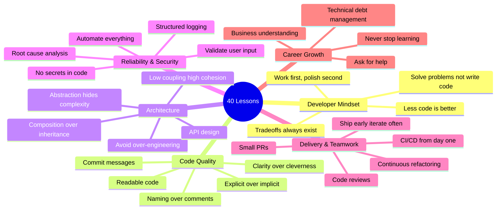

---

## Part 1: The Developer Mindset 🧠

> Before you write a single line of code, you need the right frame of mind. These first lessons define what software engineering is really about.

---

### Lesson 0 — The Best Code Is the One You Don't Write

Every line of code you write becomes a long-term liability. It must be:
- **Read** by future developers (including your future self)
- **Tested** to prevent regressions
- **Debugged** when something goes wrong
- **Deployed** with every release
- **Maintained** for years

The most elegant solution is often no new code at all.

#### 🤔 Decision Framework: Should I Write This Code?

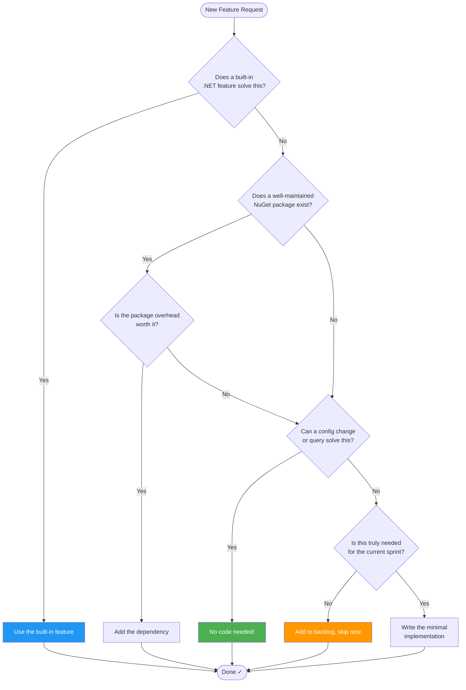

#### 💡 Real Examples

**Example 1 — Built-in Over Custom**

```csharp
// ❌ Custom pagination logic (50 lines, untested edge cases)
public class PaginationHelper
{
    public static List<T> Paginate<T>(List<T> source, int page, int size)
    {
        if (page < 1) page = 1;
        return source.Skip((page - 1) * size).Take(size).ToList();
    }
}

// ✅ Use EF Core's built-in pagination (2 lines, battle-tested)
var orders = await context.Orders
    .Skip((page - 1) * pageSize)
    .Take(pageSize)
    .ToListAsync(ct);
```

**Example 2 — Config Over Code**

```csharp
// ❌ Hardcoded business rule buried in code
if (order.Items.Count > 10)
    ApplyBulkDiscount(order);

// ✅ Config-driven — no code change needed to adjust rule
var threshold = config.GetValue<int>("Orders:BulkDiscountThreshold");
if (order.Items.Count > threshold)
    ApplyBulkDiscount(order);
```

#### 🏢 Use Cases
- **E-commerce**: Before building a custom search engine, try Elasticsearch + a NuGet client.
- **Auth**: Before writing your own JWT issuer, evaluate ASP.NET Core Identity + IdentityServer.
- **Scheduling**: Before building a job runner, consider Hangfire or Azure Functions with timers.

---

### Lesson 1 — You're Paid to Solve Problems, Not Write Code

Code is a means to an end. The product you deliver is **value** — to users and to the business.

#### 🔍 The Problem-First Approach

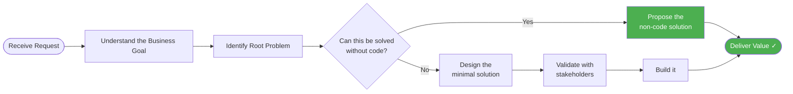

#### 💡 Real Examples

| Request | Code-First Thinking | Problem-First Thinking |
|---|---|---|
| "Build a report export feature" | Build CSV/Excel export logic | Ask: do they need a script that runs nightly and emails the report? |
| "We need real-time updates" | Build SignalR hub immediately | Ask: is polling every 30 seconds acceptable? Often yes. |
| "Build a user management system" | Full CRUD + roles + UI | Ask: can we use an off-the-shelf IAM like Auth0? |

#### 🏢 Use Case — The Unnecessary Microservice

A team was asked to "make the reporting faster." They spent 3 weeks building a separate microservice with its own database, caching layer, and API gateway — complex work.

The actual bottleneck? A single missing database index. Five minutes of analysis, five minutes of work. The microservice was shelved.

**Lesson**: Always measure before building. Talk to the users before architecting.

---

### Lesson 2 — Everything Is a Trade-off. There Is No "Best" Tool

Every technology choice comes with a cost. Ignoring the cost doesn't eliminate it — it just makes it a surprise later.

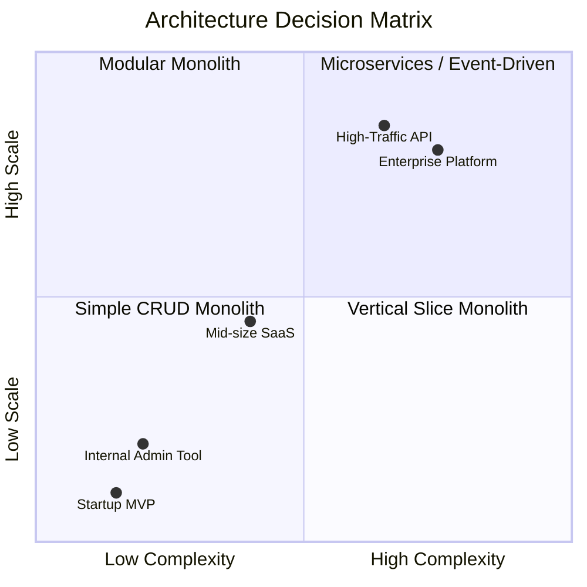

#### Common Trade-off Matrix

| Decision | Wins | Costs |
|---|---|---|
| **Microservices** | Independent deployments, team autonomy | Network latency, distributed tracing, ops complexity |
| **Monolith** | Simple deployment, easy refactoring | Scales as one unit, team coordination |
| **NoSQL** | Schema flexibility, horizontal scale | No joins, eventual consistency |
| **SQL** | ACID, complex queries, strong consistency | Harder to shard, schema migrations |
| **CQRS** | Optimized reads and writes separately | Two models to maintain, eventual consistency |
| **Event Sourcing** | Full audit trail, time-travel debug | High complexity, learning curve |

#### 💡 The Right Question

Instead of "What is the best architecture?" ask:
- **Best for what scale?** — 1K users vs. 10M users require very different answers.
- **Best for which team?** — A 2-person startup and a 50-person enterprise can't use the same playbook.
- **Best for what timeline?** — The architecture you need at year 1 is not what you need at year 5.

---

### Lesson 5 — First Make It Work, Then Make It Pretty

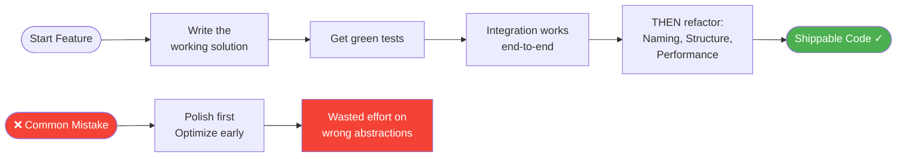

#### 💡 Example — Refactoring After Green

```csharp
// Step 1: Make it WORK (ugly but correct)
public async Task<decimal> GetTotalRevenueAsync(DateTime from, DateTime to)
{
    var orders = await db.Orders
        .Where(o => o.CreatedAt >= from && o.CreatedAt <= to)
        .ToListAsync();

    decimal total = 0;
    foreach (var o in orders)
    {
        foreach (var item in o.Items)
        {
            total += item.Quantity * item.UnitPrice;
        }
    }
    return total;
}

// Step 2: Make it PRETTY (after tests confirm correctness)
public async Task<decimal> GetTotalRevenueAsync(DateRange period)
{
    return await db.Orders
        .Where(o => period.Contains(o.CreatedAt))
        .SelectMany(o => o.Items)
        .SumAsync(i => i.Quantity * i.UnitPrice);
}
```

---

## Part 2: Writing Code That Lasts ✍️

> These lessons are about the craft of writing code that other humans — including your future self — will thank you for.

---

### Lesson 3 — Write Code That Other Developers Will Enjoy Working With

Treat readability as a feature. Every method, class, and variable name is a UX decision for the next developer.

#### The "5-Minute Rule"
> *"Would a developer understand this in five minutes? If not, refactor."*

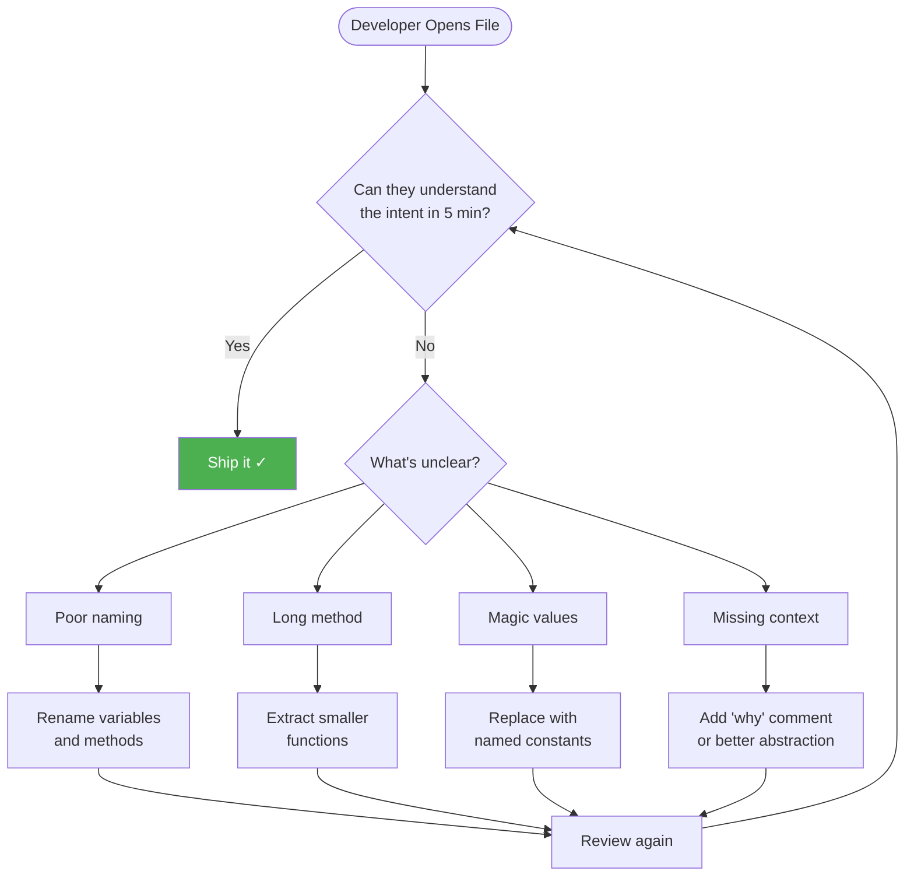

#### 💡 Code Examples — Enjoyable vs. Painful

```csharp
// ❌ Painful to work with
public async Task<bool> Proc(int id, bool f, DateTime dt)
{
    var x = await _r.Get(id);
    if (x == null) return false;
    if (f) { x.s = 2; x.dt = dt; }
    else { x.s = 1; }
    await _r.Save(x);
    return true;
}

// ✅ Enjoyable to work with
public async Task<bool> ProcessOrderAsync(
    int orderId,
    bool shouldShip,
    DateTime scheduledShippingDate,
    CancellationToken ct)
{
    var order = await _orderRepository.GetByIdAsync(orderId, ct);
    if (order is null)
        return false;

    if (shouldShip)
        order.ScheduleForShipping(scheduledShippingDate);
    else
        order.PutOnHold();

    await _orderRepository.SaveAsync(order, ct);
    return true;
}
```

---

### Lesson 4 — Write Meaningful Commit Messages

A commit message is a letter to the future. Write it with care.

#### The Anatomy of a Great Commit Message

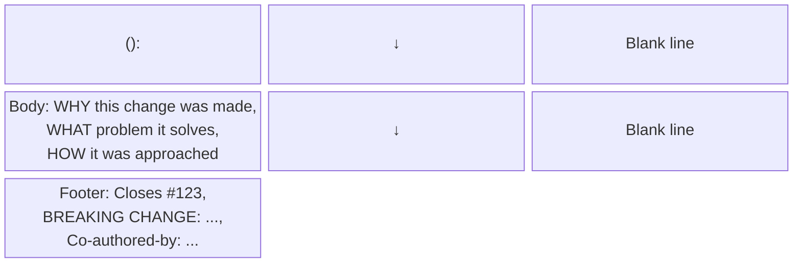

#### Conventional Commits Format

| Prefix | Use When |
|---|---|
| `feat` | Adding a new feature |
| `fix` | Fixing a bug |
| `refactor` | Code change without behavior change |
| `perf` | Performance improvement |
| `test` | Adding or fixing tests |
| `docs` | Documentation changes |
| `ci` | CI/CD changes |
| `chore` | Maintenance (deps, configs) |
| `BREAKING CHANGE` | Any incompatible API change |

#### 💡 Bad vs. Good — Side by Side

```bash
# ❌ Useless commit history
git log --oneline
a1b2c3d fix bug
e4f5g6h update stuff
i7j8k9l changes
l0m1n2o temp
p3q4r5s final fix 2

# ✅ Meaningful commit history
git log --oneline
a1b2c3d fix(orders): prevent duplicate order creation on client retry
e4f5g6h feat(auth): add refresh token rotation to prevent session fixation
i7j8k9l perf(search): add composite index on (CustomerId, CreatedAt)
l0m1n2o refactor(payments): extract fraud check into dedicated service
p3q4r5s test(orders): add integration tests for idempotency key logic
```

---

### Lesson 20 — Choose Clarity Over Cleverness

The codebase is **read far more often than it is written**. Optimize for the reader, not the writer.

#### The Cleverness Trap

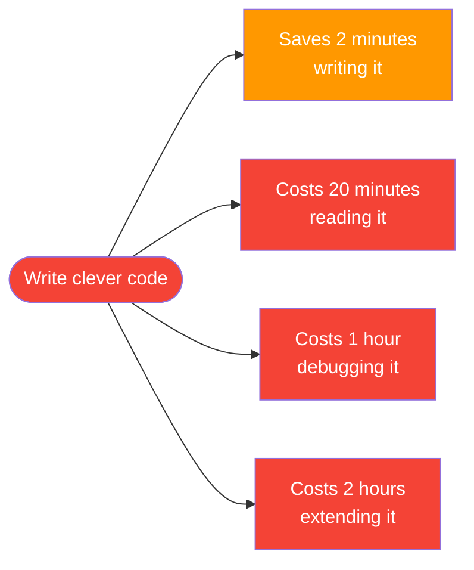

#### 💡 Clear vs. Clever Examples

**Example 1 — LINQ one-liners**

```csharp
// ❌ Clever: Dense, hard to debug
var result = data
    .Where(x => x.IsActive && !x.IsDeleted)
    .GroupBy(x => x.DepartmentId)
    .Select(g => new {
        Dept = g.Key,
        Avg = g.Average(x => x.Salary * (1 + (x.BonusRate ?? 0)))
    })
    .OrderByDescending(x => x.Avg)
    .Take(5)
    .ToList();

// ✅ Clear: Broken into readable steps
var activeEmployees = data
    .Where(e => e.IsActive && !e.IsDeleted);

var departmentAverageSalary = activeEmployees
    .GroupBy(e => e.DepartmentId)
    .Select(group => new DepartmentSalaryStats
    {
        DepartmentId = group.Key,
        AverageTotalCompensation = group.Average(e => e.CalculateTotalCompensation())
    });

var topFiveHighestPaidDepartments = departmentAverageSalary
    .OrderByDescending(d => d.AverageTotalCompensation)
    .Take(5)
    .ToList();
```

**Example 2 — Ternary chains**

```csharp
// ❌ Clever: Nested ternaries
var status = order.IsCancelled ? "Cancelled" : order.IsShipped ? "Shipped" :
    order.IsPaid ? "Processing" : order.IsSubmitted ? "Pending" : "Draft";

// ✅ Clear: Pattern matching with expression
var status = order switch
{
    { IsCancelled: true }  => "Cancelled",
    { IsShipped: true }    => "Shipped",
    { IsPaid: true }       => "Processing",
    { IsSubmitted: true }  => "Pending",
    _                      => "Draft"
};
```

---

### Lesson 21 — Choose Descriptive Naming Over Explanatory Comments

If you need a comment to explain what a variable does, the variable has the wrong name.

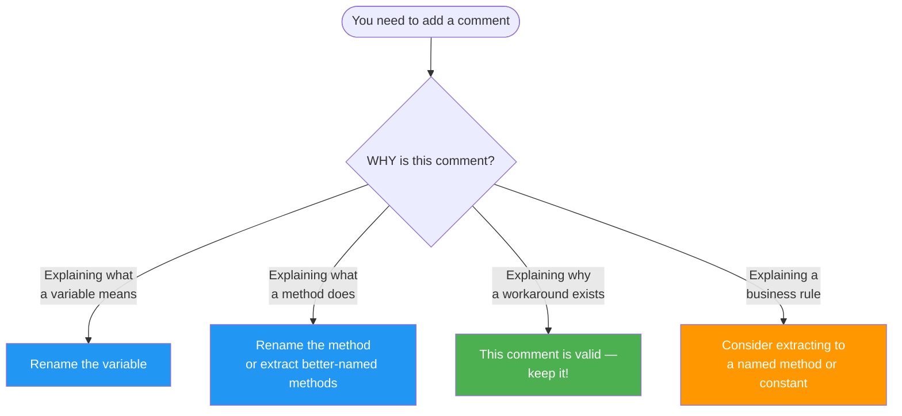

#### 💡 Naming Patterns That Replace Comments

```csharp
// ❌ Cryptic with compensating comments
int d = 30;             // days before account expires
bool f = true;          // whether to send notification
var ts = DateTime.UtcNow.AddDays(-d);  // threshold start date

// ✅ Self-documenting names
int accountExpiryWarningDays = 30;
bool shouldSendExpiryNotification = true;
var expiryWarningThreshold = DateTime.UtcNow.AddDays(-accountExpiryWarningDays);

// ❌ Magic numbers
if (user.LoginAttempts >= 5)
    LockAccount(user);

// ✅ Named constants
private const int MaxFailedLoginAttemptsBeforeLock = 5;

if (user.LoginAttempts >= MaxFailedLoginAttemptsBeforeLock)
    LockAccount(user);

// ❌ Boolean flags with unclear meaning
ProcessOrder(order, true, false, true);

// ✅ Named parameters or builder pattern
ProcessOrder(order,
    sendConfirmationEmail: true,
    applyLoyaltyDiscount: false,
    notifyWarehouse: true);
```

---

### Lesson 24 — Respect the Principle of Least Surprise

A method should do exactly what its name says. Nothing more, nothing less.

#### Violation Pattern Catalog

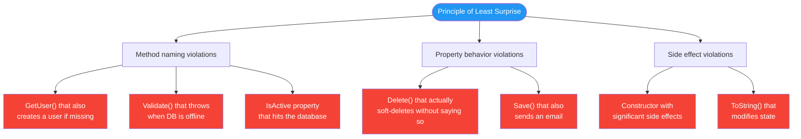

#### 💡 Examples

```csharp
// ❌ Surprise! GetOrCreate does more than "Get"
public async Task<User> GetUserByEmailAsync(string email)
{
    var user = await db.Users.FirstOrDefaultAsync(u => u.Email == email);
    if (user is null)
    {
        // SURPRISE: This "Get" method also creates!
        user = new User { Email = email, CreatedAt = DateTime.UtcNow };
        db.Users.Add(user);
        await db.SaveChangesAsync();
    }
    return user;
}

// ✅ Explicit intent, no surprises
public async Task<User?> GetUserByEmailAsync(string email) =>
    await db.Users.FirstOrDefaultAsync(u => u.Email == email);

public async Task<User> GetOrCreateUserByEmailAsync(string email)
{
    var user = await GetUserByEmailAsync(email);
    if (user is not null) return user;

    return await CreateUserAsync(email);
}
```

---

### Lesson 29 — Favor Explicit Over Implicit

Magic is fun in a magic show. In production code at 2 AM, it's a nightmare.

#### The Implicit/Explicit Spectrum

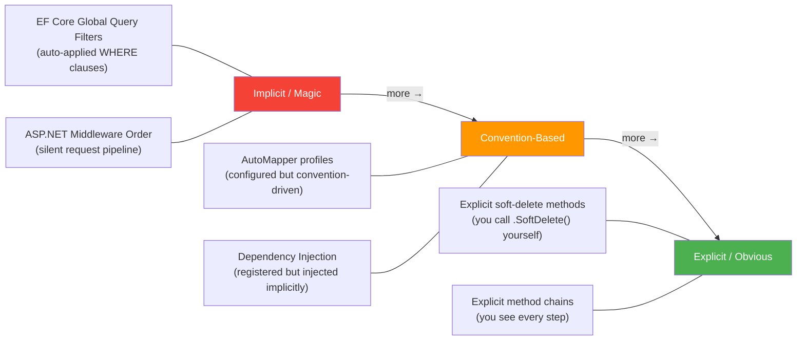

#### 💡 Soft Delete Example (Implicit vs. Explicit)

```csharp
// ❌ Implicit — magic interceptor silently transforms DELETE into UPDATE
// You write "delete" but something completely different happens invisibly

await context.Orders.Remove(order);
await context.SaveChangesAsync(); // interceptor quietly changes entity state

// ✅ Explicit — the intent is visible at the call site
public async Task SoftDeleteOrderAsync(Guid orderId, CancellationToken ct)
{
    var order = await context.Orders.FindAsync([orderId], ct)
        ?? throw new OrderNotFoundException(orderId);

    order.MarkAsDeleted();           // explicit domain method
    await context.SaveChangesAsync(ct);
}

// And in the entity:
public class Order
{
    public void MarkAsDeleted()
    {
        IsDeleted = true;
        DeletedAt = DateTime.UtcNow;
    }
}
```

---

## Part 3: Architecture & Design Principles 🏗️

> How you structure code at a macro level determines how fast your team can move for years to come.

---

### Lesson 13 — Complexity Kills Projects. Don't Over-Engineer

The #1 cause of project failure isn't bad code. It's too much code solving problems you don't have.

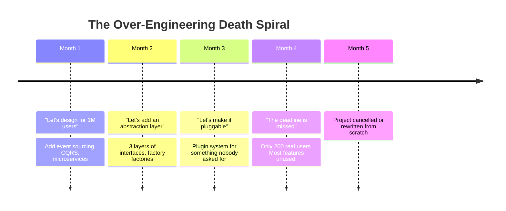

#### The YAGNI vs. Real Complexity Line

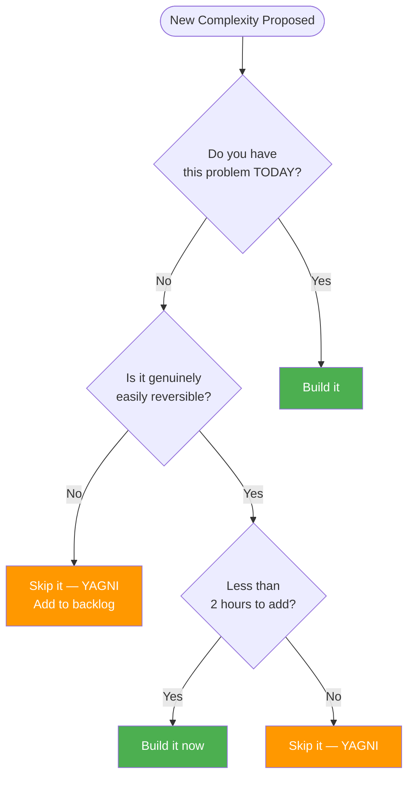

#### 💡 Over-Engineering Anti-Patterns in .NET

**Anti-pattern 1 — Repository over EF Core**
```csharp
// ❌ Over-engineered: A "repository" that just wraps DbContext
public interface IOrderRepository
{
    Task<Order?> GetByIdAsync(int id);
    Task<List<Order>> GetAllAsync();
    Task AddAsync(Order order);
    Task UpdateAsync(Order order);
    Task DeleteAsync(int id);
}

// ✅ Use EF Core directly in most cases — it IS your repository
public class OrderService(AppDbContext context)
{
    public Task<Order?> GetByIdAsync(int id) =>
        context.Orders.FindAsync(id).AsTask();
}
```

**Anti-pattern 2 — Factory for a single class**
```csharp
// ❌ Over-engineered: Factory for something that never varies
public interface IEmailSenderFactory
{
    IEmailSender Create(EmailProviderType type);
}

// If there's only ever one EmailSender — this is waste.
// ✅ Just register and inject it directly
services.AddScoped<IEmailSender, SmtpEmailSender>();
```

---

### Lesson 16 — Minimize Coupling, Maximize Cohesion

This is arguably the single most important architectural principle. Everything else flows from it.

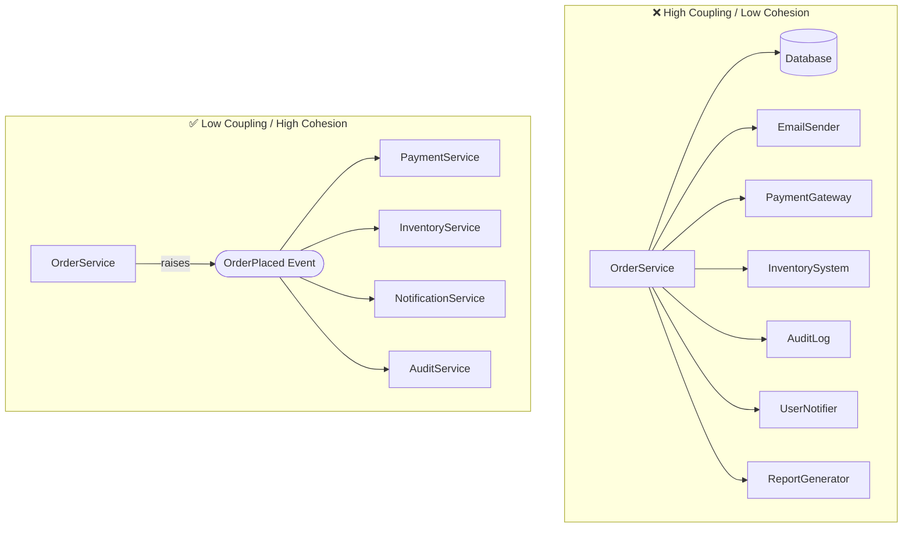

#### Understanding Cohesion

| Cohesion Level | Description | Example |
|---|---|---|
| ❌ **Coincidental** | Things grouped by accident | `Utils` class with random methods |
| ❌ **Logical** | Things that do similar types of work | `FileHelper` with read, write, delete, compress, upload |
| ✅ **Sequential** | Output of one feeds input of next | `OrderProcessingPipeline` |
| ✅ **Communicational** | All operate on same data | `OrderStateMachine` |
| ✅ **Functional** | All contribute to one well-defined task | `InvoiceGenerator` |

#### 💡 Refactoring Toward Low Coupling

```csharp
// ❌ Tightly coupled: OrderService knows about 5 other systems
public class OrderService
{
    public async Task PlaceOrderAsync(PlaceOrderRequest request)
    {
        var order = CreateOrder(request);
        await _db.SaveAsync(order);

        // Direct knowledge of payment, email, inventory, audit...
        await _paymentGateway.ChargeAsync(order);
        await _emailSender.SendConfirmationAsync(order);
        await _inventory.ReserveItemsAsync(order);
        await _audit.LogOrderCreatedAsync(order);
    }
}

// ✅ Loosely coupled: OrderService only knows about the domain event
public class OrderService(IOrderRepository repo, IEventBus events)
{
    public async Task PlaceOrderAsync(PlaceOrderRequest request)
    {
        var order = Order.Create(request);
        await repo.SaveAsync(order);

        // Raise the event — let other services react independently
        await events.PublishAsync(new OrderPlacedEvent(order.Id));
    }
}
```

---

### Lesson 22 — Favor Composition Over Inheritance

Inheritance creates rigid hierarchies. Composition creates flexible systems.

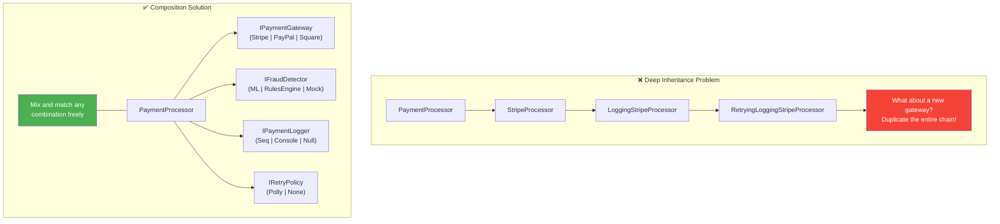

#### 💡 Composition in Action

```csharp
// ✅ Composition with primary constructors (.NET 8+)
public class PaymentProcessor(
    IPaymentGateway gateway,
    IFraudDetector fraudDetector,
    IPaymentLogger logger,
    IRetryPolicy retryPolicy)
{
    public async Task<PaymentResult> ChargeAsync(
        PaymentRequest request,
        CancellationToken ct)
    {
        var fraudResult = await fraudDetector.CheckAsync(request);
        if (fraudResult.IsRisky)
        {
            await logger.LogRejectedAsync(request, fraudResult.Reason);
            return PaymentResult.Rejected(fraudResult.Reason);
        }

        var result = await retryPolicy.ExecuteAsync(
            () => gateway.ChargeAsync(request, ct));

        await logger.LogAsync(request, result);
        return result;
    }
}

// Registrations — swap any piece without touching PaymentProcessor
services.AddScoped<IPaymentGateway, StripeGateway>();
services.AddScoped<IFraudDetector, MachineLearningFraudDetector>();
services.AddScoped<IPaymentLogger, StructuredPaymentLogger>();
services.AddSingleton<IRetryPolicy>(Polly.Retry.RetryPolicy.Default);
```

---

### Lesson 28 — Abstraction Should Hide Complexity, Not Create It

A good abstraction is invisible. A bad one makes every call harder than the raw underlying tool.

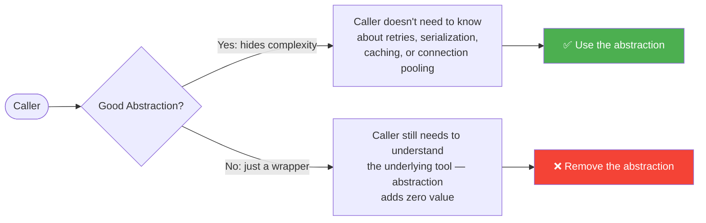

#### The Test for a Good Abstraction

Ask: **What complexity does this hide?** If you can't answer clearly, you don't need the abstraction yet.

```csharp
// ❌ Bad abstraction: just a thin wrapper around DbSet — hides nothing
public interface IOrderRepository
{
    Task<Order?> GetByIdAsync(int id);
    IQueryable<Order> Query();
    Task AddAsync(Order order);
}

// ✅ Good abstraction: hides real domain logic
public interface IOrderRepository
{
    Task<Order?> GetOrderWithFullDetailsAsync(Guid orderId, CancellationToken ct);
    Task<PagedResult<Order>> GetPendingOrdersForWarehouseAsync(
        int warehouseId, PaginationRequest pagination, CancellationToken ct);
    Task<bool> HasDuplicateOrderAsync(string idempotencyKey, CancellationToken ct);
    Task SaveAsync(Order order, CancellationToken ct);
}
```

---

### Lesson 34 — Design APIs That Are Easy to Use Correctly and Hard to Misuse

The API is UX for developers. If something can be used wrong, it will be.

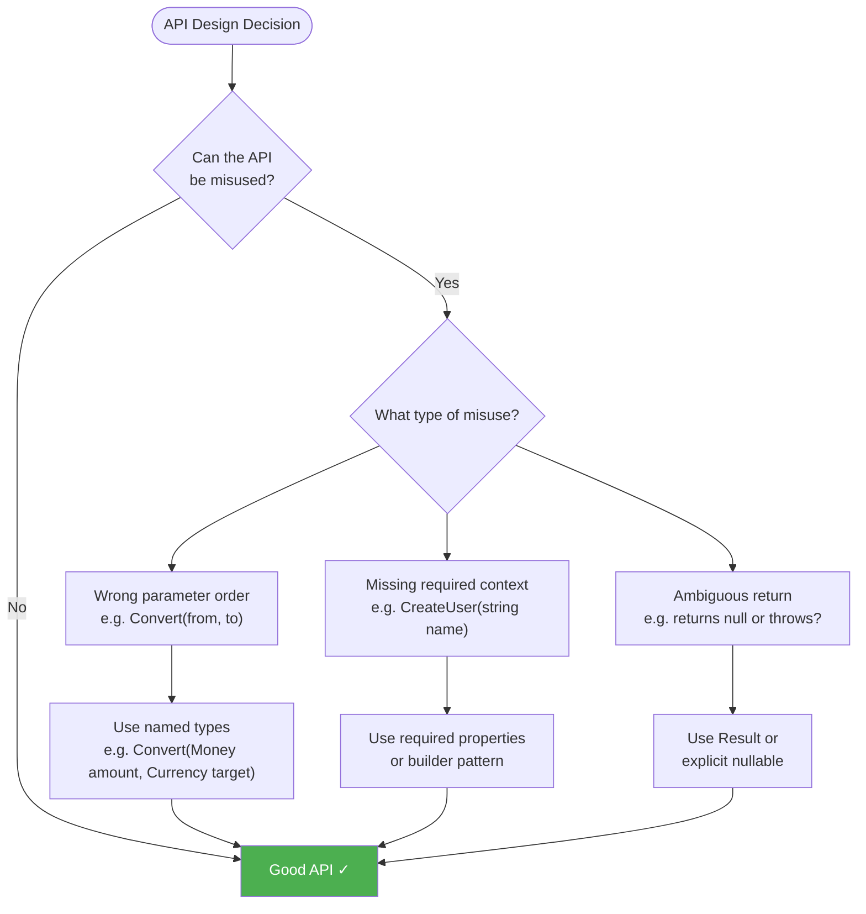

#### 💡 API Safety Patterns

```csharp
// ❌ Easy to misuse: parameter order ambiguity
decimal Convert(decimal amount, string fromCurrency, string toCurrency);
// Which is from? Which is to?
Convert(100, "USD", "EUR"); // or
Convert(100, "EUR", "USD"); // Both compile. Only one is correct.

// ✅ Hard to misuse: types carry intent
Money Convert(Money amount, Currency targetCurrency);
// Impossible to confuse — the source is IN the Money object
Convert(new Money(100, Currency.USD), Currency.EUR);

// ❌ Easy to misuse: null return with no contract
Task<Order?> GetOrderAsync(int id); // Null means "not found"? "error"? "deleted"?

// ✅ Explicit contract with Result pattern
Task<Result<Order>> GetOrderAsync(int id);
// Result.Ok(order) or Result.NotFound() or Result.Error(...)

var result = await GetOrderAsync(id);
if (result.IsNotFound)
    return NotFound();
if (result.IsError)
    return StatusCode(500, result.Error);
return Ok(result.Value);
```

---

## Part 4: Reliability, Security & Operations 🔒

> Code that works on your machine is table stakes. These lessons are about code that works in production, under pressure, for years.

---

### Lesson 10 — Never Trust User Input

Every piece of data from outside your system is a potential attack vector or source of corruption.

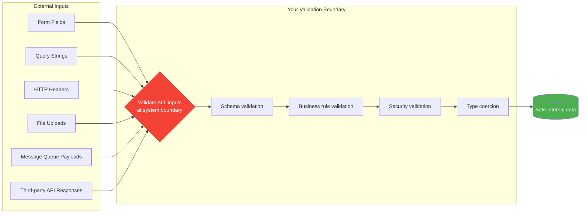

#### 💡 FluentValidation in ASP.NET Core

```csharp
// Validator
public class CreateOrderValidator : AbstractValidator<CreateOrderRequest>
{
    public CreateOrderValidator()
    {
        RuleFor(x => x.CustomerId)
            .GreaterThan(0)
            .WithMessage("CustomerId must be a positive integer.");

        RuleFor(x => x.Items)
            .NotEmpty()
            .WithMessage("Order must have at least one item.");

        RuleForEach(x => x.Items).ChildRules(item =>
        {
            item.RuleFor(i => i.ProductId).GreaterThan(0);
            item.RuleFor(i => i.Quantity)
                .InclusiveBetween(1, 1000)
                .WithMessage("Quantity must be between 1 and 1000.");
            item.RuleFor(i => i.UnitPrice)
                .GreaterThan(0)
                .WithMessage("Unit price must be positive.");
        });

        RuleFor(x => x.ShippingAddress.PostalCode)
            .Matches(@"^\d{5}(-\d{4})?$")
            .WithMessage("Postal code must be in format 12345 or 12345-6789.");
    }
}

// Registration (auto-validates before controller action runs)
services.AddValidatorsFromAssemblyContaining<CreateOrderValidator>();
services.AddFluentValidationAutoValidation();
```

#### 🏢 Use Cases for Input Validation
- **SQL Injection Prevention**: Validate and parameterize all query inputs.
- **File Upload Security**: Check MIME type, extension, file size, and scan content.
- **Price Manipulation Prevention**: Never trust client-side pricing; recalculate server-side.
- **Idempotency Keys**: Validate that retry keys are properly formatted UUIDs before processing.

---

### Lesson 11 — Log Precisely, Not Excessively

Logs that contain everything are noise. Structured, intentional logs are signal.

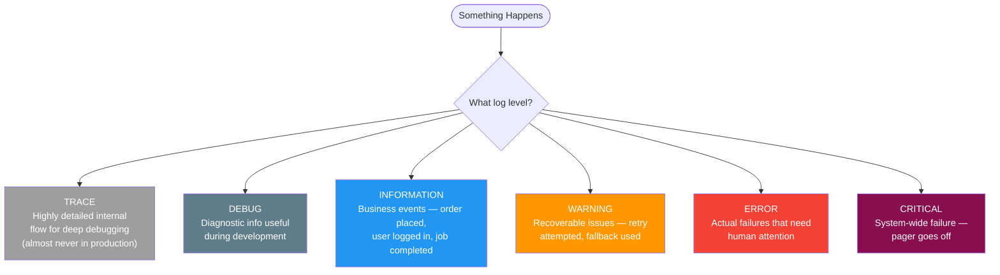

#### 💡 Structured Logging with Serilog/Microsoft.Extensions.Logging

```csharp
// ❌ Unstructured: Can't query this in Seq or Application Insights
logger.LogInformation("Processing order " + orderId + " for user " + userId);
logger.LogInformation($"Order total: {total}");
logger.LogError("Payment failed for order " + orderId);

// ✅ Structured: Every field is queryable
logger.LogInformation(
    "Order {OrderId} received from customer {CustomerId} with {ItemCount} items totaling {Total:C}",
    order.Id, order.CustomerId, order.Items.Count, order.Total);

// ✅ Enriched with context using Serilog
using (_logger.BeginScope(new Dictionary<string, object>
{
    ["OrderId"] = orderId,
    ["CorrelationId"] = correlationId,
    ["UserId"] = userId
}))
{
    _logger.LogInformation("Order processing started");
    // ... all logs in this scope automatically include the above fields
    _logger.LogInformation("Payment authorized");
    _logger.LogInformation("Inventory reserved");
}
```

---

### Lesson 14 — Fix Root Causes, Not Symptoms

A try-catch that swallows an exception doesn't fix the bug — it hides it.

#### The Five Whys Technique

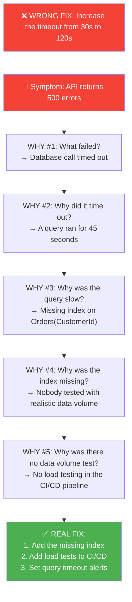

#### 💡 Common Symptom-Fix vs. Root-Cause-Fix Examples

| Symptom | Symptom Fix (Wrong) | Root Cause Fix (Right) |
|---|---|---|
| NullReferenceException | `if (obj != null) ...` everywhere | Fix the code that allows null where it shouldn't |
| Occasional 500 errors | Global try-catch swallowing exceptions | Find the unhandled case, fix the business logic |
| Duplicate records in DB | Delete duplicates with a script | Add unique constraint + idempotency check in code |
| Memory leak | Restart the service nightly | Find the undisposed resources, fix IDisposable usage |
| Slow page load | Add caching | Profile the query, add index, optimize N+1 query |

---

### Lesson 15 — Measure First, Optimize Second

Performance intuition is almost always wrong. Profile before you optimize.

```mermaid
flowchart LR
    A([Performance\nComplaint]) --> B[Reproduce\nthe issue]
    B --> C{Measure with\nprofiler/traces}
    C --> D[Identify the\nactual hotspot]
    D --> E{Is the hotspot\nwhere you assumed?}
    E -->|"Usually No!"| F[Go back to C\nwith new data]
    E -->|Yes| G[Optimize\nthe hotspot]
    G --> H[Measure again\nto verify improvement]
    H --> I([Done ✓])

    style E fill:#FF9800,color:#fff
    style I fill:#4CAF50,color:#fff
```

#### 💡 Profiling Tools for .NET

```csharp
// Option 1: BenchmarkDotNet for micro-benchmarks
[MemoryDiagnoser]
[RankColumn]
public class StringConcatBenchmarks
{
    private const int Iterations = 1000;

    [Benchmark]
    public string StringPlus()
    {
        var result = "";
        for (int i = 0; i < Iterations; i++)
            result += i.ToString();
        return result;
    }

    [Benchmark]
    public string StringBuilder()
    {
        var sb = new System.Text.StringBuilder();
        for (int i = 0; i < Iterations; i++)
            sb.Append(i);
        return sb.ToString();
    }
}

// Option 2: OpenTelemetry for production tracing
var meter = new Meter("MyApp.Orders");
var orderProcessingDuration = meter.CreateHistogram<double>(
    "order.processing.duration",
    unit: "ms",
    description: "Time to process an order end-to-end");

var stopwatch = Stopwatch.StartNew();
await ProcessOrderAsync(order);
stopwatch.Stop();

orderProcessingDuration.Record(
    stopwatch.Elapsed.TotalMilliseconds,
    new("order.type", order.Type),
    new("region", order.ShippingRegion));
```

---

### Lesson 18 — Never Hard-Code Sensitive Information

Secrets in source code are one git push away from being public forever.

```mermaid
flowchart TD
    A([Secret Needed]) --> B{Environment?}

    B -->|Local Dev| C["User Secrets\ndotnet user-secrets set\n'ConnectionStrings:Db' 'value'"]
    B -->|CI/CD Pipeline| D["Encrypted\nEnvironment Variables\nGitHub Secrets / Azure DevOps Variables"]
    B -->|Staging/Production| E{Cloud?}

    E -->|Azure| F["Azure Key Vault\n+ Managed Identity\n(no credentials at all!)"]
    E -->|AWS| G["AWS Secrets Manager\nor Parameter Store"]
    E -->|On-Prem| H["HashiCorp Vault\nor similar"]

    C & D & F & G & H --> I([Never in source code ✓])

    NEVER["❌ NEVER: appsettings.json,\nhardcoded strings, environment.ts,\ngit history"] -.-|"Rotate immediately if leaked"| I

    style NEVER fill:#f44336,color:#fff
    style I fill:#4CAF50,color:#fff
```

#### 💡 Safe Secret Management in .NET

```csharp
// ✅ Configuration binding — works across all environments
public class DatabaseOptions
{
    public const string SectionName = "Database";

    [Required]
    public string ConnectionString { get; init; } = string.Empty;

    [Required]
    public string Password { get; init; } = string.Empty;
}

// In Program.cs
builder.Services
    .AddOptions<DatabaseOptions>()
    .BindConfiguration(DatabaseOptions.SectionName)
    .ValidateDataAnnotations()
    .ValidateOnStart(); // Fail fast if config is missing

// appsettings.json — NO SECRETS HERE
{
    "Database": {
        "ConnectionString": "Server=localhost;Database=MyApp;"
        // Password comes from User Secrets / Key Vault
    }
}
```

---

## Part 5: Delivery, Team Practices & CI/CD 🚀

> Shipping is a skill. These lessons are about how to deliver software reliably, collaboratively, and sustainably.

---

### Lesson 6 — Ship Early, Iterate Often

The only code that delivers value is code in production.

```mermaid
gitGraph
   commit id: "Initial auth skeleton"
   commit id: "Login with feature flag OFF"
   branch feature/login
   checkout feature/login
   commit id: "Add form validation"
   commit id: "Add error states"
   checkout main
   merge feature/login id: "🚩 Flag: login enabled for 5% users"
   commit id: "Monitor metrics & errors"
   commit id: "🚩 Flag: login enabled for 50%"
   commit id: "Fix edge case from real user"
   commit id: "🚩 Flag: login enabled for 100%"
```

#### Feature Flags in .NET

```csharp
// Using Microsoft.FeatureManagement
public class OrderController(
    IFeatureManager features,
    IOrderService orders) : ControllerBase
{
    [HttpPost]
    public async Task<IActionResult> PlaceOrderAsync(PlaceOrderRequest request)
    {
        if (await features.IsEnabledAsync("NewOrderProcessingEngine"))
        {
            return Ok(await orders.PlaceOrderV2Async(request));
        }
        return Ok(await orders.PlaceOrderAsync(request));
    }
}

// appsettings.json
{
    "FeatureManagement": {
        "NewOrderProcessingEngine": {
            "EnabledFor": [
                {
                    "Name": "Percentage",
                    "Parameters": { "Value": 10 }
                }
            ]
        }
    }
}
```

---

### Lesson 8 — Refactor Continuously and Incrementally

Big refactors fail. Small, continuous improvements succeed.

#### The Boy Scout Rule Applied

```mermaid
flowchart LR
    A([Open any file to make changes]) --> B[Make your primary change]
    B --> C[Look at the file\nyou just touched]
    C --> D{Small improvement\npossible nearby?}
    D -->|"Yes (takes < 30 min)"| E[Make the small improvement]
    D -->|"No / > 30 min"| F[Leave a TODO comment\nfor tracking]
    E --> G[Commit together]
    F --> G
    G --> H([Leave it better\nthan you found it ✓])

    style H fill:#4CAF50,color:#fff
```

#### 💡 Incremental Refactoring Examples

```csharp
// Before: You're in this file to fix a bug
public class OrderHelper
{
    // While here, you notice this method:
    public decimal calc(Order o, bool f, int d)  // terrible naming
    {
        if (f)
            return o.Subtotal - (o.Subtotal * (d / 100m));
        return o.Subtotal;
    }
}

// After: Fix the bug AND leave it better (< 10 min)
public class OrderPricingCalculator
{
    public decimal CalculateTotal(Order order, bool applyDiscount, int discountPercentage)
    {
        if (!applyDiscount)
            return order.Subtotal;

        var discountMultiplier = 1 - (discountPercentage / 100m);
        return order.Subtotal * discountMultiplier;
    }
}
```

---

### Lesson 9 — Code Reviews Improve Teams, Not Just Code

Code review is the cheapest knowledge-transfer tool in software engineering.

```mermaid
flowchart TD
    A([PR Opened]) --> B[Author self-reviews\nbefore requesting]
    B --> C[Reviewer reads\nfor understanding]
    C --> D{Review type}

    D -->|"Logic/correctness"| E["Ask: Is this doing\nthe right thing?"]
    D -->|"Design"| F["Ask: Is this the\nright approach?"]
    D -->|"Readability"| G["Ask: Will the next dev\nunderstand this?"]
    D -->|"Tests"| H["Ask: Does coverage match\nthe complexity?"]

    E & F & G & H --> I{Issue found?}
    I -->|"Blocking (must fix)"| J[Clear comment with\nsuggested fix or question]
    I -->|"Non-blocking (nice to have)"| K["Prefix with 'Nit:'\nor 'Optional:'"]
    I -->|"None"| L[Approve with praise\nfor good patterns found]

    J & K --> M[Author responds\nand updates]
    M --> C
    L --> N([Merged ✓])

    style N fill:#4CAF50,color:#fff
    style J fill:#FF9800,color:#fff
    style K fill:#2196F3,color:#fff
```

---

### Lesson 12 — Automate Everything That Can Be Automated

Manual steps are where bugs live. Automation eliminates human error.

```mermaid
flowchart LR
    subgraph "CI Pipeline (Every Push)"
        A[Code Push] --> B[Format Check\neditorconfig]
        B --> C[Static Analysis\nRoslyn Analyzers]
        C --> D[Build]
        D --> E[Unit Tests]
        E --> F[Integration Tests]
        F --> G[Security Scan\nSnyk / OWASP]
    end

    subgraph "CD Pipeline (On Main Merge)"
        H[Semantic Version\nBump] --> I[Docker Build\n& Push]
        I --> J[Deploy to\nStaging]
        J --> K[Smoke Tests\nAgainst Staging]
        K --> L{All passed?}
        L -->|Yes| M[Deploy to\nProduction]
        L -->|No| N[Alert Team\nRollback]
    end

    G -->|Pass| H
    G -->|Fail| O[Block Merge\nNotify Author]

    style M fill:#4CAF50,color:#fff
    style O fill:#f44336,color:#fff
    style N fill:#FF9800,color:#fff
```

#### 💡 GitHub Actions Starter for .NET

```yaml
# .github/workflows/ci.yml
name: CI

on:
  push:
    branches: [main, develop]
  pull_request:
    branches: [main]

jobs:
  build-and-test:
    runs-on: ubuntu-latest

    steps:
      - uses: actions/checkout@v4

      - name: Setup .NET
        uses: actions/setup-dotnet@v4
        with:
          dotnet-version: '9.0.x'

      - name: Restore dependencies
        run: dotnet restore

      - name: Check formatting
        run: dotnet format --verify-no-changes

      - name: Build
        run: dotnet build --no-restore --configuration Release

      - name: Run unit tests
        run: dotnet test --no-build --filter "Category=Unit" --logger trx

      - name: Run integration tests
        run: dotnet test --no-build --filter "Category=Integration" --logger trx
        env:
          ConnectionStrings__TestDb: ${{ secrets.TEST_DB_CONNECTION }}

      - name: Publish test results
        uses: dorny/test-reporter@v1
        if: always()
        with:
          name: Test Results
          path: '**/*.trx'
          reporter: dotnet-trx
```

---

### Lesson 33 — Invest in CI/CD from Day One

Technical debt isn't just in code. A project without CI/CD has structural debt.

```mermaid
gantt
    title CI/CD Setup Timeline (Week 1)
    dateFormat  YYYY-MM-DD
    axisFormat %a

    section Day 1
    Create repo + .gitignore          :a1, 2024-01-01, 1d
    Add .editorconfig + analyzers     :a2, after a1, 1d

    section Day 2
    GitHub Actions: build + test      :b1, 2024-01-03, 1d
    Add Dockerfile                    :b2, after b1, 1d

    section Day 3
    Deploy to staging pipeline        :c1, 2024-01-05, 1d
    Smoke tests against staging       :c2, after c1, 1d

    section Day 4-5
    Production deployment pipeline    :d1, 2024-01-08, 1d
    Monitoring + alerts setup         :d2, after d1, 1d
```

---

### Lesson 37 — Track and Repay Technical Debt Incrementally

Technical debt is not inherently evil. Unacknowledged debt is.

```mermaid
flowchart TD
    A([Technical Debt Created]) --> B{Intentional?}
    B -->|Yes| C["Document it:\n- Why it was taken\n- What it costs\n- When to repay"]
    B -->|No| D[Make it visible immediately]
    C --> E[Add to tech debt backlog]
    D --> E
    E --> F{Severity?}
    F -->|High - blocking progress| G[Schedule for\nnext sprint]
    F -->|Medium - slowing us down| H[Allocate 20%\nof sprint capacity]
    F -->|Low - cosmetic| I[Apply Boy Scout\nRule: fix when nearby]
    G & H & I --> J([Debt repaid ✓])

    IGNORE["❌ Ignore it:\nDebt compounds like interest —\nsmall debts become big blockers"] -.- E

    style J fill:#4CAF50,color:#fff
    style IGNORE fill:#f44336,color:#fff
```

---

## Part 6: Business Awareness & Career Growth 🌱

> The best engineers understand the business, communicate clearly, and never stop growing.

---

### Lesson 31 — Understand the Business Behind the Code

Technically correct features that solve the wrong problem are waste.

```mermaid
flowchart TD
    A([Feature Request Received]) --> B[Read the ticket carefully]
    B --> C{Do you understand\nWHY this is needed?}
    C -->|No| D["Ask: What user problem\ndoes this solve?"]
    C -->|Yes| E{Does the proposed\nsolution match the WHY?}
    D --> E
    E -->|No| F["Propose a better\nalternative + explain"]
    E -->|Yes| G{Any simpler way\nto achieve the same goal?}
    F --> G
    G -->|Yes| H["Present the simpler\nalternative to PM"]
    G -->|No| I[Build it]
    H --> I
    I --> J([Ship valuable feature ✓])

    style J fill:#4CAF50,color:#fff
    style F fill:#2196F3,color:#fff
```

---

### Lesson 39 — Ask for Help When You're Stuck

Stubbornness is not persistence. Knowing when to ask is a senior skill.

#### The Help-Seeking Decision Tree

```mermaid
flowchart TD
    A([Stuck on a problem]) --> B[Attempt to solve it yourself]
    B --> C{Time spent\nstuck?}
    C -->|"< 30 min"| D[Keep researching:\nDocs, Stack Overflow, GitHub Issues]
    C -->|"30-60 min"| E["Try rubber duck debugging:\nexplain the problem aloud"]
    C -->|"> 60-90 min"| F{Still stuck?}
    E --> F
    D --> C
    F -->|Yes| G[Ask for help]
    F -->|No| H([Solved ✓])

    G --> I{Who to ask?}
    I -->|"Technical blocker"| J[Senior on your team\nor pair programming session]
    I -->|"Library bug"| K[GitHub Issue\non the library]
    I -->|"Framework question"| L[Official docs\nor community Discord]
    I -->|"Architecture decision"| M[Team architectural\ndiscussion / ADR]

    J & K & L & M --> N([Unblocked + learned ✓])

    style H fill:#4CAF50,color:#fff
    style N fill:#4CAF50,color:#fff
```

---

### Lesson 40 — Never Stop Learning and Questioning Your Assumptions

The day you stop learning is the day your skills start to expire.

```mermaid
flowchart TD
    subgraph "Learning Sources"
        A["📚 Books\nClean Code, DDD,\nDesigning Data-Intensive Apps"]
        B["📝 Blogs & Newsletters\nOfficial .NET, community blogs"]
        C["💻 Source Code\nRead ASP.NET Core, EF Core internals"]
        D["🎙️ Conferences & Talks\nNDC, .NET Conf, DevSum"]
        E["🤝 Peers & Mentors\nCode review, pair programming"]
        F["🧪 Side Projects\nApply new concepts safely"]
    end

    subgraph "Learning Loop"
        G([Learn Something]) --> H[Apply It]
        H --> I[Reflect on What Worked]
        I --> J[Question Old Assumptions]
        J --> K[Identify Next Learning Gap]
        K --> G
    end

    A & B & C & D & E & F --> G

    style G fill:#2196F3,color:#fff
    style J fill:#FF9800,color:#fff
```

---

## 📋 Complete Lessons Quick Reference

```mermaid
flowchart TD
    subgraph "🧠 Mindset"
        L0["0: Best code is no code"]
        L1["1: You solve problems, not write code"]
        L2["2: Everything is a trade-off"]
        L5["5: Work first, polish second"]
        L7["7: Estimations are guesses"]
        L38["38: Balance YAGNI with design"]
        L40["40: Never stop learning"]
    end

    subgraph "✍️ Code Quality"
        L3["3: Write enjoyable code"]
        L4["4: Meaningful commits"]
        L20["20: Clarity > cleverness"]
        L21["21: Names > comments"]
        L24["24: Principle of least surprise"]
        L25["25: Delete dead code"]
        L29["29: Explicit > implicit"]
        L30["30: Every line earns its place"]
    end

    subgraph "🏗️ Architecture"
        L13["13: Don't over-engineer"]
        L16["16: Low coupling, high cohesion"]
        L22["22: Composition > inheritance"]
        L23["23: Simplicity scales"]
        L26["26: Small, testable units"]
        L28["28: Abstraction hides complexity"]
        L34["34: APIs hard to misuse"]
    end

    subgraph "🔒 Reliability"
        L10["10: Never trust input"]
        L11["11: Log precisely"]
        L12["12: Automate everything"]
        L14["14: Fix root causes"]
        L15["15: Measure before optimizing"]
        L17["17: Manage dependencies"]
        L18["18: No secrets in code"]
        L19["19: Fail loudly"]
        L36["36: Not just my machine"]
    end

    subgraph "🚀 Delivery & Team"
        L6["6: Ship early, iterate"]
        L8["8: Refactor incrementally"]
        L9["9: Code reviews = team growth"]
        L27["27: Consistent standards"]
        L32["32: Small PRs"]
        L33["33: CI/CD from day one"]
        L35["35: Document why, not what"]
        L37["37: Repay technical debt"]
    end

    subgraph "🌱 Career"
        L31["31: Understand the business"]
        L39["39: Ask for help"]
    end
```

---

## 🎯 Summary: The 10 Most Impactful Lessons

If you take away only ten things from this tutorial, make it these:

| # | Lesson | Why It Matters |
|---|---|---|
| **0** | Best code = no code | Every line is a future liability |
| **1** | Solve problems, not write code | Misaligned effort kills teams |
| **5** | Work first, polish second | Premature polish wastes time |
| **13** | Don't over-engineer | Complexity kills more projects than bugs |
| **14** | Fix root causes | Symptoms come back; causes don't |
| **16** | Low coupling, high cohesion | Everything else in architecture flows from this |
| **18** | Never hard-code secrets | Leaked credentials are a P0 incident |
| **33** | CI/CD from day one | Projects without CI/CD carry structural debt |
| **37** | Repay technical debt | Ignored debt compounds like interest |
| **40** | Never stop learning | The day you stop is the day you start falling behind |

---

## 📚 Recommended Reading to Go Deeper

| Topic | Resource |
|---|---|
| Clean Code | *Clean Code* — Robert C. Martin |
| Software Architecture | *Designing Data-Intensive Applications* — Martin Kleppmann |
| Domain-Driven Design | *Domain-Driven Design* — Eric Evans |
| .NET Internals | ASP.NET Core and EF Core source on GitHub |
| System Design | *System Design Interview* — Alex Xu |
| Pragmatic Development | *The Pragmatic Programmer* — Hunt & Thomas |
| API Design | REST API Design Rulebook — Masse |

---

*This tutorial was built from 12 years of real-world .NET experience. Every lesson here was learned the hard way — so you don't have to.*

> **"Twelve years in, I am working as a Software Architect, and I learn even more than I did 12 years ago."**