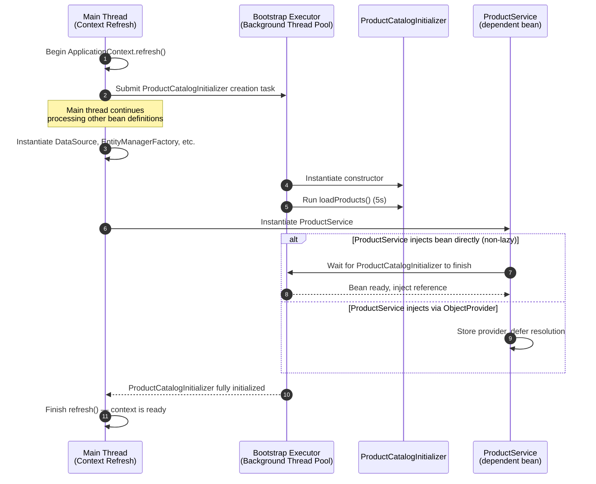
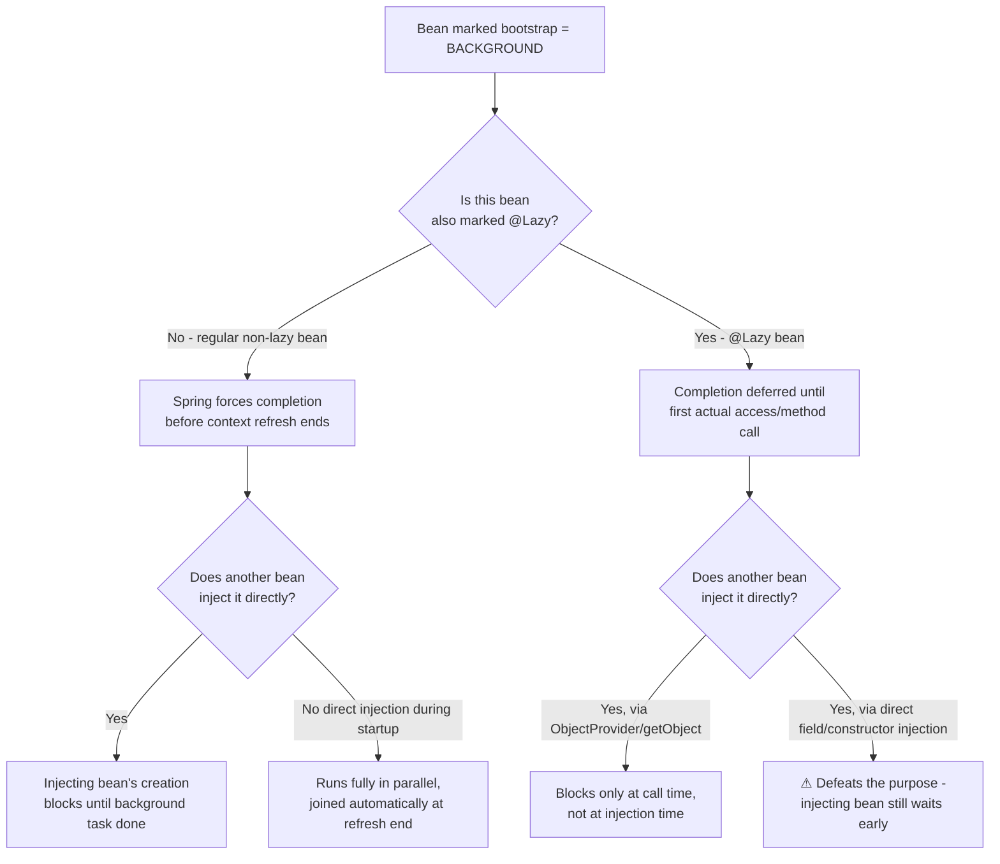
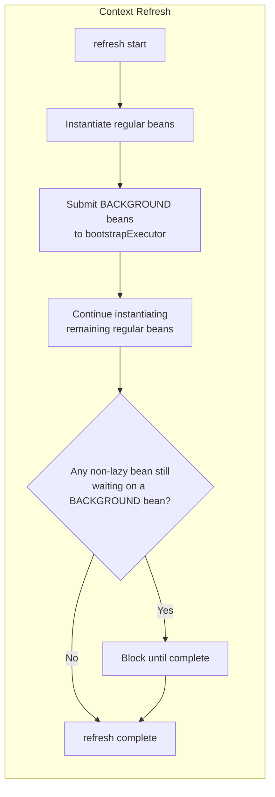
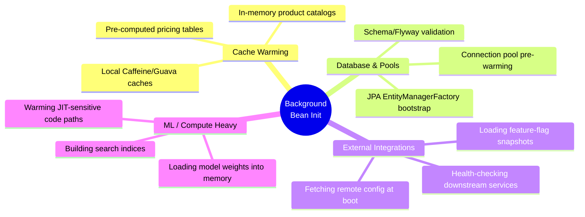

# Bean Background Initialization in Spring Framework: The Complete Guide

## 1. Introduction

Application startup time is one of those metrics that quietly determines how good an engineering team's day is going to be. In monolithic applications running for weeks at a time, a slow boot is a minor annoyance. In cloud-native, container-orchestrated, auto-scaling systems, however, a slow boot is a production incident waiting to happen — Kubernetes liveness probes time out, horizontal pod autoscalers can't react fast enough to traffic spikes, and rolling deployments take longer than they should.

**Bean background initialization**, introduced in **Spring Framework 6.2**, directly targets this problem. It allows the Spring container to initialize selected beans *asynchronously*, on a separate thread, while the rest of the `ApplicationContext` refresh proceeds on the main thread. Instead of the container blocking on every expensive bean one after another, expensive beans are handed off to a background executor, and the container only waits for them when something actually needs them.

In this tutorial, we'll build a complete mental model of this feature:

- Why Spring's traditional startup model creates bottlenecks
- How the `@Bean(bootstrap = Bean.Bootstrap.BACKGROUND)` mechanism works internally
- How to configure the required `bootstrapExecutor`
- Multiple worked examples (cache warming, database connection pools, ML model loading)
- How Spring guarantees dependency safety even with concurrent initialization
- How to safely consume background-initialized beans using `ObjectProvider` and `@Lazy`
- Real-world use cases, pitfalls, and testing strategies

By the end, you should be able to identify exactly which beans in your own application are good background-initialization candidates, and configure them correctly the first time.

---

## 2. Why Background Initialization Matters in Spring

### 2.1. The Synchronous Bean Lifecycle (Default Behavior)

By default, Spring initializes all **singleton beans** during the `ApplicationContext` refresh phase, strictly synchronously, on the main thread. For every bean, the container walks through the same lifecycle:

1. **Instantiation** — the constructor (or factory method) runs.
2. **Dependency injection** — fields, setters, or constructor parameters are populated.
3. **Initialization callbacks** — `@PostConstruct`, `InitializingBean.afterPropertiesSet()`, or custom `init-method`s run.
4. **Bean ready** — the bean is registered in the singleton cache and made available to the rest of the application.

This is deliberate and valuable: by the time `ApplicationContext.refresh()` returns, **every non-lazy singleton is guaranteed to be fully constructed and ready**. There's no "half-built bean" risk, no race conditions, no surprises. This predictability is one of the reasons Spring applications are so reliable in production.

The cost of that predictability is **serialization of work**. If you have 50 beans and each one takes 100ms to initialize, your context refresh takes at least 5 seconds — even if 49 of those beans have nothing to do with each other and could easily run in parallel.

### 2.2. The Single-Threaded Bottleneck, Visualized

```mermaid
gantt
    title Default Synchronous Startup (single thread, total ≈ 8.5s)
    dateFormat  X
    axisFormat %Lms

    section Main Thread
    DataSource bean          :a1, 0, 500
    JPA EntityManagerFactory :a2, after a1, 2000
    Redis Connection Pool    :a3, after a2, 800
    Product Catalog Preload  :a4, after a3, 5000
    Web MVC Beans             :a5, after a4, 200
```



Notice that everything happens **end-to-end on a single timeline**. The `ProductCatalogInitializer` we'll build below takes 5 seconds — and during those 5 seconds, *nothing else in the application can start*, even though loading a product catalog has zero functional dependency on, say, the web MVC infrastructure.

### 2.3. What Background Initialization Changes

```mermaid
gantt
    title Startup With Background Initialization (total ≈ 3.5s)
    dateFormat  X
    axisFormat %Lms

    section Main Thread
    DataSource bean          :a1, 0, 500
    JPA EntityManagerFactory :a2, after a1, 2000
    Redis Connection Pool    :a3, after a2, 800
    Web MVC Beans             :a5, after a3, 200

    section Bootstrap Executor Thread
    Product Catalog Preload  :b1, 0, 5000
```



The main thread no longer waits for `ProductCatalogInitializer` — it finishes its own work in **3.5 seconds**, while the catalog preload continues quietly in the background and is only "joined" if and when something actually requests it. The application becomes ready to accept traffic sooner, and the expensive task simply finishes whenever it finishes.

---

## 3. How the Background Initialization Mechanism Works

Spring's `bootstrap` attribute changes how a specific `@Bean` definition is processed during context refresh. Internally, three coordinated behaviors make this safe:

| Mechanism | What it does |
|---|---|
| **Async delegation** | The bean's instantiation + dependency injection + init-callback sequence is submitted as a task to a container-managed `bootstrapExecutor`, instead of running inline on the refresh thread. |
| **Dependency coordination** | If another (non-lazy) bean needs a background-initializing bean, Spring blocks *that specific injection point* until the background task completes — it never hands out a half-built object. |
| **Lifecycle preservation** | The full bean lifecycle (constructor → injection → `@PostConstruct` → ready) still executes in the exact same order; only the *thread* it runs on changes. |

### 3.1. The Full Sequence, Step by Step



The key insight: **the main thread keeps moving**. It only ever blocks on a background bean at the exact moment something tries to *use* it directly — and even then, only the dependent bean's creation is paused, not the whole context.

### 3.2. Decision Logic: When Does Spring Actually Wait?



This diagram explains a subtlety the original mechanism description hints at but doesn't fully spell out: **how you inject a background bean matters as much as how you declare it**. If you mark a bean `BACKGROUND` but every consumer injects it directly and eagerly, you've gained very little — you've just moved *when* the blocking happens, not *whether* it happens. We'll come back to this in Section 7.

---

## 4. Setting Up the Bootstrap Executor

Before any bean can actually be initialized in the background, Spring needs a thread pool to run the work on. **This is the step most tutorials skip — and the most common reason background initialization silently does nothing.**

> If no `bootstrapExecutor` bean is registered, Spring falls back to normal synchronous initialization for *every* bean marked `BACKGROUND`, with no error and no warning. Always verify the executor is wired up.

### 4.1. Plain Spring Framework (no Spring Boot)

Register a bean of type `Executor` (or `AsyncTaskExecutor`) named **exactly** `bootstrapExecutor`:

```java
@Configuration
public class BootstrapExecutorConfig {

    @Bean(name = "bootstrapExecutor")
    public AsyncTaskExecutor bootstrapExecutor() {
        ThreadPoolTaskExecutor executor = new ThreadPoolTaskExecutor();
        executor.setThreadNamePrefix("bg-init-");
        executor.setCorePoolSize(4);
        executor.setMaxPoolSize(8);
        executor.initialize();
        return executor;
    }
}
```

### 4.2. Spring Boot Applications

As of **Spring Boot 3.5**, you generally don't need to do anything: if an `applicationTaskExecutor` bean is present (the default auto-configured executor), Spring Boot **auto-configures a `bootstrapExecutor` for you**, and Spring Framework's background initialization uses it automatically to parallelize bean creation. If you've defined your own custom `Executor` and still want this auto-configuration stack, set:

```properties
spring.task.execution.mode=force
```

This tells Spring Boot to auto-configure the supporting executors (including `bootstrapExecutor`) even when you've supplied your own.

### 4.3. Verifying the Executor Is Actually Being Used

A simple way to confirm background initialization is working is to log the thread name inside the bean's constructor or init method:

```java
public class ProductCatalogInitializer {
    public ProductCatalogInitializer() {
        System.out.println("Initializing on thread: " + Thread.currentThread().getName());
        loadProducts();
    }
    // ...
}
```

If you see `main` in the logs, the executor isn't wired up correctly. If you see `bg-init-1` (or `applicationTaskExecutor-1` in Boot), it's working as intended.

---

## 5. Worked Example 1: Product Catalog Preload

Let's build the baseline example — a component simulating an expensive startup workload (cache warming, dataset loading, or external resource preparation):

```java
public class ProductCatalogInitializer {

    public ProductCatalogInitializer() {
        loadProducts();
    }

    private void loadProducts() {
        System.out.println("Starting product preload on thread: "
                + Thread.currentThread().getName());

        try {
            Thread.sleep(5000); // simulate an expensive DB scan / API call
        } catch (InterruptedException e) {
            Thread.currentThread().interrupt();
        }

        System.out.println("Product preload completed");
    }

    public String getStatus() {
        return "Catalog ready";
    }
}
```

Without any special configuration, `loadProducts()` runs on the main thread, blocking the entire `ApplicationContext` refresh for 5 seconds.

### 5.1. Enabling Background Initialization

```java
@Configuration
public class AppConfig {

    @Bean(bootstrap = Bean.Bootstrap.BACKGROUND)
    public ProductCatalogInitializer productCatalogInitializer() {
        return new ProductCatalogInitializer();
    }
}
```

That single attribute is enough to move this bean's entire creation — constructor, injection, and init callbacks — onto the `bootstrapExecutor` thread pool, *provided* that executor bean exists (see Section 4).

---

## 6. Worked Example 2: Database Connection Pool Warm-Up

Connection pools (HikariCP, for instance) often validate connections eagerly on startup. This is a textbook background-initialization candidate because nothing in a typical web tier truly needs the pool *fully* warm before the JVM finishes booting — it just needs to be ready before the first real request hits a controller.

```java
public class ReportingDataSourceWarmer {

    private final HikariDataSource dataSource;

    public ReportingDataSourceWarmer(HikariDataSource dataSource) {
        this.dataSource = dataSource;
        warmPool();
    }

    private void warmPool() {
        System.out.println("Warming reporting pool on thread: "
                + Thread.currentThread().getName());
        // Forces Hikari to establish its minimum-idle connections immediately
        // rather than lazily on first checkout.
        try (Connection ignored = dataSource.getConnection()) {
            System.out.println("Reporting pool warm");
        } catch (SQLException e) {
            throw new IllegalStateException("Failed to warm reporting pool", e);
        }
    }
}
```

```java
@Configuration
public class ReportingConfig {

    @Bean(bootstrap = Bean.Bootstrap.BACKGROUND)
    public ReportingDataSourceWarmer reportingDataSourceWarmer(HikariDataSource dataSource) {
        return new ReportingDataSourceWarmer(dataSource);
    }
}
```

Notice the dependency parameter `HikariDataSource dataSource` — Spring still resolves it normally. If `dataSource` itself were *also* a background bean, Spring's dependency coordination (Section 3.1) would simply chain the wait correctly.

---

## 7. Bean Injection: Direct vs. Deferred

A background-initialized bean can be injected exactly like any normal singleton — Spring's core dependency injection model doesn't change. The difference only shows up in **when** that injection blocks the consuming thread.

### 7.1. Direct Injection (Simple, but Can Re-Introduce Blocking)

```java
@Service
public class ProductServiceDirect {

    private final ProductCatalogInitializer initializer;

    public ProductServiceDirect(ProductCatalogInitializer initializer) {
        this.initializer = initializer; // blocks here if not yet finished
    }

    public void printStatus() {
        System.out.println("Bean status: " + initializer.getStatus());
    }
}
```

This works correctly and is safe — Spring guarantees `initializer` is fully built before this constructor receives it. But if `ProductServiceDirect` is itself a non-lazy, eagerly-created bean, its creation now *waits* for the background task, partially undermining the benefit.

### 7.2. Deferred Injection via `ObjectProvider` (Recommended for Genuinely Async Use)

```java
@Service
public class ProductService {

    private final ObjectProvider<ProductCatalogInitializer> initializerProvider;

    public ProductService(ObjectProvider<ProductCatalogInitializer> initializerProvider) {
        this.initializerProvider = initializerProvider;
    }

    public void printStatus() {
        ProductCatalogInitializer initializer = initializerProvider.getObject();
        System.out.println("Bean status: " + initializer.getStatus());
    }
}
```

Here, `ProductService` itself constructs instantly — no waiting at injection time. The actual dependency is only resolved when `getObject()` is called inside `printStatus()`, at which point Spring either returns the already-completed bean immediately, or blocks *only that call* if the background work hasn't finished yet.

### 7.3. Deferred Injection via `@Lazy`

An equally idiomatic alternative is to mark the injection point `@Lazy`, which causes Spring to inject a CGLIB proxy that defers the real lookup until first method call:

```java
@Service
public class ProductServiceLazy {

    private final ProductCatalogInitializer initializer;

    public ProductServiceLazy(@Lazy ProductCatalogInitializer initializer) {
        this.initializer = initializer; // proxy injected instantly
    }

    public void printStatus() {
        System.out.println("Bean status: " + initializer.getStatus()); // resolves here
    }
}
```

> **Rule of thumb:** background initialization (`bootstrap = BACKGROUND`) and deferred consumption (`ObjectProvider` or `@Lazy`) are a matched pair. Use background init without deferred consumption only when you're confident nothing accesses the bean early in the startup sequence.

---

## 8. Lifecycle and Dependency Safety Guarantees

It's worth being explicit about what Spring *promises* here, because this is the difference between "background initialization" and "just launching a raw thread yourself":

- **No partially-constructed beans are ever exposed.** A bean reference is only handed out once its full lifecycle (constructor → DI → `@PostConstruct`) has completed.
- **Non-lazy dependents always wait.** If bean `B` depends on background bean `A` through a normal (non-lazy) injection point, Spring transparently blocks `B`'s creation until `A` finishes — you get correctness without writing any synchronization code yourself.
- **All non-lazy background beans are forced to complete by the end of `refresh()`.** Background initialization speeds up *concurrent* startup, but it does not let the application become "ready" with unfinished singletons still dangling — unless you've explicitly marked them `@Lazy`, in which case completion is deferred to first access.
- **Per-bean dependency ordering still applies.** If a background bean itself depends on other beans, those dependencies must already be available — either because they were declared/created earlier, or via explicit `@DependsOn`.



---

## 9. Testing Background-Initialized Beans

Background initialization introduces timing into what used to be a fully deterministic startup, so tests need a small adjustment in mindset.

### 9.1. Asserting Completion at Context Startup (Integration Test)

```java
@SpringBootTest
class ProductCatalogInitializerTest {

    @Autowired
    private ProductCatalogInitializer initializer;

    @Test
    void contextRefreshCompletes_withCatalogReady() {
        // By the time @SpringBootTest finishes wiring the context,
        // Spring has already forced completion of non-lazy BACKGROUND beans.
        assertEquals("Catalog ready", initializer.getStatus());
    }
}
```

### 9.2. Verifying It Actually Ran on a Background Thread

```java
@Test
void initializerRuns_onBootstrapExecutorThread() {
    String threadName = capturedThreadNameDuringInit(); // your own capture hook
    assertTrue(threadName.startsWith("bg-init-")
            || threadName.startsWith("applicationTaskExecutor"));
}
```

### 9.3. Measuring the Startup Improvement

A simple, pragmatic test is to time `ApplicationContext.refresh()` with and without the `bootstrap` attribute set, using `ConfigurableApplicationContext.getStartupDate()` or wrapping the boot call with `System.nanoTime()`. This gives you concrete before/after numbers to justify the change in a PR description.

---

## 10. Real-World Use Cases



### 10.1. Cache Warming
Applications that pre-load reference data — currency rates, product catalogs, geolocation tables — into an in-memory cache benefit directly. The cache doesn't need to be hot the instant the JVM starts; it needs to be hot by the time real traffic arrives, which is usually a few seconds later anyway (load balancer health checks, container readiness probes, etc.).

### 10.2. Database Connection Pool & JPA Bootstrap
As shown in Section 6, eagerly validating and pre-establishing pool connections, or bootstrapping a Hibernate `SessionFactory`, are classic slow-startup culprits. Spring's JPA `LocalContainerEntityManagerFactoryBean` has long supported a related concept (`BootstrapMode.DEFERRED`/`LAZY`) for exactly this reason — bean background initialization generalizes the same idea to *any* bean, not just JPA infrastructure.

### 10.3. External Service Health Checks / Feature Flag Snapshots
Services that need to call out to a config server, feature-flag provider, or service registry during startup are prime candidates — network calls are unpredictable in latency and shouldn't gate the entire application's readiness.

### 10.4. ML Model Loading
Loading a model's weights into memory (a few hundred MB to several GB) can take seconds. Marking the model-loading bean `BACKGROUND` and exposing it through `ObjectProvider` lets the rest of the application (health endpoints, unrelated REST controllers) become available immediately, while inference endpoints simply wait — gracefully — until the model finishes loading.

---

## 11. Comparing Your Options

| Mechanism | Runs On | Blocks Context Refresh? | Best For |
|---|---|---|---|
| **Default synchronous init** | Main thread | Yes, always | Cheap beans, anything required immediately |
| **`bootstrap = BACKGROUND`** | `bootstrapExecutor` thread pool | Only if a non-lazy bean injects it directly | Expensive, independent beans (caches, pools, models) |
| **`@Lazy` (no background init)** | Caller's thread, on first access | No (deferred entirely) | Rarely-used beans, optional integrations |
| **`ApplicationRunner` / `CommandLineRunner`** | Main thread, *after* context is fully refreshed | N/A — runs post-startup | Work that should happen after the app is "ready" |
| **Manual `@Async` method** | Custom executor | No, but requires you to write your own coordination | Fire-and-forget background tasks unrelated to bean lifecycle |

The distinguishing advantage of `bootstrap = BACKGROUND` over a manually-launched thread or `@Async` method is that **Spring still owns the lifecycle and dependency graph** — you get parallelism without sacrificing the safety guarantees described in Section 8.

---

## 12. Common Pitfalls

- **Forgetting the `bootstrapExecutor` bean.** As covered in Section 4, this fails silently — no exception, just a fallback to synchronous init. Always verify with thread-name logging.
- **Pairing `BACKGROUND` with eager, non-lazy direct injection everywhere.** If every consumer injects the bean directly and eagerly, you've simply relocated the blocking point rather than removing it.
- **Using it for beans with cheap initialization.** The thread-pool submission and coordination overhead isn't free; reserve this for genuinely expensive beans (hundreds of milliseconds or more).
- **Assuming thread-safety is automatic for the bean's *internal* logic.** Spring guarantees the bean lifecycle itself is safe, but if `loadProducts()` mutates shared static state, you still need ordinary Java concurrency discipline.
- **Forgetting `@DependsOn` for implicit ordering.** If a background bean relies on something that isn't injected as a constructor/setter parameter (e.g., static initialization order), declare that dependency explicitly.

---

## 13. Conclusion

Bean background initialization, introduced in Spring Framework 6.2 via `@Bean(bootstrap = Bean.Bootstrap.BACKGROUND)`, gives you a controlled, Spring-aware way to parallelize expensive parts of application startup without sacrificing the dependency-injection guarantees that make Spring predictable in the first place.

The mechanism rests on three pillars: beans are delegated to a container-managed `bootstrapExecutor`, dependent beans transparently wait only when they actually need a not-yet-ready instance, and the full bean lifecycle is preserved regardless of which thread runs it. Pairing background-initialized beans with `ObjectProvider` or `@Lazy` injection points lets consumers avoid reintroducing the very blocking the feature is meant to eliminate.

Used deliberately — on cache warmers, connection pools, model loaders, and external integrations rather than on every bean indiscriminately — this feature can meaningfully shrink the time between "process started" and "application actually ready to serve traffic," which matters more with every passing year of containerized, auto-scaled deployment.

The original code samples this article builds on are available in the Baeldung Spring Core repository: [github.com/eugenp/tutorials/tree/master/spring-core-5](https://github.com/eugenp/tutorials/tree/master/spring-core-5).