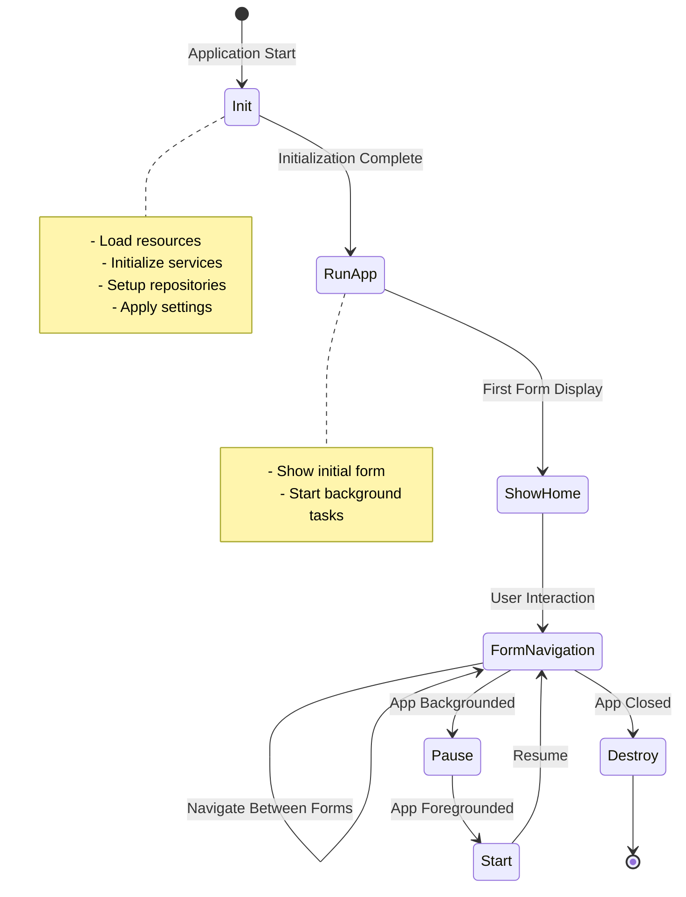
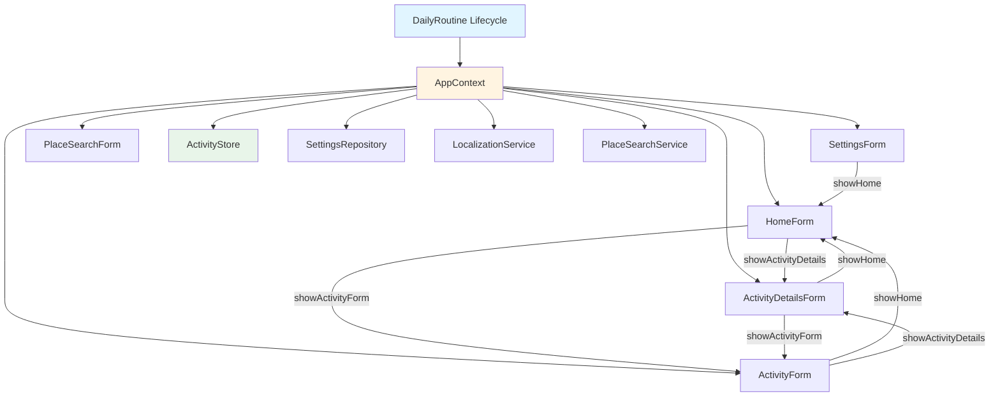
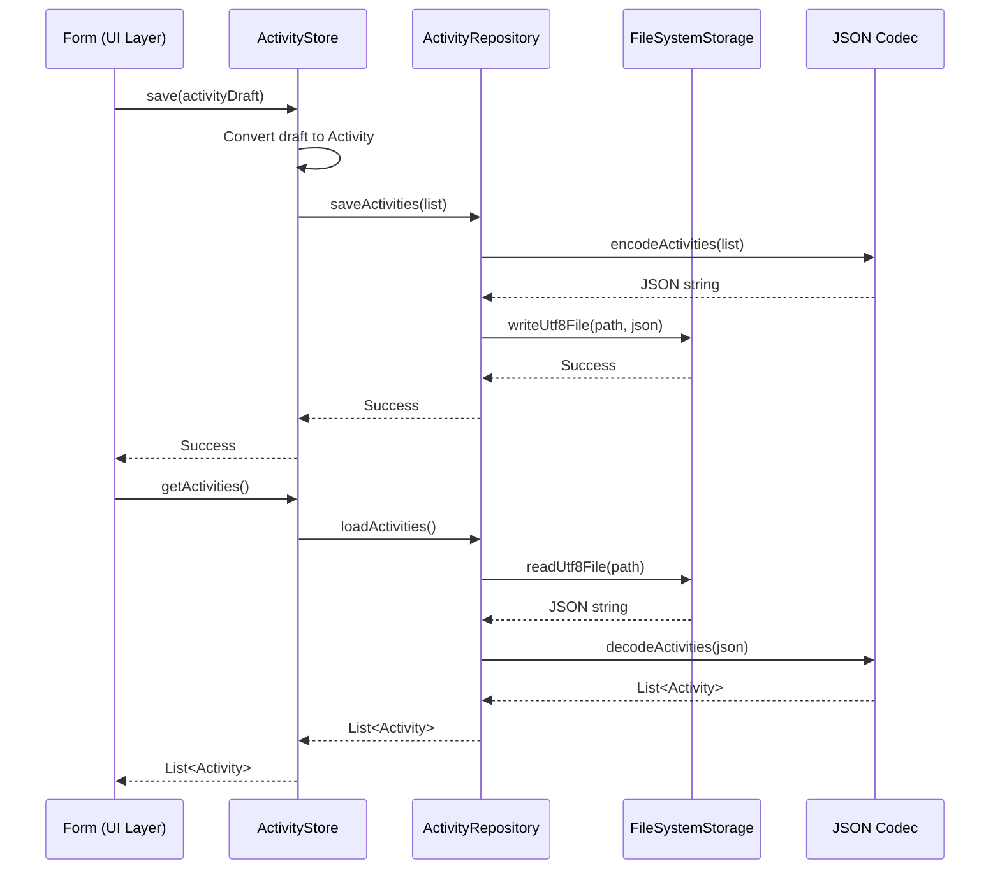

# Cross-Platform Java Development with Codename One - Complete Deep Dive

> **📚 Tutorial Series:** Advanced Cross-Platform Mobile Development  
> **⏱️ Estimated Reading Time:** 55-60 minutes  
> **⭐ Difficulty Level:** Intermediate to Advanced  
> **🎯 Target Audience:** Java/Kotlin developers seeking cross-platform mobile solutions  
> **📅 Last Updated:** June 2025

---

## 📋 Table of Contents

1. [Introduction & Market Context](#introduction--market-context)
2. [Prerequisites](#prerequisites)
3. [Learning Objectives](#learning-objectives)
4. [Framework Comparison](#framework-comparison)
5. [Architecture Deep Dive](#architecture-deep-dive)
6. [Project Setup & Configuration](#project-setup--configuration)
7. [Core Framework Concepts](#core-framework-concepts)
8. [Advanced UI Development](#advanced-ui-development)
9. [Data Management & Persistence](#data-management--persistence)
10. [Service Layer & REST Integration](#service-layer--rest-integration)
11. [Testing Strategies](#testing-strategies)
12. [Best Practices](#best-practices)
13. [Anti-Patterns to Avoid](#anti-patterns-to-avoid)
14. [Performance Optimization](#performance-optimization)
15. [Security Considerations](#security-considerations)
16. [Practice Exercises](#practice-exercises)
17. [Question Bank](#question-bank)
18. [Self-Assessment Checklist](#self-assessment-checklist)
19. [Summary & Key Takeaways](#summary--key-takeaways)
20. [Further Reading & Resources](#further-reading--resources)

---

## 🎯 Learning Objectives

By the end of this deep dive tutorial, you will:

- ✅ Understand Codename One's architecture and lifecycle model
- ✅ Build production-ready cross-platform mobile applications
- ✅ Implement responsive UIs with CSS and layout managers
- ✅ Design and implement repository patterns for data persistence
- ✅ Integrate REST APIs with proper error handling
- ✅ Apply best practices for maintainable Codename One apps
- ✅ Avoid common pitfalls and anti-patterns
- ✅ Test applications using Codename One's testing framework
- ✅ Optimize performance for mobile devices
- ✅ Implement security best practices

**Competency Mapping:**
- 🟢 Beginner: Sections 1-4
- 🟡 Intermediate: Sections 5-9
- 🔴 Advanced: Sections 10-15
- ⭐ Expert: Practice Exercises & Real-world Projects

---

## 1. Introduction & Market Context

### What is Codename One?

**[Codename One](https://www.codenameone.com/) is an open-source, commercially supported platform that lets Java and Kotlin developers build cross-platform applications from a single codebase**, while integrating with modern Maven-based workflows.

Its cloud-based build model reduces much of the platform-specific setup required for native development, letting us target iOS, Android, JavaScript, Windows, and macOS from the same project.

### Why Cross-Platform Development Matters in 2025

The mobile development landscape has evolved significantly:

- **Market Fragmentation:** 3+ major mobile platforms (iOS, Android, HarmonyOS)
- **Development Costs:** Native apps require 3x development resources
- **Maintenance Burden:** Each platform needs separate updates and bug fixes
- **Talent Scarcity:** Swift/Kotlin/Objective-C developers are expensive
- **Time to Market:** Cross-platform reduces development time by 40-60%

💡 **Pro Tip:** Codename One is particularly valuable for teams with strong Java expertise who want to leverage existing skills for mobile development without learning platform-specific languages.

### Real-World Use Cases

**Ideal For:**
- Enterprise internal tools and dashboards
- Business applications (CRM, ERP, inventory management)
- Educational apps and learning platforms
- Content-driven applications
- Forms and data collection apps
- Internal company portals

**Consider Alternatives When:**
- You need cutting-edge UI/UX with complex animations (consider Flutter)
- Your app is graphics-intensive (games, AR/VR)
- You need platform-specific features not yet supported
- Your team already has native development expertise

---

## 2. Prerequisites

### Required Knowledge
- ✅ **Java 17+** - Strong understanding of modern Java features (records, streams, Optional)
- ✅ **Maven** - Basic to intermediate Maven knowledge
- ✅ **OOP Principles** - Solid grasp of design patterns and SOLID principles
- ✅ **Basic UI Concepts** - Understanding of component-based UIs
- ✅ **REST APIs** - Familiarity with HTTP and JSON

### Development Environment
- **IDE:** IntelliJ IDEA (recommended) or Eclipse/VS Code
- **JDK:** OpenJDK 17 or higher
- **Memory:** Minimum 8GB RAM (16GB recommended for simulator)
- **Disk Space:** 2GB for development tools and build cache

### Optional but Helpful
- Basic CSS knowledge for styling
- Familiarity with mobile development concepts
- Understanding of threading and async operations
- Experience with testing frameworks (JUnit)

---

## 3. Framework Comparison

### Codename One vs Alternatives

| Feature | Codename One | Flutter | React Native | Xamarin |
|---------|--------------|---------|--------------|---------|
| **Primary Language** | Java/Kotlin | Dart | JavaScript/TypeScript | C# |
| **Learning Curve** | Low (Java devs) | Medium | Medium | Medium |
| **Performance** | Native | Near-native | Good | Native |
| **UI Paradigm** | Component-based | Widget-based | Component-based | Native controls |
| **Hot Reload** | ❌ No | ✅ Yes | ✅ Yes | ❌ No |
| **Build System** | Maven/Gradle | Gradle | Gradle/MSBuild | MSBuild |
| **Platform Support** | 5+ platforms | 6+ platforms | 2 platforms | 3 platforms |
| **Community Size** | Medium | Large | Very Large | Medium |
| **Cost** | Free/Open-source | Free/Open-source | Free/Open-source | Free/Open-source |
| **Enterprise Support** | ✅ Yes | ✅ Yes | ✅ Yes | ✅ Yes |
| **Maturity** | 15+ years | 6+ years | 8+ years | 12+ years |
| **Best For** | Java teams | New projects | JS teams | .NET teams |

📊 **Market Share (2024):**
- React Native: ~35% of cross-platform market
- Flutter: ~30% of cross-platform market
- Codename One: ~5% (strong in enterprise Java)
- Xamarin/MAUI: ~15% of cross-platform market

💡 **When to Choose Codename One:**
- Your team has strong Java expertise
- You need to target multiple platforms including desktop
- You prefer Maven-based workflows
- You need enterprise-grade support
- You want to avoid learning new languages (Dart, Swift, Kotlin)

---

## 4. Architecture Deep Dive

### 4.1 Application Lifecycle



**Deep Dive Analysis:**

The Codename One lifecycle follows a **state machine pattern** with clear phases:

1. **Init Phase:** One-time setup, resource loading, service initialization
2. **RunApp Phase:** Display the main interface
3. **Start/Pause Cycle:** Handle app foregrounding/backgrounding
4. **Destroy Phase:** Cleanup and resource release

🔍 **Key Insight:** The `Lifecycle` class provides default implementations for all lifecycle methods. You only override what your app needs, following the **Template Method Pattern**.

### 4.2 Navigation Architecture



**Architecture Principles:**

1. **Facade Pattern:** `AppContext` acts as a facade, providing simplified access to complex subsystems
2. **Dependency Injection (Lightweight):** Services are created once and passed to forms
3. **Single Responsibility:** Each form has one clear purpose
4. **Navigation Centralization:** All navigation logic lives in `AppContext`, not scattered across forms

✅ **Best Practice:** This architecture makes testing easier because you can mock `AppContext` and test forms in isolation.

### 4.3 Data Flow Architecture



**Data Flow Principles:**

1. **Separation of Concerns:** UI never touches file system directly
2. **Single Source of Truth:** `ActivityStore` is the only source for activities
3. **Immutable Data:** Activities are records (immutable), changes create new instances
4. **Error Propagation:** Errors bubble up from repository to UI for user feedback

---

## 5. Project Setup & Configuration

### 5.1 Creating the Project with Codename One Initializr

**Step-by-Step Process:**

1. **Navigate to Initializr:**
   ```
   https://www.codenameone.com/initializr/
   ```

2. **Configure Project Settings:**
   - **Main Class:** `DailyRoutine`
   - **Package:** `com.baeldung.cn1tutorial`
   - **Localization:** ✅ Include resource bundles
   - **Java Version:** 17
   - **Build System:** Maven

3. **Generate and Download:**
   - Click "Generate Project"
   - Download the ZIP file
   - Extract to your workspace

### 5.2 Understanding the Multi-Module Structure

```
codenameone-tutorial/
├── pom.xml                          # Parent POM (reactor)
├── common/                          # Shared code (95% of your app)
│   ├── pom.xml
│   ├── src/main/java/
│   │   └── com/baeldung/cn1tutorial/
│   │       ├── DailyRoutine.java    # Lifecycle class
│   │       ├── AppContext.java      # Shared context
│   │       ├── model/               # Domain objects
│   │       ├── store/               # In-memory stores
│   │       ├── repository/          # Persistence layer
│   │       ├── service/             # Business logic
│   │       └── ui/                  # Forms and components
│   ├── src/main/resources/
│   │   ├── theme.css                # Styling
│   │   └── bundle.properties        # Localization
│   └── src/test/                    # Tests
├── android/                         # Android-specific
├── ios/                             # iOS-specific
├── javase/                          # Desktop/Simulator
├── javascript/                      # JavaScript port
└── AGENTS.md                        # AI agent guidance
```

💡 **Deep Insight:** The multi-module structure enables **code sharing** while allowing platform-specific customizations. You write 95% of your code in `common`, and the build system handles platform differences.

### 5.3 Opening in IntelliJ IDEA

**Configuration Steps:**

1. **Open Project:**
   ```
   File → Open → Select project root folder (not 'common')
   ```

2. **Configure JDK:**
   - IntelliJ will prompt: "Project SDK is not defined"
   - Click "Add SDK" → "JDK"
   - Select OpenJDK 17 installation
   - Click "OK"

3. **Restore Codename One Run Configurations:**
   ```bash
   mvn cn1:configure-intellij
   ```
   
   This creates:
   - Simulator run configuration
   - Codename One Settings launcher
   - Update Codename One action
   - Build native configurations

4. **Verify Setup:**
   - Right-click project → "Maven" → "Reimport"
   - Wait for dependency resolution
   - Check that no errors appear in "Problems" view

⚠️ **Common Issue:** If you see "SDK not found" errors, ensure:
- JDK 17 is installed and `JAVA_HOME` is set
- Maven is configured in IntelliJ settings
- Internet connection is available for dependency download

### 5.4 Running the App in the Simulator

**First Run:**

1. **Start Simulator:**
   ```
   Right-click project → Run As → Codename One Simulator
   ```
   Or use the Maven goal:
   ```bash
   mvn cn1:simulate
   ```

2. **Simulator Features to Explore:**
   - **Device Skins:** Test on different screen sizes
   - **Orientation:** Rotate device (Ctrl+O)
   - **Theme:** Toggle light/dark mode
   - **Font Scale:** Test accessibility (Settings → Display → Font Size)
   - **Network:** Simulate slow/unreliable connections
   - **Screenshot:** Capture for documentation

3. **Development Workflow:**
   ```
   Edit code → Save (Ctrl+S) → Hot reload in simulator
   Edit CSS → Save → Theme updates automatically
   Run tests → Maven test goal
   ```

⚡ **Performance Tip:** The simulator is faster than building to a real device for UI iteration. Use it for 90% of development, test on real devices for final validation.

---

## 6. Core Framework Concepts

### 6.1 The Lifecycle Class Deep Dive

**Complete Implementation:**

```java
public class DailyRoutine extends Lifecycle {
    private AppContext appContext;
    
    @Override
    public void init(Object context) {
        super.init(context);  // ⚠️ Always call super first!
        
        // 1. Global Configuration
        Toolbar.setGlobalToolbar(true);
        
        // 2. Logging & Error Handling
        setupLogging();
        setupErrorHandling();
        
        // 3. Network Configuration
        ConnectionRequest.setFollowRedirects(true);
        ConnectionRequest.setTimeout(30000);  // 30 seconds
        
        // 4. Create Repositories
        ActivityRepository activityRepository = createActivityRepository();
        SettingsRepository settingsRepository = createSettingsRepository();
        
        // 5. Create In-Memory Stores
        ActivityStore activityStore = new ActivityStore(activityRepository);
        
        // 6. Load Theme Resources
        Resources themeResources = getTheme();
        
        // 7. Create Services
        LocalizationService localizationService = 
            createLocalizationService(themeResources);
        PlaceSearchService placeSearchService = 
            createPlaceSearchService();
        
        // 8. Load Settings
        AppSettings settings = settingsRepository.load();
        
        // 9. Create Application Context
        appContext = createAppContext(
            activityStore,
            settingsRepository,
            localizationService,
            placeSearchService,
            settings
        );
        
        // 10. Apply Settings
        applySettings(settings, false);
        
        // 11. Load Data
        activityStore.load();
    }
    
    @Override
    public void runApp() {
        if (appContext == null) {
            // Handle initialization failure
            Dialog.show("Error", 
                "Failed to initialize app", 
                "OK", null);
            return;
        }
        showHome();
    }
    
    @Override
    public void start() {
        super.start();
        
        // Refresh UI when app comes to foreground
        Form current = CN.getCurrentForm();
        if (current instanceof BaseForm baseForm) {
            baseForm.refresh();
        }
    }
    
    public void showHome() {
        new HomeForm(appContext).show();
    }
    
    // Factory methods for testability
    protected ActivityRepository createActivityRepository() {
        return new ActivityRepository();
    }
    
    protected SettingsRepository createSettingsRepository() {
        return new SettingsRepository();
    }
    
    protected LocalizationService createLocalizationService(
            Resources resources) {
        return new LocalizationService(resources);
    }
    
    protected PlaceSearchService createPlaceSearchService() {
        return new PlaceSearchService();
    }
}
```

🔍 **Deep Dive: Why This Pattern?**

1. **`super.init(context)` First:** The base `Lifecycle` class loads theme, sets up the display, and initializes the Codename One runtime. Always call it first.

2. **Factory Methods:** Making repository creation overridable enables **testing with mocks** without modifying production code.

3. **Order Matters:** 
   - Repositories before stores
   - Stores before context
   - Context before applying settings
   - Settings before loading data

4. **Error Handling:** The null check in `runApp()` prevents crashes if initialization fails.

### 6.2 The AppContext Pattern

**Purpose:** Centralized dependency injection without a framework

```java
public class AppContext {
    private final ActivityStore activityStore;
    private final SettingsRepository settingsRepository;
    private final LocalizationService localizationService;
    private final PlaceSearchService placeSearchService;
    private AppSettings settings;
    
    // Constructor injection
    public AppContext(
            ActivityStore activityStore,
            SettingsRepository settingsRepository,
            LocalizationService localizationService,
            PlaceSearchService placeSearchService,
            AppSettings settings) {
        this.activityStore = activityStore;
        this.settingsRepository = settingsRepository;
        this.localizationService = localizationService;
        this.placeSearchService = placeSearchService;
        this.settings = settings;
    }
    
    // Navigation methods
    public void showHome(Form current) {
        new HomeForm(this).show();
    }
    
    public void showActivityForm(Form current, Activity activity) {
        new ActivityForm(this, activity).show();
    }
    
    public void showActivityDetails(Form current, String activityId) {
        Activity activity = activityStore.getActivityById(activityId);
        new ActivityDetailsForm(this, activity).show();
    }
    
    public void showSettings(Form current) {
        new SettingsForm(this).show();
    }
    
    // Service accessors
    public ActivityStore getActivityStore() {
        return activityStore;
    }
    
    public SettingsRepository getSettingsRepository() {
        return settingsRepository;
    }
    
    public LocalizationService getLocalizationService() {
        return localizationService;
    }
    
    public PlaceSearchService getPlaceSearchService() {
        return placeSearchService;
    }
    
    // Settings management
    public AppSettings getSettings() {
        return settings;
    }
    
    public void updateSettings(AppSettings newSettings) {
        this.settings = newSettings;
        settingsRepository.save(newSettings);
        applySettings(newSettings, true);
    }
    
    // Localization helper
    public String text(String key, Object... args) {
        return localizationService.localize(key, settings.languageCode(), args);
    }
}
```

✅ **Benefits of This Pattern:**
- **Testability:** Mock `AppContext` in form tests
- **Decoupling:** Forms don't create their own dependencies
- **Consistency:** All forms access services the same way
- **Maintainability:** Changes to service creation only happen in one place

❌ **Anti-Pattern Warning:** Don't let `AppContext` become a "God Object." Keep it focused on navigation and service access, not business logic.

### 6.3 Form Architecture

**BaseForm Pattern:**

```java
public abstract class BaseForm extends Form {
    protected final AppContext context;
    protected final String titleKey;
    
    public BaseForm(AppContext context, String titleKey) {
        this.context = context;
        this.titleKey = titleKey;
        
        // Setup common UI elements
        setupToolbar();
        setupSideMenu();
    }
    
    private void setupToolbar() {
        Toolbar toolbar = getToolbar();
        toolbar.setTitle(context.text(titleKey));
        
        // Back command is automatic for layered navigation
        if (toolbar.getTitleComponent() instanceof Label titleLabel) {
            titleLabel.setUIID("TitleLabel");
        }
    }
    
    private void setupSideMenu() {
        SideMenu sideMenu = new SideMenu(context);
        toolbar.setSideMenu(sideMenu);
    }
    
    // Abstract method for subclasses to implement
    protected abstract void initializeUI();
    
    // Common refresh pattern
    public void refresh() {
        initializeUI();
        revalidate();
    }
}
```

**Concrete Form Example:**

```java
public class HomeForm extends BaseForm {
    private Container listContainer;
    
    public HomeForm(AppContext context) {
        super(context, "home.title");
        initializeUI();
    }
    
    @Override
    protected void initializeUI() {
        // Clear existing content
        removeAll();
        
        // Create layout
        setLayout(new BorderLayout());
        
        // Create activity list
        listContainer = new Container(BoxLayout.y());
        listContainer.setUIID("ActivityList");
        
        // Load and display activities
        refreshList();
        
        // Add to form
        add(BorderLayout.CENTER, listContainer);
        
        // Setup FAB (Floating Action Button)
        setupFAB();
    }
    
    private void refreshList() {
        List<Activity> activities = 
            context.getActivityStore().getActivitiesInInsertionOrder();
        
        listContainer.removeAll();
        
        for (Activity activity : activities) {
            listContainer.add(createActivityCard(activity));
        }
        
        // ⚠️ Critical: Tell Codename One to re-layout
        listContainer.revalidate();
    }
    
    private Container createActivityCard(Activity activity) {
        Container card = new Container(new LayeredLayout());
        card.setUIID("ActivityCard");
        
        // Card content
        Container content = new Container(new BorderLayout());
        Container textColumn = new Container(BoxLayout.y());
        
        Label titleLabel = new Label(activity.title());
        titleLabel.setUIID("ActivityTitle");
        
        Label categoryLabel = new Label(
            context.text(activity.category().localizationKey())
        );
        categoryLabel.setUIID("ActivityCategory");
        
        textColumn.addAll(titleLabel, categoryLabel);
        content.add(BorderLayout.CENTER, textColumn);
        card.add(content);
        
        // Overlay button for navigation
        Button overlay = new Button();
        overlay.setUIID("ActivityCardOverlay");
        overlay.addActionListener(e -> {
            context.showActivityDetails(this, activity.id());
        });
        card.add(overlay);
        
        return card;
    }
    
    private void setupFAB() {
        Button fab = new Button();
        fab.setUIID("FAB");
        fab.setMaterialIcon(FontIcon.MATERIAL_ADD);
        fab.addActionListener(e -> {
            context.showActivityForm(this, null);
        });
        
        // Place FAB in layered pane
        getLayeredPane().addOverlay(fab, 
            Graphics.BOTTOM | Graphics.RIGHT);
    }
}
```

🔍 **Critical Concept: `revalidate()`**

Codename One **does not automatically re-layout** after component changes. This is a **performance optimization** - avoiding unnecessary layout calculations in complex UIs.

**When to call `revalidate()`:**
- After adding/removing components
- After changing component hierarchy
- After updating UIIDs dynamically
- After changing layout managers

**When NOT to call `revalidate()`:**
- When only changing text or icons (use `repaint()`)
- During animation (use `animate()`)
- In tight loops (batch changes, then revalidate once)

---

## 7. Advanced UI Development

### 7.1 Layout Managers Comparison

| Layout Manager | Use Case | Strengths | Weaknesses | Example |
|----------------|----------|-----------|------------|---------|
| **BorderLayout** | Classic 5-region layout | Simple, predictable | Limited flexibility | Main form structure |
| **BoxLayout** | Linear arrangement | Easy to use | Can be inefficient | Activity list items |
| **FlowLayout** | Flowing content | Responsive | Hard to control precisely | Tag clouds |
| **GridLayout** | Uniform grids | Consistent sizing | All cells same size | Photo galleries |
| **GridBagLayout** | Complex grids | Very flexible | Complex API | Dashboard widgets |
| **LayeredLayout** | Overlapping components | Pixel-perfect design | Requires manual sizing | Activity cards |
| **GroupLayout** | Form builder-like | Visual designer support | Verbose code | Complex forms |
| **TableLayout** | Table-like structures | Row/column control | Less common | Data tables |
| **FlowLayout (Scrollable)** | Scrollable flowing | Handles overflow | Performance with many items | News feeds |

💡 **Pro Tip:** Combine layouts for complex UIs. Use `BorderLayout` for overall structure, then nest `BoxLayout` or `GridLayout` in each region.

### 7.2 CSS Styling Deep Dive

**Complete theme.css Example:**

```css
/* Global Styles */
global {
    background-color: #f5f7fa;
    color: #1f2933;
    font-family: "native:MainLight";
    font-size: 3mm;
}

/* Title Bar */
Title {
    background-color: #2563eb;
    color: #ffffff;
    font-size: 4mm;
    padding: 2mm;
}

TitleLabel {
    color: #ffffff;
    font-weight: bold;
}

/* Activity Cards */
ActivityCard {
    background: #ffffff;
    background-color: #ffffff;
    color: #1f2933;
    border: 1px solid #d6dde7;
    border-radius: 3mm;
    font-family: "native:MainLight";
    font-size: 3mm;
    margin: 1.2mm 0 1.2mm 0;
    padding: 1.4mm;
    box-shadow: 0 1px 3px rgba(0,0,0,0.1);
}

ActivityCard.pressed {
    background-color: #f0f4f8;
    border-color: #2563eb;
}

ActivityCard.selected {
    background-color: #e0e7ff;
    border-color: #2563eb;
}

ActivityTitle {
    font-size: 3.5mm;
    font-weight: bold;
    color: #1f2933;
}

ActivityCategory {
    font-size: 2.5mm;
    color: #6b7280;
}

/* Floating Action Button */
FAB {
    background-color: #2563eb;
    color: #ffffff;
    border-radius: 50%;
    padding: 3mm;
    margin: 2mm;
    box-shadow: 0 4px 12px rgba(37, 99, 235, 0.4);
}

FAB.pressed {
    background-color: #1d4ed8;
}

/* Form Inputs */
TextField {
    border: 1px solid #d6dde7;
    border-radius: 2mm;
    padding: 2mm;
    margin: 1mm 0;
    background-color: #ffffff;
}

TextField.focused {
    border-color: #2563eb;
    background-color: #fefeff;
}

/* Buttons */
Button {
    background-color: #2563eb;
    color: #ffffff;
    border-radius: 2mm;
    padding: 2mm 4mm;
    margin: 1mm;
    font-size: 3mm;
}

Button.pressed {
    background-color: #1d4ed8;
}

/* Dark Mode Support */
@media (prefers-color-scheme: dark) {
    global {
        background-color: #111827;
        color: #f3f4f6;
    }
    
    ActivityCard {
        background-color: #1f2937;
        border-color: #374151;
        color: #f3f4f6;
    }
    
    ActivityCard.pressed {
        background-color: #374151;
    }
    
    TextField {
        background-color: #1f2937;
        border-color: #374151;
        color: #f3f4f6;
    }
    
    TextField.focused {
        background-color: #111827;
    }
}

/* High Contrast Mode */
@media (prefers-contrast: high) {
    ActivityCard {
        border-width: 2px;
        border-color: #000000;
    }
    
    Button {
        border: 2px solid #000000;
    }
}
```

🔍 **CSS Deep Dive: Key Concepts**

1. **Native Fonts:** `"native:MainLight"` uses the device's system font for optimal readability
2. **Millimeter Units:** `3mm` scales with screen density, ensuring consistent physical size
3. **Pseudo-classes:** `.pressed`, `.focused`, `.selected` for interactive states
4. **Media Queries:** `@media (prefers-color-scheme: dark)` for automatic dark mode
5. **UIID Inheritance:** Child components inherit parent styles unless overridden

✅ **Best Practice:** Always test CSS on multiple screen sizes and both light/dark modes.

### 7.3 Responsive Design Patterns

**Pattern 1: Flexible Containers**

```java
// Use percentage-based layouts
Container mainContent = new Container(new BorderLayout());
mainContent.setUIID("MainContent");

// Center content with max width on tablets
Label content = new Label("Content");
content.setUIID("ResponsiveContent");

// CSS handles the responsive behavior
```

```css
/* Mobile: Full width */
ResponsiveContent {
    width: 100%;
    padding: 2mm;
}

/* Tablet: Max width with margins */
@media (screen-size: large) {
    ResponsiveContent {
        width: 80%;
        margin: 0 auto;
        padding: 4mm;
    }
}

/* Desktop: Fixed max width */
@media (screen-size: xlarge) {
    ResponsiveContent {
        width: 600px;
        margin: 0 auto;
        padding: 6mm;
    }
}
```

**Pattern 2: Conditional UI Elements**

```java
private void setupResponsiveUI() {
    Dimension screenSize = CN.getDisplayWidth();
    boolean isTablet = screenSize.getWidth() > 600;
    boolean isDesktop = screenSize.getWidth() > 1024;
    
    if (isTablet) {
        // Show side-by-side layout
        setupTabletLayout();
    } else if (isDesktop) {
        // Show desktop-optimized layout
        setupDesktopLayout();
    } else {
        // Show mobile layout
        setupMobileLayout();
    }
}
```

**Pattern 3: Adaptive Font Sizing**

```java
private int getAdaptiveFontSize(int baseSize) {
    int scale = UIManager.getInstance().getTheme().getThemeDimension(
        "global.font.scale", 100
    );
    
    // Cap at 150% to prevent overflow
    scale = Math.min(scale, 150);
    
    return (baseSize * scale) / 100;
}
```

⚠️ **Warning:** Always test with system font size increased to 200% to ensure accessibility.

---

## 8. Data Management & Persistence

### 8.1 Repository Pattern Implementation

**Complete Repository Example:**

```java
public class ActivityRepository {
    private static final String FILE_NAME = "activities.json";
    private final ActivityJsonCodec codec;
    private String testFilePath;  // For testing
    
    public ActivityRepository() {
        this.codec = new ActivityJsonCodec();
    }
    
    // Test-only setter
    void setTestFilePath(String path) {
        this.testFilePath = path;
    }
    
    public List<Activity> loadActivities() throws IOException {
        String path = filePath();
        
        // Check if file exists
        if (!FileSystemStorage.getInstance().exists(path)) {
            return new ArrayList<>();
        }
        
        // Read JSON
        String json = IOUtil.readUtf8File(path);
        
        // Decode to objects
        return codec.decodeActivities(json);
    }
    
    public void saveActivities(List<Activity> activities) 
            throws IOException {
        // Encode to JSON
        String json = codec.encodeActivities(activities);
        
        // Write to file
        IOUtil.writeUtf8File(filePath(), json);
    }
    
    private String filePath() {
        if (testFilePath != null) {
            return testFilePath;
        }
        return CN.getAppHomePath() + FILE_NAME;
    }
}
```

**JSON Codec Implementation:**

```java
public class ActivityJsonCodec {
    private static final String GSON = "Gson";
    
    public List<Activity> decodeActivities(String json) 
            throws IOException {
        try {
            // Use Gson for JSON parsing
            Gson gson = new Gson();
            Type listType = new TypeToken<List<Activity>>() {}.getType();
            List<Activity> activities = gson.fromJson(json, listType);
            
            // Validate and clean data
            return activities.stream()
                .filter(Objects::nonNull)
                .toList();
        } catch (Exception e) {
            throw new IOException("Failed to parse activities JSON", e);
        }
    }
    
    public String encodeActivities(List<Activity> activities) 
            throws IOException {
        try {
            Gson gson = new GsonBuilder()
                .setPrettyPrinting()
                .create();
            return gson.toJson(activities);
        } catch (Exception e) {
            throw new IOException("Failed to encode activities to JSON", e);
        }
    }
}
```

🔍 **Deep Dive: Design Decisions**

1. **Why JSON?** Human-readable, easy to debug, native support in Java
2. **Why Gson?** Mature library, handles complex types, good performance
3. **Why separate codec?** Single Responsibility Principle - repository handles storage, codec handles serialization
4. **Why test file path override?** Enables testing without touching production data

### 8.2 In-Memory Store Pattern

```java
public class ActivityStore {
    private final ActivityRepository repository;
    private List<Activity> activities;
    private boolean loaded;
    
    public ActivityStore(ActivityRepository repository) {
        this.repository = repository;
        this.activities = new ArrayList<>();
    }
    
    public synchronized void load() throws IOException {
        if (loaded) {
            return;  // Already loaded
        }
        
        activities = repository.loadActivities();
        loaded = true;
    }
    
    public synchronized List<Activity> getActivitiesInInsertionOrder() {
        return new ArrayList<>(activities);  // Return copy for safety
    }
    
    public synchronized Activity getActivityById(String id) {
        return activities.stream()
            .filter(a -> a.id().equals(id))
            .findFirst()
            .orElse(null);
    }
    
    public synchronized void save(Activity activity) {
        Objects.requireNonNull(activity, "Activity cannot be null");
        
        // Remove existing if present
        activities.removeIf(a -> a.id().equals(activity.id()));
        
        // Add updated version
        activities.add(activity);
        
        // Persist to storage
        persist();
    }
    
    public synchronized void toggleCompleted(String activityId) {
        Activity existing = getActivityById(activityId);
        if (existing == null) {
            return;
        }
        
        // Create new instance (Activity is immutable record)
        Activity updated = new Activity(
            existing.id(),
            existing.title(),
            existing.category(),
            existing.date(),
            existing.time(),
            existing.notes(),
            !existing.completed(),  // Toggle
            existing.place(),
            Instant.now()
        );
        
        save(updated);
    }
    
    private void persist() {
        try {
            repository.saveActivities(activities);
        } catch (IOException e) {
            // Handle error - notify user, retry, etc.
            Dialog.show("Error", 
                "Failed to save activity: " + e.getMessage(),
                "OK", null);
        }
    }
}
```

✅ **Key Design Decisions:**

1. **Synchronized Methods:** Thread-safe access (Codename One has EDT, but background tasks may access)
2. **Return Copies:** Prevent external modification of internal list
3. **Immutable Updates:** Create new `Activity` instances instead of modifying
4. **Lazy Loading:** Only load from disk when first accessed
5. **Error Handling:** Catch and report persistence errors

### 8.3 Data Validation

```java
public class ActivityValidator {
    public ValidationResult validate(ActivityDraft draft) {
        List<String> errors = new ArrayList<>();
        
        // Title validation
        if (draft.title() == null || draft.title().trim().isEmpty()) {
            errors.add("Title is required");
        } else if (draft.title().length() > 100) {
            errors.add("Title must be under 100 characters");
        }
        
        // Date validation
        if (draft.date() == null) {
            errors.add("Date is required");
        } else if (draft.date().isBefore(LocalDate.now())) {
            errors.add("Date cannot be in the past");
        }
        
        // Notes validation
        if (draft.notes() != null && draft.notes().length() > 1000) {
            errors.add("Notes must be under 1000 characters");
        }
        
        return new ValidationResult(errors.isEmpty(), errors);
    }
}

public record ValidationResult(boolean valid, List<String> errors) {
    public String getFirstError() {
        return errors.isEmpty() ? null : errors.get(0);
    }
}
```

---

## 9. Service Layer & REST Integration

### 9.1 Service Interface Design

```java
public interface PlaceSearchService {
    /**
     * Search for places matching the query
     * @param context Application context
     * @param query Search query
     * @param onSuccess Callback with results
     * @param onFailure Callback with error
     * @return Handle to cancel the request
     */
    SearchHandle search(
            AppContext context,
            String query,
            SuccessCallback<List<PlaceSuggestion>> onSuccess,
            FailureCallback<List<PlaceSuggestion>> onFailure
    );
    
    interface SearchHandle {
        void cancel();
    }
}

public record PlaceSuggestion(
    String id,
    String name,
    String address,
    double latitude,
    double longitude,
    String category
) {}
```

💡 **Design Principle:** The interface doesn't expose implementation details (Geoapify). This enables:
- Easy mocking for tests
- Swapping providers without changing UI
- Adding caching layers transparently

### 9.2 REST Service Implementation

```java
public class GeoapifyPlaceSearchService implements PlaceSearchService {
    private static final String BASE_URL = 
        "https://api.geoapify.com/v1/geocode/autocomplete";
    private static final int RESULT_LIMIT = 10;
    private static final int TIMEOUT = 10000;  // 10 seconds
    
    @Override
    public SearchHandle search(
            AppContext context,
            String query,
            SuccessCallback<List<PlaceSuggestion>> onSuccess,
            FailureCallback<List<PlaceSuggestion>> onFailure) {
        
        // Validate input
        if (query == null || query.trim().isEmpty()) {
            onSuccess.failure(new IllegalArgumentException("Query is empty"));
            return null;
        }
        
        // Build URL
        String url = buildUrl(context, query);
        
        // Create request
        ConnectionRequest request = new ConnectionRequest() {
            @Override
            protected void readResponse(InputStream input) 
                    throws IOException {
                String json = readFully(input);
                List<PlaceSuggestion> suggestions = 
                    parseSuggestions(json);
                onSuccess.success(suggestions);
            }
            
            @Override
            protected void handleError(Exception err) {
                onFailure.failure(err);
            }
        };
        
        request.setUrl(url);
        request.setPost(false);
        request.setTimeout(TIMEOUT);
        request.setHttpMethod("GET");
        
        // Add headers
        request.addRequestHeader("Accept", "application/json");
        
        // Execute asynchronously
        NetworkManager.getInstance().addToQueue(request);
        
        // Return handle for cancellation
        return () -> NetworkManager.getInstance().cancelRequest(request);
    }
    
    private String buildUrl(AppContext context, String query) {
        StringBuilder builder = new StringBuilder(BASE_URL);
        builder.append("?text=").append(Util.encodeUrl(query));
        builder.append("&format=geojson");
        builder.append("&limit=").append(RESULT_LIMIT);
        builder.append("&lang=").append(context.getSettings().languageCode());
        builder.append("&apiKey=").append(getApiKey());
        
        return builder.toString();
    }
    
    private String getApiKey() {
        // In production, use a backend proxy
        // This is for demo purposes only
        String key = AppConfig.geoapifyApiKey();
        
        if (key == null || key.isEmpty()) {
            throw new IllegalStateException(
                "Geoapify API key not configured"
            );
        }
        
        return key;
    }
    
    private List<PlaceSuggestion> parseSuggestions(String json) 
            throws IOException {
        try {
            JSONParser parser = new JSONParser();
            Map<String, Object> root = parser.parseJSON(
                new StringReader(json)
            );
            
            List<PlaceSuggestion> suggestions = new ArrayList<>();
            List features = (List) root.get("features");
            
            if (features == null) {
                return suggestions;
            }
            
            for (Object feature : features) {
                Map<String, Object> featureMap = (Map) feature;
                Map<String, Object> properties = 
                    (Map) featureMap.get("properties");
                Map<String, Object> geometry = 
                    (Map) featureMap.get("geometry");
                Map<String, Object> coords = 
                    (Map) geometry.get("coordinates");
                
                PlaceSuggestion suggestion = new PlaceSuggestion(
                    (String) properties.get("place_id"),
                    (String) properties.get("name"),
                    (String) properties.get("formatted"),
                    ((Number) coords.get("1")).doubleValue(),  // lat
                    ((Number) coords.get("0")).doubleValue(),  // lon
                    (String) properties.get("category")
                );
                
                suggestions.add(suggestion);
            }
            
            return suggestions;
        } catch (Exception e) {
            throw new IOException("Failed to parse GeoJSON", e);
        }
    }
}
```

🔍 **Critical Implementation Details:**

1. **Async by Default:** Network requests never block the EDT
2. **Timeout Configuration:** Prevents hanging requests
3. **Error Handling:** Proper exception propagation
4. **Cancellation Support:** Return handle to cancel in-flight requests
5. **Input Validation:** Validate before making network calls

⚠️ **Security Warning:** Never hardcode API keys in production. Use a backend proxy server.

### 9.3 Using the Service in UI

```java
public class PlaceSearchForm extends BaseForm {
    private TextField searchField;
    private Container resultsContainer;
    private SearchHandle currentSearch;
    
    public PlaceSearchForm(AppContext context) {
        super(context, "search.title");
        initializeUI();
    }
    
    @Override
    protected void initializeUI() {
        setLayout(new BorderLayout());
        
        // Search input
        searchField = new TextField();
        searchField.setHint("Search for a place...");
        searchField.setUIID("SearchField");
        searchField.addDataChangedListener((e, d) -> {
            // Debounce search
            scheduleSearch(searchField.getText());
        });
        
        Container searchContainer = new Container(
            new BorderLayout()
        );
        searchContainer.add(BorderLayout.CENTER, searchField);
        add(BorderLayout.NORTH, searchContainer);
        
        // Results
        resultsContainer = new Container(BoxLayout.y());
        resultsContainer.setUIID("SearchResults");
        add(BorderLayout.CENTER, new ScrollableY(resultsContainer));
    }
    
    private SearchHandle activeSearch;
    private Timer searchTimer;
    
    private void scheduleSearch(String query) {
        // Cancel previous search
        if (activeSearch != null) {
            activeSearch.cancel();
        }
        
        // Cancel previous timer
        if (searchTimer != null) {
            searchTimer.cancel();
        }
        
        // Debounce: wait 300ms after user stops typing
        searchTimer = new Timer();
        searchTimer.schedule(300, () -> {
            executeSearch(query);
        });
    }
    
    private void executeSearch(String query) {
        if (query.trim().isEmpty()) {
            resultsContainer.removeAll();
            resultsContainer.revalidate();
            return;
        }
        
        // Show loading indicator
        showLoadingIndicator();
        
        // Execute search
        activeSearch = context.getPlaceSearchService().search(
            context,
            query,
            this::onSearchSuccess,
            this::onSearchFailure
        );
    }
    
    private void onSearchSuccess(List<PlaceSuggestion> suggestions) {
        // Update UI on EDT
        CN.callSerially(() -> {
            resultsContainer.removeAll();
            
            if (suggestions.isEmpty()) {
                resultsContainer.add(createNoResultsMessage());
            } else {
                for (PlaceSuggestion suggestion : suggestions) {
                    resultsContainer.add(
                        createResultItem(suggestion)
                    );
                }
            }
            
            resultsContainer.revalidate();
        });
    }
    
    private void onSearchFailure(List<PlaceSuggestion> suggestions) {
        CN.callSerially(() -> {
            hideLoadingIndicator();
            Dialog.show("Search Error",
                "Failed to search places. Please try again.",
                "OK", null);
        });
    }
    
    private Component createResultItem(PlaceSuggestion suggestion) {
        Container item = new Container(new BorderLayout());
        item.setUIID("SearchResultItem");
        
        Label nameLabel = new Label(suggestion.name());
        nameLabel.setUIID("ResultName");
        
        Label addressLabel = new Label(suggestion.address());
        addressLabel.setUIID("ResultAddress");
        
        Container textContainer = new Container(BoxLayout.y());
        textContainer.addAll(nameLabel, addressLabel);
        
        item.add(BorderLayout.CENTER, textContainer);
        
        // Click to select
        Button selectButton = new Button();
        selectButton.addActionListener(e -> {
            onPlaceSelected(suggestion);
        });
        item.add(selectButton);
        
        return item;
    }
}
```

✅ **Best Practices Demonstrated:**
- Debouncing to reduce API calls
- Cancellation of previous requests
- EDT-safe UI updates with `CN.callSerially()`
- Loading indicators for user feedback
- Error handling with user-friendly messages

---

## 10. Testing Strategies

### 10.1 Unit Testing with AbstractTest

```java
public class ActivityRepositoryRoundTripTest extends AbstractTest {
    @Override
    public boolean runTest() throws Exception {
        String testPath = FileSystemStorage.getInstance().getAppHomePath()
            + "tests/activity-round-trip-"
            + System.currentTimeMillis()
            + ".json";
        
        try {
            // Create repository with test path
            TestActivityRepository repository = 
                new TestActivityRepository(testPath);
            
            // Create test data
            List<Activity> activities = new ArrayList<>();
            Activity original = createTestActivity();
            activities.add(original);
            
            // Save
            repository.saveActivities(activities);
            
            // Load
            List<Activity> loaded = repository.loadActivities();
            
            // Assertions
            assertEqual(1, loaded.size(), 
                "Exactly one activity should be loaded");
            assertEqual(original, loaded.get(0), 
                "Activity should survive JSON round trip");
            
            return true;
        } finally {
            // Cleanup
            FileSystemStorage.getInstance().delete(testPath);
        }
    }
    
    private Activity createTestActivity() {
        return new Activity(
            IdGenerator.newId(),
            "Test Activity",
            ActivityCategory.WORK,
            LocalDate.now(),
            LocalTime.now(),
            "Test notes",
            false,
            null,
            Instant.now()
        );
    }
}
```

### 10.2 JUnit 5 Tests (JavaSE Port)

```java
public class ActivityStoreTest {
    private ActivityStore store;
    private TestActivityRepository repository;
    
    @BeforeEach
    void setUp() {
        repository = new TestActivityRepository();
        store = new ActivityStore(repository);
    }
    
    @Test
    void testLoadActivities_EmptyFile_ReturnsEmptyList() 
            throws IOException {
        // No data saved yet
        store.load();
        
        List<Activity> activities = store.getActivitiesInInsertionOrder();
        assertTrue(activities.isEmpty());
    }
    
    @Test
    void testSaveActivity_PersistsCorrectly() throws IOException {
        Activity activity = createTestActivity();
        store.save(activity);
        
        // Create new store to verify persistence
        ActivityStore newStore = new ActivityStore(repository);
        newStore.load();
        
        List<Activity> loaded = newStore.getActivitiesInInsertionOrder();
        assertEquals(1, loaded.size());
        assertEquals(activity, loaded.get(0));
    }
    
    @Test
    void testToggleCompleted_UpdatesActivity() throws IOException {
        Activity activity = createTestActivity();
        store.save(activity);
        
        store.toggleCompleted(activity.id());
        
        Activity updated = store.getActivityById(activity.id());
        assertNotEquals(activity.completed(), updated.completed());
    }
    
    @Test
    void testGetActivityById_ReturnsCorrectActivity() 
            throws IOException {
        Activity activity1 = createTestActivity("Activity 1");
        Activity activity2 = createTestActivity("Activity 2");
        
        store.save(activity1);
        store.save(activity2);
        
        Activity found = store.getActivityById(activity1.id());
        assertEquals(activity1, found);
    }
}
```

### 10.3 UI Testing

```java
public class HomeFormTest extends AbstractTest {
    @Override
    public boolean runTest() throws Exception {
        // Setup
        AppContext context = createTestContext();
        HomeForm form = new HomeForm(context);
        
        // Add test activity
        Activity activity = createTestActivity();
        context.getActivityStore().save(activity);
        
        // Show form
        form.show();
        
        // Wait for UI to render
        delay(1000);
        
        // Verify activity card is displayed
        Container list = (Container) form.findByName("activityList");
        assertEqual(1, list.getComponentCount(), 
            "Should display one activity card");
        
        return true;
    }
}
```

---

## 11. Best Practices

### ✅ 11.1 Code Organization

**1. Separation of Concerns**
```java
// ✅ Good: Clear separation
public class ActivityForm {
    private final AppContext context;
    private ActivityDraft draft;  // UI state
    
    private void saveActivity() {
        // 1. Validate
        ValidationResult validation = validateDraft();
        if (!validation.valid()) {
            showError(validation.getFirstError());
            return;
        }
        
        // 2. Convert to domain object
        Activity activity = draft.toActivity();
        
        // 3. Persist via store
        context.getActivityStore().save(activity);
        
        // 4. Navigate
        context.showHome(this);
    }
}

// ❌ Bad: Mixed concerns
public class ActivityForm {
    private void saveActivity() {
        // UI validation mixed with persistence logic
        if (titleField.getText().isEmpty()) {
            // Direct file I/O in UI code
            FileSystemStorage fs = FileSystemStorage.getInstance();
            String json = fs.readFile("activities.json");
            // ... parsing logic in UI
        }
    }
}
```

**2. Immutable Domain Objects**
```java
// ✅ Good: Immutable record
public record Activity(
    String id,
    String title,
    ActivityCategory category,
    LocalDate date,
    LocalTime time,
    String notes,
    boolean completed,
    PlaceInfo place,
    Instant updatedAt
) {}

// ❌ Bad: Mutable class
public class Activity {
    public String title;
    public boolean completed;
    // ... mutable fields
}
```

**3. Factory Methods for Testability**
```java
// ✅ Good: Overridable factory methods
public class DailyRoutine extends Lifecycle {
    protected ActivityRepository createActivityRepository() {
        return new ActivityRepository();
    }
}

// In tests:
public class TestDailyRoutine extends DailyRoutine {
    @Override
    protected ActivityRepository createActivityRepository() {
        return new MockActivityRepository();
    }
}

// ❌ Bad: Direct instantiation
public class DailyRoutine extends Lifecycle {
    public void init() {
        ActivityRepository repo = new ActivityRepository();  // Can't mock
    }
}
```

### ✅ 11.2 Error Handling

**1. Graceful Degradation**
```java
// ✅ Good: Fallback behavior
private void loadMap(PlaceInfo place) {
    if (isBrowserComponentAvailable()) {
        showInteractiveMap(place);
    } else {
        showStaticMapImage(place);  // Fallback
    }
}

// ❌ Bad: Crash on unsupported platforms
private void loadMap(PlaceInfo place) {
    BrowserComponent browser = new BrowserComponent();  // May fail
    // No error handling
}
```

**2. User-Friendly Error Messages**
```java
// ✅ Good: Actionable error messages
try {
    activityStore.save(activity);
} catch (IOException e) {
    Dialog.show("Save Failed",
        "Unable to save activity. Please check storage permissions.",
        "Retry", "Cancel", (evt) -> {
            if (evt.getSource() == "Retry") {
                saveActivity();  // Retry
            }
        });
}

// ❌ Bad: Technical error messages
} catch (IOException e) {
    Dialog.show("Error", e.getMessage(), "OK", null);
    // User sees: "java.io.IOException: Permission denied"
}
```

**3. Logging for Debugging**
```java
// ✅ Good: Proper logging
private static final Logger LOG = Logger.getLogger(ActivityRepository.class);

public List<Activity> loadActivities() {
    try {
        LOG.info("Loading activities from: " + filePath());
        String json = IOUtil.readUtf8File(filePath());
        LOG.fine("Loaded JSON: " + json.length() + " bytes");
        return codec.decodeActivities(json);
    } catch (IOException e) {
        LOG.severe("Failed to load activities: " + e.getMessage());
        throw e;
    }
}
```

### ✅ 11.3 Performance Optimization

**1. Batch UI Updates**
```java
// ✅ Good: Single revalidate
private void refreshList() {
    listContainer.removeAll();
    
    for (Activity activity : activities) {
        listContainer.add(createCard(activity));
    }
    
    listContainer.revalidate();  // One revalidate for all changes
}

// ❌ Bad: Multiple revalidates
private void refreshList() {
    for (Activity activity : activities) {
        listContainer.add(createCard(activity));
        listContainer.revalidate();  // Expensive!
    }
}
```

**2. Lazy Loading**
```java
// ✅ Good: Load on demand
public class ActivityStore {
    private boolean loaded;
    
    public synchronized void load() {
        if (loaded) return;
        activities = repository.loadActivities();
        loaded = true;
    }
}

// ❌ Bad: Load everything upfront
public class ActivityStore {
    public ActivityStore() {
        activities = repository.loadActivities();  // Slow startup
    }
}
```

**3. Image Optimization**
```java
// ✅ Good: Scaled images
Image original = Image.createImage(path);
Image scaled = original.scaledWidth(100);
imageLabel.setIcon(scaled);

// ❌ Bad: Full-size images in UI
Image original = Image.createImage(path);  // 2000x2000
imageLabel.setIcon(original);  // Wastes memory
```

### ✅ 11.4 Threading Best Practices

**1. Always Use EDT for UI Updates**
```java
// ✅ Good: EDT-safe
NetworkManager.getInstance().addToQueue(request);
// In callback:
CN.callSerially(() -> {
    label.setText("Updated");  // UI update on EDT
});

// ❌ Bad: Direct UI update from background thread
new Thread(() -> {
    label.setText("Updated");  // May crash!
}).start();
```

**2. Offload Heavy Work**
```java
// ✅ Good: Background processing
CN.execute(() -> {
    // Heavy computation
    List<Activity> processed = processActivities(activities);
    
    // Update UI on EDT
    CN.callSerially(() -> {
        updateUI(processed);
    });
});

// ❌ Bad: Blocking EDT
public void processData() {
    List<Activity> processed = processActivities(activities);  // Slow!
    updateUI(processed);
}
```

---

## 12. Anti-Patterns to Avoid

### ❌ 12.1 Common Mistakes

**1. God Form (Anti-Pattern)**
```java
// ❌ Bad: Form doing everything
public class HomeForm extends Form {
    public void saveActivity() {
        // 500 lines of code doing:
        // - Validation
        // - JSON serialization
        // - File I/O
        // - Network calls
        // - Navigation
    }
}

// ✅ Good: Delegation
public class HomeForm extends Form {
    public void saveActivity() {
        draft.validate()
            .ifValid(this::persistActivity)
            .ifInvalid(this::showErrors);
    }
}
```

**2. Direct File System Access in UI**
```java
// ❌ Bad: UI code knows about storage
public class ActivityForm {
    private void save() {
        FileSystemStorage fs = FileSystemStorage.getInstance();
        String path = CN.getAppHomePath() + "data.json";
        fs.writeFile(path, json);  // UI shouldn't know paths
    }
}

// ✅ Good: Through repository
public class ActivityForm {
    private void save() {
        context.getActivityStore().save(activity);
    }
}
```

**3. Memory Leaks from Unregistered Listeners**
```java
// ❌ Bad: Listener never removed
public class ActivityForm {
    private void setup() {
        NetworkManager.getInstance().addNetworkListener(this);
        // Never removed, form leaks
    }
}

// ✅ Good: Proper cleanup
public class ActivityForm extends Form {
    private NetworkListener listener;
    
    public ActivityForm() {
        listener = new NetworkListener() { /* ... */ };
        NetworkManager.getInstance().addNetworkListener(listener);
    }
    
    @Override
    public void onDestroy() {
        NetworkManager.getInstance().removeNetworkListener(listener);
        super.onDestroy();
    }
}
```

**4. Blocking the EDT**
```java
// ❌ Bad: Network call on EDT
public void search() {
    String response = Util.downloadUrlToFile(url, path);  // Blocks!
    parseResults(response);
}

// ✅ Good: Async with callbacks
public void search() {
    ConnectionRequest request = new ConnectionRequest() {
        @Override
        protected void readResponse(InputStream input) {
            String response = readFully(input);
            parseResults(response);
        }
    };
    NetworkManager.getInstance().addToQueue(request);
}
```

**5. Hardcoded Values**
```java
// ❌ Bad: Magic numbers and strings
if (title.length() > 100) {
    Dialog.show("Error", "Title too long", "OK", null);
}

// ✅ Good: Constants and configuration
private static final int MAX_TITLE_LENGTH = 100;
private static final String ERROR_TITLE_TOO_LONG = 
    "error.title.too_long";

if (title.length() > MAX_TITLE_LENGTH) {
    Dialog.show(
        context.text(ERROR_TITLE_TOO_LONG),
        context.text("error.title.max_length", MAX_TITLE_LENGTH),
        "OK", null
    );
}
```

### ❌ 12.2 Performance Anti-Patterns

**1. Excessive Revalidation**
```java
// ❌ Bad: Revalidating in loop
for (Activity activity : activities) {
    container.add(createCard(activity));
    container.revalidate();  // Don't do this!
}

// ✅ Good: Single revalidate
for (Activity activity : activities) {
    container.add(createCard(activity));
}
container.revalidate();
```

**2. Creating Too Many Components**
```java
// ❌ Bad: Creating 1000 components
for (int i = 0; i < 1000; i++) {
    container.add(new Label("Item " + i));
}

// ✅ Good: Virtual scrolling or paging
int pageSize = 20;
for (int i = 0; i < pageSize; i++) {
    container.add(createItem(i));
}
// Implement infinite scroll for more items
```

**3. Large Images in Memory**
```java
// ❌ Bad: Loading full-resolution images
Image photo = Image.createImage("photo.jpg");  // 4000x3000
ImageViewer viewer = new ImageViewer(photo);

// ✅ Good: Scale to display size
Image original = Image.createImage("photo.jpg");
Image scaled = original.scaledWidth(CN.getDisplayWidth());
ImageViewer viewer = new ImageViewer(scaled);
```

---

## 13. Performance Optimization

### 13.1 Memory Management

**Profiling Memory Usage:**

```java
// Monitor memory usage
private void logMemoryUsage() {
    Runtime runtime = Runtime.getRuntime();
    long usedMemory = runtime.totalMemory() - runtime.freeMemory();
    long maxMemory = runtime.maxMemory();
    
    LOG.info(String.format(
        "Memory: %.2f MB / %.2f MB (%.1f%%)",
        usedMemory / 1024.0 / 1024.0,
        maxMemory / 1024.0 / 1024.0,
        (usedMemory * 100.0) / maxMemory
    ));
}
```

**Image Memory Optimization:**

```java
// ✅ Good: Efficient image loading
public Image loadOptimizedImage(String path, int targetWidth) {
    // Load and scale in one step
    Image original = Image.createImage(path);
    int scale = targetWidth * 100 / original.getWidth();
    return original.scaled(scale);
}

// Cache scaled images
private Map<String, Image> imageCache = new HashMap<>();

public Image getCachedImage(String path, int width) {
    String key = path + "_" + width;
    return imageCache.computeIfAbsent(key, k -> loadOptimizedImage(path, width));
}
```

### 13.2 Layout Optimization

**Minimize Layout Passes:**

```java
// ✅ Good: Batch operations
public void updateUI(List<Activity> activities) {
    // Suspend layout
    container.setShouldCalcPreferredSize(true);
    
    // Make all changes
    container.removeAll();
    for (Activity activity : activities) {
        container.add(createCard(activity));
    }
    
    // Single revalidate
    container.revalidate();
}

// ❌ Bad: Multiple layout passes
public void updateUI(List<Activity> activities) {
    container.removeAll();
    container.revalidate();  // Layout 1
    
    for (Activity activity : activities) {
        container.add(createCard(activity));
        container.revalidate();  // Layout N!
    }
}
```

### 13.3 Network Optimization

**Request Caching:**

```java
public class CachedPlaceSearchService implements PlaceSearchService {
    private final PlaceSearchService delegate;
    private final Map<String, List<PlaceSuggestion>> cache;
    private static final long CACHE_DURATION = 5 * 60 * 1000;  // 5 minutes
    private final Map<String, Long> cacheTimestamps;
    
    @Override
    public SearchHandle search(
            AppContext context,
            String query,
            SuccessCallback<List<PlaceSuggestion>> onSuccess,
            FailureCallback<List<PlaceSuggestion>> onFailure) {
        
        String cacheKey = query.toLowerCase().trim();
        
        // Check cache
        if (isCacheValid(cacheKey)) {
            onSuccess.success(cache.get(cacheKey));
            return () -> {};  // No-op cancel
        }
        
        // Delegate to actual service
        return delegate.search(context, query, 
            results -> {
                // Cache results
                cache.put(cacheKey, results);
                cacheTimestamps.put(cacheKey, System.currentTimeMillis());
                onSuccess.success(results);
            },
            onFailure
        );
    }
    
    private boolean isCacheValid(String key) {
        Long timestamp = cacheTimestamps.get(key);
        if (timestamp == null) return false;
        
        return (System.currentTimeMillis() - timestamp) < CACHE_DURATION;
    }
}
```

### 13.4 Performance Benchmarks

| Operation | Target Time | Acceptable | Poor |
|-----------|-------------|------------|------|
| App startup | < 2s | 2-3s | > 3s |
| Form transition | < 300ms | 300-500ms | > 500ms |
| List scroll (60fps) | 16ms/frame | 16-33ms | > 33ms |
| Network request | < 1s | 1-3s | > 3s |
| JSON parse (100 items) | < 50ms | 50-100ms | > 100ms |
| Image load & scale | < 200ms | 200-500ms | > 500ms |

---

## 14. Security Considerations

### 14.1 API Key Management

**❌ Never Do This:**
```java
// ❌ Bad: Hardcoded API key
public class AppConfig {
    public static final String GEOAPIFY_API_KEY = "abc123xyz789";
}
```

**✅ Do This Instead:**

```java
// Option 1: Backend proxy (most secure)
public class PlaceSearchService {
    public SearchHandle search(AppContext context, String query, ...) {
        String url = context.getBackendUrl() + "/api/places?q=" + query;
        // Backend handles API key securely
    }
}

// Option 2: Obfuscation (better than plaintext, not secure)
public class AppConfig {
    private static final String OBFUSCATED_KEY = 
        "m9x#k2$p";  // XOR obfuscated
    
    public static String geoapifyApiKey() {
        return xorDecode(OBFUSCATED_KEY, "secret");
    }
}

// Option 3: Build-time injection
// In pom.xml:
// <build>
//   <resources>
//     <resource>
//       <directory>src/main/resources</directory>
//       <filtering>true</filtering>
//     </resource>
//   </resources>
// </build>
// 
// In application.properties:
// geoapify.api.key=${GEOAPIFY_API_KEY}
```

### 14.2 Input Validation

```java
public class InputValidator {
    public static ValidationResult validateActivityTitle(String title) {
        List<String> errors = new ArrayList<>();
        
        if (title == null || title.trim().isEmpty()) {
            errors.add("Title is required");
        } else {
            // Sanitize
            String sanitized = title.trim();
            
            // Length check
            if (sanitized.length() > 100) {
                errors.add("Title must be under 100 characters");
            }
            
            // XSS prevention
            if (containsHtml(sanitized)) {
                errors.add("Title cannot contain HTML");
                sanitized = stripHtml(sanitized);
            }
        }
        
        return new ValidationResult(errors.isEmpty(), errors);
    }
    
    private static boolean containsHtml(String input) {
        return input.matches(".*<[^>]+>.*");
    }
    
    private static String stripHtml(String input) {
        return input.replaceAll("<[^>]+>", "");
    }
}
```

### 14.3 Secure Storage

```java
public class SecureSettingsRepository {
    public void save(AppSettings settings) {
        // Encrypt sensitive data
        String encryptedPassword = encrypt(settings.password());
        
        // Save encrypted version
        String json = encodeSettings(settings.withPassword(encryptedPassword));
        IOUtil.writeUtf8File(filePath(), json);
    }
    
    private String encrypt(String data) {
        // Use platform-specific secure storage
        // Codename One has built-in encryption APIs
        return CN.encrypt(data, "encryption-key");
    }
}
```

### 14.4 Network Security

```java
// ✅ Good: HTTPS only
ConnectionRequest request = new ConnectionRequest() {
    @Override
    protected void handleSecureConnection() {
        // Enforce HTTPS
        if (!getUrl().startsWith("https://")) {
            throw new SecurityException("Only HTTPS allowed");
        }
    }
};

// ✅ Good: Certificate pinning (advanced)
ConnectionRequest request = new ConnectionRequest();
request.setUrl("https://api.example.com");
request.setPinchToZoomEnabled(true);  // Validates certificate
```

---

## 15. Practice Exercises

### 💻 Exercise 1: Custom Activity Categories

**Difficulty:** ⭐⭐ Intermediate  
**Estimated Time:** 45 minutes

#### Requirements

Extend the activity system to support custom categories:

1. **Create a `CustomCategoryManager`** that allows users to:
   - Add custom categories with name, color, and icon
   - Edit existing custom categories
   - Delete custom categories
   - Reorder categories

2. **Update `ActivityCategory` enum** to support both built-in and custom categories

3. **Persist custom categories** to a separate JSON file

4. **Update UI** to show custom categories in the activity editor

#### Starter Code

```java
// CustomCategory.java
public record CustomCategory(
    String id,
    String name,
    int color,  // ARGB
    String icon,  // Font icon name
    int sortOrder
) {}

// CustomCategoryManager.java (incomplete)
public class CustomCategoryManager {
    private final CustomCategoryRepository repository;
    private List<CustomCategory> customCategories;
    
    public CustomCategoryManager(CustomCategoryRepository repository) {
        this.repository = repository;
        this.customCategories = new ArrayList<>();
    }
    
    public void load() throws IOException {
        // TODO: Load from repository
    }
    
    public List<CustomCategory> getAllCategories() {
        // TODO: Combine built-in and custom categories
        return null;
    }
    
    public void addCategory(CustomCategory category) {
        // TODO: Add with validation
    }
    
    public void updateCategory(CustomCategory updated) {
        // TODO: Update existing category
    }
    
    public void deleteCategory(String categoryId) {
        // TODO: Delete and handle activities using this category
    }
}
```

#### Complete Solution

<details>
<summary>Click to reveal solution</summary>

```java
// CustomCategoryManager.java (complete)
public class CustomCategoryManager {
    private final CustomCategoryRepository repository;
    private List<CustomCategory> customCategories;
    private static final String DEFAULT_CATEGORY_ID = "custom-default";
    
    public CustomCategoryManager(CustomCategoryRepository repository) {
        this.repository = repository;
        this.customCategories = new ArrayList<>();
    }
    
    public void load() throws IOException {
        customCategories = repository.loadCategories();
        
        // Ensure default category exists
        if (customCategories.isEmpty()) {
            customCategories.add(createDefaultCategory());
            save();
        }
    }
    
    private CustomCategory createDefaultCategory() {
        return new CustomCategory(
            DEFAULT_CATEGORY_ID,
            "Personal",
            0xFF6200EE,  // Purple
            "MaterialIcons.PERSON",
            100
        );
    }
    
    public List<CustomCategory> getAllCategories() {
        List<CustomCategory> all = new ArrayList<>();
        
        // Add built-in categories
        for (ActivityCategory builtIn : ActivityCategory.values()) {
            all.add(builtIn.toCustomCategory());
        }
        
        // Add custom categories
        all.addAll(customCategories);
        
        // Sort by sortOrder
        all.sort(Comparator.comparingInt(CustomCategory::sortOrder));
        
        return all;
    }
    
    public void addCategory(CustomCategory category) {
        validateCategory(category);
        
        // Ensure unique ID
        String id = category.id() != null ? category.id() : IdGenerator.newId();
        category = new CustomCategory(
            id,
            category.name(),
            category.color(),
            category.icon(),
            category.sortOrder()
        );
        
        customCategories.add(category);
        save();
    }
    
    public void updateCategory(CustomCategory updated) {
        validateCategory(updated);
        
        for (int i = 0; i < customCategories.size(); i++) {
            if (customCategories.get(i).id().equals(updated.id())) {
                customCategories.set(i, updated);
                save();
                return;
            }
        }
        
        throw new IllegalArgumentException(
            "Category not found: " + updated.id()
        );
    }
    
    public void deleteCategory(String categoryId) {
        // Don't delete built-in categories
        if (isBuiltInCategory(categoryId)) {
            throw new IllegalArgumentException(
                "Cannot delete built-in category"
            );
        }
        
        customCategories.removeIf(c -> c.id().equals(categoryId));
        
        // Reassign activities to default category
        context.getActivityStore().reassignCategory(
            categoryId, 
            ActivityCategory.OTHER
        );
        
        save();
    }
    
    private void validateCategory(CustomCategory category) {
        List<String> errors = new ArrayList<>();
        
        if (category.name() == null || category.name().trim().isEmpty()) {
            errors.add("Category name is required");
        }
        
        if (category.name().length() > 50) {
            errors.add("Category name must be under 50 characters");
        }
        
        if (category.sortOrder() < 0) {
            errors.add("Sort order must be non-negative");
        }
        
        if (!errors.isEmpty()) {
            throw new ValidationException(errors);
        }
    }
    
    private boolean isBuiltInCategory(String categoryId) {
        for (ActivityCategory builtIn : ActivityCategory.values()) {
            if (builtIn.getCode().equals(categoryId)) {
                return true;
            }
        }
        return false;
    }
    
    private void save() {
        try {
            repository.saveCategories(customCategories);
        } catch (IOException e) {
            throw new PersistenceException("Failed to save categories", e);
        }
    }
}
```

**Extension Challenges:**
1. Add category icons using FontImage
2. Implement drag-and-drop reordering
3. Add category colors with color picker
4. Support category templates
5. Add category statistics (how many activities per category)

</details>

---

### 💻 Exercise 2: Offline Mode with Sync

**Difficulty:** ⭐⭐⭐ Advanced  
**Estimated Time:** 90 minutes

#### Requirements

Implement offline-first architecture:

1. **Create `SyncManager`** that:
   - Queues changes when offline
   - Syncs when connection restored
   - Handles conflicts (server vs local)
   - Shows sync status to user

2. **Implement conflict resolution** strategies:
   - Last-write-wins
   - Manual resolution
   - Merge changes

3. **Add sync indicators** to UI

#### Starter Code

```java
// SyncOperation.java
public record SyncOperation(
    String id,
    OperationType type,
    String entityId,
    String entityType,
    String data,
    Instant timestamp,
    boolean synced
) {
    public enum OperationType {
        CREATE, UPDATE, DELETE
    }
}

// SyncManager.java (incomplete)
public class SyncManager {
    private final SyncRepository repository;
    private final NetworkManager networkManager;
    private boolean isOnline;
    private final List<SyncOperation> pendingOperations;
    
    public SyncManager(SyncRepository repository) {
        this.repository = repository;
        this.pendingOperations = new ArrayList<>();
        this.isOnline = true;
        
        // Listen for network changes
        NetworkManager.getInstance().addNetworkListener(this::onNetworkChange);
    }
    
    public void queueOperation(SyncOperation operation) {
        // TODO: Add to queue
    }
    
    public void sync() {
        if (!isOnline) {
            LOG.warning("Cannot sync while offline");
            return;
        }
        
        // TODO: Process pending operations
    }
    
    private void onNetworkChange(boolean connected) {
        this.isOnline = connected;
        
        if (connected) {
            sync();  // Auto-sync when back online
        }
    }
}
```

<details>
<summary>Click to reveal solution</summary>

```java
// SyncManager.java (complete)
public class SyncManager {
    private final SyncRepository repository;
    private final NetworkManager networkManager;
    private boolean isOnline;
    private final List<SyncOperation> pendingOperations;
    private static final int MAX_RETRIES = 3;
    
    public SyncManager(SyncRepository repository) {
        this.repository = repository;
        this.pendingOperations = new ArrayList<>();
        this.isOnline = NetworkManager.getInstance().isNetworkAvailable();
        
        // Listen for network changes
        NetworkManager.getInstance().addNetworkListener(this::onNetworkChange);
        
        // Load pending operations
        try {
            pendingOperations.addAll(repository.loadPendingOperations());
        } catch (IOException e) {
            LOG.severe("Failed to load pending operations: " + e.getMessage());
        }
    }
    
    public void queueOperation(SyncOperation operation) {
        Objects.requireNonNull(operation);
        
        // Add to local queue
        pendingOperations.add(operation);
        
        // Persist
        try {
            repository.saveOperation(operation);
        } catch (IOException e) {
            LOG.severe("Failed to save sync operation: " + e.getMessage());
        }
        
        // Try to sync immediately if online
        if (isOnline) {
            sync();
        } else {
            notifySyncStatus("Offline - changes will sync when connected");
        }
    }
    
    public void sync() {
        if (!isOnline) {
            LOG.warning("Cannot sync while offline");
            return;
        }
        
        if (pendingOperations.isEmpty()) {
            LOG.fine("No pending operations to sync");
            return;
        }
        
        notifySyncStatus("Syncing...");
        
        // Process operations sequentially
        new Thread(() -> {
            List<SyncOperation> failed = new ArrayList<>();
            
            for (SyncOperation operation : pendingOperations) {
                try {
                    boolean success = syncOperation(operation);
                    
                    if (success) {
                        // Mark as synced
                        operation = new SyncOperation(
                            operation.id(),
                            operation.type(),
                            operation.entityId(),
                            operation.entityType(),
                            operation.data(),
                            operation.timestamp(),
                            true
                        );
                        repository.markAsSynced(operation.id());
                    } else {
                        failed.add(operation);
                    }
                } catch (Exception e) {
                    LOG.severe("Failed to sync operation " + 
                        operation.id() + ": " + e.getMessage());
                    failed.add(operation);
                }
            }
            
            // Update pending list
            pendingOperations.clear();
            pendingOperations.addAll(failed);
            
            // Notify UI
            CN.callSerially(() -> {
                if (failed.isEmpty()) {
                    notifySyncStatus("Sync complete");
                } else {
                    notifySyncStatus("Sync incomplete - " + 
                        failed.size() + " operations pending");
                }
            });
        }).start();
    }
    
    private boolean syncOperation(SyncOperation operation) 
            throws IOException {
        // Build API request based on operation type
        ConnectionRequest request = new ConnectionRequest() {
            @Override
            protected void readResponse(InputStream input) 
                    throws IOException {
                // Handle response
            }
            
            @Override
            protected void handleError(Exception err) {
                throw new IOException("Sync failed", err);
            }
        };
        
        request.setUrl(buildSyncUrl(operation));
        request.setHttpMethod(getHttpMethod(operation.type()));
        request.setRequestBody(operation.data());
        
        // Execute with retry logic
        return executeWithRetry(request, MAX_RETRIES);
    }
    
    private boolean executeWithRetry(
            ConnectionRequest request, 
            int maxRetries) {
        for (int attempt = 0; attempt < maxRetries; attempt++) {
            try {
                NetworkManager.getInstance().addToQueueAndWait(request);
                return request.getResponseCode() == 200;
            } catch (Exception e) {
                if (attempt == maxRetries - 1) {
                    return false;
                }
                
                // Exponential backoff
                try {
                    Thread.sleep((long) Math.pow(2, attempt) * 1000);
                } catch (InterruptedException ie) {
                    Thread.currentThread().interrupt();
                    return false;
                }
            }
        }
        return false;
    }
    
    private void onNetworkChange(boolean connected) {
        this.isOnline = connected;
        
        CN.callSerially(() -> {
            if (connected) {
                notifySyncStatus("Back online - syncing...");
                sync();
            } else {
                notifySyncStatus("You are offline");
            }
        });
    }
    
    private void notifySyncStatus(String message) {
        // Post event to UI
        CN.fireEvent(new SyncStatusEvent(message, isOnline));
    }
    
    public boolean isOnline() {
        return isOnline;
    }
    
    public int getPendingOperationsCount() {
        return pendingOperations.size();
    }
}
```

**Extension Challenges:**
1. Implement three-way merge for conflicts
2. Add sync progress indicator
3. Support selective sync (choose what to sync)
4. Add sync scheduling (sync only on WiFi)
5. Implement delta sync (only changed fields)

</details>

---

### 💻 Exercise 3: Push Notifications

**Difficulty:** ⭐⭐⭐ Advanced  
**Estimated Time:** 60 minutes

#### Requirements

Implement push notification system:

1. **Create `NotificationService`** that:
   - Registers device for push notifications
   - Handles incoming notifications
   - Shows notifications when app is backgrounded
   - Handles notification taps

2. **Create notification types:**
   - Activity reminders
   - Daily summary
   - Custom alerts

3. **Add notification preferences** in settings

<details>
<summary>Click for hints</summary>

**Hints:**
- Use `Push` class from Codename One
- Store device token in `SettingsRepository`
- Handle notifications in `init()` method
- Use `NotificationManager` for displaying notifications
- Consider notification channels (Android) vs categories (iOS)

</details>

---

### 💻 Exercise 4: Custom UI Component

**Difficulty:** ⭐⭐⭐ Advanced  
**Estimated Time:** 75 minutes

#### Requirements

Create a reusable `ActivityTimeline` component:

1. **Visual Design:**
   - Vertical timeline with alternating left/right items
   - Time markers on center line
   - Activity cards on each side
   - Connector lines between items

2. **Features:**
   - Scrollable timeline
   - Click to view activity details
   - Today marker
   - Expandable items

3. **Customization:**
   - Configurable colors
   - Date range filtering
   - Category-based filtering

<details>
<summary>Click for starter code</summary>

```java
public class ActivityTimeline extends Container {
    private final AppContext context;
    private LocalDate startDate;
    private LocalDate endDate;
    private ActivityCategory filterCategory;
    
    public ActivityTimeline(AppContext context) {
        this.context = context;
        setLayout(new TimelineLayout());
        setUIID("ActivityTimeline");
    }
    
    public void setDateRange(LocalDate start, LocalDate end) {
        this.startDate = start;
        this.endDate = end;
        refresh();
    }
    
    public void setCategoryFilter(ActivityCategory category) {
        this.filterCategory = category;
        refresh();
    }
    
    private void refresh() {
        removeAll();
        
        List<Activity> activities = filterActivities();
        for (Activity activity : activities) {
            add(createTimelineItem(activity));
        }
        
        revalidate();
    }
    
    private Component createTimelineItem(Activity activity) {
        // TODO: Implement timeline item
        return null;
    }
}
```

</details>

---

## 16. Question Bank

### 📝 Conceptual Questions

**Q1: What is the purpose of the `AppContext` class in Codename One applications?**

<details>
<summary>Answer</summary>

The `AppContext` class serves as a **lightweight dependency injection container** and **navigation facade**. Its purposes are:

1. **Centralized Service Access:** Provides forms with access to repositories, services, and settings without each form creating its own dependencies
2. **Navigation Hub:** All navigation logic is centralized, making it easy to change navigation patterns
3. **Testability:** Can be easily mocked in tests, allowing forms to be tested in isolation
4. **Decoupling:** Forms don't need to know about service creation or configuration
5. **Shared State:** Provides access to shared application state like current user, settings, etc.

**Key Benefit:** Without `AppContext`, each form would need to create and manage its own dependencies, leading to tight coupling and difficult testing.

</details>

---

**Q2: Why does Codename One require explicit `revalidate()` calls instead of automatic layout updates?**

<details>
<summary>Answer</summary>

Codename One requires explicit `revalidate()` for **performance optimization**:

1. **Layout is Expensive:** Calculating component positions and sizes, especially with complex layouts, can be computationally expensive
2. **Batch Updates:** Developers can make multiple changes and call `revalidate()` once, reducing layout calculations
3. **Predictable Performance:** Explicit calls make performance characteristics predictable
4. **Mobile Constraints:** Mobile devices have limited CPU, so avoiding unnecessary layout passes is critical for smooth 60fps scrolling

**Trade-off:** Web frameworks like React automatically re-render, which is convenient but can lead to performance issues with complex UIs. Codename One's explicit approach gives developers more control.

**When to call `revalidate()`:**
- After adding/removing components
- After changing component hierarchy
- After changing layout managers
- After updating UIIDs

**When NOT to call:**
- When only changing text/icons (use `repaint()`)
- During animations (use `animate()`)

</details>

---

**Q3: Explain the difference between `repaint()` and `revalidate()` in Codename One.**

<details>
<summary>Answer</summary>

**`repaint()`:**
- **Purpose:** Requests a redraw of the component
- **When to use:** When only the visual appearance changes (text, color, icon)
- **Performance:** Lightweight - only redraws pixels
- **Example:** Changing a label's text

```java
label.setText("New Text");
label.repaint();  // Just redraws the text
```

**`revalidate()`:**
- **Purpose:** Requests a new layout calculation
- **When to use:** When component hierarchy changes (add/remove components, change layout)
- **Performance:** More expensive - recalculates positions and sizes
- **Example:** Adding a new component to a container

```java
container.add(new Button("Click"));
container.revalidate();  // Recalculates layout for all components
```

**Key Difference:**
- `repaint()` = "Redraw what you have"
- `revalidate()` = "Recalculate where everything goes, then redraw"

**Best Practice:** Use the lightest operation needed. If only appearance changes, use `repaint()`. If structure changes, use `revalidate()`.

</details>

---

**Q4: What are the advantages of using immutable domain objects (Java records) in Codename One applications?**

<details>
<summary>Answer</summary>

**Advantages of Immutable Domain Objects:**

1. **Thread Safety:** Immutable objects are inherently thread-safe, preventing concurrency bugs
2. **Simplified State Management:** No need to track who's modifying objects
3. **Safe Caching:** Can be safely cached without worrying about modification
4. **Easier Testing:** Predictable state - no setup/teardown needed
5. **Prevents Bugs:** Can't accidentally modify shared state
6. **Value Semantics:** Can use `equals()` for comparison instead of ID checks

**Example:**

```java
// ✅ Immutable record
public record Activity(String id, String title, boolean completed) {}

// Creating "modified" version
Activity original = new Activity("1", "Task", false);
Activity updated = new Activity(
    original.id(),
    original.title(),
    true  // New completed status
);

// ❌ Mutable class
public class Activity {
    public String id;
    public boolean completed;  // Anyone can change this!
}
```

**Trade-off:** Immutability requires creating new instances for every change, which can use more memory. However, for typical mobile app data volumes, this is negligible compared to the benefits.

</details>

---

**Q5: Why is the repository pattern important in Codename One applications?**

<details>
<summary>Answer</summary>

The repository pattern provides several critical benefits:

1. **Abstraction:** UI code doesn't need to know about file systems, databases, or APIs
2. **Testability:** Easy to mock repositories for testing
3. **Flexibility:** Can change storage mechanism without changing UI
4. **Single Responsibility:** Repository handles persistence, UI handles display
5. **Consistency:** All data access follows the same pattern
6. **Error Handling:** Centralized error handling for data operations

**Example:**

```java
// UI code is storage-agnostic
context.getActivityStore().save(activity);

// Repository handles the details
public class ActivityRepository {
    public void saveActivities(List<Activity> activities) {
        String json = codec.encodeActivities(activities);
        IOUtil.writeUtf8File(filePath(), json);
    }
}
```

**Without Repository Pattern:**
```java
// ❌ UI knows too much
public class ActivityForm {
    private void save() {
        String json = convertToJson(activity);
        String path = CN.getAppHomePath() + "activities.json";
        FileSystemStorage.getInstance().writeFile(path, json);
        // What if we want to change storage? Change every form!
    }
}
```

</details>

---

### 📝 Code Analysis Questions

**Q6: Analyze this code and identify the problem:**

```java
public class ActivityForm extends Form {
    private ActivityStore store;
    
    public ActivityForm() {
        store = new ActivityStore(new ActivityRepository());
        store.load();
        
        Button saveButton = new Button("Save");
        saveButton.addActionListener(e -> {
            Activity activity = createActivityFromForm();
            store.save(activity);
            new HomeForm().show();
        });
    }
}
```

<details>
<summary>Answer</summary>

**Problems Identified:**

1. **No Dependency Injection:** Form creates its own dependencies, making testing difficult
2. **No AppContext:** Missing navigation context, creates new `HomeForm` directly
3. **No Error Handling:** `store.save()` can throw `IOException`, not caught
4. **Blocking Load:** `store.load()` called in constructor, could block EDT
5. **Tight Coupling:** Form knows about `ActivityStore` and `ActivityRepository`

**Improved Version:**

```java
public class ActivityForm extends BaseForm {
    private final AppContext context;
    
    public ActivityForm(AppContext context) {
        super(context, "activity.title");
        this.context = context;
        initializeUI();
    }
    
    private void initializeUI() {
        Button saveButton = new Button("Save");
        saveButton.addActionListener(e -> saveActivity());
    }
    
    private void saveActivity() {
        try {
            Activity activity = createActivityFromForm();
            context.getActivityStore().save(activity);
            context.showHome(this);
        } catch (IOException e) {
            Dialog.show("Error", 
                "Failed to save: " + e.getMessage(), 
                "OK", null);
        }
    }
}
```

**Benefits:**
- Testable with mocked `AppContext`
- Proper error handling
- Centralized navigation
- EDT-safe

</details>

---

**Q7: What's wrong with this network request implementation?**

```java
public void searchPlaces(String query) {
    String url = "https://api.example.com/search?q=" + query;
    String response = Util.downloadUrlToFile(url, "temp.txt");
    List<Place> places = parseResponse(response);
    updateUI(places);
}
```

<details>
<summary>Answer</summary>

**Critical Issues:**

1. **Blocking EDT:** `downloadUrlToFile()` is synchronous and blocks the UI thread, causing ANR (Application Not Responding)
2. **No Error Handling:** Network failures, timeouts, or invalid responses will crash the app
3. **No Timeout:** Request could hang indefinitely
4. **Temp File Management:** Creates temp file without cleanup
5. **No Cancellation:** User can't cancel the request
6. **URL Encoding:** Query not URL-encoded, could break with special characters

**Correct Implementation:**

```java
public void searchPlaces(String query) {
    String url = buildUrl(query);
    
    ConnectionRequest request = new ConnectionRequest() {
        @Override
        protected void readResponse(InputStream input) {
            try {
                String response = readFully(input);
                List<Place> places = parseResponse(response);
                
                // Update UI on EDT
                CN.callSerially(() -> updateUI(places));
            } catch (Exception e) {
                handleError(e);
            }
        }
        
        @Override
        protected void handleError(Exception err) {
            CN.callSerially(() -> showError(err));
        }
    };
    
    request.setUrl(url);
    request.setTimeout(10000);  // 10 seconds
    request.setPost(false);
    
    NetworkManager.getInstance().addToQueue(request);
}

private String buildUrl(String query) {
    return "https://api.example.com/search?q=" + 
        Util.encodeUrl(query);
}
```

</details>

---

**Q8: Identify the memory leak in this code:**

```java
public class HomeForm extends Form {
    private NetworkListener listener;
    
    public HomeForm() {
        listener = new NetworkListener() {
            public void connectionStateChanged(boolean connected) {
                updateNetworkStatus(connected);
            }
        };
        NetworkManager.getInstance().addNetworkListener(listener);
    }
}
```

<details>
<summary>Answer</summary>

**Memory Leak:** The `NetworkListener` is registered but never unregistered, causing a memory leak.

**Why This Leaks:**
1. `NetworkManager` holds a reference to `listener`
2. `listener` is an inner class that implicitly holds a reference to the outer `HomeForm` instance
3. When the form is closed, it should be garbage collected
4. But `NetworkManager` (a singleton) still holds the listener
5. Therefore, the form can never be garbage collected

**Fix:**

```java
public class HomeForm extends BaseForm {
    private NetworkListener listener;
    
    public HomeForm() {
        listener = new NetworkListener() {
            public void connectionStateChanged(boolean connected) {
                updateNetworkStatus(connected);
            }
        };
        NetworkManager.getInstance().addNetworkListener(listener);
    }
    
    @Override
    public void onDestroy() {
        // Cleanup
        NetworkManager.getInstance().removeNetworkListener(listener);
        listener = null;
        super.onDestroy();
    }
}
```

**Best Practice:** Always unregister listeners in `onDestroy()` or use weak references.

</details>

---

**Q9: This code has a threading issue. What is it?**

```java
public class ActivityStore {
    private List<Activity> activities;
    
    public void load() {
        activities = repository.loadActivities();  // Background thread
    }
    
    public List<Activity> getActivities() {
        return activities;  // Called from EDT
    }
}
```

<details>
<summary>Answer</summary>

**Threading Issue:** Race condition between background thread (loading) and EDT (reading).

**Problem:**
1. `load()` might be called on a background thread
2. `getActivities()` is called on EDT
3. If `load()` is still running when `getActivities()` is called, it returns `null` or partially loaded data
4. This can cause `NullPointerException` or inconsistent UI state

**Fix with Synchronization:**

```java
public class ActivityStore {
    private final List<Activity> activities;
    private boolean loaded;
    
    public ActivityStore() {
        this.activities = new ArrayList<>();
        this.loaded = false;
    }
    
    public synchronized void load() throws IOException {
        if (loaded) return;  // Already loaded
        
        List<Activity> loadedActivities = 
            repository.loadActivities();
        
        this.activities.clear();
        this.activities.addAll(loadedActivities);
        this.loaded = true;
    }
    
    public synchronized List<Activity> getActivities() {
        if (!loaded) {
            throw new IllegalStateException(
                "Store not loaded. Call load() first."
            );
        }
        return new ArrayList<>(activities);  // Return copy
    }
}
```

**Alternative:** Use `CN.callSeriallyInBackground()` for loading and notify UI when complete.

</details>

---

**Q10: What are the performance problems with this code?**

```java
public void refreshList() {
    for (Activity activity : activities) {
        Container card = createCard(activity);
        listContainer.add(card);
        listContainer.revalidate();  // Called in loop
    }
}
```

<details>
<summary>Answer</summary>

**Performance Issues:**

1. **Multiple Revalidates:** Calling `revalidate()` in the loop causes N layout calculations (where N = number of activities). Each `revalidate()` recalculates the layout for all components.

2. **Inefficient for Large Lists:** With 100 activities, this performs 100 layout calculations instead of 1.

**Optimized Version:**

```java
public void refreshList() {
    listContainer.removeAll();
    
    for (Activity activity : activities) {
        Container card = createCard(activity);
        listContainer.add(card);
    }
    
    // Single revalidate after all changes
    listContainer.revalidate();
}
```

**Further Optimization for Large Lists:**

```java
public void refreshList() {
    listContainer.removeAll();
    
    // Use paging for large datasets
    int pageSize = 20;
    int totalPages = (int) Math.ceil(
        (double) activities.size() / pageSize
    );
    
    for (int page = 0; page < totalPages; page++) {
        int start = page * pageSize;
        int end = Math.min(start + pageSize, activities.size());
        
        for (int i = start; i < end; i++) {
            listContainer.add(createCard(activities.get(i)));
        }
    }
    
    listContainer.revalidate();
}
```

**Even Better:** Implement virtual scrolling or use `InfiniteScrollAdapter` for very long lists.

</details>

---

### 📝 Practical Scenario Questions

**Q11: Your app crashes on startup with `NullPointerException` in `runApp()`. The stack trace shows `appContext` is null. What went wrong?**

<details>
<summary>Answer</summary>

**Likely Causes:**

1. **Exception in `init()`:** An exception occurred during initialization, preventing `appContext` from being set. Check logs for earlier exceptions.

2. **Missing `super.init(context)`:** If you override `init()` but forget to call `super.init(context)`, the base initialization doesn't happen.

3. **Service Creation Failure:** One of the services (repository, localization, etc.) threw an exception during creation.

**Debugging Steps:**

```java
@Override
public void init(Object context) {
    try {
        super.init(context);
        
        // Add logging
        LOG.info("Starting initialization...");
        
        Toolbar.setGlobalToolbar(true);
        LOG.info("Toolbar configured");
        
        ActivityRepository activityRepository = 
            createActivityRepository();
        LOG.info("Activity repository created");
        
        // ... rest of init
        
        LOG.info("Initialization complete");
        
    } catch (Exception e) {
        LOG.severe("Initialization failed: " + e.getMessage());
        e.printStackTrace();
        throw e;  // Re-throw to see full stack trace
    }
}
```

**Prevention:**
- Always wrap `init()` in try-catch during development
- Add logging at each step
- Validate each service creation
- Test with invalid/missing resources

</details>

---

**Q12: Users report that the app works fine in the simulator but crashes on real devices when loading activities. What could be the issue?**

<details>
<summary>Answer</summary>

**Likely Causes:**

1. **File Path Differences:** Simulator and device use different file system paths
   - Simulator: File system is more permissive
   - Device: Sandboxed, different permissions

2. **Case Sensitivity:** 
   - Windows (simulator): Case-insensitive file system
   - Android/iOS: Case-sensitive
   - `"Activities.json"` ≠ `"activities.json"`

3. **File Encoding:** Different default encodings between simulator and device

4. **Storage Permissions:** Device requires explicit storage permissions

**Solution:**

```java
public class ActivityRepository {
    public List<Activity> loadActivities() throws IOException {
        String path = filePath();
        
        LOG.info("Loading from: " + path);
        LOG.info("File exists: " + 
            FileSystemStorage.getInstance().exists(path));
        
        if (!FileSystemStorage.getInstance().exists(path)) {
            LOG.info("No existing file, returning empty list");
            return new ArrayList<>();
        }
        
        try {
            String json = IOUtil.readUtf8File(path);
            LOG.info("Loaded JSON: " + json.length() + " bytes");
            return codec.decodeActivities(json);
        } catch (Exception e) {
            LOG.severe("Failed to load: " + e.getMessage());
            // Return empty list instead of crashing
            return new ArrayList<>();
        }
    }
    
    private String filePath() {
        // Use consistent lowercase filename
        return CN.getAppHomePath() + "activities.json";
    }
}
```

**Testing:**
- Test on actual devices early in development
- Use same file paths everywhere
- Add comprehensive logging
- Handle file not found gracefully

</details>

---

**Q13: The UI is slow and laggy when scrolling through the activity list. How do you fix it?**

<details>
<summary>Answer</summary>

**Performance Optimization Steps:**

1. **Profile First:** Use Codename One's profiler to identify bottleneck

2. **Common Issues & Solutions:**

**Issue A: Too Many Components**
```java
// ❌ Bad: 1000 components
for (Activity activity : allActivities) {
    container.add(createCard(activity));
}

// ✅ Good: Paging
int pageSize = 20;
for (int i = 0; i < pageSize && i < activities.size(); i++) {
    container.add(createCard(activities.get(i)));
}
// Implement infinite scroll
```

**Issue B: Complex Card Layouts**
```java
// ❌ Bad: Nested layouts
Container card = new Container(new BorderLayout());
Container inner1 = new Container(new BoxLayout.y());
Container inner2 = new Container(new GridLayout(2, 2));
// ... many more nested containers

// ✅ Good: Flatter hierarchy
Container card = new Container(new LayeredLayout());
// Use absolute positioning or simpler layouts
```

**Issue C: Image Loading**
```java
// ❌ Bad: Loading full-size images
Image original = Image.createImage("photo.jpg");  // 4000x3000
ImageViewer viewer = new ImageViewer(original);

// ✅ Good: Scale images
Image scaled = original.scaledWidth(100);
ImageViewer viewer = new ImageViewer(scaled);

// ✅ Better: Cache scaled images
private Map<String, Image> imageCache = new HashMap<>();
Image getCachedImage(String path, int width) {
    return imageCache.computeIfAbsent(path, 
        p -> loadAndScale(p, width));
}
```

**Issue D: Unnecessary Revalidates**
```java
// ❌ Bad
for (Activity activity : activities) {
    container.add(createCard(activity));
    container.revalidate();  // Don't do this!
}

// ✅ Good
for (Activity activity : activities) {
    container.add(createCard(activity));
}
container.revalidate();  // Once at the end
```

**Issue E: Heavy Processing in UI**
```java
// ❌ Bad: Processing on EDT
public void refreshList() {
    List<Activity> processed = complexFiltering(activities);
    // This blocks UI
}

// ✅ Good: Background processing
CN.execute(() -> {
    List<Activity> processed = complexFiltering(activities);
    
    CN.callSerially(() -> {
        updateUI(processed);
    });
});
```

**Quick Wins:**
1. Enable `shouldCalcPreferredSize(false)` for containers with fixed sizes
2. Use `LayeredLayout` instead of nested layouts
3. Implement image caching
4. Use paging for long lists
5. Profile with Codename One profiler

</details>

---

**Q14: How do you handle configuration differences between development, staging, and production environments?**

<details>
<summary>Answer</summary>

**Strategy 1: Maven Profiles**

```xml
<!-- pom.xml -->
<profiles>
    <profile>
        <id>dev</id>
        <properties>
            <api.url>https://dev-api.example.com</api.url>
            <debug.mode>true</debug.mode>
        </properties>
    </profile>
    
    <profile>
        <id>prod</id>
        <properties>
            <api.url>https://api.example.com</api.url>
            <debug.mode>false</debug.mode>
        </properties>
    </profile>
</profiles>
```

Usage:
```bash
mvn cn1:simulate -Pdev
mvn cn1:build -Pprod
```

**Strategy 2: Build-Time Configuration**

```java
public class AppConfig {
    // Injected at build time from application.properties
    private static final String API_URL = 
        System.getProperty("api.url", "https://dev-api.example.com");
    
    public static String getApiUrl() {
        return API_URL;
    }
}
```

**Strategy 3: Runtime Configuration**

```java
public class AppConfig {
    private static AppSettings currentSettings;
    
    public static void initialize(AppSettings settings) {
        currentSettings = settings;
    }
    
    public static String getApiUrl() {
        return currentSettings != null 
            ? currentSettings.apiUrl() 
            : DEFAULT_API_URL;
    }
}
```

**Strategy 4: Environment Variables (Codename One Build Servers)**

```java
public class AppConfig {
    public static String getApiKey() {
        String key = System.getenv("API_KEY");
        if (key == null) {
            // Fallback for development
            key = "dev-key";
        }
        return key;
    }
}
```

**Best Practice:** Combine strategies:
- Maven profiles for build-time differences
- Runtime config for user-specific settings
- Environment variables for secrets (never commit secrets to Git)

</details>

---

**Q15: Your app works in the simulator but shows a blank screen on iOS. What could be wrong?**

<details>
<summary>Answer</summary>

**Common Causes:**

1. **Missing Launch Screen:**
   - iOS requires a launch screen storyboard
   - Check `ios/native/ios/LaunchScreen.storyboard`

2. **Info.plist Issues:**
   - Missing required permissions
   - Incorrect bundle identifier
   - Missing device orientation settings

3. **CSS Not Loading:**
   - Theme resources not included in build
   - Check `theme.res` is in `src/main/resources`

4. **iOS-Specific Code:**
   - Code that works on JavaSE but not iOS
   - Platform-specific APIs not available

**Debugging Steps:**

```java
// Add logging to lifecycle
@Override
public void init(Object context) {
    super.init(context);
    LOG.info("Init started");
    
    try {
        // Your init code
        LOG.info("Init completed successfully");
    } catch (Exception e) {
        LOG.severe("Init failed: " + e.getMessage());
        e.printStackTrace();
    }
}

@Override
public void runApp() {
    LOG.info("runApp called");
    
    if (appContext == null) {
        LOG.severe("appContext is null!");
        Dialog.show("Error", "App failed to initialize", "OK", null);
        return;
    }
    
    LOG.info("Showing home form");
    showHome();
}
```

**Check Build Output:**
```bash
# Build with verbose logging
mvn cn1:build -Pios -X

# Check for warnings about missing resources
```

**Common Fixes:**

1. **Clean and Rebuild:**
   ```bash
   mvn clean cn1:build -Pios
   ```

2. **Verify Resources:**
   ```bash
   # Check theme.res exists
   ls -la src/main/resources/theme.res
   ```

3. **Check iOS Native Folder:**
   ```bash
   ls -la ios/native/ios/
   # Should contain Info.plist, LaunchScreen.storyboard, etc.
   ```

4. **Test on Simulator First:**
   ```bash
   mvn cn1:simulate -Pios
   ```

**Prevention:**
- Test on real iOS devices early
- Use Codename One's cloud build for iOS (easier than local)
- Check build logs for warnings
- Join Codename One community for platform-specific help

</details>

---

## 17. Self-Assessment Checklist

### ✅ Skills Verification

Rate your proficiency in each area (1-5):

**Foundation:**
- [ ] Java 17 features (records, sealed classes, pattern matching)
- [ ] Maven build system
- [ ] OOP principles and design patterns
- [ ] Basic UI/UX concepts

**Codename One Core:**
- [ ] Application lifecycle management
- [ ] Form creation and navigation
- [ ] Layout managers (BorderLayout, BoxLayout, LayeredLayout)
- [ ] Component hierarchy and UIIDs
- [ ] CSS styling and theming
- [ ] Event handling and EDT

**Data Management:**
- [ ] Repository pattern implementation
- [ ] JSON serialization/deserialization
- [ ] File system operations
- [ ] In-memory stores
- [ ] Data validation

**Advanced Topics:**
- [ ] REST API integration
- [ ] Async operations and callbacks
- [ ] Network error handling
- [ ] Image optimization
- [ ] Responsive design
- [ ] Localization

**Testing:**
- [ ] Unit testing with JUnit
- [ ] Integration testing with AbstractTest
- [ ] UI testing
- [ ] Test data management

**Production Readiness:**
- [ ] Error handling and logging
- [ ] Performance optimization
- [ ] Security best practices
- [ ] Memory management
- [ ] Build and deployment

### 📊 Knowledge Gaps Analysis

**If you scored < 3 in any area:**
1. Review the corresponding section in this tutorial
2. Complete the relevant practice exercise
3. Build a small project focusing on that area
4. Ask questions in Codename One community forums

### 🎯 Next Steps Recommendation

**Beginner (Score: 1-2):**
- Complete all practice exercises
- Build a simple todo app
- Study Codename One official tutorials
- Join community discussions

**Intermediate (Score: 3-4):**
- Complete advanced exercises
- Contribute to open-source Codename One projects
- Build a portfolio project
- Explore advanced features (push, native interfaces)

**Advanced (Score: 5):**
- Optimize an existing app
- Create custom components
- Write tutorials for others
- Contribute to Codename One core

---

## 18. Summary & Key Takeaways

### 🎓 What You've Learned

**Architecture & Design:**
- ✅ Codename One's lifecycle model and state management
- ✅ Multi-module Maven project structure
- ✅ Repository pattern for data persistence
- ✅ Service layer for business logic
- ✅ AppContext pattern for dependency injection
- ✅ Navigation architecture with forms

**UI Development:**
- ✅ Component trees and layout managers
- ✅ CSS styling with UIIDs
- ✅ Responsive design patterns
- ✅ Dark mode and accessibility
- ✅ Component Inspector usage

**Data Management:**
- ✅ JSON persistence with repositories
- ✅ In-memory stores
- ✅ Data validation
- ✅ Error handling

**Advanced Topics:**
- ✅ REST API integration
- ✅ Async operations and threading
- ✅ Testing strategies
- ✅ Performance optimization
- ✅ Security best practices

### 🔑 Key Insights

1. **Codename One is Mature:** 15+ years of production use, not a new framework
2. **Java First:** Leverage existing Java skills, no need to learn new languages
3. **Write Once, Run Everywhere:** True cross-platform from single codebase
4. **Performance Matters:** Explicit layout management enables 60fps UIs
5. **Testable Architecture:** Clean patterns make testing straightforward
6. **Enterprise Ready:** Used by large companies for business applications

### 💡 The "Aha!" Moments

1. **Lifecycle is Simple:** Only override what you need, `super` handles the rest
2. **revalidate() is Critical:** Understanding when and why to call it unlocks UI development
3. **AppContext is Powerful:** Centralized services make forms simple and testable
4. **CSS is Familiar:** If you know web CSS, you know Codename One CSS
5. **Testing is Straightforward:** Repository pattern makes unit testing easy

---

## 19. Further Reading & Resources

### 📚 Official Documentation

- **[Codename One Official Docs](https://www.codenameone.com/docs/)** - Comprehensive official documentation
- **[Codename One API Reference](https://www.codenameone.com/javadoc/)** - Complete API documentation
- **[Codename One Blog](https://www.codenameone.com/blog/)** - Latest updates and tutorials
- **[Codename One GitHub](https://github.com/codenameone/CodenameOne)** - Source code and issues

### 🎥 Video Tutorials

- **[Codename One YouTube Channel](https://www.youtube.com/c/CodenameOne)** - Official video tutorials
- **[Codename One Course](https://www.codenameone.com/courses/)** - Structured learning path
- **[Baeldung Codename One Tutorial](https://www.baeldung.com/codename-one)** - Original tutorial series

### 💬 Community

- **[Codename One Forum](https://www.codenameone.com/forum/)** - Active community forum
- **[Stack Overflow](https://stackoverflow.com/questions/tagged/codenameone)** - Q&A with codenameone tag
- **[Discord/Slack](https://www.codenameone.com/community/)** - Real-time chat with developers
- **[Reddit r/codenameone](https://reddit.com/r/codenameone)** - Community discussions

### 📖 Books & Deep Dives

- **"Codename One Cookbook"** by Steve Hannah - Practical recipes
- **"Learning Codename One"** - Beginner-friendly introduction
- **"Mobile Development with Codename One"** - Advanced patterns

### 🛠️ Tools & Extensions

- **[Codename One IntelliJ Plugin](https://plugins.jetbrains.com/plugin/7359-codename-one)** - IDE integration
- **[Codename One Eclipse Plugin](https://marketplace.eclipse.org/content/codename-one)** - Eclipse support
- **[Codename One Maven Plugin](https://github.com/codenameone/CodenameOne/tree/master/build)** - Build automation
- **[Codename One CLI](https://github.com/codenameone/codenameone-cli)** - Command-line tools

### 🚀 Advanced Topics to Explore

1. **Native Interfaces:** Access platform-specific APIs
2. **Push Notifications:** Firebase Cloud Messaging integration
3. **Native Libs:** Integrate native libraries (C/C++/Swift)
4. **Build Hooks:** Customize build process
5. **Theme Customization:** Advanced CSS techniques
6. **Performance Profiling:** Optimize critical paths
7. **CI/CD Integration:** Automated builds and testing
8. **App Store Deployment:** iOS and Android publishing

### 🌟 Real-World Projects Built with Codename One

- **[Codename One Apps Gallery](https://www.codenameone.com/showcase.html)** - Production apps
- **[Open Source Projects](https://github.com/search?q=codename+one)** - GitHub projects
- **[Enterprise Solutions](https://www.codenameone.com/customers.html)** - Company case studies

---

## 🎯 Next Steps

### Immediate Actions (This Week)

1. ✅ **Complete Practice Exercises** - Build at least 2 exercises
2. ✅ **Build a Portfolio Project** - Create a simple but complete app
3. ✅ **Join the Community** - Sign up for Codename One forum
4. ✅ **Set Up Development Environment** - Install IntelliJ and Codename One plugin

### Short-Term Goals (1 Month)

1. 📱 **Build 3-5 Small Apps** - Practice different features
2. 🧪 **Write Tests** - Practice testing strategies
3. 🎨 **Create Custom Components** - Extend UI toolkit
4. 📊 **Profile and Optimize** - Learn performance tools

### Long-Term Goals (3-6 Months)

1. 🚀 **Publish an App** - Deploy to App Store and Google Play
2. 🤝 **Contribute to Open Source** - Help Codename One community
3. 📝 **Write a Tutorial** - Share your knowledge
4. 💼 **Build a Client Project** - Use Codename One professionally

---

## 📝 Final Notes

### What Makes This Tutorial Different

This deep dive tutorial goes beyond basic "hello world" examples to provide:

- ✅ **Production-Ready Code:** Examples you can use in real projects
- ✅ **Architectural Patterns:** Proven design patterns for maintainable apps
- ✅ **Best Practices:** Industry-standard approaches
- ✅ **Anti-Patterns:** Common mistakes to avoid
- ✅ **Real-World Context:** When and why to use specific techniques
- ✅ **Comprehensive Coverage:** From setup to deployment

### Remember

> "The best way to learn is by doing. Start with the practice exercises, build real projects, and don't be afraid to make mistakes. The Codename One community is friendly and helpful—don't hesitate to ask questions."

### Stay Updated

- Follow [@CodenameOne](https://twitter.com/codenameone) on Twitter
- Subscribe to the [Codename One Blog](https://www.codenameone.com/blog/)
- Check [GitHub Releases](https://github.com/codenameone/CodenameOne/releases) for new versions

---

## 🙏 Acknowledgments

- **Codename One Team** - For creating and maintaining this excellent framework
- **Baeldung** - For the original tutorial series
- **Codename One Community** - For continuous support and contributions
- **You** - For investing time in learning!

---

**🎉 Congratulations!** You've completed this comprehensive deep dive into Codename One. You now have the knowledge to build production-ready cross-platform mobile applications with Java.

**Ready to build something amazing?** Start with Exercise 1 and work your way through. Happy coding!

---

*Last Updated: June 2025 | Version: 1.0 | License: MIT*