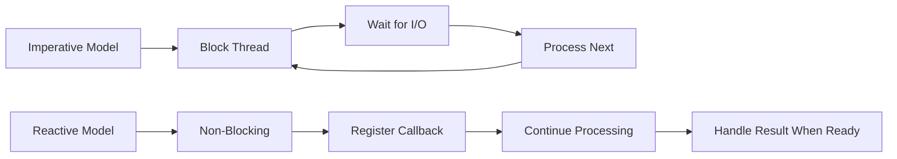
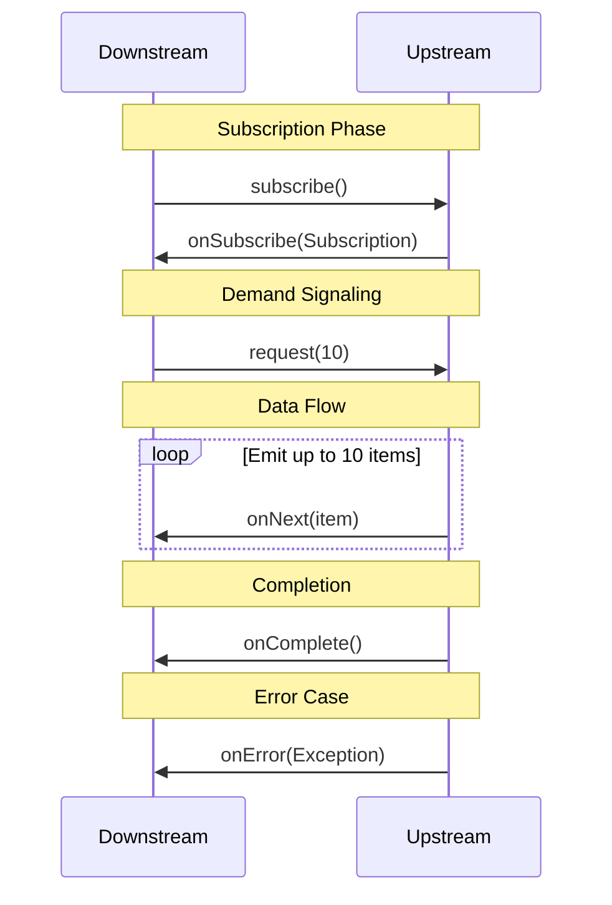
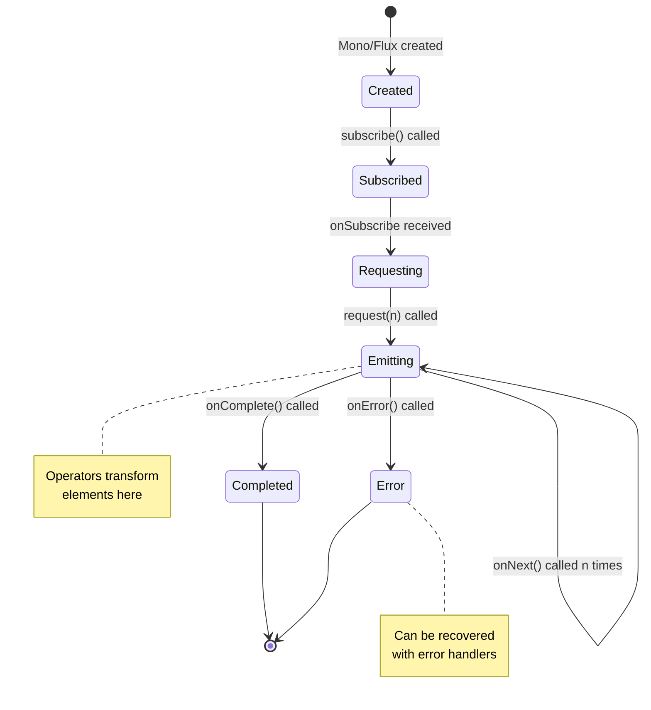
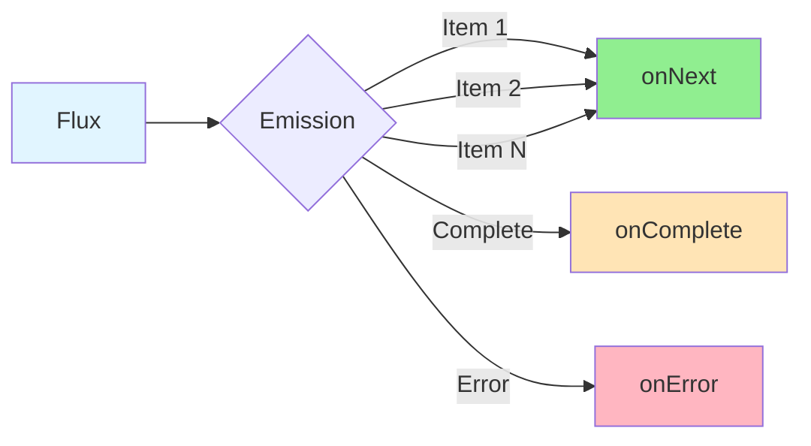
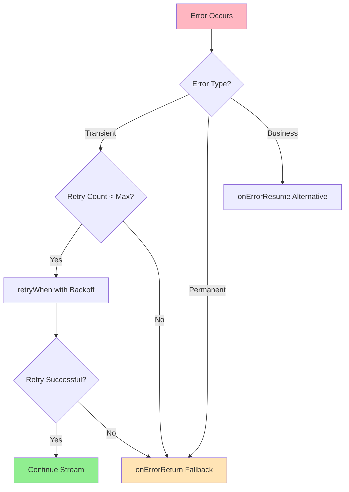
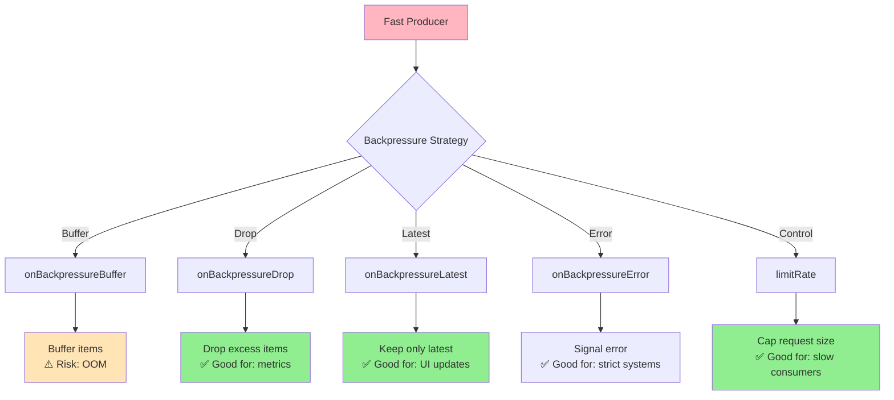
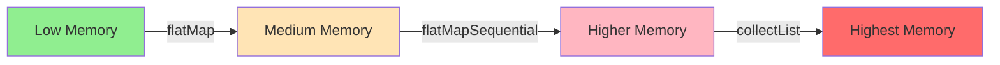
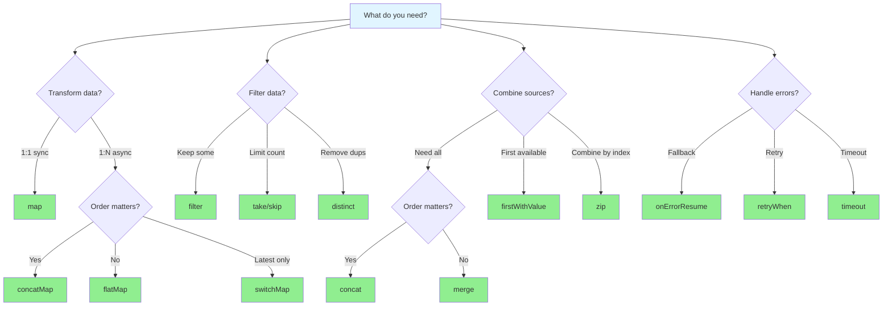

# Project Reactor Mastery - Advanced Operators and Production Patterns

> **A Comprehensive Deep-Dive Tutorial for Building Production-Ready Reactive Systems**

**Last Updated:** June 2025  
**Reading Time:** 45-60 minutes  
**Difficulty Level:** ⚡⚡⚡ Intermediate to Advanced  
**Technologies:** Java 21, Spring Boot 3.x, Project Reactor 3.x

---

## 📋 Table of Contents

1. [Introduction](#introduction)
2. [Prerequisites](#prerequisites)
3. [Learning Objectives](#learning-objectives)
4. [The Reactive Streams Specification](#the-reactive-streams-specification)
5. [The Reactive Lifecycle](#the-reactive-lifecycle)
6. [Mono - The Single (or Empty) Result](#mono---the-single-or-empty-result)
7. [Flux - 0 to N Elements](#flux---0-to-n-elements)
8. [Transformation Operators](#transformation-operators)
9. [Filtering Operators](#filtering-operators)
10. [Combining Operators](#combining-operators)
11. [Error Handling Operators](#error-handling-operators)
12. [Side Effect Operators](#side-effect-operators)
13. [Utility Operators](#utility-operators)
14. [Collection Operators](#collection-operators)
15. [Buffering Operators](#buffering-operators)
16. [Backpressure Operators](#backpressure-operators)
17. [Scheduling and Thread Switching](#scheduling-and-thread-switching)
18. [Subscription Methods](#subscription-methods)
19. [Real-World Production Patterns](#real-world-production-patterns)
20. [Best Practices](#best-practices)
21. [Anti-Patterns to Avoid](#anti-patterns-to-avoid)
22. [Performance Considerations](#performance-considerations)
23. [Practice Exercises](#practice-exercises)
24. [Question Bank](#question-bank)
25. [Quick Reference](#quick-reference)
26. [Summary & Key Takeaways](#summary--key-takeaways)
27. [Further Reading & Resources](#further-reading--resources)

---

## 🎯 Introduction

### The Night That Changed Everything

A few months ago, I watched a colleague debug a Spring WebFlux service that was supposed to handle **5,000 concurrent requests** but kept falling over at **200**. After a long night, we traced the issue to a single `Mono.just()` that wrapped a blocking HTTP call. The code looked perfectly fine until we realized it was executing on the calling thread, choking the event loop.

```java
// ❌ The problematic code
@GetMapping("/users/{id}")
public Mono<User> getUser(@PathVariable String id) {
    return Mono.just(userService.getUserBlocking(id)); // Blocks event loop!
}
```

That night taught me that **reactive programming isn't just a different set of APIs—it's a fundamentally different way of thinking about flow and concurrency**.

### What Makes Project Reactor Different?

Traditional imperative programming processes data sequentially, blocking threads while waiting for I/O. Reactive programming, powered by Project Reactor, embraces **asynchronous, non-blocking data streams** with **backpressure**—a mechanism that prevents fast producers from overwhelming slow consumers.



**Key Insight:** Reactive systems can handle more concurrent operations with fewer threads, making them ideal for high-throughput, low-latency applications.

### Why This Tutorial?

Since that debugging session, I've built dozens of production systems with Project Reactor. This is the guide I wish I'd had back then. We'll cover:

- ✅ Complete Reactor API from basic to advanced
- ✅ Real production use cases and battle-hardened insights
- ✅ Backpressure strategies that prevent system failures
- ✅ Error handling patterns for resilient systems
- ✅ Performance optimization techniques
- ✅ Common pitfalls and how to avoid them

**Grab a coffee** — this is a comprehensive deep-dive, but by the end you'll be able to reason about any Reactor codebase and design reactive pipelines with confidence.

---

## 📚 Prerequisites

Before diving in, ensure you have:

- ✅ **Java 21+** - Familiarity with modern Java features (var, records, etc.)
- ✅ **Spring Boot 3.x** - Basic understanding of Spring WebFlux
- ✅ **Asynchronous Programming** - Concepts of callbacks, futures, and CompletableFuture
- ✅ **Streams API** - Basic knowledge of Java 8+ Stream operations
- ✅ **Maven/Gradle** - Dependency management basics

### Quick Setup

```xml
<!-- Maven Dependencies -->
<dependency>
    <groupId>io.projectreactor</groupId>
    <artifactId>reactor-core</artifactId>
    <version>3.6.0</version>
</dependency>
<dependency>
    <groupId>io.projectreactor</groupId>
    <artifactId>reactor-test</artifactId>
    <scope>test</scope>
</dependency>
```

```gradle
// Gradle Dependencies
implementation 'io.projectreactor:reactor-core:3.6.0'
testImplementation 'io.projectreactor:reactor-test'
```

---

## 🎓 Learning Objectives

By the end of this tutorial, you'll be able to:

1. **Understand** the Reactive Streams specification and backpressure mechanisms
2. **Create** Mono and Flux instances using various factory methods
3. **Transform** data streams using map, flatMap, and other operators
4. **Filter** and combine multiple reactive streams
5. **Handle** errors gracefully with retry, fallback, and recovery strategies
6. **Manage** backpressure to prevent system overload
7. **Control** threading with schedulers and publishOn/subscribeOn
8. **Build** production-ready reactive pipelines with best practices
9. **Debug** common reactive programming pitfalls
10. **Optimize** reactive code for performance and memory efficiency

---

## 🔄 The Reactive Streams Specification

### The Foundation of Reactivity

Before diving into Reactor, we need to understand the underlying contract: the **Reactive Streams Specification** (implemented by `java.util.concurrent.Flow` in Java 9+).

```mermaid
graph TB
    subgraph "Reactive Streams Specification"
        P[Publisher<T>]
        S[Subscriber<T>]
        Sub[Subscription]
        Proc[Processor<T,R>]
    end
    
    P -->|1. onSubscribe| S
    S -->|2. request(n)| Sub
    Sub -->|3. onNext| S
    S -->|4. onComplete/onError| S
    
    style P fill:#e1f5ff
    style S fill:#fff4e1
    style Sub fill:#f0f0f0
    style Proc fill:#ffe1f5
```

### The Four Core Interfaces

#### 1. **Publisher<T>**
Produces a potentially unbounded number of sequenced elements, according to the demand from its Subscriber.

```java
public interface Publisher<T> {
    void subscribe(Subscriber<? super T> subscriber);
}
```

**Key Responsibility:** Emit items only when requested, respecting backpressure signals.

#### 2. **Subscriber<T>**
Consumes elements. It must signal demand via `request(n)` and can receive `onNext`, `onError`, or `onComplete`.

```java
public interface Subscriber<T> {
    void onSubscribe(Subscription subscription);
    void onNext(T item);
    void onError(Throwable throwable);
    void onComplete();
}
```

**Key Responsibility:** Control the flow by requesting items and handle terminal events.

#### 3. **Subscription**
Represents the link between a Publisher and a Subscriber. The Subscriber uses it to request more items or cancel the subscription.

```java
public interface Subscription {
    void request(long n);
    void cancel();
}
```

**Key Responsibility:** Mediate between publisher and subscriber for demand signaling.

#### 4. **Processor<T, R>**
Acts as both a Subscriber and a Publisher, making it useful for implementing transformation stages.

```java
public interface Processor<T, R> extends Subscriber<T>, Publisher<R> {
}
```

**Key Responsibility:** Transform data while maintaining both subscription and publication capabilities.

### The Backpressure Protocol

The **key innovation** is backpressure: the Subscriber tells the Publisher how many items it's ready to handle. This prevents fast producers from overwhelming slow consumers.



**Without backpressure**, reactive systems would just be another incarnation of callback hell.

### In Reactor

In Reactor, **Mono** and **Flux** are concrete implementations of Publisher. Every operator you chain is simply building a new Publisher that respects the backpressure signals flowing upstream.

```java
Flux.range(1, 100)
    .filter(i -> i % 2 == 0)
    .map(i -> i * 2)
    .subscribe(); // The entire chain is one Publisher
```

**Critical Insight:** If you ever find yourself wondering why no data flows, check who calls `request()` and how much demand is created. I've seen numerous bugs caused by operators that don't propagate demand correctly.

---

## 🔄 The Reactive Lifecycle

Every reactive stream goes through a well-defined lifecycle:



### Lifecycle Stages

1. **Assembly** - Operators are chained, building the publisher graph
2. **Subscription** - `subscribe()` triggers the stream
3. **Request** - Downstream signals demand via `request(n)`
4. **Emission** - Upstream calls `onNext()` up to n times
5. **Processing** - Operators transform elements
6. **Termination** - Stream ends with `onComplete()` or `onError()`

**Production Insight:** Understanding this lifecycle is crucial for debugging. Most reactive issues stem from misunderstanding when operators execute or how demand propagates.

---

## 🎯 Mono - The Single (or Empty) Result

A `Mono<T>` represents a stream that emits **0 or 1 items**. Think of it as a reactive version of `Optional<T>` that can also be asynchronous and handle errors.

```mermaid
graph LR
    A[Mono] --> B{Has Value?}
    B -->|Yes| C[onNext(value)]
    B -->|No| D[onComplete]
    A -->|Error| E[onError]
    
    style A fill:#e1f5ff
    style C fill:#90EE90
    style D fill:#FFE4B5
    style E fill:#FFB6C1
```

### 3.1 Creating Monos

#### `Mono.just(T data)` and `Mono.justOrEmpty(@Nullable T data)`

```java
// Creates a Mono that emits the given value immediately upon subscription.
// ⚠️ WARNING: The value is captured EAGERLY at assembly time!
Mono<String> eager = Mono.just(lookupUserBlocking()); // DANGER!

// ✅ CORRECT: Use for constants or pre-fetched values
Mono<String> config = Mono.just("production-mode");

// justOrEmpty: if the value is null, produces an empty Mono
Mono<String> maybe = Mono.justOrEmpty(cache.get("key"));
```

**Production Use Case:** Returning a constant or pre-fetched value, like a configuration property.

**⚠️ Common Mistake:** Using `Mono.just()` to wrap a blocking operation. Because the argument is evaluated before the Mono is even returned, the blocking call executes on the calling thread—often the event loop.

```java
// ❌ WRONG - Blocks event loop
@GetMapping("/users/{id}")
public Mono<User> getUser(@PathVariable String id) {
    return Mono.just(userRepository.findById(id).block()); // Disaster!
}

// ✅ CORRECT - Non-blocking
@GetMapping("/users/{id}")
public Mono<User> getUser(@PathVariable String id) {
    return userRepository.findById(id); // Already reactive
}
```

#### `Mono.empty()` and `Mono.error(Throwable)`

```java
// An empty Mono completes without emitting any value
Mono<Void> nothing = Mono.empty();

// Mono that immediately signals an error
Mono<String> error = Mono.error(new ServiceUnavailableException());

// ✅ For performance, use a Supplier to delay exception creation
Mono<String> errorLazy = Mono.error(() -> new HeavyException());
```

**Production Use Case:** Return `Mono.empty()` in a `flatMap()` when you want to filter out a condition without throwing an exception.

```java
public Mono<User> findActiveUser(String id) {
    return userRepository.findById(id)
        .flatMap(user -> user.isActive() 
            ? Mono.just(user) 
            : Mono.empty()); // Filter out inactive users
}
```

#### `Mono.defer(Supplier<Mono<T>> supplier)`

```java
// Defer creation of the Mono until a subscriber arrives
// Each subscriber gets a fresh Mono from the supplier
Mono<String> lazy = Mono.defer(() -> Mono.just(expensiveOperation()));
```

**When to Use:** Whenever the value depends on the subscriber's context (like a request-scoped token), or you need to re-execute a side effect for each subscription.

```java
// ✅ CORRECT: Transaction per subscription
Mono<Order> orderWithTransaction = Mono.defer(() -> 
    transactionTemplate.execute(status -> 
        orderRepository.findById(id)
    )
);
```

**💡 Interview Question:** What's the difference between `Mono.just(someMethod())` and `Mono.defer(() -> Mono.just(someMethod()))`?

**Answer:** The first evaluates `someMethod()` **eagerly at assembly time**, while the second evaluates it **lazily at subscription time**, once per subscriber.

#### `Mono.fromSupplier(Supplier<T>)`, `Mono.fromCallable(Callable<T>)`, and `Mono.fromRunnable(Runnable)`

```java
// fromSupplier: lazy, but doesn't handle checked exceptions nicely
Mono<String> fromSup = Mono.fromSupplier(() -> cache.get("key"));

// fromCallable: wraps a Callable, converting checked exceptions into onError
Mono<String> fromCall = Mono.fromCallable(() -> fetchFromService());

// fromRunnable: completes with empty after the Runnable runs
Mono<Void> run = Mono.fromRunnable(() -> cleanupResources());
```

**Production:** Use `Mono.fromCallable()` to safely integrate blocking third-party libraries (for example, JDBC) and let Reactor schedule it on a `boundedElastic` thread.

```java
// ✅ Integrating blocking JDBC call
Mono<User> user = Mono.fromCallable(() -> jdbcTemplate.queryForObject(
    "SELECT * FROM users WHERE id = ?", 
    new Object[]{id}, 
    new UserRowMapper()
))
.subscribeOn(Schedulers.boundedElastic()); // Execute on bounded elastic scheduler
```

#### `Mono.fromFuture(CompletableFuture<T>)`

```java
CompletableFuture<Order> future = asyncService.getOrder(id);
Mono<Order> orderMono = Mono.fromFuture(future);
```

**Important:** The CompletableFuture must already be started. If the future completes with an exception, it is converted to `onError`.

#### `Mono.create(MonoSink<T> callback)`

```java
// Bridge callback-based APIs
Mono<Location> locationMono = Mono.create(sink -> {
    gpsService.getLocation(new LocationCallback() {
        public void onSuccess(Location loc) { 
            sink.success(loc); 
        }
        public void onError(Throwable e) { 
            sink.error(e); 
        }
    });
});
```

**⚠️ Warning:** `Mono.create()` is **push-based**; it ignores backpressure. Use it only when you're truly bridging external asynchronous sources.

#### `Mono.firstWithSignal()` and `Mono.firstWithValue()`

```java
// Emit the first Mono that emits any signal (item or error)
Mono<String> result = Mono.firstWithSignal(mono1, mono2);

// firstWithValue: waits for a value, ignoring empty completions
Mono<String> resultWithValue = Mono.firstWithValue(mono1, mono2, mono3);
```

**Real-world Example:** Racing multiple caches or replicas. Whichever responds fastest with data wins.

```java
// ✅ Race between cache and database
Mono<User> getUser(String id) {
    Mono<User> cache = cacheService.getUser(id);
    Mono<User> database = databaseService.getUser(id);
    
    return Mono.firstWithValue(cache, database)
        .doOnNext(user -> logger.info("User fetched from: {}", 
            cache.hasElement().block() ? "cache" : "database"));
}
```

**Performance Consideration:** Cancels the slower Mono instances, so ensure cancellation is handled correctly in your publishers.

#### `Mono.zip()` and `Mono.when()`

```java
// Wait for all Monos to complete, then combine results
Mono<Tuple2<User, Account>> combined = Mono.zip(getUser(), getAccount());

// With a combinator function
Mono<String> info = Mono.zip(getUser(), getAccount(), 
    (u, a) -> u.getName() + ":" + a.getBalance());

// Mono.when: when you only care about completion, not the values
Mono<Void> allDone = Mono.when(saveOrder(), sendNotification());
```

**Production:** `Mono.zip()` is great for fetching multiple independent resources in parallel and merging them. `Mono.when()` is ideal for parallel writes where you just need to know everything has finished.

```java
// ✅ Parallel data fetching with zip
@GetMapping("/dashboard/{userId}")
public Mono<Dashboard> getDashboard(@PathVariable String userId) {
    return Mono.zip(
        getUserProfile(userId),
        getRecentOrders(userId),
        getNotifications(userId),
        getAnalytics(userId),
        (profile, orders, notifications, analytics) -> 
            new Dashboard(profile, orders, notifications, analytics)
    );
}
```

#### `Mono.delay()`, `Mono.never()`, and `Mono.cache()`

```java
// Emit 0 after a delay. Use with flatMap for retry backoff
Mono<Long> tick = Mono.delay(Duration.ofSeconds(5));

// A Mono that never completes
Mono<String> forever = Mono.never();

// Cache the emitted value and replay it to later subscribers
Mono<String> cached = expensiveCall().cache();
```

**Production Use Case:** `cache()` turns a cold Mono into a hot Mono: the first subscriber triggers the upstream, and subsequent subscribers receive the cached value.

```java
// ✅ Cache expensive configuration
Mono<AppConfig> configMono = loadConfigFromServer()
    .cache()
    .doOnSuccess(config -> logger.info("Config loaded and cached"));
    
// Multiple subscribers - only first triggers the load
configMono.subscribe();
configMono.subscribe(); // Gets cached value
```

**⚠️ Warning:** Watch out for memory leaks if the Mono never completes.

#### `Mono.using()` and `Mono.usingWhen()`

```java
// Resource lifecycle management: acquire, use, release
Mono<String> content = Mono.using(
    () -> new FileInputStream("data.txt"),      // acquire
    stream -> Mono.fromCallable(() -> read(stream)), // use
    stream -> { try { stream.close(); } catch ... }   // cleanup
);

// usingWhen: asynchronous cleanup
Mono<String> asyncContent = Mono.usingWhen(
    resourceFactory(),
    resource -> process(resource),
    resource -> cleanupAsync(resource) // Returns Mono<Void>
);
```

**Production-Critical Use Case:** Ideal for managing database connections, file handles, network sessions, and other resources that require asynchronous cleanup.

```java
// ✅ Proper database connection management
Mono<List<User>> getUsers() {
    return Mono.using(
        () -> dataSource.getConnection(),           // acquire
        conn -> Mono.fromCallable(() -> 
            conn.createStatement()
                .executeQuery("SELECT * FROM users")
                .getResultList()
        ),                                          // use
        conn -> Mono.fromRunnable(() -> {           // cleanup
            try {
                conn.close();
            } catch (SQLException e) {
                logger.error("Failed to close connection", e);
            }
        })
    )
    .subscribeOn(Schedulers.boundedElastic());
}
```

---

## 🎭 Flux - 0 to N Elements

`Flux<T>` is the multi-value reactive type. It can emit **0..N items** and then optionally complete or error.



### 4.1 Creating Fluxes

#### From values: `Flux.just()`, `Flux.fromIterable()`, `Flux.fromArray()`, and `Flux.fromStream()`

```java
Flux<Integer> numbers = Flux.just(1, 2, 3);
Flux<String> lines = Flux.fromIterable(listOfStrings);
Flux<Path> paths = Flux.fromArray(directory.listFiles());
Flux<String> streamed = Flux.fromStream(someStream()); // lazily consumed
```

**⚠️ Important:** `Flux.fromStream()` consumes the stream lazily. Don't reuse the stream after subscription.

#### `Flux.range()` and `Flux.interval()`

```java
// Range: emits integers sequentially. Respects demand
Flux<Integer> oneToTen = Flux.range(1, 10);

// Interval: emits incremental longs periodically. Hot publisher
Flux<Long> heartbeat = Flux.interval(Duration.ofSeconds(1));
```

**Production Use:** Use `Flux.range()` for batch processing simulations and `Flux.interval()` for polling health checks.

```java
// ✅ Health check polling
Flux<HealthStatus> healthChecks = Flux.interval(Duration.ofSeconds(30))
    .flatMap(tick -> checkServiceHealth())
    .doOnNext(status -> logger.info("Health check: {}", status))
    .onErrorResume(e -> Mono.just(HealthStatus.UNKNOWN));
```

#### `Flux.generate(Callable<S>, BiFunction<S, SynchronousSink<T>, S>)`

```java
// Synchronous, stateful, one-by-one emission
Flux<Integer> generated = Flux.generate(
    () -> 0,                          // initial state
    (state, sink) -> {
        if (state > 10) sink.complete();
        else sink.next(state);
        return state + 1;
    }
);
```

**Perfect for:** Producing values one at a time, such as paginating through an API using a cursor.

```java
// ✅ Cursor-based pagination
Flux<User> paginatedUsers(String cursor, int pageSize) {
    return Flux.generate(
        () -> new PageState(cursor, pageSize),
        (state, sink) -> {
            Page<User> page = api.fetchPage(state.cursor(), state.pageSize());
            
            page.getContent().forEach(sink::next);
            
            if (page.hasNext()) {
                return new PageState(page.getNextCursor(), state.pageSize());
            } else {
                sink.complete();
                return state;
            }
        }
    );
}
```

#### `Flux.create(Consumer<FluxSink<T>>)` and `Flux.push()`

```java
// Flux.create: async bridge, backpressure-aware
Flux<Trade> trades = Flux.create(sink -> {
    tradeListener.onTrade(t -> sink.next(t));
    sink.onRequest(n -> { 
        /* adjust upstream demand */ 
    });
});

// Flux.push: similar but with backpressure optimizations
Flux<Trade> optimizedTrades = Flux.push(sink -> {
    tradeListener.onTrade(t -> sink.next(t));
});
```

**Common Mistake:** Emitting more items than requested inside `Flux.create()`. The FluxSink will buffer or drop items depending on the overflow strategy. Always check `FluxSink.requestedFromDownstream()`.

```java
// ✅ Proper backpressure handling in Flux.create
Flux<Trade> backpressureAwareTrades = Flux.create(sink -> {
    tradeListener.onTrade(trade -> {
        if (sink.requestedFromDownstream() > 0) {
            sink.next(trade);
        } else {
            // Buffer or drop based on strategy
            buffer.offer(trade);
        }
    });
    
    sink.onRequest(n -> {
        while (n-- > 0 && !buffer.isEmpty()) {
            sink.next(buffer.poll());
        }
    });
}, FluxSink.OverflowStrategy.BUFFER);
```

#### `Flux.concat()`, `Flux.merge()`, and `Flux.zip()`

```java
// concat: subscribes to publishers one after another, preserving order
Flux<String> sequential = Flux.concat(fastPublisher, slowPublisher);

// merge: subscribes eagerly to all publishers and interleaves items
Flux<String> interleaved = Flux.merge(fast, slow); // order non-deterministic

// zip: pairs items from multiple sources by index
Flux<String> pairs = Flux.zip(
    Flux.just("A","B"), 
    Flux.range(1,5), 
    (s,n) -> s+n
);
// Emits "A1", "B2", then completes
```

**Production:** Use `Flux.concat()` for ordered data from multiple sources, `Flux.merge()` for parallel fan-out, and `Flux.zip()` to combine correlated events.

```java
// ✅ Merging multiple data sources
Flux<EnrichedEvent> enrichedEvents = Flux.merge(
    eventSource.getEvents(),
    userSource.getUsers(),
    productSource.getProducts()
)
.bufferTimeout(100, Duration.ofMillis(50)) // Batch every 100 items or 50ms
.flatMap(enrichmentService::enrich);
```

#### `Flux.combineLatest()` and `Flux.switchOnNext()`

```java
// combineLatest: whenever any source emits, combine with latest from all
Flux<String> live = Flux.combineLatest(
    priceStream, 
    volumeStream, 
    (p,v) -> p + ":" + v
);

// switchOnNext: takes a Flux of Publishers, emits from most recent
Flux<String> switched = Flux.switchOnNext(
    Flux.interval(Duration.ofSeconds(1))
        .map(i -> fetchValues(i))
);
```

**Use Cases:**
- `combineLatest()`: Real-time dashboards where UI updates whenever any data source changes
- `switchOnNext()`: Typeahead search, where the user's latest query cancels previous ones

```java
// ✅ Real-time stock ticker
Flux<StockUpdate> stockTicker = Flux.combineLatest(
    priceService.getPriceStream(symbol),
    volumeService.getVolumeStream(symbol),
    newsService.getNewsStream(symbol),
    (price, volume, news) -> new StockUpdate(price, volume, news)
)
.doOnNext(update -> webSocket.send(update))
.subscribeOn(Schedulers.parallel());
```

#### `Flux.empty()`, `Flux.error()`, `Flux.never()`, `Flux.defer()`, `Flux.using()`, and `Flux.cache()`

These are similar to their Mono counterparts but operate on multiple elements.

```java
Flux<String> empty = Flux.empty();
Flux<String> error = Flux.error(new RuntimeException("Failed"));
Flux<String> never = Flux.never();
Flux<String> deferred = Flux.defer(() -> Flux.fromIterable(getData()));
```

---

## ⚙️ Transformation Operators

Transformation operators modify the elements in the stream. They're the bread and butter of reactive programming.

### `map()`

```java
// Synchronous 1:1 transformation
Flux<UserDto> dtos = userFlux.map(user -> toDto(user));
```

**Important:** `map()` runs on the caller's thread. Don't put blocking calls here.

```java
// ❌ WRONG - Blocking in map
Flux<User> users = userFlux.map(user -> {
    User enriched = restTemplate.getForObject("/enrich/" + user.getId(), User.class);
    return enriched; // Blocks!
});

// ✅ CORRECT - Use flatMap for async operations
Flux<User> users = userFlux.flatMap(user -> 
    webClient.get()
        .uri("/enrich/{id}", user.getId())
        .retrieve()
        .bodyToMono(User.class)
);
```

### `flatMap()`

```java
// Asynchronous 1:N transformation, flattening inner publishers
Flux<Order> orders = customerFlux.flatMap(customer -> loadOrders(customer));

// With controlled concurrency
Flux<Order> orders = customerFlux.flatMap(customer -> loadOrders(customer), 5);
```

**⚠️ Critical:** `flatMap()` subscribes to multiple inner publishers concurrently. If the inner publisher is unbounded and slow, it can overwhelm downstream consumers. **Always consider setting a concurrency limit.**

```java
// ✅ Controlled concurrency
Flux<Order> orders = customerFlux
    .flatMap(customer -> loadOrders(customer), 5) // Max 5 concurrent
    .subscribeOn(Schedulers.parallel());
```

**💡 Interview Question:** Why doesn't `flatMap()` preserve ordering?

**Answer:** Because inner publishers can complete in any order, causing their emitted items to be interleaved.

### `concatMap()`

```java
// Asynchronous but preserves order by subscribing to one at a time
Flux<Order> sequential = customerFlux.concatMap(customer -> loadOrders(customer));
```

**Use `concatMap()`** when order matters and you want to avoid concurrent subscriptions. Performance may be lower because it processes items sequentially.

```java
// ✅ Preserving order in sequential processing
Flux<ProcessedOrder> processOrders(Flux<Order> orders) {
    return orders
        .concatMap(order -> processOrder(order)) // One at a time
        .doOnNext(result -> logger.info("Processed: {}", result));
}
```

### `flatMapSequential()`

```java
// Subscribes to all inner publishers at once (like flatMap) 
// but queues and re-orders items to match source order
Flux<Order> ordered = customerFlux.flatMapSequential(customer -> loadOrders(customer));
```

**Sweet spot:** You get concurrency and order preservation. However, it buffers out-of-order elements, so memory usage can grow.

```java
// ✅ Concurrent processing with order preservation
Flux<Result> results = Flux.range(1, 100)
    .flatMapSequential(id -> processAsync(id), 10) // 10 concurrent
    .subscribeOn(Schedulers.parallel());
```

### `switchMap()`

```java
// When a new outer element arrives, cancel the previous inner publisher
searchInputs.switchMap(query -> searchService.search(query));
```

**Classic use case:** Search suggestions; cancels in-flight requests.

```java
// ✅ Typeahead search with switchMap
@GetMapping("/search")
public Flux<SearchResult> search(@RequestParam String query) {
    return Flux.interval(Duration.ofMillis(300)) // Debounce
        .map(i -> query)
        .switchMap(searchTerm -> 
            searchService.search(searchTerm)
                .timeout(Duration.ofSeconds(2))
                .onErrorResume(e -> Flux.empty())
        );
}
```

### `handle()`

```java
// A combination of map and filter. Emit 0 or 1 items, or error
Flux<Integer> result = numbers.handle((value, sink) -> {
    if (value % 2 == 0) sink.next(value * 2);
    // odd numbers are simply skipped
});
```

**More efficient** than `map().filter()` because it avoids creating intermediate objects.

```java
// ✅ Efficient filtering and transformation
Flux<ValidUser> validUsers = userFlux.handle((user, sink) -> {
    if (user.isValid()) {
        sink.next(ValidUser.from(user));
    } else {
        logger.warn("Invalid user: {}", user.getId());
        // Skip without emitting
    }
});
```

### `cast()`, `index()`, `transform()`, and `as()`

```java
// Cast each element to a target class
Flux<SpecificEvent> events = eventBus.ofType().cast(SpecificEvent.class);

// Better: use ofType() which filters + casts
Flux<SpecificEvent> events = eventBus.ofType(SpecificEvent.class);

// index: add a tuple of (index, value)
Flux<Tuple2<Long, String>> indexed = lines.index();

// transform: encapsulate a reusable operator chain
Function<Flux<String>, Flux<String>> addLogging = f -> 
    f.doOnNext(System.out::println).map(String::toUpperCase);

Flux<String> transformed = original.transform(addLogging);

// transformDeferred: like transform but evaluated per subscriber
Function<Flux<String>, Flux<String>> perSubscriber = f -> 
    f.map(String::toUpperCase); // Fresh function per subscriber

Flux<String> deferred = original.transformDeferred(perSubscriber);
```

---

## 🔍 Filtering Operators

Filtering operators let you control which elements pass through the stream.

### Core Filtering Operators

| Operator | Description | Use Case |
|----------|-------------|----------|
| `filter(predicate)` | Keep items where predicate returns true | Basic filtering |
| `filterWhen(asyncPredicate)` | Keep items where async predicate emits true | Async validation |
| `distinct()` | Remove duplicates based on equals() | Deduplication |
| `distinctUntilChanged()` | Remove consecutive duplicates | Change detection |
| `ofType(Class)` | Filter by type and cast | Type filtering |
| `ignoreElements()` | Ignore all items, only signal completion/error | Fire-and-forget |
| `take(n)` | Take first n items | Limiting results |
| `takeUntil(predicate)` | Take until predicate returns true | Conditional stopping |
| `takeWhile(predicate)` | Take while predicate returns true | Boundary-based limiting |
| `skip(n)` | Skip first n items | Pagination |
| `skipUntil(publisher)` | Skip until publisher emits | Delayed start |
| `skipWhile(predicate)` | Skip while predicate returns true | Conditional skipping |
| `next()` | Take first item and complete | Single result |
| `elementAt(index)` | Take item at specific index | Random access |
| `single()` | Require exactly one element | Validation |
| `last()` | Take last item after completion | Final result |

### Production Examples

```java
// ✅ Timeout with takeUntil
source.takeUntil(Mono.delay(Duration.ofSeconds(5)))
    .switchIfEmpty(Mono.error(new TimeoutException()));

// ✅ Validation with single()
@Query("SELECT * FROM users WHERE email = :email")
Mono<User> findByEmail(String email);

public Mono<User> validateUniqueEmail(String email) {
    return findByEmail(email)
        .single() // Ensures exactly one result
        .switchIfEmpty(Mono.error(new UserNotFoundException()));
}

// ✅ Pagination with skip and take
public Flux<User> getUsers(int page, int size) {
    return userRepository.findAll()
        .skip(page * size)
        .take(size);
}
```

---

## 🔗 Combining Operators

Combining operators merge multiple publishers into one.

### Core Combining Operators

| Operator | Behavior | Order Preserved | Concurrency |
|----------|----------|----------------|-------------|
| `zip()` | Pairs items by index | Yes | Yes |
| `merge()` | Interleaves items as they arrive | No | Yes |
| `mergeSequential()` | Merges but preserves order within each publisher | Partial | Yes |
| `concat()` | Subscribes sequentially | Yes | No |
| `concatDelayError()` | Like concat but delays errors | Yes | No |
| `combineLatest()` | Combines latest from all sources | No | Yes |
| `firstWithSignal()` | First to emit any signal | N/A | Yes |
| `firstWithValue()` | First to emit a value | N/A | Yes |
| `when()` | Waits for all to complete | N/A | Yes |

### Real-World Use Cases

```java
// ✅ zip: Build composite object from multiple service calls
@GetMapping("/order-details/{id}")
public Mono<OrderDetails> getOrderDetails(@PathVariable String id) {
    return Mono.zip(
        orderService.getOrder(id),
        customerService.getCustomer(id),
        paymentService.getPayment(id),
        shippingService.getShipping(id),
        (order, customer, payment, shipping) -> 
            new OrderDetails(order, customer, payment, shipping)
    );
}

// ✅ combineLatest: Real-time dashboard
Flux<Dashboard> dashboard = Flux.combineLatest(
    metricsService.getCpuUsage(),
    metricsService.getMemoryUsage(),
    metricsService.getNetworkTraffic(),
    (cpu, memory, network) -> new Dashboard(cpu, memory, network)
)
.doOnNext(dashboard -> updateUI(dashboard))
.subscribeOn(Schedulers.parallel());

// ✅ firstWithValue: Race between cache and database
Mono<User> getUser(String id) {
    return Mono.firstWithValue(
        cacheService.getUser(id),
        databaseService.getUser(id)
    );
}
```

---

## ⚠️ Error Handling Operators

Failures are inevitable. How you recover is what counts.

### Core Error Handling Operators

| Operator | Behavior | Use Case |
|----------|----------|----------|
| `onErrorReturn(fallback)` | Replace error with static value | Simple fallback |
| `onErrorResume(fallbackFunction)` | Switch to another Publisher | Conditional recovery |
| `onErrorMap(mapper)` | Transform exception type | Exception wrapping |
| `onErrorContinue()` | Skip offending item and continue | Partial failure tolerance |
| `onErrorStop()` | Stop stream immediately | Default behavior |
| `retry(n)` | Retry n times | Transient failures |
| `retryWhen(Retry)` | Advanced retry with backoff | Production retry logic |
| `repeat()` | Resubscribe after completion | Repeatable sources |
| `timeout(Duration)` | Error if no item within duration | Timeout protection |

### Production Error Handling Pattern

```java
webClient.get()
    .uri("/slow")
    .retrieve()
    .bodyToMono(String.class)
    .timeout(Duration.ofSeconds(2))
    .retryWhen(Retry.backoff(3, Duration.ofMillis(100))
        .jitter(0.5)
        .filter(this::isTransient))
    .onErrorReturn("fallback");
```

**Performance:** A naive `retry(10)` without backoff can overwhelm a failing downstream service. Always use exponential backoff.

```java
// ✅ Production-grade retry with backoff
public <T> Mono<T> withRetry(Mono<T> source) {
    return source
        .timeout(Duration.ofSeconds(5))
        .retryWhen(Retry.backoff(3, Duration.ofMillis(200))
            .jitter(0.5) // Add randomness to prevent thundering herd
            .filter(this::isTransient) // Only retry transient errors
            .doBeforeRetry(retrySignal -> 
                logger.warn("Retrying attempt {} due to: {}", 
                    retrySignal.totalRetries() + 1,
                    retrySignal.failure().getMessage())
            )
        )
        .doOnError(e -> logger.error("Failed after retries", e));
}

private boolean isTransient(Throwable e) {
    return e instanceof TimeoutException ||
           e instanceof IOException ||
           (e instanceof WebClientResponseException.ServiceUnavailable);
}
```

### Error Handling Decision Tree



---

## 🎬 Side Effect Operators

These don't change the stream but let you peek in:

| Operator | When Called | Use Case |
|----------|-------------|----------|
| `doOnNext` | Before onNext | Logging, metrics |
| `doOnEach` | For every signal | Comprehensive logging |
| `doOnSubscribe` | On subscription | Resource allocation |
| `doOnRequest` | When demand changes | Backpressure monitoring |
| `doOnCancel` | On cancellation | Cleanup |
| `doOnError` | On error | Error logging |
| `doOnSuccess` | On completion | Success metrics |
| `doOnTerminate` | On complete or error | Final cleanup |
| `doFinally` | Any termination | Universal cleanup |
| `doFirst` | Before subscription | Pre-subscription logic |
| `log()` | All signals | Debug logging |

### Production Pattern

```java
myFlux
    .doOnSubscribe(s -> logger.info("Processing started"))
    .doOnNext(dto -> metrics.increment("processed"))
    .doOnError(e -> logger.error("Stream failed", e))
    .doOnSuccess(signal -> metrics.increment("completed"))
    .doFinally(signal -> {
        signalType = signal; // Capture termination type
        closeResources();
    });
```

**⚠️ Warning:** `log()` internally logs all signals via Slf4j; great for debugging but can flood logs in production.

```java
// ✅ Conditional logging
myFlux
    .log("my-stream", Level.DEBUG) // Only in debug mode
    .doOnNext(data -> {
        if (logger.isDebugEnabled()) {
            logger.debug("Processing: {}", data);
        }
    });
```

---

## 🛠️ Utility Operators

Utility operators provide common functionality:

| Operator | Description | Example |
|----------|-------------|---------|
| `delayElements(Duration)` | Delay each emission | `flux.delayElements(Duration.ofMillis(100))` |
| `delaySubscription(Duration)` | Delay initial subscription | `flux.delaySubscription(Duration.ofSeconds(5))` |
| `elapsed()` | Replace with (elapsedTime, value) | `flux.elapsed()` |
| `timestamp()` | Replace with (timestamp, value) | `flux.timestamp()` |
| `cache()` | Cold to hot with caching | `flux.cache()` |
| `share()` | Multicast, shared subscription | `flux.share()` |
| `publish()` / `replay()` | Advanced sharing | `flux.publish().autoConnect()` |
| `hide()` | Hide source identity | `flux.hide()` |
| `checkpoint()` | Improve stack traces | `flux.checkpoint("name")` |
| `name()` | Name for debugging | `flux.name("my-stream")` |
| `metrics()` | Micrometer metrics | `flux.metrics()` |
| `contextWrite()` | Modify context | `flux.contextWrite(ctx -> ctx.put("key", "value"))` |

### Example: Rate Limiting with delayElements

```java
// ✅ Rate limiting API calls
Flux<ApiResponse> rateLimitedCalls(Flux<Request> requests) {
    return requests
        .delayElements(Duration.ofMillis(100)) // 10 requests per second
        .flatMap(request -> callApi(request), 5) // Max 5 concurrent
        .subscribeOn(Schedulers.boundedElastic());
}
```

---

## 📊 Collection Operators

Collection operators gather elements into collections:

| Operator | Return Type | Description |
|----------|-------------|-------------|
| `collectList()` | `Mono<List<T>>` | Gather all items into a List |
| `collectMap(keyExtractor)` | `Mono<Map<K, T>>` | Collect into Map |
| `collectMultimap(keyExtractor)` | `Mono<Map<K, Collection<T>>>` | Collect into multimap |
| `collectSortedList()` | `Mono<List<T>>` | Collect into sorted List |
| `reduce(init, accumulator)` | `Mono<T>` | Aggregate into single value |
| `scan(init, accumulator)` | `Flux<T>` | Like reduce but emits intermediate values |
| `count()` | `Mono<Long>` | Count items |
| `hasElement(T)` | `Mono<Boolean>` | Check if element exists |
| `hasElements()` | `Mono<Boolean>` | Check if stream is non-empty |
| `all(predicate)` | `Mono<Boolean>` | Check if all match |
| `any(predicate)` | `Mono<Boolean>` | Check if any match |

### Production Examples

```java
// ✅ collectList - gather results
Mono<List<User>> allUsers = userRepository.findAll()
    .collectList();

// ✅ collectMap - index by ID
Mono<Map<String, User>> usersById = userRepository.findAll()
    .collectMap(User::getId);

// ✅ reduce - aggregate
Mono<Integer> total = Flux.range(1, 100)
    .reduce(0, Integer::sum);

// ✅ scan - running total
Flux<Integer> runningTotal = Flux.range(1, 10)
    .scan(0, (acc, val) -> acc + val);
// Emits: 0, 1, 3, 6, 10, 15, 21, 28, 36, 45, 55

// ✅ all/any - validation
Mono<Boolean> allAdults = userFlux.all(user -> user.getAge() >= 18);
Mono<Boolean> hasAdmin = userFlux.any(user -> user.isAdmin());
```

**⚠️ Production Warning:** `collectList()` can be memory-hungry on infinite streams. Ensure the upstream is bounded.

---

## 📦 Buffering Operators

Buffering operators group elements into collections:

| Operator | Description | Output |
|----------|-------------|--------|
| `buffer(maxSize)` | Buffer up to maxSize items | `Flux<List<T>>` |
| `bufferTimeout(maxSize, maxTime)` | Flush on size or time | `Flux<List<T>>` |
| `bufferUntil(predicate)` | Buffer until predicate true (includes trigger) | `Flux<List<T>>` |
| `bufferWhile(predicate)` | Buffer while predicate true | `Flux<List<T>>` |
| `window(maxSize)` | Like buffer but emits Flux windows | `Flux<Flux<T>>` |
| `windowTimeout(maxSize, maxTime)` | Window with size/time limits | `Flux<Flux<T>>` |
| `groupBy(keyMapper)` | Split by key | `Flux<GroupedFlux<K, V>>` |

### Key Differences: buffer() vs window()

```java
// buffer() - eagerly collects and emits List objects
Flux<List<Integer>> buffered = Flux.range(1, 10)
    .buffer(3);
// Emits: [1,2,3], [4,5,6], [7,8,9], [10]

// window() - emits substreams (processed reactively)
Flux<Flux<Integer>> windowed = Flux.range(1, 10)
    .window(3);
// Emits: Flux[1,2,3], Flux[4,5,6], Flux[7,8,9], Flux[10]
```

**When to use window():** When downstream consumers can process streams on the fly, potentially reducing memory usage.

### Production Example: Batch Processing

```java
// ✅ Batch processing with bufferTimeout
Flux<List<Event>> batchedEvents = eventFlux
    .bufferTimeout(100, Duration.ofMillis(500)) // 100 items or 500ms
    .flatMap(batch -> processBatch(batch), 5); // Process 5 batches concurrently

// ✅ Group by category
Flux<GroupedFlux<String, Product>> productsByCategory = productFlux
    .groupBy(Product::getCategory);

productsByCategory
    .flatMap(groupedFlux -> 
        groupedFlux
            .collectList()
            .map(products -> new CategoryProducts(groupedFlux.key(), products))
    )
    .subscribe();
```

---

## 🎚️ Backpressure Operators

Backpressure can make or break your system. Here's how to control it:



### Core Backpressure Operators

| Operator | Behavior | Use Case |
|----------|----------|----------|
| `limitRate(n)` | Caps request size to n | Smooth demand |
| `onBackpressureBuffer(maxSize)` | Buffer items, error on overflow | Short bursts |
| `onBackpressureBuffer(maxSize, onOverflow)` | Buffer with strategy | Controlled buffering |
| `onBackpressureDrop(consumer)` | Drop items silently | Metrics, logging |
| `onBackpressureLatest()` | Keep only latest item | UI updates |
| `onBackpressureError()` | Throw error on overflow | Strict systems |

### Real-World Example: Event Processing

```java
// ✅ Event processing with backpressure
Flux<Event> processEvents(Flux<Event> events) {
    return events
        .onBackpressureBuffer(1000, 
            dropped -> logger.warn("Dropped event: {}", dropped),
            OverflowStrategy.DROP_LATEST)
        .flatMap(event -> handleEvent(event), 10) // Process 10 concurrently
        .subscribeOn(Schedulers.boundedElastic());
}

// ✅ Keep latest sensor reading
Flux<SensorReading> sensorData = sensorSource
    .onBackpressureLatest() // Only keep most recent
    .map(this::processReading)
    .throttleFirst(Duration.ofMillis(100)); // Process at most every 100ms
```

**Performance:** Unbounded buffers can lead to `OutOfMemoryError`. Always set a size limit. Use `limitRate()` to avoid flooding slow consumers.

```java
// ✅ Limit rate to prevent overwhelming downstream
Flux<Data> controlled = fastSource
    .limitRate(100) // Request max 100 at a time
    .onBackpressureBuffer(50) // Buffer small amount
    .subscribeOn(Schedulers.parallel());
```

---

## ⏱️ Scheduling and Thread Switching

In Reactor, operators don't change threads unless you tell them to.

### Core Scheduling Operators

| Operator | Effect | Usage |
|----------|--------|-------|
| `subscribeOn(Scheduler)` | Changes thread where subscription happens | Source emission |
| `publishOn(Scheduler)` | Changes thread for downstream operators | Multiple calls possible |
| `parallel()` | Returns ParallelFlux | Parallel processing |
| `runOn(Scheduler)` | Assigns threads to ParallelFlux rails | Parallel execution |

### Common Schedulers

| Scheduler | Use Case | Thread Pool |
|-----------|----------|-------------|
| `Schedulers.boundedElastic()` | Blocking tasks | Bounded, cached |
| `Schedulers.parallel()` | CPU-bound tasks | Fixed, equals CPU cores |
| `Schedulers.single()` | Sequential background work | Single thread |
| `Schedulers.immediate()` | Current thread (default) | None |

### Thread Switching Example

```java
Flux<String> process() {
    return Flux.fromIterable(list)
        .publishOn(Schedulers.parallel()) // Parallel processing
        .map(this::cpuIntensiveTask)
        .publishOn(Schedulers.boundedElastic()) // Switch to elastic for blocking
        .map(this::blockingIoTask)
        .subscribeOn(Schedulers.boundedElastic()); // Source on elastic
}
```

**💡 Interview Question:** What happens if you call `subscribeOn()` multiple times?

**Answer:** Only the **first `subscribeOn()`** in the chain, closest to the source, takes effect. For `publishOn()`, each call switches the downstream thread.

### Best Practice

```java
// ✅ CORRECT: subscribeOn at the source
Mono<User> user = Mono.fromCallable(() -> jdbcTemplate.queryForObject(...))
    .subscribeOn(Schedulers.boundedElastic()); // Only need once

// ❌ WRONG: Multiple subscribeOn calls (only first takes effect)
Mono<User> user = Mono.fromCallable(() -> jdbcTemplate.queryForObject(...))
    .subscribeOn(Schedulers.boundedElastic())
    .map(this::transform)
    .subscribeOn(Schedulers.parallel()); // This is ignored!
```

**⚠️ Critical:** Never use `subscribeOn()` inside a Spring WebFlux controller; the framework already manages the subscription threading. Use `publishOn()` sparingly.

---

## 🎬 Subscription Methods

### Core Subscription Methods

| Method | Behavior | Use Case |
|--------|----------|----------|
| `subscribe()` | Triggers async stream | Production |
| `block()` | Blocks until result arrives | Tests only |
| `blockFirst()` | Blocks for first item | Integration |
| `blockLast()` | Blocks for last item | Integration |
| `toFuture()` | Converts to CompletableFuture | Interoperability |
| `toStream()` | Converts to Java Stream | Legacy integration |

### Why Avoid `block()`?

```java
// ❌ DISASTER: Blocking in event loop
@GetMapping("/users/{id}")
public Mono<User> getUser(@PathVariable String id) {
    return userService.getUser(id)
        .map(user -> {
            User details = blockingService.getDetails(user.getId()).block(); // Blocks!
            return details;
        });
}
```

**The golden rule:** "Block at the boundary, if you must, and never inside an operator."

```java
// ✅ CORRECT: Block only at the edge
public User getUserBlocking(String id) {
    return userService.getUser(id)
        .block(); // Only at the boundary
}
```

**Production Impact:** In a Netty event loop, calling `block()` can stall the entire thread, causing requests to time out. I've seen production outages because someone put `block()` inside a `map()` in a Spring WebFlux controller.

---

## 🏭 Real-World Production Patterns

### Pattern 1: Parallel API Calls with zip

```java
// ✅ Fetch multiple resources in parallel
@GetMapping("/user-dashboard/{userId}")
public Mono<Dashboard> getDashboard(@PathVariable String userId) {
    return Mono.zip(
        userService.getUser(userId),
        orderService.getRecentOrders(userId, 10),
        notificationService.getUnreadCount(userId),
        analyticsService.getUserStats(userId),
        (user, orders, notifications, stats) -> 
            new Dashboard(user, orders, notifications, stats)
    )
    .timeout(Duration.ofSeconds(3))
    .onErrorResume(e -> Mono.just(Dashboard.empty()));
}
```

### Pattern 2: Search Suggestions with switchMap

```java
// ✅ Typeahead search
@GetMapping("/search/suggestions")
public Flux<String> getSuggestions(@RequestParam String query) {
    return Flux.just(query)
        .delayElements(Duration.ofMillis(300)) // Debounce
        .switchMap(searchTerm -> 
            searchService.suggest(searchTerm)
                .timeout(Duration.ofSeconds(1))
                .onErrorResume(e -> Flux.empty())
        )
        .take(10); // Limit results
}
```

### Pattern 3: Event Processing with Backpressure

```java
// ✅ Kafka consumer with backpressure
@KafkaListener(topics = "events")
public Flux<Event> consumeKafka(ConsumerRecord<String, String> record) {
    return Flux.create(sink -> {
        try {
            Event event = parseEvent(record.value());
            sink.next(event);
            sink.complete();
        } catch (Exception e) {
            sink.error(e);
        }
    })
    .onBackpressureBuffer(1000, 
        dropped -> logger.warn("Dropped event: {}", dropped),
        OverflowStrategy.DROP_OLDEST)
    .flatMap(this::processEvent, 10) // Process 10 concurrently
    .doOnError(e -> logger.error("Event processing failed", e));
}
```

### Pattern 4: Resource Management with using

```java
// ✅ Database connection pooling
public Flux<User> streamAllUsers() {
    return Mono.using(
        () -> dataSource.getConnection(),
        conn -> Flux.create(sink -> {
            try (Statement stmt = conn.createStatement()) {
                ResultSet rs = stmt.executeQuery("SELECT * FROM users");
                while (rs.next() && !sink.isCancelled()) {
                    sink.next(mapRow(rs));
                }
                sink.complete();
            } catch (SQLException e) {
                sink.error(e);
            }
        }),
        conn -> {
            try {
                conn.close();
            } catch (SQLException e) {
                logger.error("Failed to close connection", e);
            }
        }
    )
    .subscribeOn(Schedulers.boundedElastic());
}
```

### Pattern 5: Circuit Breaker Pattern

```java
// ✅ Circuit breaker with retryWhen
public Mono<String> callExternalService(String id) {
    return webClient.get()
        .uri("/api/{id}", id)
        .retrieve()
        .bodyToMono(String.class)
        .timeout(Duration.ofSeconds(2))
        .retryWhen(Retry.backoff(3, Duration.ofMillis(100))
            .jitter(0.5)
            .filter(this::isTransient)
        )
        .onErrorResume(e -> {
            if (circuitBreaker.allowRequest()) {
                return fallbackService.getData(id);
            } else {
                return Mono.error(new ServiceUnavailableException());
            }
        });
}
```

---

## ✅ Best Practices

### 1. Threading Best Practices

```java
// ✅ DO: Use subscribeOn for blocking operations
Mono.fromCallable(() -> blockingOperation())
    .subscribeOn(Schedulers.boundedElastic());

// ✅ DO: Use publishOn for CPU-intensive work
flux
    .publishOn(Schedulers.parallel())
    .map(this::cpuIntensiveTask);

// ❌ DON'T: Block in operators
flux.map(item -> blockingCall().block());

// ❌ DON'T: Use subscribeOn in controllers (Spring manages this)
```

### 2. Error Handling Best Practices

```java
// ✅ DO: Always handle errors
source
    .timeout(Duration.ofSeconds(5))
    .retryWhen(Retry.backoff(3, Duration.ofMillis(100)))
    .onErrorReturn("fallback");

// ✅ DO: Log errors with context
source
    .doOnError(e -> logger.error("Processing failed for id: {}", id, e))
    .onErrorResume(e -> fallback());

// ❌ DON'T: Swallow errors silently
source.onErrorResume(e -> Mono.empty());
```

### 3. Memory Management

```java
// ✅ DO: Use bounded buffers
.onBackpressureBuffer(1000, OverflowStrategy.DROP_LATEST)

// ✅ DO: Limit concurrency
.flatMap(this::process, 10)

// ✅ DO: Use cache() carefully
expensiveCall().cache()
    .doOnCancel(() -> cache.invalidate())

// ❌ DON'T: Use unbounded operations
.flatMap(this::process) // Unbounded concurrency!
```

### 4. Testing Best Practices

```java
// ✅ DO: Use StepVerifier for testing
@Test
void shouldProcessUser() {
    StepVerifier.create(userService.processUser(id))
        .expectNextMatches(user -> user.isValid())
        .verifyComplete();
}

// ✅ DO: Test error scenarios
@Test
void shouldHandleError() {
    StepVerifier.create(service.call())
        .expectError(ServiceException.class)
        .verify();
}
```

---

## ❌ Anti-Patterns to Avoid

### Anti-Pattern 1: Blocking in Reactive Pipelines

```java
// ❌ WRONG
@GetMapping("/data")
public Flux<Data> getData() {
    return Flux.fromIterable(list)
        .map(item -> blockingService.process(item).block()); // Blocks!
}

// ✅ CORRECT
@GetMapping("/data")
public Flux<Data> getData() {
    return Flux.fromIterable(list)
        .flatMap(item -> Mono.fromCallable(() -> blockingService.process(item))
            .subscribeOn(Schedulers.boundedElastic()));
}
```

### Anti-Pattern 2: Unbounded Concurrency

```java
// ❌ WRONG
flux.flatMap(this::process); // Can create thousands of concurrent operations!

// ✅ CORRECT
flux.flatMap(this::process, 10); // Limit to 10 concurrent
```

### Anti-Pattern 3: Ignoring Backpressure

```java
// ❌ WRONG
Flux.create(sink -> {
    while (hasMoreData()) {
        sink.next(getNext()); // Ignores downstream demand!
    }
});

// ✅ CORRECT
Flux.create(sink -> {
    sink.onRequest(n -> {
        while (n-- > 0 && hasMoreData()) {
            sink.next(getNext());
        }
    });
});
```

### Anti-Pattern 4: Misusing subscribeOn/publishOn

```java
// ❌ WRONG
flux
    .subscribeOn(Schedulers.parallel()) // Only first one matters!
    .map(this::transform)
    .subscribeOn(Schedulers.boundedElastic()); // Ignored!

// ✅ CORRECT
flux
    .subscribeOn(Schedulers.boundedElastic()) // At the source
    .map(this::transform)
    .publishOn(Schedulers.parallel()); // Switch thread for downstream
```

### Anti-Pattern 5: Eager Evaluation with Mono.just()

```java
// ❌ WRONG
Mono.just(expensiveOperation()); // Executes immediately!

// ✅ CORRECT
Mono.fromCallable(() -> expensiveOperation())
    .subscribeOn(Schedulers.boundedElastic());
```

---

## ⚡ Performance Considerations

### Operator Fusion

Reactor uses **operator fusion** to optimize performance by combining adjacent operators and reducing intermediate allocations.

```java
// These operators fuse well:
// - map, filter, handle (stateless)
// - flatMap (with concurrency 1)
// - take, skip, limitRate

// These break fusion:
// - publishOn, subscribeOn (thread boundaries)
// - buffer, window (collection operators)
// - flatMap (with concurrency > 1)
```

### Memory Usage Patterns



### Performance Comparison Table

| Scenario | Operator | Memory | Throughput | Order Preserved |
|----------|----------|--------|------------|-----------------|
| Simple transformation | `map()` | Low | High | Yes |
| Async transformation | `flatMap()` | Medium | High | No |
| Async with order | `flatMapSequential()` | High | Medium | Yes |
| Sequential async | `concatMap()` | Low | Low | Yes |
| Collect all | `collectList()` | High | Low | Yes |

### Optimization Techniques

```java
// ✅ Use handle() instead of map().filter()
// Less efficient
flux.map(transform).filter(validate);

// More efficient
flux.handle((item, sink) -> {
    Result result = transform(item);
    if (result.isValid()) {
        sink.next(result.getValue());
    }
});

// ✅ Use cache() for repeated subscriptions
Mono<Config> config = loadConfig().cache();
config.subscribe(); // Triggers load
config.subscribe(); // Gets cached value

// ✅ Use share() for hot publishers
Flux<Event> sharedEvents = eventSource
    .publish()
    .autoConnect()
    .share(); // Multicast to all subscribers
```

---

## 🏋️ Practice Exercises

### Exercise 1: Basic Mono/Flux Creation

**Problem:** Create a reactive pipeline that fetches user data from three different sources (cache, database, API) and returns the first available result.

```java
// Starter code
public Mono<User> getUserFastest(String userId) {
    // TODO: Implement using firstWithValue
    return null;
}

// Solution
public Mono<User> getUserFastest(String userId) {
    return Mono.firstWithValue(
        cacheService.getUser(userId),
        databaseService.getUser(userId),
        apiService.getUser(userId)
    )
    .doOnNext(user -> logger.info("User fetched from fastest source"))
    .timeout(Duration.ofSeconds(2))
    .onErrorResume(e -> Mono.error(new UserNotFoundException(userId)));
}
```

**Key Learning:** Racing multiple sources with `firstWithValue()` for optimal performance.

---

### Exercise 2: Transformation Pipeline

**Problem:** Transform a Flux of raw strings into validated, enriched User objects.

```java
// Starter code
public Flux<User> processUsers(Flux<String> rawData) {
    // TODO: Parse, validate, and enrich
    return null;
}

// Solution
public Flux<User> processUsers(Flux<String> rawData) {
    return rawData
        .map(String::trim)
        .filter(line -> !line.isEmpty())
        .map(this::parseUser)
        .handle((user, sink) -> {
            if (user.isValid()) {
                sink.next(user);
            } else {
                logger.warn("Invalid user data: {}", user);
            }
        })
        .flatMap(this::enrichUser, 5) // Enrich with concurrency 5
        .doOnNext(user -> metrics.increment("users.processed"));
}
```

**Key Learning:** Using `handle()` for efficient filtering and transformation.

---

### Exercise 3: Error Handling Scenario

**Problem:** Implement a resilient API caller with retry, timeout, and fallback.

```java
// Starter code
public Mono<ApiResponse> callApiWithResilience(String endpoint) {
    // TODO: Add timeout, retry with backoff, and fallback
    return null;
}

// Solution
public Mono<ApiResponse> callApiWithResilience(String endpoint) {
    return webClient.get()
        .uri(endpoint)
        .retrieve()
        .bodyToMono(ApiResponse.class)
        .timeout(Duration.ofSeconds(3))
        .retryWhen(Retry.backoff(2, Duration.ofMillis(200))
            .jitter(0.5)
            .filter(this::isTransient))
        .onErrorResume(e -> {
            logger.error("API call failed: {}", endpoint, e);
            return fallbackService.getResponse(endpoint);
        });
}

private boolean isTransient(Throwable e) {
    return e instanceof TimeoutException ||
           e instanceof WebClientResponseException.ServiceUnavailable;
}
```

**Key Learning:** Production-grade error handling with retry strategies.

---

### Exercise 4: Combining Multiple Sources

**Problem:** Create a real-time dashboard that combines data from three independent streams.

```java
// Starter code
public Flux<Dashboard> createDashboard() {
    // TODO: Combine CPU, memory, and network streams
    return null;
}

// Solution
public Flux<Dashboard> createDashboard() {
    return Flux.combineLatest(
        metricsService.getCpuUsage(),
        metricsService.getMemoryUsage(),
        metricsService.getNetworkTraffic(),
        (cpu, memory, network) -> new Dashboard(cpu, memory, network)
    )
    .sample(Duration.ofMillis(100)) // Update every 100ms
    .doOnNext(dashboard -> websocket.send(dashboard))
    .subscribeOn(Schedulers.parallel())
    .doOnError(e -> logger.error("Dashboard stream failed", e));
}
```

**Key Learning:** Using `combineLatest()` for real-time data aggregation.

---

### Exercise 5: Backpressure Management

**Problem:** Process a high-volume event stream without overwhelming downstream consumers.

```java
// Starter code
public Flux<ProcessedEvent> processEventStream(Flux<Event> events) {
    // TODO: Add backpressure handling
    return null;
}

// Solution
public Flux<ProcessedEvent> processEventStream(Flux<Event> events) {
    return events
        .onBackpressureBuffer(1000, 
            dropped -> logger.warn("Dropped event due to backpressure"),
            OverflowStrategy.DROP_OLDEST)
        .flatMap(this::processEvent, 10) // Process 10 concurrently
        .doOnNext(result -> metrics.increment("events.processed"))
        .doOnError(e -> logger.error("Event processing failed", e))
        .subscribeOn(Schedulers.boundedElastic());
}
```

**Key Learning:** Managing backpressure to prevent system overload.

---

### Exercise 6: Real-World API Integration

**Problem:** Implement a paginated API fetcher that respects rate limits.

```java
// Starter code
public Flux<Page<T>> fetchAllPages(String endpoint) {
    // TODO: Implement pagination with rate limiting
    return null;
}

// Solution
public Flux<Page<T>> fetchAllPages(String endpoint) {
    return Flux.generate(
        () -> new PageState(0, 100),
        (state, sink) -> {
            Mono<Page<T>> pageMono = webClient.get()
                .uri(uriBuilder -> uriBuilder
                    .path(endpoint)
                    .queryParam("offset", state.offset())
                    .queryParam("limit", state.limit())
                    .build())
                .retrieve()
                .bodyToMono(Page.class)
                .timeout(Duration.ofSeconds(5))
                .retryWhen(Retry.backoff(2, Duration.ofMillis(100)));
            
            Page<T> page = pageMono.block(); // Block at boundary
            
            if (page.isEmpty()) {
                sink.complete();
            } else {
                sink.next(page);
                return new PageState(state.offset() + state.limit(), state.limit());
            }
            return state;
        }
    )
    .delayElements(Duration.ofMillis(100)) // Rate limit: 10 req/sec
    .subscribeOn(Schedulers.boundedElastic());
}
```

**Key Learning:** Combining `generate()` for stateful iteration with rate limiting.

---

### Exercise 7: Performance Optimization

**Problem:** Optimize a slow reactive pipeline that processes large datasets.

```java
// Starter code (SLOW)
public Flux<Result> processLargeDataset(Flux<Input> input) {
    return input
        .flatMap(item -> Mono.fromCallable(() -> expensiveOperation(item)))
        .collectList()
        .flatMapMany(list -> Flux.fromIterable(list));
}

// Solution (FAST)
public Flux<Result> processLargeDataset(Flux<Input> input) {
    return input
        .flatMap(item -> 
            Mono.fromCallable(() -> expensiveOperation(item))
                .subscribeOn(Schedulers.boundedElastic()),
            20 // Process 20 concurrently
        )
        .sequential() // Maintain order if needed
        .doOnNext(result -> metrics.increment("processed"));
}
```

**Key Learning:** Parallel processing with bounded concurrency for optimal throughput.

---

## ❓ Question Bank

### Beginner Level Questions

**Q1. What is the difference between Mono and Flux?**

<details>
<summary><strong>Answer</strong></summary>

- **Mono<T>**: Emits 0 or 1 item, then completes or errors. Use for single-value scenarios (e.g., fetching one user).
- **Flux<T>**: Emits 0 to N items, then completes or errors. Use for multi-value scenarios (e.g., list of users).

**Example:**
```java
Mono<User> singleUser = userRepository.findById(1L);
Flux<User> allUsers = userRepository.findAll();
```
</details>

---

**Q2. What is backpressure and why is it important?**

<details>
<summary><strong>Answer</strong></summary>

Backpressure is a mechanism where the **Subscriber signals demand** to the Publisher, controlling the flow of data. It prevents fast producers from overwhelming slow consumers.

**Without backpressure:** Fast producers flood slow consumers, causing memory issues or crashes.

**With backpressure:** Consumers request items at their own pace, ensuring stable operation.

**Example:**
```java
Flux.range(1, 100)
    .subscribe(new Subscriber<Integer>() {
        private Subscription subscription;
        private int count = 0;
        
        @Override
        public void onSubscribe(Subscription s) {
            this.subscription = s;
            subscription.request(10); // Request 10 items
        }
        
        @Override
        public void onNext(Integer item) {
            count++;
            if (count % 10 == 0) {
                subscription.request(10); // Request more
            }
        }
    });
```
</details>

---

**Q3. What's the difference between `Mono.just()` and `Mono.defer()`?**

<details>
<summary><strong>Answer</strong></summary>

- **`Mono.just(value)`**: Evaluates the value **eagerly** at assembly time (when the Mono is created).
- **`Mono.defer(() -> Mono.just(value))`**: Evaluates the value **lazily** at subscription time (for each subscriber).

**Example:**
```java
// Eager - executes immediately
Mono<Integer> eager = Mono.just(expensiveOperation());

// Lazy - executes when subscribed
Mono<Integer> lazy = Mono.defer(() -> Mono.just(expensiveOperation()));

// Each subscriber gets a fresh value
lazy.subscribe(); // Calls expensiveOperation()
lazy.subscribe(); // Calls expensiveOperation() again
```
</details>

---

**Q4. When should you use `flatMap()` vs `concatMap()`?**

<details>
<summary><strong>Answer</strong></summary>

- **`flatMap()`**: Subscribes to inner publishers **concurrently**, interleaving results. **Order not preserved**. Higher throughput.
- **`concatMap()`**: Subscribes to inner publishers **sequentially**, preserving order. Lower throughput but maintains order.

**Use `flatMap()` when:** Order doesn't matter and you want maximum concurrency.

**Use `concatMap()` when:** Order matters (e.g., processing database records in order).

**Example:**
```java
// flatMap - order not guaranteed
flux.flatMap(id -> api.call(id), 10);

// concatMap - order preserved
flux.concatMap(id -> api.call(id));
```
</details>

---

**Q5. What does `subscribeOn()` do and when should you use it?**

<details>
<summary><strong>Answer</strong></summary>

`subscribeOn()` changes the thread where the **subscription** happens (upstream source emission).

**Key points:**
- Only the **first `subscribeOn()`** in the chain takes effect
- Use it to move blocking operations off the event loop
- In Spring WebFlux, the framework manages threading, so avoid `subscribeOn()` in controllers

**Example:**
```java
Mono.fromCallable(() -> blockingOperation())
    .subscribeOn(Schedulers.boundedElastic()) // Execute on elastic thread
    .map(result -> transform(result));
```
</details>

---

### Intermediate Level Questions

**Q6. What is the difference between `Mono.zip()` and `Mono.when()`?**

<details>
<summary><strong>Answer</strong></summary>

- **`Mono.zip()`**: Waits for all Monos to complete, then **combines their values** into a Tuple.
- **`Mono.when()`**: Waits for all Monos to complete, but **ignores their values** (returns `Mono<Void>`).

**Example:**
```java
// zip - combines values
Mono<Tuple2<User, Account>> combined = Mono.zip(
    getUser(),
    getAccount()
);

// when - only cares about completion
Mono<Void> allDone = Mono.when(
    saveOrder(),
    sendNotification(),
    updateInventory()
);
```
</details>

---

**Q7. Explain the difference between `onBackpressureBuffer()`, `onBackpressureDrop()`, and `onBackpressureLatest()`.**

<details>
<summary><strong>Answer</strong></summary>

- **`onBackpressureBuffer()`**: Buffers items when downstream can't keep up. Throws error if buffer overflows.
- **`onBackpressureDrop()`**: Drops items silently when downstream can't keep up.
- **`onBackpressureLatest()`**: Keeps only the latest item, dropping previous ones.

**Use cases:**
- **Buffer**: Short bursts of high traffic
- **Drop**: Metrics, logging (where missing data is acceptable)
- **Latest**: UI updates, sensor readings (only latest value matters)

**Example:**
```java
// Buffer with size limit
flux.onBackpressureBuffer(1000, OverflowStrategy.DROP_LATEST);

// Drop with logging
flux.onBackpressureDrop(item -> logger.warn("Dropped: {}", item));

// Keep latest only
flux.onBackpressureLatest();
```
</details>

---

**Q8. What is operator fusion and why does it matter?**

<details>
<summary><strong>Answer</strong></summary>

Operator fusion is Reactor's optimization technique where adjacent operators are combined to reduce intermediate allocations and improve performance.

**Fusion-friendly operators:**
- `map()`, `filter()`, `handle()` - Stateless transformations
- `take()`, `skip()` - Bounds operators

**Fusion-breaking operators:**
- `publishOn()`, `subscribeOn()` - Thread boundaries
- `buffer()`, `window()` - Collection operators
- `flatMap()` with concurrency > 1

**Why it matters:** Fusion reduces GC pressure and improves throughput by minimizing object creation.

**Example:**
```java
// These fuse together efficiently
flux
    .map(transform)
    .filter(validate)
    .handle(process);
```
</details>

---

**Q9. How does `switchMap()` differ from `flatMap()` and when should you use it?**

<details>
<summary><strong>Answer</strong></summary>

- **`flatMap()`**: Subscribes to all inner publishers concurrently, emitting results as they arrive.
- **`switchMap()`**: When a new outer element arrives, **cancels the previous inner publisher** and switches to the new one.

**Use `switchMap()` when:** You only care about the latest request (e.g., search suggestions, typeahead).

**Example:**
```java
// flatMap - all requests complete
searchQueries.flatMap(query -> searchService.search(query));

// switchMap - cancels previous search when new query arrives
searchQueries.switchMap(query -> searchService.search(query));
```
</details>

---

**Q10. What is the purpose of `Mono.using()` and when should you use it?**

<details>
<summary><strong>Answer</strong></summary>

`Mono.using()` manages resource lifecycle: **acquire → use → release**. It ensures resources are properly cleaned up, even if errors occur.

**Signature:**
```java
Mono.using(
    () -> acquireResource(),           // Supplier<Resource>
    resource -> useResource(resource), // Function<Resource, Mono<T>>
    resource -> cleanupResource(resource) // Consumer<Resource>
);
```

**Use cases:**
- Database connections
- File handles
- Network sockets
- Any resource requiring cleanup

**Example:**
```java
Mono.using(
    () -> connectionPool.getConnection(),
    conn -> Mono.fromCallable(() -> queryDatabase(conn)),
    conn -> Mono.fromRunnable(() -> conn.close())
);
```
</details>

---

### Advanced Level Questions

**Q11. Explain the Reactive Streams specification and its four core interfaces.**

<details>
<summary><strong>Answer</strong></summary>

The Reactive Streams specification defines a standard for asynchronous stream processing with backpressure.

**Four core interfaces:**

1. **`Publisher<T>`**: Produces items. Calls `subscribe()` on a Subscriber.
2. **`Subscriber<T>`**: Consumes items. Receives `onNext()`, `onError()`, `onComplete()`.
3. **`Subscription`**: Link between Publisher and Subscriber. Used to `request(n)` or `cancel()`.
4. **`Processor<T, R>`**: Both Subscriber and Publisher. Used for transformation stages.

**The protocol:**
1. Subscriber calls `subscribe()` on Publisher
2. Publisher calls `onSubscribe(Subscription)` on Subscriber
3. Subscriber calls `subscription.request(n)` to signal demand
4. Publisher calls `onNext()` up to n times
5. Publisher calls `onComplete()` or `onError()`

**In Reactor:** Mono and Flux implement Publisher. Every operator builds a new Publisher respecting backpressure.
</details>

---

**Q12. What is the difference between `publishOn()` and `subscribeOn()`?**

<details>
<summary><strong>Answer</strong></summary>

- **`subscribeOn()`**: Affects the thread where the **subscription** happens (upstream). Only the first one in the chain takes effect.
- **`publishOn()`**: Affects the thread for **downstream operators**. Each call switches the thread.

**Example:**
```java
Flux.just(1, 2, 3)
    .subscribeOn(Schedulers.parallel()) // Source emits on parallel
    .publishOn(Schedulers.single()) // map runs on single
    .map(i -> {
        System.out.println(Thread.currentThread().getName());
        return i * 2;
    })
    .publishOn(Schedulers.boundedElastic()) // subscribe runs on elastic
    .subscribe(i -> System.out.println(Thread.currentThread().getName()));
```

**Thread output:**
- `parallel-1` (source)
- `single-1` (map)
- `boundedElastic-1` (subscribe)
</details>

---

**Q13. How would you implement a circuit breaker pattern in Project Reactor?**

<details>
<summary><strong>Answer</strong></summary>

A circuit breaker prevents cascading failures by stopping requests to a failing service.

**Implementation:**
```java
public <T> Mono<T> withCircuitBreaker(Mono<T> source, CircuitBreaker circuitBreaker) {
    return Mono.defer(() -> {
        if (circuitBreaker.isOpen()) {
            return Mono.error(new ServiceUnavailableException("Circuit breaker is open"));
        }
        
        return source
            .timeout(Duration.ofSeconds(3))
            .doOnSuccess(result -> circuitBreaker.recordSuccess())
            .doOnError(e -> circuitBreaker.recordFailure())
            .onErrorResume(e -> {
                if (circuitBreaker.allowRequest()) {
                    return fallback();
                }
                return Mono.error(e);
            });
    });
}
```

**With Resilience4j:**
```java
Mono<String> call = Mono.fromCallable(() -> 
    circuitBreaker.executeSupplier(service::call)
);
```
</details>

---

**Q14. What are the trade-offs between `collectList()` and `window()`?**

<details>
<summary><strong>Answer</strong></summary>

**`collectList()`:**
- **Pros:** Simple API, easy to use
- **Cons:** Buffers all items in memory, high memory usage for large streams
- **Use when:** Stream is bounded and fits in memory

**`window()`:**
- **Pros:** Processes items reactively, lower memory footprint
- **Cons:** More complex API, requires handling nested Flux
- **Use when:** Stream is large or unbounded

**Example:**
```java
// collectList - buffers everything
Flux<List<User>> allUsers = userFlux.collectList();

// window - processes in chunks
Flux<Flux<User>> userWindows = userFlux.window(100);

userWindows.flatMap(window -> 
    window.collectList()
        .flatMap(users -> saveBatch(users))
);
```
</details>

---

**Q15. How do you handle context propagation in reactive pipelines?**

<details>
<summary><strong>Answer</strong></summary>

Reactor's Context API propagates data across operators without method parameters.

**Writing context:**
```java
Mono<String> withContext = Mono.deferContextual(ctx -> 
    Mono.just("User: " + ctx.get("userId"))
)
.contextWrite(ctx -> ctx.put("userId", "123"));
```

**Reading context:**
```java
Mono<String> result = Mono.deferContextual(ctx -> {
    String userId = ctx.getOrDefault("userId", "anonymous");
    return userService.getUser(userId)
        .map(User::getName);
});
```

**Use cases:**
- Request-scoped data (user ID, correlation ID)
- Security context
- Configuration data

**In Spring WebFlux:** Use `ServerWebExchange` attributes or custom `Context` for request-scoped data.
</details>

---

### Scenario-Based Questions

**Q16. A production service is experiencing OutOfMemoryError. The code uses `flatMap()` without concurrency limits. How would you fix it?**

<details>
<summary><strong>Answer</strong></summary>

**Problem:** Unbounded concurrency in `flatMap()` creates too many concurrent operations, buffering all results in memory.

**Solution:**
```java
// ❌ Before (causes OOM)
flux.flatMap(this::process);

// ✅ After (bounded concurrency)
flux.flatMap(this::process, 10) // Max 10 concurrent
    .onBackpressureBuffer(100, OverflowStrategy.DROP_LATEST);
```

**Additional fixes:**
1. Add backpressure: `.onBackpressureBuffer(1000, OverflowStrategy.DROP_OLDEST)`
2. Limit concurrency: `.flatMap(process, 10)`
3. Use `limitRate()`: `.limitRate(100)`
4. Monitor with metrics: `.metrics()`

**Prevention:**
- Always set concurrency limits
- Monitor memory usage
- Use circuit breakers for external calls
</details>

---

**Q17. You need to call three external APIs and combine their results. One API is slow (2s), one is fast (200ms), and one is medium (500ms). How do you design this?**

<details>
<summary><strong>Answer</strong></summary>

**Solution using `Mono.zip()` with timeout:**
```java
Mono<Tuple3<Fast, Medium, Slow>> result = Mono.zip(
    fastApi.call().timeout(Duration.ofMillis(500)),
    mediumApi.call().timeout(Duration.ofSeconds(1)),
    slowApi.call().timeout(Duration.ofSeconds(3))
)
.timeout(Duration.ofSeconds(4))
.onErrorResume(e -> {
    // Handle partial failures
    return Mono.just(new PartialResult());
});
```

**Alternative: `firstWithValue()` if you need fastest result:**
```java
Mono<Data> fastest = Mono.firstWithValue(
    fastApi.call(),
    mediumApi.call(),
    slowApi.call()
);
```

**Considerations:**
- Use `zip()` if you need all results
- Use `firstWithValue()` if you need the fastest
- Always add timeouts to prevent hanging
- Use `onErrorResume()` for graceful degradation
</details>

---

**Q18. How would you implement request-scoped data in a reactive pipeline?**

<details>
<summary><strong>Answer</strong></summary>

**Using Reactor Context:**
```java
// In WebFilter
Mono<Void> filter(ServerWebExchange exchange, GatewayFilterChain chain) {
    String userId = exchange.getRequest().getHeaders().get("X-User-ID");
    
    return chain.filter(exchange)
        .contextWrite(ctx -> ctx.put("userId", userId));
}

// In service
Mono<User> getCurrentUser() {
    return Mono.deferContextual(ctx -> 
        userService.findById(ctx.get("userId"))
    );
}
```

**Alternative: Using `ServerWebExchange` attributes:**
```java
exchange.getAttributes().put("userId", userId);
// Access later via ReactiveAdapterRegistry
```

**Best practice:** Use Context for cross-cutting concerns, avoid passing through method parameters.
</details>

---

## 📋 Quick Reference

### Operator Cheat Sheet

| Category | Operator | Description |
|----------|----------|-------------|
| **Creation** | `just()`, `empty()`, `error()` | Basic creation |
| | `fromCallable()`, `fromSupplier()` | Lazy creation |
| | `defer()` | Per-subscriber creation |
| | `create()`, `push()` | Bridge external sources |
| **Transformation** | `map()` | 1:1 sync transform |
| | `flatMap()` | 1:N async transform |
| | `concatMap()` | Ordered async transform |
| | `switchMap()` | Cancel previous on new |
| | `handle()` | Map + filter |
| **Filtering** | `filter()` | Keep matching |
| | `take()`, `skip()` | Limit/skip items |
| | `distinct()` | Remove duplicates |
| | `ofType()` | Filter by type |
| **Combining** | `zip()` | Combine by index |
| | `merge()` | Interleave items |
| | `concat()` | Sequential combine |
| | `combineLatest()` | Latest from all |
| **Error Handling** | `onErrorReturn()` | Fallback value |
| | `onErrorResume()` | Fallback publisher |
| | `retry()` | Retry on error |
| | `timeout()` | Time limit |
| **Collection** | `collectList()` | Gather to list |
| | `reduce()` | Aggregate |
| | `count()` | Count items |
| **Buffering** | `buffer()` | Collect to lists |
| | `window()` | Collect to Flux |
| | `groupBy()` | Group by key |

### Decision Tree: Which Operator to Use?



---

## 📝 Summary & Key Takeaways

### 10 Key Insights

1. **Reactive programming is a mindset shift** - It's not just different APIs, it's a fundamentally different way to think about flow and concurrency.

2. **Backpressure is critical** - Always respect demand signals. Uncontrolled producers cause system failures.

3. **Mono vs Flux** - Use Mono for 0-1 items, Flux for 0-N items. Choose the right tool for the job.

4. **Lazy evaluation matters** - Use `defer()`, `fromCallable()` for lazy evaluation. Avoid `Mono.just()` with blocking calls.

5. **flatMap() is powerful but dangerous** - Always set concurrency limits to prevent resource exhaustion.

6. **Error handling is mandatory** - Use `retryWhen()` with backoff, not naive `retry()`. Always provide fallbacks.

7. **Threading is explicit** - Reactor doesn't change threads unless you tell it to. Use `subscribeOn()` and `publishOn()` deliberately.

8. **Never block in operators** - Blocking defeats the purpose of reactive programming. Block only at boundaries.

9. **Use the right combining operator** - `zip()` for parallel independent calls, `concat()` for ordered, `merge()` for interleaved.

10. **Test with StepVerifier** - Reactive code needs reactive testing. Use `StepVerifier` to verify behavior.

### Learning Path Recommendations

**Next Steps:**
1. ✅ **Practice:** Complete all exercises in this tutorial
2. ✅ **Build:** Create a small reactive service (e.g., reactive REST API)
3. ✅ **Explore:** Learn Reactor Context API for request-scoped data
4. ✅ **Advanced:** Study Reactor Netty for low-level networking
5. ✅ **Production:** Implement monitoring with Micrometer metrics
6. ✅ **Integration:** Learn Spring WebFlux for full-stack reactive apps

**Recommended Resources:**
- Official Reactor documentation
- Spring WebFlux guides
- "Reactive Programming with RxJava" (concepts transferable)
- Building Microservices (Sam Newman) - Reactive patterns chapter

---

## 📚 Further Reading & Resources

### Official Documentation
- [Project Reactor Documentation](https://projectreactor.io/docs/core/release/reference/)
- [Spring WebFlux Documentation](https://docs.spring.io/spring-framework/reference/web/webflux.html)
- [Reactive Streams Specification](https://www.reactive-streams.org/)

### Books
- "Reactive Programming with RxJava" by Tomasz Nurkiewicz
- "Spring Boot: Up and Running" by Mark Heckler
- "Building Microservices" by Sam Newman

### Courses
- [Reactive Programming with Spring Boot 3](https://www.udemy.com/)
- [Project Reactor - Deep Dive](https://www.baeldung.com/reactor)

### Community
- [Spring Blog](https://spring.io/blog)
- [Baeldung Reactor Tutorials](https://www.baeldung.com/reactor)
- [Stack Overflow - Project Reactor](https://stackoverflow.com/questions/tagged/project-reactor)

### Tools
- [Reactor Debugging](https://projectreactor.io/docs/core/release/reference/#debugging)
- [Micrometer Metrics](https://micrometer.io/)
- [Resilience4j](https://resilience4j.readme.io/) - Circuit breaker, rate limiter

---

## 🎓 Conclusion

You've just completed a comprehensive deep-dive into Project Reactor operators and production patterns. You now have the knowledge to:

- ✅ Build production-ready reactive pipelines
- ✅ Handle errors gracefully with retry and fallback strategies
- ✅ Manage backpressure to prevent system failures
- ✅ Optimize performance with operator fusion and concurrency control
- ✅ Debug common reactive programming pitfalls

**Remember:** Reactive programming is a journey. Start simple, practice regularly, and gradually incorporate advanced patterns. The night I spent debugging that blocking `Mono.just()` taught me more than any tutorial—now you have the knowledge to avoid that mistake.

**Happy reactive coding! 🚀**

---

## 📝 About This Tutorial

**Created:** June 2025  
**Last Updated:** June 2025  
**Version:** 1.0  
**Technologies:** Java 21, Spring Boot 3.x, Project Reactor 3.6.0

**Contributing:** Found an error or want to improve this tutorial? Contributions are welcome!

**License:** MIT

---

**💡 Pro Tip:** Bookmark this tutorial and refer back to it when designing reactive systems. The operator cheat sheet and decision tree are especially useful during development.

**🎯 Challenge:** Try implementing all 7 practice exercises without looking at the solutions. Then review the question bank to test your understanding. Good luck!