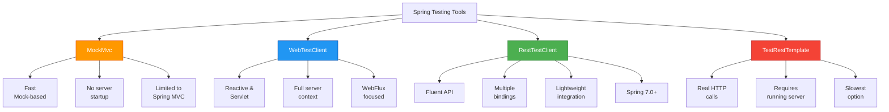
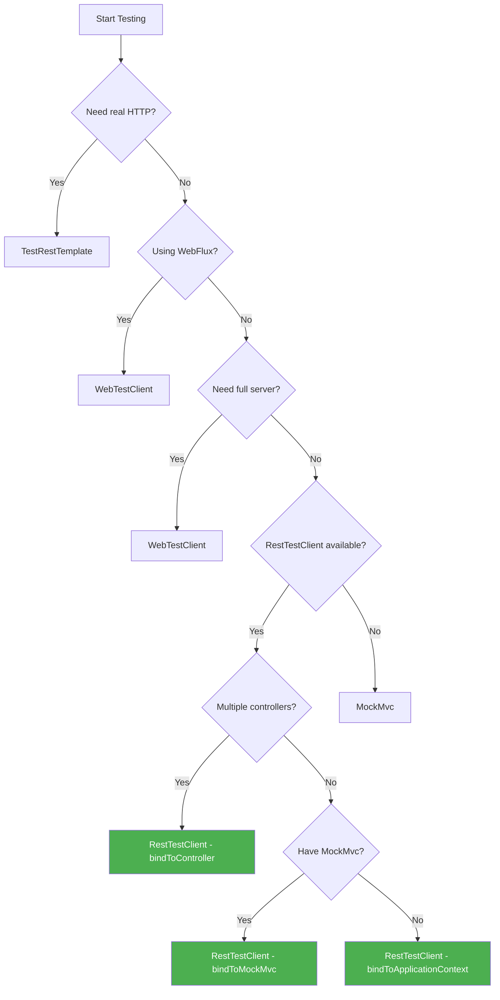
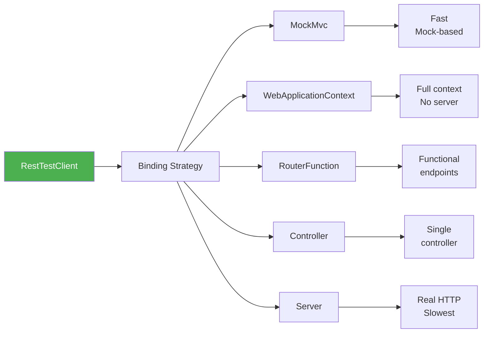
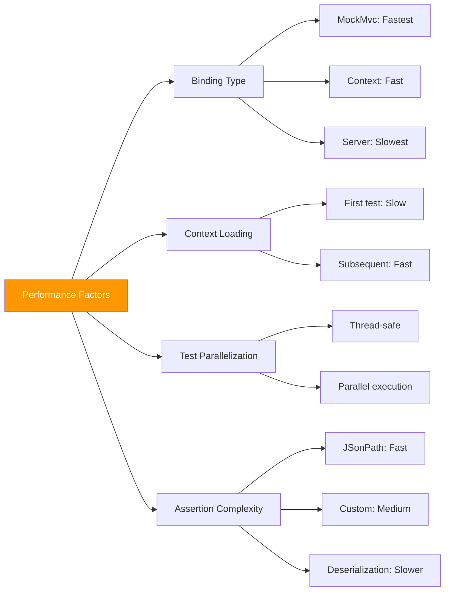
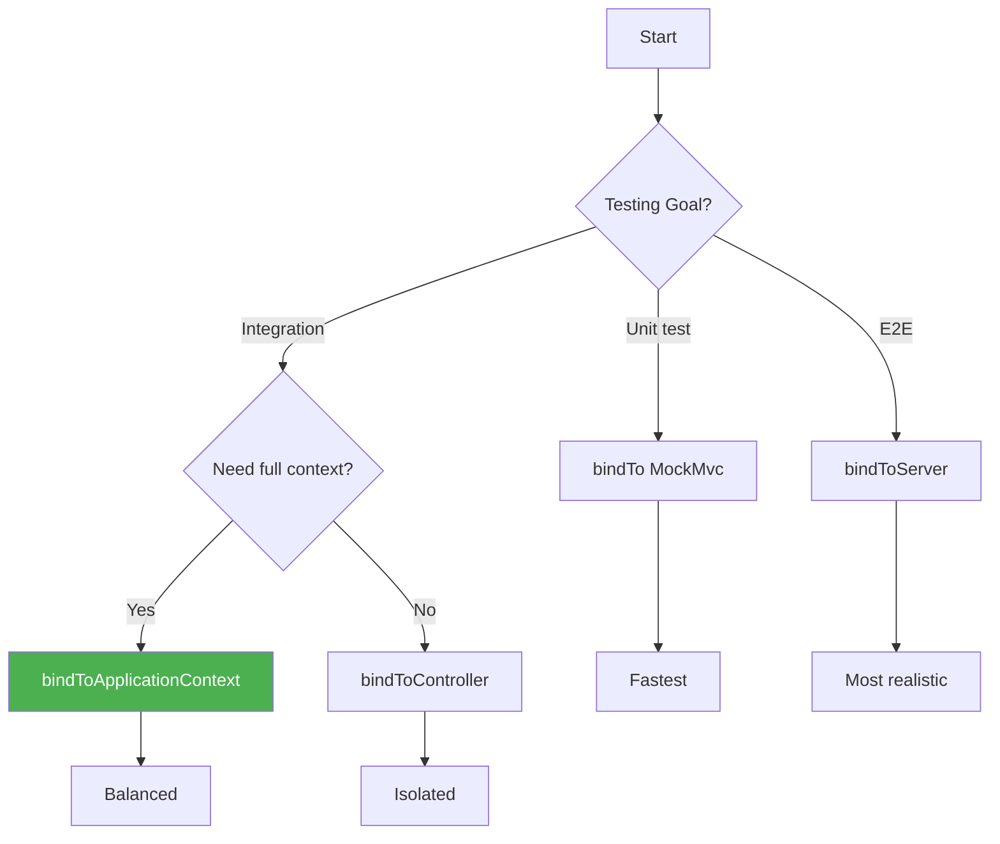

# Spring RestTestClient - Complete Integration Testing Guide

> **📚 Tutorial Series:** Spring Testing Ecosystem  
> **⏱️ Estimated Reading Time:** 25-30 minutes  
> **🎯 Difficulty Level:** Intermediate  
> **🔄 Last Updated:** July 7, 2026  
> **🔧 Spring Version:** Spring Framework 7.0+ / Spring Boot 3.2+

---

## Table of Contents

1. [Introduction](#introduction)
2. [Prerequisites](#prerequisites)
3. [Learning Objectives](#learning-objectives)
4. [The Testing Landscape](#the-testing-landscape)
5. [Setting Up RestTestClient](#setting-up-resttestclient)
6. [Binding Options Deep Dive](#binding-options-deep-dive)
7. [Configuration & Customization](#configuration--customization)
8. [Practical Examples](#practical-examples)
9. [Advanced Assertions](#advanced-assertions)
10. [Testing Different HTTP Methods](#testing-different-http-methods)
11. [Error Handling & Edge Cases](#error-handling--edge-cases)
12. [Performance Considerations](#performance-considerations)
13. [Security Testing](#security-testing)
14. [Best Practices](#best-practices)
15. [Anti-Patterns to Avoid](#anti-patterns-to-avoid)
16. [Real-World Use Cases](#real-world-use-cases)
17. [Troubleshooting Guide](#troubleshooting-guide)
18. [Practice Exercises](#practice-exercises)
19. [Question Bank](#question-bank)
20. [Summary & Key Takeaways](#summary--key-takeaways)
21. [Further Reading & Resources](#further-reading--resources)

---

## Introduction

Spring's testing ecosystem has undergone significant evolution, transitioning from simple mock-based simulations to sophisticated integration testing with embedded servers. **RestTestClient**, introduced in Spring Framework 7.0, represents the latest advancement in this journey—a fluent, builder-style HTTP client designed specifically for integration testing.

### What is RestTestClient?

RestTestClient is a lightweight, expressive testing client that bridges the gap between the simplicity of MockMvc and the realism of full HTTP integration testing. It provides a clean, readable API for making HTTP requests and asserting responses without the ceremony of traditional HTTP clients.

### Why RestTestClient Matters

In modern Spring Boot development, we need testing tools that are:
- **Fast** - Quick test execution without full server startup
- **Readable** - Clear intent in test code
- **Flexible** - Support for various binding scenarios
- **Powerful** - Rich assertion capabilities

RestTestClient delivers on all these fronts, making it an excellent choice for integration tests that need speed, readability, and flexibility.

### 💡 Key Insight

> RestTestClient isn't meant to replace MockMvc or WebTestClient entirely—it's a specialized tool optimized for specific testing scenarios. Understanding when to use each tool is crucial for effective testing strategies.

---

## Prerequisites

Before diving into RestTestClient, ensure you have:

### Required Knowledge
- ✅ **Spring Boot Fundamentals** - Understanding of REST controllers and request handling
- ✅ **JUnit 5** - Familiarity with modern testing annotations and lifecycle methods
- ✅ **Java 17+** - Records, var keyword, and modern Java features
- ✅ **Maven or Gradle** - Dependency management basics
- ✅ **HTTP Fundamentals** - Understanding of HTTP methods, status codes, headers

### Required Tools & Versions
- **Spring Boot 3.2+** (Spring Framework 7.0+)
- **JUnit 5** (Jupiter)
- **IDE:** IntelliJ IDEA, Eclipse, or VS Code with Java extensions
- **Build Tool:** Maven 3.8+ or Gradle 7.5+

### Project Setup
- A Spring Boot project (can be created via [Spring Initializr](https://start.spring.io/))
- Basic REST controller for testing
- Understanding of test directory structure

---

## Learning Objectives

By the end of this tutorial, you will be able to:

- ✅ Set up RestTestClient in a Spring Boot project
- ✅ Choose the appropriate binding strategy for different testing scenarios
- ✅ Write comprehensive integration tests with various HTTP methods
- ✅ Perform complex assertions using JSONPath and custom consumers
- ✅ Test error scenarios and edge cases
- ✅ Implement security testing with RestTestClient
- ✅ Optimize test performance and avoid common pitfalls
- ✅ Apply best practices for maintainable test suites
- ✅ Debug and troubleshoot common RestTestClient issues

---

## The Testing Landscape

Before exploring RestTestClient, let's understand where it fits in Spring's testing ecosystem.

### Spring Testing Tools Comparison



### When to Use Each Tool

| Tool | Use Case | Speed | Realism | Complexity |
|------|----------|-------|---------|------------|
| **MockMvc** | Unit testing controllers with mocked dependencies | ⚡⚡⚡⚡⚡ Very Fast | Low | Low |
| **WebTestClient** | Integration testing with WebFlux or full server context | ⚡⚡⚡⚡ Fast | High | Medium |
| **RestTestClient** | Lightweight integration tests with flexible binding | ⚡⚡⚡⚡ Fast | Medium-High | Low |
| **TestRestTemplate** | End-to-end tests with real HTTP | ⚡⚡ Slow | Very High | Low |

### Decision Flowchart



---

## Setting Up RestTestClient

### Step 1: Add Dependencies

#### Maven Configuration

```xml
<dependencies>
    <!-- Spring Boot Test Starter (includes RestTestClient) -->
    <dependency>
        <groupId>org.springframework.boot</groupId>
        <artifactId>spring-boot-starter-test</artifactId>
        <scope>test</scope>
    </dependency>
    
    <!-- Ensure Spring Framework 7.0+ -->
    <dependency>
        <groupId>org.springframework</groupId>
        <artifactId>spring-core</artifactId>
        <version>7.0.0</version>
        <scope>test</scope>
    </dependency>
</dependencies>
```

#### Gradle Configuration

```gradle
dependencies {
    // Spring Boot Test Starter
    testImplementation 'org.springframework.boot:spring-boot-starter-test'
    
    // Ensure Spring Framework 7.0+
    testImplementation 'org.springframework:spring-core:7.0.0'
}
```

### ⚠️ Version Requirement

> **Critical:** RestTestClient is only available in **Spring Framework 7.0 or later**. If you're using Spring Boot 3.1 or earlier, you'll need to upgrade to Spring Boot 3.2+ which includes Spring Framework 7.0.

### Step 2: Create Test Class Structure

```java
import org.junit.jupiter.api.BeforeEach;
import org.junit.jupiter.api.Test;
import org.springframework.boot.test.context.SpringBootTest;
import org.springframework.test.web.reactive.server.RestTestClient;

@SpringBootTest
class UserControllerIntegrationTest {
    
    private RestTestClient restTestClient;
    
    @BeforeEach
    void setUp() {
        // RestTestClient will be initialized here
    }
    
    @Test
    void exampleTest() {
        // Test implementation
    }
}
```

### Step 3: Verify Setup

Create a simple verification test to ensure everything is working:

```java
@Test
void contextLoads() {
    // Verify application context loads successfully
    assertThat(restTestClient).isNotNull();
}
```

---

## Binding Options Deep Dive

One of RestTestClient's most powerful features is its flexibility in binding to different server contexts. Let's explore each option in detail.

### Understanding Binding

Binding determines how RestTestClient interacts with your application. Think of it as choosing the "mode" of testing—from pure unit tests to full integration tests.



### Option 1: Bind to MockMvc

**Use Case:** You already have MockMvc configured and want to leverage it.

```java
import org.springframework.test.web.servlet.MockMvc;
import org.springframework.test.web.servlet.setup.MockMvcBuilders;
import org.springframework.web.context.WebApplicationContext;

@SpringBootTest
class UserControllerMockMvcTest {
    
    private RestTestClient restTestClient;
    private MockMvc mockMvc;
    
    @BeforeEach
    void setUp(WebApplicationContext context) {
        // Initialize MockMvc
        this.mockMvc = MockMvcBuilders
            .webAppContextSetup(context)
            .build();
        
        // Bind RestTestClient to MockMvc
        this.restTestClient = RestTestClient
            .bindTo(mockMvc)
            .build();
    }
}
```

**Advantages:**
- ✅ Reuses existing MockMvc configuration
- ✅ Fast execution (no server startup)
- ✅ Familiar setup for teams using MockMvc

**Limitations:**
- ⚠️ Doesn't exercise full HTTP stack
- ⚠️ Filters and interceptors may not be fully tested

### Option 2: Bind to WebApplicationContext

**Use Case:** You want full Spring context without starting a server.

```java
import org.springframework.web.context.WebApplicationContext;

@SpringBootTest(webEnvironment = SpringBootTest.WebEnvironment.MOCK)
class UserControllerContextTest {
    
    private RestTestClient restTestClient;
    
    @BeforeEach
    void setUp(WebApplicationContext context) {
        // Bind directly to application context
        this.restTestClient = RestTestClient
            .bindToApplicationContext(context)
            .build();
    }
}
```

**Advantages:**
- ✅ Full Spring context loaded
- ✅ Tests filters, interceptors, message converters
- ✅ No actual server startup
- ✅ Good balance of speed and realism

**Limitations:**
- ⚠️ Still not testing actual network layer

### Option 3: Bind to RouterFunction

**Use Case:** Testing functional endpoints (Spring WebFlux functional style).

```java
import org.springframework.web.function.server.RouterFunction;
import org.springframework.web.function.server.RouterFunctions;

@SpringBootTest
class FunctionalEndpointTest {
    
    private RestTestClient restTestClient;
    
    @BeforeEach
    void setUp() {
        RouterFunction<?> routerFunction = RouterFunctions
            .route()
            .GET("/users/{id}", new UserHandler()::handleUser)
            .POST("/users", new UserHandler()::createUser)
            .build();
        
        this.restTestClient = RestTestClient
            .bindToRouterFunction(routerFunction)
            .build();
    }
}
```

**Advantages:**
- ✅ Perfect for functional programming style
- ✅ Tests routing logic
- ✅ Lightweight and fast

**Limitations:**
- ⚠️ Only works with functional endpoints
- ⚠️ Requires handlers to be instantiated manually

### Option 4: Bind to Controllers

**Use Case:** Testing specific controllers in isolation.

```java
@SpringBootTest
class UserControllerIsolatedTest {
    
    private RestTestClient restTestClient;
    
    @BeforeEach
    void setUp() {
        // Bind to specific controller(s)
        this.restTestClient = RestTestClient
            .bindToController(new UserController(), new AuthController())
            .build();
    }
}
```

**Advantages:**
- ✅ Test controllers in isolation
- ✅ Fast execution
- ✅ No context loading overhead

**Limitations:**
- ⚠️ Doesn't test full request pipeline
- ⚠️ Dependencies must be manually injected

### Option 5: Bind to Live Server

**Use Case:** Testing against a running server (most realistic).

```java
import org.springframework.http.client.ClientHttpRequestFactory;
import org.springframework.web.client.RestTemplate;

@SpringBootTest(webEnvironment = SpringBootTest.WebEnvironment.RANDOM_PORT)
class UserControllerLiveServerTest {
    
    private RestTestClient restTestClient;
    
    @BeforeEach
    void setUp(@LocalServerPort int port) {
        // Create request factory for live server
        ClientHttpRequestFactory requestFactory = new RestTemplate()
            .getRequestFactory();
        
        // Configure to point to local server
        // Note: This requires additional configuration
        
        this.restTestClient = RestTestClient
            .bindToServer(requestFactory)
            .baseUrl("http://localhost:" + port)
            .build();
    }
}
```

**Advantages:**
- ✅ Most realistic testing
- ✅ Tests actual HTTP layer
- ✅ Catches network-related issues

**Limitations:**
- ⚠️ Slower than other options
- ⚠️ Requires server to be running
- ⚠️ More complex setup

### Binding Strategy Decision Matrix

| Scenario | Recommended Binding | Reason |
|----------|---------------------|--------|
| Existing MockMvc setup | `bindTo(MockMvc)` | Reuse existing configuration |
| Full context needed | `bindToApplicationContext()` | Balance of speed and realism |
| Functional endpoints | `bindToRouterFunction()` | Natural fit for functional style |
| Controller isolation | `bindToController()` | Fast, focused testing |
| End-to-end testing | `bindToServer()` | Maximum realism |

---

## Configuration & Customization

RestTestClient provides a builder pattern for flexible configuration.

### Basic Configuration

```java
import static org.springframework.http.MediaType.APPLICATION_JSON;

RestTestClient restTestClient = RestTestClient
    .bindToApplicationContext(context)
    .baseUrl("/api/v1")  // Base URL prefix
    .defaultHeader("Accept", APPLICATION_JSON.toString())
    .defaultHeader("X-API-Version", "1.0")
    .defaultCookie("SESSION", "abc123")
    .build();
```

### Configuration Options Explained

#### 1. Base URL
```java
.baseUrl("/api/public")
```
Sets a prefix for all requests. Instead of `/api/public/users`, you can use `/users`.

#### 2. Default Headers
```java
.defaultHeader("Content-Type", "application/json")
.defaultHeader("Authorization", "Bearer token123")
```
Headers automatically added to every request.

#### 3. Default Cookies
```java
.defaultCookie("JSESSIONID", "session123")
.defaultCookie("user_pref", "dark_mode")
```
Cookies automatically sent with every request.

### Advanced Configuration

#### Custom Request Factory

```java
import org.springframework.http.client.ClientHttpRequestFactory;
import org.springframework.http.client.SimpleClientHttpRequestFactory;

RestTestClient restTestClient = RestTestClient
    .bindToApplicationContext(context)
    .requestFactory(customRequestFactory())
    .build();

private ClientHttpRequestFactory customRequestFactory() {
    SimpleClientHttpRequestFactory factory = new SimpleClientHttpRequestFactory();
    factory.setConnectTimeout(5000);  // 5 seconds
    factory.setReadTimeout(10000);    // 10 seconds
    return factory;
}
```

#### Custom Message Converters

```java
import org.springframework.http.converter.HttpMessageConverter;
import org.springframework.http.converter.json.MappingJackson2HttpMessageConverter;

RestTestClient restTestClient = RestTestClient
    .bindToApplicationContext(context)
    .messageConverters(converters -> {
        // Add custom converters
        converters.add(new MappingJackson2HttpMessageConverter(customObjectMapper()));
    })
    .build();
```

### Configuration Best Practices

```mermaid
graph TB
    A[Configuration Strategy] --> B[Environment-based]
    A --> C[Test-specific]
    A --> D[Shared]
    
    B --> B1[Dev: localhost]
    B --> B2[CI: test server]
    B --> B3[Prod: disabled]
    
    C --> C1[Per-test class]
    C --> C2[@BeforeEach setup]
    C --> C3[Builder pattern]
    
    D --> D1[Base test class]
    D --> D2[Test configuration]
    D --> D3[Properties file]
    
    style A fill:#2196F3,color:#fff
```

---

## Practical Examples

Let's explore comprehensive examples covering various scenarios.

### Example 1: Happy Path Testing

#### Scenario: Fetch User by ID

**Controller:**
```java
@RestController
@RequestMapping("/api/users")
class UserController {
    
    private final UserService userService;
    
    public UserController(UserService userService) {
        this.userService = userService;
    }
    
    @GetMapping("/{id}")
    public ResponseEntity<User> getUserById(@PathVariable Long id) {
        User user = userService.findById(id)
            .orElseThrow(() -> new UserNotFoundException(id));
        return ResponseEntity.ok(user);
    }
}
```

**User Record:**
```java
public record User(
    Long id,
    String username,
    String email,
    UserRole role,
    Instant createdAt
) {
    public enum UserRole {
        ADMIN, USER, MODERATOR
    }
}
```

**Test Implementation:**
```java
@SpringBootTest
class UserControllerHappyPathTest {
    
    private RestTestClient restTestClient;
    
    @BeforeEach
    void setUp(WebApplicationContext context) {
        this.restTestClient = RestTestClient
            .bindToApplicationContext(context)
            .baseUrl("/api/users")
            .defaultHeader("Accept", "application/json")
            .build();
    }
    
    @Test
    void givenValidUserId_whenGetUser_thenReturnUser() {
        // Arrange
        Long userId = 1L;
        User expectedUser = new User(
            1L,
            "johndoe",
            "john@example.com",
            User.UserRole.USER,
            Instant.parse("2024-01-15T10:30:00Z")
        );
        
        // Act & Assert
        restTestClient
            .get()
            .uri("/{id}", userId)
            .exchange()
            .expectStatus()
            .isOk()
            .expectBody(User.class)
            .isEqualTo(expectedUser);
    }
    
    @Test
    void givenValidUserId_whenGetUser_thenReturnCorrectHeaders() {
        restTestClient
            .get()
            .uri("/{id}", 1L)
            .exchange()
            .expectStatus()
            .isOk()
            .expectHeader()
            .contentType("application/json")
            .expectHeader()
            .exists("X-Request-ID")
            .expectHeader()
            .valueEquals("X-API-Version", "1.0");
    }
}
```

### Example 2: Error Handling

#### Scenario: Test Various Error Conditions

```java
@SpringBootTest
class UserControllerErrorHandlingTest {
    
    private RestTestClient restTestClient;
    
    @BeforeEach
    void setUp(WebApplicationContext context) {
        this.restTestClient = RestTestClient
            .bindToApplicationContext(context)
            .baseUrl("/api/users")
            .build();
    }
    
    // Test 404 - User Not Found
    @Test
    void givenNonExistentUserId_whenGetUser_thenReturn404() {
        restTestClient
            .get()
            .uri("/{id}", 999L)
            .exchange()
            .expectStatus()
            .isNotFound()
            .expectBody()
            .jsonPath("$.error")
            .isEqualTo("User not found")
            .jsonPath("$.timestamp")
            .exists();
    }
    
    // Test 400 - Invalid Input
    @Test
    void givenNegativeUserId_whenGetUser_thenReturn400() {
        restTestClient
            .get()
            .uri("/{id}", -1L)
            .exchange()
            .expectStatus()
            .isBadRequest()
            .expectBody()
            .jsonPath("$.error")
            .isEqualTo("Invalid user ID");
    }
    
    // Test 500 - Server Error
    @Test
    void givenDatabaseError_whenGetUser_thenReturn500() {
        // Simulate database failure
        // This would require mocking or test configuration
        
        restTestClient
            .get()
            .uri("/{id}", 1L)
            .exchange()
            .expectStatus()
            .is5xxServerError();
    }
    
    // Test 401 - Unauthorized
    @Test
    void givenNoAuthToken_whenAccessProtectedEndpoint_thenReturn401() {
        restTestClient
            .get()
            .uri("/{id}/profile")
            .exchange()
            .expectStatus()
            .isUnauthorized();
    }
    
    // Test 403 - Forbidden
    @Test
    void givenInsufficientPermissions_whenAccessAdminEndpoint_thenReturn403() {
        restTestClient
            .get()
            .uri("/{id}/admin/settings")
            .header("Authorization", "Bearer user_token")
            .exchange()
            .expectStatus()
            .isForbidden();
    }
}
```

### Example 3: JSON Assertions with JSONPath

#### Scenario: Validate Complex JSON Responses

```java
@SpringBootTest
class UserControllerJsonAssertionTest {
    
    private RestTestClient restTestClient;
    
    @BeforeEach
    void setUp(WebApplicationContext context) {
        this.restTestClient = RestTestClient
            .bindToApplicationContext(context)
            .baseUrl("/api/users")
            .build();
    }
    
    @Test
    void givenValidId_whenGetPerson_thenReturnsCorrectFields() {
        restTestClient
            .get()
            .uri("/{id}", 1L)
            .exchange()
            .expectStatus()
            .isOk()
            .expectBody()
            // Validate individual fields
            .jsonPath("$.id").isEqualTo(1)
            .jsonPath("$.name").isEqualTo("John Doe")
            // Validate nested objects
            .jsonPath("$.address.city").exists()
            .jsonPath("$.address.country").isEqualTo("USA")
            // Validate arrays
            .jsonPath("$.permissions").isArray()
            .jsonPath("$.permissions[0]").isEqualTo("READ")
            .jsonPath("$.permissions[1]").isEqualTo("WRITE")
            // Validate existence
            .jsonPath("$.createdAt").exists()
            .jsonPath("$.lastLogin").exists();
    }
    
    @Test
    void givenUserList_whenGetAllUsers_thenReturnCorrectCount() {
        restTestClient
            .get()
            .uri("")
            .exchange()
            .expectStatus()
            .isOk()
            .expectBody()
            .jsonPath("$").isArray()
            .jsonPath("$.length()").isEqualTo(10)
            .jsonPath("$[0].id").exists()
            .jsonPath("$[*].username").isNotEmpty();
    }
}
```

### Example 4: Custom Assertions with consumeWith()

#### Scenario: Complex Validation Logic

```java
import static org.assertj.core.api.Assertions.assertThat;

@SpringBootTest
class UserControllerCustomAssertionTest {
    
    private RestTestClient restTestClient;
    
    @BeforeEach
    void setUp(WebApplicationContext context) {
        this.restTestClient = RestTestClient
            .bindToApplicationContext(context)
            .baseUrl("/api/users")
            .build();
    }
    
    @Test
    void givenValidRequest_whenGetPerson_thenPassesAllAssertions() {
        restTestClient
            .get()
            .uri("/{id}", 1L)
            .exchange()
            .expectStatus()
            .isOk()
            .expectBody(Person.class)
            .consumeWith(result -> {
                // Status assertions
                assertThat(result.getStatus().value())
                    .as("HTTP status should be 200")
                    .isEqualTo(200);
                
                assertThat(result.getStatus().getReasonPhrase())
                    .as("Status reason should be OK")
                    .isEqualTo("OK");
                
                // Response body assertions
                Person person = result.getResponseBody();
                assertThat(person)
                    .as("Person should not be null")
                    .isNotNull();
                
                assertThat(person.getId())
                    .as("Person ID should be positive")
                    .isPositive()
                    .isEqualTo(1L);
                
                assertThat(person.getName())
                    .as("Name should not be blank")
                    .isNotBlank()
                    .hasSizeGreaterThan(3);
                
                // Response headers assertions
                assertThat(result.getResponseHeaders())
                    .as("Response should have content type")
                    .containsKey("Content-Type");
                
                assertThat(result.getResponseHeaders().getFirst("Content-Type"))
                    .as("Content type should be JSON")
                    .contains("application/json");
            });
    }
}
```

### Example 5: Multiple Controllers

#### Scenario: Testing Multiple Controllers Together

```java
@SpringBootTest
class MultipleControllerTest {
    
    private RestTestClient restTestClient;
    
    @BeforeEach
    void setUp() {
        // Bind to multiple controllers
        this.restTestClient = RestTestClient
            .bindToController(userController, orderController, productController)
            .build();
    }
    
    @Test
    void givenValidQueryToSecondController_whenGetPenguinMono_thenReturnsEmpty() {
        restTestClient
            .get()
            .uri("/pink/penguin")
            .accept(MediaType.APPLICATION_JSON)
            .exchange()
            .expectStatus()
            .isOk()
            .expectBody(Penguin.class)
            .value(it -> assertThat(it).isNull());
    }
}
```

This approach is useful for testing composite APIs or modular services, ensuring interactions between controllers work as expected without a full server spin-up.

---

## Advanced Assertions

### Working with Raw JSON

Sometimes you need to validate raw JSON without deserialization:

```java
@Test
void givenJsonResponse_whenValidateRawJson_thenStructureIsCorrect() {
    restTestClient
        .get()
        .uri("/{id}", 1L)
        .exchange()
        .expectStatus()
        .isOk()
        .expectBody()
        .json("""
            {
                "id": 1,
                "name": "John Doe",
                "email": "john@example.com"
            }
            """);
}
```

### JSON Schema Validation

```java
@Test
void givenJsonResponse_whenValidateAgainstSchema_thenValid() {
    String schema = """
        {
            "type": "object",
            "properties": {
                "id": {"type": "number"},
                "name": {"type": "string"},
                "email": {"type": "string", "format": "email"}
            },
            "required": ["id", "name", "email"]
        }
        """;
    
    restTestClient
        .get()
        .uri("/{id}", 1L)
        .exchange()
        .expectStatus()
        .isOk()
        .expectBody()
        .json(schema);
}
```

### XPath Assertions (for XML)

```java
@Test
void givenXmlResponse_whenValidateXPath_thenCorrect() {
    restTestClient
        .get()
        .uri("/{id}/xml", 1L)
        .accept(MediaType.APPLICATION_XML)
        .exchange()
        .expectStatus()
        .isOk()
        .expectBody()
        .xpath("/user/id").isEqualTo("1")
        .xpath("/user/name").isEqualTo("John Doe")
        .xpath("/user/email").exists();
}
```

---

## Testing Different HTTP Methods

### Complete CRUD Operations Example

```java
@SpringBootTest
class UserCrudOperationsTest {
    
    private RestTestClient restTestClient;
    private Long createdUserId;
    
    @BeforeEach
    void setUp(WebApplicationContext context) {
        this.restTestClient = RestTestClient
            .bindToApplicationContext(context)
            .baseUrl("/api/users")
            .build();
    }
    
    // CREATE
    @Test
    void whenCreateUser_thenUserIsCreated() {
        UserCreateRequest request = new UserCreateRequest(
            "testuser",
            "test@example.com",
            "password123",
            User.UserRole.USER
        );
        
        restTestClient
            .post()
            .uri("")
            .bodyValue(request)
            .exchange()
            .expectStatus()
            .isCreated()
            .expectBody(User.class)
            .consumeWith(result -> {
                createdUserId = result.getResponseBody().id();
                assertThat(createdUserId).isNotNull();
            });
    }
    
    // READ
    @Test
    void whenGetUser_thenUserIsReturned() {
        restTestClient
            .get()
            .uri("/{id}", createdUserId)
            .exchange()
            .expectStatus()
            .isOk()
            .expectBody(User.class)
            .isNotNull();
    }
    
    // UPDATE
    @Test
    void whenUpdateUser_thenUserIsUpdated() {
        UserUpdateRequest request = new UserUpdateRequest(
            "updateduser",
            "updated@example.com",
            User.UserRole.ADMIN
        );
        
        restTestClient
            .put()
            .uri("/{id}", createdUserId)
            .bodyValue(request)
            .exchange()
            .expectStatus()
            .isOk()
            .expectBody(User.class)
            .consumeWith(result -> {
                assertThat(result.getResponseBody().username()).isEqualTo("updateduser");
                assertThat(result.getResponseBody().role()).isEqualTo(User.UserRole.ADMIN);
            });
    }
    
    // DELETE
    @Test
    void whenDeleteUser_thenUserIsDeleted() {
        restTestClient
            .delete()
            .uri("/{id}", createdUserId)
            .exchange()
            .expectStatus()
            .isNoContent();
        
        // Verify deletion
        restTestClient
            .get()
            .uri("/{id}", createdUserId)
            .exchange()
            .expectStatus()
            .isNotFound();
    }
}
```

---

## Error Handling & Edge Cases

### Testing Timeout Scenarios

```java
@Test
void givenSlowEndpoint_whenRequest_thenRespectsTimeout() {
    restTestClient
        .get()
        .uri("/slow-endpoint")
        .exchange()
        .expectStatus()
        .isOk()
        .expectBody()
        .consumeWith(result -> {
            // Validate response time
            long duration = result.getElapsedTime();
            assertThat(duration)
                .as("Response should complete within 5 seconds")
                .isLessThan(5000);
        });
}
```

### Testing Empty Responses

```java
@Test
void givenEmptyResponse_whenRequest_thenBodyIsEmpty() {
    restTestClient
        .get()
        .uri("/empty-response")
        .exchange()
        .expectStatus()
        .isOk()
        .expectBody()
        .isEmpty();  // Explicitly check for empty body
}
```

### Testing Large Payloads

```java
@Test
void givenLargePayload_whenProcess_thenHandlesCorrectly() {
    // Create large payload (1MB)
    StringBuilder largePayload = new StringBuilder();
    for (int i = 0; i < 100000; i++) {
        largePayload.append("data").append(i).append(",");
    }
    
    restTestClient
        .post()
        .uri("/process")
        .bodyValue(largePayload.toString())
        .exchange()
        .expectStatus()
        .isOk()
        .expectBody()
        .jsonPath("$.processed").isEqualTo(true);
}
```

---

## Performance Considerations

### RestTestClient Performance Characteristics



### Performance Optimization Tips

#### 1. Reuse RestTestClient Instances

```java
// ❌ Bad - Creates new instance for each test
@Test
void test1() {
    RestTestClient client = RestTestClient.bindToApplicationContext(context).build();
    // test...
}

@Test
void test2() {
    RestTestClient client = RestTestClient.bindToApplicationContext(context).build();
    // test...
}

// ✅ Good - Reuse instance
@BeforeEach
void setUp(WebApplicationContext context) {
    this.restTestClient = RestTestClient
        .bindToApplicationContext(context)
        .build();
}

@Test
void test1() {
    // Use restTestClient
}

@Test
void test2() {
    // Use same restTestClient
}
```

#### 2. Use Appropriate Binding

```java
// For unit tests - use MockMvc binding (fastest)
restTestClient = RestTestClient.bindTo(mockMvc).build();

// For integration tests - use ApplicationContext (balanced)
restTestClient = RestTestClient.bindToApplicationContext(context).build();

// For E2E tests - use server binding (slowest but most realistic)
restTestClient = RestTestClient.bindToServer(requestFactory).build();
```

#### 3. Parallel Test Execution

```java
@SpringBootTest
class ParallelUserTest {
    
    private RestTestClient restTestClient;
    
    @BeforeEach
    void setUp(WebApplicationContext context) {
        // RestTestClient is immutable and thread-safe
        this.restTestClient = RestTestClient
            .bindToApplicationContext(context)
            .build();
    }
    
    @Test
    @Execution(ExecutionMode.CONCURRENT)
    void parallelTest1() {
        // Can run in parallel
    }
    
    @Test
    @Execution(ExecutionMode.CONCURRENT)
    void parallelTest2() {
        // Can run in parallel
    }
}
```

### Performance Benchmarking

```java
@Test
void benchmarkRestTestClient() {
    long startTime = System.currentTimeMillis();
    
    for (int i = 0; i < 100; i++) {
        restTestClient
            .get()
            .uri("/users/{id}", i)
            .exchange()
            .expectStatus()
            .isOk();
    }
    
    long duration = System.currentTimeMillis() - startTime;
    System.out.println("100 requests completed in: " + duration + "ms");
    System.out.println("Average per request: " + (duration / 100.0) + "ms");
}
```

---

## Security Testing

### Testing Authentication

```java
@SpringBootTest
class AuthenticationTest {
    
    private RestTestClient restTestClient;
    
    @BeforeEach
    void setUp(WebApplicationContext context) {
        this.restTestClient = RestTestClient
            .bindToApplicationContext(context)
            .baseUrl("/api/users")
            .build();
    }
    
    @Test
    void givenValidJWTToken_whenAccessProtectedEndpoint_thenAccessGranted() {
        String validToken = generateValidJWTToken();
        
        restTestClient
            .get()
            .uri("/{id}/profile")
            .header("Authorization", "Bearer " + validToken)
            .exchange()
            .expectStatus()
            .isOk()
            .expectBody()
            .jsonPath("$.username").exists();
    }
    
    @Test
    void givenExpiredJWTToken_whenAccessProtectedEndpoint_thenReturn401() {
        String expiredToken = generateExpiredJWTToken();
        
        restTestClient
            .get()
            .uri("/{id}/profile")
            .header("Authorization", "Bearer " + expiredToken)
            .exchange()
            .expectStatus()
            .isUnauthorized()
            .expectBody()
            .jsonPath("$.error")
            .isEqualTo("Token expired");
    }
    
    @Test
    void givenInvalidJWTToken_whenAccessProtectedEndpoint_thenReturn401() {
        restTestClient
            .get()
            .uri("/{id}/profile")
            .header("Authorization", "Bearer invalid_token")
            .exchange()
            .expectStatus()
            .isUnauthorized();
    }
    
    private String generateValidJWTToken() {
        // Implementation depends on your JWT library
        return "valid.jwt.token";
    }
    
    private String generateExpiredJWTToken() {
        return "expired.jwt.token";
    }
}
```

### Testing Authorization

```java
@SpringBootTest
class AuthorizationTest {
    
    private RestTestClient restTestClient;
    
    @BeforeEach
    void setUp(WebApplicationContext context) {
        this.restTestClient = RestTestClient
            .bindToApplicationContext(context)
            .baseUrl("/api/admin")
            .build();
    }
    
    @Test
    void givenAdminUser_whenAccessAdminEndpoint_thenAccessGranted() {
        String adminToken = generateTokenWithRole("ADMIN");
        
        restTestClient
            .get()
            .uri("/dashboard")
            .header("Authorization", "Bearer " + adminToken)
            .exchange()
            .expectStatus()
            .isOk();
    }
    
    @Test
    void givenRegularUser_whenAccessAdminEndpoint_thenReturn403() {
        String userToken = generateTokenWithRole("USER");
        
        restTestClient
            .get()
            .uri("/dashboard")
            .header("Authorization", "Bearer " + userToken)
            .exchange()
            .expectStatus()
            .isForbidden()
            .expectBody()
            .jsonPath("$.error")
            .isEqualTo("Access denied: Admin role required");
    }
    
    @Test
    void givenModerator_whenAccessAdminEndpoint_thenReturn403() {
        String moderatorToken = generateTokenWithRole("MODERATOR");
        
        restTestClient
            .get()
            .uri("/dashboard")
            .header("Authorization", "Bearer " + moderatorToken)
            .exchange()
            .expectStatus()
            .isForbidden();
    }
    
    private String generateTokenWithRole(String role) {
        // Implementation depends on your JWT library
        return "token.with." + role;
    }
}
```

### Testing CORS

```java
@SpringBootTest
class CorsTest {
    
    private RestTestClient restTestClient;
    
    @BeforeEach
    void setUp(WebApplicationContext context) {
        this.restTestClient = RestTestClient
            .bindToApplicationContext(context)
            .baseUrl("/api/users")
            .build();
    }
    
    @Test
    void givenValidOrigin_whenPreflightRequest_thenCorsHeadersPresent() {
        restTestClient
            .options()
            .uri("")
            .header("Origin", "https://example.com")
            .header("Access-Control-Request-Method", "GET")
            .exchange()
            .expectStatus()
            .isOk()
            .expectHeader()
            .valueEquals("Access-Control-Allow-Origin", "https://example.com")
            .expectHeader()
            .exists("Access-Control-Allow-Methods")
            .expectHeader()
            .exists("Access-Control-Allow-Headers");
    }
}
```

---

## Best Practices

### 1. Choose the Right Binding Strategy



**Guidelines:**
- ✅ Use `bindToApplicationContext()` for most integration tests
- ✅ Use `bindTo(MockMvc)` when you have existing MockMvc setup
- ✅ Use `bindToController()` for isolated controller tests
- ✅ Use `bindToServer()` only for end-to-end tests

### 2. Write Descriptive Test Names

```java
// ❌ Bad
@Test
void test1() { }

// ✅ Good
@Test
void givenValidUserId_whenGetUser_thenReturnUserWithCorrectData() { }

@Test
void givenNonExistentUserId_whenGetUser_thenReturn404NotFound() { }
```

### 3. Use Builder Pattern Consistently

```java
// ✅ Good - Consistent builder usage
restTestClient
    .get()
    .uri("/users/{id}", 1L)
    .header("Accept", "application/json")
    .exchange()
    .expectStatus()
    .isOk();
```

### 4. Separate Test Configuration

```java
// Test configuration class
@TestConfiguration
class TestConfig {
    
    @Bean
    @Primary
    public UserService userService() {
        return new TestUserService();  // Test-specific implementation
    }
}

// Use in test
@SpringBootTest
@Import(TestConfig.class)
class UserControllerTest {
    // Test implementation
}
```

### 5. Use Test Data Builders

```java
// Test data builder pattern
class UserTestBuilder {
    private Long id = 1L;
    private String username = "testuser";
    private String email = "test@example.com";
    private User.UserRole role = User.UserRole.USER;
    
    public UserTestBuilder withId(Long id) {
        this.id = id;
        return this;
    }
    
    public UserTestBuilder withUsername(String username) {
        this.username = username;
        return this;
    }
    
    public User build() {
        return new User(id, username, email, role, Instant.now());
    }
}

// Usage in test
@Test
void testUser() {
    User user = new UserTestBuilder()
        .withId(1L)
        .withUsername("customuser")
        .build();
    
    // Use user in test
}
```

### 6. Organize Tests Logically

```java
@SpringBootTest
class UserControllerTest {
    
    // Nested test groups
    @Nested
    @DisplayName("GET /users/{id}")
    class GetUserTests {
        @Test
        void givenValidId_whenGetUser_thenReturnUser() { }
        
        @Test
        void givenInvalidId_whenGetUser_thenReturn404() { }
    }
    
    @Nested
    @DisplayName("POST /users")
    class CreateUserTests {
        @Test
        void givenValidData_whenCreateUser_thenReturn201() { }
        
        @Test
        void givenInvalidData_whenCreateUser_thenReturn400() { }
    }
}
```

### 7. Use AssertJ for Fluent Assertions

```java
import static org.assertj.core.api.Assertions.assertThat;

// ✅ Good - Fluent and readable
assertThat(user.getEmail())
    .isNotBlank()
    .contains("@")
    .endsWith("@example.com");

// ❌ Avoid - Multiple separate assertions
assertNotNull(user.getEmail());
assertTrue(user.getEmail().contains("@"));
assertTrue(user.getEmail().endsWith("@example.com"));
```

### 8. Clean Up Test Data

```java
@AfterEach
void cleanUp() {
    // Clean up test data
    userRepository.deleteAll();
}
```

---

## Anti-Patterns to Avoid

### ❌ Anti-Pattern 1: Testing Implementation Details

```java
// ❌ Bad - Testing internal implementation
@Test
void testInternalMethod() {
    restTestClient
        .get()
        .uri("/users/1")
        .exchange()
        .expectBody()
        .consumeWith(result -> {
            // Testing internal state
            assertThat(result.getInternalResponse().getInternalFlag())
                .isTrue();
        });
}

// ✅ Good - Testing observable behavior
@Test
void testUserRetrieval() {
    restTestClient
        .get()
        .uri("/users/1")
        .exchange()
        .expectStatus()
        .isOk()
        .expectBody(User.class)
        .isEqualTo(expectedUser);
}
```

### ❌ Anti-Pattern 2: Over-Mocking

```java
// ❌ Bad - Mocking everything
@MockBean
private UserService userService;

@MockBean
private EmailService emailService;

@MockBean
private AuditService auditService;

// This defeats the purpose of integration testing

// ✅ Good - Let Spring context load real beans
// Only mock external dependencies
@MockBean
private ExternalApiService externalApiService;
```

### ❌ Anti-Pattern 3: Ignoring Binding Differences

```java
// ❌ Bad - Assuming all bindings behave the same
// This test passes with bindToController but fails in production
@Test
void testWithControllerBinding() {
    restTestClient.bindToController(userController).build();
    // Test that relies on filter behavior
}

// ✅ Good - Use appropriate binding for the test
@Test
void testWithContextBinding() {
    restTestClient.bindToApplicationContext(context).build();
    // Test that exercises full stack including filters
}
```

### ❌ Anti-Pattern 4: Brittle Assertions

```java
// ❌ Bad - Asserting on exact timestamps
assertThat(user.getCreatedAt())
    .isEqualTo(Instant.parse("2024-01-15T10:30:00Z"));

// ✅ Good - Assert on properties
assertThat(user.getCreatedAt())
    .isBefore(Instant.now())
    .isAfter(Instant.parse("2024-01-01T00:00:00Z"));
```

### ❌ Anti-Pattern 5: Not Testing Error Cases

```java
// ❌ Bad - Only testing happy path
@Test
void testGetUser() {
    restTestClient
        .get()
        .uri("/users/1")
        .exchange()
        .expectStatus()
        .isOk();
}

// ✅ Good - Test both success and failure
@Test
void testGetUser() {
    // Success case
    restTestClient
        .get()
        .uri("/users/1")
        .exchange()
        .expectStatus()
        .isOk();
    
    // Failure case
    restTestClient
        .get()
        .uri("/users/999")
        .exchange()
        .expectStatus()
        .isNotFound();
}
```

### ❌ Anti-Pattern 6: Shared Mutable State

```java
// ❌ Bad - Shared mutable state
private RestTestClient.Builder builder;  // Mutable and not thread-safe

@Test
void test1() {
    builder.baseUrl("/api/users");  // Modifies shared builder
}

@Test
void test2() {
    // Builder state is unpredictable
}

// ✅ Good - Immutable instances
private RestTestClient restTestClient;  // Immutable and thread-safe

@BeforeEach
void setUp() {
    this.restTestClient = RestTestClient
        .bindToApplicationContext(context)
        .baseUrl("/api/users")
        .build();
}
```

---

## Real-World Use Cases

### Use Case 1: Microservices Integration Testing

```java
@SpringBootTest
class OrderServiceIntegrationTest {
    
    private RestTestClient restTestClient;
    
    @BeforeEach
    void setUp(WebApplicationContext context) {
        this.restTestClient = RestTestClient
            .bindToApplicationContext(context)
            .baseUrl("/api/orders")
            .build();
    }
    
    @Test
    void whenCreateOrder_thenOrderCreatedAndInventoryUpdated() {
        // Create order
        Order order = new Order(null, 1L, List.of(
            new OrderItem(null, 1L, 2),  // 2 units of product 1
            new OrderItem(null, 2L, 1)   // 1 unit of product 2
        ));
        
        restTestClient
            .post()
            .uri("")
            .bodyValue(order)
            .exchange()
            .expectStatus()
            .isCreated()
            .expectBody(Order.class)
            .consumeWith(result -> {
                Order createdOrder = result.getResponseBody();
                assertThat(createdOrder.id()).isNotNull();
                assertThat(createdOrder.status()).isEqualTo(Order.Status.PENDING);
            });
        
        // Verify inventory was updated (integration check)
        restTestClient
            .get()
            .uri("/inventory/1")
            .exchange()
            .expectStatus()
            .isOk()
            .expectBody()
            .jsonPath("$.quantity").isEqualTo(98);  // Original 100 - 2
    }
}
```

### Use Case 2: API Contract Testing

```java
@SpringBootTest
class ApiContractTest {
    
    private RestTestClient restTestClient;
    
    @BeforeEach
    void setUp(WebApplicationContext context) {
        this.restTestClient = RestTestClient
            .bindToApplicationContext(context)
            .baseUrl("/api/v1")
            .build();
    }
    
    @Test
    void verifyUserApiContract() {
        // GET /users/{id} contract
        restTestClient
            .get()
            .uri("/users/1")
            .exchange()
            .expectStatus()
            .isOk()
            .expectHeader()
            .contentType("application/json")
            .expectBody()
            .jsonPath("$.id").exists()
            .jsonPath("$.username").exists()
            .jsonPath("$.email").exists()
            .jsonPath("$.createdAt").exists();
    }
    
    @Test
    void verifyErrorResponseContract() {
        // Error response structure contract
        restTestClient
            .get()
            .uri("/users/999")
            .exchange()
            .expectStatus()
            .isNotFound()
            .expectBody()
            .jsonPath("$.error").exists()
            .jsonPath("$.timestamp").exists()
            .jsonPath("$.path").exists();
    }
}
```

### Use Case 3: Testing with Database Transactions

```java
@SpringBootTest
@TestTransaction(propagation = NOT_SUPPORTED)
class UserServiceDatabaseTest {
    
    private RestTestClient restTestClient;
    
    @BeforeEach
    void setUp(WebApplicationContext context) {
        this.restTestClient = RestTestClient
            .bindToApplicationContext(context)
            .baseUrl("/api/users")
            .build();
    }
    
    @Test
    void whenCreateUser_thenPersistedToDatabase() {
        UserCreateRequest request = new UserCreateRequest(
            "dbuser",
            "db@example.com",
            "password",
            User.UserRole.USER
        );
        
        // Create user via API
        restTestClient
            .post()
            .uri("")
            .bodyValue(request)
            .exchange()
            .expectStatus()
            .isCreated();
        
        // Verify in database
        User user = userRepository.findByUsername("dbuser")
            .orElseThrow();
        
        assertThat(user.getEmail()).isEqualTo("db@example.com");
    }
}
```

---

## Troubleshooting Guide

### Common Issues and Solutions

#### Issue 1: RestTestClient Class Not Found

**Symptom:**
```
Cannot resolve symbol 'RestTestClient'
```

**Solution:**
```xml
<!-- Ensure Spring Framework 7.0+ -->
<dependency>
    <groupId>org.springframework</groupId>
    <artifactId>spring-core</artifactId>
    <version>7.0.0</version>
</dependency>
```

#### Issue 2: Null Response Body

**Symptom:**
```java
.expectBody(Person.class)
.consumeWith(result -> {
    Person person = result.getResponseBody();  // Null!
});
```

**Solution:**
```java
// ✅ Always check for empty body explicitly
.expectBody()
.isEmpty();

// Or use value() instead of isEqualTo()
.expectBody(Person.class)
.value(person -> assertThat(person).isNotNull());
```

#### Issue 3: Context Loading Failures

**Symptom:**
```
Failed to load ApplicationContext
```

**Solution:**
```java
// Use appropriate web environment
@SpringBootTest(webEnvironment = SpringBootTest.WebEnvironment.MOCK)

// Or specify ports
@SpringBootTest(webEnvironment = SpringBootTest.WebEnvironment.RANDOM_PORT)
```

#### Issue 4: Binding Issues

**Symptom:**
```
No request factory available
```

**Solution:**
```java
// Ensure proper binding
@BeforeEach
void setUp(WebApplicationContext context) {
    this.restTestClient = RestTestClient
        .bindToApplicationContext(context)  // Don't forget this!
        .build();
}
```

#### Issue 5: JSON Path Assertions Failing

**Symptom:**
```
JSON path evaluation failed
```

**Solution:**
```java
// Check JSON structure first
.expectBody()
.consumeWith(result -> {
    System.out.println(result.getResponseBody());
});

// Use correct JSONPath syntax
.jsonPath("$.user.name")  // Correct
.jsonPath("$.['user'].name")  // Alternative
```

### Debugging Tips

#### 1. Log Request/Response

```java
@Test
void debugRequestResponse() {
    restTestClient
        .get()
        .uri("/users/1")
        .exchange()
        .expectStatus()
        .isOk()
        .expectBody()
        .consumeWith(result -> {
            // Log response
            System.out.println("Status: " + result.getStatus());
            System.out.println("Headers: " + result.getResponseHeaders());
            System.out.println("Body: " + result.getResponseBody());
        });
}
```

#### 2. Use WireMock for External Dependencies

```java
@WireMockTest(httpPort = 8080)
class UserServiceWithWireMockTest {
    
    @Test
    void testWithMockedExternalService() {
        stubFor(get("/external-api/users/1")
            .willReturn(okJson("{\"id\": 1, \"name\": \"John\"}")));
        
        // Test with mocked external service
    }
}
```

---

## Practice Exercises

### Exercise 1: Basic CRUD Operations

**Difficulty:** ⭐ Beginner

**Task:** Create a complete set of CRUD tests for a `Product` entity with the following fields:
- `id` (Long)
- `name` (String)
- `price` (BigDecimal)
- `category` (String)

**Requirements:**
1. Test creating a new product (POST)
2. Test retrieving a product by ID (GET)
3. Test updating a product (PUT)
4. Test deleting a product (DELETE)
5. Test listing all products (GET)

**Solution:**

```java
@SpringBootTest
class ProductCrudTest {
    
    private RestTestClient restTestClient;
    
    @BeforeEach
    void setUp(WebApplicationContext context) {
        this.restTestClient = RestTestClient
            .bindToApplicationContext(context)
            .baseUrl("/api/products")
            .build();
    }
    
    @Test
    void whenCreateProduct_thenProductIsCreated() {
        Product product = new Product(null, "Laptop", new BigDecimal("999.99"), "Electronics");
        
        restTestClient
            .post()
            .uri("")
            .bodyValue(product)
            .exchange()
            .expectStatus()
            .isCreated()
            .expectBody(Product.class)
            .consumeWith(result -> {
                Product created = result.getResponseBody();
                assertThat(created.id()).isNotNull();
                assertThat(created.name()).isEqualTo("Laptop");
            });
    }
    
    @Test
    void whenGetProduct_thenProductIsReturned() {
        // Create product first
        Product created = createTestProduct();
        
        // Retrieve it
        restTestClient
            .get()
            .uri("/{id}", created.id())
            .exchange()
            .expectStatus()
            .isOk()
            .expectBody(Product.class)
            .isEqualTo(created);
    }
    
    @Test
    void whenUpdateProduct_thenProductIsUpdated() {
        Product created = createTestProduct();
        Product updated = new Product(created.id(), "Gaming Laptop", 
            new BigDecimal("1299.99"), "Electronics");
        
        restTestClient
            .put()
            .uri("/{id}", created.id())
            .bodyValue(updated)
            .exchange()
            .expectStatus()
            .isOk()
            .expectBody(Product.class)
            .consumeWith(result -> {
                Product product = result.getResponseBody();
                assertThat(product.name()).isEqualTo("Gaming Laptop");
                assertThat(product.price()).isEqualTo(new BigDecimal("1299.99"));
            });
    }
    
    @Test
    void whenDeleteProduct_thenProductIsDeleted() {
        Product created = createTestProduct();
        
        restTestClient
            .delete()
            .uri("/{id}", created.id())
            .exchange()
            .expectStatus()
            .isNoContent();
        
        // Verify deletion
        restTestClient
            .get()
            .uri("/{id}", created.id())
            .exchange()
            .expectStatus()
            .isNotFound();
    }
    
    @Test
    void whenGetAllProducts_thenAllProductsReturned() {
        createTestProduct();
        createTestProduct();
        
        restTestClient
            .get()
            .uri("")
            .exchange()
            .expectStatus()
            .isOk()
            .expectBody()
            .jsonPath("$").isArray()
            .jsonPath("$.length()").isGreaterThanOrEqualTo(2);
    }
    
    private Product createTestProduct() {
        Product product = new Product(null, "Test Product", 
            new BigDecimal("49.99"), "Test Category");
        
        return restTestClient
            .post()
            .uri("")
            .bodyValue(product)
            .exchange()
            .expectStatus()
            .isCreated()
            .expectBody(Product.class)
            .returnResult()
            .getResponseBody();
    }
}

record Product(Long id, String name, BigDecimal price, String category) {}
```

### Exercise 2: Error Handling and Validation

**Difficulty:** ⭐⭐ Intermediate

**Task:** Implement comprehensive error handling tests for an `Order` API.

**Requirements:**
1. Test validation errors (invalid input)
2. Test business rule violations
3. Test authentication/authorization errors
4. Test server errors
5. Verify error response format

**Solution:**

```java
@SpringBootTest
class OrderErrorHandlingTest {
    
    private RestTestClient restTestClient;
    
    @BeforeEach
    void setUp(WebApplicationContext context) {
        this.restTestClient = RestTestClient
            .bindToApplicationContext(context)
            .baseUrl("/api/orders")
            .build();
    }
    
    @Test
    void givenInvalidOrderData_whenCreateOrder_thenReturn400() {
        Order invalidOrder = new Order(null, -1L, List.of());  // Invalid userId and empty items
        
        restTestClient
            .post()
            .uri("")
            .bodyValue(invalidOrder)
            .exchange()
            .expectStatus()
            .isBadRequest()
            .expectBody()
            .jsonPath("$.error").exists()
            .jsonPath("$.errors").isArray()
            .jsonPath("$.timestamp").exists();
    }
    
    @Test
    void givenInsufficientStock_whenCreateOrder_thenReturn422() {
        Order order = new Order(null, 1L, List.of(
            new OrderItem(null, 1L, 1000)  // More than available stock
        ));
        
        restTestClient
            .post()
            .uri("")
            .bodyValue(order)
            .exchange()
            .expectStatus()
            .isEqualTo(422)  // Unprocessable Entity
            .expectBody()
            .jsonPath("$.error")
            .isEqualTo("Insufficient stock for product 1");
    }
    
    @Test
    void givenNoAuthToken_whenCreateOrder_thenReturn401() {
        Order order = new Order(null, 1L, List.of(
            new OrderItem(null, 1L, 1)
        ));
        
        restTestClient
            .post()
            .uri("")
            .bodyValue(order)
            .exchange()
            .expectStatus()
            .isUnauthorized();
    }
    
    @Test
    void givenDatabaseError_whenCreateOrder_thenReturn500() {
        // Simulate database failure
        // This would require specific test setup
        
        restTestClient
            .post()
            .uri("")
            .bodyValue(new Order(null, 1L, List.of()))
            .exchange()
            .expectStatus()
            .is5xxServerError();
    }
}

record Order(Long id, Long userId, List<OrderItem> items) {}
record OrderItem(Long id, Long productId, Integer quantity) {}
```

### Exercise 3: Advanced Assertions and Custom Logic

**Difficulty:** ⭐⭐⭐ Advanced

**Task:** Implement complex validation logic for a `Report` generation API.

**Requirements:**
1. Validate response headers
2. Validate response time
3. Validate complex JSON structures
4. Implement custom assertion logic
5. Test pagination

**Solution:**

```java
@SpringBootTest
class ReportGenerationTest {
    
    private RestTestClient restTestClient;
    
    @BeforeEach
    void setUp(WebApplicationContext context) {
        this.restTestClient = RestTestClient
            .bindToApplicationContext(context)
            .baseUrl("/api/reports")
            .build();
    }
    
    @Test
    void whenGenerateReport_thenReportIsValid() {
        restTestClient
            .post()
            .uri("/generate")
            .bodyValue(Map.of(
                "type", "SALES",
                "startDate", "2024-01-01",
                "endDate", "2024-12-31"
            ))
            .exchange()
            .expectStatus()
            .isOk()
            .expectHeader()
            .contentTypeCompatibleWith("application/json")
            .expectHeader()
            .exists("X-Report-ID")
            .expectHeader()
            .valueMatches("X-Processing-Time", "\\d+ms")
            .expectBody()
            .consumeWith(result -> {
                // Validate response time
                long processingTime = result.getElapsedTime();
                assertThat(processingTime)
                    .as("Report should generate within 2 seconds")
                    .isLessThan(2000);
                
                // Validate report structure
                String responseBody = new String(result.getResponseBody());
                assertThat(responseBody)
                    .contains("reportId")
                    .contains("generatedAt")
                    .contains("data");
            });
    }
    
    @Test
    void whenGetPaginatedReports_thenPaginationIsCorrect() {
        restTestClient
            .get()
            .uri(uriBuilder -> uriBuilder
                .path("")
                .queryParam("page", "0")
                .queryParam("size", "10")
                .queryParam("sort", "createdAt,desc")
                .build())
            .exchange()
            .expectStatus()
            .isOk()
            .expectBody()
            .jsonPath("$.content").isArray()
            .jsonPath("$.content.length()").isLessThanOrEqualTo(10)
            .jsonPath("$.page").isEqualTo(0)
            .jsonPath("$.size").isEqualTo(10)
            .jsonPath("$.totalElements").exists()
            .jsonPath("$.totalPages").exists()
            .consumeWith(result -> {
                // Validate pagination links
                String linkHeader = result.getResponseHeaders().getFirst("Link");
                if (linkHeader != null) {
                    assertThat(linkHeader).contains("rel=\"next\"");
                }
            });
    }
}
```

---

## Question Bank

Test your understanding with these questions:

### Multiple Choice Questions

**1. What is the minimum Spring Framework version required for RestTestClient?**
- A) 6.0
- B) 6.1
- C) 7.0 ✅
- D) 7.1

**2. Which binding option is fastest for unit testing?**
- A) bindToServer()
- B) bindToApplicationContext()
- C) bindToController()
- D) bindTo(MockMvc) ✅

**3. What HTTP status indicates successful resource creation?**
- A) 200 OK
- B) 201 Created ✅
- C) 204 No Content
- D) 202 Accepted

**4. Which method is used to send a POST request with a request body?**
- A) send()
- B) post().bodyValue() ✅
- C) request()
- D) exchange()

**5. What is the purpose of consumeWith()?**
- A) To consume the response
- B) To perform custom assertions ✅
- C) To close the connection
- D) To log the response

### True or False

**6. RestTestClient instances are immutable and thread-safe.**
- ✅ True
- False

**7. RestTestClient.Builder is thread-safe.**
- True
- ❌ False

**8. bindToApplicationContext() starts a real HTTP server.**
- True
- ❌ False

**9. expectBody().isEmpty() checks if the response body is empty.**
- ✅ True
- False

**10. RestTestClient can only be used with Spring MVC, not WebFlux.**
- True
- ❌ False

### Short Answer Questions

**11. What are the five binding options available in RestTestClient?**

<details>
<summary>Answer</summary>

1. `bindTo(MockMvc)` - Bind to existing MockMvc instance
2. `bindToServer(ClientHttpRequestFactory)` - Bind to live server
3. `bindToApplicationContext(WebApplicationContext)` - Bind to Spring context
4. `bindToRouterFunction(RouterFunction<?>...)` - Bind to functional endpoints
5. `bindToController(Object... controllers)` - Bind to specific controllers

</details>

**12. How do you validate JSON fields using JSONPath in RestTestClient?**

<details>
<summary>Answer</summary>

Use the `jsonPath()` method on the response body:

```java
restTestClient
    .get()
    .uri("/users/1")
    .exchange()
    .expectBody()
    .jsonPath("$.username").isEqualTo("johndoe")
    .jsonPath("$.email").exists();
```

</details>

**13. What's the difference between isEqualTo() and value() for body assertions?**

<details>
<summary>Answer</summary>

- `isEqualTo()` - Compares the entire deserialized object for equality
- `value()` - Allows custom assertion logic on the deserialized object

```java
// isEqualTo - strict equality
.expectBody(User.class).isEqualTo(expectedUser);

// value - custom logic
.expectBody(User.class).value(user -> assertThat(user.getEmail()).contains("@"));
```

</details>

**14. How do you test error responses in RestTestClient?**

<details>
<summary>Answer</summary>

Use status assertion methods and validate error body:

```java
restTestClient
    .get()
    .uri("/users/999")
    .exchange()
    .expectStatus()
    .isNotFound()
    .expectBody()
    .jsonPath("$.error").isEqualTo("User not found");
```

</details>

**15. What is the purpose of baseUrl() in RestTestClient configuration?**

<details>
<summary>Answer</summary>

`baseUrl()` sets a prefix for all requests, avoiding repetition:

```java
RestTestClient client = RestTestClient
    .bindToApplicationContext(context)
    .baseUrl("/api/v1")
    .build();

// Instead of "/api/v1/users", you can use "/users"
client.get().uri("/users/1")
```

</details>

### Coding Questions

**16. Write a test to verify that creating a user with a duplicate email returns 409 Conflict.**

<details>
<summary>Solution</summary>

```java
@Test
void givenDuplicateEmail_whenCreateUser_thenReturn409() {
    UserCreateRequest request = new UserCreateRequest(
        "uniqueuser",
        "existing@example.com",  // Already exists
        "password",
        User.UserRole.USER
    );
    
    restTestClient
        .post()
        .uri("")
        .bodyValue(request)
        .exchange()
        .expectStatus()
        .isConflict()
        .expectBody()
        .jsonPath("$.error")
        .isEqualTo("Email already exists");
}
```

</details>

**17. How would you test that a specific header is present in the response?**

<details>
<summary>Solution</summary>

```java
@Test
void whenGetUser_thenResponseHeadersAreCorrect() {
    restTestClient
        .get()
        .uri("/users/1")
        .exchange()
        .expectStatus()
        .isOk()
        .expectHeader()
        .exists("X-Request-ID")
        .expectHeader()
        .valueEquals("Content-Type", "application/json")
        .expectHeader()
        .valueMatches("X-Rate-Limit", "\\d+");
}
```

</details>

**18. Write a test to verify cookie handling.**

<details>
<summary>Solution</summary>

```java
@Test
void whenLogin_thenSessionCookieIsSet() {
    restTestClient
        .post()
        .uri("/login")
        .bodyValue(Map.of("username", "john", "password", "pass"))
        .exchange()
        .expectStatus()
        .isOk()
        .expectCookie()
        .exists("SESSION")
        .expectCookie()
        .valueEquals("SESSION", "session_value")
        .expectCookie()
        .httpOnly("SESSION", true);
}
```

</details>

### Scenario-Based Questions

**19. You need to test a controller that depends on a service. Which binding option would you choose and why?**

<details>
<summary>Answer</summary>

Use `bindToApplicationContext()` because:
- It loads the full Spring context including the service bean
- Tests the complete request pipeline (filters, interceptors, etc.)
- Doesn't require starting a real server (fast)
- Provides realistic integration testing

Avoid `bindToController()` because it requires manual dependency injection and doesn't test the full stack.

</details>

**20. Your team is experiencing flaky tests with RestTestClient. What could be the causes and solutions?**

<details>
<summary>Answer</summary>

**Possible causes:**
1. **Shared mutable state:** Using the same Builder instance across tests
   - Solution: Create fresh builder per test or use immutable instances
   
2. **Timing issues:** Tests depending on execution order
   - Solution: Make tests independent, use @Transactional where appropriate
   
3. **Database state:** Tests not cleaning up after themselves
   - Solution: Use @DirtiesContext or clean up in @AfterEach
   
4. **Parallel execution:** Thread-safety issues
   - Solution: RestTestClient instances are thread-safe, but Builders are not
   
5. **External dependencies:** Tests depending on external services
   - Solution: Use WireMock or Testcontainers for external dependencies

</details>

---

## Summary & Key Takeaways

### 🎯 Core Concepts

1. **RestTestClient** is a fluent, builder-style HTTP client for Spring integration testing
2. **Five binding options** provide flexibility for different testing scenarios
3. **Immutable and thread-safe** once built, enabling parallel test execution
4. **Rich assertion API** supports JSONPath, custom consumers, and status validation

### 📋 Best Practices Recap

- ✅ Choose the right binding strategy for your testing goals
- ✅ Use descriptive test names following the pattern: `givenX_whenY_thenZ`
- ✅ Test both success and error scenarios
- ✅ Reuse RestTestClient instances across tests
- ✅ Use AssertJ for fluent, readable assertions
- ✅ Keep tests independent and idempotent
- ✅ Clean up test data after each test

### ⚠️ Common Pitfalls to Avoid

- ❌ Don't use the mutable Builder across multiple tests
- ❌ Don't assume all bindings behave identically
- ❌ Don't test implementation details
- ❌ Don't ignore error cases and edge cases
- ❌ Don't over-mock in integration tests

### 🚀 When to Use RestTestClient

| Scenario | Use RestTestClient? |
|----------|---------------------|
| Unit testing with mocked dependencies | ❌ Use MockMvc |
| Integration testing with full context | ✅ Yes |
| Testing functional endpoints | ✅ Yes |
| End-to-end testing with real HTTP | ⚠️ Consider TestRestTemplate |
| Fast controller tests | ✅ Yes |
| Testing filters and interceptors | ✅ Yes (with ApplicationContext binding) |

### 💡 Key Insights

> RestTestClient fills a crucial gap in Spring's testing ecosystem by providing the simplicity of MockMvc with the realism of integration testing. Its flexibility in binding options makes it adaptable to various testing strategies.

> The immutability of RestTestClient instances is a design feature that enables safe parallel test execution, significantly reducing test suite execution time in large projects.

> Always explicitly assert empty bodies with `expectBody().isEmpty()` rather than relying on `returnResult()` to avoid NPEs when switching between testing contexts.

---

## Further Reading & Resources

### Official Documentation
- [Spring Framework 7.0 Reference - RestTestClient](https://docs.spring.io/spring-framework/docs/7.0.0/reference/html/testing.html)
- [Spring Boot Testing Guide](https://docs.spring.io/spring-boot/docs/current/reference/html/features.html#features.testing)
- [RestTestClient Javadoc](https://docs.spring.io/spring-framework/docs/7.0.0/javadoc-api/org/springframework/test/web/reactive/server/RestTestClient.html)

### Related Tutorials
- [Spring MockMvc vs WebTestClient - Complete Comparison](https://www.baeldung.com/spring-mockmvc-vs-webmvctest)
- [Introduction to AssertJ](https://www.baeldung.com/introduction-to-assertj)
- [Testing Spring Boot Applications](https://www.baeldung.com/spring-boot-testing)
- [JSONPath Tutorial](https://www.baeldung.com/spring-jsonpath)

### Community Resources
- [Spring Framework GitHub Repository](https://github.com/spring-projects/spring-framework)
- [Spring Boot GitHub Repository](https://github.com/spring-projects/spring-boot)
- [Baeldung Spring Testing Tutorials](https://www.baeldung.com/category/spring/testing/)
- [Stack Overflow - RestTestClient Questions](https://stackoverflow.com/questions/tagged/resttestclient)

### Books & Courses
- "Testing Spring Boot Applications" - Baeldung
- "Spring in Action" - Craig Walls
- "Pragmatic Test-Driven Development in Java" - Alex Garcia

### Tools & Libraries
- [AssertJ](https://assertj.github.io/) - Fluent assertions
- [JSONPath](https://github.com/json-path/JsonPath) - JSON query language
- [WireMock](http://wiremock.org/) - HTTP mocking
- [Testcontainers](https://www.testcontainers.org/) - Integration testing with containers

### Sample Projects
- [Spring Boot Testing Examples](https://github.com/eugenp/tutorials/tree/master/spring-boot-modules/spring-boot-4)
- [RestTestClient Demo](https://github.com/spring-projects/spring-framework/tree/main/spring-test/src/test/java/org/springframework/test/web/reactive/server)

---

## Conclusion

RestTestClient represents a significant advancement in Spring's testing capabilities, offering a modern, fluent API that balances simplicity with power. By understanding its binding options, assertion capabilities, and best practices, you can write integration tests that are both fast and realistic.

**Remember:**
- Choose the right binding for your testing goals
- Test both success and failure scenarios
- Keep tests independent and maintainable
- Leverage RestTestClient's immutability for parallel execution
- Always validate error responses and edge cases

With the knowledge from this tutorial, you're well-equipped to implement comprehensive integration tests using RestTestClient in your Spring Boot projects. Happy testing! 🚀

---

**📝 Feedback:** Found this tutorial helpful? Have suggestions or found an issue? Feel free to reach out!

**🔄 Updates:** This tutorial is regularly updated to reflect the latest Spring Framework versions and best practices.

**📄 License:** This tutorial is provided as-is for educational purposes.

---

*Last Updated: July 7, 2026 | Spring Framework 7.0+ | Spring Boot 3.2+*