# 🦎 Zig by Example — Comprehensive Tutorial

> **Target:** Zig 0.14 · All 40 topics · Beginners → Intermediate  
> **Inspired by:** [boringcollege/zig-by-example](https://github.com/boringcollege/zig-by-example)

---

## Table of Contents

| # | Topic | # | Topic |
|---|-------|---|-------|
| 1 | [Hello, World](#1-hello-world) | 21 | [Optionals](#21-optionals) |
| 2 | [Values](#2-values) | 22 | [Pointers](#22-pointers) |
| 3 | [Variables](#3-variables) | 23 | [Multi-Pointers](#23-multi-pointers) |
| 4 | [Integers](#4-integers) | 24 | [Slices (Pointers)](#24-slices-as-pointers) |
| 5 | [Floats](#5-floats) | 25 | [Comptime](#25-comptime) |
| 6 | [Strings](#6-strings) | 26 | [Generics](#26-generics) |
| 7 | [Arrays](#7-arrays) | 27 | [Memory Allocation](#27-memory-allocation) |
| 8 | [Slices](#8-slices) | 28 | [ArrayList](#28-arraylist) |
| 9 | [Vectors](#9-vectors) | 29 | [HashMap](#29-hashmap) |
| 10 | [Structs](#10-structs) | 30 | [Linked List](#30-linked-list) |
| 11 | [Enums](#11-enums) | 31 | [Testing](#31-testing) |
| 12 | [Unions](#12-unions) | 32 | [Formatting & Print](#32-formatting-and-print) |
| 13 | [Functions](#13-functions) | 33 | [File I/O](#33-file-io) |
| 14 | [Blocks & Statements](#14-blocks-and-statements) | 34 | [Processes](#34-processes) |
| 15 | [If / Else](#15-if--else) | 35 | [JSON](#35-json) |
| 16 | [Switch](#16-switch) | 36 | [Random Numbers](#36-random-numbers) |
| 17 | [While Loops](#17-while-loops) | 37 | [Sorting](#37-sorting) |
| 18 | [For Loops](#18-for-loops) | 38 | [Math](#38-math) |
| 19 | [Defer](#19-defer) | 39 | [Build System](#39-build-system) |
| 20 | [Errors](#20-errors) | 40 | [C Interop](#40-c-interop) |

---

## What is Zig?

Zig is a **general-purpose, compiled systems programming language** that aims to be:

- **Robust** — catches bugs at compile-time instead of runtime.
- **Optimal** — zero-cost abstractions, no hidden allocations, predictable performance.
- **Simple** — no macros, no preprocessor, no hidden control flow.

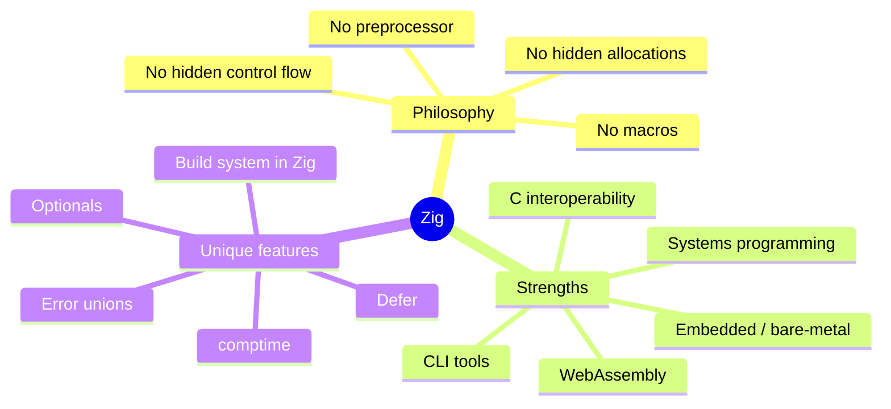

### Why choose Zig over C / C++ / Rust?

| Feature | C | C++ | Rust | Zig |
|---------|---|-----|------|-----|
| Manual memory | ✅ | ✅ | ❌ (borrow checker) | ✅ |
| No UB by default | ❌ | ❌ | ✅ | ✅ (safety modes) |
| Compile-time execution | ❌ | partial | partial | ✅ (comptime) |
| Build system in language | ❌ | ❌ | ❌ | ✅ |
| C interop | native | native | FFI | native |
| Generics | macros | templates | traits | comptime |

---

## Installation & Setup

```bash
# macOS (Homebrew)
brew install zig

# Linux (snap)
snap install zig --classic --beta

# Windows (scoop)
scoop install zig

# Verify
zig version   # should print 0.14.x
```

### Project layout

```
my_project/
├── build.zig          ← build script (written in Zig)
├── src/
│   └── main.zig       ← main entry point
└── zig-out/           ← compiled output
```

```bash
# Create a new executable project
zig init

# Run directly
zig run src/main.zig

# Build
zig build

# Run tests
zig test src/main.zig
```

---

## 1. Hello, World

The entry point of every Zig program is `pub fn main`.

```zig
const std = @import("std");

pub fn main() void {
    std.debug.print("Hello, World!\n", .{});
}
```

**Run it:**

```bash
$ zig run hello.zig
Hello, World!
```

### Anatomy of a Zig program

```mermaid
flowchart LR
    A["@import(\"std\")"] --> B[std namespace]
    B --> C[std.debug.print]
    B --> D[std.io]
    B --> E[std.mem]
    B --> F[std.fs]
    G[pub fn main] --> H[Entry point]
    H --> C
    C --> I["writes to stderr"]
```

> **`@import`** is a built-in that loads a package. `std` is the standard library.  
> **`std.debug.print`** writes to **stderr**. For stdout, use a `Writer` (see §32).  
> The **`.{}`** is an anonymous struct literal — the argument tuple for the format string.

### Example — Printing multiple values

```zig
const std = @import("std");

pub fn main() void {
    const name = "Alice";
    const age: u32 = 30;
    std.debug.print("Name: {s}, Age: {d}\n", .{ name, age });
}
```

### Real-world use case

Hello World isn't just academic — `pub fn main` is the root of every CLI tool, server binary, and embedded firmware entry point you will write in Zig.

---

## 2. Values

Zig has **no implicit type coercions**. Every value has a concrete, statically known type.

```zig
const std = @import("std");

pub fn main() void {
    const t: bool  = true;
    const f: bool  = false;

    const n: i32   = -42;
    const m: u64   = 1_000_000;   // underscores allowed in numeric literals

    const pi: f64  = 3.14159;

    // Comptime-known integer — type is inferred as comptime_int
    const big = 1 << 40;

    std.debug.print("{} {} {} {} {} {}\n", .{ t, f, n, m, pi, big });
}
```

### Zig's type hierarchy at a glance

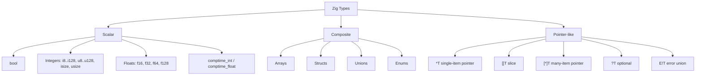

**Key rule:** `const` declares an **immutable** binding. Type annotations are optional when type can be inferred.

```zig
const x = 42;           // comptime_int
const y: u8 = 42;       // explicitly u8
const z = @as(u8, 42);  // cast to u8
```

---

## 3. Variables

`var` declares a **mutable** binding. All variables **must** be initialized.

```zig
const std = @import("std");

pub fn main() void {
    var x: i32 = 1;
    x += 1;
    std.debug.print("x = {}\n", .{x});   // x = 2

    // Type inference with var
    var y = @as(f32, 2.5);
    y *= 2.0;
    std.debug.print("y = {}\n", .{y});   // y = 5
}
```

### const vs var

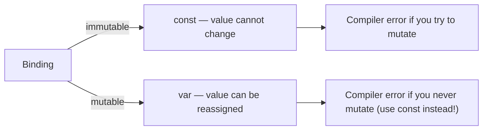

> **Zig will refuse to compile a `var` that is never mutated — use `const` instead.** This keeps code intent clear.

### Example — Swap two variables

```zig
var a: i32 = 10;
var b: i32 = 20;
const tmp = a;
a = b;
b = tmp;
// a=20, b=10
```

### Example — Uninitialized (undefined)

```zig
var buf: [256]u8 = undefined;  // memory exists but contents are garbage
// Always initialize before reading!
```

---

## 4. Integers

Zig provides **explicit-width** integers: `i8`, `u8`, `i16`, `u16`, `i32`, `u32`, `i64`, `u64`, `i128`, `u128`, `isize`, `usize`, and arbitrary-width `i5`, `u7`, etc.

```zig
const std = @import("std");

pub fn main() void {
    const a: u8  = 255;
    const b: i8  = -128;
    const c: u32 = 0xFF_FF_FF_FF;    // hex with separators
    const d: i64 = -9_223_372_036_854_775_808;

    // Integer overflow is a compile error (in safe mode) or wrapping op
    const e = a +% 1;  // wrapping add → 0

    // Casting — must be explicit
    const f: u16 = @intCast(a);      // widening safe
    // const g: u8 = @intCast(c);    // would panic at runtime if c > 255

    std.debug.print("{} {} {} {} {} {}\n", .{a,b,c,d,e,f});
}
```

### Integer operators

| Operator | Behaviour (safe mode) | Wrapping variant |
|----------|-----------------------|-----------------|
| `+` | panic on overflow | `+%` |
| `-` | panic on overflow | `-%` |
| `*` | panic on overflow | `*%` |
| `<<` | panic on shift ≥ bit-width | `<<%` |

### Bit-width reference

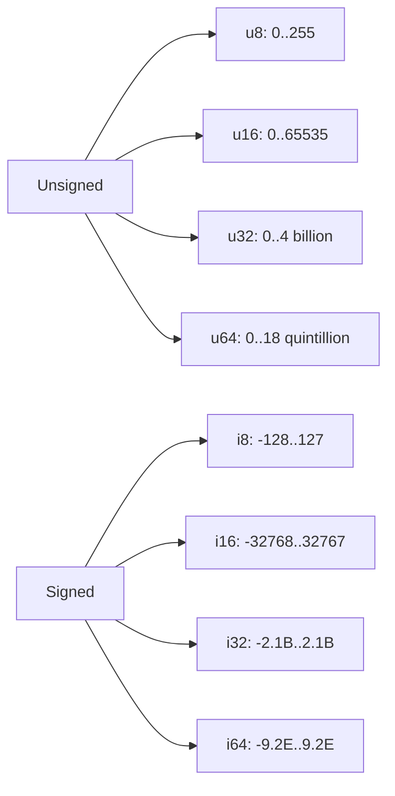

**Use cases:** `u8` for bytes/pixels; `i32` for general-purpose; `u64` for file sizes; `usize` for array indices & lengths.

---

## 5. Floats

Zig supports `f16`, `f32`, `f64`, `f80`, and `f128`.

```zig
const std = @import("std");

pub fn main() void {
    const a: f32 = 1.5;
    const b: f64 = 3.141592653589793;

    // Arithmetic
    const sum = a + @as(f32, 1.0);  // must cast explicitly
    const abs_val = @abs(-b);

    // Special values
    const inf  = std.math.inf(f64);
    const nan  = std.math.nan(f64);

    std.debug.print("{d} {d:.4} {d} {}\n", .{ sum, b, inf, std.math.isNan(nan) });
}
```

### Float pitfalls

```zig
// Never compare floats with ==
const x: f64 = 0.1 + 0.2;
// x == 0.3  →  false!  Use an epsilon comparison:
const eps = 1e-9;
const equal = @abs(x - 0.3) < eps;
```

**Use cases:** `f32` for graphics/SIMD; `f64` for scientific calculations; `f16` for ML inference weights.

---

## 6. Strings

In Zig, a string literal is **`[]const u8`** — a slice of constant bytes. Zig has no null termination by default (unlike C).

```zig
const std = @import("std");

pub fn main() void {
    const greeting: []const u8 = "Hello, Zig!";

    // Length
    std.debug.print("len={}\n", .{greeting.len});

    // Indexing (returns a u8)
    std.debug.print("first byte: {c}\n", .{greeting[0]});

    // Slicing
    const sub = greeting[0..5];
    std.debug.print("sub: {s}\n", .{sub});

    // String equality
    std.debug.print("equal: {}\n", .{std.mem.eql(u8, "abc", "abc")});

    // Multiline string
    const poem =
        \\Roses are red,
        \\Zig has no GC,
        \\Memory is manual,
        \\And that suits me.
    ;
    std.debug.print("{s}\n", .{poem});
}
```

### String operations via `std.mem`

| Operation | Function |
|-----------|----------|
| Compare | `std.mem.eql(u8, a, b)` |
| Copy | `std.mem.copyForwards(u8, dst, src)` |
| Find | `std.mem.indexOf(u8, hay, needle)` |
| Split | `std.mem.splitSequence(u8, text, sep)` |
| Starts with | `std.mem.startsWith(u8, s, prefix)` |

> For **null-terminated** C strings, use `[*:0]const u8` or `std.mem.span(cstr)`.

---

## 7. Arrays

Arrays have a **compile-time known length**: `[N]T`.

```zig
const std = @import("std");

pub fn main() void {
    // Fixed-size array
    const primes = [5]u32{ 2, 3, 5, 7, 11 };

    // Inferred length with `_`
    const letters = [_]u8{ 'a', 'b', 'c' };

    // Initialized to zero
    const zeros = [_]i32{0} ** 10;

    // Indexing
    std.debug.print("primes[2] = {}\n", .{primes[2]});

    // Concatenation (compile-time only)
    const ab = [_]u8{ 1, 2 } ++ [_]u8{ 3, 4 };

    // Iteration
    for (primes) |p| {
        std.debug.print("{} ", .{p});
    }
    std.debug.print("\n", .{});
    _ = letters; _ = zeros; _ = ab;
}
```

### Array vs Slice mental model

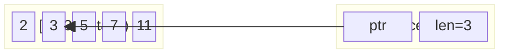

**Use case:** Arrays are ideal for fixed-size buffers (e.g., a SHA-256 digest is always `[32]u8`), lookup tables, and stack-allocated data.

---

## 8. Slices

A slice `[]T` is a **fat pointer** — a pointer + length. It can reference any contiguous sequence.

```zig
const std = @import("std");

pub fn sum(nums: []const u32) u64 {
    var total: u64 = 0;
    for (nums) |n| total += n;
    return total;
}

pub fn main() void {
    const arr = [_]u32{ 1, 2, 3, 4, 5 };

    // Slice the whole array
    const all: []const u32 = arr[0..];

    // Sub-slice
    const middle = arr[1..4];   // elements 2, 3, 4

    std.debug.print("sum(all)    = {}\n", .{sum(all)});
    std.debug.print("sum(middle) = {}\n", .{sum(middle)});
    std.debug.print("len         = {}\n", .{middle.len});
}
```

### Sentinel-terminated slices

```zig
// C-compatible null-terminated string
const cstr: [:0]const u8 = "hello";
```

**Use cases:** Function parameters that accept any-length data, string processing, I/O buffers, sub-array views without copying.

---

## 9. Vectors

SIMD vectors allow parallel operations on multiple values at once, using CPU vector instructions.

```zig
const std = @import("std");

pub fn main() void {
    const a: @Vector(4, f32) = .{ 1.0, 2.0, 3.0, 4.0 };
    const b: @Vector(4, f32) = .{ 10.0, 20.0, 30.0, 40.0 };

    const c = a + b;   // element-wise: {11, 22, 33, 44}

    // Reduce
    const total = @reduce(.Add, c);   // 110.0

    std.debug.print("c = {any}\n", .{c});
    std.debug.print("sum = {}\n",  .{total});
}
```

**Use cases:** Image processing (4 RGBA channels at once), audio DSP, 3D graphics (vec4 math), ML inference micro-kernels.

---

## 10. Structs

Structs are the primary way to group related data. Zig structs can also have **methods**.

```zig
const std = @import("std");

const Point = struct {
    x: f32,
    y: f32,

    pub fn distance(self: Point, other: Point) f32 {
        const dx = self.x - other.x;
        const dy = self.y - other.y;
        return @sqrt(dx * dx + dy * dy);
    }

    pub fn origin() Point {
        return .{ .x = 0, .y = 0 };
    }
};

pub fn main() void {
    const a = Point{ .x = 3.0, .y = 4.0 };
    const b = Point.origin();

    std.debug.print("distance = {d:.2}\n", .{a.distance(b)});
}
```

### Struct layout options

```zig
// Default — Zig may reorder fields for alignment
const Normal = struct { a: u8, b: u32 };

// Packed — fields laid out as declared, bit-level control
const Packed = packed struct { flag: u1, val: u7 };

// Extern — matches C ABI
const CStruct = extern struct { x: c_int, y: c_int };
```

### Struct initialization patterns

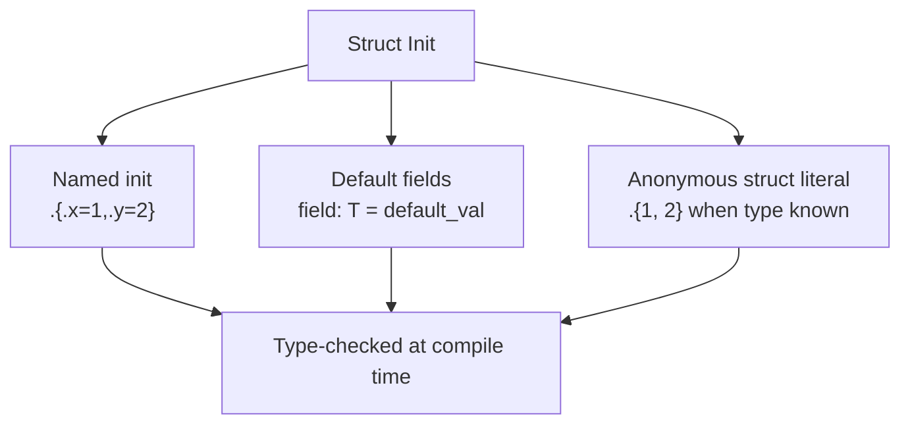

---

## 11. Enums

Enums define a set of named integer constants. Zig enums are **type-safe**.

```zig
const std = @import("std");

const Direction = enum { North, South, East, West };

const Color = enum(u8) {
    Red   = 0xFF0000,
    Green = 0x00FF00,
    Blue  = 0x0000FF,

    pub fn name(self: Color) []const u8 {
        return switch (self) {
            .Red   => "red",
            .Green => "green",
            .Blue  => "blue",
        };
    }
};

pub fn main() void {
    const dir = Direction.North;
    const col = Color.Green;

    std.debug.print("dir={}\n",  .{dir});
    std.debug.print("color={s}\n", .{col.name()});

    // Convert to integer
    std.debug.print("raw={x}\n", .{@intFromEnum(col)});

    // Convert from integer
    const d2 = @as(Direction, @enumFromInt(2));
    std.debug.print("enum from int={}\n", .{d2});
}
```

**Use cases:** State machines, protocol opcodes, HTTP status classes, configuration options.

---

## 12. Unions

A union stores **one of several types** in the same memory location. Tagged unions add a discriminant.

```zig
const std = @import("std");

// Tagged union
const Value = union(enum) {
    integer: i64,
    float:   f64,
    boolean: bool,
    string:  []const u8,
};

pub fn print_value(v: Value) void {
    switch (v) {
        .integer => |n| std.debug.print("int: {}\n",   .{n}),
        .float   => |f| std.debug.print("float: {d}\n",.{f}),
        .boolean => |b| std.debug.print("bool: {}\n",  .{b}),
        .string  => |s| std.debug.print("str: {s}\n",  .{s}),
    }
}

pub fn main() void {
    print_value(.{ .integer = 42 });
    print_value(.{ .float   = 3.14 });
    print_value(.{ .boolean = true });
    print_value(.{ .string  = "hello" });
}
```

### Union vs Tagged Union

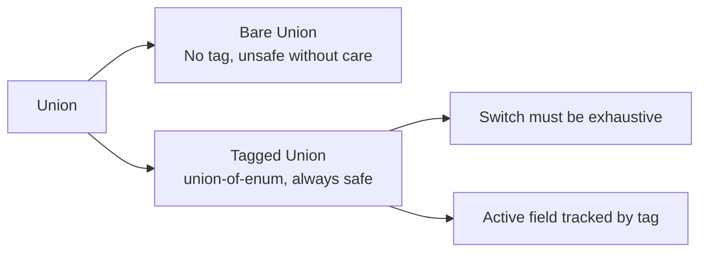

**Use cases:** JSON values, AST nodes, network packet variants, configuration values that may be different types.

---

## 13. Functions

Functions are **first-class** in Zig. Parameters are immutable by default.

```zig
const std = @import("std");

// Basic function
fn add(a: i32, b: i32) i32 {
    return a + b;
}

// Multiple return values via struct
fn divmod(a: u32, b: u32) struct { q: u32, r: u32 } {
    return .{ .q = a / b, .r = a % b };
}

// Inline functions (always inlined by compiler)
inline fn square(x: f64) f64 { return x * x; }

// Function pointers
fn apply(f: *const fn(i32) i32, x: i32) i32 {
    return f(x);
}

fn double(n: i32) i32 { return n * 2; }

pub fn main() void {
    std.debug.print("add = {}\n", .{add(3, 4)});

    const dm = divmod(17, 5);
    std.debug.print("17/5 = {} rem {}\n", .{dm.q, dm.r});

    std.debug.print("square(3.0) = {d}\n", .{square(3.0)});
    std.debug.print("apply = {}\n", .{apply(&double, 7)});
}
```

### Function anatomy

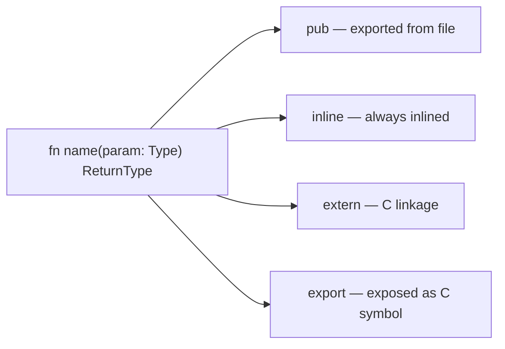

---

## 14. Blocks and Statements

Blocks `{}` are **expressions** in Zig and can produce values using `break :label value`.

```zig
const std = @import("std");

pub fn main() void {
    // Block as expression
    const result = blk: {
        const x = 10;
        const y = 20;
        break :blk x + y;
    };
    std.debug.print("result = {}\n", .{result});  // 30

    // Nested labeled blocks
    const val = outer: {
        var i: u32 = 0;
        while (i < 10) : (i += 1) {
            if (i == 5) break :outer i * i;
        }
        break :outer 0;
    };
    std.debug.print("val = {}\n", .{val});  // 25
}
```

---

## 15. If / Else

`if` can be used as a statement or an **expression**.

```zig
const std = @import("std");

pub fn main() void {
    const score: u32 = 87;

    // Statement form
    if (score >= 90) {
        std.debug.print("A\n", .{});
    } else if (score >= 80) {
        std.debug.print("B\n", .{});
    } else {
        std.debug.print("C or below\n", .{});
    }

    // Expression form
    const grade = if (score >= 90) "A" else if (score >= 80) "B" else "C";
    std.debug.print("grade = {s}\n", .{grade});

    // Optional capture
    const maybe: ?i32 = 42;
    if (maybe) |val| {
        std.debug.print("got {}\n", .{val});
    } else {
        std.debug.print("null\n", .{});
    }

    // Error union capture
    const result: anyerror!u32 = 7;
    if (result) |v| {
        std.debug.print("ok: {}\n", .{v});
    } else |err| {
        std.debug.print("err: {}\n", .{err});
    }
}
```

---

## 16. Switch

`switch` in Zig is **exhaustive** — every case must be handled.

```zig
const std = @import("std");

const Status = enum { Ok, NotFound, ServerError };

pub fn main() void {
    const code: u16 = 404;

    // Switch on integers with ranges
    const text = switch (code) {
        200 => "OK",
        301, 302 => "Redirect",
        400 => "Bad Request",
        401...403 => "Auth Error",
        404 => "Not Found",
        500...599 => "Server Error",
        else => "Unknown",
    };
    std.debug.print("{s}\n", .{text});

    // Switch on enum
    const s = Status.NotFound;
    switch (s) {
        .Ok          => std.debug.print("success\n", .{}),
        .NotFound    => std.debug.print("missing\n", .{}),
        .ServerError => std.debug.print("crash!\n",  .{}),
    }

    // Switch as expression
    const priority: u8 = switch (s) {
        .Ok          => 0,
        .NotFound    => 1,
        .ServerError => 10,
    };
    std.debug.print("priority = {}\n", .{priority});
}
```

---

## 17. While Loops

`while` supports a **continue expression** (run after each iteration).

```zig
const std = @import("std");

pub fn main() void {
    // Basic while
    var i: u32 = 0;
    while (i < 5) {
        std.debug.print("{} ", .{i});
        i += 1;
    }
    std.debug.print("\n", .{});

    // With continue expression (like for-loop increment)
    var j: u32 = 0;
    while (j < 10) : (j += 2) {
        std.debug.print("{} ", .{j}); // 0 2 4 6 8
    }
    std.debug.print("\n", .{});

    // while with optional (loop until null)
    var opt: ?u32 = 5;
    while (opt) |val| {
        std.debug.print("val={} ", .{val});
        opt = if (val > 0) val - 1 else null;
    }
    std.debug.print("\n", .{});
}
```

---

## 18. For Loops

`for` iterates over **slices, arrays, or ranges**.

```zig
const std = @import("std");

pub fn main() void {
    const fruits = [_][]const u8{ "apple", "banana", "cherry" };

    // Basic for — element only
    for (fruits) |fruit| {
        std.debug.print("{s}\n", .{fruit});
    }

    // With index
    for (fruits, 0..) |fruit, i| {
        std.debug.print("{}: {s}\n", .{i, fruit});
    }

    // Range-based (Zig 0.12+)
    for (0..5) |n| {
        std.debug.print("{} ", .{n});
    }
    std.debug.print("\n", .{});

    // Parallel iteration
    const a = [_]u8{ 1, 2, 3 };
    const b = [_]u8{ 10, 20, 30 };
    for (a, b) |x, y| {
        std.debug.print("{} ", .{x + y});
    }
    std.debug.print("\n", .{});
}
```

---

## 19. Defer

`defer` schedules a statement to run **when the enclosing scope exits** — regardless of how it exits.

```zig
const std = @import("std");

fn openFile() void {
    std.debug.print("open\n", .{});
}
fn closeFile() void {
    std.debug.print("close\n", .{});
}

pub fn main() void {
    openFile();
    defer closeFile();   // runs at end of main, even on error

    std.debug.print("doing work\n", .{});
    // Output:
    // open
    // doing work
    // close
}
```

### Multiple defers — LIFO order

```zig
pub fn main() void {
    defer std.debug.print("3\n", .{});
    defer std.debug.print("2\n", .{});
    defer std.debug.print("1\n", .{});
    // Output: 1, 2, 3  (last defer runs first)
}
```

### errdefer — only on error path

```zig
fn riskyAlloc(allocator: std.mem.Allocator) ![]u8 {
    const buf = try allocator.alloc(u8, 1024);
    errdefer allocator.free(buf);   // only frees if we return an error below

    try someOperationThatMightFail();
    return buf;   // caller now owns the buffer
}
```

### Defer workflow

```mermaid
flowchart TD
    A[Enter scope] --> B[defer f() registered]
    B --> C[More code ...]
    C --> D{Scope exit}
    D -->|normal return| E[f() executes]
    D -->|error return| F{errdefer registered?}
    F -->|yes| G[errdefer runs THEN scope cleanup]
    F -->|no| H[regular defers run]
    E --> I[Control returns to caller]
    G --> I
    H --> I
```

**Use cases:** File handles, mutex unlocks, allocator cleanup, connection teardown — anything that must be paired with an open/acquire.

---

## 20. Errors

Zig errors are **values**, not exceptions. An error union type is `ErrorSet!T`.

```zig
const std = @import("std");

const ParseError = error{
    InvalidCharacter,
    Overflow,
    Empty,
};

fn parsePositive(s: []const u8) ParseError!u32 {
    if (s.len == 0) return ParseError.Empty;
    var result: u32 = 0;
    for (s) |c| {
        if (c < '0' or c > '9') return ParseError.InvalidCharacter;
        result = result * 10 + (c - '0');
    }
    return result;
}

pub fn main() void {
    // catch — handle or transform the error inline
    const n = parsePositive("123") catch |err| {
        std.debug.print("error: {}\n", .{err});
        return;
    };
    std.debug.print("parsed: {}\n", .{n});

    // catch with a default value
    const m = parsePositive("abc") catch 0;
    std.debug.print("default: {}\n", .{m});

    // switch on the error union
    const r = parsePositive("");
    switch (r) {
        error.Empty            => std.debug.print("empty input\n",    .{}),
        error.InvalidCharacter => std.debug.print("bad char\n",       .{}),
        error.Overflow         => std.debug.print("overflow\n",       .{}),
        else                   => |v| std.debug.print("ok: {}\n",     .{v}),
    }
}
```

### Error propagation with `try`

```zig
// try is syntactic sugar for: return err if error, else unwrap
fn readAndParse(path: []const u8) !u32 {
    const content = try std.fs.cwd().readFileAlloc(allocator, path, 4096);
    defer allocator.free(content);
    return try parsePositive(std.mem.trim(u8, content, "\n "));
}
```

### Error handling flow

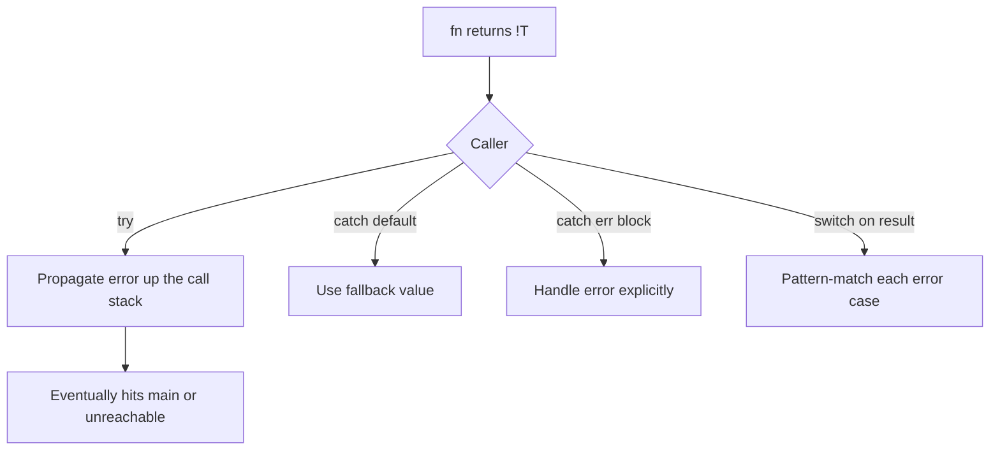

---

## 21. Optionals

An optional `?T` is either a value of type `T` or `null`. **No null pointer surprises.**

```zig
const std = @import("std");

fn findFirst(items: []const u32, target: u32) ?usize {
    for (items, 0..) |item, i| {
        if (item == target) return i;
    }
    return null;
}

pub fn main() void {
    const nums = [_]u32{ 10, 20, 30, 40 };

    // if-capture pattern
    if (findFirst(&nums, 30)) |idx| {
        std.debug.print("found at index {}\n", .{idx});
    } else {
        std.debug.print("not found\n", .{});
    }

    // orelse — provide default
    const idx = findFirst(&nums, 99) orelse nums.len;
    std.debug.print("idx = {}\n", .{idx});

    // orelse return/break
    const idx2 = findFirst(&nums, 99) orelse return;
    _ = idx2;

    // .? unwrap — panics if null (use with certainty)
    const guaranteed = findFirst(&nums, 10).?;
    std.debug.print("guaranteed = {}\n", .{guaranteed});
}
```

### Optional chaining (manual)

```zig
const maybe_user: ?User = getUser(id);
const maybe_email = if (maybe_user) |u| u.email else null;
const maybe_domain = if (maybe_email) |e| extractDomain(e) else null;
```

---

## 22. Pointers

`*T` is a **single-item pointer**. `*const T` is read-only. Pointer arithmetic is not allowed on `*T` (use `[*]T` for that).

```zig
const std = @import("std");

fn increment(p: *i32) void {
    p.* += 1;   // p.* dereferences
}

pub fn main() void {
    var x: i32 = 10;

    const p: *i32 = &x;               // take address
    std.debug.print("before: {}\n", .{p.*});
    increment(p);
    std.debug.print("after:  {}\n", .{x}); // 11

    // Pointer to struct field
    var point = struct { x: f32, y: f32 }{ .x = 1.0, .y = 2.0 };
    const px: *f32 = &point.x;
    px.* = 99.0;
    std.debug.print("point.x = {}\n", .{point.x});

    // Pointer equality
    var a: u8 = 1;
    var b: u8 = 1;
    std.debug.print("&a==&a: {}\n", .{&a == &a}); // true
    std.debug.print("&a==&b: {}\n", .{&a == &b}); // false
}
```

### Pointer type taxonomy

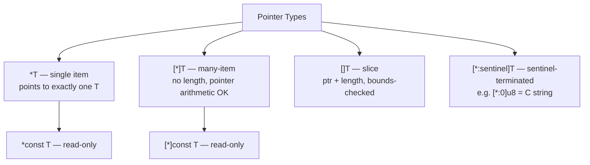

---

## 23. Multi-Pointers

`[*]T` is a many-item pointer with **no length** — used primarily for C interop.

```zig
const std = @import("std");

pub fn main() void {
    var buf = [_]u8{ 'Z', 'i', 'g', 0 };

    // Many-pointer from slice
    const mp: [*]u8 = buf[0..].ptr;

    // Index into it (no bounds check!)
    std.debug.print("{c}{c}{c}\n", .{mp[0], mp[1], mp[2]});

    // Convert back to slice when you know the length
    const sl: []u8 = mp[0..3];
    std.debug.print("{s}\n", .{sl});
}
```

> **Safety note:** `[*]T` has no length, so Zig cannot perform bounds checking. Prefer `[]T` slices whenever possible.

---

## 24. Slices as Pointers

A slice `[]T` is internally `{ ptr: [*]T, len: usize }`. You can access these fields directly.

```zig
const std = @import("std");

pub fn main() void {
    var arr = [_]u32{ 10, 20, 30, 40, 50 };
    var sl: []u32 = arr[1..4];

    std.debug.print("ptr  = {*}\n",  .{sl.ptr});
    std.debug.print("len  = {}\n",   .{sl.len});
    std.debug.print("sl[0]= {}\n",   .{sl[0]});  // 20

    // Shrink a slice (move the end)
    sl = sl[0 .. sl.len - 1];  // {20, 30}
    std.debug.print("after shrink len={}\n", .{sl.len});
}
```

---

## 25. Comptime

`comptime` is Zig's compile-time execution system. It replaces templates, macros, and preprocessor conditionals.

```zig
const std = @import("std");

// Comptime function — runs at compile time
fn fibonacci(comptime n: u32) u64 {
    if (n <= 1) return n;
    return fibonacci(n - 1) + fibonacci(n - 2);
}

// Comptime type parameter
fn maxOf(comptime T: type, a: T, b: T) T {
    return if (a > b) a else b;
}

pub fn main() void {
    // Evaluated at compile time — no runtime cost
    const fib10 = comptime fibonacci(10);
    std.debug.print("fib(10) = {}\n", .{fib10});

    std.debug.print("max i32 = {}\n", .{maxOf(i32, -5, 12)});
    std.debug.print("max f64 = {d}\n", .{maxOf(f64, 1.5, 2.7)});

    // comptime if — dead code is removed
    const is_debug = @import("builtin").mode == .Debug;
    if (comptime is_debug) {
        std.debug.print("Debug build\n", .{});
    }
}
```

### Comptime flow

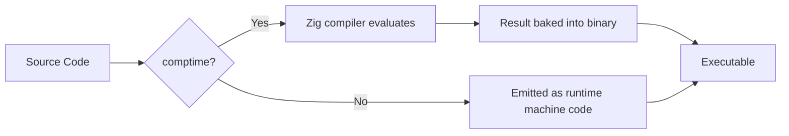

**Use cases:** Generic data structures, type-level programming, compile-time assertions (`comptime assert`), generating lookup tables, conditional compilation without `#ifdef`.

---

## 26. Generics

Zig achieves generics through **comptime type parameters** — no special syntax needed.

```zig
const std = @import("std");

// Generic Stack
fn Stack(comptime T: type) type {
    return struct {
        items: []T,
        top:   usize,

        const Self = @This();

        pub fn init(buf: []T) Self {
            return .{ .items = buf, .top = 0 };
        }

        pub fn push(self: *Self, val: T) void {
            self.items[self.top] = val;
            self.top += 1;
        }

        pub fn pop(self: *Self) ?T {
            if (self.top == 0) return null;
            self.top -= 1;
            return self.items[self.top];
        }
    };
}

pub fn main() void {
    var buf = [_]i32{0} ** 8;
    var stack = Stack(i32).init(&buf);

    stack.push(1);
    stack.push(2);
    stack.push(3);

    while (stack.pop()) |v| {
        std.debug.print("{} ", .{v});
    }
    std.debug.print("\n", .{});
}
```

### Generic instantiation diagram

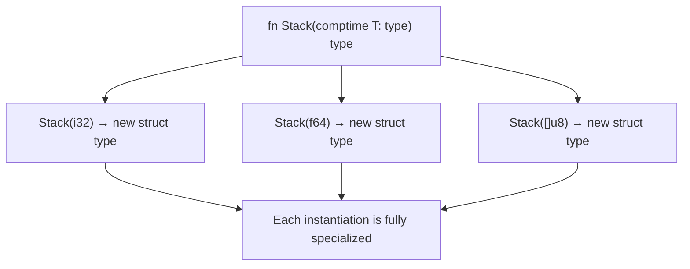

---

## 27. Memory Allocation

Zig has **no GC** and **no global allocator**. All heap allocation goes through an explicit `std.mem.Allocator` interface.

```zig
const std = @import("std");

pub fn main() !void {
    // General-purpose allocator — detects leaks in debug mode
    var gpa = std.heap.GeneralPurposeAllocator(.{}){};
    defer _ = gpa.deinit();
    const allocator = gpa.allocator();

    // Allocate a slice
    const buf = try allocator.alloc(u8, 64);
    defer allocator.free(buf);

    // Create a single item on the heap
    const val = try allocator.create(u32);
    defer allocator.destroy(val);
    val.* = 42;

    std.debug.print("val = {}\n", .{val.*});

    // Resize
    const buf2 = try allocator.realloc(buf, 128);
    defer allocator.free(buf2);
    std.debug.print("new len = {}\n", .{buf2.len});
}
```

### Allocator types in std

| Allocator | Use case |
|-----------|----------|
| `GeneralPurposeAllocator` | Development — leak detection |
| `std.heap.page_allocator` | Simple, no metadata overhead |
| `std.heap.ArenaAllocator` | Batch-free all at once |
| `std.heap.FixedBufferAllocator` | Stack-backed, no heap |
| `std.testing.allocator` | Unit tests |

### Allocation lifecycle

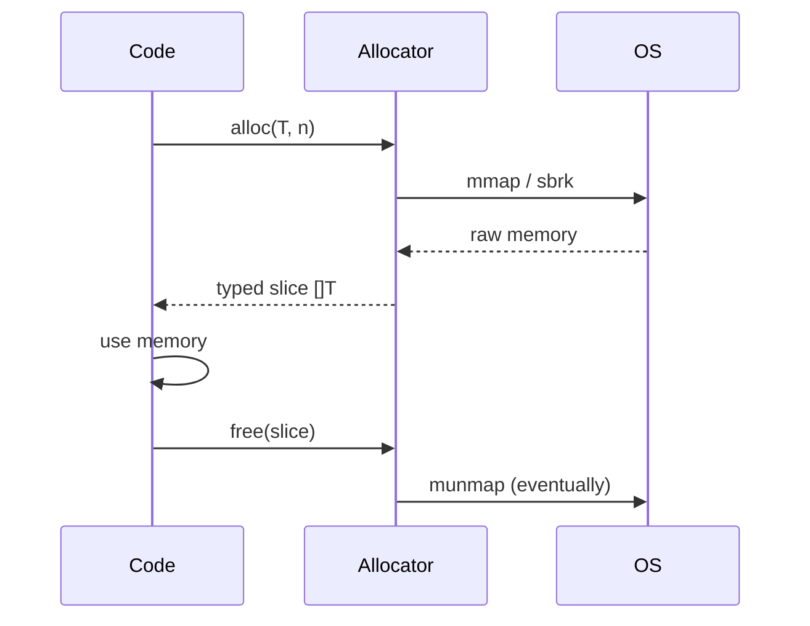

---

## 28. ArrayList

`std.ArrayList(T)` is a dynamic, growable array backed by an allocator.

```zig
const std = @import("std");

pub fn main() !void {
    var gpa = std.heap.GeneralPurposeAllocator(.{}){};
    defer _ = gpa.deinit();
    const alloc = gpa.allocator();

    var list = std.ArrayList(i32).init(alloc);
    defer list.deinit();

    // Append
    try list.append(10);
    try list.append(20);
    try list.append(30);

    // appendSlice
    try list.appendSlice(&.{ 40, 50 });

    // Insert at index
    try list.insert(1, 15);

    // Remove by index (swap-remove for O(1))
    _ = list.swapRemove(0);

    // Iterate
    for (list.items) |v| {
        std.debug.print("{} ", .{v});
    }
    std.debug.print("\n", .{});

    std.debug.print("len={} cap={}\n", .{list.items.len, list.capacity});
}
```

**Use cases:** Building strings dynamically, collecting results from a loop, implementing stacks/queues, reading lines from files.

---

## 29. HashMap

`std.AutoHashMap(K, V)` and `std.StringHashMap(V)` provide hash map implementations.

```zig
const std = @import("std");

pub fn main() !void {
    var gpa = std.heap.GeneralPurposeAllocator(.{}){};
    defer _ = gpa.deinit();
    const alloc = gpa.allocator();

    var map = std.AutoHashMap(u32, []const u8).init(alloc);
    defer map.deinit();

    // Insert
    try map.put(1, "one");
    try map.put(2, "two");
    try map.put(3, "three");

    // Lookup
    if (map.get(2)) |v| {
        std.debug.print("2 → {s}\n", .{v});
    }

    // Contains
    std.debug.print("has 5: {}\n", .{map.contains(5)});

    // Remove
    _ = map.remove(1);

    // Iterate
    var it = map.iterator();
    while (it.next()) |entry| {
        std.debug.print("{}: {s}\n", .{entry.key_ptr.*, entry.value_ptr.*});
    }

    std.debug.print("count = {}\n", .{map.count()});
}
```

### HashMap vs StringHashMap

| | `AutoHashMap(K, V)` | `StringHashMap(V)` |
|-|---------------------|--------------------|
| Key type | Any hashable type | `[]const u8` |
| Key storage | By value | By reference (you own key memory) |
| Use for | Integer keys, structs | Word counts, configs |

---

## 30. Linked List

Zig's `std.SinglyLinkedList(T)` and `std.DoublyLinkedList(T)` provide intrusive linked list structures.

```zig
const std = @import("std");

pub fn main() !void {
    var gpa = std.heap.GeneralPurposeAllocator(.{}){};
    defer _ = gpa.deinit();
    const alloc = gpa.allocator();

    const List = std.SinglyLinkedList(i32);
    var list = List{};

    // Create nodes on the heap
    var n1 = try alloc.create(List.Node);
    var n2 = try alloc.create(List.Node);
    var n3 = try alloc.create(List.Node);
    defer alloc.destroy(n1);
    defer alloc.destroy(n2);
    defer alloc.destroy(n3);

    n1.data = 10;
    n2.data = 20;
    n3.data = 30;

    list.prepend(n3);
    list.prepend(n2);
    list.prepend(n1);

    var node = list.first;
    while (node) |n| : (node = n.next) {
        std.debug.print("{} ", .{n.data});
    }
    std.debug.print("\n", .{});
}
```

---

## 31. Testing

Zig has **first-class testing** built in. Tests live alongside source code.

```zig
const std = @import("std");
const testing = std.testing;

fn factorial(n: u64) u64 {
    if (n == 0) return 1;
    return n * factorial(n - 1);
}

test "factorial base cases" {
    try testing.expectEqual(@as(u64, 1), factorial(0));
    try testing.expectEqual(@as(u64, 1), factorial(1));
}

test "factorial general" {
    try testing.expectEqual(@as(u64, 120), factorial(5));
    try testing.expectEqual(@as(u64, 720), factorial(6));
}

test "error propagation" {
    const result: anyerror!u32 = error.NotFound;
    try testing.expectError(error.NotFound, result);
}
```

```bash
$ zig test factorial.zig
All 3 tests passed.
```

### Testing utilities

| Function | Purpose |
|----------|---------|
| `testing.expectEqual(exp, got)` | Assert equality |
| `testing.expectEqualStrings(a, b)` | String equality |
| `testing.expectError(err, result)` | Expect specific error |
| `testing.expectApproxEqAbs(a, b, tol)` | Float comparison |
| `testing.allocator` | Leak-detecting allocator |

---

## 32. Formatting and Print

Zig's format system is compile-time verified — wrong format specifiers are **compile errors**.

```zig
const std = @import("std");

pub fn main() !void {
    // To stderr (debug print)
    std.debug.print("debug: {}\n", .{42});

    // To stdout via Writer
    const stdout = std.io.getStdOut().writer();
    try stdout.print("Hello, {s}!\n", .{"world"});

    // Format to a buffer
    var buf: [64]u8 = undefined;
    const msg = try std.fmt.bufPrint(&buf, "x={d}, y={d:.2}", .{ 3, 3.14159 });
    try stdout.print("{s}\n", .{msg});

    // Format to allocated string
    const alloc = std.heap.page_allocator;
    const s = try std.fmt.allocPrint(alloc, "π ≈ {d:.5}", .{std.math.pi});
    defer alloc.free(s);
    try stdout.print("{s}\n", .{s});
}
```

### Format specifiers

| Specifier | Meaning | Example |
|-----------|---------|---------|
| `{}` | Default formatting | `42`, `true` |
| `{d}` | Decimal integer/float | `42`, `3.14` |
| `{s}` | String (`[]u8`) | `"hello"` |
| `{c}` | Single character | `'A'` |
| `{x}` / `{X}` | Hex lower/upper | `2a` / `2A` |
| `{b}` | Binary | `101010` |
| `{o}` | Octal | `52` |
| `{e}` | Scientific notation | `4.2e+01` |
| `{d:.3}` | Float, 3 decimal places | `3.142` |
| `{any}` | Debug-print any type | works for structs |

---

## 33. File I/O

```zig
const std = @import("std");

pub fn main() !void {
    const alloc = std.heap.page_allocator;
    const cwd = std.fs.cwd();

    // Write a file
    const file = try cwd.createFile("hello.txt", .{});
    defer file.close();
    try file.writeAll("Hello, Zig!\nSecond line\n");

    // Read entire file into memory
    const content = try cwd.readFileAlloc(alloc, "hello.txt", 4096);
    defer alloc.free(content);
    std.debug.print("{s}", .{content});

    // Read line by line
    const f2 = try cwd.openFile("hello.txt", .{});
    defer f2.close();
    var buf_reader = std.io.bufferedReader(f2.reader());
    var in = buf_reader.reader();
    var line_buf: [256]u8 = undefined;
    while (try in.readUntilDelimiterOrEof(&line_buf, '\n')) |line| {
        std.debug.print("line: {s}\n", .{line});
    }
}
```

### File I/O flow

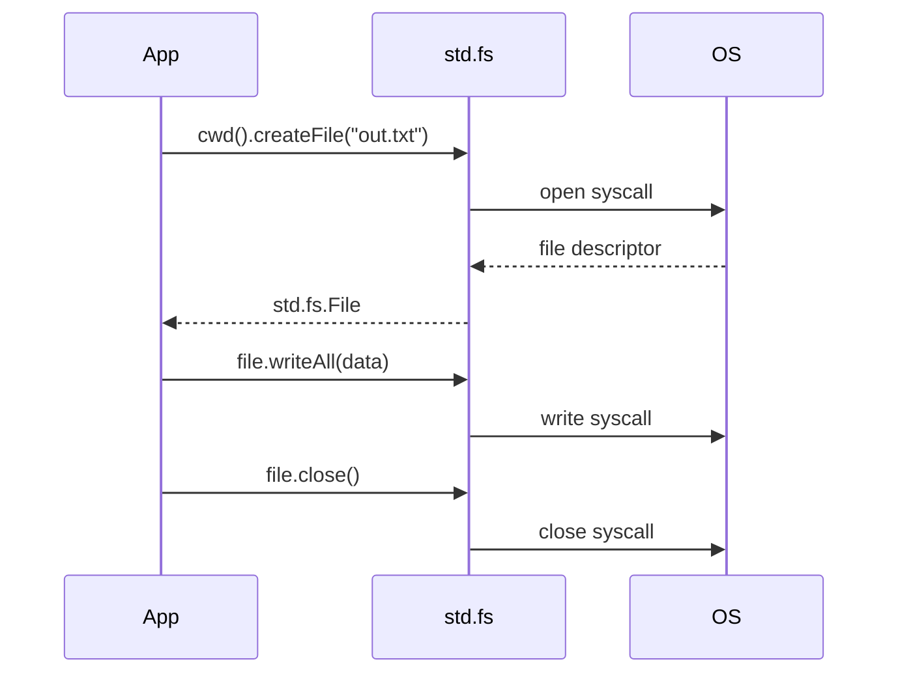

---

## 34. Processes

```zig
const std = @import("std");

pub fn main() !void {
    var gpa = std.heap.GeneralPurposeAllocator(.{}){};
    defer _ = gpa.deinit();
    const alloc = gpa.allocator();

    // Run a child process and capture output
    const result = try std.process.Child.run(.{
        .allocator = alloc,
        .argv = &.{ "echo", "Hello from child!" },
    });
    defer alloc.free(result.stdout);
    defer alloc.free(result.stderr);

    std.debug.print("stdout: {s}", .{result.stdout});
    std.debug.print("exit: {}\n",  .{result.term});

    // Read environment variable
    const path = std.process.getEnvVarOwned(alloc, "PATH") catch "not found";
    defer alloc.free(path);
    std.debug.print("PATH[:50]: {s}\n", .{path[0..@min(50, path.len)]});
}
```

---

## 35. JSON

`std.json` provides parsing and stringification with Zig's allocator model.

```zig
const std = @import("std");

pub fn main() !void {
    var gpa = std.heap.GeneralPurposeAllocator(.{}){};
    defer _ = gpa.deinit();
    const alloc = gpa.allocator();

    // Parse JSON
    const json_str =
        \\{"name":"Alice","age":30,"scores":[95,87,92]}
    ;
    const parsed = try std.json.parseFromSlice(std.json.Value, alloc, json_str, .{});
    defer parsed.deinit();

    const root = parsed.value.object;
    std.debug.print("name: {s}\n",  .{root.get("name").?.string});
    std.debug.print("age:  {}\n",   .{root.get("age").?.integer});

    // Stringify
    var out = std.ArrayList(u8).init(alloc);
    defer out.deinit();
    try std.json.stringify(parsed.value, .{}, out.writer());
    std.debug.print("json: {s}\n", .{out.items});
}
```

### Parsing into a typed struct

```zig
const Person = struct { name: []const u8, age: u32 };

const p = try std.json.parseFromSlice(Person, alloc,
    \\{"name":"Bob","age":25}
, .{});
defer p.deinit();
std.debug.print("{s} is {}\n", .{p.value.name, p.value.age});
```

---

## 36. Random Numbers

```zig
const std = @import("std");

pub fn main() void {
    // Create a PRNG (Xoshiro256++ is the default)
    var prng = std.Random.DefaultPrng.init(blk: {
        var seed: u64 = undefined;
        std.posix.getrandom(std.mem.asBytes(&seed)) catch unreachable;
        break :blk seed;
    });
    const rand = prng.random();

    // Integer in [0, max)
    const n = rand.int(u32);
    std.debug.print("random u32: {}\n", .{n});

    // Integer in range [lo, hi]
    const r = rand.intRangeAtMost(u32, 1, 6);
    std.debug.print("dice roll: {}\n", .{r});

    // Float in [0.0, 1.0)
    const f = rand.float(f64);
    std.debug.print("float: {d:.4}\n", .{f});

    // Shuffle a slice
    var arr = [_]u8{ 1, 2, 3, 4, 5 };
    rand.shuffle(u8, &arr);
    std.debug.print("shuffled: {any}\n", .{arr});
}
```

---

## 37. Sorting

```zig
const std = @import("std");

pub fn main() void {
    var nums = [_]i32{ 5, 2, 8, 1, 9, 3 };

    // Sort ascending (built-in)
    std.mem.sort(i32, &nums, {}, comptime std.sort.asc(i32));
    std.debug.print("asc: {any}\n", .{nums});

    // Sort descending
    std.mem.sort(i32, &nums, {}, comptime std.sort.desc(i32));
    std.debug.print("desc: {any}\n", .{nums});

    // Custom comparator — sort by absolute value
    const absLessThan = struct {
        fn f(_: void, a: i32, b: i32) bool {
            return @abs(a) < @abs(b);
        }
    }.f;
    var mixed = [_]i32{ -5, 3, -1, 4, -2 };
    std.mem.sort(i32, &mixed, {}, absLessThan);
    std.debug.print("by abs: {any}\n", .{mixed});

    // Binary search
    const sorted = [_]i32{ 1, 3, 5, 7, 9 };
    const pos = std.sort.binarySearch(i32, 5, &sorted, {}, std.sort.asc(i32));
    std.debug.print("bsearch(5) = {?}\n", .{pos});
}
```

---

## 38. Math

```zig
const std = @import("std");
const math = std.math;

pub fn main() void {
    // Constants
    std.debug.print("π    = {d:.10}\n", .{math.pi});
    std.debug.print("e    = {d:.10}\n", .{math.e});
    std.debug.print("√2   = {d:.10}\n", .{math.sqrt2});

    // Common functions
    std.debug.print("sqrt(2)    = {d:.6}\n", .{@sqrt(2.0)});
    std.debug.print("pow(2,10)  = {d}\n",    .{math.pow(f64, 2, 10)});
    std.debug.print("log2(1024) = {d}\n",    .{math.log2(1024.0)});
    std.debug.print("sin(π/2)   = {d:.6}\n", .{@sin(math.pi / 2.0)});
    std.debug.print("cos(0)     = {d:.6}\n", .{@cos(@as(f64, 0))});

    // Integer math
    std.debug.print("gcd(48,18) = {}\n", .{math.gcd(48, 18)});

    // Overflow-safe ops
    const ok = math.add(u8, 200, 50);
    if (ok) |v| std.debug.print("200+50={}\n", .{v}) else std.debug.print("overflow!\n", .{});
}
```

---

## 39. Build System

Zig's build system is written **in Zig** — no Makefile, CMakeLists, or separate DSL.

```zig
// build.zig
const std = @import("std");

pub fn build(b: *std.Build) void {
    const target   = b.standardTargetOptions(.{});
    const optimize = b.standardOptimizeOption(.{});

    // Executable
    const exe = b.addExecutable(.{
        .name    = "myapp",
        .root_source_file = .{ .path = "src/main.zig" },
        .target  = target,
        .optimize = optimize,
    });
    b.installArtifact(exe);

    // Run step
    const run_cmd = b.addRunArtifact(exe);
    const run_step = b.step("run", "Run the app");
    run_step.dependOn(&run_cmd.step);

    // Test step
    const tests = b.addTest(.{
        .root_source_file = .{ .path = "src/main.zig" },
        .target  = target,
        .optimize = optimize,
    });
    const test_step = b.step("test", "Run unit tests");
    test_step.dependOn(&b.addRunArtifact(tests).step);
}
```

```bash
zig build          # compile
zig build run      # compile & run
zig build test     # run tests
zig build -Doptimize=ReleaseFast   # optimized build
```

### Cross-compilation

```bash
# Build for Linux ARM64 from any host
zig build -Dtarget=aarch64-linux-musl
# Build for Windows x86_64
zig build -Dtarget=x86_64-windows-gnu
```

### Build graph

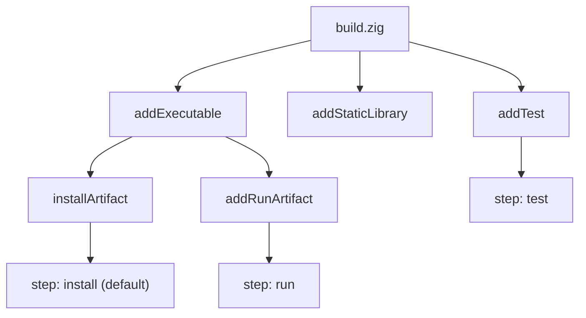

---

## 40. C Interop

Zig can **directly include and call C code** without a separate binding generator.

```zig
// main.zig
const std = @import("std");
const c   = @cImport({
    @cInclude("stdio.h");
    @cInclude("math.h");
});

pub fn main() void {
    // Call C functions directly
    _ = c.printf("Hello from C: %d\n", @as(c_int, 42));
    const r = c.sqrt(@as(c_double, 2.0));
    std.debug.print("sqrt(2) via C = {d:.6}\n", .{r});
}
```

```zig
// build.zig snippet — link system C library
exe.linkLibC();
exe.linkSystemLibrary("m");  // libm for math functions
```

### Calling Zig from C

```zig
// math_lib.zig
export fn zig_add(a: c_int, b: c_int) c_int {
    return a + b;
}
```

```c
// main.c
extern int zig_add(int a, int b);
int main() { printf("%d\n", zig_add(3, 4)); }
```

### C interop cheat sheet

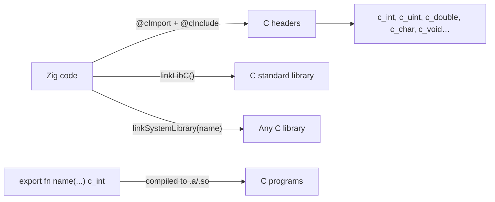

| C type | Zig type |
|--------|----------|
| `int` | `c_int` |
| `unsigned int` | `c_uint` |
| `long` | `c_long` |
| `size_t` | `usize` |
| `char *` | `[*c]u8` |
| `void *` | `*anyopaque` |
| `double` | `c_double` |

---

## Summary: The Zig Learning Path

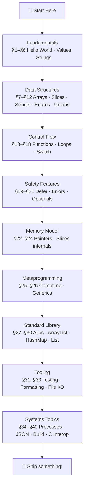

## Further Reading

| Resource | Description |
|----------|-------------|
| [ziglang.org/documentation](https://ziglang.org/documentation/master/) | Official language reference |
| [zig.guide](https://zig.guide) | Friendly introduction |
| [ziglearn.org](https://ziglearn.org) | Community learning resource |
| [zig.news](https://zig.news) | Community articles |
| [Ziglings](https://codeberg.org/ziglings/exercises) | Fix-the-bug exercises |
| [Zig std source](https://github.com/ziglang/zig/tree/master/lib/std) | Best way to learn idioms |

---

*Tutorial built on [boringcollege/zig-by-example](https://github.com/boringcollege/zig-by-example), targeting Zig 0.14.*