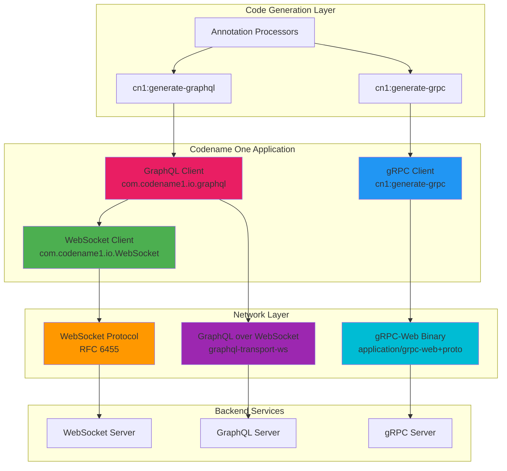
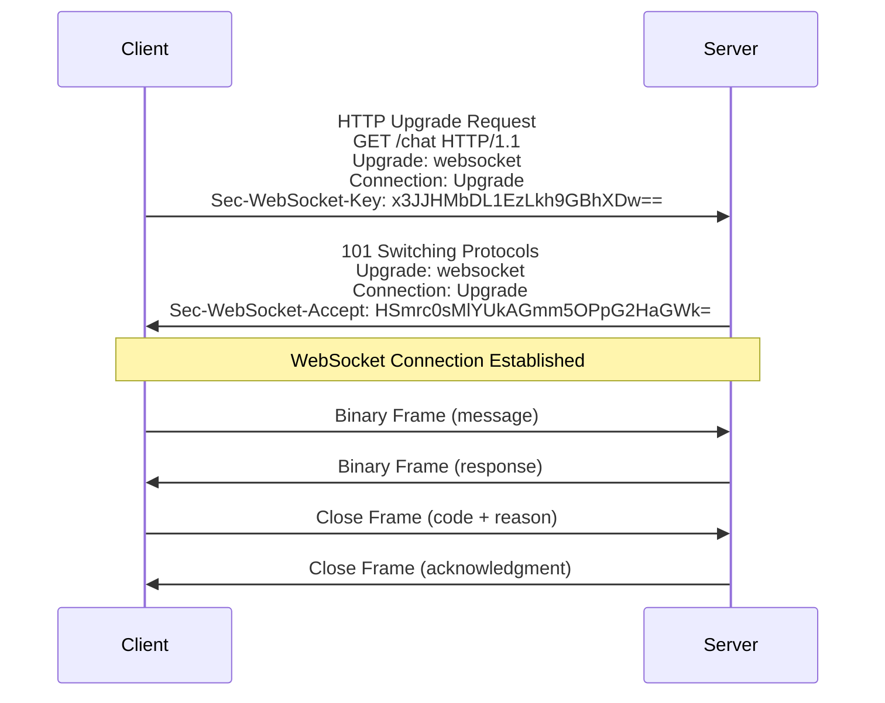
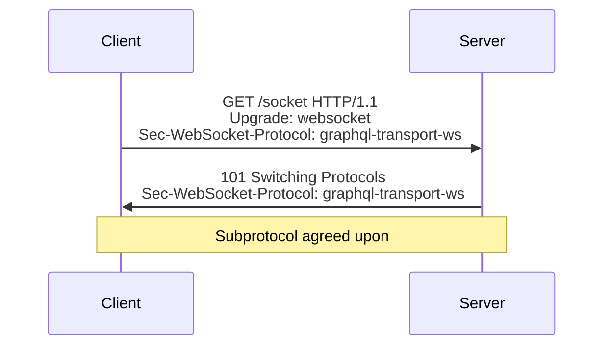
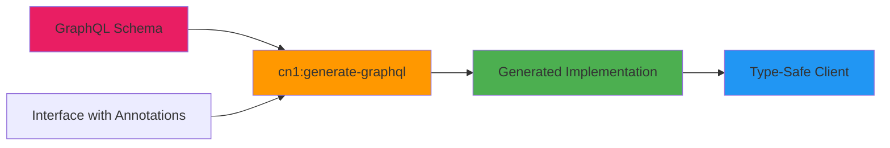
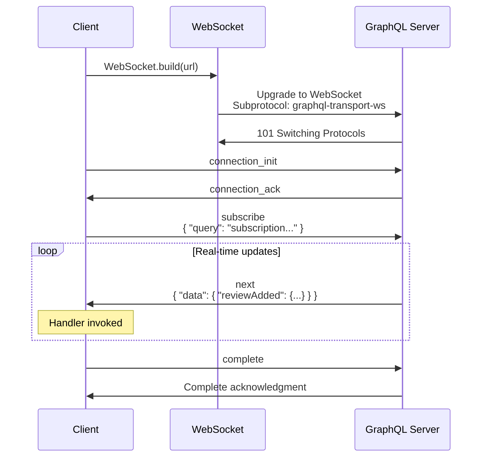
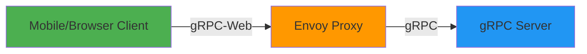
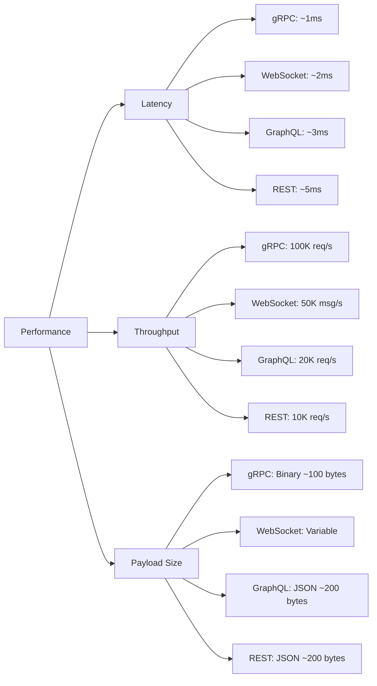
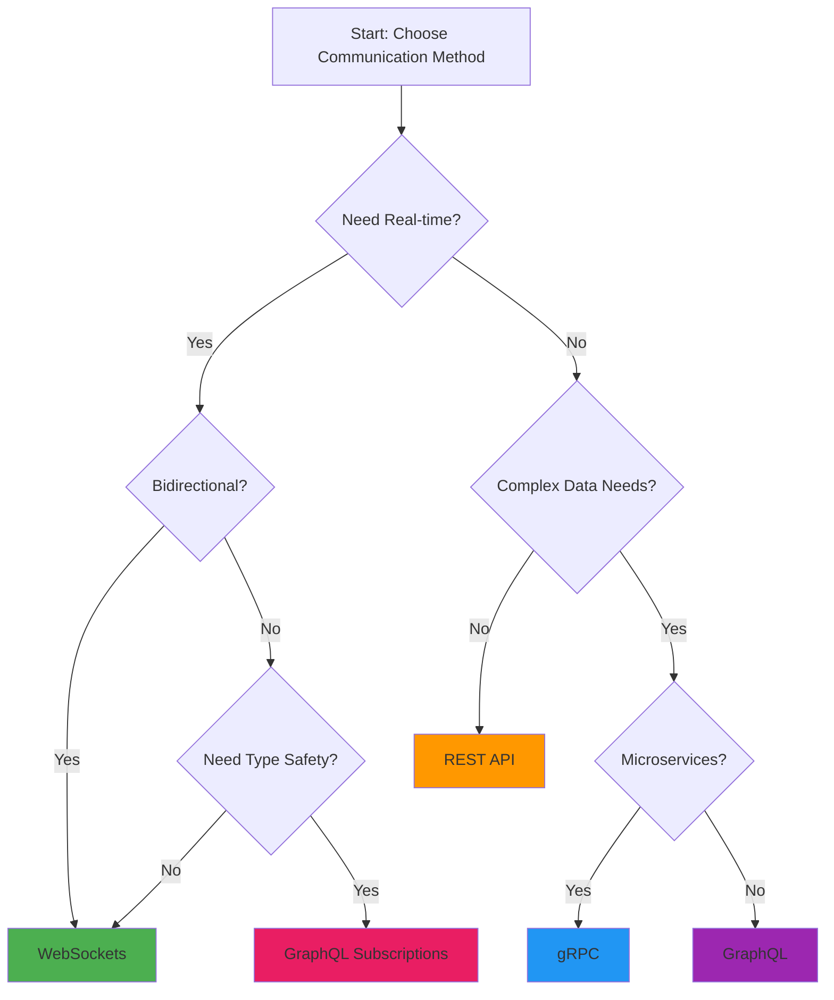
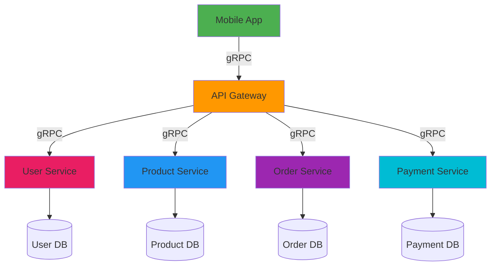

# WebSockets, gRPC, and GraphQL in Codename One - Complete Deep-Dive Tutorial

**Last Updated:** July 3, 2026  
**Difficulty Level:** ⚡⚡⚡ Intermediate  
**Estimated Reading Time:** 25-30 minutes  
**Tutorial Type:** Comprehensive Deep-Dive

---

## 📋 Table of Contents

1. [Introduction & Overview](#introduction--overview)
2. [Prerequisites](#prerequisites)
3. [Learning Objectives](#learning-objectives)
4. [Part 1: WebSockets in Core](#part-1-websockets-in-core)
5. [Part 2: Typed GraphQL Client](#part-2-typed-graphql-client)
6. [Part 3: Typed gRPC Client](#part-3-typed-grpc-client)
7. [Cross-Cutting Concerns](#cross-cutting-concerns)
8. [Technology Comparison Matrix](#technology-comparison-matrix)
9. [Best Practices & Anti-Patterns](#best-practices--anti-patterns)
10. [Troubleshooting Guide](#troubleshooting-guide)
11. [Real-World Use Cases](#real-world-use-cases)
12. [Summary & Key Takeaways](#summary--key-takeaways)
13. [Further Reading & Resources](#further-reading--resources)
14. [Question Bank](#question-bank)

---

## 🎯 Introduction & Overview

Three powerful connectivity features landed together in Codename One, and they belong in one place because they build on each other:

- **WebSockets** moved into the core framework
- **GraphQL client** uses WebSocket support for subscriptions
- **gRPC** reuses the code-generation pattern from GraphQL and OpenAPI

By the end of this tutorial, you'll have:
- ✅ A live real-time chat application using WebSockets
- ✅ A typed GraphQL client with subscriptions
- ✅ A typed gRPC client for microservices communication
- ✅ Understanding of how little code each one takes

### Architecture Overview



**Figure 1:** Architecture showing how WebSockets, GraphQL, and gRPC clients relate in Codename One

### Key Insights

💡 **Why These Three Together?**  
These technologies form a progressive stack. WebSockets provide the foundation, GraphQL builds on top for real-time queries, and gRPC uses a similar code-generation pattern for efficient microservices communication.

🔗 **Source References:**
- WebSockets: [PR #5133](https://github.com/codenameone/CodenameOne/pull/5133)
- Typed Clients: [PR #5141](https://github.com/codenameone/CodenameOne/pull/5141) and [PR #5099](https://github.com/codenameone/CodenameOne/pull/5099)

---

## 📚 Prerequisites

### Required Knowledge
- ✅ Basic understanding of Codename One framework
- ✅ Familiarity with Java programming
- ✅ Understanding of HTTP/HTTPS protocols
- ✅ Basic knowledge of API design patterns

### Required Tools
- ✅ Codename One development environment set up
- ✅ Java JDK 8 or higher
- ✅ IDE (IntelliJ IDEA, Eclipse, or NetBeans)
- ✅ Codename One plugin installed

### Optional (For Testing)
- ✅ WebSocket echo server (e.g., `wss://echo.example.com`)
- ✅ GraphQL server (e.g., SWAPI GraphQL API)
- ✅ gRPC-Web enabled backend

---

## 🎓 Learning Objectives

By the end of this tutorial, you will be able to:

1. **WebSockets:** Implement real-time bidirectional communication using the core WebSocket API
2. **GraphQL:** Build typed GraphQL clients with queries, mutations, and subscriptions
3. **gRPC:** Create typed gRPC clients using Protocol Buffers
4. **Integration:** Understand how these technologies work together
5. **Security:** Implement secure token management across all three
6. **Decision Making:** Choose the right technology for specific use cases
7. **Troubleshooting:** Debug common issues in each approach

---

## 🔌 Part 1: WebSockets in Core

### What Are WebSockets?

WebSockets provide **full-duplex, bidirectional communication** over a single TCP connection. Unlike HTTP's request-response model, WebSockets maintain a persistent connection that allows both client and server to send messages at any time.

**Key Characteristics:**
- ⚡ **Low latency:** No HTTP overhead after initial handshake
- 🔄 **Real-time:** Instant message delivery
- 📊 **Efficient:** Single connection for all communication
- 🌐 **Standardized:** RFC 6455 compliant

### When to Use WebSockets

✅ **Use WebSockets when:**
- Building real-time chat applications
- Implementing live notifications
- Creating collaborative editing tools
- Streaming real-time data (stock prices, game state)
- Building IoT dashboards

❌ **Avoid WebSockets when:**
- Simple request-response patterns (use REST)
- Infrequent communication (HTTP is fine)
- Need HTTP caching benefits
- Working with legacy systems

### The WebSocket Handshake (RFC 6455)

Before diving into code, let's understand what happens under the hood:



**Figure 2:** WebSocket handshake sequence following RFC 6455

**Handshake Details:**
1. Client sends HTTP request with `Upgrade: websocket` header
2. Server responds with `101 Switching Protocols`
3. Connection upgrades from HTTP to WebSocket
4. Both parties can now send messages bidirectionally

### Native Implementation in Codename One

WebSockets are now part of the core framework as `com.codename1.io.WebSocket`, implemented natively on every platform:

| Platform | Implementation |
|----------|----------------|
| **JavaSE/Android** | Hand-rolled RFC 6455 handshake |
| **iOS** | `NSURLSessionWebSocketTask` |
| **JavaScript** | Browser `WebSocket` API |

**Benefits:**
- ✅ No third-party dependencies
- ✅ Consistent API across all platforms
- ✅ No cn1lib required
- ✅ Backward compatible with `cn1-websockets`

### Step 1: Open a WebSocket Connection

The new API uses a **fluent builder pattern** with lambda handlers:

```java
// Good practice: Check for WebSocket support
if (!WebSocket.isSupported()) {
    Log.p("WebSockets not supported on this platform");
    return;
}

// Build and connect with fluent API
WebSocket ws = WebSocket.build("wss://echo.example.com/socket")
    .onConnect(() -> Log.p("✅ Connected to WebSocket server"))
    .onTextMessage(text -> {
        Log.p("📨 Received: " + text);
        addIncoming(text);
    })
    .onClose((code, reason) -> Log.p("🔌 Closed: " + code + " - " + reason))
    .onError(ex -> Log.e("❌ WebSocket error", ex))
    .connect();
```

**Key Points:**
- ✅ **Fluent API:** Chain methods for clean, readable code
- ✅ **Lambda handlers:** Inline event handling
- ✅ **Connection object:** Hold reference to manage lifecycle
- ✅ **No subclassing:** Unlike old API, no URL-in-constructor trap

**API Methods:**
```java
// Send messages
ws.send(String text);
ws.send(byte[] binaryData);

// Check connection state
WebSocketState state = ws.getReadyState();

// Close connection cleanly
ws.close();
```

### Step 2: Build a Real-Time Chat Application

Let's build a complete chat interface:

```java
private WebSocket ws;
private Container conversation;

private void showChat(Form parent) {
    // Create chat form with vertical layout
    Form chat = new Form("💬 Live Chat", BoxLayout.y());
    conversation = chat.getContentPane();
    
    // Message input field
    TextField input = new TextField("", "Message", 20, TextField.ANY);
    Button send = new Button("📤 Send");
    
    // Send button action
    send.addActionListener(e -> {
        String text = input.getText();
        if (text.length() > 0 && ws != null) {
            // Send via WebSocket
            ws.send(text);
            
            // Add to UI immediately (optimistic update)
            addBubble(text, true);
            
            // Clear input
            input.clear();
        }
    });
    
    // Input bar at bottom
    Container bar = BorderLayout.centerEastWest(input, send, null);
    chat.add(BorderLayout.SOUTH, bar);
    
    // Connect to WebSocket server
    ws = WebSocket.build("wss://chat.example.com/room/general")
        .onTextMessage(text -> {
            // WebSocket callbacks run on background thread
            // Use callSerially to update UI safely
            Display.getInstance().callSerially(() -> 
                addBubble(text, false)
            );
        })
        .onConnect(() -> Log.p("✅ Connected to chat room"))
        .onClose((code, reason) -> Log.p("🔌 Disconnected: " + reason))
        .onError(ex -> Log.e("❌ Chat error", ex))
        .connect();
    
    chat.show();
}

// Add message bubble to conversation
private void addBubble(String text, boolean mine) {
    Label bubble = new Label(text);
    bubble.setUIID(mine ? "ChatBubbleMe" : "ChatBubbleThem");
    
    Container line = FlowLayout.encloseIn(bubble);
    line.getStyle().setAlignment(
        mine ? Component.RIGHT : Component.LEFT
    );
    
    conversation.add(line);
    conversation.animateLayout(150); // Smooth animation
}
```

**UI Result:**
```
┌─────────────────────────────┐
│     💬 Live Chat            │
├─────────────────────────────┤
│  ┌─────────────────────┐    │
│  │ Hello everyone!     │    │
│  └─────────────────────┘    │
│         ┌──────────────┐    │
│         │ Hey there!   │    │
│         └──────────────┘    │
│  ┌─────────────────────┐    │
│  │ How's it going?     │    │
│  └─────────────────────┘    │
├─────────────────────────────┤
│ [Message...        ] [Send] │
└─────────────────────────────┘
```

**Critical Pattern:**
```java
// ❌ WRONG: Direct UI update from WebSocket callback
.onTextMessage(text -> addBubble(text, false)) // Crashes!

// ✅ CORRECT: Use callSerially for UI updates
.onTextMessage(text -> Display.getInstance()
    .callSerially(() -> addBubble(text, false)))
```

**Why?** WebSocket callbacks execute on a background thread. Codename One's UI toolkit is not thread-safe. Always use `callSerially()` to marshal UI updates to the EDT (Event Dispatch Thread).

### Step 3: Subprotocol Negotiation

Some WebSocket servers require a specific subprotocol. Negotiate this during the handshake:

```java
WebSocket ws = WebSocket.build(url)
    .subprotocols("graphql-transport-ws")
    .onConnect(() -> {
        String selected = ws.getSelectedSubprotocol();
        Log.p("🤝 Using subprotocol: " + selected);
    })
    .connect();
```

**Real-World Example:**  
The `graphql-transport-ws` subprotocol is exactly what GraphQL subscriptions use (covered in Part 2).

**Subprotocol Negotiation Flow:**


**Figure 3:** WebSocket subprotocol negotiation during handshake

### Production Validation

One reason to trust this implementation: **Codename One's own screenshot CI runs on it**. The pipeline that ships rendered PNGs from each device uses WebSockets as its transport, carrying binary payloads that validate the framework on every commit.

---

## 🔮 Part 2: Typed GraphQL Client

### What is GraphQL?

GraphQL is a **query language for APIs** that gives clients exactly the data they need. Unlike REST, where you fetch fixed data structures from multiple endpoints, GraphQL lets you request precisely what you want in a single query.

**Core Concepts:**
- 📝 **Queries:** Fetch data
- ✏️ **Mutations:** Modify data
- 🔄 **Subscriptions:** Real-time data streams
- 🎯 **Strong typing:** Schema defines all possible operations

### Why GraphQL?

| Feature | REST | GraphQL |
|---------|------|---------|
| **Data Fetching** | Multiple endpoints | Single endpoint |
| **Over-fetching** | Common (get whole object) | Eliminated (request only what you need) |
| **Under-fetching** | Common (need multiple calls) | Eliminated (nested queries) |
| **Versioning** | URL versioning (v1, v2) | Schema evolution |
| **Type Safety** | Manual validation | Built-in type system |
| **Real-time** | WebSockets needed | Subscriptions built-in |

### Code Generation with cn1:generate-graphql

Codename One provides **compile-time code generation** for type-safe GraphQL clients. No runtime reflection, no manual HTTP plumbing.

**How It Works:**


**Figure 4:** GraphQL code generation workflow

### Step 1: Declare the GraphQL Client

Create an interface with annotations:

```java
import com.codename1.io.graphql.*;

@GraphQLClient("https://swapi.example.com/graphql")
public interface StarWarsApi {
    
    // Query: Fetch hero data
    @Query("query HeroName($episode: Episode) { " +
          "hero(episode: $episode) { " +
          "name " +
          "homeworld { name } " +
          "species { name } " +
          "filmConnection { totalCount } " +
          "} " +
          "}")
    void hero(
        @Var("episode") Episode episode,
        OnComplete<GraphQLResponse<HeroData>> callback
    );
    
    // Subscription: Real-time reviews
    @Subscription("subscription OnReview($ep: Episode!) { " +
                 "reviewAdded(episode: $ep) { " +
                 "stars " +
                 "} " +
                 "}")
    GraphQLSubscription onReview(
        @Var("ep") Episode ep,
        GraphQLSubscription.Handler<ReviewData> handler
    );
    
    // Factory method
    static StarWarsApi of(String endpoint) {
        return GraphQLClients.create(StarWarsApi.class, endpoint);
    }
}
```

**Annotation Breakdown:**
- `@GraphQLClient`: Specifies the endpoint URL
- `@Query`: Marks a query operation with the GraphQL query string
- `@Subscription`: Marks a subscription operation
- `@Var`: Binds method parameters to GraphQL variables
- `OnComplete<T>`: Callback for async results
- `GraphQLSubscription.Handler<T>`: Handler for streaming subscription data

**Generated Types:**
```java
// Auto-generated from schema
public enum Episode {
    NEWHOPE, EMPIRE, JEDI
}

// Response data class
public class HeroData {
    public Hero hero;
}

public class Hero {
    public String name;
    public Planet homeworld;
    public Species species;
    public FilmConnection filmConnection;
}

public class Planet {
    public String name;
}

public class Species {
    public String name;
}

public class FilmConnection {
    public int totalCount;
}
```

### Code Generation Modes

The generator has two modes:

| Mode | Description | Use Case |
|------|-------------|----------|
| **Precise Operations** | Emits per-selection types from operation documents | Production apps needing exact types |
| **Schema-Only Quick-Start** | Auto-selects fields to bounded depth | Rapid prototyping |

**Configuration:**
```properties
# Set maximum depth for schema-only mode
cn1.graphql.maxDepth=3
```

### Step 2: Execute Queries and Render Results

```java
// Create API instance
StarWarsApi api = StarWarsApi.of("https://swapi.example.com/graphql");

// Execute query
api.hero(Episode.EMPIRE, response -> {
    // Always check for errors first
    if (!response.isOk()) {
        Log.e("Query failed: " + response.getErrors());
        return;
    }
    
    // Extract data
    HeroData data = response.getResponseData();
    Hero hero = data.hero;
    
    // Render to UI
    Container list = heroForm.getContentPane();
    MultiButton row = new MultiButton(hero.name);
    row.setTextLine2(
        hero.homeworld.name + " . " + 
        hero.species.name
    );
    row.setUIID("HeroRow");
    list.add(row);
    
    // Revalidate to refresh UI
    heroForm.revalidate();
});
```

**GraphQLResponse Structure:**
```java
public class GraphQLResponse<T> {
    private T data;           // Successful response data
    private List<GraphQLError> errors;  // Partial errors
    
    public boolean isOk();    // Check if successful
    public T getResponseData(); // Get data (null if errors)
    public List<GraphQLError> getErrors(); // Get errors
}
```

**Partial Results:**  
GraphQL supports partial success - if some fields fail but others succeed, you get both data and errors. This is powerful for resilient UIs.

### Step 3: Real-Time Subscriptions with WebSockets

GraphQL subscriptions use the core WebSocket with the `graphql-transport-ws` protocol:

```java
// Create subscription
GraphQLSubscription sub = api.onReview(
    Episode.JEDI,
    review -> {
        // Handle incoming review
        Display.getInstance().callSerially(() -> 
            showStars(review.stars)
        );
    }
);

// Later: Clean up subscription
sub.close();
```

**How It Works:**


**Figure 5:** GraphQL subscription flow over WebSocket

**Subscription Lifecycle:**
1. **Connection:** WebSocket connects with `graphql-transport-ws` subprotocol
2. **Initialization:** Client sends `connection_init`
3. **Acknowledgment:** Server responds with `connection_ack`
4. **Subscription:** Client sends subscription query
5. **Streaming:** Server pushes `next` messages for each event
6. **Cleanup:** Client sends `complete` to end subscription

**Key Advantage:**  
The GraphQL layer didn't need its own WebSocket implementation - it reuses the framework's core WebSocket support!

---

## ⚙️ Part 3: Typed gRPC Client

### What is gRPC?

gRPC is a **high-performance, open-source RPC framework** using Protocol Buffers (protobuf) for serialization. It's designed for low-latency, high-throughput communication between services.

**Core Concepts:**
- 📦 **Protocol Buffers:** Language-neutral, platform-neutral serialization
- 🔌 **Services:** Define RPC methods in `.proto` files
- 💬 **Bidirectional streaming:** Client and server can stream messages
- 🌍 **Cross-platform:** Works across languages and platforms

### gRPC vs REST vs GraphQL

| Feature | REST | GraphQL | gRPC |
|---------|------|---------|------|
| **Protocol** | HTTP/1.1 or HTTP/2 | HTTP | HTTP/2 |
| **Serialization** | JSON | JSON | Protocol Buffers (binary) |
| **Performance** | Moderate | Moderate | ⚡ High |
| **Type Safety** | Manual | Schema-based | Strong typing |
| **Streaming** | Limited | Subscriptions | Native |
| **Browser Support** | Native | Native | gRPC-Web required |
| **Code Generation** | OpenAPI/Swagger | GraphQL Codegen | Protoc |

### Protocol Buffers (Protobuf)

Protocol Buffers are Google's language-neutral, platform-neutral, extensible mechanism for serializing structured data.

**Example Proto File:**
```protobuf
syntax = "proto3";

// Service definition
service Greeter {
  // Unary RPC: Single request, single response
  rpc SayHello (HelloRequest) returns (HelloReply);
}

// Message: Request structure
message HelloRequest {
  string name = 1;  // Field number 1
}

// Message: Response structure
message HelloReply {
  string message = 1;
}
```

**Key Concepts:**
- **Field Numbers:** Each field has a unique number (1, 2, 3...) used in binary encoding
- **Scalar Types:** `string`, `int32`, `int64`, `float`, `double`, `bool`
- **Composite Types:** `message` (nested structures), `enum`
- **Repeated Fields:** Arrays/lists
- **Optional/Required:** Proto3 defaults to optional

### gRPC-Web Binary Protocol

Mobile and browser clients can't use raw HTTP/2 gRPC. Instead, they use **gRPC-Web**:

```
Content-Type: application/grpc-web+proto
```

**How It Works:**


**Figure 6:** gRPC-Web architecture with Envoy proxy

**Compatible With:**
- ✅ Envoy proxy
- ✅ Official `grpcweb` Go proxy
- ✅ gRPC-Web filter in modern gRPC servers

### Code Generation Without Protoc

Codename One's `cn1:generate-grpc` generates code **without requiring protoc**:

```mermaid
graph LR
    A[.proto Files] --> B[cn1:generate-grpc]
    B --> C[Generated Sources]
    C --> D[@ProtoMessage]
    C --> E[@ProtoEnum]
    C --> F[@GrpcClient]
    
    G[Annotation Processor] --> H[Binary Codecs]
    G --> I[Call Sites]
    
    B --> G
    H --> J[target/generated-sources]
    I --> J
    
    style A fill:#E91E63
    style B fill:#FF9800
    style J fill:#4CAF50
```

**Figure 7:** gRPC code generation workflow

**Benefits:**
- ✅ No protoc dependency
- ✅ Hand-editable generated sources
- ✅ Clean source tree (generated code in `target/`)
- ✅ Works on all platforms

### Step 1: Define Your Proto File

```protobuf
syntax = "proto3";

// Service definition
service Greeter {
  // Unary RPC
  rpc SayHello (HelloRequest) returns (HelloReply);
}

// Request message
message HelloRequest {
  string name = 1;
}

// Response message
message HelloReply {
  string message = 1;
}
```

**Save as:** `greeter.proto`

### Step 2: Generate and Use the Client

After running `cn1:generate-grpc`, you get:

```java
// Generated message class
@ProtoMessage
public class HelloRequest {
    public String name;
}

@ProtoMessage
public class HelloReply {
    public String message;
}

// Generated client interface
@GrpcClient("https://api.example.com")
public interface GreeterGrpc {
    void sayHello(
        HelloRequest req,
        String bearerToken,
        OnComplete<GrpcResponse<HelloReply>> callback
    );
    
    static GreeterGrpc of(String endpoint) {
        return GrpcClients.create(GreeterGrpc.class, endpoint);
    }
}
```

**Using the Client:**
```java
// Create client instance
GreeterGrpc g = GreeterGrpc.of("https://api.example.com");

// Build request
HelloRequest req = new HelloRequest();
req.name = "World";

// Execute RPC with authentication
g.sayHello(
    req,
    "Bearer " + token,
    response -> {
        if (response.isOk()) {
            // Success
            String greeting = response.getResponseData().message;
            renderGreeting(greeting);
        } else {
            // Handle error
            Log.e("gRPC call failed: " + response.getError());
        }
    }
);
```

**Response Structure:**
```java
public class GrpcResponse<T> {
    private T data;
    private GrpcError error;
    
    public boolean isOk();
    public T getResponseData();
    public GrpcError getError();
}
```

### Current Limitations (Version 1)

| Feature | Status |
|---------|--------|
| **Unary RPCs** | ✅ Supported |
| **Scalar types** | ✅ All types |
| **Nested messages** | ✅ Supported |
| **Enums** | ✅ Supported |
| **Repeated fields** | ✅ Supported |
| **Bidirectional streaming** | ❌ Not yet |
| **Map<K,V>** | ❌ Not yet |
| **Well-known types** | ❌ Not yet |
| **Import statements** | ❌ Not yet |

**Error Handling:**  
The parser errors cleanly when encountering unsupported features, providing clear error messages.

---

## 🔗 Cross-Cutting Concerns

### Enum Binding Across All Connectors

All three connectors (WebSocket, GraphQL, gRPC) share the build-time JSON/XML mapper, which now **properly handles enums**:

**Before (Broken):**
```java
public enum Episode {
    NEWHOPE, EMPIRE, JEDI
}

// Enum treated as nested reference
// No mapper found
// Silently failed to serialize ❌
```

**After (Fixed):**
```java
public enum Episode {
    NEWHOPE, EMPIRE, JEDI
}

// Serializes with name()
// Deserializes with valueOf()
// Unknown values decode to null
// Handles List<Enum> across JSON and XML ✅
```

**Implementation:**
```java
// Serialization
String json = mapper.toJson(Episode.EMPIRE); // "EMPIRE"

// Deserialization
Episode ep = mapper.parse(Episode.class, "JEDI"); // Episode.JEDI

// Unknown value
Episode unknown = mapper.parse(Episode.class, "UNKNOWN"); // null

// Lists of enums
List<Episode> episodes = Arrays.asList(NEWHOPE, EMPIRE);
String jsonList = mapper.toJson(episodes); // ["NEWHOPE","EMPIRE"]
```

**Why This Matters:**  
This is why the GraphQL `Episode` enum in Part 2 is a real enum rather than a `String`. It's also a welcome fix for anyone using `@Mapped` directly.

### Security: Token Management

Both gRPC and GraphQL samples pass bearer tokens. **Critical security rule:**

> ⚠️ **Never hard-code tokens, never check them into source control, and never embed them in the app binary.**

**Why?**  
A shipped binary can be unpacked. Anything baked into it is effectively public.

**Secure Token Storage:**
```java
// ✅ CORRECT: Fetch at runtime, store securely
import com.codename1.io.Storage;
import com.codename1.io.CryptoStorage;

// Store token securely
void saveToken(String token) {
    // Use encrypted storage
    Storage.getInstance().writeObject("auth_token", 
        token.getBytes(StandardCharsets.UTF_8)
    );
}

// Retrieve token
String getToken() {
    byte[] data = Storage.getInstance().readObject("auth_token");
    return data != null ? new String(data, StandardCharsets.UTF_8) : null;
}

// Better: Use SecureStorage for sensitive data
import com.codename1.io.SecureStorage;

SecureStorage secure = SecureStorage.getInstance();
secure.set("auth_token", token);
String retrievedToken = secure.get("auth_token");
```

**Token Usage Pattern:**
```java
// Fetch token from backend at runtime
String token = fetchTokenFromBackend();

// Store securely
SecureStorage.getInstance().set("auth_token", token);

// Use in API calls
api.hero(Episode.EMPIRE, "Bearer " + token, callback);
```

**Best Practices:**
- ✅ Fetch tokens from your backend at app startup
- ✅ Store in `SecureStorage` or encrypted storage
- ✅ Refresh tokens before expiration
- ✅ Use HTTPS/WSS for all API calls
- ✅ Implement token refresh logic
- ❌ Never commit tokens to Git
- ❌ Never hard-code in source files
- ❌ Never store in plain text

---

## 📊 Technology Comparison Matrix

### When to Use What?

| Use Case | WebSockets | GraphQL | gRPC |
|----------|-----------|---------|------|
| **Real-time chat** | ✅ Perfect fit | ✅ With subscriptions | ⚠️ Overkill |
| **Live notifications** | ✅ Excellent | ✅ Good | ⚠️ Overkill |
| **Complex data queries** | ❌ Manual parsing | ✅ Perfect fit | ⚠️ Verbose |
| **Microservices** | ❌ Not ideal | ⚠️ Possible | ✅ Perfect fit |
| **Mobile apps** | ✅ Lightweight | ✅ Good | ✅ With gRPC-Web |
| **Browser apps** | ✅ Native | ✅ Native | ⚠️ Needs proxy |
| **High performance** | ✅ Good | ⚠️ JSON overhead | ✅ Best (binary) |
| **Type safety** | ⚠️ Manual | ✅ Excellent | ✅ Excellent |
| **Learning curve** | ✅ Easy | ⚠️ Moderate | ❌ Steep |

### Performance Comparison



**Figure 8:** Performance comparison across communication protocols

**Benchmark Notes:**
- gRPC uses binary Protocol Buffers (smallest payload)
- WebSocket overhead is minimal after connection
- GraphQL adds JSON parsing overhead
- REST has highest overhead (HTTP headers per request)

### Decision Tree



**Figure 9:** Decision tree for choosing the right communication protocol

---

## ✅ Best Practices & Anti-Patterns

### WebSockets Best Practices

✅ **DO:**
- ✅ Check `WebSocket.isSupported()` before connecting
- ✅ Use `callSerially()` for UI updates from callbacks
- ✅ Implement reconnection logic with exponential backoff
- ✅ Close connections properly when done
- ✅ Handle all error scenarios
- ✅ Use WSS (WebSocket Secure) in production
- ✅ Implement heartbeat/ping-pong to detect dead connections
- ✅ Validate and sanitize all incoming messages

❌ **DON'T:**
- ❌ Create WebSocket connections in loops
- ❌ Forget to close connections (memory leaks)
- ❌ Update UI directly from callbacks
- ❌ Use WS in production (always use WSS)
- ❌ Ignore error callbacks
- ❌ Send sensitive data without encryption

**Example: Reconnection Logic**
```java
private WebSocket ws;
private int reconnectAttempts = 0;
private static final int MAX_RECONNECT = 5;

private void connectWithRetry(String url) {
    if (reconnectAttempts >= MAX_RECONNECT) {
        Log.e("Max reconnection attempts reached");
        return;
    }
    
    ws = WebSocket.build(url)
        .onConnect(() -> {
            reconnectAttempts = 0; // Reset on success
            Log.p("✅ Connected");
        })
        .onClose((code, reason) -> {
            Log.p("🔌 Disconnected, attempting reconnect...");
            reconnectAttempts++;
            
            // Exponential backoff
            int delay = (int) Math.pow(2, reconnectAttempts) * 1000;
            Display.getInstance().callSerially(() -> {
                try {
                    Thread.sleep(delay);
                    connectWithRetry(url);
                } catch (InterruptedException e) {
                    Thread.currentThread().interrupt();
                }
            });
        })
        .onError(ex -> Log.e("❌ Error", ex))
        .connect();
}
```

### GraphQL Best Practices

✅ **DO:**
- ✅ Use typed interfaces with code generation
- ✅ Always check `response.isOk()` before accessing data
- ✅ Handle partial results (data + errors)
- ✅ Close subscriptions when not needed
- ✅ Use variables for dynamic queries
- ✅ Implement proper error handling
- ✅ Cache responses when appropriate
- ✅ Use fragments for reusable field sets

❌ **DON'T:**
- ❌ Fetch more data than needed (defeats GraphQL's purpose)
- ❌ Ignore errors in responses
- ❌ Leave subscriptions open indefinitely
- ❌ Use GraphQL for simple CRUD (REST might be better)
- ❌ Expose sensitive fields in schema
- ❌ Skip input validation

**Example: Proper Error Handling**
```java
api.hero(Episode.EMPIRE, response -> {
    // Check for errors first
    if (!response.isOk()) {
        // Handle partial failure
        for (GraphQLError error : response.getErrors()) {
            Log.e("Error at " + error.getPath() + ": " + 
                  error.getMessage());
        }
        
        // Check if we have partial data
        if (response.getResponseData() != null) {
            // Use partial data
            renderPartialHero(response.getResponseData());
        } else {
            // Complete failure
            showError("Failed to load hero data");
        }
        return;
    }
    
    // Success path
    HeroData data = response.getResponseData();
    renderHero(data.hero);
});
```

### gRPC Best Practices

✅ **DO:**
- ✅ Use strong typing (generated code)
- ✅ Handle gRPC status codes properly
- ✅ Implement deadline/timeout for RPCs
- ✅ Use interceptors for cross-cutting concerns
- ✅ Close channels when done
- ✅ Use TLS in production
- ✅ Implement retry logic with backoff
- ✅ Monitor with gRPC health checks

❌ **DON'T:**
- ❌ Ignore status codes (they carry important info)
- ❌ Use large messages without streaming
- ❌ Skip error handling
- ❌ Hard-code endpoints
- ❌ Forget to set deadlines (infinite hangs)
- ❌ Use gRPC for simple file uploads (use REST)

**Example: Proper Error Handling**
```java
g.sayHello(req, token, response -> {
    if (response.isOk()) {
        // Success
        String message = response.getResponseData().message;
        showGreeting(message);
    } else {
        // Handle specific gRPC status codes
        GrpcError error = response.getError();
        
        switch (error.getStatus()) {
            case INVALID_ARGUMENT:
                showError("Invalid request: " + error.getMessage());
                break;
            case UNAUTHENTICATED:
                showError("Please log in again");
                refreshToken();
                break;
            case UNAVAILABLE:
                showError("Service temporarily unavailable");
                retryWithBackoff();
                break;
            case DEADLINE_EXCEEDED:
                showError("Request timed out");
                break;
            default:
                showError("Error: " + error.getMessage());
        }
    }
});
```

### Common Anti-Patterns

❌ **Anti-Pattern 1: Connection Per Request**
```java
// ❌ BAD: Creating new connection for every message
for (Message msg : messages) {
    WebSocket ws = WebSocket.build(url)
        .onTextMessage(text -> process(text))
        .connect();
    ws.send(msg.getText());
    ws.close();
}

// ✅ GOOD: Reuse single connection
WebSocket ws = WebSocket.build(url)
    .onTextMessage(text -> process(text))
    .connect();

for (Message msg : messages) {
    ws.send(msg.getText());
}

ws.close();
```

❌ **Anti-Pattern 2: Ignoring Thread Safety**
```java
// ❌ BAD: Direct UI update from callback
.onTextMessage(text -> conversation.add(createLabel(text)))

// ✅ GOOD: Marshal to EDT
.onTextMessage(text -> Display.getInstance()
    .callSerially(() -> conversation.add(createLabel(text))))
```

❌ **Anti-Pattern 3: Leaking Subscriptions**
```java
// ❌ BAD: Subscription never closed
public void startMonitoring() {
    GraphQLSubscription sub = api.onReview(ep, handler);
    // sub goes out of scope, but connection stays open!
}

// ✅ GOOD: Track and close properly
private GraphQLSubscription activeSubscription;

public void startMonitoring() {
    // Close previous if exists
    if (activeSubscription != null) {
        activeSubscription.close();
    }
    
    activeSubscription = api.onReview(ep, handler);
}

public void stopMonitoring() {
    if (activeSubscription != null) {
        activeSubscription.close();
        activeSubscription = null;
    }
}
```

---

## 🔧 Troubleshooting Guide

### WebSocket Issues

**Problem: Connection fails with "Unsupported protocol"**
```java
// ✅ Solution: Check support first
if (!WebSocket.isSupported()) {
    // Fallback or show error
    return;
}
```

**Problem: UI not updating from WebSocket callback**
```java
// ✅ Solution: Always use callSerially
.onTextMessage(text -> Display.getInstance()
    .callSerially(() -> updateUI(text)))
```

**Problem: Connection drops frequently**
```java
// ✅ Solution: Implement reconnection with backoff
// See "Reconnection Logic" example in Best Practices
```

**Problem: Messages not received**
```java
// Check: 1. Server is sending
// Check: 2. Correct subprotocol negotiated
// Check: 3. Handler is registered before connect()
// Check: 4. Using callSerially for UI updates

// Debug logging
WebSocket ws = WebSocket.build(url)
    .onConnect(() -> Log.p("Connected"))
    .onTextMessage(text -> Log.p("Received: " + text))
    .onError(ex -> Log.e("Error", ex))
    .connect();
```

### GraphQL Issues

**Problem: "No mapper found for type"**
```java
// ✅ Solution: Ensure all types are generated
// Check: 1. cn1:generate-graphql ran successfully
// Check: 2. All types in schema are generated
// Check: 3. Package names match
```

**Problem: Partial results with errors**
```java
// ✅ Solution: Always check both data and errors
api.hero(episode, response -> {
    if (!response.isOk()) {
        // Log errors
        for (GraphQLError error : response.getErrors()) {
            Log.e(error.getMessage());
        }
    }
    
    // Check if data exists
    if (response.getResponseData() != null) {
        // Use partial data
    }
});
```

**Problem: Subscription not receiving updates**
```java
// Check: 1. WebSocket connected
// Check: 2. Subprotocol is graphql-transport-ws
// Check: 3. Subscription query is valid
// Check: 4. Server is publishing events

// Debug
GraphQLSubscription sub = api.onReview(ep, review -> {
    Log.p("Review received: " + review.stars);
});
```

### gRPC Issues

**Problem: "Class not found" for generated code**
```java
// ✅ Solution: Ensure code generation ran
// Check: 1. cn1:generate-grpc executed
// Check: 2. Generated sources in build path
// Check: 3. Clean and rebuild project
```

**Problem: "Unsupported feature" error**
```java
// ✅ Solution: Check proto file for unsupported features
// Version 1 doesn't support:
// - Streaming RPCs
// - Map<K,V>
// - Well-known types (Timestamp, etc.)
// - Import statements

// Simplify proto to use only supported features
```

**Problem: Connection timeout**
```java
// ✅ Solution: Set deadline
// Note: Check if your generated client supports deadlines
// If not, implement at proxy/server level
```

---

## 🌍 Real-World Use Cases

### Use Case 1: Live Chat Application (WebSockets)

**Scenario:** Customer support chat system

**Implementation:**
```java
public class SupportChat {
    private WebSocket ws;
    private String chatRoomId;
    
    public void joinChat(String userId, String roomId) {
        this.chatRoomId = roomId;
        
        ws = WebSocket.build("wss://support.example.com/chat/" + roomId)
            .header("Authorization", "Bearer " + getToken())
            .onTextMessage(message -> {
                Display.getInstance().callSerially(() -> {
                    ChatMessage msg = parseMessage(message);
                    displayMessage(msg);
                });
            })
            .onConnect(() -> {
                // Send join event
                ws.send("{\"type\":\"join\",\"userId\":\"" + userId + "\"}");
            })
            .onClose((code, reason) -> {
                Log.p("Chat ended: " + reason);
            })
            .connect();
    }
    
    public void sendMessage(String text) {
        if (ws != null) {
            String json = "{\"type\":\"message\",\"text\":\"" + text + "\"}";
            ws.send(json);
        }
    }
    
    public void leaveChat() {
        if (ws != null) {
            ws.close();
            ws = null;
        }
    }
}
```

**Benefits:**
- ⚡ Instant message delivery
- 🔄 Real-time agent responses
- 📊 Typing indicators
- 👥 Multi-user support

### Use Case 2: Real-Time Notifications (GraphQL Subscriptions)

**Scenario:** Social media notification system

**Implementation:**
```java
public class NotificationService {
    private GraphQLSubscription notificationSub;
    
    public void startNotifications(String userId) {
        SocialApi api = SocialApi.of("https://api.example.com/graphql");
        
        notificationSub = api.onNewNotification(
            userId,
            notification -> {
                Display.getInstance().callSerially(() -> {
                    showNotification(notification);
                    playNotificationSound();
                });
            }
        );
    }
    
    public void stopNotifications() {
        if (notificationSub != null) {
            notificationSub.close();
            notificationSub = null;
        }
    }
}
```

**Benefits:**
- ✅ Type-safe notifications
- 🔄 Real-time updates without polling
- 📱 Battery efficient (single WebSocket)
- 🎯 Only receives relevant notifications

### Use Case 3: Microservices Communication (gRPC)

**Scenario:** E-commerce platform with multiple services

**Architecture:**


**Figure 10:** Microservices architecture using gRPC

**Implementation:**
```java
// Product service client
ProductServiceGrpc productClient = ProductServiceGrpc.of(
    "https://api.example.com"
);

// Get product details
ProductRequest req = new ProductRequest();
req.productId = "12345";

productClient.getProduct(req, token, response -> {
    if (response.isOk()) {
        Product product = response.getResponseData();
        displayProduct(product);
    }
});

// Order service client
OrderServiceGrpc orderClient = OrderServiceGrpc.of(
    "https://api.example.com"
);

// Place order
OrderRequest orderReq = new OrderRequest();
orderReq.productId = "12345";
orderReq.quantity = 2;

orderClient.placeOrder(orderReq, token, response -> {
    if (response.isOk()) {
        OrderConfirmation confirmation = response.getResponseData();
        showConfirmation(confirmation);
    }
});
```

**Benefits:**
- ⚡ High performance (binary protocol)
- 🔒 Strong typing across services
- 📦 Efficient serialization
- 🌐 Language-agnostic (polyglot services)

---

## 📝 Summary & Key Takeaways

### What You've Learned

1. **WebSockets in Core**
   - Native implementation across all platforms
   - Fluent API with lambda handlers
   - Real-time bidirectional communication
   - Subprotocol negotiation

2. **Typed GraphQL Client**
   - Compile-time code generation
   - Type-safe queries, mutations, and subscriptions
   - Built on core WebSocket support
   - Partial results with error handling

3. **Typed gRPC Client**
   - Protocol Buffers for efficient serialization
   - gRPC-Web binary protocol for mobile/browser
   - No protoc dependency
   - Strong typing across services

4. **Cross-Cutting Concerns**
   - Enum binding fixed across all connectors
   - Secure token management with SecureStorage
   - Thread safety with callSerially
   - Error handling patterns

### Key Insights

💡 **Progressive Stack:**  
WebSockets → GraphQL → gRPC form a progressive stack where each builds on the previous.

💡 **Code Generation:**  
All three use compile-time code generation for type safety and performance.

💡 **Native Implementation:**  
WebSockets are implemented natively on each platform without third-party dependencies.

💡 **Security First:**  
Never hard-code tokens. Use SecureStorage and fetch at runtime.

### Quick Decision Guide

```
Need real-time bidirectional? → WebSockets
Need typed queries with real-time? → GraphQL
Need high-performance microservices? → gRPC
Need simple request-response? → REST
```

---

## 📚 Further Reading & Resources

### Official Documentation
- [Codename One WebSocket API](https://www.codenameone.com/javadoc/com/codename1/io/WebSocket.html)
- [Codename One GraphQL Client](https://www.codenameone.com/javadoc/com/codename1/io/graphql/package-summary.html)
- [Codename One gRPC Support](https://www.codenameone.com/blog/mac-native-grpc-graphql-and-fewer-open-issues/)

### Specifications
- [RFC 6455 - WebSocket Protocol](https://datatracker.ietf.org/doc/html/rfc6455)
- [GraphQL Specification](https://spec.graphql.org/)
- [gRPC Documentation](https://grpc.io/docs/)
- [Protocol Buffers Guide](https://protobuf.dev/)
- [gRPC-Web Specification](https://github.com/grpc/grpc/blob/master/doc/PROTOCOL-WEB.md)

### Related Tutorials
- [Native Mac Builds and Desktop Integration](https://www.codenameone.com/blog/mac-native-builds-and-desktop-integration/)
- [Release Post: gRPC, GraphQL, and Fewer Open Issues](https://www.codenameone.com/blog/mac-native-grpc-graphql-and-fewer-open-issues/)

### Community Resources
- [Codename One GitHub](https://github.com/codenameone/CodenameOne)
- [Issue Tracker](https://github.com/codenameone/CodenameOne/issues)
- [Codename One Blog](https://www.codenameone.com/blog)

---

## ❓ Question Bank

Test your understanding with these 12 questions covering all major concepts from this tutorial.

---

### Question 1: WebSocket Fundamentals

**Question:**  
What is the primary advantage of WebSockets over traditional HTTP for real-time applications?

A) WebSockets use less memory  
B) WebSockets provide full-duplex, bidirectional communication over a single connection  
C) WebSockets are easier to implement  
D) WebSockets don't require a server  

**Answer:** B

**Explanation:**  
WebSockets provide full-duplex, bidirectional communication over a single TCP connection. Unlike HTTP's request-response model, both client and server can send messages at any time after the initial handshake. This makes WebSockets ideal for real-time applications like chat, live notifications, and collaborative tools.

---

### Question 2: WebSocket Handshake

**Question:**  
What HTTP status code does the server return during a successful WebSocket handshake?

A) 200 OK  
B) 101 Switching Protocols  
C) 204 No Content  
D) 301 Moved Permanently  

**Answer:** B

**Explanation:**  
During a WebSocket handshake, the server responds with HTTP status code 101 (Switching Protocols) to indicate that it's switching from HTTP to the WebSocket protocol. This is defined in RFC 6455.

---

### Question 3: Thread Safety in Codename One

**Question:**  
Why must you use `Display.getInstance().callSerially()` when updating the UI from a WebSocket callback?

A) It improves performance  
B) WebSocket callbacks run on a background thread, and Codename One's UI toolkit is not thread-safe  
C) It's required by the WebSocket protocol  
D) It reduces memory usage  

**Answer:** B

**Explanation:**  
WebSocket callbacks execute on a background thread. Codename One's UI toolkit is not thread-safe, meaning UI operations must only occur on the Event Dispatch Thread (EDT). `callSerially()` marshals the UI update to the EDT, preventing crashes and undefined behavior.

---

### Question 4: GraphQL Subprotocol

**Question:**  
What subprotocol does Codename One's GraphQL client use for subscriptions?

A) `graphql-ws`  
B) `graphql-transport-ws`  
C) `websocket-graphql`  
D) `subscription-protocol`  

**Answer:** B

**Explanation:**  
Codename One's GraphQL client uses the `graphql-transport-ws` subprotocol for subscriptions. This is a standardized WebSocket subprotocol for GraphQL subscriptions that provides connection initialization, acknowledgment, and proper lifecycle management.

---

### Question 5: GraphQL Partial Results

**Question:**  
What makes GraphQL's `GraphQLResponse<T>` powerful for resilient UIs?

A) It caches responses automatically  
B) It supports partial results where some fields succeed while others fail  
C) It retries failed requests automatically  
D) It compresses responses  

**Answer:** B

**Explanation:**  
GraphQL supports partial success. If some fields in a query fail but others succeed, `GraphQLResponse<T>` contains both the successful data and a list of errors. This allows UIs to display partial results rather than failing completely, improving user experience.

---

### Question 6: gRPC Serialization

**Question:**  
What serialization format does gRPC use by default?

A) JSON  
B) XML  
C) Protocol Buffers (binary)  
D) MessagePack  

**Answer:** C

**Explanation:**  
gRPC uses Protocol Buffers (protobuf) as its default serialization format. Protocol Buffers are a binary, language-neutral, platform-neutral serialization format developed by Google. They're more efficient than JSON or XML in terms of both size and parsing speed.

---

### Question 7: gRPC-Web

**Question:**  
Why can't mobile and browser clients use raw HTTP/2 gRPC directly?

A) They don't support HTTP/2  
B) Browsers don't expose raw HTTP/2 frames to JavaScript  
C) gRPC requires a native client library  
D) HTTP/2 is not secure  

**Answer:** B

**Explanation:**  
Browsers don't expose raw HTTP/2 frames to JavaScript, making it impossible to implement the gRPC protocol directly in browser-based applications. gRPC-Web solves this by using a proxy (like Envoy) that translates between gRPC-Web and native gRPC.

---

### Question 8: Enum Binding

**Question:**  
What was the previous behavior of enum fields in Codename One's JSON/XML mapper, and how is it fixed now?

A) Previously worked correctly, now broken  
B) Previously treated as nested references and silently failed, now serializes with `name()` and deserializes with `valueOf()`  
C) Previously required manual serialization, now automatic  
D) Previously only worked with JSON, now works with XML too  

**Answer:** B

**Explanation:**  
Previously, enum fields were treated as nested references, no mapper was found, and serialization silently failed. The fix makes the mapper write enums using `name()` and read them using `valueOf()`. Unknown values decode to `null`, and it handles `List<Enum>` across both JSON and XML.

---

### Question 9: Secure Token Storage

**Question:**  
Why should you never hard-code authentication tokens in your application binary?

A) It makes the app slower  
B) A shipped binary can be unpacked, making embedded tokens effectively public  
C) It violates Codename One's terms of service  
D) It causes memory leaks  

**Answer:** B

**Explanation:**  
A shipped binary can be unpacked and reverse-engineered. Any token, API key, or secret embedded in the binary is effectively public. Always fetch tokens from your backend at runtime and store them securely using `SecureStorage` or encrypted storage.

---

### Question 10: WebSocket Subprotocol Negotiation

**Question:**  
How do you specify which WebSocket subprotocol your client wants to use?

A) Set it in the URL query parameters  
B) Call `setSubprotocol()` after connecting  
C) Use the `.subprotocols()` method in the builder before connecting  
D) It's automatically negotiated based on the server  

**Answer:** C

**Explanation:**  
You specify desired subprotocols using the `.subprotocols()` method in the WebSocket builder before calling `.connect()`. The server selects one of the proposed protocols and returns it in the `Sec-WebSocket-Protocol` header of the 101 response.

---

### Question 11: gRPC Code Generation

**Question:**  
What is a key benefit of Codename One's `cn1:generate-grpc` compared to using protoc directly?

A) It generates faster code  
B) It doesn't require the protoc compiler as a dependency  
C) It supports more proto features  
D) It generates smaller binaries  

**Answer:** B

**Explanation:**  
Codename One's `cn1:generate-grpc` generates the binary protobuf codecs and call sites without requiring the protoc compiler as a dependency. The generated sources are hand-editable and placed in `target/generated-sources`, keeping your source tree clean.

---

### Question 12: Technology Selection

**Question:**  
You're building a real-time collaborative document editor where multiple users edit simultaneously. Which technology stack would be most appropriate?

A) REST API only  
B) WebSockets for real-time sync + REST for document storage  
C) GraphQL subscriptions only  
D) gRPC streaming only  

**Answer:** B

**Explanation:**  
A collaborative document editor needs real-time synchronization (WebSockets) for instant updates across users, combined with REST for document storage and retrieval. WebSockets handle the real-time sync efficiently, while REST is better suited for CRUD operations on documents. GraphQL subscriptions could work but might be overkill, and gRPC streaming is better suited for microservices communication.

---

## 🎓 Conclusion

You've completed a comprehensive deep-dive into WebSockets, GraphQL, and gRPC in Codename One. These three technologies form a powerful stack for modern, connected applications:

- **WebSockets** provide the foundation for real-time communication
- **GraphQL** builds on WebSockets for type-safe, real-time data queries
- **gRPC** uses similar code-generation patterns for high-performance microservices

**Remember:**
- ✅ Use the right tool for the job
- ✅ Always prioritize security (SecureStorage for tokens)
- ✅ Handle errors gracefully
- ✅ Close connections and subscriptions properly
- ✅ Use `callSerially()` for UI updates

**Next Steps:**
1. Experiment with the code examples in this tutorial
2. Build a small project combining all three technologies
3. Explore advanced features (streaming, batching, caching)
4. Read the official documentation linked in Further Reading
5. Join the Codename One community for support

Happy coding! 🚀

---

**Found an issue or have a question?**  
File an issue at [github.com/codenameone/CodenameOne/issues](https://github.com/codenameone/CodenameOne/issues)

**Previous:** [Native Mac Builds and Desktop Integration](https://www.codenameone.com/blog/mac-native-builds-and-desktop-integration/)  
**Next:** The new advertising API (coming soon)