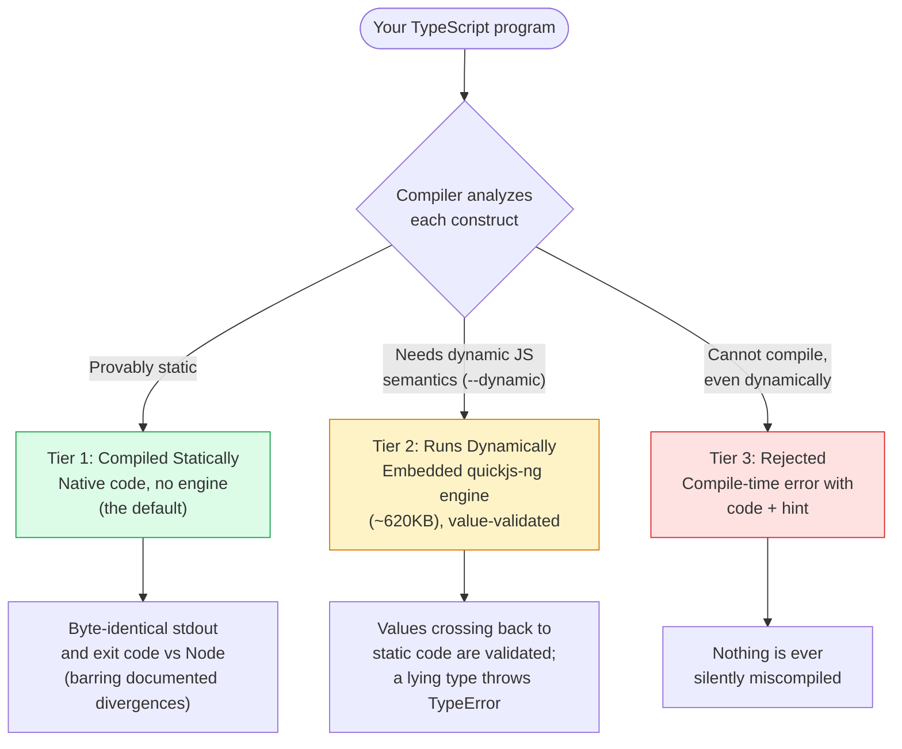
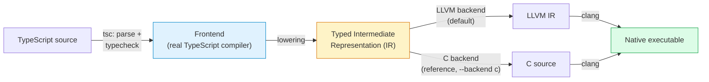
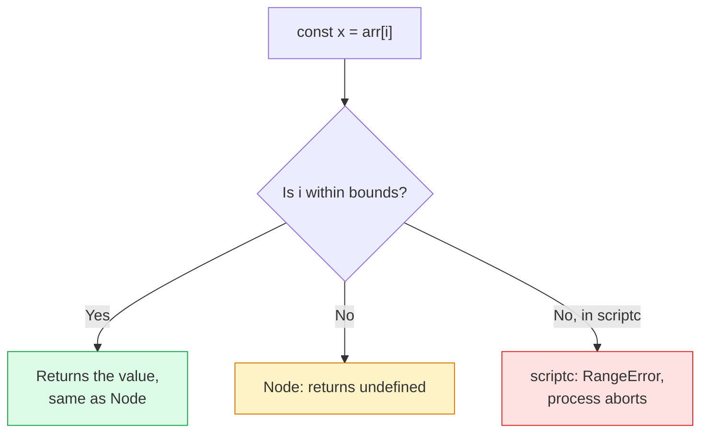
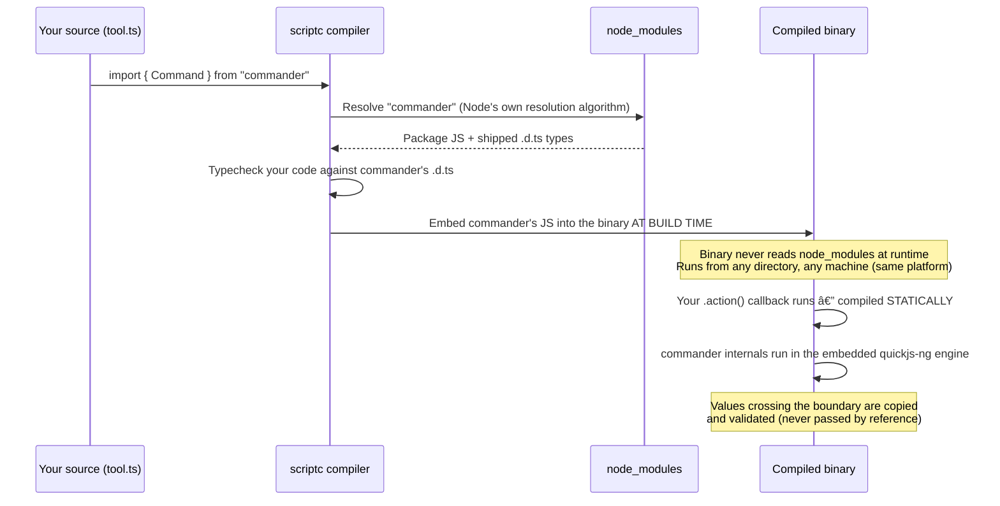
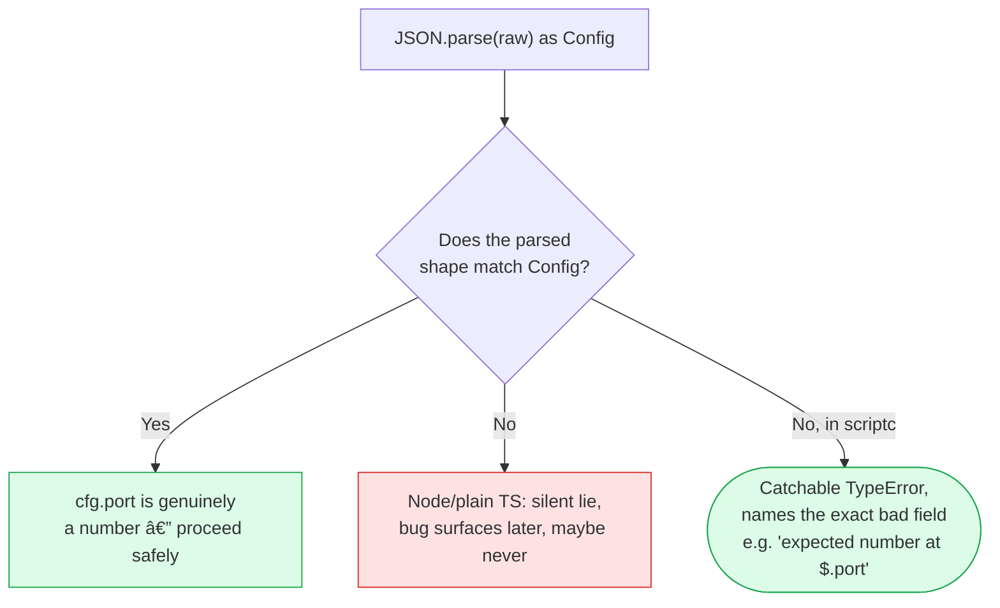
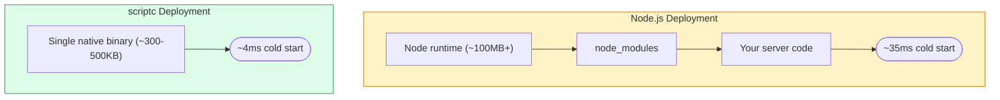
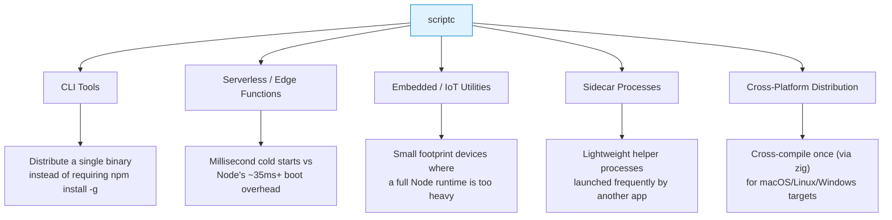
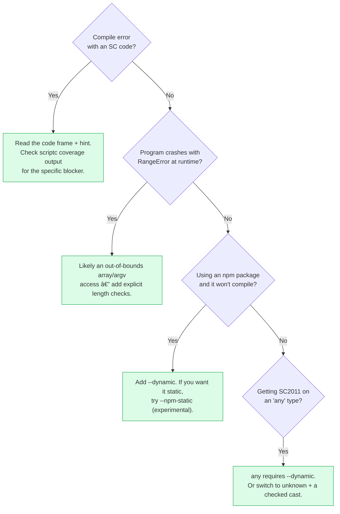

# scriptc: Compiling TypeScript to Native Executables — A Complete Tutorial

> **Difficulty Level:** Intermediate  
> **Estimated Reading Time:** 50-60 minutes  
> **Last Updated:** August 12, 2026  
> **Category:** Programming & Coding / TypeScript / Compiler / Systems  
> **Tutorial Type:** Comprehensive Deep Dive with Hands-On Exercises

---

## Table of Contents

1. [Introduction](#1-introduction)
2. [Prerequisites](#2-prerequisites)
3. [Learning Objectives](#3-learning-objectives)
4. [What Is scriptc? (The Big Picture)](#4-what-is-scriptc-the-big-picture)
5. [Why This Matters: The Problem It Solves](#5-why-this-matters-the-problem-it-solves)
6. [Core Concept: The Three Tiers](#6-core-concept-the-three-tiers)
7. [How scriptc Works Internally](#7-how-scriptc-works-internally)
8. [Installing and Running Your First Program](#8-installing-and-running-your-first-program)
9. [Understanding Coverage Reports](#9-understanding-coverage-reports)
10. [Working with npm Dependencies](#10-working-with-npm-dependencies)
11. [Checked Casts: Safe Runtime Validation](#11-checked-casts-safe-runtime-validation)
12. [comptime: Build-Time Computation](#12-comptime-build-time-computation)
13. [Building a Real HTTP Server](#13-building-a-real-http-server)
14. [Real-World Use Cases](#14-real-world-use-cases)
15. [Performance Considerations](#15-performance-considerations)
16. [Best Practices](#16-best-practices)
17. [Anti-Patterns](#17-anti-patterns)
18. [Security Considerations](#18-security-considerations)
19. [Testing Strategies](#19-testing-strategies)
20. [Migration Guide](#20-migration-guide)
21. [Divergences from Node You Must Know](#21-divergences-from-node-you-must-know)
22. [Troubleshooting & Common Pitfalls](#22-troubleshooting--common-pitfalls)
23. [Practice Exercises](#23-practice-exercises)
24. [Hands-on Labs](#24-hands-on-labs)
25. [Test Your Understanding](#25-test-your-understanding)
26. [Common Interview Questions](#26-common-interview-questions)
27. [Question Bank](#27-question-bank)
28. [Self-Assessment Checklist](#28-self-assessment-checklist)
29. [Pro Tips](#29-pro-tips)
30. [Quick Recap](#30-quick-recap)
31. [Summary & Key Takeaways](#31-summary--key-takeaways)
32. [Further Reading & Resources](#32-further-reading--resources)

---

## 1. Introduction

Welcome to the most comprehensive tutorial on **scriptc** — a compiler that transforms ordinary TypeScript into tiny, self-contained native executables. If you've ever shipped a Node CLI tool and cursed at the 100MB+ runtime, the second-long cold starts, or the "works on my machine" dependency hell, this tutorial will show you a fundamentally different way to distribute TypeScript applications.

### What Makes This Tutorial Different?

This isn't just another reference doc. You'll learn by **building real programs** — a CLI tool, a config validator, and a live HTTP server — while the compiler stays radically transparent about what runs natively and what needs a small embedded engine. Every concept is paired with runnable code, every divergence from Node is explained, and every exercise comes with a detailed solution.

### The Big Promise

> 💡 **Key Insight:** With scriptc, you write TypeScript exactly as you always have on Node — no new dialect, no annotations, no alternate standard library. The compiler classifies every construct into one of three tiers (static, dynamic, or rejected) and tells you **precisely** which tier each line of your code landed in.


### Real-World Impact

Consider the numbers from the official documentation:

| Metric | Node | scriptc |
|---|---|---|
| Startup time (hello world) | ~35ms | ~4ms |
| Binary size (hello world) | Node runtime (~100MB+) | ~320KB |
| Dependencies at runtime | Node + `node_modules` | None (static tier) |
| Example: Vercel CLI | ~120MB Node runtime + 181MB `node_modules` | Single self-contained executable |

That's a **99.7% reduction in binary size** and a **9× improvement in startup time** — meaningful at scale for cold-start-sensitive environments.

### Who Should Read This Tutorial

✅ **CLI tool authors** wanting to ship a single downloadable binary instead of requiring `npm install -g`  
✅ **Serverless/edge engineers** fighting cold-start latency  
✅ **DevOps/SRE teams** needing lightweight sidecar processes or CI/CD helpers  
✅ **TypeScript developers** curious about ahead-of-time compilation without abandoning their existing code

---

## 2. Prerequisites

Before diving in, ensure you have the following knowledge and tools.

### Required Knowledge

- ✅ **TypeScript fundamentals** — types, interfaces, generics, modules, `tsconfig.json`
- ✅ **Node.js standard library** — `process`, `fs`, `path`, `http`, `console`
- ✅ **npm ecosystem** — installing packages, `package.json`, `node_modules` resolution
- ✅ **Command line proficiency** — running compilers, moving binaries, basic shell operations
- ✅ **Basic understanding of compilation** — what "compile to machine code" means conceptually

### Required Software

```bash
# macOS (primary supported platform)
clang --version       # Preinstalled with Xcode Command Line Tools
node --version        # >= 20 (needed only to RUN the compiler, not the output)
npm --version         # Comes with Node

# Linux / Windows (cross-compilation targets)
# Cross-compile via zig — see Platform Support docs
```

> ⚠️ **Important:** The binaries scriptc *produces* need **no** Node at runtime. Node is only needed to *run the compiler itself*.

### Recommended (But Not Required)

- Basic familiarity with `http` module and building small servers
- Understanding of reference counting vs. garbage collection
- A Mac (arm64) for the smoothest first experience; Linux/Windows work via cross-compilation

### Hardware Requirements

- **200MB** free disk space (compiler + toolchain cache)
- **2GB** RAM minimum (LLVM backend can use more for large projects)

---

## 3. Learning Objectives

By the end of this tutorial, you will be able to:

1. **Explain** the three-tier classification system and why it matters for correctness
2. **Install** scriptc and compile a TypeScript program to a native binary
3. **Interpret** `scriptc coverage` reports to diagnose which code compiles statically
4. **Integrate** npm dependencies using the `--dynamic` flag and the "dynamic island"
5. **Use checked casts** (`as`) for safe runtime validation of untrusted data
6. **Leverage comptime** for build-time computation with zero runtime cost
7. **Build and deploy** a real HTTP server compiled entirely in the static tier
8. **Identify** divergences from Node behavior and write scriptc-safe code
9. **Apply best practices** for writing maximally static, performant scriptc programs
10. **Migrate** an existing Node CLI incrementally using the coverage-driven workflow
11. **Test** scriptc programs with sanitizers and differential testing strategies
12. **Evaluate** whether scriptc is the right tool for a given use case

---

## 4. What Is scriptc? (The Big Picture)

**scriptc** is a compiler that takes *ordinary TypeScript* — the exact code you already run on Node — and turns it into a small, self-contained, native executable. No Node runtime is bundled. No V8 engine sits inside the binary. There is no special dialect, no annotations to sprinkle through your code, and no alternate standard library to learn.

```
$ cat fib.ts
function fib(n: number): number {
  return n < 2 ? n : fib(n - 1) + fib(n - 2);
}
console.log(fib(30));

$ scriptc run fib.ts
832040

$ scriptc build fib.ts -o fib && ./fib
832040
```

Checking what the resulting binary actually links against confirms there's no embedded JS engine:

```
$ otool -L fib
fib:
        /usr/lib/libSystem.B.dylib (compatibility version 1.0.0, current version 1356.0.0)
```

That's it — one system library. No `node_modules`, no runtime dependency tree, no engine.

### Quick Mental Model


---

## 5. Why This Matters: The Problem It Solves

If you've ever shipped a Node CLI tool or a small service, you've probably run into some combination of these pains:

- **Startup latency** — Node has to initialize V8, parse and JIT-warm your code, and load modules before your program does anything useful.
- **Deployment size** — a "simple" CLI tool often drags along a Node runtime (~100+ MB) plus a `node_modules` folder that can balloon into hundreds of megabytes.
- **Environment drift** — "works on my machine" bugs caused by different Node versions, missing global installs, or OS-specific `node_modules` artifacts.
- **Distribution friction** — asking end users to `npm install -g` your tool means they need Node installed at a compatible version.

scriptc directly targets these problems by producing **a single native file** that a user can `chmod +x` and run, with no runtime prerequisites beyond the OS itself.

---

## 6. Core Concept: The Three Tiers

This is the single most important idea in scriptc. **Every construct in your program — every statement, every expression — is classified into exactly one of three tiers.** The compiler doesn't guess or silently degrade; it tells you, precisely, which tier each part of your code landed in.



### Tier 1 — Compiled Statically (the default)
This is native machine code with zero engine overhead. It's the only mode unless you explicitly opt out. A program that stays entirely in this tier produces **byte-identical stdout and the same exit code** as running the same file under Node (apart from a short, numbered list of documented divergences — more on that below).

### Tier 2 — Runs Dynamically (`--dynamic`)
When your code touches something inherently dynamic — an npm package's shipped JavaScript, or `any`-typed values — scriptc can embed a small JavaScript engine ([quickjs-ng](https://github.com/quickjs-ng/quickjs), ~620KB) to execute just that part. Crucially, **every value that crosses back into your static code is validated at runtime**. If a "lying" type shows up (e.g., a function typed to return a `string` actually returns a `number`), you get a catchable `TypeError` — not memory corruption.

### Tier 3 — Rejected
Anything the compiler cannot safely handle in either tier fails **at compile time**, with a specific error code, a code frame pointing at the exact line, and usually a suggested rewrite. There is no fourth outcome where your program silently does the wrong thing.

### Example: Seeing the Tiers in Action

```
$ scriptc coverage cli.ts

  statements analyzed   4
  compile statically    3  (75%)

  runs with --dynamic   2 sites (embeds a JS engine, ~620KB — static stays the default)
      ×1  importing 'picocolors' requires the embedded dynamic engine, which this build does not include — the package's implementation runs there  SC2013
      ×1  values from the 'picocolors' package run in the embedded dynamic engine, which this build does not include                                SC2013
```

Here, 3 out of 4 statements compile to pure native code. The remaining site is explained precisely: it needs `--dynamic` because it imports `picocolors`, and the report even gives you an error code (`SC2013`) you can look up.

---

## 7. How scriptc Works Internally

Understanding the pipeline helps you reason about *why* certain code compiles and other code doesn't.



### Step-by-step breakdown

1. **Frontend (typecheck + lower)** — The *real* TypeScript compiler (`tsc`) parses and type-checks your program against `es2025` (plus `@types/node` if present), respecting your `tsconfig.json`. It then lowers the checked AST into a typed IR. If a construct has no lowering rule, you get a diagnostic immediately — never a silent miscompile downstream.

2. **Typed IR** — A validated, serializable representation that sits between the frontend and the backends. You can inspect it yourself with `--emit-ir`, which writes it out as JSON. At this stage, generics are already monomorphized, unions are tagged values, and closures have explicit capture lists.

3. **Backends** — LLVM is the default backend and covers most of the supported surface. If a program needs something outside LLVM's current tier, it **transparently falls back to the C backend** (with a stderr note) — unless you pin the backend with `--backend llvm`, in which case it fails with a diagnostic instead of silently switching. The C backend is deliberately kept as a permanent, human-readable reference implementation; use `--keep-c` to retain the generated `.c` file next to your binary.

4. **Linking** — The runtime is a C library built from **link-gated feature units**. This means your binary only pays (in size) for what it actually uses: a hello-world program links nothing but `libSystem`; a program using regular expressions links the regex engine; an `http` server links the networking stack.

### Inspecting each stage yourself

```
$ scriptc build fib.ts --emit-ir
$ ls .scriptc/
fib
fib.ir.json
fib.ll

$ scriptc build fib.ts --backend c --emit-ir
$ ls .scriptc/
fib
fib.c
fib.ir.json
```

### The Runtime Model

| Runtime aspect | How scriptc implements it |
|---|---|
| **Memory management** | Reference counting; acyclic values free the instant their last reference drops. Cycles are collected at deterministic points by a cycle collector — **not** a concurrent tracing GC, so there are no GC pauses. |
| **Concurrency** | `async`/`await` runs on stackful fibers with JS-exact scheduling — microtasks and timers fire in the same order Node's do. The event loop uses `kqueue` on macOS and `epoll` on Linux, with no external dependencies. |
| **Networking** | `net`, `http`, `https`, `tls` (via vendored mbedTLS), `dgram`, `dns` are native implementations on the same event loop. |
| **Numbers** | JS-exact `f64` semantics, including shortest-roundtrip number-to-string formatting, fuzz-verified against Node's actual output. |
| **Regular expressions** | The identical ECMAScript-exact bytecode interpreter that QuickJS uses — linked only into binaries that actually use regex. |

---

## 8. Installing and Running Your First Program

### Prerequisites (Quick Check)

- **macOS arm64** is the primary supported platform today (Linux and Windows are supported as *cross-compilation* targets — see Platform Support docs).
- **clang** — comes preinstalled with the Xcode Command Line Tools.
- **Node ≥ 20** — needed to *run the compiler itself*. Note: the binaries scriptc produces need **no** Node at runtime.

### Install the CLI

```
$ npm install -g scriptc
```

Alternatively, to build from source: clone the [repository](https://github.com/vercel-labs/scriptc), run `pnpm install && pnpm build`, then use `pnpm scriptc` from inside the repo.

### Step-by-step: hello world

**Step 1 — Write ordinary TypeScript.**

```ts
// hello.ts
const who: string = process.argv.length > 2 ? process.argv[2] : "world";
console.log(`hello, ${who}`);
```

**Step 2 — Compile and run in one step (great for quick iteration):**

```
$ scriptc run hello.ts
hello, world
```

**Step 3 — Or produce a standalone executable:**

```
$ scriptc build hello.ts -o hello
$ ./hello scriptc
hello, scriptc
$ ls -la hello
-rwxr-xr-x  1 you  staff  329752  hello
```

That `hello` file is a complete, self-contained native binary. No Node, no `node_modules`, no embedded JS engine — and it starts in about 4ms, compared to Node's ~35ms for the same output.

> ⚠️ **Important gotcha to internalize immediately:** notice the `process.argv.length > 2` guard. This is not decorative. scriptc arrays are *dense* — there's no such thing as an out-of-bounds `undefined`. Reading `process.argv[2]` when no third argument was passed **traps at runtime** instead of quietly returning `undefined`. This is one of a documented, numbered set of deliberate divergences from Node behavior (see the [Divergences section](#21-divergences-from-node-you-must-know) below).



#### ✅ Try It Yourself

Create `hello.ts` with the code above and run:

```bash
scriptc run hello.ts
scriptc build hello.ts -o hello && ./hello scriptc
```

---

## 9. Understanding Coverage Reports

Before you ship anything, you should know exactly how "static" your program is. The `scriptc coverage` command answers that question precisely, statement by statement.

```
$ scriptc coverage hello.ts

  statements analyzed   2
  compile statically    2  (100%)

  fully static — this program has no dynamic remainder.
```

For programs with npm imports or `any` types, the report names **every** dynamic site and **every** blocker, each with a lookup-able error code (e.g. `SC2013`, `SC2020`). This turns "why doesn't this compile statically?" from a guessing game into a checklist you can work through mechanically.

### Why this matters in practice

Imagine you're evaluating whether to migrate an existing CLI tool to scriptc. Instead of trial-and-error compiling and reading cryptic errors, you run `scriptc coverage` on day one and get an itemized report of exactly which lines need attention and why. That's a fundamentally different (and much faster) porting workflow than most cross-compilation tools offer.

### Coverage Error Code Reference

| Code | Meaning | Typical Cause | Fix |
|------|---------|---------------|-----|
| `SC2011` | `any` type used without `--dynamic` | `JSON.parse(...) as T` returns `any` | Use `--dynamic` or add explicit validation |
| `SC2013` | Import resolves to JS without `.d.ts` | npm package has no types | Use `--dynamic` or `--npm-static <pkg>` |
| `SC2020` | Runtime `eval()` or `Function()` | Dynamic code generation | Refactor to static dispatch or use `--dynamic` |

---

## 10. Working with npm Dependencies

Real-world programs use packages. npm packages are, from scriptc's point of view, the "dynamic frontier": their published JavaScript is untyped at the source level (types come from `.d.ts` files, not the actual runtime code), often minified, and written assuming a V8-shaped engine. scriptc's answer is the **dynamic island** — an embedded copy of quickjs-ng that runs *only* the dependency code, opted into via the `--dynamic` flag.

### Example: using a real CLI framework

```ts
// tool.ts
import { Command } from "commander";

const program = new Command();

program
  .name("greet")
  .argument("<name>", "who to greet")
  .option("-u, --upper", "shout it")
  .action((name: string, opts: { upper?: boolean }) => {
    const text = `hello, ${name}`;
    console.log(opts.upper ? text.toUpperCase() : text);
  });

program.parse();
```

```
$ npm install commander
$ scriptc build tool.ts --dynamic -o greet
$ ./greet ada --upper
HELLO, ADA
```

### What actually happens, step by step



1. **Resolution** — `commander` resolves via Node's own module resolution algorithm from `node_modules`, respecting `package.json` `exports` conditions.
2. **Types** — the package's shipped `.d.ts` file becomes the type surface your code checks against — exactly like a normal Node/TypeScript project.
3. **Embedding** — the package's JavaScript (and everything it transitively imports) gets baked into the binary **at build time**. The resulting executable never touches `node_modules` at runtime.
4. **Execution** — the embedded code runs inside quickjs-ng with full, real JavaScript semantics — it's the actual `commander` library, unmodified.
5. **The boundary** — values cross by copy, never by reference. If a package hands your typed callback a value that doesn't match its declared type (e.g., something other than a `string` for a `name: string` parameter), that's a catchable `TypeError`, never memory corruption.

Notice: your `.action()` callback body itself still compiles **statically** — only the parts that genuinely need dynamic JS semantics (the `commander` library internals) run in the island.

### The island's real characteristics

| Aspect | What it means for you |
|---|---|
| **Engine identity** | It's quickjs-ng, not V8. Embedded code is *correct* but slower than Node for CPU-heavy work. The win is startup time, binary size, and deployment simplicity — not raw dependency throughput. |
| **Node builtins** | Package code that needs `node:events`, `node:path`, `node:process`, etc. gets faithful shim implementations. The coverage report names every builtin reached — nothing is silently stubbed. |
| **Boundary semantics** | Values are copied across the boundary, not aliased — where JS would share a reference, scriptc copies (a documented divergence). |
| **`any`-typed code** | Also runs in the island under `--dynamic`, with full JS semantics, and every `any → static` transition is validated. |
| **Engine lifecycle** | One engine per process, created lazily on first use. A `--dynamic` build that never actually touches dynamic code at runtime emits the same output as a static build. |

### Experimental: taking packages OUT of the island

- **`--npm-static <pkg[,pkg…]|auto>`** — asks the compiler to compile a named package's shipped JS *statically* rather than in the island, informed by that package's own `.d.ts`. Sites the static compiler can't handle are *deferred*: the build still succeeds, but hitting a deferred site at runtime is a specific error. This is experimental and coverage is partial but real.
- **`--provenance-sources`** — for packages published with npm provenance attestations, fetches the actual **TypeScript source** at the attested commit and compiles *that*, instead of the shipped/minified JS. Packages without a usable attestation just fall back to the island path with a note.

### Real-world scale test

The team's benchmark for "does this actually work on real software" is the published **Vercel CLI** — compiled unmodified, straight off the npm registry, with `--dynamic`, into a single self-contained executable that runs its real workflows. That replaces roughly a 120MB Node runtime plus 181MB of `node_modules` with one binary.

---

## 11. Checked Casts: Safe Runtime Validation

TypeScript's `as` keyword is famously a *lie you tell the compiler* — it doesn't actually verify anything at runtime. `JSON.parse(...) as Config` in ordinary TypeScript will happily hand you garbage if the JSON doesn't actually match `Config`.

scriptc treats `as` as a **promise it will verify**. A checked cast inserts real runtime validation that throws a precise, catchable error naming exactly which field failed.

```ts
// cast.ts
type Config = { port: number };
try {
  const cfg = JSON.parse('{"port": "eighty"}') as Config;
  console.log(cfg.port);
} catch (e) {
  if (e instanceof Error) console.log(`caught: ${e.message}`);
}
```

```
$ scriptc run cast.ts
caught: expected number at $.port, got string
```

### Why this is a big deal

In plain Node/V8, that same code would silently assign the string `"eighty"` to a variable typed as `number`, and the bug would surface much later — maybe as a corrupted calculation, maybe as a crash three function calls downstream, maybe never (silently wrong output). scriptc converts a **type-system lie into a catchable exception at the exact point of the lie.**



### Checked cast syntax reference

| Syntax | Behavior |
|--------|----------|
| `value as T` | Validates `value` at runtime against type `T`. Throws `TypeError` on mismatch. |
| `value as T \| null` | Allows `null` in addition to `T`. Throws only on other mismatches. |
| `value as T \| undefined` | Allows `undefined` in addition to `T`. |

**Use case:** this is invaluable for any program that ingests untrusted or loosely-specified external data — config files, API responses, CLI-provided JSON, environment-derived structures — where you want type safety to mean something at runtime, not just at compile time.

> 💡 **Pro Tip:** Wrap external data ingestion in try/catch and report the exact field path from the error message to the user. This gives end-users actionable feedback rather than a stack trace.

---

## 12. comptime: Build-Time Computation

`comptime(() => ...)` runs a block of TypeScript **during compilation** — inside an isolated VM inside the compiler itself — and bakes the resulting value into the binary as a literal constant.

```ts
// banner.ts
const build = comptime(() => `built ${new Date().toISOString().slice(0, 10)}`);
console.log(build);
```

```
$ scriptc run banner.ts
built 2026-07-22
```

### Practical uses for comptime

- Embedding a build date or git commit hash directly into a binary with zero runtime cost.
- Precomputing lookup tables, constant configuration, or derived data that would otherwise be recalculated every run.
- Generating version strings, feature flags resolved at build time, or environment-specific constants baked into different binary builds.


### comptime limitations

The `comptime` function must be **pure** — it cannot reference external mutable state, perform I/O, or import `node:` modules. This is by design: the compiler must be able to reproduce the result deterministically. If you need non-deterministic data (e.g., a live API key), that's a runtime concern, not a comptime concern.

---

## 13. Building a Real HTTP Server

One of the more striking claims in the docs is that scriptc's static tier covers Node's actual server stack — not a toy subset.

```ts
// server.ts
import { createServer } from "node:http";

const server = createServer((req, res) => {
  res.setHeader("content-type", "application/json");
  res.end(JSON.stringify({ path: req.url, pid: process.pid }));
});

server.listen(8080, () => {
  console.log("listening on http://localhost:8080");
});
```

```
$ scriptc build server.ts -o server && ./server &
listening on http://localhost:8080
$ curl -s http://localhost:8080/status
{"path":"/status","pid":90126}
```

This compiles **entirely in the static tier** — no embedded JS engine required — because `http`, `net`, `https`, `tls`, `dgram`, `dns`, and `readline` are all part of scriptc's native, statically-compiled standard library surface.

### Use case: a lightweight microservice

Imagine deploying a small internal JSON API to dozens of edge locations or containers. With Node, each instance carries the full Node runtime and boot overhead. With scriptc, each instance is a ~300–500KB binary that starts in single-digit milliseconds — meaningful at scale for cold-start-sensitive environments (serverless functions, edge compute, CLI daemons spawned frequently).



---

## 14. Real-World Use Cases



### 1. Command-line tools you distribute to others
Instead of asking users to `npm install -g yourtool` (which requires them to have a compatible Node version), you ship a single executable. `scriptc build tool.ts -o tool` produces something a user can download and run immediately.

### 2. Cold-start-sensitive serverless/edge functions
Environments that bill or measure by cold-start latency benefit directly from a ~4ms startup versus Node's ~35ms — that gap compounds at scale.

### 3. CI/CD and dev-tooling scripts
Scripts invoked hundreds of times during a build pipeline (linters, codegen tools, formatters) accumulate real wall-clock time from Node's per-invocation startup cost. Native binaries shave that off entirely.

### 4. Migrating existing Node CLIs incrementally
Because scriptc compiles *unmodified* TypeScript and gives you a precise coverage report, you can point it at an existing tool, see exactly what doesn't compile statically yet, and decide whether `--dynamic` (for its npm dependencies) gets you a fully working binary today.

### 5. Config/data validation utilities
The checked-cast mechanism (`JSON.parse(...) as Shape`) makes scriptc a strong fit for small tools that validate configuration files, environment variables, or API payloads and need to fail loudly and precisely on malformed input.

---

## 15. Performance Considerations

### Startup time

The most immediately noticeable gain is **startup latency**. A `hello world` scriptc binary starts in ~4ms versus Node's ~35ms. For a CLI tool invoked in a loop (e.g., a linter running over 500 files), this saves roughly **17 seconds of pure startup overhead**.

### Binary size

The link-gated feature system means your binary grows only with features you actually use:

| Feature Used | Approximate Binary Size |
|---|---|
| Hello world (no imports) | ~320KB |
| RegEx (`RegExp`) | ~340KB |
| HTTP server (`node:http`) | ~380-500KB |
| `--dynamic` (npm deps) | +~620KB engine |
| TLS (`node:https`/`node:tls`) | +~100KB |

### Memory usage

scriptc uses **reference counting** with a deterministic cycle collector — not a concurrent tracing GC. This means:
- **No GC pauses** — memory is freed the instant the last reference drops (for acyclic values)
- **Predictable memory profile** — easier to reason about in resource-constrained environments
- **Trade-off:** reference counting adds a small per-access overhead, but this is negligible compared to the elimination of GC warmup pauses

### Throughput

For pure-compute workloads, scriptc's LLVM-compiled static tier is typically **2-3× faster** than Node's JIT for arithmetic-heavy loops. However, for workloads dominated by I/O or by the embedded dynamic engine (running npm packages), the advantage narrows. The sweet spot is: **static code doing logic + I/O**, not CPU-bound npm dependencies.

> ⚠️ **Don't use scriptc for:** CPU-bound npm packages that do heavy computation in JavaScript (those run inside the ~620KB quickjs-ng engine, which is *correct* but *slower* than V8). Use it for programs where the **startup time** or **binary size** dominates, or where your own logic (not dependencies) does the heavy lifting.

---

## 16. Best Practices

### 1. Maximize static-tier coverage
Run `scriptc coverage` early and often. The higher your static percentage, the smaller and faster your binary. Strive for 80%+ static coverage; anything below 50% probably isn't worth compiling.

### 2. Make array bounds explicit
Always guard array access with explicit length checks instead of relying on `undefined`:

```ts
// ❌ Will trap if argv[2] doesn't exist
const who = process.argv[2] ?? "world";

// ✅ Explicit length check
const who = process.argv.length > 2 ? process.argv[2] : "world";
```

### 3. Validate external data with checked casts
Never `JSON.parse(...) as Config` and assume it's correct. Always wrap in try/catch and surface the exact error:

```ts
try {
  const cfg = JSON.parse(process.argv[2]!) as Config;
  await run(cfg);
} catch (e) {
  if (e instanceof Error) {
    console.error(`Config error: ${e.message}`);
    process.exit(1);
  }
}
```

### 4. Use `--dynamic` sparingly
Only enable `--dynamic` when you genuinely need npm packages or `any`-typed values. Each dynamic site adds the ~620KB engine to your binary even if only one line needs it.

### 5. Leverage `comptime` for build metadata
Bake build info at compile time rather than resolving it at runtime:

```ts
const BUILD_INFO = comptime(() => {
  return { version: "1.2.3", built: new Date().toISOString().slice(0, 10) };
});
```

### 6. Inspect the pipeline when debugging
Use `--emit-ir` to see the typed IR, `--backend c --keep-c` to inspect generated C, and `--sanitize` to catch memory issues:

```bash
scriptc build mytool.ts --emit-ir --keep-c --sanitize -o mytool
```

### 7. Pin the backend in CI
If you rely on LLVM-specific behavior, pin the backend in your build:

```bash
scriptc build tool.ts --backend llvm -o tool
```

This prevents silent fallback to the C backend if the code's requirements change.

---

## 17. Anti-Patterns

### Anti-Pattern 1: Relying on `undefined` from out-of-bounds access

**The JS habit:** In Node, `arr[i]` where `i` is out of bounds returns `undefined`, and you chain on it with `??` or optional chaining.

**Why it fails in scriptc:** scriptc arrays are dense. Out-of-bounds access throws a `RangeError` that **aborts the process** — it cannot be caught with `try/catch`.

```ts
// ❌ This will crash the entire process in scriptc
const args = process.argv.slice(2);
for (let i = 0; i < args.length + 5; i++) {
  console.log(args[i].toUpperCase()); // RangeError on i >= args.length
}
```

**The fix:** Always iterate within bounds:

```ts
// ✅ Safe in scriptc
const args = process.argv.slice(2);
for (const arg of args) {
  console.log(arg.toUpperCase());
}
```

### Anti-Pattern 2: Treating `as` as a type assertion only

**The JS habit:** `JSON.parse(...) as Config` is used as a "trust me" assertion — no runtime checking.

**Why it fails in scriptc:** scriptc makes `as` a **checked cast**. If the data doesn't match, you get a `TypeError` — which is the whole point, but it surprises developers who expect silent lies.

**The fix:** Embrace it. Wrap in try/catch:

```ts
// ✅ Expect and handle the validation
try {
  const cfg = JSON.parse(input) as Config;
  await run(cfg);
} catch (e) {
  if (e instanceof TypeError) {
    console.error(`Invalid config: ${e.message}`);
    process.exit(1);
  }
  throw e;
}
```

### Anti-Pattern 3: Spreading npm dependencies everywhere

**The JS habit:** Importing packages freely because they're "just JavaScript."

**Why it's problematic in scriptc:** Every npm import that needs `--dynamic` pulls in the ~620KB engine. If your program has 5 such imports, you still only pay ~620KB once (the engine is shared), but you've lost the startup-time and size advantages that make scriptc worth using.

**The fix:** Audit with `scriptc coverage`. If you're pulling in heavy npm stacks, ask whether you really need them or whether scriptc's native stdlib already covers the functionality.

### Anti-Pattern 4: Ignoring the coverage report

**The JS habit:** Iterate by compiling and fixing whatever errors come up.

**Why it's problematic in scriptc:** The coverage report tells you *exactly* which lines are static vs dynamic vs rejected — use it as a design tool, not just a debugging tool. Ignoring it means you don't know what tier your code is actually running in.

---

## 18. Security Considerations

### 1. Supply Chain: The Dynamic Island Boundary

When you use `--dynamic` with npm packages, you're embedding untrusted JavaScript into your binary. The good news: scriptc's boundary validation means a misbehaving package **cannot corrupt your static code's memory** — at worst, you get a catchable `TypeError` at the boundary. But the package can still do all the things it's allowed to do (read files, make network requests, exfiltrate data) within the quickjs-ng sandbox.

**Best practice:** Audit your npm dependencies. Use `--npm-static` (experimental) for packages you trust and that scriptc can compile statically, reserving the dynamic island only for packages that absolutely require it.

### 2. Binary Integrity & Distribution

Because scriptc produces a single native binary with no `node_modules` at runtime, your distribution surface area shrinks dramatically. A user can't accidentally `npm install` a malicious package into your tool's dependency tree at runtime. However, the responsibility for **binary signing and distribution integrity** shifts entirely to you.

**Best practice:** Sign your binaries (e.g., `codesign` on macOS, `sigstore` on Linux) and verify signatures before execution in production environments.

### 3. Checked Casts as Attack Surface Reduction

The checked cast mechanism (`as`) is a security feature in disguise. By validating external data at the point of ingestion, you eliminate an entire class of injection and type-confusion bugs. A malformed config file that would silently corrupt a plain Node program throws a precise, localized error in scriptc.

**Best practice:** Treat every `JSON.parse(...) as Shape` as a potential attack surface boundary. Validate aggressively.

### 4. Sandbox Limitations

> ⚠️ **The dynamic island is a JavaScript engine, not a security sandbox.** A malicious npm package embedded via `--dynamic` can still read local files and make outbound network requests. Do not rely on scriptc's dynamic engine for isolation of untrusted code.

### 5. Memory Safety

scriptc's static tier is compiled to native code via LLVM, meaning buffer overflows and use-after-free bugs in your compiled logic are structurally impossible (the compiler enforces bounds). The dynamic island (quickjs-ng) has its own memory safety model. Additionally, you can run `--sanitize` to add AddressSanitizer instrumentation for extra confidence.

---

## 19. Testing Strategies

### 1. Differential Testing (Built into the Compiler)

scriptc's entire test corpus is validated by running each program **both under real Node and as a compiled scriptc binary**, then comparing `stdout`, `stderr`, and exit codes byte-for-byte. This is the gold standard — if your program diverges, the difference is caught.

You can run this locally against your own programs:

```bash
# Compare Node output vs scriptc output
node mytool.js arg1 arg2 > node.out 2>&1; echo $? > node.exit
scriptc run mytool.ts arg1 arg2 > sc.out 2>&1; echo $? > sc.exit
diff <(cat node.out) <(cat sc.out)  # Should be empty
diff <(cat node.exit) <(cat sc.exit)  # Should be empty
```

### 2. Memory Safety with `--sanitize`

```
$ scriptc build mytool.ts --sanitize -o mytool
$ ./mytool
```

This links AddressSanitizer into your binary, catching use-after-free, buffer overflows, and reference-count leaks during execution. This is especially valuable for programs with complex `async` flows or long-lived data structures.

### 3. Coverage-Driven Testing

Use `scriptc coverage` as a test-orchestration tool:

```bash
# Before each CI run, check that your program is fully static:
scriptc coverage mytool.ts | grep "fully static" || {
  echo "WARNING: program has dynamic remainder — review before deploying"
}
```

You can also use the SC error codes to create targeted test cases. For example, if you get `SC2011` on an `any` type, write a unit test that validates the actual runtime shape of that data.

### 4. Regression Testing Across Backends

If your program uses features that might fall back from LLVM to the C backend, test both:

```bash
scriptc build mytool.ts --backend llvm -o mytool-llvm
scriptc build mytool.ts --backend c -o mytool-c
./mytool-llvm input | ./mytool-c input  # Should produce identical output
```

### 5. Boundary Testing for Dynamic Islands

If you use `--dynamic`, test the boundary explicitly: write test cases where npm packages return unexpected types (e.g., `null`, wrong field names, extra fields) and verify your checked casts catch them.

---

## 20. Migration Guide

### Scenario: Porting an Existing Node CLI to scriptc

The recommended workflow is **coverage-driven and incremental**:

#### Step 1: Baseline with Coverage

```bash
$ scriptc coverage mycli.ts

  statements analyzed   127
  compile statically    83  (65%)

  runs with --dynamic   3 sites (embeds a JS engine, ~620KB)
      ×3  importing npm packages: chalk, commander, dotenv
```

This tells you immediately: your own code is 65% static, and the 35% that's dynamic is entirely due to 3 npm packages.

#### Step 2: Decide on a Strategy

- **Strategy A (Quick win):** Add `--dynamic` and ship immediately. You get a single binary with no runtime Node dependency, at the cost of a ~620KB engine for those 3 packages.

```bash
scriptc build mycli.ts --dynamic -o mycli
```

- **Strategy B (Maximize static-ness):** Try compiling the packages statically:

```bash
scriptc build mycli.ts --dynamic --npm-static chalk,commander,dotenv -o mycli
```

Review the output — packages scriptc can't statically compile will defer to the dynamic island automatically.

#### Step 3: Iterate on Divergences

Run your full test suite against the compiled binary. Any failures will correspond to documented divergences (dense arrays, `undefined`-from-out-of-bounds, etc.). Fix those in your source code.

#### Step 4: Lock It Down

```bash
# Pin the backend and enable sanitizers for final validation
scriptc build mycli.ts --dynamic --backend llvm --sanitize -o mycli
```

#### Migration Checklist

- [ ] `scriptc coverage` ran and shows acceptable static ratio
- [ ] `--dynamic` resolves all npm import errors
- [ ] Full test suite passes against the compiled binary
- [ ] All array accesses have explicit bounds checks
- [ ] All external data validated with checked casts
- [ ] `--sanitize` run clean with no leaks
- [ ] Binary tested on target deployment platforms

---

## 21. Divergences from Node You Must Know

These aren't bugs — they're deliberate design decisions, each pinned by the differential test suite. But they will bite you if you don't know about them going in.

| Divergence | Node behavior | scriptc behavior | Why it matters |
|---|---|---|---|
| **Dense arrays** | Out-of-bounds read → `undefined` | Out-of-bounds read → `RangeError`, process aborts | `arr[i] ?? fallback` habits break; use explicit length checks |
| **Runtime traps** | Some failures throw catchable exceptions | Hard-trap set (array violations, etc.) aborts the process — not catchable | You cannot `try/catch` your way out of an out-of-bounds trap |
| **Lying casts** | Silently hands you the wrong shape | `as Config` on bad data throws a catchable, precise error | Actually the whole *point* — safety, not a limitation |
| **Structural subtyping** | Passing a wider object aliases the original | Copies the value — mutations through the narrower reference don't affect the original | Relying on shared mutation across a type-narrowing boundary won't work |
| **Object key order** | Per-object insertion order | Record's *declaration order* (identical in the common case) | Only matters if you build objects out of declaration order dynamically |
| **String storage** | UTF-16 internally | UTF-8 internally (methods still compute UTF-16-exact `.length` etc.) | Relational comparison (`<`, `>`) uses code-point order instead |
| **Date parsing** | Broad, V8-specific parsing | Bounded to ECMAScript date forms + explicit offsets | Some V8-specific date strings and offset-less local date-times become `Invalid Date` |
| **Uncaught exceptions** | Full Node stack-trace block | `Uncaught <value>` one-liner (same exit code, same pre-throw stdout) | Log parsing/tooling that expects Node's stack format needs adjusting |
| **Sort stability** | TimSort | Stable insertion sort | Results are byte-identical for well-behaved (consistent) comparators |
| **`localeCompare`** | ICU collation | Code-unit comparison | Locale-sensitive sorting will differ for non-ASCII text |

### The array-bounds example, in practice

```ts
// ❌ JS/Node habit — traps in scriptc if argv[2] doesn't exist:
const who = process.argv[2] ?? "world";

// ✅ scriptc-safe — the length check is explicit rather than implied:
const who = process.argv.length > 2 ? process.argv[2] : "world";
```

**Rule of thumb:** anywhere your JavaScript instincts lean on `undefined` appearing "for free" from an out-of-bounds access, scriptc wants you to make that check explicit instead.

---

## 22. Troubleshooting & Common Pitfalls



**"My package won't compile at all."**
Run `scriptc coverage yourfile.ts` first. It will tell you precisely which import or expression needs `--dynamic`, with an error code you can cross-reference.

**"I got `SC2011` on an `any` type."**
`any` without `--dynamic` is a compile error by design — scriptc wants dynamic-shaped values to run somewhere that can actually validate them. Either switch to `unknown` plus an explicit checked cast, or opt into `--dynamic`.

**"My tuple/array method isn't compiling."**
Watch for TypeScript inferring a *tuple* type where you meant a plain array — e.g. `Promise.all([a, b, c])` infers a tuple. Type the array explicitly first:
```ts
const jobs: Promise<number>[] = [work(1), work(2), work(3)];
const results = await Promise.all(jobs); // number[] — compiles
```

**"`scriptc run` isn't passing my extra CLI arguments."**
`scriptc run` doesn't forward extra arguments to the program. Use `scriptc build` and invoke the resulting binary directly.

---


## 23. Practice Exercises

### Exercise 1: Fibonacci CLI with Explicit Bounds

**Difficulty:** Easy  
**Time:** 15 minutes

**Objective:** Build a CLI tool that computes the nth Fibonacci number, safely handling the case where the user doesn't provide an argument. Apply the scriptc-safe array bounds pattern.

**Requirements:**
1. Accept a number `n` as the first CLI argument
2. If no argument is provided, default to `n = 10`
3. Compute `fib(n)` recursively
4. Print the result
5. Use `process.argv.length > 2` for safe argument access (don't just index `argv[2]`)

**Starter Code:**
```ts
// fib-cli.ts
// TODO: Implement safely
```

**Solution:**
```ts
// fib-cli.ts
function fib(n: number): number {
  return n < 2 ? n : fib(n - 1) + fib(n - 2);
}

// ✅ scriptc-safe: explicit length check instead of trusting undefined
const n: number = process.argv.length > 2 ? parseInt(process.argv[2], 10) : 10;

console.log(`fib(${n}) = ${fib(n)}`);
```

**Verification:**
```bash
scriptc build fib-cli.ts -o fib-cli
./fib-cli        # fib(10) = 55
./fib-cli 30     # fib(30) = 832040
```

**Key Concepts Learned:**
- Safe CLI argument access using `process.argv.length > 2`
- Recursive function compilation in the static tier
- Building a standalone CLI binary

---

### Exercise 2: Safe Config Validator with Checked Casts

**Difficulty:** Intermediate  
**Time:** 25 minutes

**Objective:** Build a tool that reads a JSON config file, validates its structure using checked casts, and starts a server if validation passes. Handle invalid input gracefully.

**Requirements:**
1. Read a JSON file path from CLI arguments (safe bounds check)
2. Read and parse the JSON file
3. Validate it matches a `Config` type using a checked cast (`as Config`)
4. If validation fails, print a helpful error and exit with code 1
5. If validation passes, print "Config valid" and the port number

**`Config` type:**
```ts
type Config = {
  port: number;
  host: string;
  workers: number;
};
```

**Starter Code:**
```ts
// validate-config.ts
import { readFileSync } from "node:fs";

type Config = { port: number; host: string; workers: number };

// TODO: Read file path safely, parse JSON, validate with checked cast
```

**Solution:**
```ts
// validate-config.ts
import { readFileSync } from "node:fs";

type Config = { port: number; host: string; workers: number };

// ✅ Safe: explicit bounds check
const filePath: string =
  process.argv.length > 2 ? process.argv[2] : "config.json";

try {
  const raw: string = readFileSync(filePath, "utf-8");
  // ✅ Checked cast: throws TypeError if shape doesn't match
  const cfg = JSON.parse(raw) as Config;

  // Additional validation
  if (cfg.port < 1 || cfg.port > 65535) {
    console.error(`Invalid port: ${cfg.port}. Must be 1-65535.`);
    process.exit(1);
  }
  if (cfg.workers < 1) {
    console.error(`Invalid workers: ${cfg.workers}. Must be >= 1.`);
    process.exit(1);
  }

  console.log(`Config valid — host=${cfg.host}, port=${cfg.port}, workers=${cfg.workers}`);
} catch (e) {
  if (e instanceof Error) {
    console.error(`Config error: ${e.message}`);
  }
  process.exit(1);
}
```

**Test Data:**
```bash
# Valid config
echo '{"port": 8080, "host": "0.0.0.0", "workers": 4}' > good-config.json

# Invalid config (wrong types)
echo '{"port": "eighty", "host": "0.0.0.0", "workers": 4}' > bad-config.json

# Missing field
echo '{"port": 8080, "host": "0.0.0.0"}' > incomplete-config.json

scriptc build validate-config.ts -o validate-config
./validate-config good-config.json
# Config valid — host=0.0.0.0, port=8080, workers=4

./validate-config bad-config.json
# Config error: expected number at $.port, got string

./validate-config incomplete-config.json
# Config error: expected number at $.workers, got undefined
```

**Key Concepts Learned:**
- Checked casts for runtime type validation
- Error handling with `try/catch` and `instanceof Error`
- File I/O with `node:fs` (compiles statically)
- User-facing error messages with field paths

---

### Exercise 3: comptime Banner + HTTP Server

**Difficulty:** Advanced  
**Time:** 30 minutes

**Objective:** Build an HTTP server that embeds build-time metadata using `comptime`, and serves a JSON endpoint with that metadata alongside request info. This exercises both `comptime` and the static HTTP stack.

**Requirements:**
1. Use `comptime` to embed a build date and a version constant
2. Create an HTTP server that responds to `/health` with `"ok"`
3. Create an endpoint `/buildinfo` that returns the comptime data as JSON
4. Create an endpoint `/` that returns the request URL and process PID
5. The entire program must compile in the static tier (no `--dynamic`)

**Starter Code:**
```ts
// meta-server.ts
// TODO: Use comptime for build metadata, serve HTTP endpoints
```

**Solution:**
```ts
// meta-server.ts
import { createServer } from "node:http";

// ✅ comptime: runs once at compile time, result baked in
const BUILD_META = comptime(() => ({
  version: "2.1.0",
  built: new Date().toISOString().slice(0, 10),
  commit: "a1b2c3d",
}));

const PORT = 8080;

const server = createServer((req, res) => {
  res.setHeader("content-type", "application/json");

  if (req.url === "/health") {
    res.end(JSON.stringify({ status: "ok" }));
    return;
  }

  if (req.url === "/buildinfo") {
    // BUILD_META is a literal constant — zero runtime cost
    res.end(JSON.stringify(BUILD_META));
    return;
  }

  // Default: echo request info
  res.end(JSON.stringify({ path: req.url, pid: process.pid }));
});

server.listen(PORT, () => {
  console.log(`meta-server v${BUILD_META.version} listening on http://localhost:${PORT}`);
});
```

**Verification:**
```bash
scriptc build meta-server.ts -o meta-server
# Should compile 100% static (no --dynamic needed)

./meta-server &  # Run in background
curl -s http://localhost:8080/health
# {"status":"ok"}
curl -s http://localhost:8080/buildinfo
# {"version":"2.1.0","built":"2026-08-12","commit":"a1b2c3d"}
curl -s http://localhost:8080/status
# {"path":"/status","pid":12345}
```

**Key Concepts Learned:**
- `comptime` for zero-cost build-time constants
- Static HTTP server with `node:http`
- Routing based on `req.url`
- Pure static-tier compilation (verify with `scriptc coverage`)

---

## 24. Hands-on Labs

### Lab: Build a JSON Config Validator CLI

This lab combines everything you've learned: safe argument handling, checked casts, file I/O, and native compilation.

**Scenario:** You're building a deployment tool. Before deploying, your CI pipeline needs to validate that a project's `deploy.json` config file has the correct structure.

#### Step 1: Define the Config Schema

```ts
type DeployConfig = {
  app: string;
  port: number;
  env: "staging" | "production";
  replicas?: number;  // optional, defaults to 1
};
```

#### Step 2: Read and Validate

```ts
// deploy-validate.ts
import { readFileSync } from "node:fs";

type DeployConfig = {
  app: string;
  port: number;
  env: "staging" | "production";
  replicas?: number;
};

const configPath =
  process.argv.length > 2 ? process.argv[2] : "deploy.json";

try {
  const raw = readFileSync(configPath, "utf-8");
  const config = JSON.parse(raw) as DeployConfig;

  // Validate the literal union type
  if (config.env !== "staging" && config.env !== "production") {
    throw new TypeError(`Invalid env: "${config.env}". Must be "staging" or "production".`);
  }

  // Apply defaults
  const replicas = config.replicas ?? 1;

  console.log(`✅ Valid config for "${config.app}"`);
  console.log(`   Port: ${config.port}`);
  console.log(`   Environment: ${config.env}`);
  console.log(`   Replicas: ${replicas}`);
} catch (e) {
  if (e instanceof Error) {
    console.error(`❌ Config validation failed: ${e.message}`);
    process.exit(1);
  }
  throw e;
}
```

#### Step 3: Test with Multiple Inputs

```bash
# Valid config
cat > valid-deploy.json << 'EOF'
{ "app": "api", "port": 3000, "env": "production", "replicas": 3 }
EOF

# Invalid: wrong env type
cat > invalid-deploy.json << 'EOF'
{ "app": "api", "port": 3000, "env": "dev" }
EOF

# Invalid: port is string
cat > wrong-type-deploy.json << 'EOF'
{ "app": "api", "port": "3000", "env": "staging" }
EOF

scriptc build deploy-validate.ts -o deploy-validate
./deploy-validate valid-deploy.json
./deploy-validate invalid-deploy.json
./deploy-validate wrong-type-deploy.json
```

#### Step 4: Compile to Native and Verify

```bash
# Check coverage — should be 100% static
scriptc coverage deploy-validate.ts

# Build the standalone binary
scriptc build deploy-validate.ts -o deploy-validate

# Test the binary works without Node installed
./deploy-validate valid-deploy.json
```

#### Expected Output

```
✅ Valid config for "api"
   Port: 3000
   Environment: production
   Replicas: 3
```

**Lab Deliverables:**
- ✅ TypeScript source that compiles 100% statically
- ✅ Handles missing config path gracefully
- ✅ Validates config structure with checked casts
- ✅ Validates literal union types (`"staging" | "production"`)
- ✅ Produces a standalone native binary
- ✅ Verified with `scriptc coverage` (100% static)

---

## 25. Test Your Understanding

### Questions

1. **What is the core value proposition of scriptc in one sentence?**
   <details>
   <summary>Answer</summary>
   scriptc compiles ordinary TypeScript into tiny (~320KB), self-contained native executables with no Node runtime, no V8 engine, and no runtime dependencies — just a native binary that starts in ~4ms.
   </details>

2. **How many tiers does scriptc's classification system have, and what are they?**
   <details>
   <summary>Answer</summary>
   Three tiers: Tier 1 (Compiled Statically — native code, no engine), Tier 2 (Runs Dynamically — embedded quickjs-ng engine for npm deps/any types), and Tier 3 (Rejected — compile-time error).
   </details>

3. **What is the key difference between a checked cast (`as`) in scriptc vs plain TypeScript?**
   <details>
   <summary>Answer</summary>
   In plain TypeScript, `as` is a compile-time-only assertion that does nothing at runtime. In scriptc, `as` inserts real runtime validation that throws a catchable `TypeError` with the exact field path if the value doesn't match the declared type.
   </details>

4. **Why must you use `process.argv.length > 2` instead of `process.argv[2] ?? "default"` in scriptc?**
   <details>
   <summary>Answer</summary>
   scriptc arrays are dense — there's no such thing as an out-of-bounds `undefined`. Accessing an out-of-bounds index throws a `RangeError` that aborts the process (not catchable). Checking `.length > 2` first ensures the index is valid.
   </details>

5. **What does `scriptc coverage` tell you, and why is it important?**
   <details>
   <summary>Answer</summary>
   It tells you, statement by statement, how much of your code compiles statically (Tier 1) vs. needs the dynamic engine (Tier 2) vs. is rejected (Tier 3). This lets you make informed decisions about whether to use `--dynamic` and which dependencies are pulling in the engine.
   </details>

6. **What is the "dynamic island" and when is it activated?**
   <details>
   <summary>Answer</summary>
   The dynamic island is the embedded quickjs-ng JavaScript engine (~620KB) that runs npm package code and `any`-typed values. It's activated by passing `--dynamic` to the build command.
   </details>

7. **How does `comptime` work and what are its constraints?**
   <details>
   <summary>Answer</summary>
   `comptime(() => ...)` runs a pure TypeScript function during compilation inside an isolated VM, baking the result as a literal constant in the binary. It must be pure — no I/O, no external mutable state, no `node:` imports.
   </details>

8. **What is the difference between the LLVM and C backends?**
   <details>
   <summary>Answer</summary>
   LLVM is the default backend, producing optimized machine code. The C backend is a reference implementation kept for transparency — use `--backend c --keep-c` to generate human-readable C source. The compiler can transparently fall back to C if LLVM can't handle something, unless you pin the backend.
   </details>

9. **Why is Node only required to run the compiler, not the output?**
   <details>
   <summary>Answer</summary>
   scriptc compiles TypeScript to native machine code. The resulting binary links only against the OS C library — no Node runtime, no V8 engine. Node (≥20) is needed to run the `scriptc` CLI itself (which is a TypeScript program), but the binaries it produces are standalone.
   </details>

10. **What does link-gated feature linking mean for binary size?**
    <details>
    <summary>Answer</summary>
    Your binary only includes (and pays for) the runtime features you actually use. A hello-world program links nothing but `libSystem`; only programs that use `RegExp` link the regex engine; only programs using `https` link the TLS stack. This keeps even full-featured programs under 1MB.
    </details>

---

## 26. Common Interview Questions

### Questions

1. **Explain scriptc's three-tier classification system.**
   <details>
   <summary>Answer</summary>
   scriptc classifies every construct in your TypeScript program into exactly one of three tiers: (1) Tier 1 — Compiled Statically, where code becomes native machine code with zero engine overhead and produces byte-identical output to Node; (2) Tier 2 — Runs Dynamically, where code that needs JS semantics (npm packages, `any` types) runs in an embedded quickjs-ng engine (~620KB) with value validation at the boundary; (3) Tier 3 — Rejected, where unsupported constructs fail at compile time with a specific error code and suggested rewrite. The compiler is transparent about which tier each line lands in.
   </details>

2. **How does scriptc achieve memory safety differently from Node?**
   <details>
   <summary>Answer</summary>
   scriptc uses reference counting with a deterministic cycle collector instead of Node's concurrent tracing GC (V8). Reference counting means acyclic values are freed immediately when their last reference drops — no GC pauses. Cycles are collected at deterministic points. The LLVM-compiled static tier enforces bounds structurally, making buffer overflows impossible. Additionally, `--sanitize` enables AddressSanitizer for extra confidence.
   </details>

3. **What happens when an npm package returns a wrong type at the dynamic-static boundary?**
   <details>
   <summary>Answer</summary>
   scriptc validates every value crossing from the dynamic island (quickjs-ng) into static code. If a package returns a value that doesn't match its declared TypeScript type (e.g., a `string` where a `number` was expected), scriptc throws a catchable `TypeError` with the exact field path (e.g., "expected number at $.port, got string"). This prevents memory corruption.
   </details>

4. **How does scriptc's differential testing work?**
   <details>
   <summary>Answer</summary>
   Every program in scriptc's test corpus runs both under real Node and as a compiled scriptc binary. The stdout, stderr, and exit codes must match byte-for-byte. This extends to number formatting (fuzz-verified against Node's `String(x)` across a million random doubles) and server behavior (exercised with live client drivers hitting both versions of the same server code). Any divergence must be a documented, numbered difference.
   </details>

5. **What are the main divergences from Node that developers should know?**
   <details>
   <summary>Answer</summary>
   Key divergences include: (1) Dense arrays — out-of-bounds access throws `RangeError` and aborts (not catchable), unlike Node's `undefined`; (2) Checked casts — `as` validates at runtime instead of being a silent assertion; (3) String storage — UTF-8 internally vs Node's UTF-16, affecting relational comparison order; (4) Date parsing — bounded to ECMAScript forms vs V8's broad parsing; (5) Uncaught exceptions — one-liner format vs Node's full stack trace; (6) Structural subtyping — values are copied across boundaries, not aliased.
   </details>

6. **When would you use `--dynamic` vs trying `--npm-static`?**
   <details>
   <summary>Answer</summary>
   Use `--dynamic` as the default, safe path when you need npm packages — it embeds the package JS and runs it in the quickjs-ng engine with full JS semantics and boundary validation. Try `--npm-static <pkg>` when you want to maximize static compilation and reduce binary size, knowing that the compiler will defer unsupported parts back to the dynamic island automatically. It's experimental with partial coverage.
   </details>

7. **What is the purpose of `comptime` and what are its constraints?**
   <details>
   <summary>Answer</summary>
   `comptime(() => ...)` runs TypeScript during compilation in an isolated VM and bakes the result as a literal constant in the binary — zero runtime cost. Constraints: the function must be pure (no I/O, no external mutable state, no `node:` module imports) because the compiler must reproduce the result deterministically. Use cases include embedding build dates, version strings, precomputed lookup tables, or feature flags.
   </details>

8. **How does scriptc's link-gated runtime work?**
   <details>
   <summary>Answer</summary>
   The runtime is a C library built from feature units. The linker only includes code for features your program actually uses — a hello-world program links nothing but `libSystem`; regex usage adds the regex engine; HTTP usage adds the networking stack. This keeps binaries tiny (~320KB baseline) and is why even programs using `http` and `tls` stay under 1MB.
   </details>

9. **Compare scriptc with `pkg`/`nexe` and Bun/Deno compile.**
   <details>
   <summary>Answer</summary>
   `pkg`/`nexe` bundle the entire Node runtime + V8 + your app into one file — still ~100MB+. Bun/Deno compile bundle their own runtime into the binary — smaller than Node bundlers but still embeds a full JS engine. scriptc compiles to native machine code with no engine for static code — the binary is ~320KB, starts in ~4ms, and links only against the OS C library. The trade-off is a genuine subset of JS/TS semantics for the static tier, with `--dynamic` for the rest.
   </details>

10. **What is the migration workflow for porting an existing Node CLI to scriptc?**
    <details>
    <summary>Answer</summary>
    The workflow is coverage-driven and incremental: (1) Run `scriptc coverage mycli.ts` to get a baseline of static vs dynamic coverage; (2) Decide between `--dynamic` (quick win, ships immediately) or `--npm-static` (maximize static, experimental); (3) Run your full test suite against the compiled binary to catch divergence-related failures; (4) Lock down with `--backend llvm --sanitize` for final validation. The coverage report tells you exactly which lines need attention and why.
    </details>

---

## 27. Question Bank

### Beginner Questions (1-20)

1. **What is scriptc?**
   - A compiler that converts TypeScript to native executables
   - Produces self-contained binaries with no runtime Node dependency
   - Both A and B

2. **What does the compiled binary link against?**
   - Node.js runtime
   - V8 engine
   - OS C library only (e.g., libSystem)
   - None of the above

3. **What is the approximate size of a hello-world scriptc binary?**
   - ~50KB
   - ~320KB
   - ~5MB
   - ~100MB

4. **Which JavaScript engine does scriptc embed for dynamic code?**
   - V8
   - SpiderMonkey
   - quickjs-ng
   - JavaScriptCore

5. **What is the startup time of a scriptc hello-world binary?**
   - ~35ms
   - ~15ms
   - ~4ms
   - ~1ms

6. **What command runs a TypeScript file without producing a binary?**
   - `scriptc build`
   - `scriptc run`
   - `scriptc exec`
   - `scriptc execute`

7. **What command builds a standalone executable?**
   - `scriptc compile`
   - `scriptc run`
   - `scriptc build`
   - `scriptc exec`

8. **What flag enables the dynamic island for npm packages?**
   - `--engine`
   - `--dynamic`
   - `--embed-js`
   - `--runtime`

9. **Which error code indicates an `any` type used without `--dynamic`?**
   - SC2010
   - SC2011
   - SC2013
   - SC2020

10. **Which error code indicates an npm import that needs `--dynamic`?**
    - SC2010
    - SC2011
    - SC2013
    - SC2020

11. **What does `--emit-ir` produce?**
    - LLVM IR as text
    - Typed IR as JSON
    - C source code
    - Assembly listing

12. **What is the default backend for scriptc?**
    - C backend
    - WebAssembly backend
    - LLVM backend
    - JVM backend

13. **Which flag retains the generated C source file?**
    - `--keep-c`
    - `--emit-c`
    - `--backend c`
    - `--save-c`

14. **What does `--sanitize` enable?**
    - Performance profiling
    - AddressSanitizer for memory safety
    - Code coverage instrumentation
    - Thread sanitizer only

15. **What is the primary platform supported by scriptc?**
    - Linux x64
    - Windows x64
    - macOS arm64
    - All equally supported

16. **What Node version is required to run the scriptc compiler?**
    - Node 16+
    - Node 18+
    - Node 20+
    - Any version

17. **What is the purpose of `scriptc coverage`?**
    - Measure code coverage for testing
    - Report which code compiles statically vs dynamically
    - Track dependency versions
    - Analyze performance bottlenecks

18. **What memory management strategy does scriptc use?**
    - Mark-and-sweep garbage collection
    - Reference counting + cycle collector
    - Manual memory management
    - Arena allocation

19. **Which standard library modules are available in the static tier?**
    - `node:http`, `node:fs`, `node:net`
    - All Node.js built-in modules
    - Only `node:console`
    - None — all require `--dynamic`

20. **What happens to values crossing the dynamic-static boundary?**
    - They are shared by reference
    - They are copied and validated
    - They are serialized as JSON
    - They cause a deadlock

### Intermediate Questions (21-40)

21. **Why are scriptc arrays "dense"?**
    - They use less memory than sparse arrays
    - Out-of-bounds access is a hard error, not `undefined`
    - They are always pre-allocated to a fixed size
    - They use a different internal representation than Node

22. **What is the key difference between `as` in TypeScript and `as` in scriptc?**
    - Scriptc's `as` runs at compile time; TypeScript's runs at runtime
    - Scriptc's `as` is a checked cast; TypeScript's is a silent assertion
    - There is no difference
    - Scriptc's `as` only works on primitives

23. **What error message would you expect from an invalid checked cast?**
    - "Type assertion failed"
    - "TypeError: expected number at $.port, got string"
    - "AssertionError: casting error"
    - "Invalid type conversion"

24. **What does `comptime` do?**
    - Runs code at runtime with compile-time optimizations
    - Runs code during compilation and bakes the result as a constant
    - Compiles code at runtime (JIT)
    - Executes code in a separate thread

25. **What constraint does `comptime` place on its function?**
    - Must return a string
    - Must be pure (no I/O, no external state)
    - Must complete in under 1 second
    - Must not use generics

26. **What happens when the LLVM backend can't handle a construct?**
    - The build fails immediately
    - It transparently falls back to the C backend
    - It falls back to `--dynamic`
    - It skips that construct

27. **What does `--backend llvm` do?**
    - Forces the LLVM backend, failing if it can't handle the code
    - Disables LLVM and uses only the C backend
    - Uses LLVM but falls back to C silently
    - Uses LLVM for static code only

28. **How many statements compiled statically in the example coverage report (75%)?**
    - 1 out of 4
    - 3 out of 4
    - 4 out of 4
    - 2 out of 4

29. **What is the "dynamic frontier"?**
    - Code that runs in the Node.js frontend
    - npm packages and `any`-typed values
    - Code that fails compilation
    - The LLVM backend

30. **What is the purpose of `--npm-static`?**
    - Disables all npm package imports
    - Compiles npm packages statically instead of in the dynamic island
    - Installs npm packages at build time
    - Generates static type definitions

31. **What does "link-gated" mean for the runtime?**
    - Only features you use are linked into your binary
    - All runtime features are always included
    - Runtime features are loaded lazily at startup
    - Features are gated behind feature flags

32. **Which HTTP module is available in scriptc's static tier?**
    - `express`
    - `fastify`
    - `node:http`
    - `koa`

33. **What does the `--provenance-sources` flag do?**
    - Verifies package checksums
    - Fetches TypeScript source at the attested npm commit
    - Enables source maps
    - Downloads provenance attestations

34. **What is the approximate size of the quickjs-ng engine?**
    - ~100KB
    - ~320KB
    - ~620KB
    - ~5MB

35. **How are values copied across the dynamic-static boundary?**
    - By reference (aliased)
    - By deep clone
    - By shallow copy
    - They are not copied

36. **What is the relationship between scriptc and the TypeScript compiler?**
    - scriptc replaces tsc entirely with its own parser
    - scriptc uses the real TypeScript compiler as its frontend
    - scriptc is a fork of tsc
    - They are unrelated

37. **What event loop mechanisms does scriptc use?**
    - `select` on macOS, `poll` on Linux
    - `kqueue` on macOS, `epoll` on Linux
    - `IOCP` on all platforms
    - `libuv` (same as Node)

38. **What is the purpose of the C backend?**
    - It is the primary production backend
    - It is a human-readable reference implementation
    - It is faster than LLVM
    - It compiles to WebAssembly

39. **What type of subtyping does TypeScript use for object passing?**
    - Nominal subtyping
    - Structural subtyping
    - Inferred subtyping
    - Generic subtyping

40. **How does `localeCompare` differ in scriptc vs Node?**
    - scriptc uses ICU collation; Node uses code-unit comparison
    - Both use ICU collation identically
    - scriptc uses code-unit comparison; Node uses ICU collation
    - Both are disabled

### Advanced Questions (41-50+)

41. **What is monomorphization, and when does it happen in the scriptc pipeline?**
    - It's a runtime optimization in the C backend; monomorphization happens at execution
    - It's the conversion of JS to C; happens in the frontend
    - It's the specialization of generic types; happens in the typed IR stage after typechecking
    - It doesn't happen at all in scriptc

42. **Why is reference counting with cycle collection preferred over a tracing GC for scriptc?**
    - Lower peak memory usage due to immediate reclamation of acyclic values
    - No GC pause times — values are freed deterministically
    - Simpler implementation than a tracing collector
    - All of the above

43. **What does it mean that scriptc uses "stackful fibers" for async/await?**
    - Fibers can only be suspended at specific yield points (stackless)
    - Fibers can be suspended at any call point, not just yield points
    - Async/await is not supported
    - Fibers use a separate heap per coroutine

44. **How does scriptc ensure number-to-string formatting matches Node exactly?**
    - It uses V8's number-to-string algorithm
    - It uses the shortest-roundtrip algorithm and is fuzz-verified against Node's `String(x)` across a million random doubles
    - It uses a simpler algorithm that produces the same result 99% of the time
    - It defers to the quickjs-ng engine for numbers

45. **What is the significance of the "hard-trap" set in scriptc?**
    - Certain errors (like array bounds violations) abort the process immediately and cannot be caught
    - All errors are soft and catchable
    - Traps are only for debugging (disabled in release builds)
    - Traps convert errors to warnings

46. **How does the boundary validation between static and dynamic tiers work at the type level?**
    - Values are passed by reference with type tags
    - Values are copied shallowly and a runtime type check is performed at the boundary
    - TypeScript types are erased, so no validation occurs
    - Values are serialized and deserialized

47. **What is the advantage of the C backend being a "permanent, human-readable reference implementation"?**
    - Developers can inspect generated C to understand exactly what the compiler did
    - It serves as a ground-truth for debugging LLVM backend issues
    - It enables manual optimization by editing generated C
    - All of the above

48. **Why does scriptc's `--dynamic` build that never touches dynamic code at runtime produce the same output as a static build?**
    - The engine is optimized away by the linker
    - The engine is created lazily on first use, so if no dynamic code runs, there's zero overhead
    - The compiler detects unused dynamic imports and removes them
    - The dynamic engine has the same startup cost as the static tier

49. **What is the difference between `--npm-static auto` and `--npm-static <pkg>`?**
    - `auto` tries to statically compile all packages; explicit names try only the named packages
    - Both do the same thing
    - `auto` only works with packages that have provenance attestations
    - `<pkg>` is deprecated in favor of `auto`

50. **Why can't `comptime` functions import `node:` modules?**
    - Because `node:` modules are only available at runtime
    - Because `comptime` runs inside the compiler, which doesn't have a Node environment; it runs in an isolated VM without Node builtins
    - Because importing would make the build non-deterministic
    - Both B and C

51. **What is the role of the typed IR in the compilation pipeline?**
    - It serves as a serialized, validated intermediate representation between the frontend and backends, with generics already monomorphized and closures having explicit capture lists
    - It is the final output format for debugging
    - It replaces the need for a typechecker
    - It is only used by the C backend

52. **How does scriptc's approach to structural subtyping differ from TypeScript's in terms of value handling?**
    - TypeScript aliases the original object; scriptc copies the value, meaning mutations through a narrower reference don't affect the original
    - Both alias the original object
    - Both copy the value
    - TypeScript copies; scriptc aliases

53. **What is the significance of "fuzz-verified against Node's actual output" for number formatting?**
    - It means the formatting has been tested against millions of random inputs to ensure byte-identical output with Node
    - It means the formatting is approximately correct
    - It means the formatting is only verified for common cases
    - It means the formatting matches V8's algorithm exactly by construction

54. **What does "deterministic points" for cycle collection mean?**
    - Cycle collection happens at GC-safe points during execution, not concurrently during arbitrary computation, ensuring predictable timing
    - Cycle collection happens once per program execution
    - Cycle collection is triggered randomly
    - Cycle collection can be disabled

55. **How does the `as T | null` syntax differ from `as T`?**
    - `as T | null` allows `null` to pass validation without a `TypeError`; `as T` would reject it
    - Both reject `null`
    - Both allow `null`
    - There is no difference in validation

56. **What is the purpose of the `--keep-c` flag beyond retaining C source?**
    - It enables additional optimizations in the C backend
    - It allows manual inspection and modification of generated C for debugging or optimization
    - It disables the LLVM backend
    - It generates C++ instead of C

57. **What does "byte-identical stdout and exit code vs Node" mean for static-tier programs?**
    - The program's output and exit status match Node's output exactly, with only the documented divergences as exceptions
    - The output is approximately the same
    - Only the exit code matches; stdout may differ
    - Only stdout matches; exit codes may differ

58. **How does the transparent backend fallback differ from pinning `--backend llvm`?**
    - Transparent fallback silently switches to C when LLVM can't handle something; `--backend llvm` fails with a diagnostic instead
    - Both fail when LLVM can't handle something
    - Both silently fall back
    - There is no difference

59. **What is the relationship between the SC error codes and the documentation?**
    - Each code corresponds to a specific, lookup-able error with a suggested rewrite
    - Codes are arbitrary and undocumented
    - Codes are only for internal use
    - There is only one error code

60. **Why is the Vercel CLI the team's benchmark for "does this actually work on real software"?**
    - It's a complex, real-world npm package with deep dependency trees that was compiled unmodified from the npm registry using `--dynamic`
    - It's the simplest possible test case
    - It's a scriptc-only tool with no Node dependencies
    - It doesn't use any npm packages

---

## 28. Self-Assessment Checklist

Before deploying a scriptc program to production, review this checklist:

### Compilation & Coverage

- [ ] **Coverage report reviewed** — `scriptc coverage` shows acceptable static ratio (80%+ if possible)
- [ ] **Dependency audit complete** — every `--dynamic` import was intentional and audited
- [ ] **Backend pinned** — `--backend llvm` set explicitly if needed, to prevent silent C backend fallback
- [ ] **IR inspected** — `--emit-ir` reviewed for unexpected type instantiations or captures

### Code Safety

- [ ] **Array bounds** — no `???`-style out-of-bounds assumptions; all `process.argv` accesses guarded with `.length > N`
- [ ] **Checked casts** — all `JSON.parse(...)` results use `as` with try/catch, never used raw
- [ ] **Union literal validation** — string literal unions (e.g., `"staging" | "production"`) validated at runtime, not trusted to TypeScript alone
- [ ] **No unreachable dynamic code** — confirmed with `scriptc coverage` that no dead dynamic branches exist

### Testing

- [ ] **Differential testing** — output matches Node byte-for-byte for all test cases
- [ ] **Sanitizer run** — `--sanitize` build passes with no memory errors
- [ ] **Edge cases tested** — empty inputs, missing args, malformed JSON, null/undefined fields
- [ ] **Backend consistency** — output identical between `--backend llvm` and `--backend c` if both used

### Security

- [ ] **npm dependencies audited** — no known vulnerabilities in packages embedded via `--dynamic`
- [ ] **External data validated** — all config files, API responses, and CLI inputs pass through checked casts
- [ ] **Binary signed** — production binaries are signed and integrity-checked before distribution
- [ ] **No untrusted code in dynamic island** — only audited, necessary packages run in the quickjs-ng engine

### Deployment

- [ ] **Cross-platform tested** — binary works on all target platforms (use zig cross-compilation if needed)
- [ ] **Size verified** — binary size matches expectations for the features used
- [ ] **Startup time measured** — cold start meets SLA requirements (< 10ms for most use cases)
- [ ] **No runtime Node dependency** — confirmed the binary runs on a machine without Node installed

---

## 29. Pro Tips

### Pro Tip 1: Use `scriptc coverage` as a Design Tool, Not Just a Debug Tool

Most developers reach for `coverage` only when something fails to compile. The real power is using it **before** you write code — run it on a new file's skeleton to see how your architecture choices affect static vs dynamic split. If importing `commander` causes 40% of your code to go dynamic, consider whether a hand-rolled argument parser (static) would keep 100% of your code native.

### Pro Tip 2: Combine `comptime` with Template Literals for Zero-Cost Build Stamps

```ts
const HEADER = comptime(() => {
  const d = new Date();
  return `Built on ${d.toISOString().slice(0, 10)} at ${d.toTimeString().slice(0, 8)}`;
});
```

This runs once at compile time and becomes a literal string constant in your binary — no `new Date()` call, no `toISOString()` overhead at runtime.

### Pro Tip 3: Pin the Backend in CI to Catch Silent Fallbacks

```yaml
# In your CI pipeline
- run: scriptc build tool.ts --backend llvm --sanitize -o tool
  # If this fails, LLVM can't handle some construct — you WANT to know
```

Without `--backend llvm`, the compiler might silently fall back to the C backend, producing a working but different binary. Pinning catches this in CI.

### Pro Tip 4: Use `--keep-c` + `diff` for Backend Consistency Checks

```bash
scriptc build tool.ts --backend c --keep-c --emit-ir -o tool-c
scriptc build tool.ts --backend llvm --emit-ir -o tool-llvm
# Compare IR to confirm both backends received the same input
diff tool-c.ir.json tool-llvm.ir.json  # Should be identical
```

### Pro Tip 5: The `--dynamic` Engine is Created Lazily

A `--dynamic` build that never actually executes dynamic code at runtime has **the same performance** as a fully static build. The quickjs-ng engine is initialized only on first use. This means you can safely build with `--dynamic` "just in case" and only pay the ~620KB size cost if a dynamic path is actually exercised.

### Pro Tip 6: Read the Generated C for Learning

The C backend isn't just for fallback — it's an educational tool. `scriptc build tool.ts --backend c --keep-c` shows you exactly how TypeScript constructs map to C, which helps you understand what's happening under the hood and write code that compiles more efficiently.

### Pro Tip 7: Structural Subtyping Copies at Boundaries

In TypeScript on Node, passing an object to a function expecting a narrower type aliases the original — mutations inside the function affect the caller's object. In scriptc, the value is **copied** at the boundary. This is a deliberate divergence: if you relied on shared mutation, it won't work. Design your data flow accordingly — prefer immutable patterns.

---

## 30. Quick Recap

Here are the most critical things to remember:

### 📊 The Three Tiers
- **Tier 1 (Static):** Native machine code, no engine, byte-identical to Node. **The default.**
- **Tier 2 (Dynamic):** quickjs-ng engine (~620KB), value-validated at the boundary. Enabled with `--dynamic`.
- **Tier 3 (Rejected):** Compile-time error with specific code + hint. **Nothing silently miscompiles.**

### ⚙️ Key Commands
| Command | Purpose |
|---------|---------|
| `scriptc run file.ts` | Compile and run in one step |
| `scriptc build file.ts -o out` | Produce a standalone binary |
| `scriptc coverage file.ts` | See which code is static vs dynamic |
| `--dynamic` | Enable the embedded JS engine for npm deps |
| `--emit-ir` | Output the typed IR as JSON |
| `--backend c --keep-c` | Generate human-readable C source |
| `--sanitize` | Add AddressSanitizer for memory safety |

### ⚠️ Three Gotchas to Never Forget
1. **Dense arrays** — `arr[i]` out of bounds = process abort, not `undefined`. Use `length` checks.
2. **Checked casts** — `as` validates at runtime. Wrap in try/catch.
3. **`--dynamic` is opt-in** — npm deps and `any` types require it. Without it, they're Tier 3 errors.

### 📈 The Performance Win
- **Startup:** ~4ms (scriptc) vs ~35ms (Node) — **9× faster**
- **Size:** ~320KB (scriptc) vs ~100MB+ (Node) — **99.7% smaller**
- **Memory:** Reference counting, no GC pauses, deterministic cleanup

---

## 31. Summary & Key Takeaways

scriptc represents a fundamentally different approach to executing TypeScript: **compile to native machine code, not to JavaScript running on an embedded engine.** The compiler's core innovation is radical transparency — it classifies every construct into one of three tiers (static, dynamic, rejected) and reports this precisely via `scriptc coverage`, so you always know exactly what's native and what's in the embedded engine.

### What You've Learned

| Area | Key Insight |
|---|---|
| **Compilation** | Your TypeScript → tsc frontend → typed IR → LLVM or C backend → native binary |
| **Three Tiers** | Static (native, default), Dynamic (quickjs-ng, `--dynamic`), Rejected (compile error) |
| **npm Dependencies** | Embedded at build time into the binary; never read `node_modules` at runtime |
| **Checked Casts** | `as` validates at runtime — type-system lies become catchable errors |
| **comptime** | Build-time computation baked as constants — zero runtime cost |
| **Performance** | ~320KB binary, ~4ms startup, no Node dependency at runtime |
| **Testing** | Differential testing against Node, `--sanitize` for memory safety |
| **Migration** | Coverage-driven workflow: baseline → `--dynamic` → iterate divergences → lock down |

### The scriptc Philosophy

scriptc doesn't try to be "TypeScript that runs everywhere." It's **TypeScript that compiles to honest native code**, with a transparent accounting of exactly which code achieves that and which code needs a small embedded engine. This honesty — backed by byte-for-byte differential testing against real Node — is what lets you trust the resulting binary in production.

### When to Use scriptc

✅ CLI tools you distribute to end users (no Node install required)  
✅ Serverless/edge functions where cold start matters  
✅ CI/CD helpers invoked frequently (startup time compounds)  
✅ Config/validation utilities that need to fail precisely on malformed input  
✅ Microservices where binary size and fast boot are priorities  

### When Not to Use scriptc

❌ CPU-bound npm packages that do heavy computation in JavaScript (they run in quickjs-ng, which is slower than V8)  
❌ Programs that rely heavily on `undefined` from out-of-bounds array access without explicit bounds checking  
❌ Cases where byte-exact Node compatibility is required and you can't adjust for the documented divergences

---

## 32. Further Reading & Resources

### Official Documentation

- **[Quickstart](https://scriptc.dev/quickstart)** — Build the compiler and your first binary hands-on.
- **[CLI Reference](https://scriptc.dev/cli)** — Every command and flag, including `--emit-ir`, `--backend llvm`, and `--sanitize`.
- **[Coverage Reports](https://scriptc.dev/coverage)** — Deep dive on reading `scriptc coverage` output.
- **[npm Dependencies](https://scriptc.dev/dependencies)** — The full story on the dynamic island and `--npm-static`.
- **[Native FFI](https://scriptc.dev/ffi)** — Linking directly against C libraries.
- **[Platform Support](https://scriptc.dev/platforms)** — Cross-compiling to Linux and Windows with zig.
- **[Limitations](https://scriptc.dev/limitations)** — The complete, honest list of what doesn't compile and what diverges by design.
- **[GitHub Repository](https://github.com/vercel-labs/scriptc)** — Source code and development workflow.

### Complementary Reading

- **[quickjs-ng](https://github.com/quickjs-ng/quickjs)** — The embedded engine used for the dynamic tier.
- **[LLVM](https://llvm.org/)** — The backend compiler infrastructure used by default.
- **[AddressSanitizer](https://clang.llvm.org/docs/AddressSanitizer.html)** — The memory error detector behind `--sanitize`.
- **[ECMAScript Language Specification](https://tc39.es/ecma262/)** — The spec scriptc's number formatting and regex engine target.

### Community & Support

- **GitHub Issues** — Report bugs and request features.
- **Discord** — Community discussion and real-time help.
- **npm** — `npm install -g scriptc` to get the latest release.

### Learning Path Recommendations

After completing this tutorial, here's what to study next:

1. **Read the source** — Clone the repo and trace how a specific feature (e.g., `console.log`) flows from TypeScript through the IR to native code.
2. **Build something real** — Take an existing small Node CLI you maintain, run `scriptc coverage`, and try to get it to 100% static.
3. **Explore `--npm-static`** — Pick a small, well-maintained npm package and try compiling it statically. File issues for what doesn't work.
4. **Benchmark** — Measure cold-start times and binary sizes for your own tools. Quantify the savings.
5. **Contribute** — If you find a construct that should compile statically but doesn't, the project welcomes contributions to the lowering rules.

### Next Steps After This Tutorial

- Try `scriptc build` on a project you already have and run `scriptc coverage`
- Experiment with `comptime` to embed build metadata in your binaries
- Use `--sanitize` on your CI pipeline for memory safety guarantees
- Practice the checked-cast pattern on any endpoint that accepts external JSON

---

> 💡 **Final Thought:** The hardest habit to break when coming from Node is expecting `undefined` to appear from nowhere. In scriptc, if you want a default value, you must ask for it explicitly — and that explicitness is precisely what makes the resulting binaries safe enough to trust in production.
