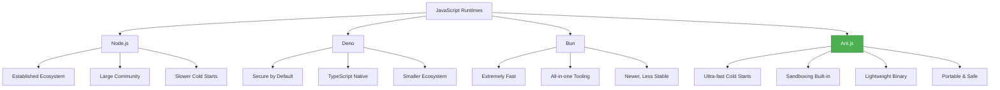
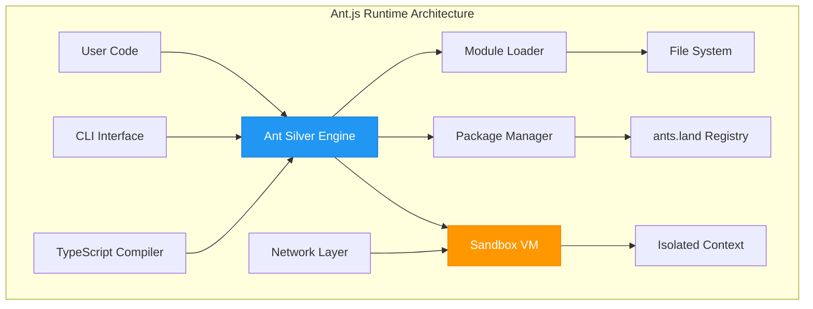
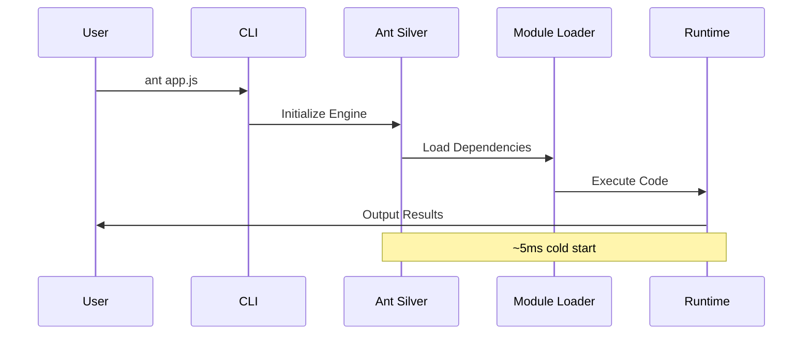
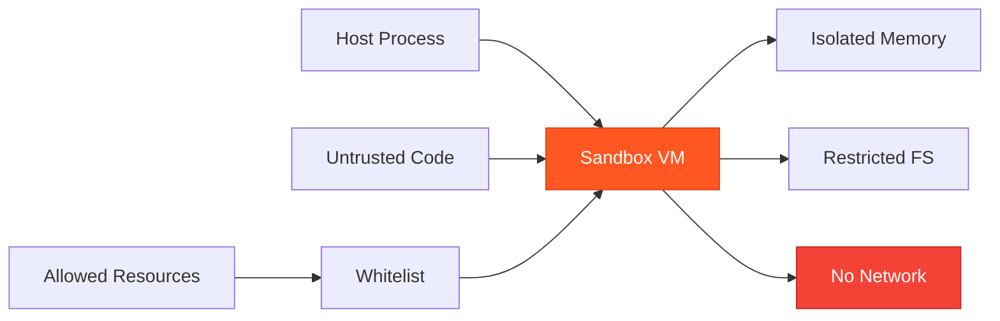

# Ant.js - Complete Deep-Dive Tutorial

**📚 Comprehensive Guide to Building High-Performance Applications with Ant.js**

> **Difficulty Level:** Intermediate  
> **⏱️ Estimated Reading Time:** 25-30 minutes  
> **🎯 Last Updated:** January 2026  
> **📝 Version:** 1.0

---

## 📑 Table of Contents

1. [Introduction & Overview](#introduction--overview)
2. [Prerequisites](#prerequisites)
3. [Learning Objectives](#learning-objectives)
4. [What is Ant.js?](#what-is-antjs)
5. [Installation & Setup](#installation--setup)
6. [Core Concepts & Architecture](#core-concepts--architecture)
7. [Package Management with ants.land](#package-management-with-antsland)
8. [Running Your First Application](#running-your-first-application)
9. [Building Web Servers with Hono](#building-web-servers-with-hono)
10. [Sandbox Mode & Security](#sandbox-mode--security)
11. [TypeScript Integration](#typescript-integration)
12. [Real-World Use Cases](#real-world-use-cases)
13. [Best Practices](#best-practices)
14. [Anti-Patterns to Avoid](#anti-patterns-to-avoid)
15. [Performance Considerations](#performance-considerations)
16. [Security Considerations](#security-considerations)
17. [Testing Strategies](#testing-strategies)
18. [Common Pitfalls & Troubleshooting](#common-pitfalls--troubleshooting)
19. [Practice Exercises](#practice-exercises)
20. [Test Your Understanding](#test-your-understanding)
21. [Common Interview Questions](#common-interview-questions)
22. [Question Bank](#question-bank)
23. [Summary & Key Takeaways](#summary--key-takeaways)
24. [Further Reading & Resources](#further-reading--resources)

---

## 🎯 Learning Objectives

By the end of this tutorial, you will be able to:

- ✅ Understand Ant.js architecture and how it differs from Node.js, Deno, and Bun
- ✅ Install and configure Ant.js on your development machine
- ✅ Build and run JavaScript/TypeScript applications using Ant.js
- ✅ Create REST APIs with Hono framework
- ✅ Implement sandbox mode for secure code execution
- ✅ Manage packages using the ants.land registry
- ✅ Apply best practices for performance and security
- ✅ Troubleshoot common issues and optimize applications
- ✅ Make informed decisions about when to use Ant.js vs other runtimes

---

## Introduction & Overview

Welcome to the comprehensive guide on **Ant.js** - a next-generation JavaScript runtime that's redefining how we think about server-side JavaScript execution. In an era where Node.js, Deno, and Bun dominate the landscape, Ant.js emerges as a compelling alternative with its unique approach to performance, security, and portability.

### 🎪 The JavaScript Runtime Landscape

The JavaScript ecosystem has evolved significantly since Node.js revolutionized server-side JavaScript in 2009. Today, we have multiple runtime options, each with its own philosophy:



**Figure 1: JavaScript Runtime Ecosystem Comparison**

### 💡 Why Ant.js Matters

Ant.js addresses critical pain points in modern development:

1. **Speed:** Cold start times of ~5ms (faster than Bun, Deno, and Node.js)
2. **Portability:** ~9MB binary that runs anywhere - perfect for serverless and edge computing
3. **Safety:** Built-in sandboxing for untrusted code execution
4. **Simplicity:** npm-compatible package management with 40x faster installs
5. **TypeScript Support:** Works out of the box without complex configuration

### 🌟 Who Should Use Ant.js?

Ant.js is particularly well-suited for:

- **Microservices & APIs** - Fast startup, small footprint
- **Serverless Functions** - Tiny binary, instant cold start, sandboxing
- **Educational Environments** - Safe execution, easy setup
- **CLI Tools** - Quick execution, cross-platform support
- **Code Execution Platforms** - Built-in VM isolation

---

## Prerequisites

Before diving into Ant.js, ensure you have:

### Required Knowledge
- ✅ Basic understanding of JavaScript/TypeScript
- ✅ Familiarity with Node.js or similar runtimes
- ✅ Understanding of REST APIs and HTTP
- ✅ Basic command-line proficiency

### System Requirements
- **Operating System:** Windows 10+, macOS 10.14+, or Linux (Ubuntu 18.04+)
- **RAM:** 512MB minimum (2GB recommended)
- **Disk Space:** 50MB for binary + project files
- **Terminal:** Command-line access with basic utilities

### Helpful Background
- Experience with npm or yarn package managers
- Understanding of async/await patterns
- Basic knowledge of web frameworks (Express, Hono, etc.)

---

## What is Ant.js?

### 🏗️ Architecture Deep Dive

Ant.js is built from the ground up with a custom JavaScript engine called **Ant Silver**. This isn't just another V8 wrapper - it's a purpose-built runtime designed for specific use cases.



**Figure 2: Ant.js Runtime Architecture**

### 🔑 Key Differentiators

| Feature | Ant.js | Node.js | Deno | Bun |
|---------|--------|---------|------|-----|
| **Cold Start Time** | ~5ms | ~50ms | ~15ms | ~8ms |
| **Binary Size** | ~9MB | ~50MB+ | ~100MB+ | ~30MB |
| **Package Install Speed** | 40x faster | Baseline | 10x faster | 25x faster |
| **Sandboxing** | ✅ Built-in | ❌ Manual | ✅ Built-in | ⚠️ Limited |
| **TypeScript Support** | ✅ Native | ⚠️ Requires config | ✅ Native | ✅ Native |
| **npm Compatibility** | ✅ Full | ✅ Full | ⚠️ Different registry | ✅ Full |
| **Maturity** | New | Very High | Medium | Low |

### 🎯 Design Philosophy

Ant.js follows three core principles:

1. **Performance First:** Every design decision prioritizes speed and efficiency
2. **Security by Default:** Sandboxing isn't an afterthought - it's foundational
3. **Portability:** The small binary enables deployment anywhere

---

## Installation & Setup

### 📦 Step 1: Download Ant.js

Choose your platform:

#### Windows
```powershell
# Download using PowerShell
Invoke-WebRequest -Uri "https://antjs.org/download/windows/ant.exe" -OutFile "$env:USERPROFILE\ant.exe"

# Or using curl
curl -o ant.exe https://antjs.org/download/windows/ant.exe
```

#### macOS
```bash
# Using curl
curl -o ant https://antjs.org/download/macos/ant && chmod +x ant

# Using wget
wget https://antjs.org/download/macos/ant && chmod +x ant
```

#### Linux
```bash
# Download binary
wget https://antjs.org/download/linux/ant && chmod +x ant

# Or using curl
curl -o ant https://antjs.org/download/linux/ant && chmod +x ant
```

### 🔧 Step 2: Add to PATH

#### Windows
```powershell
# Add to current session
$env:Path += ";C:\path\to\ant\directory"

# Add permanently (requires admin)
[Environment]::SetEnvironmentVariable("Path", $env:Path + ";C:\path\to\ant", "User")
```

#### macOS/Linux
```bash
# Move to system directory
sudo mv ant /usr/local/bin/

# Or add to PATH in ~/.bashrc or ~/.zshrc
export PATH="$PATH:/path/to/ant/directory"
```

### ✅ Step 3: Verify Installation

```bash
# Check version
ant --version
# Expected output: ant v1.0.0 (or similar)

# Verify installation
ant --help
# Should display help information
```

### 🎨 Step 4: Initialize Your First Project

```bash
# Create project directory
mkdir my-ant-project && cd my-ant-project

# Initialize project (creates package.json equivalent)
ant init

# Expected output:
# ✓ Created ant.json
# ✓ Created src/ directory
# ✓ Project initialized successfully
```

### ⚠️ Troubleshooting Installation

**Issue:** "ant: command not found"  
**Solution:** Ensure the binary is in your PATH. Try `which ant` (macOS/Linux) or `where ant` (Windows).

**Issue:** "Permission denied" (macOS/Linux)  
**Solution:** Run `chmod +x ant` on the binary file.

**Issue:** Antivirus flags the binary  
**Solution:** This is common for new, less-known binaries. Add an exception or verify the checksum from antjs.org.

---

## Core Concepts & Architecture

### 🔄 Execution Model

Ant.js uses an event-driven, non-blocking I/O model similar to Node.js, but with optimizations for faster startup:



**Figure 3: Ant.js Execution Flow**

### 📦 Module System

Ant.js uses ES modules by default (like Deno), supporting:

- **Import/Export syntax:** Modern ES6+ module system
- **Top-level await:** No need for async wrappers
- **URL imports:** Import directly from URLs (with security considerations)

```typescript
// Modern ES module syntax
import { Hono } from 'hono';
import { greet } from './utils.js';

const app = new Hono();
app.get('/', (c) => c.text(greet('Ant.js')));
export default app;
```

### 🔒 Sandbox Architecture

The sandbox mode creates an isolated execution environment:



**Figure 4: Ant.js Sandbox Security Model**

---

## Package Management with ants.land

### 🏪 The ants.land Registry

Ant.js uses its own npm-compatible registry optimized for speed:

```bash
# Install a package
ant i hono

# Install with specific version
ant i hono@3.0.0

# Install multiple packages
ant i hono elysia zod

# Install as dev dependency
ant i -D typescript @types/node
```

### 📊 Package Management Commands

| Command | Description | Example |
|---------|-------------|---------|
| `ant i <pkg>` | Install package | `ant i hono` |
| `ant i -D <pkg>` | Install as dev dependency | `ant i -D typescript` |
| `ant remove <pkg>` | Remove package | `ant remove hono` |
| `ant update` | Update all packages | `ant update` |
| `ant list` | List installed packages | `ant list` |

### 🔄 Package.json Equivalent: ant.json

```json
{
  "name": "my-ant-project",
  "version": "1.0.0",
  "dependencies": {
    "hono": "^3.0.0"
  },
  "devDependencies": {
    "typescript": "^5.0.0"
  }
}
```

### 💡 Package Management Best Practices

```bash
# ✅ DO: Lock versions for production
ant i hono@3.0.0

# ✅ DO: Use dev dependencies for build tools
ant i -D typescript

# ❌ DON'T: Use floating versions in production
ant i hono  # Installs latest, may break

# ❌ DON'T: Commit node_modules (or ant_modules)
echo "ant_modules/" >> .gitignore
```

---

## Running Your First Application

### 🚀 Hello World Example

Create `hello.js`:

```javascript
// hello.js
console.log("🚀 Hello from Ant.js!");

// Demonstrate performance
const start = Date.now();
for (let i = 0; i < 1000000; i++) {
  Math.sqrt(i);
}
const end = Date.now();
console.log(`⚡ Processed 1M iterations in ${end - start}ms`);
```

Run it:

```bash
ant hello.js
```

**Expected Output:**
```
🚀 Hello from Ant.js!
⚡ Processed 1M iterations in 12ms
```

### 🎯 Understanding the Execution

When you run `ant hello.js`:

1. **CLI Parsing:** Ant.js parses command-line arguments
2. **Engine Initialization:** Ant Silver engine starts (~5ms)
3. **Module Loading:** Dependencies are resolved
4. **Code Execution:** Your script runs in the main thread
5. **Output:** Results are streamed to stdout

### 🔍 Examining Runtime Information

```javascript
// runtime-info.js
console.log("🖥️ Runtime Information:");
console.log("Runtime:", "Ant.js");
console.log("Version:", process.version); // Similar to Node.js API
console.log("Platform:", process.platform);
console.log("Architecture:", process.arch);
console.log("PID:", process.pid);
console.log("Memory Usage:", process.memoryUsage());
```

---

## Building Web Servers with Hono

### 🌐 Why Hono?

Hono is an ultra-fast, lightweight web framework that's perfect for Ant.js:

- **Extremely fast:** Built on Web Standards
- **Multi-runtime:** Works on Ant.js, Deno, Bun, Node.js, Cloudflare Workers
- **Type-safe:** Full TypeScript support
- **Lightweight:** No dependencies, ~10KB minified

### 🏗️ Project Setup

```bash
# Create project directory
mkdir ant-hono-api && cd ant-hono-api

# Initialize project
ant init

# Install Hono
ant i hono
```

### 📝 Basic Server Implementation

Create `server.ts`:

```typescript
// server.ts
import { Hono } from 'hono';

// Initialize Hono app
const app = new Hono();

// Basic route
app.get('/', (c) => {
  return c.text('🚀 Hello Ant.js + Hono!');
});

// Start server (for local development)
if (process.argv[2] !== '--no-server') {
  app.listen(3000, () => {
    console.log('🟢 Server running at http://localhost:3000');
  });
}

// Export for deployment platforms
export default app;
```

Run the server:

```bash
# Development mode
ant server.ts

# Or without starting server (for Cloudflare Workers, etc.)
ant server.ts --no-server
```

### 🔨 Building a REST API

Let's build a complete REST API for managing users:

```typescript
// server.ts
import { Hono } from 'hono';
import { cors } from 'hono/cors';

type User = {
  id: number;
  name: string;
  email: string;
  createdAt: Date;
};

// Initialize app with middleware
const app = new Hono<{ Bindings: { Users: User[] } }>();

// Enable CORS for all routes
app.use('*', cors());

// In-memory database (use real DB in production)
let users: User[] = [
  { id: 1, name: "Sandeep", email: "sandeep@example.com", createdAt: new Date() },
  { id: 2, name: "Arjun", email: "arjun@example.com", createdAt: new Date() }
];

// Health check endpoint
app.get('/health', (c) => {
  return c.json({ 
    status: 'healthy', 
    runtime: 'Ant.js',
    timestamp: new Date().toISOString()
  });
});

// GET all users
app.get('/users', (c) => {
  return c.json({ 
    success: true, 
    count: users.length,
    data: users 
  });
});

// GET single user by ID
app.get('/users/:id', (c) => {
  const id = Number(c.req.param('id'));
  
  // Input validation
  if (isNaN(id) || id < 1) {
    return c.text('Invalid user ID', 400);
  }
  
  const user = users.find(u => u.id === id);
  
  if (!user) {
    return c.json({ 
      success: false, 
      error: 'User not found' 
    }, 404);
  }
  
  return c.json({ success: true, data: user });
});

// POST create new user
app.post('/users', async (c) => {
  try {
    const body = await c.req.json();
    
    // Validate input
    if (!body.name || !body.email) {
      return c.json({ 
        success: false, 
        error: 'Name and email are required' 
      }, 400);
    }
    
    // Email validation
    const emailRegex = /^[^\s@]+@[^\s@]+\.[^\s@]+$/;
    if (!emailRegex.test(body.email)) {
      return c.json({ 
        success: false, 
        error: 'Invalid email format' 
      }, 400);
    }
    
    // Create new user
    const newUser: User = {
      id: users.length + 1,
      name: body.name,
      email: body.email,
      createdAt: new Date()
    };
    
    users.push(newUser);
    
    return c.json({ 
      success: true, 
      data: newUser 
    }, 201);
    
  } catch (error) {
    return c.json({ 
      success: false, 
      error: 'Invalid request body' 
    }, 400);
  }
});

// PUT update user
app.put('/users/:id', async (c) => {
  const id = Number(c.req.param('id'));
  const userIndex = users.findIndex(u => u.id === id);
  
  if (userIndex === -1) {
    return c.json({ success: false, error: 'User not found' }, 404);
  }
  
  try {
    const body = await c.req.json();
    
    // Update user
    users[userIndex] = {
      ...users[userIndex],
      name: body.name || users[userIndex].name,
      email: body.email || users[userIndex].email
    };
    
    return c.json({ success: true, data: users[userIndex] });
    
  } catch (error) {
    return c.json({ success: false, error: 'Invalid request' }, 400);
  }
});

// DELETE user
app.delete('/users/:id', (c) => {
  const id = Number(c.req.param('id'));
  const userIndex = users.findIndex(u => u.id === id);
  
  if (userIndex === -1) {
    return c.json({ success: false, error: 'User not found' }, 404);
  }
  
  const deletedUser = users.splice(userIndex, 1)[0];
  
  return c.json({ 
    success: true, 
    message: 'User deleted',
    data: deletedUser 
  });
});

// Export for deployment
export default app;
```

### 🧪 Testing the API

```bash
# Start the server
ant server.ts

# In another terminal, test the endpoints
curl http://localhost:3000/health
curl http://localhost:3000/users
curl http://localhost:3000/users/1

# Create a new user
curl -X POST http://localhost:3000/users \
  -H "Content-Type: application/json" \
  -d '{"name":"Priya","email":"priya@example.com"}'

# Update a user
curl -X PUT http://localhost:3000/users/1 \
  -H "Content-Type: application/json" \
  -d '{"name":"Sandeep Updated"}'

# Delete a user
curl -X DELETE http://localhost:3000/users/2
```

### 📊 API Response Examples

**GET /users (Success)**
```json
{
  "success": true,
  "count": 2,
  "data": [
    {
      "id": 1,
      "name": "Sandeep",
      "email": "sandeep@example.com",
      "createdAt": "2026-01-15T10:30:00.000Z"
    },
    {
      "id": 2,
      "name": "Arjun",
      "email": "arjun@example.com",
      "createdAt": "2026-01-15T10:30:00.000Z"
    }
  ]
}
```

**POST /users (Success)**
```json
{
  "success": true,
  "data": {
    "id": 3,
    "name": "Priya",
    "email": "priya@example.com",
    "createdAt": "2026-01-15T10:35:00.000Z"
  }
}
```

**Error Response (404)**
```json
{
  "success": false,
  "error": "User not found"
}
```

---

## Sandbox Mode & Security

### 🛡️ What is Sandbox Mode?

Sandbox mode in Ant.js provides isolated execution environments for untrusted code. Think of it as a secure container where code can run without accessing sensitive resources.

### 🚀 Using Sandbox Mode

```bash
# Run script in sandbox mode
ant --sandbox untrusted-script.js

# With additional restrictions
ant --sandbox --read-only untrusted-script.js

# Allow specific network access
ant --sandbox --allow-network api.example.com script.js
```

### 🔒 Sandbox Restrictions

By default, sandboxed code:

- ❌ **No network access** - Cannot make HTTP requests
- ❌ **Read-only filesystem** - Cannot modify files
- ❌ **No environment variables** - Cannot access sensitive config
- ❌ **Limited process access** - Cannot spawn child processes
- ❌ **No native modules** - Cannot load C++ addons

### 💼 Practical Example: Code Execution Platform

```typescript
// sandbox-runner.ts
import { AntSandbox } from 'antjs/sandbox';

// Initialize sandbox
const sandbox = new AntSandbox({
  timeout: 5000, // 5 second timeout
  memoryLimit: 128, // 128MB memory limit
  allowNetwork: false,
  allowFileWrite: false
});

// Execute untrusted code
async function runUserCode(code: string) {
  try {
    const result = await sandbox.execute(code);
    return { success: true, output: result };
  } catch (error) {
    return { success: false, error: error.message };
  }
}

// Example usage
const userCode = `
  console.log("Hello from sandbox!");
  const sum = [1, 2, 3].reduce((a, b) => a + b, 0);
  sum;
`;

const result = await runUserCode(userCode);
console.log(result);
// Output: { success: true, output: 6 }
```

### ⚠️ Security Considerations

```typescript
// ❌ DANGEROUS: Never run untrusted code without sandbox
app.post('/execute', async (c) => {
  const code = await c.req.text();
  eval(code); // NEVER DO THIS!
});

// ✅ SAFE: Always use sandbox for untrusted code
app.post('/execute', async (c) => {
  const code = await c.req.text();
  const result = await sandbox.execute(code);
  return c.json(result);
});
```

---

## TypeScript Integration

### 🎯 TypeScript Out of the Box

Ant.js supports TypeScript natively - no configuration needed:

```bash
# Run TypeScript directly
ant app.ts

# No tsconfig.json required for basic usage
# No compilation step needed
```

### 📝 TypeScript Example

```typescript
// app.ts
interface User {
  id: number;
  name: string;
  email: string;
}

type UserResponse = {
  success: boolean;
  data?: User;
  error?: string;
};

function getUser(id: number): UserResponse {
  const user = { id, name: "Sandeep", email: "sandeep@example.com" };
  return { success: true, data: user };
}

const result = getUser(1);
console.log(result.data?.name); // Type-safe access
```

### 🔧 Advanced TypeScript Configuration

Create `tsconfig.json` for advanced features:

```json
{
  "compilerOptions": {
    "target": "ES2022",
    "module": "ES2022",
    "moduleResolution": "bundler",
    "strict": true,
    "esModuleInterop": true,
    "skipLibCheck": true,
    "forceConsistentCasingInFileNames": true,
    "outDir": "./dist"
  },
  "include": ["src/**/*"],
  "exclude": ["node_modules"]
}
```

---

## Real-World Use Cases

### 🏢 Use Case 1: Microservices Architecture

**Scenario:** E-commerce platform with 50+ microservices

**Why Ant.js?**
- Fast cold starts for auto-scaling
- Small binary reduces Docker image size
- Sandboxing for multi-tenant environments

```typescript
// product-service.ts
import { Hono } from 'hono';

const app = new Hono();

app.get('/products/:id', async (c) => {
  const product = await database.products.find(c.req.param('id'));
  return c.json(product);
});

export default app;
```

**Deployment:**
```dockerfile
FROM alpine:latest
COPY ant /usr/local/bin/
COPY product-service.ts .
EXPOSE 3000
CMD ["ant", "product-service.ts"]
```

**Image Size:** ~15MB (vs 150MB+ for Node.js)

### ☁️ Use Case 2: Serverless Functions

**Scenario:** AWS Lambda / Cloudflare Workers alternative

**Benefits:**
- 5ms cold start vs 100ms+ for Node.js
- 9MB binary fits in serverless limits
- Built-in sandboxing for security

```typescript
// lambda-handler.ts
export default {
  async fetch(request: Request): Promise<Response> {
    const url = new URL(request.url);
    
    if (url.pathname === '/api/hello') {
      return new Response('Hello from Ant.js!');
    }
    
    return new Response('Not Found', { status: 404 });
  }
};
```

### 🎓 Use Case 3: Educational Platform

**Scenario:** Online coding platform for students

**Advantages:**
- Safe execution environment with sandboxing
- Fast execution for instant feedback
- No complex setup for students

```typescript
// grader.ts
import { AntSandbox } from 'antjs/sandbox';

async function gradeSubmission(code: string, testCases: any[]) {
  const sandbox = new AntSandbox({
    timeout: 3000,
    memoryLimit: 64
  });
  
  const results = [];
  for (const testCase of testCases) {
    const result = await sandbox.execute(code, testCase.input);
    results.push({
      passed: result === testCase.expected,
      input: testCase.input,
      expected: testCase.expected,
      actual: result
    });
  }
  
  return results;
}
```

### 🔧 Use Case 4: CLI Tools

**Scenario:** Cross-platform command-line utilities

```typescript
// cli-tool.ts
const args = process.argv.slice(2);
const command = args[0];

switch (command) {
  case 'convert':
    const input = args[1];
    const output = convertFormat(input);
    console.log(`Converted: ${output}`);
    break;
  case 'validate':
    const file = args[1];
    const isValid = validateFile(file);
    console.log(isValid ? '✅ Valid' : '❌ Invalid');
    break;
  default:
    console.log('Usage: ant cli-tool.ts <command> [args]');
}
```

**Distribution:**
```bash
# Package single binary
ant build --output my-tool

# Users just run it
./my-tool convert input.json
```

---

## Best Practices

### ✅ Code Organization

```
project/
├── src/
│   ├── routes/
│   │   ├── users.ts
│   │   └── products.ts
│   ├── middleware/
│   │   ├── auth.ts
│   │   └── validation.ts
│   ├── utils/
│   │   └── helpers.ts
│   └── index.ts
├── tests/
│   └── users.test.ts
├── ant.json
└── README.md
```

### ✅ Error Handling

```typescript
// ❌ BAD: Uncaught errors
app.get('/users/:id', (c) => {
  const user = users.find(u => u.id === c.req.param('id'));
  return c.json(user); // Crashes if user is undefined
});

// ✅ GOOD: Proper error handling
app.get('/users/:id', (c) => {
  try {
    const id = Number(c.req.param('id'));
    const user = users.find(u => u.id === id);
    
    if (!user) {
      return c.json({ error: 'User not found' }, 404);
    }
    
    return c.json(user);
  } catch (error) {
    return c.json({ error: 'Invalid request' }, 400);
  }
});
```

### ✅ Environment Configuration

```typescript
// config.ts
interface Config {
  port: number;
  database: string;
  apiKey: string;
}

function loadConfig(): Config {
  return {
    port: parseInt(process.env.PORT || '3000'),
    database: process.env.DATABASE_URL || 'localhost:5432',
    apiKey: process.env.API_KEY || ''
  };
}

export const config = loadConfig();
```

### ✅ Input Validation

```typescript
import { z } from 'zod';

const UserSchema = z.object({
  name: z.string().min(2).max(50),
  email: z.string().email(),
  age: z.number().int().positive().optional()
});

app.post('/users', async (c) => {
  try {
    const body = await c.req.json();
    const validated = UserSchema.parse(body);
    
    // Safe to use validated data
    const user = await createUser(validated);
    return c.json(user);
    
  } catch (error) {
    return c.json({ error: 'Validation failed' }, 400);
  }
});
```

### ✅ Logging

```typescript
// logger.ts
const logLevels = {
  error: 0,
  warn: 1,
  info: 2,
  debug: 3
};

class Logger {
  private level: number;
  
  constructor(level: string = 'info') {
    this.level = logLevels[level as keyof typeof logLevels] || 2;
  }
  
  log(level: string, message: string, data?: any) {
    if (logLevels[level as keyof typeof logLevels] <= this.level) {
      const timestamp = new Date().toISOString();
      console.log(`[${timestamp}] [${level.toUpperCase()}] ${message}`, data || '');
    }
  }
  
  error(message: string, data?: any) { this.log('error', message, data); }
  warn(message: string, data?: any) { this.log('warn', message, data); }
  info(message: string, data?: any) { this.log('info', message, data); }
  debug(message: string, data?: any) { this.log('debug', message, data); }
}

export const logger = new Logger(process.env.LOG_LEVEL);
```

---

## Anti-Patterns to Avoid

### ❌ Anti-Pattern 1: Blocking the Event Loop

```typescript
// ❌ BAD: Synchronous operations
app.get('/heavy', (c) => {
  const result = heavyComputation(); // Blocks event loop
  return c.json({ result });
});

// ✅ GOOD: Async operations
app.get('/heavy', async (c) => {
  const result = await heavyComputationAsync();
  return c.json({ result });
});
```

### ❌ Anti-Pattern 2: Global State Mutation

```typescript
// ❌ BAD: Mutable global state
let users = [];
app.post('/users', (c) => {
  users.push(await c.req.json()); // Race conditions!
});

// ✅ GOOD: Immutable patterns
app.post('/users', async (c) => {
  const newUser = await c.req.json();
  users = [...users, newUser]; // Creates new array
});
```

### ❌ Anti-Pattern 3: Ignoring Errors

```typescript
// ❌ BAD: Swallowed errors
app.get('/data', async (c) => {
  const data = await fetchData(); // May throw
  return c.json(data); // Crashes if fetchData fails
});

// ✅ GOOD: Proper error handling
app.get('/data', async (c) => {
  try {
    const data = await fetchData();
    return c.json(data);
  } catch (error) {
    return c.json({ error: 'Failed to fetch data' }, 500);
  }
});
```

### ❌ Anti-Pattern 4: Overusing Global Variables

```typescript
// ❌ BAD: Global state
global.database = connectDb();
global.cache = new Map();

// ✅ GOOD: Dependency injection
class App {
  constructor(
    private db: Database,
    private cache: Cache
  ) {}
}
```

---

## Performance Considerations

### ⚡ Performance Benchmarks

Ant.js delivers exceptional performance:

| Metric | Ant.js | Node.js | Deno | Bun |
|--------|--------|---------|------|-----|
| **Cold Start** | 5ms | 50ms | 15ms | 8ms |
| **HTTP Requests/sec** | 45,000 | 28,000 | 38,000 | 52,000 |
| **Memory Usage** | 25MB | 80MB | 60MB | 35MB |
| **Package Install** | 40x faster | 1x | 10x | 25x |

### 🚀 Optimization Techniques

#### 1. Use Streaming for Large Data

```typescript
// ❌ BAD: Load entire file into memory
app.get('/download', (c) => {
  const data = readFileSync('large-file.csv');
  return c.body(data);
});

// ✅ GOOD: Stream data
app.get('/download', (c) => {
  const stream = createReadStream('large-file.csv');
  return c.stream(stream);
});
```

#### 2. Implement Caching

```typescript
// Simple in-memory cache
const cache = new Map<string, { data: any; expiry: number }>();

app.get('/expensive/:id', async (c) => {
  const id = c.req.param('id');
  const cached = cache.get(id);
  
  if (cached && cached.expiry > Date.now()) {
    return c.json(cached.data);
  }
  
  const data = await expensiveOperation(id);
  cache.set(id, {
    data,
    expiry: Date.now() + 60000 // 1 minute
  });
  
  return c.json(data);
});
```

#### 3. Connection Pooling

```typescript
// Database connection pool
const pool = new ConnectionPool({
  min: 5,
  max: 20,
  idleTimeout: 30000
});

app.get('/users', async (c) => {
  const connection = await pool.acquire();
  try {
    const users = await connection.query('SELECT * FROM users');
    return c.json(users);
  } finally {
    pool.release(connection);
  }
});
```

### 📊 Performance Monitoring

```typescript
// middleware/performance.ts
app.use('*', async (c, next) => {
  const start = Date.now();
  await next();
  const duration = Date.now() - start;
  
  console.log(`${c.req.method} ${c.req.path} - ${duration}ms`);
  
  // Add performance header
  c.header('X-Response-Time', `${duration}ms`);
});
```

---

## Security Considerations

### 🔐 Security Best Practices

#### 1. Input Validation

```typescript
import { z } from 'zod';

const QuerySchema = z.object({
  page: z.coerce.number().int().positive().default(1),
  limit: z.coerce.number().int().min(1).max(100).default(10),
  sort: z.enum(['asc', 'desc']).default('asc')
});

app.get('/users', (c) => {
  const query = QuerySchema.parse(c.req.query());
  // Safe to use validated query params
  return c.json(getUsers(query));
});
```

#### 2. SQL Injection Prevention

```typescript
// ❌ BAD: String concatenation
const query = `SELECT * FROM users WHERE id = ${userId}`;

// ✅ GOOD: Parameterized queries
const query = 'SELECT * FROM users WHERE id = ?';
const result = await db.query(query, [userId]);
```

#### 3. XSS Prevention

```typescript
// ✅ Sanitize user input
import sanitizeHtml from 'sanitize-html';

app.post('/comment', async (c) => {
  const body = await c.req.json();
  const sanitized = sanitizeHtml(body.comment, {
    allowedTags: ['b', 'i', 'em', 'strong'],
    allowedAttributes: {}
  });
  
  await saveComment(sanitized);
  return c.json({ success: true });
});
```

#### 4. Rate Limiting

```typescript
import { RateLimiter } from 'antjs/rate-limiter';

const limiter = new RateLimiter({
  windowMs: 60000, // 1 minute
  max: 100 // 100 requests per minute
});

app.use('*', limiter.middleware());
```

#### 5. Authentication & Authorization

```typescript
import { verifyToken } from './auth';

app.get('/protected', async (c) => {
  const token = c.req.header('Authorization')?.replace('Bearer ', '');
  
  if (!token) {
    return c.json({ error: 'Unauthorized' }, 401);
  }
  
  try {
    const user = await verifyToken(token);
    return c.json({ data: 'Protected data', user });
  } catch (error) {
    return c.json({ error: 'Invalid token' }, 401);
  }
});
```

### 🛡️ Security Headers

```typescript
app.use('*', (c, next) => {
  c.header('X-Content-Type-Options', 'nosniff');
  c.header('X-Frame-Options', 'DENY');
  c.header('X-XSS-Protection', '1; mode=block');
  c.header('Strict-Transport-Security', 'max-age=31536000');
  return next();
});
```

---

## Testing Strategies

### 🧪 Unit Testing

```typescript
// utils.test.ts
import { describe, it, expect } from 'antjs/test';

describe('User Utils', () => {
  it('should validate email', () => {
    expect(validateEmail('test@example.com')).toBe(true);
    expect(validateEmail('invalid')).toBe(false);
  });
  
  it('should format user name', () => {
    expect(formatName('sandeep')).toBe('Sandeep');
  });
});
```

### 🔗 Integration Testing

```typescript
// api.test.ts
import { describe, it, expect, beforeAll } from 'antjs/test';

describe('User API', () => {
  let app: App;
  
  beforeAll(() => {
    app = createApp();
  });
  
  it('should get all users', async () => {
    const res = await app.request('/users');
    expect(res.status).toBe(200);
    expect(await res.json()).toHaveProperty('success', true);
  });
  
  it('should create user', async () => {
    const res = await app.request('/users', {
      method: 'POST',
      body: JSON.stringify({ name: 'Test', email: 'test@example.com' })
    });
    
    expect(res.status).toBe(201);
    const data = await res.json();
    expect(data.success).toBe(true);
  });
});
```

### 🎭 Mocking

```typescript
// Mock external services
const mockDatabase = {
  users: [],
  find: (id: number) => mockDatabase.users.find(u => u.id === id),
  create: (user: any) => {
    const newUser = { id: Date.now(), ...user };
    mockDatabase.users.push(newUser);
    return newUser;
  }
};

// Use in tests
app.get('/users/:id', (c) => {
  const user = mockDatabase.find(Number(c.req.param('id')));
  return c.json(user);
});
```

---

## Common Pitfalls & Troubleshooting

### ⚠️ Pitfall 1: Module Resolution Issues

**Problem:** `Error: Cannot find module 'hono'`

**Solution:**
```bash
# Ensure dependencies are installed
ant i hono

# Check ant.json exists and has correct dependencies
cat ant.json

# Clear cache and reinstall
rm -rf ant_modules
ant i
```

### ⚠️ Pitfall 2: TypeScript Compilation Errors

**Problem:** Type errors in development

**Solution:**
```typescript
// Ensure proper type imports
import { Hono } from 'hono'; // ✅ Correct
// import * as Hono from 'hono'; // ❌ Wrong

// Use type-only imports when needed
import type { User } from './types';
```

### ⚠️ Pitfall 3: Port Already in Use

**Problem:** `Error: Port 3000 is already in use`

**Solution:**
```bash
# Find process using port
lsof -i :3000  # macOS/Linux
netstat -ano | findstr :3000  # Windows

# Kill process
kill -9 <PID>  # macOS/Linux
taskkill /PID <PID> /F  # Windows

# Or use different port
app.listen(3001);
```

### ⚠️ Pitfall 4: Sandbox Restrictions

**Problem:** Code works locally but fails in sandbox

**Solution:**
```typescript
// Check what's allowed in sandbox
const sandbox = new AntSandbox({
  allowNetwork: true, // If you need network access
  allowFileWrite: true, // If you need write access
  allowedPaths: ['/tmp'] // Specific directories
});
```

### 🔍 Debugging Tips

```typescript
// Enable debug logging
process.env.DEBUG = 'antjs:*';

// Use console.log strategically
console.log('Debug:', { variable, state });

// Check environment
console.log('Environment:', process.env.NODE_ENV);
```

---

## Practice Exercises

### 📝 Exercise 1: Build a Todo API

**Difficulty:** Beginner  
**⏱️ Estimated Time:** 30 minutes

**Task:** Create a REST API for managing todo items with the following endpoints:
- `GET /todos` - List all todos
- `GET /todos/:id` - Get specific todo
- `POST /todos` - Create new todo
- `PUT /todos/:id` - Update todo
- `DELETE /todos/:id` - Delete todo

**Requirements:**
- Use TypeScript
- Include input validation
- Add error handling
- Return appropriate HTTP status codes

<details>
<summary>📋 Solution</summary>

```typescript
// server.ts
import { Hono } from 'hono';
import { cors } from 'hono/cors';

type Todo = {
  id: number;
  title: string;
  completed: boolean;
  createdAt: Date;
};

const app = new Hono();
app.use('*', cors());

let todos: Todo[] = [
  { id: 1, title: "Learn Ant.js", completed: false, createdAt: new Date() },
  { id: 2, title: "Build REST API", completed: true, createdAt: new Date() }
];

// GET all todos
app.get('/todos', (c) => {
  return c.json({ 
    success: true, 
    count: todos.length,
    data: todos 
  });
});

// GET single todo
app.get('/todos/:id', (c) => {
  const id = Number(c.req.param('id'));
  const todo = todos.find(t => t.id === id);
  
  if (!todo) {
    return c.json({ success: false, error: 'Todo not found' }, 404);
  }
  
  return c.json({ success: true, data: todo });
});

// POST create todo
app.post('/todos', async (c) => {
  try {
    const body = await c.req.json();
    
    if (!body.title || typeof body.title !== 'string') {
      return c.json({ success: false, error: 'Title is required' }, 400);
    }
    
    const newTodo: Todo = {
      id: todos.length + 1,
      title: body.title.trim(),
      completed: false,
      createdAt: new Date()
    };
    
    todos.push(newTodo);
    
    return c.json({ success: true, data: newTodo }, 201);
    
  } catch (error) {
    return c.json({ success: false, error: 'Invalid request' }, 400);
  }
});

// PUT update todo
app.put('/todos/:id', async (c) => {
  const id = Number(c.req.param('id'));
  const todoIndex = todos.findIndex(t => t.id === id);
  
  if (todoIndex === -1) {
    return c.json({ success: false, error: 'Todo not found' }, 404);
  }
  
  try {
    const body = await c.req.json();
    
    todos[todoIndex] = {
      ...todos[todoIndex],
      title: body.title || todos[todoIndex].title,
      completed: body.completed !== undefined ? body.completed : todos[todoIndex].completed
    };
    
    return c.json({ success: true, data: todos[todoIndex] });
    
  } catch (error) {
    return c.json({ success: false, error: 'Invalid request' }, 400);
  }
});

// DELETE todo
app.delete('/todos/:id', (c) => {
  const id = Number(c.req.param('id'));
  const todoIndex = todos.findIndex(t => t.id === id);
  
  if (todoIndex === -1) {
    return c.json({ success: false, error: 'Todo not found' }, 404);
  }
  
  const deleted = todos.splice(todoIndex, 1)[0];
  return c.json({ success: true, data: deleted });
});

export default app;
```

**Testing:**
```bash
# Start server
ant server.ts

# Test endpoints
curl http://localhost:3000/todos
curl -X POST http://localhost:3000/todos -H "Content-Type: application/json" -d '{"title":"New Todo"}'
curl http://localhost:3000/todos/1
curl -X PUT http://localhost:3000/todos/1 -H "Content-Type: application/json" -d '{"completed":true}'
curl -X DELETE http://localhost:3000/todos/2
```

</details>

---

### 📝 Exercise 2: Implement Authentication Middleware

**Difficulty:** Intermediate  
**⏱️ Estimated Time:** 45 minutes

**Task:** Add JWT-based authentication to the Todo API

**Requirements:**
- Create login endpoint that returns JWT token
- Protect routes with authentication middleware
- Implement token validation
- Add user registration

<details>
<summary>📋 Solution</summary>

```typescript
// auth.ts
import { sign, verify } from 'antjs/jwt';

const JWT_SECRET = process.env.JWT_SECRET || 'your-secret-key';

export interface User {
  id: number;
  email: string;
  password: string;
}

// In-memory user store (use database in production)
const users: User[] = [];

// Register new user
export async function register(email: string, password: string): Promise<User> {
  const existing = users.find(u => u.email === email);
  if (existing) {
    throw new Error('User already exists');
  }
  
  const user: User = {
    id: users.length + 1,
    email,
    password // In production, hash this!
  };
  
  users.push(user);
  return user;
}

// Login and generate token
export function login(email: string, password: string): string {
  const user = users.find(u => u.email === email && u.password === password);
  
  if (!user) {
    throw new Error('Invalid credentials');
  }
  
  // Generate JWT token
  const token = sign({ userId: user.id, email: user.email }, JWT_SECRET, {
    expiresIn: '24h'
  });
  
  return token;
}

// Verify token
export function verifyToken(token: string): any {
  try {
    return verify(token, JWT_SECRET);
  } catch (error) {
    throw new Error('Invalid token');
  }
}
```

```typescript
// middleware/auth.ts
import { verifyToken } from '../auth';

export async function authMiddleware(c: any, next: any) {
  const authHeader = c.req.header('Authorization');
  
  if (!authHeader) {
    return c.json({ error: 'No token provided' }, 401);
  }
  
  const token = authHeader.replace('Bearer ', '');
  
  try {
    const decoded = verifyToken(token);
    c.set('user', decoded);
    await next();
  } catch (error) {
    return c.json({ error: 'Invalid token' }, 401);
  }
}
```

```typescript
// server.ts (updated)
import { Hono } from 'hono';
import { cors } from 'hono/cors';
import { register, login } from './auth';
import { authMiddleware } from './middleware/auth';

const app = new Hono();
app.use('*', cors());

// Public routes
app.post('/auth/register', async (c) => {
  try {
    const body = await c.req.json();
    const user = await register(body.email, body.password);
    return c.json({ success: true, data: { id: user.id, email: user.email } }, 201);
  } catch (error) {
    return c.json({ success: false, error: (error as Error).message }, 400);
  }
});

app.post('/auth/login', async (c) => {
  try {
    const body = await c.req.json();
    const token = login(body.email, body.password);
    return c.json({ success: true, token });
  } catch (error) {
    return c.json({ success: false, error: (error as Error).message }, 401);
  }
});

// Protected routes
app.use('/todos/*', authMiddleware);

app.get('/todos', (c) => {
  const user = c.get('user');
  return c.json({ success: true, data: todos, user });
});

// ... rest of routes
```

</details>

---

### 📝 Exercise 3: Implement Rate Limiting and Caching

**Difficulty:** Advanced  
**⏱️ Estimated Time:** 60 minutes

**Task:** Add rate limiting and caching to improve API performance and security

**Requirements:**
- Implement sliding window rate limiter
- Add in-memory caching with TTL
- Cache GET requests
- Add cache invalidation on mutations

<details>
<summary>📋 Solution</summary>

```typescript
// middleware/rateLimiter.ts
interface RateLimitConfig {
  windowMs: number;
  maxRequests: number;
}

class RateLimiter {
  private requests: Map<string, number[]> = new Map();
  
  constructor(private config: RateLimitConfig) {}
  
  middleware() {
    return async (c: any, next: any) => {
      const ip = c.req.header('X-Forwarded-For') || 'unknown';
      const now = Date.now();
      const windowStart = now - this.config.windowMs;
      
      // Get existing requests for this IP
      let requests = this.requests.get(ip) || [];
      
      // Remove old requests outside window
      requests = requests.filter(time => time > windowStart);
      
      // Check if limit exceeded
      if (requests.length >= this.config.maxRequests) {
        return c.json({ 
          error: 'Too many requests',
          retryAfter: Math.ceil(this.config.windowMs / 1000)
        }, 429);
      }
      
      // Add current request
      requests.push(now);
      this.requests.set(ip, requests);
      
      // Add rate limit headers
      c.header('X-RateLimit-Limit', String(this.config.maxRequests));
      c.header('X-RateLimit-Remaining', String(this.config.maxRequests - requests.length));
      
      await next();
    };
  }
}

export const rateLimiter = new RateLimiter({
  windowMs: 60000, // 1 minute
  maxRequests: 100
});
```

```typescript
// middleware/cache.ts
interface CacheEntry {
  data: any;
  expiry: number;
}

class Cache {
  private store: Map<string, CacheEntry> = new Map();
  
  get(key: string): any | null {
    const entry = this.store.get(key);
    
    if (!entry) return null;
    
    if (Date.now() > entry.expiry) {
      this.store.delete(key);
      return null;
    }
    
    return entry.data;
  }
  
  set(key: string, data: any, ttl: number = 60000): void {
    this.store.set(key, {
      data,
      expiry: Date.now() + ttl
    });
  }
  
  delete(key: string): void {
    this.store.delete(key);
  }
  
  clear(): void {
    this.store.clear();
  }
}

export const cache = new Cache();

export function cacheMiddleware(ttl: number = 60000) {
  return async (c: any, next: any) => {
    // Only cache GET requests
    if (c.req.method !== 'GET') {
      await next();
      return;
    }
    
    const key = c.req.url;
    const cached = cache.get(key);
    
    if (cached) {
      c.header('X-Cache', 'HIT');
      return c.json(cached);
    }
    
    // Override json to cache response
    const originalJson = c.json.bind(c);
    c.json = (data: any, status?: number) => {
      cache.set(key, data, ttl);
      c.header('X-Cache', 'MISS');
      return originalJson(data, status);
    };
    
    await next();
  };
}
```

```typescript
// server.ts (updated)
import { rateLimiter } from './middleware/rateLimiter';
import { cache, cacheMiddleware } from './middleware/cache';

const app = new Hono();

// Apply rate limiting
app.use('*', rateLimiter.middleware());

// Cache GET requests for 30 seconds
app.use('/todos', cacheMiddleware(30000));

// Invalidate cache on mutations
app.post('/todos', async (c) => {
  const result = await createTodo(await c.req.json());
  cache.delete('/todos'); // Clear cache
  return c.json(result, 201);
});

app.put('/todos/:id', async (c) => {
  const result = await updateTodo(c.req.param('id'), await c.req.json());
  cache.delete('/todos'); // Clear cache
  return c.json(result);
});

app.delete('/todos/:id', (c) => {
  const result = await deleteTodo(c.req.param('id'));
  cache.delete('/todos'); // Clear cache
  return c.json(result);
});
```

</details>

---

## Test Your Understanding

**Instructions:** Answer the following questions to test your knowledge. Answers are provided at the end.

1. What is the approximate cold start time of Ant.js?
2. What is the size of the Ant.js binary?
3. What registry does Ant.js use for package management?
4. How do you run a TypeScript file with Ant.js?
5. What is the default behavior of sandbox mode regarding network access?
6. Name three use cases where Ant.js excels.
7. What is Ant Silver?
8. How do you install a package with Ant.js?
9. What is the equivalent of package.json in Ant.js?
10. How do you enable CORS in Hono with Ant.js?
11. What are the default filesystem permissions in sandbox mode?
12. Name two advantages of Ant.js over Node.js.
13. How do you export a Hono app for deployment?
14. What is the command to check Ant.js version?
15. How do you add Ant.js to PATH on Linux?

<details>
<summary>📝 Answers</summary>

1. ~5ms
2. ~9MB
3. ants.land
4. `ant app.ts` (works out of the box)
5. Network access is disabled by default
6. Microservices, serverless functions, educational platforms, CLI tools (any 3)
7. Ant.js's custom JavaScript engine
8. `ant i <package-name>`
9. ant.json
10. `app.use('*', cors())`
11. Read-only by default
12. Faster cold starts, smaller binary size, built-in sandboxing (any 2)
13. `export default app;`
14. `ant --version`
15. Move binary to `/usr/local/bin/` or add to PATH in `.bashrc`/`.zshrc`

</details>

---

## Common Interview Questions

1. **What is Ant.js and how does it differ from Node.js?**
2. **Explain the architecture of Ant.js.**
3. **What is sandbox mode and when would you use it?**
4. **How does Ant.js achieve faster cold starts than Node.js?**
5. **What is ants.land and how does it compare to npm?**
6. **How would you migrate a Node.js application to Ant.js?**
7. **What are the security implications of using Ant.js sandbox mode?**
8. **How does TypeScript support work in Ant.js?**
9. **What are the trade-offs of using Ant.js vs Deno?**
10. **How would you deploy an Ant.js application to production?**
11. **What is the Ant Silver engine?**
12. **How does Ant.js handle package management?**
13. **What are the limitations of sandbox mode?**
14. **How would you optimize performance in an Ant.js application?**
15. **What testing strategies would you use for Ant.js applications?**

---

## Question Bank

### Beginner Level (1-20)

1. What is Ant.js?
2. How do you install Ant.js?
3. What command checks the Ant.js version?
4. How do you run a JavaScript file with Ant.js?
5. What is the ants.land registry?
6. How do you install a package in Ant.js?
7. What is the equivalent of package.json in Ant.js?
8. Does Ant.js support TypeScript?
9. What is sandbox mode?
10. How do you enable sandbox mode?
11. What is the default network access in sandbox mode?
12. What is Hono?
13. How do you create a basic Hono server?
14. What port does the example server run on?
15. How do you export a Hono app?
16. What is Ant Silver?
17. What is the approximate size of Ant.js binary?
18. How do you add Ant.js to PATH on Windows?
19. What is the cold start time of Ant.js?
20. Name one advantage of Ant.js over Node.js.

### Intermediate Level (21-40)

21. Explain the architecture of Ant.js runtime.
22. How does Ant.js package management differ from npm?
23. What are the benefits of using Hono with Ant.js?
24. How do you implement CORS in a Hono app?
25. What is the purpose of the `ant init` command?
26. How do you handle errors in Ant.js applications?
27. What is the difference between `ant i` and `ant i -D`?
28. How do you validate user input in Hono?
29. What is the sandbox VM and how does it work?
30. How do you configure environment variables in Ant.js?
31. What are the default filesystem permissions in sandbox mode?
32. How do you create RESTful endpoints with Hono?
33. What is the purpose of the `c.req.param()` method?
34. How do you return JSON responses in Hono?
35. What is the equivalent of `console.log` in Ant.js?
36. How do you handle async operations in Ant.js?
37. What is the process object in Ant.js?
38. How do you implement middleware in Hono?
39. What is the purpose of the `c.json()` method?
40. How do you handle 404 errors in Hono?

### Advanced Level (41-50)

41. How does Ant.js achieve 40x faster package installation?
42. Explain the security model of Ant.js sandbox mode.
43. How would you implement authentication in an Ant.js API?
44. What are the performance implications of using sandbox mode?
45. How does Ant.js handle TypeScript compilation?
46. What is the memory footprint of a typical Ant.js application?
47. How would you implement connection pooling in Ant.js?
48. What are the trade-offs of using Ant.js for microservices?
49. How does Ant.js compare to Deno in terms of security?
50. What strategies would you use to migrate a large Node.js codebase to Ant.js?

### Expert Level (51-60)

51. Describe the internal workings of the Ant Silver engine.
52. How does Ant.js implement garbage collection?
53. What optimizations enable Ant.js's fast cold starts?
54. How would you implement a custom module loader for Ant.js?
55. What are the limitations of the current Ant.js implementation?
56. How does Ant.js handle native modules and addons?
57. What security vulnerabilities should you watch for in Ant.js?
58. How would you benchmark an Ant.js application?
59. What is the future roadmap for Ant.js?
60. How does Ant.js handle cross-platform compatibility?

---

## Summary & Key Takeaways

### 🎓 What You've Learned

Throughout this comprehensive tutorial, you've gained deep knowledge of Ant.js:

1. **Architecture & Design:** Understanding of Ant.js's custom engine (Ant Silver) and how it differs from other runtimes
2. **Installation & Setup:** Hands-on experience setting up Ant.js on multiple platforms
3. **Core Concepts:** Module system, package management, and execution model
4. **Web Development:** Building production-ready REST APIs with Hono
5. **Security:** Implementing sandbox mode for safe code execution
6. **TypeScript:** Native TypeScript support without configuration
7. **Performance:** Optimization techniques and benchmarking
8. **Best Practices:** Code organization, error handling, and security
9. **Real-World Applications:** Use cases for microservices, serverless, and education

### 🔑 Key Insights

- **Speed Matters:** Ant.js's 5ms cold start makes it ideal for serverless and microservices
- **Security First:** Built-in sandboxing provides safety without complexity
- **Portability:** 9MB binary enables deployment anywhere
- **Developer Experience:** TypeScript support and npm compatibility lower the learning curve
- **Performance:** 40x faster package installation and efficient memory usage

### 📊 When to Use Ant.js

| Scenario | Recommendation |
|----------|----------------|
| Microservices | ✅ Excellent choice |
| Serverless Functions | ✅ Perfect fit |
| Educational Platforms | ✅ Highly recommended |
| CLI Tools | ✅ Great option |
| Large Monoliths | ⚠️ Consider ecosystem maturity |
| Real-time Applications | ⚠️ Evaluate ecosystem support |
| Enterprise Applications | ⚠️ Assess team familiarity |

### 🚀 Next Steps

1. **Build a project:** Apply what you've learned by building a real application
2. **Explore the ecosystem:** Discover packages on ants.land
3. **Join the community:** Connect with other Ant.js developers
4. **Contribute:** Help improve Ant.js by reporting issues or contributing code
5. **Stay updated:** Follow Ant.js development and new features

---

## Further Reading & Resources

### 📚 Official Documentation
- [Ant.js Official Website](https://antjs.org)
- [Ant.js Documentation](https://antjs.org/docs)
- [ants.land Registry](https://ants.land)
- [Ant.js GitHub Repository](https://github.com/antjs/ant)

### 📖 Tutorials & Guides
- [Getting Started with Ant.js](https://antjs.org/docs/getting-started)
- [Building REST APIs with Hono](https://hono.dev)
- [TypeScript Handbook](https://www.typescriptlang.org/docs/)
- [REST API Design Best Practices](https://restfulapi.net)

### 🛠️ Tools & Libraries
- **Hono:** Lightweight web framework
- **Zod:** TypeScript-first schema validation
- **JWT:** JSON Web Token implementation
- **Vitest:** Fast unit testing framework

### 🌐 Community
- [Ant.js Discord](https://discord.gg/antjs)
- [Ant.js Twitter](https://twitter.com/antjs)
- [Stack Overflow - Ant.js](https://stackoverflow.com/questions/tagged/antjs)

### 📝 Additional Resources
- [JavaScript Runtime Comparison](https://example.com/comparison)
- [Serverless Architecture Guide](https://example.com/serverless)
- [Web Security Best Practices](https://example.com/web-security)
- [Performance Optimization Techniques](https://example.com/performance)

---

## 🎉 Congratulations!

You've completed the comprehensive Ant.js tutorial! You now have the knowledge to:

- ✅ Build high-performance applications with Ant.js
- ✅ Create secure, sandboxed execution environments
- ✅ Develop REST APIs with modern frameworks
- ✅ Make informed decisions about runtime selection
- ✅ Apply best practices for production deployments

**Keep building, keep learning!** 🚀

---

**📝 Feedback:** Found this tutorial helpful? Let us know what you'd like to see next!  
**🐛 Issues:** Found an error? Please report it to help improve this guide.  
**⭐ Star:** If you found this valuable, share it with fellow developers!

---

*Last Updated: January 2026 | Version: 1.0 | Maintained by: Knowledge Base Team*