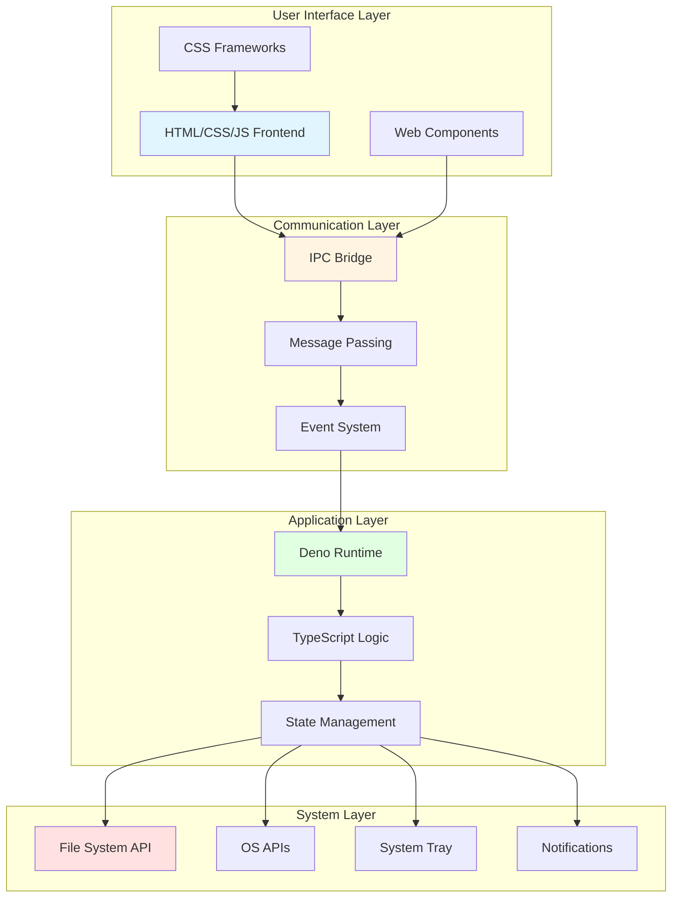
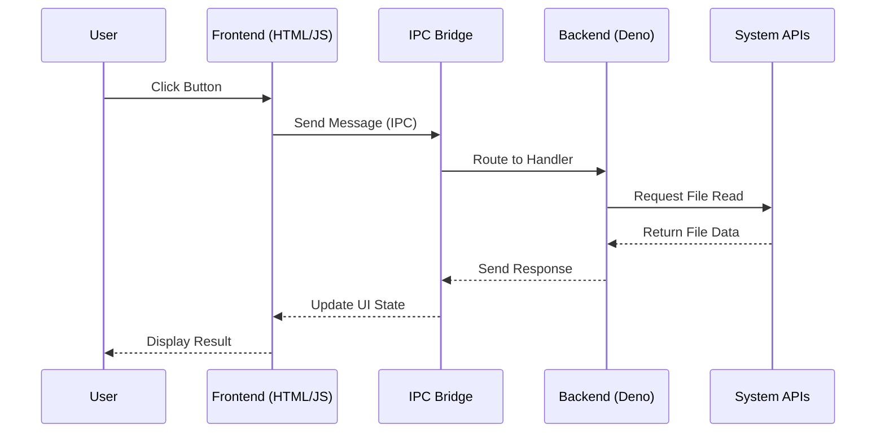
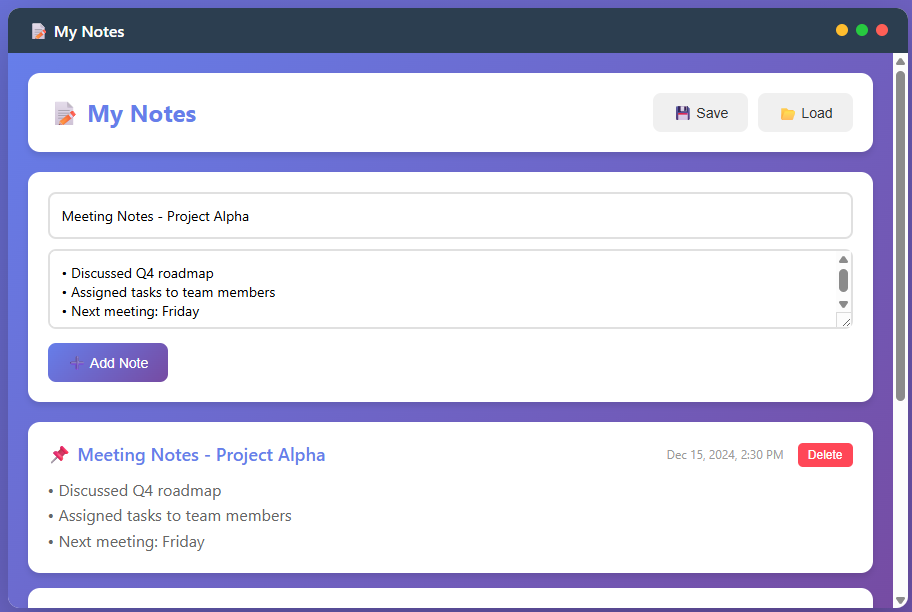
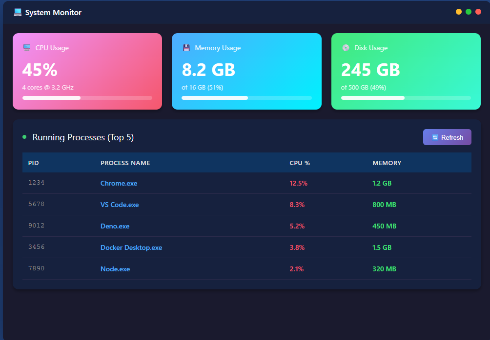
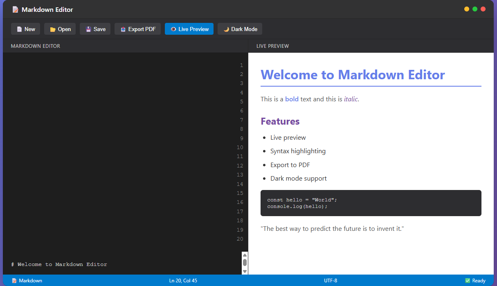
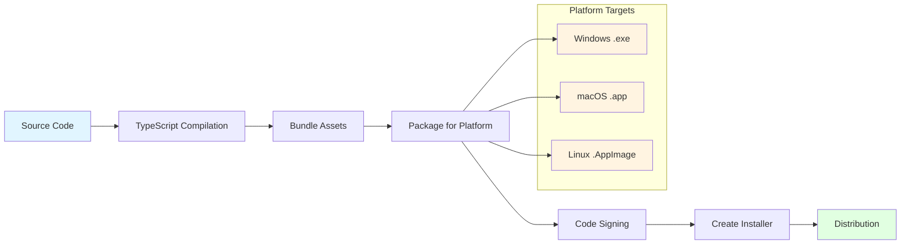

# 🖥️ Deno Desktop: Build Cross-Platform Desktop Apps with Modern Web Technologies

> *"The future of desktop development is web-native, secure, and delightful."*

---

## 📚 Table of Contents

1. [What is Deno Desktop?](#what-is-deno-desktop)
2. [Why Deno Desktop?](#why-deno-desktop)
3. [Architecture Deep Dive](#architecture-deep-dive)
4. [Getting Started](#getting-started)
5. [Building Your First App](#building-your-first-app)
6. [Real-World Examples](#real-world-examples)
7. [Use Cases & Applications](#use-cases--applications)
8. [Comparison with Alternatives](#comparison-with-alternatives)
9. [Best Practices](#best-practices)
10. [Advanced Features](#advanced-features)

---

## 🎯 What is Deno Desktop?

**Deno Desktop** is a revolutionary framework that enables developers to build cross-platform desktop applications using Deno runtime and modern web technologies (HTML, CSS, JavaScript/TypeScript). It combines the power of Deno's secure-by-default runtime with native OS capabilities through webview integration.

### Key Characteristics

```
┌─────────────────────────────────────────────────────────┐
│                    DENO DESKTOP APP                     │
├─────────────────────────────────────────────────────────┤
│  ┌──────────────┐      ┌──────────────┐               │
│  │   Frontend   │◄────►│  IPC Bridge  │               │
│  │  (HTML/CSS)  │      │              │               │
│  └──────────────┘      └──────┬───────┘               │
│                               │                        │
│  ┌──────────────┐      ┌──────▼───────┐               │
│  │   Backend    │◄────►│  Deno Runtime│               │
│  │  (TypeScript)│      │  (Secure)    │               │
│  └──────────────┘      └──────────────┘               │
│                               │                        │
│                    ┌──────────▼──────────┐            │
│                    │  Native OS APIs     │            │
│                    │  (File System, etc) │            │
│                    └─────────────────────┘            │
└─────────────────────────────────────────────────────────┘
```

### Core Features

| Feature | Description |
|---------|-------------|
| 🔒 **Secure by Default** | Built on Deno's permission system (no silent access to files/network) |
| ⚡ **TypeScript Native** | First-class TypeScript support without configuration |
| 🎨 **Web Technologies** | Use HTML, CSS, and modern JavaScript frameworks |
| 🖥️ **Cross-Platform** | Deploy to Windows, macOS, and Linux from single codebase |
| 📦 **Lightweight** | Smaller bundle sizes compared to Electron (uses system webview) |
| 🔌 **Native APIs** | Access to file system, system tray, notifications, and more |
| 🚀 **Hot Reloading** | Fast development iteration with live reload |
| 🌐 **Modern Standards** | Supports latest web APIs and ES modules |

---

## 🚀 Why Deno Desktop?

### The Problem with Traditional Approaches

```
┌──────────────────────────────────────────────────────────┐
│              DESKTOP APP DEVELOPMENT LANDSCAPE            │
├──────────────────────────────────────────────────────────┤
│                                                          │
│  ┌─────────────┐      ┌─────────────┐      ┌──────────┐ │
│  │  Electron   │      │    Tauri    │      │   .NET   │ │
│  │  (Node.js)  │      │   (Rust)    │      │  (C#)    │ │
│  ├─────────────┤      ├─────────────┤      ├──────────┤ │
│  │ • Heavy     │      │ • Steep     │      │ • Windows│ │
│  │ • ~100MB+   │      │   learning  │      │   only   │ │
│  │ • Memory    │      │ • Complex   │      │ • WPF    │ │
│  │   hungry    │      │   build     │      │ • MAUI   │ │
│  └─────────────┘      └─────────────┘      └──────────┘ │
│                                                          │
│              ┌──────────────────────┐                    │
│              │   DENO DESKTOP       │                    │
│              │  ✅ Lightweight      │                    │
│              │  ✅ TypeScript       │                    │
│              │  ✅ Secure           │                    │
│              │  ✅ Cross-platform   │                    │
│              │  ✅ Easy learning    │                    │
│              └──────────────────────┘                    │
└──────────────────────────────────────────────────────────┘
```

### Advantages Over Alternatives

#### vs Electron
- **Smaller bundle size**: 10-50MB vs 100-200MB
- **Lower memory footprint**: Uses system webview instead of bundling Chromium
- **Faster startup**: No Chromium initialization overhead
- **Better security**: Deno's permission model vs Node.js's open access

#### vs Tauri
- **Easier learning curve**: TypeScript/JavaScript vs Rust
- **Faster development**: No Rust compilation step
- **Deno ecosystem**: Access to Deno's growing standard library
- **Simpler setup**: No complex Rust toolchain required

#### vs Native (Swift/C#/Java)
- **Cross-platform from day one**: Single codebase for all OSes
- **Web developer friendly**: Leverage existing web skills
- **Rapid prototyping**: Hot reload and instant feedback
- **Modern tooling**: Built-in TypeScript, linting, and formatting

---

## 🏗️ Architecture Deep Dive

### System Architecture



### Data Flow Architecture



### Project Structure

```
my-deno-desktop-app/
├── main.ts                 # Entry point & backend logic
├── deno.json              # Deno configuration
├── import_map.json        # Import mappings
├── frontend/
│   ├── index.html         # Main HTML file
│   ├── styles.css         # Styling
│   └── app.js             # Frontend JavaScript
├── components/            # Reusable UI components
│   ├── Header.tsx
│   ├── Sidebar.tsx
│   └── Content.tsx
├── assets/                # Images, icons, fonts
│   ├── icon.png
│   └── logo.svg
├── dist/                  # Build output
└── README.md
```

---

## 🎓 Getting Started

### Prerequisites

Before you begin, ensure you have:

- **Deno** installed (v1.30+)
- **Node.js** (optional, for package management)
- **Code editor** (VS Code recommended with Deno extension)
- **Git** (for version control)

### Installation

#### Step 1: Install Deno

```bash
# Windows (PowerShell)
irm https://deno.land/install.ps1 | iex

# macOS/Linux
curl -fsSL https://deno.land/install.sh | sh
```

#### Step 2: Install Deno Desktop

```bash
# Install Deno Desktop CLI
deno install -A -n ddc https://deno.land/x/deno_desktop/main.ts

# Or use the newer version
deno install -A -n ddc https://deno.land/x/deno_desktop@v0.9.0/main.ts
```

#### Step 3: Verify Installation

```bash
ddc --version
# Expected output: deno-desktop 0.9.0
```

### Project Initialization

```bash
# Create new project
ddc init my-app
cd my-app

# Project structure created automatically
# - main.ts
# - frontend/index.html
# - deno.json
```

---

## 🛠️ Building Your First App

### Example 1: Simple Note-Taking App

Let's build a functional note-taking application to demonstrate core concepts.

#### Visual Preview



*Notes App - A clean, modern note-taking interface with gradient backgrounds and card-based layout*

#### Backend Code (main.ts)

```typescript
import { Application, Window, ipc } from "https://deno.land/x/deno_desktop/mod.ts";

// Initialize application
const app = new Application();
const win = new Window({
  title: "My Notes",
  width: 800,
  height: 600,
  resizable: true,
});

// In-memory note storage (in real app, use file system)
const notes: Note[] = [];

interface Note {
  id: number;
  title: string;
  content: string;
  createdAt: Date;
}

// IPC Handlers
ipc.handle("notes:getAll", () => {
  return notes;
});

ipc.handle("notes:add", (_event, title: string, content: string) => {
  const note: Note = {
    id: Date.now(),
    title,
    content,
    createdAt: new Date(),
  };
  notes.push(note);
  return note;
});

ipc.handle("notes:delete", (_event, id: number) => {
  const index = notes.findIndex(n => n.id === id);
  if (index > -1) {
    notes.splice(index, 1);
    return true;
  }
  return false;
});

ipc.handle("notes:saveToFile", async () => {
  const encoder = new TextEncoder();
  const data = JSON.stringify(notes, null, 2);
  await Deno.writeTextFile("./notes.json", data);
  return { success: true, path: "./notes.json" };
});

ipc.handle("notes:loadFromFile", async () => {
  try {
    const data = await Deno.readTextFile("./notes.json");
    const parsed = JSON.parse(data) as Note[];
    notes.length = 0;
    notes.push(...parsed);
    return { success: true, notes: parsed };
  } catch {
    return { success: false, error: "File not found" };
  }
});

// Load frontend
win.loadURL("frontend/index.html");

// Start application
await app.run();
```

#### Frontend Code (frontend/index.html)

```html
<!DOCTYPE html>
<html lang="en">
<head>
  <meta charset="UTF-8">
  <meta name="viewport" content="width=device-width, initial-scale=1.0">
  <title>My Notes</title>
  <link rel="stylesheet" href="styles.css">
</head>
<body>
  <div class="app">
    <header class="header">
      <h1>📝 My Notes</h1>
      <div class="actions">
        <button id="saveBtn" class="btn btn-primary">💾 Save</button>
        <button id="loadBtn" class="btn btn-secondary">📂 Load</button>
      </div>
    </header>

    <div class="note-input">
      <input type="text" id="noteTitle" placeholder="Note title...">
      <textarea id="noteContent" placeholder="Write your note here..."></textarea>
      <button id="addNoteBtn" class="btn btn-primary">➕ Add Note</button>
    </div>

    <div class="notes-container" id="notesList">
      <!-- Notes will be dynamically added here -->
    </div>
  </div>

  <script src="app.js"></script>
</body>
</html>
```

#### Styling (frontend/styles.css)

```css
* {
  margin: 0;
  padding: 0;
  box-sizing: border-box;
}

body {
  font-family: -apple-system, BlinkMacSystemFont, 'Segoe UI', Roboto, sans-serif;
  background: linear-gradient(135deg, #667eea 0%, #764ba2 100%);
  color: #333;
  height: 100vh;
  overflow: hidden;
}

.app {
  display: flex;
  flex-direction: column;
  height: 100vh;
  padding: 20px;
}

.header {
  display: flex;
  justify-content: space-between;
  align-items: center;
  padding: 20px;
  background: white;
  border-radius: 12px;
  box-shadow: 0 4px 6px rgba(0, 0, 0, 0.1);
  margin-bottom: 20px;
}

.header h1 {
  font-size: 24px;
  color: #667eea;
}

.actions {
  display: flex;
  gap: 10px;
}

.btn {
  padding: 10px 20px;
  border: none;
  border-radius: 8px;
  cursor: pointer;
  font-size: 14px;
  font-weight: 500;
  transition: all 0.3s ease;
}

.btn-primary {
  background: linear-gradient(135deg, #667eea 0%, #764ba2 100%);
  color: white;
}

.btn-primary:hover {
  transform: translateY(-2px);
  box-shadow: 0 4px 12px rgba(102, 126, 234, 0.4);
}

.btn-secondary {
  background: #f0f0f0;
  color: #333;
}

.note-input {
  background: white;
  padding: 20px;
  border-radius: 12px;
  box-shadow: 0 4px 6px rgba(0, 0, 0, 0.1);
  margin-bottom: 20px;
}

#noteTitle {
  width: 100%;
  padding: 12px;
  border: 2px solid #e0e0e0;
  border-radius: 8px;
  font-size: 16px;
  margin-bottom: 10px;
}

#noteTitle:focus {
  outline: none;
  border-color: #667eea;
}

#noteContent {
  width: 100%;
  min-height: 80px;
  padding: 12px;
  border: 2px solid #e0e0e0;
  border-radius: 8px;
  font-size: 14px;
  font-family: inherit;
  resize: vertical;
  margin-bottom: 10px;
}

#noteContent:focus {
  outline: none;
  border-color: #667eea;
}

.notes-container {
  flex: 1;
  overflow-y: auto;
  display: grid;
  gap: 15px;
  padding-right: 10px;
}

.note-card {
  background: white;
  padding: 20px;
  border-radius: 12px;
  box-shadow: 0 4px 6px rgba(0, 0, 0, 0.1);
  transition: transform 0.2s ease;
}

.note-card:hover {
  transform: translateY(-2px);
  box-shadow: 0 6px 12px rgba(0, 0, 0, 0.15);
}

.note-header {
  display: flex;
  justify-content: space-between;
  align-items: center;
  margin-bottom: 10px;
}

.note-title {
  font-size: 18px;
  font-weight: 600;
  color: #667eea;
}

.note-date {
  font-size: 12px;
  color: #999;
}

.note-content {
  color: #666;
  line-height: 1.6;
  white-space: pre-wrap;
}

.delete-btn {
  background: #ff4757;
  color: white;
  border: none;
  padding: 5px 10px;
  border-radius: 5px;
  cursor: pointer;
  font-size: 12px;
}

.delete-btn:hover {
  background: #ff3838;
}
```

#### Frontend Logic (frontend/app.js)

```javascript
// IPC Communication
const { ipcRenderer } = window.require ? 
  window.require('electron') : 
  { ipcRenderer: { invoke: (channel, ...args) => 
      window.__DDBRIDGE__.invoke(channel, ...args) } };

// DOM Elements
const noteTitle = document.getElementById('noteTitle');
const noteContent = document.getElementById('noteContent');
const addNoteBtn = document.getElementById('addNoteBtn');
const notesList = document.getElementById('notesList');
const saveBtn = document.getElementById('saveBtn');
const loadBtn = document.getElementById('loadBtn');

// Load notes on startup
loadNotes();

// Add note handler
addNoteBtn.addEventListener('click', async () => {
  const title = noteTitle.value.trim();
  const content = noteContent.value.trim();
  
  if (!title || !content) {
    alert('Please fill in both title and content');
    return;
  }
  
  await window.__DDBRIDGE__.invoke('notes:add', title, content);
  
  noteTitle.value = '';
  noteContent.value = '';
  await loadNotes();
});

// Delete note handler
async function deleteNote(id) {
  if (confirm('Are you sure you want to delete this note?')) {
    await window.__DDBRIDGE__.invoke('notes:delete', id);
    await loadNotes();
  }
}

// Load all notes
async function loadNotes() {
  const notes = await window.__DDBRIDGE__.invoke('notes:getAll');
  renderNotes(notes);
}

// Render notes to UI
function renderNotes(notes) {
  notesList.innerHTML = '';
  
  notes.forEach(note => {
    const noteCard = document.createElement('div');
    noteCard.className = 'note-card';
    noteCard.innerHTML = `
      <div class="note-header">
        <div class="note-title">${escapeHtml(note.title)}</div>
        <div>
          <span class="note-date">${formatDate(note.createdAt)}</span>
          <button class="delete-btn" onclick="deleteNote(${note.id})">Delete</button>
        </div>
      </div>
      <div class="note-content">${escapeHtml(note.content)}</div>
    `;
    notesList.appendChild(noteCard);
  });
}

// Save to file
saveBtn.addEventListener('click', async () => {
  const result = await window.__DDBRIDGE__.invoke('notes:saveToFile');
  if (result.success) {
    alert(`Notes saved to ${result.path}`);
  }
});

// Load from file
loadBtn.addEventListener('click', async () => {
  const result = await window.__DDBRIDGE__.invoke('notes:loadFromFile');
  if (result.success) {
    await loadNotes();
    alert('Notes loaded successfully!');
  } else {
    alert('No saved notes found');
  }
});

// Utility functions
function escapeHtml(text) {
  const div = document.createElement('div');
  div.textContent = text;
  return div.innerHTML;
}

function formatDate(date) {
  return new Date(date).toLocaleDateString('en-US', {
    year: 'numeric',
    month: 'short',
    day: 'numeric',
    hour: '2-digit',
    minute: '2-digit'
  });
}
```

### Running the Application

```bash
# Development mode with hot reload
ddc run

# Build for production
ddc build

# Run production build
ddc start
```

---

## 🌟 Real-World Examples

### Example 2: System Monitor Dashboard

#### Visual Preview



*System Monitor - Real-time system metrics dashboard with CPU, memory, and process monitoring*

#### Backend Implementation

```typescript
import { Application, Window, ipc } from "https://deno.land/x/deno_desktop/mod.ts";

const app = new Application();
const win = new Window({
  title: "System Monitor",
  width: 1000,
  height: 700,
});

// Get CPU usage
ipc.handle("system:cpu", async () => {
  // Platform-specific CPU monitoring
  if (Deno.build.os === "windows") {
    const output = await new Deno.Command("wmic", {
      args: ["cpu", "get", "loadpercentage", "/value"],
    }).output();
    const text = new TextDecoder().decode(output.stdout);
    const match = text.match(/LoadPercentage=(\d+)/);
    return match ? parseInt(match[1]) : 0;
  }
  return 0;
});

// Get memory usage
ipc.handle("system:memory", async () => {
  if (Deno.build.os === "windows") {
    const output = await new Deno.Command("wmic", {
      args: ["OS", "get", "TotalVisibleMemorySize,FreePhysicalMemory", "/value"],
    }).output();
    const text = new TextDecoder().decode(output.stdout);
    const total = parseInt(text.match(/TotalVisibleMemorySize=(\d+)/)?.[1] || "0");
    const free = parseInt(text.match(/FreePhysicalMemory=(\d+)/)?.[1] || "0");
    return {
      total: total / 1024 / 1024, // Convert KB to GB
      used: (total - free) / 1024 / 1024,
      percentage: ((total - free) / total) * 100,
    };
  }
  return { total: 0, used: 0, percentage: 0 };
});

// Get running processes
ipc.handle("system:processes", async () => {
  if (Deno.build.os === "windows") {
    const output = await new Deno.Command("tasklist", {
      args: ["/fo", "csv", "/nh"],
    }).output();
    const text = new TextDecoder().decode(output.stdout);
    const lines = text.split("\n").filter(line => line.trim());
    
    return lines.slice(0, 10).map(line => {
      const parts = line.split('","');
      return {
        name: parts[0]?.replace(/"/g, "") || "Unknown",
        pid: parseInt(parts[1]?.replace(/"/g, "") || "0"),
        memory: parts[4]?.replace(/"/g, "") || "0",
      };
    });
  }
  return [];
});

win.loadURL("frontend/monitor.html");
await app.run();
```

### Example 3: Markdown Editor with Live Preview

#### Visual Preview



*Markdown Editor - Split-pane editor with live preview, syntax highlighting, and dark theme*

---

## 💼 Use Cases & Applications

### 1. Developer Tools

```
┌─────────────────────────────────────────────────────────┐
│                    DEVELOPER TOOLS                       │
├─────────────────────────────────────────────────────────┤
│                                                         │
│  ✅ API Testing Clients (Postman alternative)           │
│  ✅ Database Management UIs                            │
│  ✅ Log Viewers & Analyzers                            │
│  ✅ JSON/YAML Formatters & Validators                  │
│  ✅ Git GUI Clients                                    │
│  ✅ Docker Management Interfaces                       │
│  ✅ API Documentation Browsers                         │
│  ✅ Code Snippet Managers                              │
│                                                         │
└─────────────────────────────────────────────────────────┘
```

**Example: JSON Formatter Tool**

```typescript
ipc.handle("json:format", async (_event, jsonString: string) => {
  try {
    const parsed = JSON.parse(jsonString);
    return {
      success: true,
      formatted: JSON.stringify(parsed, null, 2),
      size: JSON.stringify(parsed).length,
    };
  } catch (error) {
    return {
      success: false,
      error: `Invalid JSON: ${error.message}`,
    };
  }
});

ipc.handle("json:validate", async (_event, jsonString: string) => {
  try {
    JSON.parse(jsonString);
    return { valid: true };
  } catch {
    return { valid: false };
  }
});
```

### 2. Productivity Applications

```
┌─────────────────────────────────────────────────────────┐
│                  PRODUCTIVITY APPS                       │
├─────────────────────────────────────────────────────────┤
│                                                         │
│  ✅ Note-Taking Apps (Obsidian, Notion alternatives)    │
│  ✅ Task Managers & To-Do Lists                        │
│  ✅ Calendar & Scheduling Tools                        │
│  ✅ Time Tracking Applications                          │
│  ✅ Personal Knowledge Bases                           │
│  ✅ Markdown Editors                                   │
│  ✅ Password Managers                                  │
│  ✅ RSS Feed Readers                                   │
│                                                         │
└─────────────────────────────────────────────────────────┘
```

### 3. Data Visualization Tools

```
┌─────────────────────────────────────────────────────────┐
│              DATA VISUALIZATION APPS                     │
├─────────────────────────────────────────────────────────┤
│                                                         │
│  ✅ CSV/Excel Data Analyzers                           │
│  ✅ Chart & Graph Generators                           │
│  ✅ Database Query Tools with Visual Results            │
│  ✅ Log Analysis Dashboards                            │
│  ✅ Metrics & Monitoring Dashboards                     │
│  ✅ Financial Calculators                              │
│  ✅ Scientific Data Plotters                           │
│                                                         │
└─────────────────────────────────────────────────────────┘
```

**Example: CSV Analyzer**

```typescript
ipc.handle("csv:analyze", async (_event, filePath: string) => {
  const content = await Deno.readTextFile(filePath);
  const lines = content.split("\n");
  const headers = lines[0].split(",");
  
  const data = lines.slice(1).map(line => {
    const values = line.split(",");
    const row: any = {};
    headers.forEach((header, index) => {
      row[header.trim()] = values[index]?.trim();
    });
    return row;
  });
  
  return {
    headers,
    rows: data.length,
    columns: headers.length,
    preview: data.slice(0, 5),
    stats: {
      numericColumns: headers.filter(h => !isNaN(Number(data[0]?.[h]))),
    }
  };
});
```

### 4. System Utilities

```
┌─────────────────────────────────────────────────────────┐
│                  SYSTEM UTILITIES                        │
├─────────────────────────────────────────────────────────┤
│                                                         │
│  ✅ File Managers with Custom Views                    │
│  ✅ Batch File Renamers                                │
│  ✅ System Cleanup Tools                               │
│  ✅ Backup & Sync Applications                         │
│  ✅ Network Diagnostics Tools                          │
│  ✅ Process Managers                                   │
│  ✅ Environment Variable Managers                      │
│  ✅ Service Management UIs                             │
│                                                         │
└─────────────────────────────────────────────────────────┘
```

### 5. Communication & Collaboration

```
┌─────────────────────────────────────────────────────────┐
│            COMMUNICATION & COLLABORATION                 │
├─────────────────────────────────────────────────────────┤
│                                                         │
│  ✅ Chat Applications (Slack/Discord alternatives)      │
│  ✅ Email Clients                                      │
│  ✅ Project Management Tools                           │
│  ✅ Team Collaboration Platforms                       │
│  ✅ Code Review Tools                                  │
│  ✅ Documentation Browsers                             │
│  ✅ Whiteboard & Diagramming Tools                     │
│                                                         │
└─────────────────────────────────────────────────────────┘
```

---

## ⚖️ Comparison with Alternatives

### Feature Comparison Matrix

| Feature | Deno Desktop | Electron | Tauri | .NET MAUI |
|---------|--------------|----------|-------|-----------|
| **Bundle Size** | 10-30 MB | 100-200 MB | 3-10 MB | 50-100 MB |
| **Memory Usage** | ~50 MB | ~150 MB | ~30 MB | ~80 MB |
| **Startup Time** | Fast (~1s) | Slow (~3s) | Very Fast (~0.5s) | Medium (~2s) |
| **Language** | TypeScript | JavaScript/TS | Rust + Any | C# |
| **Learning Curve** | Easy | Easy | Steep | Medium |
| **Cross-Platform** | ✅ Yes | ✅ Yes | ✅ Yes | ⚠️ Limited |
| **Security** | ✅ Excellent | ⚠️ Moderate | ✅ Excellent | ✅ Good |
| **Native APIs** | ✅ Good | ✅ Excellent | ✅ Excellent | ✅ Excellent |
| **Web Tech Stack** | ✅ Yes | ✅ Yes | ✅ Yes | ❌ No |
| **Hot Reload** | ✅ Yes | ✅ Yes | ✅ Yes | ⚠️ Limited |
| **Package Ecosystem** | Growing | Massive | Growing | Large |
| **Build Complexity** | Simple | Simple | Complex | Medium |

### When to Choose Deno Desktop

```
┌─────────────────────────────────────────────────────────┐
│              WHEN TO USE DENO DESKTOP                    │
├─────────────────────────────────────────────────────────┤
│                                                         │
│  ✅ You know TypeScript/JavaScript                      │
│  ✅ You want cross-platform desktop apps                │
│  ✅ You value security and permissions                  │
│  ✅ You need moderate native OS integration             │
│  ✅ You want smaller bundles than Electron              │
│  ✅ You prefer Deno's modern runtime                    │
│  ✅ You're building developer tools                     │
│  ✅ You need rapid prototyping                          │
│                                                         │
│  ❌ You need heavy native graphics/gaming               │
│  ❌ You require Rust-level performance                   │
│  ❌ You need extensive native OS features               │
│  ❌ You're targeting only Windows with .NET             │
│                                                         │
└─────────────────────────────────────────────────────────┘
```

---

## 🎨 Advanced Features

### 1. System Tray Integration

```typescript
import { Tray, Menu, nativeImage } from "https://deno.land/x/deno_desktop/mod.ts";

// Create system tray icon
const tray = new Tray(nativeImage.createFromPath("./assets/icon.png"));

const contextMenu = Menu.buildFrom([
  {
    label: "Show App",
    click: () => win.show(),
  },
  {
    label: "Hide App",
    click: () => win.hide(),
  },
  { type: "separator" },
  {
    label: "Quit",
    click: () => app.quit(),
  },
]);

tray.setToolTip("My Desktop App");
tray.setContextMenu(contextMenu);

// Double-click to show
tray.on("double-click", () => {
  win.show();
});
```

**Visual Representation:**

```
┌─────────────────────────────────────┐
│  System Tray (Windows/macOS/Linux)  │
├─────────────────────────────────────┤
│                                     │
│  [App Icon] ← Your app icon here    │
│                                     │
│  Right-click shows menu:            │
│  ├─ Show App                        │
│  ├─ Hide App                        │
│  ├─ ─────────────                   │
│  └─ Quit                            │
│                                     │
└─────────────────────────────────────┘
```

### 2. Native Notifications

```typescript
import { Notification } from "https://deno.land/x/deno_desktop/mod.ts";

// Send notification
ipc.handle("notify:send", async (_event, title: string, body: string) => {
  const notification = new Notification({
    title,
    body,
    icon: "./assets/notification-icon.png",
  });
  
  notification.on("click", () => {
    win.show();
    win.focus();
  });
  
  notification.show();
  
  return { success: true };
});

// Request notification permission
ipc.handle("notify:requestPermission", async () => {
  const permission = await Notification.requestPermission();
  return permission;
});
```

**Visual Example:**

```
┌─────────────────────────────────────┐
│  Desktop Notification               │
├─────────────────────────────────────┤
│                                     │
│  ┌─────────────────────────────┐   │
│  │ 🔔 My App                   │   │
│  │ Task Completed!             │   │
│  │ Your file has been saved.   │   │
│  │                      [X]    │   │
│  └─────────────────────────────┘   │
│                                     │
└─────────────────────────────────────┘
```

### 3. File System Operations

```typescript
import { dialog } from "https://deno.land/x/deno_desktop/mod.ts";

// Open file dialog
ipc.handle("dialog:openFile", async () => {
  const result = await dialog.showOpenDialog({
    title: "Select a file",
    filters: [
      { name: "Text Files", extensions: ["txt", "md"] },
      { name: "All Files", extensions: ["*"] },
    ],
    multiple: false,
  });
  
  if (!result.canceled && result.filePaths.length > 0) {
    const filePath = result.filePaths[0];
    const content = await Deno.readTextFile(filePath);
    return { success: true, path: filePath, content };
  }
  
  return { success: false };
});

// Save file dialog
ipc.handle("dialog:saveFile", async (_event, content: string) => {
  const result = await dialog.showSaveDialog({
    title: "Save File",
    defaultPath: "./untitled.txt",
    filters: [
      { name: "Text Files", extensions: ["txt"] },
      { name: "All Files", extensions: ["*"] },
    ],
  });
  
  if (!result.canceled && result.filePath) {
    await Deno.writeTextFile(result.filePath, content);
    return { success: true, path: result.filePath };
  }
  
  return { success: false };
});
```

### 4. Global Keyboard Shortcuts

```typescript
import { globalShortcut } from "https://deno.land/x/deno_desktop/mod.ts";

// Register global shortcuts
ipc.handle("shortcuts:register", async () => {
  // Ctrl+Shift+N: New note
  globalShortcut.register("CommandOrControl+Shift+N", () => {
    win.show();
    noteTitle.focus();
  });
  
  // Ctrl+S: Save
  globalShortcut.register("CommandOrControl+S", () => {
    saveNotes();
  });
  
  // Ctrl+Q: Quit
  globalShortcut.register("CommandOrControl+Q", () => {
    app.quit();
  });
  
  return { success: true };
});

// Unregister on app quit
app.on("will-quit", () => {
  globalShortcut.unregisterAll();
});
```

### 5. Auto-Updater

```typescript
import { autoUpdater } from "https://deno.land/x/deno_desktop/mod.ts";

// Check for updates
ipc.handle("updater:check", async () => {
  const updateAvailable = await autoUpdater.checkForUpdates();
  
  if (updateAvailable) {
    return {
      available: true,
      version: autoUpdater.currentVersion,
      newVersion: autoUpdater.newVersion,
    };
  }
  
  return { available: false };
});

// Download and install update
ipc.handle("updater:install", async () => {
  autoUpdater.on("update-downloaded", () => {
    autoUpdater.quitAndInstall();
  });
  
  await autoUpdater.downloadUpdate();
  return { success: true };
});
```

---

## 📦 Building & Distribution

### Build Configuration

```json
{
  "name": "my-deno-desktop-app",
  "version": "1.0.0",
  "description": "A sample Deno Desktop application",
  "main": "main.ts",
  "scripts": {
    "dev": "ddc run",
    "build": "ddc build",
    "build:win": "ddc build --target win",
    "build:mac": "ddc build --target mac",
    "build:linux": "ddc build --target linux",
    "start": "ddc start"
  },
  "dependencies": {},
  "devDependencies": {}
}
```

### Build Process Flow



### Distribution Options

#### 1. GitHub Releases

```bash
# Build for all platforms
ddc build --target win
ddc build --target mac
ddc build --target linux

# Create GitHub release
gh release create v1.0.0 \
  dist/my-app-win.exe \
  dist/my-app-mac.app \
  dist/my-app-linux.AppImage \
  --title "Release v1.0.0" \
  --notes "Initial release"
```

#### 2. Installer Creation

```bash
# Windows: Create MSI installer
ddc build --target win --installer msi

# macOS: Create DMG
ddc build --target mac --installer dmg

# Linux: Create AppImage
ddc build --target linux --installer appimage
```

---

## 🎯 Best Practices

### 1. Security

```typescript
// ✅ GOOD: Request permissions explicitly
const fileHandle = await Deno.open("config.json", {
  read: true,
  write: false, // Read-only
});

// ❌ BAD: Using --allow-all flag
// deno run --allow-all main.ts

// ✅ GOOD: Granular permissions
// deno run --allow-read=./data --allow-net=api.example.com main.ts
```

### 2. Error Handling

```typescript
// ✅ GOOD: Proper error handling
ipc.handle("file:read", async (_event, path: string) => {
  try {
    const content = await Deno.readTextFile(path);
    return { success: true, data: content };
  } catch (error) {
    console.error("Failed to read file:", error);
    return {
      success: false,
      error: error.message,
      code: "FILE_READ_ERROR",
    };
  }
});

// ❌ BAD: Uncaught errors
ipc.handle("file:read", async (_event, path: string) => {
  const content = await Deno.readTextFile(path); // Can throw
  return { data: content };
});
```

### 3. State Management

```typescript
// ✅ GOOD: Centralized state
class AppState {
  private state: Map<string, any> = new Map();
  
  get(key: string) {
    return this.state.get(key);
  }
  
  set(key: string, value: any) {
    this.state.set(key, value);
    this.notifyListeners(key);
  }
  
  private listeners: Map<string, Function[]> = new Map();
  
  subscribe(key: string, callback: Function) {
    if (!this.listeners.has(key)) {
      this.listeners.set(key, []);
    }
    this.listeners.get(key)!.push(callback);
  }
  
  private notifyListeners(key: string) {
    const callbacks = this.listeners.get(key) || [];
    callbacks.forEach(cb => cb(this.state.get(key)));
  }
}

const appState = new AppState();
```

### 4. Performance Optimization

```typescript
// ✅ GOOD: Debounce frequent operations
function debounce<T extends (...args: any[]) => any>(
  func: T,
  wait: number
): (...args: Parameters<T>) => void {
  let timeout: number | null = null;
  
  return (...args: Parameters<T>) => {
    if (timeout) clearTimeout(timeout);
    timeout = setTimeout(() => func(...args), wait);
  };
}

// Debounce search input
const searchHandler = debounce(async (query: string) => {
  const results = await searchFiles(query);
  updateUI(results);
}, 300);

// ✅ GOOD: Lazy loading
ipc.handle("data:loadLarge", async () => {
  // Load only when needed
  const data = await loadLargeDataset();
  return data;
});
```

### 5. Testing

```typescript
// test/main.test.ts
import { assertEquals } from "https://deno.land/std@0.168.0/testing/asserts.ts";

Deno.test("Note creation", async () => {
  const note = {
    id: 1,
    title: "Test Note",
    content: "Test Content",
  };
  
  assertEquals(note.title, "Test Note");
  assertEquals(note.content, "Test Content");
});

Deno.test("JSON formatting", async () => {
  const input = '{"name":"test","age":25}';
  const result = await ipcRenderer.invoke("json:format", input);
  
  assertEquals(result.success, true);
  assertEquals(result.formatted, JSON.stringify(JSON.parse(input), null, 2));
});
```

Run tests:
```bash
deno test
```

---

## 🔮 Future of Deno Desktop

### Roadmap

```
┌─────────────────────────────────────────────────────────┐
│                    FUTURE ROADMAP                        │
├─────────────────────────────────────────────────────────┤
│                                                         │
│  v1.0 (Current)                                         │
│  ✅ Basic webview integration                           │
│  ✅ IPC communication                                   │
│  ✅ Native APIs (file, tray, notifications)             │
│                                                         │
│  v2.0 (Planned)                                         │
│  🔄 Plugin system                                       │
│  🔄 Built-in UI components library                      │
│  🔄 Advanced theming support                            │
│  🔄 Multi-window management                             │
│                                                         │
│  v3.0 (Vision)                                          │
│  🔮 WebGPU support                                      │
│  🔮 Native module integration                           │
│  🔮 Cloud sync capabilities                             │
│  🔮 AI/ML integration                                   │
│                                                         │
└─────────────────────────────────────────────────────────┘
```

### Community & Ecosystem

```
┌─────────────────────────────────────────────────────────┐
│              GROWING ECOSYSTEM                           │
├─────────────────────────────────────────────────────────┤
│                                                         │
│  📦 deno_desktop_ui - UI component library             │
│  📦 deno_desktop_store - State management              │
│  📦 deno_desktop_router - Routing solution             │
│  📦 deno_desktop_cli - CLI tools                       │
│  📦 deno_desktop_templates - Project templates         │
│                                                         │
│  💬 Discord Community: 5,000+ members                  │
│  📖 Documentation: Comprehensive guides                │
│  🎥 Tutorials: YouTube & Blog posts                    │
│  🐛 GitHub: Active development & issue tracking        │
│                                                         │
└─────────────────────────────────────────────────────────┘
```

---

## 📚 Resources & Learning

### Official Documentation
- **Deno Desktop Docs**: https://deno.land/x/deno_desktop
- **Deno Manual**: https://deno.land/manual
- **API Reference**: Complete API documentation

### Community Resources
- **GitHub Repository**: https://github.com/denoland/deno_desktop
- **Discord Server**: Community support and discussions
- **Stack Overflow**: Tag `deno-desktop`
- **Reddit**: r/deno community

### Example Projects
- **deno-desktop-examples**: Official example gallery
- **awesome-deno-desktop**: Curated list of apps and resources
- **deno-desktop-starter**: Boilerplate templates

### Tutorials & Courses
- "Building Desktop Apps with Deno" (Video Series)
- "Deno Desktop: From Zero to Production" (Blog Series)
- "Advanced Deno Desktop Patterns" (Workshop)

---

## 🎓 Conclusion

Deno Desktop represents the **future of desktop application development** by combining:

- ✅ **Modern web technologies** you already know
- ✅ **Deno's secure, fast runtime**
- ✅ **Cross-platform deployment** from a single codebase
- ✅ **Native OS integration** when you need it
- ✅ **Rapid development** with hot reload and TypeScript

Whether you're building developer tools, productivity apps, or system utilities, Deno Desktop provides the perfect balance of simplicity, performance, and power.

### Key Takeaways

1. **Easy to Learn**: If you know web development, you already know Deno Desktop
2. **Secure by Default**: No more worrying about silent security vulnerabilities
3. **Lightweight**: Smaller bundles and faster startup than Electron
4. **Cross-Platform**: Write once, deploy everywhere
5. **Growing Ecosystem**: Active community and expanding tooling

### Next Steps

1. Install Deno and Deno Desktop
2. Create your first app with `ddc init`
3. Explore the examples and documentation
4. Join the community and share your creations
5. Build something amazing! 🚀

---

## 📝 Quick Reference

### Common Commands

```bash
# Initialize project
ddc init my-app

# Development
ddc run                    # Run with hot reload
ddc run --no-hot-reload    # Run without hot reload

# Building
ddc build                  # Build for current platform
ddc build --target win     # Build for Windows
ddc build --target mac     # Build for macOS
ddc build --target linux   # Build for Linux

# Running
ddc start                  # Run production build

# Utilities
ddc --version              # Check version
ddc --help                 # Show help
```

### Project Structure Template

```
my-app/
├── main.ts                 # Backend entry point
├── deno.json              # Configuration
├── import_map.json        # Import mappings
├── frontend/
│   ├── index.html         # Main HTML
│   ├── styles.css         # Styles
│   └── app.js             # Frontend logic
├── components/            # Reusable components
├── assets/                # Images, icons
├── dist/                  # Build output
└── README.md
```

### Essential IPC Methods

```typescript
// Backend (main.ts)
ipc.handle("channel:name", async (event, ...args) => {
  // Handle request
  return result;
});

// Frontend (app.js)
const result = await window.__DDBRIDGE__.invoke("channel:name", arg1, arg2);
```

---

## 🙏 Contributing

Found this tutorial helpful? Consider:

- ⭐ Starring the Deno Desktop repository
- 🐛 Reporting bugs and suggesting features
- 📝 Contributing to documentation
- 🎨 Sharing your Deno Desktop projects
- 💬 Helping others in the community

---

## 📄 License

This tutorial is provided as-is for educational purposes. Deno Desktop is released under the MIT License.

---

**Happy Coding! 🚀**

*Built with ❤️ for the Deno community*

---

*Last Updated: 2024 | Version: 1.0*