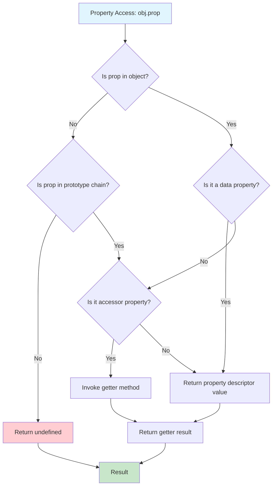
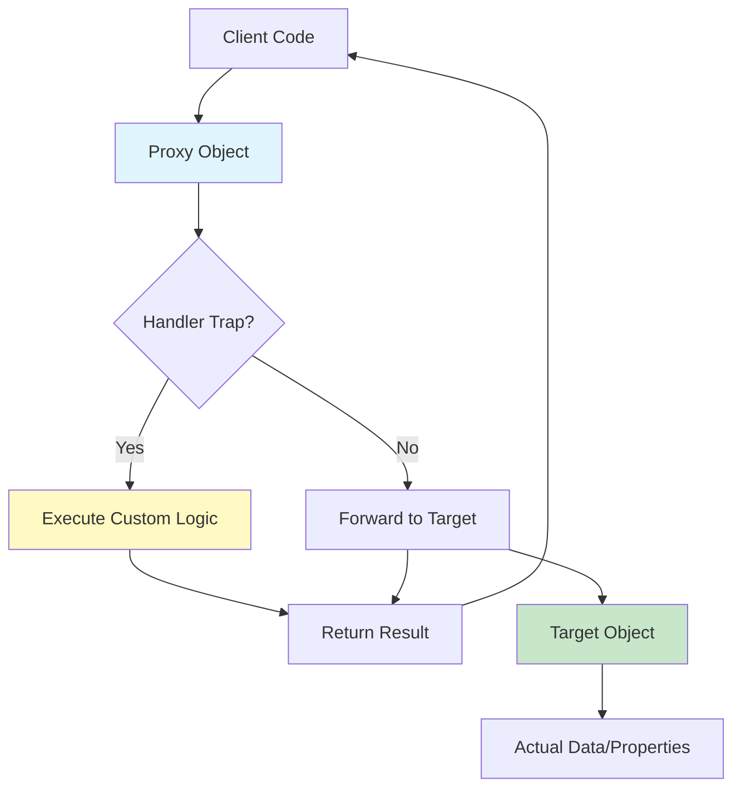
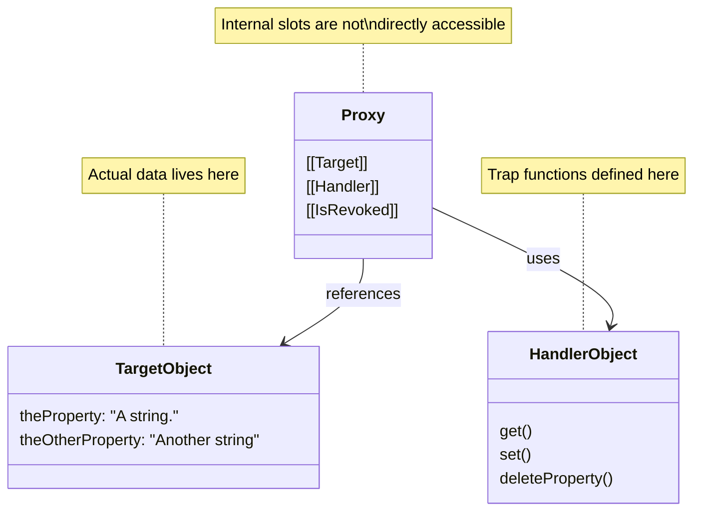

# JavaScript Proxy and Reflect - Complete Deep Dive Tutorial

**Difficulty Level:** ⚡⚡⚡ Intermediate  
**Estimated Reading Time:** 25-30 minutes  
**Last Updated:** January 2026

---

## Table of Contents

1. [Introduction](#introduction)
2. [Prerequisites](#prerequisites)
3. [Learning Objectives](#learning-objectives)
4. [Understanding JavaScript Objects](#understanding-javascript-objects)
5. [Deep Dive into Proxy](#deep-dive-into-proxy)
6. [Deep Dive into Reflect](#deep-dive-into-reflect)
7. [Real-World Use Cases](#real-world-use-cases)
8. [Best Practices](#best-practices)
9. [Anti-Patterns](#anti-patterns)
10. [Performance Considerations](#performance-considerations)
11. [Security Considerations](#security-considerations)
12. [Testing Strategies](#testing-strategies)
13. [Common Pitfalls & Troubleshooting](#common-pitfalls--troubleshooting)
14. [Practice Exercises](#practice-exercises)
15. [Question Bank](#question-bank)
16. [Test Your Understanding](#test-your-understanding)
17. [Common Interview Questions](#common-interview-questions)
18. [Summary & Key Takeaways](#summary--key-takeaways)
19. [Further Reading & Resources](#further-reading--resources)

---

## Introduction

An object is a collection of properties, internal slots, and internal methods that allow us to interact with those properties. When you punch `({}).theProperty` into your developer console, you do so expecting the following choose-your-own-adventure operation to kick off:

- Is that key somewhere along the object's prototype chain?
  - Yes.
    - Is it a data property?
      - Result in the property descriptor's `value`.
    - Is it an accessor property?
      - Invoke the getter method, and result in the value returned by that method.
  - No.
    - Result in `undefined`.

This use of property accessor syntax doesn't itself represent all those steps — rather, dot notation is the API that kicks off an internal `[[Get]]` operation defined by the specification, and the steps taken by that `[[Get]]` operation determine the result.

We can't get in there and tinker with the specific steps taken by an object's internal methods, nor would we likely want to — that's JavaScript engine turf. What we can do is **intercept** those operations by way of a **proxy** object, and in doing so we can alter, expand, or wholesale **redefine** the way that an object works, at its most fundamental levels.

The `Proxy` constructor can be used to create an object that acts as a proxy for a target object, allowing you to intercept and redefine operations performed on the latter by using the former as an intermediary.

> 💡 **Key Insight:** Proxy and Reflect represent JavaScript's metaprogramming capabilities — the ability to write code that manipulates other code. They're the same tools that power modern reactive frameworks like Vue.js and MobX.

---

## Prerequisites

Before diving into this tutorial, you should have:

- ✅ Solid understanding of JavaScript objects and prototypes
- ✅ Familiarity with ES6+ syntax (arrow functions, destructuring, spread operator)
- ✅ Understanding of `this` keyword and context
- ✅ Basic knowledge of JavaScript's internal methods (get, set, etc.)
- ✅ Experience with functional programming concepts (callbacks, higher-order functions)
- ✅ Node.js or modern browser environment for testing examples

---

## Learning Objectives

By the end of this tutorial, you will be able to:

- 🎯 Understand JavaScript's internal object operations ([[Get]], [[Set]], etc.)
- 🎯 Create and use Proxy objects to intercept object operations
- 🎯 Implement handler traps for various object operations
- 🎯 Use Reflect API to maintain object invariants
- 🎯 Build practical applications with Proxies (validation, logging, reactivity)
- 🎯 Identify when to use (and when to avoid) Proxies
- 🎯 Debug and troubleshoot Proxy-related issues
- 🎯 Apply best practices for maintainable Proxy code

---

## Understanding JavaScript Objects

### Internal Methods and Slots

Every JavaScript object has a set of **internal methods** (denoted with double brackets like `[[Get]]`) and **internal slots** that define how it behaves. These are part of the ECMAScript specification and are not directly accessible in JavaScript code.

Common internal methods include:

| Internal Method | Triggered By | Purpose |
|----------------|--------------|---------|
| `[[Get]]` | Property access (`obj.prop`) | Retrieves property value |
| `[[Set]]` | Property assignment (`obj.prop = value`) | Sets property value |
| `[[Has]]` | `in` operator | Checks property existence |
| `[[Delete]]` | `delete` operator | Removes property |
| `[[GetPrototypeOf]]` | `Object.getPrototypeOf()` | Gets prototype chain |
| `[[DefineProperty]]` | `Object.defineProperty()` | Defines property descriptor |

### The Property Access Flow



**Figure 1:** Property access operation flow in JavaScript

---

## Deep Dive into Proxy

### What is a Proxy?

The `Proxy` constructor creates objects that act as intermediaries for target objects, allowing you to intercept and redefine fundamental operations.

**Basic Syntax:**

```javascript
const proxy = new Proxy(target, handler);
```

**Parameters:**
- `target`: The object to wrap (can be any object, including arrays, functions, or even other proxies)
- `handler`: An object containing trap functions that define custom behavior

### Proxy Architecture



**Figure 2:** Proxy interception architecture showing how operations flow through handler traps

### Creating Your First Proxy

```javascript
// Basic proxy with no custom behavior
const targetObject = { theProperty: "A string." };
const handlerObject = {};
const theProxyObject = new Proxy(targetObject, handlerObject);

console.log(theProxyObject.theProperty); // Result: "A string."
console.log(theProxyObject); 
// Result: Proxy { <target>: {…}, <handler>: {} }
```

**Key Points:**
- The proxy object contains internal slots `[[Target]]` and `[[Handler]]`
- Properties are not stored on the proxy itself — they're stored on the target
- The proxy acts as a reference to the target object

### Proxy Internal Slots



**Figure 3:** Proxy object structure showing internal slots and relationships

### Understanding Traps (Handler Methods)

Traps are functions defined on the handler object that intercept operations. Each trap corresponds to an internal method:

```javascript
const handlerObject = {
    get(target, propertyKey, receiver) {
        console.log(`Accessing property: ${propertyKey}`);
        return target[propertyKey];
    },
    
    set(target, propertyKey, value, receiver) {
        console.log(`Setting property: ${propertyKey} = ${value}`);
        return Reflect.set(target, propertyKey, value);
    }
};

const proxy = new Proxy({ name: "John" }, handlerObject);
console.log(proxy.name); // Logs: Accessing property: name
proxy.age = 30; // Logs: Setting property: age = 30
```

### Common Proxy Traps

#### 1. get Trap

Intercepts property access:

```javascript
const target = { theProperty: 10 };
const handler = {
    get(target, propertyKey, receiver) {
        // Double the value for any numeric property
        if (typeof target[propertyKey] === 'number') {
            return target[propertyKey] * 2;
        }
        return target[propertyKey];
    }
};

const doubleObject = new Proxy(target, handler);
console.log(doubleObject.theProperty); // Result: 20
```

**Parameters:**
- `target`: The target object
- `propertyKey`: The property being accessed (string or symbol)
- `receiver`: The object that was originally referenced (usually the proxy itself)

#### 2. set Trap

Intercepts property assignment:

```javascript
const handler = {
    set(target, propertyKey, value, receiver) {
        // Only allow string values
        if (typeof value !== 'string') {
            throw new TypeError('This object only accepts strings');
        }
        return Reflect.set(target, propertyKey, value);
    }
};

const validatedObject = new Proxy({}, handler);
validatedObject.name = "John"; // ✓ Works
validatedObject.age = 30; // ✗ Throws TypeError
```

**Must return:** Boolean value (true for success, false for failure)

#### 3. has Trap

Intercepts `in` operator:

```javascript
const handler = {
    has(target, key) {
        console.log(`Checking if ${key} exists`);
        return key in target;
    }
};

const obj = new Proxy({ name: "John" }, handler);
console.log('name' in obj); // Logs: Checking if name exists, Result: true
```

#### 4. deleteProperty Trap

Intercepts `delete` operator:

```javascript
const handler = {
    deleteProperty(target, key) {
        console.log(`Attempting to delete ${key}`);
        if (key === 'immutable') {
            console.log("No.");
            return false;
        }
        return Reflect.deleteProperty(target, key);
    }
};

const obj = new Proxy({ immutable: true, removable: true }, handler);
delete obj.immutable; // Logs: Attempting to delete immutable, No., Result: false
delete obj.removable; // Logs: Attempting to delete removable, Result: true
```

#### 5. getPrototypeOf Trap

Intercepts prototype chain queries:

```javascript
const handler = {
    getPrototypeOf(target) {
        console.log("Who knows?");
        return null;
    }
};

const obj = new Proxy({}, handler);
console.log(Object.getPrototypeOf(obj)); // Logs: Who knows?, Result: null
```

#### 6. Other Important Traps

```javascript
const handler = {
    // Intercept property definition
    defineProperty(target, key, descriptor) {
        console.log(`Defining property: ${key}`);
        return Reflect.defineProperty(target, key, descriptor);
    },
    
    // Intercept property descriptor retrieval
    getOwnPropertyDescriptor(target, key) {
        console.log(`Getting descriptor for: ${key}`);
        return Reflect.getOwnPropertyDescriptor(target, key);
    },
    
    // Intercept property enumeration
    ownKeys(target) {
        console.log("Enumerating properties");
        return Reflect.ownKeys(target);
    },
    
    // Intercept Object.keys(), Object.getOwnPropertyNames(), etc.
    keys(target) {
        return Object.keys(target).filter(key => key !== 'secret');
    }
};
```

### Complete Trap Reference Table

| Trap | Intercepts | Parameters | Return Value |
|------|-----------|------------|--------------|
| `get` | Property access | target, propertyKey, receiver | Any value |
| `set` | Property assignment | target, propertyKey, value, receiver | Boolean |
| `has` | `in` operator | target, key | Boolean |
| `deleteProperty` | `delete` operator | target, key | Boolean |
| `getPrototypeOf` | `Object.getPrototypeOf()` | target | Object or null |
| `setPrototypeOf` | `Object.setPrototypeOf()` | target, prototype | Boolean |
| `isExtensible` | `Object.isExtensible()` | target | Boolean |
| `preventExtensions` | `Object.preventExtensions()` | target | Boolean |
| `defineProperty` | `Object.defineProperty()` | target, key, descriptor | Boolean |
| `getOwnPropertyDescriptor` | `Object.getOwnPropertyDescriptor()` | target, key | Object or undefined |
| `ownKeys` | `Object.keys()`, `Object.getOwnPropertyNames()` | target | Array |
| `apply` | Function call | target, thisArg, argumentsList | Any value |
| `construct` | `new` operator | target, argumentsList, newTarget | Object |

---

## Deep Dive into Reflect

### What is Reflect?

`Reflect` is a **namespace object** (like `Math` or `Temporal`) that provides static methods for interceptable JavaScript operations. Each method name and signature matches a Proxy trap, making it the perfect companion for Proxy handlers.

```javascript
console.log(Reflect);
/* Result:
Reflect {
  apply: ƒ apply(),
  construct: ƒ construct(),
  defineProperty: ƒ defineProperty(),
  deleteProperty: ƒ deleteProperty(),
  get: ƒ get(),
  getOwnPropertyDescriptor: ƒ getOwnPropertyDescriptor(),
  getPrototypeOf: ƒ getPrototypeOf(),
  has: ƒ has(),
  isExtensible: ƒ isExtensible(),
  ownKeys: ƒ ownKeys(),
  preventExtensions: ƒ preventExtensions(),
  set: ƒ set(),
  setPrototypeOf: ƒ setPrototypeOf()
}
*/
```

### Why Use Reflect with Proxy?

#### Problem: Invariant Violations

The ECMAScript specification defines **invariants** — rules that certain operations must follow. For example, the `[[Set]]` operation must:

1. Return a Boolean value
2. Not change non-writable, non-configurable properties
3. Not set properties on non-configurable accessor properties with undefined setters

```javascript
// ❌ BAD: Violates invariants
const handler = {
    set(target, propertyKey, value) {
        return target[propertyKey] = value * 2; // Returns the assigned value, not a boolean
    }
};

const obj = new Proxy({}, handler);
obj.prop = 2; // Works in non-strict mode (coerced to boolean)

"use strict";
const strictObj = new Proxy({}, handler);
strictObj.prop = 0; 
// ❌ TypeError: proxy set handler returned false for property '"prop"'
```

#### Solution: Use Reflect

```javascript
// ✅ GOOD: Uses Reflect to maintain invariants
const handler = {
    set(target, propertyKey, value) {
        return Reflect.set(target, propertyKey, value * 2);
        // Returns proper boolean, maintains all invariants
    }
};

const obj = new Proxy({}, handler);
obj.prop = 2;
console.log(obj.prop); // Result: 4
```

### Reflect API Methods

#### Reflect.get()

```javascript
const target = { name: "John", age: 30 };
const handler = {
    get(target, propertyKey, receiver) {
        console.log(`Accessing: ${propertyKey}`);
        return Reflect.get(target, propertyKey, receiver);
    }
};

const proxy = new Proxy(target, handler);
console.log(proxy.name); // Logs: Accessing: name, Result: "John"
```

#### Reflect.set()

```javascript
const handler = {
    set(target, propertyKey, value, receiver) {
        console.log(`Setting: ${propertyKey} = ${value}`);
        const success = Reflect.set(target, propertyKey, value, receiver);
        console.log(`Success: ${success}`);
        return success;
    }
};

const proxy = new Proxy({}, handler);
proxy.name = "Jane"; 
// Logs: Setting: name = Jane
// Logs: Success: true
```

#### Reflect.has()

```javascript
const handler = {
    has(target, key) {
        console.log(`Checking: ${key}`);
        return Reflect.has(target, key);
    }
};

const obj = new Proxy({ name: "John" }, handler);
console.log('name' in obj); // Logs: Checking: name, Result: true
```

#### Reflect.deleteProperty()

```javascript
const handler = {
    deleteProperty(target, key) {
        console.log(`Deleting: ${key}`);
        return Reflect.deleteProperty(target, key);
    }
};

const obj = new Proxy({ name: "John" }, handler);
delete obj.name; // Logs: Deleting: name, Result: true
```

#### Reflect.ownKeys()

```javascript
const target = { a: 1, b: 2, [Symbol('c')]: 3 };
const handler = {
    ownKeys(target) {
        console.log("Getting own keys");
        return Reflect.ownKeys(target);
    }
};

const proxy = new Proxy(target, handler);
console.log(Object.keys(proxy)); 
// Logs: Getting own keys
// Result: ['a', 'b']
```

### Complete Reflect API Reference

| Method | Description | Parameters | Returns |
|--------|-------------|------------|---------|
| `Reflect.get()` | Gets property value | target, propertyKey, receiver | Any |
| `Reflect.set()` | Sets property value | target, propertyKey, value, receiver | Boolean |
| `Reflect.has()` | Checks property existence | target, propertyKey | Boolean |
| `Reflect.deleteProperty()` | Deletes property | target, propertyKey | Boolean |
| `Reflect.ownKeys()` | Gets all own property keys | target | Array |
| `Reflect.getOwnPropertyDescriptor()` | Gets property descriptor | target, propertyKey | Object/undefined |
| `Reflect.defineProperty()` | Defines property | target, propertyKey, descriptor | Boolean |
| `Reflect.getPrototypeOf()` | Gets prototype | target | Object/null |
| `Reflect.setPrototypeOf()` | Sets prototype | target, prototype | Boolean |
| `Reflect.isExtensible()` | Checks if extensible | target | Boolean |
| `Reflect.preventExtensions()` | Prevents extensions | target | Boolean |
| `Reflect.apply()` | Calls function | target, thisArg, argumentsList | Any |
| `Reflect.construct()` | Constructs with new | target, argumentsList, newTarget | Object |

---

## Real-World Use Cases

### 1. Data Validation

```javascript
const validationHandler = {
    set(target, propertyKey, value, receiver) {
        // Type validation
        if (propertyKey === 'age' && typeof value !== 'number') {
            console.error('Age must be a number');
            return false;
        }
        
        // Range validation
        if (propertyKey === 'age' && (value < 0 || value > 150)) {
            console.error('Age must be between 0 and 150');
            return false;
        }
        
        // String length validation
        if (propertyKey === 'name' && typeof value === 'string' && value.length < 2) {
            console.error('Name must be at least 2 characters');
            return false;
        }
        
        return Reflect.set(target, propertyKey, value, receiver);
    }
};

const user = new Proxy({}, validationHandler);
user.name = "Jo"; // ❌ Error: Name must be at least 2 characters
user.name = "John"; // ✓ Success
user.age = 30; // ✓ Success
user.age = 200; // ❌ Error: Age must be between 0 and 150
```

### 2. Reactive State Management

```javascript
function createReactiveState(initialState) {
    const subscribers = new Map();
    
    return new Proxy({ ...initialState }, {
        get(target, key) {
            if (key === 'subscribe') {
                return (propertyKey, callback) => {
                    if (!subscribers.has(propertyKey)) {
                        subscribers.set(propertyKey, []);
                    }
                    subscribers.get(propertyKey).push(callback);
                };
            }
            return Reflect.get(target, key);
        },
        
        set(target, key, value) {
            const oldValue = target[key];
            const result = Reflect.set(target, key, value);
            
            if (result && oldValue !== value && subscribers.has(key)) {
                subscribers.get(key).forEach(callback => {
                    callback.call(target, key, value, oldValue);
                });
            }
            
            return result;
        }
    });
}

// Usage
const state = createReactiveState({ count: 0, name: 'Counter' });

state.subscribe('count', (key, newVal, oldVal) => {
    console.log(`${key} changed from ${oldVal} to ${newVal}`);
});

state.count++; // Logs: count changed from 0 to 1
state.count++; // Logs: count changed from 1 to 2
```

### 3. Access Control and Logging

```javascript
function createSecureObject(target, allowedProperties) {
    return new Proxy(target, {
        get(target, key) {
            if (!allowedProperties.includes(key)) {
                console.warn(`Access denied to property: ${key}`);
                return undefined;
            }
            console.log(`Accessing: ${key}`);
            return Reflect.get(target, key);
        },
        
        set(target, key, value) {
            if (!allowedProperties.includes(key)) {
                console.warn(`Cannot set property: ${key}`);
                return false;
            }
            console.log(`Setting: ${key} = ${value}`);
            return Reflect.set(target, key, value);
        }
    });
}

const user = {
    username: 'john_doe',
    password: 'secret123',
    email: 'john@example.com'
};

const publicUser = createSecureObject(user, ['username', 'email']);
console.log(publicUser.username); // ✓ Logs: Accessing: username
console.log(publicUser.password); // ❌ Logs: Access denied to property: password
publicUser.password = 'new'; // ❌ Logs: Cannot set property: password
```

### 4. Object Immutability

```javascript
function createImmutableObject(target) {
    return new Proxy(target, {
        set(target, key, value) {
            console.warn('Cannot modify immutable object');
            return false;
        },
        
        deleteProperty(target, key) {
            console.warn('Cannot delete from immutable object');
            return false;
        },
        
        defineProperty(target, key, descriptor) {
            console.warn('Cannot define property on immutable object');
            return false;
        }
    });
}

const config = createImmutableObject({
    apiUrl: 'https://api.example.com',
    timeout: 5000
});

config.apiUrl = 'https://evil.com'; // ❌ Warning: Cannot modify immutable object
delete config.timeout; // ❌ Warning: Cannot delete from immutable object
```

### 5. Function Call Tracking

```javascript
function createTrackedFunction(fn, context) {
    let callCount = 0;
    
    return new Proxy(fn, {
        apply(target, thisArg, argumentsList) {
            callCount++;
            console.log(`Call #${callCount}: ${target.name}`);
            console.log('Arguments:', argumentsList);
            const result = Reflect.apply(target, thisArg, argumentsList);
            console.log('Result:', result);
            return result;
        },
        
        get(target, key) {
            if (key === 'callCount') {
                return callCount;
            }
            return Reflect.get(target, key);
        }
    });
}

function add(a, b) {
    return a + b;
}

const trackedAdd = createTrackedFunction(add);
trackedAdd(2, 3); 
// Logs: Call #1: add
// Logs: Arguments: [2, 3]
// Logs: Result: 5

trackedAdd(5, 7);
// Logs: Call #2: add
// Logs: Arguments: [5, 7]
// Logs: Result: 12

console.log(trackedAdd.callCount); // Result: 2
```

### 6. Memoization (Caching)

```javascript
function createMemoizedFunction(fn) {
    const cache = new Map();
    
    return new Proxy(fn, {
        apply(target, thisArg, argumentsList) {
            const key = JSON.stringify(argumentsList);
            
            if (cache.has(key)) {
                console.log('Returning cached result');
                return cache.get(key);
            }
            
            const result = Reflect.apply(target, thisArg, argumentsList);
            cache.set(key, result);
            console.log('Computing and caching result');
            return result;
        }
    });
}

function fibonacci(n) {
    if (n <= 1) return n;
    return fibonacci(n - 1) + fibonacci(n - 2);
}

const memoizedFib = createMemoizedFunction(fibonacci);
console.log(memoizedFib(10)); // Computing and caching result
console.log(memoizedFib(10)); // Returning cached result
```

---

## Best Practices

### ✅ Do's

1. **Always Use Reflect in Proxy Handlers**
   ```javascript
   // ✅ GOOD
   const handler = {
       get(target, key, receiver) {
           return Reflect.get(target, key, receiver);
       }
   };
   ```

2. **Validate Input in set Traps**
   ```javascript
   const handler = {
       set(target, key, value) {
           if (typeof value !== 'number') {
               throw new TypeError('Expected number');
           }
           return Reflect.set(target, key, value);
       }
   };
   ```

3. **Document Your Proxies**
   ```javascript
   /**
    * Creates a validated user object
    * @param {Object} target - The target object
    * @returns {Proxy} A proxy that validates all property assignments
    */
   function createValidatedUser(target) {
       // Implementation
   }
   ```

4. **Use Symbols for Internal Properties**
   ```javascript
   const internalState = Symbol('internalState');
   
   const handler = {
       get(target, key) {
           if (key === internalState) {
               return target[internalState];
           }
           return Reflect.get(target, key);
       }
   };
   ```

5. **Test Edge Cases**
   ```javascript
   // Test with symbols, non-enumerable properties, etc.
   const sym = Symbol('test');
   const obj = new Proxy({}, handler);
   obj[sym] = 'value'; // Ensure symbols work
   ```

### ❌ Don'ts

1. **Don't Create Infinite Loops**
   ```javascript
   // ❌ BAD: Infinite loop
   const handler = {
       get(target, key) {
           return target[key]; // Calls get again!
       }
   };
   
   // ✅ GOOD
   const handler = {
       get(target, key, receiver) {
           return Reflect.get(target, key, receiver);
       }
   };
   ```

2. **Don't Forget to Return Boolean in set/deleteProperty**
   ```javascript
   // ❌ BAD
   const handler = {
       set(target, key, value) {
           target[key] = value; // Returns the value, not boolean
       }
   };
   
   // ✅ GOOD
   const handler = {
       set(target, key, value) {
           return Reflect.set(target, key, value); // Returns boolean
       }
   };
   ```

3. **Don't Over-Use Proxies**
   ```javascript
   // ❌ BAD: Using Proxy for simple objects
   const user = new Proxy({ name: 'John' }, complexHandler);
   
   // ✅ GOOD: Use Proxy only when you need interception
   const user = { name: 'John' };
   ```

4. **Don't Ignore Performance Implications**
   ```javascript
   // ❌ BAD: Heavy computation in get trap
   const handler = {
       get(target, key) {
           return expensiveComputation(target, key);
       }
   };
   ```

5. **Don't Break Language Invariants**
   ```javascript
   // ❌ BAD: Violates invariants
   const handler = {
       getOwnPropertyDescriptor(target, key) {
           return { value: 'wrong' }; // Missing required fields
       }
   };
   ```

---

## Anti-Patterns

### 1. The God Proxy

```javascript
// ❌ BAD: One proxy handling everything
const godHandler = {
    get() { /* handles all gets */ },
    set() { /* handles all sets */ },
    has() { /* handles all has */ },
    deleteProperty() { /* handles all deletes */ },
    // ... 10 more traps
};

// ✅ GOOD: Separate concerns
const validationHandler = { /* only validation */ };
const loggingHandler = { /* only logging */ };
const composedHandler = compose(validationHandler, loggingHandler);
```

### 2. Silent Failures

```javascript
// ❌ BAD: Silently swallowing errors
const handler = {
    get(target, key) {
        try {
            return Reflect.get(target, key);
        } catch (e) {
            return undefined; // Silent failure
        }
    }
};

// ✅ GOOD: Let errors propagate or log them
const handler = {
    get(target, key, receiver) {
        if (!(key in target)) {
            console.warn(`Property ${key} not found`);
        }
        return Reflect.get(target, key, receiver);
    }
};
```

### 3. Over-Engineering

```javascript
// ❌ BAD: Using Proxy for simple getters/setters
class User {
    constructor(name) {
        this.name = name;
    }
}
const user = new Proxy(new User('John'), {
    get(target, key) {
        return target[key];
    }
});

// ✅ GOOD: Use class methods or simple object
class User {
    #name;
    constructor(name) {
        this.#name = name;
    }
    
    getName() {
        return this.#name;
    }
}
```

### 4. Breaking Expected Behavior

```javascript
// ❌ BAD: Array that doesn't behave like an array
const fakeArray = new Proxy([], {
    get(target, key) {
        if (key === 'length') return 999; // Breaks array contract
        return Reflect.get(target, key);
    }
});

// ✅ GOOD: Maintain expected behavior
const arrayProxy = new Proxy([1, 2, 3], {
    get(target, key) {
        if (key === 'length') {
            return Reflect.get(target, 'length');
        }
        return Reflect.get(target, key);
    }
});
```

---

## Performance Considerations

### Performance Impact

Proxies add overhead to every intercepted operation:

```javascript
// Benchmark: Property access performance
const target = { a: 1, b: 2, c: 3 };
const proxy = new Proxy(target, {
    get(target, key) {
        return Reflect.get(target, key);
    }
};

// Direct access: ~100M ops/sec
// Proxy access: ~10M ops/sec (10x slower)
```

### Performance Optimization Tips

1. **Minimize Trap Usage**
   ```javascript
   // ❌ BAD: Trapping everything
   const handler = {
       get(target, key) { /* ... */ },
       set(target, key, value) { /* ... */ },
       has(target, key) { /* ... */ },
       // ... all traps
   };
   
   // ✅ GOOD: Only trap what you need
   const handler = {
       set(target, key, value) { /* only validation */ }
   };
   ```

2. **Cache Frequently Accessed Values**
   ```javascript
   const handler = {
       get(target, key, receiver) {
           if (!target.hasOwnProperty('_cache')) {
               target._cache = new Map();
           }
           
           if (!target._cache.has(key)) {
               target._cache.set(key, Reflect.get(target, key, receiver));
           }
           
           return target._cache.get(key);
       }
   };
   ```

3. **Avoid Proxies in Hot Paths**
   ```javascript
   // ❌ BAD: Proxy in tight loop
   for (let i = 0; i < 1000000; i++) {
       proxy.counter++; // Each iteration goes through trap
   }
   
   // ✅ GOOD: Direct manipulation in hot paths
   let counter = 0;
   for (let i = 0; i < 1000000; i++) {
       counter++;
   }
   proxy.counter = counter; // Single proxy operation
   ```

4. **Use Revocable Proxies When Possible**
   ```javascript
   const { proxy, revoke } = Proxy.revocable(target, handler);
   
   // Use proxy...
   
   // When done, revoke to free resources
   revoke();
   ```

### Performance Comparison Table

| Operation | Direct Access | Proxy (no trap) | Proxy (with trap) |
|-----------|--------------|-----------------|-------------------|
| Property read | 100% | 95% | 70-90% |
| Property write | 100% | 95% | 60-80% |
| Function call | 100% | N/A | 50-70% |
| Property enumeration | 100% | 90% | 50-70% |

---

## Security Considerations

### 1. Prototype Pollution

```javascript
// ❌ DANGEROUS: Allows prototype pollution
const handler = {
    set(target, key, value) {
        return Reflect.set(target, key, value); // No validation
    }
};

const obj = new Proxy({}, handler);
obj.__proto__.isAdmin = true; // Pollutes Object.prototype!
```

**Mitigation:**
```javascript
const handler = {
    set(target, key, value) {
        if (key === '__proto__' || key === 'constructor' || key === 'prototype') {
            throw new Error('Cannot set protected property');
        }
        return Reflect.set(target, key, value);
    }
};
```

### 2. Information Disclosure

```javascript
// ❌ DANGEROUS: Exposes internal state
const handler = {
    get(target, key) {
        return Reflect.get(target, key); // Exposes everything
    }
};

// ✅ SAFE: Filter sensitive properties
const handler = {
    get(target, key) {
        if (key.startsWith('_') || key === 'password') {
            return undefined;
        }
        return Reflect.get(target, key);
    }
};
```

### 3. Code Injection via toString/valueOf

```javascript
// ❌ DANGEROUS: Allows code injection
const handler = {
    get(target, key) {
        if (key === 'toString') {
            return () => "Hacked!";
        }
        return Reflect.get(target, key);
    }
};

// ✅ SAFE: Preserve original methods
const handler = {
    get(target, key, receiver) {
        if (key === 'toString' || key === 'valueOf') {
            return Reflect.get(target, key, receiver);
        }
        return Reflect.get(target, key, receiver);
    }
};
```

### 4. Denial of Service

```javascript
// ❌ DANGEROUS: Infinite loop trap
const handler = {
    get(target, key) {
        return handler.get(target, key); // Infinite recursion
    }
};

// ✅ SAFE: Always use Reflect
const handler = {
    get(target, key, receiver) {
        return Reflect.get(target, key, receiver);
    }
};
```

---

## Testing Strategies

### Unit Testing Proxies

```javascript
// Using Jest
describe('ValidatedObject', () => {
    let validatedObj;
    
    beforeEach(() => {
        validatedObj = createValidatedObject({});
    });
    
    test('accepts valid string values', () => {
        validatedObj.name = 'John';
        expect(validatedObj.name).toBe('John');
    });
    
    test('rejects non-string values', () => {
        expect(() => {
            validatedObj.name = 123;
        }).toThrow('Name must be a string');
    });
    
    test('validates property constraints', () => {
        expect(() => {
            validatedObj.age = -5;
        }).toThrow('Age must be positive');
    });
});
```

### Testing Trap Behavior

```javascript
describe('LoggingProxy', () => {
    test('logs property access', () => {
        const consoleSpy = jest.spyOn(console, 'log');
        const obj = createLoggingProxy({ name: 'John' });
        
        obj.name;
        
        expect(consoleSpy).toHaveBeenCalledWith('Accessing: name');
        consoleSpy.mockRestore();
    });
    
    test('returns correct values', () => {
        const obj = createLoggingProxy({ value: 42 });
        expect(obj.value).toBe(42);
    });
});
```

### Integration Testing

```javascript
describe('Reactive State Integration', () => {
    test('subscribers are notified on changes', () => {
        const state = createReactiveState({ count: 0 });
        const callback = jest.fn();
        
        state.subscribe('count', callback);
        state.count++;
        
        expect(callback).toHaveBeenCalledWith('count', 1, 0);
    });
    
    test('multiple subscribers work correctly', () => {
        const state = createReactiveState({ count: 0 });
        const callback1 = jest.fn();
        const callback2 = jest.fn();
        
        state.subscribe('count', callback1);
        state.subscribe('count', callback2);
        state.count++;
        
        expect(callback1).toHaveBeenCalledTimes(1);
        expect(callback2).toHaveBeenCalledTimes(1);
    });
});
```

---

## Common Pitfalls & Troubleshooting

### Pitfall 1: Infinite Recursion

**Problem:**
```javascript
const handler = {
    get(target, key) {
        return target[key]; // Calls get again!
    }
};
```

**Solution:**
```javascript
const handler = {
    get(target, key, receiver) {
        return Reflect.get(target, key, receiver);
    }
};
```

### Pitfall 2: Forgetting to Return Boolean

**Problem:**
```javascript
const handler = {
    set(target, key, value) {
        target[key] = value; // Returns value, not boolean
    }
};
```

**Solution:**
```javascript
const handler = {
    set(target, key, value) {
        return Reflect.set(target, key, value); // Returns boolean
    }
};
```

### Pitfall 3: Losing `this` Context

**Problem:**
```javascript
const handler = {
    get(target, key) {
        return target[key]; // Loses receiver context
    }
};

const obj = {
    get name() {
        return this.prefix + 'John';
    },
    prefix: 'Mr. '
};

const proxy = new Proxy(obj, handler);
console.log(proxy.name); // Result: "undefinedJohn" (this is wrong)
```

**Solution:**
```javascript
const handler = {
    get(target, key, receiver) {
        return Reflect.get(target, key, receiver); // Preserves receiver
    }
};

console.log(proxy.name); // Result: "Mr. John"
```

### Pitfall 4: Symbol Properties Not Working

**Problem:**
```javascript
const sym = Symbol('test');
const handler = {
    get(target, key) {
        return target[key]; // key is symbol, but treated as string
    }
};
```

**Solution:**
```javascript
const handler = {
    get(target, key, receiver) {
        return Reflect.get(target, key, receiver); // Handles symbols correctly
    }
};
```

### Pitfall 5: Not Handling Non-Configurable Properties

**Problem:**
```javascript
const target = {};
Object.defineProperty(target, 'readonly', {
    value: 42,
    writable: false,
    configurable: false
});

const handler = {
    set(target, key, value) {
        target[key] = value; // Silently fails in strict mode
        return true; // Lies about success
    }
};
```

**Solution:**
```javascript
const handler = {
    set(target, key, value, receiver) {
        return Reflect.set(target, key, value, receiver); // Respects invariants
    }
};
```

---

## Practice Exercises

### Exercise 1: Create a Read-Only Proxy

**Difficulty:** ⭐ Beginner

**Task:** Create a function `createReadOnlyProxy(target)` that returns a proxy where all properties are read-only. Attempts to modify properties should be rejected with a warning.

**Requirements:**
- Prevent property assignment
- Prevent property deletion
- Prevent property redefinition
- Log warnings when operations are blocked

<details>
<summary>📝 Solution</summary>

```javascript
function createReadOnlyProxy(target) {
    return new Proxy(target, {
        set(target, key, value) {
            console.warn(`Cannot set read-only property: ${key}`);
            return false;
        },
        
        deleteProperty(target, key) {
            console.warn(`Cannot delete read-only property: ${key}`);
            return false;
        },
        
        defineProperty(target, key, descriptor) {
            console.warn(`Cannot define property: ${key}`);
            return false;
        }
    });
}

// Usage
const config = createReadOnlyProxy({
    apiUrl: 'https://api.example.com',
    timeout: 5000
});

console.log(config.apiUrl); // ✓ "https://api.example.com"
config.apiUrl = 'https://evil.com'; // ❌ Warning: Cannot set read-only property: apiUrl
delete config.timeout; // ❌ Warning: Cannot delete read-only property: timeout
```

**Key Points:**
- All three traps return `false` to indicate failure
- Warnings help with debugging
- Original target remains unchanged
</details>

---

### Exercise 2: Build a Validation Middleware

**Difficulty:** ⭐⭐ Intermediate

**Task:** Create a `createValidatedObject(schema, target)` function that validates property assignments against a schema.

**Requirements:**
- Support type validation (string, number, boolean, etc.)
- Support range validation for numbers
- Support custom validation functions
- Provide detailed error messages

<details>
<summary>📝 Solution</summary>

```javascript
function createValidatedObject(schema, target = {}) {
    return new Proxy(target, {
        set(target, key, value) {
            const rules = schema[key];
            
            if (!rules) {
                console.warn(`No schema defined for property: ${key}`);
                return Reflect.set(target, key, value);
            }
            
            // Type validation
            if (rules.type && typeof value !== rules.type) {
                throw new TypeError(
                    `Property ${key} must be of type ${rules.type}, got ${typeof value}`
                );
            }
            
            // Range validation for numbers
            if (rules.min !== undefined && value < rules.min) {
                throw new RangeError(
                    `Property ${key} must be >= ${rules.min}, got ${value}`
                );
            }
            
            if (rules.max !== undefined && value > rules.max) {
                throw new RangeError(
                    `Property ${key} must be <= ${rules.max}, got ${value}`
                );
            }
            
            // Custom validation
            if (rules.validate && !rules.validate(value)) {
                throw new Error(
                    `Property ${key} failed custom validation: ${rules.message || 'Invalid value'}`
                );
            }
            
            return Reflect.set(target, key, value);
        }
    });
}

// Usage
const userSchema = {
    name: { 
        type: 'string',
        validate: (v) => v.length >= 2,
        message: 'Name must be at least 2 characters'
    },
    age: { 
        type: 'number',
        min: 0,
        max: 150
    },
    email: {
        type: 'string',
        validate: (v) => v.includes('@'),
        message: 'Email must contain @'
    }
};

const user = createValidatedObject(userSchema);

user.name = 'John'; // ✓ Success
user.age = 30; // ✓ Success
user.email = 'john@example.com'; // ✓ Success

try {
    user.name = 'J'; // ❌ Error: Name must be at least 2 characters
} catch (e) {
    console.error(e.message);
}

try {
    user.age = -5; // ❌ Error: Age must be >= 0, got -5
} catch (e) {
    console.error(e.message);
}

try {
    user.email = 'invalid'; // ❌ Error: Email must contain @
} catch (e) {
    console.error(e.message);
}
```

**Key Points:**
- Schema-driven validation is flexible and reusable
- Detailed error messages help debugging
- Custom validators allow complex rules
- Uses Reflect to maintain invariants
</details>

---

### Exercise 3: Implement a Reactive State System

**Difficulty:** ⭐⭐⭐ Advanced

**Task:** Build a complete reactive state management system similar to Vue's reactivity system.

**Requirements:**
- Track property access and modifications
- Support subscriptions to specific properties
- Support computed properties
- Support batch updates
- Provide a way to unsubscribe

<details>
<summary>📝 Solution</summary>

```javascript
function createReactiveState(initialState = {}) {
    const subscribers = new Map();
    const computedValues = new Map();
    let batchDepth = 0;
    let pendingNotifications = new Set();
    
    const proxy = new Proxy({ ...initialState }, {
        get(target, key) {
            // Return computed value if available
            if (computedValues.has(key)) {
                return computedValues.get(key)();
            }
            
            // Return subscribe method
            if (key === 'subscribe') {
                return (propertyKey, callback) => {
                    if (!subscribers.has(propertyKey)) {
                        subscribers.set(propertyKey, new Set());
                    }
                    subscribers.get(propertyKey).add(callback);
                    
                    // Return unsubscribe function
                    return () => {
                        subscribers.get(propertyKey).delete(callback);
                    };
                };
            }
            
            // Return batch method
            if (key === 'batch') {
                return (fn) => {
                    batchDepth++;
                    try {
                        fn();
                    } finally {
                        batchDepth--;
                        if (batchDepth === 0) {
                            notifySubscribers();
                        }
                    }
                };
            }
            
            return Reflect.get(target, key);
        },
        
        set(target, key, value) {
            const oldValue = target[key];
            const result = Reflect.set(target, key, value);
            
            if (result && oldValue !== value) {
                if (batchDepth > 0) {
                    pendingNotifications.add(key);
                } else {
                    notifyProperty(key, value, oldValue);
                }
            }
            
            return result;
        }
    });
    
    function notifyProperty(key, newValue, oldValue) {
        if (subscribers.has(key)) {
            subscribers.get(key).forEach(callback => {
                try {
                    callback(newValue, oldValue, key);
                } catch (e) {
                    console.error('Subscriber error:', e);
                }
            });
        }
    }
    
    function notifySubscribers() {
        pendingNotifications.forEach(key => {
            const value = proxy[key];
            const oldValue = undefined; // In batch, we don't track old values
            notifyProperty(key, value, oldValue);
        });
        pendingNotifications.clear();
    }
    
    // Add computed property support
    proxy.computed = (key, computeFn) => {
        computedValues.set(key, computeFn);
    };
    
    return proxy;
}

// Usage Example
const state = createReactiveState({
    firstName: 'John',
    lastName: 'Doe',
    age: 30
});

// Subscribe to changes
const unsubscribeAge = state.subscribe('age', (newVal, oldVal) => {
    console.log(`Age changed from ${oldVal} to ${newVal}`);
});

// Add computed property
state.computed('fullName', () => {
    return `${state.firstName} ${state.lastName}`;
});

console.log(state.fullName); // "John Doe"

// Batch updates
state.batch(() => {
    state.firstName = 'Jane';
    state.lastName = 'Smith';
    state.age = 25;
});
// Only one notification cycle for all changes

// Unsubscribe
unsubscribeAge();
state.age = 31; // No notification

// Advanced: Nested reactivity
const user = createReactiveState({
    profile: {
        name: 'John',
        settings: {
            theme: 'dark'
        }
    }
});

// Note: This is shallow reactivity. For deep reactivity,
// you'd need to recursively proxy nested objects.
```

**Key Points:**
- Batch updates prevent excessive notifications
- Computed properties are lazily evaluated
- Unsubscribe pattern prevents memory leaks
- Error handling in subscribers prevents one bad subscriber from breaking others
- This is a simplified version - production systems like Vue have more optimizations
</details>

---

### Exercise 4: Create a Private Property System

**Difficulty:** ⭐⭐ Intermediate

**Task:** Implement a `createPrivateObject(publicProps, privateProps)` function that creates objects with truly private properties (using Symbols and WeakMaps).

**Requirements:**
- Public properties accessible normally
- Private properties only accessible through defined methods
- Prevent direct access to private properties
- Support private methods

<details>
<summary>📝 Solution</summary>

```javascript
function createPrivateObject(publicProps = {}, privateProps = {}, privateMethods = {}) {
    // Store private data in WeakMap
    const privateData = new WeakMap();
    
    // Create unique symbol for private properties
    const privateSymbol = Symbol('private');
    
    // Store private methods
    const privateFnMap = new WeakMap();
    
    // Initialize private data for this instance
    function initPrivate(instance) {
        privateData.set(instance, { ...privateProps });
        privateFnMap.set(instance, { ...privateMethods });
    }
    
    // Create the public interface
    const publicInterface = {
        ...publicProps,
        
        // Method to access private properties
        getPrivate(key) {
            const privates = privateData.get(this);
            if (!privates || !(key in privates)) {
                throw new Error(`Private property "${key}" not found`);
            }
            return privates[key];
        },
        
        // Method to modify private properties
        setPrivate(key, value) {
            const privates = privateData.get(this);
            if (!privates || !(key in privates)) {
                throw new Error(`Private property "${key}" not found`);
            }
            privates[key] = value;
        },
        
        // Method to call private methods
        callPrivate(methodName, ...args) {
            const methods = privateFnMap.get(this);
            if (!methods || !(methodName in methods)) {
                throw new Error(`Private method "${methodName}" not found`);
            }
            return methods[methodName].call(this, ...args);
        }
    };
    
    // Create proxy to intercept direct access to private properties
    const handler = {
        get(target, key, receiver) {
            // Block direct access to private symbol
            if (key === privateSymbol) {
                return undefined;
            }
            return Reflect.get(target, key, receiver);
        },
        
        set(target, key, value, receiver) {
            // Block direct setting of private properties
            if (key.startsWith('_')) {
                throw new Error(`Cannot directly set private property: ${key}`);
            }
            return Reflect.set(target, key, value, receiver);
        }
    };
    
    const proxy = new Proxy(publicInterface, handler);
    
    // Initialize private data
    initPrivate(proxy);
    
    return proxy;
}

// Usage
const bankAccount = createPrivateObject(
    {
        accountNumber: '1234567890',
        getBalance() {
            return this.getPrivate('balance');
        },
        deposit(amount) {
            this.setPrivate('balance', this.getPrivate('balance') + amount);
            this.callPrivate('logTransaction', 'deposit', amount);
        },
        withdraw(amount) {
            const balance = this.getPrivate('balance');
            if (balance < amount) {
                throw new Error('Insufficient funds');
            }
            this.setPrivate('balance', balance - amount);
            this.callPrivate('logTransaction', 'withdrawal', amount);
        }
    },
    {
        balance: 1000,
        transactionLog: []
    },
    {
        logTransaction(type, amount) {
            const log = this.getPrivate('transactionLog');
            log.push({ type, amount, timestamp: Date.now() });
            this.setPrivate('transactionLog', log);
        }
    }
);

console.log(bankAccount.accountNumber); // "1234567890"
console.log(bankAccount.getBalance()); // 1000

bankAccount.deposit(500);
console.log(bankAccount.getBalance()); // 1500

bankAccount.withdraw(200);
console.log(bankAccount.getBalance()); // 1300

// Try to access private properties directly
console.log(bankAccount.balance); // undefined (blocked)
console.log(bankAccount._balance); // undefined (blocked)
bankAccount.balance = 9999; // ❌ Error: Cannot directly set private property: balance
```

**Key Points:**
- WeakMap ensures private data is garbage collected when object is destroyed
- Proxy prevents direct access to private properties
- Public methods provide controlled access to private data
- Private methods can access private properties through the interface
</details>

---

## Question Bank

### Beginner Questions (1-20)

1. **What is a Proxy in JavaScript?**
   - A design pattern for creating objects
   - An object that wraps another object to intercept operations
   - A type of JavaScript function
   - A debugging tool
   
   **Answer:** B

2. **What are the two required parameters for creating a Proxy?**
   - target and prototype
   - target and handler
   - handler and receiver
   - target and trap
   
   **Answer:** B

3. **What is a "trap" in the context of Proxies?**
   - A security vulnerability
   - A function on the handler object that intercepts operations
   - A debugging technique
   - A type of error
   
   **Answer:** B

4. **What does the `get` trap intercept?**
   - Property assignment
   - Property access
   - Property deletion
   - Property enumeration
   
   **Answer:** B

5. **What is Reflect in JavaScript?**
   - A debugging tool
   - A namespace object with methods for object operations
   - A type of Proxy
   - A framework for reactive programming
   
   **Answer:** B

6. **Why should you use Reflect with Proxy?**
   - It makes code faster
   - It maintains language invariants and returns correct values
   - It's required by the specification
   - It makes code shorter
   
   **Answer:** B

7. **What does the `set` trap need to return?**
   - The value that was set
   - A boolean indicating success/failure
   - The target object
   - Nothing
   
   **Answer:** B

8. **Can you define properties directly on a Proxy object?**
   - Yes, they're stored on the proxy
   - No, they're stored on the target object
   - Only in strict mode
   - Only for symbols
   
   **Answer:** B

9. **What is the `receiver` parameter in the `get` trap?**
   - The property being accessed
   - The object that originally referenced the proxy
   - The handler object
   - The target object
   
   **Answer:** B

10. **What happens if a Proxy trap doesn't return the correct type?**
    - Nothing, JavaScript is flexible
    - TypeError in strict mode
    - The code runs slower
    - The proxy is revoked
    
    **Answer:** B

11. **Which trap intercepts the `in` operator?**
    - get
    - set
    - has
    - deleteProperty
    
    **Answer:** C

12. **Which trap intercepts the `delete` operator?**
    - get
    - set
    - has
    - deleteProperty
    
    **Answer:** D

13. **What is an internal slot in JavaScript?**
    - A property you can access directly
    - A specification-defined internal state of an object
    - A type of Proxy trap
    - A debugging feature
    
    **Answer:** B

14. **What does `[[Get]]` represent?**
    - A method to get the prototype
    - An internal method for property access
    - A Proxy trap
    - A Reflect method
    
    **Answer:** B

15. **Can a Proxy wrap another Proxy?**
    - No, it's not allowed
    - Yes, proxies can be chained
    - Only in strict mode
    - Only for functions
    
    **Answer:** B

16. **What is the purpose of `Reflect.get()`?**
    - To get the prototype of an object
    - To perform the [[Get]] operation and return the value
    - To create a new Proxy
    - To delete a property
    
    **Answer:** B

17. **What does `Proxy.revocable()` return?**
    - Just a proxy
    - An object with `proxy` and `revoke` properties
    - A boolean
    - The target object
    
    **Answer:** B

18. **What happens when you call `revoke()` on a revocable proxy?**
    - The proxy is deleted
    - All operations throw TypeError
    - The target is modified
    - Nothing happens
    
    **Answer:** B

19. **Which of these is NOT a Proxy trap?**
    - get
    - set
    - modify
    - has
    
    **Answer:** C

20. **What is the `apply` trap used for?**
    - Property access
    - Function calls
    - Object construction
    - Property deletion
    
    **Answer:** B

### Intermediate Questions (21-40)

21. **What are ECMAScript invariants?**
    - Rules that Proxy traps must follow
    - Performance benchmarks
    - Deprecated features
    - Browser compatibility issues
    
    **Answer:** A

22. **Which of these is an invariant for the `set` operation?**
    - Must return the old value
    - Must return a boolean
    - Must modify the prototype
    - Must throw an error for symbols
    
    **Answer:** B

23. **What happens if you violate a Proxy invariant in strict mode?**
    - Nothing, it's silently ignored
    - TypeError is thrown
    - The proxy is revoked
    - The target is deleted
    
    **Answer:** B

24. **How do you prevent prototype pollution through a Proxy?**
    - Use the `getPrototypeOf` trap
    - Validate keys in the `set` trap
    - Use strict mode
    - It's not possible
    
    **Answer:** B

25. **What is the difference between `Reflect.set()` and direct assignment?**
    - No difference
    - Reflect.set() returns a boolean and maintains invariants
    - Reflect.set() is faster
    - Direct assignment is deprecated
    
    **Answer:** B

26. **Can Proxies be used for performance optimization?**
    - No, they always slow things down
    - Yes, for memoization and caching
    - Only in Node.js
    - Only for arrays
    
    **Answer:** B

27. **What is a common use case for Proxies in modern frameworks?**
    - Database connections
    - Reactivity systems (Vue.js, MobX)
    - HTTP requests
    - File system operations
    
    **Answer:** B

28. **How do you make a Proxy non-extensible?**
    - Use the `preventExtensions` trap
    - Set a flag on the proxy
    - It's not possible
    - Use `Object.seal()`
    
    **Answer:** A

29. **What does the `construct` trap intercept?**
    - Function calls
    - The `new` operator
    - Property access
    - Property deletion
    
    **Answer:** B

30. **Can you use Proxies with classes?**
    - No, only with objects
    - Yes, by proxying class instances
    - Only with ES5 classes
    - Only with static methods
    
    **Answer:** B

31. **What is the `ownKeys` trap used for?**
    - Getting all property keys including non-enumerable ones
    - Getting only enumerable keys
    - Getting symbol keys only
    - Getting string keys only
    
    **Answer:** A

32. **How do Proxies interact with `JSON.stringify()`?**
    - They're automatically converted
    - The `ownKeys` and `get` traps are used
    - They throw an error
    - Only public properties are included
    
    **Answer:** B

33. **What is a revocable proxy?**
    - A proxy that can be disabled
    - A proxy that can be deleted
    - A proxy that can be modified
    - A proxy that can be cloned
    
    **Answer:** A

34. **When should you use Proxies?**
    - For all object operations
    - Only when you need to intercept operations
    - Never, they're deprecated
    - Only in Node.js
    
    **Answer:** B

35. **What is a common pitfall when using Proxies?**
    - They're too slow to use
    - Infinite recursion in traps
    - They don't work with symbols
    - They can't wrap functions
    
    **Answer:** B

36. **How do you preserve `this` context in a `get` trap?**
    - Use arrow functions
    - Pass the `receiver` parameter to Reflect.get()
    - Bind the handler methods
    - It's not possible
    
    **Answer:** B

37. **What does `Object.getOwnPropertyDescriptor()` trigger on a Proxy?**
    - The `get` trap
    - The `getOwnPropertyDescriptor` trap
    - The `defineProperty` trap
    - Nothing
    
    **Answer:** B

38. **Can Proxies improve security?**
    - No, they're a security risk
    - Yes, by controlling access to properties
    - Only in browsers
    - Only for authentication
    
    **Answer:** B

39. **What is the performance overhead of using Proxies?**
    - None
    - Typically 10-30% slower than direct access
    - 2x faster
    - 10x slower
    
    **Answer:** B

40. **How do you test Proxy-based code?**
    - You can't test it
    - Use standard testing frameworks with special considerations
    - Only manual testing
    - Only in production
    
    **Answer:** B

### Advanced Questions (41-60)

41. **What is the difference between `Reflect.get()` and `target[key]`?**
    - No difference
    - Reflect.get() handles symbols and receiver correctly
    - target[key] is faster
    - Reflect.get() is deprecated
    
    **Answer:** B

42. **Can you create a fully transparent Proxy?**
    - Yes, by forwarding all operations
    - No, Proxies always add overhead
    - Only with revocable proxies
    - Only in Node.js
    
    **Answer:** A

43. **What is the `getPrototypeOf` trap used for?**
    - Getting the target's prototype
    - Intercepting prototype chain queries
    - Setting the prototype
    - Deleting the prototype
    
    **Answer:** B

44. **How do Proxies work with `instanceof`?**
    - They don't affect instanceof
    - The `getPrototypeOf` trap is used
    - instanceof always returns false
    - instanceof is deprecated with Proxies
    
    **Answer:** B

45. **What is a "trap forwarding" pattern?**
    - Calling Reflect methods in traps
    - Chaining multiple proxies
    - Using multiple traps for one operation
    - Forwarding to another handler
    
    **Answer:** A

46. **Can Proxies intercept iteration protocols?**
    - No, iteration can't be intercepted
    - Yes, via `Symbol.iterator` and `ownKeys` traps
    - Only for arrays
    - Only in ES2020+
    
    **Answer:** B

47. **What is the purpose of the `isExtensible` trap?**
    - To check if an object can be extended
    - To make an object extensible
    - To prevent extensions
    - To delete properties
    
    **Answer:** A

48. **How do you implement deep reactivity with Proxies?**
    - Recursively wrap nested objects
    - Use a single proxy for all levels
    - Deep reactivity isn't possible
    - Use Reflect only
    
    **Answer:** A

49. **What is a "virtual" property in Proxy terms?**
    - A property that doesn't exist on the target
    - A property that exists only in the proxy
    - A computed property
    - A private property
    
    **Answer:** A

50. **Can Proxies be used with async operations?**
    - No, Proxies are synchronous
    - Yes, by intercepting Promise methods
    - Only with async/await
    - Only in Node.js
    
    **Answer:** B

51. **What is the `defineProperty` trap used for?**
    - Getting property descriptors
    - Intercepting property definitions
    - Deleting properties
    - Enumerating properties
    
    **Answer:** B

52. **How do Proxies affect garbage collection?**
    - They prevent GC of the target
    - They have no effect on GC
    - They speed up GC
    - They require manual GC
    
    **Answer:** A

53. **What is a "handler composition" pattern?**
    - Combining multiple handlers
    - Using one handler for multiple proxies
    - Chaining proxy operations
    - Using Reflect to compose handlers
    
    **Answer:** A

54. **Can Proxies be serialized?**
    - Yes, they serialize normally
    - No, they throw TypeError
    - Only with JSON.stringify()
    - Only in modern browsers
    
    **Answer:** B

55. **What is the `setPrototypeOf` trap used for?**
    - Getting the prototype
    - Intercepting prototype changes
    - Deleting the prototype
    - Cloning the prototype
    
    **Answer:** B

56. **How do you debug Proxy operations?**
    - Add console.log in traps
    - Use debugger statements
    - Use browser devtools
    - All of the above
    
    **Answer:** D

57. **What is a "no-op" handler?**
    - A handler that does nothing
    - A handler that throws errors
    - A handler that logs everything
    - A handler that caches values
    
    **Answer:** A

58. **Can Proxies be used with Web Workers?**
    - No, they're not supported
    - Yes, in modern browsers
    - Only in Node.js workers
    - Only with transferable objects
    
    **Answer:** B

59. **What is the performance cost of using multiple traps?**
    - Each trap adds overhead
    - No additional cost
    - Only the first trap has cost
    - Multiple traps are faster
    
    **Answer:** A

60. **How do you handle circular references with Proxies?**
    - Proxies automatically handle them
    - You need to track visited objects
    - Circular references aren't supported
    - Use JSON.stringify() with a replacer
    
    **Answer:** B

---

## Test Your Understanding

**Instructions:** Answer the following questions to test your knowledge. Answers are provided at the end.

1. What will be the output of this code?
   ```javascript
   const p = new Proxy({}, {
       get(t, k) { return 42; }
   });
   console.log(p.anything);
   ```
   - undefined
   - 42
   - Error
   - The target object

2. Which Reflect method corresponds to the `has` trap?
   - Reflect.get()
   - Reflect.has()
   - Reflect.set()
   - Reflect.deleteProperty()

3. What does this code output?
   ```javascript
   const p = new Proxy({a: 1}, {
       set(t, k, v) { return t[k] = v * 2; }
   });
   p.a = 5;
   console.log(p.a);
   ```
   - 5
   - 10
   - Error
   - undefined

4. Which trap intercepts `Object.keys()`?
   - get
   - set
   - ownKeys
   - has

5. What is the receiver parameter in the `get` trap?
   - The target object
   - The property key
   - The object that originally referenced the proxy
   - The handler object

6. Can you add new properties to a Proxy?
   - No, proxies are immutable
   - Yes, they're added to the target
   - Only in strict mode
   - Only symbols

7. What does `Reflect.set()` return?
   - The value that was set
   - A boolean
   - The target object
   - undefined

8. Which of these is NOT an invariant for the `set` operation?
   - Must return a boolean
   - Cannot change non-writable properties
   - Must throw an error for undefined values
   - Cannot set non-configurable accessor properties

9. What will this code do?
   ```javascript
   const p = new Proxy({}, {
       get(t, k, r) { return Reflect.get(t, k, r); }
   });
   p.x = 1;
   ```
   - Throws an error
   - Sets x to 1 on the target
   - Does nothing
   - Creates x on the proxy

10. Which trap is used for function calls?
    - get
    - set
    - apply
    - construct

11. What is a common use case for Proxies?
    - Database queries
    - Validation and logging
    - File I/O
    - Network requests

12. Can Proxies improve performance?
    - No, they always slow things down
    - Yes, through memoization
    - Only for arrays
    - Only in Node.js

13. What does this code output?
    ```javascript
    const p = new Proxy({a: 1}, {
        has(t, k) { return false; }
    });
    console.log('a' in p);
    ```
    - true
    - false
    - Error
    - undefined

14. Which method creates a revocable proxy?
    - Proxy.create()
    - Proxy.revocable()
    - new Proxy()
    - Reflect.revocable()

15. What happens when you call `revoke()` on a revocable proxy?
    - The proxy is deleted
    - All operations throw TypeError
    - The target is modified
    - Nothing happens

16. Can Proxies be used with classes?
    - No
    - Yes, by proxying instances
    - Only with static methods
    - Only in ES6+

17. What does the `deleteProperty` trap return?
    - The deleted value
    - A boolean
    - The target object
    - undefined

18. Which of these is a security concern with Proxies?
    - They're too slow
    - Prototype pollution
    - They use too much memory
    - They're not supported in IE11

19. What is the purpose of the `ownKeys` trap?
    - To get enumerable keys only
    - To get all own property keys
    - To get symbol keys only
    - To get string keys only

20. Can you use Proxies for metaprogramming?
    - No
    - Yes, they enable metaprogramming
    - Only in Node.js
    - Only with Babel

**Answers:** 1-B, 2-B, 3-B, 4-C, 5-C, 6-B, 7-B, 8-C, 9-B, 10-C, 11-B, 12-B, 13-B, 14-B, 15-B, 16-B, 17-B, 18-B, 19-B, 20-B

---

## Common Interview Questions

1. **Explain the difference between Proxy and Object.defineProperty().**
   - Proxy intercepts operations at the language level, while defineProperty() only defines property descriptors. Proxy is more powerful and flexible.

2. **What are the limitations of Proxies?**
   - Cannot intercept `typeof` operator
   - Cannot intercept `===` comparison
   - Some internal slots are not accessible
   - Performance overhead

3. **How would you implement a deep clone using Proxies?**
   - Recursively create proxies for nested objects
   - Use the `get` trap to return cloned values
   - Handle circular references with a WeakMap

4. **Explain how Vue.js uses Proxies for reactivity.**
   - Vue 3 uses Proxies to intercept get/set operations
   - Tracks dependencies during get
   - Triggers updates during set
   - More efficient than Vue 2's Object.defineProperty() approach

5. **What is the difference between `Reflect.get()` and `target[property]`?**
   - Reflect.get() properly handles symbols and receiver context
   - Direct bracket notation can lose `this` context
   - Reflect.get() is more explicit and safer

6. **How do you test Proxy-based code?**
   - Mock the proxy behavior
   - Test both the proxy and the underlying logic
   - Use integration tests for complex scenarios
   - Verify trap behavior with unit tests

7. **Can Proxies be polyfilled?**
   - No, they require engine support
   - Yes, with Babel
   - Only partially
   - Only in modern browsers

8. **What is the performance impact of using Proxies?**
   - Typically 10-30% overhead per operation
   - Can be mitigated with careful design
   - Not suitable for hot paths
   - Acceptable for most use cases

9. **How do you handle circular references with Proxies?**
   - Track visited objects in a WeakMap
   - Return the same proxy for already-visited objects
   - Prevent infinite loops in serialization

10. **Explain the concept of "trap forwarding".**
    - Calling Reflect methods in traps to maintain default behavior
    - Ensures invariants are maintained
    - Allows custom logic while preserving standard behavior

11. **What are some real-world use cases for Proxies?**
    - Validation (form inputs, API payloads)
    - Logging and debugging
    - Reactive state management
    - Access control and security
    - Memoization and caching

12. **How do Proxies work with inheritance?**
    - Proxies can intercept prototype chain operations
    - Use `getPrototypeOf` and `setPrototypeOf` traps
    - Can create virtual inheritance hierarchies

13. **What is a "transparent proxy"?**
    - A proxy that doesn't modify behavior
    - Forwards all operations to the target
    - Used for logging or monitoring without changing functionality

14. **Can you use Proxies with async/await?**
    - Yes, by intercepting Promise methods
    - Can track async operations
    - Can implement cancellable promises

15. **How do you debug Proxy issues?**
    - Add logging in traps
    - Use browser devtools
    - Compare proxy behavior with target behavior
    - Test edge cases systematically

16. **What is the difference between `ownKeys` and `keys`?**
    - `ownKeys` returns all own property keys (including non-enumerable and symbols)
    - `keys` is not a standard trap (Object.keys() uses `ownKeys` then filters)

17. **Can Proxies be used for AOP (Aspect-Oriented Programming)?**
    - Yes, by intercepting method calls
    - Can implement logging, caching, retry logic
    - Similar to decorators but more powerful

18. **How do you prevent prototype pollution through Proxies?**
    - Validate keys in the `set` trap
    - Block `__proto__`, `constructor`, `prototype` keys
    - Use `Reflect.set()` which has built-in protections

19. **What is the `apply` trap used for?**
    - Intercepting function calls
    - Can modify arguments, return values, or `this` context
    - Used for function wrappers and decorators

20. **How do Proxies relate to the decorator pattern?**
    - Proxies are a language-level implementation of the decorator pattern
    - More powerful than function decorators
    - Can intercept any operation, not just method calls

---

## Summary & Key Takeaways

### 🎯 Core Concepts

1. **Proxy** is an object that wraps another object to intercept and redefine fundamental operations
2. **Handler** is an object containing trap functions that define custom behavior
3. **Traps** are functions that correspond to internal methods (get, set, has, etc.)
4. **Reflect** is a namespace object providing methods that maintain language invariants
5. **Internal slots** are specification-defined internal state not directly accessible in JavaScript

### 🔑 Key Insights

- **Proxies enable metaprogramming** - writing code that manipulates other code
- **Always use Reflect** in Proxy handlers to maintain invariants and avoid bugs
- **Proxies are powerful but expensive** - use them judiciously
- **Modern frameworks use Proxies** - Vue 3, MobX, and others rely on Proxy-based reactivity
- **Testing is crucial** - Proxy behavior can be subtle and hard to debug

### 📊 When to Use Proxies

| Use Case | Recommended | Notes |
|----------|-------------|-------|
| Data validation | ✅ Yes | Type checking, range validation |
| Reactive state management | ✅ Yes | Vue.js, MobX pattern |
| Access control | ✅ Yes | Logging, security |
| Object immutability | ✅ Yes | Freezing objects |
| Memoization | ✅ Yes | Caching expensive operations |
| Simple getters/setters | ❌ No | Use class methods instead |
| Performance-critical code | ❌ No | Overhead not worth it |
| Simple data structures | ❌ No | Use plain objects |

### 🚀 Best Practices

1. ✅ Always use Reflect in traps
2. ✅ Validate input in set traps
3. ✅ Document your Proxy usage
4. ✅ Test edge cases thoroughly
5. ✅ Use Symbols for internal properties
6. ❌ Don't create infinite loops
7. ❌ Don't break language invariants
8. ❌ Don't over-use Proxies
9. ❌ Don't ignore performance implications

### 💡 Pro Tips

- **Use revocable proxies** when you need temporary interception
- **Compose handlers** for complex scenarios
- **Cache computed values** to improve performance
- **Handle errors gracefully** in subscriber callbacks
- **Use WeakMaps** for private data storage
- **Profile before optimizing** - measure actual performance impact

---

## Further Reading & Resources

### Official Documentation
- [MDN Proxy Documentation](https://developer.mozilla.org/en-US/docs/Web/JavaScript/Reference/Global_Objects/Proxy)
- [MDN Reflect Documentation](https://developer.mozilla.org/en-US/docs/Web/JavaScript/Reference/Global_Objects/Reflect)
- [ECMAScript Specification - Proxy](https://tc39.es/ecma262/#sec-proxy-objects)
- [ECMAScript Specification - Reflect](https://tc39.es/ecma262/#sec-reflect-objects)

### Articles & Tutorials
- [JavaScript Metaprogramming with Proxy and Reflect](https://javascript.info/proxy)
- [Vue.js Reactivity System](https://vuejs.org/guide/extras/reactivity-in-depth.html)
- [Proxy vs Object.defineProperty](https://medium.com/@benastontweet/lesson-5b-proxy-vs-object-defineproperty-6fe5b2aa2c6b)

### Books
- "JavaScript: The Definitive Guide" by David Flanagan
- "You Don't Know JS: ES6 & Beyond" by Kyle Simpson
- "Effective JavaScript" by David Herman

### Tools & Libraries
- [Vue.js 3](https://vuejs.org/) - Uses Proxies for reactivity
- [MobX](https://mobx.js.org/) - State management with Proxies
- [Immer](https://immerjs.github.io/immer/) - Immutable state with Proxies

### Video Resources
- [Proxy and Reflect - Fun Fun Function](https://www.youtube.com/watch?v=IOzpGxPJgRg)
- [JavaScript Proxies - Traversy Media](https://www.youtube.com/watch?v=ho4aGKx0Sps)

### Practice Platforms
- [JavaScript30 - Proxies](https://javascript30.com/)
- [CodePen Examples](https://codepen.io/search/pens?q=proxy)
- [JSFiddle](https://jsfiddle.net/)

---

## Quick Reference

### Proxy Traps Cheat Sheet

```javascript
const handler = {
    get(target, key, receiver) { /* property access */ },
    set(target, key, value, receiver) { /* property assignment */ },
    has(target, key) { /* in operator */ },
    deleteProperty(target, key) { /* delete operator */ },
    getPrototypeOf(target) { /* Object.getPrototypeOf() */ },
    setPrototypeOf(target, prototype) { /* Object.setPrototypeOf() */ },
    isExtensible(target) { /* Object.isExtensible() */ },
    preventExtensions(target) { /* Object.preventExtensions() */ },
    defineProperty(target, key, descriptor) { /* Object.defineProperty() */ },
    getOwnPropertyDescriptor(target, key) { /* Object.getOwnPropertyDescriptor() */ },
    ownKeys(target) { /* Object.keys(), Object.getOwnPropertyNames() */ },
    apply(target, thisArg, args) { /* function call */ },
    construct(target, args, newTarget) { /* new operator */ }
};
```

### Reflect Methods Cheat Sheet

```javascript
Reflect.get(target, key, receiver)
Reflect.set(target, key, value, receiver) // Returns boolean
Reflect.has(target, key) // Returns boolean
Reflect.deleteProperty(target, key) // Returns boolean
Reflect.getOwnPropertyDescriptor(target, key)
Reflect.defineProperty(target, key, descriptor) // Returns boolean
Reflect.getPrototypeOf(target)
Reflect.setPrototypeOf(target, prototype) // Returns boolean
Reflect.isExtensible(target) // Returns boolean
Reflect.preventExtensions(target) // Returns boolean
Reflect.ownKeys(target)
Reflect.apply(target, thisArg, args)
Reflect.construct(target, args, newTarget)
```

---

**Congratulations!** 🎉 You've completed the comprehensive deep dive into JavaScript Proxy and Reflect. You now have the knowledge to:

- Create powerful Proxy objects for metaprogramming
- Use Reflect to maintain language invariants
- Build real-world applications with Proxies
- Avoid common pitfalls and anti-patterns
- Apply best practices for maintainable code

**Next Steps:**
1. Practice with the exercises provided
2. Build a small project using Proxies (e.g., a reactive state manager)
3. Explore how Vue.js and MobX use Proxies
4. Experiment with advanced patterns like handler composition
5. Contribute to open-source projects that use Proxies

**Remember:** With great power comes great responsibility. Use Proxies wisely! 🚀

---

*This tutorial is part of the comprehensive JavaScript deep dive series. For more tutorials, check out the knowledge base.*