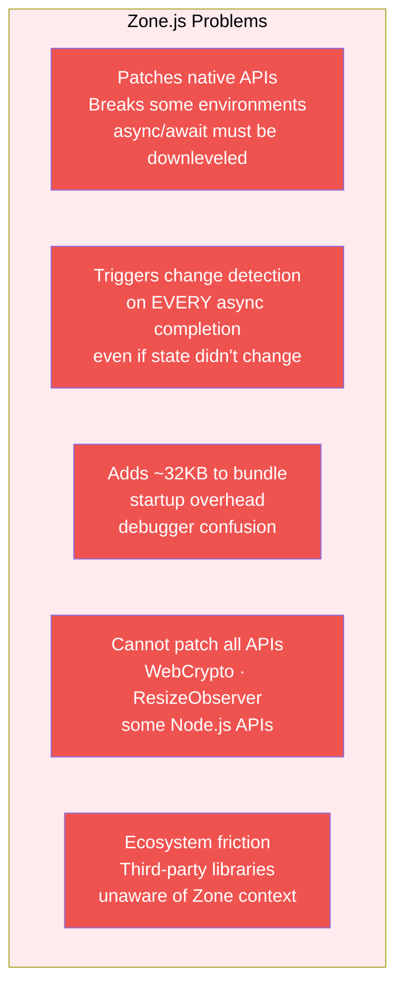
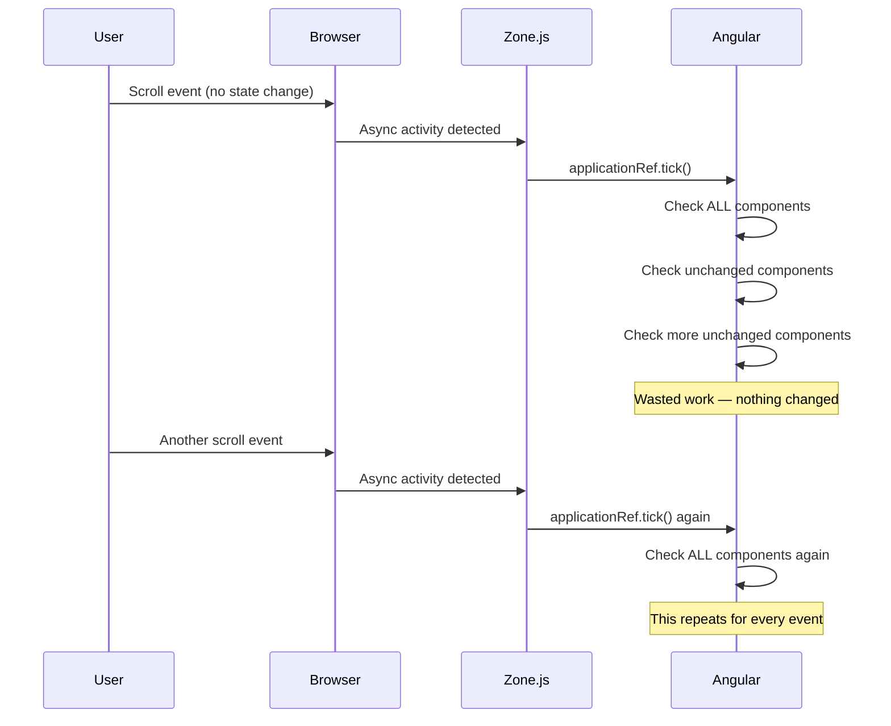
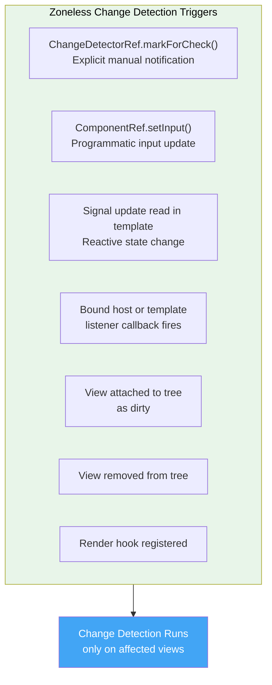
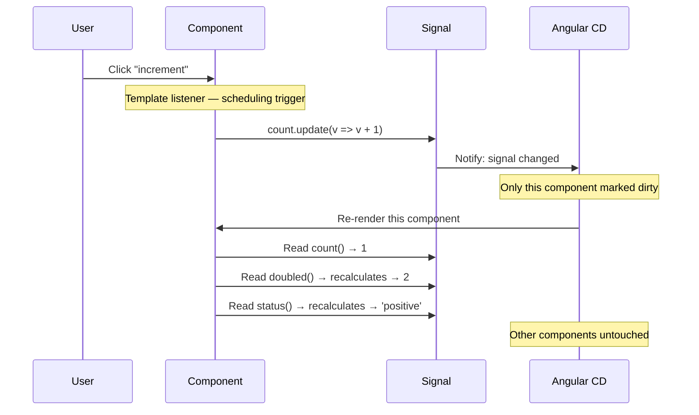
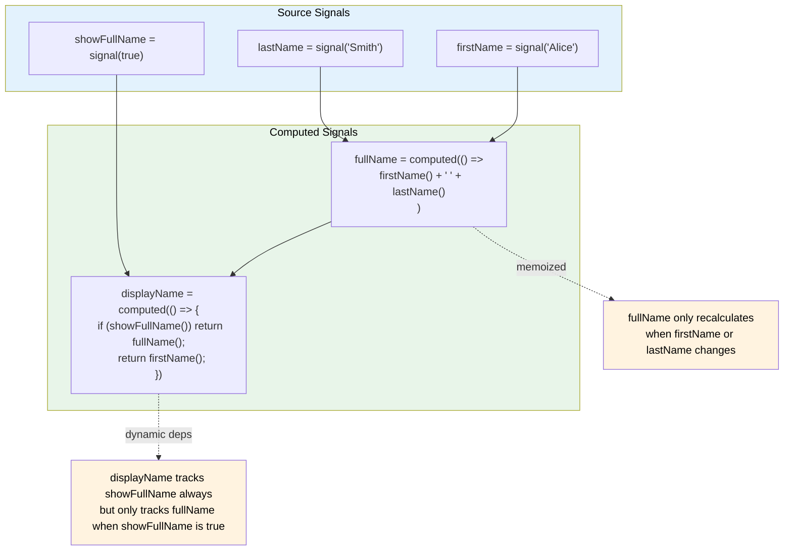
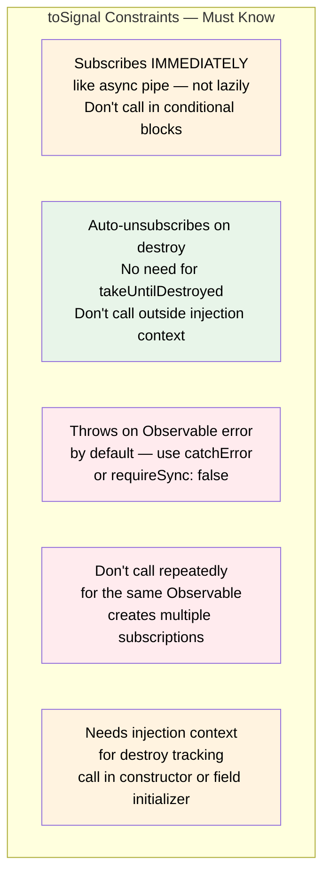
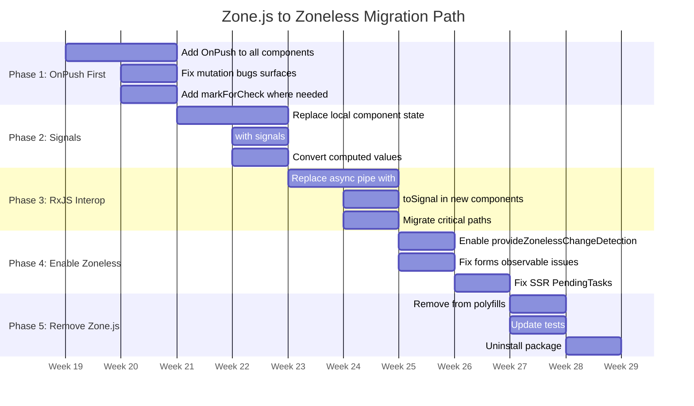
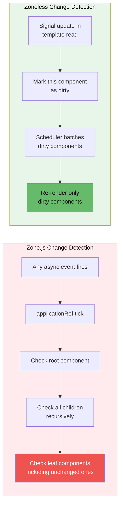
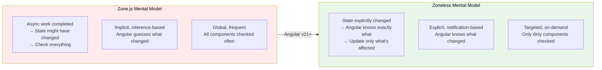

# Zone-Free Angular: A Complete Guide to High-Performance Zoneless Change Detection

> *Angular's shift to zoneless change detection isn't just a performance optimization — it's a fundamental change in how the framework reasons about when your UI needs to update. Understanding it deeply is what separates Angular developers who write fast applications from those who wonder why theirs are slow.*

---

## The Problem Zone.js Was Solving — and Creating

To understand why zoneless change detection matters, you first need to understand what Zone.js was doing and why Angular leaned on it for so long.

Angular needs to know when to re-render components. User interactions, API responses, timers, WebSocket messages — any of these might change application state. The question is: how does Angular find out?

Zone.js's answer was to monkey-patch every asynchronous API in the browser:

```typescript
// What Zone.js does under the hood (simplified)
// It replaces native APIs with instrumented versions
const originalSetTimeout = window.setTimeout;
window.setTimeout = function(fn, delay, ...args) {
 return originalSetTimeout(function() {
   fn(...args);
   NgZone.run(() => {
     // Tell Angular: async work just completed, might need to re-render
     applicationRef.tick();
   });
 }, delay);
};

// Same for: Promise, fetch, XHR, addEventListener, requestAnimationFrame,
// MutationObserver, and dozens more...
```

This worked. But it had fundamental problems:



The most insidious problem was the second one. Zone.js doesn't know whether async work changed state — it only knows that async work *completed*. So every resolved Promise, every `setTimeout` callback, every event handler triggered a full application check. In large applications with many components and frequent async activity, this generated enormous amounts of unnecessary work.



---

## Zoneless: The Explicit Notification Contract

Zoneless change detection replaces Zone.js's global inference with an explicit contract: Angular only runs change detection when it receives a specific, intentional notification from one of these sources:



The critical difference from Zone.js: **only the views that received notifications are checked**, not the entire component tree. This shifts change detection from a global, frequent scan to a targeted, on-demand update.

---

## Enabling Zoneless in Angular v20/v21+

```typescript
// main.ts — single line to enable zoneless
import { bootstrapApplication } from '@angular/platform-browser';
import { provideZonelessChangeDetection } from '@angular/core';
import { AppComponent } from './app/app.component';

bootstrapApplication(AppComponent, {
 providers: [
   provideZonelessChangeDetection(),
   // ... other providers
 ]
});
```

```json
// angular.json — remove zone.js from polyfills
// (Angular v21+ doesn't include it by default)
{
 "projects": {
   "my-app": {
     "architect": {
       "build": {
         "options": {
           "polyfills": []  // Remove "zone.js" from this array
         }
       },
       "test": {
         "options": {
           "polyfills": []  // Also remove from test target
         }
       }
     }
   }
 }
}
```

```bash
# Uninstall zone.js entirely (for new projects or after migration)
npm uninstall zone.js
```

If you have third-party libraries that depend on Zone.js, you can still enable zoneless scheduling while keeping Zone.js present for library compatibility:

```typescript
// Zone.js can coexist — zoneless just stops using it for scheduling
bootstrapApplication(AppComponent, {
 providers: [
   provideZonelessChangeDetection(),
   // Zone.js still loads (for third-party compat) but Angular
   // ignores its signals for scheduling purposes
 ]
});
```

---

## Signals: The Reactive Primitive That Powers Zoneless

Signals are the primary mechanism for triggering zoneless change detection. When a signal that a template reads is updated, Angular automatically schedules a change detection pass for that component — no Zone.js, no manual `markForCheck()`.

### Signal Fundamentals

```typescript
import { Component, signal, computed, effect } from '@angular/core';

@Component({
 selector: 'app-counter',
 changeDetection: ChangeDetectionStrategy.OnPush,
 template: `
   <div class="counter">
     <button (click)="decrement()">-</button>
     <span>{{ count() }}</span>
     <button (click)="increment()">+</button>
   </div>
   <p>Doubled: {{ doubled() }}</p>
   <p>Status: {{ status() }}</p>
 `
})
export class CounterComponent {
 // Writable signal — mutable state
 readonly count = signal(0);

 // Computed signal — derived, memoized, lazily evaluated
 // Only recalculates when count() changes
 readonly doubled = computed(() => this.count() * 2);

 // Computed with conditional dependency — only tracks relevant signals
 readonly status = computed(() => {
   const value = this.count();
   if (value < 0) return 'negative';
   if (value === 0) return 'zero';
   return 'positive';
 });

 increment(): void {
   this.count.update(v => v + 1);
   // Angular sees: signal read in template was updated
   // → Schedules change detection for THIS component only
   // → doubled() recalculates (count changed)
   // → status() recalculates (count changed)
 }

 decrement(): void {
   this.count.update(v => v - 1);
 }
}
```

### How Signals Schedule Change Detection



### The Three Signal Operations

```typescript
// 1. set() — replace the value entirely
counter.set(42);
userList.set([...newUsers]);

// 2. update() — derive new value from current
counter.update(current => current + 1);
userList.update(users => [...users, newUser]);

// 3. mutate() — REMOVED in Angular 17+
// Never mutate signal values in place — signals track reference, not deep equality
// WRONG: items.mutate(arr => arr.push(item)); // No longer works, was deprecated
// CORRECT:
items.update(arr => [...arr, item]);
```

### The Deep Mutation Trap

```typescript
// THE TRAP: Signals track reference equality, not deep equality
interface User {
 name: string;
 preferences: { theme: string; lang: string };
}

@Component({
 template: `<div>{{ user().preferences.theme }}</div>`
})
export class UserComponent {
 readonly user = signal<User>({
   name: 'Alice',
   preferences: { theme: 'dark', lang: 'en' }
 });

 updateTheme(theme: string): void {
   // WRONG: Mutates object in place — signal reference unchanged
   // Angular sees the same object reference → NO re-render
   this.user().preferences.theme = theme; // Signal doesn't know about this!

   // CORRECT: Create new object references at every level
   this.user.update(current => ({
     ...current,
     preferences: {
       ...current.preferences,
       theme
     }
   }));
   // Angular sees a new object reference → schedules re-render
 }
}
```

---

## Computed Signals: Lazy, Memoized, Dependency-Tracked



The **dynamic dependency tracking** is what makes computed signals genuinely powerful. Dependencies are re-evaluated on each execution — if `showFullName()` is false, `fullName()` is not read and therefore not tracked. When `firstName` or `lastName` changes, `displayName` won't recalculate if `showFullName` is false.

```typescript
@Component({
 changeDetection: ChangeDetectionStrategy.OnPush,
 template: `
   <input [value]="searchTerm()" (input)="searchTerm.set($any($event.target).value)">
   <p>Results: {{ filteredCount() }}</p>
   @for (item of filteredItems(); track item.id) {
     <app-item [item]="item" />
   }
 `
})
export class SearchableListComponent {
 readonly items = signal<Item[]>([]);
 readonly searchTerm = signal('');

 // Only recalculates when items or searchTerm changes
 // Not on every keypress if items didn't change
 readonly filteredItems = computed(() => {
   const term = this.searchTerm().toLowerCase();
   if (!term) return this.items();  // Early return — no filtering needed
   return this.items().filter(item =>
     item.name.toLowerCase().includes(term) ||
     item.description.toLowerCase().includes(term)
   );
 });

 // Derived from filteredItems — one more level of memoization
 readonly filteredCount = computed(() => this.filteredItems().length);
}
```

### Using untracked() to Prevent Accidental Dependencies

```typescript
@Component({ changeDetection: ChangeDetectionStrategy.OnPush })
export class AnalyticsComponent {
 readonly currentUser = signal<User | null>(null);
 readonly pageViews = signal(0);
 readonly analyticsEnabled = signal(true);

 readonly pageTitle = computed(() => {
   // We want to track currentUser changes
   const user = this.currentUser();

   // We do NOT want to track analyticsEnabled changes here
   // Reading it normally would create an unwanted dependency
   const enabled = untracked(() => this.analyticsEnabled());

   if (!enabled) return `Guest - ${user?.name ?? 'Anonymous'}`;
   return user?.name ?? 'Anonymous';
   // Now: this computed only re-runs when currentUser changes
   // NOT when analyticsEnabled changes
 });

 readonly pageStats = computed(() => {
   // Reading pageViews establishes dependency
   const views = this.pageViews();

   // Side-effect logging without creating a dependency on analyticsService
   // (otherwise every analytics config change would invalidate this computed)
   untracked(() => {
     if (views % 100 === 0) {
       console.log(`Milestone: ${views} page views`);
     }
   });

   return { views, milestone: Math.floor(views / 100) };
 });
}
```

---

## Effects: Reactive Side Effects

```typescript
import { Component, signal, effect, inject } from '@angular/core';

@Component({
 changeDetection: ChangeDetectionStrategy.OnPush
})
export class ThemeComponent {
 readonly theme = signal<'light' | 'dark'>('light');
 readonly fontSize = signal(16);

 // effect() runs after change detection when tracked signals change
 // Cleanup runs before next execution and on destroy
 private readonly themeEffect = effect(() => {
   const currentTheme = this.theme();  // Tracked dependency
   const size = this.fontSize();       // Tracked dependency

   // Side effects that are hard to express as computed:
   document.documentElement.classList.toggle('dark', currentTheme === 'dark');
   document.documentElement.style.setProperty('--base-font-size', `${size}px`);

   // Cleanup function — runs before next execution
   return () => {
     document.documentElement.classList.remove('dark');
   };
 });
}
```

**When to use effects vs computed:**

```mermaid
flowchart LR
   subgraph COMPUTED_USE [Use computed() when]
       C1[Deriving display values\nfrom state]
       C2[Transforming data\nfor templates]
       C3[Aggregating multiple\nsignals into one]
       C4[Memoizing expensive\ncalculations]
   end

   subgraph EFFECT_USE [Use effect() when]
       E1[DOM manipulation\noutside Angular]
       E2[Local storage\npersistence]
       E3[Third-party library\nintegration]
       E4[Analytics/logging\nside effects]
       E5[Non-Angular APIs\nthat need sync]
   end

   style COMPUTED_USE fill:#e8f5e9,color:#000
   style EFFECT_USE fill:#e3f2fd,color:#000
```

---

## RxJS Interop: Bridging Observables and Signals

Most existing Angular services return Observables. The `toSignal()` function bridges the gap:

```typescript
import { Component, inject, signal, computed } from '@angular/core';
import { toSignal, toObservable } from '@angular/core/rxjs-interop';
import { debounceTime, distinctUntilChanged, switchMap } from 'rxjs/operators';

@Component({
 changeDetection: ChangeDetectionStrategy.OnPush,
 template: `
   @if (loading()) {
     <app-spinner />
   } @else if (error()) {
     <app-error [message]="error()!" />
   } @else {
     @for (user of users(); track user.id) {
       <app-user-card [user]="user" />
     }
   }
   <p>Total: {{ users()?.length ?? 0 }}</p>
 `
})
export class UserListComponent {
 private userService = inject(UserService);

 // toSignal() subscribes immediately, provides synchronous access
 // Automatically unsubscribes on component destroy
 readonly users = toSignal(this.userService.getUsers(), {
   initialValue: [] as User[]
 });

 // For Observables that might error — use catchError or initialValue
 readonly usersWithError = toSignal(
   this.userService.getUsers().pipe(
     catchError(err => {
       this.errorMessage.set(err.message);
       return of([]);
     })
   ),
   { initialValue: [] as User[] }
 );

 readonly loading = signal(false);
 readonly errorMessage = signal<string | null>(null);

 // Convert signal back to Observable for use with RxJS operators
 readonly searchTerm = signal('');

 readonly searchResults = toSignal(
   toObservable(this.searchTerm).pipe(
     debounceTime(300),
     distinctUntilChanged(),
     switchMap(term =>
       term.length > 2
         ? this.userService.search(term)
         : of([])
     )
   ),
   { initialValue: [] as User[] }
 );
}
```

### toSignal() Operational Constraints



```typescript
@Injectable({ providedIn: 'root' })
export class DataService {
 private http = inject(HttpClient);

 // CORRECT: toSignal in injection context (constructor equivalent)
 readonly products = toSignal(
   this.http.get<Product[]>('/api/products'),
   { initialValue: [] as Product[] }
 );
}

@Component({ changeDetection: ChangeDetectionStrategy.OnPush })
export class ProductListComponent {
 private dataService = inject(DataService);

 // CORRECT: using a service-level signal
 readonly products = this.dataService.products;

 someMethod(): void {
   // WRONG: toSignal outside injection context — will throw
   // const signal = toSignal(someObservable$); // Error!
 }
}
```

---

## The AsyncPipe as a Migration Bridge

For components that aren't fully converted to signals yet, `AsyncPipe` remains fully compatible with zoneless because it calls `markForCheck()` — a documented zoneless scheduling trigger:

```typescript
@Component({
 changeDetection: ChangeDetectionStrategy.OnPush,
 template: `
   <!-- AsyncPipe calls markForCheck() on each emission -->
   <!-- Fully compatible with zoneless — works today -->
   @if (user$ | async; as user) {
     <app-user-card [user]="user" />
   }

   <!-- Eventual migration target: toSignal -->
   <!-- @if (user()) { <app-user-card [user]="user()!" /> } -->
 `
})
export class UserCardComponent {
 private userService = inject(UserService);

 // Keep Observable form during migration
 readonly user$ = this.userService.getCurrentUser();

 // Or migrate immediately
 // readonly user = toSignal(this.userService.getCurrentUser(), { initialValue: null });
}
```

---

## Reactive Forms in Zoneless: The Missing Notification

Reactive forms have a subtle incompatibility with zoneless that's easy to miss in production:

```typescript
// THE PROBLEM: Forms emit to observables, but don't call markForCheck()
@Component({
 changeDetection: ChangeDetectionStrategy.OnPush,
 template: `
   <form [formGroup]="form">
     <input formControlName="email">
   </form>
   <!-- This might NOT update in zoneless without explicit notification! -->
   <p>Email is valid: {{ form.get('email')?.valid }}</p>
 `
})
export class RegistrationComponent {
 private fb = inject(FormBuilder);
 private cdr = inject(ChangeDetectorRef);

 readonly form = this.fb.group({
   email: ['', [Validators.required, Validators.email]],
   password: ['', [Validators.required, Validators.minLength(8)]]
 });

 constructor() {
   // SOLUTION 1: Connect form changes to markForCheck()
   this.form.valueChanges.pipe(
     takeUntilDestroyed()
   ).subscribe(() => {
     this.cdr.markForCheck();
   });
 }
}
```

```typescript
// BETTER SOLUTION: Reflect form state through signals
@Component({
 changeDetection: ChangeDetectionStrategy.OnPush,
 template: `
   <form [formGroup]="form">
     <input formControlName="email">
     <span class="error" *ngIf="emailErrors()">
       {{ emailErrors() }}
     </span>
   </form>

   <button [disabled]="!isValid()" (click)="submit()">
     Submit
   </button>
   <p>Characters: {{ emailLength() }}</p>
 `
})
export class SignalDrivenFormComponent {
 private fb = inject(FormBuilder);

 readonly form = this.fb.group({
   email: ['', [Validators.required, Validators.email]],
   password: ['', [Validators.required, Validators.minLength(8)]]
 });

 // Convert form state to signals for reactive template binding
 private readonly formValue = toSignal(this.form.valueChanges, {
   initialValue: this.form.value
 });

 private readonly formStatus = toSignal(this.form.statusChanges, {
   initialValue: this.form.status
 });

 // Derived signals from form state
 readonly isValid = computed(() => this.formStatus() === 'VALID');

 readonly emailErrors = computed(() => {
   const emailControl = this.form.get('email');
   if (!emailControl?.touched) return null;
   if (emailControl.hasError('required')) return 'Email is required';
   if (emailControl.hasError('email')) return 'Invalid email format';
   return null;
 });

 readonly emailLength = computed(() =>
   this.formValue().email?.length ?? 0
 );

 submit(): void {
   if (this.form.valid) {
     // Handle submission
   }
 }
}
```

---

## SSR and Application Stability With PendingTasks

Zone.js provided a mechanism for SSR to know when the application was "stable" enough to serialize. Without it, you must explicitly declare async work that should delay serialization:

```typescript
import { Component, inject } from '@angular/core';
import { PendingTasks } from '@angular/core';

@Component({
 changeDetection: ChangeDetectionStrategy.OnPush,
 template: `
   @if (data()) {
     <app-content [data]="data()!" />
   } @else {
     <app-skeleton />
   }
 `
})
export class CriticalDataComponent implements OnInit {
 private http = inject(HttpClient);
 private pendingTasks = inject(PendingTasks);

 readonly data = signal<PageData | null>(null);

 ngOnInit(): void {
   // Tell Angular: don't serialize until this resolves
   const taskCleanup = this.pendingTasks.add();

   this.http.get<PageData>('/api/critical-data').pipe(
     takeUntilDestroyed(this.destroyRef)
   ).subscribe({
     next: data => {
       this.data.set(data);
       taskCleanup(); // Signal: this async work is complete
     },
     error: () => {
       taskCleanup(); // Must call even on error
     }
   });
 }
}
```

```typescript
// For Observable-based patterns: pendingUntilEvent helper
@Component({
 changeDetection: ChangeDetectionStrategy.OnPush
})
export class ServerSideComponent {
 private http = inject(HttpClient);
 private pendingTasks = inject(PendingTasks);

 readonly serverData = toSignal(
   this.http.get<ServerData>('/api/server-data').pipe(
     this.pendingTasks.pendingUntilEvent()
     // Angular waits for this Observable to emit before
     // considering the application stable for SSR serialization
   ),
   { initialValue: null }
 );
}
```

---

## Testing Zoneless Components

Zone.js's presence in tests can mask notification issues that zoneless components would surface in production. Testing in zoneless mode catches these problems early:

```typescript
import {
 ComponentFixture,
 TestBed,
 fakeAsync,
 tick
} from '@angular/core/testing';
import { provideZonelessChangeDetection } from '@angular/core';

describe('CounterComponent (zoneless)', () => {
 let fixture: ComponentFixture<CounterComponent>;
 let component: CounterComponent;

 beforeEach(async () => {
   await TestBed.configureTestingModule({
     imports: [CounterComponent],
     providers: [
       provideZonelessChangeDetection() // Test in zoneless mode
     ]
   }).compileComponents();

   fixture = TestBed.createComponent(CounterComponent);
   component = fixture.componentInstance;
   // In zoneless testing, avoid calling fixture.detectChanges()
   // unless you explicitly want to test notification paths
   await fixture.whenStable();
 });

 it('updates display when signal changes', async () => {
   // Act: update signal
   component.count.set(5);

   // Wait for Angular to process the notification
   await fixture.whenStable();

   // Assert: template reflects new value
   const span = fixture.nativeElement.querySelector('span');
   expect(span.textContent).toBe('5');
 });

 it('computed updates automatically', async () => {
   component.count.set(3);
   await fixture.whenStable();

   const doubled = fixture.nativeElement.querySelector('[data-test="doubled"]');
   expect(doubled.textContent).toBe('6');
 });
});

// Testing components that use Observable-backed signals
describe('UserBadgeComponent (zoneless)', () => {
 it('renders loading state initially', async () => {
   const userSubject = new BehaviorSubject<User | null>(null);

   await TestBed.configureTestingModule({
     imports: [UserBadgeComponent],
     providers: [
       provideZonelessChangeDetection(),
       {
         provide: UserService,
         useValue: { user$: userSubject.asObservable() }
       }
     ]
   }).compileComponents();

   const fixture = TestBed.createComponent(UserBadgeComponent);
   await fixture.whenStable();

   expect(fixture.nativeElement.textContent).toContain('Loading…');

   // Emit a user
   userSubject.next({ displayName: 'Alice', id: '1' });
   await fixture.whenStable();

   expect(fixture.nativeElement.textContent).toContain('Alice');
 });
});
```

### Enabling Exhaustive Change Detection Checks

```typescript
// In test environment or development bootstrapping
bootstrapApplication(AppComponent, {
 providers: [
   provideZonelessChangeDetection(),
   // Detect components that trigger extra change detection passes
   // Catches ExpressionChangedAfterItHasBeenCheckedError early
   provideCheckNoChangesConfig({
     exhaustive: true,
     interval: 2000  // Check every 2 seconds in dev
   })
 ]
});
```

---

## Migration Strategy: From Zone.js to Zoneless



**Phase 1 is the highest-leverage step.** Adding `OnPush` to components that use mutable state will immediately surface the patterns that are incompatible with zoneless. Any component that mutates objects or arrays without creating new references will stop updating its template — revealing exactly what needs to change before you enable zoneless mode.

```typescript
// The migration compatibility checklist per component

// ✅ Zone-compatible AND zoneless-compatible
@Component({ changeDetection: ChangeDetectionStrategy.OnPush })
export class CompatibleComponent {
 readonly items = signal<Item[]>([]);             // Signal state
 readonly user$ = inject(UserService).user$;     // Observable with async pipe
 readonly filtered = computed(() =>              // Derived signal
   this.items().filter(i => i.active)
 );

 addItem(item: Item): void {
   this.items.update(items => [...items, item]); // Immutable update
 }
}

// ❌ Zone-dependent — will break in zoneless
@Component({ changeDetection: ChangeDetectionStrategy.Default })
export class ZoneDependentComponent {
 items: Item[] = [];                   // Mutable array — no notification

 addItem(item: Item): void {
   this.items.push(item);              // Mutation — no notification
   // Zone.js used to trigger a check after this
   // Zoneless: template never updates
 }
}
```

---

## Performance: What Zoneless Actually Buys You



The concrete benefits documented by Angular's team:

- **Bundle size:** ~32KB reduction from removing zone.js (meaningful for mobile)
- **Startup time:** No Zone.js patching of native APIs during initialization
- **Runtime performance:** Change detection runs only on dirty components, not the full tree
- **Core Web Vitals:** Fewer unnecessary renders improves INP (Interaction to Next Paint)
- **Debugging:** Change detection causes are explicit — no more "why did this re-render?"
- **Ecosystem compatibility:** No more native API patching breaking third-party libraries

---

## Summary: The Mental Model Shift



Zoneless Angular isn't a removal of change detection — it's a promotion of change detection from implicit background inference to explicit reactive tracking. Signals make that tracking automatic for template state. `markForCheck()` and `AsyncPipe` handle the cases that aren't yet on signals. `toSignal()` bridges the Observable ecosystem.

The result is a framework where rendering is caused by state changes you can point to — not by async activity that happened to complete nearby. That predictability is what makes large Angular applications maintainable, their performance debuggable, and their bundle sizes smaller by default.