# Week 1: Organizational Foundations - Complete Tutorial

**📚 InfoQ Certified Engineering Leadership Program**  
**⏱️ Estimated Reading Time:** 45-60 minutes  
**🎯 Difficulty Level:** Intermediate  
**📅 Last Updated:** January 2026

---

## Table of Contents

1. [Introduction & Overview](#introduction--overview)
2. [Prerequisites](#prerequisites)
3. [Learning Objectives](#learning-objectives)
4. [Core Concepts](#core-concepts)
5. [Westrum's Organizational Culture Model](#westrums-organizational-culture-model)
6. [Behavioral Economics in Organizations](#behavioral-economics-in-organizations)
7. [Industrial-Organizational Psychology Principles](#industrial-organizational-psychology-principles)
8. [Mapping Organizational Structure](#mapping-organizational-structure)
9. [Real-World Examples & Case Studies](#real-world-examples--case-studies)
10. [Mermaid Diagrams](#mermaid-diagrams)
11. [Common Pitfalls & Anti-Patterns](#common-pitfalls--anti-patterns)
12. [Best Practices](#best-practices)
13. [Practice Exercises](#practice-exercises)
14. [Question Bank](#question-bank)
15. [Test Your Understanding](#test-your-understanding)
16. [Common Interview Questions](#common-interview-questions)
17. [Troubleshooting Guide](#troubleshooting-guide)
18. [Performance Considerations](#performance-considerations)
19. [Security Considerations](#security-considerations)
20. [Summary & Key Takeaways](#summary--key-takeaways)
21. [Further Reading & Resources](#further-reading--resources)

---

## Introduction & Overview

Being a good technical leader means understanding how organizations work, how to influence them, and how to change people's behavior. This week covers the foundations of working inside an organization, drawing on **behavioral economics**, **industrial-organizational psychology**, and **anthropology**, so you can assess and work within your own organization effectively.

> 💡 **Key Insight:** Technical excellence alone doesn't make a great engineering leader. Understanding organizational dynamics is what separates good engineers from great technical leaders.

### Why This Matters

In today's complex organizational structures, technical leaders must navigate:
- **Informal power structures** that differ from org charts
- **Cultural norms** that influence decision-making
- **Behavioral patterns** that affect team performance
- **Cross-functional dependencies** that require influence without authority

---

## Prerequisites

Before starting this week's material, you should have:

- ✅ Minimum 5 years of professional software engineering experience
- ✅ Experience working in a team environment (5+ people)
- ✅ Basic understanding of organizational structures
- ✅ Familiarity with technical leadership responsibilities
- ✅ Openness to behavioral and psychological concepts
- ✅ Willingness to reflect on personal experiences

**Recommended Background:**
- Exposure to different company sizes (startup to enterprise)
- Experience with cross-team collaboration
- Understanding of basic management principles

---

## Learning Objectives

By the end of this week, you will be able to:

1. **Analyze** organizational culture using Westrum's model
2. **Identify** informal power structures and decision-making pathways
3. **Apply** behavioral economics principles to influence organizational change
4. **Map** your organization's structure and decision flows
5. **Navigate** different organizational cultures effectively
6. **Recognize** psychological safety indicators in teams
7. **Develop** strategies for working within organizational constraints
8. **Assess** your own leadership style in relation to organizational culture

---

## Core Concepts

### 1. Organizational Culture

Organizational culture is the shared values, beliefs, and norms that shape behavior within an organization. It influences:
- How decisions are made
- How information flows
- How teams collaborate
- How innovation happens
- How failures are handled

### 2. Informal vs. Formal Structure

**Formal Structure:**
- Org charts
- Reporting relationships
- Official roles and responsibilities
- Documented processes

**Informal Structure:**
- Who actually makes decisions
- Who influences outcomes
- Social networks and relationships
- Unwritten rules and norms

> ⚠️ **Critical Understanding:** The informal structure often has more power than the formal structure. Successful leaders understand both.

### 3. Behavioral Economics in Organizations

Behavioral economics studies how psychological, cognitive, and emotional factors influence economic decisions. In organizations, this helps explain:
- Why people make irrational decisions
- How incentives shape behavior
- The impact of loss aversion on change management
- Social proof and conformity pressures

### 4. Industrial-Organizational Psychology

This field applies psychological principles to workplace issues:
- **Motivation theories** (Maslow, Herzberg, Deci & Ryan)
- **Team dynamics** (Tuckman's stages, psychological safety)
- **Leadership styles** (transformational, transactional, servant leadership)
- **Organizational development** and change management

---

## Westrum's Organizational Culture Model

Developed by sociologist **Ron Westrum**, this model categorizes organizational cultures into three types based on how they handle information and safety.

### The Three Culture Types

#### 1. Pathological (Power-Oriented)

**Characteristics:**
- Information is power and is hoarded
- Low cooperation across groups
- Messengers are shot (blame culture)
- Responsibilities are shirked
- Failure leads to scapegoating
- Novelty is crushed

**Behavioral Patterns:**
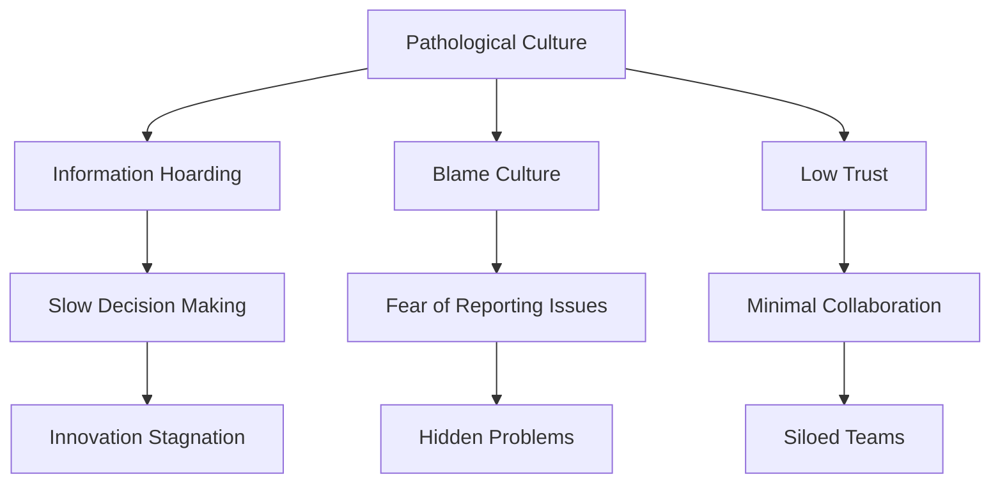

**Real-World Example:** 
A company where engineers hide bugs to avoid punishment, managers take credit for team successes but blame teams for failures, and cross-team collaboration requires executive approval.

#### 2. Bureaucratic (Rule-Oriented)

**Characteristics:**
- Information is a privilege
- Modest cooperation across groups
- Messengers are tolerated but not encouraged
- Responsibilities are compartmentalized
- Failure leads to justice (process-focused)
- Novelty is resisted

**Behavioral Patterns:**
- Strict adherence to processes
- "That's not my job" mentality
- Slow but predictable decision-making
- Risk-averse culture
- Innovation requires extensive justification

**Real-World Example:**
Large enterprises with rigid processes, multiple approval layers, and change requests that take weeks to process. Teams follow procedures even when they know they're inefficient.

#### 3. Generative (Performance-Oriented)

**Characteristics:**
- Information is shared freely
- High cooperation across groups
- Messengers are trained and supported
- Responsibilities are shared
- Failure leads to inquiry and learning
- Novelty is encouraged

**Behavioral Patterns:**
- Psychological safety is high
- Blameless post-mortems
- Fast, informed decision-making
- Continuous improvement mindset
- Innovation is part of the culture

**Real-World Example:**
Companies like Google, Netflix, and Amazon (in certain teams) where:
- Failure is analyzed, not punished
- Information flows freely across levels
- Teams experiment and learn quickly
- Cross-functional collaboration is the norm

### Culture Assessment Framework

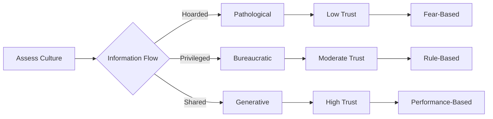

**Assessment Questions:**
1. When someone brings bad news, what happens?
2. How quickly does information travel across teams?
3. What happens when someone makes a mistake?
4. How are new ideas received?
5. Can junior engineers challenge senior decisions?

---

## Behavioral Economics in Organizations

### Key Principles

#### 1. Loss Aversion

**Concept:** People feel losses more intensely than equivalent gains (roughly 2x).

**Organizational Impact:**
- Resistance to change (perceived loss of control/comfort)
- Status quo bias in decision-making
- Risk aversion in innovation

**Application for Leaders:**
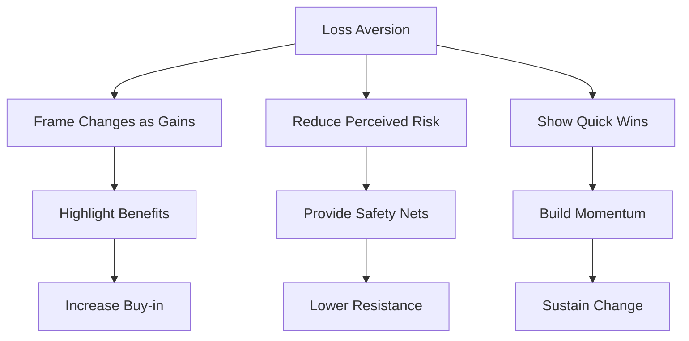

**Example:**
Instead of: "We need to migrate to a new framework (you'll lose your expertise)"
Try: "This new framework will reduce your maintenance work by 40% and let you focus on features"

#### 2. Social Proof

**Concept:** People look to others' behavior to determine appropriate actions.

**Organizational Impact:**
- Early adopters influence majority
- Visible success stories drive adoption
- Peer pressure shapes culture

**Application for Leaders:**
- Get influential team members on board first
- Share success stories publicly
- Create visible champions for change

#### 3. Anchoring Effect

**Concept:** First information strongly influences subsequent decisions.

**Organizational Impact:**
- First proposal sets negotiation range
- Initial estimates anchor expectations
- Historical data influences future planning

**Application for Leaders:**
- Present realistic but optimistic first estimates
- Set ambitious but achievable goals
- Use data to reset unrealistic anchors

#### 4. Status Quo Bias

**Concept:** Preference for current state of affairs.

**Organizational Impact:**
- Resistance to process changes
- Reluctance to adopt new tools
- "We've always done it this way" mentality

**Application for Leaders:**
- Change one thing at a time
- Show clear benefits of change
- Make transition easy with support and training

---

## Industrial-Organizational Psychology Principles

### Motivation Theories

#### Maslow's Hierarchy of Needs

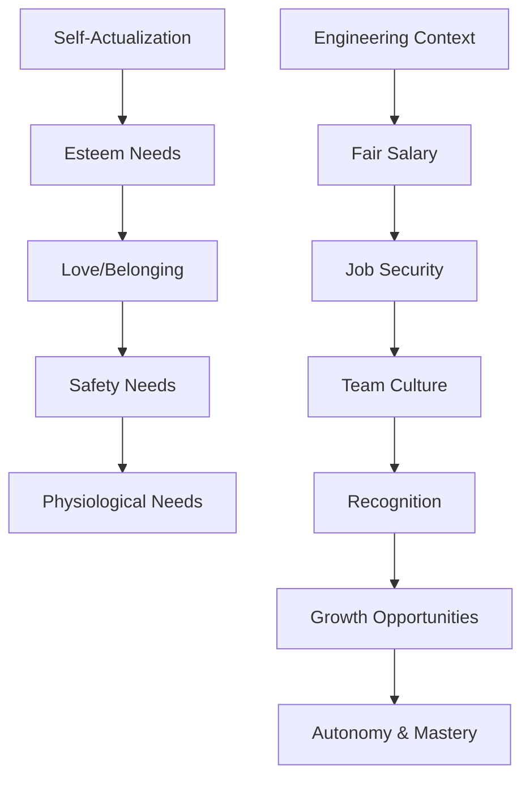

**Application:**
- Ensure basic needs (fair pay, job security) are met
- Build team culture and belonging
- Provide recognition and career growth
- Enable autonomy and mastery in work

#### Herzberg's Two-Factor Theory

**Hygiene Factors (Must Be Present):**
- Salary and benefits
- Job security
- Working conditions
- Company policies
- Supervision quality

**Motivators (Drive Satisfaction):**
- Achievement and recognition
- Work itself (meaningful tasks)
- Responsibility
- Advancement opportunities
- Growth and learning

**Key Insight:** Fixing hygiene factors prevents dissatisfaction but doesn't create motivation. You need both.

#### Self-Determination Theory (Deci & Ryan)

**Three Psychological Needs:**
1. **Autonomy** - Control over one's work
2. **Competence** - Mastery and growth
3. **Relatedness** - Connection to others

**Application for Technical Leaders:**
- Give teams autonomy in how they solve problems
- Provide opportunities for skill development
- Foster team cohesion and psychological safety

### Psychological Safety

**Definition:** A shared belief that the team is safe for interpersonal risk-taking.

**Amy Edmondson's Research:**
- Teams with high psychological safety:
  - Admit mistakes more readily
  - Ask for help when needed
  - Share ideas freely
  - Learn from failures
  - Perform better overall

**Four Stages of Psychological Safety:**
1. **Inclusion Safety** - Belonging and being accepted
2. **Learner Safety** - Asking questions and learning
3. **Contributor Safety** - Making meaningful contributions
4. **Challenger Safety** - Challenging status quo

**Measuring Psychological Safety:**
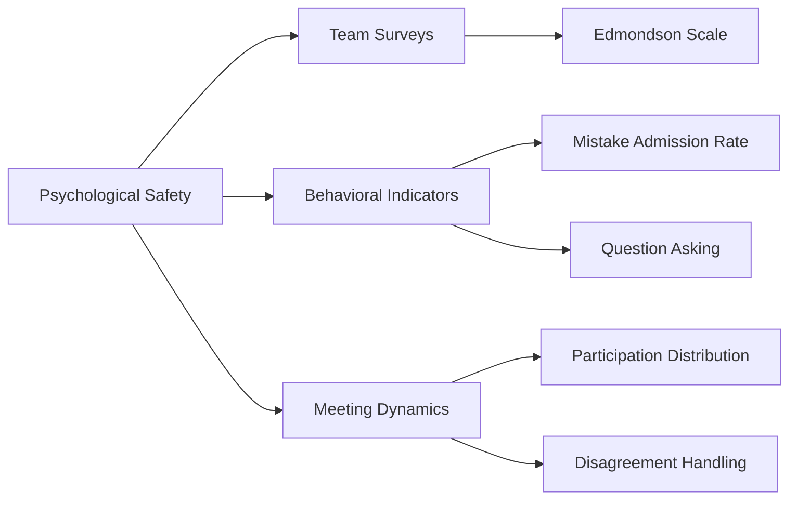

---

## Mapping Organizational Structure

### The Formal vs. Informal Structure Exercise

**Objective:** Create a map of how decisions actually get made in your organization.

### Step-by-Step Process

#### Step 1: Document the Formal Structure

Create an org chart showing:
- Reporting relationships
- Official roles and titles
- Documented decision rights
- Stated responsibilities

**Template:**
```
[CEO/CTO]
    ↓
[VP Engineering]
    ↓
[Director of Engineering]
    ↓
[Engineering Manager] → [Team A: 5 engineers]
[Engineering Manager] → [Team B: 5 engineers]
```

#### Step 2: Identify Actual Decision-Makers

For key decisions, ask:
- Who is consulted before decisions?
- Who has veto power?
- Who influences the final decision?
- Who implements the decision?

**Common Patterns:**
- **Technical decisions:** Often made by senior engineers, not managers
- **Architectural decisions:** Influenced by architects or tech leads
- **Hiring decisions:** Hiring manager + team input + HR approval
- **Budget decisions:** Finance + leadership + department heads

#### Step 3: Map Influence Networks

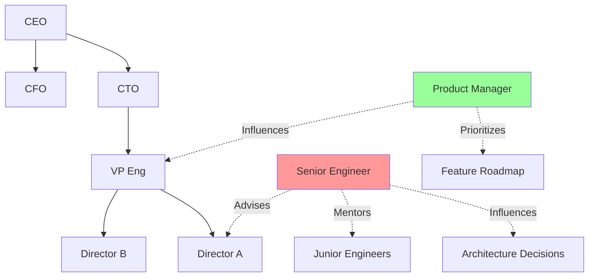

**Key Insight:** Dotted lines (informal influence) often matter more than solid lines (formal authority).

#### Step 4: Identify Discrepancies

Look for places where:
- Informal structure ≠ Formal structure
- Decisions are made by people without formal authority
- Formal authority exists but isn't used
- Influence flows differently than reporting lines

**Common Discrepancies:**
1. **Technical authority:** Senior engineers have more influence than their title suggests
2. **Historical power:** Long-tenured employees wield influence beyond their role
3. **Expert power:** Subject matter experts whose opinions are sought
4. **Political skill:** People who are good at building relationships and getting things done

### Organizational Mapping Template

**Decision Type:** [e.g., Technology Stack Selection]

| Aspect | Formal Structure | Informal Structure | Discrepancy |
|--------|------------------|-------------------|-------------|
| **Decision Maker** | Engineering Director | Principal Engineer | Principal has more technical influence |
| **Influencers** | VP Engineering, CTO | Senior engineers, architects | Technical community drives decision |
| **Approval Required** | Director + VP | Team consensus | Team buy-in is critical |
| **Timeline** | 2 weeks (process) | 1 week (consensus) | Informal is faster |

---

## Real-World Examples & Case Studies

### Case Study 1: Google's Project Aristotle

**Context:** Google studied 180 teams to understand what makes teams effective.

**Key Finding:** Psychological safety was the #1 factor in team success, above:
- Clear goals
- Dependability
- Structure & clarity
- Meaning of work
- Impact of work

**Application:**
- Leaders must create safe environments for teams to perform
- Technical skills matter less than team dynamics
- Focus on team health, not just individual performance

### Case Study 2: Amazon's Two-Pizza Teams

**Context:** Jeff Bezos mandated that teams should be small enough to be fed by two pizzas.

**Organizational Impact:**
- Decentralized decision-making
- High autonomy and ownership
- Faster iteration cycles
- Clear accountability

**Cultural Implications:**
- Requires strong communication protocols
- Needs shared services for common needs
- Demands clear API contracts between teams

### Case Study 3: Netflix's Freedom & Responsibility

**Context:** Netflix operates with minimal process and high trust.

**Key Principles:**
- **Freedom:** Adults can make their own decisions
- **Responsibility:** Act in the company's best interest
- **Context, not Control:** Provide information, not directives

**Organizational Structure:**
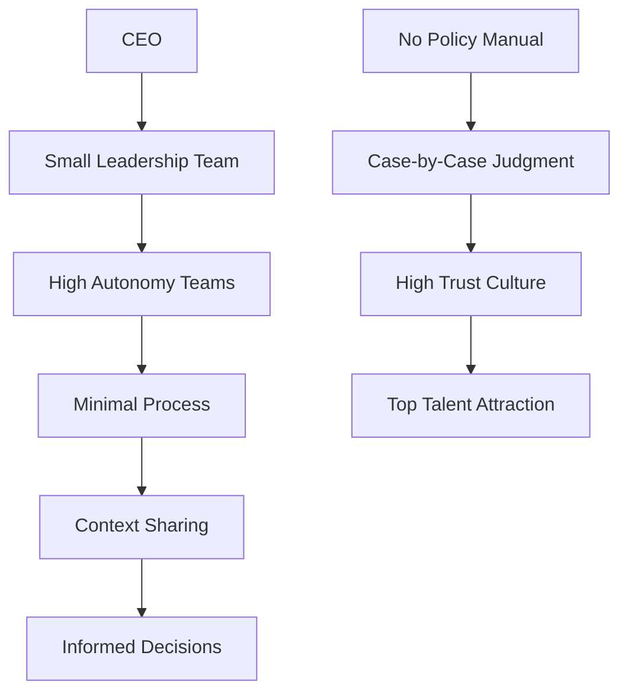

**Trade-offs:**
- Works with mature, experienced professionals
- Requires strong cultural fit
- Can be challenging for early-career engineers
- Needs excellent communication

### Case Study 4: Spotify's Squad Model

**Structure:**
- **Squads:** Cross-functional teams (6-12 people)
- **Tribes:** Related squads (40-150 people)
- **Chapters:** Functional areas across squads
- **Guilds:** Communities of practice

**Benefits:**
- Autonomy with alignment
- Clear ownership
- Knowledge sharing
- Career development paths

**Challenges:**
- Requires strong coordination
- Can create silos if not managed
- Needs investment in communication

---

## Mermaid Diagrams

### Diagram 1: Westrum's Culture Model Comparison

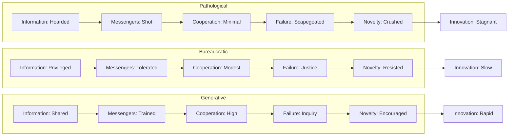

### Diagram 2: Decision-Making Flow in Organizations

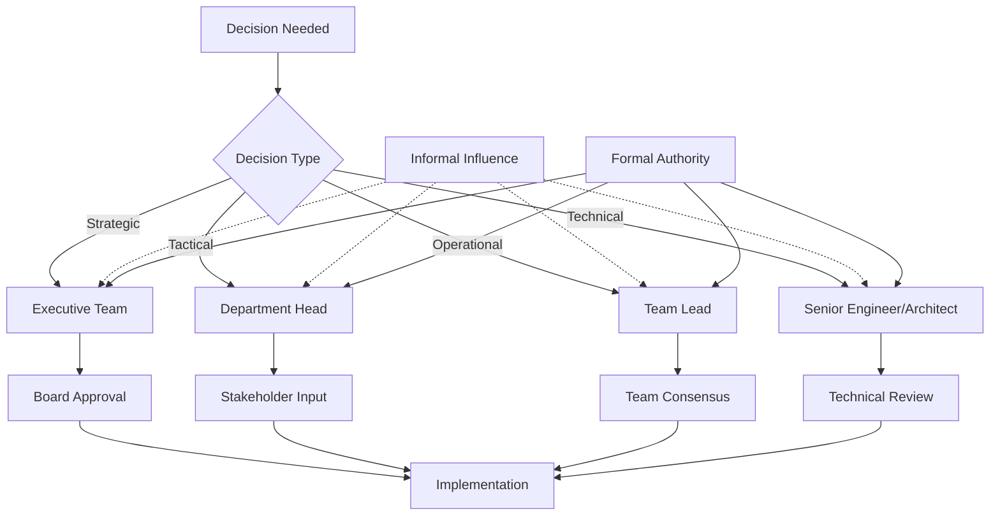

### Diagram 3: Organizational Change Management

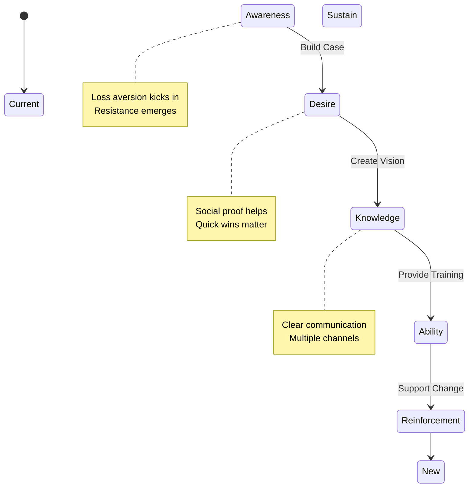

### Diagram 4: Influence Without Authority

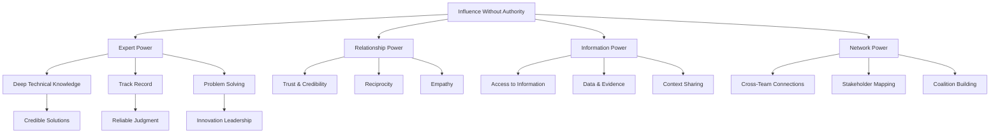

---

## Common Pitfalls & Anti-Patterns

### Anti-Pattern 1: Ignoring Informal Structure

**Problem:** Only paying attention to org charts and formal authority.

**Symptoms:**
- Surprised when decisions go differently than expected
- Can't figure out who really needs to be convinced
- Waste time convincing people without decision power
- Miss key influencers in change initiatives

**Solution:**
- Map both formal and informal structures
- Identify real decision-makers and influencers
- Build relationships across the network
- Understand unwritten rules and norms

### Anti-Pattern 2: Fighting the Culture

**Problem:** Trying to change organizational culture too quickly or without understanding it.

**Symptoms:**
- Constant frustration with "how things work here"
- Attempts to impose external best practices that fail
- Burnout from swimming upstream
- Alienation of colleagues

**Solution:**
- Work within the culture first
- Find cultural strengths to leverage
- Make incremental changes
- Build coalitions for larger changes

### Anti-Pattern 3: Over-Reliance on Hierarchy

**Problem:** Only escalating issues up the management chain.

**Symptoms:**
- Slow problem resolution
- Managers overwhelmed with decisions
- Teams disempowered
- Bottlenecks in decision-making

**Solution:**
- Empower teams to make decisions
- Clarify decision rights at each level
- Build decision-making frameworks
- Escalate only truly strategic issues

### Anti-Pattern 4: One-Size-Fits-All Leadership

**Problem:** Using the same leadership style regardless of organizational context.

**Symptoms:**
- Ineffective in different teams
- Misreading cultural signals
- Inappropriate communication styles
- Resistance from team members

**Solution:**
- Adapt style to organizational culture
- Read the room and adjust approach
- Develop situational leadership skills
- Seek feedback on your approach

### Anti-Pattern 5: Neglecting Psychological Safety

**Problem:** Focusing only on results, ignoring team health.

**Symptoms:**
- High turnover
- Hidden problems surfacing late
- Lack of innovation
- Fear of speaking up in meetings
- Blame culture after incidents

**Solution:**
- Model vulnerability (admit your mistakes)
- Respond constructively to bad news
- Celebrate learning from failures
- Create safe spaces for dialogue

---

## Best Practices

### 1. Conduct Regular Culture Assessments

**Frequency:** Quarterly or bi-annually

**Methods:**
- Anonymous surveys (Edmondson's Psychological Safety Scale)
- One-on-one conversations
- Team retrospective observations
- Meeting behavior analysis

**Action Items:**
- Track trends over time
- Share results transparently
- Create action plans based on findings
- Reassess after interventions

### 2. Build Influence Through Expertise

**Strategies:**
- Develop deep technical knowledge in critical areas
- Share knowledge generously (blog posts, talks, mentoring)
- Deliver on commitments consistently
- Solve hard problems that others can't
- Be the go-to person for specific domains

**Example:**
A principal engineer who became influential by:
- Creating internal technical blog
- Running lunch-and-learn sessions
- Mentoring junior engineers
- Solving critical production issues
- Writing clear, comprehensive design docs

### 3. Master the Art of Stakeholder Management

**Framework:**
1. **Identify** all stakeholders
2. **Analyze** their interests and influence
3. **Prioritize** based on power and interest
4. **Engage** with appropriate strategies
5. **Communicate** regularly and transparently

**Stakeholder Matrix:**
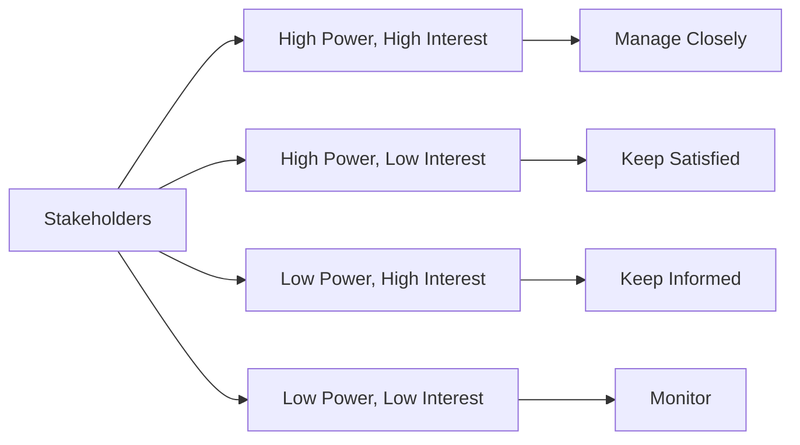

### 4. Navigate Organizational Politics Ethically

**Principles:**
- Build genuine relationships, not transactional ones
- Focus on win-win outcomes
- Be transparent about your intentions
- Avoid gossip and negativity
- Credit others for their contributions
- Address conflicts directly and respectfully

**Ethical Influence Tactics:**
- Rational persuasion (data, logic)
- Inspirational appeals (vision, values)
- Consultation (involve others in planning)
- Exchange (reciprocity)
- Personal appeal (relationships)

**Unethical Tactics to Avoid:**
- Manipulation
- Withholding information
- Undermining others
- Taking credit for others' work

### 5. Develop Cultural Intelligence (CQ)

**Components:**
1. **Cognitive CQ:** Understanding cultural norms and values
2. **Motivational CQ:** Drive to adapt to cross-cultural situations
3. **Behavioral CQ:** Ability to adapt behavior appropriately

**Application:**
- Observe and learn cultural norms
- Ask questions to understand "how things work"
- Adapt communication style
- Build cultural bridges
- Respect differences while finding common ground

### 6. Create Psychological Safety in Your Team

**Practical Steps:**
1. **Model vulnerability:** Share your mistakes and learning
2. **Respond constructively:** Thank people for bad news
3. **Encourage questions:** "What don't I know?"
4. **Normalize failure:** Blameless post-mortems
5. **Include everyone:** Draw out quiet team members
6. **Set clear expectations:** "We value learning over perfection"

**Team Rituals:**
- Start meetings with "What did you fail at this week?"
- Celebrate "best failure" each month
- Publicly thank people for raising concerns
- Share lessons learned widely

---

## Practice Exercises

### Exercise 1: Organizational Culture Assessment

**Objective:** Assess your organization's culture using Westrum's model.

**Instructions:**
1. Answer the following questions honestly about your organization:
   - When someone brings bad news, what typically happens?
   - How freely does information flow across teams?
   - What happens when someone makes a mistake?
   - How are new ideas received?
   - Can junior engineers openly challenge senior decisions?

2. Score your organization on a scale of 1-5 for each culture type:
   - Pathological (1 = not at all, 5 = very much)
   - Bureaucratic (1 = not at all, 5 = very much)
   - Generative (1 = not at all, 5 = very much)

3. Identify specific examples supporting your assessment.

4. Create an action plan to move your culture one step toward generative.

**Sample Solution:**

**Assessment:**
- Pathological: 2/5
- Bureaucratic: 4/5
- Generative: 2/5

**Examples:**
- Bad news: Usually filtered before reaching leadership
- Information flow: Restricted by department
- Mistakes: Process violations are punished
- New ideas: Require extensive justification
- Challenge: Possible but requires careful navigation

**Action Plan:**
1. **Month 1:** Start sharing bad news with solutions attached
2. **Month 2:** Create a blameless post-mortem process
3. **Month 3:** Run a pilot "fail forward" session
4. **Month 4:** Measure psychological safety with team survey
5. **Month 5:** Share success stories of learning from failures

### Exercise 2: Organizational Mapping

**Objective:** Map the informal structure of your organization.

**Instructions:**
1. Choose a recent significant decision in your organization (e.g., technology choice, hiring decision, project prioritization).

2. Document:
   - Who was the formal decision-maker?
   - Who was actually consulted?
   - Who influenced the decision?
   - Who implemented it?
   - Where did the informal and formal structures agree/disagree?

3. Create a visual map showing:
   - Formal reporting lines
   - Informal influence lines
   - Decision flow
   - Information flow

4. Identify 2-3 places where the informal structure differs from the formal structure.

5. Develop strategies to work effectively within this reality.

**Sample Solution:**

**Decision:** Migrating from monolith to microservices

**Formal Structure:**
- Decision-maker: VP Engineering
- Approval: CTO
- Implementation: Architecture team

**Informal Structure:**
- Key influencer: Principal Engineer (technical credibility)
- Consulted: Senior engineers from each team
- Resistance: Engineering managers (concerned about team impact)

**Discrepancies:**
1. Principal engineer had more technical influence than VP
2. Engineering managers' concerns were initially ignored
3. Implementation required buy-in from team leads, not just architects

**Strategies:**
- Involve principal engineer early in planning
- Address engineering managers' concerns proactively
- Create a coalition of team leads for implementation
- Use data to support technical decisions

### Exercise 3: Behavioral Economics Application

**Objective:** Apply behavioral economics principles to a real organizational challenge.

**Instructions:**
1. Identify a change initiative you're trying to implement (e.g., adopting a new tool, changing a process, introducing a new practice).

2. Analyze the change using behavioral economics principles:
   - **Loss Aversion:** What are people losing? How can you reframe as gains?
   - **Social Proof:** Who are the early adopters? How can you showcase their success?
   - **Anchoring:** What is the current anchor? How can you reset expectations?
   - **Status Quo Bias:** What makes the current state comfortable? How can you reduce friction?

3. Create a change management plan incorporating these insights.

4. Identify potential resistance and develop mitigation strategies.

**Sample Solution:**

**Change Initiative:** Implementing code review process

**Loss Aversion:**
- Loss: "Developers lose autonomy and speed"
- Reframe: "Code review reduces bugs and improves code quality, saving time on debugging"

**Social Proof:**
- Early adopters: Senior engineers who already review each other's code
- Showcase: Share metrics showing 30% reduction in production bugs
- Champions: Identify and empower advocates

**Anchoring:**
- Current anchor: "Code review slows us down"
- Reset: "Teams that review code ship 15% faster due to fewer rollbacks"
- Data: Present actual velocity metrics

**Status Quo Bias:**
- Comfort: "We've always done it this way"
- Reduce friction: Automated review assignment, templates, guidelines
- Support: Training sessions, pair programming, gradual rollout

**Change Plan:**
1. Week 1: Pilot with 2 volunteer teams
2. Week 2: Collect feedback, adjust process
3. Week 3: Share success stories and metrics
4. Week 4: Roll out to additional teams
5. Week 5: Full implementation with support

---

## Question Bank

### Multiple Choice Questions (1-30)

1. According to Westrum's model, which culture type shares information freely?
   - A) Pathological
   - B) Bureaucratic
   - C) Generative
   - D) Hierarchical
   - **Answer: C**

2. In a pathological culture, what happens to messengers who bring bad news?
   - A) They are rewarded
   - B) They are shot (blamed)
   - C) They are ignored
   - D) They are promoted
   - **Answer: B**

3. Loss aversion means people feel losses approximately how many times more intensely than equivalent gains?
   - A) 1.5x
   - B) 2x
   - C) 3x
   - D) 5x
   - **Answer: B**

4. Which motivation theory includes physiological, safety, love/belonging, esteem, and self-actualization needs?
   - A) Herzberg's Two-Factor Theory
   - B) Maslow's Hierarchy of Needs
   - C) Self-Determination Theory
   - D) Expectancy Theory
   - **Answer: B**

5. According to Herzberg, which factors prevent dissatisfaction but don't create motivation?
   - A) Motivators
   - B) Hygiene factors
   - C) Intrinsic factors
   - D) Extrinsic factors
   - **Answer: B**

6. Psychological safety was identified as the #1 factor in team effectiveness in which study?
   - A) Project Oxygen
   - B) Project Aristotle
   - C) Project Phoenix
   - D) Project Delta
   - **Answer: B**

7. Which of the following is NOT one of the three psychological needs in Self-Determination Theory?
   - A) Autonomy
   - B) Competence
   - C) Relatedness
   - D) Achievement
   - **Answer: D**

8. In a bureaucratic culture, how are messengers who bring bad news typically treated?
   - A) Shot (blamed)
   - B) Trained and supported
   - C) Tolerated but not encouraged
   - D) Rewarded
   - **Answer: C**

9. What is the primary characteristic of a generative culture regarding failure?
   - A) Scapegoating
   - B) Justice (process-focused)
   - C) Inquiry and learning
   - D) Ignoring failures
   - **Answer: C**

10. Social proof in behavioral economics refers to:
    - A) Mathematical proof of social theories
    - B) People looking to others' behavior to determine appropriate actions
    - C) Evidence-based social policies
    - D) Statistical analysis of social networks
    - **Answer: B**

11. Which structure often has more power in organizations?
    - A) Formal structure
    - B) Informal structure
    - C) They are equal
    - D) Neither has power
    - **Answer: B**

12. The anchoring effect describes:
    - A) Ships anchoring in a harbor
    - B) First information strongly influencing subsequent decisions
    - C) Building strong foundations
    - D) Creating stable teams
    - **Answer: B**

13. Which of the following is an example of expert power?
    - A) Manager giving orders
    - A) Senior engineer whose technical opinion is highly valued
    - C) HR setting policies
    - D) CEO making strategic decisions
    - **Answer: B**

14. Status quo bias refers to:
    - A) Maintaining current market position
    - B) Preference for current state of affairs
    - C) Keeping existing team structure
    - D) Following established processes
    - **Answer: B**

15. Which of the following is a hygiene factor in Herzberg's theory?
    - A) Achievement
    - B) Recognition
    - C) Salary
    - D) Responsibility
    - **Answer: C**

16. In Westrum's model, which culture type encourages novelty?
    - A) Pathological
    - B) Bureaucratic
    - C) Generative
    - D) All of the above
    - **Answer: C**

17. What is the first stage of psychological safety according to Edmondson?
    - A) Learner Safety
    - B) Contributor Safety
    - C) Inclusion Safety
    - D) Challenger Safety
    - **Answer: C**

18. Which of the following is NOT a component of Cultural Intelligence (CQ)?
    - A) Cognitive CQ
    - B) Motivational CQ
    - C) Behavioral CQ
    - D) Technical CQ
    - **Answer: D**

19. In stakeholder management, "Keep Satisfied" applies to stakeholders who are:
    - A) High power, high interest
    - B) High power, low interest
    - C) Low power, high interest
    - D) Low power, low interest
    - **Answer: B**

20. Which leadership style focuses on inspiring and motivating followers toward a shared vision?
    - A) Transactional
    - B) Transformational
    - C) Autocratic
    - D) Laissez-faire
    - **Answer: B**

21. What does "influence without authority" rely on?
    - A) Formal power
    - B) Expert, relationship, information, and network power
    - C) Hierarchical position
    - D) Financial incentives
    - **Answer: B**

22. Which of the following is a sign of low psychological safety?
    - A) Team members admit mistakes freely
    - B) People ask questions in meetings
    - C) Failure leads to blame
    - D) New ideas are welcomed
    - **Answer: C**

23. In organizational mapping, what do dotted lines typically represent?
    - A) Formal reporting relationships
    - B) Informal influence relationships
    - C) Project dependencies
    - D) Budget allocations
    - **Answer: B**

24. Which of the following is an example of intrinsic motivation?
    - A) Bonus for meeting targets
    - B) Public recognition
    - C) Personal satisfaction from solving a hard problem
    - D) Promotion opportunity
    - **Answer: C**

25. What is the primary goal of blameless post-mortems?
    - A) Find someone to blame
    - B) Learn from failures to prevent recurrence
    - C) Document what happened
    - D) Assign responsibility
    - **Answer: B**

26. Which of the following best describes "two-pizza teams"?
    - A) Teams that eat together
    - B) Small, autonomous teams (6-10 people)
    - C) Teams that work on food delivery apps
    - D) Large cross-functional teams
    - **Answer: B**

27. What is a key characteristic of Amazon's "Day 1" philosophy?
    - A) Always act like it's day one of the company
    - B) Work only on Mondays
    - C) Focus on short-term goals
    - D) Avoid long-term planning
    - **Answer: A**

28. Which of the following is NOT a stage in Lewin's Change Management Model?
    - A) Unfreezing
    - B) Changing
    - C) Refreezing
    - D) Accelerating
    - **Answer: D**

29. What does "psychological safety" enable teams to do?
    - A) Take interpersonal risks without fear
    - B) Work longer hours
    - C) Make more money
    - D) Get promoted faster
    - **Answer: A**

30. In a generative culture, how is novelty treated?
    - A) Crushed
    - B) Resisted
    - C) Encouraged
    - D) Ignored
    - **Answer: C**

### True/False Questions (31-40)

31. In a pathological organization, information is shared freely. (False)
32. Loss aversion means gains feel stronger than losses. (False)
33. Psychological safety is the #1 factor in team effectiveness. (True)
34. Informal structure is less important than formal structure. (False)
35. Hygiene factors in Herzberg's theory create job satisfaction. (False)
36. Social proof means people follow the crowd. (True)
37. In a generative culture, messengers are shot. (False)
38. Expert power comes from formal authority. (False)
39. Status quo bias makes people resist change. (True)
40. Blameless post-mortems are a sign of generative culture. (True)

### Fill-in-the-Blank Questions (41-50)

41. According to Westrum, there are ________ types of organizational culture. (Three)
42. In a ________ culture, information is hoarded and messengers are shot. (Pathological)
43. Loss aversion means losses feel approximately ________ times more intense than equivalent gains. (Two)
44. ________ safety is a shared belief that the team is safe for interpersonal risk-taking. (Psychological)
45. According to Maslow, the highest level of need is ________. (Self-actualization)
46. ________ factors prevent dissatisfaction but don't create motivation. (Hygiene)
47. Google's study on team effectiveness was called Project ________. (Aristotle)
48. The three psychological needs in Self-Determination Theory are autonomy, competence, and ________. (Relatedness)
49. ________ power comes from deep technical knowledge and expertise. (Expert)
50. In stakeholder management, high power/low interest stakeholders should be ________. (Kept satisfied)

### Scenario-Based Questions (51-60)

51. **Scenario:** You join a new company and notice that people are hesitant to share bad news in meetings. What type of culture might this indicate?
    - **Answer:** Likely a pathological or bureaucratic culture where messengers are not protected. This suggests low psychological safety.

52. **Scenario:** You want to introduce a new development practice but face resistance. Using loss aversion, how would you frame the change?
    - **Answer:** Focus on what people gain (less debugging time, fewer production incidents, more time for feature development) rather than what they lose (familiar workflow).

53. **Scenario:** A junior engineer points out a flaw in your design in a team meeting. How should you respond to build psychological safety?
    - **Answer:** Thank them publicly for catching it, acknowledge the value of their input, discuss the issue openly, and ensure no negative consequences. This models vulnerability and encourages others to speak up.

54. **Scenario:** You need to influence a decision but don't have formal authority over the decision-maker. What powers can you leverage?
    - **Answer:** Expert power (deep knowledge), relationship power (trust and credibility), information power (data and context), and network power (connections to others who can influence).

55. **Scenario:** Your team makes a mistake that affects production. How do you handle it in a generative culture?
    - **Answer:** Conduct a blameless post-mortem focusing on systems and processes, not individuals. Identify root causes, create action items, share learnings widely, and use it as a learning opportunity.

56. **Scenario:** You're trying to change a long-standing process. People resist saying "we've always done it this way." Which behavioral economics principle is at play?
    - **Answer:** Status quo bias - people prefer the current state and perceive change as risky or uncomfortable.

57. **Scenario:** You want to get buy-in for a new tool. Which behavioral principle can help you?
    - **Answer:** Social proof - get early adopters to use it successfully, then share their positive experiences. People are more likely to adopt if they see peers succeeding.

58. **Scenario:** You notice that decisions are consistently made by a senior engineer who isn't a manager. What does this indicate?
    - **Answer:** Informal structure at work - the senior engineer has expert power and influence beyond their formal role. This is common in technical organizations.

59. **Scenario:** Your team is hesitant to try new things after a failed experiment. How do you encourage innovation?
    - **Answer:** Celebrate the learning from the failure, conduct a blameless retrospective, share the insights gained, and create a "safe to fail" environment. Model vulnerability by sharing your own failures.

60. **Scenario:** You need to map your organization's structure. What two structures should you document?
    - **Answer:** Both the formal structure (org chart, reporting lines, documented roles) and the informal structure (who actually makes decisions, who influences outcomes, social networks, unwritten rules).

---

## Test Your Understanding

1. What are the three types of organizational culture in Westrum's model?
2. How does loss aversion affect change management?
3. What is the difference between formal and informal organizational structure?
4. Why is psychological safety important for team performance?
5. What are the three psychological needs in Self-Determination Theory?
6. How can you apply social proof to drive organizational change?
7. What happens to messengers in a pathological culture?
8. What is the #1 factor in team effectiveness according to Google's Project Aristotle?
9. How do hygiene factors differ from motivators in Herzberg's theory?
10. What is expert power and how can you develop it?
11. Why is mapping informal structure important for technical leaders?
12. How does status quo bias manifest in organizations?
13. What are the four stages of psychological safety?
14. How can you influence decisions without formal authority?
15. What is the anchoring effect and how does it affect negotiations?
16. Why is it important to understand behavioral economics as a leader?
17. What is the difference between a pathological and generative culture?
18. How can you build psychological safety in your team?
19. What are the components of Cultural Intelligence (CQ)?
20. How do you identify key influencers in an organization?

---

## Common Interview Questions

1. **Q:** How would you assess your organization's culture?
   **A:** I'd use Westrum's model to evaluate information flow, how failures are handled, and how messengers are treated. I'd also measure psychological safety through surveys and observe team behaviors in meetings.

2. **Q:** What's the difference between formal and informal organizational structure?
   **A:** Formal structure is the documented org chart with reporting relationships and roles. Informal structure is how things actually work - who makes decisions, who influences outcomes, and how information really flows. The informal structure often has more power.

3. **Q:** How do you influence change when you don't have authority?
   **A:** I leverage expert power (deep knowledge), build relationships, use data and evidence, find allies and champions, and focus on win-win outcomes. I also use social proof by showcasing early successes.

4. **Q:** What is psychological safety and why does it matter?
   **A:** It's a shared belief that the team is safe for interpersonal risk-taking. It matters because it's the #1 factor in team effectiveness - teams with high psychological safety admit mistakes, ask for help, share ideas, and learn from failures.

5. **Q:** Describe a time you navigated organizational politics successfully.
   **A:** [Behavioral question - use STAR method: Situation, Task, Action, Result. Focus on building relationships, understanding stakeholder needs, finding win-win solutions, and influencing through expertise rather than authority.]

6. **Q:** How does loss aversion affect organizational change?
   **A:** People feel losses about 2x more intensely than equivalent gains. So when proposing change, I frame it in terms of gains (what people will get) rather than losses (what they'll give up). I also reduce perceived risk by providing safety nets and showing quick wins.

7. **Q:** What is Westrum's model and how do you apply it?
   **A:** It categorizes cultures as pathological (power-oriented), bureaucratic (rule-oriented), or generative (performance-oriented). I assess where my organization falls, understand the implications, and develop strategies to work effectively within that culture while moving toward generative.

8. **Q:** How do you handle a situation where the informal structure conflicts with the formal structure?
   **A:** I first map both structures to understand the dynamics. Then I work with the informal influencers, not just formal authorities. I build relationships, understand the unwritten rules, and find ways to align both structures or work within the informal one.

9. **Q:** What role does behavioral economics play in leadership?
   **A:** It helps me understand how people actually make decisions (often irrationally) versus how they should. I use principles like loss aversion, social proof, and anchoring to design better change initiatives, communicate more effectively, and influence behavior.

10. **Q:** How do you build trust in a new team?
    **A:** I start by listening and learning, deliver on small commitments, be transparent about my intentions, admit when I don't know something, show genuine interest in team members, and consistently act with integrity. Trust is built through repeated positive interactions.

---

## Troubleshooting Guide

### Issue 1: Resistance to Cultural Change

**Symptoms:**
- Teams revert to old behaviors after training
- Change initiatives lose momentum
- People say "that won't work here"

**Root Causes:**
- Change was top-down without buy-in
- Not enough quick wins to build momentum
- Cultural norms are deeply ingrained
- Lack of visible leadership commitment

**Solutions:**
1. Start with small, visible experiments
2. Get early adopters to champion the change
3. Celebrate and share success stories
4. Address concerns openly and empathetically
5. Leadership must model the desired behaviors
6. Be patient - culture change takes 6-18 months

### Issue 2: Can't Identify Real Decision-Makers

**Symptoms:**
- Decisions take longer than expected
- Approved initiatives get blocked later
- Surprised by who has final say

**Root Causes:**
- Only mapped formal structure
- Didn't identify informal influencers
- Underestimated political dynamics

**Solutions:**
1. Ask "who else needs to be convinced?"
2. Observe who people look to in meetings
3. Map past decisions to see who influenced them
4. Build relationships across the network
5. Use stakeholder analysis framework

### Issue 3: Low Psychological Safety

**Symptoms:**
- Team members don't speak up in meetings
- Problems are hidden until they become crises
- No one admits mistakes
- Blame culture after incidents

**Root Causes:**
- Past punishment for mistakes
- Leader who gets defensive or angry
- Lack of blameless processes
- Fear of looking incompetent

**Solutions:**
1. Model vulnerability - share your own mistakes
2. Thank people for bringing problems forward
3. Implement blameless post-mortems
4. Respond calmly to bad news
5. Celebrate learning from failures
6. Address blame behavior immediately when you see it

### Issue 4: Influence Without Authority Not Working

**Symptoms:**
- Ideas get ignored
- Can't get buy-in for initiatives
- People don't follow your suggestions

**Root Causes:**
- Lack of expertise or credibility
- Poor relationships with stakeholders
- Not understanding their needs
- Trying to force rather than influence

**Solutions:**
1. Build expertise in relevant areas
2. Develop genuine relationships before needing favors
3. Understand others' motivations and constraints
4. Frame proposals in terms of their benefits
5. Use data and evidence to support arguments
6. Find win-win solutions
7. Be patient - influence takes time to build

### Issue 5: Organizational Politics Overwhelming

**Symptoms:**
- Decisions seem irrational
- Time spent on politics rather than work
- Feeling cynical or disillusioned
- Good ideas get killed for political reasons

**Root Causes:**
- Unclear decision-making processes
- Competing priorities across departments
- Historical conflicts or baggage
- Misaligned incentives

**Solutions:**
1. Understand the political landscape
2. Build coalitions before proposing changes
3. Align initiatives with multiple stakeholders' interests
4. Address concerns proactively
5. Use data to depersonalize decisions
6. Know when to pick your battles
7. Maintain ethical standards - don't play dirty politics

---

## Performance Considerations

### Efficient Organizational Analysis

**Time Investment:**
- Initial culture assessment: 2-4 hours
- Organizational mapping: 4-8 hours
- Stakeholder analysis: 2-4 hours per initiative
- Ongoing monitoring: 1-2 hours per week

**ROI of Understanding Organizations:**
- Faster decision-making (avoiding political landmines)
- Higher success rate for change initiatives
- Better team performance through psychological safety
- Reduced frustration and burnout
- Faster career progression

**Optimization Tips:**
1. Start with one team or department before scaling analysis
2. Use existing meetings and interactions to gather information
3. Combine formal surveys with informal conversations
4. Document findings in a shareable format
5. Update maps quarterly as structure evolves

### Measuring Cultural Health

**Quantitative Metrics:**
- Employee engagement scores
- Turnover rates (especially voluntary)
- Time-to-decision for key initiatives
- Cross-team collaboration frequency
- Innovation metrics (new ideas implemented)

**Qualitative Indicators:**
- Meeting dynamics (who speaks, who's quiet)
- How failures are discussed
- Information sharing patterns
- Response to bad news
- Energy and morale in team interactions

---

## Security Considerations

### Information Security in Organizations

**Cultural Impact on Security:**
- Pathological cultures: Security issues hidden to avoid blame
- Bureaucratic cultures: Security as compliance checkbox
- Generative cultures: Security as shared responsibility

**Building Security-Minded Culture:**
1. **Psychological safety for reporting:** Encourage reporting security concerns without fear
2. **Learning from incidents:** Blameless post-mortems for security breaches
3. **Shared responsibility:** Everyone owns security, not just security team
4. **Transparent communication:** Share threat landscape and incidents (appropriately)
5. **Reward vigilance:** Recognize and reward security-conscious behavior

**Organizational Factors in Security:**
- **Information flow:** Security information must reach those who need it
- **Decision rights:** Clear authority for security decisions
- **Incentives:** Align rewards with secure behavior
- **Training:** Regular security awareness that's engaging, not just compliance

---

## Summary & Key Takeaways

### Core Concepts Mastered

1. **Westrum's Culture Model:** Understanding the three culture types (pathological, bureaucratic, generative) and their impact on information flow, innovation, and team performance.

2. **Behavioral Economics:** Applying principles like loss aversion, social proof, anchoring, and status quo bias to influence organizational change effectively.

3. **Informal Structure:** Recognizing that informal power structures often matter more than formal org charts, and learning to map and navigate them.

4. **Psychological Safety:** Creating environments where team members feel safe to take interpersonal risks, admit mistakes, and speak up with ideas or concerns.

5. **Motivation Theories:** Applying Maslow, Herzberg, and Self-Determination Theory to understand and influence team motivation.

### Action Items for This Week

**Immediate (This Week):**
- [ ] Complete organizational culture assessment using Westrum's model
- [ ] Map your team's formal and informal structure
- [ ] Identify 2-3 key influencers in your organization
- [ ] Observe one team meeting for psychological safety indicators

**Short-term (Next 2 Weeks):**
- [ ] Conduct stakeholder analysis for an upcoming initiative
- [ ] Practice applying one behavioral economics principle
- [ ] Have a conversation with a team member about psychological safety
- [ ] Document decision-making patterns in your organization

**Long-term (Next Month):**
- [ ] Create a comprehensive organizational map
- [ ] Develop a plan to improve psychological safety in your team
- [ ] Build relationships with key influencers
- [ ] Implement one culture-improving practice

### Key Insights

> 💡 **The informal structure has more power than the formal structure.** Successful technical leaders understand and navigate both.

> 💡 **Psychological safety is the foundation of high-performing teams.** Without it, innovation, learning, and collaboration suffer.

> 💡 **Change is hard because of loss aversion and status quo bias.** Frame changes as gains, reduce friction, and celebrate quick wins.

> 💡 **Influence without authority is a critical skill.** Build expert power, relationships, and networks to amplify your impact.

> 💡 **Culture change is slow.** Work within existing culture first, make incremental changes, and be patient.

---

## Further Reading & Resources

### Books
1. **"The Fearless Organization"** by Amy Edmondson - Psychological safety in teams
2. **"Thinking, Fast and Slow"** by Daniel Kahneman - Behavioral economics foundations
3. **"Influence: The Psychology of Persuasion"** by Robert Cialdini - Principles of influence
4. **"The Culture Code"** by Daniel Coyle - Building great team cultures
5. **"Accelerate"** by Nicole Forsgren, Jez Humble, Gene Kim - DevOps and organizational performance
6. **"Team Topologies"** by Matthew Skelton & Manuel Pais - Organizing teams for fast flow
7. **"Organizational Culture and Leadership"** by Edgar Schein - Deep dive into culture

### Articles & Papers
1. [Westrum's Organizational Culture Model](https://web.archive.org/web/20220128081828/https://www.lean.org/lexicon-terms/westrums-organizational-culture-model/) - Original research
2. [Project Aristotle: Google's Study of Team Effectiveness](https://rework.withgoogle.com/print/guides/5721312655835136/studies/) - Google's findings
3. [Amy Edmondson on Psychological Safety](https://hbr.org/2014/01/psychological-safety) - HBR article
4. [The Influence Algorithm](https://hbr.org/2004/03/the-influence-algorithm) - Understanding informal influence
5. [Why Good People Do Bad Things](https://hbr.org/2016/07/why-good-people-do-bad-things) - Context over character

### Videos & Talks
1. **Amy Edmondson - "Building a Psychologically Safe Workplace"** (TEDx)
2. **Daniel Kahneman - "The Riddle of Experience vs. Memory"** (TED)
3. **Simon Sinek - "Why Good Leaders Make You Feel Safe"** (TED)
4. **Patrick Lencioni - "The Ideal Team Player"** (Talk)
5. **Ron Westrum - "The Role of Culture in Safety"** (Conference talk)

### Tools & Frameworks
1. **Edmondson's Psychological Safety Scale** - Survey tool for measuring psychological safety
2. **Stakeholder Analysis Matrix** - Template for mapping stakeholders
3. **Org Chart Tools:** Lucidchart, Miro, Mermaid (code-based)
4. **Culture Mapping Tool:** Culture Amp, Officevibe
5. **Network Analysis:** NodeXL, Gephi (for mapping informal networks)

### Communities & Forums
1. **LeadDev** - Community for engineering leaders
2. **Manager Tools** - Practical management advice
3. **/r/ExperiencedDevs** - Reddit community for senior engineers
4. **Engineering Leadership Slack** - Slack community for engineering managers
5. **DevOps Enterprise Summit** - Conference for organizational change in tech

### Assessment Tools
1. **Psychological Safety Survey** - Measure team safety
2. **Culture Assessment Framework** - Evaluate organizational culture
3. **Stakeholder Mapping Template** - Document influence networks
4. **Leadership Style Assessment** - Understand your approach
5. **Team Health Monitor** - Track team wellness over time

---

## 📝 Homework Assignment

**Map your part of the organization. Where do decisions actually get made, who influences them, and where does your read differ from the org chart? Bring one place where the informal structure and the formal one disagree.**

**Guidelines:**
1. Choose a specific decision type (e.g., technical architecture, hiring, project prioritization)
2. Document the formal decision-making process
3. Observe and document the actual decision-making process
4. Identify discrepancies between formal and informal
5. Analyze why the informal structure exists
6. Develop strategies to work effectively within this reality
7. Prepare to share your findings in the cohort discussion

**Deliverable:** One-page organizational map with annotations showing formal vs. informal structures and your analysis of one key discrepancy.

---

**🎯 Next Week:** Week 2 will dive into Technical Strategy - how to identify business problems, analyze them, and build effective (socio)technical strategies.

**💪 Remember:** Understanding organizations is a superpower. The leaders who master this skill will outperform those who rely solely on technical excellence.

---

*End of Week 1: Organizational Foundations*