# Week 2: Technical Strategy - Complete Tutorial

**📚 InfoQ Certified Engineering Leadership Program**  
**⏱️ Estimated Reading Time:** 45-60 minutes  
**🎯 Difficulty Level:** Intermediate  
**📅 Last Updated:** January 2026

---

## Table of Contents

1. [Introduction & Overview](#introduction--overview)
2. [Prerequisites](#prerequisites)
3. [Learning Objectives](#learning-objectives)
4. [Core Concepts](#core-concepts)
5. [Systems Thinking for Technical Leaders](#systems-thinking-for-technical-leaders)
6. [Identifying Business Problems That Matter](#identifying-business-problems-that-matter)
7. [Building a Socio-Technical Strategy](#building-a-socio-technical-strategy)
8. [Product Management for Engineers](#product-management-for-engineers)
9. [Software Architecture Strategy](#software-architecture-strategy)
10. [Real-World Examples & Case Studies](#real-world-examples--case-studies)
11. [Mermaid Diagrams](#mermaid-diagrams)
12. [Common Pitfalls & Anti-Patterns](#common-pitfalls--anti-patterns)
13. [Best Practices](#best-practices)
14. [Practice Exercises](#practice-exercises)
15. [Question Bank](#question-bank)
16. [Test Your Understanding](#test-your-understanding)
17. [Common Interview Questions](#common-interview-interview-questions)
18. [Troubleshooting Guide](#troubleshooting-guide)
19. [Performance Considerations](#performance-considerations)
20. [Security Considerations](#security-considerations)
21. [Summary & Key Takeaways](#summary--key-takeaways)
22. [Further Reading & Resources](#further-reading--resources)

---

## Introduction & Overview

This week covers how to identify a business problem that matters, analyze it, and build a (socio)technical strategy for it. You work through **systems thinking**, extend the previous week's discussion of behavior change, and cover the **product management**, **software architecture**, and **systems engineering** that a good strategy has to account for.

> 💡 **Key Insight:** A technical strategy isn't just about technology choices—it's about solving business problems through a combination of technical and social solutions.

### Why Technical Strategy Matters

Technical leaders must bridge the gap between business needs and technical execution. A good technical strategy:

- **Aligns** technical work with business outcomes
- **Prioritizes** limited resources effectively
- **Communicates** technical decisions to non-technical stakeholders
- **Adapts** to changing requirements and constraints
- **Balances** short-term needs with long-term vision

### The Strategy Gap

Many engineering teams suffer from a strategy gap:
- **No clear connection** between technical work and business value
- **Reactive** rather than proactive approach
- **Technology-driven** rather than problem-driven
- **Short-term focus** without long-term vision
- **Siloed thinking** without systems perspective

---

## Prerequisites

Before starting this week's material, you should have:

- ✅ Completion of Week 1: Organizational Foundations
- ✅ Understanding of organizational culture and dynamics
- ✅ Experience with technical projects and decision-making
- ✅ Basic knowledge of product management concepts
- ✅ Familiarity with software architecture principles
- ✅ Experience working with business stakeholders
- ✅ Understanding of systems thinking basics

**Recommended Background:**
- Experience leading technical projects
- Exposure to business strategy concepts
- Understanding of ROI and business metrics
- Familiarity with agile and lean methodologies

---

## Learning Objectives

By the end of this week, you will be able to:

1. **Apply** systems thinking to analyze complex technical problems
2. **Identify** business problems that are worth solving
3. **Frame** technical challenges in business terms
4. **Build** a comprehensive (socio)technical strategy
5. **Make** explicit trade-offs and document rejected options
6. **Define** success metrics and validation criteria
7. **Communicate** strategy to technical and non-technical audiences
8. **Iterate** on strategy based on feedback and learning

---

## Core Concepts

### 1. What is a Technical Strategy?

A technical strategy is a **plan of action designed to achieve a specific technical goal** that supports business objectives. It answers:

- **What** problem are we solving?
- **Why** does it matter to the business?
- **How** will we solve it technically?
- **What** are the trade-offs?
- **How** will we know if we're succeeding?

**Key Components:**
1. **Problem definition** - Clear statement of what we're solving
2. **Business context** - Why this matters now
3. **Technical approach** - How we'll solve it
4. **Trade-offs** - What we're choosing and rejecting
5. **Success criteria** - How we'll measure outcomes
6. **Timeline** - When we expect to deliver value

### 2. Socio-Technical Systems

Technical solutions exist within social contexts. A socio-technical strategy considers:

**Technical Aspects:**
- Architecture and design
- Tools and technologies
- Processes and workflows
- Infrastructure and platforms

**Social Aspects:**
- Team structure and skills
- Organizational culture
- Stakeholder needs
- Change management
- Communication and collaboration

> ⚠️ **Critical Insight:** The best technical solution fails if the social system can't support it. Conversely, great social dynamics can overcome technical limitations.

### 3. Strategy vs. Tactics

**Strategy (The "What" and "Why"):**
- Long-term direction
- High-level approach
- Resource allocation
- Trade-off decisions
- Success criteria

**Tactics (The "How"):**
- Implementation details
- Short-term actions
- Execution plans
- Specific techniques
- Day-to-day work

**Example:**
- **Strategy:** Migrate to microservices to enable independent team deployment
- **Tactics:** Use Kubernetes, implement service mesh, adopt API-first design

### 4. The Strategy Hierarchy

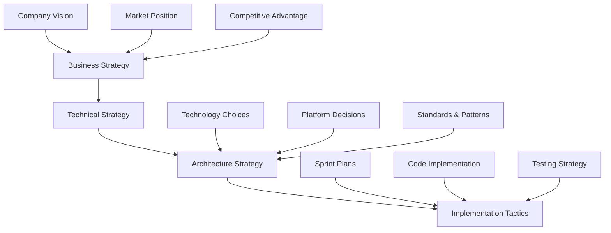

---

## Systems Thinking for Technical Leaders

### What is Systems Thinking?

Systems thinking is a holistic approach to analysis that focuses on how a system's constituent parts interrelate and how systems work over time and within the context of larger systems.

### Key Principles

#### 1. Interconnectedness

**Concept:** Everything is connected to everything else.

**Technical Application:**
- Changing one component affects others
- Local optimizations can hurt global performance
- Emergent behavior from component interactions

**Example:**
Optimizing database queries without considering caching can shift load to the database, causing cascading failures.

#### 2. Feedback Loops

**Concept:** Systems have reinforcing and balancing feedback loops.

**Reinforcing Loops (Virtuous or Vicious Cycles):**
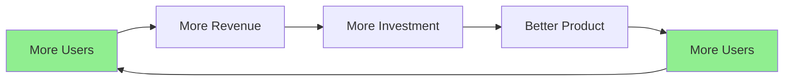

**Balancing Loops (Stabilizing Forces):**
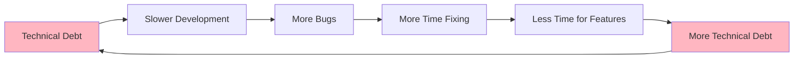

#### 3. Emergence

**Concept:** System behavior emerges from interactions, not just components.

**Technical Examples:**
- System reliability emerges from multiple components
- Team culture emerges from interactions
- Performance emerges from architecture + implementation + operations

#### 4. Leverage Points

**Concept:** Small changes in the right places can have big impacts.

**Donella Meadows' Leverage Points (Highest to Lowest):**
1. **Paradigms:** The mindset out of which the system arises
2. **Goals:** The purpose of the system
3. **System structure:** Information flow, rules, power dynamics
4. **Feedback loops:** Strength of reinforcing/balancing loops
5. **Information flows:** Who has access to what information
6. **Rules:** Incentives, constraints, regulations
7. **Stock-and-flow structures:** Physical infrastructure
8. **Buffers:** Stabilizing stocks relative to flows
9. **Parameters:** Numbers, constants

**Application for Technical Leaders:**
- Changing team structure (system structure) often has more impact than optimizing individual performance
- Improving feedback loops (CI/CD, monitoring) can transform development velocity
- Changing goals (from feature delivery to customer outcomes) shifts entire team behavior

### Systems Thinking Tools

#### Causal Loop Diagrams

**Purpose:** Visualize feedback loops and system dynamics.

**Example: Technical Debt Cycle**
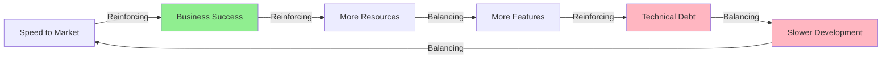

#### Stock-and-Flow Diagrams

**Purpose:** Model accumulations and rates of change.

**Example: Team Knowledge**
- **Stock:** Team's collective knowledge
- **Inflows:** Learning, onboarding, documentation
- **Outflows:** Attrition, forgetting, outdated knowledge

---

## Identifying Business Problems That Matter

### The Problem Discovery Process

#### Step 1: Understand the Business Context

**Questions to Ask:**
1. What are the company's strategic goals this year?
2. What are the biggest challenges facing the business?
3. Where is the company losing money or opportunity?
4. What do customers complain about most?
5. What are competitors doing better?

**Business Context Framework:**
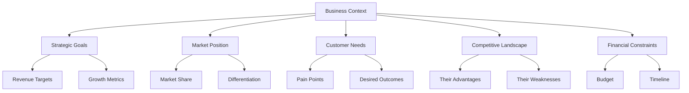

#### Step 2: Distinguish Symptoms from Root Causes

**Common Mistake:** Solving symptoms instead of root causes.

**Example:**
- **Symptom:** "Our deployment process is slow"
- **Root Cause:** "We have manual testing that takes 3 days because our test suite is flaky and we lack automated regression testing"

**Technique: The 5 Whys**
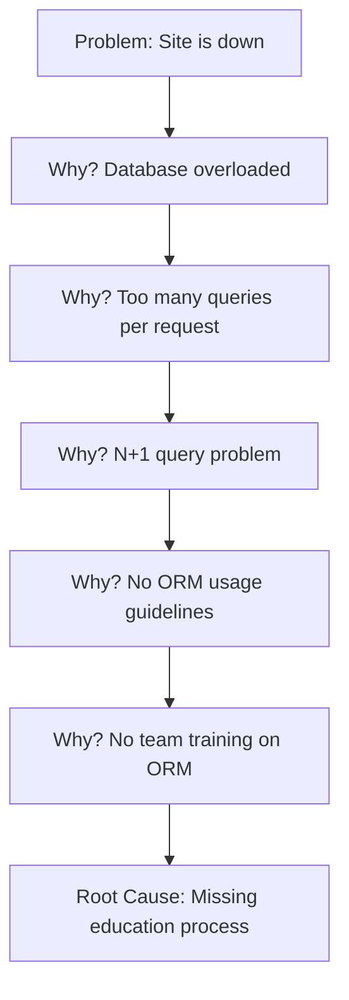

#### Step 3: Validate the Problem

**Validation Criteria:**
1. **Frequency:** How often does this problem occur?
2. **Impact:** How much does it cost (time, money, reputation)?
3. **Urgency:** How soon must it be solved?
4. **Feasibility:** Can we actually solve it?
5. **Alignment:** Does solving it advance business goals?

**Problem Validation Matrix:**
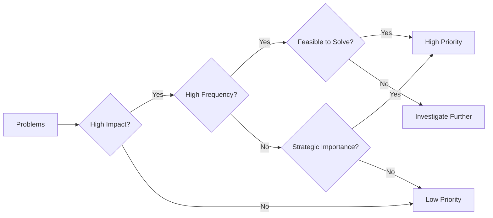

#### Step 4: Quantify the Problem

**Metrics to Collect:**
- **Time:** Hours/days spent on the problem
- **Money:** Revenue lost, costs incurred
- **Quality:** Error rates, customer complaints
- **Opportunity:** Revenue or value not captured
- **Risk:** Probability and impact of failures

**Example Quantification:**
```
Problem: Manual deployment process
- Time per deployment: 4 hours
- Deployments per week: 5
- Total time: 20 hours/week = 1,040 hours/year
- Cost: 1,040 hours × $150/hour = $156,000/year
- Risk: 1 major outage per quarter from human error
- Impact: $50,000 per outage
- Total annual cost: $156,000 + $200,000 = $356,000
```

### Problem Framing Techniques

#### Problem Statement Template

**Format:**
```
[User/System] needs a way to [user's need] because 
[compelling reason/insight]. Currently, [current situation], 
which results in [negative impact]. We will know this is 
solved when [measurable outcome].
```

**Example:**
```
Development teams need a way to deploy code confidently 
because manual deployments cause 30% of production incidents. 
Currently, deployments require 4 hours of manual work and 
a deployment specialist, which results in 2 major outages 
per quarter. We will know this is solved when deployments 
take less than 15 minutes, require no specialist, and 
production incidents from deployments drop to near zero.
```

#### Opportunity Solution Tree

**Purpose:** Map problem space before jumping to solutions.

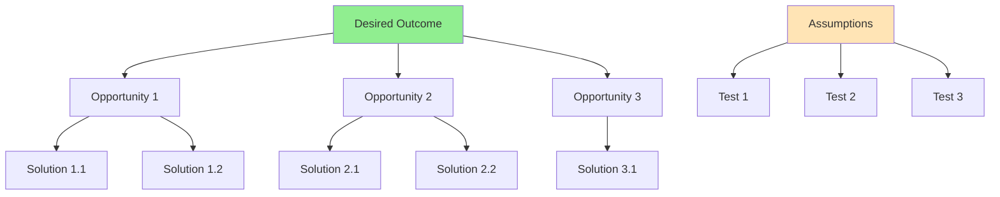

---

## Building a Socio-Technical Strategy

### The Strategy Development Process

#### Phase 1: Problem Definition (Week 1)

**Activities:**
- Interview stakeholders
- Analyze data and metrics
- Document current state
- Define desired future state
- Quantify the gap

**Deliverables:**
- Problem statement
- Business case
- Success metrics
- Stakeholder map

#### Phase 2: Analysis & Design (Week 2)

**Activities:**
- Systems analysis
- Option generation
- Trade-off analysis
- Risk assessment
- Resource planning

**Deliverables:**
- Options analysis
- Recommended approach
- Risk mitigation plan
- Resource requirements

#### Phase 3: Planning (Week 3)

**Activities:**
- Break down into phases
- Identify dependencies
- Create timeline
- Assign responsibilities
- Define milestones

**Deliverables:**
- Implementation plan
- Timeline with milestones
- Responsibility matrix
- Communication plan

#### Phase 4: Execution & Iteration (Ongoing)

**Activities:**
- Implement in phases
- Measure progress
- Gather feedback
- Adjust strategy
- Scale successful approaches

**Deliverables:**
- Working solutions
- Progress reports
- Lessons learned
- Updated strategy

### Strategy Document Template

#### 1. Executive Summary

**Length:** 1 paragraph (150-200 words)

**Content:**
- Problem statement
- Proposed solution
- Expected outcomes
- Resource requirements
- Timeline

**Example:**
```
Our deployment process requires 20 hours per week of manual 
work and causes 2 major outages per quarter, costing $356,000 
annually. We propose implementing automated CI/CD pipelines 
with automated testing, reducing deployment time to 15 minutes 
and eliminating manual errors. This will save $200,000 annually 
in reduced outages and engineering time, with an investment of 
$50,000 and 3 months of engineering effort. Success will be 
measured by deployment frequency, lead time, and change failure rate.
```

#### 2. Problem Statement

**Format:** Clear, specific, measurable

**Components:**
- Who is affected?
- What is the problem?
- When does it occur?
- Where does it happen?
- How much does it cost?
- Why does it matter?

#### 3. Business Context

**Sections:**
- Strategic alignment
- Market forces
- Customer impact
- Competitive landscape
- Financial implications

#### 4. Current State Analysis

**Sections:**
- Existing processes
- Current metrics
- Pain points
- Root causes
- Constraints

#### 5. Proposed Solution

**Sections:**
- High-level approach
- Key components
- How it works
- Why this approach
- Alternatives considered

#### 6. Trade-offs

**Format:** Explicit table

| Decision | Chosen Option | Rejected Option | Rationale |
|----------|---------------|-----------------|-----------|
| Deployment approach | Automated CI/CD | Manual with checklists | Automation reduces human error and increases speed |
| Testing strategy | Automated integration tests | Manual QA only | Automated tests catch regressions faster and cheaper |
| Rollout approach | Gradual rollout | Big bang | Gradual rollout reduces risk and allows learning |

#### 7. Success Metrics

**Format:** SMART criteria (Specific, Measurable, Achievable, Relevant, Time-bound)

| Metric | Current | Target | Timeline | Measurement Method |
|--------|---------|--------|----------|-------------------|
| Deployment time | 4 hours | 15 minutes | 3 months | CI/CD pipeline metrics |
| Production incidents | 2/quarter | <1/year | 6 months | Incident tracking system |
| Engineering time | 20 hrs/week | 2 hrs/week | 3 months | Time tracking |
| Change failure rate | 30% | <5% | 6 months | Deployment tracking |

#### 8. Risk Analysis

**Format:** Risk matrix

| Risk | Probability | Impact | Mitigation | Owner |
|------|-------------|--------|------------|-------|
| Team lacks CI/CD expertise | Medium | High | Training + hiring | Engineering Manager |
| Legacy systems hard to automate | High | Medium | Phased approach | Tech Lead |
| Resistance to change | Medium | Medium | Change management | Engineering Lead |

#### 9. Implementation Plan

**Format:** Phased approach

**Phase 1: Foundation (Month 1)**
- Set up CI/CD infrastructure
- Automate build process
- Train team on tools

**Phase 2: Automation (Month 2)**
- Implement automated testing
- Automate deployment to staging
- Create rollback procedures

**Phase 3: Production (Month 3)**
- Automate production deployment
- Implement monitoring
- Document processes

#### 10. Resource Requirements

**Sections:**
- Team composition
- Time estimates
- Budget
- Tools and infrastructure
- External support

#### 11. Validation Criteria

**Format:** How we'll know the strategy is wrong

```
We will know this strategy is wrong if:
1. Deployment time doesn't improve after 2 months
2. Production incidents increase during rollout
3. Team adoption is below 50% after 1 month
4. Costs exceed 150% of budget
5. Business stakeholders report negative impact

If any of these occur, we will:
- Pause and assess root cause
- Adjust approach or timeline
- Consider alternative solutions
- Communicate changes to stakeholders
```

---

## Product Management for Engineers

### Understanding Product Management

**Product Manager Role:**
- Define **what** to build and **why**
- Prioritize based on customer value
- Balance stakeholder needs
- Measure success
- Iterate based on feedback

**Engineer's Role:**
- Determine **how** to build it
- Estimate effort and complexity
- Identify technical constraints
- Propose technical solutions
- Implement and maintain

### Product Management Frameworks

#### 1. RICE Scoring

**Purpose:** Prioritize features and initiatives

**Formula:**
```
RICE Score = (Reach × Impact × Confidence) / Effort

Reach: How many users affected per time period
Impact: How much it affects each user (massive=3, high=2, medium=1, low=0.5)
Confidence: How sure are we (100%=1, 80%=0.8, 50%=0.5)
Effort: Person-months required
```

**Example:**
```
Feature: Automated deployments
Reach: 50 engineers × 5 deploys/week = 250 deploys/week
Impact: 2 (high - saves significant time)
Confidence: 100% (1.0) - we know the current pain
Effort: 3 person-months

RICE Score = (250 × 2 × 1.0) / 3 = 166.7
```

#### 2. MoSCoW Method

**Purpose:** Categorize requirements

**Categories:**
- **Must Have:** Critical for launch
- **Should Have:** Important but not critical
- **Could Have:** Desirable but not necessary
- **Won't Have:** Out of scope for now

**Example: CI/CD Implementation**
- **Must Have:** Automated build, automated tests, deployment to staging
- **Should Have:** Automated deployment to production, rollback capability
- **Could Have:** Deployment dashboards, automated performance testing
- **Won't Have:** Automated security scanning (phase 2)

#### 3. Jobs-to-be-Done (JTBD)

**Concept:** Customers "hire" products to do a job.

**Framework:**
```
When [situation], I want to [motivation], so I can [outcome].
```

**Example:**
```
When I need to deploy code to production,
I want an automated, reliable deployment process,
so I can focus on building features instead of 
worrying about deployment errors.
```

**Application:**
- Focus on the job, not the feature
- Understand context and motivation
- Design for desired outcome
- Measure job completion, not feature usage

### Working with Product Managers

**Effective Collaboration:**
1. **Early involvement:** Participate in problem definition, not just solution design
2. **Ask "why":** Understand the business problem before proposing solutions
3. **Propose alternatives:** Offer multiple technical approaches with trade-offs
4. **Educate:** Help PMs understand technical constraints and possibilities
5. **Negotiate:** Trade scope, time, and quality explicitly
6. **Measure together:** Define success metrics collaboratively

**Common Misunderstandings:**
- **Engineer thinks:** "PM doesn't understand technical complexity"
- **PM thinks:** "Engineer doesn't understand business value"
- **Solution:** Bridge the gap with data, examples, and shared metrics

---

## Software Architecture Strategy

### Architecture as Strategy

**Definition:** Software architecture is the set of decisions that define:
- System structure and components
- Interfaces and interactions
- Quality attributes (performance, security, scalability)
- Technical standards and patterns

**Strategic Considerations:**
- Current and future scale requirements
- Team structure and Conway's Law
- Time-to-market vs. technical excellence
- Technical debt management
- Platform vs. point solutions

### Architecture Decision-Making

#### Architecture Decision Records (ADRs)

**Purpose:** Document significant architecture decisions

**Template:**
```markdown
# ADR-001: Adopt Microservices Architecture

## Status
Accepted

## Context
Our monolith is becoming difficult to maintain. Teams are 
blocked on each other, deployments are risky, and scaling 
is inefficient. We need to enable independent team deployment 
and faster iteration cycles.

## Decision
We will adopt a microservices architecture, decomposing the 
monolith into 12 services over 18 months.

## Consequences
### Positive
- Teams can deploy independently
- Services can be scaled individually
- Technology diversity is possible
- Fault isolation improves resilience

### Negative
- Increased operational complexity
- Network latency between services
- Data consistency challenges
- Requires investment in monitoring and observability
- Learning curve for teams

## Alternatives Considered
1. **Modular monolith:** Rejected because doesn't solve deployment coupling
2. **Strangler fig pattern:** Rejected because timeline is too long
3. **Keep monolith:** Rejected because constraints are too severe
```

#### Architecture Trade-off Analysis

**Framework:**
1. **Identify quality attributes:** Performance, scalability, security, maintainability, etc.
2. **Prioritize attributes:** Which matter most for this context?
3. **Evaluate options:** How does each option perform on each attribute?
4. **Make trade-offs:** No option is best on all attributes
5. **Document rationale:** Why we chose this approach

**Example: Database Selection**

| Attribute | PostgreSQL | MongoDB | Cassandra |
|-----------|-----------|---------|-----------|
| **Consistency** | Strong | Eventual | Eventual |
| **Scalability** | Vertical | Horizontal | Horizontal |
| **Query Flexibility** | High | Medium | Low |
| **Complexity** | Low | Medium | High |
| **Team Expertise** | High | Medium | Low |

**Decision:** PostgreSQL because strong consistency and query flexibility are priorities, and team has expertise.

### Strategic Architecture Patterns

#### 1. Strangler Fig Pattern

**Purpose:** Gradually migrate from legacy system to new system

**Approach:**
1. Identify functionality to migrate
2. Build new functionality in new system
3. Route traffic to appropriate system
4. Gradually migrate more functionality
5. Decommission legacy system

**Benefits:**
- Low risk (gradual migration)
- Continuous delivery
- Can stop at any time
- Learn and adjust

#### 2. Anti-Corruption Layer

**Purpose:** Protect your system from legacy or external system complexity

**Approach:**
1. Define clean interface for your system
2. Build translation layer between systems
3. Isolate legacy system behind the layer
4. Gradually replace legacy functionality

**Benefits:**
- Prevents legacy design from infecting new system
- Enables incremental migration
- Clear boundaries and responsibilities

#### 3. Event-Driven Architecture

**Purpose:** Enable loose coupling and scalability

**Approach:**
1. Components communicate via events
2. Events represent state changes
3. Components react independently
4. Enables asynchronous processing

**Benefits:**
- Loose coupling
- Scalability
- Resilience
- Extensibility

**Trade-offs:**
- Eventual consistency
- Complexity in debugging
- Requires careful event design

---

## Real-World Examples & Case Studies

### Case Study 1: Amazon's "Two-Pizza Teams" and Microservices

**Context:** Amazon's monolith was becoming unwieldy as the company grew.

**Strategy:**
- Decompose into small, autonomous teams (two-pizza teams)
- Each team owns a service end-to-end
- Services communicate via APIs
- Teams have full ownership and accountability

**Technical Approach:**
- Service-oriented architecture
- API-first design
- Decentralized data management
- Heavy investment in tooling and platforms

**Outcomes:**
- Faster innovation (teams can deploy independently)
- Higher reliability (failures isolated to services)
- Better scalability (services scale independently)
- Improved team autonomy and satisfaction

**Lessons Learned:**
- Conway's Law is real: architecture reflects organization
- Invest in platforms and tooling
- Cultural change is as important as technical change
- Start with a few services, not a full rewrite

### Case Study 2: Netflix's Migration to AWS

**Context:** Netflix's data center couldn't scale with their growth.

**Strategy:**
- Migrate from data center to cloud
- Build cloud-native architecture
- Embrace failure (design for resilience)
- Automate everything

**Technical Approach:**
- Microservices architecture
- Chaos engineering (Simian Army)
- Auto-scaling and self-healing
- CDN for video delivery

**Outcomes:**
- Infinite scalability
- Global availability
- Faster innovation cycles
- Cost optimization through cloud economics

**Lessons Learned:**
- Migration takes years, not months
- Cultural shift to cloud-first thinking is critical
- Invest in observability and monitoring
- Design for failure from the start

### Case Study 3: Spotify's Squad Model and Architecture

**Context:** Spotify needed to scale engineering while maintaining agility.

**Strategy:**
- Organize into squads (autonomous teams)
- Align architecture with team structure
- Enable autonomy with alignment
- Invest in internal platforms

**Technical Approach:**
- Microservices with clear ownership
- API contracts between squads
- Shared infrastructure and tooling
- Guilds for knowledge sharing

**Outcomes:**
- High team autonomy
- Fast innovation
- Clear ownership and accountability
- Knowledge sharing across teams

**Lessons Learned:**
- Architecture and organization must evolve together
- Balance autonomy with alignment
- Invest in developer experience
- Create spaces for cross-team learning

### Case Study 4: GitHub's Monolith to Microservices Journey

**Context:** GitHub's Rails monolith was showing signs of strain.

**Strategy:**
- Gradual decomposition, not big bang
- Identify bounded contexts
- Extract services incrementally
- Maintain monolith during transition

**Technical Approach:**
- Strangler fig pattern
- Internal APIs first
- Extract by business capability
- Maintain backward compatibility

**Outcomes:**
- Improved performance and scalability
- Teams can work independently
- Reduced deployment risk
- Maintained business continuity

**Lessons Learned:**
- You don't have to choose between monolith and microservices
- Incremental approach reduces risk
- Clear boundaries are essential
- Invest in testing and monitoring

---

## Mermaid Diagrams

### Diagram 1: Technical Strategy Development Process

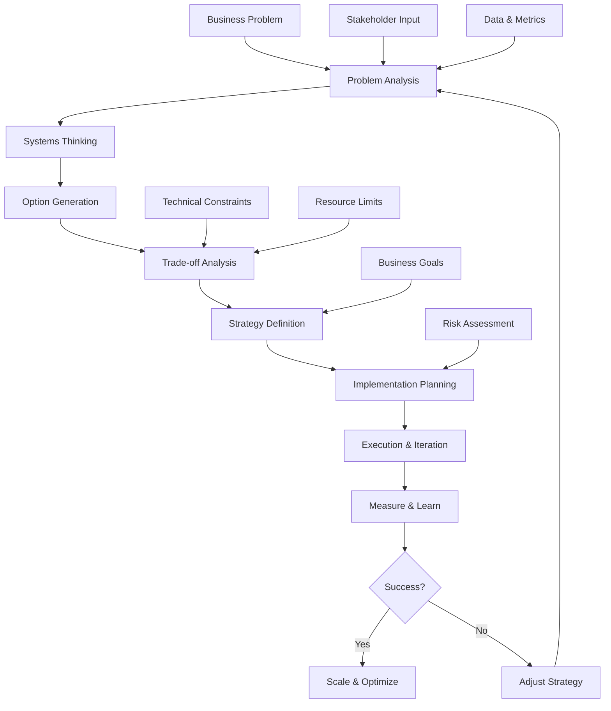

### Diagram 2: Socio-Technical System Components

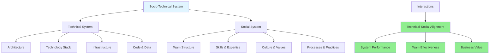

### Diagram 3: Problem-Solution Mapping

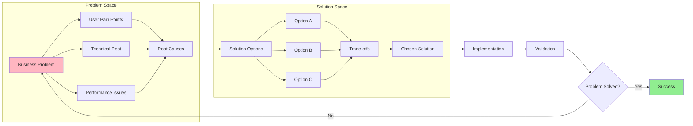

### Diagram 4: Systems Thinking Feedback Loops

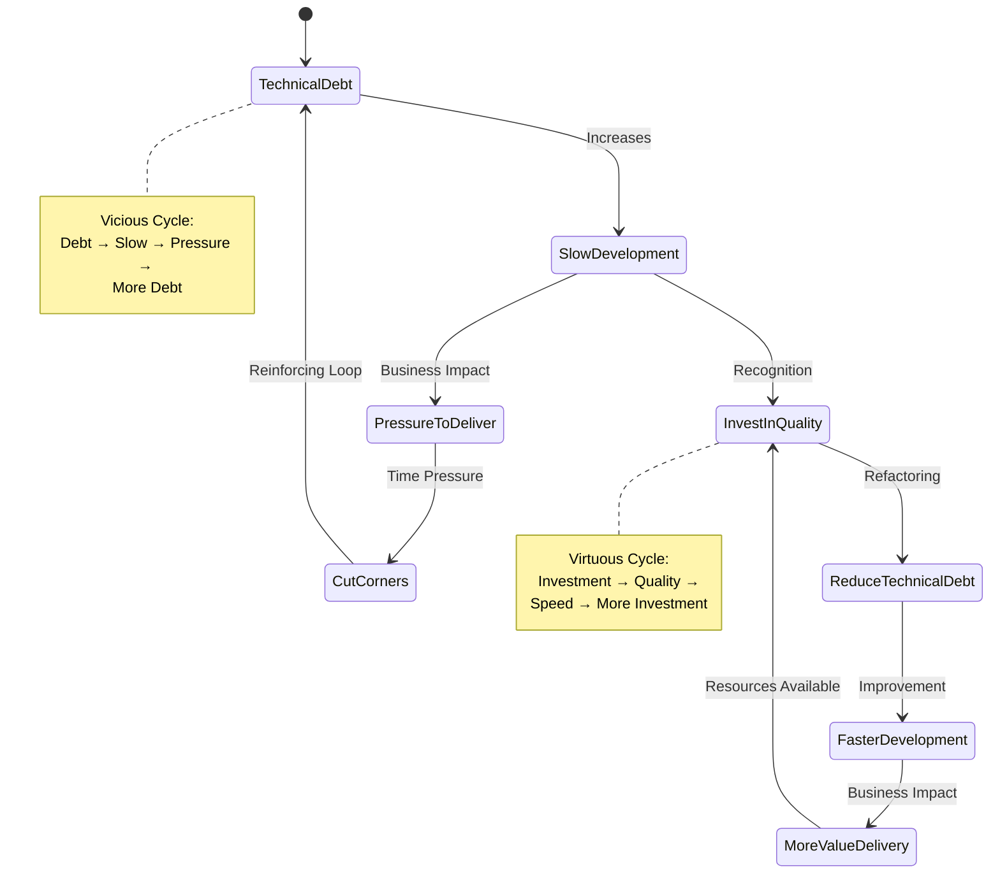

### Diagram 5: Strategy Hierarchy and Alignment

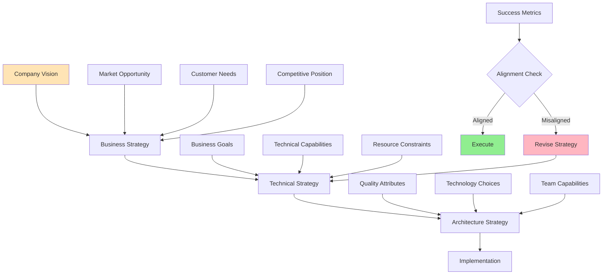

---

## Common Pitfalls & Anti-Patterns

### Anti-Pattern 1: Solution-First Thinking

**Problem:** Jumping to solutions before understanding the problem.

**Symptoms:**
- "We should use Kubernetes" (before understanding deployment needs)
- "We need to rewrite in Go" (before understanding performance issues)
- "Let's adopt microservices" (before understanding coupling problems)

**Root Cause:**
- Excitement about new technology
- Pressure to "do something"
- Lack of problem-solving discipline

**Solution:**
- Always start with problem definition
- Use "why" questions to dig deeper
- Document problem before discussing solutions
- Validate problem with data

### Anti-Pattern 2: Technology-Driven Strategy

**Problem:** Choosing technology first, then finding problems to solve.

**Symptoms:**
- "We have a new tool, what can we use it for?"
- Technology choices don't align with business needs
- Over-engineering simple problems
- Resume-driven development

**Root Cause:**
- Engineer curiosity and enthusiasm
- Lack of business context
- Misaligned incentives

**Solution:**
- Start with business problem
- Let requirements drive technology choices
- Consider "no code" as a valid option
- Evaluate multiple approaches

### Anti-Pattern 3: Analysis Paralysis

**Problem:** Over-analyzing without making decisions.

**Symptoms:**
- Endless research and evaluation
- Missed opportunities due to delay
- Decision fatigue
- No progress on actual work

**Root Cause:**
- Fear of making wrong decision
- Perfectionism
- Lack of decision-making framework
- Too many options

**Solution:**
- Set decision deadlines
- Use "good enough" criteria
- Make reversible decisions quickly
- Learn by doing (iterate)
- Accept that some uncertainty is inevitable

### Anti-Pattern 4: Ignoring Social Factors

**Problem:** Focusing only on technical solution, ignoring people and process.

**Symptoms:**
- Perfect technical solution that no one uses
- Resistance from teams
- Change initiatives fail
- Great architecture, poor outcomes

**Root Cause:**
- Technical focus only
- Underestimating change management
- Not involving stakeholders early

**Solution:**
- Consider team capabilities and willingness
- Plan for change management
- Involve stakeholders in design
- Invest in training and support
- Measure adoption, not just deployment

### Anti-Pattern 5: Strategy Without Validation

**Problem:** Creating strategy but never validating if it's working.

**Symptoms:**
- Continuing failed approach
- No measurement of outcomes
- Sunk cost fallacy
- Strategy becomes dogma

**Root Cause:**
- No clear success criteria
- Fear of admitting failure
- Lack of feedback mechanisms
- Strategy set-and-forget mentality

**Solution:**
- Define validation criteria upfront
- "How will we know this is wrong?"
- Regular strategy reviews
- Be willing to pivot
- Celebrate learning from failures

### Anti-Pattern 6: Big Bang Implementation

**Problem:** Trying to implement everything at once.

**Symptoms:**
- Long timelines with no intermediate value
- High risk of failure
- Team burnout
- Business doesn't see value until too late

**Root Cause:**
- Desire for perfect solution
- Impatience
- Lack of phased approach thinking

**Solution:**
- Break into phases with clear value
- Deliver incrementally
- Get feedback early and often
- Celebrate small wins
- Adjust based on learning

---

## Best Practices

### 1. Start with the Problem, Not the Solution

**Process:**
1. **Understand** the business problem deeply
2. **Quantify** the impact and urgency
3. **Validate** with stakeholders and data
4. **Frame** in user/customer terms
5. **Only then** explore solutions

**Techniques:**
- Interview users and stakeholders
- Analyze data and metrics
- Observe actual behavior
- Ask "why" five times
- Write problem statement before solution

### 2. Make Trade-offs Explicit

**Framework:**
For every major decision, document:
- **What we're choosing** and why
- **What we're rejecting** and why
- **What we're deferring** and when we'll revisit
- **What assumptions** we're making
- **What would change our mind**

**Example:**
```markdown
## Decision: Use PostgreSQL vs. MongoDB

**Chosen:** PostgreSQL
**Why:** Strong consistency, team expertise, complex queries needed

**Rejected:** MongoDB
**Why:** Eventual consistency not acceptable, team lacks expertise

**Deferred:** Caching layer
**When:** When we hit 10,000 QPS

**Assumptions:** 
- Data model is relational
- Consistency is critical
- Team can learn advanced PostgreSQL features

**Would change mind if:**
- Schema becomes highly variable
- Scale exceeds single-node capacity
- Team grows significantly
```

### 3. Define "How We'll Know We're Wrong"

**Purpose:** Avoid sunk cost fallacy and enable course correction.

**Format:**
```
We will know this strategy is wrong if:
1. [Specific metric] doesn't improve within [timeframe]
2. [Unexpected negative outcome] occurs
3. [Stakeholder] reports [specific issue]
4. Costs exceed [threshold]
5. [Critical assumption] proves false

If this happens, we will:
- [Specific action 1]
- [Specific action 2]
- [Escalation path]
```

### 4. Communicate Strategy Effectively

**Audience-Specific Communication:**

**For Executives:**
- Focus on business outcomes
- Use financial metrics (ROI, cost savings)
- Keep it to 1-2 pages
- Emphasize strategic alignment
- Clear ask and timeline

**For Engineering Teams:**
- Technical details and trade-offs
- Architecture diagrams
- Implementation approach
- Success criteria
- How it affects their work

**For Product Managers:**
- User and business impact
- Feature trade-offs
- Timeline implications
- Dependencies
- Success metrics

**Communication Templates:**
- **1-page executive summary** for leadership
- **Technical design doc** for engineering
- **Roadmap slide** for stakeholders
- **FAQ document** for common questions

### 5. Iterate and Adapt

**Strategy Review Cadence:**
- **Weekly:** Tactical adjustments
- **Monthly:** Progress against metrics
- **Quarterly:** Strategic review and adjustment
- **Annually:** Major strategy refresh

**Review Questions:**
1. Are we solving the right problem?
2. Are our assumptions still valid?
3. Is the business context changing?
4. Are we on track to meet goals?
5. What are we learning?
6. What would we do differently?

### 6. Balance Short-term and Long-term

**Framework: 70-20-10 Rule**
- **70%** on current business needs
- **20%** on adjacent opportunities
- **10%** on future innovation

**Application:**
- Don't let urgent eclipse important
- Invest in technical debt reduction
- Allocate time for exploration
- Build capabilities for future needs

### 7. Align Architecture with Organization

**Conway's Law:**
> "Organizations which design systems are constrained to produce designs which are copies of the communication structures of these organizations." - Melvin Conway

**Implications:**
- Team structure influences architecture
- Architecture influences team structure
- Design architecture to enable desired team dynamics
- Consider communication overhead

**Example:**
- Want autonomous teams? → Microservices with clear boundaries
- Want fast collaboration? → Modular monolith with shared codebase
- Want specialization? → Layered architecture with specialized teams

---

## Practice Exercises

### Exercise 1: Problem Definition and Framing

**Objective:** Practice identifying and framing business problems.

**Instructions:**
1. Choose a current problem in your organization (technical or business).
2. Apply the problem statement template:
   ```
   [User/System] needs a way to [user's need] because 
   [compelling reason/insight]. Currently, [current situation], 
   which results in [negative impact]. We will know this is 
   solved when [measurable outcome].
   ```
3. Quantify the problem:
   - How many people are affected?
   - How much time/money is lost?
   - How often does it occur?
   - What's the business impact?
4. Validate with at least 2 stakeholders.
5. Refine based on feedback.

**Sample Solution:**

**Initial Problem:** "Our API is slow"

**Refined Problem Statement:**
```
E-commerce customers need product search results in under 
200ms because page load time directly impacts conversion 
rate. Currently, product search averages 800ms due to 
unoptimized database queries and no caching, which results 
in 15% lower conversion rate and $2M annual revenue loss. 
We will know this is solved when 95th percentile response 
time is under 200ms and conversion rate increases by 10%.
```

**Quantification:**
- Affected: 100,000 daily active users
- Current performance: 800ms average, 2s at 95th percentile
- Business impact: 15% lower conversion = $2M/year
- Target: <200ms at 95th percentile
- Expected improvement: 10% conversion increase = $1.3M/year

### Exercise 2: Trade-off Analysis

**Objective:** Practice making explicit trade-offs in technical decisions.

**Instructions:**
1. Choose a technical decision your team is facing (e.g., database selection, architecture pattern, tool adoption).
2. Identify 3-4 options.
3. Create a trade-off matrix evaluating each option on:
   - Performance
   - Scalability
   - Maintainability
   - Cost
   - Team expertise
   - Time to implement
4. Make a decision and document:
   - What you're choosing and why
   - What you're rejecting and why
   - What assumptions you're making
   - What would change your mind
5. Present your analysis to a colleague for feedback.

**Sample Solution:**

**Decision:** Database for new analytics platform

**Options:**
1. PostgreSQL
2. MongoDB
3. Cassandra
4. BigQuery

**Trade-off Matrix:**

| Criterion | PostgreSQL | MongoDB | Cassandra | BigQuery |
|-----------|-----------|---------|-----------|----------|
| **Query Flexibility** | ⭐⭐⭐⭐⭐ | ⭐⭐⭐ | ⭐⭐ | ⭐⭐⭐⭐⭐ |
| **Scalability** | ⭐⭐⭐ | ⭐⭐⭐⭐ | ⭐⭐⭐⭐⭐ | ⭐⭐⭐⭐⭐ |
| **Consistency** | ⭐⭐⭐⭐⭐ | ⭐⭐⭐ | ⭐⭐⭐ | ⭐⭐⭐⭐⭐ |
| **Cost** | ⭐⭐⭐⭐ | ⭐⭐⭐⭐ | ⭐⭐⭐ | ⭐⭐ |
| **Team Expertise** | ⭐⭐⭐⭐⭐ | ⭐⭐⭐ | ⭐⭐ | ⭐⭐⭐ |
| **Time to Implement** | ⭐⭐⭐⭐⭐ | ⭐⭐⭐⭐ | ⭐⭐⭐ | ⭐⭐⭐⭐ |

**Decision:** PostgreSQL

**Rationale:**
- **Chosen:** PostgreSQL for strong consistency, query flexibility, and team expertise
- **Rejected:** MongoDB (eventual consistency not suitable), Cassandra (too complex, team lacks expertise), BigQuery (cost too high for our scale)
- **Assumptions:** Data model is relational, scale stays under 10TB, team can optimize queries
- **Would change mind if:** Scale exceeds 10TB, schema becomes highly variable, or we need multi-region writes

### Exercise 3: Strategy Document Creation

**Objective:** Create a one-page technical strategy for a real problem.

**Instructions:**
1. Choose a current problem in your organization.
2. Create a one-page strategy document including:
   - Executive summary (2-3 sentences)
   - Problem statement (quantified)
   - Proposed solution (high-level)
   - Trade-offs (at least 2)
   - Success metrics (3-5 SMART metrics)
   - Validation criteria (how we'll know we're wrong)
3. Review with a peer or mentor.
4. Refine based on feedback.

**Sample Solution:**

**Strategy: Implement Automated Testing**

**Executive Summary:**
Our manual QA process takes 3 days per release and catches only 60% of bugs, resulting in 4 production incidents per month. We propose implementing automated testing (unit, integration, E2E) to reduce QA time to 4 hours and increase bug detection to 95%, saving $180,000 annually in incident response and accelerating release cycles from bi-weekly to weekly.

**Problem Statement:**
Development teams need faster, more reliable release validation because manual QA creates bottlenecks and misses bugs. Currently, QA takes 3 days per release with 40% bug escape rate, resulting in 4 production incidents monthly costing $15,000 each. We will know this is solved when QA time is under 4 hours, bug escape rate is under 5%, and production incidents drop below 1 per month.

**Proposed Solution:**
Implement comprehensive automated testing:
- Unit tests (80% coverage target)
- Integration tests for critical paths
- E2E tests for user journeys
- CI/CD integration for automated execution
- Test data management strategy

**Trade-offs:**
- **Chosen:** Invest in automated testing over hiring more QA engineers (better long-term ROI, faster feedback)
- **Rejected:** Manual testing only (doesn't scale, slow, error-prone)
- **Deferred:** Performance testing automation (phase 2 after functional tests are stable)

**Success Metrics:**
1. QA time: 3 days → 4 hours (3 months)
2. Bug escape rate: 40% → 5% (6 months)
3. Production incidents: 4/month → <1/month (6 months)
4. Release frequency: Bi-weekly → Weekly (3 months)
5. Test coverage: 20% → 80% (6 months)

**Validation Criteria:**
We will know this strategy is wrong if:
1. QA time doesn't improve after 2 months
2. Development velocity decreases by >20%
3. Team adoption is below 60%
4. Production incidents don't decrease after 3 months

If this happens, we will reassess test approach, provide additional training, or consider hybrid manual/automated strategy.

---

## Question Bank

### Multiple Choice Questions (1-30)

1. What is a technical strategy?
   - A) A list of technologies to use
   - B) A plan to achieve technical goals that support business objectives
   - C) An architecture diagram
   - D) A project timeline
   - **Answer: B**

2. Systems thinking focuses on:
   - A) Individual components in isolation
   - B) How parts interrelate and work over time
   - C) Only technical systems
   - D) Breaking down complex systems
   - **Answer: B**

3. What is a reinforcing feedback loop?
   - A) A loop that stabilizes the system
   - B) A loop that amplifies change (virtuous or vicious cycle)
   - C) A loop that slows down processes
   - D) A negative feedback mechanism
   - **Answer: B**

4. Which is a leverage point in systems thinking?
   - A) Changing parameters
   - B) Changing system structure or goals
   - C) Adjusting constants
   - D) Modifying individual components
   - **Answer: B**

5. What is the purpose of the "5 Whys" technique?
   - A) To ask stakeholders five questions
   - B) To identify root causes by iteratively asking why
   - C) To validate solutions five times
   - D) To estimate project duration
   - **Answer: B**

6. A socio-technical system considers:
   - A) Only technical components
   - B) Only social components
   - C) Both technical and social aspects
   - D) Neither technical nor social aspects
   - **Answer: C**

7. What is the difference between strategy and tactics?
   - A) No difference
   - B) Strategy is long-term direction, tactics are short-term actions
   - C) Strategy is technical, tactics are business
   - D) Strategy is planning, tactics are execution
   - **Answer: B**

8. What does RICE stand for in product management?
   - A) Reach, Impact, Confidence, Effort
   - B) Requirements, Implementation, Cost, Evaluation
   - C) Risk, Impact, Cost, Efficiency
   - D) Results, Input, Context, Execution
   - **Answer: A**

9. In MoSCoW method, "Must Have" means:
   - A) Nice to have
   - B) Critical for launch
   - C) Can be deferred
   - D) Out of scope
   - **Answer: B**

10. Jobs-to-be-Done focuses on:
    - A) Job descriptions
    - B) The job a customer "hires" a product to do
    - C) Employment opportunities
    - D) Task management
    - **Answer: B**

11. What is Conway's Law?
    - A) Code quality degrades over time
    - B) System design reflects organizational communication structure
    - C) Performance decreases with scale
    - D) Technical debt accumulates
    - **Answer: B**

12. An Architecture Decision Record (ADR) documents:
    - A) Daily standup notes
    - B) Significant architecture decisions and rationale
    - C) Bug reports
    - D) Sprint goals
    - **Answer: B**

13. What is the Strangler Fig pattern used for?
    - A) Killing legacy systems
    - B) Gradually migrating from legacy to new system
    - C) Improving performance
    - D) Reducing costs
    - **Answer: B**

14. What is an Anti-Corruption Layer?
    - A) Security mechanism
    - B) Translation layer protecting system from legacy complexity
    - C) Network firewall
    - D) Data validation layer
    - **Answer: B**

15. Which is a balancing feedback loop?
    - A) Reinforces change
    - B) Stabilizes the system
    - C) Creates vicious cycles
    - D) Amplifies growth
    - **Answer: B**

16. What is the purpose of defining "how we'll know we're wrong"?
    - A) To assign blame
    - B) To enable course correction and avoid sunk cost fallacy
    - C) To document failures
    - D) To punish team members
    - **Answer: B**

17. Technical strategy should be:
    - A) Technology-driven
    - B) Problem-driven
    - C) Trend-driven
    - D) Manager-driven
    - **Answer: B**

18. What is emergence in systems thinking?
    - A) Planned behavior
    - B) Behavior arising from interactions, not just components
    - C) Emergency procedures
    - D) Unexpected bugs
    - **Answer: B**

19. The 70-20-10 rule refers to:
    - A) Code coverage targets
    - B) Resource allocation: 70% current needs, 20% adjacent, 10% future
    - C) Bug severity distribution
    - D) Team composition
    - **Answer: B**

20. What is a key characteristic of a good problem statement?
    - A) Vague and broad
    - B) Specific and measurable
    - C) Technical and complex
    - D) Long and detailed
    - **Answer: B**

21. Which is NOT a component of socio-technical systems?
    - A) Technology stack
    - B) Team structure
    - C) Market conditions
    - D) Organizational culture
    - **Answer: C**

22. What is the purpose of trade-off analysis?
    - A) To find the perfect solution
    - B) To make explicit what you're choosing and rejecting
    - C) To delay decisions
    - D) To blame others
    - **Answer: B**

23. In RICE scoring, what does "Confidence" measure?
    - A) Team confidence
    - B) How sure you are about estimates
    - C) Stakeholder confidence
    - D) Customer confidence
    - **Answer: B**

24. What is the primary goal of systems thinking?
    - A) Break systems into parts
    - B) Understand interrelationships and dynamics
    - C) Optimize individual components
    - D) Simplify complexity
    - **Answer: B**

25. Which is an example of a balancing loop?
    - A) More users → More revenue → More growth
    - B) Technical debt → Slower development → More debt
    - C) Investment in quality → Faster development → More value → More investment
    - D) All of the above
    - **Answer: C**

26. What should come first in strategy development?
    - A) Technology selection
    - B) Problem definition
    - C) Implementation plan
    - D) Team assignment
    - **Answer: B**

27. What is the purpose of validation criteria in strategy?
    - A) To prove the strategy is correct
    - B) To know when to pivot or adjust
    - C) To assign blame
    - D) To document success
    - **Answer: B**

28. Which is a symptom of solution-first thinking?
    - A) Understanding the problem deeply
    - B) "We should use Kubernetes" before understanding needs
    - C) Validating with stakeholders
    - D) Quantifying the problem
    - **Answer: B**

29. What does "big bang implementation" refer to?
    - A) Fast execution
    - B) Implementing everything at once
    - C) Successful launch
    - D) Popular approach
    - **Answer: B**

30. How often should strategy be reviewed?
    - A) Once per year
    - B) Never, once set
    - C) Regularly (weekly tactical, monthly progress, quarterly strategic)
    - D) Only when failing
    - **Answer: C**

### True/False Questions (31-40)

31. Strategy is about the "what" and "why," tactics are about the "how." (True)
32. Systems thinking focuses on individual components in isolation. (False)
33. Technical strategy should be technology-driven. (False)
34. Conway's Law states that system design reflects organizational structure. (True)
35. Trade-offs should be implicit, not explicit. (False)
36. Problem definition should come before solution design. (True)
37. Big bang implementation is the safest approach. (False)
38. Socio-technical systems consider both technical and social aspects. (True)
39. Analysis paralysis is better than making wrong decisions. (False)
40. Strategy should be validated regularly. (True)

### Fill-in-the-Blank Questions (41-50)

41. ________ thinking focuses on how system parts interrelate and work over time. (Systems)
42. A ________ loop amplifies change, creating virtuous or vicious cycles. (reinforcing)
43. The ________ technique asks "why" iteratively to find root causes. (5 Whys)
44. ________ is the set of decisions defining system structure and components. (Software architecture)
45. RICE scoring includes Reach, Impact, Confidence, and ________. (Effort)
46. In MoSCoW, "Should Have" means ________ but not critical. (important)
47. Conway's Law states that system design reflects ________ structure. (organizational communication)
48. An ________ Decision Record documents significant architecture decisions. (Architecture)
49. The ________ Fig pattern gradually migrates from legacy to new systems. (Strangler)
50. ________ thinking considers both technical and social aspects of systems. (Socio-technical)

### Scenario-Based Questions (51-60)

51. **Scenario:** Your team wants to adopt a new database technology. What should you do first?
    - **Answer:** Start by understanding the problem - what requirements aren't being met by the current database? Quantify the impact. Then evaluate options against those requirements, not just technology trends.

52. **Scenario:** You're seeing slow development velocity. Using systems thinking, how do you analyze this?
    - **Answer:** Look for feedback loops. Is technical debt causing slowness, which causes pressure to cut corners, which creates more debt? Identify leverage points - maybe investing in refactoring (a balancing loop) could break the vicious cycle.

53. **Scenario:** Your strategy isn't producing expected results. What do you do?
    - **Answer:** Check your validation criteria. Are you measuring the right things? Are assumptions still valid? Be willing to pivot. Review what you're learning and adjust the strategy accordingly.

54. **Scenario:** Product wants feature X, but you know it will create technical debt. How do you handle this?
    - **Answer:** Have a conversation about trade-offs. Explain the long-term cost of technical debt. Propose alternatives that achieve business goals with less debt. Make trade-offs explicit and document the decision.

55. **Scenario:** You're implementing a new architecture but teams are resistant. What's missing?
    - **Answer:** Likely the social aspect. You need to consider team capabilities, invest in training, involve teams in design, and plan for change management. Technical solutions fail without social buy-in.

56. **Scenario:** How do you apply the 5 Whys to a production outage?
    - **Answer:** Start with "Why did the outage occur?" Keep asking why for each answer until you reach a root cause that, if addressed, would prevent recurrence. Example: Outage → Database overload → Missing indexes → No index monitoring → No DBA process.

57. **Scenario:** You need to prioritize three initiatives. How do you decide?
    - **Answer:** Use RICE scoring or similar framework. Score each on Reach, Impact, Confidence, and Effort. This provides objective prioritization based on expected value. Also consider strategic alignment.

58. **Scenario:** Your monolith is becoming unwieldy. Should you rewrite as microservices?
    - **Answer:** Not necessarily. Consider alternatives: modular monolith, strangler fig pattern, extract services incrementally. Evaluate based on team structure, actual pain points, and business needs. Big bang rewrites are high risk.

59. **Scenario:** How do you define success for a technical strategy?
    - **Answer:** Use SMART criteria - Specific, Measurable, Achievable, Relevant, Time-bound. Define metrics that matter to the business (not just technical metrics). Include both leading and lagging indicators.

60. **Scenario:** Your strategy document is 50 pages and no one reads it. What do you do?
    - **Answer:** Create multiple versions: 1-page executive summary for leadership, technical design doc for engineers, FAQ for stakeholders. Different audiences need different levels of detail. Make it scannable with clear sections.

---

## Test Your Understanding

1. What is a technical strategy and what are its key components?
2. How does systems thinking differ from traditional analysis?
3. What is the difference between reinforcing and balancing feedback loops?
4. What are Donella Meadows' leverage points and why do they matter?
5. How do you distinguish symptoms from root causes?
6. What is a socio-technical system and why is it important?
7. How does Conway's Law affect architecture decisions?
8. What is the purpose of Architecture Decision Records (ADRs)?
9. How do you make trade-offs explicit in strategy?
10. What is the Strangler Fig pattern and when should you use it?
11. How do you validate a business problem before solving it?
12. What is RICE scoring and how do you calculate it?
13. How do you define success metrics for a technical strategy?
14. What is the 70-20-10 rule and how do you apply it?
15. How do you communicate strategy to different audiences?
16. What is emergence in systems thinking?
17. How do you avoid analysis paralysis?
18. What is an Anti-Corruption Layer and when do you need it?
19. How do you know when a strategy is wrong?
20. What is the difference between strategy and tactics?

---

## Common Interview Questions

1. **Q:** How do you approach developing a technical strategy?
   **A:** I start by deeply understanding the business problem, quantifying its impact, and validating with stakeholders. Then I apply systems thinking to understand root causes and interconnections. I generate multiple options, make explicit trade-offs, and define success metrics. I document the strategy with clear validation criteria and review it regularly.

2. **Q:** What is systems thinking and how do you apply it?
   **A:** Systems thinking is a holistic approach focusing on how parts interrelate. I use it to identify feedback loops, find leverage points, and understand emergent behavior. For example, if development is slow, I look for reinforcing loops like technical debt → slower development → more debt, and find leverage points to break the cycle.

3. **Q:** How do you balance technical excellence with business needs?
   **A:** I focus on solving business problems, not building perfect technology. I make trade-offs explicit, quantify both technical and business impacts, and prioritize based on business value. I advocate for technical health while understanding business constraints, finding solutions that balance both.

4. **Q:** Describe a time you developed a technical strategy.
   **A:** [STAR method] At [company], we had slow deployments causing outages. I analyzed the problem (4 hours per deploy, 2 outages/quarter), proposed automated CI/CD with clear trade-offs, defined success metrics (deployment time <15 min, <1 outage/year), and implemented in phases. Result: 75% reduction in deployment time, 90% reduction in outages, $200K annual savings.

5. **Q:** How do you handle resistance to technical changes?
   **A:** I understand the root cause of resistance (fear, lack of understanding, past failures). I involve people in the design, make trade-offs explicit, provide training and support, celebrate early wins, and communicate the "why" behind changes. I focus on solving their pain points, not imposing solutions.

6. **Q:** What is Conway's Law and how does it affect your architecture decisions?
   **A:** Conway's Law states that system design reflects organizational communication structure. I use it intentionally - if I want autonomous teams, I design microservices with clear boundaries. If I want fast collaboration, I might choose a modular monolith. I align architecture with desired team dynamics.

7. **Q:** How do you prioritize technical initiatives?
   **A:** I use frameworks like RICE scoring to quantify value vs. effort. I consider business impact, strategic alignment, risk, and dependencies. I balance urgent needs with important long-term investments (70-20-10 rule). I make priorities transparent and revisit regularly.

8. **Q:** What is the difference between a problem statement and a solution?
   **A:** A problem statement defines what's wrong and why it matters (user need, current state, impact). A solution describes how to fix it. Starting with problem ensures we're solving the right thing. Many technical solutions fail because they solve the wrong problem or a symptom rather than root cause.

9. **Q:** How do you measure the success of a technical strategy?
   **A:** I define SMART metrics upfront - specific, measurable, achievable, relevant, time-bound. I use both leading indicators (deployment frequency, test coverage) and lagging indicators (incident rate, customer satisfaction). I review metrics regularly and adjust strategy if we're not on track.

10. **Q:** Describe a time a technical strategy failed. What did you learn?
    **A:** [STAR method] I once proposed a microservices migration without adequate team preparation. The strategy failed because teams lacked experience and the social system wasn't ready. I learned that socio-technical factors are as important as technical ones. Now I always assess team capabilities, invest in training, and phase implementations.

---

## Troubleshooting Guide

### Issue 1: Can't Define the Problem Clearly

**Symptoms:**
- Vague problem statements
- Multiple, conflicting definitions
- Can't quantify impact
- Stakeholders disagree on what the problem is

**Root Causes:**
- Not talking to users/customers
- Focusing on symptoms not root causes
- Lack of data
- Political disagreements masked as technical issues

**Solutions:**
1. Interview actual users and observe their behavior
2. Collect data before forming opinions
3. Use the 5 Whys to dig deeper
4. Facilitate stakeholder alignment sessions
5. Write problem statement and get feedback
6. Validate with multiple sources

### Issue 2: Analysis Paralysis

**Symptoms:**
- Endless research without decisions
- Missed opportunities
- Team frustration
- No progress

**Root Causes:**
- Fear of wrong decision
- Too many options
- Perfectionism
- Lack of decision-making framework

**Solutions:**
1. Set decision deadlines
2. Use "good enough" criteria
3. Make reversible decisions quickly
4. Limit options to 3-4
5. Use decision frameworks (RICE, MoSCoW)
6. Accept uncertainty - learn by doing

### Issue 3: Strategy Not Aligned with Business

**Symptoms:**
- Engineering pursuing technically interesting but low-value work
- Business stakeholders don't understand or support strategy
- Resources allocated to wrong priorities
- Great technology, poor business outcomes

**Root Causes:**
- Strategy developed in engineering silo
- No business stakeholder involvement
- Technical metrics only, no business metrics
- Lack of strategic communication

**Solutions:**
1. Involve business stakeholders early
2. Frame everything in business terms
3. Define business success metrics
4. Regular check-ins with leadership
5. Create executive summary
6. Show ROI and business impact

### Issue 4: Strategy Fails in Execution

**Symptoms:**
- Plan doesn't match reality
- Teams can't execute as planned
- Timeline slips significantly
- Quality issues emerge

**Root Causes:**
- Unrealistic estimates
- Didn't account for complexity
- Ignored team capabilities
- No buffer for unknowns
- Over-optimistic planning

**Solutions:**
1. Involve implementers in planning
2. Use historical data for estimates
3. Build in buffers (20-30%)
4. Plan in phases with checkpoints
5. Be ready to adjust
6. Learn and improve estimation

### Issue 5: No One Follows the Strategy

**Symptoms:**
- Teams do their own thing
- Strategy ignored
- Inconsistent approaches
- Duplication of effort

**Root Causes:**
- Strategy developed without team input
- Not communicated effectively
- No accountability
- Strategy doesn't match reality
- No incentives to follow strategy

**Solutions:**
1. Involve teams in strategy development
2. Communicate "why" not just "what"
3. Align incentives with strategy
4. Make strategy visible and accessible
5. Regular reviews and adjustments
6. Lead by example

---

## Performance Considerations

### Efficient Strategy Development

**Time Investment:**
- Problem definition: 1-2 weeks
- Analysis and design: 2-4 weeks
- Documentation: 1 week
- Stakeholder review: 1 week
- **Total:** 5-8 weeks for major strategy

**ROI of Good Strategy:**
- Avoids wasted effort on wrong problems
- Aligns team efforts
- Faster decision-making
- Better resource allocation
- Higher success rate

**Optimization Tips:**
1. Start with lightweight strategy for small problems
2. Use templates to speed up documentation
3. Involve right people early to avoid rework
4. Time-box analysis
5. Iterate on strategy as you learn

### Measuring Strategy Effectiveness

**Leading Indicators:**
- Team alignment (survey)
- Decision speed
- Stakeholder satisfaction
- Resource utilization

**Lagging Indicators:**
- Business impact (revenue, cost savings)
- Time to market
- Quality metrics (incidents, bugs)
- Team effectiveness

**Review Cadence:**
- Weekly: Tactical adjustments
- Monthly: Progress against metrics
- Quarterly: Strategic review
- Annually: Major refresh

---

## Security Considerations

### Security in Technical Strategy

**Security as a Requirement:**
- Security should be part of strategy from the start, not an afterthought
- Consider security implications of architecture choices
- Balance security with usability and performance

**Security Trade-offs:**
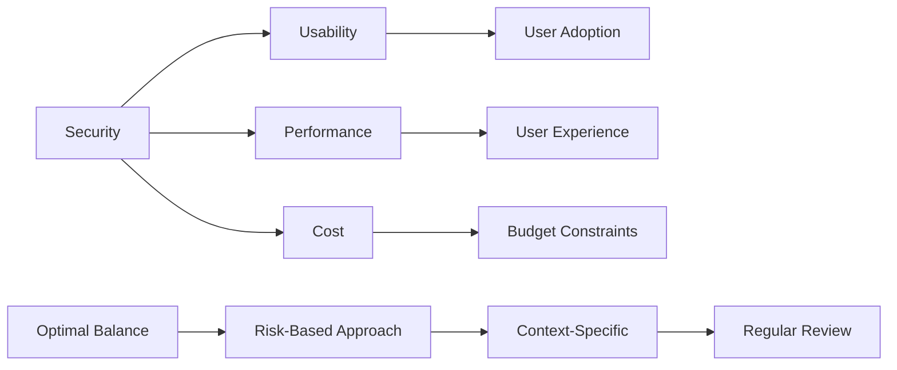

**Security in Strategy Documents:**
- Security requirements and constraints
- Threat modeling
- Security architecture decisions
- Compliance requirements
- Incident response planning

**Security Validation Criteria:**
- Security review completed
- Penetration testing passed
- Compliance requirements met
- Security metrics defined
- Incident response plan in place

---

## Summary & Key Takeaways

### Core Concepts Mastered

1. **Technical Strategy:** A plan to achieve technical goals that support business objectives, including problem definition, approach, trade-offs, and success metrics.

2. **Systems Thinking:** Holistic approach focusing on interrelationships, feedback loops, and leverage points rather than isolated components.

3. **Problem-First Approach:** Always start with understanding and quantifying the business problem before designing solutions.

4. **Socio-Technical Systems:** Technical solutions exist within social contexts; both must be considered for success.

5. **Trade-off Clarity:** Make explicit what you're choosing, rejecting, and deferring, with clear rationale.

### Action Items for This Week

**Immediate (This Week):**
- [ ] Identify a business problem worth solving
- [ ] Write a one-page problem statement
- [ ] Quantify the problem's impact
- [ ] Validate with at least 2 stakeholders

**Short-term (Next 2 Weeks):**
- [ ] Generate 3 solution options
- [ ] Create trade-off analysis
- [ ] Define success metrics
- [ ] Document "how we'll know we're wrong"

**Long-term (Next Month):**
- [ ] Complete strategy document
- [ ] Get stakeholder approval
- [ ] Create implementation plan
- [ ] Set up metrics tracking

### Key Insights

> 💡 **Start with the problem, not the solution.** Understanding the "why" ensures you're solving the right thing.

> 💡 **Systems thinking reveals leverage points.** Small changes in the right places can have big impacts.

> 💡 **Make trade-offs explicit.** Documenting what you're choosing and rejecting prevents confusion and enables better decisions.

> 💡 **Define "how we'll know we're wrong."** This enables course correction and avoids sunk cost fallacy.

> 💡 **Strategy is iterative.** Review regularly, learn, and adapt. The best strategies evolve based on feedback.

---

## Further Reading & Resources

### Books
1. **"The Lean Startup"** by Eric Ries - Build-measure-learn loop
2. **"Inspired"** by Marty Cagan - Product management for tech
3. **"Thinking in Systems"** by Donella Meadows - Systems thinking fundamentals
4. **"The Phoenix Project"** by Gene Kim - DevOps and business value
5. **"Team Topologies"** by Matthew Skelton & Manuel Pais - Organizing for fast flow
6. **"Building Evolutionary Architectures"** by Neal Ford - Adaptive architecture
7. **"Software Architecture: The Hard Parts"** by Neal Ford - Modern architecture challenges

### Articles & Papers
1. [Conway's Law](https://en.wikipedia.org/wiki/Conway%27s_law) - Original concept
2. [The RICE Scoring Framework](https://www.intercom.com/blog/rice-simple-prioritization-for-product-managers/) - Intercom's prioritization method
3. [Jobs-to-be-Done](https://hbr.org/2016/09/know-your-customers-jobs-to-be-done) - HBR article on JTBD
4. [Architecture Decision Records](https://cognitect.com/blog/2011/11/15/documenting-architecture-decisions) - Original ADR concept
5. [The Strangler Fig Pattern](https://martinfowler.com/bliki/StranglerFigApplication.html) - Martin Fowler's explanation

### Videos & Talks
1. **Donella Meadows - "Leverage Points: Places to Intervene in a System"** - Systems thinking fundamentals
2. **Martin Fowler - "Architecture of Enterprise Applications"** - Software architecture patterns
3. **Marty Cagan - "Product Management vs. Project Management"** - Product thinking for engineers
4. **Simon Brown - "Software Architecture for Developers"** - Practical architecture
5. **Gene Kim - "The Unicorn Project"** - DevOps and technical strategy

### Tools & Frameworks
1. **RICE Calculator** - Spreadsheet or online tool for prioritization
2. **ADR Tools** - adr-tools, log4brains, Mermaid (for diagrams)
3. **Systems Mapping:** Miro, Mermaid, Kumu
4. **Strategy Documentation:** Notion, Confluence, Google Docs
5. **Metrics Tracking:** Datadog, Grafana, custom dashboards

### Templates
1. **Problem Statement Template** - Structured problem definition
2. **Strategy Document Template** - One-page strategy format
3. **Trade-off Matrix Template** - Decision documentation
4. **ADR Template** - Architecture decision records
5. **Success Metrics Template** - SMART goals framework

### Communities & Forums
1. **LeadDev** - Engineering leadership community
2. **InfoQ** - Technical strategy and architecture content
3. **/r/SoftwareArchitecture** - Reddit architecture community
4. **Architecture Guild** - Professional architecture community
5. **Product Management Slack** - PM and engineering collaboration

---

## 📝 Homework Assignment

**Draft a one-page (socio)technical strategy for a current problem in your organization. Name the tradeoff you are choosing and the option you are rejecting, and say what would tell you the strategy is wrong.**

**Guidelines:**
1. Choose a real problem you're facing
2. Follow the strategy document template
3. Include:
   - Problem statement (quantified)
   - Proposed solution
   - At least 2 explicit trade-offs
   - 3-5 success metrics
   - Validation criteria (how you'll know you're wrong)
4. Keep it to one page (be concise)
5. Prepare to share and discuss in cohort

**Deliverable:** One-page strategy document ready for presentation.

---

**🎯 Next Week:** Week 3 will dive into Technical Execution - how to execute a technical strategy through risk-driven development, delegation, and alignment mechanisms.

**💪 Remember:** A good strategy isn't about having all the answers - it's about asking the right questions, making clear trade-offs, and learning and adapting along the way.

---

*End of Week 2: Technical Strategy*