# Week 3: Technical Execution - Complete Tutorial

**📚 InfoQ Certified Engineering Leadership Program**  
**⏱️ Estimated Reading Time:** 45-60 minutes  
**🎯 Difficulty Level:** Intermediate  
**📅 Last Updated:** January 2026

---

## Table of Contents

1. [Introduction & Overview](#introduction--overview)
2. [Prerequisites](#prerequisites)
3. [Learning Objectives](#learning-objectives)
4. [Core Concepts](#core-concepts)
5. [Risk-Driven Development](#risk-driven-development)
6. [Delegation and Empowerment](#delegation-and-empowerment)
7. [Execution Frameworks](#execution-frameworks)
8. [Keeping Work Aligned with Strategy](#keeping-work-aligned-with-strategy)
9. [Real-World Examples & Case Studies](#real-world-examples--case-studies)
10. [Mermaid Diagrams](#mermaid-diagrams)
11. [Common Pitfalls & Anti-Patterns](#common-pitfalls--anti-patterns)
12. [Best Practices](#best-practices)
13. [Practice Exercises](#practice-exercises)
14. [Question Bank](#question-bank)
15. [Test Your Understanding](#test-your-understanding)
16. [Common Interview Questions](#common-interview-questions)
17. [Troubleshooting Guide](#troubleshooting-guide)
18. [Performance Considerations](#performance-considerations)
19. [Security Considerations](#security-considerations)
20. [Summary & Key Takeaways](#summary--key-takeaways)
21. [Further Reading & Resources](#further-reading--resources)

---

## Introduction & Overview

Ideas are free. Execution is everything. This week covers how to execute a technical strategy: **risk-driven development**, **delegation**, and the mechanisms that keep the work matched to the strategy. The material draws on planning methodologies and software engineering research.

> 💡 **Key Insight:** A brilliant strategy is worthless without effective execution. Execution is where most technical leaders struggle, and where great leaders distinguish themselves.

### Why Execution Matters More Than Strategy

**The Strategy-Execution Gap:**
- **85%** of strategic initiatives fail to deliver expected value (Harvard Business Review)
- **60-90%** of strategic plans are not successfully implemented
- The gap between strategy and execution is where value is created or destroyed

**Execution is Hard Because:**
- It requires making thousands of small decisions correctly
- It demands coordination across teams and dependencies
- It involves managing uncertainty and risk
- It requires balancing speed with quality
- It tests leadership and communication skills

### What This Week Covers

1. **Risk-Driven Development:** Prioritizing work based on risk, not just features
2. **Delegation:** Empowering teams while maintaining accountability
3. **Execution Frameworks:** Proven methodologies for getting things done
4. **Strategy Alignment:** Mechanisms to ensure work matches strategic intent
5. **Decision-Making:** When to decide, when to defer, and how to decide

---

## Prerequisites

Before starting this week's material, you should have:

- ✅ Completion of Week 1: Organizational Foundations
- ✅ Completion of Week 2: Technical Strategy
- ✅ Understanding of technical strategy development
- ✅ Experience leading technical projects
- ✅ Basic knowledge of agile methodologies
- ✅ Understanding of risk management concepts
- ✅ Experience with project planning

**Recommended Background:**
- Experience with Scrum, Kanban, or similar frameworks
- Understanding of software development lifecycle
- Exposure to project management tools
- Experience with cross-team coordination

---

## Learning Objectives

By the end of this week, you will be able to:

1. **Apply** risk-driven development to prioritize work effectively
2. **Identify** and mitigate risks early in the development process
3. **Delegate** work effectively while maintaining accountability
4. **Choose** appropriate execution frameworks for different contexts
5. **Implement** mechanisms to keep work aligned with strategy
6. **Make** decisions at the right time and level
7. **Balance** speed, quality, and risk in execution
8. **Measure** execution effectiveness and adjust course

---

## Core Concepts

### 1. Execution vs. Strategy

**Strategy (The Plan):**
- What we're trying to achieve
- Why it matters
- High-level approach
- Success criteria

**Execution (The Reality):**
- How we actually do the work
- Day-to-day decisions
- Adapting to reality
- Delivering value

**The Gap:**
```
Strategy: "Improve system performance by 10x"
Execution: 
  - Which components to optimize first?
  - How to measure improvement?
  - What to do when optimization breaks something?
  - How to coordinate across teams?
  - When to stop optimizing?
```

### 2. Risk-Driven Development

**Core Principle:** Work should be ordered by risk, not just by business value or feature priority.

**Why Risk-First?**
- **Early learning:** Address biggest unknowns first
- **Reduced uncertainty:** De-risk the project progressively
- **Better estimates:** As risks are resolved, estimates become more accurate
- **Faster failure:** Learn what doesn't work cheaply and early
- **Informed decisions:** Make decisions based on reduced uncertainty

**Types of Risk:**
1. **Technical Risk:** Can we build it? Do we understand the technology?
2. **Business Risk:** Will customers want it? Is the market there?
3. **Resource Risk:** Do we have the people, time, and money?
4. **Schedule Risk:** Can we deliver on time?
5. **Operational Risk:** Can we support it in production?

### 3. The Last Responsible Moment

**Concept:** Delay decisions until the last responsible moment to maximize information and maintain flexibility.

**Benefits:**
- More information available
- Reduced commitment to specific solutions
- Greater flexibility
- Better decision quality

**Risks:**
- Analysis paralysis
- Missed opportunities
- Coordination challenges

**Application:**
- Don't decide database technology until you understand data access patterns
- Don't choose cloud provider until you understand compliance requirements
- Don't commit to architecture until you understand scale needs

### 4. Delegation vs. Abdication

**Effective Delegation:**
- Clear outcomes and boundaries
- Authority to make decisions
- Support and resources
- Accountability for results
- Regular check-ins

**Abdication:**
- Unclear expectations
- No authority or support
- Abandonment
- No accountability
- Surprise reviews

**The Delegation Spectrum:**
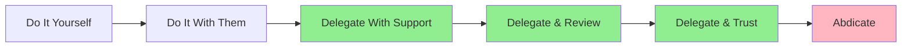

### 5. Strategy-Execution Alignment

**The Alignment Challenge:**
- Strategy is set at the top
- Execution happens at the team level
- Information flows slowly
- Context gets lost
- Priorities shift

**Alignment Mechanisms:**
1. **OKRs (Objectives and Key Results):** Connect team work to strategic goals
2. **Roadmaps:** Visualize how work ladders up to strategy
3. **Metrics:** Measure progress toward strategic outcomes
4. **Regular Reviews:** Check alignment and adjust
5. **Communication:** Ensure understanding at all levels

---

## Risk-Driven Development

### The Risk-Driven Development Process

#### Phase 1: Risk Identification

**Activities:**
1. Brainstorm potential risks
2. Categorize risks (technical, business, resource, schedule, operational)
3. Assess probability and impact
4. Prioritize risks

**Risk Identification Techniques:**
- **Pre-mortem:** Imagine the project failed - what went wrong?
- **Assumption mapping:** What are we assuming? Which are risky?
- **Dependency analysis:** What could block us?
- **Expert consultation:** Ask experienced people what could go wrong
- **Historical analysis:** What went wrong on similar projects?

#### Phase 2: Risk Assessment

**Risk Assessment Matrix:**
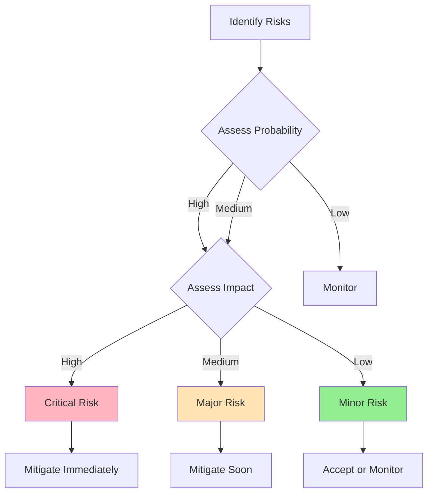

**Risk Scoring:**
```
Risk Score = Probability × Impact

Probability: 1-5 (1=rare, 5=almost certain)
Impact: 1-5 (1=minimal, 5=catastrophic)

Risk Score 15-25: Critical - Address immediately
Risk Score 8-14: Major - Address soon
Risk Score 1-7: Minor - Monitor or accept
```

#### Phase 3: Risk Mitigation Planning

**Mitigation Strategies:**

1. **Avoid:** Change approach to eliminate risk
   - Example: Use proven technology instead of experimental

2. **Transfer:** Shift risk to someone else
   - Example: Buy insurance, outsource, use managed service

3. **Mitigate:** Reduce probability or impact
   - Example: Add validation, build prototypes, add redundancy

4. **Accept:** Acknowledge and monitor
   - Example: Low-impact risks, cost of mitigation > cost of failure

**Risk Mitigation Plan Template:**
```markdown
## Risk: [Risk Description]

**Category:** [Technical/Business/Resource/Schedule/Operational]

**Probability:** [1-5]
**Impact:** [1-5]
**Risk Score:** [Probability × Impact]

**Mitigation Strategy:** [Avoid/Transfer/Mitigate/Accept]

**Actions:**
1. [Specific action 1]
2. [Specific action 2]
3. [Specific action 3]

**Owner:** [Name]
**Timeline:** [When will this be completed]
**Success Criteria:** [How we know risk is mitigated]

**Contingency Plan:** [What we'll do if risk materializes]
```

#### Phase 4: Risk-Driven Execution

**Principle:** Address highest risks first, before investing in lower-risk work.

**Example: Building a New Feature**

**Traditional Approach (Feature-First):**
1. Build UI
2. Build backend API
3. Integrate
4. Test
5. Deploy
6. Discover performance issues (high risk, late in process)

**Risk-Driven Approach:**
1. **Week 1:** Spike to validate performance (highest risk)
   - Can the database handle the query load?
   - What's the actual latency?
   - Do we need caching?
   
2. **Week 2:** Build proof-of-concept (medium risk)
   - Can we integrate with the payment system?
   - What are the edge cases?
   
3. **Week 3-4:** Build core functionality (lower risk now)
   - Build UI
   - Build backend
   - Integrate
   
4. **Week 5:** Test and deploy (residual risk)

**Benefits:**
- Learn about biggest risks first
- Can pivot cheaply if risks are too high
- Estimates become more accurate as risks are resolved
- Fail fast on unworkable approaches

### Risk-Driven Development Patterns

#### Pattern 1: Spike Solutions

**Purpose:** Reduce technical risk through time-boxed exploration

**When to Use:**
- Unproven technology
- Unclear feasibility
- Complex integration
- Performance unknowns

**Spike Guidelines:**
- Time-boxed (1-3 days typically)
- Focused on learning, not production code
- Disposable or throwaway
- Document findings
- Decide: adopt, adapt, or abandon

**Example:**
```
Spike: Evaluate GraphQL for our API
Duration: 2 days
Questions:
  - Can we handle our query complexity?
  - What's the performance overhead?
  - How hard is it to migrate from REST?
  - What's the learning curve for the team?

Outcome: 
  - Performance is acceptable (<50ms overhead)
  - Migration is complex (3 months estimated)
  - Team can learn in 2 weeks
  - Decision: Adopt for new services, migrate incrementally
```

#### Pattern 2: Walking Skeleton

**Purpose:** Build minimal end-to-end implementation to validate architecture and integration risks

**When to Use:**
- New system or major refactoring
- Multiple integration points
- Unclear architecture
- High technical risk

**Walking Skeleton Components:**
- Minimal implementation of each layer
- End-to-end data flow
- Basic deployment pipeline
- Health checks and monitoring
- One simple user journey

**Example:**
```
Walking Skeleton for E-commerce Platform:
- Frontend: Simple product page
- Backend: Single API endpoint
- Database: One table with sample data
- Deployment: Deploy to staging
- Monitoring: Basic health check
- User Journey: View product → Add to cart → Checkout

Purpose: Validate:
  - Can frontend and backend communicate?
  - Does deployment pipeline work?
  - Can we monitor the system?
  - What's the actual latency?
```

#### Pattern 3: Risk Burndown Chart

**Purpose:** Track risk reduction over time

**Format:**
```
Week 1: Total Risk Score = 45
  - Mitigated: Performance risk (score 15)
  - Remaining: 30

Week 2: Total Risk Score = 30
  - Mitigated: Integration risk (score 10)
  - Remaining: 20

Week 3: Total Risk Score = 20
  - Mitigated: Data migration risk (score 10)
  - Remaining: 10

Week 4: Total Risk Score = 10
  - Mitigated: Operational risk (score 10)
  - Remaining: 0
```

**Visualization:**
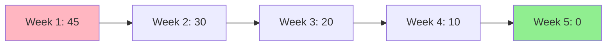

---

## Delegation and Empowerment

### The Delegation Framework

#### Understanding Delegation Levels

**Level 1: "Do It With Me"**
- You do the work, they observe
- Learning mode
- High direction, low autonomy

**Level 2: "Do It With Them"**
- You work alongside them
- Coaching mode
- Medium direction, medium autonomy

**Level 3: "Delegate With Support"**
- They do the work, you're available for questions
- Support mode
- Low direction, high autonomy

**Level 4: "Delegate & Review"**
- They do the work, you review output
- Review mode
- Minimal direction, full autonomy

**Level 5: "Delegate & Trust"**
- They own it completely
- Trust mode
- No direction, complete autonomy

**Choosing the Right Level:**
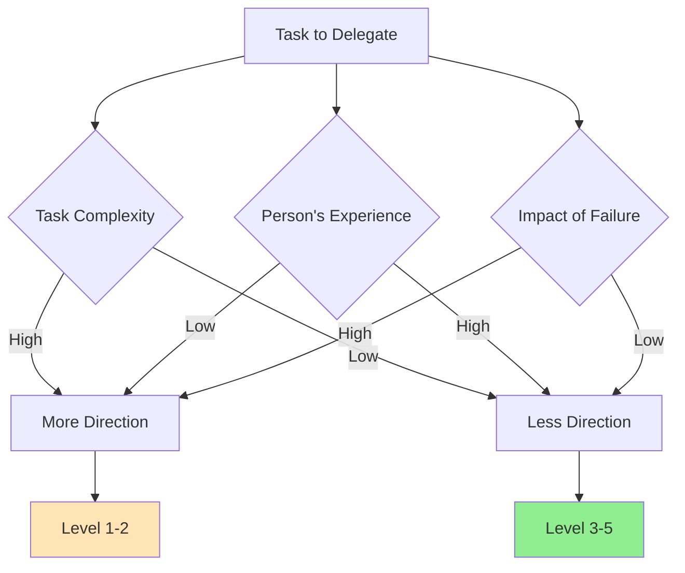

### Effective Delegation Process

#### Step 1: Define the Outcome

**Clear Outcome Statement:**
```
"Deliver a redesigned user dashboard that:
- Loads in under 2 seconds (currently 5 seconds)
- Shows the 5 most important metrics for users
- Works on mobile devices
- Is accessible (WCAG 2.1 AA compliant)
- Is delivered in 4 weeks"

NOT: "Improve the dashboard"
```

**Components:**
- **What:** Specific deliverable
- **Why:** Context and importance
- **When:** Timeline and milestones
- **How:** Constraints and boundaries
- **Success criteria:** How we'll know it's done

#### Step 2: Define Authority and Boundaries

**Authority Levels:**
1. **Full authority:** They decide how to achieve the outcome
2. **Consultative authority:** They recommend, you approve
3. **Limited authority:** They can decide within constraints
4. **Informational authority:** They research and recommend

**Boundaries:**
- Budget limits
- Technical constraints
- Timeline constraints
- Quality standards
- Approval requirements

**Example:**
```
You have full authority to:
- Choose the frontend framework
- Design the component architecture
- Determine implementation order
- Make technical trade-offs

You must consult me on:
- Changes to timeline > 1 week
- Budget > $5,000
- Changes to API contracts

You cannot:
- Change authentication mechanism
- Modify payment processing
```

#### Step 3: Provide Resources and Support

**Resources:**
- Time and budget
- Tools and infrastructure
- Access to stakeholders
- Training if needed
- Documentation

**Support:**
- Regular check-ins (frequency depends on experience)
- Available for questions
- Help remove blockers
- Provide feedback
- Celebrate progress

#### Step 4: Establish Checkpoints

**Checkpoint Types:**

1. **Progress Check-ins:**
   - Frequency: Weekly for new delegations, bi-weekly for experienced
   - Purpose: Status update, identify blockers
   - Format: 15-30 minute sync

2. **Milestone Reviews:**
   - Frequency: At key deliverables
   - Purpose: Review quality, provide feedback
   - Format: 1-hour review meeting

3. **Final Review:**
   - Frequency: At completion
   - Purpose: Validate outcome, provide feedback
   - Format: Demo and discussion

**Checkpoint Guidelines:**
- Don't micromanage - focus on outcomes, not activities
- Ask questions, don't give answers
- Provide constructive feedback
- Adjust level of support based on progress

#### Step 5: Accountability and Follow-Through

**Accountability Mechanisms:**
1. **Clear expectations:** Everyone knows what success looks like
2. **Regular updates:** Progress is visible
3. **Consequences:** Both positive and negative
4. **Support:** Help when needed, but hold accountable
5. **Learning:** Review and improve

**The Accountability Balance:**
```
Too Little Accountability:
- Work doesn't get done
- Quality suffers
- Team doesn't grow
- Trust erodes

Too Much Accountability:
- Micromanagement
- Fear of failure
- No innovation
- Burnout

Just Right:
- Clear expectations
- Support when needed
- Consequences for outcomes
- Learning from results
```

### Delegation Anti-Patterns

#### Anti-Pattern 1: Reverse Delegation

**Problem:** Team member brings you a problem, you solve it for them.

**Symptoms:**
- "What should I do about X?"
- You end up doing their work
- They don't grow
- You're overwhelmed

**Solution:**
- Ask: "What do you think we should do?"
- Ask: "What are the options?"
- Guide them to solution, don't give it
- Let them make the decision

#### Anti-Pattern 2: Delegation by Abdication

**Problem:** Dumping work without support or context.

**Symptoms:**
- "Here's this project, good luck"
- No context or background
- No resources or authority
- Surprise when it fails

**Solution:**
- Provide full context
- Give necessary authority
- Make time for questions
- Check in regularly
- Be available for support

#### Anti-Pattern 3: Over-Delegation

**Problem:** Delegating too much too fast.

**Symptoms:**
- Team members overwhelmed
- Quality drops
- Missed deadlines
- Stress and burnout

**Solution:**
- Start with smaller tasks
- Increase responsibility gradually
- Match task to skill level
- Provide adequate support
- Build confidence

#### Anti-Pattern 4: Under-Delegation

**Problem:** Not delegating enough, doing everything yourself.

**Symptoms:**
- You're overwhelmed
- Team is underutilized
- Bottleneck on you
- Team doesn't grow
- You can't focus on strategic work

**Solution:**
- Identify delegable tasks
- Match tasks to team capabilities
- Start with low-risk tasks
- Build trust gradually
- Focus on high-impact work

---

## Execution Frameworks

### Framework 1: Agile Execution

#### Scrum

**Core Components:**
- **Sprints:** 1-4 week timeboxes
- **Ceremonies:** Planning, daily standup, review, retrospective
- **Artifacts:** Product backlog, sprint backlog, increment
- **Roles:** Product Owner, Scrum Master, Development Team

**When to Use:**
- Complex problems requiring iterative development
- Need for regular feedback
- Cross-functional teams
- Evolving requirements

**Benefits:**
- Regular delivery of value
- Continuous feedback and adaptation
- Clear roles and responsibilities
- Focus on working software

**Challenges:**
- Requires discipline
- Can become bureaucratic
- Needs buy-in from team
- Timeboxing can be artificial

#### Kanban

**Core Components:**
- **Visual board:** See all work
- **WIP limits:** Limit work in progress
- **Continuous flow:** No timeboxes
- **Metrics:** Lead time, cycle time, throughput

**When to Use:**
- Maintenance and support work
- Variable priority work
- Need for flexibility
- Operational teams

**Benefits:**
- Flexibility to reprioritize
- Focus on flow efficiency
- Visual management
- Continuous delivery

**Challenges:**
- Less structure than Scrum
- Requires discipline on WIP limits
- Harder to predict timelines
- Needs mature teams

### Framework 2: Lean Execution

**Core Principles:**
1. **Eliminate waste:** Remove non-value-added work
2. **Amplify learning:** Fast feedback loops
3. **Decide as late as possible:** Keep options open
4. **Deliver as fast as possible:** Reduce cycle time
5. **Empower the team:** Trust and enable
6. **Build integrity in:** Quality built-in, not inspected
7. **See the whole:** Optimize system, not local

**Lean Tools:**
- **Value Stream Mapping:** Identify waste
- **Kanban:** Visualize and limit WIP
- **Continuous Integration:** Fast feedback
- **Test-Driven Development:** Build quality in
- **Pair Programming:** Knowledge sharing

### Framework 3: OKRs (Objectives and Key Results)

**Purpose:** Align team work with strategic goals

**Structure:**
- **Objective:** Qualitative, inspirational goal
- **Key Results:** 3-5 measurable outcomes

**Example:**
```
Objective: Become the most reliable service in the company

Key Results:
1. Achieve 99.99% uptime (from 99.5%)
2. Reduce mean time to recovery (MTTR) from 1 hour to 10 minutes
3. Reduce customer-reported incidents by 80%
4. Achieve 95% test coverage (from 70%)
```

**OKR Best Practices:**
- Set quarterly
- Ambitious but achievable (70% success is good)
- Top-down and bottom-up
- Transparent across organization
- Regular check-ins (weekly or bi-weekly)
- Separate from performance reviews

### Framework 4: DORA Metrics

**Purpose:** Measure software delivery performance

**Four Key Metrics:**
1. **Deployment Frequency:** How often do you deploy?
2. **Lead Time for Changes:** How long from commit to production?
3. **Change Failure Rate:** What percentage of deployments cause failures?
4 **Time to Restore Service:** How long to recover from failure?

**Performance Levels:**
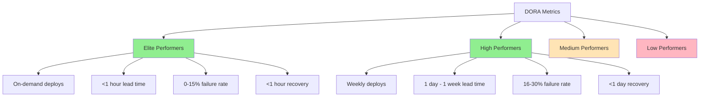

**Using DORA Metrics:**
- Baseline your current performance
- Set improvement goals
- Track progress over time
- Identify bottlenecks
- Celebrate improvements

---

## Keeping Work Aligned with Strategy

### Alignment Mechanisms

#### 1. Strategy Deployment (Hoshin Kanri)

**Purpose:** Ensure everyone's work ladders up to strategic goals

**Process:**
```
Company Vision
    ↓
Strategic Objectives (3-5 year)
    ↓
Annual Objectives
    ↓
Department/Team OKRs
    ↓
Individual Goals
    ↓
Daily Work
```

**Hoshin Kanri Principles:**
- Top-down and bottom-up planning
- Catchball: Dialogue to align goals
- Focus on vital few objectives
- Regular reviews and adjustments

#### 2. Roadmaps

**Types of Roadmaps:**

**Now-Next-Later Roadmap:**
```
NOW (This quarter):
- Automated deployments
- Performance optimization

NEXT (Next quarter):
- Mobile app
- Advanced analytics

LATER (6+ months):
- AI-powered recommendations
- International expansion
```

**Theme-Based Roadmap:**
```
Q1 Theme: Reliability
- Reduce incidents by 50%
- Improve monitoring
- Implement chaos engineering

Q2 Theme: Velocity
- Reduce deployment time by 75%
- Automate testing
- Improve CI/CD
```

**Outcome-Based Roadmap:**
```
Q1: Improve Developer Experience
Outcomes:
- Developers ship code 2x faster
- Deployment confidence increases
- Onboarding time decreases from 2 weeks to 3 days
```

#### 3. Intrinsic and Extrinsic Motivators

**Intrinsic (Internal):**
- Autonomy
- Mastery
- Purpose
- Growth
- Impact

**Extrinsic (External):**
- Compensation
- Promotions
- Recognition
- Bonuses
- Titles

**Applying to Execution:**
- Connect daily work to purpose (intrinsic)
- Provide autonomy in how work is done (intrinsic)
- Enable mastery through learning (intrinsic)
- Recognize achievements (extrinsic)
- Fair compensation (extrinsic)

**The Motivation Equation:**
```
Motivation = (Autonomy + Mastery + Purpose) × 
             (Clear Goals + Feedback + Support)
```

#### 4. The Last Responsible Moment (LRM)

**Concept:** Delay decisions until the last responsible moment to maximize information.

**When to Decide Early:**
- Irreversible decisions
- Long lead times
- High cost of change
- Strategic differentiators

**When to Delay:**
- Reversible decisions
- Uncertain requirements
- Multiple valid options
- Low cost of change

**Example:**
```
Early Decisions:
- Cloud provider (6-month migration, hard to change)
- Core technology stack (hard to change later)
- Team structure (affects hiring and culture)

Delayed Decisions:
- Database schema (can evolve)
- UI framework (can change with effort)
- Specific libraries (easy to swap)
- Feature prioritization (can change based on learning)
```

### Execution Monitoring and Adjustment

#### The PDCA Cycle (Plan-Do-Check-Act)

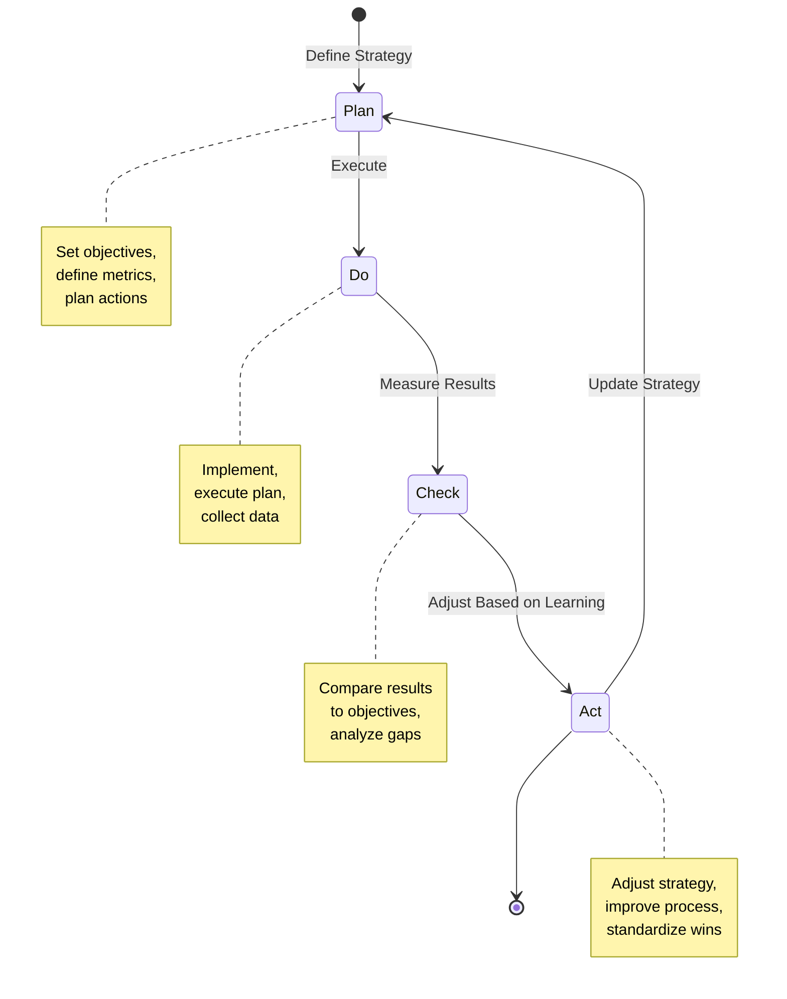

**Application:**
- **Plan:** Define sprint goals and success metrics
- **Do:** Execute sprint, build features
- **Check:** Review metrics, demo working software
- **Act:** Adjust approach for next sprint

#### The Build-Measure-Learn Loop

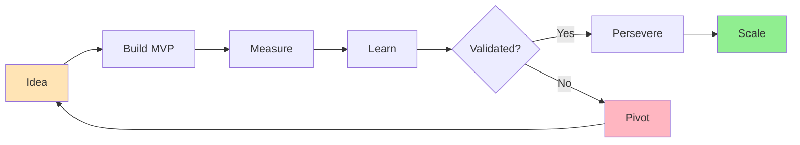

**Application:**
- Start with hypothesis
- Build minimum viable product
- Measure actual results
- Learn from data
- Decide: persevere or pivot

---

## Real-World Examples & Case Studies

### Case Study 1: Amazon's Two-Pizza Teams and Autonomous Execution

**Context:** Amazon needed to scale engineering while maintaining speed.

**Strategy:**
- Small, autonomous teams (two-pizza teams)
- Each team owns a service end-to-end
- Teams decide how to achieve goals
- Clear metrics and accountability

**Execution Model:**
- Teams set their own quarterly goals (OKRs)
- Teams decide how to achieve goals
- Teams own their architecture and technology choices
- Regular reviews of metrics and progress
- Support from platform teams

**Results:**
- Fast innovation (teams can move quickly)
- High ownership and accountability
- Continuous deployment
- Low coordination overhead

**Key Insight:** Clear strategy + autonomous execution = speed and innovation

### Case Study 2: Google's 20% Time and Innovation

**Context:** Google wanted to foster innovation while executing core business.

**Strategy:**
- 80% time on core job
- 20% time on innovative projects
- Bottom-up innovation
- Support for promising ideas

**Execution:**
- Engineers propose projects
- Small teams form organically
- Prototype and validate
- Scale successful projects
- Integrate into core business

**Results:**
- Gmail, Google News, Google Maps emerged from 20% time
- High employee satisfaction
- Culture of innovation
- Some waste (projects that don't succeed)

**Key Insight:** Balance execution with exploration. Not all execution is about efficiency.

### Case Study 3: Netflix's Freedom and Responsibility

**Context:** Netflix wanted high performance with minimal process.

**Strategy:**
- Hire senior, experienced engineers
- Give them freedom to execute
- High performance expectations
- Minimal process and approval

**Execution Model:**
- Teams set their own goals
- Teams decide how to achieve goals
- Minimal meetings and reporting
- Context, not control
- High performance culture

**Results:**
- Fast decision-making
- High innovation
- Strong ownership
- Top talent attraction

**Key Insight:** Freedom requires responsibility. Hire well, set clear context, trust your team.

### Case Study 4: Spotify's Squad Model and Alignment

**Context:** Spotify needed alignment across autonomous squads.

**Strategy:**
- Autonomous squads
- Alignment through chapters and guilds
- Shared mission and vision
- Regular coordination

**Execution:**
- Squads have clear missions
- Chapters align practices within function
- Guilds share knowledge across squads
- Quarterly planning and reviews
- Regular all-hands and showcases

**Results:**
- High autonomy with alignment
- Knowledge sharing
- Consistent practices
- Fast innovation

**Key Insight:** Autonomy requires alignment mechanisms. Structure enables freedom.

---

## Mermaid Diagrams

### Diagram 1: Risk-Driven Development Process

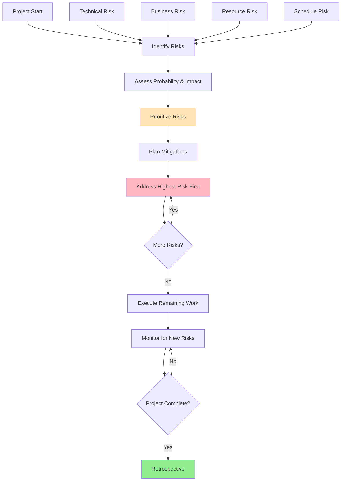

### Diagram 2: Delegation Spectrum

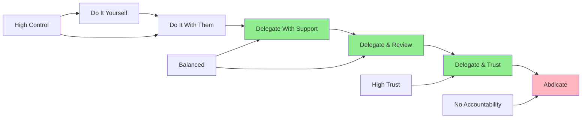

### Diagram 3: Strategy-Execution Alignment

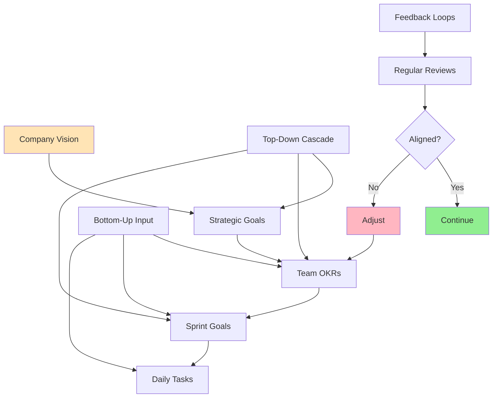

### Diagram 4: PDCA Cycle

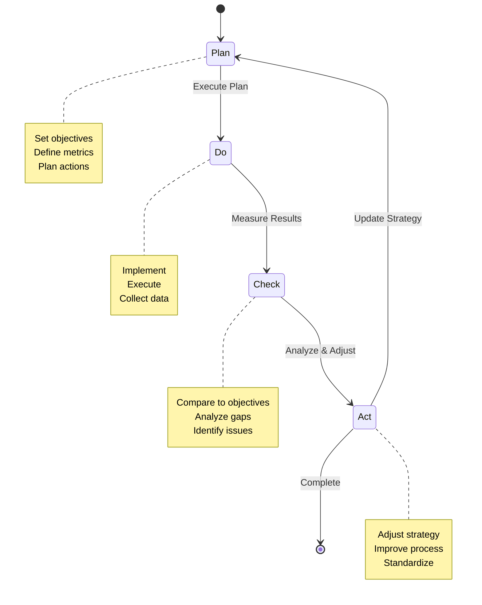

### Diagram 5: Build-Measure-Learn Loop

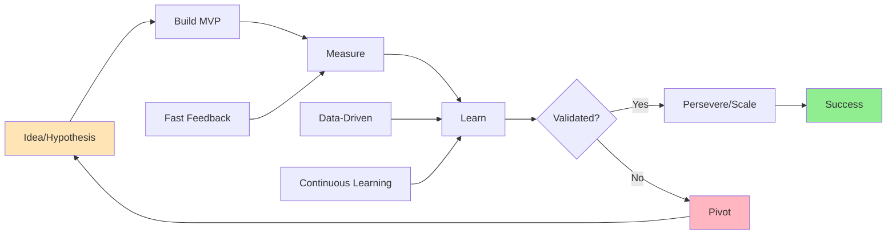

---

## Common Pitfalls & Anti-Patterns

### Anti-Pattern 1: Feature-Driven Development

**Problem:** Prioritizing features by business value without considering risk.

**Symptoms:**
- Build everything, discover critical issues late
- High rework and surprises
- Missed deadlines
- Technical debt accumulation

**Root Cause:**
- Only considering business value
- Ignoring technical risk
- No risk assessment process

**Solution:**
- Assess risk alongside value
- Address high-risk items first
- Use risk burndown chart
- Spike to reduce uncertainty

### Anti-Pattern 2: Analysis Paralysis

**Problem:** Over-analyzing without executing.

**Symptoms:**
- Endless planning
- No working software
- Missed opportunities
- Team frustration

**Root Cause:**
- Fear of making wrong decisions
- Perfectionism
- Lack of "good enough" criteria

**Solution:**
- Time-box analysis
- Use last responsible moment
- Make reversible decisions quickly
- Learn by doing

### Anti-Pattern 3: Micromanagement

**Problem:** Controlling every detail of delegated work.

**Symptoms:**
- Team members can't make decisions
- You're overwhelmed with details
- Slow progress
- Low team morale

**Root Cause:**
- Lack of trust
- Fear of failure
- Perfectionism
- Haven't delegated effectively

**Solution:**
- Define outcomes, not activities
- Give authority with accountability
- Regular check-ins, not constant oversight
- Accept "good enough" solutions
- Learn to let go

### Anti-Pattern 4: Firefighting

**Problem:** Constantly reacting to emergencies instead of executing strategy.

**Symptoms:**
- No time for planned work
- Constant context switching
- Burnout
- Strategic work never happens

**Root Cause:**
- No time for important work
- Reactive culture
- Lack of prioritization
- No capacity planning

**Solution:**
- Protect time for strategic work (20% rule)
- Improve operational stability
- Delegate operational work
- Say no to non-strategic work
- Build in buffer time

### Anti-Pattern 5: Strategy-Execution Gap

**Problem:** Work doesn't align with strategy.

**Symptoms:**
- Teams working on low-priority items
- Strategic initiatives stall
- Resources misallocated
- Confusion about priorities

**Root Cause:**
- Strategy not communicated
- No alignment mechanisms
- Strategy too vague
- No regular reviews

**Solution:**
- Communicate strategy clearly and repeatedly
- Use OKRs to align teams
- Regular strategy reviews
- Make strategy visible
- Connect daily work to strategy

### Anti-Pattern 6: Big Bang Delivery

**Problem:** Trying to deliver everything at once.

**Symptoms:**
- Long timelines with no intermediate value
- High risk of failure
- Team burnout
- Business doesn't see value until too late

**Root Cause:**
- Desire for perfect solution
- Impatience
- Lack of phased approach

**Solution:**
- Break into phases with clear value
- Deliver incrementally
- Get feedback early
- Celebrate small wins
- Adjust based on learning

---

## Best Practices

### 1. Prioritize by Risk, Not Just Value

**Framework:**
```
Priority = f(Business Value, Risk, Cost of Delay)

High Value + High Risk = Do First (de-risk)
High Value + Low Risk = Do Soon
Low Value + High Risk = Avoid or Defer
Low Value + Low Risk = Do If Time Permits
```

**Example:**
```
Feature A: High value, high technical risk
→ Spike first to de-risk, then build

Feature B: High value, low risk
→ Build now

Feature C: Low value, high risk
→ Defer or reject

Feature D: Low value, low risk
→ Do if time permits
```

### 2. Delegate Outcomes, Not Activities

**Good Delegation:**
```
"Deliver a dashboard that loads in under 2 seconds 
and shows the 5 most important metrics. You decide 
the technology, design, and implementation approach."
```

**Bad Delegation:**
```
"Build a dashboard using React and D3. Use the 
existing API. Deploy by Friday."
```

**Why It Matters:**
- Empowers team members
- Leverages their expertise
- Builds ownership
- Enables better solutions

### 3. Use Time-Boxing to Force Decisions

**Technique:** Set hard time limits for exploration and decision-making.

**Example:**
```
Spike: Evaluate database options
Timebox: 2 days
Decision: By end of day Friday

This forces:
- Focus on key criteria
- Timely decision
- No endless research
- Learning by doing
```

### 4. Implement Regular Review Cadences

**Review Types and Frequencies:**

| Review Type | Frequency | Purpose | Participants |
|-------------|-----------|---------|--------------|
| Daily Standup | Daily | Sync, identify blockers | Team |
| Sprint Review | Bi-weekly | Demo, get feedback | Team + Stakeholders |
| Retrospective | Bi-weekly | Improve process | Team |
| Strategy Review | Monthly | Check alignment | Leadership |
| Quarterly Planning | Quarterly | Set goals | Organization |

**Review Questions:**
- Are we on track to meet our goals?
- Are we solving the right problem?
- What are we learning?
- What should we adjust?
- What help do we need?

### 5. Make Work Visible

**Visual Management:**
- Kanban boards
- Sprint boards
- Roadmaps
- Dashboards
- Metrics displays

**Benefits:**
- Everyone sees priorities
- Progress is transparent
- Bottlenecks are visible
- Accountability is clear
- Alignment is maintained

### 6. Build in Feedback Loops

**Feedback Loop Types:**

1. **Code Review:** Hours
2. **CI/CD:** Minutes
3. **Testing:** Hours to days
4. **Sprint Demo:** 2 weeks
5. **User Feedback:** Weeks to months
6. **Business Metrics:** Months

**Principle:** Faster feedback = faster learning = better outcomes

**Example:**
```
Slow Feedback:
- Build for 6 months
- Release to users
- Wait for feedback
- Fix issues

Fast Feedback:
- Build MVP in 2 weeks
- Release to beta users
- Get feedback in days
- Iterate quickly
```

### 7. Embrace the Last Responsible Moment

**Guidelines:**
- Delay irreversible decisions
- Gather more information before deciding
- Keep options open
- Make reversible decisions quickly

**Example:**
```
Early Decisions (High Cost to Change):
- Cloud provider
- Core architecture
- Team structure

Delayed Decisions (Low Cost to Change):
- UI framework
- Libraries
- Specific features
```

### 8. Measure What Matters

**Key Metrics to Track:**

**Execution Metrics:**
- Velocity (story points per sprint)
- Cycle time (time from start to done)
- Lead time (time from request to delivery)
- Throughput (items completed per time period)

**Quality Metrics:**
- Defect rate
- Test coverage
- Change failure rate
- Mean time to recovery

**Business Metrics:**
- Feature adoption
- User satisfaction
- Business value delivered
- Time to market

**Balance:**
- Don't optimize for one metric at expense of others
- Use metrics to learn, not to punish
- Review metrics regularly
- Adjust metrics as needed

---

## Practice Exercises

### Exercise 1: Risk Assessment and Mitigation

**Objective:** Practice identifying and mitigating risks in a technical project.

**Instructions:**
1. Choose a recent or upcoming project.
2. Identify 5-10 potential risks across categories:
   - Technical
   - Business
   - Resource
   - Schedule
   - Operational
3. Assess each risk:
   - Probability (1-5)
   - Impact (1-5)
   - Risk score (probability × impact)
4. Prioritize risks by score
5. Create mitigation plans for top 3 risks
6. Create contingency plans for each

**Sample Solution:**

**Project:** Migrate from monolith to microservices

**Risk Assessment:**

| Risk | Category | Probability | Impact | Score | Priority |
|------|----------|-------------|--------|-------|----------|
| Team lacks microservices experience | Resource | 4 | 5 | 20 | Critical |
| Data consistency issues | Technical | 4 | 4 | 16 | Critical |
| Performance degradation | Technical | 3 | 5 | 15 | Critical |
| Migration takes longer than planned | Schedule | 4 | 3 | 12 | Major |
| Business disruption during migration | Business | 2 | 5 | 10 | Major |
| Increased operational complexity | Operational | 4 | 3 | 12 | Major |

**Mitigation Plans:**

**Risk 1: Team lacks microservices experience (Score: 20)**
- **Strategy:** Mitigate
- **Actions:**
  1. Hire 2 senior engineers with microservices experience (Month 1)
  2. Run 2-week training program (Month 1)
  3. Start with simple service to build confidence (Month 2)
  4. Pair junior engineers with seniors (Ongoing)
- **Owner:** Engineering Manager
- **Success Criteria:** Team passes microservices assessment
- **Contingency:** Engage external consultants if needed

**Risk 2: Data consistency issues (Score: 16)**
- **Strategy:** Mitigate
- **Actions:**
  1. Design event-driven architecture with eventual consistency (Week 1)
  2. Implement saga pattern for distributed transactions (Week 2)
  3. Add comprehensive monitoring for data consistency (Week 3)
  4. Run chaos tests to validate (Month 2)
- **Owner:** Tech Lead
- **Success Criteria:** Zero data inconsistencies in testing
- **Contingency:** Fall back to strong consistency for critical data

**Risk 3: Performance degradation (Score: 15)**
- **Strategy:** Mitigate
- **Actions:**
  1. Establish performance baseline (Week 1)
  2. Load test each service before deployment (Ongoing)
  3. Implement caching strategy (Week 2)
  4. Monitor performance in production (Ongoing)
- **Owner:** Performance Engineer
- **Success Criteria:** <10% performance degradation
- **Contingency:** Rollback to monolith if >20% degradation

### Exercise 2: Delegation Practice

**Objective:** Practice effective delegation using the delegation framework.

**Instructions:**
1. Choose a task you could delegate but haven't.
2. Apply the delegation framework:
   - Define clear outcome
   - Set authority and boundaries
   - Identify resources needed
   - Establish checkpoints
   - Define accountability
3. Have a conversation with the person you're delegating to.
4. Document the delegation.
5. Execute and adjust as needed.

**Sample Solution:**

**Task:** Redesign the user onboarding flow

**Delegation Document:**

**Outcome:**
"Deliver a redesigned user onboarding flow that:
- Reduces onboarding time from 10 minutes to 3 minutes
- Increases onboarding completion rate from 60% to 90%
- Maintains data quality (no increase in invalid data)
- Works on mobile and desktop
- Is delivered in 6 weeks"

**Authority:**
- Full authority to design the flow
- Can choose tools and technologies
- Can run user tests
- Must consult on changes to backend APIs
- Cannot change authentication mechanism

**Resources:**
- Access to user research data
- Budget for user testing ($2,000)
- Time: 6 weeks, full focus
- Support from UX designer (50% time)

**Checkpoints:**
- Week 1: Design review
- Week 3: Prototype demo
- Week 5: User test results review
- Week 6: Final delivery

**Accountability:**
- Weekly progress updates
- Demo at each checkpoint
- Final deliverable with metrics
- Post-launch review at 2 weeks

### Exercise 3: Risk-Driven Execution Plan

**Objective:** Create a risk-driven execution plan for a project.

**Instructions:**
1. Choose a project you're working on.
2. Identify the top 5 risks.
3. Create a risk-driven execution plan:
   - Week 1-2: Address highest risks (spikes, POCs)
   - Week 3-4: Address medium risks
   - Week 5+: Execute remaining work
4. Create a risk burndown chart
5. Define success criteria

**Sample Solution:**

**Project:** Implement real-time notifications

**Top 5 Risks:**
1. WebSocket scalability (Score: 20)
2. Browser compatibility (Score: 15)
3. Message delivery reliability (Score: 15)
4. Integration with existing systems (Score: 12)
5. Performance impact (Score: 10)

**Execution Plan:**

**Week 1-2: De-Risk WebSocket Scalability**
- Spike: Load test WebSocket with 10K concurrent connections
- Evaluate alternatives (Server-Sent Events, polling)
- Decide on approach
- Success: Can handle 10K connections with <100ms latency

**Week 2-3: De-Risk Browser Compatibility**
- Test on Chrome, Firefox, Safari, Edge
- Identify polyfills needed
- Test on mobile browsers
- Success: Works on 95% of target browsers

**Week 3-4: De-Risk Message Delivery**
- Build proof-of-concept for message queue
- Test delivery guarantees
- Handle offline scenarios
- Success: 99.9% message delivery

**Week 5-6: Integration**
- Integrate with existing systems
- Build core functionality
- Success: End-to-end working system

**Week 7-8: Polish and Deploy**
- Performance optimization
- Monitoring and alerting
- Documentation
- Deploy to production

**Risk Burndown:**
```
Week 1: Total Risk = 72
  - Mitigated: WebSocket scalability (20)
  - Remaining: 52

Week 2: Total Risk = 52
  - Mitigated: Browser compatibility (15)
  - Remaining: 37

Week 3: Total Risk = 37
  - Mitigated: Message delivery (15)
  - Remaining: 22

Week 4: Total Risk = 22
  - Mitigated: Integration (12)
  - Remaining: 10

Week 5: Total Risk = 10
  - Mitigated: Performance (10)
  - Remaining: 0
```

---

## Question Bank

### Multiple Choice Questions (1-30)

1. What is the core principle of risk-driven development?
   - A) Build features as fast as possible
   - B) Order work by risk, not just business value
   - C) Minimize costs
   - D) Maximize features
   - **Answer: B**

2. What is the "last responsible moment"?
   - A) The last day before deadline
   - B) The latest time to make a decision while maintaining flexibility
   - C) The earliest possible time to decide
   - D) The moment when work is due
   - **Answer: B**

3. Which is a type of risk in risk-driven development?
   - A) Technical risk
   - B) Business risk
   - C) Resource risk
   - D) All of the above
   - **Answer: D**

4. What is a spike solution?
   - A) A critical bug fix
   - B) A time-boxed exploration to reduce risk
   - C) A performance optimization
   - D) A production deployment
   - **Answer: B**

5. What is the purpose of a walking skeleton?
   - A) A minimal end-to-end implementation to validate architecture
   - B) A skeleton team structure
   - C) A basic UI mockup
   - D) A project timeline
   - **Answer: A**

6. Effective delegation means:
   - A) Doing the work yourself
   - B) Giving complete autonomy without support
   - C) Defining outcomes and providing support
   - D) Micromanaging every detail
   - **Answer: C**

7. What is reverse delegation?
   - A) Delegating to a more senior person
   - B) When the delegatee brings you a problem and you solve it
   - C) Delegating back to the original delegator
   - D) Delegating without authority
   - **Answer: B**

8. What is the delegation spectrum?
   - A) Different levels of delegation from doing it yourself to full trust
   - B) A range of tasks to delegate
   - C) Different people to delegate to
   - D) A timeline for delegation
   - **Answer: A**

9. What is a key characteristic of effective delegation?
   - A) Specify every detail
   - B) Define outcomes, not activities
   - C) Check progress every hour
   - D) Do the work yourself
   - **Answer: B**

10. What is the purpose of OKRs?
    - A) To track individual performance
    - B) To align team work with strategic goals
    - C) To replace performance reviews
    - D) To micromanage teams
    - **Answer: B**

11. What are DORA metrics?
    - A) Database optimization metrics
    - B) Four key software delivery performance metrics
    - C) Development operations metrics
    - D) Deployment automation metrics
    - **Answer: B**

12. Which is NOT one of the four DORA metrics?
    - A) Deployment frequency
    - B) Lead time for changes
    - C) Code coverage
    - D) Time to restore service
    - **Answer: C**

13. What is the PDCA cycle?
    - A) Plan-Do-Check-Act
    - B) Plan-Design-Code-Archive
    - C) Prepare-Develop-Compile-Analyze
    - D) Product-Design-Create-Assess
    - **Answer: A**

14. What is the Build-Measure-Learn loop?
    - A) A software development methodology
    - B) A lean startup cycle for validated learning
    - C) A project management framework
    - D) A testing approach
    - **Answer: B**

15. What is Hoshin Kanri?
    - A) A project management tool
    - B) A strategy deployment method ensuring alignment
    - C) A coding standard
    - D) A testing framework
    - **Answer: B**

16. What is a risk burndown chart?
    - A) A chart showing completed work
    - B) A chart tracking risk reduction over time
    - C) A chart showing budget spending
    - D) A chart tracking team velocity
    - **Answer: B**

17. What is the purpose of time-boxing?
    - A) To extend deadlines
    - B) To force decisions and prevent analysis paralysis
    - C) To reduce quality
    - D) To increase costs
    - **Answer: B**

18. Which is a characteristic of elite performers in DORA metrics?
    - A) Deploy once per month
    - B) On-demand deployments
    - C) Lead time of 1 month
    - D) Change failure rate of 50%
    - **Answer: B**

19. What is the 20% rule (as used by Google)?
    - A) Work 20 hours per week
    - B) Spend 20% time on innovative projects
    - C) Complete 20% of work before deadline
    - D) Allocate 20% budget to R&D
    - **Answer: B**

20. What is intrinsic motivation?
    - A) Motivation from external rewards
    - B) Motivation from internal satisfaction
    - C) Motivation from managers
    - D) Motivation from money
    - **Answer: B**

21. What is WIP limit in Kanban?
    - A) Work In Progress limit
    - B) Weekly improvement plan
    - C) Work integration protocol
    - D) Work item priority
    - **Answer: A**

22. What is the purpose of a retrospective?
    - A) To assign blame
    - B) To celebrate success only
    - C) To reflect and improve processes
    - D) To plan next sprint
    - **Answer: C**

23. What is a walking skeleton?
    - A) A minimal team structure
    - B) A minimal end-to-end implementation
    - C) A project timeline
    - D) A risk assessment
    - **Answer: B**

24. What does "amplify learning" mean in Lean?
    - A) Study more
    - B) Create fast feedback loops to learn quickly
    - C) Hire more people
    - D) Increase training budget
    - **Answer: B**

25. What is the purpose of a pre-mortem?
    - A) To celebrate success
    - B) To imagine failure and identify risks
    - C) To conduct a post-mortem early
    - D) To plan the project
    - **Answer: B**

26. What is the difference between delegation and abdication?
    - A) No difference
    - B) Delegation includes support and accountability, abdication does not
    - C) Delegation is for junior people, abdication for senior
    - D) Delegation is temporary, abdication is permanent
    - **Answer: B**

27. What is the purpose of regular strategy reviews?
    - A) To punish underperforming teams
    - B) To check alignment and adjust as needed
    - C) To micromanage execution
    - D) To assign blame
    - **Answer: B**

28. What is a key benefit of risk-driven development?
    - A) Faster execution
    - B) Early learning about biggest uncertainties
    - C) Lower costs
    - D) More features
    - **Answer: B**

29. What is the "cost of delay"?
    - A) The cost of the project
    - B) The economic impact of waiting to deliver
    - C) The cost of overtime
    - D) The cost of tools
    - **Answer: B**

30. What is the purpose of making work visible?
    - A) To micromanage
    - B) To enable transparency, alignment, and identify bottlenecks
    - C) To show off
    - D) To increase pressure
    - **Answer: B**

### True/False Questions (31-40)

31. Risk-driven development prioritizes work by risk, not just business value. (True)
32. The last responsible moment means deciding as early as possible. (False)
33. Delegation means giving complete autonomy without support. (False)
34. A spike is a time-boxed exploration to reduce risk. (True)
35. Big bang delivery is the safest approach. (False)
36. OKRs align team work with strategic goals. (True)
37. Micromanagement is an effective leadership style. (False)
38. DORA metrics measure software delivery performance. (True)
39. Analysis paralysis is better than making wrong decisions. (False)
40. Regular reviews help maintain strategy-execution alignment. (True)

### Fill-in-the-Blank Questions (41-50)

41. ________ development prioritizes work based on risk. (Risk-driven)
42. The ________ moment is the latest time to decide while maintaining flexibility. (last responsible)
43. A ________ is a time-boxed exploration to reduce uncertainty. (spike)
44. A ________ skeleton is a minimal end-to-end implementation. (walking)
45. ________ is giving outcomes and authority with support. (Delegation)
46. ________ metrics include deployment frequency and lead time. (DORA)
47. The PDCA cycle stands for Plan-Do-Check-________. (Act)
48. ________ is a strategy deployment method for alignment. (Hoshin Kanri)
49. A ________ burndown chart tracks risk reduction. (risk)
50. ________ time means spending time on innovative projects. (20%)

### Scenario-Based Questions (51-60)

51. **Scenario:** You're starting a project with high technical uncertainty. What do you do first?
    - **Answer:** Run a spike to reduce technical risk. Time-box it (1-3 days), focus on key unknowns, and decide: adopt, adapt, or abandon based on findings.

52. **Scenario:** A team member brings you a problem. How do you avoid reverse delegation?
    - **Answer:** Ask them what they think should be done. Guide them to the solution with questions rather than giving the answer. Let them make the decision and learn.

53. **Scenario:** You have two tasks: high-risk/high-value and low-risk/high-value. Which do you start with?
    - **Answer:** Start with the high-risk/high-value task to de-risk it first. Once risk is reduced, the value becomes more certain and you can deliver confidently.

54. **Scenario:** Your team is overwhelmed with operational work and can't execute strategy. What do you do?
    - **Answer:** Protect time for strategic work (20% rule). Delegate or automate operational work. Improve operational stability to reduce firefighting. Say no to non-strategic work.

55. **Scenario:** How do you ensure work aligns with strategy?
    - **Answer:** Use OKRs to connect team goals to strategy. Regular strategy reviews. Make strategy visible. Connect daily work to strategic outcomes. Communicate "why" not just "what."

56. **Scenario:** When should you make a decision vs. delay it?
    - **Answer:** Make early decisions that are hard to change (cloud provider, core architecture). Delay decisions that are easy to change (UI framework, libraries). Use last responsible moment principle.

57. **Scenario:** Your strategy isn't being executed. What's wrong?
    - **Answer:** Likely an alignment issue. Check: Is strategy clear? Is it communicated? Are there alignment mechanisms (OKRs, roadmaps)? Are teams empowered? Is there regular review?

58. **Scenario:** How do you delegate a complex task to a junior team member?
    - **Answer:** Start with lower delegation level (do it with them). Provide clear outcomes and boundaries. Regular check-ins. Provide support and feedback. Gradually increase autonomy as they gain confidence.

59. **Scenario:** What's the difference between a spike and a walking skeleton?
    - **Answer:** A spike is a time-boxed exploration to reduce risk (learning-focused). A walking skeleton is a minimal end-to-end implementation to validate architecture and integration (validation-focused).

60. **Scenario:** How do you measure execution effectiveness?
    - **Answer:** Use DORA metrics (deployment frequency, lead time, change failure rate, time to restore). Track velocity and cycle time. Measure business outcomes. Review regularly and adjust.

---

## Test Your Understanding

1. What is risk-driven development and why is it important?
2. What is the last responsible moment and when should you use it?
3. What are the five types of risk in risk-driven development?
4. What is a spike solution and when do you use it?
5. What is a walking skeleton?
6. What is the difference between delegation and abdication?
7. What are the five levels of delegation?
8. What is reverse delegation and how do you avoid it?
9. What are OKRs and how do they help with alignment?
10. What are the four DORA metrics?
11. What is the PDCA cycle?
12. What is the Build-Measure-Learn loop?
13. What is Hoshin Kanri?
14. How do you keep work aligned with strategy?
15. What is intrinsic vs. extrinsic motivation?
16. What is a risk burndown chart?
17. What is the difference between strategy and execution?
18. How do you prioritize work by risk?
19. What are the key components of effective delegation?
20. How do you measure execution effectiveness?

---

## Common Interview Questions

1. **Q:** How do you approach executing a technical strategy?
   **A:** I use risk-driven development to prioritize work, addressing highest risks first. I delegate outcomes with clear authority and support. I implement regular review cadences (daily standups, sprint reviews, strategy reviews) to maintain alignment. I measure progress with DORA metrics and business outcomes, adjusting as needed.

2. **Q:** What is risk-driven development and how do you apply it?
   **A:** Risk-driven development prioritizes work based on risk, not just business value. I identify risks (technical, business, resource, schedule, operational), assess probability and impact, and address highest risks first through spikes and proof-of-concepts. This reduces uncertainty early and enables better decisions.

3. **Q:** How do you delegate effectively?
   **A:** I define clear outcomes (what, not how), set authority and boundaries, provide resources and support, establish checkpoints, and hold accountable for results. I match delegation level to task complexity and person's experience. I avoid reverse delegation by asking questions instead of giving answers.

4. **Q:** How do you ensure work aligns with strategy?
   **A:** I use OKRs to connect team goals to strategy. I create roadmaps showing how work ladders up. I implement regular reviews (weekly tactical, monthly progress, quarterly strategic). I make strategy visible and connect daily work to strategic outcomes. I communicate "why" not just "what."

5. **Q:** Describe a time you successfully executed a complex project.
   **A:** [STAR method] We needed to migrate from monolith to microservices. I used risk-driven approach: first spiked on team training and data consistency (highest risks), then built a walking skeleton, then incrementally extracted services. We used OKRs to align teams, delegated service ownership, and reviewed progress weekly. Result: Successful migration in 12 months with zero major incidents.

6. **Q:** How do you handle situations where execution isn't matching strategy?
   **A:** I first diagnose: Is strategy unclear? Are teams empowered? Are there alignment mechanisms? I then adjust: Clarify strategy, improve communication, adjust OKRs, provide support, or revise strategy based on learning. I use PDCA cycle to continuously improve.

7. **Q:** What is the last responsible moment and why is it important?
   **A:** It's the latest time to make a decision while maintaining flexibility. It's important because it maximizes information available, reduces commitment to specific solutions, and enables better decisions. I use it for reversible decisions while making irreversible decisions early.

8. **Q:** How do you balance speed and quality in execution?
   **A:** I build quality in through automation (CI/CD, automated testing), not inspection. I use risk-driven development to address quality risks early. I measure quality metrics (change failure rate, MTTR) alongside speed metrics. I don't sacrifice long-term quality for short-term speed.

9. **Q:** What is the difference between a spike and a walking skeleton?
   **A:** A spike is a time-boxed exploration to reduce risk and learn (e.g., "Can we use GraphQL?"). A walking skeleton is a minimal end-to-end implementation to validate architecture and integration (e.g., "Can the system handle a complete user journey?"). Spikes are for learning, walking skeletons are for validation.

10. **Q:** How do you measure execution effectiveness?
    **A:** I use DORA metrics (deployment frequency, lead time, change failure rate, time to restore) for delivery performance. I track business metrics (feature adoption, user satisfaction) for value delivery. I measure team health (engagement, retention) for sustainability. I review regularly and adjust.

---

## Troubleshooting Guide

### Issue 1: Can't Prioritize Work Effectively

**Symptoms:**
- Everything is "high priority"
- Team is overwhelmed
- Strategic work doesn't get done
- Constant context switching

**Root Causes:**
- No clear prioritization framework
- Everything is urgent
- Lack of strategic alignment
- Fear of saying no

**Solutions:**
1. Use risk-driven prioritization
2. Apply MoSCoW or RICE scoring
3. Protect time for strategic work (20% rule)
4. Say no to non-strategic work
5. Make priorities visible
6. Regular priority reviews

### Issue 2: Delegation Not Working

**Symptoms:**
- Work doesn't get done
- Quality is poor
- Team members overwhelmed or underutilized
- You're doing the work yourself

**Root Causes:**
- Unclear expectations
- Insufficient support
- Wrong delegation level
- Lack of accountability

**Solutions:**
1. Define clear outcomes
2. Provide necessary authority and resources
3. Match delegation level to capability
4. Regular check-ins
5. Adjust as needed
6. Hold accountable for results

### Issue 3: Strategy-Execution Gap

**Symptoms:**
- Teams working on wrong things
- Strategic initiatives stall
- Confusion about priorities
- Resources misallocated

**Root Causes:**
- Strategy not communicated
- No alignment mechanisms
- Strategy too vague
- No regular reviews

**Solutions:**
1. Communicate strategy clearly and repeatedly
2. Use OKRs to align teams
3. Create visual roadmaps
4. Regular strategy reviews
5. Connect daily work to strategy
6. Adjust strategy based on learning

### Issue 4: Constant Firefighting

**Symptoms:**
- No time for strategic work
- Constant emergencies
- Burnout
- Reactive culture

**Root Causes:**
- Operational instability
- No capacity planning
- Everything is urgent
- Lack of prioritization

**Solutions:**
1. Improve operational stability
2. Protect time for strategic work
3. Delegate operational work
4. Say no to non-strategic work
5. Build in buffer time
6. Address root causes of fires

### Issue 5: Analysis Paralysis

**Symptoms:**
- Endless planning
- No execution
- Missed opportunities
- Team frustration

**Root Causes:**
- Fear of wrong decisions
- Perfectionism
- Too many options
- No decision framework

**Solutions:**
1. Time-box analysis
2. Use "good enough" criteria
3. Make reversible decisions quickly
4. Limit options
5. Use decision frameworks
6. Learn by doing

---

## Performance Considerations

### Efficient Execution

**Time Investment:**
- Risk assessment: 1-2 days
- Planning and alignment: 1 week
- Execution: Varies by project
- Reviews and adjustments: Ongoing

**ROI of Good Execution:**
- Faster time to market
- Higher quality outcomes
- Better team morale
- Higher success rate
- Less rework

**Optimization Tips:**
1. Time-box exploration
2. Address risks early
3. Automate repetitive work
4. Regular reviews to catch issues early
5. Learn and improve continuously

### Measuring Execution Performance

**Key Metrics:**
- **Velocity:** Story points per sprint
- **Cycle time:** Time from start to done
- **Lead time:** Time from request to delivery
- **Throughput:** Items completed per time period
- **Quality:** Defect rate, change failure rate
- **Predictability:** How well estimates match reality

**Benchmarks:**
- Elite: Deploy on-demand, <1 hour lead time, <15% failure rate
- High: Weekly deploys, 1 day-1 week lead time, 16-30% failure rate
- Medium: Monthly deploys, 1-6 months lead time, 31-45% failure rate

---

## Security Considerations

### Security in Execution

**Security as Part of Execution:**
- Security requirements in acceptance criteria
- Security testing in CI/CD
- Regular security reviews
- Threat modeling for new features

**Security Trade-offs:**
- Speed vs. security
- Usability vs. security
- Cost vs. security

**Balancing Act:**
- Build security in, not bolt on
- Automate security testing
- Regular security training
- Security champions in teams

**Security in Risk-Driven Development:**
- Security risks assessed alongside other risks
- Security spikes for high-risk features
- Security validation in walking skeleton
- Continuous security monitoring

---

## Summary & Key Takeaways

### Core Concepts Mastered

1. **Risk-Driven Development:** Prioritizing work by risk to reduce uncertainty early and enable better decisions.

2. **Delegation:** Defining outcomes, providing authority and support, and holding accountable for results.

3. **Execution Frameworks:** Agile (Scrum, Kanban), Lean, OKRs, and DORA metrics for effective execution.

4. **Strategy Alignment:** Mechanisms (OKRs, roadmaps, reviews) to ensure work matches strategic intent.

5. **Last Responsible Moment:** Delaying decisions to maximize information while maintaining flexibility.

### Action Items for This Week

**Immediate (This Week):**
- [ ] Identify top 3 risks in current project
- [ ] Create risk mitigation plans
- [ ] Practice delegating one task using framework
- [ ] Implement one alignment mechanism (OKR, roadmap)

**Short-term (Next 2 Weeks):**
- [ ] Run a spike to reduce highest risk
- [ ] Establish regular review cadence
- [ ] Measure current DORA metrics
- [ ] Create risk burndown chart

**Long-term (Next Month):**
- [ ] Implement risk-driven development process
- [ ] Train team on delegation
- [ ] Set up execution dashboards
- [ ] Establish PDCA cycle for continuous improvement

### Key Insights

> 💡 **Ideas are free, execution is everything.** Great strategies fail without great execution.

> 💡 **Address risks first.** De-risking early enables faster, more confident execution.

> 💡 **Delegate outcomes, not activities.** This empowers teams and leverages their expertise.

> 💡 **Align work with strategy.** Use OKRs, roadmaps, and regular reviews to maintain alignment.

> 💡 **Use the last responsible moment.** Delay decisions to maximize information while maintaining flexibility.

---

## Further Reading & Resources

### Books
1. **"The Lean Startup"** by Eric Ries - Build-measure-learn loop
2. **"Scrum: The Art of Doing Twice the Work in Half the Time"** by Jeff Sutherland
3. **"Kanban: Successful Evolutionary Change for Your Technology Business"** by David J. Anderson
4. **"Measure What Matters"** by John Doerr - OKRs
5. **"Accelerate"** by Nicole Forsgren, Jez Humble, Gene Kim - DORA metrics
6. **"The Phoenix Project"** by Gene Kim - DevOps and execution
7. **"Team of Teams"** by General Stanley McChrystal - Agile execution at scale

### Articles & Papers
1. [Risk-Driven Development](https://www.sciencedirect.com/science/article/pii/S0950584909001332) - Academic paper
2. [The Last Responsible Moment](https://ronjeffries.com/xprog/articles/jarmoment/) - Ron Jeffries
3. [DORA Metrics](https://cloud.google.com/blog/products/devops-sre/announcing-dora-2022-accelerate-state-of-devops-report-results) - Google Cloud
4. [OKRs Guide](https://www.whatmatters.com/get-started) - Complete OKR guide
5. [Walking Skeleton](https://alistaircockburn.com/2001/10/19/walkingskeletons/) - Alistair Cockburn

### Videos & Talks
1. **"The Power of Small Wins"** by Teresa Amabile - Harvard Business Review
2. **"Agile at Scale"** by Spotify - How Spotify scales agile
3. **"Accelerate: The Science of Lean Software and DevOps"** by Nicole Forsgren
4. **"The Last Responsible Moment"** by Ron Jeffries
5. **"Risk-Driven Development"** by various speakers

### Tools & Frameworks
1. **Jira** - Project and issue tracking
2. **Linear** - Modern issue tracking
3. **Asana** - Project management
4. **Monday.com** - Work management
5. **Notion** - All-in-one workspace
6. **Miro** - Visual collaboration
7. **GitHub Projects** - Integrated project management

### Templates
1. **Risk Assessment Template** - Risk identification and mitigation
2. **Delegation Agreement Template** - Clear delegation documentation
3. **OKR Template** - Goal setting framework
4. **Sprint Planning Template** - Agile sprint planning
5. **Retrospective Template** - Continuous improvement

### Communities & Forums
1. **LeadDev** - Engineering leadership community
2. **Agile subreddit** - Agile methodologies discussion
3. **Project Management Institute** - PM resources
4. **Scrum.org** - Scrum resources
5. **Lean Enterprise Institute** - Lean methodology

---

## 📝 Homework Assignment

**Write a plan for solving a problem in your organization. The plan should demonstrate a risk-driven approach: work is ordered by risk, risks have a set of mitigation options, and decisions are intentionally delayed to the latest responsible moment.**

**Guidelines:**
1. Choose a real problem you're trying to solve
2. Identify top 5 risks
3. Order work by risk (highest risk first)
4. For each risk, document:
   - Mitigation strategy
   - Specific actions
   - Owner and timeline
   - Success criteria
   - Contingency plan
5. Show where you're delaying decisions
6. Include timeline with risk burndown
7. Prepare to share in cohort

**Deliverable:** Risk-driven execution plan (2-3 pages)

---

**🎯 Next Week:** Week 4 will dive into Measurement and Accountability - how to tell whether your technical strategy is working and how to maintain accountability while keeping psychological safety.

**💪 Remember:** Execution is where strategy becomes reality. Master execution, and you'll master leadership.

---

*End of Week 3: Technical Execution*