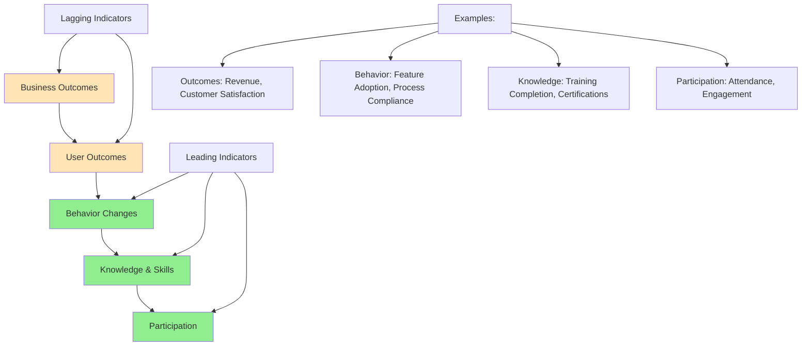
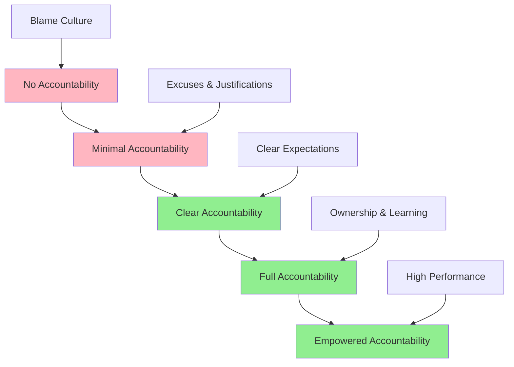
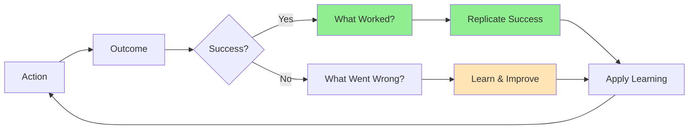
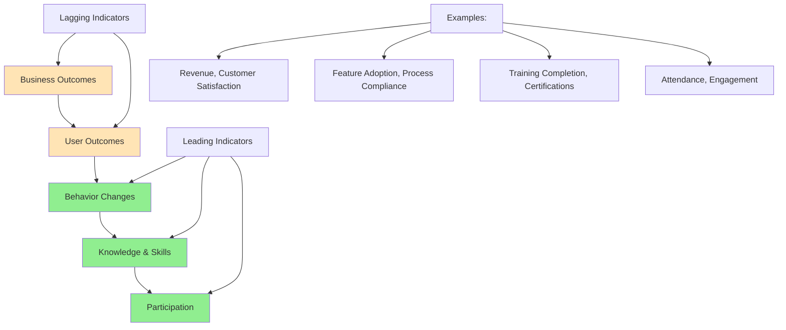
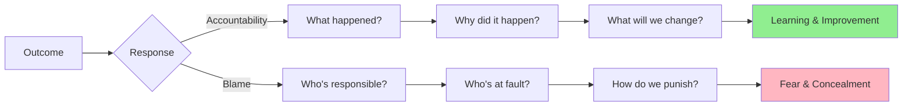
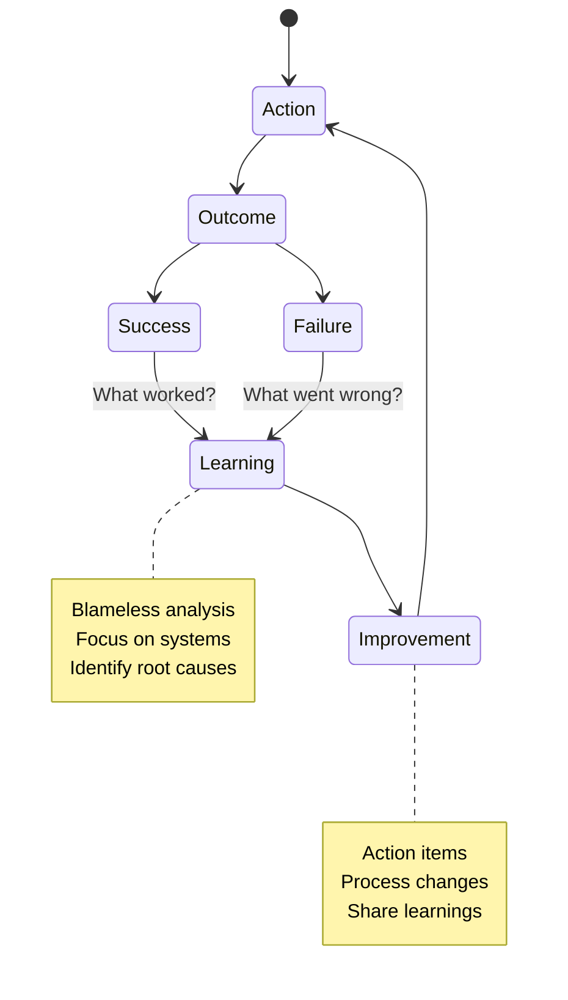
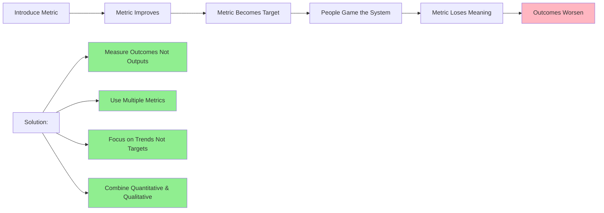
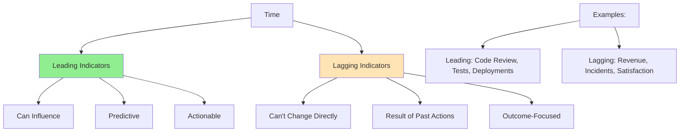

# Week 4: Measurement and Accountability - Complete Tutorial

**📚 InfoQ Certified Engineering Leadership Program**  
**⏱️ Estimated Reading Time:** 45-60 minutes  
**🎯 Difficulty Level:** Intermediate  
**📅 Last Updated:** January 2026

---

## Table of Contents

1. [Introduction & Overview](#introduction--overview)
2. [Prerequisites](#prerequisites)
3. [Learning Objectives](#learning-objectives)
4. [Core Concepts](#core-concepts)
5. [Measuring Technical Strategy Success](#measuring-technical-strategy-success)
6. [Accountability in Organizations](#accountability-in-organizations)
7. [Blamelessness and Psychological Safety](#blamelessness-and-psychological-safety)
8. [Metrics and Measurement Frameworks](#metrics-and-measurement-frameworks)
9. [Avoiding Common Measurement Pitfalls](#avoiding-common-measurement-pitfalls)
10. [Real-World Examples & Case Studies](#real-world-examples--case-studies)
11. [Mermaid Diagrams](#mermaid-diagrams)
12. [Common Pitfalls & Anti-Patterns](#common-pitfalls--anti-patterns)
13. [Best Practices](#best-practices)
14. [Practice Exercises](#practice-exercises)
15. [Question Bank](#question-bank)
16. [Test Your Understanding](#test-your-understanding)
17. [Common Interview Questions](#common-interview-questions)
18. [Troubleshooting Guide](#troubleshooting-guide)
19. [Performance Considerations](#performance-considerations)
20. [Security Considerations](#security-considerations)
21. [Summary & Key Takeaways](#summary--key-takeaways)
22. [Further Reading & Resources](#further-reading--resources)

---

## Introduction & Overview

The map is not the territory. This week covers how to tell whether your technical strategy is working. It also covers what it means to be accountable for an outcome in an organization, and how to hold that accountability while keeping blamelessness and psychological safety intact.

> 💡 **Key Insight:** What gets measured gets managed - but be careful what you measure, because you might get exactly that. The right metrics drive the right behavior; the wrong metrics drive the wrong behavior.

### Why Measurement and Accountability Matter

**The Measurement Challenge:**
- **60%** of executives say they don't have the metrics they need to make decisions (Harvard Business Review)
- **85%** of senior management teams spend less than 1 hour per month discussing strategy
- Without good metrics, you're flying blind

**The Accountability Challenge:**
- Fear of accountability creates risk aversion
- Blame culture kills innovation and learning
- Too little accountability creates mediocrity
- Finding the balance is critical for high performance

### What This Week Covers

1. **Measuring Success:** How to know if your strategy is working
2. **Accountability:** What it means and how to practice it
3. **Blamelessness:** Creating safety while maintaining standards
4. **Metrics:** Choosing and using the right metrics
5. **Avoiding Pitfalls:** Goodhart's Law, outcomes bias, and other measurement traps

---

## Prerequisites

Before starting this week's material, you should have:

- ✅ Completion of Week 1: Organizational Foundations
- ✅ Completion of Week 2: Technical Strategy
- ✅ Completion of Week 3: Technical Execution
- ✅ Understanding of technical strategy and execution
- ✅ Experience with metrics and measurement
- ✅ Basic understanding of statistics and data analysis
- ✅ Experience with performance management

**Recommended Background:**
- Experience with OKRs and goal setting
- Understanding of leading vs. lagging indicators
- Exposure to business metrics and KPIs
- Experience with team performance management

---

## Learning Objectives

By the end of this week, you will be able to:

1. **Design** measurement frameworks for technical strategies
2. **Distinguish** between leading and lagging indicators
3. **Apply** blameless accountability in practice
4. **Balance** accountability with psychological safety
5. **Avoid** common measurement pitfalls (Goodhart's Law, outcomes bias)
6. **Classify** metrics by type (participation, knowledge, behavior, outcomes)
7. **Combine** quantitative and qualitative measurement
8. **Create** a culture of learning from failures

---

## Core Concepts

### 1. The Map is Not the Territory

**Concept:** Metrics are representations of reality, not reality itself.

**Implications:**
- Metrics simplify complex reality
- Metrics can be gamed or misinterpreted
- Context matters more than numbers
- Qualitative data complements quantitative

**Example:**
```
Metric: 99.9% uptime
Reality: 
  - 43 minutes of downtime per month
  - But when it occurs matters:
    - 43 minutes at 2 AM on Tuesday: Low impact
    - 43 minutes during Black Friday: Catastrophic impact
```

### 2. Accountability vs. Blame

**Accountability:**
- Owning outcomes
- Learning from results
- Taking responsibility
- Making improvements
- Focused on the future

**Blame:**
- Finding fault
- Punishing individuals
- Looking backward
- Creating fear
- Focused on the past

**The Balance:**
```
Accountability WITHOUT Blame:
✓ "What happened and why?"
✓ "What will we do differently?"
✓ "How do we prevent recurrence?"
✓ "What did we learn?"

Blame WITHOUT Accountability:
✗ "Who messed up?"
✗ "Who's responsible?"
✗ "How do we punish them?"
✗ "How do we prevent this from being traced to us?"
```

### 3. Leading vs. Lagging Indicators

**Leading Indicators:**
- Predict future outcomes
- Can be influenced in the short term
- Leading signals
- Actionable

**Examples:**
- Code review coverage (predicts quality)
- Deployment frequency (predicts delivery speed)
- Team engagement (predicts retention)
- Test coverage (predicts bugs)

**Lagging Indicators:**
- Measure past outcomes
- Can't be changed directly
- Result of past actions
- Outcome-focused

**Examples:**
- Revenue (result of many factors)
- Customer satisfaction (result of many interactions)
- Incident rate (result of past decisions)
- Employee turnover (result of past culture)

**The Balance:**
```
Leading Indicators (Input):
- What we can influence now
- Predictive of future success
- Actionable

Lagging Indicators (Output):
- What we want to achieve
- Results of our actions
- Outcome-focused

Example:
Leading: Deploy frequency, test coverage, code review time
Lagging: Customer satisfaction, revenue, incident rate
```

### 4. Goodhart's Law and Outcomes Bias

**Goodhart's Law:**
> "When a measure becomes a target, it ceases to be a good measure." - Marilyn Strathern

**Example:**
```
Metric: Lines of code written
Intended: Measure productivity
Actual: Developers write verbose, unnecessary code
Result: More code, but not better outcomes

Metric: Test coverage
Intended: Ensure quality
Actual: Developers write trivial tests to hit 80%
Result: Coverage looks good, but critical paths untested
```

**Outcomes Bias:**
> Judging a decision based on its outcome rather than the quality of the decision at the time it was made.

**Example:**
```
Decision: Take a calculated risk on new technology
Outcome: Technology fails
Bias: "That was a bad decision"
Reality: Given the information at the time, it was a good decision

Decision: Play it safe with proven technology
Outcome: Competitor innovates and wins
Bias: "That was a good decision"
Reality: Given the information at the time, it was a bad decision
```

### 5. The Measurement Hierarchy



---

## Measuring Technical Strategy Success

### The Measurement Framework

#### Step 1: Define What Success Looks Like

**Questions to Answer:**
1. What business outcomes are we trying to achieve?
2. What user behaviors need to change?
3. What technical capabilities must we build?
4. How will we know we're making progress?
5. What would tell us we're failing?

**Success Definition Template:**
```
We will know our strategy is successful when:
1. [Business outcome] improves by [X%] within [timeframe]
2. [User behavior] changes as measured by [metric]
3. [Technical capability] is demonstrated by [evidence]
4. [Leading indicator] shows consistent improvement
5. [Stakeholder] reports [specific improvement]

We will know our strategy is failing if:
1. [Metric] doesn't improve after [timeframe]
2. [Unexpected negative outcome] occurs
3. [Stakeholder] reports [specific issue]
4. Costs exceed [threshold]
5. Team morale declines significantly
```

#### Step 2: Choose the Right Metrics

**Metrics Selection Framework:**

| Level | What to Measure | Examples | Type |
|-------|----------------|----------|------|
| **Outcome** | Business results | Revenue, customer satisfaction, market share | Lagging |
| **Behavior** | User/team actions | Feature adoption, process compliance, deployment frequency | Leading |
| **Knowledge** | Learning & skills | Training completion, certifications, skill assessments | Leading |
| **Participation** | Engagement | Attendance, contribution, involvement | Leading |

**Example: CI/CD Implementation Strategy**

**Outcome Metrics (Lagging):**
- Production incidents: 4/month → <1/month
- Deployment time: 4 hours → 15 minutes
- Engineering time spent on deployments: 20 hrs/week → 2 hrs/week

**Behavior Metrics (Leading):**
- Deployment frequency: 5/week → 20/week
- Automated test coverage: 20% → 80%
- Code review turnaround: 24 hours → 4 hours

**Knowledge Metrics (Leading):**
- CI/CD training completion: 0% → 100%
- Team certification: 0 → 5 certified
- Documentation quality score: 3/10 → 8/10

**Participation Metrics (Leading):**
- Pipeline usage: 50% → 100%
- Feature flag adoption: 0% → 90%
- Monitoring dashboard views: 10/week → 50/week

#### Step 3: Establish Baselines

**Why Baselines Matter:**
- You can't improve what you don't measure
- Baselines show current state
- Baselines enable progress tracking
- Baselines help set realistic targets

**Baseline Establishment Process:**
1. **Collect historical data** (3-6 months minimum)
2. **Calculate current metrics**
3. **Identify trends** (improving, stable, declining)
4. **Document assumptions**
5. **Set measurement frequency**

**Example:**
```
Metric: Deployment Frequency
Historical Data (Last 3 Months):
- January: 20 deployments
- February: 22 deployments
- March: 18 deployments
Average: 20 deployments/month
Trend: Stable

Baseline: 20 deployments/month
Target: 80 deployments/month (4x increase)
Measurement: Weekly
```

#### Step 4: Set SMART Targets

**SMART Criteria:**
- **Specific:** Clear and unambiguous
- **Measurable:** Quantifiable
- **Achievable:** Realistic given constraints
- **Relevant:** Aligned with strategy
- **Time-bound:** Has a deadline

**Example:**
```
❌ Bad: "Improve deployment speed"
✓ Good: "Reduce deployment time from 4 hours to 15 minutes 
        within 3 months, measured by CI/CD pipeline metrics"

❌ Bad: "Increase team happiness"
✓ Good: "Improve team engagement score from 3.2/5 to 4.2/5 
        within 6 months, measured by quarterly survey"
```

#### Step 5: Create Measurement Cadence

**Measurement Frequency by Type:**

| Metric Type | Frequency | Purpose |
|-------------|-----------|---------|
| **Real-time** | Continuous | Monitoring, alerting |
| **Daily** | Daily | Operational metrics |
| **Weekly** | Weekly | Progress tracking |
| **Monthly** | Monthly | Trend analysis |
| **Quarterly** | Quarterly | Strategic review |
| **Annually** | Annually | Goal assessment |

**Measurement Review Process:**
1. **Collect data** automatically where possible
2. **Visualize** in dashboards
3. **Review** in regular meetings
4. **Analyze** trends and anomalies
5. **Act** on insights
6. **Adjust** metrics as needed

---

## Accountability in Organizations

### What is Accountability?

**Definition:** Accountability is the obligation to account for one's actions, accept responsibility, and disclose results in a transparent manner.

**Key Components:**
1. **Clear expectations:** Everyone knows what success looks like
2. **Ownership:** Individuals take responsibility for outcomes
3. **Transparency:** Results are visible and shared
4. **Learning:** Failures are analyzed and improvements made
5. **Consequences:** Both positive and negative outcomes are addressed

### Accountability vs. Responsibility

**Responsibility:**
- Can be shared
- About doing the work
- Task-oriented
- Can be delegated

**Accountability:**
- Cannot be shared
- About owning outcomes
- Results-oriented
- Cannot be delegated

**Example:**
```
Responsibility: "The team is responsible for deploying the feature"
Accountability: "The engineering manager is accountable for the 
                 feature being delivered on time and meeting quality 
                 standards"

Team shares responsibility, but manager retains accountability.
```

### The Accountability Ladder



### Creating Accountable Teams

#### 1. Set Clear Expectations

**Clear Expectations Include:**
- **What:** Specific deliverables
- **Why:** Context and importance
- **When:** Timeline and milestones
- **How:** Constraints and boundaries
- **Success criteria:** How we'll know it's done
- **Consequences:** What happens if we succeed/fail

**Example:**
```
Unclear: "Improve system performance"
Clear: "Reduce API response time from 500ms to 200ms 
        (p95) by end of Q2 to support 2x traffic growth. 
        Success criteria: <200ms at 2x current load, 
        no increase in error rate. Failure to meet 
        target will require additional resources or 
        scope reduction."
```

#### 2. Make Outcomes Visible

**Visibility Mechanisms:**
- Public dashboards
- Regular progress reports
- Team standups
- Sprint reviews
- Stakeholder updates

**Benefits:**
- Creates social pressure to deliver
- Enables early intervention
- Builds transparency
- Celebrates successes

#### 3. Regular Check-ins

**Check-in Cadence:**
- **Daily:** Progress and blockers (standup)
- **Weekly:** Status and adjustments
- **Monthly:** Progress against goals
- **Quarterly:** Strategic review

**Check-in Questions:**
- Are we on track?
- What's blocking us?
- What help do we need?
- What are we learning?
- What should we adjust?

#### 4. Consequences (Positive and Negative)

**Positive Consequences:**
- Recognition and praise
- Career advancement
- Increased responsibility
- Bonuses and rewards
- Learning opportunities

**Negative Consequences:**
- Coaching and feedback
- Performance improvement plans
- Reduced responsibilities
- Role changes
- Termination (last resort)

**Key Principle:** Consequences should be fair, consistent, and focused on improvement, not punishment.

#### 5. Learning from Outcomes

**The Learning Cycle:**


**Learning Questions:**
- What was our goal?
- What actually happened?
- Why did it happen?
- What will we do differently?
- How do we share this learning?

---

## Blamelessness and Psychological Safety

### What is Blamelessness?

**Definition:** Blamelessness is the practice of analyzing failures without assigning fault to individuals, focusing instead on systems, processes, and improvements.

**Blameless ≠ No Accountability:**
```
Blameless:
✓ "What system failed?"
✓ "What process was missing?"
✓ "How do we prevent this?"
✓ "What did we learn?"
✓ Individuals are accountable for learning and improving

NOT Blameless:
✗ "It's nobody's fault"
✗ "These things happen"
✗ No analysis or learning
✗ No accountability for improvement
```

### The Blameless Post-Mortem

**Purpose:** Learn from failures to prevent recurrence

**Process:**
1. **Gather facts** (timeline, impact, systems involved)
2. **Analyze root causes** (5 whys, fishbone diagram)
3. **Identify contributing factors** (systems, processes, tools)
4. **Develop action items** (what will we change)
5. **Share learnings** (organization-wide if appropriate)
6. **Follow up** (track action items to completion)

**Blameless Post-Mortem Template:**
```markdown
# Post-Mortem: [Incident Name]

## Summary
[Brief description of what happened]

## Impact
- Duration: [X hours/minutes]
- Users affected: [X]
- Revenue impact: [$X]
- Reputation impact: [description]

## Timeline
- [Time]: [Event]
- [Time]: [Event]
- [Time]: [Event]

## Root Cause Analysis
### What Happened?
[Technical description]

### Why Did It Happen?
[Root cause analysis using 5 whys or similar]

### Contributing Factors
- System factor: [description]
- Process factor: [description]
- People factor: [description] (focus on training, not blame)

## Lessons Learned
1. [Lesson 1]
2. [Lesson 2]
3. [Lesson 3]

## Action Items
| Action | Owner | Timeline | Success Criteria |
|--------|-------|----------|------------------|
| [Action 1] | [Name] | [Date] | [Criteria] |
| [Action 2] | [Name] | [Date] | [Criteria] |

## Related Incidents
[Links to similar past incidents]
```

### Psychological Safety and Accountability

**The Paradox:**
- High psychological safety → People admit mistakes → Learning happens
- High accountability → People hide mistakes → Blame culture

**The Solution:**
```
Psychological Safety + Accountability = High Performance

Psychological Safety:
✓ Safe to admit mistakes
✓ Safe to ask for help
✓ Safe to challenge ideas
✓ Safe to try new things

Accountability:
✓ Clear expectations
✓ Ownership of outcomes
✓ Learning from results
✓ Continuous improvement

Together:
✓ People own mistakes
✓ People learn from failures
✓ People improve continuously
✓ High performance culture
```

### Creating Psychological Safety

**Leader Behaviors:**
1. **Model vulnerability:** Admit your own mistakes
2. **Respond constructively:** Thank people for bad news
3. **Encourage questions:** "What don't I know?"
4. **Normalize failure:** Share your failures
5. **Include everyone:** Draw out quiet voices
6. **Set clear expectations:** "We value learning over perfection"

**Team Rituals:**
- Start meetings with "What did you fail at this week?"
- Celebrate "best failure" each month
- Publicly thank people for raising concerns
- Share lessons learned widely
- Blameless post-mortems for all incidents

**Signs of Psychological Safety:**
- Team members admit mistakes freely
- People ask questions in meetings
- New ideas are welcomed
- Failure leads to inquiry, not blame
- Diverse perspectives are valued

**Signs of Low Psychological Safety:**
- Mistakes are hidden
- No one asks questions
- New ideas are shot down
- Failure leads to blame and punishment
- Conformity is valued over diversity

---

## Metrics and Measurement Frameworks

### The North Star Metric

**Definition:** The single metric that best captures the core value your product delivers to customers.

**Characteristics:**
- Reflects value delivered to customers
- Measurable and actionable
- Understandable by everyone
- Leads to business success

**Examples:**
- Airbnb: Nights booked
- Uber: Rides completed
- Netflix: Hours watched
- Slack: Messages sent

**How to Find Your North Star:**
1. What's the core value you provide?
2. What do successful customers do?
3. What metric predicts long-term success?
4. Is it measurable and actionable?

### The HEART Framework

**Purpose:** Measure user experience

**Dimensions:**
- **Happiness:** User satisfaction, NPS
- **Engagement:** Frequency, depth, breadth of use
- **Adoption:** New users, features
- **Retention:** Returning users, churn
- **Task Success:** Completion rate, time to complete

**Example: Developer Portal**
- **Happiness:** Developer satisfaction score (1-5)
- **Engagement:** API calls per developer per day
- **Adoption:** New developers using portal
- **Retention:** Developers returning week over week
- **Task Success:** Time to deploy code

### The OKR Framework

**Purpose:** Align teams and measure progress toward goals

**Structure:**
- **Objective:** Qualitative, inspirational
- **Key Results:** 3-5 measurable outcomes

**Example:**
```
Objective: Become the most reliable service

Key Results:
1. Uptime: 99.5% → 99.99%
2. MTTR: 1 hour → 10 minutes
3. Customer incidents: 4/month → <1/month
4. Test coverage: 70% → 95%
```

**Measurement:**
- Track key results weekly
- Review progress monthly
- Adjust as needed
- Celebrate achievements

### The DORA Metrics

**Purpose:** Measure software delivery performance

**Four Metrics:**
1. **Deployment Frequency:** How often do you deploy?
2. **Lead Time for Changes:** Commit to production
3. **Change Failure Rate:** Deployations causing failures
4. **Time to Restore Service:** Recovery from failure

**Performance Levels:**
- **Elite:** On-demand deploys, <1 hour lead time, 0-15% failure rate, <1 hour recovery
- **High:** Weekly deploys, 1 day-1 week lead time, 16-30% failure rate, <1 day recovery
- **Medium:** Monthly deploys, 1-6 months lead time, 31-45% failure rate, 1-7 days recovery
- **Low:** Less than monthly, >6 months lead time, >45% failure rate, >7 days recovery

### Balanced Scorecard

**Purpose:** Measure multiple dimensions of performance

**Four Perspectives:**
1. **Financial:** Revenue, profit, ROI
2. **Customer:** Satisfaction, retention, NPS
3. **Internal Process:** Efficiency, quality, cycle time
4. **Learning & Growth:** Skills, culture, innovation

**Example: Engineering Team**
- **Financial:** Cost per feature, engineering ROI
- **Customer:** Developer satisfaction, feature adoption
- **Internal Process:** Deployment frequency, lead time, defect rate
- **Learning & Growth:** Training hours, skill assessments, innovation time

---

## Avoiding Common Measurement Pitfalls

### Goodhart's Law

**Law:** "When a measure becomes a target, it ceases to be a good measure."

**Examples:**
```
Metric: Test Coverage
Intended: Ensure quality
Gaming: Write trivial tests to hit 80%
Result: Coverage looks good, but critical paths untested

Metric: Lines of Code
Intended: Measure productivity
Gaming: Write verbose, unnecessary code
Result: More code, but not better outcomes

Metric: Story Points Completed
Intended: Measure velocity
Gaming: Inflate estimates, cherry-pick easy stories
Result: Velocity looks good, but value delivered is low
```

**Solutions:**
1. **Measure outcomes, not outputs:** Value delivered vs. work done
2. **Use multiple metrics:** Don't rely on single metric
3. **Regularly review metrics:** Are they still measuring what matters?
4. **Focus on trends, not targets:** Improvement vs. hitting number
5. **Combine quantitative with qualitative:** Numbers + context

### Outcomes Bias

**Bias:** Judging decisions based on outcomes rather than decision quality.

**Example:**
```
Decision: Take calculated risk on new technology
Outcome: Technology fails
Bias: "Bad decision"
Reality: Good decision given information at the time

Decision: Play it safe with proven technology
Outcome: Competitor innovates and wins
Bias: "Good decision"
Reality: Bad decision given information at the time
```

**Solutions:**
1. **Evaluate decision process, not just outcomes**
2. **Document assumptions at time of decision**
3. **Consider counterfactuals:** What if outcome was different?
4. **Focus on learning, not blame**
5. **Use decision journals**

### Vanity Metrics vs. Actionable Metrics

**Vanity Metrics:**
- Look good but don't drive action
- Don't correlate with success
- Easy to game
- Focus on activity, not outcomes

**Examples:**
- Total registered users (vs. active users)
- Total lines of code (vs. value delivered)
- Number of features shipped (vs. feature adoption)
- Page views (vs. conversions)

**Actionable Metrics:**
- Drive specific actions
- Correlate with success
- Hard to game
- Focus on outcomes

**Examples:**
- Active users (DAU/MAU)
- Code churn (indicates quality)
- Feature adoption rate
- Conversion rate

### The Measurement Anti-Patterns

#### Anti-Pattern 1: Metric Mania

**Problem:** Measuring everything, understanding nothing

**Symptoms:**
- 100+ dashboards
- Analysis paralysis
- No clear priorities
- Metrics overload

**Solution:**
- Focus on 3-5 key metrics
- Use North Star metric
- Regular metric review and pruning
- Quality over quantity

#### Anti-Pattern 2: Vanity Metrics

**Problem:** Focusing on metrics that look good but don't drive value

**Symptoms:**
- Metrics improve but outcomes don't
- Gaming the system
- False sense of progress

**Solution:**
- Focus on outcomes, not outputs
- Connect metrics to business value
- Use leading and lagging indicators
- Regular validation

#### Anti-Pattern 3: Ignoring Context

**Problem:** Looking at numbers without understanding context

**Symptoms:**
- Misinterpreting data
- Wrong conclusions
- Bad decisions based on data

**Solution:**
- Always ask "why"
- Combine quantitative with qualitative
- Consider external factors
- Use data to inform, not decide

#### Anti-Pattern 4: Set-It-and-Forget-It

**Problem:** Creating metrics and never reviewing them

**Symptoms:**
- Metrics become irrelevant
- Don't reflect current reality
- Waste of time

**Solution:**
- Regular metric reviews (quarterly)
- Update metrics as strategy evolves
- Retire metrics that don't matter
- Stay aligned with business goals

---

## Real-World Examples & Case Studies

### Case Study 1: Google's Project Aristotle

**Context:** Google studied 180 teams to understand what makes teams effective.

**Measurement Approach:**
- Collected data on 100+ variables
- Measured team performance
- Analyzed team dynamics
- Identified key factors

**Key Finding:** Psychological safety was the #1 predictor of team success.

**Metrics Used:**
- Team performance (manager assessments, 360 feedback)
- Team dynamics (surveys, observations)
- Individual contributions (performance reviews)

**Outcome:**
- Changed hiring practices
- Invested in team development
- Created manager training
- Improved team effectiveness

**Lesson:** Measure what matters, not just what's easy. Sometimes soft factors (psychological safety) matter more than hard factors (skills).

### Case Study 2: Amazon's Leadership Principles

**Context:** Amazon uses 16 leadership principles to guide decisions and measure performance.

**Measurement Approach:**
- Leadership principles in hiring
- Leadership principles in performance reviews
- Leadership principles in decision-making
- Leadership principles in promotions

**Key Principles:**
- Customer obsession
- Ownership
- Bias for action
- Earn trust
- Dive deep
- Have backbone; disagree and commit

**Outcome:**
- Consistent culture across organization
- Clear expectations
- Objective performance evaluation
- High performance culture

**Lesson:** Clear principles enable consistent measurement and accountability.

### Case Study 3: Netflix's Freedom and Responsibility

**Context:** Netflix measures outcomes, not hours or activity.

**Measurement Approach:**
- No time tracking
- No vacation tracking
- Focus on results
- High expectations

**Key Metrics:**
- Impact on business
- Quality of work
- Collaboration
- Innovation

**Outcome:**
- High performance culture
- Attracts top talent
- High innovation
- Strong ownership

**Lesson:** What you measure signals what you value. Measure outcomes, not activity.

### Case Study 4: Microsoft's Culture Transformation

**Context:** Satya Nadella transformed Microsoft's culture from "know-it-all" to "learn-it-all."

**Measurement Changes:**
- From: Individual achievement, competition
- To: Collaboration, learning, growth mindset

**New Metrics:**
- Learning and development
- Collaboration quality
- Customer impact
- Innovation

**Outcome:**
- Improved culture
- Increased innovation
- Better collaboration
- Market cap growth

**Lesson:** Metrics drive culture. Change metrics to change culture.

---

## Mermaid Diagrams

### Diagram 1: Measurement Hierarchy



### Diagram 2: Accountability vs. Blame



### Diagram 3: The Learning Cycle



### Diagram 4: Goodhart's Law in Action



### Diagram 5: Leading vs. Lagging Indicators



---

## Common Pitfalls & Anti-Patterns

### Anti-Pattern 1: Vanity Metrics

**Problem:** Focusing on metrics that look good but don't drive value.

**Symptoms:**
- Metrics improve but outcomes don't
- Gaming the system
- False sense of progress

**Solution:**
- Focus on outcomes, not outputs
- Connect metrics to business value
- Use leading and lagging indicators
- Regular validation

### Anti-Pattern 2: Goodhart's Law

**Problem:** When a measure becomes a target, it ceases to be a good measure.

**Symptoms:**
- People game the metric
- Metric diverges from intended goal
- Unintended consequences

**Solution:**
- Measure outcomes, not outputs
- Use multiple metrics
- Focus on trends, not targets
- Combine quantitative with qualitative

### Anti-Pattern 3: Outcomes Bias

**Problem:** Judging decisions based on outcomes rather than decision quality.

**Symptoms:**
- Punishing good decisions that failed
- Rewarding bad decisions that succeeded
- Risk aversion

**Solution:**
- Evaluate decision process
- Document assumptions
- Focus on learning
- Use decision journals

### Anti-Pattern 4: Blame Culture

**Problem:** Focusing on who failed rather than what failed.

**Symptoms:**
- Mistakes hidden
- No learning
- Fear and risk aversion
- Low innovation

**Solution:**
- Blameless post-mortems
- Focus on systems, not people
- Learning orientation
- Psychological safety

### Anti-Pattern 5: No Accountability

**Problem:** Everyone responsible, so no one accountable.

**Symptoms:**
- Work doesn't get done
- Low quality
- No ownership
- Mediocrity

**Solution:**
- Clear accountability (RACI)
- Clear expectations
- Regular check-ins
- Consequences (positive and negative)

### Anti-Pattern 6: Metric Mania

**Problem:** Measuring everything, understanding nothing.

**Symptoms:**
- 100+ dashboards
- Analysis paralysis
- No clear priorities

**Solution:**
- Focus on 3-5 key metrics
- Use North Star metric
- Regular metric review
- Quality over quantity

---

## Best Practices

### 1. Start with Outcomes, Not Outputs

**Framework:**
```
Outcome: What value are we delivering?
Output: What work are we doing?
Activity: What tasks are we performing?

Measure: Outcomes > Outputs > Activities

Example:
Outcome: Customers can deploy code confidently
Output: CI/CD pipeline built
Activity: Writing pipeline code

Measure: Deployment success rate, time to deploy, 
         incident rate (outcome)
Not: Lines of pipeline code (activity)
```

### 2. Use Both Leading and Lagging Indicators

**Balance:**
- **Leading (Input):** What we can influence now
- **Lagging (Output):** What we want to achieve

**Example:**
```
Leading:
- Code review coverage
- Test coverage
- Deployment frequency
- Team engagement

Lagging:
- Production incidents
- Customer satisfaction
- Revenue
- Employee retention
```

### 3. Combine Quantitative and Qualitative

**Quantitative:**
- Numbers, metrics, data
- Objective, measurable
- Trends and patterns

**Qualitative:**
- Stories, feedback, observations
- Subjective, contextual
- Understanding "why"

**Example:**
```
Quantitative: "Deployment frequency increased 4x"
Qualitative: "Teams report feeling more confident deploying"

Together: "Deployment frequency increased 4x, and teams 
          report higher confidence, indicating the strategy 
          is working."
```

### 4. Make Metrics Visible and Actionable

**Visibility:**
- Dashboards accessible to all
- Regular reviews in meetings
- Public progress tracking

**Actionability:**
- Clear owners for each metric
- Defined actions for improvement
- Regular review and adjustment

### 5. Create Blameless Culture

**Practices:**
- Blameless post-mortems
- Focus on systems, not people
- Learning orientation
- Psychological safety

**Leader Behaviors:**
- Model vulnerability
- Thank people for bad news
- Celebrate learning from failures
- No blame language

### 6. Balance Accountability and Safety

**The Balance:**
```
Psychological Safety:
✓ Safe to admit mistakes
✓ Safe to ask for help
✓ Safe to try new things

Accountability:
✓ Clear expectations
✓ Ownership of outcomes
✓ Learning from results

Together = High Performance
```

### 7. Regularly Review and Update Metrics

**Review Cadence:**
- **Monthly:** Are metrics still relevant?
- **Quarterly:** Do metrics align with strategy?
- **Annually:** Major metric refresh

**Review Questions:**
- Are we measuring what matters?
- Are metrics driving right behavior?
- Do we need new metrics?
- Should we retire any metrics?

### 8. Use Metrics to Learn, Not to Punish

**Purpose of Metrics:**
- Learn and improve
- Identify problems early
- Celebrate successes
- Inform decisions

**NOT:**
- Punish underperformance
- Compare individuals
- Create fear
- Game the system

---

## Practice Exercises

### Exercise 1: Design a Measurement Framework

**Objective:** Create a comprehensive measurement framework for a technical strategy.

**Instructions:**
1. Choose a technical strategy (e.g., CI/CD implementation, microservices migration, performance optimization).
2. Define success using the template:
   - 3-5 business outcomes (lagging)
   - 3-5 behavior changes (leading)
   - 3-5 knowledge/skill indicators (leading)
   - 3-5 participation indicators (leading)
3. Establish baselines for each metric
4. Set SMART targets
5. Define measurement cadence
6. Create dashboard mockup

**Sample Solution:**

**Strategy:** Implement CI/CD Pipeline

**Outcome Metrics (Lagging):**
1. Production incidents: 4/month → <1/month (6 months)
2. Deployment time: 4 hours → 15 minutes (3 months)
3. Engineering time: 20 hrs/week → 2 hrs/week (3 months)
4. Change failure rate: 30% → <5% (6 months)

**Behavior Metrics (Leading):**
1. Deployment frequency: 5/week → 20/week (3 months)
2. Automated test coverage: 20% → 80% (6 months)
3. Code review turnaround: 24 hours → 4 hours (3 months)

**Knowledge Metrics (Leading):**
1. CI/CD training completion: 0% → 100% (1 month)
2. Team certification: 0 → 5 certified (3 months)
3. Documentation quality: 3/10 → 8/10 (2 months)

**Participation Metrics (Leading):**
1. Pipeline usage: 50% → 100% (2 months)
2. Feature flag adoption: 0% → 90% (4 months)
3. Monitoring dashboard views: 10/week → 50/week (2 months)

**Baselines:** [Document current state for each metric]

**Targets:** [Document SMART targets]

**Cadence:**
- Real-time: Pipeline success rate
- Daily: Deployment frequency
- Weekly: Test coverage, code review time
- Monthly: Incident rate, engineering time
- Quarterly: Business impact

### Exercise 2: Blameless Post-Mortem

**Objective:** Practice conducting a blameless post-mortem.

**Instructions:**
1. Choose a recent failure or incident (real or hypothetical).
2. Conduct a blameless post-mortem:
   - Timeline of events
   - Root cause analysis (5 whys)
   - Contributing factors (systems, processes, not people)
   - Lessons learned
   - Action items
3. Focus on systems and processes, not individuals
4. Identify 3-5 actionable improvements

**Sample Solution:**

**Incident:** Production outage lasting 45 minutes

**Timeline:**
- 2:00 PM: Deployment initiated
- 2:05 PM: Deployment completed
- 2:07 PM: Alerts triggered (high error rate)
- 2:10 PM: Team notified
- 2:15 PM: Rollback initiated
- 2:30 PM: Rollback completed
- 2:45 PM: Service fully recovered

**Root Cause Analysis (5 Whys):**
1. Why did outage occur? Database connection pool exhausted
2. Why was pool exhausted? New code opened connections without closing
3. Why didn't code close connections? Missing try-with-resources
4. Why wasn't this caught? Code review didn't check for this pattern
5. Why didn't review check? No checklist for resource management

**Contributing Factors:**
- System: No automated check for connection leaks
- Process: Code review checklist incomplete
- Training: Team not trained on connection management

**Lessons Learned:**
1. Need automated detection of connection leaks
2. Code review checklist needs expansion
3. Team needs training on resource management

**Action Items:**
1. Add static analysis rule for connection management (Owner: Tech Lead, Timeline: 2 weeks)
2. Update code review checklist (Owner: Senior Engineer, Timeline: 1 week)
3. Conduct team training on resource management (Owner: Engineering Manager, Timeline: 1 month)

### Exercise 3: Metrics Classification

**Objective:** Classify metrics by type and identify measurement approach.

**Instructions:**
1. Choose a business problem (e.g., improve developer productivity, reduce customer churn, increase feature adoption).
2. Brainstorm 10-15 potential metrics.
3. Classify each as:
   - Outcome (lagging)
   - Behavior (leading)
   - Knowledge (leading)
   - Participation (leading)
4. For each metric, identify:
   - How to measure quantitatively
   - How to measure qualitatively
   - How to avoid Goodhart's Law
5. Select top 5 metrics and justify selection

**Sample Solution:**

**Problem:** Improve Developer Productivity

**Metrics:**

| Metric | Type | Quantitative | Qualitative | Avoid Goodhart's Law |
|--------|------|--------------|-------------|---------------------|
| Feature delivery time | Outcome | Track time from commit to production | Interview developers about bottlenecks | Measure value delivered, not just speed |
| Developer satisfaction | Outcome | Survey score 1-5 | 1:1 conversations | Combine with productivity metrics |
| Deployment frequency | Behavior | Count deployments/week | Developer feedback | Measure success rate too, not just frequency |
| Code review time | Behavior | Avg hours from submission to approval | Survey review quality | Measure review quality, not just speed |
| Test coverage | Knowledge | % code covered | Assess test quality | Test critical paths, not just easy code |
| Training hours | Knowledge | Hours per quarter | Skill assessments | Measure skill improvement, not just hours |
| Documentation quality | Knowledge | Quality score | User feedback | Measure usefulness, not just quantity |
| Tool adoption | Participation | % using tools | User interviews | Measure productivity impact, not just usage |
| Team collaboration | Participation | Cross-team PRs | 360 feedback | Measure outcomes, not just activity |
| Innovation time | Participation | % time on innovation | Project outcomes | Measure impact, not just time spent |

**Top 5 Metrics:**
1. Feature delivery time (outcome) - Directly measures productivity
2. Developer satisfaction (outcome) - Indicates sustainability
3. Deployment frequency (behavior) - Leading indicator of productivity
4. Code review time (behavior) - Indicates collaboration efficiency
5. Test coverage (knowledge) - Predicts quality and maintainability

---

## Question Bank

### Multiple Choice Questions (1-30)

1. What does "the map is not the territory" mean in measurement?
   - A) Maps are inaccurate
   - B) Metrics represent reality but are not reality itself
   - C) You need a map to navigate
   - D) Territory is more important than maps
   - **Answer: B**

2. What is the difference between accountability and responsibility?
   - A) No difference
   - B) Accountability is owning outcomes, responsibility is doing the work
   - C) Responsibility is more important
   - D) Accountability can be delegated
   - **Answer: B**

3. What are leading indicators?
   - A) Past performance metrics
   - B) Metrics that predict future outcomes
   - C) Financial metrics
   - D) Lagging metrics
   - **Answer: B**

4. What is Goodhart's Law?
   - A) Metrics are important
   - B) When a measure becomes a target, it ceases to be a good measure
   - C) You can't improve what you don't measure
   - D) All metrics are flawed
   - **Answer: B**

5. What is outcomes bias?
   - A) Focusing on outcomes
   - B) Judging decisions by outcomes rather than decision quality
   - C) Being outcome-oriented
   - D) Measuring results
   - **Answer: B**

6. What is a North Star metric?
   - A) The most important metric
   - B) A metric that captures core value delivered
   - C) A long-term goal
   - D) A vanity metric
   - **Answer: B**

7. What is blamelessness?
   - A) No one is responsible
   - B) Analyzing failures without assigning fault to individuals
   - C) Ignoring failures
   - D) Letting people off the hook
   - **Answer: B**

8. What is psychological safety?
   - A) Physical safety in the workplace
   - B) Shared belief that the team is safe for interpersonal risk-taking
   - C) Feeling secure in your job
   - D) No stress at work
   - **Answer: B**

9. Which is a leading indicator?
   - A) Revenue
   - B) Customer satisfaction
   - C) Deployment frequency
   - D) Employee turnover
   - **Answer: C**

10. Which is a lagging indicator?
    - A) Test coverage
    - B) Code review time
    - C) Production incidents
    - D) Training completion
    - **Answer: C**

11. What is the HEART framework?
    - A) A health metric
    - B) A user experience measurement framework
    - C) A team assessment tool
    - D) A project management method
    - **Answer: B**

12. What are DORA metrics?
    - A) Database metrics
    - B) Four key software delivery performance metrics
    - C) Development operations metrics
    - D) Deployment metrics
    - **Answer: B**

13. What is a vanity metric?
    - A) A metric that looks good but doesn't drive value
    - B) An important metric
    - C) A leading indicator
    - D) A lagging indicator
    - **Answer: A**

14. What is the purpose of a blameless post-mortem?
    - A) To find someone to blame
    - B) To learn from failures and prevent recurrence
    - C) To document what happened
    - D) To assign responsibility
    - **Answer: B**

15. What is the accountability ladder?
    - A) A career progression framework
    - B) Levels from no accountability to empowered accountability
    - C) A performance rating system
    - D) A management hierarchy
    - **Answer: B**

16. What is the difference between leading and lagging indicators?
    - A) No difference
    - B) Leading predict future, lagging measure past
    - C) Leading are better
    - D) Lagging are more important
    - **Answer: B**

17. What is a balanced scorecard?
    - A) A financial report
    - B) A multi-dimensional performance measurement framework
    - C) A team evaluation tool
    - D) A project management method
    - **Answer: B**

18. What is the purpose of baselines?
    - A) To set minimum standards
    - B) To establish current state for comparison
    - C) To define goals
    - D) To measure performance
    - **Answer: B**

19. What is the SMART criteria?
    - A) A metric calculation method
    - B) Specific, Measurable, Achievable, Relevant, Time-bound
    - C) A goal-setting framework
    - D) A performance review process
    - **Answer: B**

20. What is the danger of metric mania?
    - A) Too many metrics
    - B) Measuring everything but understanding nothing
    - C) Analysis paralysis
    - D) All of the above
    - **Answer: D**

21. How do you avoid Goodhart's Law?
    - A) Don't use metrics
    - B) Measure outcomes not outputs, use multiple metrics
    - C) Only use qualitative metrics
    - D) Set hard targets
    - **Answer: B**

22. What is the purpose of regular metric reviews?
    - A) To punish underperformance
    - B) To ensure metrics remain relevant and aligned
    - C) To micromanage teams
    - D) To assign blame
    - **Answer: B**

23. What is the relationship between psychological safety and accountability?
    - A) They are incompatible
    - B) They work together for high performance
    - C) Safety is more important
    - D) Accountability is more important
    - **Answer: B**

24. What should you do when a metric becomes a target?
    - A) Increase the target
    - B) Recognize gaming will occur and add complementary metrics
    - C) Stop measuring it
    - D) Punish those who game it
    - **Answer: B**

25. What is the purpose of a blameless post-mortem?
    - A) To assign fault
    - B) To learn and improve
    - C) To document failures
    - D) To punish individuals
    - **Answer: B**

26. What is an actionable metric?
    - A) A metric you can act on
    - B) A vanity metric
    - C) A lagging indicator
    - D) A leading indicator
    - **Answer: A**

27. What is the measurement hierarchy?
    - A) A ranking of metrics by importance
    - B) A framework from outcomes to participation
    - C) A metric calculation method
    - D) A data collection process
    - **Answer: B**

28. How do you balance accountability and psychological safety?
    - A) Prioritize safety over accountability
    - B) Prioritize accountability over safety
    - C) Create clear expectations with learning orientation
    - D) Avoid both
    - **Answer: C**

29. What is the purpose of baselines?
    - A) To set minimum performance
    - B) To establish current state for measuring improvement
    - C) To define targets
    - D) To punish underperformance
    - **Answer: B**

30. What is the key insight of "the map is not the territory"?
    - A) Metrics are perfect representations
    - B) Metrics simplify reality and can be misleading
    - C) You don't need metrics
    - D) Reality doesn't matter
    - **Answer: B**

### True/False Questions (31-40)

31. Accountability can be shared among team members. (False - accountability cannot be shared)
32. Leading indicators predict future outcomes. (True)
33. Goodhart's Law states that metrics are always bad. (False - it states metrics become targets)
34. Blamelessness means no one is accountable. (False - it means focus on systems, not blame)
35. Vanity metrics drive action and improvement. (False - they look good but don't drive value)
36. Psychological safety enables accountability. (True)
37. Lagging indicators can be directly influenced. (False - they are results of past actions)
38. Outcomes bias is judging decisions by their outcomes. (True)
39. Metrics should be reviewed regularly. (True)
40. The North Star metric captures core value delivered. (True)

### Fill-in-the-Blank Questions (41-50)

41. ________ indicators predict future outcomes. (Leading)
42. ________ indicators measure past results. (Lagging)
43. Goodhart's Law states when a measure becomes a ________, it ceases to be a good measure. (target)
44. ________ bias is judging decisions by outcomes rather than decision quality. (Outcomes)
45. A ________ metric looks good but doesn't drive value. (vanity)
46. ________ safety is a shared belief that the team is safe for interpersonal risk-taking. (Psychological)
47. A ________ post-mortem analyzes failures without assigning blame. (blameless)
48. The ________ Star metric captures core value delivered to customers. (North)
49. The ________ framework measures user experience across 5 dimensions. (HEART)
50. ________ metrics are actionable and predictive. (Leading)

### Scenario-Based Questions (51-60)

51. **Scenario:** Your team's test coverage metric is 85%, but you're still having production incidents. What's wrong?
    - **Answer:** Likely Goodhart's Law - tests are written to hit coverage target, not to test critical paths. Solution: Measure test quality, not just coverage. Focus on testing critical paths and edge cases.

52. **Scenario:** Someone makes a mistake that causes an outage. How do you handle it blamelessly?
    - **Answer:** Conduct blameless post-mortem focusing on systems and processes. Ask: What system failed? What process was missing? How do we prevent recurrence? Thank them for transparency. Focus on learning, not blame.

53. **Scenario:** You need to measure team productivity. What metrics do you use?
    - **Answer:** Use outcome metrics (feature delivery time, customer satisfaction) not activity metrics (hours worked, lines of code). Combine leading (deployment frequency, code review time) and lagging (incident rate, customer satisfaction).

54. **Scenario:** A metric is being gamed. What do you do?
    - **Answer:** Recognize Goodhart's Law is in effect. Add complementary metrics. Shift focus from output to outcome. Example: If test coverage is gamed, add metrics for test quality and critical path coverage.

55. **Scenario:** How do you create psychological safety while maintaining accountability?
    - **Answer:** Set clear expectations (accountability) + create safe environment to admit mistakes (safety). Focus on learning from outcomes, not blaming individuals. Celebrate transparency and learning.

56. **Scenario:** You need to measure whether a strategy is working. What do you do?
    - **Answer:** Define success criteria upfront (SMART). Establish baselines. Track leading and lagging indicators. Review regularly. Define "how we'll know we're wrong" criteria.

57. **Scenario:** A decision led to a bad outcome, but it was a good decision at the time. How do you evaluate it?
    - **Answer:** Avoid outcomes bias. Evaluate the decision process, not just outcome. What was known at the time? What were the alternatives? Was the reasoning sound? Focus on learning, not blame.

58. **Scenario:** You have 50 metrics and can't make sense of them. What do you do?
    - **Answer:** Apply metric mania solution. Identify North Star metric. Focus on 3-5 key metrics. Retire metrics that don't drive action. Create simple dashboard.

59. **Scenario:** How do you measure something qualitative like psychological safety?
    - **Answer:** Use surveys (Edmondson's scale), observe behaviors (admission of mistakes, question asking), conduct 1:1s, analyze meeting dynamics. Combine quantitative (survey scores) with qualitative (stories, observations).

60. **Scenario:** Your team is afraid to report mistakes. What do you do?
    - **Answer:** Build psychological safety. Model vulnerability (admit your mistakes). Thank people for bad news. Conduct blameless post-mortems. Celebrate learning from failures. Create safe spaces for dialogue.

---

## Test Your Understanding

1. What does "the map is not the territory" mean?
2. What is the difference between accountability and responsibility?
3. What are leading vs. lagging indicators?
4. What is Goodhart's Law and how do you avoid it?
5. What is outcomes bias and how do you avoid it?
6. What is a North Star metric?
7. What is blamelessness and why is it important?
8. What is psychological safety?
9. What is the HEART framework?
10. What are the four DORA metrics?
11. What is a balanced scorecard?
12. What is the measurement hierarchy?
13. How do you create accountable teams?
14. How do you balance accountability and psychological safety?
15. What is the difference between vanity and actionable metrics?
16. How do you establish baselines?
17. What is the SMART criteria?
18. How do you avoid metric mania?
19. What is the purpose of a blameless post-mortem?
20. How do you measure qualitative things?

---

## Common Interview Questions

1. **Q:** How do you measure the success of a technical strategy?
   **A:** I define success criteria upfront using SMART goals. I establish baselines and track both leading and lagging indicators. I use a balanced scorecard approach measuring outcomes, behaviors, knowledge, and participation. I review metrics regularly and adjust based on learning.

2. **Q:** What is the difference between accountability and blame?
   **A:** Accountability is owning outcomes, learning from results, and continuous improvement. Blame is finding fault, punishing individuals, and looking backward. I create accountable teams through clear expectations, visibility, regular check-ins, and learning orientation - not blame.

3. **Q:** What is Goodhart's Law and how do you account for it?
   **A:** Goodhart's Law states that when a measure becomes a target, it ceases to be a good measure. I account for it by measuring outcomes not outputs, using multiple metrics, focusing on trends not targets, and combining quantitative with qualitative data.

4. **Q:** How do you create psychological safety while maintaining accountability?
   **A:** I set clear expectations and outcomes (accountability) while creating an environment where it's safe to admit mistakes and learn (safety). I conduct blameless post-mortems, model vulnerability, thank people for bad news, and focus on systems improvement not individual blame.

5. **Q:** Describe a time you used data to drive a decision.
   **A:** [STAR method] We had declining team engagement scores. I measured engagement quarterly using surveys and 1:1s. We found teams wanted more autonomy. We implemented flexible work arrangements and measured engagement monthly. Result: Engagement increased 30% in 6 months, turnover decreased 40%.

6. **Q:** How do you avoid outcomes bias?
   **A:** I evaluate decisions based on the decision-making process, not just outcomes. I document assumptions at the time of decision. I use decision journals. I focus on learning regardless of outcome. I ask "was this a good decision given what we knew at the time?"

7. **Q:** What is the difference between leading and lagging indicators?
   **A:** Leading indicators predict future outcomes and can be influenced now (deployment frequency, test coverage). Lagging indicators measure past results and can't be changed directly (revenue, customer satisfaction). I use both to get a complete picture.

8. **Q:** How do you measure something like psychological safety?
   **A:** I use Edmondson's psychological safety scale (survey). I observe behaviors (mistake admission, question asking). I conduct 1:1 conversations. I analyze meeting dynamics. I combine quantitative (survey scores) with qualitative (stories, observations).

9. **Q:** What is a North Star metric and how do you choose one?
   **A:** It's the single metric that best captures core value delivered to customers. I choose it by asking: What's the core value? What do successful customers do? What predicts long-term success? Is it measurable and actionable? Examples: Airbnb (nights booked), Netflix (hours watched).

10. **Q:** How do you ensure metrics drive the right behavior?
    **A:** I measure outcomes not outputs. I use multiple metrics to avoid gaming. I focus on trends not targets. I combine quantitative with qualitative. I regularly review and update metrics. I celebrate learning, not just hitting numbers.

---

## Troubleshooting Guide

### Issue 1: Metrics Being Gamed

**Symptoms:**
- Metrics improve but outcomes don't
- Unintended consequences
- System gaming

**Root Causes:**
- Single metric focus
- Metrics as targets
- Lack of outcome focus

**Solutions:**
1. Add complementary metrics
2. Measure outcomes, not outputs
3. Focus on trends, not targets
4. Combine quantitative with qualitative
5. Regular metric review

### Issue 2: Can't Measure What Matters

**Symptoms:**
- Important things aren't measured
- Focus on easy-to-measure vs. important
- Incomplete picture

**Root Causes:**
- Only measuring what's easy
- Lack of measurement framework
- No baseline data

**Solutions:**
1. Use measurement hierarchy (outcomes → participation)
2. Combine quantitative with qualitative
3. Establish baselines
4. Measure leading and lagging indicators
5. Regular review and adjustment

### Issue 3: Blame Culture

**Symptoms:**
- Mistakes hidden
- No learning
- Fear and risk aversion
- Low innovation

**Root Causes:**
- Punitive response to failure
- No blameless processes
- Leadership modeling blame

**Solutions:**
1. Implement blameless post-mortems
2. Focus on systems, not people
3. Model vulnerability (leaders admit mistakes)
4. Celebrate learning from failures
5. Create psychological safety

### Issue 4: No Accountability

**Symptoms:**
- Work doesn't get done
- Low quality
- No ownership
- Mediocrity

**Root Causes:**
- Unclear expectations
- No consequences
- Lack of visibility
- No follow-through

**Solutions:**
1. Set clear expectations
2. Make outcomes visible
3. Regular check-ins
4. Fair consequences
5. Learning orientation

### Issue 5: Analysis Paralysis

**Symptoms:**
- Too many metrics
- Can't make decisions
- Overwhelmed by data

**Root Causes:**
- Metric mania
- No prioritization
- Fear of wrong decision

**Solutions:**
1. Focus on 3-5 key metrics
2. Use North Star metric
3. Regular metric review and pruning
4. Make metrics actionable
5. Quality over quantity

---

## Performance Considerations

### Efficient Measurement

**Time Investment:**
- Metric design: 1-2 weeks
- Baseline establishment: 1-2 weeks
- Dashboard setup: 1 week
- Ongoing monitoring: 2-4 hours/week
- Reviews: 1-2 hours/month

**ROI of Good Measurement:**
- Better decisions
- Faster problem detection
- Improved performance
- Higher accountability
- Continuous learning

**Optimization Tips:**
1. Automate data collection
2. Use existing tools (don't reinvent)
3. Focus on actionable metrics
4. Regular review and pruning
5. Keep it simple

### Measuring Measurement Effectiveness

**Metrics About Metrics:**
- Are metrics used in decisions?
- Do metrics drive improvement?
- Are metrics understood by team?
- Do metrics align with strategy?
- Are metrics reviewed regularly?

**Review Questions:**
- What decisions have we made based on metrics?
- What improvements have we driven?
- Are we measuring what matters?
- Should we add/remove metrics?

---

## Security Considerations

### Security Metrics

**Security Outcomes:**
- Security incidents
- Vulnerability count
- Time to patch
- Compliance status

**Security Behaviors:**
- Security training completion
- Code review for security
- Vulnerability reporting
- Security tool usage

**Security Knowledge:**
- Security certifications
- Training hours
- Security assessments

**Security Participation:**
- Security champion involvement
- Bug bounty participation
- Security review attendance

**Balancing Security and Speed:**
- Security metrics shouldn't slow development
- Automate security testing
- Shift-left security
- Measure security outcomes, not just activity

---

## Summary & Key Takeaways

### Core Concepts Mastered

1. **Measurement Framework:** Outcomes → Behaviors → Knowledge → Participation
2. **Leading vs. Lagging:** Predict future vs. measure past
3. **Goodhart's Law:** When a measure becomes a target, it ceases to be good
4. **Blamelessness:** Focus on systems, not people
5. **Accountability:** Clear expectations + ownership + learning
6. **Psychological Safety:** Safe to admit mistakes and learn
7. **Metrics Selection:** Outcomes over outputs, multiple metrics, regular review

### Action Items for This Week

**Immediate (This Week):**
- [ ] Define success criteria for current strategy
- [ ] Identify 3-5 key metrics
- [ ] Establish baselines
- [ ] Set up basic dashboard

**Short-term (Next 2 Weeks):**
- [ ] Implement measurement cadence
- [ ] Conduct blameless post-mortem
- [ ] Train team on metrics
- [ ] Create metrics review process

**Long-term (Next Month):**
- [ ] Full measurement framework
- [ ] Regular metric reviews
- [ ] Blameless culture embedded
- [ ] Metrics driving decisions

### Key Insights

> 💡 **The map is not the territory.** Metrics represent reality but aren't reality. Use them wisely.

> 💡 **Measure outcomes, not outputs.** What value are you delivering, not just what work are you doing?

> 💡 **Goodhart's Law is real.** When metrics become targets, they get gamed. Use multiple metrics and focus on trends.

> 💡 **Blamelessness enables accountability.** Focus on systems and learning, not blame. This creates safety while maintaining standards.

> 💡 **Balance leading and lagging indicators.** Leading predict, lagging confirm. Use both for complete picture.

---

## Further Reading & Resources

### Books
1. **"The Lean Startup"** by Eric Ries - Build-measure-learn
2. **"Measure What Matters"** by John Doerr - OKRs
3. **"The Fearless Organization"** by Amy Edmondson - Psychological safety
4. **"Thinking, Fast and Slow"** by Daniel Kahneman - Cognitive biases
5. **"The Phoenix Project"** by Gene Kim - DevOps and measurement
6. **"Accelerate"** by Nicole Forsgren - DORA metrics
7. **"High Output Management"** by Andy Grove - Management and metrics

### Articles & Papers
1. [Goodhart's Law](https://en.wikipedia.org/wiki/Goodhart%27s_law) - Original concept
2. [Project Aristotle](https://rework.withgoogle.com/print/guides/5721312655835136/studies/) - Google's team effectiveness study
3. [DORA Metrics](https://cloud.google.com/blog/products/devops-sre/announcing-dora-2022-accelerate-state-of-devops-report-results) - Research
4. [Blameless Post-Mortems](https://sre.google/sre-book/postmortem-culture/) - Google SRE book
5. [Outcomes Bias](https://en.wikipedia.org/wiki/Outcome_bias) - Cognitive bias

### Videos & Talks
1. **Amy Edmondson - "Building a Psychologically Safe Workplace"** (TEDx)
2. **John Doerr - "Measure What Matters"** (Talk)
3. **Daniel Kahneman - "The Riddle of Experience vs. Memory"** (TED)
4. **"The Power of Small Wins"** by Teresa Amabile (HBR)
5. **"Goodhart's Law"** - Various explanations

### Tools & Frameworks
1. **OKR Tools:** Workboard, Gtmhub, Weekdone
2. **Dashboards:** Grafana, Datadog, Tableau, Looker
3. **Survey Tools:** Culture Amp, Officevibe, Google Forms
4. **Metrics Platforms:** Mixpanel, Amplitude, Segment
5. **Incident Management:** PagerDuty, OpsGenie, StatusPage

### Templates
1. **Measurement Framework Template** - Outcomes to participation
2. **Blameless Post-Mortem Template** - Incident analysis
3. **OKR Template** - Goal setting
4. **Dashboard Template** - Metrics visualization
5. **Metric Review Template** - Regular review process

### Communities & Forums
1. **LeadDev** - Engineering leadership
2. **SRE Weekly** - Site reliability engineering
3. **/r/devops** - DevOps community
4. **MeasureCamp** - Analytics community
5. **Product Management Slack** - PM community

---

## 📝 Homework Assignment

**Brainstorm a list of potential ways of measuring the success of a business problem you are solving. Classify them as whether they measure participation, knowledge, behavior, or outcomes. For each measure, describe a way you would also do qualitative sampling to avoid the consequences of Goodhart's Law.**

**Guidelines:**
1. Choose a business problem you're working on
2. Brainstorm 10-15 potential metrics
3. Classify each as participation, knowledge, behavior, or outcome
4. For each metric:
   - How to measure quantitatively
   - How to measure qualitatively
   - How to avoid Goodhart's Law
5. Select top 5 metrics and justify
6. Prepare to share in cohort

**Deliverable:** Measurement framework document (2-3 pages)

---

**🎯 Next Week:** Week 5 will dive into Safety, Sustainability, and Resilience - the full picture of running software systems including capacity planning, operational costs, and incident response. Most of the session will be capstone presentations.

**💪 Remember:** What gets measured gets managed. Choose your metrics carefully, measure what matters, and use metrics to learn and improve, not to punish.

---

*End of Week 4: Measurement and Accountability*