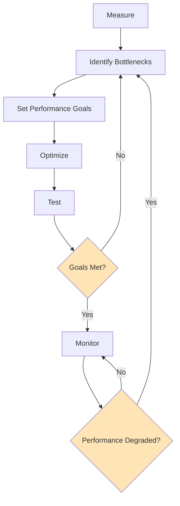
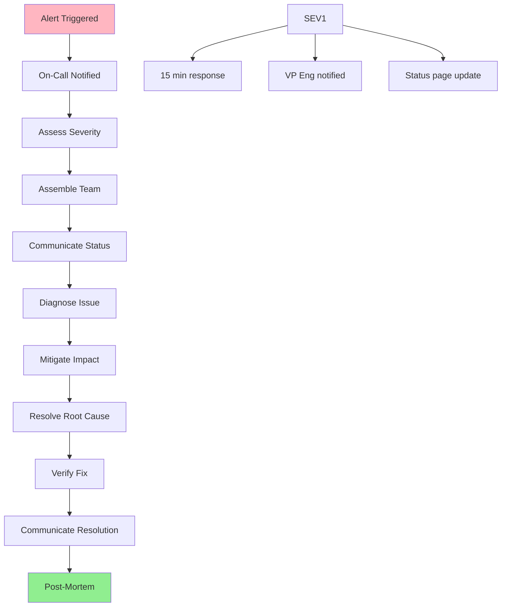
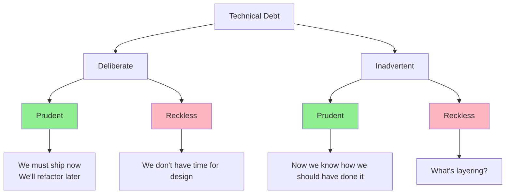
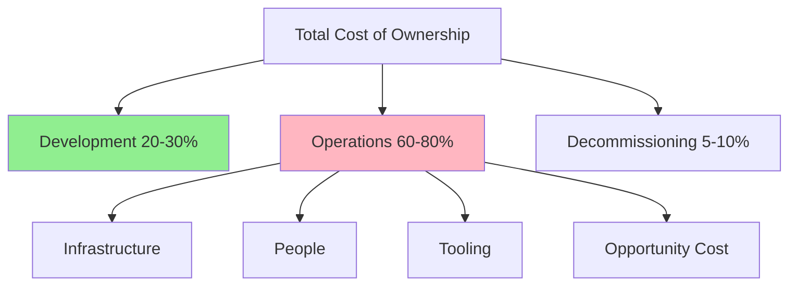
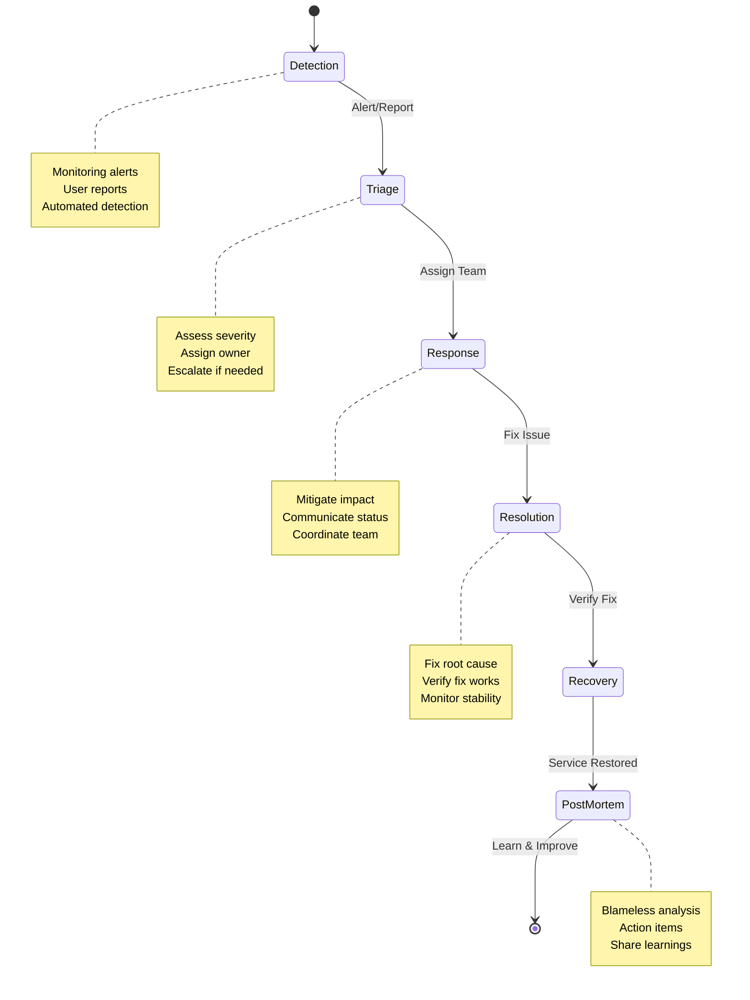
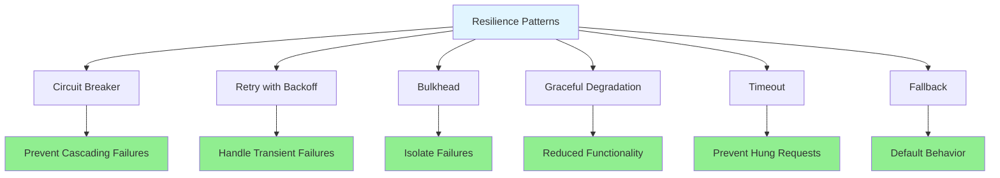
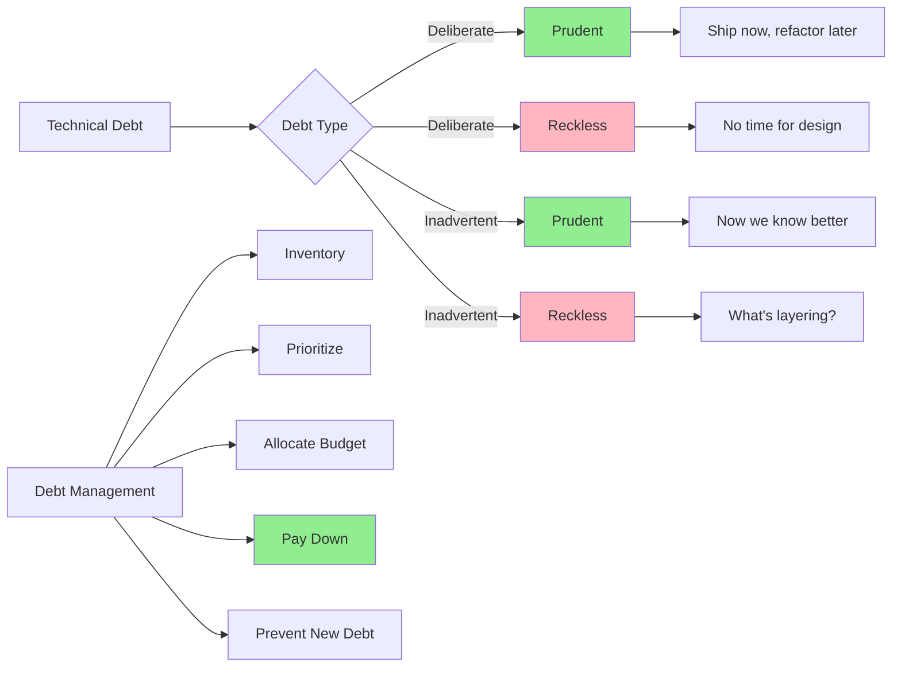
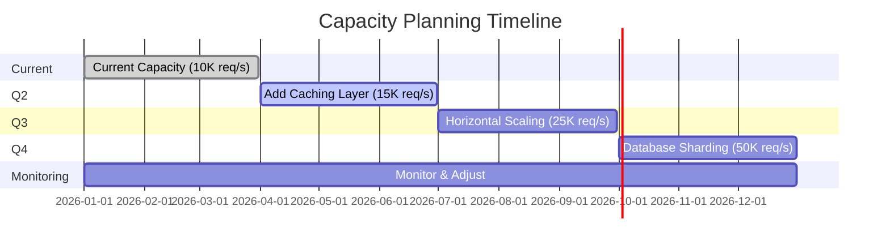

# Week 5: Safety, Sustainability, and Resilience - Complete Tutorial

**📚 InfoQ Certified Engineering Leadership Program**  
**⏱️ Estimated Reading Time:** 45-60 minutes  
**🎯 Difficulty Level:** Intermediate  
**📅 Last Updated:** January 2026

---

## Table of Contents

1. [Introduction & Overview](#introduction--overview)
2. [Prerequisites](#prerequisites)
3. [Learning Objectives](#learning-objectives)
4. [Core Concepts](#core-concepts)
5. [The Full Software System Lifecycle](#the-full-software-system-lifecycle)
6. [Capacity Planning and Performance](#capacity-planning-and-performance)
7. [Support and Operational Costs](#support-and-operational-costs)
8. [Incident Response and Management](#incident-response-and-management)
9. [System Resilience and Reliability](#system-resilience-and-reliability)
10. [Technical Sustainability](#technical-sustainability)
11. [Real-World Examples & Case Studies](#real-world-examples--case-studies)
12. [Mermaid Diagrams](#mermaid-diagrams)
13. [Common Pitfalls & Anti-Patterns](#common-pitfalls--anti-patterns)
14. [Best Practices](#best-practices)
15. [Practice Exercises](#practice-exercises)
16. [Question Bank](#question-bank)
17. [Test Your Understanding](#test-your-understanding)
18. [Common Interview Questions](#common-interview-questions)
19. [Troubleshooting Guide](#troubleshooting-guide)
20. [Performance Considerations](#performance-considerations)
21. [Security Considerations](#security-considerations)
22. [Summary & Key Takeaways](#summary--key-takeaways)
23. [Further Reading & Resources](#further-reading--resources)
24. [Capstone Project Guidelines](#capstone-project-guidelines)

---

## Introduction & Overview

The software development lifecycle does not end when the code is deployed. Maintenance and operational costs often dwarf the original development cost. This week covers the full picture of running a software system, including capacity planning, support and operational cost, and incident response. Most of the session goes to the capstone presentations.

> 💡 **Key Insight:** The true cost of software is not in building it—it's in running it. Maintenance and operations typically consume 60-80% of the total lifecycle cost.

### Why Safety, Sustainability, and Resilience Matter

**The Hidden Costs:**
- **60-80%** of total software cost is in maintenance and operations
- **80%** of outages are due to operational issues, not code bugs
- **70%** of technical debt comes from rushed decisions
- Average time to recover from major incidents: 1-4 hours

**The Business Impact:**
- Downtime costs: $5,600/minute (average)
- Reputation damage from outages
- Developer burnout from firefighting
- Technical debt slowing innovation
- Customer churn from poor reliability

### What This Week Covers

1. **Full Lifecycle Thinking:** From development to operations to decommissioning
2. **Capacity Planning:** Ensuring systems can handle load
3. **Operational Costs:** Understanding and managing ongoing costs
4. **Incident Response:** Preparing for and handling failures
5. **Resilience:** Building systems that withstand failures
6. **Sustainability:** Maintaining velocity over time
7. **Capstone Presentations:** Applying all five weeks of learning

---

## Prerequisites

Before starting this week's material, you should have:

- ✅ Completion of Week 1: Organizational Foundations
- ✅ Completion of Week 2: Technical Strategy
- ✅ Completion of Week 3: Technical Execution
- ✅ Completion of Week 4: Measurement and Accountability
- ✅ Understanding of system architecture and design
- ✅ Experience with production systems
- ✅ Basic understanding of operations and monitoring
- ✅ Experience with incidents or outages

**Recommended Background:**
- Experience with cloud platforms (AWS, GCP, Azure)
- Understanding of monitoring and observability
- Exposure to incident management
- Knowledge of capacity planning basics
- Experience with technical debt

---

## Learning Objectives

By the end of this week, you will be able to:

1. **Apply** full lifecycle thinking to software systems
2. **Plan** for capacity and scale effectively
3. **Estimate** and manage operational costs
4. **Design** incident response processes
5. **Build** resilient systems that withstand failures
6. **Manage** technical sustainability and debt
7. **Balance** innovation with operational stability
8. **Present** a comprehensive capstone project

---

## Core Concepts

### 1. The Full Software Lifecycle

**Traditional View:**
```
Design → Build → Test → Deploy → Done
```

**Real-World View:**
```
Design → Build → Test → Deploy → 
Operate → Monitor → Maintain → 
Improve → Decommission
```

**Lifecycle Cost Distribution:**
- **Development:** 20-30%
- **Operations & Maintenance:** 60-80%
- **Decommissioning:** 5-10%

**Implications:**
- Design for operations, not just development
- Invest in maintainability
- Plan for the long term
- Consider total cost of ownership

### 2. Safety, Sustainability, and Resilience

**Safety:**
- Protecting users and data
- Preventing harm
- Compliance and regulations
- Ethical considerations

**Sustainability:**
- Maintaining velocity over time
- Managing technical debt
- Preventing burnout
- Continuous improvement

**Resilience:**
- Ability to withstand failures
- Quick recovery from incidents
- Graceful degradation
- Fault tolerance

**The Three Pillars:**
```
Safety: "Do no harm"
Sustainability: "Maintain velocity"
Resilience: "Recover quickly"

Together: Systems that are safe to operate, 
          sustainable to maintain, and 
          resilient to failures
```

### 3. The Cost of Operations

**Operational Cost Categories:**

1. **Infrastructure Costs:**
   - Servers/cloud resources
   - Network bandwidth
   - Storage
   - CDN and third-party services

2. **People Costs:**
   - On-call and support
   - Operations team
   - Training and onboarding
   - Incident response

3. **Tooling Costs:**
   - Monitoring and observability
   - CI/CD pipelines
   - Security tools
   - Development tools

4. **Opportunity Costs:**
   - Time spent on operations vs. features
   - Technical debt interest
   - Firefighting vs. innovation
   - Recruitment and retention

**The 10x Rule:**
> "For every $1 spent on development, expect to spend $10 on operations over the system's lifetime."

### 4. Incident Response and Management

**Incident Lifecycle:**
```mermaid
stateDiagram-v2
    [*] --> Detection
    Detection --> Triage
    Triage --> Response
    Response --> Resolution
    Resolution --> Recovery
    Recovery --> Post-Mortem
    Post-Mortem --> [*]
    
    note right of Detection
        Monitoring alerts
        User reports
        Automated detection
    end note
    
    note right of Triage
        Assess severity
        Assign owner
        Escalate if needed
    end note
    
    note right of Response
        Mitigate impact
        Communicate status
        Coordinate team
    end note
    
    note right of Resolution
        Fix root cause
        Verify fix
        Monitor stability
    end note
    
    note right of Recovery
        Restore service
        Validate functionality
        Communicate resolution
    end note
    
    note right of Post-Mortem
        Blameless analysis
        Action items
        Share learnings
    end note
```

**Incident Severity Levels:**

| Severity | Impact | Response Time | Example |
|----------|--------|---------------|---------|
| **SEV1** | Critical - major outage | 15 minutes | Complete service down |
| **SEV2** | High - significant impact | 1 hour | Feature broken for many users |
| **SEV3** | Medium - limited impact | 4 hours | Minor feature broken |
| **SEV4** | Low - minimal impact | 24 hours | Cosmetic issue |

---

## The Full Software System Lifecycle

### Lifecycle Stages

#### Stage 1: Design and Architecture

**Considerations:**
- Operability from day one
- Monitoring and observability
- Scalability and performance
- Security and compliance
- Cost implications

**Design for Operations:**
- Health checks and monitoring endpoints
- Logging and tracing
- Metrics and dashboards
- Alerting and on-call
- Runbooks and documentation

#### Stage 2: Development

**Considerations:**
- Code quality and maintainability
- Testing (unit, integration, E2E)
- Documentation
- Security practices
- Performance considerations

**Sustainable Development Practices:**
- Code reviews
- Automated testing
- Continuous integration
- Technical debt management
- Knowledge sharing

#### Stage 3: Deployment

**Considerations:**
- Deployment automation
- Rollback procedures
- Feature flags
- Canary deployments
- Blue-green deployments

**Safe Deployment Practices:**
- Automated deployments
- Progressive rollout
- Monitoring during deployment
- Quick rollback capability
- Deployment windows

#### Stage 4: Operation

**Considerations:**
- Monitoring and alerting
- Incident response
- Performance optimization
- Capacity management
- Cost optimization

**Operational Excellence:**
- 24/7 monitoring
- On-call rotation
- Incident management
- Regular reviews
- Continuous improvement

#### Stage 5: Maintenance

**Considerations:**
- Bug fixes
- Security patches
- Dependency updates
- Performance tuning
- Technical debt reduction

**Maintenance Strategies:**
- Regular maintenance windows
- Automated patching
- Dependency management
- Refactoring sprints
- Technical debt tracking

#### Stage 6: Improvement

**Considerations:**
- Feature additions
- Performance improvements
- Architecture evolution
- Technology updates
- Technical debt paydown

**Sustainable Improvement:**
- 70-20-10 rule (maintain/improve/innovate)
- Regular tech debt sprints
- Innovation time
- Learning and development
- Process improvement

#### Stage 7: Decommissioning

**Considerations:**
- Data migration
- Service sunset
- Customer communication
- Cost savings
- Knowledge capture

**Decommissioning Process:**
- Plan early (6-12 months)
- Communicate with users
- Migrate data carefully
- Monitor during transition
- Celebrate and learn

---

## Capacity Planning and Performance

### Capacity Planning Fundamentals

**What is Capacity Planning?**
> The process of determining the production capacity needed by an organization to meet changing demands for its products or services.

**Key Questions:**
1. What is our current capacity?
2. How is demand growing?
3. When will we need more capacity?
4. What will it cost?
5. What are the risks of running out?

### Capacity Planning Process

#### Step 1: Measure Current Capacity

**Metrics to Collect:**
- CPU utilization
- Memory usage
- Disk I/O
- Network bandwidth
- Database connections
- Request throughput
- Response times

**Baseline Establishment:**
```
Current State:
- Peak CPU: 70%
- Peak Memory: 80%
- Max throughput: 10,000 req/s
- Average response time: 200ms
- Database connections: 500/1000

Capacity Headroom: 30%
```

#### Step 2: Forecast Demand

**Forecasting Methods:**

1. **Linear Growth:**
   ```
   Current: 10,000 users
   Growth: 1,000 users/month
   In 6 months: 16,000 users
   Capacity needed: 16,000 req/s
   ```

2. **Exponential Growth:**
   ```
   Current: 10,000 users
   Growth: 10%/month
   In 6 months: 17,711 users
   Capacity needed: 17,711 req/s
   ```

3. **Event-Based:**
   ```
   Normal: 10,000 req/s
   Black Friday: 100,000 req/s (10x)
   Capacity needed: 100,000 req/s
   ```

#### Step 3: Plan for Growth

**Capacity Planning Timeline:**

| Timeline | Action | Capacity |
|----------|--------|----------|
| **Now** | Current capacity | 10,000 req/s |
| **3 months** | Add caching layer | 15,000 req/s |
| **6 months** | Scale horizontally | 25,000 req/s |
| **12 months** | Database sharding | 50,000 req/s |

**Buffer Planning:**
- Always plan for 20-30% extra capacity
- Account for unexpected growth
- Consider seasonal variations
- Plan for marketing campaigns

#### Step 4: Monitor and Adjust

**Monitoring:**
- Real-time capacity metrics
- Trending and forecasting
- Alerts at 80% capacity
- Weekly capacity reviews

**Adjustment Triggers:**
- Sustained >70% utilization
- Response time degradation
- Increased error rates
- User complaints about performance

### Performance Optimization

**Performance Optimization Process:**



**Optimization Strategies:**

1. **Database Optimization:**
   - Indexing
   - Query optimization
   - Connection pooling
   - Caching
   - Read replicas

2. **Application Optimization:**
   - Caching (Redis, Memcached)
   - Async processing
   - Connection pooling
   - Lazy loading
   - Code optimization

3. **Infrastructure Optimization:**
   - Load balancing
   - Auto-scaling
   - CDN
   - Edge computing
   - Resource optimization

4. **Architecture Optimization:**
   - Microservices
   - Event-driven architecture
   - CQRS
   - Eventual consistency
   - Sharding

---

## Support and Operational Costs

### Understanding Operational Costs

**Total Cost of Ownership (TCO):**
```
TCO = Development Cost + 
      Operational Cost + 
      Opportunity Cost

Development: $500K (one-time)
Operational: $50K/month × 60 months = $3M
Opportunity: $100K (delayed features)
Total: $3.6M over 5 years
```

### Operational Cost Categories

#### 1. Infrastructure Costs

**Cloud Costs:**
- Compute (EC2, GCE, VMs)
- Storage (S3, databases)
- Network (bandwidth, CDN)
- Managed services (RDS, Kubernetes)

**Cost Optimization:**
- Right-sizing instances
- Auto-scaling
- Reserved instances
- Spot instances
- Storage tiering

**Example:**
```
Current: 10 large instances @ $500/month = $5,000/month
Optimized: 5 large + 10 small @ $300/month = $4,500/month
Savings: $500/month = $6,000/year
```

#### 2. People Costs

**On-Call and Support:**
- On-call rotation
- Incident response
- After-hours support
- Escalation management

**Operations Team:**
- SREs/DevOps engineers
- On-call compensation
- Training and certification
- Tools and software

**Cost Calculation:**
```
On-call: 5 engineers × $200/week = $1,000/week
Incidents: 2/month × 4 hours × $150/hour = $1,200/month
Operations team: 3 FTEs × $150K/year = $450K/year
Total: ~$600K/year
```

#### 3. Tooling Costs

**Monitoring and Observability:**
- Datadog, New Relic, Dynatrace
- Logging (Splunk, ELK)
- APM tools
- Alerting (PagerDuty, OpsGenie)

**CI/CD:**
- GitHub Actions, GitLab CI
- Build servers
- Artifact storage
- Deployment tools

**Security:**
- Security scanning
- Vulnerability management
- Compliance tools
- WAF and DDoS protection

**Total Tooling:**
- Monitoring: $2,000/month
- CI/CD: $500/month
- Security: $1,000/month
- Total: $3,500/month = $42K/year

#### 4. Opportunity Costs

**Technical Debt:**
- Interest on debt (slower development)
- Refactoring time
- Bug fixing
- Workarounds

**Firefighting:**
- Incident response
- Emergency fixes
- Context switching
- Burnout

**Innovation:**
- Delayed features
- Missed opportunities
- Competitive disadvantage

**Calculation:**
```
Technical debt interest: 20% slower development
Firefighting: 10 hours/week
Innovation delay: 3 months
Total opportunity cost: $200K/year
```

### Cost Management Strategies

#### Strategy 1: Right-Sizing

**Process:**
1. Monitor resource utilization
2. Identify over-provisioned resources
3. Right-size to actual needs
4. Monitor and adjust

**Example:**
```
Before: 20 large instances (50% utilization)
After: 10 large + 10 small (80% utilization)
Savings: 50% cost reduction
```

#### Strategy 2: Automation

**Automation Opportunities:**
- Automated deployments
- Auto-scaling
- Automated testing
- Automated incident response
- Automated cost optimization

**ROI:**
```
Manual deployment: 4 hours × $150/hour = $600/deploy
Automated: 15 minutes × $50/hour = $12.50/deploy
Savings: $587.50/deploy × 20 deploys/month = $11,750/month
```

#### Strategy 3: Managed Services

**Build vs. Buy:**
```
Build: 2 engineers × 3 months = $90K + ongoing maintenance
Buy: $5K/month = $60K/year

Break-even: 18 months
After that: Buy is cheaper
```

**When to Use Managed Services:**
- Not core competency
- High operational overhead
- Standard requirements
- Fast time-to-market needed

#### Strategy 4: Optimization

**Continuous Optimization:**
- Regular cost reviews (monthly)
- Identify waste
- Remove unused resources
- Optimize queries and code
- Improve efficiency

**Cost Optimization Culture:**
- Showback/chargeback
- Cost visibility
- Incentives for optimization
- Regular reviews

---

## Incident Response and Management

### Incident Management Framework

#### Preparation

**1. Incident Response Plan**
```markdown
# Incident Response Plan

## Severity Levels
- SEV1: Complete outage, <15 min response
- SEV2: Major impact, <1 hour response
- SEV3: Minor impact, <4 hours response
- SEV4: Cosmetic, <24 hours response

## Roles
- Incident Commander: Coordinates response
- Communications Lead: Updates stakeholders
- Technical Lead: Fixes the problem
- Subject Matter Experts: Provide expertise

## Communication
- Internal: Slack #incidents
- External: Status page, email
- Updates: Every 15 min (SEV1), 30 min (SEV2)

## Escalation
- SEV1: VP Engineering, CTO
- SEV2: Director, Engineering Manager
- SEV3: Team Lead
- SEV4: On-call engineer
```

**2. On-Call Rotation**
- 24/7 coverage
- Rotation schedule (weekly)
- Escalation paths
- Compensation and benefits
- Training and documentation

**3. Runbooks**
```
# Runbook: Database Connection Pool Exhausted

## Symptoms
- Error: "Connection pool exhausted"
- Increased latency
- Timeout errors

## Diagnosis
1. Check connection pool metrics
2. Check for connection leaks
3. Check for long-running queries
4. Check application logs

## Resolution
1. Restart application (immediate)
2. Fix connection leak (short-term)
3. Add connection pool monitoring (long-term)

## Verification
- Monitor connection pool metrics
- Check error rates
- Verify response times
```

**4. Monitoring and Alerting**
- Proactive monitoring
- Intelligent alerting (reduce noise)
- On-call tools (PagerDuty, OpsGenie)
- Escalation policies
- Alert fatigue prevention

#### Response

**Incident Response Process:**



**Response Best Practices:**
1. **Stay calm:** Panic wastes time
2. **Communicate:** Keep stakeholders informed
3. **Mitigate first:** Stop the bleeding
4. **Diagnose second:** Find root cause
5. **Document:** Timeline and actions
6. **Learn:** Post-mortem and improvements

#### Recovery

**Recovery Process:**
1. **Verify fix:** Is the issue resolved?
2. **Monitor:** Watch for recurrence
3. **Communicate:** Update all stakeholders
4. **Document:** What happened and what we did
5. **Follow up:** Post-mortem within 48 hours

**Recovery Time Objectives (RTO):**
- How quickly must we recover?
- SEV1: <1 hour
- SEV2: <4 hours
- SEV3: <24 hours
- SEV4: Next business day

**Recovery Point Objectives (RPO):**
- How much data can we lose?
- Critical systems: <5 minutes
- Important systems: <1 hour
- Standard systems: <24 hours

#### Post-Incident

**Blameless Post-Mortem:**
- What happened?
- Why did it happen?
- How do we prevent recurrence?
- What did we learn?

**Action Items:**
- Immediate fixes
- Process improvements
- Monitoring improvements
- Documentation updates
- Training needs

**Follow-Through:**
- Track action items to completion
- Review in next incident review
- Share learnings organization-wide
- Update runbooks and playbooks

---

## System Resilience and Reliability

### Resilience Engineering

**Definition:** The ability of a system to withstand and recover from failures.

**Resilience Principles:**
1. **Redundancy:** Multiple components for critical functions
2. **Diversity:** Different technologies/approaches
3. **Graceful Degradation:** Reduced functionality vs. complete failure
4. **Failover:** Automatic switching to backup systems
5. **Circuit Breakers:** Stop cascading failures
6. **Bulkheads:** Isolate failures
7. **Retries:** Handle transient failures
8. **Timeouts:** Prevent hung requests

### Resilience Patterns

#### Pattern 1: Circuit Breaker

**Purpose:** Prevent cascading failures

**How it Works:**
```
Normal: Requests flow through
Failure threshold reached: Circuit opens
Circuit open: Requests fail fast
Timeout period: Circuit half-opens
Success: Circuit closes
Failure: Circuit opens again
```

**Example:**
```python
class CircuitBreaker:
    def __init__(self, failure_threshold=5, timeout=60):
        self.failure_threshold = failure_threshold
        self.timeout = timeout
        self.failures = 0
        self.last_failure_time = None
        self.state = "CLOSED"  # CLOSED, OPEN, HALF-OPEN
    
    def call(self, func):
        if self.state == "OPEN":
            if time.time() - self.last_failure_time > self.timeout:
                self.state = "HALF-OPEN"
            else:
                raise CircuitBreakerOpenException()
        
        try:
            result = func()
            self.on_success()
            return result
        except Exception as e:
            self.on_failure()
            raise
    
    def on_success(self):
        self.failures = 0
        self.state = "CLOSED"
    
    def on_failure(self):
        self.failures += 1
        self.last_failure_time = time.time()
        if self.failures >= self.failure_threshold:
            self.state = "OPEN"
```

#### Pattern 2: Retry with Exponential Backoff

**Purpose:** Handle transient failures

**How it Works:**
```
Attempt 1: Immediate
Attempt 2: Wait 1 second
Attempt 3: Wait 2 seconds
Attempt 4: Wait 4 seconds
Max attempts: 5
```

**Example:**
```python
def retry_with_backoff(func, max_attempts=5, base_delay=1):
    for attempt in range(max_attempts):
        try:
            return func()
        except TransientException:
            if attempt < max_attempts - 1:
                delay = base_delay * (2 ** attempt)
                time.sleep(delay)
            else:
                raise
```

#### Pattern 3: Bulkhead

**Purpose:** Isolate failures

**How it Works:**
```
Thread Pool 1: Critical requests
Thread Pool 2: Important requests
Thread Pool 3: Background requests

If Thread Pool 1 is exhausted,
Thread Pools 2 and 3 still work
```

**Example:**
```java
// Separate thread pools for different request types
ExecutorService criticalPool = Executors.newFixedThreadPool(10);
ExecutorService normalPool = Executors.newFixedThreadPool(20);
ExecutorService backgroundPool = Executors.newFixedThreadPool(5);

// Critical requests use critical pool
// If pool is full, requests are rejected
// But normal and background still work
```

#### Pattern 4: Graceful Degradation

**Purpose:** Provide reduced functionality vs. complete failure

**Example:**
```
Normal: Full product recommendations
Degraded: Popular products only
Fallback: Static best-sellers list

Normal: Real-time pricing
Degraded: Cached pricing (5 min old)
Fallback: Default pricing
```

### Reliability Engineering

**Site Reliability Engineering (SRE):**
- Google's approach to reliability
- Software engineering applied to operations
- Automation over manual work
- Error budgets
- SLIs, SLOs, SLAs

**SLI (Service Level Indicator):**
- What you measure
- Examples: Availability, latency, throughput

**SLO (Service Level Objective):**
- Target for SLI
- Example: 99.9% availability

**SLA (Service Level Agreement):**
- Contract with users
- Example: 99.9% uptime or refund

**Error Budget:**
```
SLO: 99.9% availability
= 43.2 minutes downtime/month
Error Budget: 43.2 minutes

If we've used 40 minutes:
- High risk of missing SLO
- Slow down releases
- Focus on reliability

If we've used 10 minutes:
- Plenty of budget
- Can take risks
- Fast releases
```

---

## Technical Sustainability

### Managing Technical Debt

**What is Technical Debt?**
> Technical debt is the implied cost of additional rework caused by choosing an easy (limited) solution now instead of using a better approach that would take longer.

**Types of Technical Debt:**

1. **Deliberate Debt:**
   - "We'll fix it later"
   - Conscious trade-off
   - Time-to-market pressure

2. **Accidental Debt:**
   - "We didn't know better"
   - Lack of experience
   - Evolving requirements

3. **Bit Rot:**
   - Gradual degradation
   - Multiple changes over time
   - No one understands the system

**Technical Debt Quadrant:**


### Technical Debt Management

#### Identifying Technical Debt

**Signs of Technical Debt:**
- Code is hard to understand
- Changes take longer than expected
- High bug rate
- Frequent production issues
- Developers avoid certain areas
- Onboarding takes a long time

**Debt Assessment:**
```
Area: Payment processing
Debt Level: High
Impact: High (critical system)
Interest: 30% slower development
Payoff: 2 months refactoring
Recommendation: Prioritize in next quarter
```

#### Managing Technical Debt

**Debt Management Strategies:**

1. **Debt Inventory:**
   - Document all technical debt
   - Assess impact and interest
   - Prioritize by payoff

2. **Debt Budget:**
   - Allocate 20% time to debt reduction
   - Debt sprints (quarterly)
   - Include in planning

3. **Debt Prevention:**
   - Code reviews
   - Automated testing
   - Refactoring as you go
   - Design reviews

4. **Debt Communication:**
   - Make debt visible
   - Communicate to stakeholders
   - Show impact on velocity
   - Get buy-in for payoff

**The 70-20-10 Rule:**
- **70%** Maintenance and operations
- **20%** Technical debt reduction
- **10%** Innovation and new features

### Sustainable Development

**Sustainable Pace:**
- 40-hour work weeks
- No chronic overtime
- Work-life balance
- Prevent burnout

**Sustainable Practices:**
1. **Code Quality:**
   - Clean code principles
   - Refactoring
   - Code reviews
   - Automated testing

2. **Knowledge Sharing:**
   - Documentation
   - Pair programming
   - Tech talks
   - Mentoring

3. **Team Health:**
   - Regular 1:1s
   - Team retrospectives
   - Workload management
   - Career development

4. **Process Improvement:**
   - Regular retrospectives
   - Experimentation
   - Automation
   - Tooling investment

---

## Real-World Examples & Case Studies

### Case Study 1: Google's SRE Model

**Context:** Google needed to scale operations while maintaining reliability.

**Approach:**
- Hire software engineers for operations (SREs)
- 50% time on operations, 50% on engineering
- Error budgets
- Automation first
- Toil reduction

**Key Practices:**
- Error budgets (50% error budget = 50% development speed)
- Toil tracking (<50% time on toil)
- Automation (if a human does it twice, automate it)
- Blameless post-mortems
- Capacity planning

**Results:**
- 99.99% availability
- Fast innovation
- Sustainable operations
- High team satisfaction

**Lesson:** Invest in operations as a first-class engineering discipline.

### Case Study 2: Amazon's Two-Pizza Teams and Ownership

**Context:** Amazon needed to scale while maintaining ownership.

**Approach:**
- Small, autonomous teams
- You build it, you run it
- Clear metrics and accountability
- Internal customers

**Key Practices:**
- Teams own services end-to-end
- On-call rotation for each team
- Clear SLAs and metrics
- Regular operational reviews
- Investment in tooling

**Results:**
- High ownership
- Fast incident response
- Continuous improvement
- Innovation at scale

**Lesson:** Ownership drives accountability and quality.

### Case Study 3: Netflix's Chaos Engineering

**Context:** Netflix needed to ensure resilience in AWS.

**Approach:**
- Embrace failure
- Chaos engineering (Simian Army)
- Automated failure injection
- Build resilience through practice

**Key Practices:**
- Chaos Monkey (kill instances)
- Chaos Kong (kill entire regions)
- Chaos Gorilla (AZ failures)
- Automated recovery testing
- Game days

**Results:**
- High resilience
- Fast recovery
- Confidence in cloud
- Minimal impact from failures

**Lesson:** Practice failure to build resilience.

### Case Study 4: GitHub's Incident Response Maturity

**Context:** GitHub experienced major incidents and improved their response.

**Approach:**
- Invest in incident response
- Blameless post-mortems
- Clear communication
- Continuous improvement

**Key Practices:**
- Severity levels
- Incident commanders
- Regular drills
- Public post-mortems
- Action item tracking

**Results:**
- Faster incident response
- Fewer severe incidents
- Better communication
- Learning culture

**Lesson:** Incident response is a skill that improves with practice.

---

## Mermaid Diagrams

### Diagram 1: Software Lifecycle Cost Distribution



### Diagram 2: Incident Response Process



### Diagram 3: Resilience Patterns



### Diagram 4: Technical Debt Management



### Diagram 5: Capacity Planning Timeline



---

## Common Pitfalls & Anti-Patterns

### Anti-Pattern 1: Build-It-and-Forget-It

**Problem:** Focusing only on building, not operating.

**Symptoms:**
- No monitoring
- No runbooks
- No on-call rotation
- Surprise when things break
- Firefighting culture

**Solution:**
- Design for operations from day one
- Invest in monitoring and observability
- Create runbooks and documentation
- Establish on-call rotation
- Plan for maintenance

### Anti-Pattern 2: Premature Optimization

**Problem:** Optimizing before understanding actual bottlenecks.

**Symptoms:**
- Complex architecture for problems that don't exist
- Wasted engineering time
- Reduced maintainability
- No measurable improvement

**Solution:**
- Measure first
- Optimize based on data
- Start simple
- Optimize when needed
- Balance performance with maintainability

### Anti-Pattern 3: Ignoring Technical Debt

**Problem:** Accumulating debt without paying it down.

**Symptoms:**
- Development slows down
- More bugs
- Hard to make changes
- Developer frustration
- High turnover

**Solution:**
- Track technical debt
- Allocate time for payoff (20% rule)
- Refactor as you go
- Communicate impact to stakeholders
- Regular debt sprints

### Anti-Pattern 4: No Incident Response Plan

**Problem:** Reacting to incidents without a plan.

**Symptoms:**
- Chaos during incidents
- No clear ownership
- Slow response times
- Poor communication
- Repeat incidents

**Solution:**
- Create incident response plan
- Define severity levels
- Establish on-call rotation
- Create runbooks
- Practice with drills

### Anti-Pattern 5: Over-Engineering for Scale

**Problem:** Building for scale you don't need.

**Symptoms:**
- Complex architecture
- Long development time
- High operational cost
- No actual users yet

**Solution:**
- Start simple
- Scale when needed
- Measure before optimizing
- YAGNI (You Aren't Gonna Need It)
- Iterate based on actual needs

### Anti-Pattern 6: Hero Culture

**Problem:** Relying on heroes to save the day.

**Symptoms:**
- Same person always fixing issues
- No documentation
- No process improvement
- Burnout
- Single point of failure

**Solution:**
- Build processes, not heroes
- Document everything
- Automate repetitive work
- Share knowledge
- Rotate on-call

---

## Best Practices

### 1. Design for Operations

**Principles:**
- Observability from day one
- Health checks and monitoring
- Logging and tracing
- Metrics and dashboards
- Runbooks and documentation

**Checklist:**
- [ ] Health check endpoints
- [ ] Structured logging
- [ ] Key metrics defined
- [ ] Alerts configured
- [ ] Runbooks written
- [ ] On-call rotation established

### 2. Plan for Capacity

**Process:**
1. Measure current capacity
2. Forecast demand
3. Plan for growth
4. Monitor and adjust

**Best Practices:**
- Plan 6-12 months ahead
- Build in 20-30% buffer
- Monitor continuously
- Auto-scale when possible
- Regular capacity reviews

### 3. Manage Operational Costs

**Strategies:**
- Right-sizing
- Automation
- Managed services
- Optimization

**Cost Visibility:**
- Showback/chargeback
- Cost dashboards
- Regular reviews
- Optimization incentives

### 4. Build Resilience

**Patterns:**
- Circuit breakers
- Retries with backoff
- Bulkheads
- Graceful degradation
- Timeouts
- Fallbacks

**Testing:**
- Chaos engineering
- Failure injection
- Game days
- Load testing

### 5. Manage Technical Debt

**Strategies:**
- Debt inventory
- Debt budget (20% time)
- Refactor as you go
- Regular debt sprints
- Communicate impact

**Prioritization:**
- High interest, high impact: Pay immediately
- High interest, low impact: Plan for next quarter
- Low interest, high impact: Plan for next year
- Low interest, low impact: Accept or defer

### 6. Practice Incident Response

**Preparation:**
- Incident response plan
- On-call rotation
- Runbooks
- Monitoring and alerting

**Response:**
- Stay calm
- Communicate
- Mitigate first
- Document everything

**Follow-Through:**
- Blameless post-mortems
- Action items
- Share learnings
- Update runbooks

### 7. Ensure Sustainability

**Practices:**
- Sustainable pace (40 hours/week)
- Code quality
- Knowledge sharing
- Team health
- Continuous improvement

**Metrics:**
- Developer satisfaction
- Turnover rate
- Onboarding time
- Code quality
- Technical debt

### 8. Balance Innovation and Stability

**The 70-20-10 Rule:**
- **70%** Maintenance and operations
- **20%** Technical debt reduction
- **10%** Innovation

**Implementation:**
- Protect innovation time
- Plan for maintenance
- Invest in automation
- Celebrate both stability and innovation

---

## Practice Exercises

### Exercise 1: Capacity Planning

**Objective:** Create a capacity plan for a growing system.

**Instructions:**
1. Choose a system you're familiar with.
2. Document current capacity metrics.
3. Forecast growth for next 12 months.
4. Create capacity plan with milestones.
5. Identify when to scale and how.
6. Calculate costs.

**Sample Solution:**

**System:** E-commerce platform

**Current Capacity:**
- Requests: 10,000 req/s peak
- Database: 5,000 connections
- Storage: 10 TB
- Bandwidth: 1 Gbps

**Growth Forecast:**
- Current: 100K users
- Growth: 10K users/month
- In 12 months: 220K users
- Expected load: 22,000 req/s

**Capacity Plan:**

| Timeline | Capacity | Action | Cost |
|----------|----------|--------|------|
| **Now** | 10K req/s | Current state | $5K/month |
| **3 months** | 15K req/s | Add caching layer | +$1K/month |
| **6 months** | 25K req/s | Scale horizontally | +$3K/month |
| **9 months** | 35K req/s | Database optimization | +$2K/month |
| **12 months** | 50K req/s | Database sharding | +$5K/month |

**Monitoring:**
- Alert at 70% capacity
- Review monthly
- Adjust based on actual growth

### Exercise 2: Incident Response Plan

**Objective:** Create an incident response plan for your team.

**Instructions:**
1. Define severity levels
2. Create roles and responsibilities
3. Establish communication channels
4. Create runbooks for top 3 incidents
5. Define escalation paths
6. Plan post-incident process

**Sample Solution:**

**Severity Levels:**
- SEV1: Complete outage, <15 min response
- SEV2: Major impact, <1 hour response
- SEV3: Minor impact, <4 hours response
- SEV4: Cosmetic, <24 hours response

**Roles:**
- Incident Commander: Coordinates response
- Technical Lead: Fixes the problem
- Communications Lead: Updates stakeholders

**Communication:**
- Internal: Slack #incidents
- External: Status page
- Updates: Every 15 min (SEV1), 30 min (SEV2)

**Runbooks:**
1. Database connection pool exhausted
2. High error rate
3. Performance degradation

**Escalation:**
- SEV1: VP Engineering, CTO
- SEV2: Director, Engineering Manager
- SEV3: Team Lead
- SEV4: On-call engineer

### Exercise 3: Technical Debt Management

**Objective:** Create a technical debt management plan.

**Instructions:**
1. Inventory technical debt in your system
2. Assess impact and interest for each item
3. Prioritize debt for payoff
4. Create debt budget
5. Plan debt reduction sprints
6. Define prevention strategies

**Sample Solution:**

**Debt Inventory:**

| Area | Debt Level | Impact | Interest | Payoff Time | Priority |
|------|-----------|--------|----------|-------------|----------|
| Payment processing | High | High | 30% | 2 months | P0 |
| User authentication | Medium | High | 20% | 1 month | P1 |
| Reporting system | High | Low | 10% | 3 months | P2 |
| Admin dashboard | Low | Medium | 5% | 2 weeks | P3 |

**Debt Budget:**
- 20% of engineering time
- 1 debt sprint per quarter (2 weeks)
- $50K allocated for debt reduction

**Payoff Plan:**
- Q1: Payment processing (P0)
- Q2: User authentication (P1)
- Q3: Reporting system (P2)
- Q4: Admin dashboard (P3)

**Prevention:**
- Code reviews
- Automated testing
- Design reviews
- Refactoring as you go

---

## Question Bank

### Multiple Choice Questions (1-30)

1. What percentage of total software cost is typically in operations and maintenance?
   - A) 20-30%
   - B) 40-50%
   - C) 60-80%
   - D) 90-100%
   - **Answer: C**

2. What is capacity planning?
   - A) Hiring more people
   - B) Determining production capacity needed to meet demand
   - C) Buying more servers
   - D) Optimizing code
   - **Answer: B**

3. What is the 10x rule in software?
   - A) Development is 10x faster than operations
   - B) For every $1 on development, expect $10 on operations
   - C) Operations cost 10x more than development
   - D) Maintenance takes 10x longer than development
   - **Answer: B**

4. What is a circuit breaker pattern?
   - A) Electrical safety device
   - B) Prevents cascading failures
   - C) Stops all requests
   - D) Load balancer
   - **Answer: B**

5. What is technical debt?
   - A) Money owed for software licenses
   - A) Implied cost of rework from quick solutions
   - C) Unpaid invoices
   - D) Budget overruns
   - **Answer: B**

6. What is graceful degradation?
   - A) System performance decreases over time
   - B) Provide reduced functionality vs. complete failure
   - C) Code quality degrades
   - D) Server performance drops
   - **Answer: B**

7. What is an SLI?
   - A) Service Level Indicator - what you measure
   - B) Service Level Interface
   - C) System Level Integration
   - D) Software License Agreement
   - **Answer: A**

8. What is an SLO?
   - A) Service Level Objective - target for SLI
   - B) Service Level Operation
   - C) System Level Objective
   - D) Software License Obligation
   - **Answer: A**

9. What is an error budget?
   - A) Budget for fixing errors
   - B) Allowed downtime based on SLO
   - C) Emergency fund
   - D) Bug bounty budget
   - **Answer: B**

10. What is the purpose of a blameless post-mortem?
    - A) Find someone to blame
    - B) Learn from failures to prevent recurrence
    - C) Document what happened
    - D) Assign responsibility
    - **Answer: B**

11. What is chaos engineering?
    - A) Random code changes
    - B) Injecting failures to test resilience
    - C) Unplanned deployments
    - D) Disorganized operations
    - **Answer: B**

12. What is the 70-20-10 rule?
    - A) Code coverage target
    - B) 70% maintain, 20% debt reduction, 10% innovation
    - C) Bug severity distribution
    - D) Team composition
    - **Answer: B**

13. What is a runbook?
    - A) A book about running
    - B) Step-by-step guide for operations
    - C) Exercise manual
    - D) Documentation standard
    - **Answer: B**

14. What is RTO?
    - A) Recovery Time Objective - how quickly to recover
    - B) Recovery Time Operation
    - C) Required Time of Operation
    - D) Response Time Objective
    - **Answer: A**

15. What is RPO?
    - A) Recovery Point Objective - how much data can be lost
    - B) Recovery Point Operation
    - C) Required Point of Operation
    - D) Response Point Objective
    - **Answer: A**

16. What is toil in SRE?
    - A) Hard work
    - B) Manual, repetitive, automatable work
    - C) Overtime
    - D) Difficult tasks
    - **Answer: B**

17. What is the purpose of auto-scaling?
    - A) Reduce costs
    - B) Automatically adjust capacity based on load
    - C) Speed up deployment
    - D) Improve code quality
    - **Answer: B**

18. What is a SEV1 incident?
    - A) Minor bug
    - B) Critical outage requiring immediate response
    - C) Feature request
    - D) Documentation issue
    - **Answer: B**

19. What is the purpose of circuit breakers?
    - A) Stop all traffic
    - B) Prevent cascading failures
    - C) Speed up requests
    - D) Reduce costs
    - **Answer: B**

20. What is technical sustainability?
    - A) Green computing
    - B) Maintaining velocity over time
    - C) Long-term planning
    - D) Energy efficiency
    - **Answer: B**

21. What is the bulkhead pattern?
    - A) Ship component
    - B) Isolate failures to prevent spread
    - C) Load balancer
    - D) Firewall
    - **Answer: B**

22. What is exponential backoff?
    - A) Exponential growth
    - B) Increasing wait time between retries
    - C) Exponential decay
    - D) Rapid retries
    - **Answer: B**

23. What is the purpose of monitoring?
    - A) Watch users
    - B) Detect issues and measure system health
    - C) Track employee productivity
    - D) Security surveillance
    - **Answer: B**

24. What is a post-mortem?
    - A) Autopsy
    - B) Analysis after an incident to learn and improve
    - C) Performance review
    - D) Project closure
    - **Answer: B**

25. What is the goal of capacity planning?
    - A) Minimize costs
    - B) Ensure sufficient capacity for demand
    - C) Maximize utilization
    - D) Reduce infrastructure
    - **Answer: B**

26. What is the 10x rule in software costs?
    - A) Development is 10x faster
    - B) Operations cost 10x more than development
    - C) Code grows 10x
    - D) Users grow 10x
    - **Answer: B**

27. What is the purpose of on-call rotation?
    - A) Work overtime
    - B) Ensure 24/7 coverage for incidents
    - C) Train new employees
    - D) Reduce costs
    - **Answer: B**

28. What is deliberate technical debt?
    - A) Accidental mistakes
    - B) Conscious trade-off for speed
    - C) Poor code quality
    - D) Legacy systems
    - **Answer: B**

29. What is the purpose of error budgets?
    - A) Budget for fixing errors
    - B) Balance reliability and innovation
    - C) Track bug fixes
    - D) Allocate resources
    - **Answer: B**

30. What is the goal of resilience engineering?
    - A) Prevent all failures
    - B) Build systems that withstand and recover from failures
    - C) Reduce costs
    - D) Speed up development
    - **Answer: B**

### True/False Questions (31-40)

31. Operations and maintenance typically cost more than development. (True)
32. Capacity planning is only needed for large systems. (False - all systems need it)
33. Technical debt is always bad. (False - can be strategic)
34. Incident response plans are optional. (False - essential)
35. Chaos engineering helps build resilience. (True)
36. The 70-20-10 rule allocates time for innovation. (True)
37. Monitoring is only needed in production. (False - needed in all environments)
38. Blameless post-mortems assign fault to systems, not people. (True)
39. Auto-scaling reduces operational costs. (True)
40. Technical debt should always be paid off immediately. (False - prioritize based on impact)

### Fill-in-the-Blank Questions (41-50)

41. ________ and maintenance typically consume 60-80% of total software cost. (Operations)
42. ________ planning ensures systems can handle future demand. (Capacity)
43. A ________ breaker prevents cascading failures. (circuit)
44. ________ engineering injects failures to test resilience. (Chaos)
45. ________ debt is the implied cost of rework from quick solutions. (Technical)
46. ________ degradation provides reduced functionality vs. complete failure. (Graceful)
47. An ________ budget balances reliability and innovation. (error)
48. A ________ post-mortem analyzes failures without blame. (blameless)
49. ________ with exponential backoff handles transient failures. (Retry)
50. The ________ rule allocates 70% to maintenance, 20% to debt, 10% to innovation. (70-20-10)

### Scenario-Based Questions (51-60)

51. **Scenario:** Your system is experiencing rapid user growth. What do you do?
    - **Answer:** Implement capacity planning. Measure current capacity, forecast growth, plan scaling actions (caching, horizontal scaling, database optimization), monitor continuously, and adjust as needed.

52. **Scenario:** A critical production incident occurs. How do you respond?
    - **Answer:** Follow incident response plan: assess severity, assemble team, communicate status, mitigate impact first, then fix root cause, verify fix, communicate resolution, conduct blameless post-mortem.

53. **Scenario:** Your team is accumulating technical debt. What do you do?
    - **Answer:** Create debt inventory, assess impact and interest, prioritize payoff, allocate 20% time for debt reduction, communicate to stakeholders, refactor as you go, prevent new debt.

54. **Scenario:** You need to improve system resilience. What patterns do you use?
    - **Answer:** Implement circuit breakers, retries with backoff, bulkheads, graceful degradation, timeouts, and fallbacks. Test with chaos engineering. Monitor and improve continuously.

55. **Scenario:** How do you balance innovation and operational stability?
    - **Answer:** Use 70-20-10 rule: 70% maintenance, 20% debt reduction, 10% innovation. Use error budgets to balance reliability and innovation. Protect innovation time.

56. **Scenario:** Your operational costs are too high. How do you reduce them?
    - **Answer:** Right-size resources, automate repetitive work, use managed services, optimize continuously, implement showback/chargeback, and create cost visibility.

57. **Scenario:** You need to plan for Black Friday traffic (10x normal). What do you do?
    - **Answer:** Capacity planning: load test to 10x capacity, add caching, scale horizontally, implement auto-scaling, prepare runbooks, conduct game days, monitor closely during event.

58. **Scenario:** The same person always fixes production issues. What's wrong?
    - **Answer:** Hero culture. Solution: Build processes, document runbooks, automate repetitive work, rotate on-call, share knowledge, build team capability.

59. **Scenario:** How do you measure operational excellence?
    - **Answer:** Track MTTR, incident frequency, deployment success rate, on-call load, toil percentage, team satisfaction, and operational costs. Review regularly and improve.

60. **Scenario:** Your system needs to be available 99.99% of the time. What does this mean?
    - **Answer:** Maximum 52.56 minutes downtime per year, 4.38 minutes per month. Requires redundancy, failover, monitoring, incident response, and high availability architecture.

---

## Test Your Understanding

1. What percentage of total software cost is in operations and maintenance?
2. What is capacity planning and why is it important?
3. What is the 10x rule?
4. What are the main categories of operational costs?
5. What is technical debt and why does it matter?
6. What is the 70-20-10 rule?
7. What is resilience engineering?
8. What are the key resilience patterns?
9. What is the incident response lifecycle?
10. What is a blameless post-mortem?
11. What is chaos engineering?
12. What is the difference between SLI, SLO, and SLA?
13. What is an error budget?
14. What is graceful degradation?
15. What is a circuit breaker pattern?
16. What is RTO and RPO?
17. What is toil in SRE?
18. What is sustainable pace?
19. What is a runbook?
20. How do you manage technical debt?

---

## Common Interview Questions

1. **Q:** How do you approach capacity planning?
   **A:** I measure current capacity, forecast demand based on growth trends, plan scaling actions with buffers (20-30%), implement monitoring and alerts, and review regularly. I plan 6-12 months ahead and auto-scale where possible.

2. **Q:** What is technical debt and how do you manage it?
   **A:** Technical debt is the implied cost of rework from quick solutions. I manage it by maintaining a debt inventory, assessing impact and interest, prioritizing payoff, allocating 20% time for debt reduction, and communicating impact to stakeholders.

3. **Q:** How do you handle production incidents?
   **A:** I follow a structured process: assess severity, assemble team, communicate status, mitigate impact first, fix root cause, verify fix, communicate resolution, and conduct blameless post-mortem with action items.

4. **Q:** What is resilience engineering and how do you apply it?
   **A:** Resilience engineering builds systems that withstand and recover from failures. I apply patterns like circuit breakers, retries, bulkheads, and graceful degradation. I test with chaos engineering and practice failure injection.

5. **Q:** Describe a time you improved operational excellence.
   **A:** [STAR method] We had frequent incidents and slow response times. I implemented incident response plan with severity levels, created runbooks, established on-call rotation, and conducted regular drills. Result: MTTR reduced 60%, incidents decreased 40%.

6. **Q:** How do you balance innovation and operational stability?
   **A:** I use the 70-20-10 rule: 70% maintenance, 20% debt reduction, 10% innovation. I use error budgets to balance reliability and innovation. I protect innovation time while ensuring operational stability.

7. **Q:** What is the true cost of software?
   **A:** Development is only 20-30% of total cost. Operations and maintenance are 60-80%. This includes infrastructure, people, tooling, and opportunity costs. The 10x rule: expect to spend $10 on operations for every $1 on development.

8. **Q:** How do you reduce operational costs?
   **A:** I right-size resources, automate repetitive work, use managed services when appropriate, optimize continuously, implement cost visibility (showback/chargeback), and create cost optimization culture.

9. **Q:** What is chaos engineering and why is it important?
   **A:** Chaos engineering injects failures to test resilience. It's important because it builds confidence in system reliability, uncovers hidden weaknesses, and prepares teams for real failures. Netflix's Chaos Monkey is a famous example.

10. **Q:** How do you ensure sustainable development velocity?
    **A:** I manage technical debt (20% time), maintain sustainable pace (40 hours/week), invest in automation, practice knowledge sharing, conduct regular retrospectives, and focus on code quality. Sustainable velocity requires investment in quality and team health.

---

## Troubleshooting Guide

### Issue 1: Frequent Production Incidents

**Symptoms:**
- Multiple incidents per week
- Long MTTR
- Firefighting culture
- Team burnout

**Root Causes:**
- Poor monitoring
- No incident response plan
- Technical debt
- Insufficient testing
- Hero culture

**Solutions:**
1. Implement monitoring and alerting
2. Create incident response plan
3. Conduct blameless post-mortems
4. Address technical debt
5. Improve testing
6. Build processes, not heroes

### Issue 2: Can't Keep Up with Growth

**Symptoms:**
- Performance degradation
- Capacity issues
- User complaints
- System instability

**Root Causes:**
- No capacity planning
- Insufficient monitoring
- Poor architecture
- Lack of optimization

**Solutions:**
1. Implement capacity planning
2. Monitor continuously
3. Optimize based on data
4. Scale horizontally/vertically
5. Add caching
6. Consider architecture changes

### Issue 3: High Operational Costs

**Symptoms:**
- Budget overruns
- Low ROI
- Cost complaints
- Resource waste

**Root Causes:**
- Over-provisioning
- No cost visibility
- Manual processes
- No optimization

**Solutions:**
1. Right-size resources
2. Automate repetitive work
3. Use managed services
4. Implement cost visibility
5. Regular cost reviews
6. Optimization incentives

### Issue 4: Technical Debt Slowing Development

**Symptoms:**
- Slower velocity
- More bugs
- Hard to change
- Developer frustration

**Root Causes:**
- No debt management
- Rushed decisions
- No refactoring
- Lack of planning

**Solutions:**
1. Create debt inventory
2. Allocate 20% time for debt
3. Prioritize high-interest debt
4. Refactor as you go
5. Communicate impact
6. Regular debt sprints

### Issue 5: Team Burnout

**Symptoms:**
- Long hours
- High turnover
- Low morale
- Decreased productivity

**Root Causes:**
- Too much operational work
- No work-life balance
- Firefighting culture
- Unrealistic expectations

**Solutions:**
1. Sustainable pace (40 hours/week)
2. Automate operational work
3. Improve operational stability
4. Hire more people
5. Rotate on-call
6. Address root causes

---

## Performance Considerations

### Efficient Operations

**Time Investment:**
- Monitoring setup: 2-4 weeks
- Incident response planning: 1-2 weeks
- Runbook creation: 1-2 weeks
- Ongoing operations: 10-20 hours/week
- Post-mortems: 2-4 hours per incident

**ROI of Good Operations:**
- Reduced incidents
- Faster MTTR
- Lower operational costs
- Higher team satisfaction
- Better customer experience

**Optimization Tips:**
1. Automate everything
2. Monitor continuously
3. Learn from incidents
4. Invest in tooling
5. Build capability

### Measuring Operational Performance

**Key Metrics:**
- **Availability:** Uptime percentage
- **MTTR:** Mean time to recover
- **MTBF:** Mean time between failures
- **Incident frequency:** Incidents per month
- **On-call load:** Hours per week
- **Toil percentage:** Manual work percentage
- **Operational cost:** $ per month

**Benchmarks:**
- Elite: 99.99% uptime, <1 hour MTTR, <1 incident/month
- High: 99.9% uptime, <4 hours MTTR, <2 incidents/month
- Medium: 99.5% uptime, <1 day MTTR, <4 incidents/month

---

## Security Considerations

### Security in Operations

**Security Monitoring:**
- Security incidents
- Vulnerability scanning
- Intrusion detection
- Access logs
- Compliance monitoring

**Security in Incident Response:**
- Security incident response plan
- Forensics capability
- Evidence preservation
- Communication protocols
- Regulatory reporting

**Operational Security:**
- Access control
- Secrets management
- Network security
- Encryption
- Regular security audits

**Security and Resilience:**
- Security incidents as resilience test
- Incident response for security events
- Recovery from security breaches
- Lessons learned from security incidents

---

## Summary & Key Takeaways

### Core Concepts Mastered

1. **Full Lifecycle Thinking:** Operations and maintenance are 60-80% of total cost
2. **Capacity Planning:** Plan for growth, monitor continuously, scale proactively
3. **Operational Costs:** Understand and manage infrastructure, people, tooling, and opportunity costs
4. **Incident Response:** Prepare, respond, recover, learn
5. **Resilience:** Build systems that withstand and recover from failures
6. **Technical Debt:** Inventory, prioritize, allocate budget, pay down, prevent
7. **Sustainability:** Maintain velocity over time through quality and team health

### Action Items for This Week

**Immediate (This Week):**
- [ ] Document current operational costs
- [ ] Create incident response plan
- [ ] Write runbooks for top 3 incidents
- [ ] Assess technical debt

**Short-term (Next 2 Weeks):**
- [ ] Implement capacity monitoring
- [ ] Establish on-call rotation
- [ ] Conduct first blameless post-mortem
- [ ] Create debt reduction plan

**Long-term (Next Month):**
- [ ] Full operational excellence program
- [ ] Regular incident drills
- [ ] Technical debt reduction sprint
- [ ] Capacity planning process

### Key Insights

> 💡 **The true cost of software is in operations, not development.** Plan and budget accordingly.

> 💡 **Design for operations from day one.** Monitoring, runbooks, and on-call are not afterthoughts.

> 💡 **Incidents are opportunities to learn.** Blameless post-mortems build resilience.

> 💡 **Technical debt is a loan with interest.** Manage it deliberately or it will slow you down.

> 💡 **Sustainability requires investment.** 20% time for debt reduction maintains velocity.

---

## Further Reading & Resources

### Books
1. **"Site Reliability Engineering"** by Google - The SRE handbook
2. **"The Phoenix Project"** by Gene Kim - DevOps novel
3. **"Accelerate"** by Nicole Forsgren - DevOps metrics
4. **"Release It!"** by Michael Nygard - Production-ready software
5. **"The DevOps Handbook"** by Gene Kim - DevOps practices
6. **"Chaos Engineering"** by Casey Rosenthal - Resilience testing
7. **"Technical Debt"** by Ipek Ozkaya - Managing debt

### Articles & Papers
1. [Google SRE Book](https://sre.google/sre-book/) - Free online
2. [The 10x Rule](https://www.gartner.com/en/documents/1314026) - TCO analysis
3. [Chaos Engineering](https://principlesofchaos.org/) - Principles
4. [Technical Debt Quadrant](https://martinfowler.com/bliki/TechnicalDebtQuadrant.html) - Martin Fowler
5. [Blameless Post-Mortems](https://sre.google/sre-book/postmortem-culture/) - Google SRE

### Videos & Talks
1. **"The Future of SRE"** by Google
2. **"Chaos Engineering"** by Netflix
3. **"Technical Debt"** by Ward Cunningham
4. **"Accelerate"** by Nicole Forsgren
5. **"The Phoenix Project"** by Gene Kim

### Tools & Frameworks
1. **Monitoring:** Datadog, New Relic, Grafana, Prometheus
2. **Incident Management:** PagerDuty, OpsGenie, StatusPage
3. **Chaos Engineering:** Chaos Monkey, Gremlin, Chaos Blade
4. **Capacity Planning:** CloudWatch, Grafana, Custom dashboards
5. **Cost Management:** AWS Cost Explorer, GCP Cost Management

### Templates
1. **Incident Response Plan** - Comprehensive incident management
2. **Blameless Post-Mortem Template** - Incident analysis
3. **Runbook Template** - Operational procedures
4. **Capacity Planning Template** - Growth planning
5. **Technical Debt Register** - Debt tracking

### Communities & Forums
1. **SRE Weekly** - Site reliability engineering
2. **/r/sre** - SRE community
3. **DevOps Enterprise Summit** - DevOps conferences
4. **LeadDev** - Engineering leadership
5. **SREcon** - SRE conferences

---

## 📝 Capstone Project Guidelines

**The capstone is introduced in Week 1 and built throughout the program. The deliverable is a 20-minute group presentation followed by a peer discussion. End on a privacy or security question your group is still working out.**

### Capstone Requirements

**Presentation Structure (20 minutes):**
1. **Problem Definition** (3 min)
   - Business problem you're addressing
   - Why it matters
   - Impact and urgency

2. **Organizational Analysis** (3 min)
   - Westrum culture assessment
   - Informal vs. formal structure
   - Key stakeholders and influencers

3. **Technical Strategy** (4 min)
   - Systems thinking analysis
   - Proposed solution
   - Trade-offs and rejected options
   - Success metrics

4. **Execution Plan** (4 min)
   - Risk-driven approach
   - Top 5 risks and mitigations
   - Delegation plan
   - Timeline

5. **Measurement Framework** (3 min)
   - Success metrics (outcomes, behaviors, knowledge, participation)
   - Baselines and targets
   - How you'll know you're wrong

6. **Operations and Sustainability** (2 min)
   - Capacity planning
   - Operational costs
   - Incident response
   - Technical debt management

7. **Privacy/Security Question** (1 min)
   - Open question your group is still working through
   - Prompt peer discussion

### Capstone Evaluation Criteria

**Content (40%):**
- Problem clearly defined and quantified
- Comprehensive organizational analysis
- Sound technical strategy with explicit trade-offs
- Risk-driven execution plan
- Measurement framework with leading/lagging indicators
- Operations and sustainability considerations

**Presentation (30%):**
- Clear and engaging delivery
- Effective use of time
- Visual aids (slides, diagrams)
- Answers to questions
- Peer discussion facilitation

**Integration (30%):**
- Applies all 5 weeks of learning
- Shows progression and depth
- Real-world applicability
- Thoughtful privacy/security question
- Actionable recommendations

### Capstone Tips

**Do:**
- Start early (Week 1)
- Apply frameworks from each week
- Use real data and examples
- Practice your presentation
- Engage the audience
- Be honest about challenges

**Don't:**
- Wait until Week 5
- Focus only on technology
- Ignore social aspects
- Over-promise
- Avoid difficult questions
- Make it theoretical

---

**🎯 Congratulations!** You've completed the InfoQ Certified Engineering Leadership Program. You now have a comprehensive toolkit for leading engineering teams, developing technical strategy, executing effectively, measuring success, and building sustainable, resilient systems.

**💪 Remember:** Leadership is a journey, not a destination. Keep learning, keep practicing, and keep improving.

---

*End of Week 5: Safety, Sustainability, and Resilience*